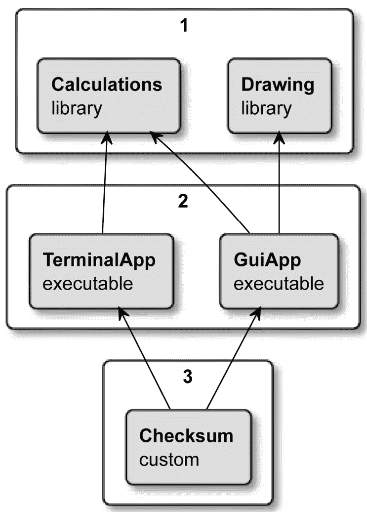
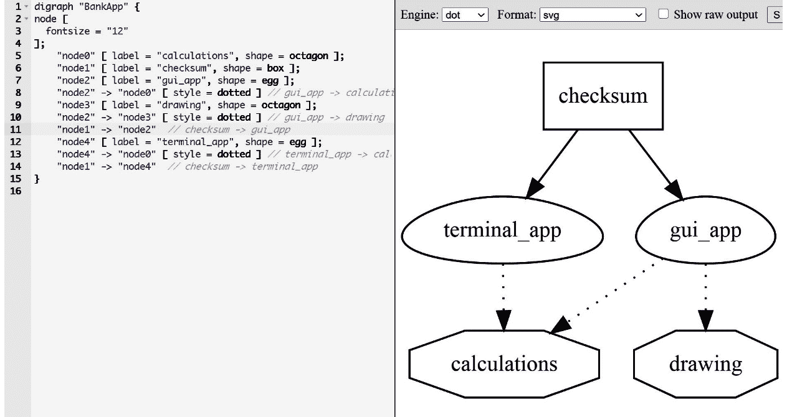
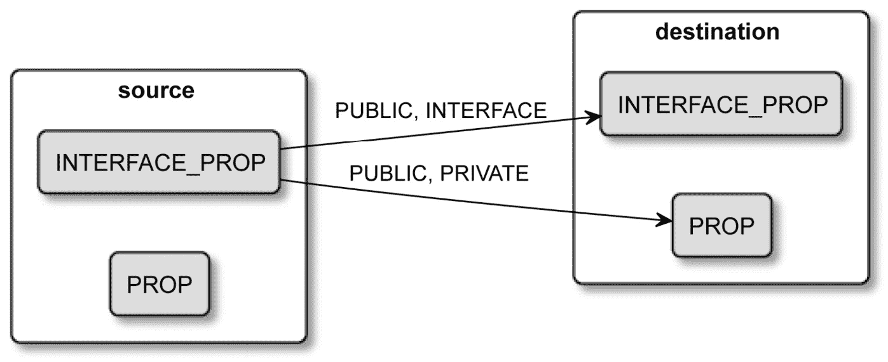
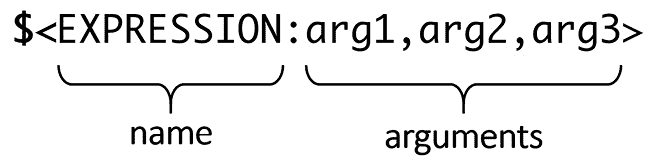

# 第四章：使用目标

在 CMake 中，我们可以构建的最基本目标是一个单一的二进制可执行文件，它包含了一个完整的应用程序。它可以由单一片源代码组成，如经典的`helloworld.cpp`。或者它可以更复杂——由数百个甚至数千个文件构建而成。这就是许多初学者项目的外观——用一个源文件创建一个二进制文件，再添加另一个，在不知不觉中，一切都被链接到一个没有结构可言的二进制文件中。

作为软件开发者，我们故意划设定界线，并将组件指定为将一个或多个翻译单元（`.cpp`文件）分组在一起。我们这样做有多个原因：增加代码的可读性，管理耦合和 connascence，加快构建过程，最后，提取可重用的组件。

每一个足够大的项目都会推动你引入某种形式的分区。CMake 中的目标正是为了解决这个问题——一个高级逻辑单元，为 CMake 形成一个单一目标。一个目标可能依赖于其他目标，它们以声明性方式生成。CMake 将负责确定目标需要以什么顺序构建，然后逐个执行必要的步骤。作为一个一般规则，构建一个目标将生成一个 artifact，这个 artifact 将被输送到其他目标中，或作为构建的最终产品交付。

我故意使用不确切的词汇*artifact*，因为 CMake 并没有限制你只能生成可执行文件或库。实际上，我们可以使用生成的构建系统来创建许多类型的输出：更多的源文件、头文件、*对象文件*、归档文件和配置文件——任何真正需要的。我们需要的只是一个命令行工具（如编译器）、可选的输入文件和一个输出路径。

目标是一个非常强大的概念，极大地简化了项目的构建。理解它们如何工作以及如何以最优雅、最清洁的方式配置它们是关键。

在本章中，我们将涵盖以下主要主题：

+   目标概念

+   编写自定义命令

+   理解生成器表达式

# 技术要求

您可以在 GitHub 上找到本章中存在的代码文件，地址为[`github.com/PacktPublishing/Modern-CMake-for-Cpp/tree/main/examples/chapter04`](https://github.com/PacktPublishing/Modern-CMake-for-Cpp/tree/main/examples/chapter04)。

要构建本书中提供的示例，始终使用推荐的命令：

```cpp
cmake -B <build tree> -S <source tree>
cmake --build <build tree>
```

请确保将占位符`<build tree>`和`<source tree>`替换为适当的路径。作为提醒：**build tree**是目标/输出目录的路径，**source tree**是源代码所在的位置路径。

# 目标概念

如果你曾经使用过 GNU Make，你已经看到了目标的概念。本质上，它是一个构建系统用来将一组文件编译成另一个文件的食谱。它可以是一个`.cpp`实现文件编译成一个`.o`*对象文件*，一组`.o`文件打包成一个`.a`静态库，还有许多其他组合。

CMake 允许你节省时间并跳过那些食谱的中间步骤；它在更高的抽象级别上工作。它理解如何直接从源文件构建可执行文件。所以，你不需要编写显式的食谱来编译任何*对象文件*。所需的就是一个`add_executable()`命令，带有可执行目标的名字和要作为其元素的文件列表：

```cpp
add_executable(app1 a.cpp b.cpp c.cpp)
```

我们在之前的章节中已经使用了这个命令，并且我们已经知道如何在实践中使用可执行目标——在生成步骤中，CMake 将创建一个构建系统并为其填充编译每个源文件并将它们链接在一起成一个单一的二进制可执行文件的食谱。

在 CMake 中，我们可以使用三个命令之一创建一个目标：

+   `add_executable()`

+   `add_library()`

+   `add_custom_target()`

前两个相对容易解释；我们已经在之前的章节中简要使用过它们来构建可执行文件和库（我们将在第五章深入讨论它们，*使用 CMake 编译 C++源代码*）。但那些自定义目标是什么？

它们允许你指定自己的命令行，该命令行将被执行*而不检查产生的输出是否是最新的*，例如：

+   计算其他二进制文件的校验和。

+   运行代码净化器并收集结果。

+   将编译报告发送到数据处理管道。

以下是`add_custom_target()`命令的完整签名：

```cpp
add_custom_target(Name [ALL] [command1 [args1...]]
                  [COMMAND command2 [args2...] ...]
                  [DEPENDS depend depend depend ... ]
                  [BYPRODUCTS [files...]]
                  [WORKING_DIRECTORY dir]
                  [COMMENT comment]
                  [JOB_POOL job_pool]
                  [VERBATIM] [USES_TERMINAL]
                  [COMMAND_EXPAND_LISTS]
                  [SOURCES src1 [src2...]])
```

我们不会在这里讨论每一个选项，因为我们想快速继续其他目标，但可以说自定义目标不必一定以文件形式产生有形工件。

自定义目标的一个好用例可能是需要在每次构建时删除特定文件的需求——例如，确保代码覆盖报告不包含过时数据。我们只需要像这样定义一个自定义目标：

```cpp
add_custom_target(clean_stale_coverage_files 
          COMMAND find . -name "*.gcda" -type f -delete)
```

之前的命令将搜索所有具有`.gcda`扩展名的文件并将它们删除。但是有一个问题；与可执行文件和库目标不同，自定义目标只有在它们被添加到依赖图时才会构建。我们来了解一下那是怎么回事。

## 依赖图

成熟的应用程序通常由许多组件组成，我这里不是指外部依赖。具体来说，我指的是内部库。从结构上讲，将它们添加到项目中是有用的，因为相关的事物被包装在单一的逻辑实体中。并且它们可以与其他目标链接——另一个库或一个可执行文件。当多个目标使用同一个库时，这尤其方便。看看*图 4.1*，它描述了一个示例依赖关系图：



图 4.1 – BankApp 项目中依赖关系的构建顺序

在这个项目中，我们有两个库，两个可执行文件和一个自定义目标。我们的用例是提供一个带有漂亮 GUI 的用户银行应用程序（**GuiApp**），以及一个作为自动化脚本一部分的命令行版本（**TerminalApp**）。两个可执行文件都依赖于同一个**Calculations**库，但只有其中一个需要**Drawing**库。为了确保我们的应用程序在用户从互联网下载时没有被修改，我们将计算一个校验和，将其存储在文件中，并通过单独的安全渠道分发它。CMake 在编写此类解决方案的列表文件方面相当灵活：

chapter04/01-targets/CMakeLists.txt

```cpp
cmake_minimum_required(VERSION 3.19.2)
project(BankApp CXX)
add_executable(terminal_app terminal_app.cpp)
add_executable(gui_app gui_app.cpp)
target_link_libraries(terminal_app calculations)
target_link_libraries(gui_app calculations drawing)
add_library(calculations calculations.cpp)
add_library(drawing drawing.cpp)
add_custom_target(checksum ALL
    COMMAND sh -c "cksum terminal_app>terminal.ck"
    COMMAND sh -c "cksum gui_app>gui.ck"
    BYPRODUCTS terminal.ck gui.ck
    COMMENT "Checking the sums..."
)
```

我们使用`target_link_libraries()`命令将库和可执行文件连接起来。没有它，可执行文件的编译会失败，因为存在未定义的符号。你注意到我们在这个命令在实际上声明了任何库之前就调用了吗？当 CMake 配置项目时，它会收集有关目标和它们属性的信息——它们的名称、依赖关系、源文件和其他详细信息。

在解析完所有文件后，CMake 将尝试构建一个依赖关系图。和所有有效的依赖关系图一样，它们都是有向无环图。这意味着有一个明确的方向，即哪个目标依赖于哪个目标，并且这样的依赖关系不能形成循环。

当我们以构建模式执行`cmake`时，生成的构建系统将检查我们定义了哪些顶层目标，并递归地构建它们的依赖关系。让我们考虑一下来自*图 4.1*的例子：

1.  从顶部开始，为组 1 构建两个库。

1.  当**Calculations**和**Drawing**库完成后，构建组 2——**GuiApp**和**TerminalApp**。

1.  构建一个校验和目标；运行指定的命令行生成校验和（`cksum`是一个 Unix 校验和工具）。

不过有一个小问题——前面的解决方案并不能保证校验和目标在可执行文件之后构建。CMake 不知道校验和依赖于可执行二进制文件的存在，所以它可以先开始构建它。为了解决这个问题，我们可以把`add_dependencies()`命令放在文件的末尾：

```cpp
add_dependencies(checksum terminal_app gui_app)
```

这将确保 CMake 理解 Checksum 目标与可执行文件之间的关系。

很好，但`target_link_libraries()`和`add_dependencies()`之间有什么区别？第一个是用来与实际库一起使用，并允许你控制属性传播。第二个仅适用于顶级目标以设置它们的构建顺序。

随着项目复杂性的增加，依赖树变得越来越难以理解。我们如何简化这个过程？

## 可视化依赖关系

即使小型项目也难以推理和与其他开发人员共享。最简单的方法之一是通过一个好的图表。毕竟，一张图片胜过千言万语。我们可以自己动手绘制图表，就像我在*图 4.1*中做的那样。但这很繁琐，并且需要不断更新。幸运的是，CMake 有一个很好的模块，可以在`dot/graphviz`格式中生成依赖图。而且它支持内部和外部依赖！

要使用它，我们可以简单地执行这个命令：

```cpp
cmake --graphviz=test.dot .
```

该模块将生成一个文本文件，我们可以将其导入到 Graphviz 可视化软件中，该软件可以渲染图像或生成 PDF 或 SVG 文件，作为软件文档的一部分。每个人都喜欢伟大的文档，但几乎没有人喜欢创建它——现在，你不需要！

如果你急于求成，甚至可以直接从你的浏览器中运行 Graphviz，地址如下：

[`dreampuf.github.io/GraphvizOnline/`](https://dreampuf.github.io/GraphvizOnline/)

重要说明

自定义目标默认是不可见的，我们需要创建一个特殊的配置文件`CMakeGraphVizOptions.cmake`，它将允许我们自定义图表。一个方便的自定义命令是`set(GRAPHVIZ_CUSTOM_TARGETS TRUE)`；将其添加到特殊配置文件中以在您的图表中启用报告自定义目标。您可以在模块的文档中找到更多选项。

你只需要将`test.dot`文件的内容复制并粘贴到左侧窗口中，你的项目就会被可视化。非常方便，不是吗？



图 4.2 —— 使用 Graphviz 可视化的 BankApp 示例

为了清晰起见，我已经从前面的图中移除了自动生成的图例部分。

使用这种方法，我们可以快速查看所有明确定义的目标。现在我们有了这个全局视角，让我们深入了解一下如何配置它们。

## 目标属性

目标具有类似于 C++对象字段的工作方式属性。我们可以修改其中的一些属性，而其他属性是只读的。CMake 定义了一个大量的“已知属性”（参见*进一步阅读*部分），这些属性取决于目标类型（可执行文件、库或自定义）。如果你愿意，你也可以添加你自己的属性。使用以下命令来操作目标属性：

```cpp
get_target_property(<var> <target> <property-name>)
set_target_properties(<target1> <target2> ...
                      PROPERTIES <prop1-name> <value1>
                      <prop2-name> <value2> ...)
```

为了在屏幕上打印目标属性，我们首先需要将其存储在`<var>`变量中，然后将其传递给用户；我们必须一个一个地读取它们。另一方面，为目标设置属性允许我们同时指定多个属性，在多个目标上。

属性概念不仅限于目标；CMake 也支持设置其他范围属性的：`GLOBAL`、`DIRECTORY`、`SOURCE`、`INSTALL`、`TEST`和`CACHE`。为了操作各种各样的属性，有通用的`get_property()`和`set_property()`命令。你可以使用这些底层命令来做与`set_target_properties()`命令完全相同的事情，只是需要更多的工作：

```cpp
set_property(TARGET <target> PROPERTY <name> <value>)
```

通常，尽可能使用许多高级命令是更好的。CMake 提供更多这些，甚至范围更窄，例如为目标设置特定属性。例如，`add_dependencies(<target> <dep>)`是在`MANUALLY_ADDED_DEPENDENCIES`目标属性上添加依赖项。在这种情况下，我们可以用`get_target_property()`查询它，就像查询任何其他属性一样。然而，我们不能用`set_target_property()`来更改它（它是只读的），因为 CMake 坚持使用`add_dependencies()`命令来限制操作只是添加。

在接下来的章节中讨论编译和链接时，我们将介绍更多的属性设置命令。同时，让我们关注一个目标的属性如何传递到另一个目标。

## 传递使用要求是什么？

我们姑且同意命名是困难的，有时最终得到的结果很难理解。“传递使用要求”不幸之一，那些你在在线 CMake 文档中遇到的神秘标题。让我们解开这个奇怪的名字，也许提出一个更容易理解的术语。

我将先澄清这个谜题的中间部分。正如我们之前讨论的，一个目标可能依赖于另一个目标。CMake 文档有时将这种依赖性称为*使用*，即一个目标*使用*另一个目标。这很简单，所以继续下一个。

有时，这样的使用目标必须满足一些特定的*要求*：链接一些库，包含一个目录，或者需要特定的编译特性。所有这些都是要求，所以在某种意义上文档是正确的。问题是，在文档的其他任何上下文中，它们都不被称为要求。当你为一个单一目标指定同样的要求时，你设置*属性*或*依赖项*。因此，名称的最后部分也许应该简单地称为“属性”。

最后一个是–*传递的*。我相信这是正确的（也许有点太聪明了）。CMake 将在使用它们的目标的某些属性/要求附加到使用它们的目标的属性上。你可以说是有些属性可以隐式地传递（或简单地传播）跨目标，所以更容易表达依赖关系。

简化这个概念，我认为这就像是*传播属性*，在*源目标*（被使用的目标）和*目标目标*（使用其他目标的目标）之间。

让我们通过一个具体的例子来了解它为什么存在以及它是如何工作的：

```cpp
target_compile_definitions(<source> <INTERFACE|PUBLIC|PRIVATE> [items1...])
```

这个目标命令将填充`<source>`目标的`COMPILE_DEFINITIONS`属性。编译定义仅仅是传递给编译器的`-Dname=definition`标志，用于配置 C++预处理器定义（我们将在第五章，*使用 CMake 编译 C++源代码*中讨论这个）。这里有趣的部分是第二个参数。我们需要指定三个值之一，`INTERFACE`，`PUBLIC`或`PRIVATE`，以控制属性应该传递给哪些目标。现在，不要将这些与 C++访问修饰符混淆——这完全是另一回事。

传播关键字按如下方式工作：

+   `PRIVATE` 用于设置源目标属性。

+   `INTERFACE` 用于设置目标目标属性。

+   `PUBLIC` 用于设置源目标和目标目标属性。

当一个属性不应该传递给任何目标目标时，将其设置为`PRIVATE`。当需要这样的传递时，选择`PUBLIC`。如果你处于这样的情况，源目标在其实现中（`.cpp`文件）不使用属性，只在头文件中使用，并且这些被传递给消费者目标，那么`INTERFACE`就是答案。

这个机制是如何工作的呢？为了管理这些属性，CMake 提供了一些命令，比如前面提到的`target_compile_definitions()`。当你指定一个`PRIVATE`或`PUBLIC`关键字时，CMake 将在与命令匹配的目标属性中存储提供的值——在这个例子中，是`COMPILE_DEFINITIONS`。另外，如果关键字是`INTERFACE`或`PUBLIC`，它将在带有`INTERFACE_`前缀的属性中存储值——`INTERFACE_COMPILE_DEFINITIONS`。在配置阶段，CMake 将读取源目标的对接口属性并将它们的内容附加到目标目标。就这样——传播属性，或者按 CMake 的说法，传递使用要求。

在 CMake 3.20 中，有 12 个这样的属性通过适当的命令（如`target_link_options()`）或直接通过`set_target_properties()`命令进行管理：

+   `AUTOUIC_OPTIONS`

+   `COMPILE_DEFINITIONS`

+   `COMPILE_FEATURES`

+   `COMPILE_OPTIONS`

+   `INCLUDE_DIRECTORIES`

+   `LINK_DEPENDS`

+   `LINK_DIRECTORIES`

+   `LINK_LIBRARIES`

+   `LINK_OPTIONS`

+   `POSITION_INDEPENDENT_CODE`

+   `PRECOMPILE_HEADERS`

+   `SOURCES`

我们将在接下来的页面中讨论这些选项的大部分，但请记住，所有这些选项当然都在 CMake 手册中有描述。在以下 URL 格式（将`<PROPERTY>`替换为你感兴趣的属性）的页面中找到它们：

`https://cmake.org/cmake/help/latest/prop_tgt/<PROPERTY>.html`

接下来的问题是这种传播到底有多远。属性只设置在第一个目的地目标上，还是发送到依赖图的顶部？实际上，您可以决定。

为了创建目标之间的依赖关系，我们使用`target_link_libraries()`命令。这个命令的完整签名需要一个传播关键词：

```cpp
target_link_libraries(<target>
                     <PRIVATE|PUBLIC|INTERFACE> <item>...
                    [<PRIVATE|PUBLIC|INTERFACE> <item>...]...)
```

正如你所看到的，这个签名也指定了传播关键词，但这个关键词控制着源目标中的属性在目的目标中的存储位置。*图 4.3* 展示了在生成阶段（在配置阶段完成后）传播属性会发生什么：



图 4.3 – 属性如何传播到目标目标

传播关键词是这样工作的：

+   `PRIVATE`将源值附加到目的地的*私有*属性。

+   `INTERFACE`将源值追加到目的地的*接口*属性。

+   `PUBLIC`追加到目的地的两个属性。

正如我们之前讨论的，接口属性只用于将属性传播到链的更低层，目的目标在构建过程中不会使用它们。

我们之前使用的基本的`target_link_libraries(<target> <item>...)`命令隐式地指定了`PUBLIC`关键词。

如果您正确地为您的源目标设置了传播关键词，属性将自动放置在目的目标上——除非有冲突…

## 处理冲突的传播属性

当一个目标依赖于多个其他目标时，可能会出现传播属性彼此之间直接冲突的情况。比如说，一个使用目标将`POSITION_INDEPENDENT_CODE`属性设置为`true`，而另一个设置为`false`。CMake 理解这是一个冲突，并将打印一个类似于这样的错误：

```cpp
CMake Error: The INTERFACE_POSITION_INDEPENDENT_CODE property of "source_target2" does not agree with the value of POSITION_INDEPENDENT_CODE already determined for "destination_target".
```

收到这样的消息很有用，因为我们明确知道我们引入了这场冲突，我们需要解决它。CMake 有自己的属性，这些属性必须在源目标和目标目标之间“一致”。

在少数情况下，这可能变得很重要——例如，如果您在构建使用相同库的多个目标，然后将它们链接到一个单一的可执行文件。如果这些源目标使用不同版本的同一库，您可能会遇到问题。

为了确保我们只使用同一个具体版本，我们可以创建一个自定义接口属性`INTERFACE_LIB_VERSION`，并将版本存储在那里。这不足以解决问题，因为 CMake 默认不会传播自定义属性。我们必须明确地将自定义属性添加到“兼容”属性的列表中。

每个目标都有四个这样的列表：

+   `COMPATIBLE_INTERFACE_BOOL`

+   `COMPATIBLE_INTERFACE_STRING`

+   `COMPATIBLE_INTERFACE_NUMBER_MAX`

+   `COMPATIBLE_INTERFACE_NUMBER_MIN`

将你的属性添加到其中的一个，将触发传播和兼容性检查。`BOOL`列表将检查传播到目标目标的所有属性是否评估为相同的布尔值。类似地，`STRING`将评估为字符串。`NUMBER_MAX`和`NUMBER_MIN`有点不同——传播的值不必匹配，但目标目标将只是接收最高或最低的值。

这个示例将帮助我们理解如何在实践中应用这一点：

chapter04/02-propagated/CMakeLists.txt

```cpp
cmake_minimum_required(VERSION 3.20.0)
project(PropagatedProperties CXX)
add_library(source1 empty.cpp)
set_property(TARGET source1 PROPERTY INTERFACE_LIB_VERSION
   4)
set_property(TARGET source1 APPEND PROPERTY
 COMPATIBLE_INTERFACE_STRING LIB_VERSION
)
add_library(source2 empty.cpp)
set_property(TARGET source2 PROPERTY INTERFACE_LIB_VERSION
   4)
add_library(destination empty.cpp)
target_link_libraries(destination source1 source2)
```

在这里我们创建了三个目标；为了简单起见，所有这些都使用了同一个空源文件。在两个源目标上，我们用`INTERFACE_`前缀指定了我们的自定义属性。并将它们设置为相同的匹配库版本。两个源目标都被链接到目标目标。最后，我们为`source1`指定了一个`STRING`兼容性要求作为属性（这里我们没有添加`INTERFACE_`前缀）。

CMake 会将这个自定义属性传播到目标目标，并检查所有源目标的版本是否完全匹配（兼容性属性可以设置在一个目标上）。

既然我们已经了解了目标是什么，那么让我们来看看其他看起来像目标、闻起来像目标、有时表现得像目标的东西，但最终发现，它们并不是真正的目标。

## 介绍伪目标

目标的概念如此有用，以至于如果能够将其一些行为借鉴到其他事物上也很好。具体来说，这些事物不是构建系统的输出，而是输入——外部依赖项、别名等等。这些都是伪目标，或者没有包含在生成的构建系统中的目标。

### 导入的目标

如果你浏览了目录，你知道我们将讨论 CMake 如何管理外部依赖项——其他项目、库等等。`IMPORTED`目标本质上就是这一过程的产物。CMake 可以通过`find_package()`命令定义它们。

你可以调整此类目标的目标属性：*编译定义*、*编译* *选项*、*包含目录*等——并且它们甚至支持传递性使用要求。然而，你应该将它们视为不可变的；不要更改它们的源代码或依赖关系。

`IMPORTED`目标定义的范围可以是全局的或局部的（在定义它的目录中可见，但在父目录中不可见）。

### 别名目标

别名目标正好做了你应该期望的事情——它们以不同的名称创建了另一个目标引用。您可以使用以下命令为可执行文件和库创建别名目标：

```cpp
add_executable(<name> ALIAS <target>)
add_library(<name> ALIAS <target>)
```

别名目标的属性是只读的，并且你不能安装或导出别名（它们在生成的构建系统中不可见）。

那么，为什么要有别名呢？它们在某些场景中非常有用，比如一个项目的某个部分（如子目录）需要一个具有特定名称的目标，而实际实现可能根据情况不同而有不同的名称。例如，你可能希望构建一个随解决方案一起分发的库，或者根据用户的选择来导入它。

### 接口库

这是一个有趣的构造——一个不编译任何内容而是作为工具目标的库。它的整个概念都是围绕传播属性（传递使用要求）构建的。

接口库有两个主要用途——代表仅头文件的库，以及将一堆传播属性捆绑到单个逻辑单元中。

使用`add_library(INTERFACE)`可以相对容易地创建仅头文件库：

```cpp
add_library(Eigen INTERFACE 
  src/eigen.h src/vector.h src/matrix.h
)
target_include_directories(Eigen INTERFACE
  $<BUILD_INTERFACE:${CMAKE_CURRENT_SOURCE_DIR}/src>
  $<INSTALL_INTERFACE:include/Eigen>
)
```

在前面的片段中，我们创建了一个包含三个头文件的 Eigen 接口库。接下来，使用生成表达式（在本章最后部分解释），我们将其*包含目录*设置为当目标导出时为`${CMAKE_CURRENT_SOURCE_DIR}/src`，安装时为`include/Eigen`（这将在本章最后解释）。

要使用这样的库，我们只需要链接它：

```cpp
target_link_libraries(executable Eigen)
```

这里实际上并不发生链接，但 CMake 会理解这个命令为一个请求，将所有的`INTERFACE`属性传播到`executable`目标。

第二个用例正好利用了相同的机制，但目的不同——它创建了一个逻辑目标，可以作为传播属性的占位符。我们随后可以用这个目标作为其他目标依赖，并以一种清晰、方便的方式设置属性。这是一个例子：

```cpp
add_library(warning_props INTERFACE)
target_compile_options(warning_props INTERFACE 
  -Wall -Wextra -Wpedantic
) 
target_link_libraries(executable warning_props)
```

`add_library(INTERFACE)`命令创建了一个逻辑`warning_props`目标，用于在第二个命令中设置*编译选项*在`executable`目标上。我建议使用这些`INTERFACE`目标，因为它们可以提高代码的可读性和可重用性。把它看作是将一串魔法值重构为命名良好的变量。我还建议使用`_props`后缀以便于区分接口库和常规库。

伪目标是否穷尽了目标的概念？当然不是！那将会太简单了。我们还需要理解这些目标如何翻译成生成的构建系统。

## 构建目标

目标这个词有点含义丰富。在项目上下文和生成的构建系统上下文中，它的意思不同。当 CMake 生成一个构建系统时，它将 CMake 语言的列表文件“编译”成所选构建工具的语言；也许它为 GNU Make 创建了一个 Makefile。这样的 Makefile 有自己的目标——其中一些是列表文件目标的直接转换，其他的是隐式创建的。

其中一个构建系统目标是`ALL`，CMake 默认生成的包含所有顶层列表文件目标的构建系统，如可执行文件和库（不一定是自定义目标）。当我们运行`cmake --build <build tree>`命令而没有选择一个具体的目标时，会构建`ALL`。正如您可能还记得第一章的内容，您可以通过向 preceding command 添加`--target <name>`参数来选择一个。

有些可执行文件或库可能不是每个构建都需要，但我们希望将它们作为项目的一部分，以便在那些罕见的情况下它们有用。为了优化我们的默认构建，我们可以像这样将它们从`ALL`目标中排除：

```cpp
add_executable(<name> EXCLUDE_FROM_ALL [<source>...])
add_library(<name> EXCLUDE_FROM_ALL [<source>...])
```

自定义目标的工作方式与默认方式相反——默认情况下，它们被排除在`ALL`目标之外，除非你明确用`ALL`关键字定义它们，就像我们在 BankApp 示例中做的那样。

另一个隐式定义的构建目标是`clean`，它简单地从构建树中删除生成的工件。我们用它来清除所有旧文件，从头开始构建一切。不过，重要的是要理解它并不是简单地删除构建目录中的所有内容。这意味着，为了让`clean`正确工作，你需要手动指定任何自定义目标可能创建的文件作为`BYPRODUCTS`（参见 BankApp 示例）。

还有一种有趣的自定义非目标机制可以创建可以在所有*实际目标*中使用的自定义工件——自定义命令。

# 编写自定义命令

使用自定义目标有一个缺点——一旦你把它们添加到`ALL`目标中，或者开始让它们为其他目标提供依赖，它们将会在每次构建时都被构建（你仍然可以在`if`块中启用它们以限制这种情况）。有时，这正是你所需要的，但在某些情况下，需要自定义行为来生成不应该在没有理由的情况下重新创建的文件：

+   生成另一个目标依赖的源代码文件

+   将另一种语言翻译成 C++

+   在另一个目标构建之前或之后立即执行自定义操作

自定义命令有两个签名。第一个是`add_custom_target()`的扩展版本：

```cpp
add_custom_command(OUTPUT output1 [output2 ...]
                   COMMAND command1 [ARGS] [args1...]
                   [COMMAND command2 [ARGS] [args2...] ...]
                   [MAIN_DEPENDENCY depend]
                   [DEPENDS [depends...]]
                   [BYPRODUCTS [files...]]
                   [IMPLICIT_DEPENDS <lang1> depend1
                                    [<lang2> depend2] ...]
                   [WORKING_DIRECTORY dir]
                   [COMMENT comment]
                   [DEPFILE depfile]
                   [JOB_POOL job_pool]
                   [VERBATIM] [APPEND] [USES_TERMINAL]
                   [COMMAND_EXPAND_LISTS])
```

正如你可能猜到的那样，自定义命令不会创建一个逻辑目标，但与自定义目标一样，它也必须添加到依赖图中。这样做有两种方式——使用其输出工件作为可执行文件（或库）的源，或者明确将其添加到自定义目标的一个`DEPENDS`列表中。

## 将自定义命令作为生成器使用

诚然，不是每个项目都需要从其他文件生成 C++代码。一个这样的场合可能是`.proto`文件的编译。如果你不熟悉这个库，protobuf 是一个适用于结构化数据的平台中立二进制序列化器。为了同时保持跨平台和快速，谷歌的工程师们发明了他们自己的 protobuf 格式，该格式在`.proto`文件中定义模型，例如这个：

```cpp
message Person {
  required string name = 1;
  required int32 id = 2;
  optional string email = 3;
}
```

这样的文件可以跨多种语言共享——C++、Ruby、Go、Python、Java 等等。Google 提供了编译器，用于读取`.proto`文件并输出适用于所选语言的结构和序列化代码。明智的工程师不会将编译后的文件提交到仓库，而是会使用原始的 protobuf 格式，并将其添加到构建链中。

我们尚不知道如何检测目标主机上是否可用的 protobuf 编译器（我们将在第七章中学习，*使用 CMake 管理依赖*）。所以，现在，让我们假设编译器的`protoc`命令位于系统知道的某个位置。我们已经准备了一个`person.proto`文件，并且知道 protobuf 编译器将输出`person.pb.h`和`person.pb.cc`文件。下面是我们定义一个自定义命令来编译它们的示例：

```cpp
add_custom_command(OUTPUT person.pb.h person.pb.cc
        COMMAND protoc ARGS person.proto
        DEPENDS person.proto
)
```

然后，为了允许我们的可执行文件进行序列化，我们只需将输出文件添加到源文件中：

```cpp
add_executable(serializer serializer.cpp person.pb.cc)
```

假设我们正确处理了头文件的包含和 protobuf 库的链接，当我们对`.proto`文件进行更改时，一切都会自动编译和更新。

一个简化（且实用性远小于）的例子可能是通过从另一个位置复制来创建所需的头文件：

chapter04/03-command/CMakeLists.txt

```cpp
add_executable(main main.cpp constants.h)
target_include_directories(main PRIVATE
  ${CMAKE_BINARY_DIR})
add_custom_command(OUTPUT constants.h 
COMMAND cp 
ARGS "${CMAKE_SOURCE_DIR}/template.xyz" constants.h)
```

在这个例子中，我们的“编译器”是`cp`命令。它通过从源树复制到构建树根目录创建一个`constants.h`文件，从而满足`main`目标的依赖关系。

## 使用自定义命令作为目标钩子

`add_custom_command()`命令的第二版引入了一种在构建目标之前或之后执行命令的机制：

```cpp
add_custom_command(TARGET <target>
                   PRE_BUILD | PRE_LINK | POST_BUILD
                   COMMAND command1 [ARGS] [args1...]
                   [COMMAND command2 [ARGS] [args2...] ...]
                   [BYPRODUCTS [files...]]
                   [WORKING_DIRECTORY dir]
                   [COMMENT comment]
                   [VERBATIM] [USES_TERMINAL]
                   [COMMAND_EXPAND_LISTS])
```

我们可以在第一个参数中指定我们希望用新行为“增强”的目标，并在以下条件下进行：

+   `PRE_BUILD`会在执行此目标的其他规则之前运行（仅限 Visual Studio 生成器；对于其他生成器，它表现得像`PRE_LINK`）。

+   `PRE_LINK`在所有源文件编译完成后，但在链接（或归档）目标之前运行命令。它不适用于自定义目标。

+   `POST_BUILD`将在执行完此目标的的所有其他规则后运行。

使用这个版本的`add_custom_command()`，我们可以复制之前 BankApp 示例中的校验和生成：

chapter04/04-command/CMakeLists.txt

```cpp
cmake_minimum_required(VERSION 3.20.0)
project(Command CXX)
add_executable(main main.cpp)
add_custom_command(TARGET main POST_BUILD
                   COMMAND cksum 
                   ARGS "$<TARGET_FILE:main>" > "main.ck")
```

在`main`可执行文件的构建完成后，CMake 将执行`cksum`命令，并提供参数。但第一个参数中发生了什么？它不是一个变量，因为它会被大括号（`${}`）包围，而不是尖括号（`$<>`）。它是一个生成表达式，评估目标二进制文件的完整路径。这种机制在许多目标属性上下文中很有用。

# 理解生成表达式

CMake 解决方案的构建分为三个阶段——配置、生成和运行构建工具。通常，我们在配置阶段拥有所有必需的数据。但是偶尔，我们会遇到鸡和蛋的问题。拿前面小节的一个例子来说——一个目标需要知道另一个目标的可执行文件路径。但是这些信息在所有列表文件被解析和配置阶段完成后才可用。

我们如何处理这类问题呢？我们可以为这些信息创建一个占位符，并将其评估推迟到下一阶段——生成阶段。

这就是生成器表达式（有时被称为 genexes）所做的。它们围绕目标属性（如`LINK_LIBRARIES`、`INCLUDE_DIRECTORIES`、`COMPILE_DEFINITIONS`）构建，传播属性和许多其他内容，但并非全部。它们遵循与条件语句和变量评估类似的规则。

需要注意的是，表达式通常是在使用表达式的目标上下文中评估的（除非有明确的说明否则）。

重要提示

生成器表达式将在生成阶段评估（当配置完成且构建系统被创建时），这意味着你无法很容易地将它们的输出捕获到一个变量中并打印到控制台。要调试它们，你可以使用以下任一方法：

• 将其写入文件（这个特定的`file()`命令支持生成器表达式）：`file(GENERATE OUTPUT filename CONTENT "$<...>")`

• 从命令行显式添加一个自定义目标并构建它：`add_custom_target(gendbg COMMAND ${CMAKE_COMMAND} -E echo "$<...>")`

## 一般语法

让我们拿最简单的例子来说：

```cpp
target_compile_definitions(foo PUBLIC
  BAR=$<TARGET_FILE:foo>)
```

前面的命令向编译器参数添加了一个`-D`定义标志（现在忽略`PUBLIC`）来设置`BAR`预处理器定义为**foo 目标的可执行文件路径**。

生成器表达式是如何形成的？



图 4.4 – 生成器表达式的语法

正如你在*图 4.4*中看到的，结构似乎相当简单和易读：

+   用美元符号和方括号（`$<`）打开。

+   添加`EXPRESSION`名称。

+   如果一个表达式需要参数，请添加冒号（`:`）并提供`arg1`、`arg2`和`arg3`的值，用逗号（`,`）分隔。

+   用`>`关闭表达式。

还有一些不需要任何参数的表达式，例如`$<PLATFORM_ID>`。然而，当使用它们的更高级功能时，生成器表达式可能会迅速变得非常令人困惑和复杂。

### 嵌套

让我们从能够将一般表达式作为另一个表达式的参数开始，或者换句话说，一般表达式的嵌套：

```cpp
$<UPPER_CASE:$<PLATFORM_ID>>
```

这个例子并不复杂，但很容易想象当我们增加嵌套级别并使用多个参数的命令时会发生什么。

更甚者，你技术上可以在这个混合中添加一个变量展开：

```cpp
$<UPPER_CASE:${my_variable}>
```

变量将在配置阶段展开，生成表达式在生成阶段展开。这个特性有些少见的使用场景，但我强烈建议避免使用。

### 条件表达式

生成表达式中支持布尔逻辑。这是一个很好的特性，但由于历史原因，其语法不一致且可能很难阅读。它有两种形式。第一种形式支持快乐路径和悲伤路径：

```cpp
$<IF:condition,true_string,false_string>
```

这里的语法与其他所有表达式对齐，像所有表达式一样，嵌套是允许的。所以，你可以用另一个表达式替换任何一个参数，产生一些非常复杂的评估——你甚至可以将一个条件嵌套在另一个条件中。这种形式需要恰好三个参数，所以我们不能省略任何东西。在条件未满足的情况下跳过值的最好方法是：

```cpp
$<IF:condition,true_string,>
```

第二种形式是对前一种的简写；只有当条件满足时，它才会展开成一个字符串：

```cpp
$<condition:true_string >
```

正如你所见，它打破了将 `EXPRESSION` 名称作为第一个标记提供的一致性约定。我假设这里的意图是为了缩短表达式，省去那宝贵的三个字符，但结果可能真的很难找到合理的理由。以下是从 CMake 文档中举的一个例子：

```cpp
$<$<AND:$<COMPILE_LANGUAGE:CXX>,$<CXX_COMPILER_ID:AppleClan
  g,Clang>>:COMPILING_CXX_WITH_CLANG>
```

我希望语法能与常规 `IF` 命令的条件对齐，但遗憾的是并非如此。

## 评估类型

生成表达式评估为两种类型之一——布尔值或字符串。布尔值用 `1`（真）和 `0`（假）表示。其他所有都是字符串。

重要的是要记住，嵌套表达式作为条件在条件表达式中是明确要求评估为布尔值的。

有一个显式的逻辑运算符将字符串转换为布尔值，但布尔类型可以隐式地转换为字符串。

既然我们已经了解了基本语法，那么让我们来看看我们能用它做些什么。

### 评估为布尔值

我们在上一节开始讨论条件表达式。我想一开始就彻底覆盖这个概念，这样就不用以后再回来了。有三种表达式评估为布尔值。

#### 逻辑运算符

有四个逻辑运算符：

+   `$<NOT:arg>` 否定布尔参数。

+   `$<AND:arg1,arg2,arg3...>` 如果所有参数都是 `1`，则返回 `1`。

+   `$<OR:arg1,arg2,arg3...>` 如果任意一个参数是 `1`，则返回 `1`。

+   `$<BOOL:string_arg>` 将字符串参数转换为布尔类型。

字符串转换将评估为 `1`，如果这些条件没有满足：

+   字符串为空。

+   字符串是 `0`、`FALSE`、`OFF`、`N`、`NO`、`IGNORE` 或 `NOTFOUND` 的不区分大小写等价物。

+   字符串以 `-NOTFOUND` 后缀结尾（区分大小写）。

#### 字符串比较

比较如果满足其条件则评估为 `1`，否则为 `0`：

+   `$<STREQUAL:arg1,arg2>` 是一个区分大小写的字符串比较。

+   `$<EQUAL:arg1,arg2>`将字符串转换为数字并比较相等性。

+   `$<IN_LIST:arg,list>`检查`arg`元素是否在`list`列表中（区分大小写）。

+   `$<VERSION_EQUAL:v1,v2>`、`$<VERSION_LESS:v1,v2>`、`$<VERSION_GREATER:v1,v2>`、`$<VERSION_LESS_EQUAL:v1,v2>`和`$<VERSION_GREATER_EQUAL:v1,v2>`是逐组件的版本比较。

#### 变量查询

有很多包含布尔值变量。如果它们满足条件，它们也将评估为`1`，否则为`0`。

有一个简单的查询：

+   `$<TARGET_EXISTS:arg>` - `arg`目标存在吗？

有多个查询扫描传递的参数以查找特定值：

+   `$<CONFIG:args>`是`args`中的当前配置（`Debug`、`Release`等）（不区分大小写）。

+   `$<PLATFORM_ID:args>`是`args`中的当前平台 ID。

+   `$<LANG_COMPILER_ID:args>`是`args`中的 CMake`LANG`编译器 ID，其中`LANG`是`C`、`CXX`、`CUDA`、`OBJC`、`OBJCXX`、`Fortran`或`ISPC`之一。

+   `$<LANG_COMPILER_VERSION:args>`是`args`中的 CMake`LANG`编译器版本，其中`LANG`是`C`、`CXX`、`CUDA`、`OBJC`、`OBJCXX`、`Fortran`或`ISPC`之一。

+   `$<COMPILE_FEATURES:features>`如果`features`被编译器支持，将返回`true`。

+   `$<COMPILE_LANG_AND_ID:lang,compiler_id1,compiler_id2...>`是这个`lang`目标的`lang`和在这个目标中使用的编译器是否存在于`compiler_ids`列表中。这个表达式用于指定特定编译器的配置细节：

    ```cpp
    target_compile_definitions(myapp PRIVATE 
     $<$<COMPILE_LANG_AND_ID:CXX,AppleClang,Clang>:CXX_CLAN
      G>
     $<$<COMPILE_LANG_AND_ID:CXX,Intel>:CXX_INTEL>
     $<$<COMPILE_LANG_AND_ID:C,Clang>:C_CLANG>
    )
    ```

在前一个示例中，如果我们用`AppleClang`或`Clang`编译`CXX`编译器，将设置`-DCXX_CLANG`定义。对于来自 Intel 的`CXX`编译器，将设置`-DCXX_INTEL`定义标志。最后，对于`C`和`Clang`编译器，我们将得到一个`-DC_CLANG`定义。

+   `$<COMPILE_LANGUAGE:args>`如果在这个目标中使用`args`编译指定语言。这可以用来为编译器提供语言特定的标志：

    ```cpp
    target_compile_options(myapp
      PRIVATE $<$<COMPILE_LANGUAGE:CXX>:-fno-exceptions>
    )
    ```

如果我们编译`CXX`，编译器将使用`-fno-exceptions`标志。

+   `$<LINK_LANG_AND_ID:lang,compiler_id1,compiler_id2...>`与`COMPILE_LANG_AND_ID`类似，但检查链接步骤使用的语言。使用此表达式指定特定语言和链接器组合的目标的链接库、链接选项、链接目录和链接依赖项。

+   `$<LINK_LANGUAGE:args>`是`args`中链接步骤使用的语言。

### 评估为字符串

有很多表达式被评估为字符串。我们可以直接将它们输出到目标的占位符中，或者作为另一个表达式的参数。我们已经学习了其中一个 - 条件表达式评估为字符串。还有哪些可用？

#### 变量查询

这些表达式在生成阶段将评估为一个特定的值：

+   `$<CONFIG>` - 配置（`Debug`和`Release`）名称。

+   `$<PLATFORM_ID>` – 当前系统的 CMake 平台 ID（`Linux`、`Windows`或`Darwin`）。我们在上一章的*环境范围*部分讨论了平台。

+   `$<LANG_COMPILER_ID>` – 这是用于`LANG`编译器的 CMake 编译器 ID，其中`LANG`是`C`、`CXX`、`CUDA`、`OBJC`、`OBJCXX`、`Fortran`或`ISPC`中的一个。

+   `$<LANG_COMPILER_VERSION>` – 这是用于`LANG`编译器的 CMake 编译器版本，其中`LANG`是`C`、`CXX`、`CUDA`、`OBJC`、`OBJCXX`、`Fortran`或`ISPC`中的一个。

+   `

+   `$<LINK_LANGUAGE>` – 在评估链接选项时，目标的语言。

#### 目标依赖查询

使用以下查询，您可以评估可执行文件或库目标属性。请注意，自 CMake 3.19 以来，对于在另一个目标上下文中查询大多数目标表达式，不再创建这些目标之间的自动依赖关系（如 3.19 之前所发生的那样）：

+   `$<TARGET_NAME_IF_EXISTS:target>` – 如果存在，则是`target`的目标名称；否则为空字符串。

+   `$<TARGET_FILE:target>` – `target`二进制文件的完整路径。

+   `$<TARGET_FILE_NAME:target>` – `target`文件名。

+   `$<TARGET_FILE_BASE_NAME:target>` – `target`的基础文件名，或者没有前缀和后缀的`$<TARGET_FILE_NAME:target>`。对于`libmylib.so`，基础名将是`mylib`。

+   `$<TARGET_FILE_PREFIX:target>` – `target`文件名的前缀（`lib`）。

+   `$<TARGET_FILE_SUFFIX:target>` – `target`文件名的后缀（或扩展名）（`.so`、`.exe`）。

+   `$<TARGET_FILE_DIR:target>` – `target`二进制文件的目录。

+   `$<TARGET_LINKER_FILE:target>` – 链接到`target`目标时使用的文件。通常，它是`target`表示的库（在具有`.lib`导入库的平台上的`.a`、`.lib`、`.so`）。

`TARGET_LINKER_FILE`提供了与常规`TARGET_FILE`表达式相同的系列表达式：

`$<TARGET_LINKER_FILE_NAME:target>`、`$<TARGET_LINKER_FILE_BASE_NAME:target>`、`$<TARGET_LINKER_FILE_PREFIX:target>`、`$<TARGET_LINKER_FILE_SUFFIX:target>`、`$<TARGET_LINKER_FILE_DIR:target>`

+   `$<TARGET_SONAME_FILE:target>` – 具有 soname 的文件的完整路径（`.so.3`）。

+   `$<TARGET_SONAME_FILE_NAME:target>` – 具有 soname 的文件名称。

+   `$<TARGET_SONAME_FILE_DIR:target>` – 具有 soname 的文件的目录。

+   `$<TARGET_PDB_FILE:target>` – 链接器生成的程序数据库文件（`.pdb`）的完整路径，用于`target`。

PDB 文件提供了与常规`TARGET_FILE`相同的表达式：`$<TARGET_PDB_FILE_BASE_NAME:target>`、`$<TARGET_PDB_FILE_NAME:target>`、`$<TARGET_PDB_FILE_DIR:target>`。

+   `$<TARGET_BUNDLE_DIR:target>` – 目标（target）的全路径到捆绑包（Apple 特定的包）目录（`my.app`、`my.framework`或`my.bundle`）。

+   `$<TARGET_BUNDLE_CONTENT_DIR:target>` – `target`的全路径的捆绑内容目录。在 macOS 上，它是`my.app/Contents`，`my.framework`或`my.bundle/Contents`。其他的`my.app`，`my.framework`或`my.bundle`。

+   `$<TARGET_PROPERTY:target,prop>` – `target`的`prop`值。

+   `$<TARGET_PROPERTY:prop>` – 正在评估的表达式的`target`的`prop`值。

+   `$<INSTALL_PREFIX>` – 当目标用`install(EXPORT)`导出时或在`INSTALL_NAME_DIR`中评估时，安装前缀为；否则，为空。

#### 转义

在很少的情况下，您可能需要向具有特殊意义的生成器表达式传递一个字符。为了逃避这种行为，请使用以下表达式：

+   `$<ANGLE-R>` – 字面上的`>`符号（比较包含`>`的字符串）

+   `$<COMMA>` – 字面上的`,`符号（比较包含`,`的字符串）

+   `$<SEMICOLON>` – 字面上的`；`符号（防止在带有`；`的参数上进行列表展开）

#### 字符串转换

在生成器阶段处理字符串是可能的，使用以下表达式：

+   `$<JOIN:list,d>` – 使用`d`分隔符将分号分隔的`list`连接起来。

+   `$<REMOVE_DUPLICATES:list>` – 不排序地删除`list`中的重复项。

+   `$<FILTER:list,INCLUDE|EXCLUDE,regex>` – 使用`regex`正则表达式从列表中包含/排除项。

+   `$<LOWER_CASE:string>`，`$<UPPER_CASE:string>` – 将字符串转换为另一种大小写。

+   `$<GENEX_EVAL:expr>` – 以当前目标的嵌套表达式的上下文评估`expr`字符串。当嵌套表达式的评估返回另一个表达式时（它们不是递归评估的），这很有用。

+   `$<TARGET_GENEX_EVAL:target,expr>` – 以与`GENEX_EVAL`转换类似的方式评估`expr`，但在`target`的上下文中。

#### 输出相关表达式

CMake 文档未能提供对“输出相关表达式”的好解释。这让我们有些迷茫；它们与输出有什么关系？

根据 v3.13 文档（在较新的版本中被删除），“这些表达式生成输出，在某些情况下取决于输入。”

结果它们真的是点点滴滴。一些是缩写条件表达式的遗留版本。其他的只是尚未进入其他部分的字符串转换表达式。

以下表达式如果满足特定条件将返回其第一个参数，否则返回空字符串：

+   `$<LINK_ONLY:deps>` – 在`target_link_libraries()`中隐式设置以存储`PRIVATE` `deps`链接依赖项，这些依赖项不会作为使用要求传播。

+   `$<INSTALL_INTERFACE:content>` – 如果用于`install(EXPORT)`，则返回`content`。

+   `$<BUILD_INTERFACE:content>` – 如果与`export()`命令一起使用或在与同一构建系统中的另一个目标一起使用时，返回`content`。

以下输出表达式将对其参数执行字符串转换：

+   `$<MAKE_C_IDENTIFIER:input>` – 转换为遵循与`string(MAKE_C_IDENTIFIER)`相同行为的 C 标识符。

+   `$<SHELL_PATH:input>` – 将绝对路径（或路径列表）转换为与目标操作系统匹配的壳路径样式。在 Windows 壳中，反斜杠被转换为斜杠，在 MSYS 壳中，驱动器字母被转换为 POSIX 路径。

最后，我们有一个游离变量查询表达式：

+   `$<TARGET_OBJECTS:target>` – 从`target`对象库返回一个*对象文件*列表

## 尝试一下的例子

当有一个好的实际例子来支持理论时，一切都会更容易理解。以下是生成器表达式的一些用途：

### 构建配置

在第一章中，我们讨论了指定我们要构建的配置的构建类型 – `Debug`、`Release`等。可能会有这样的情况，基于你正在进行的构建类型，你希望采取不同的行动。实现这一目标的一种简单方法是使用`$<CONFIG>`生成器表达式：

```cpp
target_compile_options(tgt $<$<CONFIG:DEBUG>:-ginline-
  points>)
```

前一个示例检查`config`是否等于`DEBUG`；如果是这样，嵌套表达式被评估为`1`。外部的简写`if`表达式 then 变为`true`，我们的`-ginline-points`调试标志被添加到选项中。

### 特定于系统的单行命令

生成器表达式还可以用来将冗长的`if`命令压缩成整洁的一行。假设我们有以下代码：

```cpp
if (${CMAKE_SYSTEM_NAME} STREQUAL "Linux")
     target_compile_definitions(myProject PRIVATE LINUX=1)
endif()
```

它告诉编译器如果这是目标系统，则将`-DLINUX=1`添加到参数中。虽然这并不是特别长，但它可以很容易地用一个优雅的表达式替换：

```cpp
target_compile_definitions(myProject PRIVATE
  $<$<CMAKE_SYSTEM_NAME:LINUX>:LINUX=1>)
```

这样的代码工作得很好，但是你能在生成器表达式中放入多少内容，直到它变得难以阅读，有一个限度。在这种情况下，最好还是使用长的条件块。

### 与编译器特定标志相关的接口库

正如我们在这章开头讨论的，接口库可以用来提供与编译器匹配的标志：

```cpp
add_library(enable_rtti INTERFACE)
target_compile_options(enable_rtti INTERFACE
  $<$<OR:$<COMPILER_ID:GNU>,$<COMPILER_ID:Clang>>:-rtti>
)
```

即使在这个简单的例子中，我们也可以看到当我们嵌套太多生成器表达式时会发生什么。不幸的是，有时这是实现所需效果的唯一方法。这里发生了什么：

+   我们检查`COMPILER_ID`是否为`GNU`；如果是这样，我们将`OR`评估为`1`。

+   如果不是，我们检查`COMPILER_ID`是否为`Clang`，并将`OR`评估为`1`。否则，将`OR`评估为`0`。

+   如果`OR`被评估为`1`，则将`-rtti`添加到`enable_rtti`*编译选项*。否则，什么都不做。

接下来，我们可以用`enable_rtti`接口库链接我们的库和可执行文件。如果编译器支持，CMake 将添加`-rtti`标志。

### 嵌套生成器表达式

有时，在尝试在生成器表达式中嵌套元素时，不清楚会发生什么。我们可以通过生成测试输出到调试文件来调试这些表达式。

让我们尝试一些东西，看看会发生什么：

chapter04/04-genex/CMakeLists.txt（片段）

```cpp
set(myvar "small text")
set(myvar2 "small > text")
file(GENERATE OUTPUT nesting CONTENT
  "1 $<PLATFORM_ID>
  2 $<UPPER_CASE:$<PLATFORM_ID>>
  3 $<UPPER_CASE:hello world>
  4 $<UPPER_CASE:${myvar}>
  5 $<UPPER_CASE:${myvar2}>
")
```

输出如下：

```cpp
# cat nesting
1 Linux
  2 LINUX
  3 HELLO WORLD
  4 SMALL TEXT
  5 SMALL  text>
```

以下是每行的工作方式：

1.  `PLATFORM_ID`输出值是常规大小写`Linux`。

1.  嵌套值的输出将被正确转换为大写`LINUX`。

1.  我们可以转换普通字符串。

1.  我们可以转换配置阶段变量的内容。

1.  变量将首先被插值，闭合尖括号（`>`）将被解释为生成器表达式的一部分，在这种情况下，只有字符串的一部分将被大写。

换句话说，要意识到变量的内容可能会影响您的生成器表达式的行为。如果您需要在变量中使用尖括号，请使用`$<ANGLE-R>`。

### 条件表达式与 BOOL 运算符评估之间的区别

生成器表达式在评估布尔类型到字符串时可能会有些令人困惑。理解它们与普通的条件表达式有何不同是很重要的，尤其是从一个显式的`IF`关键字开始：

chapter04/04-genex/CMakeLists.txt（片段）

```cpp
file(GENERATE OUTPUT boolean CONTENT
  "1 $<0:TRUE>
  2 $<0:TRUE,FALSE> (won't work)
  3 $<1:TRUE,FALSE>
  4 $<IF:0,TRUE,FALSE>
  5 $<IF:0,TRUE,>
")
```

这将产生一个文件，像这样：

```cpp
# cat boolean
1
  2  (won't work)
  3 TRUE,FALSE
  4 FALSE
  5
```

让我们检查每行的输出：

1.  这是一个布尔展开，其中`BOOL`是`0`；因此，没有写入`TRUE`字符串。

1.  这是一个典型的错误——作者本意是想根据`BOOL`值的`TRUE`或`FALSE`打印，但由于它也是一个布尔的`false`展开，两个参数被视为一个，因此没有打印。

1.  这是一个反转值的相同错误——它是一个布尔`true`展开，在单行中写入两个参数。

1.  这是一个从`IF`开始的正确条件表达式——它打印`FALSE`，因为第一个参数是`0`。

1.  这是条件表达式的错误用法——当我们需要为布尔`false`不写值时，我们应该使用第一种形式。

生成器表达式以其复杂的语法而闻名。本例中提到的区别即使是经验丰富的构建者也会感到困惑。如果有疑问，将这样的表达式复制到另一个文件中，通过增加缩进和空格来拆分它，以便更好地理解。

# 总结

理解目标对于编写干净、现代的 CMake 项目至关重要。在本章中，我们不仅讨论了构成目标以及目标如何相互依赖，还学习了如何使用 Graphviz 模块在图表中呈现这些信息。有了这个基本的了解，我们能够学习目标的关键特性——属性（各种各样的属性）。我们不仅介绍了几个设置目标常规属性的命令，还解决了传递属性或传播属性的谜团。解决这个问题很困难，因为我们不仅需要控制哪些属性被传播，还需要可靠地将它们传播到选定的、更远的靶子。此外，我们还发现了如何确保当属性来自多个来源时，它们传播后仍然是兼容的。

我们随后简要讨论了伪目标——导入的目标、别名目标和接口库。它们都将会在我们的项目中派上用场，特别是当我们知道如何将它们与传播属性结合起来以造福我们的项目时。然后，我们谈到了生成的构建目标和它们在配置阶段我们行动的直接结果。之后，我们重点关注自定义命令（它们如何生成可以被其他目标消费、编译、翻译等的文件）以及它们的钩子函数——在目标构建时执行额外步骤。

本章的最后部分致力于生成表达式（genex）的概念。我们解释了其语法、嵌套以及条件表达式的工作原理。然后，我们介绍了两种类型的评估——布尔值和字符串。每种都有它自己的一套表达式，我们详细探索并评论了这些表达式。此外，我们还提供了一些使用示例，并澄清了它们在实际中是如何工作的。

有了这样一个坚实的基础，我们准备好进入下一个主题——将 C++源代码编译成可执行文件和库。

## 进一步阅读

更多信息，请访问以下网站：

+   **Graphviz 模块文档：**

[CMake 社区文档中的 Graphviz 部分](https://gitlab.kitware.com/cmake/community/-/wikis/doc/cmake/Graphviz)

[CMakeGraphVizOptions 模块文档](https://cmake.org/cmake/help/latest/module/CMakeGraphVizOptions.html)

+   **Graphviz 软件：**

[Graphviz.org](https://graphviz.org)

+   **CMake 目标属性：**

[CMake 目标属性](https://cmake.org/cmake/help/latest/manual/cmake-properties.7.html#properties-on-targets)

+   **传递性使用要求：**

[CMake 构建系统](https://cmake.org/cmake/help/latest/manual/cmake-buildsystem.7.html#transitive-usage-requirements)的传递性使用要求
