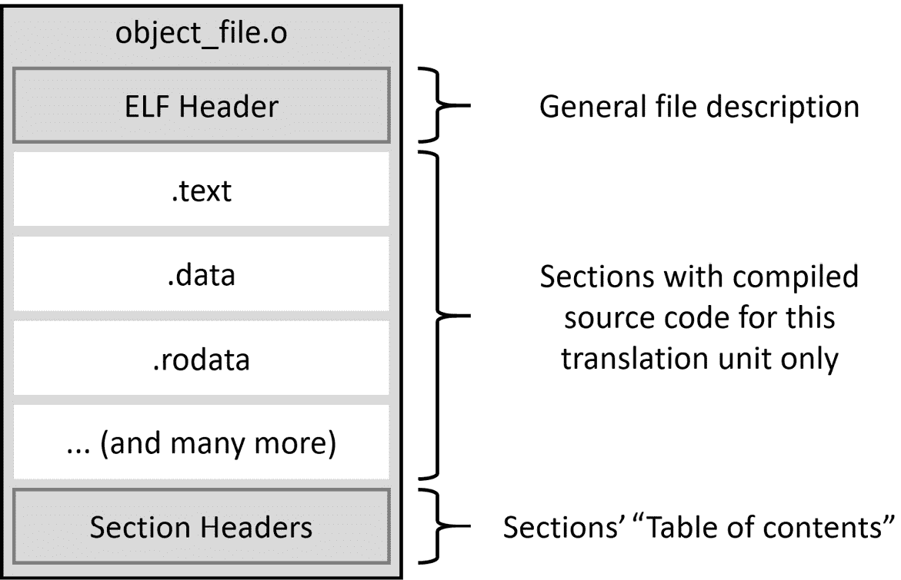
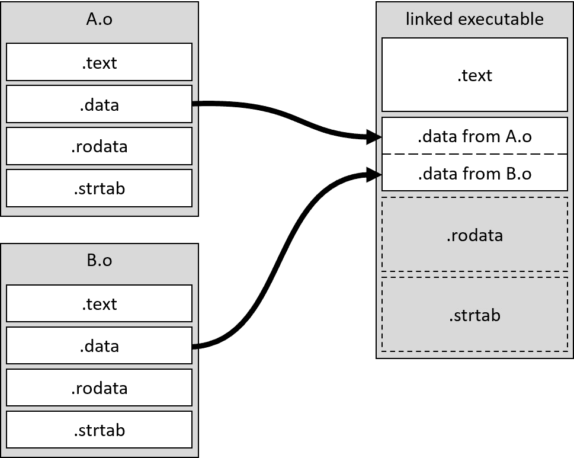
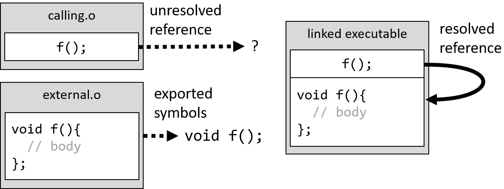
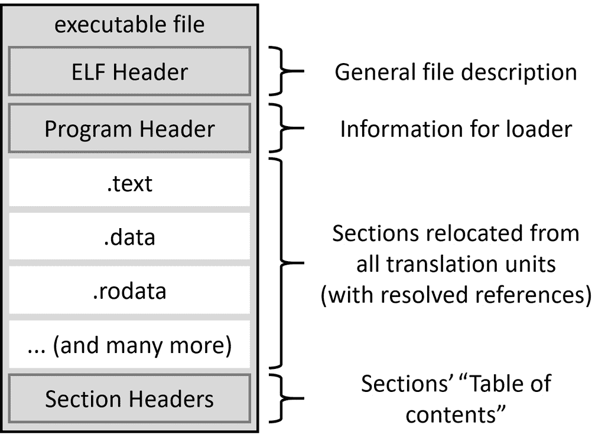

# 第六章：使用 CMake 进行链接

你可能会认为，在我们成功将源代码编译成二进制文件之后，作为构建工程师我们的工作就完成了。事实几乎如此——二进制文件包含了 CPU 执行的所有代码，但代码分散在多个文件中，方式非常复杂。链接是一个简化事物并使机器代码整洁、易于消费的过程。

快速查看命令列表会让你知道 CMake 并没有提供很多与链接相关的命令。承认，`target_link_libraries()`是唯一一个实际配置这一步骤的命令。那么为什么要用一整章来讲述一个命令呢？不幸的是，在计算机科学中，几乎没有什么事情是容易的，链接也不例外。

为了获得正确的结果，我们需要跟随整个故事——了解链接器究竟如何工作，并正确掌握基础知识。我们将讨论*对象文件*的内部结构，如何进行重定位和引用解析，以及它们的用途。我们将讨论最终可执行文件与其组件的区别以及系统如何构建进程映像。

然后，我们将向您介绍各种库——静态库、共享库和共享模块。它们都被称为库，但实际上它们几乎没有任何共同之处。构建正确链接的可执行文件严重依赖于有效的配置（以及关注如**位置无关代码**（**PIC**）这样的微小细节。

我们将学习链接过程中的另一个麻烦——**一定义规则**（**ODR**）。我们需要正好得到定义的数量。处理重复的符号有时可能非常棘手，特别是当共享库涉及其中时。然后，我们将了解为什么有时链接器找不到外部符号，即使可执行文件与适当的库链接在一起。

最后，我们将了解到如何节省时间并使用链接器为我们的解决方案准备测试，专用框架。

在本章中，我们将涵盖以下主要主题：

+   正确掌握链接的基础知识

+   构建不同类型的库

+   解决一定义规则的问题

+   链接的顺序和未解析的符号

+   为测试分离`main()`

# 技术要求

你可以在 GitHub 上找到本章中存在的代码文件，地址为[`github.com/PacktPublishing/Modern-CMake-for-Cpp/tree/main/examples/chapter06`](https://github.com/PacktPublishing/Modern-CMake-for-Cpp/tree/main/examples/chapter06)。

要构建本书中提供的示例，请始终使用建议的命令：

```cpp
cmake -B <build tree> -S <source tree>
cmake --build <build tree>
```

请确保将占位符`<build tree>`和`<source tree>`替换为适当的路径。作为提醒：**build tree**是指向目标/输出目录的路径，**source tree**是指你的源代码所在的路径。

# 正确掌握链接的基础知识

我们在*第五章*中讨论了 C++ 程序的生命周期，*使用 CMake 编译 C++ 源代码*。它包括五个主要阶段——编写、编译、链接、加载和执行。在正确编译所有源代码后，我们需要将它们组合成一个可执行文件。编译过程中产生的 *对象文件* 不能直接被处理器执行。但为什么不能呢？

为了回答这个问题，让我们来看看编译器是如何构建流行 ELF 格式的（Unix-like 系统和许多其他系统使用）*对象文件*的：



图 6.1 – *对象文件*的结构

编译器将为每个翻译单元（每个 `.cpp` 文件）准备一个 *对象文件*。这些文件将用于构建我们程序的内存映像。*对象文件*包含以下元素：

+   一个 ELF 头，用于标识目标操作系统、ELF 文件类型、目标指令集架构以及 ELF 文件中找到的两个头表的位置和大小信息——程序头表（不在*对象文件*中）和段头表。

+   按类型分组的信息段。

+   一个段头表，包含关于名称、类型、标志、内存中的目标地址、文件中的偏移量以及其他杂项信息。它用于理解这个文件中有哪些段以及它们的位置，就像目录一样。

编译器在处理你的源代码时，会将收集的信息分组到几个不同的容器中，这些容器将被放在它们自己的独立部分。其中一些如下：

+   `.text` 段：机器代码，包含处理器要执行的所有指令

+   `.data` 段：所有初始化全局和静态对象（变量）的值

+   `.bss` 段：所有未初始化全局和静态对象（变量）的值，将在程序启动时初始化为零

+   `.rodata` 段：所有常量（只读数据）的值

+   `.strtab` 段：包含所有常量字符串的字符串表，如我们在基本 `hello.cpp` 示例中放入的 *Hello World*

+   `.shstrtab` 段：包含所有段名称的字符串表

这些组非常类似于最终的可执行版本，它们将被放入 RAM 中以运行我们的应用程序。然而，我们并不能像这样直接将这个文件加载到内存中。这是因为每个 *对象文件* 都有自己的段集合。如果我们只是将它们连接在一起，我们就会遇到各种问题。我们将浪费大量的空间和时间，因为我们需要更多的内存页面。指令和数据将更难复制到 CPU 缓存中。整个系统将不得不更加复杂，并且会在运行时浪费宝贵的周期在许多（可能达到数万）`.text`、`.data` 和其他段之间跳转。

所以，我们将要做的 instead is take each section of the *object file* and put it together with the same type of section from all other *object files*. 这个过程称为`Relocatable`对于*对象文件*). 除了只是将相应的段放在一起，它还必须更新文件内的内部关联——即，变量的地址、函数的地址、符号表索引或字符串表索引。所有这些值都是针对*对象文件*的局部值，它们的编号从零开始。当我们捆绑文件在一起时，我们需要偏移这些值，以便它们指向捆绑文件中的正确地址。

图 6.2 显示了移动 in action – *.text* 段被移动，*.data* 正在从所有链接的文件中构建，*.rodata* 和 *.strtab* 将紧随其后（为了简化，图不包括头）：



图 6.2 – .data 段的移动

第二，链接器需要`extern`关键字)，编译器读取声明并*信任*定义在外面某个地方，稍后再提供。链接器负责收集此类*未解决的外部符号引用*，在合并到可执行文件后找到并填充它们所在的地址。图 6.3 显示了一个简单的引用解析示例：



图 6.3 – 引用解析

如果程序员不知道它是如何工作的，链接的这部分可能会成为问题之源。我们可能会最终得到未解决的引用，它们找不到它们的外部符号，或者相反——我们提供了太多的定义，链接器不知道选择哪一个。

最终的*可执行文件*与*对象文件*非常相似；它包含已移动的段和已解决的引用、段头表，当然还有描述整个文件的 ELF 头。主要区别在于存在程序头（如图*6.4*所示）。



图 6.4 – ELF 中可执行文件的结构

程序头位于 ELF 头之后。系统加载器将读取此头以创建进程映像。该头包含一些通用信息和内存布局的描述。布局中的每个条目代表一个称为**段**的内存片段。条目指定要读取哪些段，以什么顺序，以及虚拟内存中的哪些地址，它们的标志是什么（读、写或执行），还有一些其他有用的细节。

对象文件*也可能被打包进库中，这是一种中间产品，可以被用于最终的执行文件或其他库中。在下一节中，我们将讨论三种库的类型。

# 构建不同类型的库

在源代码编译后，我们可能希望避免在同一平台上一再编译，甚至尽可能与外部项目共享。当然，你也可以简单地提供所有的*目标文件*，就像它们最初被创建的那样，但这有几个缺点。分发多个文件并分别添加到构建系统中更加困难。如果它们很多，这可能会很麻烦。相反，我们可以简单地将所有的*目标文件*合并到一个单一的目标中并共享它。CMake 在这个过程中极大地帮助我们。我们可以使用简单的`add_library()`命令（与`target_link_libraries()`命令一起使用）创建这些库。按惯例，所有库都有一个公共前缀`lib`，并使用特定于系统的扩展名表示它们是哪种类型的库：

+   在类 Unix 系统上，静态库有一个`.a`扩展名，在 Windows 上则是`.lib`。

+   共享库在类 Unix 系统上有`.so`扩展名，在 Windows 上有`.dll`。

当构建库（静态、共享或共享模块）时，你经常会遇到这个名字*链接*来表示这个过程。即使 CMake 在`chapter06/01-libraries`项目的构建输出中也这样称呼它：

```cpp
[ 33%] Linking CXX static library libmy_static.a
[ 66%] Linking CXX shared library libmy_shared.so
[100%] Linking CXX shared module libmy_module.so
[100%] Built target module_gui
```

与可能看起来相反，链接器并不用于创建所有上述库。执行重定位和引用解析有例外。让我们来看看每种库类型，了解它们是如何工作的。

## 静态库

要构建一个静态库，我们可以简单地使用我们在前面章节中已经看到的命令：

```cpp
add_library(<name> [<source>...])
```

如果`BUILD_SHARED_LIBS`变量没有设置为`ON`，上述代码将生成一个静态库。如果我们想无论如何都构建一个静态库，我们可以提供一个显式的关键字：

```cpp
add_library(<name> STATIC [<source>...])
```

静态库是什么？它们本质上是一组存储在归档中的原始*目标文件*。在类 Unix 系统上，这样的归档可以通过`ar`工具创建。静态库是最古老、最基本的提供编译代码的方法。如果你想避免将你的依赖项与可执行文件分离，那么你可以使用它们，但代价是可执行文件的大小和占用内存会增加。

归档可能包含一些额外的索引，以加快最终的链接过程。每个平台都使用自己的方法来生成这些索引。类 Unix 系统使用一个名为`ranlib`的工具来完成这项工作。

## 共享库

了解到我们可以使用`SHARED`关键字来构建共享库，这并不令人惊讶：

```cpp
add_library(<name> SHARED [<source>...])
```

我们也可以通过将`BUILD_SHARED_LIBS`变量设置为`ON`并使用简短版本来实现：

```cpp
add_library(<name> SHARED [<source>...])
```

与静态库相比，这种差异是显著的。共享库使用链接器构建，并将执行链接的两个阶段。这意味着我们将收到带有正确段头、段和段头表的文件(*图 6.1*)。

共享库（也称为共享对象）可以在多个不同的应用程序之间共享。操作系统将在第一个使用它的程序中将这样的库加载到内存中的一个实例，并且所有随后启动的程序都将提供相同的地址（感谢复杂的虚拟内存机制）。只有`.data`和`.bss`段将为每个消耗库的进程创建单独的实例（这样每个进程就可以修改自己的变量，而不会影响其他消费者）。

得益于这种方法，系统中的整体内存使用情况得到了改善。如果我们使用一个非常受欢迎的库，我们可能不需要将其与我们的程序一起分发。很可能目标机器上已经提供了这个库。然而，如果情况不是这样，用户在运行应用程序之前需要明确地安装它。这可能会导致一些问题，当安装的库版本与预期不符时（这类问题被称为*依赖地狱*；更多信息可以在*进阶阅读*部分找到）。

## 共享模块

要构建共享模块，我们需要使用`MODULE`关键字：

```cpp
add_library(<name> MODULE [<source>...])
```

这是一个旨在作为插件在运行时加载的共享库版本，而不是在编译时与可执行文件链接的东西。共享模块不会随着程序的启动自动加载（像常规共享库那样）。只有在程序通过进行系统调用（如 Windows 上的`LoadLibrary`或 Linux/macOS 上的`dlopen()/dlsym()`）明确请求时，才会发生这种情况。

你不应该尝试将你的可执行文件与模块链接，因为这在所有平台上都不能保证有效。如果你需要这样做，请使用常规共享库。

## 位置无关代码

所有共享库和模块的源代码都应该使用*位置无关代码*标志编译。CMake 检查目标的`POSITION_INDEPENDENT_CODE`属性，并适当地添加编译器特定的编译标志，如`gcc`或`clang`的`-fPIC`。

PIC 这个词有点让人困惑。现在，程序已经在某种意义上*位置无关*，因为它们使用虚拟内存来抽象实际的物理地址。在调用函数时，CPU 使用对每个进程来说都是`0`的物理地址，该物理地址在分配时可用。这些映射不必指向连续的物理地址或遵循任何特定的顺序。

PIC 是关于将符号（对函数和全局变量的引用）映射到它们的运行时地址。在库的编译过程中，不知道哪些进程可能会使用它。无法预先确定库将在虚拟内存中的哪个位置加载，或者将以什么顺序加载。这反过来意味着符号的地址是未知的，以及它们相对于库机器代码的位置也是未知的。

为了解决这个问题，我们需要增加一个间接层。PIC 将为我们添加一个新节到输出中——`.text`节在链接时是已知的；因此，所有符号引用可以在那时指向占位符 GOT。指向内存中符号的实际值将在首次执行访问引用符号的指令时填充。那时，加载器将设置 GOT 中特定条目的值（这就是*懒加载*这个术语的由来）。

共享库和模块将自动将`POSITION_INDEPENDENT_CODE`属性设置为`ON`。然而，重要的是要记住，如果你的共享库被链接到另一个目标，比如静态库或对象库，你也需要在这个目标上设置这个属性。这是如何做到的：

```cpp
set_target_properties(dependency_target 
                      PROPERTIES POSITION_INDEPENDENT_CODE
                      ON)
```

不这样做会在 CMake 上遇到麻烦，因为默认情况下，此属性会以描述*处理传播属性冲突*一节中的方式进行检查*第四章*，*与目标一起工作*。

说到符号，还有一个问题需要讨论。下一节将讨论名称冲突导致定义不明确和不一致的问题。

# 使用单一定义规则解决问题的方法

菲尔·卡尔顿说得一点也没错，他说如下的话：

“计算机科学中有两件困难的事情：缓存失效和命名事物。”

名称之所以难以处理，有几个原因——它们必须精确、简单、短小且富有表现力。这使得它们具有意义，并允许程序员理解背后的概念。C++和许多其他语言提出了一个额外的要求——许多名称必须是唯一的。

这以几种不同的方式表现出来。程序员需要遵循 ODR。这表明，在单个翻译单元（单个`.cpp`文件）的作用域内，您需要精确一次地*定义*它，即使您多次*声明*相同的名称（变量、函数、类类型、枚举、概念或模板）。

此规则将扩展到整个程序的作用域，适用于您在代码中实际使用的所有变量和非内联函数。考虑以下示例：

第六章/02-odr-fail/shared.h

```cpp
int i;
```

第六章/02-odr-fail/one.cpp

```cpp
#include <iostream>
#include "shared.h"
int main() {
  std::cout << i << std::endl;
}
```

第六章/02-odr-fail/two.cpp

```cpp
#include "shared.h"
```

第六章/02-odr-fail/two.cpp

```cpp
cmake_minimum_required(VERSION 3.20.0)
project(ODR CXX)
set(CMAKE_CXX_STANDARD 20)
add_executable(odr one.cpp two.cpp)
```

正如你所看到的，这是非常直接的——我们创建了一个`shared.h`头文件，它在两个单独的翻译单元中使用：

+   `one.cpp`文件，它简单地将`i`打印到屏幕上

+   `two.cpp`文件，它除了包含头文件外什么也不做

然后我们将这两个文件链接成一个可执行文件，并收到以下错误：

```cpp
[100%] Linking CXX executable odr
/usr/bin/ld: CMakeFiles/odr.dir/two.cpp.o:(.bss+0x0): multiple definition of 'i'
; CMakeFiles/odr.dir/one.cpp.o:(.bss+0x0): first defined here
collect2: error: ld returned 1 exit status
```

你不能定义这些事情两次。然而，有一个值得注意的例外——类型、模板和外部内联函数可以在多个翻译单元中重复定义，如果它们完全相同（即，它们的标记序列相同）。我们可以通过将简单的定义`int i;`替换为类定义来证明这一点：

chapter06/03-odr-success/shared.h

```cpp
struct shared {
  static inline int i = 1;
};
```

然后，我们像这样使用它：

chapter06/03-odr-success/one.cpp

```cpp
#include <iostream>
#include "shared.h"
int main() {
  std::cout << shared::i << std::endl;
}
```

剩下的两个文件`two.cpp`和`CMakeLists.txt`保持不变，与`02odrfail`示例中的一样。这样的更改将允许链接成功：

```cpp
-- Build files have been written to: /root/examples/chapter06/03-odr-success/b
[ 33%] Building CXX object CMakeFiles/odr.dir/one.cpp.o
[ 66%] Building CXX object CMakeFiles/odr.dir/two.cpp.o
[100%] Linking CXX executable odr
[100%] Built target odr
```

或者，我们可以将变量标记为翻译单元局部（它不会被导出到*对象文件*之外）。为此，我们将使用`static`关键字，如下所示：

chapter06/04-odr-success/shared.h

```cpp
static int i;
```

所有其他文件都将保持不变，与原始示例一样，链接仍然成功。这当然意味着前面的代码中的变量为每个翻译单元存储在单独的内存中，一个翻译单元的更改不会影响另一个。

## 动态链接的重复符号

名称解析规则（ODR）对静态库和*对象文件*的作用完全一样，但当我们使用`SHARED`库构建代码时，情况就不那么明确了。链接器将允许在此处重复符号。在以下示例中，我们将创建两个共享库`A`和`B`，其中一个`duplicated()`函数和两个独特的`a()`和`b()`函数：

chapter06/05-dynamic/a.cpp

```cpp
#include <iostream>
void a() {
  std::cout << "A" << std::endl;
}
void duplicated() {
  std::cout << "duplicated A" << std::endl;
}
```

第二个实现文件几乎是第一个的完全副本：

chapter06/05-dynamic/b.cpp

```cpp
#include <iostream>
void b() {
  std::cout << "B" << std::endl;
}
void duplicated() {
  std::cout << "duplicated B" << std::endl;
}
```

现在，让我们使用每个函数来看看会发生什么（为了简单起见，我们将用`extern`局部声明它们）：

chapter06/05-dynamic/main.cpp

```cpp
extern void a();
extern void b();
extern void duplicated();
int main() {
  a();
  b();
  duplicated();
}
```

上述代码将运行每个库的独特函数，然后调用在两个动态库中都定义有相同签名的函数。你认为会发生什么？在这种情况下链接顺序重要吗？让我们为两种情况测试一下：

+   `main_1`首先与`a`库链接。

+   `main_2`首先与`b`库链接。

以下是一个此类项目的代码：

chapter06/05-dynamic/CMakeLists.txt

```cpp
cmake_minimum_required(VERSION 3.20.0)
project(Dynamic CXX)
add_library(a SHARED a.cpp)
add_library(b SHARED b.cpp)
add_executable(main_1 main.cpp)
target_link_libraries(main_1 a b)
add_executable(main_2 main.cpp)
target_link_libraries(main_2 b a)
```

构建并运行两个可执行文件后，我们将看到以下输出：

```cpp
root@ce492a7cd64b:/root/examples/chapter06/05-dynamic# b/main_1
A
B
duplicated A
root@ce492a7cd64b:/root/examples/chapter06/05-dynamic# b/main_2
A
B
duplicated B
```

啊哈！所以，链接器确实关心链接库的顺序。如果我们不小心，这可能会造成一些混淆。实际上，名称冲突并不像看起来那么罕见。

这种行为有一些例外；如果我们定义本地可见符号，它们将优先于从动态链接库中可用的那些。在`main.cpp`中添加以下函数将使两个二进制的输出最后一行都变为**重复的 MAIN**，如下所示：

```cpp
#include <iostream>
void duplicated() {
  std::cout << "duplicated MAIN" << std::endl;
}
```

当导出库中的名称时，总是要非常小心，因为迟早会遇到名称冲突。

## 使用命名空间——不要依赖链接器

命名空间的概念是为了避免这种奇怪的问题，并以一种可管理的方式处理 ODR（唯一公共引用规则）。难怪建议用与库同名的命名空间包裹你的库代码。这样，我们可以摆脱所有重复符号的问题。

在我们的项目中，我们可能会遇到一种情况，其中一个共享库会链接另一个，然后又链接另一个，形成一个漫长的链。这并不罕见，尤其是在更复杂的设置中。重要的是要记住，简单地将一个库链接到另一个库并不意味着有任何命名空间继承。这个链中的每个符号都保持未保护状态，保存在它们最初编译的命名空间中。

链接器的怪癖在某些场合很有趣且有用，但让我们谈谈一个并不那么罕见的问题——当正确定义的符号无缘无故失踪时该怎么办。

# 链接顺序和未解决符号

链接器往往看起来有些古怪，经常会无缘无故地抱怨一些事情。这对刚开始接触的程序员来说是一个尤其艰难的考验，因为他们还不太熟悉这个工具。难怪他们会尽可能长时间地避免接触构建配置。最终，他们不得不修改一些东西（也许是在可执行文件中添加一个他们工作的库），然后一切就乱套了。

让我们考虑一个相当简单的依赖链——主可执行文件依赖于`outer`库，而`outer`库又依赖于`nested`库（包含必要的`int b`变量）。突然间，程序员的屏幕上出现了一个不起眼的提示信息：

```cpp
outer.cpp:(.text+0x1f): undefined reference to 'b'
```

这并不是一个罕见的诊断——通常，这意味着我们忘记向链接器添加一个必要的库。但在这种情况下，库实际上已经被正确地添加到了`target_link_libraries()`命令中：

第六章/06-order/CMakeLists.txt

```cpp
cmake_minimum_required(VERSION 3.20.0)
project(Order CXX)
add_library(outer outer.cpp)
add_library(nested nested.cpp)
add_executable(main main.cpp)
target_link_libraries(main nested outer)
```

那接下来怎么办！？很少有错误会让人如此抓狂地去调试和理解。我们在这里看到的是链接顺序的不正确。让我们深入源代码找出原因：

第六章/06-order/main.cpp

```cpp
#include <iostream>
extern int a;
int main() {
  std::cout << a << std::endl;
}
```

前面的代码看起来简单 enough —— 我们将打印一个名为`a`的外部变量，可以在`outer`库中找到。我们提前用`extern`关键词声明它。以下是该库的源代码：

第六章/06-order/outer.cpp

```cpp
extern int b;
int a = b;
```

这也相当简单——`outer`依赖于`nested`库来提供`b`外部变量，该变量被分配给`a`导出变量。让我们查看`nested`的源代码，以确认我们没有错过定义：

第六章/06-order/nested.cpp

```cpp
int b = 123;
```

的确，我们已经为`b`提供了定义，而且因为没用`static`关键词标记为局部，所以它正确地从`nested`目标导出。正如我们之前看到的，这个目标在`CMakeLists.txt`中与`main`可执行文件链接：

```cpp
target_link_libraries(main nested outer)
```

那么`undefined reference to 'b'`错误是从哪里来的呢？

解决未定义符号的方式是这样的——链接器从左到右处理二进制文件。当链接器遍历二进制文件时，它将执行以下操作：

1.  收集此二进制文件导出的所有未定义符号并将它们存储以供以后使用

1.  尝试使用此二进制文件中定义的符号解决未定义符号（从迄今为止处理的所有二进制文件中收集）

1.  对下一个二进制文件重复此过程

如果在整个操作完成后还有任何符号未定义，链接失败。

这是我们示例中的情况（CMake 将在可执行目标的对象文件之前放置库）：

1.  我们处理了`main.o`，发现了一个对`a`的未定义引用，并将其收集以供以后解决。

1.  我们处理了`libnested.a`，没有发现未定义的引用，所以没有什么需要解决的。

1.  我们处理了`libouter.a`，发现了一个对`b`的未定义引用，并解决了`a`的引用。

我们正确地解决了`a`变量的引用，但不是`b`。我们只需要将链接顺序颠倒，以便`nested`在`outer`之后：

```cpp
target_link_libraries(main outer nested)
```

另一个不太优雅的选项是重复库（这对于循环引用很有用）：

```cpp
target_link_libraries(main nested outer nested)
```

最后，我们可以尝试使用链接器特定的标志，如`--start-group`或`--end-group`。查看您链接器的文档，因为这些具体内容超出了本书的范围。

既然我们已经知道如何解决常见问题，那么让我们谈谈如何利用链接器的好处。

# 为测试分离 main()

正如我们迄今为止所建立的，链接器强制执行 ODR，并确保在链接过程中所有外部符号提供它们的定义。我们可能会遇到的一个有趣的问题是正确地进行构建测试。

理想情况下，我们应该测试与生产中运行的完全相同的源代码。一个彻底的测试管道应该构建源代码，在生成的二进制文件上运行其测试，然后才打包和分发可执行文件（不包括测试本身）。

但我们实际上是如何实现这一点的呢？可执行文件有非常具体的执行流程，这通常需要阅读命令行参数。C++的编译性质实际上并不支持可以仅用于测试目的而临时注入到二进制文件中的可插拔单元。这似乎需要一个相当复杂的解决方案。

幸运的是，我们可以使用链接器以优雅的方式帮助我们处理这个问题。考虑将您程序的`main()`中的所有逻辑提取到一个外部函数`start_program()`中，如下所示：

chapter06/07-testing/main.cpp

```cpp
extern int start_program(int, const char**);
int main(int argc, const char** argv) {
  return start_program(argc, argv);
}
```

现在跳过测试这个新的`main()`函数是合理的；它只是将参数传递给定义在其他地方（在另一个文件中）的函数。然后我们可以创建一个库，其中包含从`main()`原始源代码包装在一个新函数中的内容——`start_program()`。在这个示例中，我将使用一个简单的程序来检查命令行参数的数量是否大于`1`：

chapter06/07-testing/program.cpp

```cpp
#include <iostream>
int start_program(int argc, const char** argv) {
  if (argc <= 1) {
    std::cout << "Not enough arguments" << std::endl;
    return 1;
  }
  return 0;
}
```

现在我们可以准备一个项目，用于构建这个应用程序并将这两个翻译单元链接在一起：

chapter06/07-testing/CMakeLists.cpp

```cpp
cmake_minimum_required(VERSION 3.20.0)
project(Testing CXX)
add_library(program program.cpp)
add_executable(main main.cpp)
target_link_libraries(main program)
```

`main`目标只是提供了所需的`main()`函数。`program`目标包含了所有的逻辑。现在我们可以通过创建另一个包含其自己的`main()`和测试逻辑的可执行文件来测试它。

在现实场景中，像`main()`方法这样的框架可以用来替换程序的入口点并运行所有定义的测试。我们将在第八章深入研究实际的测试主题，*测试框架*。现在，让我们关注通用原则，并在另一个`main()`函数中编写我们自己的测试：

chapter06/07-testing/test.cpp

```cpp
#include <iostream>
extern int start_program(int, const char**);
using namespace std;
int main() {
  auto exit_code = start_program(0, nullptr);
  if (exit_code == 0)
    cout << "Non-zero exit code expected" << endl;
  const char* arguments[2] = {"hello", "world"};
  exit_code = start_program(2, arguments);
  if (exit_code != 0)
    cout << "Zero exit code expected" << endl;
}
```

前面的代码将两次调用`start_program`，带参数和不带参数，并检查返回的退出码是否正确。这个单元测试在代码整洁和优雅的测试实践方面还有很多不足，但至少它是一个开始。重要的是，我们现在定义了两次`main()`：

+   用于生产环境的`main.cpp`

+   用于测试目的的`test.cpp`

我们现在将在`CMakeLists.txt`的底部添加第二个可执行文件：

```cpp
add_executable(test test.cpp)
target_link_libraries(test program)
```

这创建了另一个目标，它与生产中的完全相同的二进制代码链接，但它允许我们以任何喜欢的方式调用所有导出的函数。得益于这一点，我们可以自动运行所有代码路径，并检查它们是否如预期般工作。太好了！

# 总结

CMake 中的链接似乎很简单，微不足道，但实际上，它的内容远比表面上看到的要多。毕竟，链接可执行文件并不是像拼图一样简单地组合在一起。正如我们学习了关于*对象文件*和库的结构，我们发现程序在运行前需要移动一些东西。这些被称为节，它们在程序的生命周期中扮演着不同的角色——存储不同类型的数据、指令、符号名等。链接器需要根据最终二进制文件的要求将它们组合在一起。这个过程被称为重定位。

我们还需要注意符号的处理——在所有翻译单元之间解决引用，确保不遗漏任何内容。然后，链接器可以创建程序头部并将其添加到最终的可执行文件中。它将包含系统加载器的指令，描述如何将合并的段转换为组成进程运行时内存映像的段。

我们还讨论了三种不同类型的库（静态库、共享库和共享模块），并解释了它们之间的区别以及哪些场景适合某些库。我们还涉及了 PIC 的概念——一个允许延迟绑定符号的强大概念。

ODR 是一个 C++概念，但我们已经知道，链接器对其进行了严格的实施。在介绍了这个主题之后，我们简要探讨了如何在静态和动态库中处理最基本的符号重复。这之后是一些建议，尽可能使用命名空间，并不要过分依赖链接器来防止符号冲突。

这样一个看似简单的步骤（CMake 只提供了一些与链接器相关的命令），确实有很多古怪之处！其中一个难以掌握的是链接顺序，尤其是在库有嵌套依赖时。我们现在知道如何处理一些基本情况，以及我们可以研究哪些其他方法来处理更复杂的情况。

最后，我们研究了如何利用链接器为我们的程序准备测试——将`main()`函数分离到另一个翻译单元中。这使我们能够引入另一个可执行文件，它运行的测试针对的是将在生产中运行的完全相同的机器代码。

现在我们已经知道了如何链接，我们可以检索外部库并将其用于我们的 CMake 项目中。在下一章中，我们将学习如何在 CMake 中管理依赖关系。

# 进一步阅读

关于本章涵盖的主题，你可以参考以下内容：

+   **ELF 文件的结构：**

[可执行文件与链接格式](https://en.wikipedia.org/wiki/Executable_and_Linkable_Format)

+   关于`add_library()`的 CMake 手册：

[CMake 的 add_library 命令](https://cmake.org/cmake/help/latest/command/add_library.html)

+   **依赖地狱：**

[依赖地狱](https://en.wikipedia.org/wiki/Dependency_hell)

+   **模块与共享库的区别：**

[模块与共享库的区别](https://stackoverflow.com/questions/4845984/difference-between-modules-and-shared-libraries)
