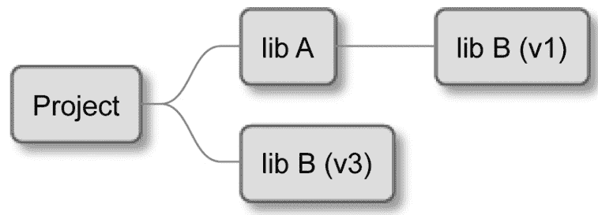
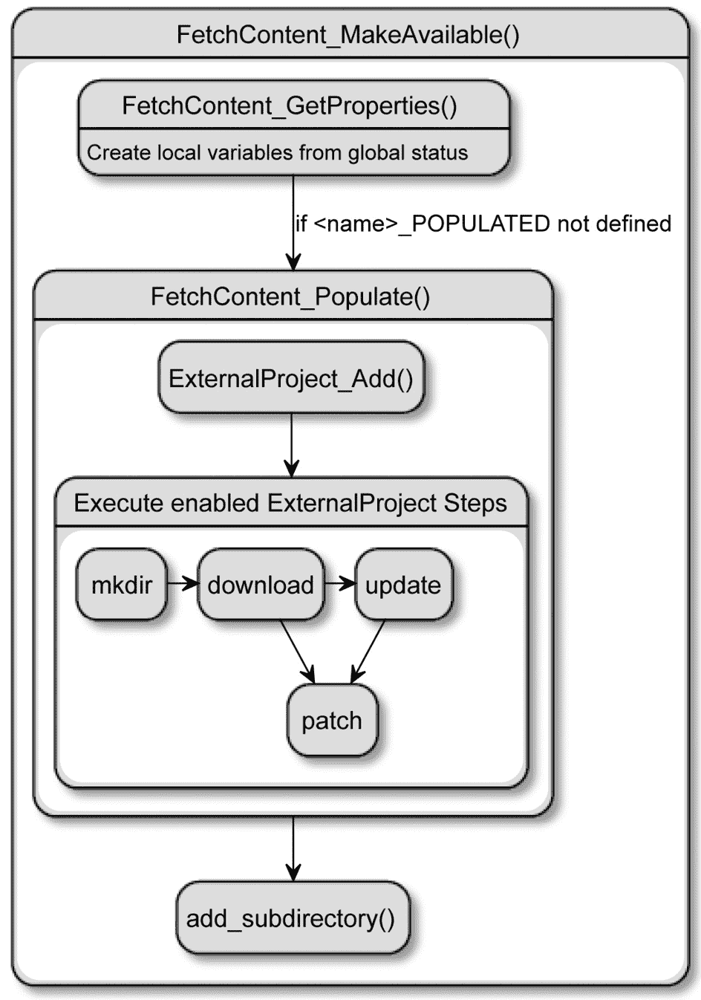

# 第七章：使用 CMake 管理依赖

你的解决方案是大型还是小型，并不重要；随着它的成熟，你最终会决定引入外部依赖。避免根据普遍的商业逻辑创建和维护代码的成本是很重要的。这样，你就可以将时间投入到对你和你的客户有意义的事情上。

外部依赖不仅用于提供框架和功能以及解决古怪的问题。它们在构建和控制代码质量的过程中也起着重要的作用——无论是特殊编译器如**Protobuf**，还是测试框架如**GTest**。

无论你是在处理开源项目，还是在使用你公司其他开发者编写的项目，你仍然需要一个良好、干净的流程来管理外部依赖。自己解决这个问题将花费无数的设置时间和大量的额外支持工作。幸运的是，CMake 在适应不同风格和依赖管理的历史方法的同时，还能跟上行业批准标准的不断演变。

为了提供一个外部依赖，我们首先应该检查宿主系统是否已经有了这个依赖，因为最好避免不必要的下载和漫长的编译。我们将探讨如何找到并把这样的依赖转换成 CMake 目标，在我们的项目中使用。这可以通过很多方式完成，特别是当包支持 CMake 开箱即用，或者至少提供给一个稍微老一点的 PkgConfig 工具的文件时。如果情况不是这样，我们仍然可以编写自己的文件来检测并包含这样的依赖。

我们将讨论当一个依赖在系统上不存在时应该做什么。正如你可以想象，我们可以采取替代步骤来自动提供必要的文件。我们将考虑使用不同的 Git 方法来解决这个问题，并将整个 CMake 项目作为我们构建的一部分引入。

在本章中，我们将涵盖以下主要内容：

+   如何找到已安装的包

+   使用`FindPkgConfig0`发现遗留包

+   编写自己的 find-modules

+   与 Git 仓库协作

+   使用`ExternalProject`和`FetchContent`模块

# 技术要求

你可以在这个章节中找到的代码文件在 GitHub 上，地址为[`github.com/PacktPublishing/Modern-CMake-for-Cpp/tree/main/examples/chapter07`](https://github.com/PacktPublishing/Modern-CMake-for-Cpp/tree/main/examples/chapter07)。

为了构建本书中提供的示例，总是使用推荐的命令：

```cpp
cmake -B <build tree> -S <source tree>
cmake --build <build tree>
```

请确保将占位符`<build` `tree>`和`<source` `tree>`替换为适当的路径。作为提醒：**build tree** 是目标/输出目录的路径，**source tree** 是源代码所在的位置的路径。

# 如何找到已安装的包

好的，假设你已经决定通过网络通信或静态存储数据来提高你的技能。纯文本文件、JSON，甚至是老旧的 XML 都不行。你希望将你的数据直接序列化为二进制格式，最好使用业界知名的库——比如谷歌的 protocol buffers（Protobuf）。你找到了文档，在系统中安装了依赖项，现在怎么办？我们实际上如何告诉 CMake 找到并使用你引入的这项外部依赖？幸运的是，有一个`find_package()`命令。在大多数情况下，它都像魔法一样起作用。

让我们倒带并从头开始设置场景——我们必须安装我们想要使用的依赖项，因为`find_package()`，正如其名，只是关于在系统中发现包。我们假设依赖项已经安装，或者我们解决方案的用户知道如何在提示时安装特定的、必要的依赖项。为了覆盖其他场景，你需要提供一个备份计划（关于这方面的更多信息可以在*与 Git 仓库一起工作*部分中找到）。

在 Protobuf 的情况下，情况相当直接：你可以从官方存储库（[`github.com/protocolbuffers/protobuf`](https://github.com/protocolbuffers/protobuf)）下载、编译并自行安装库，也可以使用你操作系统的包管理器。如果你正在使用第*章 1*《*CMake 初步*》中提到的 Docker 镜像，你将使用 Debian Linux。安装 Protobuf 库和编译器的命令如下：

```cpp
$ apt update 
$ apt install protobuf-compiler libprotobuf-dev
```

每个系统都有它自己的安装和管理包的方式。找到一个包所在的路径可能会很棘手且耗时，特别是当你想要支持今天大多数操作系统时。幸运的是，如果涉及的包提供了一个合适的**配置文件**，允许 CMake 确定支持该包所需的变量，`find_package()`通常可以为你完成这个任务。

如今，许多项目都符合这一要求，在安装过程中提供了这个文件给 CMake。如果你计划使用某个流行的库而它没有提供此文件，暂时不必担心。很可能 CMake 的作者已经将文件与 CMake 本身捆绑在一起（这些被称为**find-modules**，以便与配置文件区分开来）。如果情况不是这样，我们仍然还有一些选择：

+   为特定包提供我们自己的 find-modules，并将其与我们的项目捆绑在一起。

+   编写一个配置文件，并请包维护者将该包与文件一起分发。

你可能会说你还没有完全准备好自己创建这样的合并请求，这没关系，因为很可能你不需要这么做。CMake 附带了超过 150 个查找模块，可以找到如 Boost、bzip2、curl、curses、GIF、GTK、iconv、ImageMagick、JPEG、Lua、OpenGL、OpenSSL、PNG、PostgreSQL、Qt、SDL、Threads、XML-RPC、X11 和 zlib 等库，幸运的是，还包括我们在这个例子中将要使用的 Protobuf 文件。完整的列表在 CMake 文档中可以找到：[`cmake.org/cmake/help/latest/manual/cmake-modules.7.html#find modules`](https://cmake.org/cmake/help/latest/manual/cmake-modules.7.html#find%20modules)。

查找模块和配置文件都可以在 CMake 项目中用一个`find_package()`命令。CMake 寻找匹配的查找模块，如果找不到任何模块，它会转向配置文件。搜索将从存储在`CMAKE_MODULE_PATH`变量中的路径开始（默认情况下这个变量是空的）。当项目想要添加和使用外部查找模块时，这个变量可以被项目配置。接下来，CMake 将扫描安装的 CMake 版本的内置查找模块列表。

如果没有找到适用的模块，该寻找相应的包配置文件了。CMake 有一长串适合宿主操作系统的路径，可以扫描与以下模式匹配的文件名：

+   `<CamelCasePackageName>Config.cmake`

+   `<kebab-case-package-name>-config.cmake`

让我们稍微谈谈项目文件；在这个例子中，我其实并不打算设计一个带有远程过程调用和所有附件的网络解决方案。相反，我只是想证明我能构建并运行一个依赖于 Protobuf 的项目。为了实现这一点，我将创建一个尽可能小的合同的`.proto`文件。如果你对 Protobuf 不是特别熟悉，只需知道这个库提供了一种机制，可以将结构化数据序列化为二进制形式。为此，我们需要提供一个此类结构的模式，它将用于将二进制形式写入和读取 C++对象。

我想出的是这样的：

chapter07/01-find-package-variables/message.proto

```cpp
syntax = "proto3";
message Message {
    int32 id = 1;
}
```

如果你不熟悉 Protobuf 语法（这其实不是这个例子真正关注的），不必担心。这是一个只包含一个 32 位整数的简单`message`。Protobuf 有一个特殊的编译器，它会读取这些文件，并生成可以被我们的应用程序使用的 C++源文件和头文件。这意味着我们需要将这个编译步骤以某种方式添加到我们的过程中。我们稍后再回到这个问题。现在，让我们看看我们的`main.cpp`文件长什么样：

chapter07/01-find-package-variables/main.cpp

```cpp
#include "message.pb.h"
#include <fstream>
using namespace std;
int main()
{
  Message m;
  m.set_id(123);
  m.PrintDebugString();
  fstream fo("./hello.data", ios::binary | ios::out);
  m.SerializeToOstream(&fo);
  fo.close();
  return 0;
}
```

如我所说，`Message`包含一个唯一的`id`字段。在`main.cpp`文件中，我创建了一个代表这个消息的对象，将字段设置为`123`，并将其调试信息打印到标准输出。接下来，我创建了一个文件流，将这个对象的二进制版本写入其中，并关闭流——这是序列化库最简单的可能用途。

请注意，我已经包含了一个`message.pb.h`头文件。这个文件还不存在；它需要在`message.proto`编译期间由 Protobuf 编译器`protoc`创建。这种情况听起来相当复杂，暗示这样一个项目的列表文件必须非常长。根本不是！这就是 CMake 魔法发生的地方：

chapter07/01-find-package-variables/CMakeLists.txt

```cpp
cmake_minimum_required(VERSION 3.20.0)
project(FindPackageProtobufVariables CXX)
find_package(Protobuf REQUIRED)
protobuf_generate_cpp(GENERATED_SRC GENERATED_HEADER
  message.proto)
add_executable(main main.cpp 
  ${GENERATED_SRC} ${GENERATED_HEADER})
target_link_libraries(main PRIVATE ${Protobuf_LIBRARIES})
target_include_directories(main PRIVATE 
  ${Protobuf_INCLUDE_DIRS}
  ${CMAKE_CURRENT_BINARY_DIR})
```

让我们来分解一下：

+   前两行我们已经知道了；它们创建了一个项目和声明了它的语言。

+   `find_package(Protobuf REQUIRED)` 要求 CMake 运行捆绑的`FindProtobuf.cmake`查找模块，并为我们设置 Protobuf 库。那个查找模块将扫描常用路径（因为我们提供了`REQUIRED`关键字）并在找不到库时终止。它还将指定有用的变量和函数（如下面的行所示）。

+   `protobuf_generate_cpp` 是 Protobuf 查找模块中定义的自定义函数。在其内部，它调用`add_custom_command()`，该命令使用适当的参数调用`protoc`编译器。我们通过提供两个变量来使用这个函数，这些变量将被填充生成的源文件（`GENERATED_SRC`）和头文件（`GENERATED_HEADER`）的路径，以及要编译的文件列表（`message.proto`）。

+   如我们所知，`add_executable` 将使用`main.cpp`和前面命令中配置的 Protobuf 文件创建我们的可执行文件。

+   `target_link_libraries` 将由`find_package()`找到的（静态或共享）库添加到我们的`main`目标链接命令中。

+   `target_include_directories()` 将必要的`INCLUDE_DIRS`（由包提供）添加到*包含路径*中，以及`CMAKE_CURRENT_BINARY_DIR`。后者是必需的，以便编译器可以找到生成的`message.pb.h`头文件。

换句话说，它实现了以下功能：

+   查找库和编译器的所在位置

+   提供辅助函数，教会 CMake 如何调用`.proto`文件的定制编译器

+   添加包含包含和链接所需路径的变量

在大多数情况下，当你调用`find_package()`时，你可以期待一些变量会被设置，不管你是使用内置的查找模块还是随包附带的配置文件（假设已经找到了包）：

+   `<PKG_NAME>_FOUND`

+   `<PKG_NAME>_INCLUDE_DIRS`或`<PKG_NAME>_INCLUDES`

+   `<PKG_NAME>_LIBRARIES`或`<PKG_NAME>_LIBRARIES`或`<PKG_NAME>_LIBS`

+   `<PKG_NAME>_DEFINITIONS`

+   由查找模块或配置文件指定的`IMPORTED`目标

最后一个观点非常有趣——如果一个包支持所谓的“现代 CMake”（以目标为中心），它将提供这些`IMPORTED`目标而不是这些变量，这使得代码更简洁、更简单。建议优先使用目标而不是变量。

Protobuf 是一个很好的例子，因为它提供了变量和`IMPORTED`目标（自从 CMake 3.10 以来）：`protobuf::libprotobuf`，`protobuf::libprotobuf-lite`，`protobuf::libprotoc`和`protobuf::protoc`。这允许我们编写更加简洁的代码：

chapter07/02-find-package-targets/CMakeLists.txt

```cpp
cmake_minimum_required(VERSION 3.20.0)
project(FindPackageProtobufTargets CXX)
find_package(Protobuf REQUIRED)
protobuf_generate_cpp(GENERATED_SRC GENERATED_HEADER
  message.proto)
add_executable(main main.cpp
  ${GENERATED_SRC} ${GENERATED_HEADER})
target_link_libraries(main PRIVATE protobuf::libprotobuf)
target_include_directories(main PRIVATE
                                ${CMAKE_CURRENT_BINARY_DIR})
```

`protobuf::libprotobuf`导入的目标隐式地指定了*包含目录*，并且多亏了传递依赖（或者我叫它们传播属性），它们与我们的`main`目标共享。链接器和编译器标志也是同样的过程。

如果你需要确切知道特定 find-module 提供了什么，最好是访问其在线文档。Protobuf 的一个可以在以下位置找到：[`cmake.org/cmake/help/latest/module/FindProtobuf.html`](https://cmake.org/cmake/help/latest/module/FindProtobuf.html)。

重要提示

为了保持简单，本节中的示例如果用户系统中没有找到 protobuf 库（或其编译器）将简单地失败。但一个真正健壮的解决方案应该通过检查`Protobuf_FOUND`变量并相应地行事，要么打印给用户的清晰诊断消息（这样他们可以安装它）要么自动执行安装。

关于`find_package()`命令的最后一点是它的选项。完整的列表有点长，所以我们只关注基本的签名。它看起来像这样：

```cpp
find_package(<Name> [version] [EXACT] [QUIET] [REQUIRED])
```

最重要的选项如下：

+   `[version]`，它允许我们选择性地请求一个特定的版本。使用`major.minor.patch.tweak`格式（如`1.22`）或提供一个范围——`1.22...1.40.1`（使用三个点作为分隔符）。

+   `EXACT`关键字意味着我们想要一个确切的版本（这里不支持版本范围）。

+   `QUIET`关键字可以静默所有关于找到/未找到包的消息。

+   `REQUIRED`关键字如果找不到包将停止执行，并打印一个诊断消息（即使启用了`QUIET`也是如此）。

有关命令的更多信息可以在文档页面找到：[`cmake.org/cmake/help/latest/command/find_package.html`](https://cmake.org/cmake/help/latest/command/find_package.html)。

为包提供配置文件的概念并不新鲜。而且它肯定不是 CMake 发明的。还有其他工具和格式为此目的而设计。PkgConfig 就是其中之一。CMake 还提供了一个有用的包装模块来支持它。

# 使用 FindPkgConfig 发现遗留的包

管理依赖项和发现它们所需的所有编译标志的问题与 C++库本身一样古老。有许多工具可以处理这个问题，从非常小和简单的机制到作为构建系统和 IDE 的一部分提供的非常灵活的解决方案。其中一个（曾经非常流行）的工具被称为 PkgConfig([freedesktop.org/wiki/Software/pkg-config/](http://freedesktop.org/wiki/Software/pkg-config/)）。它通常在类 Unix 系统中可用（尽管它也适用于 macOS 和 Windows）。

`pkg-config`正逐渐被其他更现代的解决方案所取代。这里出现了一个问题——你应该投入时间支持它吗？答案一如既往——视情况而定：

+   如果一个库真的很受欢迎，它可能已经有了自己的 CMake find-module；在这种情况下，你可能不需要它。

+   如果没有 find-module（或者它不适用于您的库）并且库只提供 PkgConfig `.pc`文件，只需使用现成的即可。

许多（如果不是大多数）库已经采用了 CMake，并在当前版本中提供了包配置文件。如果您不发布您的解决方案并且您控制环境，请使用`find_package()`，不要担心遗留版本。

遗憾的是，并非所有环境都可以快速更新到库的最新版本。许多公司仍在使用生产中的遗留系统，这些系统不再获得最新包。在这种情况下，用户可能只能使用较旧的（但希望兼容）版本。而且经常情况下，它会提供一个`.pc`文件。

此外，如果这意味着您的项目可以为大多数用户无障碍地工作，那么支持旧的 PkgConfig 格式的努力可能是值得的。

在任何情况下，首先使用`find_package()`，如前一部分所述，如果`<PKG_NAME>_FOUND`为假，则退回到 PkgConfig。这样，我们覆盖了一种场景，即环境升级后我们只需使用主方法而无需更改代码。

这个*助手工具*的概念相当简单——库的作者提供一个小型的`.pc`文件，其中包含编译和链接所需的信息，例如这个：

```cpp
prefix=/usr/local
exec_prefix=${prefix}
includedir=${prefix}/include
libdir=${exec_prefix}/lib
Name: foobar
Description: A foobar library
Version: 1.0.0
Cflags: -I${includedir}/foobar
Libs: -L${libdir} -lfoobar
```

这个格式相当直接，轻量级，甚至支持基本变量扩展。这就是为什么许多开发者更喜欢它而不是像 CMake 这样的复杂、健壮的解决方案。尽管 PkgConfig 极其易于使用，但其功能却相当有限：

+   检查系统中是否存在库，并且是否提供了与之一起的`.pc`文件

+   检查是否有一个库的足够新版本可用

+   通过运行`pkg-config --libs libfoo`获取库的链接器标志

+   获取库的*包含目录*（此字段技术上可以包含其他编译器标志）——`pkg-config --cflags libfoo`

为了在构建场景中正确使用 PkgConfig，您的构建系统需要在操作系统中找到`pkg-config`可执行文件，运行它几次，并提供适当的参数，然后将响应存储在变量中，以便稍后传递给编译器。在 CMake 中我们已经知道如何做到这一点——扫描已知存储辅助工具的路径以检查是否安装了 PkgConfig，然后使用几个`exec_program()`命令来发现如何链接依赖项。尽管步骤有限，但似乎每次使用 PkgConfig 时都这样做是过于繁琐的。

幸运的是，CMake 提供了一个方便的内置查找模块，正是为了这个目的——`FindPkgConfig`。它遵循大多数常规查找模块的规则，但不是提供`PKG_CONFIG_INCLUDE_DIRS`或`PKG_CONFIG_LIBS`变量，而是设置一个变量，直接指向二进制文件的路径——`PKG_CONFIG_EXECUTABLE`。不出所料，`PKG_CONFIG_FOUND`变量也被设置了——我们将使用它来确认系统中是否有这个工具，然后使用模块中定义的`pkg_check_modules()`帮助命令扫描一个`pkg_check_modules()`包。

我们来实际看看这个过程。一个提供`.pc`文件的相对受欢迎的库的一个例子是一个 PostgreSQL 数据库的客户端——`libpqxx`。

为了在 Debian 上安装它，您可以使用`libpqxx-dev`包（您的操作系统可能需要不同的包）：

```cpp
apt-get install libpqxx-dev
```

我们将创建一个尽可能短的`main.cpp`文件，其中包含一个虚拟连接类：

chapter07/02-find-pkg-config/main.cpp

```cpp
#include <pqxx/pqxx>
int main()
{
  // We're not actually connecting, but
  // just proving that pqxx is available.
  pqxx::nullconnection connection;
}
```

现在我们可以通过使用 PkgConfig 查找模块为之前的代码提供必要的依赖项：

chapter07/03-find-pkg-config/CMakeLists.txt

```cpp
cmake_minimum_required(VERSION 3.20.0)
project(FindPkgConfig CXX)
find_package(PkgConfig REQUIRED)
pkg_check_modules(PQXX REQUIRED IMPORTED_TARGET libpqxx)
message("PQXX_FOUND: ${PQXX_FOUND}")
add_executable(main main.cpp)
target_link_libraries(main PRIVATE PkgConfig::PQXX)
```

让我们分解一下发生了什么：

+   我们要求 CMake 使用`find_package()`命令查找 PkgConfig 可执行文件。如果因为`REQUIRED`关键字而没有`pkg-config`，它将会失败。

+   在`FindPkgConfig`查找模块中定义的`pkg_check_modules()`自定义宏被调用，以创建一个名为`PQXX`的新`IMPORTED`目标。查找模块将搜索一个名为`libpxx`的依赖项，同样，因为`REQUIRED`关键字，如果库不可用，它将会失败。注意`IMPORTED_TARGET`关键字——没有它，就不会自动创建目标，我们必须手动定义由宏创建的变量。

+   我们通过打印`PQXX_FOUND`来确认一切是否正确，并显示诊断信息。如果我们之前没有指定`REQUIRED`，我们在这里可以检查这个变量是否被设置（也许是为了允许其他备选机制介入）。

+   我们创建了`main`可执行文件。

+   我们链接了由`pkg_check_modules()`创建的`PkgConfig::PQXX` `IMPORTED`目标。注意`PkgConfig::`是一个常量前缀，`PQXX`来自传递给该命令的第一个参数。

这是一种相当方便的方法，可以引入尚不支持 CMake 的依赖项。这个查找模块还有其他一些方法和选项；如果你对了解更多感兴趣，我建议你参考官方文档：[`cmake.org/cmake/help/latest/module/FindPkgConfig.html`](https://cmake.org/cmake/help/latest/module/FindPkgConfig.html)。

查找模块旨在为 CMake 提供一个非常方便的方式来提供有关已安装依赖项的信息。大多数流行的库在所有主要平台上都广泛支持 CMake。那么，当我们想要使用一个还没有专用的查找模块的第三方库时，我们能做些什么呢？

# 编写你自己的查找模块

在少数情况下，你真正想在项目中使用的库没有提供配置文件或 PkgConfig 文件，而且 CMake 中没有现成的查找模块可供使用。在这种情况下，你可以为该库编写一个自定义的查找模块，并将其与你的项目一起分发。这种情况并不理想，但为了照顾到你的项目的用户，这是必须的。

既然我们已经在上一节中熟悉了`libpqxx`，那么现在就让我们为它编写一个好的查找模块吧。我们首先在项目中源代码树的`cmake/module`目录下创建一个新文件`FindPQXX.cmake`，并开始编写。我们需要确保当调用`find_package()`时，CMake 能够发现这个查找模块，因此我们将这个路径添加到`CMakeLists.txt`中的`CMAKE_MODULE_PATH`变量里，用`list(APPEND)`。整个列表文件应该看起来像这样：

chapter07/04-find-package-custom/CMakeLists.txt

```cpp
cmake_minimum_required(VERSION 3.20.0)
project(FindPackageCustom CXX)
list(APPEND CMAKE_MODULE_PATH
  "${CMAKE_SOURCE_DIR}/cmake/module/")
find_package(PQXX REQUIRED)
add_executable(main main.cpp)
target_link_libraries(main PRIVATE PQXX::PQXX)
```

现在我们已经完成了这个步骤，接下来我们需要编写实际的查找模块。从技术上讲，如果`FindPQXX.cmake`文件为空，将不会有任何事情发生：即使用户调用`find_package()`时使用了`REQUIRED`，CMake 也不会抱怨一些特定的变量没有被设置（包括`PQXX_FOUND`），这是查找模块的作者需要尊重 CMake 文档中概述的约定：

+   当调用`find_package(<PKG_NAME> REQUIRED)`时，CMake 将提供一个`<PKG_NAME>_FIND_REQUIRED`变量，设置为`1`。如果找不到库，查找模块应该调用`message(FATAL_ERROR)`。

+   当调用`find_package(<PKG_NAME> QUIET)`时，CMake 将提供一个`<PKG_NAME>_FIND_QUIETLY`变量，设置为`1`。查找模块应避免打印诊断信息（除了前面提到的一次）。

+   当调用列表文件时，CMake 将提供一个`<PKG_NAME>_FIND_VERSION`变量，设置为所需版本。查找模块应该找到适当的版本，或者发出`FATAL_ERROR`。

当然，为了与其他查找模块保持一致性，最好遵循前面的规则。让我们讨论创建一个优雅的`PQXX`查找模块所需的步骤：

1.  如果已知库和头文件的路径（要么由用户提供，要么来自之前运行的缓存），使用这些路径并创建一个`IMPORTED`目标。在此结束。

1.  否则，请找到嵌套依赖项——PostgreSQL 的库和头文件。

1.  在已知的路径中搜索 PostgreSQL 客户端库的二进制版本。

1.  在已知的路径中搜索 PostgreSQL 客户端*包含头文件*。

1.  检查是否找到了库和*包含头文件*；如果是，创建一个`IMPORTED`目标。

创建`IMPORTED`目标发生了两次——如果用户从命令行提供了库的路径，或者如果它们是自动找到的。我们将从编写一个函数来处理我们搜索过程的结果开始，并保持我们的代码 DRY。

要创建一个`IMPORTED`目标，我们只需要一个带有`IMPORTED`关键字的库（以便在`CMakeLists.txt`中的`target_link_libraries()`命令中使用它）。该库必须提供一个类型——我们将其标记为`UNKNOWN`，以表示我们不希望检测找到的库是静态的还是动态的；我们只想为链接器提供一个参数。

接下来，我们将`IMPORTED_LOCATION`和`INTERFACE_INCLUDE_DIRECTORIES``IMPORTED`目标的必需属性设置为函数被调用时传递的参数。我们还可以指定其他属性（如`COMPILE_DEFINITIONS`）；它们对于`PQXX`来说只是不必要的。

在那之后，我们将路径存储在缓存变量中，这样我们就无需再次执行搜索。值得一提的是，`PQXX_FOUND`在缓存中被显式设置，因此它在全局变量作用域中可见（所以它可以被用户的`CMakeLists.txt`访问）。

最后，我们将缓存变量标记为高级，这意味着除非启用“高级”选项，否则它们不会在 CMake GUI 中显示。对于这些变量，这是一种常见的做法，我们也应该遵循约定：

chapter07/04-find-package-custom/cmake/module/FindPQXX.cmake

```cpp
function(add_imported_library library headers)
  add_library(PQXX::PQXX UNKNOWN IMPORTED)
  set_target_properties(PQXX::PQXX PROPERTIES
    IMPORTED_LOCATION ${library}
    INTERFACE_INCLUDE_DIRECTORIES ${headers}
  )
  set(PQXX_FOUND 1 CACHE INTERNAL "PQXX found" FORCE)
  set(PQXX_LIBRARIES ${library}
      CACHE STRING "Path to pqxx library" FORCE)
  set(PQXX_INCLUDES ${headers}
      CACHE STRING "Path to pqxx headers" FORCE)
  mark_as_advanced(FORCE PQXX_LIBRARIES)
  mark_as_advanced(FORCE PQXX_INCLUDES)
endfunction()
```

接下来，我们覆盖第一种情况——一个用户如果将他们的`PQXX`安装在非标准位置，可以通过命令行（使用`-D`参数）提供必要的路径。如果是这种情况，我们只需调用我们刚刚定义的函数并使用`return()`放弃搜索。我们相信用户最清楚，能提供库及其依赖项（PostgreSQL）的正确路径给我们。

如果配置阶段在过去已经执行过，这个条件也将为真，因为`PQXX_LIBRARIES`和`PQXX_INCLUDES`变量是被缓存的。

```cpp
if (PQXX_LIBRARIES AND PQXX_INCLUDES)
  add_imported_library(${PQXX_LIBRARIES} ${PQXX_INCLUDES})
  return()
endif()
```

是时候找到一些嵌套依赖项了。为了使用`PQXX`，宿主机器还需要 PostgreSQL。在我们的查找模块中使用另一个查找模块是完全合法的，但我们应该将`REQUIRED`和`QUIET`标志传递给它（以便嵌套搜索与外层搜索行为一致）。这不是复杂的逻辑，但我们应该尽量避免不必要的代码。

CMake 有一个内置的帮助宏，正是为此而设计——`find_dependency()`。有趣的是，文档中指出它不适合用于 find-modules，因为它如果在找不到依赖项时调用`return()`命令。因为这是一个宏（而不是一个函数），`return()`将退出调用者的作用域，即`FindPQXX.cmake`文件，停止外层 find-module 的执行。可能有些情况下这是不希望的，但在这个情况下，这正是我们想要做的——阻止 CMake 深入寻找`PQXX`的组件，因为我们已经知道 PostgreSQL 不可用：

```cpp
# deliberately used in mind-module against the
  documentation
include(CMakeFindDependencyMacro)
find_dependency(PostgreSQL)
```

为了找到`PQXX`库，我们将设置一个`_PQXX_DIR`帮助变量（转换为 CMake 风格的路径）并使用`find_library()`命令扫描我们在`PATHS`关键字之后提供的路径列表。该命令将检查是否有与`NAMES`关键字之后提供的名称匹配的库二进制文件。如果找到了匹配的文件，其路径将被存储在`PQXX_LIBRARY_PATH`变量中。否则，该变量将被设置为`<VAR>-NOTFOUND`，在这种情况下是`PQXX_HEADER_PATH-NOTFOUND`。

`NO_DEFAULT_PATH`关键字禁用了默认行为，这将扫描 CMake 为该主机环境提供的默认路径列表：

```cpp
file(TO_CMAKE_PATH "$ENV{PQXX_DIR}" _PQXX_DIR)
find_library(PQXX_LIBRARY_PATH NAMES libpqxx pqxx
  PATHS
    ${_PQXX_DIR}/lib/${CMAKE_LIBRARY_ARCHITECTURE}
    # (...) many other paths - removed for brevity
    /usr/lib
  NO_DEFAULT_PATH
)
```

接下来，我们将使用`find_path()`命令搜索所有已知的头文件，这个命令的工作方式与`find_library()`非常相似。主要区别在于`find_library()`知道库的系统特定扩展，并将这些扩展作为需要自动添加，而对于`find_path()`，我们需要提供确切的名称。

在这里也不要混淆`pqxx/pqxx`。这是一个实际的头文件，但库作者故意省略了扩展名，以符合 C++风格`#include`指令（而不是遵循 C 风格`.h`扩展名）：`#include <pqxx/pqxx>`：

```cpp
find_path(PQXX_HEADER_PATH NAMES pqxx/pqxx
  PATHS
    ${_PQXX_DIR}/include
    # (...) many other paths - removed for brevity
    /usr/include
  NO_DEFAULT_PATH
)
```

现在是检查`PQXX_LIBRARY_PATH`和`PQXX_HEADER_PATH`变量是否包含任何`-NOTFOUND`值的时候。同样，我们可以手动进行这项工作，然后根据约定打印诊断信息或终止构建执行，或者我们可以使用 CMake 提供的`FindPackageHandleStandardArgs`列表文件中的`find_package_handle_standard_args()`帮助函数。这是一个帮助命令，如果路径变量被填充，则将`<PKG_NAME>_FOUND`变量设置为`1`，并提供关于成功和失败的正确诊断信息（它将尊重`QUIET`关键字）。如果传递了`REQUIRED`关键字给 find-module，而其中一个提供的路径变量为空，它还将以`FATAL_ERROR`终止执行。

如果找到了库，我们将调用函数定义`IMPORTED`目标并将路径存储在缓存中：

```cpp
include(FindPackageHandleStandardArgs)
find_package_handle_standard_args(
  PQXX DEFAULT_MSG PQXX_LIBRARY_PATH PQXX_HEADER_PATH
)
if (PQXX_FOUND)
  add_imported_library(
    "${PQXX_LIBRARY_PATH};${POSTGRES_LIBRARIES}"
    "${PQXX_HEADER_PATH};${POSTGRES_INCLUDE_DIRECTORIES}"
  )
endif()
```

就这些。这个 find-module 将找到`PQXX`并创建相应的`PQXX::PQXX`目标。你可以在整个文件中找到这个模块，文件位于书籍示例仓库中：`chapter07/04-find-package-custom/cmake/module/FindPQXX.cmake`。

如果一个库很受欢迎，并且很可能会在系统中已经安装，这种方法非常有效。然而，并非所有的库随时都能获得。我们能否让这个步骤变得简单，让我们的用户使用 CMake 获取和构建这些依赖项？

# 使用 Git 仓库工作

许多项目依赖于 Git 作为版本控制系统。假设我们的项目和外部库都在使用它，有没有某种 Git 魔法能让我们把这些仓库链接在一起？我们能否构建库的特定（或最新）版本，作为构建我们项目的一个步骤？如果是，怎么做？

## 通过 Git 子模块提供外部库

一个可能的解决方案是使用 Git 内置的机制，称为**Git 子模块**。子模块允许项目仓库使用其他 Git 仓库，而实际上不将引用的文件添加到项目仓库中。它们的工作方式与软链接类似——它们指向外部仓库中的特定分支或提交（但你需要显式地更新它们）。要向你的仓库中添加一个子模块（并克隆其仓库），执行以下命令：

```cpp
git submodule add <repository-url>
```

如果你拉取了一个已经包含子模块的仓库，你需要初始化它们：

```cpp
git submodule update --init -- <local-path-to-submodule>
```

正如你所看到的，这是一个多功能的机制，可以利用第三方代码在我们的解决方案中。一个小缺点是，当用户克隆带有根项目的仓库时，子模块不会自动拉取。需要一个显式的`init`/`pull`命令。暂时保留这个想法——我们也会用 CMake 解决它。首先，让我们看看我们如何在代码中使用一个新创建的子模块。

为了这个例子，我决定写一个小程序，从 YAML 文件中读取一个名字，并在欢迎消息中打印出来。YAML 是一种很好的简单格式，用于存储可读的配置，但机器解析起来相当复杂。我找到了一个由 Jesse Beder（及当时 92 名其他贡献者）解决这个问题的整洁小型项目，称为 yaml-cpp([`github.com/jbeder/yaml-cpp`](https://github.com/jbeder/yaml-cpp))。

这个例子相当直接。它是一个问候程序，打印出`欢迎<名字>`的消息。`name`的默认值将是`Guest`，但我们可以在 YAML 配置文件中指定一个不同的名字。以下是代码：

第七章/05-git-submodule-manual/main.cpp

```cpp
#include <string>
#include <iostream>
#include "yaml-cpp/yaml.h"
using namespace std;
int main() {
  string name = "Guest";
  YAML::Node config = YAML::LoadFile("config.yaml");
  if (config["name"])
    name = config["name"].as<string>();
  cout << "Welcome " << name << endl;
  return 0;
}
```

这个示例的配置文件只有一行：

第七章/05-git-submodule-manual/config.yaml

```cpp
name: Rafal
```

让我们回到`main.cpp`一会儿——它包含了`"yaml-cpp/yaml.h"`头文件。为了使其可用，我们需要克隆`yaml-cpp`项目并构建它。让我们创建一个`extern`目录来存储所有第三方依赖项（如第三章、*设置你的第一个 CMake 项目*部分中所述）并添加一个 Git 子模块，引用库的仓库：

```cpp
$ mkdir extern
$ cd extern
$ git submodule add https://github.com/jbeder/yaml-cpp.git
Cloning into 'chapter07/01-git-submodule-manual/extern/yaml-cpp'...
remote: Enumerating objects: 8134, done.
remote: Total 8134 (delta 0), reused 0 (delta 0), pack-reused 8134
Receiving objects: 100% (8134/8134), 3.86 MiB | 3.24 MiB/s, done.
Resolving deltas: 100% (5307/5307), done.
```

Git 已经克隆了仓库；现在我们可以将其作为项目的依赖项，并让 CMake 负责构建：

chapter07/05-git-submodule-manual/CMakeLists.txt

```cpp
cmake_minimum_required(VERSION 3.20.0)
project(GitSubmoduleManual CXX)
add_executable(welcome main.cpp)
configure_file(config.yaml config.yaml COPYONLY)
add_subdirectory(extern/yaml-cpp)
target_link_libraries(welcome PRIVATE yaml-cpp)
```

让我们分解一下我们在这里给予 CMake 的指令：

1.  设置项目并添加我们的`welcome`可执行文件。

1.  接下来，调用`configure_file`，但实际上不配置任何内容。通过提供`COPYONLY`关键字，我们只是将我们的`config.yaml`复制到构建树中，这样可执行文件在运行时能够找到它。

1.  添加 yaml-cpp 仓库的子目录。CMake 会将其视为项目的一部分，并递归执行任何嵌套的`CMakeLists.txt`文件。

1.  将库提供的`yaml-cpp`目标与`welcome`目标链接。

yaml-cpp 的作者遵循在*第三章*《*设置你的第一个 CMake 项目*》中概述的实践，并将公共头文件存储在单独的目录中——`<项目名称>/include/<项目名称>`。这允许库的客户（如`main.cpp`）通过包含`"yaml-cpp/yaml.h"`库名称的路径来访问这些文件。这种命名实践非常适合发现——我们立即知道是哪个库提供了这个头文件。

正如你所看到的，这并不是一个非常复杂的过程，但它并不理想——用户在克隆仓库后必须手动初始化我们添加的子模块。更糟糕的是，它没有考虑到用户可能已经在他们的系统上安装了这个库。这意味着浪费了下载并构建这个依赖项的过程。一定有更好的方法。

### 自动初始化 Git 子模块

为用户提供整洁的体验并不总是对开发者来说是痛苦的。如果一个库提供了一个包配置文件，我们只需让`find_package()`在安装的库中搜索它。正如承诺的那样，CMake 首先检查是否有合适的 find 模块，如果没有，它将寻找配置文件。

我们已经知道，如果`<LIB_NAME>_FOUND`变量被设置为`1`，则库被找到，我们可以直接使用它。我们也可以在库未找到时采取行动，并提供方便的解决方法来默默改善用户的体验：退回到获取子模块并从源代码构建库。突然之间，一个新克隆的仓库不自动下载和初始化嵌套子模块的事实看起来并没有那么糟糕，不是吗？

让我们将上一个示例中的代码进行扩展：

chapter07/06-git-submodule-auto/CMakeLists.txt

```cpp
cmake_minimum_required(VERSION 3.20.0)
project(GitSubmoduleAuto CXX)
add_executable(welcome main.cpp)
configure_file(config.yaml config.yaml COPYONLY)
find_package(yaml-cpp QUIET)
if (NOT yaml-cpp_FOUND)
  message("yaml-cpp not found, initializing git submodule")
  execute_process(
    COMMAND git submodule update --init -- extern/yaml-cpp
    WORKING_DIRECTORY ${CMAKE_CURRENT_SOURCE_DIR}
  )
  add_subdirectory(extern/yaml-cpp)
endif()
target_link_libraries(welcome PRIVATE yaml-cpp)
```

我们添加了高亮显示的行：

+   我们将尝试悄悄地查找 yaml-cpp 并使用它。

+   如果它不存在，我们将打印一个简短的诊断信息，并使用`execute_process()`命令来初始化子模块。这实际上是从引用仓库中克隆文件。

+   最后，我们将`add_subdirectory()`用于从源代码构建依赖项。

简短而精炼。这也适用于未使用 CMake 构建的库——我们可以遵循 `git submodule` 的示例，再次调用 `execute_process()` 以同样的方式启动任何外部构建工具。

可悲的是，如果您的公司使用 **Concurrent Versions System** (**CVS**)、**Subversion** (**SVN**)、Mercurial 或任何其他方法向用户提供代码，这种方法就会崩溃。如果您不能依赖 Git submodules，替代方案是什么？

## 为不使用 Git 的项目克隆依赖项

如果您使用另一个 VCS 或者提供源代码的存档，您可能会在依赖 Git submodules 将外部依赖项引入您的仓库时遇到困难。很有可能是构建您代码的环境安装了 Git 并能执行 `git clone` 命令。

让我们看看我们应该如何进行：

chapter07/07-git-clone/CMakeLists.txt

```cpp
cmake_minimum_required(VERSION 3.20.0)
project(GitClone CXX)
add_executable(welcome main.cpp)
configure_file(config.yaml config.yaml COPYONLY)
find_package(yaml-cpp QUIET)
if (NOT yaml-cpp_FOUND)
  message("yaml-cpp not found, cloning git repository")
  find_package(Git)
  if (NOT Git_FOUND)
    message(FATAL_ERROR "Git not found, can't initialize!")
  endif ()
  execute_process(
    COMMAND ${GIT_EXECUTABLE} clone
    https://github.com/jbeder/yaml-cpp.git
    WORKING_DIRECTORY ${CMAKE_CURRENT_SOURCE_DIR}/extern
  )  
  add_subdirectory(extern/yaml-cpp)
endif()
target_link_libraries(welcome PRIVATE yaml-cpp)
```

再次，加粗的行是我们 YAML 项目中的新部分。发生了以下情况：

1.  首先，我们通过 `FindGit` 查找模块检查 Git 是否可用。

1.  如果不可以使用，我们就束手无策了。我们将发出 `FATAL_ERROR`，并希望用户知道接下来该做什么。

1.  否则，我们将使用 `FindGit` 查找模块设置的 `GIT_EXECUTABLE` 变量调用 `execute_process()` 并克隆我们感兴趣的仓库。

Git 对于有一定经验的开发者来说尤其有吸引力。它可能适合一个不包含对相同仓库的嵌套引用的小项目。然而，如果确实如此，您可能会发现您可能需要多次克隆和构建同一个项目。如果依赖项目根本不使用 Git，您将需要另一个解决方案。

# 使用 ExternalProject 和 FetchContent 模块

在线 CMake 参考书籍将建议使用 `ExternalProject` 和 `FetchContent` 模块来处理更复杂项目中依赖项的管理。这实际上是个好建议，但它通常在没有适当上下文的情况下给出。突然之间，我们面临了许多问题。这些模块是做什么的？何时选择一个而不是另一个？它们究竟是如何工作的，以及它们是如何相互作用的？一些答案比其他的更难找到，令人惊讶的是，CMake 的文档没有为该主题提供一个平滑的介绍。不用担心——我们在这里会处理。

## 外部项目

CMake 3.0.0 引入了一个名为 `ExternalProject` 的模块。正如您所猜测的，它的目的是为了添加对在线仓库中可用的外部项目的支持。多年来，该模块逐渐扩展以满足不同的需求，最终变得相当复杂的命令——`ExternalProject_Add()`。我是说复杂——它接受超过 85 个不同的选项。不足为奇，因为它提供了一组令人印象深刻的特性：

+   为外部项目管理目录结构

+   从 URL 下载源代码（如有需要，从归档中提取）

+   支持 Git、Subversion、Mercurial 和 CVS 仓库

+   如有需要，获取更新

+   使用 CMake、Make 配置和构建项目，或使用用户指定的工具

+   执行安装和运行测试

+   记录到文件

+   从终端请求用户输入

+   依赖于其他目标

+   向构建过程中添加自定义命令/步骤

`ExternalProject` 模块在构建阶段填充依赖项。对于通过 `ExternalProject_Add()` 添加的每个外部项目，CMake 将执行以下步骤：

1.  `mkdir` – 为外部项目创建子目录

1.  `download` – 从仓库或 URL 获取项目文件

1.  `update` – 在支持差量更新的下载方法中重新运行时更新文件

1.  `patch` – 可选执行一个*补丁命令*，用于修改下载文件以满足项目需求

1.  `configure` – 为 CMake 项目执行配置阶段，或为非 CMake 依赖手动指定命令

1.  `build` – 为 CMake 项目执行构建阶段，对于其他依赖项，执行 `make` 命令

1.  `install` – 安装 CMake 项目，对于其他依赖项，执行 `make install` 命令

1.  `test` – 如果定义了任何 `TEST_...` 选项，则执行依赖项的测试

步骤按照前面的确切顺序进行，除了 `test` 步骤，该步骤可以通过 `TEST_BEFORE_INSTALL <bool>` 或 `TEST_AFTER_INSTALL <bool>` 选项在 `install` 步骤之前或之后可选地启用。

### 下载步骤选项

我们主要关注控制 `download` 步骤或 CMake 如何获取依赖项的选项。首先，我们可能选择不使用 CMake 内置的此方法，而是提供一个自定义命令（在此处支持生成器表达式）：

```cpp
DOWNLOAD_COMMAND <cmd>...
```

这样做后，我们告诉 CMake 忽略此步骤的所有其他选项，只需执行一个特定于系统的命令。空字符串也被接受，用于禁用此步骤。

#### 从 URL 下载依赖项

我们可以提供一系列 URL，按顺序扫描直到下载成功。CMake 将识别下载文件是否为归档文件，并默认进行解压：

```cpp
URL <url1> [<url2>...]
```

其他选项允许我们进一步自定义此方法的行为：

+   `URL_HASH <algo>=<hashValue>` – 检查通过 `<algo>` 生成的下载文件的校验和是否与提供的 `<hashValue>` 匹配。建议确保下载的完整性。支持的算法包括 `MD5`、`SHA1`、`SHA224`、`SHA256`、`SHA384`、`SHA512`、`SHA3_224`、`SHA3_256`、`SHA3_384` 和 `SHA3_512`，这些算法由 `string(<HASH>)` 命令定义。对于 `MD5`，我们可以使用简写选项 `URL_MD5 <md5>`。

+   `DOWNLOAD_NO_EXTRACT <bool>` – 显式禁用下载后的提取。我们可以通过访问 `<DOWNLOADED_FILE>` 变量，在后续步骤中使用下载文件的文件名。

+   `DOWNLOAD_NO_PROGRESS <bool>` – 不记录下载进度。

+   `TIMEOUT <seconds>` 和 `INACTIVITY_TIMEOUT <seconds>` – 在固定总时间或无活动期后终止下载的超时时间。

+   `HTTP_USERNAME <username>`和`HTTP_PASSWORD <password>` – 提供 HTTP 认证值的选项。确保在项目中避免硬编码任何凭据。

+   `HTTP_HEADER <header1> [<header2>…]` – 发送额外的 HTTP 头。用这个来访问 AWS 中的内容或传递一些自定义令牌。

+   `TLS_VERIFY <bool>` – 验证 SSL 证书。如果没有设置，CMake 将从`CMAKE_TLS_VERIFY`变量中读取这个设置，默认为`false`。跳过 TLS 验证是一种不安全、糟糕的做法，应该避免，尤其是在生产环境中。

+   `TLS_CAINFO <file>` – 如果你的公司发行自签名 SSL 证书，这个选项很有用。这个选项提供了一个权威文件的路径；如果没有指定，CMake 将从`CMAKE_TLS_CAINFO`变量中读取这个设置。

#### 从 Git 下载依赖项

要从 Git 下载依赖项，你需要确保主机安装了 Git 1.6.5 或更高版本。以下选项是克隆 Git 的必要条件：

```cpp
GIT_REPOSITORY <url>
GIT_TAG <tag>
```

`<url>`和`<tag>`都应该符合`git`命令能理解的格式。此外，建议使用特定的 git 哈希，以确保生成的二进制文件可以追溯到特定的提交，并且不会执行不必要的`git fetch`。如果你坚持使用分支，使用如`origin/main`的远程名称。这保证了本地克隆的正确同步。

其他选项如下：

+   `GIT_REMOTE_NAME <name>` – 远程名称，默认为`origin`。

+   `GIT_SUBMODULES <module>...` – 指定应该更新的子模块。从 3.16 起，这个值默认为无（之前，所有子模块都被更新）。

+   `GIT_SUBMODULES_RECURSE 1` – 启用子模块的递归更新。

+   `GIT_SHALLOW 1` – 执行浅克隆（不下载历史提交）。这个选项推荐用于性能。

+   `TLS_VERIFY <bool>` – 这个选项在*从 URL 下载依赖项*部分解释过。它也适用于 Git，并且为了安全起见应该启用。

#### 从 Subversion 下载依赖项

要从 Subversion 下载，我们应该指定以下选项：

```cpp
SVN_REPOSITORY <url>
SVN_REVISION -r<rev>
```

此外，我们还可以提供以下内容：

+   `SVN_USERNAME <user>`和`SVN_PASSWORD <password>` – 用于检出和更新的凭据。像往常一样，避免在项目中硬编码它们。

+   `SVN_TRUST_CERT <bool>` – 跳过对 Subversion 服务器证书的验证。只有在你信任网络路径到服务器及其完整性时才使用这个选项。默认是禁用的。

#### 从 Mercurial 下载依赖项

这种模式非常直接。我们需要提供两个选项，就完成了：

```cpp
HG_REPOSITORY <url>
HG_TAG <tag>
```

#### 从 CVS 下载依赖项

要从 CVS 检出模块，我们需要提供这三个选项：

```cpp
CVS_REPOSITORY <cvsroot>
CVS_MODULE <module>
CVS_TAG <tag>
```

### 更新步骤选项

默认情况下，`update`步骤如果支持更新，将会重新下载外部项目的文件。我们可以用两种方式覆盖这个行为：

+   提供一个自定义命令，在更新期间执行`UPDATE_COMMAND <cmd>`。

+   完全禁用`update`步骤（允许在断开网络的情况下构建）– `UPDATE_DISCONNECTED <bool>`。请注意，第一次构建期间的`download`步骤仍然会发生。

### 修补步骤选项

`Patch`是一个可选步骤，在源代码获取后执行。要启用它，我们需要指定我们要执行的确切命令：

```cpp
PATCH_COMMAND <cmd>...
```

CMake 文档警告说，一些修补程序可能比其他修补程序“更粘”。例如，在 Git 中，更改的文件在更新期间不会恢复到原始状态，我们需要小心避免错误地再次修补文件。理想情况下，`patch`命令应该是真正健壮且幂等的。

重要提示

前面提到的选项列表只包含最常用的条目。确保参考官方文档以获取更多详细信息和描述其他步骤的选项：[`cmake.org/cmake/help/latest/module/ExternalProject.html`](https://cmake.org/cmake/help/latest/module/ExternalProject.html)。

### 在实际中使用 ExternalProject

依赖项在构建阶段被填充非常重要，它有两个效果——项目的命名空间完全分离，任何外部项目定义的目标在主项目中不可见。后者尤其痛苦，因为我们在使用`find_package()`命令后不能以同样的方式使用`target_link_libraries()`。这是因为两个配置阶段的分离。主项目必须完成配置阶段并开始构建阶段，然后依赖项才能下载并配置。这是一个问题，但我们将学习如何处理第二个。现在，让我们看看`ExternalProject_Add()`如何与我们在 previous examples 中使用的 yaml-cpp 库工作：

chapter07/08-external-project-git/CMakeLists.txt

```cpp
cmake_minimum_required(VERSION 3.20.0)
project(ExternalProjectGit CXX)
add_executable(welcome main.cpp)
configure_file(config.yaml config.yaml COPYONLY)
include(ExternalProject)
ExternalProject_Add(external-yaml-cpp
  GIT_REPOSITORY    https://github.com/jbeder/yaml-cpp.git
  GIT_TAG           yaml-cpp-0.6.3
)
target_link_libraries(welcome PRIVATE yaml-cpp)
```

构建该项目采取以下步骤：

+   我们包含了`ExternalProject`模块以访问其功能。

+   我们调用了`FindExternalProject_Add()`命令，该命令将构建阶段任务为下载必要文件，并在我们的系统中配置、构建和安装依赖项。

我们需要小心这里，并理解这个例子之所以能工作，是因为 yaml-cpp 库在其`CMakeLists.txt`中定义了一个安装阶段。这个阶段将库文件复制到系统中的标准位置。`target_link_libraries()`命令中的`yaml-cpp`参数被 CMake 解释为直接传递给链接器的参数——`-lyaml-cpp`。这个行为与之前的例子不同，在那里我们明确定义了`yaml-cpp`目标。如果库不提供安装阶段（或者二进制版本的名字不匹配），链接器将抛出错误。

在此之际，我们应该更深入地探讨每个阶段的配置，并解释如何使用不同的下载方法。我们将在*FetchContent*部分讨论这些问题，但首先，让我们回到讨论`ExternalProject`导致的依赖项晚获取问题。我们不能在外部项目被获取的时候使用它们的目标，因为编译阶段已经结束了。CMake 将通过将其标记为特殊的`UTILITY`类型来显式保护使用`FindExternalProject_Add()`创建的目标。当你错误地尝试在主项目中使用这样一个目标（也许是为了链接它）时，CMake 将抛出一个错误：

```cpp
Target "external-yaml-cpp-build" of type UTILITY may not be linked into another target.
```

为了绕过这个限制，技术上我们可以创建另一个目标，一个`IMPORTED`库，然后使用它（就像我们在这个章节前面用`FindPQXX.cmake`做的那样）。但这实在太麻烦了。更糟糕的是，CMake 实际上理解外部 CMake 项目创建的目标（因为它在构建它们）。在主项目中重复这些声明不会是一个非常 DRY 的做法。

另一个可能的解决方案是将整个依赖项的获取和构建提取到一个独立的子项目中，并在配置阶段构建该子项目。要实现这一点，我们需要用`execute_process()`启动 CMake 的另一个实例。通过一些技巧和`add_subdirectory()`命令，我们随后可以将这个子项目的列表文件和二进制文件合并到主项目中。这种方法（有时被称为*超级构建*）过时且不必要的复杂。在这里我不详细说明，因为对初学者来说没有太大用处。如果你好奇，可以阅读 Craig Scott 这篇很好的文章：[`crascit.com/2015/07/25/cmake-gtest/`](https://crascit.com/2015/07/25/cmake-gtest/)。

总之，当项目间存在命名空间冲突时，`ExternalProject`可以帮我们摆脱困境，但在其他所有情况下，`FetchContent`都远远优于它。让我们来找出为什么。

## FetchContent

现在，建议使用`FetchContent`模块来导入外部项目。这个模块自 CMake 3.11 版本以来一直可用，但我们建议至少使用 3.14 版本才能有效地与之工作。

本质上，它是一个高级别的`ExternalProject`包装器，提供类似的功能和更多功能。关键区别在于执行阶段——与`ExternalProject`不同，`FetchContent`在配置阶段填充依赖项，将外部项目声明的所有目标带到主项目的范围内。这样，我们可以像定义自己的目标一样精确地使用它们。

使用`FetchContent`模块需要三个步骤：

1.  将模块包含在你的项目中，使用`include(FetchModule)`。

1.  使用`FetchContent_Declare()`命令配置依赖项。

1.  使用`FetchContent_MakeAvailable()`命令填充依赖项——下载、构建、安装，并将其列表文件添加到主项目中并解析。

你可能会问自己为什么`Declare`和`MakeAvailable`命令被分开。这是为了在层次化项目中启用配置覆盖。这是一个场景——一个父项目依赖于**A**和**B**外部库。**A**库也依赖于**B**，但**A**库的作者仍在使用与父项目不同的旧版本(*图 7.1*)：



图 7.1 —— 层次化项目

而且，对`MakeAvailable`的依赖既不能配置也不能填充依赖，因为要覆盖**A**库中的版本，父项目将被迫无论在**A**库中最终是否需要，都要填充依赖。

由于有了单独的配置步骤，我们能够为父项目指定一个版本，并在所有子项目和依赖项中使用它：

```cpp
FetchContent_Declare(
  googletest
  GIT_REPOSITORY https://github.com/google/googletest.git
  # release-1.11.0
  GIT_TAG        e2239ee6043f73722e7aa812a459f54a28552929 
)
```

任何后续调用`FetchContent_Declare()`，以`googletest`作为第一个参数，都将被忽略，以允许层次结构最高的项目决定如何处理这个依赖。

`FetchContent_Declare()`命令的签名与`ExternalProject_Add()`完全相同：

```cpp
FetchContent_Declare(<depName> <contentOptions>...)
```

这并非巧合——这些参数会被 CMake 存储，直到调用`FetchContent_MakeAvailable()`并且需要填充时才会传递。然后，内部会将这些参数传递给`ExternalProject_Add()`命令。然而，并非所有的选项都是允许的。我们可以指定`download`、`update`或`patch`步骤的任何选项，但不能是`configure`、`build`、`install`或`test`步骤。

当配置就绪后，我们会像这样填充依赖项：

```cpp
FetchContent_MakeAvailable(<depName>)
```

这将下载文件并读取目标到项目中，但在这次调用中实际发生了什么？`FetchContent_MakeAvailable()`是在 CMake 3.14 中添加的，以将最常用的场景封装在一个命令中。在*图 7.2*中，你可以看到这个过程的详细信息：

1.  调用`FetchContent_GetProperties()`，从全局变量将`FetchContent_Declare()`设置的配置从全局变量传递到局部变量。

1.  检查（不区分大小写）是否已经为具有此名称的依赖项进行了填充，以避免重复下载。如果是，就在这里停止。

1.  调用`FetchContent_Populate()`。它会配置包装的`ExternalProject`模块，通过传递我们设置的（但跳过禁用的）选项并下载依赖项。它还会设置一些变量，以防止后续调用重新下载，并将必要的路径传递给下一个命令。

1.  最后，`add_subdirectory()`带着源和构建树作为参数调用，告诉父项目列表文件在哪里以及构建工件应放在哪里。

通过调用`add_subdirectory()`，CMake 实际上执行了获取项目的配置阶段，并在当前作用域中检索那里定义的任何目标。多么方便！



](img/Figure_7.2_B17205.jpg)

图 7.2 – FetchContent_MakeAvailable()如何包装对 ExternalProject 的调用

显然，我们可能遇到两个无关项目声明具有相同名称的目标的情况。这是一个只能通过回退到`ExternalProject`或其他方法来解决的问题。幸运的是，这种情况并不经常发生。

为了使这个解释完整，它必须与一个实际例子相补充。让我们看看当我们将`FetchContent`更改为`FetchContent`时，前一部分的列表文件是如何变化的：

chapter07/09-fetch-content/CMakeLists.txt

```cpp
cmake_minimum_required(VERSION 3.20.0)
project(ExternalProjectGit CXX)
add_executable(welcome main.cpp)
configure_file(config.yaml config.yaml COPYONLY)
include(FetchContent)
FetchContent_Declare(external-yaml-cpp
  GIT_REPOSITORY    https://github.com/jbeder/yaml-cpp.git
  GIT_TAG           yaml-cpp-0.6.3
)
FetchContent_MakeAvailable(external-yaml-cpp)
target_link_libraries(welcome PRIVATE yaml-cpp)
```

`ExternalProject_Add`直接被`FetchContent_Declare`替换，我们还添加了另一个命令——`FetchContent_MakeAvailable`。代码的变化微乎其微，但实际的区别却很大！我们可以明确地访问由 yaml-cpp 库创建的目标。为了证明这一点，我们将使用`CMakePrintHelpers`帮助模块，并向之前的文件添加这些行：

```cpp
include(CMakePrintHelpers)
cmake_print_properties(TARGETS yaml-cpp 
  PROPERTIES TYPE SOURCE_DIR)
```

现在，配置阶段将打印以下输出：

```cpp
Properties for TARGET yaml-cpp:
   yaml-cpp.TYPE = "STATIC_LIBRARY"
   yaml-cpp.SOURCE_DIR = "/tmp/b/_deps/external-yaml-cpp-src"
```

目标存在；它是一个静态库，其源代码目录位于构建树内部。使用相同的助手在`ExternalProject`示例中调试目标简单地返回：

```cpp
No such TARGET "yaml-cpp" !
```

在配置阶段目标没有被识别。这就是为什么`FetchContent`要好得多，并且应该尽可能地在任何地方使用。

# 总结

当我们使用现代的、得到良好支持的项目时，管理依赖关系并不复杂。在大多数情况下，我们只需依赖系统中有可用的库，如果没有就回退到`FetchContent`。如果依赖项相对较小且易于构建，这种方法是合适的。

对于一些非常大的库（如 Qt），从源代码构建会花费大量时间。为了在这些情况下提供自动依赖解析，我们不得不求助于提供与用户环境匹配的库编译版本的包管理器。像 Apt 或 Conan 这样的外部工具超出了本书的范围，因为它们要么太依赖于系统，要么太复杂。

好消息是，大多数用户知道如何安装您的项目可能需要的依赖项，只要您为他们提供清晰的指示即可。从这一章，您已经知道如何使用 CMake 的 find-modules 检测系统中的包，以及库捆绑的配置文件。

我们还了解到，如果一个库有点旧，不支持 CMake，但 distribution 中包含`.pc`文件，我们可以依靠 PkgConfig 工具和随 CMake 捆绑的`FindPkgConfig`查找模块。我们可以期待，当使用上述任一方法找到库时，CMake 会自动创建构建目标，这是方便且优雅的。我们还讨论了依赖 Git 及其子模块和克隆整个仓库的方法。当其他方法不适用或实施起来不切实际时，这种方法非常有用。

最后，我们探讨了`ExternalProject`模块及其功能和限制。我们研究了`FetchContent`如何扩展`ExternalProject`模块，它与模块有哪些共同之处，与模块有何不同，以及为什么`FetchContent`更优越。

现在你已准备好在你的项目中使用常规库；然而，我们还应该覆盖另一种类型的依赖——测试框架。每个认真的项目都需要 Correctness testing，而 CMake 是一个很好的工具来自动化这一过程。我们将在下一章学习如何操作。

# 深入阅读

关于本章涵盖的主题的更多信息，你可以参考以下内容：

+   CMake 文档 - 使用依赖关系指南：[`cmake.org/cmake/help/latest/guide/using-dependencies/index.html`](https://cmake.org/cmake/help/latest/guide/using-dependencies/index.html)

+   教程：使用 CMake 和 Git 进行 C++的简易依赖管理：[`www.foonathan.net/2016/07/cmake-dependency-handling/`](https://www.foonathan.net/2016/07/cmake-dependency-handling/)

+   CMake 和用于依赖项目的 git-submodule 使用：[`stackoverflow.com/questions/43761594/`](https://stackoverflow.com/questions/43761594/)

+   利用 PkgConfig 进行依赖共享：[`gitlab.kitware.com/cmake/community/-/wikis/doc/tutorials/How-To-Find-Libraries#piggybacking-on-pkg-config`](https://gitlab.kitware.com/cmake/community/-/wikis/doc/tutorials/How-To-Find-Libraries#piggybacking-on-pkg-config)

+   关于在 findmodules 中导入库的`UNKNOWN`类型的讨论：[`gitlab.kitware.com/cmake/cmake/-/issues/19564`](https://gitlab.kitware.com/cmake/cmake/-/issues/19564)

+   什么是 Git 子模块：[`git-scm.com/book/en/v2/Git-Tools-Submodules`](https://git-scm.com/book/en/v2/Git-Tools-Submodules)

+   如何使用 ExternalProject：[`www.jwlawson.co.uk/interest/2020/02/23/cmake-external-project.html`](https://www.jwlawson.co.uk/interest/2020/02/23/cmake-external-project.html)

+   CMake FetchContent 与 ExternalProject 的比较：[`www.scivision.dev/cmake-fetchcontent-vs-external-project/`](https://www.scivision.dev/cmake-fetchcontent-vs-external-project/)

+   使用 CMake 与外部项目：[`www.saoe.net/blog/using-cmake-with-external-projects/`](http://www.saoe.net/blog/using-cmake-with-external-projects/)
