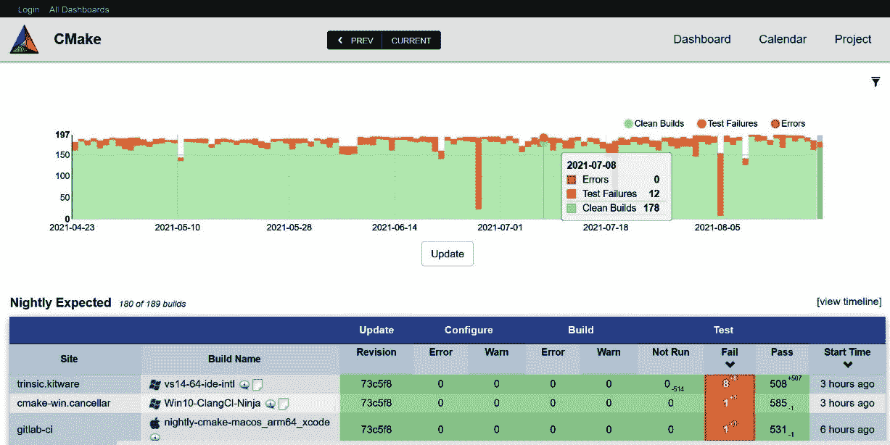
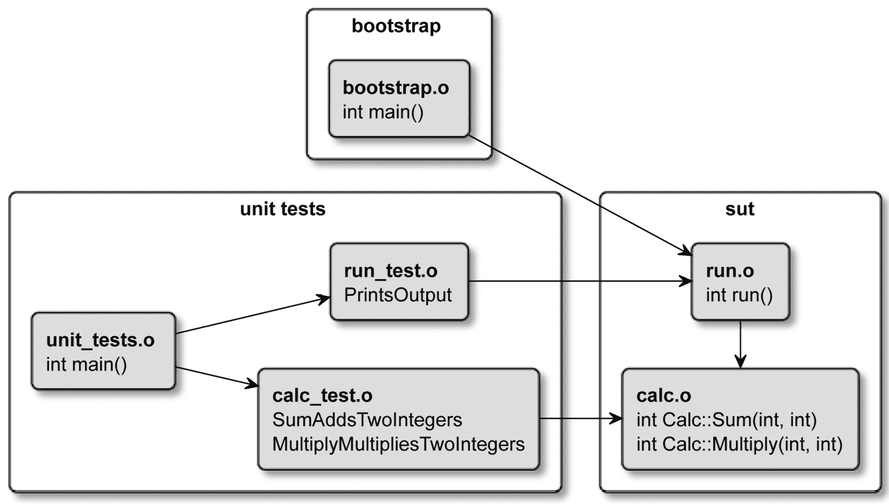
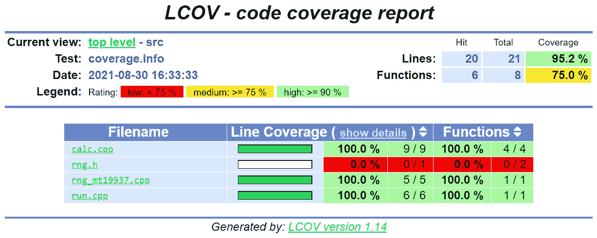
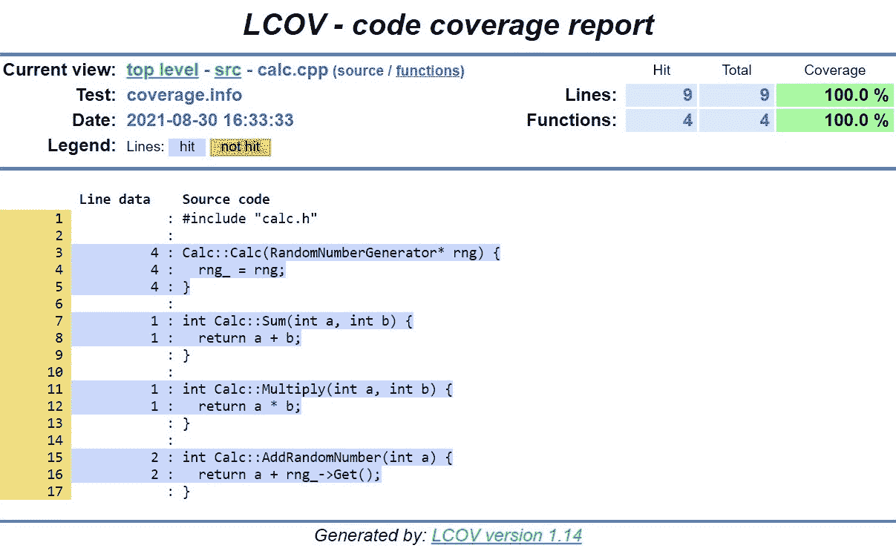

# 第八章：测试框架

有经验的专家知道测试必须自动化。有人向他们解释了这一点，或者他们通过艰苦的方式学到了。这种做法对于没有经验的程序员来说并不那么明显：它似乎是不必要的，额外的工作，并不会带来太多价值。难怪：当某人刚开始编写代码时，他们会避免编写复杂的解决方案和为庞大的代码库做出贡献。他们很可能是他们宠物项目的唯一开发者。这些早期的项目通常需要不到几个月就能完成，所以几乎没有任何机会看到代码在更长时间内是如何变质的。

所有这些因素共同构成了编写测试是浪费时间和精力的观念。编程实习生可能会对自己说，每次执行“构建-运行”流程时，他们实际上确实测试了他们的代码。毕竟，他们已经手动确认了他们的代码可以工作，并且做到了预期。现在是时候转向下一个任务了，对吧？

自动化测试确保新的更改不会意外地破坏我们的程序。在本章中，我们将学习测试的重要性以及如何使用与 CMake 捆绑的 CTest 工具来协调测试执行。CTest 能够查询可用的测试、过滤执行、洗牌、重复和限制时间。我们将探讨如何使用这些特性、控制 CTest 的输出以及处理测试失败。

接下来，我们将调整我们项目的结构以支持测试，并创建我们自己的测试运行器。在讨论基本原理之后，我们将继续添加流行的测试框架：Catch2 和 GoogleTest 及其模拟库。最后，我们将介绍使用 LCOV 进行详细测试覆盖率报告。

在本章中，我们将涵盖以下主要主题：

+   自动化测试为什么值得麻烦？

+   使用 CTest 在 CMake 中标准化测试

+   为 CTest 创建最基本的单元测试

+   单元测试框架

+   生成测试覆盖率报告

# 技术要求

您可以在 GitHub 上的以下链接找到本章中存在的代码文件：

[`github.com/PacktPublishing/Modern-CMake-for-Cpp/tree/main/examples/chapter08`](https://github.com/PacktPublishing/Modern-CMake-for-Cpp/tree/main/examples/chapter08)

为了构建本书中提供的示例，请始终使用推荐的命令：

```cpp
cmake -B <build tree> -S <source tree>
cmake --build <build tree>
```

请确保将占位符`<build tree>`和`<source tree>`替换为适当的路径。作为提醒：**build tree**是目标/输出目录的路径，**source tree**是您的源代码所在的路径。

# 自动化测试为什么值得麻烦？

想象一个工厂生产线，有一个机器在钢板上打孔。这些孔必须具有特定的尺寸和形状，以便它们可以容纳将最终产品固定的螺栓。这样一个工厂线的设计者会设置机器，测试孔是否正确，然后继续。迟早，一些东西会改变：工厂会使用不同、更厚的钢材；工人可能会意外地改变孔的大小；或者，简单地说，需要打更多的孔，机器必须升级。一个聪明的设计师会在生产线的某些点上设置质量控制检查，以确保产品遵循规格并保持其关键特性。孔必须符合特定的要求，但它们是如何产生的并不重要：钻孔、冲孔还是激光切割。

同样的方法在软件开发中也得到了应用：很难预测哪些代码将保持多年不变，哪些代码将经历多次修订。随着软件功能的扩展，我们需要确保我们不会意外地破坏东西。但是，我们还是会犯错。即使是最优秀的程序员也会犯错，因为他们无法预见他们所做的每一处改动的全部影响。更不用说，开发者经常在别人编写的代码上工作，他们不知道之前做出了哪些微妙的假设。他们会阅读代码，建立一个粗略的心理模型，添加必要的改动，并希望他们做对了。大多数时候，这是真的——直到它不再是。在这种情况下，引入的错误可能需要花费数小时甚至数天来修复，更不用说它可能对产品和客户造成的损害。

偶尔，你可能会遇到一些非常难以理解和跟进去的代码。你不仅会质疑这段代码是如何产生的以及它做了什么，你还会开始追查谁应该为创造这样的混乱负责。如果你发现自己是作者，也别太惊讶。这曾经发生在我身上，也会发生在你身上。有时候，代码是在匆忙中编写的，没有完全理解问题。作为开发者，我们不仅受到截止日期或预算的压力。半夜被叫醒修复一个关键故障，你会对某些错误如何逃过代码审查感到震惊。

大多数这些问题都可以通过自动化测试来避免。这些测试代码用于检查另一段代码（即生产中使用的代码）是否正确运行。正如其名，自动化测试应该在每次有人做出改动时无需提示地执行。这通常作为构建过程的一部分发生，并且经常作为控制代码质量的一个步骤，在将其合并到仓库之前执行。

你可能会有避免自动化测试以节省时间的冲动。这将是一个非常昂贵的教训。史蒂文·赖特（Steven Wright）说得对：“*经验是你需要的经验之后才得到的*。”相信我：除非你正在为个人目的编写一次性脚本，或者为非生产性原型编写脚本，否则不要跳过编写测试。最初，你可能会因为自己精心编写的代码不断在测试中失败而感到烦恼。但如果你真的思考一下，那个失败的测试刚刚阻止了你将一个破坏性更改推送到生产环境中。现在投入的努力将在节省修复 bug（和完整的夜晚睡眠）方面得到回报。测试并不像看起来那么难以添加和维护。

# 使用 CTest 在 CMake 中标准化测试

最终，自动化测试涉及到的不过是运行一个可执行文件，设置你的 `test_my_app`，另一个将使用 `unit_tests`，第三个将使用一些不明显或者根本不提供测试的文件。找出需要运行哪个文件，使用哪个框架，向运行器传递哪些参数，以及如何收集结果是用户希望避免的问题。

CMake 通过引入一个独立的 `ctest` 命令行工具来解决这个问题。它由项目作者通过列表文件进行配置，并为执行测试提供了一个统一的方式：对于使用 CMake 构建的每个项目，都有一个相同的、标准化的接口。如果你遵循这个约定，你将享受其他好处：将项目添加到（CI/CD）流水线将更容易，在诸如 Visual Studio 或 CLion 等（IDE）中突出显示它们——所有这些事情都将得到简化，更加方便。更重要的是，你将用非常少的投入获得一个更强大的测试运行工具。

如何在一个已经配置的项目上使用 CTest 执行测试？我们需要选择以下三种操作模式之一：

+   测试

+   构建与测试

+   仪表板客户端

最后一种模式允许您将测试结果发送到一个名为 CDash 的单独工具（也来自 Kitware）。CDash 通过一个易于导航的仪表板收集和汇总软件质量测试结果，如下面的屏幕截图所示：



图 8.1 ‒ CDash 仪表板时间轴视图的屏幕截图

CDash 不在本书的范围内，因为它是作为共享服务器的高级解决方案，可供公司中的所有开发者访问。

注意

如果你有兴趣在线学习，请参考 CMake 的官方文档并访问 CDash 网站：

[`cmake.org/cmake/help/latest/manual/ctest.1.html#dashboard-client`](https://cmake.org/cmake/help/latest/manual/ctest.1.html#dashboard-client)

[`www.cdash.org/`](https://www.cdash.org/)

让我们回到前两种模式。测试模式的命令行如下所示：

```cpp
ctest [<options>]
```

在这种模式下，应在构建树中执行 CTest，在用`cmake`构建项目之后。在开发周期中，这有点繁琐，因为您需要执行多个命令并来回更改工作目录。为了简化这个过程，CTest 增加了一个第二种模式：`build-and-test`模式。

## 构建和测试模式

要使用此模式，我们需要以`--build-and-test`开始执行`ctest`，如下所示：

```cpp
ctest --build-and-test <path-to-source> <path-to-build>
      --build-generator <generator> [<options>...]
      [--build-options <opts>...] 
      [--test-command <command> [<args>...]]
```

本质上，这是一个简单的包装器，它围绕常规测试模式接受一些构建配置选项，并允许我们添加第一个模式下的命令——换句话说，所有可以传递给`ctest <options>`的选项，在传递给`ctest --build-and-test`时也会生效。这里唯一的要求是在`--test-command`参数之后传递完整的命令。与您可能认为的相反，除非在`--test-command`后面提供`ctest`关键字，否则构建和测试模式实际上不会运行任何测试，如下所示：

```cpp
ctest --build-and-test project/source-tree /tmp/build-tree --build-generator "Unix Makefiles" --test-command ctest
```

在这个命令中，我们需要指定源和构建路径，并选择一个构建生成器。这三个都是必需的，并且遵循`cmake`命令的规则，在*第一章*、*CMake 的初步步骤*中有详细描述。

您可以传递额外的参数给这个模式。它们分为三组，分别控制配置、构建过程或测试。

以下是控制配置阶段的参数：

+   `--build-options`—任何额外的`cmake`配置（不是构建工具）选项应紧接在`--test-command`之前，这是最后一个参数。

+   `--build-two-config`—为 CMake 运行两次配置阶段。

+   `--build-nocmake`—跳过配置阶段。

+   `--build-generator-platform`, `--build-generator-toolset`—提供生成器特定的平台和工具集。

+   `--build-makeprogram`—在使用 Make 或 Ninja 生成器时指定`make`可执行文件。

以下是控制构建阶段的参数：

+   `--build-target`—构建指定的目标（而不是`all`目标）。

+   `--build-noclean`—在不首先构建`clean`目标的情况下进行构建。

+   `--build-project`—提供构建项目的名称。

这是用于控制测试阶段的参数：

+   `--test-timeout`—限制测试的执行时间（以秒为单位）。

剩下的就是在`--test-command cmake`参数之后配置常规测试模式。

## 测试模式

假设我们已经构建了我们的项目，并且我们在构建树中执行`ctest`（或者我们使用`build-and-test`包装器），我们最终可以执行我们的测试。

在没有任何参数的情况下，一个简单的`ctest`命令通常足以在大多数场景中获得满意的结果。如果所有测试都通过，`ctest`将返回一个`0`的退出码。您可以在 CI/CD 管道中使用此命令，以防止有错误的提交合并到您仓库的生产分支。

编写好的测试可能和编写生产代码本身一样具有挑战性。我们将 SUT 设置为特定的状态，运行一个测试，然后拆除 SUT 实例。这个过程相当复杂，可能会产生各种问题：跨测试污染、时间和并发干扰、资源争用、由于死锁而导致的执行冻结，以及其他许多问题。

我们可以采用一些策略来帮助检测和解决这些问题。CTest 允许你影响测试选择、它们的顺序、产生的输出、时间限制、重复等等。以下部分将提供必要的上下文和对最有用选项的简要概述。像往常一样，请参阅 CMake 文档以获取详尽的列表。

### 查询测试

我们可能需要做的第一件事就是理解哪些测试实际上是为本项目编写的。CTest 提供了一个`-N`选项，它禁用执行，只打印列表，如下所示：

```cpp
# ctest -N
Test project /tmp/b
  Test #1: SumAddsTwoInts
  Test #2: MultiplyMultipliesTwoInts
Total Tests: 2
```

你可能想用下一节中描述的筛选器与`-N`一起使用，以检查当应用筛选器时会执行哪些测试。

如果你需要一个可以被自动化工具消费的 JSON 格式，请用`--show-only=json-v1`执行`ctest`。

CTest 还提供了一个用`LABELS`关键字来分组测试的机制。要列出所有可用的标签（而不实际执行任何测试），请使用`--print-labels`。这个选项在测试用手动定义时很有帮助，例如在你的列表文件中使用`add_test(<name> <test-command>)`命令，因为你可以通过测试属性指定个别标签，像这样：

```cpp
set_tests_properties(<name> PROPERTIES LABELS "<label>")
```

另一方面，我们稍后讨论的框架提供了自动测试发现，不幸的是，它还不支持如此细粒度的标签。

### 过滤测试

有很多理由只运行所有测试的一部分——最常见的原因可能是需要调试一个失败的测试或你正在工作的模块。在这种情况下，等待所有其他测试是没有意义的。其他高级测试场景甚至可能将测试用例分区并在测试运行器集群上分布负载。

这些标志将根据提供的`<r>` **正则表达式**（**regex**）过滤测试，如下所示：

+   `-R <r>`, `--tests-regex <r>`—只运行名称匹配`<r>`的测试

+   `-E <r>`, `--exclude-regex <r>`—跳过名称匹配`<r>`的测试

+   `-L <r>`, `--label-regex <r>`—只运行标签匹配`<r>`的测试

+   `-LE <r>`, `--label-exclude <正则表达式>`—跳过标签匹配`<r>`的测试

使用`--tests-information`选项（或更短的形式，`-I`）可以实现高级场景。用这个筛选器提供一个逗号分隔的范围内的值：`<开始>, <结束>, <步长>`。任意字段都可以为空，再有一个逗号之后，你可以附加个别`<测试 ID>`值来运行它们。以下是几个例子：

+   `-I 3,,`将跳过 1 和 2 个测试（执行从第三个测试开始）

+   `-I ,2,`只运行第一和第二个测试

+   `-I 2,,3`将从第二行开始运行每个第三测试

+   `-I ,0,,3,9,7`将只运行第三、第九和第七个测试

选择性地，CTest 将接受包含规格的文件名，格式与上面相同。正如您所想象的，用户更喜欢按名称过滤测试。此选项可用于将测试分布到多台机器上，适用于非常大的测试套件。

默认情况下，与`-R`一起使用的`-I`选项将缩小执行范围（仅运行同时满足两个要求的测试）。如果您需要两个要求的并集来执行（任一要求即可），请添加`-U`选项。

如前所述，您可以使用`-N`选项来检查过滤结果。

### 洗牌测试

编写单元测试可能很棘手。遇到的一个更令人惊讶的问题就是测试耦合，这是一种情况，其中一个测试通过不完全设置或清除 SUT 的状态来影响另一个测试。换句话说，首先执行的测试可能会“泄漏”其状态，污染第二个测试。这种耦合之所以糟糕，是因为它引入了测试之间的未知、隐性关系。

更糟糕的是，这种错误在测试场景的复杂性中隐藏得非常好。我们可能会在它导致测试失败时检测到它，但反之亦然：错误的状态导致测试通过，而它本不该通过。这种虚假通过的测试给开发者带来了安全感，这比没有测试还要糟糕。代码正确测试的假设可能会鼓励更大胆的行动，导致意外的结果。

发现此类问题的一种方法是单独运行每个测试。通常，当我们直接从测试框架中执行测试运行器而不使用 CTest 时，并非如此。要运行单个测试，您需要向测试可执行文件传递框架特定的参数。这允许您检测在测试套件中通过但在单独执行时失败的测试。

另一方面，CTest 有效地消除了所有基于内存的测试交叉污染，通过隐式执行子 CTest 实例中的每个测试用例。您甚至可以更进一步，添加`--force-new-ctest-process`选项以强制使用单独的进程。

不幸的是，仅凭这一点还不足以应对测试使用的外部、争用资源，如 GPU、数据库或文件。我们可以采取的额外预防措施之一是简单地随机化测试执行顺序。这种干扰通常足以最终检测到这种虚假通过的测试。CTest 支持这种策略，通过`--schedule-random`选项。

### 处理失败

这里有一句约翰·C· Maxwell 著名的名言：“*Fail early, fail often, but always fail forward.*” 这正是我们在执行单元测试时（也许在生活的其他领域）想要做的事情。除非你在运行测试时附带了调试器，否则很难了解到你在哪里出了错，因为 CTest 会保持简洁，只列出失败的测试，而不实际打印它们的输出。

测试案例或 SUT 打印到`stdout`的信息可能对确定具体出了什么问题非常有价值。为了看到这些信息，我们可以使用`--output-on-failure`运行`ctest`。另外，设置`CTEST_OUTPUT_ON_FAILURE`环境变量也会有相同的效果。

根据解决方案的大小，在任何一个测试失败后停止执行可能是有意义的。这可以通过向`ctest`提供`--stop-on-failure`参数来实现。

CTest 存储了失败测试的名称。为了在漫长的测试套件中节省时间，我们可以关注这些失败的测试，并在解决问题前跳过运行通过的测试。这个特性可以通过使用`--rerun-failed`选项来实现（忽略其他任何过滤器）。记得在解决问题后运行所有测试，以确保在此期间没有引入回归。

当 CTest 没有检测到任何测试时，这可能意味着两件事：要么是测试不存在，要么是项目有问题。默认情况下，`ctest`会打印一条警告信息并返回一个`0`退出码，以避免混淆。大多数用户会有足够的上下文来理解他们遇到了哪种情况以及接下来应该做什么。然而，在某些环境中，`ctest`总是会执行，作为自动化流水线的一部分。那么，我们可能需要明确表示，测试的缺失应该被解释为错误（并返回非零退出码）。我们可以通过提供`--no-tests=error`参数来配置这种行为。要实现相反的行为（不警告），请使用`--no-tests=ignore`选项。

### 重复执行测试

迟早在你的职业生涯中，你将会遇到那些大部分时间都能正确工作的测试。我想强调一下*most*这个词。偶尔，这些测试会因为环境原因而失败：由于错误地模拟了时间、事件循环问题、异步执行处理不当、并发性、散列冲突，以及其他在每次运行时都不会发生的非常复杂的情况。这些不可靠的测试被称为“flaky tests”。

这种不一致性看起来并不是一个很重要的问题。我们可能会说测试并不等同于真正的生产环境，这也是它们有时候会失败的根本原因。这种说法有一定的道理：测试不可能模拟每一个细节，因为这并不可行。测试是一种模拟，是对可能发生的事情的一种近似，这通常已经足够好了。如果测试在下次执行时会通过，重新运行测试有什么害处呢？

实际上，这是有关系的。主要有三个担忧，如下所述：

+   如果你在你的代码库中收集了足够的不稳定测试，它们将成为代码变更顺利交付的一个严重障碍。尤其是当你急于回家（比如周五下午）或交付一个严重影响客户问题的紧急修复时，这种情况尤其令人沮丧。

+   你无法真正确信你的不稳定测试之所以失败是因为测试环境的不足。可能正好相反：它们失败是因为它们复现了一个在生产环境中已经发生的罕见场景。只是还没有足够明显地发出警报… 而已。

+   不是测试本身具有不稳定性——是你的代码有问题！环境有时确实会出问题——作为程序员，我们以确定性的方式处理这些问题。如果 SUT 以这种方式运行，这是一个严重错误的迹象——例如，代码可能正在读取未初始化的内存。

没有一种完美的方式来解决所有上述情况——可能的原因太多。然而，我们可以通过使用`–repeat <mode>:<#>`选项来重复运行测试，从而增加我们识别不稳定测试的机会。以下是三种可供选择的模式：

+   `until-fail`—运行测试`<#>`次；所有运行都必须通过。

+   `until-pass`—运行测试至`<#>`次；至少要通过一次。当处理已知具有不稳定性的测试时，这个方法很有用，但这些测试太难且重要，无法进行调试或禁用。

+   `after-timeout`—运行测试至`<#>`次，但只有在测试超时的情况下才重试。在繁忙的测试环境中使用它。

一般建议尽快调试不稳定测试或如果它们不能被信任以产生一致的结果，就摆脱它们。

### 控制输出

每次都将所有信息打印到屏幕上会立即变得非常繁忙。Ctest 减少了噪音，并将它执行的测试的输出收集到日志文件中，在常规运行中只提供最有用的信息。当事情变坏，测试失败时，如果你启用了`--output-on-failure`（如前面所述），你可以期待一个摘要，可能还有一些日志。

我从经验中知道，“足够的信息”是足够的，直到它不再足够。有时，我们可能希望查看通过测试的输出，也许是为了检查它们是否真的在正常工作（而不是默默地停止，没有错误）。为了获取更详细的输出，可以添加`-V`选项（或者如果你想在自动化管道中明确表示，可以使用`--verbose`）。如果这还不够，你可能想要`-VV`或`--extra-verbose`。对于非常深入的调试，可以使用`--debug`（但要做好准备，因为会有很多文本细节）。

如果你在寻找相反的，CTest 还提供了通过`-Q`启用的“禅模式”，或`--quiet`。那时将不会打印任何输出（你可以停止担心，学会平静）。似乎这个选项除了让人困惑之外没有其他用途，但请注意，输出仍然会存储在测试文件中（默认在`./Testing/Temporary`中）。自动化管道可以通过检查退出代码是否非零值，并在不向开发者输出可能混淆的详细信息的情况下，收集日志文件进行进一步处理。

要将在特定路径存储日志，请使用`-O <文件>`、`--output-log <文件>`选项。如果您苦于输出过长，有两个限制选项可以将它们限制为每个测试给定的字节数：`--test-output-size-passed <大小>`和`--test-output-size-failed <大小>`。

### 杂项

还有一些其他的有用选项，可以满足你日常测试需求，如下所述：

+   `-C <配置>, --build-config <配置>`（仅限多配置生成器）—使用此选项指定要测试的配置。`Debug`配置通常包含调试符号，使事情更容易理解，但`Release`也应该测试，因为强烈的优化选项可能会潜在地影响 SUT 的行为。

+   `-j <作业数>, --parallel <作业数>`—这设置了并行执行的测试数量。在开发过程中，它非常有用，可以加快长测试的执行。请注意，在一个繁忙的环境中（在共享的测试运行器上），它可能会因调度而产生不利影响。这可以通过下一个选项稍微缓解。

+   `--test-load <级别>`—使用此选项以一种方式安排并行测试，使 CPU 负载不超过`<级别>`值（尽最大努力）。

+   `--timeout <秒>`—使用此选项指定单个测试的默认时间限制。

既然我们已经了解了如何在许多不同场景下执行`ctest`，那么让我们学习如何添加一个简单的测试。

# 为 CTest 创建最基本的单元测试

技术上讲，编写单元测试可以在没有任何框架的情况下进行。我们只需要做的是创建一个我们想要测试的类的实例，执行其一种方法，并检查返回的新状态或值是否符合我们的期望。然后，我们报告结果并删除被测试对象。让我们试一试。

我们将使用以下结构：

```cpp
- CMakeLists.txt
- src
  |- CMakeLists.txt
  |- calc.cpp
  |- calc.h
  |- main.cpp
- test
  |- CMakeLists.txt
  |- calc_test.cpp
```

从`main.cpp`开始，我们可以看到它将使用一个`Calc`类，如下面的代码片段所示：

chapter08/01-no-framework/src/main.cpp

```cpp
#include <iostream>
#include "calc.h"
using namespace std;
int main() {
  Calc c;
  cout << "2 + 2 = " << c.Sum(2, 2) << endl;
  cout << "3 * 3 = " << c.Multiply(3, 3) << endl;
}
```

并不太复杂—`main.cpp`简单地包含了`calc.h`头文件，并调用了`Calc`对象的两种方法。让我们快速看一下`Calc`的接口，我们的 SUT 如下：

chapter08/01-no-framework/src/calc.h

```cpp
#pragma once
class Calc {
 public:
   int Sum(int a, int b);
   int Multiply(int a, int b);
};
```

界面尽可能简单。我们在这里使用了`#pragma once`——它的工作方式与常见的预处理器包含保护符完全一样，尽管它不是官方标准的一部分，但几乎所有现代编译器都能理解。让我们看看类的实现，如下所示：

chapter08/01-no-framework/src/calc.cpp

```cpp
#include "calc.h"
int Calc::Sum(int a, int b) {
  return a + b;
}
int Calc::Multiply(int a, int b) {
  return a * a; // a mistake!
}
```

哎呀！我们引入了一个错误！`Multiply`忽略了`b`参数，而是返回`a`的平方。这应该被正确编写的单元测试检测到。所以，让我们写一些！开始吧：

chapter08/01-no-framework/test/calc_test.cpp

```cpp
#include "calc.h"
#include <cstdlib>
void SumAddsTwoIntegers() {
  Calc sut;
  if (4 != sut.Sum(2, 2))
    std::exit(1);
}
void MultiplyMultipliesTwoIntegers() {
  Calc sut;
  if(3 != sut.Multiply(1, 3))
    std::exit(1);
}
```

我们开始编写`calc_test.cpp`文件，其中包含两个测试方法，分别针对 SUT 的每个测试方法。如果从调用方法返回的值与期望不符，每个函数都将调用`std::exit(1)`。我们本可以使用`assert()`、`abort()`或`terminate()`，但那样的话，在`ctest`的输出中，我们将得到一个更难读的`Subprocess aborted`消息，而不是更易读的`Failed`消息。

是时候创建一个测试运行器了。我们的将会尽可能简单，因为正确地做这将需要大量的工作。 just look at the `main()` function we had to write in order to run just two tests:

chapter08/01-no-framework/test/unit_tests.cpp

```cpp
#include <string>
void SumAddsTwoIntegers();
void MultiplyMultipliesTwoIntegers();
int main(int argc, char *argv[]) {
  if (argc < 2 || argv[1] == std::string("1"))
    SumAddsTwoIntegers();
  if (argc < 2 || argv[1] == std::string("2"))
    MultiplyMultipliesTwoIntegers();
}
```

下面是这里发生的事情的分解：

+   我们声明了两个外部函数，它们将从另一个翻译单元链接过来。

+   如果没有提供任何参数，执行两个测试（`argv[]`中的零元素总是程序名）。

+   如果第一个参数是测试的标识符，执行它。

+   如果有任何测试失败，它内部调用`exit()`并返回`1`退出码。

+   如果没有执行任何测试或所有测试都通过，它隐式地返回`0`退出码。

要运行第一个测试，我们将执行`./unit_tests 1`；要运行第二个，我们将执行`./unit_tests 2`。我们尽可能简化代码，但它仍然变得相当难以阅读。任何可能需要维护这一部分的人在添加更多测试后都不会有很好的时光，更不用说这个功能相当原始——调试这样一个测试套件将是一项艰巨的工作。尽管如此，让我们看看我们如何使用它与 CTest，如下所示：

chapter08/01-no-framework/CMakeLists.txt

```cpp
cmake_minimum_required(VERSION 3.20.0)
project(NoFrameworkTests CXX)
enable_testing()
add_subdirectory(src bin)
add_subdirectory(test)
```

我们从常用的标题和`enable_testing()`开始。这是为了告诉 CTest 我们想在当前目录及其子目录中启用测试。接下来，我们在每个子目录中包含两个嵌套的列表文件：`src`和`test`。高亮的`bin`值表示我们希望`src`子目录的二进制输出放在`<build_tree>/bin`中。否则，二进制文件将出现在`<build_tree>/src`中，这可能会引起混淆。毕竟，构建工件不再是源文件。

`src`目录的列表文件非常直接，包含一个简单的`main`目标定义，如下所示：

chapter08/01-no-framework/src/CMakeLists.txt

```cpp
add_executable(main main.cpp calc.cpp)
```

我们还需要为`test`目录编写一个列表文件，如下所示：

chapter08/01-no-framework/test/CMakeLists.txt

```cpp
add_executable(unit_tests
               unit_tests.cpp
               calc_test.cpp
               ../src/calc.cpp)
target_include_directories(unit_tests PRIVATE ../src)
add_test(NAME SumAddsTwoInts COMMAND unit_tests 1)
add_test(NAME MultiplyMultipliesTwoInts COMMAND unit_tests 2)
```

我们现在定义了第二个`unit_tests`目标，它也使用`src/calc.cpp`实现文件和相应的头文件。最后，我们明确添加了两个测试：`SumAddsTwoInts`和`MultiplyMultipliesTwoInts`。每个都将其 ID 作为`add_test()`命令的参数。`CTest`将简单地取`COMMAND`关键字之后提供的一切，并在子壳中执行它，收集输出和退出代码。不要对`add_test()`过于依赖——在*单元测试框架*部分，我们将发现处理测试用例的更好方法，所以我们在这里不详细描述它。

这是在构建树中执行时`ctest`实际的工作方式：

```cpp
# ctest
Test project /tmp/b
    Start 1: SumAddsTwoInts
1/2 Test #1: SumAddsTwoInts ...................   Passed    0.00 sec
    Start 2: MultiplyMultipliesTwoInts
2/2 Test #2: MultiplyMultipliesTwoInts ........***Failed    0.00 sec
50% tests passed, 1 tests failed out of 2
Total Test time (real) =   0.00 sec
The following tests FAILED:
          2 - MultiplyMultipliesTwoInts (Failed)
Errors while running CTest
Output from these tests are in: /tmp/b/Testing/Temporary/LastTest.log
Use "--rerun-failed --output-on-failure" to re-run the failed cases verbosely.
```

`ctest`执行了这两个测试，并报告说其中一个失败——`Calc::Multiply`返回的值没有达到预期。非常好。我们现在知道我们的代码有一个错误，有人应该修复它。

注意

你可能注意到，在迄今为止的大多数例子中，我们并没有一定使用在第*第三章*，*设置你的第一个 CMake 项目*中描述的项目结构。这是为了保持事情的简洁。本章讨论更多高级概念，因此使用完整的结构是合适的。在你的项目中（无论多么小），最好从一开始就遵循这个结构。正如一个智者曾经说过：“*你踏上道路，如果你不保持你的脚步，你不知道会被冲到哪里.*”

众所周知，你应避免在项目中构建测试框架。即使是最基础的例子也会让人眼睛疲劳，开销很大，并且没有增加任何价值。然而，在我们采用单元测试框架之前，我们需要重新思考项目的结构。

## 为测试搭建项目结构

C++具有一些有限的内省能力，但无法提供像 Java 那样的强大回顾功能。这可能正是编写 C++代码的测试和单元测试框架比在其他更丰富的环境中困难的原因。这种经济方法的含义之一是程序员必须更参与构造可测试代码。我们不仅要更仔细地设计我们的接口，还要回答关于实践问题，例如：*我们如何避免编译双重，并在测试和生产之间重用工件？*

编译时间对于小型项目可能不是一个问题，但随着时间推移，项目会增长。对于短编译循环的需求并不会消失。在之前的例子中，我们将所有`sut`源文件附加到单元测试可执行文件中，除了`main.cpp`文件。如果你仔细阅读，你会发现我们在这个文件中有些代码是没有被测试的（`main()`本身的内容）。通过编译代码两次，产生的工件可能不会*完全相同*。这些事物可能会随着时间的推移而逐渐偏离（由于添加了编译标志和预处理器指令）。当工程师匆忙、缺乏经验或不熟悉项目时，这可能尤其危险。

处理这个问题有多种方法，但最优雅的方法是将整个解决方案构建为一个库，并与单元测试链接。你可能会问：“*我们怎么运行它呢？*”我们需要一个引导可执行文件，它将链接库并运行其代码。

首先，将您当前的`main()`函数重命名为`run()`、`start_program()`或类似名称。然后，创建另一个实现文件（`bootstrap.cpp`），其中包含一个新的`main()`函数，仅此而已。这将成为我们的适配器（或者说是包装器）：它的唯一作用是提供一个入口点并调用`run()`转发命令行参数（如果有）。剩下的就是将所有内容链接在一起，这样我们就有了一个可测试的项目。

通过重命名`main()`，我们现在可以链接被测试的系统（SUT）和测试，并且还能测试它的主要功能。否则，我们就违反了`main()`函数。正如第六章“为测试分离 main()”部分所承诺的，我们将详细解释这个主题。

测试框架可能提供自己的`main()`函数实现，所以我们不需要编写。通常，它会检测我们链接的所有测试，并根据所需配置执行它们。

这种方法产生的工件可以分为以下目标：

+   带有生产代码的`sut`库

+   `bootstrap`带有`main()`包装器，调用`sut`中的`run()`

+   带有`main()`包装器，运行所有`sut`测试的`单元测试`

以下图表展示了目标之间的符号关系：



图 8.2 ‒ 在测试和生产可执行文件之间共享工件

我们最终会得到六个实现文件，它们将生成各自的（`.o`）*目标文件*，如下所示：

+   `calc.cpp`—要进行单元测试的`Calc`类。这被称为**被测试单元**（**UUT**），因为 UUT 是 SUT 的一个特化。

+   `run.cpp`—原始入口点重命名为`run()`，现在可以进行测试。

+   `bootstrap.cpp`—新的`main()`入口点调用`run()`。

+   `calc_test.cpp`—测试`Calc`类。

+   `run_test.cpp`—新增`run()`的测试可以放在这里。

+   `unit_tests.o`—单元测试的入口点，扩展为调用`run()`的测试。

我们即将构建的库实际上并不需要是一个实际的库：静态的或共享的。通过创建一个对象库，我们可以避免不必要的归档或链接。从技术上讲，通过为 SUT 依赖动态链接来节省几秒钟是可能的，但往往我们同时在两个目标上进行更改：`tests`和`sut`，抵消了任何潜在的收益。

让我们看看我们的文件有哪些变化，首先是从先前命名为`main.cpp`的文件开始，如下所示：

chapter08/02-structured/src/run.cpp

```cpp
#include <iostream>
#include "calc.h"
using namespace std;
int run() {
  Calc c;
  cout << "2 + 2 = " << c.Sum(2, 2) << endl;
  cout << "3 * 3 = " << c.Multiply(3, 3) << endl;
  return 0;
}
```

变化并不大：重命名文件和函数。我们还添加了一个`return`语句，因为编译器不会隐式地为非`main()`函数这样做。

新的`main()`函数看起来像这样：

chapter08/02-structured/src/bootstrap.cpp

```cpp
int run(); // declaration
int main() {
  run();
}
```

尽可能简单——我们声明链接器将从另一个翻译单元提供`run()`函数，并且我们调用它。接下来需要更改的是`src`列表文件，您可以看到这里：

chapter08/02-structured/src/CMakeLists.txt

```cpp
add_library(sut STATIC calc.cpp run.cpp)
target_include_directories(sut PUBLIC .)
add_executable(bootstrap bootstrap.cpp)
target_link_libraries(bootstrap PRIVATE sut)
```

首先，我们创建了一个`sut`库，并将`.`标记为`PUBLIC` *包含目录*，以便将其传播到所有将链接`sut`的目标（即`bootstrap`和`unit_tests`）。请注意，*包含目录*是相对于列表文件的，因此我们可以使用点（`.`）来引用当前的`<source_tree>/src`目录。

是时候更新我们的`unit_tests`目标了。在这里，我们将移除对`../src/calc.cpp`文件的直接引用，改为`sut`的链接引用作为`unit_tests`目标。我们还将为`run_test.cpp`文件中的主函数添加一个新测试。为了简洁起见，我们将跳过讨论那个部分，但如果您感兴趣，可以查看在线示例。同时，这是整个`test`列表文件：

chapter08/02-structured/test/CMakeLists.txt

```cpp
add_executable(unit_tests
               unit_tests.cpp
               calc_test.cpp
               run_test.cpp)
target_link_libraries(unit_tests PRIVATE sut)
```

我们还应该注册新的测试，如下所示：

```cpp
add_test(NAME SumAddsTwoInts COMMAND unit_tests 1)
add_test(NAME MultiplyMultipliesTwoInts COMMAND unit_tests 2)
add_test(NAME RunOutputsCorrectEquations COMMAND unit_tests 3)
```

完成！通过遵循这种做法，您可以确信您的测试是在将用于生产的实际机器代码上执行的。

注意

我们在这里使用的目标名称`sut`和`bootstrap`，是为了让从测试的角度来看它们非常清晰。在实际项目中，您应该选择与生产代码上下文相匹配的名称（而不是测试）。例如，对于一个 FooApp，将您的目标命名为`foo`，而不是`bootstrap`，将`lib_foo`命名为`sut`。

既然我们已经知道如何在一个适当的目标中结构一个可测试的项目，那么让我们将重点转移到测试框架本身。我们不想手动将每个测试用例添加到我们的列表文件中，对吧？

# 单元测试框架

上一节证明了编写一个微小的单元测试驱动并不非常复杂。它可能不够美观，但信不信由你，专业开发者实际上*确实喜欢*重新发明轮子（他们的轮子会更漂亮、更圆、更快）。不要陷入这个陷阱：你会创建出如此多的模板代码，它可能成为一个独立的项目。将一个流行的单元测试框架引入你的解决方案中，可以使它符合超越项目和公司的标准，并为你带来免费的更新和扩展。你没有损失。

我们如何将单元测试框架添加到我们的项目中呢？嗯，根据所选框架的规则在实现文件中编写测试，并将这些测试与框架提供的测试运行器链接起来。测试运行器是您的入口点，将启动所选测试的执行。与我们在本章早些时候看到的基本的`unit_tests.cpp`文件不同，许多它们将自动检测所有测试。太美了。

本章我决定介绍两个单元测试框架。我选择它们的原因如下：

+   **Catch2** 是一个相对容易学习、得到良好支持和文档的项目。它提供了简单的测试用例，但同时也提供了用于**行为驱动开发**（**BDD**）的优雅宏。它缺少一些功能，但在需要时可以与外部工具配合使用。您可以在这里访问其主页：[`github.com/catchorg/Catch2`](https://github.com/catchorg/Catch2)。

+   **GTest** 也非常方便，但功能更加强大。它的关键特性是一组丰富的断言、用户定义的断言、死亡测试、致命和非致命失败、值和类型参数化测试、XML 测试报告生成以及模拟。最后一个是通过从同一存储库中可用的 GMock 模块提供的： [`github.com/google/googletest`](https://github.com/google/googletest)。

您应该选择哪个框架取决于您的学习方法和项目大小。如果您喜欢缓慢、逐步的过程，并且不需要所有的花哨功能，那么选择 Catch2。那些喜欢从深层次开始并需要大量火力支持的开发人员将受益于选择 GTest。

## Catch2

这个由 Martin Hořeňovský维护的框架，对于初学者和小型项目来说非常棒。这并不是说它不能处理更大的应用程序，只要你记住，只要记得在需要额外工具的区域会有所需要。如果我详细介绍这个框架，我就会偏离本书的主题太远，但我仍然想给你一个概述。首先，让我们简要地看看我们可以为我们的`Calc`类编写单元测试的实现，如下所示：

chapter08/03-catch2/test/calc_test.cpp

```cpp
#include <catch2/catch_test_macros.hpp>
#include "calc.h"
TEST_CASE("SumAddsTwoInts", "[calc]") {
  Calc sut;
  CHECK(4 == sut.Sum(2, 2));
}
TEST_CASE("MultiplyMultipliesTwoInts", "[calc]") {
  Calc sut;
  CHECK(12 == sut.Multiply(3, 4));
}
```

就这样。这几行比我们之前写的例子要强大得多。`CHECK()`宏不仅验证期望是否满足——它们还会收集所有失败的断言，并在单个输出中呈现它们，这样你就可以进行一次修复，避免重复编译。

现在，最好的一部分：我们不需要在任何地方添加这些测试，甚至不需要通知 CMake 它们存在；你可以忘记`add_test()`，因为你再也用不到了。如果允许的话，Catch2 会自动将你的测试注册到 CTest。在上一节中描述的配置项目后，添加框架非常简单。我们需要使用`FetchContent()`将其引入项目。

有两个主要版本可供选择：`v2`和`v3`。版本 2 作为一个单头库（只需`#include <catch2/catch.hpp>`）提供给 C++11，最终将被版本 3 所取代。这个版本由多个头文件组成，被编译为静态库，并要求 C++14。当然，如果你能使用现代 C++（是的，C++11 不再被认为是“现代”的），那么推荐使用更新的版本。在与 Catch2 合作时，你应该选择一个 Git 标签并在你的列表文件中固定它。换句话说，不能保证升级不会破坏你的代码（升级很可能不会破坏代码，但如果你不需要，不要使用`devel`分支）。要获取 Catch2，我们需要提供一个仓库的 URL，如下所示：

chapter08/03-catch2/test/CMakeLists.txt

```cpp
include(FetchContent)
FetchContent_Declare(
  Catch2
  GIT_REPOSITORY https://github.com/catchorg/Catch2.git
  GIT_TAG        v3.0.0
)
FetchContent_MakeAvailable(Catch2)
```

然后，我们需要定义我们的`unit_tests`目标，并将其与`sut`以及一个框架提供的入口点和`Catch2::Catch2WithMain`库链接。由于 Catch2 提供了自己的`main()`函数，我们不再使用`unit_tests.cpp`文件（这个文件可以删除）。代码如下所示：

chapter08/03-catch2/test/CMakeLists.txt（续）

```cpp
add_executable(unit_tests 
               calc_test.cpp 
               run_test.cpp)
target_link_libraries(unit_tests PRIVATE 
                      sut Catch2::Catch2WithMain)
```

最后，我们使用由 Catch2 提供的模块中定义的`catch_discover_tests()`命令，该命令将检测`unit_tests`中的所有测试用例并将它们注册到 CTest，如下所示：

chapter08/03-catch2/test/CMakeLists.txt（续）

```cpp
list(APPEND CMAKE_MODULE_PATH ${catch2_SOURCE_DIR}/extras)
include(Catch)
catch_discover_tests(unit_tests)
```

完成了。我们刚刚为我们的解决方案添加了一个单元测试框架。现在让我们看看它的实际应用。测试运行器的输出如下所示：

```cpp
# ./test/unit_tests
unit_tests is a Catch v3.0.0 host application.
Run with -? for options
--------------------------------------------------------------
MultiplyMultipliesTwoInts
--------------------------------------------------------------
examples/chapter08/03-catch2/test/calc_test.cpp:9
..............................................................
examples/chapter08/03-catch2/test/calc_test.cpp:11: FAILED:
  CHECK( 12 == sut.Multiply(3, 4) )
with expansion:
  12 == 9
==============================================================
test cases: 3 | 2 passed | 1 failed
assertions: 3 | 2 passed | 1 failed
```

直接执行运行器（编译的`unit_test`可执行文件）稍微快一点，但通常，你希望使用`ctest --output-on-failure`命令，而不是直接执行测试运行器，以获得前面提到的所有 CTest 好处。注意 Catch2 能够方便地将`sut.Multiply(3, 4)`表达式扩展为`9`，为我们提供更多上下文。

这就结束了 Catch2 的设置。如果你还需要添加更多测试，只需创建实现文件并将它们的路径添加到`unit_tests`目标的源列表中。

这个框架包含了一些有趣的小技巧：事件监听器、数据生成器和微基准测试，但它并不提供模拟功能。如果你不知道什么是模拟，继续阅读——我们马上就会涉及到这一点。然而，如果你发现自己需要模拟，你总是可以在这里列出的一些模拟框架旁边添加 Catch2：

+   FakeIt ([`github.com/eranpeer/FakeIt`](https://github.com/eranpeer/FakeIt))

+   Hippomocks ([`github.com/dascandy/hippomocks`](https://github.com/dascandy/hippomocks))

+   Trompeloeil ([`github.com/rollbear/trompeloeil`](https://github.com/rollbear/trompeloeil))

话说回来，对于一个更简洁、更先进的体验，还有另一个框架值得一看。

## GTest

使用 GTest 有几个重要的优点：它已经存在很长时间，并且在 C++社区中高度认可（因此，多个 IDE 支持它）。背后最大的搜索引擎公司的维护和广泛使用，所以它很可能在不久的将来变得过时或被遗弃。它可以测试 C++11 及以上版本，所以如果你被困在一个稍微老一点的环境中，你很幸运。

GTest 仓库包括两个项目：GTest（主测试框架）和 GMock（一个添加模拟功能的库）。这意味着你可以用一个`FetchContent()`调用来下载它们。

### 使用 GTest

要使用 GTest，我们的项目需要遵循*为测试结构化项目*部分的方向。这就是我们在这个框架中编写单元测试的方法：

chapter08/04-gtest/test/calc_test.cpp

```cpp
#include <gtest/gtest.h>
#include "calc.h"
class CalcTestSuite : public ::testing::Test {
 protected:
  Calc sut_;
};
TEST_F(CalcTestSuite, SumAddsTwoInts) {
  EXPECT_EQ(4, sut_.Sum(2, 2));
}
TEST_F(CalcTestSuite, MultiplyMultipliesTwoInts) {
  EXPECT_EQ(12, sut_.Multiply(3, 4));
}
```

由于这个例子也将用于 GMock，我决定将测试放在一个`CalcTestSuite`类中。测试套件是相关测试的组，因此它们可以重用相同的字段、方法和设置（初始化）以及清理步骤。要创建一个测试套件，我们需要声明一个新的类，从`::testing::Test`继承，并将重用元素（字段、方法）放在其`protected`部分。

测试套件中的每个测试用例都是用`TEST_F()`预处理器宏声明的，该宏将测试套件和测试用例提供的名称字符串化（还有一个简单的`TEST()`宏，定义不相关的测试）。因为我们已经在类中定义了`Calc sut_`，每个测试用例可以像`CalcTestSuite`的一个方法一样访问它。实际上，每个测试用例在其自己的类中隐式继承自`CalcTestSuite`运行（这就是我们需要`protected`关键字的原因）。请注意，重用字段不是为了在连续测试之间共享任何数据——它们的目的是保持代码*DRY*。

GTest 没有提供像 Catch2 那样的自然断言语法。相反，我们需要使用一个显式的比较，比如`EXPECT_EQ()`。按照惯例，我们将期望值作为第一个参数，实际值作为第二个参数。还有许多其他断言、助手和宏值得学习。

注意

关于 GTest 的详细信息，请参阅官方参考资料([`google.github.io/googletest/`](https://google.github.io/googletest/)).

要将此依赖项添加到我们的项目中，我们需要决定使用哪个版本。与 Catch2 不同，GTest 倾向于采用“现场开发”的理念（起源于 GTest 所依赖的 Abseil 项目）。它指出：“*如果你从源代码构建我们的依赖项并遵循我们的 API，你不会遇到任何问题。*”（更多详情请参阅*进阶阅读*部分。）

如果你习惯于遵循这个规则（并且从源代码构建没有问题），将你的 Git 标签设置为`master`分支。否则，从 GTest 仓库中选择一个版本。我们还可以选择首先在宿主机器上搜索已安装的副本，因为 CMake 提供了一个捆绑的`FindGTest`模块来查找本地安装。自 v3.20 起，CMake 将使用上游的`GTestConfig.cmake`配置文件（如果存在），而不是依赖于可能过时的查找模块。

无论如何，添加对 GTest 的依赖项看起来是这样的：

chapter08/04-gtest/test/CMakeLists.txt

```cpp
include(FetchContent)
FetchContent_Declare(
  googletest
  GIT_REPOSITORY https://github.com/google/googletest.git
  GIT_TAG master
)
set(gtest_force_shared_crt ON CACHE BOOL "" FORCE)
FetchContent_MakeAvailable(googletest)
```

我们遵循与 Catch2 相同的方法——执行`FetchContent()`并从源代码构建框架。唯一的区别是在 GTest 作者建议的`set(gtest...)`命令，以防止在 Windows 上覆盖父项目的编译器和链接器设置。

最后，我们可以声明我们的测试运行器可执行文件，链接`gtest_main`，并借助内置的 CMake `GoogleTest`模块自动发现我们的测试用例，如下所示：

chapter08/04-gtest/test/CMakeLists.txt（续）

```cpp
add_executable(unit_tests
               calc_test.cpp
               run_test.cpp)
target_link_libraries(unit_tests PRIVATE sut gtest_main)
include(GoogleTest)
gtest_discover_tests(unit_tests)
```

这完成了 GTest 的设置。测试运行器的输出比 Catch2 更详细，但我们可以传递`--gtest_brief=1`来限制它仅显示失败，如下所示：

```cpp
# ./test/unit_tests --gtest_brief=1
~/examples/chapter08/04-gtest/test/calc_test.cpp:15: Failure
Expected equality of these values:
  12
  sut_.Multiply(3, 4)
    Which is: 9
[  FAILED  ] CalcTestSuite.MultiplyMultipliesTwoInts (0 ms)
[==========] 3 tests from 2 test suites ran. (0 ms total)
[  PASSED  ] 2 tests.
```

幸运的是，即使从 CTest 运行时，噪音输出也会被抑制（除非我们显式地在`ctest --output-on-failure`命令行上启用它）。

现在我们已经有了框架，让我们讨论一下模拟。毕竟，当它与其他元素耦合时，没有任何测试可以真正称为“单元”。

## GMock

编写真正的单元测试是关于从其他代码中隔离执行一段代码。这样的单元被理解为一个自包含的元素，要么是一个类，要么是一个组件。当然，用 C++编写的几乎没有任何程序将它们的所有单元与其他单元清晰地隔离。很可能，你的代码将严重依赖于类之间某种形式的关联关系。这种关系有一个问题：此类对象将需要另一个类的对象，而这些将需要另一个。在不知不觉中，你的整个解决方案就参与了一个“单元测试”。更糟糕的是，你的代码可能与外部系统耦合，并依赖于其状态——例如，数据库中的特定记录，网络数据包的传入，或磁盘上存储的特定文件。

为了测试目的而解耦单元，开发人员使用**测试替身**或类的特殊版本，这些类被测试类使用。一些例子包括伪造品、存根和模拟。以下是这些的一些大致定义：

+   **伪造品**是某些更复杂类的有限实现。一个例子可能是在实际数据库客户端之内的内存映射。

+   **存根**为方法调用提供特定的、预先录制的回答，限于测试中使用的回答。它还可以记录调用了哪些方法以及发生了多少次。

+   **模拟**是存根的一个更扩展版本。它还将验证测试期间方法是否如预期地被调用。

这样一个测试替身是在测试开始时创建的，作为测试类构造函数的参数提供，以代替真实对象使用。这种机制称为**依赖注入**。

简单测试替身的问题是它们*太简单*。为了为不同的测试场景模拟行为，我们可能需要提供许多不同的替身，每一个都是耦合对象可能处于的不同状态。这并不实用，并且会将测试代码分散到太多的文件中。这就是 GMock 出现的地方：它允许开发人员为特定类创建一个通用的测试替身，并在每一行中定义其行为。GMock 将这些替身称为“模拟”，但实际上，它们是上述所有类型的混合，具体取决于场合。

考虑以下示例：让我们为我们的`Calc`类添加一个功能，它将提供一个随机数添加到提供的参数。它将通过一个`AddRandomNumber()`方法表示，该方法返回这个和作为一个`int`。我们如何确认返回的值确实是随机数和提供给类的值的准确和？正如我们所知，依赖随机性是许多重要过程的关键，如果我们使用不当，我们可能会遭受各种后果。检查所有随机数直到我们耗尽所有可能性并不太实用。

为了测试它，我们需要将一个随机数生成器封装在一个可以被模拟（或者说，用一个模拟对象替换）的类中。模拟对象将允许我们强制一个特定的响应，即“伪造”一个随机数的生成。`Calc`将在`AddRandomNumber()`中使用这个值，并允许我们检查该方法返回的值是否符合预期。将随机数生成分离到另一个单元中是一个额外的价值（因为我们将能够交换一种生成器类型为另一种）。

让我们从抽象生成器的公共接口开始。这将允许我们在实际生成器和模拟中实现它，使其可以相互替换。我们将执行以下代码：

chapter08/05-gmock/src/rng.h

```cpp
#pragma once
class RandomNumberGenerator {
 public:
  virtual int Get() = 0;
  virtual ~RandomNumberGenerator() = default;
};
```

实现此接口的类将从`Get()`方法提供随机数。注意`virtual`关键字——除非我们希望涉及更复杂的基于模板的模拟，否则所有要模拟的方法都必须有它，除非我们希望涉及更复杂的基于模板的模拟。我们还需要记得添加一个虚拟析构函数。接下来，我们需要扩展我们的`Calc`类以接受和存储生成器，如下所示：

第八章/05-gmock/源码/calc.h

```cpp
#pragma once
#include "rng.h"
class Calc {
  RandomNumberGenerator* rng_;
 public:
   Calc(RandomNumberGenerator* rng);
   int Sum(int a, int b);
   int Multiply(int a, int b);
   int AddRandomNumber(int a);
};
```

我们包含了头文件并添加了一个提供随机增加的方法。此外，创建了一个存储生成器指针的字段以及一个参数化构造函数。这就是依赖注入在实际工作中的运作方式。现在，我们实现这些方法，如下所示：

第八章/05-gmock/源码/calc.cpp

```cpp
#include "calc.h"
Calc::Calc(RandomNumberGenerator* rng) {
  rng_ = rng;
}
int Calc::Sum(int a, int b) {
  return a + b;
}
int Calc::Multiply(int a, int b) {
  return a * b; // now corrected
}
int Calc::AddRandomNumber(int a) {
  return a + rng_->Get();
}
```

在构造函数中，我们将提供的指针赋值给一个类字段。然后我们在`AddRandomNumber()`中使用这个字段来获取生成的值。生产代码将使用一个真正的数字生成器；测试将使用模拟。记住我们需要对指针进行解引用以启用多态。作为奖励，我们可能为不同的实现创建不同的生成器类。我只需要一个：一个梅森旋转伪随机生成器，具有均匀分布，如下面的代码片段所示：

第八章/05-gmock/源码/rng_mt19937.cpp

```cpp
#include <random>
#include "rng_mt19937.h"
int RandomNumberGeneratorMt19937::Get() {
  std::random_device rd;
  std::mt19937 gen(rd());
  std::uniform_int_distribution<> distrib(1, 6);
  return distrib(gen);
}
```

这段代码不是非常高效，但它将适用于这个简单的例子。目的是生成`1`到`6`之间的数字并将它们返回给调用者。这个类的头文件尽可能简单，正如我们所见：

第八章/05-gmock/源码/rng_mt19937.h

```cpp
#include "rng.h"
class RandomNumberGeneratorMt19937
      : public RandomNumberGenerator {
 public:
  int Get() override;
};
```

这是我们如何在生产代码中使用它：

第八章/05-gmock/源码/运行.cpp

```cpp
#include <iostream>
#include "calc.h"
#include "rng_mt19937.h"
using namespace std;
int run() {
  auto rng = new RandomNumberGeneratorMt19937();
  Calc c(rng);
  cout << "Random dice throw + 1 = " 
       << c.AddRandomNumber(1) << endl;
  delete rng;
  return 0; 
}
```

我们创建了一个生成器，并将它的指针传递给`Calc`的构造函数。一切准备就绪，我们可以开始编写我们的模拟。为了保持组织性，开发人员通常将模拟放在一个单独的`test/mocks`目录中。为了防止模糊性，头文件名有一个`_mock`后缀。我们将执行以下代码：

第八章/05-gmock/测试/模拟/rng_mock.h

```cpp
#pragma once
#include "gmock/gmock.h"
class RandomNumberGeneratorMock : public
 RandomNumberGenerator {
 public:
  MOCK_METHOD(int, Get, (), (override));
};
```

在添加`gmock.h`头文件后，我们可以声明我们的模拟。如计划，它是一个实现`RandomNumberGenerator`接口的类。我们不需要自己编写方法，需要使用 GMock 提供的`MOCK_METHOD`宏。这些通知框架应该模拟接口中的哪些方法。使用以下格式（注意括号）：

```cpp
MOCK_METHOD(<return type>, <method name>, 
           (<argument list>), (<keywords>))
```

我们准备好在我们的测试套件中使用模拟（为了简洁，省略了之前的测试案例），如下所示：

第八章/05-gmock/测试/calc_test.cpp

```cpp
#include <gtest/gtest.h>
#include "calc.h"
#include "mocks/rng_mock.h"
using namespace ::testing;
class CalcTestSuite : public Test {
 protected:
  RandomNumberGeneratorMock rng_mock_;
  Calc sut_{&rng_mock_};
};
TEST_F(CalcTestSuite, AddRandomNumberAddsThree) {
  EXPECT_CALL(rng_mock_,
Get()).Times(1).WillOnce(Return(3));
  EXPECT_EQ(4, sut_.AddRandomNumber(1));
}
```

让我们分解一下更改：我们在测试套件中添加了新的头文件并为`rng_mock_`创建了一个新字段。接下来，将模拟的地址传递给`sut_`的构造函数。我们可以这样做，因为字段是按声明顺序初始化的（`rng_mock_`先于`sut_`）。

在我们的测试用例中，我们对`rng_mock_`的`Get()`方法调用 GMock 的`EXPECT_CALL`宏。这告诉框架，如果在执行过程中没有调用`Get()`方法，则测试失败。`Times`链式调用明确指出，为了测试通过，必须发生多少次调用。`WillOnce`确定在方法调用后，模拟框架做什么（它返回`3`）。

借助 GMock，我们能够一边表达期望的结果，一边表达被模拟的行为。这极大地提高了可读性，并使得测试的维护变得更加容易。最重要的是，它在每个测试用例中提供了弹性，因为我们可以通过一个单一的表达式来区分发生了什么。

最后，我们需要确保`gmock`库与一个测试运行器链接。为了实现这一点，我们需要将其添加到`target_link_libraries()`列表中，如下所示：

第八章/05-gmock/test/CMakeLists.txt

```cpp
include(FetchContent)
FetchContent_Declare(
  googletest
  GIT_REPOSITORY https://github.com/google/googletest.git
  GIT_TAG release-1.11.0
)
# For Windows: Prevent overriding the parent project's
  compiler/linker settings
set(gtest_force_shared_crt ON CACHE BOOL "" FORCE)
FetchContent_MakeAvailable(googletest)
add_executable(unit_tests
               calc_test.cpp
               run_test.cpp)
target_link_libraries(unit_tests PRIVATE sut gtest_main
gmock)
include(GoogleTest)
gtest_discover_tests(unit_tests)
```

现在，我们可以享受 GTest 框架的所有好处。GTest 和 GMock 都是非常先进的工具，拥有大量的概念、实用程序和帮助器，适用于不同的场合。这个例子（尽管有点长）只是触及了可能实现的功能的表面。我鼓励你将它们纳入你的项目中，因为它们将极大地提高你的代码质量。开始使用 GMock 的一个好地方是官方文档中的*Mocking for Dummies*页面（你可以在*进阶阅读*部分找到这个链接）。

有了测试之后，我们应该以某种方式衡量哪些部分被测试了，哪些没有，并努力改善这种情况。最好使用自动化工具来收集和报告这些信息。

# 生成测试覆盖报告

向如此小的解决方案中添加测试并不是非常具有挑战性。真正的困难来自于稍微高级一些和更长的程序。多年来，我发现当我接近 1,000 行代码时，逐渐变得难以跟踪测试中执行了哪些行和分支，哪些没有。超过 3,000 行后，几乎是不可能的。大多数专业应用程序将拥有比这更多的代码。为了解决这个问题，我们可以使用一个工具来了解哪些代码行被“测试用例覆盖”。这样的代码覆盖工具连接到 SUT，并在测试中收集每行的执行信息，以方便的报告形式呈现，就像这里显示的这样：



图 8.3 ‒ 由 LCOV 生成的代码覆盖报告

这些报告将显示哪些文件被测试覆盖了，哪些没有。更重要的是，你还可以查看每个文件的具体细节，确切地看到哪些代码行被执行了，以及这种情况发生了多少次。在下面的屏幕截图中，`Calc` 构造函数被执行了 4 次，每次都是针对不同的测试：



图 8.4 ‒ 代码覆盖报告的详细视图

生成类似报告有多种方法，它们在平台和编译器之间有所不同，但它们通常遵循相同的程序：准备要测量的 SUT，获取基线，测量和报告。

执行这项工作的最简单工具名叫`gcov`，它是`gcov`的一个覆盖率工具，用于测量覆盖率。如果你在使用 Clang，不用担心——Clang 支持生成这种格式的指标。你可以从由*Linux 测试项目*维护的官方仓库获取 LCOV([`github.com/linux-test-project/lcov`](https://github.com/linux-test-project/lcov))，或者简单地使用包管理器。正如其名，它是一个面向 Linux 的工具。虽然可以在 macOS 上运行它，但不支持 Windows 平台。最终用户通常不关心测试覆盖率，所以通常可以手动在自建的构建环境中安装 LCOV，而不是将其绑定到项目中。

为了测量覆盖率，我们需要做以下工作：

1.  以`Debug`配置编译，使用编译器标志启用代码覆盖。这将生成覆盖注释（`.gcno`）文件。

1.  将测试可执行文件与`gcov`库链接。

1.  在不运行任何测试的情况下收集基线覆盖率指标。

1.  运行测试。这将创建覆盖数据（`.gcda`）文件。

1.  将指标收集到聚合信息文件中。

1.  生成一个（`.html`）报告。

我们应该首先解释为什么代码必须以`Debug`配置编译。最重要的原因是，通常`Debug`配置使用`-O0`标志禁用了任何优化。CMake 通过默认在`CMAKE_CXX_FLAGS_DEBUG`变量中实现这一点（尽管在文档中没有提到这一点）。除非你决定覆盖这个变量，否则你的调试构建应该是未优化的。这是为了防止任何内联和其他类型的隐式代码简化。否则，将很难追踪哪一行机器指令来自哪一行源代码。

在第一步中，我们需要指示编译器为我们的 SUT 添加必要的 instrumentation。需要添加的确切标志是编译器特定的；然而，两个主要的编译器—GCC 和 Clang—提供相同的`--coverage`标志，以启用覆盖率，生成 GCC 兼容的`gcov`格式的数据。

这就是我们如何将覆盖率 instrumentation 添加到前面章节中的示例 SUT：

chapter08/06-coverage/src/CMakeLists.txt

```cpp
add_library(sut STATIC calc.cpp run.cpp rng_mt19937.cpp)
target_include_directories(sut PUBLIC .)
if (CMAKE_BUILD_TYPE STREQUAL Debug)
  target_compile_options(sut PRIVATE --coverage)
  target_link_options(sut PUBLIC --coverage)
  add_custom_command(TARGET sut PRE_BUILD COMMAND
                     find ${CMAKE_BINARY_DIR} -type f
                     -name '*.gcda' -exec rm {} +)
endif()
add_executable(bootstrap bootstrap.cpp)
target_link_libraries(bootstrap PRIVATE sut)
```

让我们逐步分解，如下所述：

1.  确保我们正在使用`if(STREQUAL)`命令以`Debug`配置运行。记住，除非你使用`-DCMAKE_BUILD_TYPE=Debug`选项运行`cmake`，否则你无法获得任何覆盖率。

1.  为`sut`库的所有`object files`的`PRIVATE`编译选项添加`--coverage`。

1.  为`PUBLIC`链接器选项添加`--coverage`： both GCC 和 Clang 将此解释为请求与所有依赖于`sut`的目标链接`gcov`（或兼容）库（由于传播属性）。

1.  `add_custom_command()`命令被引入以清除任何陈旧的`.gcda`文件。讨论添加此命令的原因在*避免 SEGFAULT 陷阱*部分中有详细说明。

这足以生成代码覆盖率。如果你使用的是 Clion 之类的 IDE，你将能够运行带有覆盖率的单元测试，并在内置的报告视图中获取结果。然而，这不会在 CI/CD 中运行的任何自动化管道中工作。要获取报告，我们需要自己使用 LCOV 生成它们。

为此目的，最好定义一个名为`coverage`的新目标。为了保持整洁，我们将在另一个文件中定义一个单独的函数`AddCoverage`，用于在`test`列表文件中使用，如下所示：

chapter08/06-coverage/cmake/Coverage.cmake

```cpp
function(AddCoverage target)
  find_program(LCOV_PATH lcov REQUIRED)
  find_program(GENHTML_PATH genhtml REQUIRED)
  add_custom_target(coverage
    COMMENT "Running coverage for ${target}..."
    COMMAND ${LCOV_PATH} -d . --zerocounters
    COMMAND $<TARGET_FILE:${target}>
    COMMAND ${LCOV_PATH} -d . --capture -o coverage.info
    COMMAND ${LCOV_PATH} -r coverage.info '/usr/include/*' 
                         -o filtered.info
    COMMAND ${GENHTML_PATH} -o coverage filtered.info 
      --legend
    COMMAND rm -rf coverage.info filtered.info
    WORKING_DIRECTORY ${CMAKE_BINARY_DIR}
  )
endfunction()
```

在前面的片段中，我们首先检测`lcov`和`genhtml`（来自 LCOV 包的两个命令行工具）的路径。`REQUIRED`关键字指示 CMake 在找不到它们时抛出错误。接下来，我们按照以下步骤添加一个自定义的`coverage`目标：

1.  清除之前运行的任何计数器。

1.  运行`target`可执行文件（使用生成器表达式获取其路径）。`$<TARGET_FILE:target>`是一个特殊的生成器表达式，在此情况下它会隐式地添加对`target`的依赖，使其在执行所有命令之前构建。我们将`target`作为此函数的参数提供。

1.  从当前目录（`-d .`）收集解决方案的度量，并输出到文件（`-o coverage.info`）中。

1.  删除（`-r`）不需要的覆盖数据（`'/usr/include/*'`）并输出到另一个文件（`-o filtered.info`）。

1.  在`coverage`目录中生成 HTML 报告，并添加一个`--legend`颜色。

1.  删除临时`.info`文件。

1.  指定`WORKING_DIRECTORY`关键字可以将二叉树作为所有命令的工作目录。

这些是 GCC 和 Clang 通用的步骤，但重要的是要知道`gcov`工具的版本必须与编译器的版本匹配。换句话说，不能用 GCC 的`gcov`工具来编译 Clang 代码。要使`lcov`指向 Clang 的`gcov`工具，我们可以使用`--gcov-tool`参数。这里唯一的问题是它必须是一个单一的可执行文件。为了解决这个问题，我们可以提供一个简单的包装脚本（别忘了用`chmod +x`将其标记为可执行文件），如下所示：

cmake/gcov-llvm-wrapper.sh

```cpp
#!/bin/bash
exec llvm-cov gcov "$@"
```

我们之前函数中所有对`${LCOV_PATH}`的调用应接受以下额外标志：

```cpp
--gcov-tool ${CMAKE_SOURCE_DIR}/cmake/gcov-llvm-wrapper.sh
```

确保此函数可用于包含在`test`列表文件中。我们可以通过在主列表文件中扩展*包含搜索路径*来实现：

chapter08/06-coverage/CMakeLists.txt

```cpp
cmake_minimum_required(VERSION 3.20.0)
project(Coverage CXX)
enable_testing()
list(APPEND CMAKE_MODULE_PATH "${CMAKE_SOURCE_DIR}/cmake")
add_subdirectory(src bin)
add_subdirectory(test)
```

这行小代码允许我们将`cmake`目录中的所有`.cmake`文件包括在我们的项目中。现在我们可以在`test`列表文件中使用`Coverage.cmake`，如下所示：

chapter08/06-coverage/test/CMakeLists.txt（片段）

```cpp
# ... skipped unit_tests target declaration for brevity
include(Coverage)
AddCoverage(unit_tests)
include(GoogleTest)
gtest_discover_tests(unit_tests)
```

为了构建这个目标，请使用以下命令（注意第一个命令以`DCMAKE_BUILD_TYPE=Debug`构建类型选择结束）：

```cpp
# cmake -B <binary_tree> -S <source_tree> 
  -DCMAKE_BUILD_TYPE=Debug
# cmake --build <binary_tree> -t coverage
```

完成所有提到的步骤后，你将看到一个简短的摘要，就像这样：

```cpp
Writing directory view page.
Overall coverage rate:
  lines......: 95.2% (20 of 21 lines)
  functions..: 75.0% (6 of 8 functions)
[100%] Built target coverage
```

接下来，在你的浏览器中打开`coverage/index.html`文件，享受这些报告吧！不过有一个小问题……

## 避免 SEGFAULT 陷阱

当我们开始在如此解决方案中编辑源代码时，我们可能会陷入困境。这是因为覆盖信息被分成两部分，如下所示：

+   `gcno`文件，或**GNU 覆盖笔记**，在 SUT 编译期间生成

+   `gcda`文件，或**GNU 覆盖数据**，在测试运行期间生成和更新

“更新”功能是段错误的一个潜在来源。在我们最初运行测试后，我们留下了许多`gcda`文件，在任何时候都没有被移除。如果我们对源代码做一些更改并重新编译*对象文件*，将创建新的`gcno`文件。然而，没有擦除步骤——旧的`gcda`文件仍然跟随过时的源代码。当我们执行`unit_tests`二进制文件（它在`gtest_discover_tests`宏中发生）时，覆盖信息文件将不匹配，我们将收到一个`SEGFAULT`（段错误）错误。

为了避免这个问题，我们应该删除任何过时的`gcda`文件。由于我们的`sut`实例是一个**静态**库，我们可以将`add_custom_command(TARGET)`命令挂钩到构建事件上。在重建开始之前，将执行清理。

在*进一步阅读*部分找到更多信息链接。

# 摘要

在表面上看，似乎与适当测试相关的复杂性如此之大，以至于不值得付出努力。令人惊讶的是，运行没有任何测试的代码量有多少，主要论点是测试软件是一个令人畏惧的任务。我要补充的是：如果手动完成，更是如此。不幸的是，如果没有严格的自动化测试，代码中任何问题的可见性是不完整或根本不存在的。未测试的代码通常写起来更快（并非总是如此），但肯定更慢阅读、重构和修复。

在本章中，我们概述了从一开始就进行测试的一些关键原因。其中最引人入胜的是心理健康和一个良好的夜晚睡眠。没有开发人员会躺在床上想：“我迫不及待地想在几小时后醒来灭火和修复 bug。”但认真地说：在部署到生产之前捕获错误，可能对你（和公司）来说是个救命稻草。

谈到测试工具，CMake 确实显示了其真正的实力。CTest 可以在检测错误测试方面做到 wonders：隔离、洗牌、重复、超时。所有这些技术都非常方便，并且可以通过简单的命令行标志直接使用。我们还学会了如何使用 CTest 列出测试、过滤测试以及控制测试用例的输出，但最重要的是，我们现在知道了采用标准解决方案的真正力量。任何使用 CMake 构建的项目都可以以完全相同的方式进行测试，而无需调查其内部细节。

接下来，我们优化了项目结构，以简化测试过程并在生产代码和测试运行器之间复用相同的*对象文件*。编写自己的测试运行器很有趣，但也许让我们专注于程序应该解决的实际问题，并投入时间去拥抱一个流行的第三方测试框架。

说到这个，我们学习了 Catch2 和 GTest 的基础知识。我们进一步深入研究了 GMock 库的细节，并理解了测试替身是如何工作以使真正的单元测试成为可能的。最后，我们使用 LCOV 设置了报告。毕竟，没有什么比硬数据更能证明我们的解决方案实际上是完全测试过的了。

在下一章中，我们将讨论更多有用的工具来提高源代码的质量并发现我们甚至不知道存在的 issue。

# 进一步阅读

您可以通过以下链接获取更多信息：

+   *CMake 关于 CTest 的文档*：[`cmake.org/cmake/help/latest/manual/ctest.1.html`](https://cmake.org/cmake/help/latest/manual/ctest.1.html)

+   *Catch2 文档*：

[`github.com/catchorg/Catch2/blob/devel/docs/cmake-integration.md`](https://github.com/catchorg/Catch2/blob/devel/docs/cmake-integration.md)

[`github.com/catchorg/Catch2/blob/devel/docs/tutorial.md`](https://github.com/catchorg/Catch2/blob/devel/docs/tutorial.md)

+   *GMock 教程*：[`google.github.io/googletest/gmock_for_dummies.html`](https://google.github.io/googletest/gmock_for_dummies.html)

+   *Abseil*：[`abseil.io/`](https://abseil.io/)

+   *与 Abseil 一起生活在头部*：[`abseil.io/about/philosophy#we-recommend-that-you-choose-to-live-at-head`](https://abseil.io/about/philosophy#we-recommend-that-you-choose-to-live-at-head)

+   *GTest 为何依赖 Abseil*：[`github.com/google/googletest/issues/2883`](https://github.com/google/googletest/issues/2883)

+   *GCC 中的覆盖率*：

[`gcc.gnu.org/onlinedocs/gcc/Instrumentation-Options.html`](https://gcc.gnu.org/onlinedocs/gcc/Instrumentation-Options.html)

[`gcc.gnu.org/onlinedocs/gcc/Invoking-Gcov.html`](https://gcc.gnu.org/onlinedocs/gcc/Invoking-Gcov.html)

[`gcc.gnu.org/onlinedocs/gcc/Gcov-Data-Files.html`](https://gcc.gnu.org/onlinedocs/gcc/Gcov-Data-Files.html)

+   *Clang 中的覆盖率*：[`clang.llvm.org/docs/SourceBasedCodeCoverage.html`](https://clang.llvm.org/docs/SourceBasedCodeCoverage.html)

+   *命令行工具的 LCOV 文档*:

[`ltp.sourceforge.net/coverage/lcov/lcov.1.php`](http://ltp.sourceforge.net/coverage/lcov/lcov.1.php)

[`ltp.sourceforge.net/coverage/lcov/genhtml.1.php`](http://ltp.sourceforge.net/coverage/lcov/genhtml.1.php)

+   *GCOV 更新功能*: [`gcc.gnu.org/onlinedocs/gcc/Invoking-Gcov.html#Invoking-Gcov`](https://gcc.gnu.org/onlinedocs/gcc/Invoking-Gcov.html#Invoking-Gcov)
