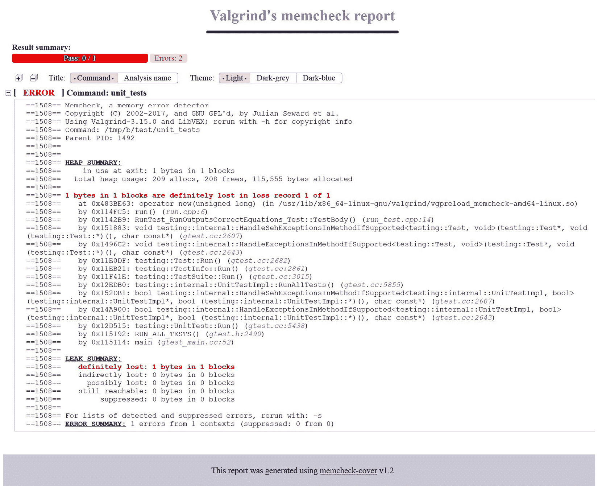

# 第九章：程序分析工具

编写高质量代码并非易事，即使对于经验非常丰富的开发者也是如此。通过向我们的解决方案中添加测试，我们可以减少在业务代码中犯明显错误的风险。但这还不足以避免更复杂的问题。每一段软件都由如此多的细节组成，跟踪它们全部成为了一份全职工作。团队维护产品达成了数十种约定和多种特殊设计实践。

一些问题涉及一致的编码风格：我们的代码应该使用 80 列还是 120 列？我们应该允许使用`std::bind`还是坚持使用 Lambda 函数？使用 C 风格数组可以吗？小函数是否应该定义在单行中？我们是否应该始终坚持使用`auto`，或者只在提高可读性时使用？

理想情况下，我们还应避免任何已知在一般情况下不正确的语句：无限循环、使用标准库保留的标识符、无意中失去精度、冗余的`if`语句，以及其他不被认为是“最佳实践”的内容（参见*进一步阅读*部分获取参考资料）。

的另一件事是要关注代码现代化：随着 C++的发展，它提供了新特性。跟踪我们可以重构以适应最新标准的所有地方可能会很困难。此外，人工努力需要时间并引入了引入 bug 的风险，对于大型代码库来说这是相当可观的。

最后，我们应该检查事物在运动时的表现：执行程序并检查其内存。内存在使用后是否被正确释放？我们是否正确地访问了初始化的数据？或者代码试图解引用一些悬空指针？

手工管理所有这些问题和问题是不效率且容易出错的。幸运的是，我们可以使用自动工具来检查和强制执行规则、修复错误并现代化代码为我们。是时候发现程序分析工具了。我们的代码将在每次构建时进行检查，以确保其符合行业标准。

在本章中，我们将涵盖以下主要主题：

+   强制格式化

+   使用静态检查器

+   使用 Valgrind 进行动态分析

# 技术要求

您可以在 GitHub 上找到本章中存在的代码文件：[`github.com/PacktPublishing/Modern-CMake-for-Cpp/tree/main/examples/chapter09`](https://github.com/PacktPublishing/Modern-CMake-for-Cpp/tree/main/examples/chapter09)。

构建本书中提供的示例时，请始终使用推荐的命令：

```cpp
cmake -B <build tree> -S <source tree>
cmake --build <build tree>
```

请确保将占位符`<`build tree>`和`<source tree>`替换为适当的路径。作为提醒：**build tree**是目标/输出目录的路径，**source tree**是源代码所在的路径。

# 强制格式化

专业开发者通常遵循规则。他们认为高级开发者知道何时打破一条规则（因为他们可以证明需要这么做）。另一方面，有人说非常高级的开发者不打破规则，因为向他人解释理由是浪费时间。我说，选择你的战斗，专注于对产品有实际影响和实质性作用的事情。

当涉及到代码风格和格式化时，程序员面临着许多选择：我们应该使用制表符还是空格进行缩进？如果使用空格，是多少个？列字符数的限制是多少？文件呢？在大多数情况下，这些选择不会影响程序的行为，但它们确实会产生很多噪音，并引发长时间讨论，这些讨论对产品并没有太大价值。

有些实践是普遍认同的，但大多数时候，我们是在争论个人偏好和 anecdotal 证据。毕竟，将列中的字符数从 120 强制到 80 是一个任意选择。只要我们保持一致，我们选择什么并不重要。风格上的不一致是坏事，因为它影响软件的一个重要方面——代码的可读性。

避免这种情况的最佳方式是使用格式化工具，如`clang-format`。这可以警告我们的代码格式不正确，甚至在我们允许的情况下修复突出显示的问题。以下是一个格式化代码的命令示例：

```cpp
clang-format -i --style=LLVM filename1.cpp filename2.cpp
```

`-i`选项告诉 ClangFormat 就地编辑文件。`--style`选择应使用哪种支持的格式化样式：`LLVM`、`Google`、`Chromium`、`Mozilla`、`WebKit`或自定义，从`file`提供（在*进一步阅读*部分有详细信息的链接）。

当然，我们不想每次修改后都手动执行这个命令；CMake 应该在构建过程中处理这个问题。我们已经知道如何在系统中找到`clang-format`（我们之前需要手动安装它）。我们还没有讨论的是将外部工具应用于所有源文件的过程。为此，我们将创建一个方便的函数，可以从`cmake`目录中包含：

chapter09/01-formatting/cmake/Format.cmake

```cpp
function(Format target directory)
  find_program(CLANG-FORMAT_PATH clang-format REQUIRED)
  set(EXPRESSION h hpp hh c cc cxx cpp)
  list(TRANSFORM EXPRESSION PREPEND "${directory}/*.")
  file(GLOB_RECURSE SOURCE_FILES FOLLOW_SYMLINKS
       LIST_DIRECTORIES false ${EXPRESSION}
  )
  add_custom_command(TARGET ${target} PRE_BUILD COMMAND
    ${CLANG-FORMAT_PATH} -i --style=file ${SOURCE_FILES}
  )
endfunction()
```

`Format`函数接受两个参数：`target`和`directory`。它将格式化来自`directory`的所有源文件，在构建`target`之前。

从技术上讲，`directory`中的所有文件不一定都属于`target`（并且目标源代码可能位于多个目录中）。然而，找到所有属于目标（以及可能的依赖目标）的源文件和头文件是一个非常复杂的过程，尤其是当我们需要过滤掉属于外部库且不应该格式化的头文件时。在这种情况下，按目录工作更加可行。我们只需为每个格式化目标调用函数。

这个函数有以下几个步骤：

1.  查找系统中安装的`clang-format`二进制文件。`REQUIRED`关键字将在找不到二进制文件时停止配置并显示错误。

1.  创建一个要格式化的文件扩展名列表（用作*通配符表达式*）。

1.  在每个表达式前加上`directory`的路径。

1.  递归搜索源文件和头文件（使用之前创建的列表），跳过目录，并将它们的路径放入`SOURCE_FILES`变量中。

1.  将格式化命令作为`target`的`PRE_BUILD`步骤。

这个命令对于小到中等大小的代码库来说效果很好。对于大量文件，我们需要将绝对文件路径转换为相对路径，并使用`directory`作为工作目录执行格式化（`list(TRANSFORM)`命令在这里很有用）。这可能是因为传递给 shell 的命令长度有限制（通常约为 13,000 个字符），而太多的长路径根本放不下。

让我们看看如何在实际中使用这个函数。我们将使用以下项目结构：

```cpp
- CMakeLists.txt
- .clang-format
- cmake
  |- Format.cmake
- src
  |- CMakeLists.txt
  |- header.h
  |- main.cpp
```

首先，我们需要设置项目并将`cmake`目录添加到模块路径中，这样我们稍后才能包含它：

第九章/01-格式化/CMakeLists.txt

```cpp
cmake_minimum_required(VERSION 3.20.0)
project(Formatting CXX)
enable_testing()
list(APPEND CMAKE_MODULE_PATH "${CMAKE_SOURCE_DIR}/cmake")
add_subdirectory(src bin)
```

设置好之后，让我们为`src`目录填写列表文件：

第九章/01-格式化/src/CMakeLists.txt

```cpp
add_executable(main main.cpp)
include(Format)
Format(main .)
```

这很简单，直截了当。我们创建了一个名为`main`的可执行目标，包含了`Format.cmake`模块，并在当前目录（`src`）中调用了`Format()`函数。

现在，我们需要一些未格式化的源文件。头文件只是一个简单的`unused`函数：

第九章/01-格式化/src/header.h

```cpp
int unused() { return 2 + 2; }
```

我们还会添加一个源文件，其中空格过多：

第九章/01-格式化/src/main.cpp

```cpp
#include <iostream>
  using namespace std;
    int main() {
      cout << "Hello, world!" << endl;
    }
```

万事俱备，只差格式化器的配置文件（可在命令行中使用`--style=file`参数启用）：

第九章/01-格式化/.clang-format

```cpp
BasedOnStyle: Google
ColumnLimit: 140
UseTab: Never
AllowShortLoopsOnASingleLine: false
AllowShortFunctionsOnASingleLine: false
AllowShortIfStatementsOnASingleLine: false
```

Clang Format 将扫描父目录中的`.clang-format`文件，该文件指定确切的格式化规则。这允许我们指定每一个小细节，或者定制前面提到的标准之一。在我的案例中，我选择从 Google 的编码风格开始，并加入一些调整：限制列数为 140 个字符，移除制表符，并允许短循环、函数和`if`语句。

我们来看看在构建该项目后文件的变化情况（格式化会在编译前自动进行）：

第九章/01-格式化/src/header.h（已格式化）

```cpp
int unused() {
  return 2 + 2;
}
```

尽管目标没有使用头文件，但格式化器还是对其进行了格式化；不允许单行上有短函数。格式化器添加了新行，正如所期望的那样。`main.cpp`文件现在看起来也很酷：

第九章/01-格式化/src/main.cpp（已格式化）

```cpp
#include <iostream>
using namespace std;
int main() {
  cout << "Hello, world!" << endl;
}
```

删除了不必要的空格，并将缩进标准化。

添加自动化格式化工具并不需要太多努力，而且在代码审查时节省你大量时间。如果你曾经不得不修改提交来修正一些空白字符，你就会明白这种感觉。一致的格式化让你的代码整洁而无需任何努力。

注意

将格式化应用到现有代码库中很可能会对大多数仓库中的文件引入一次性的巨大变化。如果你（或你的团队成员）有一些正在进行的工作，这可能会导致大量的合并冲突。最好协调这样的努力，在所有待处理的变化完成后进行。如果这不可能，考虑逐步采用，也许按目录 basis 进行。你的同事们会感谢你的。

格式化器是一个伟大而简单的工具，可以统一代码的视觉方面，但它不是一个完全成熟的程序分析工具（它主要关注空白字符）。为了处理更高级的场景，我们需要使用能够理解程序源代码的工具来执行静态分析。

# 使用静态检查器

静态程序分析是检查源代码而不实际运行编译版本的过程。严格应用静态检查器显著提高了代码的质量：它变得更加一致，更少出现错误。引入已知的安全漏洞的机会也减少了。C++社区已经创建了数十个静态检查器：Astrée、Clang-Tidy、CLazy、CMetrics、Cppcheck、Cpplint、CQMetrics、ESBMC、FlawFinder、Flint、IKOS、Joern、PC-Lint、Scan-Build、Vera++等等。

许多它们认识 CMake 作为行业标准，并提供开箱即用的支持（或集成教程）。一些构建工程师不想费心写 CMake 代码，他们通过包含在线可用的外部模块来添加静态检查器，例如 Lars Bilke 在他的 GitHub 仓库中收集的那些：[`github.com/bilke/cmake-modules`](https://github.com/bilke/cmake-modules)。

难怪，因为普遍的误解是你需要跳过很多障碍才能让你的代码进行检查。造成这种复杂性的原因是静态检查器的本质：它们经常模仿真实编译器的行为来理解代码中发生的事情。

Cppcheck 在其手册中推荐了以下步骤：

1.  找到静态检查器的可执行文件。

1.  使用以下方法生成*编译数据库*：

    ```cpp
    cmake -DCMAKE_EXPORT_COMPILE_COMMANDS=ON .
    ```

1.  在生成的 JSON 文件上运行检查器：

    ```cpp
    <path-to-cppcheck> --project=compile_commands.json
    ```

所有这些都应该作为构建过程的一部分发生，这样就不会被忘记了。

由于 CMake 完全理解我们想要如何构建目标，它不能支持这些工具中的某些吗？至少是最受欢迎的那些？当然可以！这个珍贵的特性在网络噪声中很难找到，尽管它使用起来如此简单。CMake 支持为以下工具启用检查器：

+   include-what-you-use ([`include-what-you-use.org`](https://include-what-you-use.org))

+   Clang-Tidy ([`clang.llvm.org/extra/clang-tidy`](https://clang.llvm.org/extra/clang-tidy))

+   链接你所使用的（内置的 CMake 检查器）

+   cpplint ([`github.com/cpplint/cpplint`](https://github.com/cpplint/cpplint))

+   Cppchecker ([`cppcheck.sourceforge.io`](https://cppcheck.sourceforge.io))

我们只需要做的是为适当的目标属性设置一个分号分隔的列表，该列表包含检查器可执行文件的路径，后跟任何应传递给检查器的命令行选项：

+   `<LANG>_CLANG_TIDY`

+   `<LANG>_CPPCHECK`

+   `<LANG>_CPPLINT`

+   `<LANG>_INCLUDE_WHAT_YOU_USE`

+   `LINK_WHAT_YOU_USE`

像往常一样，`<LANG>`应该用所使用的语言替换，所以用`C`表示 C 源文件，用`CXX`表示 C++。如果你不需要针对每个目标控制检查器，可以通过设置一个前缀为`CMAKE_`的适当的全局变量，为项目中的所有目标指定一个默认值，例如以下：

```cpp
set(CMAKE_CXX_CLANG_TIDY /usr/bin/clang-tidy-3.9;-checks=*)
```

在此声明之后定义的任何目标，其`CXX_CLANG_TIDY`属性将以此方式设置。只需记住，这将分析常规构建，使它们稍微变慢。

另一方面，更细粒度地控制检查器如何测试目标有一定的价值。我们可以编写一个简单的函数来解决这个问题：

chapter09/02-clang-tidy/cmake/ClangTidy.cmake

```cpp
function(AddClangTidy target)
  find_program(CLANG-TIDY_PATH clang-tidy REQUIRED)
  set_target_properties(${target}
    PROPERTIES CXX_CLANG_TIDY
    "${CLANG-TIDY_PATH};-checks=*;--warnings-as-errors=*"
  )
endfunction()
```

`AddClangTidy`函数有两个简单步骤：

1.  查找 Clang-Tidy 二进制文件并将其路径存储在`CLANG-TIDY_PATH`中。`REQUIRED`关键字将在找不到二进制文件时停止配置并显示错误。

1.  在`target`上启用 Clang-Tidy，提供二进制文件的路径和自定义选项以启用所有检查，并将警告视为错误。

要使用这个函数，我们只需要包含模块并针对所选目标调用它：

chapter09/02-clang-tidy/src/CMakeLists.txt

```cpp
add_library(sut STATIC calc.cpp run.cpp)
target_include_directories(sut PUBLIC .)
add_executable(bootstrap bootstrap.cpp)
target_link_libraries(bootstrap PRIVATE sut)
include(ClangTidy)
AddClangTidy(sut)
```

这是简短且极其强大的。在我们构建解决方案时，我们可以看到 Clang-Tidy 的输出：

```cpp
[  6%] Building CXX object bin/CMakeFiles/sut.dir/calc.cpp.o
/root/examples/chapter09/04-clang-tidy/src/calc.cpp:3:11: warning: method 'Sum' can be made static [readability-convert-member-functions-to-static]
int Calc::Sum(int a, int b) {
          ^
[ 12%] Building CXX object bin/CMakeFiles/sut.dir/run.cpp.o
/root/examples/chapter09/04-clang-tidy/src/run.cpp:1:1: warning: #includes are not sorted properly [llvm-include-order]
#include <iostream>
^        ~~~~~~~~~~
/root/examples/chapter09/04-clang-tidy/src/run.cpp:3:1: warning: do not use namespace using-directives; use using-declarations instead [google-build-using-namespace]
using namespace std;
^
/root/examples/chapter09/04-clang-tidy/src/run.cpp:6:3: warning: initializing non-owner 'Calc *' with a newly created 'gsl::owner<>' [cppcoreguidelines-owning-memory]
  auto c = new Calc();
  ^
```

注意，除非你在命令行参数中添加了`--warnings-as-errors=*`选项，否则构建将会成功。建议达成一致，制定一个将强制执行并使违反它们的构建失败的规则列表；这样，我们可以防止不符合规定的代码污染仓库。

`clang-tidy`还提供了一个有趣的`--fix`选项，它可以自动尽可能地修复你的代码。这绝对是节省时间的好方法，并且在增加检查数量时可以随时使用。与格式化一样，确保在将静态分析工具生成的任何更改引入遗留代码库时避免合并冲突。

根据您的用例、仓库的大小和团队偏好，您可能需要选择几个与之一致的检查器。添加太多将变得令人烦恼。以下是 CMake 支持的一些检查器的简介。

## Clang-Tidy

以下是从官方网站对 Clang-Tidy 的描述：

clang-tidy 是基于 Clang 的 C++“代码检查”工具。它的目的是提供一个可扩展的框架，用于诊断和修复常见的编程错误，如风格违规、接口误用，或通过静态分析可以推断出的错误。clang-tidy 是模块化的，并为编写新检查提供了方便的接口。

这个工具的多样性真的很令人印象深刻，因为它提供了超过 400 个检查项。它与 ClangFormat 配合得很好，因为自动应用的修复项（超过 150 个）可以遵循相同的格式文件。提供的检查项包括性能改进、可读性、现代化、cpp-core-guidelines 和易出错命名空间等方面的改进。

## Cpplint

以下是从官方网站对 Cpplint 的描述：

Cpplint 是一个命令行工具，用于检查遵循 Google C++风格指南的 C/C++文件的风格问题。Cpplint 是由 Google 公司在 google/styleguide 开发和维护的。

这个代码检查工具旨在让您的代码符合上述的 Google 风格。它是用 Python 编写的，这可能会成为某些项目不愿依赖的库。提供的修复格式可以被 Emacs、Eclipse、VS7、Junit 以及作为`sed`命令的格式所消费。

## Cppcheck

以下是从官方网站对 Cppcheck 的描述：

Cppcheck 是一个用于 C/C++代码的静态分析工具。它提供独特的代码分析来检测错误，并专注于检测未定义行为和危险编码结构。目标是尽量减少误报。Cppcheck 旨在能够分析具有非标准语法（在嵌入式项目中很常见）的您的 C/C++代码。

这个工具非常值得推荐，它能让您在使用时无忧无虑，避免由于误报而产生的不必要噪音。它已经相当成熟（已有 14 多年的历史），并且仍然维护得非常活跃。另外，如果你的代码不能与 Clang 编译，你可能会觉得它很有用。

## 包含你使用的（include-what-you-use）

以下是从官方网站对 include-what-you-use 的描述：

包含你使用的的主要目标是去除不必要的#include。它通过找出实际不需要包含的#include（对于.cc 和.h 文件），并在可能的情况下用前向声明替换#include 来实现这一点。

如果你的代码库比较瘦，太多的包含头文件可能看起来并不是一个大问题。在更大的项目中，避免不必要的头文件编译节省的时间会迅速累积。

## 链接你使用的（Link what you use）

以下是 CMake 博客上对 link-what-you-use 的描述：

这是一个内置的 CMake 功能，使用 ld 和 ldd 的选项来输出如果可执行文件链接了比实际需要更多的库。

这也加快了构建时间；在这种情况下，我们关注的是不需要的二进制文件。

静态分析在软件错误可能影响人们安全的领域至关重要，尤其是在医疗、核能、航空、汽车和机械工业中。明智的开发者知道，在要求不高的环境中遵循类似实践并不会有什么坏处，尤其是在采用成本如此之低的情况下。在构建过程中使用静态分析器不仅比手动查找和修复错误便宜得多；而且通过 CMake 很容易启用。我甚至可以说，在质量敏感的软件（即涉及除程序员以外的其他人的所有软件）中几乎没有任何理由跳过这些检查。

不幸的是，并非所有错误都能在程序执行之前捕获。我们能做些什么来更深入地了解我们的项目呢？

# 使用 Valgrind 进行动态分析

Valgrind ([`www.valgrind.org`](https://www.valgrind.org)) 是一个允许构建动态分析工具的框架——即在程序运行时执行的分析。它提供了一个广泛的工具套件，允许进行各种调查和检查。其中一些工具如下：

+   Memcheck – 检测内存管理问题

+   Cachegrind – 分析 CPU 缓存，并定位缓存缺失和其他缓存问题

+   Callgrind – Cachegrind 的扩展，带有关于调用图的额外信息

+   Massif – 一种堆分析器，可以显示程序随时间使用堆的情况

+   Helgrind – 线程调试器，有助于解决数据竞争问题

+   DRD – Helgrind 的更轻量级、有限版本

这个列表中的每一个工具在适当的时候都非常方便。大多数包管理器都知道 Valgrind 并且可以轻松地在您的操作系统上安装它（如果您使用的是 Linux，可能已经安装了）。无论如何，官方网站提供了源代码，所以您可以自己构建它。

我们将重点关注套件中最有用的应用程序。当人们提到 Valgrind 时，他们经常会指的是 Valgrind 的 Memcheck。让我们找出如何使用它与 CMake 一起工作——这将为您需要它们时采用其他工具铺平道路。

## Memcheck

Memcheck 在调试内存问题时可能不可或缺。在 C++ 中，这尤其棘手，因为程序员对自己如何管理内存有极大的控制权。可能出现各种错误：读取未分配的内存、读取已经释放的内存、尝试多次释放内存以及写入错误的地址。开发者显然试图避免这些错误，但由于这些错误如此微妙，它们甚至可以潜入最简单的程序中。有时，只需忘记一个变量的初始化，我们就陷入了困境。

调用 Memcheck 看起来像这样：

```cpp
valgrind [valgrind-options] tested-binary [binary-options]
```

Memcheck 是 Valgrind 的默认工具，但您也可以明确选择它：

```cpp
valgrind --tool=memcheck tested-binary
```

运行 Memcheck 代价昂贵；手册（参见*进一步阅读*中的链接）说，用它 instrumented 的程序可以慢 10-15 倍。为了避免每次运行测试时都要等待 Valgrind，我们将创建一个可以在需要测试代码时从命令行调用的独立目标。理想情况下，开发者会在将他们的更改合并到仓库的默认分支之前运行它。这可以通过早期 Git 钩子或添加为 CI 管道中的一个步骤来实现。在生成阶段完成后，我们将使用以下命令来构建自定义目标：

```cpp
cmake --build <build-tree> -t valgrind
```

添加此类目标并不困难：

chapter09/03-valgrind/cmake/Valgrind.cmake

```cpp
function(AddValgrind target)
  find_program(VALGRIND_PATH valgrind REQUIRED)
  add_custom_target(valgrind
    COMMAND ${VALGRIND_PATH} --leak-check=yes 
            $<TARGET_FILE:${target}>
    WORKING_DIRECTORY ${CMAKE_BINARY_DIR}
  )
endfunction()
```

在这个例子中，我们创建了一个 CMake 模块（这样我们就可以在不同的项目中重复使用同一个文件）来包装接受要测试的目标的函数。这里发生两件事：

+   CMake 会在默认的系统路径中搜索`valgrind`可执行文件，并将其存储在`VALGRIND_PATH`变量中。如果找不到二进制文件，`REQUIRED`关键字会导致配置出现错误而停止。

+   创建了一个自定义目标`valgrind`；它将在`target`二进制文件上执行 Memcheck 工具。我们还添加了一个选项，始终检查内存泄漏。

谈到 Valgrind 选项时，我们可以提供命令行参数，也可以如下进行：

1.  `~/.valgrindrc`文件（在你的家目录中）

1.  `$VALGRIND_OPTS`环境变量

1.  `./.valgrindrc`文件（在工作目录中）

这些按顺序进行检查。另外，请注意，最后一个文件只有在属于当前用户、是普通文件，并且没有被标记为世界可写时才会被考虑。这是一个安全机制，因为给 Valgrind 的选项可能是有害的。

要使用`AddValgrind`函数，我们应该向其提供一个 unit_tests 目标：

chapter09/03-valgrind/test/CMakeLists.txt（片段）

```cpp
# ...
add_executable(unit_tests calc_test.cpp run_test.cpp)
# ...
include(Valgrind)
AddValgrind(unit_tests)
```

请记住，使用`Debug`配置生成构建树可以让 Valgrind 访问调试信息，这使得它的输出更加清晰。让我们看看实际中这是如何工作的：

```cpp
# cmake --build <build-tree> -t valgrind
```

这会构建`sut`和`unit_tests`目标：

```cpp
[100%] Built target unit_tests
```

启动 Memcheck 的执行，它将为我们提供一般信息：

```cpp
==954== Memcheck, a memory error detector
==954== Copyright (C) 2002-2017, and GNU GPL'd, by Julian Seward et al.
==954== Using Valgrind-3.15.0 and LibVEX; rerun with -h for copyright info
==954== Command: ./unit_tests
```

`==954==`前缀包含进程 ID。这是为了区分 Valgrind 注释和被测试进程的输出而添加的。

接下来，使用`gtest`进行常规测试：

```cpp
[==========] Running 3 tests from 2 test suites.
[----------] Global test environment set-up.
...
[==========] 3 tests from 2 test suites ran. (42 ms total)
[  PASSED  ] 3 tests.
```

最后，会呈现一个总结：

```cpp
==954==
==954== HEAP SUMMARY:
==954==     in use at exit: 1 bytes in 1 blocks
==954==   total heap usage: 209 allocs, 208 frees, 115,555 bytes allocated
```

哎呀！我们至少还在使用 1 个字节。使用`malloc()`和`new`进行的分配没有与适当的`free()`和`delete`操作相匹配。看来我们的程序中有一个内存泄漏。Valgrind 提供了更多细节来找到它：

```cpp
==954== 1 bytes in 1 blocks are definitely lost in loss record 1 of 1
==954==    at 0x483BE63: operator new(unsigned long) (in /usr/lib/x86_64-linux-gnu/valgrind/vgpreload_memcheck-amd64-linux.so)
==954==    by 0x114FC5: run() (run.cpp:6)
==954==    by 0x1142B9: RunTest_RunOutputsCorrectEquations_Test::TestBody() (run_test.cpp:14)
```

以`by 0x<address>`开头的行表示调用栈中的个别函数。我已经截断了输出（它有一些来自 GTest 的噪音）以专注于有趣的部分——最顶层的函数和源引用，`run()(run.cpp:6)`：

最后，总结在底部找到：

```cpp
==954== LEAK SUMMARY:
==954==    definitely lost: 1 bytes in 1 blocks
==954==    indirectly lost: 0 bytes in 0 blocks
==954==      possibly lost: 0 bytes in 0 blocks
==954==    still reachable: 0 bytes in 0 blocks
==954==         suppressed: 0 bytes in 0 blocks
==954==
==954== ERROR SUMMARY: 1 errors from 1 contexts (suppressed: 0 from 0)
```

Valgrind 非常擅长找到非常复杂的错误。偶尔，它甚至能够更深入地挖掘，找到不能自动分类的值得怀疑的情况。此类发现将在`可能丢失`行中予以说明。

让我们看看 Memcheck 在此案例中发现的问题是什么：

chapter09/03-valgrind/src/run.cpp

```cpp
#include <iostream>
#include "calc.h"
using namespace std;
int run() {
  auto c = new Calc();
  cout << "2 + 2 = " << c->Sum(2, 2) << endl;
  cout << "3 * 3 = " << c->Multiply(3, 3) << endl;
  return 0;
}
```

没错：高亮的代码是有错误的。事实上，我们确实创建了一个在测试结束前没有被删除的对象。这就是为什么拥有广泛测试覆盖度如此重要的原因。

Valgrind 是一个非常实用的工具，但在处理更复杂的程序时可能会变得有些冗长。必须有一种方法以更易管理的形式收集这些信息。

## Memcheck-Cover

商业 IDE，如 CLion，原生支持解析 Valgrind 的输出，以便可以通过 GUI 轻松导航，而不必滚动控制台窗口以找到正确的消息。如果你的编辑器没有这个选项，你仍然可以通过使用第三方报告生成器获得更清晰的错误视图。由 David Garcin 编写的 Memcheck-cover 提供了一个更愉快的体验，以生成的 HTML 文件的形式，如图*9.1*所示：



图 9.1 – 由 memcheck-cover 生成的报告

这个小巧的项目在 GitHub 上可用（[`github.com/Farigh/memcheck-cover`](https://github.com/Farigh/memcheck-cover)）；它需要 Valgrind 和`gawk`（GNU AWK 工具）。要使用它，我们将在一个单独的 CMake 模块中准备一个设置函数。它将由两部分组成：

+   获取和配置工具

+   添加一个自定义目标，执行 Valgrind 并生成报告

配置如下所示：

chapter09/04-memcheck/cmake/Memcheck.cmake

```cpp
function(AddMemcheck target)
  include(FetchContent)
  FetchContent_Declare(
   memcheck-cover
   GIT_REPOSITORY https://github.com/Farigh/memcheck-
     cover.git
   GIT_TAG        release-1.2
  )
  FetchContent_MakeAvailable(memcheck-cover)
  set(MEMCHECK_PATH ${memcheck-cover_SOURCE_DIR}/bin)
```

在第一部分中，我们遵循与常规依赖项相同的实践：包含`FetchContent`模块，并在`FetchContent_Declare`中指定项目的存储库和所需的 Git 标签。接下来，我们启动获取过程，并使用由`FetchContent_Populate`设置的（由`FetchContent_MakeAvailable`隐式调用）`memcheck-cover_SOURCE_DIR`变量配置二进制文件的路径。

函数的第二部分是创建生成报告的目标。我们将其命名为`memcheck`（这样如果出于某种原因想要保留这两个选项，它就不会与之前的`valgrind`目标重叠）：

chapter09/04-memcheck/cmake/Memcheck.cmake（继续）

```cpp
  add_custom_target(memcheck
    COMMAND ${MEMCHECK_PATH}/memcheck_runner.sh -o 
      "${CMAKE_BINARY_DIR}/valgrind/report" 
      -- $<TARGET_FILE:${target}>
    COMMAND ${MEMCHECK_PATH}/generate_html_report.sh 
      -i "${CMAKE_BINARY_DIR}/valgrind" 
      -o "${CMAKE_BINARY_DIR}/valgrind"
    WORKING_DIRECTORY ${CMAKE_BINARY_DIR}
  )
endfunction()
```

这种情况发生在两个命令中：

1.  首先，我们将运行`memcheck_runner.sh`包装脚本，该脚本将执行 Valgrind 的 Memcheck 并收集通过`-o`参数提供的文件输出的输出。

1.  然后，我们将解析输出并使用`generate_html_report.sh`创建报告。这个脚本需要通过`-i`和`-o`参数提供的输入和输出目录。

这两个步骤应该在`CMAKE_BINARY_DIR`工作目录中执行，以便如果需要，单元测试二进制可以通过相对路径访问文件。

当然，我们还需要在我们的列表文件中添加的最后一样东西，当然是调用这个函数的调用。它的模式和`AddValgrind`一样：

chapter09/04-memcheck/test/CMakeLists.txt（片段）

```cpp
include(Memcheck)
AddMemcheck(unit_tests)
```

在用`Debug`配置生成构建系统后，我们可以用以下命令来构建目标：

```cpp
cmake --build <build-tree> -t memcheck
```

然后我们可以享受我们的格式化报告。嗯，要真正享受它，我们还需要在`run.cpp`中添加那个缺失的`delete c;`，这样它就不会抱怨了（或者，更好的是，使用智能指针）。

# 总结

“你会在研究代码上花费的时间比在编写代码上多——因此，你应该优化阅读而不是编写。”

这句话在讨论整洁代码实践的书中被像咒语一样重复。难怪，因为这是非常正确的，很多软件开发者已经在实践中证明了这一点——以至于连像空格数、换行符以及`#import`声明的顺序这样的微小事情都有了规定。这并不是出于小气，而是为了节省时间。遵循本章概述的实践，我们无需担心手动格式化代码。它将自动在构建过程中作为副作用进行格式化——这是我们无论如何都必须执行的步骤，以检查代码是否正确运行。通过引入 ClangFormat，我们还可以确保它看起来正确。

当然，我们想要的不仅仅是简单的空格修正；代码必须符合几十个其他的小规定。这是通过添加 Clang-Tidy 并配置它强制执行我们选择的编码风格来完成的。我们详细讨论了这道静态检查器，但我们也提到了其他选项：Cpplint，Cppcheck，Include-what-you-use 和 Link-what-you-use。由于静态链接器相对较快，我们可以少量投资将它们添加到构建中，这通常是非常值得的。

最后，我们查看了 Valgrind 工具，特别是 Memcheck，它允许调试与内存管理相关的问题：不正确的读取、写入、释放等等。这是一个非常方便的工具，可以节省数小时的手动调查，并防止错误溜进生产环境。正如提到的，它的执行可能会慢一些，这就是我们创建一个单独的目标来显式地在提交代码之前运行它的原因。我们还学会了如何使用 Memcheck-Cover（一个 HTML 报告生成器）以更易接受的形式呈现 Valgrind 的输出。这在支持运行 IDE 的环境中（如 CI 管道）可能非常有用。

当然，我们不仅限于这些工具；还有很多：既有自由和开源项目，也有带有广泛支持的商业产品。这只是对这个主题的介绍。确保探索对你来说正确的东西。在下一章，我们将更详细地查看文档生成。

# 进一步阅读

要获取更多信息，你可以参考以下链接：

+   由 C++创作者 Bjarne Stroustrup 整理的**C++核心指南：** [`github.com/isocpp/CppCoreGuidelines`](https://github.com/isocpp/CppCoreGuidelines)

+   **ClangFormat 参考手册：** [`clang.llvm.org/docs/ClangFormat.html`](https://clang.llvm.org/docs/ClangFormat.html)

+   **C++静态分析器——精选列表：** [`github.com/analysis-tools-dev/static-analysis#cpp`](https://github.com/analysis-tools-dev/static-analysis#cpp)

+   **CMake 中内置静态检查器的支持：** [`blog.kitware.com/static-checks-with-cmake-cdash-iwyu-clang-tidy-lwyu-cpplint-and-cppcheck/`](https://blog.kitware.com/static-checks-with-cmake-cdash-iwyu-clang-tidy-lwyu-cpplint-and-cppcheck/)

+   **启用 ClangTidy 的目标属性：** [`cmake.org/cmake/help/latest/prop_tgt/LANG_CLANG_TIDY.html`](https://cmake.org/cmake/help/latest/prop_tgt/LANG_CLANG_TIDY.html)

+   **Valgrind 手册：** [`www.valgrind.org/docs/manual/manual-core.html`](https://www.valgrind.org/docs/manual/manual-core.html)
