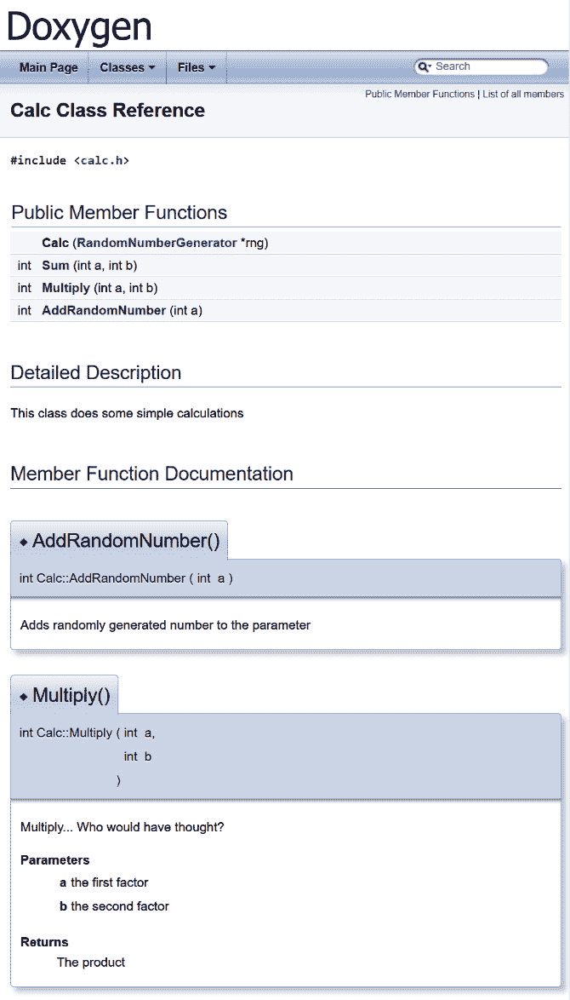
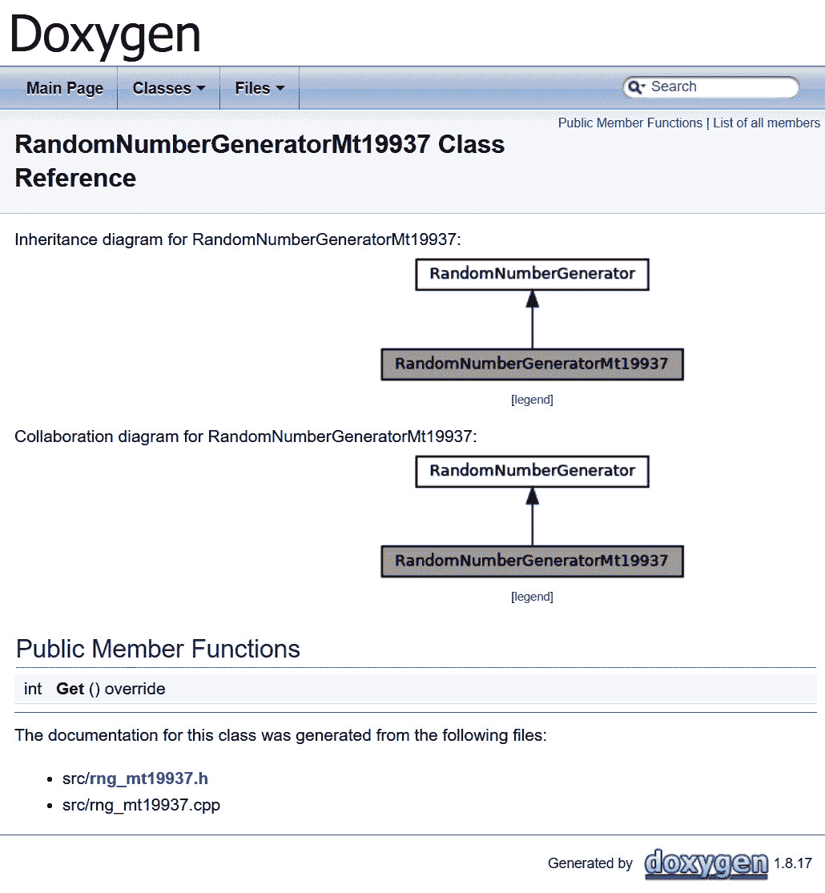

# 第十章：生成文档

高质量代码不仅编写得很好、运行正常且经过测试，而且还彻底进行了文档化。文档使我们能够分享否则可能丢失的信息，绘制更广阔的图景，提供上下文，揭示意图，最终——教育外部用户和维护者。

你还记得上次加入新项目时，在目录和文件迷宫中迷失了几个小时吗？这种情况是可以避免的。优秀的文档确实能引导一个完全的新手在几秒钟内找到他们想要查看的代码行。遗憾的是，缺失文档的问题常常被一笔勾销。难怪——这需要很多技巧，而且我们中的许多人并不擅长。此外，文档和代码真的可以很快分道扬镳。除非实施严格的更新和审查流程，否则很容易忘记文档也需要维护。

一些团队（出于时间考虑或受到经理的鼓励）遵循编写“自文档化代码”的做法。通过为文件名、函数、变量等选择有意义的、可读的标识符，他们希望避免文档化的繁琐工作。虽然良好的命名习惯绝对是正确的，但它不能取代文档。即使是最出色的函数签名也不能保证传达所有必要的信息——例如，`int removeDuplicates();`非常具有描述性，但它没有揭示返回值是什么！它可能是找到的重复项数量、剩余项的数量，或其他内容——是不确定的。记住：没有免费的午餐这种事。

为了简化事情，专业人士使用自动文档生成器，这些生成器可以分析源文件中的代码和注释，以生成多种不同格式的全面文档。将此类生成器添加到 CMake 项目中非常简单——让我们来看看如何操作！

在本章中，我们将涵盖以下主要主题：

+   向您的项目添加 Doxygen

+   使用现代外观生成文档

# 技术要求

您可以在 GitHub 上找到本章中出现的代码文件，链接如下：

[`github.com/PacktPublishing/Modern-CMake-for-Cpp/tree/main/examples/chapter10`](https://github.com/PacktPublishing/Modern-CMake-for-Cpp/tree/main/examples/chapter10)

要构建本书中提供的示例，请始终使用建议的命令：

```cpp
cmake -B <build tree> -S <source tree>
cmake --build <build tree>
```

请确保将占位符`<build tree>`和`<source tree>`替换为适当的路径。作为提醒：**构建树**是目标/输出目录的路径，**源树**是您的源代码所在的路径。

# 向您的项目添加 Doxygen

能够从 C++源代码生成文档的最著名且最受欢迎的工具之一是 Doxygen。当我提到“著名”时，我的意思是：第一个版本是由 Dimitri van Heesch 在 1997 年 10 月发布的。从那时起，它得到了极大的发展，并且由其仓库的 180 多个贡献者积极参与支持（[`github.com/doxygen/doxygen`](https://github.com/doxygen/doxygen)）。

Doxygen 可以生成以下格式的文档：

+   **超文本标记语言**（**HTML**）

+   **富文本格式**（**RTF**）

+   **便携式文档格式**（**PDF**）

+   **Lamport 的 TeX**（**LaTeX**）

+   **PostScript**（**PS**）

+   **Unix 手册**（**手册页**）

+   **微软编译的 HTML 帮助文件**（**CHM**）

如果你用 Doxygen 指定的格式为代码添加注释，提供额外信息，它将被解析以丰富输出文件。更重要的是，将分析代码结构以生成有益的图表和图表。后者是可选的，因为它需要一个外部的 Graphviz 工具（[`graphviz.org/`](https://graphviz.org/)）。

开发者首先应该回答以下问题：*项目的用户只是获得文档，还是他们自己生成文档（也许是在从源代码构建时）？*第一个选项意味着文档与二进制文件一起提供，可供在线获取，或者（不那么优雅地）与源代码一起提交到仓库中。

答案很重要，因为如果我们希望用户在构建过程中生成文档，他们需要在他们的系统中拥有这些依赖项。由于 Doxygen 可以通过大多数包管理器（以及 Graphviz）获得，所需的就是一个简单的命令，比如针对 Debian 的这样一个命令：

```cpp
apt-get install doxygen graphviz
```

针对 Windows 也有可用的二进制文件（请查看项目的网站）。

总结：为用户生成文档或处理需要时的依赖项添加。这在本章*第七章*，*使用 CMake 管理依赖项*中有所涵盖，所以我们在这里不会重复这些步骤。请注意，Doxygen 是使用 CMake 构建的，因此你也可以轻松地从源代码编译它。

当 Doxygen 和 Graphviz 安装在系统中时，我们可以将生成功能添加到我们的项目中。与在线资料所建议的不同，这并不像我们想象的那么困难或复杂。我们不需要创建外部配置文件，提供`doxygen`可执行文件的路径，或者添加自定义目标。自从 CMake 3.9 以来，我们可以使用`FindDoxygen`模块中的`doxygen_add_docs()`函数来设置文档目标。

签名看起来像这样：

```cpp
doxygen_add_docs(targetName [sourceFilesOrDirs...]
  [ALL] [USE_STAMP_FILE] [WORKING_DIRECTORY dir]
  [COMMENT comment])
```

第一个参数指定了目标名称，我们需要使用`cmake`的`-t`参数（在生成构建树之后）显式构建它，如下所示：

```cpp
cmake --build <build-tree> -t targetName
```

或者，我们总是可以通过添加 `ALL` 参数（通常不必要）来构建它。其他选项相当直观，除了可能 `USE_STAMP_FILE`。这允许 CMake 在源文件没有更改的情况下跳过文档的重新生成（但要求 `sourceFilesOrDirs` 只包含文件）。

我们将遵循前几章的做法，创建一个带有辅助函数的工具模块（以便在其他项目中重复使用），如下所示：

chapter-10/01-doxygen/cmake/Doxygen.cmake

```cpp
function(Doxygen input output)
  find_package(Doxygen)
  if (NOT DOXYGEN_FOUND)
    add_custom_target(doxygen COMMAND false 
      COMMENT "Doxygen not found")
    return()
  endif()
  set(DOXYGEN_GENERATE_HTML YES)
  set(DOXYGEN_HTML_OUTPUT
    ${PROJECT_BINARY_DIR}/${output})
  doxygen_add_docs(doxygen
      ${PROJECT_SOURCE_DIR}/${input}
      COMMENT "Generate HTML documentation"
  )
endfunction()
```

该函数接受两个参数——`input` 和 `output` 目录，并将创建一个自定义 `doxygen` 目标。这里发生了什么：

1.  首先，我们将使用 CMake 内置的 Doxygen 查找模块来确定系统中是否可用 Doxygen。

1.  如果不可用，我们将创建一个虚拟 `doxygen` 目标，该目标将通知用户并运行一个 `false` 命令，该命令（在 Unix-like 系统上）返回 `1`，导致构建失败。我们在此时终止函数并用 `return()`。

1.  如果系统中可用 Doxygen，我们将配置它以在提供的 `output` 目录中生成 HTML 输出。Doxygen 非常可配置（更多信息请参阅官方文档）。要设置任何选项，只需按照示例通过调用 `set()` 并将其名称前缀为 `DOXYGEN_`。

1.  设置实际的 `doxygen` 目标：所有 `DOXYGEN_` 变量都将转发到 Doxygen 的配置文件中，并且将从源树中的提供的 `input` 目录生成文档。

如果你 documentation 要由用户生成，*步骤 2* 可能应该涉及安装必要的依赖项。

要使用这个函数，我们可以在我们项目的 main listfile 中添加它，如下所示：

chapter-10/01-doxygen/CMakeLists.txt

```cpp
cmake_minimum_required(VERSION 3.20.0)
project(Doxygen CXX)
enable_testing()
list(APPEND CMAKE_MODULE_PATH "${CMAKE_SOURCE_DIR}/cmake")
add_subdirectory(src bin)
include(Doxygen)
Doxygen(src docs)
```

一点也不难。构建 `doxygen` 目标会生成如下所示的 HTML 文档：



](img/Figure_10.1_B17205.jpg)

图 10.1 – 使用 Doxygen 生成的类参考

你可以在**成员函数文档**中看到的额外描述是通过在头文件中添加适当注释来实现的：

chapter-10/01-doxygen/src/calc.h（片段）

```cpp
   /**
    Multiply... Who would have thought?
    @param a the first factor
    @param b the second factor
    @result The product
   */
   int Multiply(int a, int b);
```

这种格式被称为 Javadoc。用双星号 `/**` 打开注释块是非常重要的。可以在 Doxygen 的 docblocks 描述中找到更多信息（请参阅 *进一步阅读* 部分中的链接）。

如前所述，如果安装了 Graphviz，Doxygen 将检测到它并生成依赖关系图，如下所示：



](img/Figure_10.2_B17205.jpg)

图 10.2 – 使用 Doxygen 生成的继承和协作图

直接从源代码生成文档，我们创建了一个机制，可以快速更新它，以反映在整个开发周期中发生的任何代码更改。此外，注释中任何遗漏的更新都有可能在代码审查期间被发现。

许多开发者会抱怨 Doxygen 提供的设计过时，这让他们犹豫是否向客户展示生成的文档。别担心——有一个简单的解决方案可以解决这个问题。

# 使用现代风格生成文档

拥有项目文档并以干净、清新的设计也是非常重要的。毕竟，如果我们为我们的前沿项目编写高质量文档付出这么多努力，用户必然会这样认为。Doxygen 拥有所有的功能，但它并不以遵循最新的视觉趋势而闻名。然而，这并不意味着我们需要付出很多努力来改变这一点。

幸运的是，一个名为*jothepro*的开发者创建了一个名为`doxygen-awesome-css`的主题，它提供了一个现代、可自定义的设计。它甚至还有夜间模式！您可以在以下屏幕快照中看到此内容：

！[图 10.3 – 使用 doxygen-awesome-css 主题的 HTML 文档

（img/Figure_10.3_B17205.jpg）

图 10.3 – 使用 doxygen-awesome-css 主题的 HTML 文档

该主题不需要任何额外的依赖项，可以很容易地从其 GitHub 页面[`github.com/jothepro/doxygen-awesome-css`](https://github.com/jothepro/doxygen-awesome-css)获取。

注意

在线资源建议使用多个依次执行的应用程序来升级体验。一种流行的方法是使用 Breathe 和 Exhale 扩展与 Sphinx 一起转换 Doxygen 的输出。这个过程看起来有点复杂，并且会引入很多其他依赖项（如 Python）。我建议在可能的情况下保持工具简单。很可能会发现项目中的每个开发者并不都非常了解 CMake，这样的复杂过程会给他们带来困难。

我们将直接进入这个主题的自动化采用。让我们看看如何通过添加一个新的宏来扩展我们的`Doxygen.cmake`文件以使用它，如下所示：

chapter-10/02-doxygen-nice/cmake/Doxygen.cmake (片段)

```cpp
macro(UseDoxygenAwesomeCss)
  include(FetchContent)
  FetchContent_Declare(doxygen-awesome-css
    GIT_REPOSITORY
      https://github.com/jothepro/doxygen-awesome-css.git
    GIT_TAG
      v1.6.0
  )
  FetchContent_MakeAvailable(doxygen-awesome-css)
  set(DOXYGEN_GENERATE_TREEVIEW     YES)
  set(DOXYGEN_HAVE_DOT              YES)
  set(DOXYGEN_DOT_IMAGE_FORMAT      svg)
  set(DOXYGEN_DOT_TRANSPARENT       YES)
  set(DOXYGEN_HTML_EXTRA_STYLESHEET
    ${doxygen-awesome-css_SOURCE_DIR}/doxygen-awesome.css)
endmacro()
```

我们已经在书的 previous chapters 中了解到了所有这些命令，但为了完全清晰，让我们重申一下发生了什么，如下所示：

1.  `doxygen-awesome-css`通过`FetchContent`模块从 Git 中提取，并作为项目的一部分提供。

1.  为 Doxygen 配置了额外的选项，如主题的`README`文件中所建议。

1.  `DOXYGEN_HTML_EXTRA_STYLESHEET`配置了主题的`.css`文件的路径。它将被复制到输出目录。

正如您所想象的，最好在`Doxygen`函数中调用这个宏，在`doxygen_add_docs()`之前，像这样：

chapter-10/02-doxygen-nice/cmake/Doxygen.cmake

```cpp
function(Doxygen input output)
  ...
  UseDoxygenAwesomeCss()
  doxygen_add_docs (...)
endfunction()
macro(UseDoxygenAwesomeCss)
  ...
endmacro()
```

作为提醒，宏中的所有变量都在调用函数的作用域中设置。

现在我们可以享受我们生成的 HTML 文档中的现代风格，并自豪地与世界分享。

# 摘要

在本章中，我们介绍了如何将 Doxygen，这个文档生成工具，添加到 CMake 项目中，并使其变得优雅。这个过程并不复杂，将大大改善您解决方案中的信息流。花在添加文档上的时间是值得的，特别是如果您发现您或您的团队成员在理解应用程序中的复杂关系时遇到困难。

您可能担心将 Doxygen 添加到没有从开始就使用文档生成的较大项目中会很困难。要求开发者在每个函数中添加注释的工作量可能让开发者感到不堪重负。不要追求立即完整：从小处着手，只需填写您在最新提交中触摸的元素的描述。即使文档不完整，也比完全没有文档好。

请记住，通过生成文档，您将确保其与实际代码的接近性：如果它们都在同一个文件中，同步维护编写解释和逻辑要容易得多。另外，要意识到像大多数程序员一样，您可能是一个非常忙碌的人，并且最终会忘记您项目中的某些小细节。记住：最短的铅笔也比最长的记忆长。对自己好一点——把事情写下来，繁荣昌盛。

在下一章中，我们将学习如何使用 CMake 自动打包和安装我们的项目。

# 进一步阅读

+   Doxygen 的官方网站：[`www.doxygen.nl/`](https://www.doxygen.nl/)

+   FindDoxygen find-module 文档：[`cmake.org/cmake/help/latest/module/FindDoxygen.html`](https://cmake.org/cmake/help/latest/module/FindDoxygen.html)

+   Doxygen 的 docblocks：[`www.doxygen.nl/manual/docblocks.html#specialblock`](https://www.doxygen.nl/manual/docblocks.html#specialblock)

## 其他文档生成工具

还有数十种其他工具未在此书中涉及，因为我们专注于由 CMake 支持的项目。然而，其中一些可能更适合您的用例。如果您想冒险，可以访问我在这里列出的两个我觉得有趣的项目的网站：

+   Adobe 的 Hyde：[`github.com/adobe/hyde`](https://github.com/adobe/hyde)

针对 Clang 编译器，Hyde 生成 Markdown 文件，这些文件可以被如 Jekyll([`jekyllrb.com/`](https://jekyllrb.com/))等工具消费，Jekyll 是一个由 GitHub 支持的静态页面生成器。

+   Standardese：[`github.com/standardese/standardese`](https://github.com/standardese/standardese)

该工具使用`libclang`编译您的代码，并提供 HTML、Markdown、LaTex 和 man 页面的输出。它大胆地目标是成为下一个 Doxygen。
