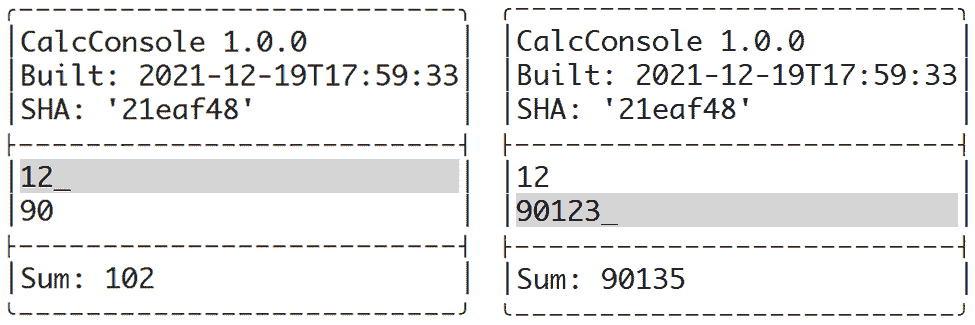
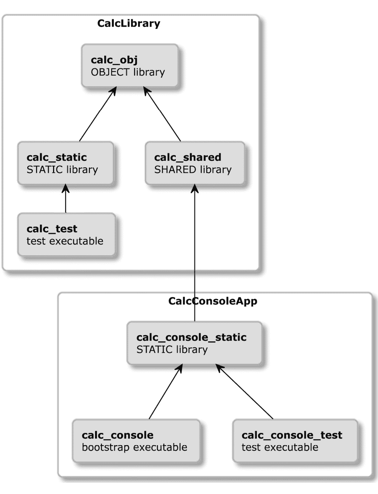
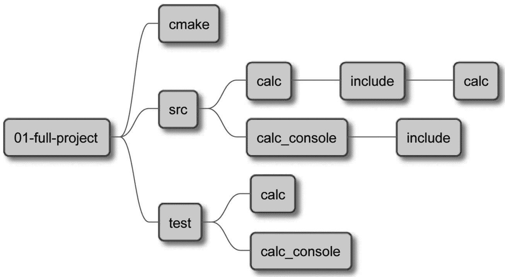
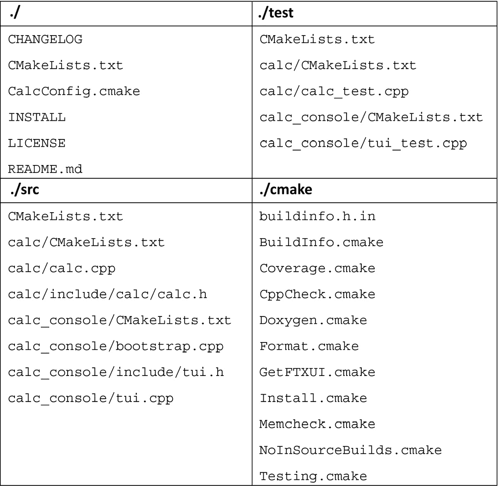
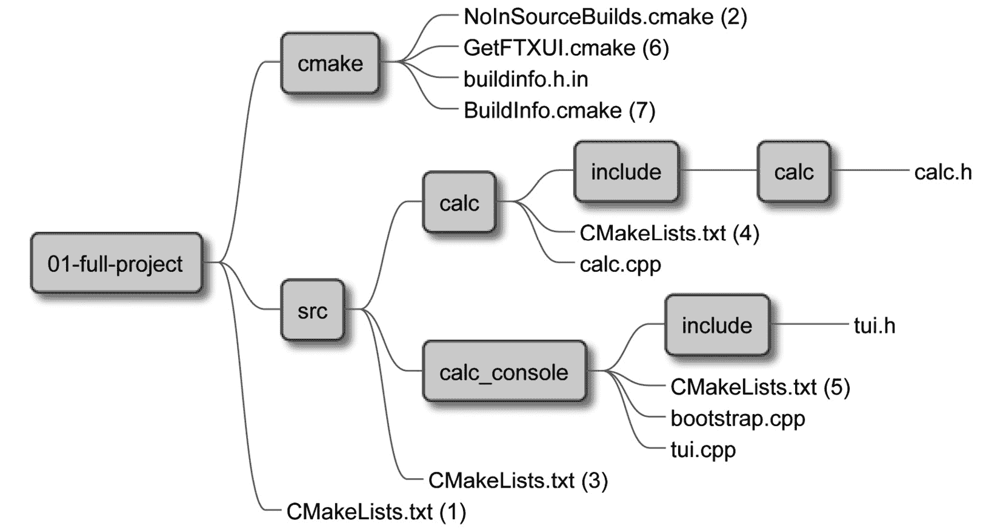
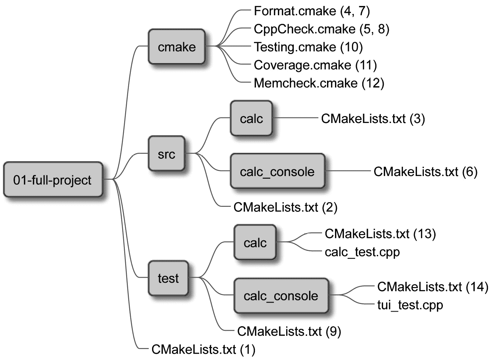
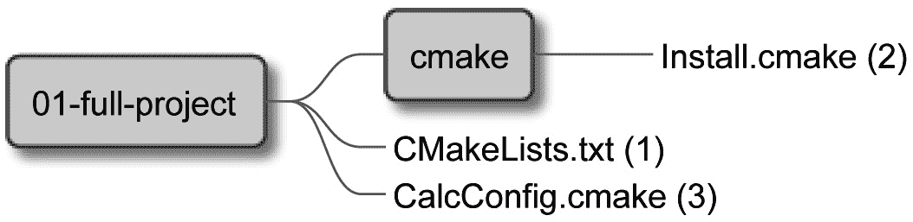
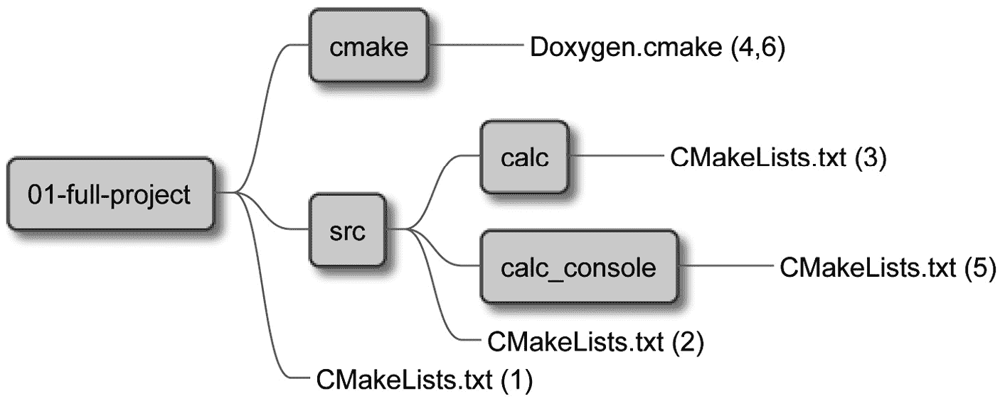

# 第十二章：创建你的专业项目

我们已经掌握了构建专业项目的所有必要知识；我们学习了结构化、构建、依赖管理、测试、分析、安装和打包。是时候将这些学到的技能付诸实践，通过创建一个连贯、专业的项目。

需要理解的重要一点是，即使是简单的程序，也会从自动化质量检查和简化的端到端过程中受益，这些过程将原始代码转化为完全成熟的解决方案。确实，这通常是一个相当大的投资，因为需要采取许多步骤才能一切准备就绪——尤其是如果我们试图将这些机制添加到已经存在的代码库中（通常，它们已经很大且复杂）。

那就是从一开始就使用 CMake 并提前设置所有管道的理由；这样做不仅配置起来会更简单，更重要的是，早点做会更有效率，因为所有的质量控制和构建自动化最终都需要添加到长期项目中。

这正是本章我们将要做的——我们将编写一个新的解决方案，尽可能小和简单。它将执行一个单一的（几乎）实用功能——将两个数字相加。限制业务代码的功能将允许我们关注项目中学到的每个其他方面。

为了有一个更复杂的问题来解决，这个项目将同时构建一个库和一个可执行文件。该库将提供内部业务逻辑，并作为 CMake 包供其他项目使用。可执行文件只为最终用户而设计，并实现一个用户界面，显示底层库的功能。

在本章中，我们将涵盖以下主要主题：

+   规划我们的工作

+   项目布局

+   构建与管理依赖

+   测试与程序分析

+   安装与打包

+   提供文档

# 技术要求

你可以在这个章节中找到的代码文件在 GitHub 上：

[`github.com/PacktPublishing/Modern-CMake-for-Cpp/tree/main/examples/chapter12`](https://github.com/PacktPublishing/Modern-CMake-for-Cpp/tree/main/examples/chapter12)

要构建本书中提供的示例，请始终使用推荐命令：

```cpp
cmake -B <build tree> -S <source tree>
cmake --build <build tree>
```

请确保将占位符`<build tree>`和`<source tree>`替换为适当的路径。作为提醒：**build tree** 是目标/输出目录的路径，**source tree** 是源代码所在的位置的路径。

# 规划我们的工作

本章我们将要构建的软件并不打算非常复杂——我们将创建一个简单的计算器，用于相加两个数字（*图 12.1*）。它将被发布为一个具有文本用户界面的控制台应用程序和一个执行数学运算的库，这可以潜在地用于另一个项目。虽然在现实生活中这种项目用处不大，因为 C++在其标准库中提供了大量的计算支持，但它的平凡性将完美地探索本书中讨论的所有技术如何在实践中共同工作：



图 12.1 – 控制台计算器用户界面的两种状态

通常，项目要么产生面向用户的可执行文件，要么为开发者提供库。同时做两者的项目比较少见，但并非完全罕见——一些应用程序提供独立的 SDK 或支持插件创建的库。另一种情况可能是提供其使用示例的库。本章我们将要构建的项目在一定程度上适合最后一类。

我们将通过回顾章节列表、回顾其内容，并选择其中描述的技巧和工具来开始规划，以构建我们的计算应用程序：

第*1*章，*CMake 的初步步骤*：

第一章为我们提供了关于 CMake 的基本信息——如何安装它以及如何使用其命令行构建准备好的项目。这里提供的关于项目文件的信息将是关键：不同文件的责任、通常使用的名称和一些古怪之处。在本章中，我们还讨论了生成器的预设文件，但在本项目中将跳过这些内容。

第*2*章，*CMake 语言*：

在这里，我们介绍了编写正确的列表文件和脚本所需的工具。我们分享了关于代码：注释、命令调用和参数的基本信息。我们还详细解释了变量、列表和控制结构，并介绍了一些非常有用的命令。这些知识将在整个项目中得到应用。

第*3*章，*设置你的第一个 CMake 项目*：

第三章讨论的主题将对项目产生重大影响：

+   指定最小的 CMake 版本决定了哪些 CMake 政策将适用；命名、版本化和配置项目的语言影响了构建的基本行为。

+   关于项目划分和结构化的洞察力塑造了目录和文件的结构布局。

+   系统发现变量有助于我们决定如何处理不同的环境，特别是针对本项目——例如，我们需要运行`ldconfig`吗？

+   工具链配置允许指定特定版本的 C++和编译器支持的标准。

本章还告诉我们，禁用源代码构建通常是个好主意，所以我们将会这样做。

第四章，*使用目标工作*：

在这里，我们强调了现代 CMake 项目如何广泛使用目标。我们的项目也将如此，以下原因是：

+   定义几个库和可执行文件（用于测试和生产）将使项目保持组织性并*保持干燥.*

+   目标属性和传递使用要求（传播属性）使配置接近目标定义。

+   生成器表达式将在解决方案中多次出现，但我们将其尽可能保持简单。

在这个项目中，我们将使用自定义命令生成 Valgrind 和覆盖报告文件，并使用目标挂钩（`PRE_BUILD`）来清理由覆盖度 instrumentation 产生的`.gcda`文件。

第五章，*使用 CMake 编译 C++源代码*：

没有编译的 C++项目是不存在的。基础知识相当简单，但 CMake 允许我们在许多方面调整此过程：扩展目标源、配置优化器、提供调试信息。对于这个项目，默认编译标志就足够了，但我们将继续尝试预处理器：

+   我们将在编译的可执行文件中存储构建元数据（项目版本、构建时间和 Git 提交 SHA），并展示给用户。

+   我们将启用头文件的预编译。在一个如此小的项目中，这并不是真正的必需品，但它将帮助我们练习这个概念。

统一构建将不再必要——项目不会足够大，以至于添加它们值得。

第六章，*使用 CMake 链接*：

第六章为我们提供了关于链接（在任何项目中都有用）的一般信息，其中大部分默认情况下就很有用。但由于该项目还提供了一个库，我们将明确参考一些以下构建说明：

+   用于测试和开发的静态库

+   用于发布的共享库

本章概述了如何为测试分离`main()`，我们也将这样做。

第七章，*使用 CMake 管理依赖关系*：

为了使项目更有趣，我们将引入一个外部依赖项：一个文本 UI 库。我们在这一章描述了几种依赖管理方法。选择正确的一个并不太困难：通常推荐使用`FetchContent`实用程序模块，最为方便（除非我们正在解决本章中描述的具体边缘情况）。

第八章，*测试框架*：

适当的自动化测试对于确保我们解决方案的质量随时间不会降低至关重要。我们将添加对 CTest 的支持，并适当结构我们的项目以进行测试（我们将应用前面提到的`main()`分离）。

此外，在本章中，我们讨论了两个测试框架：Catch2 和 GTest 带 gMock；对于这个项目，我们将使用后者。为了获得清晰的覆盖信息，我们将使用 LCOV 生成 HTML 报告。

第九章 *程序分析工具*：

为了进行静态分析，我们可以选择多种工具：Clang-Tidy，Cpplint，Cppcheck，include-what-you-use，以及 link what you use。在本例中，我们将选择 Cppcheck，因为 Clang-Tidy 与使用 GCC 生成的预编译头配合不佳。动态分析将使用 Valgrind 的 Memcheck 工具完成，我们将使用 Memcheck-cover 包装器生成 HTML 报告。在构建过程中，我们的源代码也将自动使用 ClangFormat 格式化。

第十章 *生成文档：*

由于我们将提供一个库作为这个项目的一部分，提供至少一些文档是关键的。正如我们所知，CMake 允许我们使用 Doxygen 来自动生成文档。我们将通过添加 doxygen-awesome-css 样式来对其进行刷新设计。

第十一章 *安装和打包：*

最后，我们将配置解决方案的安装和打包。我们将准备形成包的文件，以及目标定义。我们将使用`GNUInstallDirs`模块将该解决方案和构建目标的艺术品安装到适当的目录中。此外，我们将配置一些组件以模块化解决方案，并准备与 CPack 一起使用。

专业项目还包括一些文本文件：`README`，`LICENSE`，`INSTALL`等。我们将在最后简要提及这一点。

注意

为了简化问题，我们不会实现检查所有必需的工具和依赖是否可用的逻辑。我们将依靠 CMake 在这里显示其诊断信息，并告诉用户缺少什么。如果你在阅读这本书后发布的项目获得了显著的牵引力，你可能会想要考虑添加这些机制以改善用户体验。

已经形成了明确的计划，接下来让我们讨论一下如何实际地组织项目，包括逻辑目标和目录结构。

# 项目布局

为了构建任何项目，我们应该首先清楚理解其中将要创建的逻辑目标。在本例中，我们将遵循*图 12.2*所示的结构：



图 12.2 – 逻辑目标结构

让我们按照构建顺序来探索结构。首先，我们将编译`calc_obj`，这是一个**对象库**。我们在书中提到了几次*对象库*，但并没有真正介绍这个概念。现在让我们来做这件事。

## 对象库

对象库用于将多个源文件组合到一个单一的逻辑目标中，并在构建过程中编译成（`.o`）*目标文件*。要创建一个对象库，我们使用与其它库相同的`OBJECT`关键字方法：

```cpp
add_library(<target> OBJECT <sources>)
```

在构建过程中生成的*目标文件*可以通过`$<TARGET_OBJECTS:objlib>`生成器表达式作为编译元素添加到其他目标中：

```cpp
add_library(... $<TARGET_OBJECTS:objlib> ...)
add_executable(... $<TARGET_OBJECTS:objlib> ...)
```

另外，您可以使用`target_link_libraries()`命令将它们作为依赖项添加。

在我们的`Calc`库中，对象库将有助于避免为库的静态和共享版本重复编译库源。我们只需要记住显式编译*目标文件*时使用`POSITION_INDEPENDENT_CODE`，因为这是共享库的一个要求。

处理完这些之后，让我们回到这个项目的目标：`calc_obj`将提供编译后的*目标文件*，然后将用于`calc_static`和`calc_shared`库。它们之间有什么实际的区别，为什么要提供两个库？

## 共享库与静态库

我们在*第六章*中简要介绍了这两种库，*使用 CMake 链接*。我们提到，总体内存使用对于使用相同共享库的多个程序可能更有利，并且用户可能已经拥有最流行的库，或者知道如何快速安装它们。更重要的是，共享库以单独的文件形式提供，必须安装在特定的路径上，动态链接器才能找到它们，而静态库作为可执行文件的一部分合并。在这种形式下，它们的使用速度略快，因为不需要进行额外的查找来找到内存中代码的位置。

作为库作者，我们可以决定是否提供库的静态或共享版本，或者我们可以简单地提供这两个版本，并将此决定留给使用我们库的程序员。我们在这里选择后一种方法（只是为了看看它是如何完成的）。

静态库将由`calc_test`目标消耗，其中将包含确保库提供的业务功能按预期工作的单元测试。如前所述，我们从相同的一组编译*目标文件*构建两个版本。在这种场景下，测试任何一个版本都是完全可以的，因为它们的实际行为应该没有实际的区别。

提供的`calc_console_static`目标将使用共享库。此目标还将链接到外部依赖项：**函数式终端(X)用户界面**（**FTXUI**）库，由 Arthur Sonzogni 编写（在*进一步阅读部分*有一个到 GitHub 项目的链接）。它为文本用户界面提供了一个无依赖、跨平台的框架。

最后两个目标是`calc_console`和`calc_console_test`。`calc_console`目标只是一个围绕`calc_console_static`的`main()`引导包装器。它的唯一目的是从业务代码中提取入口点。这允许我们编写单元测试（需要提供自己的入口点）并从`calc_console_test`运行它们。

我们现在知道需要构建哪些目标以及它们之间的关系。让我们弄清楚如何用文件和目录结构化项目。

## 项目文件结构

项目包含两个主要目标，`calc`库和`calc_console`可执行文件，每个目标都将在`src`和`test`下的目录树中，以将生产代码与测试分开（如*图 12.3*所示）。此外，我们将在另外两个目录中拥有我们的文件：

+   项目根目录，包含顶级配置和关键项目文档文件

+   用于所有实用模块和帮助文件的`cmake`目录，CMake 使用这些文件来构建和安装项目：



图 12.3 – 项目目录结构

以下是每个四个主要目录中的完整文件列表：



最初，`cmake`目录比业务代码更繁忙，但随着项目的功能增长，这种情况会很快改变。启动一个干净项目的努力是巨大的，但不用担心——很快就会得到回报。

我们将遍历所有文件，并详细查看它们做什么以及它们在项目中的作用。这将在四个步骤中完成：构建、测试、安装和提供文档。

# 构建和管理依赖项

所有的构建过程都是相同的。我们从顶层列表文件开始，向下导航到项目源树。*图 12.4* 显示了哪些项目文件参与构建。圆括号中的数字表示 CMake 脚本执行的顺序：



图 12.4 – 构建阶段使用的文件

我们的顶层列表文件将配置项目并加载嵌套元素：

chapter-12/01-full-project/CMakeLists.txt

```cpp
cmake_minimum_required(VERSION 3.20.0)
project(Calc VERSION 1.0.0 LANGUAGES CXX)
list(APPEND CMAKE_MODULE_PATH "${CMAKE_SOURCE_DIR}/cmake")
include(NoInSourceBuilds)
add_subdirectory(src bin)
add_subdirectory(test)
include(Install)
```

我们首先提供关键项目详情，并添加到 CMake 实用模块的路径（我们项目中的`cmake`目录）。然后我们禁用源内构建（通过自定义模块），并包括两个关键目录：

+   `src`，包含项目源代码（在构建树中将被命名为`bin`）

+   `test`，包含所有的测试工具

最后，我们包含另一个模块，将设置项目的安装。这将在另一节中讨论。与此同时，让我们看看`NoInSourceBuilds`模块是如何工作的：

chapter-12/01-full-project/cmake/NoInSourceBuilds.cmake

```cpp
if(PROJECT_SOURCE_DIR STREQUAL PROJECT_BINARY_DIR)
  message(FATAL_ERROR
    "\n"
    "In-source builds are not allowed.\n"
    "Instead, provide a path to build tree like so:\n"
    "cmake -B <destination>\n"
    "\n"
    "To remove files you accidentally created execute:\n"
    "rm -rf CMakeFiles CMakeCache.txt\n"
  )
endif()
```

这里没有惊喜——我们只是检查用户是否为`cmake`命令提供了目标目录作为参数来存储生成的文件。这必须与项目源树不同的路径。如果不是这样，我们告知用户如何提供它，以及如何在犯错误后清理仓库。

我们的顶级列表文件然后包含了`src`子目录，指示 CMake 读取其中的列表文件：

chapter-12/01-full-project/src/CMakeLists.txt

```cpp
add_subdirectory(calc)
add_subdirectory(calc_console)
```

这个文件非常微妙——它只是进入嵌套目录，执行其中的列表文件。让我们跟随`calc`库的列表文件——它有点复杂，所以我们将分部分讨论。

## 构建 Calc 库

`calc`的列表文件包含一些测试配置，但我们现在将关注构建；其余内容将在*测试和程序分析*部分讨论：

chapter-12/01-full-project/src/calc/CMakeLists.txt（片段）

```cpp
add_library(calc_obj OBJECT calc.cpp)
target_include_directories(calc_obj INTERFACE
  "$<BUILD_INTERFACE:${CMAKE_CURRENT_SOURCE_DIR}/include>"
  "$<INSTALL_INTERFACE:${CMAKE_INSTALL_INCLUDEDIR}>"
)
set_target_properties(calc_obj PROPERTIES
    PUBLIC_HEADER src/calc/include/calc/calc.h
    POSITION_INDEPENDENT_CODE 1
)
add_library(calc_shared SHARED)
target_link_libraries(calc_shared calc_obj)
add_library(calc_static STATIC)
target_link_libraries(calc_static calc_obj)
# ... testing and program analysis modules
# ... documentation generation
```

我们声明了三个目标：

+   `calc_obj`，一个*对象库*，编译一个`calc.cpp`实现文件。它还通过`PUBLIC_HEADER`属性引用`calc.h`头文件，该属性可以在配置的*包含目录*中找到（感谢生成器表达式提供特定模式的适当路径——构建或安装）。使用这个库，我们避免了其他目标的重复编译，但我们也需要启用`POSITION_INDEPENDENT_CODE`，以便生成的*对象文件*可以被共享库使用。

+   `calc_shared`，一个依赖于`calc_obj`的共享库。

+   `calc_static`，一个依赖于`calc_obj`的静态库。

为了完整性，我们将添加`calc`库的 C++ 代码清单：

chapter-12/01-full-project/src/calc/include/calc/calc.h

```cpp
#pragma once
namespace Calc {
int Sum(int a, int b);
int Multiply(int a, int b);
}  // namespace Calc
```

这段代码相当基础：它声明了两个全局函数，包含在`Calc`命名空间中（C++命名空间在库中非常有用，帮助避免名称冲突）。

实现文件也非常直接：

chapter-12/01-full-project/src/calc/calc.cpp

```cpp
namespace Calc {
int Sum(int a, int b) {
  return a + b;
}
int Multiply(int a, int b) {
  return a * b;
}
}  // namespace Calc
```

这结束了`src/calc`目录中文件的解释。接下来是`src/calc_console`，以及使用这个库构建控制台计算器的可执行文件。

## 构建 Calc 控制台可执行文件

`calc_console`的源目录包含几个文件：一个列表文件，两个实现文件（业务代码和引导程序），和一个头文件。列表文件如下所示：

chapter-12/01-full-project/src/calc_console/CMakeLists.txt（片段）

```cpp
include(GetFTXUI)
add_library(calc_console_static STATIC tui.cpp)
target_include_directories(calc_console_static PUBLIC
include)
target_precompile_headers(calc_console_static PUBLIC
<string>)
target_link_libraries(calc_console_static PUBLIC
calc_shared
  ftxui::screen ftxui::dom ftxui::component)
include(BuildInfo)
BuildInfo(calc_console_static)
# … testing and program analysis modules
# ... documentation generation
add_executable(calc_console bootstrap.cpp)
target_link_libraries(calc_console calc_console_static)
```

列表文件看起来很忙，但现在，作为有经验的 CMake 用户，我们可以轻松地解开里面正在发生的事情：

1.  包含 CMake 模块以获取 FTXUI 依赖。

1.  声明`calc_console_static`目标，其中包含业务代码，但不包括`main()`函数，以允许 GTest 定义自己的入口点。

1.  添加一个头文件预编译——我们只是添加了一个标准的`string`头文件来证明一个观点，但对于更大的项目，我们可以添加更多（包括项目所属的头文件）。

1.  将业务代码与共享的`calc_shared`库和 FTXUI 库链接。

1.  添加所有要在该目标上执行的动作：生成构建信息、测试、程序分析和文档。

1.  添加并链接`calc_console`引导可执行文件，该文件提供了入口点。

再次，我们将推迟讨论测试和文档，而是查看依赖管理和构建信息生成。

请注意，我们倾向于使用实用模块而不是 find-module 来引入 FTXUI。这是因为这个依赖项不太可能已经存在于系统中。与其希望找到它，不如我们获取并安装它：

chapter-12/01-full-project/cmake/GetFTXUI.cmake

```cpp
include(FetchContent)
FetchContent_Declare(
 FTXTUI
 GIT_REPOSITORY https://github.com/ArthurSonzogni/FTXUI.git
 GIT_TAG        v0.11
)
option(FTXUI_ENABLE_INSTALL "" OFF)
option(FTXUI_BUILD_EXAMPLES "" OFF)
option(FTXUI_BUILD_DOCS "" OFF)
FetchContent_MakeAvailable(FTXTUI) 
```

我们使用了推荐的`FetchContent`方法，在第七章，《使用 CMake 管理依赖项》中有详细描述。唯一的异常添加是`option()`命令的调用。它们允许我们跳过 FTXUI 构建的繁琐步骤，并使它的安装配置与这个项目的安装分离。对于 GTest 依赖项也需要这样做。`option()`命令在*进一步阅读*部分中有参考。

`calc_command`的列表文件包含了一个更多的自定义实用模块，与构建相关：`BuildInfo`。我们将使用它来记录三个可以在可执行文件中显示的值：

+   当前 Git 提交的 SHA

+   构建的时间戳

+   顶级列表文件中指定的项目版本

你可能还记得从第五章，《使用 CMake 编译 C++源码》，我们可以使用 CMake 捕获一些构建时的值，并通过模板文件将它们提供给 C++代码——例如，使用一个方便的 C++结构体：

chapter-12/01-full-project/cmake/buildinfo.h.in

```cpp
struct BuildInfo {
  static inline const std::string CommitSHA =
    "@COMMIT_SHA@";
  static inline const std::string Timestamp =
    "@TIMESTAMP@";
  static inline const
  std::string Version = "@PROJECT_VERSION@";
};
```

为了在配置阶段填充该结构，我们将使用以下代码：

chapter-12/01-full-project/cmake/BuildInfo.cmake

```cpp
set(BUILDINFO_TEMPLATE_DIR ${CMAKE_CURRENT_LIST_DIR})
set(DESTINATION "${CMAKE_CURRENT_BINARY_DIR}/buildinfo")
string(TIMESTAMP TIMESTAMP)
find_program(GIT_PATH git REQUIRED)
execute_process(COMMAND
  ${GIT_PATH} log --pretty=format:'%h' -n 1
  OUTPUT_VARIABLE COMMIT_SHA)
configure_file(
  "${BUILDINFO_TEMPLATE_DIR}/buildinfo.h.in"
  "${DESTINATION}/buildinfo.h" @ONLY
)
function(BuildInfo target)
  target_include_directories(${target} PRIVATE
    ${DESTINATION})
endfunction()
```

包含模块将设置包含我们所需信息的变量，然后我们将调用`configure_file()`来生成`buildinfo.h`。剩下要做的就是调用`BuildInfo`函数，并将生成的文件目录添加到所需目标*include directories*中。如果需要，该文件可以与多个不同的消费者共享。在这种情况下，你可能需要在列表文件的顶部添加`include_guard(GLOBAL)`，以避免为每个目标运行`git`命令。

在深入讨论控制台计算器的实现之前，我想强调你不必太担心`tui.cpp`文件的复杂性。要完全理解它，你将需要对 FXTUI 库有一定的了解——我们在这里不想深入讲解。相反，让我们关注高亮的行：

chapter-12/01-full-project/src/calc_console/tui.cpp

```cpp
#include "tui.h"
#include <ftxui/dom/elements.hpp>
#include "buildinfo.h"
#include "calc/calc.h"
using namespace ftxui;
using namespace std;
string a{"12"}, b{"90"};
auto input_a = Input(&a, "");
auto input_b = Input(&b, "");
auto component = Container::Vertical({input_a, input_b});
Component getTui() {
  return Renderer(component, [&] {
    auto sum = Calc::Sum(stoi(a), stoi(b));
    return vbox({
      text("CalcConsole " + BuildInfo::Version),
      text("Built: " + BuildInfo::Timestamp),
      text("SHA: " + BuildInfo::CommitSHA),
       separator(),
       input_a->Render(),
       input_b->Render(),
       separator(),
       text("Sum: " + to_string(sum)),
   }) |
   border;
 });
}
```

这段代码提供了一个`getTui()`函数，它返回一个`ftxui::Component`，一个封装了标签、文本字段、分隔符和边框的交互式 UI 元素的对象。如果你对它是如何工作的细节感兴趣，你会在*进一步阅读*部分找到合适的参考资料。

更重要的是，看看包含指令：它们指的是我们之前通过`calc_obj`目标和`BuildInfo`模块提供的头文件。lambda 函数构造函数提供的第一个调用库的`Calc::Sum`方法，并使用结果值打印带有`sum`的标签（通过调用下面的`text()`函数）。

同样，标签用于呈现在构建时通过连续三次调用`text()`收集的`BuildInfo::`值。

这个方法在其相关的头文件中声明：

chapter-12/01-full-project/src/calc_console/include/tui.h

```cpp
#include <ftxui/component/component.hpp>
ftxui::Component getTui();
```

然后由`calc_console`目标中的引导程序使用：

chapter-12/01-full-project/src/calc_console/bootstrap.cpp

```cpp
#include <ftxui/component/screen_interactive.hpp>
#include "tui.h"
int main(int argc, char** argv) {
  ftxui::ScreenInteractive::FitComponent().Loop(getTui());
}
```

这段简短的代码利用了`ftxui`来创建一个交互式控制台屏幕，它接收`getTui()`返回的`Component`对象，使其对用户可见，并在循环中收集键盘事件，创建一个界面，如图*12.1*所示。再次强调，完全理解这一点并不是非常关键，因为`ftxui`的主要目的是为我们提供一个外部依赖，我们可以用它来练习 CMake 技术。

我们已经覆盖了`src`目录中的所有文件。让我们继续讨论前面提到的测试和分析程序的主题。

# 测试与程序分析

程序分析与测试相辅相成，确保我们解决方案的质量。例如，当使用测试代码时，运行 Valgrind 变得更加一致。为此，我们将配置这两件事在一起。图*12.5*展示了执行流程和设置所需的文件（将在`src`目录中添加几个片段）：



](img/Figure_12.5_B17205.jpg)

图 12.5 – 用于启用测试和程序分析的文件

正如我们所知，测试文件位于`test`目录中，它们的列表文件通过`add_subdirectory()`命令从顶层列表文件执行。让我们看看里面有什么：

chapter-12/01-full-project/test/CMakeLists.txt

```cpp
include(Testing)
add_subdirectory(calc)
add_subdirectory(calc_console)
```

在`Testing`模块中定义的测试工具包括在这个级别，以允许两个目标组（来自`calc`和`calc_console`目录）使用它们：

chapter-12/01-full-project/cmake/Testing.cmake (片段)

```cpp
enable_testing()
include(FetchContent)
FetchContent_Declare(
  googletest
  GIT_REPOSITORY https://github.com/google/googletest.git
  GIT_TAG release-1.11.0
)
# For Windows: Prevent overriding the parent project's
# compiler/linker settings
set(gtest_force_shared_crt ON CACHE BOOL "" FORCE)
option(INSTALL_GMOCK "Install GMock" OFF)
option(INSTALL_GTEST "Install GTest" OFF)
FetchContent_MakeAvailable(googletest)
...
```

我们启用了测试并包含了`FetchContent`模块以获取 GTest 和 GMock。在这个项目中我们实际上并没有使用 GMock，但这两个框架都包含在一个单一的存储库中，因此我们也需要配置 GMock。此配置的突出部分使这两个框架的安装与我们的项目的安装分离（通过将适当的`option()`设置为`OFF`）。

接下来，我们需要创建一个函数，以启用对业务目标的彻底测试。我们将其保存在同一个文件中：

chapter-12/01-full-project/cmake/Testing.cmake（继续）

```cpp
...
include(GoogleTest)
include(Coverage)
include(Memcheck)
macro(AddTests target)
  target_link_libraries(${target} PRIVATE gtest_main gmock)
  gtest_discover_tests(${target})
  AddCoverage(${target})
  AddMemcheck(${target})
endmacro()
```

在这里，我们首先包含必要的模块：`GoogleTest`与 CMake 捆绑在一起，但`Coverage`和`Memcheck`将由我们编写。然后我们提供了一个`AddTests`宏，该宏将准备一个测试目标、启用覆盖和内存检查。让我们详细看看它是如何工作的。

## 准备覆盖模块

为多个目标添加覆盖是一个有点棘手的过程，因为它包括几个步骤。我们首先介绍两个函数，以启用覆盖跟踪并在构建之间清理陈旧的跟踪文件：

chapter-12/01-full-project/cmake/Coverage.cmake（片段）

```cpp
function(EnableCoverage target)
  if (CMAKE_BUILD_TYPE STREQUAL Debug)
    target_compile_options(${target} PRIVATE --coverage 
      -fno-inline)
    target_link_options(${target} PUBLIC --coverage)
  endif()
endfunction()
function(CleanCoverage target)
  add_custom_command(TARGET ${target} PRE_BUILD COMMAND
    find ${CMAKE_BINARY_DIR} -type f
    -name '*.gcda' -exec rm {} +)
endfunction()
```

前面的函数将在我们到达单独的目标配置（`calc_...`和`calc_console_...`）时被使用。`Coverage`模块还将提供一个生成自定义覆盖目标的函数：

chapter-12/01-full-project/cmake/Coverage.cmake（继续）

```cpp
function(AddCoverage target)
  find_program(LCOV_PATH lcov REQUIRED)
  find_program(GENHTML_PATH genhtml REQUIRED)
  add_custom_target(coverage-${target}
    COMMAND ${LCOV_PATH} -d . --zerocounters
    COMMAND $<TARGET_FILE:${target}>
    COMMAND ${LCOV_PATH} -d . --capture -o coverage.info
    COMMAND ${LCOV_PATH} -r coverage.info '/usr/include/*'
      -o filtered.info
    COMMAND ${GENHTML_PATH} -o coverage-${target}
      filtered.info --legend
    COMMAND rm -rf coverage.info filtered.info
    WORKING_DIRECTORY ${CMAKE_BINARY_DIR}
  )
endfunction()
```

`AddCoverage()`函数在`Testing`模块中的`AddTests()`函数中被调用。它与第八章中介绍的*测试框架*略有不同，因为它考虑了目标名称，并将其添加到输出路径以避免任何冲突。

为了生成两个测试目标的报告，我们只需运行两个`cmake`命令（在用`Debug`构建类型配置项目后）：

```cpp
cmake --build <build-tree> -t coverage-calc_test
cmake --build <build-tree> -t coverage-calc_console_test
```

现在是我们修改之前创建的 Memcheck 模块的时候了（在第九章*程序分析工具*中）以处理多个目标。

## 准备 Memcheck 模块

`AddTests()`调用了 Valgrind 内存管理报告的生成。我们将从一般设置开始这个模块：

chapter-12/01-full-project/cmake/Memcheck.cmake（片段）

```cpp
include(FetchContent)
FetchContent_Declare(
  memcheck-cover
  GIT_REPOSITORY https://github.com/Farigh/memcheck-
    cover.git
  GIT_TAG        release-1.2
)
FetchContent_MakeAvailable(memcheck-cover)
```

我们已经熟悉这段代码了；让我们看看将创建适当目标的函数：

chapter-12/01-full-project/cmake/Memcheck.cmake（继续）

```cpp
function(AddMemcheck target)
  set(MEMCHECK_PATH ${memcheck-cover_SOURCE_DIR}/bin)
  set(REPORT_PATH "${CMAKE_BINARY_DIR}/valgrind-${target}")
  add_custom_target(memcheck-${target}
    COMMAND ${MEMCHECK_PATH}/memcheck_runner.sh -o
      "${REPORT_PATH}/report"
      -- $<TARGET_FILE:${target}>
    COMMAND ${MEMCHECK_PATH}/generate_html_report.sh
      -i ${REPORT_PATH}
      -o ${REPORT_PATH}
    WORKING_DIRECTORY ${CMAKE_BINARY_DIR}
  )
endfunction()
```

为了处理多个目标，`REPORT_PATH`变量被设置以存储目标特定的报告路径。然后在此后的命令中使用此变量。

可以通过以下命令生成 Memcheck 报告（这在`Debug`构建类型中效果更好）：

```cpp
cmake --build <build-tree> -t memcheck-calc_test
cmake --build <build-tree> -t memcheck-calc_console_test
```

这些都是`Testing`模块所使用的模块。我们来看看它是如何使用的。

## 应用测试场景

为了让测试工作，必须发生几件事情：

1.  我们需要为两个目录创建嵌套列表文件并定义测试目标。

1.  单元测试需要编写并作为可执行目标准备。

1.  这些目标需要调用 `AddTests()`。

1.  **被测试的软件**（**SUT**）需要被修改以启用覆盖率收集。

1.  收集的覆盖率应在构建之间清理，以避免段错误。

正如 `test/CMakeLists.txt` 暗示的那样，我们将创建两个嵌套列表文件来配置我们的测试。再一次，我们将为库提供一个：

chapter-12/01-full-project/test/calc/CMakeLists.txt（片段）

```cpp
add_executable(calc_test calc_test.cpp)
target_link_libraries(calc_test PRIVATE calc_static)
AddTests(calc_test)
EnableCoverage(calc_obj)
```

我们也会为可执行文件提供一个：

chapter-12/01-full-project/test/calc_console/CMakeLists.txt（片段）

```cpp
add_executable(calc_console_test tui_test.cpp)
target_link_libraries(calc_console_test
  PRIVATE calc_console_static)
AddTests(calc_console_test)
EnableCoverage(calc_console_static)
```

为了保持简洁，我们将提供尽可能简单的单元测试。一个文件将覆盖库：

chapter-12/01-full-project/test/calc/calc_test.cpp

```cpp
#include "calc/calc.h"
#include <gtest/gtest.h>
TEST(CalcTest, SumAddsTwoInts) {
  EXPECT_EQ(4, Calc::Sum(2, 2));
}
TEST(CalcTest, MultiplyMultipliesTwoInts) {
  EXPECT_EQ(12, Calc::Multiply(3, 4));
}
```

我们将有一个第二个文件来测试业务代码。为此，我们将使用 FXTUI 库。同样，我们不期望你详细了解这个源代码。本章提供的测试列表只是为了完整：

chapter-12/01-full-project/test/calc_console/tui_test.cpp

```cpp
#include "tui.h"
#include <gmock/gmock.h>
#include <gtest/gtest.h>
#include <ftxui/screen/screen.hpp>
using namespace ::ftxui;
TEST(ConsoleCalcTest, RunWorksWithDefaultValues) {
  auto component = getTui();
  auto document = component->Render();
  auto screen = Screen::Create(Dimension::Fit(document));
  Render(screen, document);
  auto output = screen.ToString();
  ASSERT_THAT(output, testing::HasSubstr("Sum: 102"));
}
```

这个测试代码简单地将文本界面渲染为默认状态到一个静态屏幕对象，然后将其存储在一个字符串中。为了使测试通过，输出需要包含默认和的子字符串。

现在，我们需要完成剩下的步骤：创建测试目标并准备好它们的源代码后，是时候使用 `Testing` 模块的 `AddTests()` 函数将它们注册到 CPack 了。

我们为图书馆这样做：

chapter-12/01-full-project/test/calc/CMakeLists.txt（继续）

```cpp
# ... calc_test target definition
AddTests(calc_test)
EnableCoverage(calc_obj)
```

然后为可执行文件这样做：

chapter-12/01-full-project/test/calc_console/CMakeLists.txt（继续）

```cpp
# ... calc_console_test target definition
AddTests(calc_console_test)
EnableCoverage(calc_console_static)
```

随后，我们指示 SUT 使用 `EnableCoverage()` 启用覆盖率 instrumentation。注意，在库的情况下，我们必须添加 instrumentation 到 *对象库* 而不是静态库。这是因为 `--coverage` 标志必须添加到编译步骤，这发生在 `calc_obj` 正在构建的时候。

遗憾的是，我们在这里不能添加覆盖率文件的清理，因为 CMake 要求 `add_custom_command` 钩子必须在目标定义相同的目录中调用。这使我们回到了之前未完成的 `src/calc` 和 `src/calc_console` 列表文件。我们需要分别添加 `CleanCoverage(calc_static)` 和 `CleanCoverage(calc_console_static)`（我们首先必须包含 `Coverage` 模块）。还需要向这些文件添加什么吗？启用静态分析的说明！

## 添加静态分析工具

我们将业务代码列表文件的继续推迟到现在，这样我们就可以在适当的情况下讨论添加的模块。我们可以在库列表文件中添加一个 `CleanCoverage` 函数调用和其他一些东西：

chapter-12/01-full-project/src/calc/CMakeLists.txt（继续）

```cpp
# ... calc_static target definition
include(Coverage)
CleanCoverage(calc_static)
include(Format)
Format(calc_static .)
include(CppCheck)
AddCppCheck(calc_obj)
# ... documentation generation
```

我们也可以将它们添加到可执行文件中：

章节-12/01-full-project/src/calc_console/CMakeLists.cmake (继续)

```cpp
# ... calc_console_static target definition
include(BuildInfo)
BuildInfo(calc_console_static)
include(Coverage)
CleanCoverage(calc_console_static)
include(Format)
Format(calc_console_static .)
include(CppCheck)
AddCppCheck(calc_console_static)
# ... documentation generation
# ... calc_console bootstrap target definition
```

这些文件现在几乎完成了（正如第二个注释所暗示的，我们还需要添加文档代码，这将在*自动文档生成*部分完成）。

列表中出现了两个新模块：`Format`和`CppCheck`。让我们先来看第一个：

章节-12/01-full-project/cmake/Format.cmake

```cpp
function(Format target directory)
  find_program(CLANG-FORMAT_PATH clang-format REQUIRED)
  set(EXPRESSION h hpp hh c cc cxx cpp)
  list(TRANSFORM EXPRESSION PREPEND "${directory}/*.")
  file(GLOB_RECURSE SOURCE_FILES FOLLOW_SYMLINKS
    LIST_DIRECTORIES false ${EXPRESSION}
  )
  add_custom_command(TARGET ${target} PRE_BUILD COMMAND
    ${CLANG-FORMAT_PATH} -i --style=file ${SOURCE_FILES}
  )
endfunction()
```

`Format()`函数是第九章《程序分析工具》中描述的格式化函数的完整复制；我们在这里只是重新使用它。

接下来是一个全新的`CppCheck`模块：

章节-12/01-full-project/cmake/CppCheck.cmake

```cpp
function(AddCppCheck target)
  find_program(CPPCHECK_PATH cppcheck REQUIRED)
  set_target_properties(${target}
    PROPERTIES CXX_CPPCHECK
    "${CPPCHECK_PATH};--enable=warning;--error-exitcode=10"
  )
endfunction()
```

这简单又方便。您可能会发现它与 Clang-Tidy 模块有些相似（来自第九章，《程序分析工具》）；这是 CMake 的优势——许多概念的工作方式都是一致的。注意传递给`cppcheck`的参数：

+   `--enable=warning` – 这指定了我们希望获得警告信息。您可以启用其他检查——具体请参考 Cppcheck 手册（在*进一步阅读部分*可以找到链接）。

+   `--error-exitcode=10` – 这指定了当`cppcheck`检测到问题时，我们希望得到一个错误代码。这可以是从`1`到`255`的任何数字（`0`表示成功），尽管有些数字可能被系统保留。

使用非常方便——调用`AddCppCheck`将通知 CMake 需要在指定的目标上自动运行检查。

我们已经在`src`和`test`子目录中几乎创建了所有文件。现在，我们的解决方案可以构建并完全测试。终于到了安装和打包的时候了。

# 安装和打包

我们回到前一章讨论的主题，并从快速查看设置安装和打包所需的文件开始：



![Figure 12.6 – 配置安装和打包文件的示例

这里只需要文件——大部分工作已经在之前的章节中完成。正如您可能记得的，顶层列表文件包含一个 CMake 模块，它将处理这个过程：

章节-12/01-full-project/CMakeLists.txt (片段)

```cpp
...
include(Install)
```

我们关注的是安装两个项目：

+   计算库工件：静态库、共享库以及与之相关的头文件和目标导出文件

+   计算控制台可执行文件

包定义配置文件将只引入库目标，因为潜在的消费项目不会依赖于可执行文件。

在配置安装步骤之后，我们将转向 CPack 配置。`Install`模块的高级概述如下：

章节-12/01-full-project/cmake/Install.cmake (概览)

```cpp
# Includes
# Installation of Calc library
# Installation of Calc Console executable
# Configuration of CPack
```

一切都有计划，所以是时候为库编写一个安装模块了。

## 库的安装

要安装库，最好先配置逻辑目标并指定其工件的安装位置。为了避免手动提供路径，我们将使用`GNUInstallDirs`模块提供的默认值。为了模块化，我们将把工件分组到组件中。默认安装将安装所有文件，但你可以选择只安装`runtime`组件并跳过`development`工件：

chapter-12/01-full-project/cmake/Install.cmake（片段）

```cpp
include(GNUInstallDirs)
# Calc library
install(TARGETS calc_obj calc_shared calc_static
  EXPORT CalcLibrary
  ARCHIVE COMPONENT development
  LIBRARY COMPONENT runtime 
  PUBLIC_HEADER DESTINATION
    ${CMAKE_INSTALL_INCLUDEDIR}/calc
      COMPONENT runtime
)
```

在安装过程中，我们想用`ldconfig`注册我们复制的共享库：

chapter-12/01-full-project/cmake/Install.cmake（继续）

```cpp
if (UNIX)
  install(CODE "execute_process(COMMAND ldconfig)"
    COMPONENT runtime
  )
endif()
```

有了这些步骤的准备，我们可以通过将其封装在可重用的 CMake 包中来使库对其他 CMake 项目可见。我们需要生成并安装目标导出文件和包括它的配置文件：

chapter-12/01-full-project/cmake/Install.cmake（继续）

```cpp
install(EXPORT CalcLibrary
  DESTINATION ${CMAKE_INSTALL_LIBDIR}/calc/cmake
  NAMESPACE Calc::
  COMPONENT runtime
)
install(FILES "CalcConfig.cmake"
  DESTINATION ${CMAKE_INSTALL_LIBDIR}/calc/cmake
)
```

正如我们所知，对于非常简单的包，配置文件可以非常简洁：

chapter-12/01-full-project/CalcConfig.cmake

```cpp
include("${CMAKE_CURRENT_LIST_DIR}/CalcLibrary.cmake")
```

就这样。现在，在构建解决方案后运行`cmake`的`--install`模式，库将被安装。剩下的要安装的只有可执行文件。

## 可执行文件的安装

所有二进制可执行文件的安装是最简单的一步。我们只需要使用一个命令：

chapter-12/01-full-project/cmake/Install.cmake（继续）

```cpp
# CalcConsole runtime
install(TARGETS calc_console
  RUNTIME COMPONENT runtime
)
```

完成啦！让我们继续进行配置的最后部分——打包。

## 使用 CPack 打包

我们可以放手去配置一大堆受支持的包类型；对于这个项目，然而，基本的配置就足够了：

chapter-12/01-full-project/cmake/Install.cmake（继续）

```cpp
# CPack configuration
set(CPACK_PACKAGE_VENDOR "Rafal Swidzinski")
set(CPACK_PACKAGE_CONTACT "email@example.com")
set(CPACK_PACKAGE_DESCRIPTION "Simple Calculator")
include(CPack)
```

如此简洁的设置对于标准归档文件，如 ZIP 文件，效果很好。我们可以用一个命令（项目必须先构建）来测试整个安装和打包：

```cpp
# cpack -G TGZ -B packages
CPack: Create package using TGZ
CPack: Install projects
CPack: - Run preinstall target for: Calc
CPack: - Install project: Calc []
CPack: Create package
CPack: - package: /tmp/b/packages/Calc-1.0.0-Linux.tar.gz generated. 
```

安装和打包就此结束；接下来要处理的事务是文档。

# 提供文档

当然，一个专业项目的最后一个元素是文档。它分为两个类别：

+   技术文档（接口、设计、类和文件）

+   一般文档（其他不如此技术性的文档）

正如我们在第十章中看到的，*生成文档*，很多技术文档可以通过使用 Doxygen 在 CMake 中自动生成。

## 自动文档生成

需要提及的是：一些项目在构建阶段生成文档，并将其与其他项目内容一起打包。这是个人喜好问题。对于这个项目，我们决定不这样做。你可能有选择其他方式的好理由（例如，在网上托管文档）。

图 12.7 展示了在此过程中使用的执行流程概述：



图 12.7 – 用于生成文档的文件

为了生成我们目标的用户文档，我们将创建另一个 CMake 工具模块`Doxygen`。我们将从使用 Doxygen 查找模块和下载`doxygen-awesome-css`项目主题开始：

chapter-12/01-full-project/cmake/Doxygen.cmake（片段）

```cpp
find_package(Doxygen REQUIRED)
include(FetchContent)
FetchContent_Declare(doxygen-awesome-css
  GIT_REPOSITORY
    https://github.com/jothepro/doxygen-awesome-css.git
  GIT_TAG
    v1.6.0
)
FetchContent_MakeAvailable(doxygen-awesome-css)
```

然后，我们需要一个函数来创建生成文档的目标。我们将从第十章《生成文档》中介绍的代码中汲取灵感，并对其进行修改以支持许多目标：

chapter-12/01-full-project/cmake/Doxygen.cmake（继续）

```cpp
function(Doxygen target input)
  set(NAME "doxygen-${target}")
  set(DOXYGEN_HTML_OUTPUT
    ${PROJECT_BINARY_DIR}/${NAME})
  set(DOXYGEN_GENERATE_HTML         YES)
  set(DOXYGEN_GENERATE_TREEVIEW     YES)
  set(DOXYGEN_HAVE_DOT              YES)
  set(DOXYGEN_DOT_IMAGE_FORMAT      svg)
  set(DOXYGEN_DOT_TRANSPARENT       YES)
  set(DOXYGEN_HTML_EXTRA_STYLESHEET
      ${doxygen-awesome-css_SOURCE_DIR}/doxygen-
        awesome.css)
  doxygen_add_docs(${NAME}
    ${PROJECT_SOURCE_DIR}/${input}
      COMMENT "Generate HTML documentation"
  )
endfunction()
```

现在，我们需要通过为库目标调用它来使用这个函数：

chapter-12/01-full-project/src/calc/CMakeLists.txt（继续）

```cpp
# ... calc_static target definition
# ... testing and program analysis modules
include(Doxygen)
Doxygen(calc src/calc)
```

然后我们为控制台可执行文件调用它：

chapter-12/01-full-project/src/calc_console/CMakeLists.txt（继续）

```cpp
# ... calc_static target definition
# ... testing and program analysis modules
include(Doxygen)
Doxygen(calc_console src/calc_console)
add_executable(calc_console bootstrap.cpp)
target_link_libraries(calc_console calc_console_static)
```

在项目中添加了两个新目标：`doxygen-calc`和`doxygen-calc_console`，可以按需生成技术文档。

我们还应该提供其他文档吗？

## 非技术性专业文档

专业项目应该总是至少包括两个存储在顶级目录中的文件：

+   `README` – 通常描述项目

+   `LICENSE` – 指定项目的法律特性

您可能还想添加这些：

+   `INSTALL` – 描述安装所需的步骤

+   `CHANGELOG` – 列出不同版本中发生的重要变化

+   `AUTHORS` – 如果项目有多个贡献者，则包含信用和联系信息

+   `BUGS` – 告知已知错误，并指导如何报告新错误

至于 CMake，当涉及到这些文件时并不会发挥任何作用——没有自动化行为或脚本可以使用。然而，这些文件是 C++项目的重要组成部分，应该为完整性而覆盖。作为参考，我们将提供一套最小化的示例文件，从一个简短的`README`文件开始：

chapter-12/01-full-project/README.md

```cpp
# Calc Console
Calc Console is a calculator that adds two numbers in a
terminal. It does all the math by using a **Calc** library.
This library is also available in this package.
This application is written in C++ and built with CMake.
## More information
- Installation instructions are in the INSTALL file
- License is in the LICENSE file
```

这个文件简短而可能有点傻。注意`.md`扩展名——它代表*Markdown*，这是一种易于阅读的基于文本的格式化语言。像 GitHub 这样的网站和许多文本编辑器都会以丰富的格式显示这些文件。

我们的`INSTALL`文件将如下所示：

chapter-12/01-full-project/INSTALL

```cpp
To install this software you'll need to provide the following:
- C++ compiler supporting C++17
- CMake >= 3.20
- GIT
- Doxygen + Graphviz
- CPPCheck
- Valgrind
This project also depends on GTest, GMock and FXTUI. This
software is automatically pulled from external repositories
during the installation.
To configure the project type:
cmake -B <temporary-directory>
Then you can build the project:
cmake --build <temporary-directory>
And finally install it:
cmake --install <temporary-directory>
To generate the documentation run:
cmake --build <temporary-directory> -t doxygen-calc
cmake --build <temporary-directory> -t doxygen-calc_console
```

这个文件最后变得有点长，但它涵盖了最重要的要求、步骤和命令，它将完全符合我们的需求。

`LICENSE`文件有点棘手，因为它需要一些版权法的专业知识（否则）。与其自己写所有的条款，我们可以像许多其他项目一样，使用现成的软件许可证。对于这个项目，我们将选择 MIT 许可证，这是一个非常宽松的许可证。根据特定项目的需求，您可能想要选择其他的东西——在*进一步阅读*部分查看一些有用的参考资料：

chapter-12/01-full-project/LICENSE

```cpp
Copyright 2022 Rafal Swidzinski
Permission is hereby granted, free of charge, to any person obtaining a copy of this software and associated documentation files (the "Software"), to deal in the Software without restriction, including without limitation the rights to use, copy, modify, merge, publish, distribute, sublicense, and/or sell copies of the Software, and to permit persons to whom the Software is furnished to do so, subject to the following conditions:
The above copyright notice and this permission notice shall be included in all copies or substantial portions of the Software.
THE SOFTWARE IS PROVIDED "AS IS", WITHOUT WARRANTY OF ANY KIND, EXPRESS OR IMPLIED, INCLUDING BUT NOT LIMITED TO THE WARRANTIES OF MERCHANTABILITY, FITNESS FOR A PARTICULAR PURPOSE AND NONINFRINGEMENT. IN NO EVENT SHALL THE AUTHORS OR COPYRIGHT HOLDERS BE LIABLE FOR ANY CLAIM, DAMAGES OR OTHER LIABILITY, WHETHER IN AN ACTION OF CONTRACT, TORT OR OTHERWISE, ARISING FROM, OUT OF OR IN CONNECTION WITH THE SOFTWARE OR THE USE OR OTHER DEALINGS IN THE SOFTWARE.
```

最后，我们有`CHANGELOG`。正如之前所建议的，保留一个文件来跟踪变更是个好主意，这样使用你项目的开发者可以轻松地找到哪个版本支持他们需要的特性。例如，说库在 0.8.2 版本中增加了乘法功能可能是有用的。如下所示的简单内容已经很有帮助了：

chapter-12/01-full-project/CHANGELOG

```cpp
1.0.0 Public version with installer
0.8.2 Multiplication added to the Calc Library
0.5.1 Introducing the Calc Console application
0.2.0 Basic Calc library with Sum function
```

我们的专业项目现在已经完成——我们可以构建它，测试它，生成包，将所有源代码上传到仓库，并发布工件。当然，如果这一切可以自动发生，也许通过 CI/CD 管道，那就更容易了。但那是另一本书的故事。

# 概要

这一章结束了我们通过 CMake 的漫长旅程。现在你完全理解了 CMake 旨在解决的问题以及实现这些解决方案所需的步骤。

在前三章中，我们探索了所有基础知识：什么是 CMake 以及用户如何利用它将源代码从原始状态变为可运行状态，CMake 的关键组件是什么，不同项目文件有什么目的。我们解释了 CMake 的语法：注释，命令调用，参数，变量和控制结构。我们发现了模块和子项目是如何工作的，正确的项目结构是什么，以及如何与各种平台和工具链一起工作。

本书的第二部分教导我们如何使用 CMake 进行构建：如何使用目标，自定义命令，构建类型和生成器表达式。我们深入探讨了编译的技术细节，以及预处理器和优化器的配置。我们讨论了链接，并介绍了不同的库类型。然后，我们研究了 CMake 如何使用`FetchContent`和`ExternalProject`模块来管理项目的依赖关系。我们还研究了 Git 子模块作为可能的替代方案。最重要的是，我们学习了如何使用`find_package()`和`FindPkgConfig`查找已安装的包。如果这些还不够，我们探讨了编写自己的查找模块。

最后一部分告诉我们如何进行测试，分析，文档，安装和打包的自动化。我们研究了 CTest 和测试框架：Catch2，GoogleTest 和 GoogleMock。覆盖率报告也得到了涵盖。第九章，*程序分析工具*，让我们了解了不同的分析工具：格式化器和静态检查器（Clang-Tidy，Cppcheck 等），并解释了如何添加 Valgrind 套件中的 Memcheck 内存分析器。接下来，我们简要介绍了如何使用 Doxygen 生成文档以及如何使其更具吸引力。最后，我们展示了如何将项目安装到系统上，创建可重用的 CMake 包，以及如何配置和使用 CPack 生成二进制包。

最后一章利用了所有的知识来展示一个完全专业的项目。

恭喜你完成这本书。我们已经涵盖了开发、测试和打包高质量 C ++软件所需的一切内容。从这里开始取得进步的最佳方式是将你所学的内容付诸实践，为你的用户创建伟大的软件。祝你好运！

R.

# 进一步阅读

更多信息，您可以参考以下链接：

+   如何同时构建静态库和共享库：[`stackoverflow.com/q/2152077`](https://stackoverflow.com/q/2152077)

+   FXTUI 库项目：[`github.com/ArthurSonzogni/FTXUI`](https://github.com/ArthurSonzogni/FTXUI)

+   选项()命令的文档：[`cmake.org/cmake/help/latest/command/option.html`](https://cmake.org/cmake/help/latest/command/option.html)

+   谷歌关于为开源软件准备发布的文档：[`opensource.google/docs/releasing/preparing/`](https://opensource.google/docs/releasing/preparing/)

+   为什么我们不能用 Clang-Tidy 对 GCC 预编译头进行处理：[`gitlab.kitware.com/cmake/cmake/-/issues/22081#note_943104`](https://gitlab.kitware.com/cmake/cmake/-/issues/22081#note_943104)

+   Cppcheck 手册：[`cppcheck.sourceforge.io/manual.pdf`](https://cppcheck.sourceforge.io/manual.pdf)

+   如何编写 README 文件：[`www.freecodecamp.org/news/how-to-write-a-good-readme-file/`](https://www.freecodecamp.org/news/how-to-write-a-good-readme-file/)

+   针对 GitHub 项目的 Creative Commons 许可证：[`github.com/santisoler/cc-licenses`](https://github.com/santisoler/cc-licenses)

+   被 GitHub 识别的常用项目许可证：[`docs.github.com/en/repositories/managing-your-repositorys-settings-and-features/customizing-your-repository/licensing-a-repository`](https://docs.github.com/en/repositories/managing-your-repositorys-settings-and-features/customizing-your-repository/licensing-a-repository)
