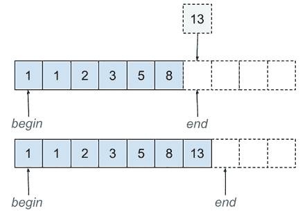
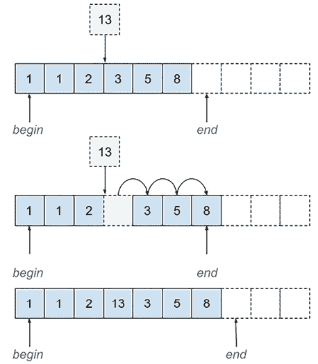
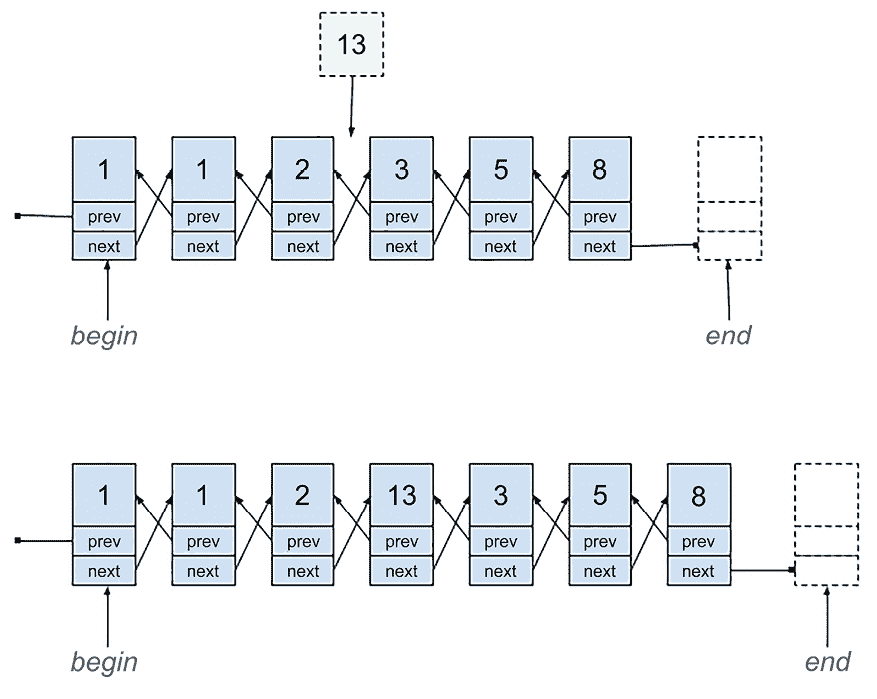
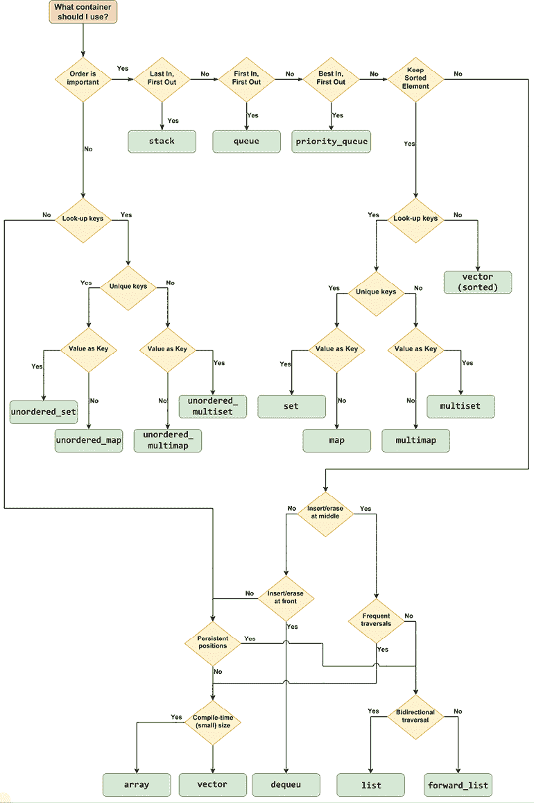

# 第五章：标准库容器、算法和迭代器

C++标准库随着 C++11/14/17/20 的演变而发生了很大的变化，现在有 C++23。然而，其核心仍然有三个主要支柱：容器、算法和迭代器。它们都是作为泛型类型和通用函数模板实现的。在本章中，我们将探讨它们如何一起使用以实现各种目标。

在本章中，我们将介绍以下食谱：

+   使用`vector`作为默认容器

+   使用`bitset`处理固定大小的位序列

+   使用`vector<bool>`处理可变大小的位序列

+   使用位操作实用工具

+   在范围内查找元素

+   对范围进行排序

+   初始化一个范围

+   在范围内使用集合操作：

+   使用迭代器向容器中插入新元素

+   编写自己的随机访问迭代器

+   使用非成员函数访问容器

+   选择正确的标准容器

我们将从这个章节开始，探讨 C++事实上的默认容器`std::vector`的功能。

# 使用向量作为默认容器

标准库提供了各种类型的容器，用于存储对象的集合；库包括序列容器（如`vector`、`array`和`list`）、有序和无序关联容器（如`set`和`map`），以及不存储数据但提供对序列容器进行适配的接口的容器适配器（如`stack`和`queue`）。所有这些都被实现为类模板，这意味着它们可以与任何类型一起使用（只要它满足容器的要求）。一般来说，你应该始终使用最适合特定问题的容器，这不仅提供了良好的性能，包括插入、删除、访问元素和内存使用方面的速度，而且使代码易于阅读和维护。然而，默认选择应该是`vector`。在这个食谱中，我们将看到为什么在许多情况下`vector`应该是容器的首选选择，以及`vector`最常见的操作是什么。

## 准备工作

对于这个食谱，你必须熟悉数组，包括静态和动态分配的。这里提供了一些示例：

```cpp
double d[3];           // a statically allocated array of 3 doubles
int* arr = new int[5]; // a dynamically allocated array of 5 ints 
```

`vector`类模板在`<vector>`头文件中的`std`命名空间中可用。

## 如何做到...

要初始化`std::vector`类模板，你可以使用以下任何一种方法，但你并不局限于仅使用这些：

+   从初始化列表初始化：

    ```cpp
    std::vector<int> v1 { 1, 2, 3, 4, 5 }; 
    ```

+   从数组初始化：

    ```cpp
    int arr[] = { 1, 2, 3, 4, 5 };
    std::vector<int> v21(arr, arr + 5); // v21 = { 1, 2, 3, 4, 5 }
    std::vector<int> v22(arr+1, arr+4); // v22 = { 2, 3, 4 } 
    ```

+   从另一个容器初始化：

    ```cpp
    std::list<int> l{ 1, 2, 3, 4, 5 };
    std::vector<int> v3(l.begin(), l.end()); //{ 1, 2, 3, 4, 5 } 
    ```

+   从计数和值初始化：

    ```cpp
    std::vector<int> v4(5, 1); // {1, 1, 1, 1, 1} 
    ```

要修改`std::vector`的内容，你可以使用以下任何一种方法（如上所述，你并不局限于仅使用这些）：

+   使用`push_back()`在向量的末尾添加一个元素：

    ```cpp
    std::vector<int> v1{ 1, 2, 3, 4, 5 };
    v1.push_back(6); // v1 = { 1, 2, 3, 4, 5, 6 } 
    ```

+   使用`pop_back()`从向量的末尾移除一个元素：

    ```cpp
    v1.pop_back();   // v1 = { 1, 2, 3, 4, 5 } 
    ```

+   使用`insert()`在向量的任何位置插入：

    ```cpp
    int arr[] = { 1, 2, 3, 4, 5 };
    std::vector<int> v21;
    v21.insert(v21.begin(), arr, arr + 5); // v21 = { 1, 2, 3, 4, 5 }
    std::vector<int> v22;
    v22.insert(v22.begin(), arr, arr + 3); // v22 = { 1, 2, 3 } 
    ```

+   通过在向量的末尾创建元素来添加一个元素，使用`emplace_back()`：

    ```cpp
    struct foo
    {
      int a;
      double b;
      std::string c;
      foo(int a, double b, std::string const & c) :
        a(a), b(b), c(c) {}
    };
    std::vector<foo> v3;
    v3.emplace_back(1, 1.0, "one"s);
    // v3 = { foo{1, 1.0, "one"} } 
    ```

+   通过在向量中的任何位置创建元素来插入一个元素，使用 `emplace()`：

    ```cpp
    v3.emplace(v3.begin(), 2, 2.0, "two"s);
    // v3 = { foo{2, 2.0, "two"}, foo{1, 1.0, "one"} } 
    ```

要修改向量的整个内容，你可以使用以下任何一种方法，尽管你并不局限于这些：

+   使用 `operator=` 从另一个向量赋值；这替换了容器的内容：

    ```cpp
    std::vector<int> v1{ 1, 2, 3, 4, 5 };
    std::vector<int> v2{ 10, 20, 30 };
    v2 = v1; // v2 = { 1, 2, 3, 4, 5 } 
    ```

+   使用 `assign()` 方法从由开始和结束迭代器定义的另一个序列赋值；这替换了容器的内容：

    ```cpp
    int arr[] = { 1, 2, 3, 4, 5 };
    std::vector<int> v31;
    v31.assign(arr, arr + 5);     // v31 = { 1, 2, 3, 4, 5 }
    std::vector<int> v32;
    v32.assign(arr + 1, arr + 4); // v32 = { 2, 3, 4 } 
    ```

+   使用 `swap()` 方法交换两个向量的内容：

    ```cpp
    std::vector<int> v4{ 1, 2, 3, 4, 5 };
    std::vector<int> v5{ 10, 20, 30 };
    v4.swap(v5); // v4 = { 10, 20, 30 }, v5 = { 1, 2, 3, 4, 5 } 
    ```

+   使用 `clear()` 方法删除所有元素：

    ```cpp
    std::vector<int> v6{ 1, 2, 3, 4, 5 };
    v6.clear(); // v6 = { } 
    ```

+   使用 `erase()` 方法删除一个或多个元素（这需要迭代器或定义从向量中要删除的元素范围的迭代器对）：

    ```cpp
    std::vector<int> v7{ 1, 2, 3, 4, 5 };
    v7.erase(v7.begin() + 2, v7.begin() + 4); // v7 = { 1, 2, 5 } 
    ```

+   使用 `std::remove_if()` 函数和 `erase()` 方法删除一个或多个满足谓词的元素：

    ```cpp
    std::vector<int> v8{ 1, 2, 3, 4, 5 };
    auto iterToNext = v8.erase(
       std::remove_if(v8.begin(), v8.end(), 
          [](const int n) {return n % 2 == 0; }),
       v8.end());                            // v8 = { 1, 3, 5 } 
    ```

+   使用在 C++20 中引入的 `std::erase_if()` 函数删除一个或多个满足谓词的元素，类似的 `std::erase()` 函数也存在：

    ```cpp
    std::vector<int> v9{ 1, 2, 3, 4, 5 };
    auto erasedCount = std::erase_if(v9, [](const int n) {
       return n % 2 == 0; });                // v9 = { 1, 3, 5 } 
    ```

要获取向量中第一个元素的地址，通常是为了将向量的内容传递给类似 C 的 API，可以使用以下任何一种方法：

+   使用 `data()` 方法，它返回指向第一个元素的指针，提供对存储向量元素的底层连续内存序列的直接访问；这仅从 C++11 开始可用：

    ```cpp
    void process(int const * const arr, size_t const size)
    { /* do something */ }
    std::vector<int> v{ 1, 2, 3, 4, 5 };
    process(v.data(), v.size()); 
    ```

+   获取第一个元素的地址：

    ```cpp
    process(&v[0], v.size()); 
    ```

+   获取 `front()` 方法引用的元素的地址（在空向量上调用此方法是不确定的行为）：

    ```cpp
    process(&v.front(), v.size()); 
    ```

+   获取从 `begin()` 返回的迭代器指向的元素的地址：

    ```cpp
    process(&*v.begin(), v.size()); 
    ```

要修改向量的内容，在 C++23 中，你也可以使用以下范围感知的成员函数：

要用给定范围的元素副本替换向量的元素，使用 `assign_range()`：

```cpp
std::list<int>   l{ 1, 2, 3, 4, 5 };
std::vector<int> v;
v.assign_range(l); // v = {1, 2, 3, 4, 5} 
```

要将范围元素的副本追加到向量的末尾（在末尾迭代器之前），使用 `append_range()`：

```cpp
std::list<int>   l{ 3, 4, 5 };
std::vector<int> v{ 1, 2 };
v.append_range(l);  // v = {1, 2, 3, 4, 5} 
```

要在向量的给定迭代器之前插入范围元素的副本，使用 `insert_range()`：

```cpp
std::list<int>   l{ 2, 3, 4 };
std::vector<int> v{ 1, 5 };
v.insert_range(v.begin() + 1, l); // v = {1, 2, 3, 4, 5} 
```

## 它是如何工作的...

`std::vector` 类被设计成与数组最相似且可互操作的 C++ 容器。向量是一个可变大小的元素序列，保证在内存中连续存储，这使得向量的内容可以轻松传递给接受数组元素指针和通常大小参数的类似 C 的函数：

使用向量而不是数组的许多好处包括：

+   开发者不需要直接进行内存管理，因为容器内部完成这项工作，分配内存，重新分配它，并释放它。

    注意，向量是用来存储对象实例的。如果你需要存储指针，不要存储原始指针，而是智能指针。否则，你需要处理指向对象的生存期管理。

+   向量大小修改的可能性。

+   两个向量的简单赋值或连接。

+   直接比较两个向量。

`vector` 类是一个非常高效的容器，其所有实现都提供了许多优化，这些优化大多数开发者都无法用数组完成。对元素进行随机访问以及在向量末尾插入和删除操作是一个常数 *O(1)* 操作（前提是无需重新分配），而其他任何位置的插入和删除操作是一个线性 *O(n)* 操作。

与其他标准容器相比，向量具有各种优势：

+   它与数组和 C 类型的 API 兼容。如果一个函数接受一个数组作为参数，其他容器的内容（除了 `std::array`）需要在传递给函数作为参数之前被复制到一个 `vector` 中。

+   它对所有容器的元素访问速度最快（但与 `std::array` 相同）。

+   它没有为存储元素而设置的每个元素的内存开销。这是因为元素存储在连续的空间中，就像数组一样。因此，`vector` 的内存占用很小，与其他容器不同，例如 `list`，它需要指向其他元素的额外指针，或者关联容器，它需要哈希值。

`std::vector` 在语义上与数组非常相似，但具有可变大小。向量的大小可以增加和减少。有两个属性定义了向量的大小：

+   *容量* 是向量在不进行额外内存分配的情况下可以容纳的元素数量；这由 `capacity()` 方法表示。

+   *大小* 是向量中实际元素的数量；这由 `size()` 方法表示。

大小始终小于或等于容量。当大小等于容量且需要添加新元素时，必须修改容量，以便向量有更多元素的空间。在这种情况下，向量分配一个新的内存块，并将之前的内容移动到新位置，然后再释放之前分配的内存。尽管这听起来很耗时——确实如此——实现通过每次改变时将其加倍来指数级地增加容量。因此，平均而言，每个元素只需要移动一次（这是因为向量中的所有元素都在增加容量的过程中被移动，但之后可以添加相同数量的元素而无需进行更多移动，前提是在向量末尾进行插入操作）。

如果您事先知道将要插入向量中的元素数量，可以先调用 `reserve()` 方法将容量增加到至少指定的数量（如果指定的大小小于当前容量，则此方法不执行任何操作），然后才插入元素。

另一方面，如果您需要释放额外的预留内存，可以使用 `shrink_to_fit()` 方法请求这样做，但这是否释放任何内存是实现决策，而不是一个强制性的方法。自 C++11 以来，这种非绑定方法的替代方法是使用一个临时的空向量进行交换：

```cpp
std::vector<int> v{ 1, 2, 3, 4, 5 };
std::vector<int>().swap(v); // v.size = 0, v.capacity = 0 
```

调用 `clear()` 方法只会从向量中移除所有元素，但不会释放任何内存。

应该注意的是，`vector` 类实现了针对其他类型容器的特定操作：

+   *栈*：使用 `push_back()` 和 `emplace_back()` 在末尾添加元素，使用 `pop_back()` 从末尾移除元素。请注意，`pop_back()` 不会返回已移除的最后一个元素。如果你需要显式访问该元素，例如在移除元素之前使用 `back()` 方法。

+   *列表*：使用 `insert()` 和 `emplace()` 在序列中间添加元素，使用 `erase()` 从序列的任何位置移除元素。

对于 C++ 容器，一个很好的经验法则是除非你有充分的理由使用其他容器，否则默认使用 `std::vector`。

## 参见

+   *使用位集处理固定大小的位序列*，了解处理固定大小位序列的标准容器

+   *使用 `vector<bool>` 处理可变大小的位序列*，了解 `std::vector` 对 `bool` 类型的特化，旨在处理可变大小的位序列

# 使用位集处理固定大小的位序列

开发者使用位标志进行操作并不罕见。这可能是因为他们与操作系统 API（通常用 C 语言编写）一起工作，这些 API 以位标志的形式接受各种类型的参数（如选项或样式），或者因为他们与执行类似操作的库一起工作，或者仅仅是因为某些类型的问题自然可以用位标志来解决。

我们可以考虑使用位和位操作的其他替代方案，例如定义每个选项/标志都有一个元素的数组，或者定义一个具有成员和函数的结构来模拟位标志，但这些通常更复杂；并且在需要将表示位标志的数值传递给函数的情况下，你仍然需要将数组或结构转换为位序列。因此，C++ 标准提供了一个名为 `std::bitset` 的容器，用于固定大小的位序列。

## 准备工作

对于这个菜谱，你必须熟悉位操作（AND、OR、XOR、NOT 和移位 - 将数字的二进制表示中的每个数字向左或向右移动）。如果你需要了解更多关于这些的信息，[`en.wikipedia.org/wiki/Bitwise_operation`](https://en.wikipedia.org/wiki/Bitwise_operation) 是一个很好的起点。

`bitset` 类在 `<bitset>` 头文件中的 `std` 命名空间中可用。位集表示一个在编译时定义大小的固定大小的位序列。为了方便起见，在这个菜谱中，大多数示例都将使用 8 位的位集。

## 如何做到这一点...

要构造一个 `std::bitset` 对象，请使用以下可用的构造函数之一：

+   所有位都设置为 `0` 的空位集：

    ```cpp
    std::bitset<8> b1;            // [0,0,0,0,0,0,0,0] 
    ```

+   从数值值创建位集：

    ```cpp
    std::bitset<8> b2{ 10 };      // [0,0,0,0,1,0,1,0] 
    ```

+   从由 `'0'` 和 `'1'` 组成的字符串创建位集：

    ```cpp
    std::bitset<8> b3{ "1010"s }; // [0,0,0,0,1,0,1,0] 
    ```

+   从包含任意两个字符（代表 `'0'` 和 `'1'`）的字符串中创建位集；在这种情况下，我们必须指定哪个字符代表 `0`（第四个参数，`'o'`）以及哪个字符代表 `1`（第五个参数，`'x'`）：

    ```cpp
    std::bitset<8> b4
      { "ooooxoxo"s, 0, std::string::npos, 'o', 'x' };
      // [0,0,0,0,1,0,1,0] 
    ```

要测试集合中的单个位或整个集合的特定值，请使用任何可用的方法：

+   使用 `count()` 获取设置为 `1` 的位的数量：

    ```cpp
    std::bitset<8> bs{ 10 };
    std::cout << "has " << bs.count() << " 1s" << '\n'; 
    ```

+   使用 `any()` 检查是否至少有一个位设置为 `1`：

    ```cpp
    if (bs.any()) std::cout << "has some 1s" << '\n'; 
    ```

+   使用 `all()` 检查是否所有位都设置为 `1`：

    ```cpp
    if (bs.all()) std::cout << "has only 1s" << '\n'; 
    ```

+   使用 `none()` 检查是否所有位都设置为 `0`：

    ```cpp
    if (bs.none()) std::cout << "has no 1s" << '\n'; 
    ```

+   使用 `test()` 函数来检查单个位的值（该位的位位置是函数的唯一参数）：

    ```cpp
    if (!bs.test(0)) std::cout << "even" << '\n'; 
    ```

+   使用 `operator[]` 来访问和测试单个位：

    ```cpp
    if(!bs[0]) std::cout << "even" << '\n'; 
    ```

要修改位集的内容，可以使用以下任何一种方法：

+   成员运算符 `|=`, `&=`, `^=`, 和 `~` 分别执行二进制操作 OR、AND、XOR 和 NOT。或者，可以使用非成员运算符 `|`, `&`, 和 `^`：

    ```cpp
    std::bitset<8> b1{ 42 }; // [0,0,1,0,1,0,1,0]
    std::bitset<8> b2{ 11 }; // [0,0,0,0,1,0,1,1]
    auto b3 = b1 | b2;       // [0,0,1,0,1,0,1,1]
    auto b4 = b1 & b2;       // [0,0,0,0,1,0,1,0]
    auto b5 = b1 ^ b2;       // [0,0,1,0,0,0,0,1]
    auto b6 = ~b1;           // [1,1,0,1,0,1,0,1] 
    ```

+   成员运算符 `<<=`, `<<`, `>>=`, 和 `>>` 用于执行位移操作：

    ```cpp
    auto b7 = b1 << 2;       // [1,0,1,0,1,0,0,0]
    auto b8 = b1 >> 2;       // [0,0,0,0,1,0,1,0] 
    ```

+   使用 `flip()` 切换整个集合或单个位从 `0` 到 `1` 或从 `1` 到 `0`：

    ```cpp
    b1.flip();               // [1,1,0,1,0,1,0,1]
    b1.flip(0);              // [1,1,0,1,0,1,0,0] 
    ```

+   使用 `set()` 将整个集合或单个位更改为 `true` 或指定的值：

    ```cpp
    b1.set(0, true);         // [1,1,0,1,0,1,0,1]
    b1.set(0, false);        // [1,1,0,1,0,1,0,0] 
    ```

+   使用 `reset()` 将整个集合或单个位更改为 `false`：

    ```cpp
    b1.reset(2);             // [1,1,0,1,0,0,0,0] 
    ```

要将位集转换为数值或字符串值，请使用以下方法：

+   使用 `to_ulong()` 和 `to_ullong()` 将其转换为 `unsigned long` 或 `unsigned long long`。如果值无法表示在输出类型中，这些操作会抛出 `std::overflow_error` 异常。请参考以下示例：

    ```cpp
    std::bitset<8> bs{ 42 };
    auto n1 = bs.to_ulong();  // n1 = 42UL
    auto n2 = bs.to_ullong(); // n2 = 42ULL 
    ```

+   使用 `to_string()` 将其转换为 `std::basic_string`。默认情况下，结果是包含 `'0'` 和 `'1'` 的字符串，但您可以指定这两个值的不同字符：

    ```cpp
    auto s1 = bs.to_string();         // s1 = "00101010"
    auto s2 = bs.to_string('o', 'x'); // s2 = "ooxoxoxo" 
    ```

## 它是如何工作的...

如果你曾经使用过 C 或类似 C 的 API，那么你很可能编写过或至少见过操作位以定义样式、选项或其他类型值的代码。这通常涉及以下操作：

+   定义位标志；这些可以是枚举、类中的静态常量，或者使用 C 风格的 `#define` 引入的宏。通常，有一个表示无值（样式、选项等）的标志。由于这些是位标志，它们的值是 2 的幂。

+   向集合中添加或删除标志（即数值）。添加位标志使用位或运算符（`value |= FLAG`），删除位标志使用位与运算符，并使用取反的标志（`value &= ~FLAG`）。

+   测试是否将标志添加到集合中（`value & FLAG == FLAG`）。

+   使用标志作为参数调用函数。

以下是一个简单示例，展示了定义具有左、右、上或下边框的控件边框样式的标志，包括这些边框的组合，以及没有边框的情况：

```cpp
#define BORDER_NONE   0x00
#define BORDER_LEFT   0x01
#define BORDER_TOP    0x02
#define BORDER_RIGHT  0x04
#define BORDER_BOTTOM 0x08
void apply_style(unsigned int const style)
{
  if (style & BORDER_BOTTOM) { /* do something */ }
}
// initialize with no flags
unsigned int style = BORDER_NONE;
// set a flag
style = BORDER_BOTTOM;
// add more flags
style |= BORDER_LEFT | BORDER_RIGHT | BORDER_TOP;
// remove some flags
style &= ~BORDER_LEFT;
style &= ~BORDER_RIGHT;
// test if a flag is set
if ((style & BORDER_BOTTOM) == BORDER_BOTTOM) {}
// pass the flags as argument to a function
apply_style(style); 
```

标准的`std::bitset`类旨在作为 C++中类似 C 风格的位集工作方式的替代。它使我们能够编写更健壮和更安全的代码，因为它通过成员函数抽象了位操作，尽管我们仍然需要识别集合中每个位所代表的含义：

+   使用`set()`和`reset()`方法添加和移除标志，这些方法将位的位置值设置为`1`或`0`（或`true`和`false`）；或者，我们可以使用索引运算符达到相同的目的。

+   使用`test()`方法检查位是否被设置。

+   从整数或字符串的转换是通过构造函数完成的，而将值转换为整数或字符串则是通过成员函数完成的，这样就可以在期望整数的地方使用位集的值（例如函数的参数）。

注意，从字符序列（无论是`std::basic_string`、`const char*`（或任何其他字符类型）还是 C++26 中的`std::basic_string_view`）构建`bitset`的构造函数可能会抛出异常：如果任何字符不是指定的零或一，则抛出`std::invalid_argument`异常；如果序列的起始偏移量超出了序列的末尾，则抛出`std::out_of_range`异常。

除了这些操作之外，`bitset`类还有执行位操作、移位、测试和其他在上一节中展示的方法的附加方法。

概念上，`std::bitset`是数值的表示，它允许你访问和修改单个位。然而，内部，一个`bitset`有一个整数值的数组，它在这个数组上执行位操作。`bitset`的大小不限于数值类型的大小；它可以是一切，除了它是一个编译时常量。

上一个章节中控制边框样式的示例可以用以下方式使用`std::bitset`编写：

```cpp
struct border_flags
{
  static const int left = 0;
  static const int top = 1;
  static const int right = 2;
  static const int bottom = 3;
};
// initialize with no flags
std::bitset<4> style;
// set a flag
style.set(border_flags::bottom);
// set more flags
style
  .set(border_flags::left)
  .set(border_flags::top)
  .set(border_flags::right);
// remove some flags
style[border_flags::left] = 0;
style.reset(border_flags::right);
// test if a flag is set
if (style.test(border_flags::bottom)) {}
// pass the flags as argument to a function
apply_style(style.to_ulong()); 
```

请记住，这只是一个可能的实现。例如，`border_flags`类本可以是一个枚举类型。然而，使用范围枚举将需要显式转换为`int`。不同的解决方案可能有优点和缺点。你可以将其作为练习来编写一个替代方案。

## 还有更多...

可以从一个整数创建一个 bitset，并可以使用`to_ulong()`或`to_ullong()`方法将其值转换为整数。然而，如果`bitset`的大小大于这些数值类型的大小，并且请求的数值类型大小之外的任何位被设置为`1`，则这些方法会抛出`std::overflow_error`异常。这是因为该值无法在`unsigned long`或`unsigned long long`上表示。为了提取所有位，我们需要执行以下操作：

+   清除`unsigned long`或`unsigned long long`大小之外的位。

+   将值转换为`unsigned long`或`unsigned long long`。

+   使用`unsigned long`或`unsigned long long`中的位数量来移位`bitset`。

+   继续这样做，直到所有位都被检索。

这些是这样实现的：

```cpp
template <size_t N>
std::vector<unsigned long> bitset_to_vectorulong(std::bitset<N> bs)
{
  auto result = std::vector<unsigned long> {};
  auto const size = 8 * sizeof(unsigned long);
  auto const mask = std::bitset<N>{ static_cast<unsigned long>(-1)};
  auto totalbits = 0;
  while (totalbits < N)
  {
    auto value = (bs & mask).to_ulong();
    result.push_back(value);
    bs >>= size;
    totalbits += size;
  }
  return result;
} 
```

为了举例说明，让我们考虑以下`bitset`：

```cpp
std::bitset<128> bs =
    (std::bitset<128>(0xFEDC) << 96) |
    (std::bitset<128>(0xBA98) << 64) |
    (std::bitset<128>(0x7654) << 32) |
    std::bitset<128>(0x3210);
std::cout << bs << '\n'; 
```

如果我们打印其内容，我们得到以下结果：

```cpp
00000000000000001111111011011100000000000000000010111010100110000000000000000000011101100101010000000000000000000011001000010000 
```

然而，当我们使用`biset_to_vectorulong()`将此集合转换为`unsigned long`值序列并打印其十六进制表示时，我们得到以下结果：

```cpp
auto result = bitset_to_vectorulong(bs);
for (auto const v : result)
  std::cout << std::hex << v << '\n'; 
```

```cpp
3210
7654
ba98
fedc 
```

对于在编译时无法知道`bitset`大小的案例，替代方案是`std::vector<bool>`，我们将在下一个食谱中介绍。

## 参见

+   *使用`vector<bool>`处理可变大小的位序列*，以了解`std::vector`对`bool`类型的特化，该类型用于处理可变大小的位序列

+   *使用位操作实用工具*，以探索来自数值库的 C++20 位操作函数集

# 使用`vector<bool>`处理可变大小的位序列

在之前的食谱中，我们探讨了使用`std::bitset`处理固定大小的位序列。有时，`std::bitset`并不是一个好的选择，因为您在编译时不知道位的数量，仅仅定义一个足够大的位集合并不是一个好主意。这是因为您可能会遇到实际上并不足够大的情况。这个标准的替代方案是使用`std::vector<bool>`容器，这是一个针对`std::vector`的空间和速度优化的特化，因为实现实际上并不存储布尔值，而是为每个元素存储单独的位。

然而，由于这个原因，`std::vector<bool>`不符合标准容器或顺序容器的需求，`std::vector<bool>::iterator`也不符合前向迭代器的需求。因此，这个特化不能用于期望使用向量的泛型代码中。另一方面，作为一个向量，它具有与`std::bitset`不同的接口，不能被视为数字的二进制表示。没有直接的方法可以从数字或字符串构造`std::vector<bool>`，也不能将其转换为数字或字符串。

## 准备工作...

本食谱假设您熟悉`std::vector`和`std::bitset`。如果您没有阅读之前的食谱，即*使用 vector 作为默认容器*和*使用 bitset 处理固定大小的位序列*，您应该在继续之前阅读它们。

`vector<bool>`类在`<vector>`头文件中的`std`命名空间中可用。

## 如何操作...

要操作`std::vector<bool>`，使用与操作`std::vector<T>`相同的方法，如下面的示例所示：

+   创建一个空向量：

    ```cpp
    std::vector<bool> bv; // [] 
    ```

+   向向量中添加位：

    ```cpp
    bv.push_back(true);  // [1]
    bv.push_back(true);  // [1, 1]
    bv.push_back(false); // [1, 1, 0]
    bv.push_back(false); // [1, 1, 0, 0]
    bv.push_back(true);  // [1, 1, 0, 0, 1] 
    ```

+   设置单个位的值：

    ```cpp
    bv[3] = true;        // [1, 1, 0, 1, 1] 
    ```

+   使用泛型算法：

    ```cpp
    auto count_of_ones = std::count(bv.cbegin(), bv.cend(), true); 
    ```

+   从向量中移除位：

    ```cpp
    bv.erase(bv.begin() + 2); // [1, 1, 1, 1] 
    ```

## 它是如何工作的...

`std::vector<bool>`不是一个标准向量，因为它设计用来通过为每个元素存储一个位而不是布尔值来提供空间优化。因此，其元素不是连续存储的，不能替换为布尔值数组。由于这个原因：

+   索引操作符不能返回对特定元素的引用，因为元素不是单独存储的：

    ```cpp
    std::vector<bool> bv;
    bv.resize(10);
    auto& bit = bv[0];      // error 
    ```

+   由于前面提到的原因，解引用迭代器不能产生对`bool`的引用：

    ```cpp
    auto& bit = *bv.begin(); // error 
    ```

+   没有保证在同一个时间点，不同线程可以独立地操作单个位。

+   向量不能与需要前向迭代器的算法一起使用，例如`std::search()`。

+   如果这样的代码需要本列表中提到的任何操作，则不能在期望`std::vector<T>`的泛型代码中使用向量。

`std::vector<bool>`的替代方案是`std::deque<bool>`，这是一个满足所有容器和迭代器要求的标准容器（双端队列），并且可以与所有标准算法一起使用。然而，这不会像`std::vector<bool>`那样提供空间优化。

## 更多内容...

`std::vector<bool>`的接口与`std::bitset`非常不同。如果你想以类似的方式编写代码，你可以在`std::vector<bool>`上创建一个包装器，使其看起来像`std::bitset`，在可能的情况下。

以下实现提供了类似于`std::bitset`中可用的成员：

```cpp
class bitvector
{
  std::vector<bool> bv;
public:
  bitvector(std::vector<bool> const & bv) : bv(bv) {}
  bool operator[](size_t const i) { return bv[i]; }
  inline bool any() const {
    for (auto b : bv) if (b) return true;
    return false;
  }
  inline bool all() const {
    for (auto b : bv) if (!b) return false;
    return true;
  }
  inline bool none() const { return !any(); }
  inline size_t count() const {
    return std::count(bv.cbegin(), bv.cend(), true);
  }
  inline size_t size() const { return bv.size(); }
  inline bitvector & add(bool const value) {
    bv.push_back(value);
    return *this;
  }
  inline bitvector & remove(size_t const index) {
    if (index >= bv.size())
      throw std::out_of_range("Index out of range");
    bv.erase(bv.begin() + index);
    return *this;
  }
  inline bitvector & set(bool const value = true) {
    for (size_t i = 0; i < bv.size(); ++i)
      bv[i] = value;
    return *this;
  }
  inline bitvector& set(size_t const index, bool const value = true) {
    if (index >= bv.size())
      throw std::out_of_range("Index out of range");
    bv[index] = value;
    return *this;
  }
  inline bitvector & reset() {
    for (size_t i = 0; i < bv.size(); ++i) bv[i] = false;
    return *this;
  }
  inline bitvector & reset(size_t const index) {
    if (index >= bv.size())
      throw std::out_of_range("Index out of range");
    bv[index] = false;
    return *this;
  }
  inline bitvector & flip() {
    bv.flip();
    return *this;
  }
  std::vector<bool>& data() { return bv; }
}; 
```

这只是一个基本的实现，如果你想要使用这样的包装器，你应该添加额外的功能，例如位逻辑操作、移位，也许是从和到流的读写，等等。然而，使用前面的代码，我们可以写出以下示例：

```cpp
bitvector bv;
bv.add(true).add(true).add(false); // [1, 1, 0]
bv.add(false);                     // [1, 1, 0, 0]
bv.add(true);                      // [1, 1, 0, 0, 1]
if (bv.any()) std::cout << "has some 1s" << '\n';
if (bv.all()) std::cout << "has only 1s" << '\n';
if (bv.none()) std::cout << "has no 1s" << '\n';
std::cout << "has " << bv.count() << " 1s" << '\n';
bv.set(2, true);                   // [1, 1, 1, 0, 1]
bv.set();                          // [1, 1, 1, 1, 1]
bv.reset(0);                       // [0, 1, 1, 1, 1]
bv.reset();                        // [0, 0, 0, 0, 0]
bv.flip();                         // [1, 1, 1, 1, 1] 
```

这些示例与使用`std::bitset`的示例非常相似。这个`bitvector`类具有与`std::bitset`兼容的 API，但适用于处理可变大小的位序列。

## 参见

+   *使用向量作为默认容器*，学习如何使用`std::vector`标准容器

+   *使用 bitset 处理固定大小的位序列*，了解处理固定大小位序列的标准容器

+   *使用位操作工具*，探索来自数值库的 C++20 位操作工具函数集

# 使用位操作工具

在前面的菜谱中，我们看到了如何使用`std::bitset`和`std::vector<bool>`来处理固定和可变长度的位序列。然而，在某些情况下，我们需要操作或处理无符号整数值的单独或多个位。这包括计数或旋转位等操作。C++20 标准在数值库中提供了一套位操作工具函数。在本菜谱中，我们将学习它们是什么以及如何使用这些工具。

## 准备工作

本配方中讨论的函数模板都在新的 C++20 头文件 `<bit>` 中的 `std` 命名空间中可用。

## 如何做到这一点…

使用以下函数模板来操作无符号整型类型的位：

+   如果需要执行循环移位，请使用 `std::rotl<T>()` 进行左旋转和 `std::rotr<T>()` 进行右旋转：

    ```cpp
    unsigned char n = 0b00111100;
    auto vl1 = std::rotl(n, 0); // 0b00111100
    auto vl2 = std::rotl(n, 1); // 0b01111000
    auto vl3 = std::rotl(n, 3); // 0b11100001
    auto vl4 = std::rotl(n, 9); // 0b01111000
    auto vl5 = std::rotl(n, -2);// 0b00001111
    auto vr1 = std::rotr(n, 0);  // 0b00111100
    auto vr2 = std::rotr(n, 1);  // 0b00011110
    auto vr3 = std::rotr(n, 3);  // 0b10000111
    auto vr4 = std::rotr(n, 9);  // 0b00011110
    auto vr5 = std::rotr(n, -2); // 0b11110000 
    ```

+   如果需要计算连续 `0` 位的数量（即，直到找到一个 `1`），请使用 `std::countl_zero<T>()` 从左到右计算（即，从最高有效位开始）和 `std::countr_zero<T>()` 从右到左计算（即，从最低有效位开始）：

    ```cpp
    std::cout << std::countl_zero(0b00000000u) << '\n'; // 8
    std::cout << std::countl_zero(0b11111111u) << '\n'; // 0
    std::cout << std::countl_zero(0b00111010u) << '\n'; // 2
    std::cout << std::countr_zero(0b00000000u) << '\n'; // 8
    std::cout << std::countr_zero(0b11111111u) << '\n'; // 0
    std::cout << std::countr_zero(0b00111010u) << '\n'; // 1 
    ```

+   如果需要计算连续 `1` 位的数量（即，直到找到一个 `0`），请使用 `std::countl_one<T>()` 从左到右计算（即，从最高有效位开始）和 `std::countr_one<T>()` 从右到左计算（即，从最低有效位开始）：

    ```cpp
    std::cout << std::countl_one(0b00000000u) << '\n'; // 0
    std::cout << std::countl_one(0b11111111u) << '\n'; // 8
    std::cout << std::countl_one(0b11000101u) << '\n'; // 2
    std::cout << std::countr_one(0b00000000u) << '\n'; // 0
    std::cout << std::countr_one(0b11111111u) << '\n'; // 8
    std::cout << std::countr_one(0b11000101u) << '\n'; // 1 
    ```

+   如果需要计算 `1` 位的数量，请使用 `std::popcount<T>()`。`0` 位的数量是表示该值所使用的数字位数（这可以通过 `std::numeric_limits<T>::digits` 来确定），减去 `1` 位的数量：

    ```cpp
    std::cout << std::popcount(0b00000000u) << '\n'; // 0
    std::cout << std::popcount(0b11111111u) << '\n'; // 8
    std::cout << std::popcount(0b10000001u) << '\n'; // 2 
    ```

+   如果需要检查一个数字是否是 2 的幂，请使用 `std::has_single_bit<T>()`：

    ```cpp
    std::cout << std::boolalpha << std::has_single_bit(0u) << '\n'; // false
    std::cout << std::boolalpha << std::has_single_bit(1u) << '\n'; // true
    std::cout << std::boolalpha << std::has_single_bit(2u) << '\n'; // true
    std::cout << std::boolalpha << std::has_single_bit(3u) << '\n'; // false
    std::cout << std::boolalpha << std::has_single_bit(4u) << '\n'; // true 
    ```

+   如果需要找到大于或等于给定数字的最小 2 的幂，请使用 `std::bit_ceil<T>()`。另一方面，如果需要找到小于或等于给定数字的最大 2 的幂，请使用 `std::bit_floor<T>()`：

    ```cpp
    std::cout << std::bit_ceil(0u)  << '\n'; // 0
    std::cout << std::bit_ceil(3u)  << '\n'; // 4
    std::cout << std::bit_ceil(4u)  << '\n'; // 4
    std::cout << std::bit_ceil(31u) << '\n'; // 32
    std::cout << std::bit_ceil(42u) << '\n'; // 64
    std::cout << std::bit_floor(0u)  << '\n'; // 0
    std::cout << std::bit_floor(3u)  << '\n'; // 2
    std::cout << std::bit_floor(4u)  << '\n'; // 4
    std::cout << std::bit_floor(31u) << '\n'; // 16
    std::cout << std::bit_floor(42u) << '\n'; // 32 
    ```

+   如果需要确定表示一个数字所需的最小位数，请使用 `std::bit_width<T>()`：

    ```cpp
    std::cout << std::bit_width(0u)    << '\n'; // 0
    std::cout << std::bit_width(2u)    << '\n'; // 2
    std::cout << std::bit_width(15u)   << '\n'; // 4
    std::cout << std::bit_width(16u)   << '\n'; // 5
    std::cout << std::bit_width(1000u) << '\n'; // 10 
    ```

+   如果需要将类型 `F` 的对象表示重新解释为类型 `T` 的表示，请使用 `std::bit_cast<T, F>()`：

    ```cpp
    const double   pi   = 3.1415927;
    const uint64_t bits = std::bit_cast<uint64_t>(pi);
    const double   pi2  = std::bit_cast<double>(bits);
    std::cout
       << std::fixed << pi   << '\n' // 3.1415923
       << std::hex   << bits << '\n' // 400921fb5a7ed197
       << std::fixed << pi2  << '\n';  // 3.1415923 
    ```

## 它是如何工作的…

上一节中提到的所有函数模板，除了 `std::bit_cast<T, F>()`，仅适用于无符号整型类型。这包括类型 `unsigned char`、`unsigned short`、`unsigned int`、`unsigned long` 和 `unsigned long long`，以及固定宽度的无符号整型类型（例如 `uint8_t`、`uint64_t`、`uint_least8_t`、`uintmax_t` 等）。这些函数很简单，不需要详细说明。

与其他函数不同的函数是 `std::bit_cast<T, F>()`。在这里，`F` 是重新解释的类型，而 `T` 是我们解释到的类型。此函数模板不需要 `T` 和 `F` 是无符号整型类型，但它们都必须是简单可复制的。此外，`sizeof(T)` 必须与 `sizeof(F)` 相同。

该函数的规范没有提及结果中填充位的值。另一方面，如果结果值不对应于类型 `T` 的有效值，则行为是未定义的。

`std::bit_cast<T, F>()`可以是`constexpr`，如果`T`、`F`以及它们所有子对象类型的类型不是联合类型、指针类型、成员指针类型或带 volatile 资格的类型，并且没有非静态数据成员为引用类型。

## 参见

+   *使用位集处理固定大小的位序列*，了解处理固定大小位序列的标准容器

+   *使用`vector<bool>`处理可变大小的位序列*，了解`std::vector`对`bool`类型的特化，旨在处理可变大小的位序列

# 在一个范围内查找元素

在任何应用程序中，我们最常进行的操作之一是搜索数据。因此，标准库提供许多通用算法来搜索标准容器，或者任何可以表示范围并由开始和结束迭代器定义的东西，并不足为奇。在本食谱中，我们将了解这些标准算法是什么以及如何使用它们。

## 准备工作

在本食谱的所有示例中，我们将使用`std::vector`，但所有算法都与由开始和结束迭代器定义的范围一起工作，这些迭代器是输入迭代器或前向迭代器，具体取决于算法（有关各种迭代器的更多信息，请参阅本章后面的*编写自己的随机访问迭代器*食谱）。所有这些算法都在`<algorithm>`头文件中的`std`命名空间中可用。

## 如何做到这一点...

以下是可以用于在范围内查找元素的算法列表：

+   使用`std::find()`来查找一个范围内存在的值；此算法返回一个指向第一个等于该值的元素的迭代器：

    ```cpp
    std::vector<int> v{ 13, 1, 5, 3, 2, 8, 1 };
    auto it = std::find(v.cbegin(), v.cend(), 3);
    if (it != v.cend()) std::cout << *it << '\n'; // prints 3 
    ```

+   使用`std::find_if()`来查找一个范围内符合一元谓词准则的值；此算法返回一个指向第一个谓词返回`true`的元素的迭代器：

    ```cpp
    std::vector<int> v{ 13, 1, 5, 3, 2, 8, 1 };
    auto it = std::find_if(v.cbegin(), v.cend(),
                           [](int const n) {return n > 10; });
    if (it != v.cend()) std::cout << *it << '\n'; // prints 13 
    ```

+   使用`std::find_if_not()`来查找一个范围内不符合一元谓词准则的值；此算法返回一个指向第一个谓词返回`false`的元素的迭代器：

    ```cpp
    std::vector<int> v{ 13, 1, 5, 3, 2, 8, 1 };
    auto it = std::find_if_not(v.cbegin(), v.cend(),
                        [](int const n) {return n % 2 == 1; });
    if (it != v.cend()) std::cout << *it << '\n'; // prints 2 
    ```

+   使用`std::find_first_of()`在另一个范围内搜索来自一个范围的任何值的出现；此算法返回一个指向找到的第一个元素的迭代器：

    ```cpp
    std::vector<int> v{ 13, 1, 5, 3, 2, 8, 1 };
    std::vector<int> p{ 5, 7, 11 };
    auto it = std::find_first_of(v.cbegin(), v.cend(),
                                 p.cbegin(), p.cend());
    if (it != v.cend())
      std::cout << "found " << *it
                << " at index " << std::distance(v.cbegin(), it)
                << '\n'; 
    // found 5 at index 2 
    ```

+   使用`std::find_end()`来查找一个范围内元素子范围的最后出现；此算法返回一个指向最后一个子范围中第一个元素的迭代器：

    ```cpp
    std::vector<int> v1{ 1, 1, 0, 0, 1, 0, 1, 0, 1, 0, 1, 1 };
    std::vector<int> v2{ 1, 0, 1 };
    auto it = std::find_end(v1.cbegin(), v1.cend(),
                            v2.cbegin(), v2.cend());
    if (it != v1.cend())
      std::cout << "found at index "
                << std::distance(v1.cbegin(), it) << '\n';
    // found at index 8 
    ```

+   要在一个范围内找到最小和最大元素，使用`std::min_element()`来获取最小值，`std::max_element()`来获取最大值，以及`std::minmax_element()`来同时获取最小和最大值：

    ```cpp
    std::vector<int> v{ 1, 5, -2, 9, 6 };
    auto minit = std::min_element(v.begin(), v.end());
    std::cout << "min=" << *minit << '\n';           // min=-2
    auto maxit = std::max_element(v.begin(), v.end());
    std::cout << "max=" << *maxit << '\n';           // max=9
    auto minmaxit = std::minmax_element(v.begin(), v.end());
    std::cout << "min=" << *minmaxit.first << '\n';  // min=-2
    std::cout << "max=" << *minmaxit.second << '\n'; // max=9 
    ```

+   使用`std::search()`来搜索一个范围内子范围的第一出现；此算法返回一个指向子范围在范围内第一个元素的迭代器：

    ```cpp
    auto text = "The quick brown fox jumps over the lazy dog"s;
    auto word = "over"s;
    auto it = std::search(text.cbegin(), text.cend(),
                          word.cbegin(), word.cend());
    if (it != text.cend())
      std::cout << "found " << word
                << " at index "
                << std::distance(text.cbegin(), it) << '\n'; 
    ```

+   使用 `std::search()` 与一个 *searcher*，这是一个实现搜索算法并满足某些预定义标准的类。此 `std::search()` 重载是在 C++17 中引入的，并且可用的标准搜索器实现了 *Boyer-Moore* 和 *Boyer-Moore-Horspool* 字符串搜索算法：

    ```cpp
    auto text = "The quick brown fox jumps over the lazy dog"s;
    auto word = "over"s;
    auto it = std::search(
      text.cbegin(), text.cend(),
      std::make_boyer_moore_searcher(word.cbegin(), word.cend()));
    if (it != text.cend())
      std::cout << "found " << word
                << " at index "
                << std::distance(text.cbegin(), it) << '\n'; 
    ```

+   使用 `std::search_n()` 在一个范围内搜索 *N* 个连续出现的值；此算法返回找到的序列在范围内的第一个元素的迭代器：

    ```cpp
    std::vector<int> v{ 1, 1, 0, 0, 1, 0, 1, 0, 1, 0, 1, 1 };
    auto it = std::search_n(v.cbegin(), v.cend(), 2, 0);
    if (it != v.cend())
      std::cout << "found at index "
                << std::distance(v.cbegin(), it) << '\n'; 
    ```

+   使用 `std::adjacent_find()` 来查找一个范围内相等或满足二元谓词的两个相邻元素；此算法返回找到的第一个元素的迭代器：

    ```cpp
    std::vector<int> v{ 1, 1, 2, 3, 5, 8, 13 };
    auto it = std::adjacent_find(v.cbegin(), v.cend());
    if (it != v.cend())
      std::cout << "found at index "
                << std::distance(v.cbegin(), it) << '\n';
    auto it = std::adjacent_find(
      v.cbegin(), v.cend(),
      [](int const a, int const b) {
        return IsPrime(a) && IsPrime(b); });
    if (it != v.cend())
      std::cout << "found at index "
                << std::distance(v.cbegin(), it) << '\n'; 
    ```

+   使用 `std::binary_search()` 来查找一个元素是否存在于有序范围内；此算法返回一个布尔值以指示是否找到了该值：

    ```cpp
    std::vector<int> v{ 1, 1, 2, 3, 5, 8, 13 };
    auto success = std::binary_search(v.cbegin(), v.cend(), 8);
    if (success) std::cout << "found" << '\n'; 
    ```

+   使用 `std::lower_bound()` 来查找一个范围内不小于指定值的第一个元素；此算法返回元素的迭代器：

    ```cpp
    std::vector<int> v{ 1, 1, 2, 3, 5, 8, 13 };
    auto it = std::lower_bound(v.cbegin(), v.cend(), 1);
    if (it != v.cend())
      std::cout << "lower bound at "
                << std::distance(v.cbegin(), it) << '\n'; 
    ```

+   使用 `std::upper_bound()` 来查找一个范围内大于指定值的第一个元素；此算法返回元素的迭代器：

    ```cpp
    std::vector<int> v{ 1, 1, 2, 3, 5, 8, 13 };
    auto it = std::upper_bound(v.cbegin(), v.cend(), 1);
    if (it != v.cend())
      std::cout << "upper bound at "
                << std::distance(v.cbegin(), it) << '\n'; 
    ```

+   使用 `std::equal_range()` 在一个值等于指定值的范围内查找子范围。此算法返回一个迭代器对，定义子范围的第一个和超出末尾的迭代器；这两个迭代器等同于由 `std::lower_bound()` 和 `std::upper_bound()` 返回的迭代器：

    ```cpp
    std::vector<int> v{ 1, 1, 2, 3, 5, 8, 13 };
    auto bounds = std::equal_range(v.cbegin(), v.cend(), 1);
    std::cout << "range between indexes "
              << std::distance(v.cbegin(), bounds.first)
              << " and "
              << std::distance(v.cbegin(), bounds.second)
              << '\n'; 
    ```

## 它是如何工作的...

这些算法的工作方式非常相似：它们都接受定义可搜索范围的迭代器以及每个算法依赖的附加参数。除了返回布尔值的 `std::binary_search()` 和返回迭代器对的 `std::equal_range()` 之外，它们都返回搜索到的元素或子范围的迭代器。这些迭代器必须与范围的末尾迭代器（即超出最后一个元素）进行比较，以检查搜索是否成功。如果搜索没有找到元素或子范围，则返回的值是末尾迭代器。

所有这些算法都有多个重载，但在 *如何做...* 部分中，我们只查看了一个特定的重载来展示算法如何使用。要查看所有重载的完整参考，你应该查看其他来源，例如 [`en.cppreference.com/w/cpp/algorithm`](https://en.cppreference.com/w/cpp/algorithm)。

在所有前面的例子中，我们使用了常量迭代器，但所有这些算法都可以与可变迭代器和反向迭代器一起工作。因为它们接受迭代器作为输入参数，所以它们可以与标准容器、数组或任何具有迭代器的序列一起工作。

关于 `std::binary_search()` 算法的特别说明是必要的：定义搜索范围的迭代器参数至少应满足前向迭代器的需求。无论提供的迭代器类型如何，比较次数总是与范围大小的对数成正比。然而，如果迭代器是随机访问的，则迭代器增加的次数也是对数的，或者不是随机访问的，在这种情况下，它是线性的，并且与范围的大小成比例。

除了 `std::find_if_not()` 之外，所有这些算法在 C++11 之前都是可用的。然而，它们的一些重载在新标准中已被引入。一个例子是 `std::search()`，它在 C++17 中引入了几个重载。其中之一具有以下形式：

```cpp
template<class ForwardIterator, class Searcher>
ForwardIterator search(ForwardIterator first, ForwardIterator last,
 const Searcher& searcher ); 
```

此重载通过搜索由搜索函数对象定义的模式来查找其发生，标准为此提供了几个实现：

+   `default_searcher` 基本上委托搜索到标准的 `std::search()` 算法。

+   `boyer_moore_searcher` 实现了 Boyer-Moore 字符串搜索算法。

+   `boyer_moore_horspool_algorithm` 实现了 Boyer-Moore-Horspool 字符串搜索算法。

许多标准容器都有一个成员函数 `find()` 用于在容器中查找元素。当此类方法可用且满足您的需求时，应优先于通用算法，因为这些成员函数是根据每个容器的特定性进行优化的。

## 参见

+   *使用向量作为默认容器*，了解如何使用 `std::vector` 标准容器

+   *初始化一个范围*，探索填充范围值的标准算法

+   *在范围内使用集合操作*，了解用于执行排序范围并集、交集或差集的标准算法

+   *对范围进行排序*，了解排序范围的通用算法

# 对范围进行排序

在前面的菜谱中，我们研究了在范围内搜索的通用标准算法。我们经常需要执行的其他常见操作之一是对范围进行排序，因为许多例程，包括一些搜索算法，都需要排序的范围。标准库提供了几个用于排序范围的通用算法，在本菜谱中，我们将了解这些算法是什么以及如何使用它们。

## 准备工作

排序通用算法与由起始和结束迭代器定义的范围一起工作，因此可以排序标准容器、数组或任何具有随机迭代器的序列。然而，本菜谱中的所有示例都将使用 `std::vector`。

## 如何做...

以下是一系列用于搜索范围的通用标准算法：

+   使用 `std::sort()` 对范围进行排序：

    ```cpp
    std::vector<int> v{3, 13, 5, 8, 1, 2, 1};
    std::sort(v.begin(), v.end());
    // v = {1, 1, 2, 3, 5, 8, 13}
    std::sort(v.begin(), v.end(), std::greater<>());
    // v = {13, 8, 5, 3, 2, 1, 1} 
    ```

+   使用 `std::stable_sort()` 对范围进行排序，但保持相等元素的顺序：

    ```cpp
    struct Task
    {
      int priority;
      std::string name;
    };
    bool operator<(Task const & lhs, Task const & rhs) {
      return lhs.priority < rhs.priority;
    }
    bool operator>(Task const & lhs, Task const & rhs) {
      return lhs.priority > rhs.priority;
    }
    std::vector<Task> v{
      { 10, "Task 1"s }, { 40, "Task 2"s }, { 25, "Task 3"s },
      { 10, "Task 4"s }, { 80, "Task 5"s }, { 10, "Task 6"s },
    };
    std::stable_sort(v.begin(), v.end());
    // {{ 10, "Task 1" },{ 10, "Task 4" },{ 10, "Task 6" },
    //  { 25, "Task 3" },{ 40, "Task 2" },{ 80, "Task 5" }}
    std::stable_sort(v.begin(), v.end(), std::greater<>());
    // {{ 80, "Task 5" },{ 40, "Task 2" },{ 25, "Task 3" },
    //  { 10, "Task 1" },{ 10, "Task 4" },{ 10, "Task 6" }} 
    ```

+   使用 `std::partial_sort()` 对范围的一部分进行排序（并保留其余部分的不确定顺序）：

    ```cpp
    std::vector<int> v{ 3, 13, 5, 8, 1, 2, 1 };
    std::partial_sort(v.begin(), v.begin() + 4, v.end());
    // v = {1, 1, 2, 3, ?, ?, ?}
    std::partial_sort(v.begin(), v.begin() + 4, v.end(),
                      std::greater<>());
    // v = {13, 8, 5, 3, ?, ?, ?} 
    ```

+   使用 `std::partial_sort_copy()` 通过将排序的元素复制到第二个范围来对范围的一部分进行排序，同时保留原始范围不变：

    ```cpp
    std::vector<int> v{ 3, 13, 5, 8, 1, 2, 1 };
    std::vector<int> vc(v.size());
    std::partial_sort_copy(v.begin(), v.end(), vc.begin(), vc.end());
    // v = {3, 13, 5, 8, 1, 2, 1}
    // vc = {1, 1, 2, 3, 5, 8, 13}
    std::partial_sort_copy(v.begin(), v.end(),
                           vc.begin(), vc.end(),
                           std::greater<>());
    // vc = {13, 8, 5, 3, 2, 1, 1} 
    ```

+   使用 `std::nth_element()` 对范围进行排序，以便第 *N* 个元素是如果范围完全排序时将位于该位置的元素，并且它之前的所有元素都更小，它之后的所有元素都更大，没有任何保证它们也是有序的：

    ```cpp
    std::vector<int> v{ 3, 13, 5, 8, 1, 2, 1 };
    std::nth_element(v.begin(), v.begin() + 3, v.end());
    // v = {1, 1, 2, 3, 5, 8, 13}
    std::nth_element(v.begin(), v.begin() + 3, v.end(), std::greater<>());
    // v = {13, 8, 5, 3, 2, 1, 1} 
    ```

+   使用 `std::is_sorted()` 来检查一个范围是否已排序：

    ```cpp
    std::vector<int> v { 1, 1, 2, 3, 5, 8, 13 };
    auto sorted = std::is_sorted(v.cbegin(), v.cend());
    sorted = std::is_sorted(v.cbegin(), v.cend(), std::greater<>()); 
    ```

+   使用 `std::is_sorted_until()` 从范围的开头找到一个已排序的子范围：

    ```cpp
    std::vector<int> v{ 3, 13, 5, 8, 1, 2, 1 };
    auto it = std::is_sorted_until(v.cbegin(), v.cend());
    auto length = std::distance(v.cbegin(), it); 
    ```

## 它是如何工作的...

所有的先前通用算法都接受随机迭代器作为参数来定义要排序的范围。其中一些还接受一个输出范围。它们都有重载：一个需要比较函数来排序元素，另一个不需要，并使用 `operator<` 来比较元素。

这些算法以以下方式工作：

+   `std::sort()` 修改输入范围，使其元素根据默认或指定的比较函数排序；实际的排序算法是实现细节。

+   `std::stable_sort()` 与 `std::sort()` 类似，但它保证保留相等元素的原始顺序。

+   `std::partial_sort()` 接收三个迭代器参数，表示范围中的第一个、中间和最后一个元素，其中中间可以是任何元素，而不仅仅是自然中间位置的元素。结果是部分排序的范围，使得从原始范围中找到的第一个到中间的最小元素（即 [*first*, *last*），位于 [*first*, *middle*) 子范围中，其余元素在 [*middle*, *last*) 子范围中以不确定的顺序排列。

+   `std::partial_sort_copy()` 并不是 `std::partial_sort()` 的变体，尽管名称可能暗示，而是 `std::sort()` 的变体。它通过将元素复制到输出范围而不改变它来对范围进行排序。算法的参数是输入和输出范围的第一个和最后一个迭代器。如果输出范围的大小 *M* 大于或等于输入范围的大小 *N*，则输入范围完全排序并复制到输出范围；输出范围的前 *N* 个元素被覆盖，最后 *M* – *N* 个元素保持不变。如果输出范围小于输入范围，则仅将输入范围的前 *M* 个排序元素复制到输出范围（在这种情况下，输出范围被完全覆盖）。

+   `std::nth_element()` 基本上是选择算法的实现，该算法是寻找范围中第 *N* 个最小元素的算法。此算法接受三个迭代器参数，分别表示第一个、第 *N* 个和最后一个元素，并部分排序范围，以便在排序后，第 *N* 个元素是如果整个范围都已排序，它将位于该位置的元素。在修改后的范围内，第 *N* 个之前的所有 *N* – 1 个元素都小于它，而第 *N* 个之后的元素都大于它。然而，对这些其他元素的顺序没有保证。

+   `std::is_sorted()` 检查指定的范围是否根据指定的或默认的比较函数排序，并返回一个布尔值以指示这一点。

+   `std::is_sorted_until()` 查找指定范围内的有序子范围，从开始处开始，使用提供的比较函数或默认的 `operator<`。返回的值是一个迭代器，表示有序子范围的 upper bound，也是最后一个有序元素的下一个迭代器。

一些标准容器 `std::list` 和 `std::forward_list` 提供了一个成员函数 `sort()`，该函数针对这些容器进行了优化。应优先使用这些成员函数，而不是通用标准算法 `std::sort()`。

## 相关内容

+   *将向量作为默认容器使用*，了解如何使用 `std::vector` 标准容器。

+   *初始化一个范围* 以探索用值填充范围的标准算法

+   *在范围内使用集合操作*，了解执行有序范围并集、交集或差集的标准算法

+   *在范围内查找元素*，了解搜索值序列的标准算法

# 初始化一个范围

在之前的菜谱中，我们探讨了在范围内搜索和排序的一般标准算法。算法库提供了许多其他通用算法，其中一些旨在用值填充范围。在本菜谱中，你将了解这些算法是什么以及如何使用它们。

## 准备工作

本菜谱中的所有示例都使用 `std::vector`。然而，像所有通用算法一样，我们将在本菜谱中看到的算法使用迭代器来定义范围的界限，因此可以使用任何标准容器、数组或具有定义了前向迭代器的自定义类型来表示序列。

除了在 `<numeric>` 头文件中可用的 `std::iota()` 之外，所有其他算法都可在 `<algorithm>` 头文件中找到。

## 如何做...

要将值分配给范围，可以使用以下任何标准算法：

+   `std::fill()` 将值分配给范围的所有元素；范围由一个第一个和最后一个前向迭代器定义：

    ```cpp
    std::vector<int> v(5);
    std::fill(v.begin(), v.end(), 42);
    // v = {42, 42, 42, 42, 42} 
    ```

+   `std::fill_n()` 用于将值赋给一个范围内的若干元素；该范围由一个第一个前向迭代器和计数器定义，该计数器指示应该为多少个元素分配指定的值：

    ```cpp
    std::vector<int> v(10);
    std::fill_n(v.begin(), 5, 42);
    // v = {42, 42, 42, 42, 42, 0, 0, 0, 0, 0} 
    ```

+   `std::generate()` 用于将函数返回的值赋给一个范围内的元素；该范围由一个第一个和最后一个前向迭代器定义，并且对于范围中的每个元素，函数都会被调用一次：

    ```cpp
    std::random_device rd{};
    std::mt19937 mt{ rd() };
    std::uniform_int_distribution<> ud{1, 10};
    std::vector<int> v(5);
    std::generate(v.begin(), v.end(),
                  [&ud, &mt] {return ud(mt); }); 
    ```

+   `std::generate_n()` 用于将函数返回的值赋给一个范围内的若干元素；该范围由一个第一个前向迭代器和计数器定义，该计数器指示应该从调用的函数中为多少个元素赋值，该函数对于每个元素调用一次：

    ```cpp
    std::vector<int> v(5);
    auto i = 1;
    std::generate_n(v.begin(), v.size(), [&i] { return i*i++; });
    // v = {1, 4, 9, 16, 25} 
    ```

+   `std::iota()` 用于将顺序递增的值赋给一个范围内的元素；该范围由一个第一个和最后一个前向迭代器定义，并且使用从初始指定值开始的 `operator++` 前缀来递增值：

    ```cpp
    std::vector<int> v(5);
    std::iota(v.begin(), v.end(), 1);
    // v = {1, 2, 3, 4, 5} 
    ```

## 它是如何工作的...

`std::fill()` 和 `std::fill_n()` 在工作方式上相似，但在指定范围的方式上有所不同：前者通过第一个和最后一个迭代器，后者通过第一个迭代器和计数器。第二个算法返回一个迭代器，表示如果计数器大于零，则为已分配的最后一个元素之后的一个迭代器，否则为范围的第一个元素的迭代器。

`std::generate()` 和 `std::generate_n()` 也非常相似，只是在指定范围的方式上有所不同。第一个接受两个迭代器，定义范围的上下界，而第二个接受第一个元素的迭代器和计数器。像 `std::fill_n()` 一样，`std::generate_n()` 也返回一个迭代器，表示如果计数器大于零，则为已分配的最后一个元素之后的一个迭代器，否则为范围的第一个元素的迭代器。这些算法对范围中的每个元素调用指定的函数，并将返回的值赋给该元素。生成函数不接受任何参数，因此无法将参数的值传递给函数。这是因为它被设计为一个用于初始化范围元素的函数。如果您需要使用元素的值来生成新值，应使用 `std::transform()`。

`std::iota()` 的名字来源于 APL 编程语言中的 `ι` (iota) 函数，尽管它最初是 STL 的一部分，但它仅在 C++11 标准库中包含。此函数接受一个范围的前向迭代器和最后一个迭代器，以及一个分配给范围第一个元素的初始值。然后使用范围中其余元素的 `operator++` 前缀来生成顺序递增的值。

**STL** 代表 **Standard Template Library**。它是由 Alexander Stepanov 设计的软件库，最初是为 C++ 设计的，在 C++ 语言标准化之前。后来它被用来模拟 C++ 标准库，提供容器、迭代器、算法和函数。它不应与 C++ 标准库混淆，因为这两个是不同的实体。

## 更多内容...

我们在这个配方中看到的示例使用了整数，这样它们就更容易理解。然而，我们也可以提供一个现实生活中的例子，以帮助您更好地理解这些算法如何在更复杂的场景中使用。

让我们考虑一个函数，给定两种颜色生成一系列中间点，表示渐变。一个颜色对象有三个值，分别对应红色、绿色和蓝色通道。我们可以将其建模如下：

```cpp
struct color
{
   unsigned char red   = 0;
   unsigned char blue  = 0;
   unsigned char green = 0;
}; 
```

我们将编写一个函数，该函数接受起始颜色和结束颜色，以及要生成的点的数量，并返回一个 `color` 对象的向量。内部使用 `std::generate_n()` 来生成值：

```cpp
std::vector<color> make_gradient(color const& c1, color const& c2, size_t points)
{
   std::vector<color> colors(points);
   auto rstep = static_cast<double>(c2.red - c1.red) / points;
   auto gstep = static_cast<double>(c2.green - c1.green) / points;
   auto bstep = static_cast<double>(c2.blue - c1.blue) / points;
   auto r = c1.red;
   auto g = c1.green;
   auto b = c1.blue;
   std::generate_n(colors.begin(), 
                   points, 
                   [&r, &g, &b, rstep, gstep, bstep] {
      color c {
         static_cast<unsigned char>(r),
         static_cast<unsigned char>(g),
         static_cast<unsigned char>(b) 
      };
      r += rstep;
      g += gstep;
      b += bstep;
      return c;
   });
   return colors;
} 
```

我们可以这样使用这个函数：

```cpp
color white { 255, 255, 255 };
color black { 0, 0, 0 };
std::vector<color> grayscale = make_gradient(white, black, 256);
std::for_each(
   grayscale.begin(), grayscale.end(),
   [](color const& c) {
      std::cout << 
         static_cast<int>(c.red) << ", "
         << static_cast<int>(c.green) << ", "
         << static_cast<int>(c.blue) << '\n';
   }); 
```

虽然运行此代码片段的输出有 256 行（每行一个点），但我们可以展示其中的一部分：

```cpp
255, 255, 255
254, 254, 254
253, 253, 253
…
1, 1, 1
0, 0, 0 
```

## 参见

+   *对范围进行排序*，了解标准算法对范围的排序方法

+   *在范围内使用集合操作*，了解用于执行排序范围并集、交集或差集的标准算法

+   *在范围内查找元素*，了解标准算法在值序列中的搜索方法

+   *第二章*，*生成伪随机数*，了解在 C++ 中生成伪随机数的正确方法

+   *第二章*，*初始化伪随机数生成器的内部状态的所有位*，了解如何正确初始化随机数生成器

# 在范围内使用集合操作

标准库提供了几个集合操作算法，使我们能够对排序范围执行并集、交集或差集操作。在本配方中，我们将了解这些算法是什么以及它们是如何工作的。

## 准备工作

集合操作的算法与迭代器一起工作，这意味着它们可以用于标准容器、数组或任何具有输入迭代器的自定义类型表示的序列。本配方中的所有示例都将使用 `std::vector`。

在下一节的全部示例中，我们将使用以下范围：

```cpp
std::vector<int> v1{ 1, 2, 3, 4, 4, 5 };
std::vector<int> v2{ 2, 3, 3, 4, 6, 8 };
std::vector<int> v3; 
```

在下一节中，我们将探讨标准算法在集合操作中的应用。

## 如何实现...

使用以下通用算法进行集合操作：

+   使用 `std::set_union()` 来计算两个范围合并到第三个范围中：

    ```cpp
    std::set_union(v1.cbegin(), v1.cend(),
                   v2.cbegin(), v2.cend(),
                   std::back_inserter(v3));
    // v3 = {1, 2, 3, 3, 4, 4, 5, 6, 8} 
    ```

+   使用 `std::merge()` 将两个范围的内容合并到第三个范围中；这与 `std::set_union()` 类似，但不同之处在于它将输入范围的全部内容复制到输出范围中，而不仅仅是它们的并集：

    ```cpp
    std::merge(v1.cbegin(), v1.cend(),
               v2.cbegin(), v2.cend(),
               std::back_inserter(v3));
    // v3 = {1, 2, 2, 3, 3, 3, 4, 4, 4, 5, 6, 8} 
    ```

+   使用 `std::set_intersection()` 来计算两个范围交集到第三个范围中：

    ```cpp
    std::set_intersection(v1.cbegin(), v1.cend(),
                          v2.cbegin(), v2.cend(),
                          std::back_inserter(v3));
    // v3 = {2, 3, 4} 
    ```

+   `std::set_difference()` 用于将两个范围的计算差值到第三个范围中；输出范围将包含来自第一个范围，但不在第二个范围中的元素：

    ```cpp
    std::set_difference(v1.cbegin(), v1.cend(),
                        v2.cbegin(), v2.cend(),
                        std::back_inserter(v3));
    // v3 = {1, 4, 5} 
    ```

+   `std::set_symmetric_difference()` 用于将两个范围的双向差值计算到第三个范围中；输出范围将包含在任何输入范围中出现的元素，但只在一个范围中：

    ```cpp
    std::set_symmetric_difference(v1.cbegin(), v1.cend(),
                                  v2.cbegin(), v2.cend(),
                                  std::back_inserter(v3));
    // v3 = {1, 3, 4, 5, 6, 8} 
    ```

+   `std::includes()` 用于检查一个范围是否是另一个范围（即，其所有元素也存在于另一个范围）的子集：

    ```cpp
    std::vector<int> v1{ 1, 2, 3, 4, 4, 5 };
    std::vector<int> v2{ 2, 3, 3, 4, 6, 8 };
    std::vector<int> v3{ 1, 2, 4 };
    std::vector<int> v4{ };
    auto i1 = std::includes(v1.cbegin(), v1.cend(),
                            v2.cbegin(), v2.cend()); // i1 = false
    auto i2 = std::includes(v1.cbegin(), v1.cend(),
                            v3.cbegin(), v3.cend()); // i2 = true
    auto i3 = std::includes(v1.cbegin(), v1.cend(),
                            v4.cbegin(), v4.cend()); // i3 = true 
    ```

## 它是如何工作的...

所有从两个输入范围生成新范围的集合操作都具有相同的接口并以类似的方式工作：

+   它们接受两个输入范围，每个范围由一个第一个和最后一个输入迭代器定义。

+   它们接受一个指向输出范围的输出迭代器，其中元素将被插入。

+   它有一个重载，接受一个额外的参数，表示一个比较二元函数对象，该对象必须返回 `true` 如果第一个参数小于第二个。当未指定比较函数对象时，使用 `operator<`。

+   它们返回一个指向构造输出范围结束之后的迭代器。

+   输入范围必须使用 `operator<` 或提供的比较函数进行排序，具体取决于使用的重载。

+   输出范围必须与两个输入范围中的任何一个都不重叠。

我们将通过使用我们之前也使用过的 `Task` 类型 POD 向量来使用额外的示例演示它们的工作方式：

```cpp
struct Task
{
  int         priority;
  std::string name;
};
bool operator<(Task const & lhs, Task const & rhs) {
  return lhs.priority < rhs.priority;
}
bool operator>(Task const & lhs, Task const & rhs) {
  return lhs.priority > rhs.priority;
}
std::vector<Task> v1{
  { 10, "Task 1.1"s },
  { 20, "Task 1.2"s },
  { 20, "Task 1.3"s },
  { 20, "Task 1.4"s },
  { 30, "Task 1.5"s },
  { 50, "Task 1.6"s },
};
std::vector<Task> v2{
  { 20, "Task 2.1"s },
  { 30, "Task 2.2"s },
  { 30, "Task 2.3"s },
  { 30, "Task 2.4"s },
  { 40, "Task 2.5"s },
  { 50, "Task 2.6"s },
}; 
```

每个算法产生输出范围的具体方式在此描述：

+   `std::set_union()` 将一个或两个输入范围中存在的所有元素复制到输出范围中，生成一个新排序的范围。如果一个元素在第一个范围中找到 *M* 次，在第二个范围中找到 *N* 次，那么第一个范围中的所有 *M* 个元素将按其现有顺序复制到输出范围中，然后如果 *N* > *M*，则将第二个范围中的 *N* – *M* 个元素复制到输出范围中，否则复制 `0` 个元素：

    ```cpp
    std::vector<Task> v3;
    std::set_union(v1.cbegin(), v1.cend(),
                   v2.cbegin(), v2.cend(),
                   std::back_inserter(v3));
    // v3 = {{10, "Task 1.1"},{20, "Task 1.2"},{20, "Task 1.3"},
    //       {20, "Task 1.4"},{30, "Task 1.5"},{30, "Task 2.3"},
    //       {30, "Task 2.4"},{40, "Task 2.5"},{50, "Task 1.6"}} 
    ```

+   `std::merge()` 将两个输入范围的所有元素复制到输出范围中，生成一个根据比较函数排序的新范围：

    ```cpp
    std::vector<Task> v4;
    std::merge(v1.cbegin(), v1.cend(),
               v2.cbegin(), v2.cend(),
               std::back_inserter(v4));
    // v4 = {{10, "Task 1.1"},{20, "Task 1.2"},{20, "Task 1.3"},
    //       {20, "Task 1.4"},{20, "Task 2.1"},{30, "Task 1.5"},
    //       {30, "Task 2.2"},{30, "Task 2.3"},{30, "Task 2.4"},
    //       {40, "Task 2.5"},{50, "Task 1.6"},{50, "Task 2.6"}} 
    ```

+   `std::set_intersection()` 将两个输入范围中找到的所有元素复制到输出范围中，生成一个根据比较函数排序的新范围：

    ```cpp
    std::vector<Task> v5;
    std::set_intersection(v1.cbegin(), v1.cend(),
                          v2.cbegin(), v2.cend(),
                          std::back_inserter(v5));
    // v5 = {{20, "Task 1.2"},{30, "Task 1.5"},{50, "Task 1.6"}} 
    ```

+   `std::set_difference()` 将第一个输入范围中未在第二个输入范围中找到的所有元素复制到输出范围中。对于在两个范围中都找到的等效元素，以下规则适用：如果一个元素在第一个范围中找到 *M* 次，在第二个范围中找到 *N* 次，并且如果 *M* > *N*，则它被复制 *M* – *N* 次；否则，它不被复制：

    ```cpp
    std::vector<Task> v6;
    std::set_difference(v1.cbegin(), v1.cend(),
                        v2.cbegin(), v2.cend(),
                        std::back_inserter(v6));
    // v6 = {{10, "Task 1.1"},{20, "Task 1.3"},{20, "Task 1.4"}} 
    ```

+   `std::set_symmetric_difference()` 将两个输入范围中找到的所有元素复制到输出范围，但不在两个范围中都存在。如果一个元素在第一个范围中找到 *M* 次，在第二个范围中找到 *N* 次，那么如果 *M* > *N*，则从第一个范围复制最后 *M* – *N* 个这些元素到输出范围；否则，将从第二个范围复制最后 *N* – *M* 个这些元素到输出范围：

    ```cpp
    std::vector<Task> v7;
    std::set_symmetric_difference(v1.cbegin(), v1.cend(),
                                  v2.cbegin(), v2.cend(),
                                  std::back_inserter(v7));
    // v7 = {{10, "Task 1.1"},{20, "Task 1.3"},{20, "Task 1.4"}
    //       {30, "Task 2.3"},{30, "Task 2.4"},{40, "Task 2.5"}} 
    ```

另一方面，`std::includes()` 不会产生输出范围；它只检查第二个范围是否包含在第一个范围中。它返回一个布尔值，如果第二个范围是空的或其所有元素都包含在第一个范围中，则为 `true`，否则为 `false`。它还有两个重载，其中一个指定了一个比较二元函数对象。

## 参见

+   *使用向量作为默认容器*，了解如何使用 `std::vector` 标准容器

+   *排序范围* 以了解排序范围的标准化算法

+   *使用迭代器和迭代器适配器在容器中插入新元素*，了解如何使用迭代器和迭代器适配器向范围添加元素

+   *在范围内查找元素*，了解搜索值序列的标准化算法

# 使用迭代器将新元素插入到容器中

当你与容器一起工作时，通常很有用，可以在开始、末尾或中间某个位置插入新元素。有一些算法，例如我们在上一个食谱中看到的，*在范围上使用集合操作*，需要迭代器来插入，但如果你简单地传递一个迭代器，例如 `begin()` 返回的迭代器，它将不会插入而是覆盖容器的元素。此外，使用 `end()` 返回的迭代器无法在末尾插入。为了执行此类操作，标准库提供了一套迭代器和迭代器适配器，这些适配器可以支持这些场景。

## 准备工作

本食谱中讨论的迭代器和适配器可在 `<iterator>` 头文件中的 `std` 命名空间中找到。如果你包含了如 `<algorithm>` 这样的头文件，你就不必显式地包含 `<iterator>`。

## 如何做...

使用以下迭代器适配器将新元素插入到容器中：

+   `std::back_inserter()` 用于向具有 `push_back()` 方法的容器中插入元素到末尾：

    ```cpp
    std::vector<int> v{ 1,2,3,4,5 };
    std::fill_n(std::back_inserter(v), 3, 0);
    // v={1,2,3,4,5,0,0,0} 
    ```

+   `std::front_inserter()` 用于向具有 `push_front()` 方法的容器中插入元素到开始位置：

    ```cpp
    std::list<int> l{ 1,2,3,4,5 };
    std::fill_n(std::front_inserter(l), 3, 0);
    // l={0,0,0,1,2,3,4,5} 
    ```

+   `std::inserter()` 用于向具有 `insert()` 方法的容器中的任何位置插入元素：

    ```cpp
    std::vector<int> v{ 1,2,3,4,5 };
    std::fill_n(std::inserter(v, v.begin()), 3, 0);
    // v={0,0,0,1,2,3,4,5}
    std::list<int> l{ 1,2,3,4,5 };
    auto it = l.begin();
    std::advance(it, 3);
    std::fill_n(std::inserter(l, it), 3, 0);
    // l={1,2,3,0,0,0,4,5} 
    ```

## 它是如何工作的...

`std::back_inserter()`、`std::front_inserter()`和`std::inserter()`都是辅助函数，用于创建`std::back_insert_iterator`、`std::front_insert_iterator`和`std::insert_iterator`类型的迭代器适配器。这些迭代器都是输出迭代器，它们将元素追加到、预置于或插入到它们所构建的容器中。增加和取消引用这些迭代器不会做任何事情。然而，在赋值时，这些迭代器会调用容器中的以下方法：

+   `std::back_inserter_iterator`调用`push_back()`

+   `std::front_inserter_iterator`调用`push_front()`

+   `std::insert_iterator`调用`insert()`

以下是对`std::back_insert_iterator`的过度简化的实现：

```cpp
template<class C>
class back_insert_iterator {
public:
  typedef back_insert_iterator<C> T;
  typedef typename C::value_type V;
  explicit back_insert_iterator( C& c ) :container( &c ) { }
  T& operator=( const V& val ) {
    container->push_back( val );
    return *this;
  }
  T& operator*() { return *this; }
  T& operator++() { return *this; }
  T& operator++( int ) { return *this; }
protected:
  C* container;
}; 
```

由于赋值运算符的工作方式，这些迭代器只能与某些标准容器一起使用：

+   `std::back_insert_iterator`可以与`std::vector`、`std::list`、`std::deque`和`std::basic_string`一起使用。

+   `std::front_insert_iterator`可以与`std::list`、`std::forward_list`和`std:deque`一起使用。

+   `std::insert_iterator`可以与所有标准容器一起使用。

以下示例展示了如何在`std::vector`的开头插入三个值为`0`的元素：

```cpp
std::vector<int> v{ 1,2,3,4,5 };
std::fill_n(std::inserter(v, v.begin()), 3, 0);
// v={0,0,0,1,2,3,4,5} 
```

`std::inserter()`适配器接受两个参数：容器和应该插入元素的迭代器。在容器上调用`insert()`时，`std::insert_iterator`会增加迭代器，因此再次赋值时，它可以插入新元素到下一个位置。请看以下代码片段：

```cpp
T& operator=(const V& v)
{
  iter = container->insert(iter, v);
  ++iter;
  return (*this);
} 
std::inserter_iterator adapter. You can see that it first calls the insert() member function of the container and then increments the returned iterator. Because all the standard containers have a method called insert() with this signature, this adapter can be used with all these containers.
```

## 更多内容...

这些迭代器适配器旨在与算法或函数一起使用，这些算法或函数将多个元素插入到范围中。当然，它们也可以用来插入单个元素，但这并不是一个好的做法，因为在这种情况下简单地调用`push_back()`、`push_front()`或`insert()`要简单直观得多。考虑以下代码片段：

```cpp
std::vector<int> v{ 1,2,3,4,5 };
*std::back_inserter(v) = 6; // v = {1,2,3,4,5,6}
std::back_insert_iterator<std::vector<int>> it(v);
*it = 7;                    // v = {1,2,3,4,5,6,7} 
```

这里显示的示例，其中使用适配器迭代器插入单个元素，应该避免。它们没有任何好处；它们只会使代码变得混乱。

## 参见

+   *在范围内使用集合操作*，了解用于执行排序范围并集、交集或差集的标准算法

# 编写你自己的随机访问迭代器

在第一章中，我们看到了如何通过实现迭代器以及提供`begin()`和`end()`函数来返回自定义范围的第一个和最后一个元素之后的迭代器，从而启用自定义类型的基于范围的 for 循环。你可能已经注意到，在那个菜谱中提供的最小迭代器实现并不满足标准迭代器的需求。这是因为它不能被复制构造或赋值，也不能被增加。在这个菜谱中，我们将在此基础上构建示例，并展示如何创建一个满足所有要求的随机访问迭代器。

## 准备工作

对于这个菜谱，你应该了解标准定义的迭代器类型以及它们之间的区别。关于它们要求的良好概述可在[`www.cplusplus.com/reference/iterator/`](http://www.cplusplus.com/reference/iterator/)找到。

为了说明如何编写随机访问迭代器，我们将考虑在 *第一章* 的 *学习现代核心语言特性* 菜谱中使用的 `dummy_array` 类的一个变体，即 *启用自定义类型的基于范围的 for 循环*。这是一个非常简单的数组概念，除了作为演示迭代器的代码库外，没有实际价值：

```cpp
template <typename Type, size_t const SIZE>
class dummy_array
{
  Type data[SIZE] = {};
public:
  Type& operator[](size_t const index)
  {
    if (index < SIZE) return data[index];
    throw std::out_of_range("index out of range");
  }
  Type const & operator[](size_t const index) const
  {
    if (index < SIZE) return data[index];
    throw std::out_of_range("index out of range");
  }
  size_t size() const { return SIZE; }
}; 
```

下一个部分中显示的所有代码，包括迭代器类、typedefs 和 `begin()` 以及 `end()` 函数，都将成为本类的一部分。

此外，在这个菜谱中，我们将查看一个使用以下名为 `Tag` 的类的示例：

```cpp
struct Tag
{
   int id;
   std::string name;
   Tag(int const id = 0, std::string const& name = ""s) :
      id(id), name(name)
   {}
}; 
```

## 如何做到这一点...

为了为上一节中所示的 `dummy_array` 类提供可变和常量随机访问迭代器，请向类中添加以下成员：

+   一个迭代器类模板，它以元素类型和数组大小为参数。该类必须具有以下公共 typedefs，以定义标准同义词：

    ```cpp
    template <typename T, size_t const Size>
    class dummy_array_iterator
    {
    public:
      using self_type         = dummy_array_iterator;
      using value_type        = T;
      using reference         = T&;
      using pointer           = T* ;
      using iterator_category = std::random_access_iterator_tag;
      using difference_type   = ptrdiff_t;
    }; 
    ```

+   迭代器类的私有成员——指向数组数据的指针和数组中的当前索引：

    ```cpp
    private:
      pointer ptr = nullptr;
      size_t index = 0; 
    ```

+   迭代器类的一个私有方法，用于检查两个迭代器实例是否指向相同的数组数据：

    ```cpp
    private:
      bool compatible(self_type const & other) const
     {
        return ptr == other.ptr;
      } 
    ```

+   迭代器类的一个显式构造函数：

    ```cpp
    public:
      explicit dummy_array_iterator(pointer ptr,
     size_t const index)
      : ptr(ptr), index(index) { } 
    ```

+   满足所有迭代器的通用要求——可复制构造函数、可复制赋值、可析构、前缀和后缀可增量。在此实现中，后增量运算符是用前增量运算符实现的，以避免代码重复：

    ```cpp
    dummy_array_iterator(dummy_array_iterator const & o)
        = default;
    dummy_array_iterator& operator=(dummy_array_iterator const & o)
        = default;
    ~dummy_array_iterator() = default;
    self_type & operator++ ()
    {
      if (index >= Size)
        throw std::out_of_range("Iterator cannot be incremented 
                                 past the end of range.");
      ++index;
      return *this;
    }
    self_type operator++ (int)
    {
      self_type tmp = *this;
      ++*this;
      return tmp;
    } 
    ```

+   满足输入迭代器要求的迭代器类成员——测试相等/不等，可解引用为 `rvalues`：

    ```cpp
    bool operator== (self_type const & other) const
    {
      assert(compatible(other));
      return index == other.index;
    }
    bool operator!= (self_type const & other) const
    {
      return !(*this == other);
    }
    reference operator* () const
    {
      if (ptr == nullptr)
        throw std::bad_function_call();
      return *(ptr + index);
    }
    reference operator-> () const
    {
      if (ptr == nullptr)
        throw std::bad_function_call();
      return *(ptr + index);
    } 
    ```

+   满足正向迭代器要求的迭代器类成员——默认构造函数：

    ```cpp
    dummy_array_iterator() = default; 
    ```

+   满足双向迭代器要求的迭代器类成员——可减量：

    ```cpp
    self_type & operator--()
    {
      if (index <= 0)
        throw std::out_of_range("Iterator cannot be decremented
                                 past the end of range.");
      --index;
      return *this;
    }
    self_type operator--(int)
    {
      self_type tmp = *this;
      --*this;
      return tmp;
    } 
    ```

+   满足随机访问迭代器要求的迭代器类成员——算术加法和减法，与其他迭代器的不等比较，复合赋值，以及偏移量可解引用：

    ```cpp
    self_type operator+(difference_type offset) const
    {
      self_type tmp = *this;
      return tmp += offset;
    }
    self_type operator-(difference_type offset) const
    {
      self_type tmp = *this;
      return tmp -= offset;
    }
    difference_type operator-(self_type const & other) const
    {
      assert(compatible(other));
      return (index - other.index);
    }
    bool operator<(self_type const & other) const
    {
      assert(compatible(other));
      return index < other.index;
    }
    bool operator>(self_type const & other) const
    {
      return other < *this;
    }
    bool operator<=(self_type const & other) const
    {
      return !(other < *this);
    }
    bool operator>=(self_type const & other) const
    {
      return !(*this < other);
    }
    self_type & operator+=(difference_type const offset)
    {
      if (index + offset < 0 || index + offset > Size)
        throw std::out_of_range("Iterator cannot be incremented 
                                 past the end of range.");
      index += offset;
      return *this;
    }
    self_type & operator-=(difference_type const offset)
    {
      return *this += -offset;
    }
    value_type & operator[](difference_type const offset)
    {
      return (*(*this + offset));
    }
    value_type const & operator[](difference_type const offset)
    const
    {
      return (*(*this + offset));
    } 
    ```

+   向 `dummy_array` 类添加 typedefs 以获得可变和常量迭代器同义词：

    ```cpp
    public:
      using iterator = dummy_array_iterator<Type, SIZE>;
      using constant_iterator = dummy_array_iterator<Type const, 
                                                     SIZE>; 
    ```

+   将公共的 `begin()` 和 `end()` 函数添加到 `dummy_array` 类中，以返回数组中的第一个和最后一个元素之后的迭代器：

    ```cpp
    iterator begin()
    {
      return iterator(data, 0);
    }
    iterator end()
    {
      return iterator(data, SIZE);
    }
    constant_iterator begin() const
    {
      return constant_iterator(data, 0);
    }
    constant_iterator end() const
    {
      return constant_iterator(data, SIZE);
    } 
    ```

## 它是如何工作的...

标准库定义了五种迭代器类别：

+   **输入迭代器**：这是最简单的类别，仅保证单次遍历顺序算法的有效性。在增加后，之前的副本可能变得无效。

+   **输出迭代器**：这些基本上是输入迭代器，可以用来写入指向的元素。

+   **正向迭代器**：这些可以读取（和写入）指向的元素中的数据。它们满足输入迭代器的需求，并且，此外，必须是默认可构造的，并且必须支持多遍场景而不使之前的副本无效。

+   **双向迭代器**：这些是正向迭代器，除此之外，它们还支持递减操作，因此可以双向移动。

+   **随机访问迭代器**：这些支持在常数时间内访问容器中的任何元素。它们实现了双向迭代器的所有要求，并且，此外，支持算术运算`+`和`-`，复合赋值`+=`和`-=`，与其他迭代器的比较操作`<`、`<=`、`>`、`>=`以及偏移量解引用运算符。

同时实现输出迭代器要求的正向、双向和随机访问迭代器被称为*可变迭代器*。

在上一节中，我们看到了如何实现随机访问迭代器，通过逐步讲解每个迭代器类别的要求（因为每个迭代器类别都包括前一个类别的要求并添加新的要求）。迭代器类模板对常量和可变迭代器都是通用的，我们为它定义了两个同义词，称为`iterator`和`constant_iterator`。

在实现内部迭代器类模板之后，我们还定义了`begin()`和`end()`成员函数，分别返回数组的第一个元素和最后一个元素之后的迭代器。这些方法有重载，可以根据`dummy_array`类实例是否可变返回可变或常量迭代器。

使用`dummy_array`类及其迭代器的这种实现，我们可以编写以下代码：

```cpp
// defining and initializing an array of integers
dummy_array<int, 3> a;
a[0] = 10;
a[1] = 20;
a[2] = 30;
// modifying the elements of the array
std::transform(a.begin(), a.end(), a.begin(),
               [](int const e) {return e * 2; });
// iterating through and printing the values of the array
for (auto&& e : a) std::cout << e << '\n'; 
```

```cpp
20
40
60 
```

```cpp
auto lp = [](dummy_array<int, 3> const & ca)
{
  for (auto const & e : ca)
    std::cout << e << '\n';
};
lp(a); 
```

```cpp
20
40
60 
```

```cpp
// defining and initializing an array of smart pointers
dummy_array<std::unique_ptr<Tag>, 3> ta;
ta[0] = std::make_unique<Tag>(1, "Tag 1");
ta[1] = std::make_unique<Tag>(2, "Tag 2");
ta[2] = std::make_unique<Tag>(3, "Tag 3");
// iterating through and printing the pointed values
for (auto it = ta.begin(); it != ta.end(); ++it)
  std::cout << it->id << " " << it->name << '\n'; 
```

```cpp
1 Tag 1
2 Tag 2
3 Tag 3 
```

更多示例，请查看本书附带的源代码。

## 更多内容...

除了`begin()`和`end()`之外，容器可能还有其他方法，例如`cbegin()`/`cend()`（用于常量迭代器）、`rbegin()`/`rend()`（用于可变反向迭代器）和`crbegin()`/ `crend()`（用于常量反向迭代器）。实现这一点留作你的练习。

另一方面，在现代 C++中，返回第一个和最后一个迭代器的这些函数不必是成员函数，但可以作为非成员函数提供。事实上，这正是下一道菜谱的主题，*使用非成员函数访问容器*。

## 参见

+   *第一章*，*为自定义类型启用基于范围的 for 循环*，学习如何对集合中的每个元素执行一个或多个语句

+   *第一章*，*创建类型别名和别名模板*，了解类型别名的知识

# 使用非成员函数访问容器

标准容器提供了`begin()`和`end()`成员函数，用于检索容器的第一个和最后一个元素之后的迭代器。实际上，有四组这样的函数。除了`begin()`/`end()`之外，容器还提供了`cbegin()`/`cend()`来返回常量迭代器，`rbegin()`/`rend()`来返回可变反向迭代器，以及`crbegin()`/`crend()`来返回常量反向迭代器。在 C++11/C++14 中，所有这些都有非成员等效函数，它们与标准容器、数组以及任何专门化它们的自定义类型一起工作。在 C++17 中，还添加了更多的非成员函数：`std::data()`，它返回指向包含容器元素的内存块的指针；`std::size()`，它返回容器或数组的大小；以及`std::empty()`，它返回给定的容器是否为空。这些非成员函数旨在用于通用代码，但可以在代码的任何地方使用。此外，在 C++20 中，引入了`std::ssize()`非成员函数，以返回容器或数组的大小作为有符号整数。

## 准备工作

在这个菜谱中，我们将使用我们在之前的菜谱中实现的`dummy_array`类及其迭代器，即*编写自己的随机访问迭代器*，作为一个例子。你应该在继续阅读这个菜谱之前先阅读那个菜谱。

非成员`begin()`/`end()`函数以及其他变体，以及非成员`data()`、`size()`和`empty()`函数，都包含在`<iterator>`头文件中的`std`命名空间中，该头文件在以下任何头文件中隐式包含：`<array>`、`<deque>`、`<forward_list>`、`<list>`、`<map>`、`<regex>`、`<set>`、`<string>`、`<unordered_map>`、`<unordered_set>`和`<vector>`。

在这个菜谱中，我们将参考`std::begin()`/`std::end()`函数，但所讨论的一切也适用于其他函数：`std::cbegin()`/`std::cend()`、`std::rbegin()`/`std::rend()`和`std::crbegin()`/`std::crend()`。

## 如何操作...

使用非成员`std::begin()`/`std::end()`函数以及其他变体，以及`std::data()`、`std::size()`和`std::empty()`，与以下内容一起使用：

+   标准容器：

    ```cpp
    std::vector<int> v1{ 1, 2, 3, 4, 5 };
    auto sv1 = std::size(v1);  // sv1 = 5
    auto ev1 = std::empty(v1); // ev1 = false
    auto dv1 = std::data(v1);  // dv1 = v1.data()
    for (auto i = std::begin(v1); i != std::end(v1); ++i)
      std::cout << *i << '\n';
    std::vector<int> v2;
    std::copy(std::cbegin(v1), std::cend(v1),
              std::back_inserter(v2)); 
    ```

+   数组：

    ```cpp
    int a[5] = { 1, 2, 3, 4, 5 };
    auto pos = std::find_if(std::crbegin(a), std::crend(a),
                            [](int const n) {return n % 2 == 0; });
    auto sa = std::size(a);  // sa = 5
    auto ea = std::empty(a); // ea = false
    auto da = std::data(a);  // da = a 
    ```

+   提供相应成员函数的自定义类型；即`begin()`/`end()`、`data()`、`empty()`或`size()`：

    ```cpp
    dummy_array<std::string, 5> sa;
    dummy_array<int, 5> sb;
    sa[0] = "1"s;
    sa[1] = "2"s;
    sa[2] = "3"s;
    sa[3] = "4"s;
    sa[4] = "5"s;
    std::transform(
      std::begin(sa), std::end(sa),
      std::begin(sb),
      [](std::string const & s) {return std::stoi(s); });
    // sb = [1, 2, 3, 4, 5]
    auto sa_size = std::size(sa); // sa_size = 5 
    ```

+   未知容器类型的通用代码：

    ```cpp
    template <typename F, typename C>
    void process(F&& f, C const & c)
    {
      std::for_each(std::begin(c), std::end(c),
                    std::forward<F>(f));
    }
    auto l = [](auto const e) {std::cout << e << '\n'; };
    process(l, v1); // std::vector<int>
    process(l, a);  // int[5]
    process(l, sa); // dummy_array<std::string, 5> 
    ```

## 它是如何工作的...

这些非成员函数在标准的不同版本中被引入，但它们都在 C++17 中被修改为返回`constexpr auto`：

+   C++11 中的`std::begin()`和`std::end()`

+   C++14 中的`std::cbegin()`/`std::cend()`、`std::rbegin()`/`std::rend()`和`std::crbegin()`/`std::crend()`

+   C++17 中的`std::data()`、`std::size()`和`std::empty()`

+   C++20 中的`std::ssize()`

`begin()`/`end()`函数族为容器类和数组提供了重载，它们所做的一切如下：

+   返回调用容器对应成员函数的结果

+   对于数组，返回数组的第一个或最后一个元素之后的指针。

`std::begin()`/`std::end()`的实际典型实现如下：

```cpp
template<class C>
constexpr auto inline begin(C& c) -> decltype(c.begin())
{
  return c.begin();
}
template<class C>
constexpr auto inline end(C& c) -> decltype(c.end())
{
  return c.end();
}
template<class T, std::size_t N>
constexpr T* inline begin(T (&array)[N])
{
  return array;
}
template<class T, std::size_t N>
constexpr T* inline begin(T (&array)[N])
{
  return array+N;
} 
```

可以为没有对应`begin()`/`end()`成员但仍然可以迭代的容器提供自定义特化。标准库实际上为`std::initializer_list`和`std::valarray`提供了这样的特化。

特化必须在原始类或函数模板定义的同一命名空间中定义。因此，如果您想特化任何`std::begin()`/`std::end()`对，您必须在`std`命名空间中这样做。

C++17 中引入的其他用于容器访问的非成员函数也有几个重载：

+   `std::data()`有几个重载；对于一个类`C`，它返回`c.data()`，对于数组，它返回`array`，对于`std::initializer_list<T>`，它返回`il.begin()`：

    ```cpp
    template <class C>
    constexpr auto data(C& c) -> decltype(c.data())
    {
      return c.data();
    }
    template <class C>
    constexpr auto data(const C& c) -> decltype(c.data())
    {
      return c.data();
    }
    template <class T, std::size_t N>
    constexpr T* data(T (&array)[N]) noexcept
    {
      return array;
    }
    template <class E>
    constexpr const E* data(std::initializer_list<E> il) noexcept
    {
      return il.begin();
    } 
    ```

+   `std::size()`有两个重载；对于一个类`C`，它返回`c.size()`，对于数组，它返回大小`N`：

    ```cpp
    template <class C>
    constexpr auto size(const C& c) -> decltype(c.size())
    {
      return c.size();
    }
    template <class T, std::size_t N>
    constexpr std::size_t size(const T (&array)[N]) noexcept
    {
      return N;
    } 
    ```

+   `std::empty()`有几个重载；对于一个类`C`，它返回`c.empty()`，对于数组，它返回`false`，对于`std::initializer_list<T>`，它返回`il.size() == 0`：

    ```cpp
    template <class C>
    constexpr auto empty(const C& c) -> decltype(c.empty())
    {
      return c.empty();
    }
    template <class T, std::size_t N>
    constexpr bool empty(const T (&array)[N]) noexcept
    {
      return false;
    }
    template <class E>
    constexpr bool empty(std::initializer_list<E> il) noexcept
    {
      return il.size() == 0;
    } 
    ```

在 C++20 中，`std::ssize()`非成员函数被添加为`std::size()`的配套函数，以返回给定容器或数组中的元素数量作为一个有符号整数。`std::size()`返回一个无符号整数，但在某些情况下可能需要一个有符号值。例如，C++20 类`std::span`表示对连续对象序列的视图，它有一个返回有符号整数的`size()`成员函数，而标准库容器中的`size()`成员函数返回一个无符号整数。

`std::span`的`size()`函数返回有符号整数的原因是，值-1 被用来表示在编译时未知大小的类型的哨兵。执行混合有符号和无符号算术可能导致难以找到错误的代码。`std::ssize()`有两个重载：对于一个类`C`，它返回将`c.size()`静态转换为有符号整数（通常是`std::ptrdiff_t`），对于数组，它返回`N`，即元素的数量。请查看以下代码片段：

```cpp
template <class C>
constexpr auto ssize(const C& c)
    -> std::common_type_t<std::ptrdiff_t,
                          std::make_signed_t<decltype(c.size())>>
{
    using R = std::common_type_t<std::ptrdiff_t,
                      std::make_signed_t<decltype(c.size())>>;
    return static_cast<R>(c.size());
}
template <class T, std::ptrdiff_t N>
constexpr std::ptrdiff_t ssize(const T (&array)[N]) noexcept
{
    return N;
} 
```

前面的代码片段展示了为容器和数组中的`std::ssize()`函数可能的实现。

## 还有更多...

这些非成员函数主要适用于模板代码，其中容器是未知的，可以是标准容器、数组或自定义类型。使用这些函数的非成员版本使我们能够编写更简单、更少的代码，这些代码可以与所有这些类型的容器一起工作。

然而，这些函数的使用并不应该仅限于通用代码。尽管这更多的是个人偏好的问题，但养成一致性的好习惯，在代码的任何地方都使用它们，可能是一个好习惯。所有这些方法都有轻量级的实现，编译器很可能会内联它们，这意味着使用相应的成员函数将不会有任何开销。

## 参见

+   *编写自己的随机访问迭代器*，以了解编写自定义随机访问迭代器需要做什么

# 选择正确的标准容器

标准库包含各种容器，以满足多种和不同的需求。有顺序容器（其中元素按一定位置排列）、容器适配器（为顺序容器提供不同的接口）、关联容器（其中顺序由与元素关联的键给出）、无序关联容器（其中元素不遵循某种顺序）。为特定任务选择正确的容器并不总是直截了当。本食谱将提供指导方针，以帮助您决定为哪种目的使用哪种容器。

## 如何做到这一点...

要决定应该使用哪个标准容器，请考虑以下指导方针：

+   使用 `std::vector` 作为默认容器，当没有其他特定要求时。

+   当序列的长度在编译时已知且固定时，请使用 `std::array`。

+   如果你经常需要在序列的开始和结束处添加或删除元素，请使用 `std::deque`。

+   如果你经常需要在序列的中间添加或删除元素（除了开始和结束之外的其他地方），并且需要序列的双向遍历，请使用 `std::list`。

+   如果你经常需要在序列的任何位置添加或删除元素，但你只需要按一个方向遍历序列，请使用 `std::forward_list`。

+   如果你需要一个具有**后进先出**（**LIFO**）语义的序列，请使用 `std::stack`。

+   如果你需要一个具有**先进先出**（**FIFO**）语义的序列，请使用 `std::queue`。

+   如果你需要一个具有先进先出（**FIFO**）语义的序列，但其中元素按严格的弱序排列（最大的元素——最高优先级的元素排在第一位），请使用 `std::priority_queue`。

+   如果你需要存储键值对，元素的顺序不重要但键必须是唯一的，请使用 `std::unordered_map`。

+   如果你需要存储具有唯一键的键值对，但元素的顺序由它们的键给出，请使用 `std::map`。

+   如果你需要存储键值对，键可以重复，且元素的顺序不重要，请使用 `std::unordered_multimap`。

+   如果你需要存储键值对，键可以重复，且元素按它们的键的顺序存储，请使用 `std::multimap`。

+   如果你需要存储唯一值但它们的顺序不重要，请使用 `std::unordered_set`。

+   如果你需要存储唯一值但元素的顺序很重要（最低的元素首先存储），请使用 `std::set`。

+   如果你想要存储非唯一值，尽管它们的顺序不重要，但你想拥有集合的搜索功能，请使用 `std::unordered_multiset`。

+   如果你想要存储非唯一值，但元素的顺序很重要，具有最低键的元素首先存储，并且你想要集合的搜索功能，请使用 `std::multiset`。

## 它是如何工作的...

容器是存储其他对象的对象，内部管理存储对象的内存。它们通过标准接口提供对元素和其他功能的访问。标准库中有四种容器类别：

+   **序列容器**按照一定顺序存储元素，但这种顺序不依赖于元素的值。序列容器通常实现为数组（元素在内存中连续存储）或链表（元素存储在指向其他元素的节点中）。标准的序列容器包括 `std::array`、`std::vector`、`std::list`、`std::forward_list` 和 `std::deque`。

+   **容器适配器**定义了对序列容器的适配接口。这些是 `std::stack`、`std::queue` 和 `std::priority_queue`。

+   **关联容器**根据与每个元素关联的键存储元素。尽管它们支持插入和删除，但这不能在特定位置发生，而是取决于键。它们为搜索元素提供良好的性能，所有容器都可能的二分搜索具有对数复杂度。标准的关联容器包括 `std::map`、`std::set`、`std::multimap` 和 `std::multiset`。

+   **无序关联容器**存储无序的元素。这些容器使用哈希表实现，这使得搜索元素成为常数时间操作。与关联容器不同，无序的容器不支持二分搜索。必须为存储在无序关联容器中的元素类型实现哈希函数。标准的容器包括 `std::unordered_map`、`std::unordered_multimap`、`std::unordered_set` 和 `std::unordered_multiset`。

`std::vector` 容器可能是最常用的一个，正如这本书中的代码片段也显示的那样。向量将其元素顺序存储在连续的内存中。向量可以增长和缩小。尽管元素可以插入到序列中的任何位置，但最有效的操作是在序列的末尾插入和删除（使用 `push_back()` 和 `pop_back()`）：

```cpp
std::vector<int> v{ 1, 1, 2, 3, 5, 8 };
v.push_back(13); // insert at the end 
```

这里是向量的概念表示，在插入元素到其末尾之前和之后：



图 5.1：在向量的末尾插入一个元素

在序列的除两端以外的任何位置（使用`insert()`和`erase()`）插入或删除元素性能较低，因为必须在内存中移动插入/删除位置之后的所有元素。如果插入操作会确定向量的容量（在分配的内存中可以存储的元素数量）超过，则必须进行重新分配。在这种情况下，分配一个新的更大的连续内存序列，并将所有存储的元素以及新添加的元素复制到这个新缓冲区中，然后删除旧的内存块：

```cpp
std::vector<int> v{ 1, 1, 2, 3, 5, 8 };
v.insert(v.begin() + 3, 13); // insert in the middle 
```

下一个图显示了在插入新元素之前和之后向向量中间插入元素的概念表示：



图 5.2：在向量中间插入元素

如果序列的开头也频繁发生插入或删除操作，更好的选择是使用`std::deque`容器。这允许在两端快速插入和删除（使用`push_front()`/`pop_front()`和`push_back()`/`pop_back()`）。在两端进行的删除操作不会使指向其余元素的指针或引用失效。然而，与`std::vector`不同，`std::deque`并不在内存中连续存储其元素，而是在一系列固定长度的数组中，这需要额外的管理。尽管索引元素涉及两级指针解引用，与`std::vector`仅涉及一级相比，扩展`deque`比扩展`vector`更快，因为它不需要重新分配所有内存并复制现有元素：

```cpp
std::deque<int> d{ 1,2,3,5,8 };
d.push_front(1); // insert at the beginning
d.push_back(13); // insert at the end 
```

`std::vector`和`std::deque`在序列中间的插入操作（中间指的是除了两端以外的任何位置）性能都不好。一个提供中间插入常数时间操作的容器是`std::list`。它实现为一个双链表，这意味着元素不是存储在连续的内存中。`std::list`的使用场景并不多。一个典型的情况是在需要频繁在中间进行插入和删除操作，并且这些操作比列表迭代还要多的情况下。你也可以在需要经常拆分和连接一个或多个序列时使用`std::list`。

如果你还需要在插入或删除操作后保持列表元素的迭代器和引用的有效性，那么`std::list`是一个不错的选择：

```cpp
std::list<int> l{ 1, 1, 2, 3, 5, 8 };
auto it = std::find(l.begin(), l.end(), 3);
l.insert(it, 13); 
```

下一个图显示了（双链）列表的概念表示以及在其中插入新元素的过程：



图 5.3：在列表中间插入元素

如果你想要存储由键标识的值，关联容器是合适的解决方案。使用`std::map`和`std::unordered_map`都可以存储键值对。这两个容器有显著的不同：

+   `std::map`按照键的顺序存储键值对（使用比较函数，默认为`std::less`），而`std::unordered_map`，正如其名所示，不保留任何顺序。

+   `std::map` 使用自平衡 **二叉搜索树**（**BST**）如红黑树实现，而 `std::unordered_map` 使用哈希表实现。由于哈希表需要更多的维护数据，因此 `std::unordered_map` 比存储相同数量元素时的 `std::map` 使用更多的内存。

+   `std::map` 为搜索操作提供对数复杂度，*O(log(n))*，并且对于插入和删除操作，相同加上平衡操作，而 `std::unordered_map` 在平均情况下为插入提供常数时间，*O(1)*，尽管在最坏情况下，所有搜索、插入和删除操作的性能降低到线性复杂度，*O(n)*。

基于这些差异，我们可以确定每个这些容器的典型用例：

+   当推荐使用 `std::map` 时：

    +   您需要按顺序存储容器中的元素，以便可以按其定义的顺序访问

    +   您需要元素的后续或前驱

    +   您需要使用 `<`、`<=`、`>` 或 `>=` 操作符进行字典序比较映射

    +   您想使用 `binary_search()`、`lower_bound()` 或 `upper_bound()` 等算法

+   当推荐使用 `std::unordered_map` 时：

    +   您不需要按照特定顺序存储唯一对象

    +   您执行大量的插入/删除和搜索操作

    +   您需要访问单个元素，并且不需要迭代整个序列

为了使用 `std::unordered_map`，必须为存储元素的类型定义一个哈希函数（可以是 `std::hash<T>` 的特化或不同的实现）。这是必要的，因为在 `std::unordered_map` 中，元素存储在桶中。元素存储的桶取决于键的哈希值。一个好的哈希函数可以防止冲突，使所有操作都能以常数时间 – *O(1)* 完成。另一方面，如果哈希函数设计不当，可能会导致冲突，降低搜索和插入/删除操作的复杂度到线性 – *O(n)*。

当您想要存储唯一对象但没有与每个对象关联的键时，正确的标准容器是 `std::set` 和 `std::unordered_set`。集合与映射非常相似，除了对象本身也是键。这两个容器，`std::set` 和 `std::unordered_set`，与我们在 `std::map` 和 `std::unordered_map` 中看到的不同之处相同：

+   在 `std::set` 中对象是有序的，而在 `std::unordered_set` 中是无序的。

+   `std::set` 使用红黑树实现，而 `std::unordered_set` 使用哈希表实现。

+   `std::set` 为搜索操作提供对数复杂度，*O(log(n))*，并且对于插入和删除操作，相同加上平衡操作，而 `std::unordered_set` 在平均情况下为插入提供常数时间，*O(1)*，尽管在最坏情况下，所有搜索、插入和删除操作的性能降低到线性复杂度，*O(n)*。

考虑这些差异以及与`std::map`/`std::unordered_map`容器的相似性，我们可以为`std::set`识别出与`std::map`相同的使用场景，为`std::unordered_set`识别出与`std::unordered_map`相同的使用场景。此外，为了使用`std::unordered_set`，必须为存储对象的类型定义一个哈希函数。

当你需要存储与一个键关联的多个值时，你可以使用`std::multimap`和`std::unordered_multimap`。这两个容器与`std::map`和`std::unordered_map`有相同的考虑因素。我们可以这样说，`std::multimap`对应于`std::map`，而`std::unordered_multimap`对应于`std::unordered_map`。同样，`std::multiset`和`std::unordered_multiset`可以用来在集合中存储重复项。

考虑所有各种标准容器类型及其基于特性的典型用途，我们可以使用以下图表来选择最合适的容器。以下图表是我根据 Mikael Persson 创建的图表并分享在 StackOverflow 上的版本制作的：([`stackoverflow.com/a/22671607/648078`](https://stackoverflow.com/a/22671607/648078))。



图 5.4：选择正确标准容器的流程图

尽管这个配方旨在作为选择合适标准容器的指南，但它并不涵盖所有容器和所有可能的考虑因素。当性能是关键时，最佳选择可能并非典型的选择。在这种情况下，你应该尝试使用不同的选择进行不同的实现，对它们进行基准测试，并根据你的测量结果决定解决方案。

## 参考以下内容

+   *使用向量作为默认容器*，了解如何使用`std::vector`类

+   *使用`std::vector<bool>`处理可变长度的位序列*，了解如何使用这个针对布尔类型的`std::vector`特化来操作位序列

# 在 Discord 上了解更多信息

加入我们社区的 Discord 空间，与作者和其他读者进行讨论：

`discord.gg/7xRaTCeEhx`


