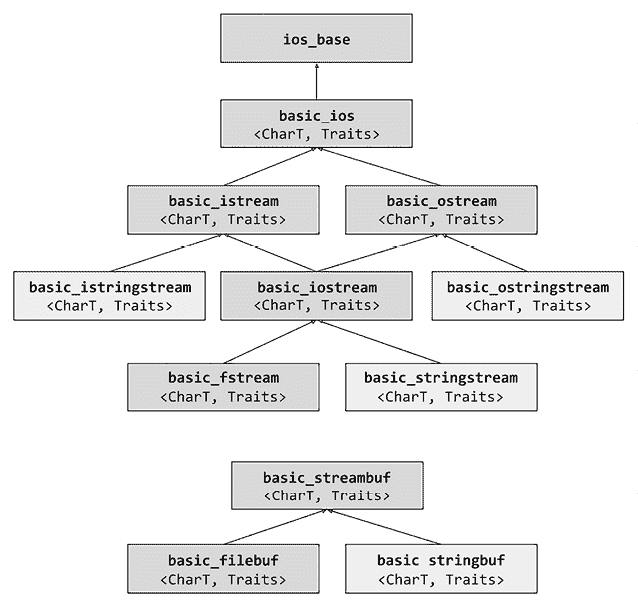

# 第七章：处理文件和流

C++标准库最重要的部分之一是基于输入/输出（I/O）流库，它使开发者能够处理文件、内存流或其他类型的 I/O 设备。本章的第一部分提供了对一些常见流操作（如读取和写入数据、区域设置和操作流的输入和输出）的解决方案。本章的第二部分探讨了 C++17 的`filesystem`库，它使开发者能够对文件系统及其对象（如文件和目录）执行操作。

本章涵盖的食谱如下：

+   从/向二进制文件读取和写入原始数据

+   从/向二进制文件读取和写入对象

+   在固定大小的外部缓冲区上使用流

+   使用区域设置流

+   使用 I/O 操作符控制流的输出

+   使用货币 I/O 操作符

+   使用时间 I/O 操作符

+   处理文件系统路径

+   创建、复制和删除文件和目录

+   从文件中删除内容

+   检查现有文件或目录的属性

+   列出目录内容

+   查找文件

我们将以几个关于如何将数据序列化和反序列化到/从文件的食谱开始本章。

# 从/向二进制文件读取和写入原始数据

你处理的一些数据程序必须以各种方式持久化到磁盘文件中，包括将数据存储在数据库或平面文件中，无论是文本还是二进制数据。这个食谱和下一个食谱都专注于从和向二进制文件持久化和加载原始数据和对象。

在此上下文中，原始数据是指无结构数据，在本食谱中，我们将考虑写入和读取缓冲区的内容（即连续的内存序列），这可以是数组、`std::vector`或`std::array`。

## 准备工作

对于这个食谱，你应该熟悉标准流 I/O 库，尽管提供了一些解释，以帮助理解这个食谱，你应该也熟悉二进制文件和文本文件之间的区别。

在本食谱中，我们将使用`ofstream`和`ifstream`类，这些类在`<fstream>`头文件中的`std`命名空间中可用。

## 如何做到这一点...

要将缓冲区（在我们的例子中，是一个`std::vector`）的内容写入二进制文件，你应该执行以下步骤：

1.  通过创建`std::ofstream`类的实例以二进制模式打开文件流：

    ```cpp
    std::ofstream ofile("sample.bin", std::ios::binary); 
    ```

1.  在向文件写入数据之前，请确保文件实际上已打开：

    ```cpp
    if(ofile.is_open())
    {
      // streamed file operations
    } 
    ```

1.  通过提供字符数组的指针和要写入的字符数，将数据写入文件。在以下示例中，我们写入本地向量的内容；然而，通常，这些数据来自不同的上下文：

    ```cpp
    std::vector<unsigned char> output {0,1,2,3,4,5,6,7,8,9};
    ofile.write(reinterpret_cast<char*>(output.data()), output.size()); 
    ```

1.  可选地，你可以通过调用`flush()`方法将流输出缓冲区的内容刷新到实际的磁盘文件中。这确定了流中的未提交更改将与外部目标同步，在这种情况下，是一个磁盘文件。

1.  通过调用`close()`关闭流。这反过来又调用`flush()`，在大多数情况下使前面的步骤变得不必要：

    ```cpp
    ofile.close(); 
    ```

为了将整个二进制文件内容读取到缓冲区中，应执行以下步骤：

1.  通过创建`std::ifstream`类的实例来打开文件流以以二进制模式读取文件。文件路径可以是绝对路径，也可以是相对于当前工作目录的路径（而不是可执行文件的路径）。在此示例中，路径是相对的：

    ```cpp
    std::ifstream ifile("sample.bin", std::ios::binary); 
    ```

1.  在从文件中读取数据之前，确保文件实际上已经打开：

    ```cpp
    if(ifile.is_open())
    {
      // streamed file operations
    } 
    ```

1.  通过将输入位置指示器定位到文件末尾，读取其值，然后将指示器移到开始位置来确定文件的长度：

    ```cpp
    ifile.seekg(0, std::ios_base::end);
    auto length = ifile.tellg();
    ifile.seekg(0, std::ios_base::beg); 
    ```

1.  分配内存以读取文件的内容：

    ```cpp
    std::vector<unsigned char> input;
    input.resize(static_cast<size_t>(length)); 
    ```

1.  通过提供接收数据的字符数组指针和要读取的字符数来将文件内容读取到分配的缓冲区中：

    ```cpp
    ifile.read(reinterpret_cast<char*>(input.data()), length); 
    ```

1.  检查读取操作是否成功完成：

    ```cpp
    auto success = !ifile.fail() && length == ifile.gcount(); 
    ```

1.  最后，关闭文件流：

    ```cpp
    ifile.close(); 
    ```

## 它是如何工作的...

标准基于流的 I/O 库提供了各种类，这些类实现了高级输入、输出或输入和输出文件流、字符串流和字符数组操作、控制这些流行为的操纵器，以及几个预定义的流对象（`cin`/`wcin`、`cout`/`wcout`、`cerr`/`wcerr`和`clog`/`wclog`）。

这些流被实现为类模板，并且对于文件，库提供了几个（不可复制的）类：

+   `basic_filebuf`实现了原始文件的 I/O 操作，其语义与 C 的`FILE`流类似。

+   `basic_ifstream`实现了由`basic_istream`流接口定义的高级文件流输入操作，内部使用`basic_filebuf`对象。

+   `basic_ofstream`实现了由`basic_ostream`流接口定义的高级文件流输出操作，内部使用`basic_filebuf`对象。

+   `basic_fstream`实现了由`basic_iostream`流接口定义的高级文件流输入和输出操作，内部使用`basic_filebuf`对象。

这些类在以下类图中表示，以更好地理解它们之间的关系：



图 7.1：流类图

注意，此图还包含几个设计用于与基于字符串的流一起工作的类。然而，这里将不会讨论这些流。

在`<fstream>`头文件中，`std`命名空间中定义了之前提到的类模板的几个`typedef`。`ofstream`和`ifstream`对象是前面示例中使用类型同义词：

```cpp
typedef basic_ifstream<char>    ifstream;
typedef basic_ifstream<wchar_t> wifstream;
typedef basic_ofstream<char>    ofstream;
typedef basic_ofstream<wchar_t> wofstream;
typedef basic_fstream<char>     fstream;
typedef basic_fstream<wchar_t>  wfstream; 
```

在上一节中，您看到了我们如何将原始数据写入文件流并从中读取。现在，我们将更详细地介绍这个过程。

要将数据写入文件，我们实例化了一个类型为 `std::ofstream` 的对象。在构造函数中，我们传递了要打开的文件名和流的打开模式，我们指定了 `std::ios::binary` 来表示二进制模式。以这种方式打开文件会丢弃之前的文件内容。如果您想向现有文件追加内容，也应该使用标志 `std::ios::app`（即 `std::ios::app | std::ios::binary`）。这个构造函数内部会在其底层的原始文件对象（即 `basic_filebuf` 对象）上调用 `open()`。如果此操作失败，则会设置失败位。为了检查流是否已成功关联到文件设备，我们使用了 `is_open()`（这内部调用底层 `basic_filebuf` 的同名方法）。向文件流写入数据是通过 `write()` 方法完成的，该方法接受要写入的字符串字符的指针和要写入的字符数。由于此方法操作的是字符字符串，如果数据是其他类型，例如我们例子中的 `unsigned char`，则需要使用 `reinterpret_cast`。在失败的情况下，写入操作不会设置失败位，但它可能会抛出 `std::ios_base::failure` 异常。然而，数据不是直接写入文件设备，而是存储在 `basic_filebuf` 对象中。要将数据写入文件，需要刷新缓冲区，这通过调用 `flush()` 来完成。正如前一个示例所示，在关闭文件流时，这会自动完成。

要从文件中读取数据，我们实例化了一个类型为 `std::ifstream` 的对象。在构造函数中，我们传递了用于打开文件的相同参数，即文件名和打开模式（即 `std::ios::binary`）。构造函数内部会在底层的 `std::basic_filebuf` 对象上调用 `open()`。为了检查流是否已成功关联到文件设备，我们使用了 `is_open()`（这内部调用底层 `basic_filebuf` 的同名方法）。在这个例子中，我们将整个文件内容读取到一个内存缓冲区中，特别是 `std::vector`。在我们能够读取数据之前，我们必须知道文件的大小，以便分配一个足够大的缓冲区来存储这些数据。为此，我们使用了 `seekg()` 将输入位置指示器移动到文件末尾。

然后，我们调用`tellg()`来返回当前位置，在这种情况下，它表示文件的大小（以字节为单位），然后我们将输入位置指示器移动到文件的开始，以便能够从开始读取。为了避免调用`seekg()`来移动位置指示器到末尾，可以直接将位置指示器移动到末尾来打开文件。这可以通过在构造函数（或`open()`方法）中使用`std::ios::ate`打开标志来实现。在为文件内容分配足够的内存后，我们使用`read()`方法将数据从文件复制到内存中。这需要一个指向接收从流中读取的数据的字符串的指针和要读取的字符数。由于流在字符上操作，如果缓冲区包含其他类型的数据，例如我们例子中的`unsigned char`，则需要使用`reinterpret_cast`表达式。

如果发生错误，此操作会抛出`std::basic_ios::failure`异常。为了确定从流中成功读取的字符数，我们可以使用`gcount()`方法。在完成读取操作后，我们关闭文件流。

作为此处描述的`seekg()`/`tellg()`方法用于确定打开的文件大小的替代方案，可以使用文件系统库中的`std::filesystem::file_size()`函数。这只需要一个路径；不需要打开文件。它还可以确定目录的大小，但这是由实现定义的。这个函数在章节后面的*检查现有文件或目录属性*菜谱中介绍。

这些例子中显示的操作是写入和从文件流中读取数据的最低要求操作。然而，执行适当的检查以验证操作的成功并捕获可能发生的任何异常是很重要的。

重要的是要注意表示要写入或读取的字符数的参数值。在迄今为止看到的例子中，我们使用了`unsigned char`类型的缓冲区。`unsigned char`的大小是 1，与`char`相同。因此，字符计数是缓冲区中元素的数量。然而，如果缓冲区包含`int`类型的元素，例如，情况就会改变。`int`通常是 32 位的，这意味着，如果重新解释为`char`，它相当于 4 个字符。这意味着当我们写入大小大于 1 的任何内容时，我们需要将元素的数量乘以元素的大小，如下面的代码片段所示：

```cpp
std::vector<int> numbers{ 0, 1, 2, 3, 4, 5, 6, 7, 8, 9 };
std::ofstream ofile("sample.bin", std::ios::binary);
if (ofile.is_open())
{
   ofile.write(reinterpret_cast<char*>(numbers.data()), 
               numbers.size() * sizeof(int));
   ofile.close();
} 
```

类似地，当我们读取时，我们需要考虑从文件中读取的元素的大小，这将在下面的例子中说明：

```cpp
std::vector<int> input;
std::ifstream ifile("sample.bin", std::ios::binary);
if (ifile.is_open())
{
   ifile.seekg(0, std::ios_base::end);
   auto length = ifile.tellg();
   ifile.seekg(0, std::ios_base::beg);
   input.resize(static_cast<size_t>(length) / sizeof(int));
   ifile.read(reinterpret_cast<char*>(input.data()), length);
   assert(!ifile.fail() && length == ifile.gcount());
   ifile.close();
} 
```

在本菜谱中迄今为止讨论的示例代码可以重新组织成两个通用函数，用于将数据写入和从文件中读取：

```cpp
bool write_data(char const * const filename,
 char const * const data,
 size_t const size)
{
  auto success = false;
  std::ofstream ofile(filename, std::ios::binary);
  if(ofile.is_open())
  {
    try
    {
      ofile.write(data, size);
      success = true;
    }
    catch(std::ios_base::failure &)
    {
      // handle the error
    }
    ofile.close();
  }
  return success;
}
size_t read_data(char const * const filename,
                 std::function<char*(size_t const)> allocator)
{
  size_t readbytes = 0;
  std::ifstream ifile(filename, std::ios::ate | std::ios::binary);
  if(ifile.is_open())
  {
    auto length = static_cast<size_t>(ifile.tellg());
    ifile.seekg(0, std::ios_base::beg);
    auto buffer = allocator(length);
    try
    {
      ifile.read(buffer, length);
      readbytes = static_cast<size_t>(ifile.gcount());
    }
    catch (std::ios_base::failure &)
    {
      // handle the error
    }
    ifile.close();
  }
  return readbytes;
} 
```

`write_data()`是一个函数，它接受文件名、字符数组的指针以及该数组的长度作为参数，并将字符写入指定的文件。`read_data()`是一个函数，它接受文件名和一个分配缓冲区的函数，该函数读取文件的整个内容到由分配函数返回的缓冲区。以下是如何使用这些函数的示例：

```cpp
std::vector<int> output {0, 1, 2, 3, 4, 5, 6, 7, 8, 9};
std::vector<int> input;
if(write_data("sample.bin",
              reinterpret_cast<char*>(output.data()),
              output.size() * sizeof(int)))
{
  auto lalloc = &input 
  {
    input.resize(length) / sizeof(int);
    return reinterpret_cast<char*>(input.data());
 };
  if(read_data("sample.bin", lalloc) > 0)
  {
    std::cout << (output == input ? "equal": "not equal")
              << '\n';
  }
} 
```

或者，我们可以使用动态分配的缓冲区，而不是`std::vector`；在整体示例中，为此所需更改很小：

```cpp
std::vector<int> output {0, 1, 2, 3, 4, 5, 6, 7, 8, 9};
std::unique_ptr<int[]> input = nullptr;
size_t readb = 0;
if(write_data("sample.bin",
              reinterpret_cast<char*>(output.data()),
              output.size() * sizeof(int)))
{
  if((readb = read_data(
     "sample.bin",
     &input {
       input.reset(new int[length / sizeof(int)]);
       return reinterpret_cast<char*>(input.get()); })) > 0)
  {
    auto cmp = memcmp(output.data(), input.get(), output.size());
    std::cout << (cmp == 0 ? "equal": "not equal") << '\n';
  }
} 
```

然而，这个替代方案只是为了说明`read_data()`可以与不同类型的输入缓冲区一起使用。建议尽可能避免显式动态分配内存。

## 更多...

如本食谱所示，从文件读取数据到内存的方式只是几种方法之一。以下是从文件流读取数据的可能替代方案列表：

+   直接使用`std::istreambuf_iterator`迭代器初始化`std::vector`（类似地，这也可以与`std::string`一起使用）：

    ```cpp
    std::vector<unsigned char> input;
    std::ifstream ifile("sample.bin", std::ios::binary);
    if(ifile.is_open())
    {
      input = std::vector<unsigned char>(
        std::istreambuf_iterator<char>(ifile),
        std::istreambuf_iterator<char>());
      ifile.close();
    } 
    ```

+   将`std::vector`的内容从`std::istreambuf_iterator`迭代器赋值：

    ```cpp
    std::vector<unsigned char> input;
    std::ifstream ifile("sample.bin", std::ios::binary);
    if(ifile.is_open())
    {
      ifile.seekg(0, std::ios_base::end);
      auto length = ifile.tellg();
      ifile.seekg(0, std::ios_base::beg);
      input.reserve(static_cast<size_t>(length));
        input.assign(
        std::istreambuf_iterator<char>(ifile),
        std::istreambuf_iterator<char>());
      ifile.close();
    } 
    ```

+   使用`std::istreambuf_iterator`迭代器和`std::back_inserter`适配器将文件流的内容复制到向量中：

    ```cpp
    std::vector<unsigned char> input;
    std::ifstream ifile("sample.bin", std::ios::binary);
    if(ifile.is_open())
    {
      ifile.seekg(0, std::ios_base::end);
      auto length = ifile.tellg();
      ifile.seekg(0, std::ios_base::beg);
      input.reserve(static_cast<size_t>(length));
      std::copy(std::istreambuf_iterator<char>(ifile),
                std::istreambuf_iterator<char>(),
                std::back_inserter(input));
      ifile.close();
    } 
    ```

然而，与这些替代方案相比，*如何做...*部分中描述的方法是最快的，尽管从面向对象的角度来看，这些替代方案可能看起来更有吸引力。本食谱的范围不包括比较这些替代方案的性能，但你可以将其作为练习尝试。

## 参见

+   *从/到二进制文件读取和写入对象*，了解如何将对象序列化和反序列化到和从二进制文件中

+   *使用 I/O 操作符控制流输出*，了解使用称为操作符的辅助函数，这些函数通过`<<`和`>>`流操作符控制输入和输出流

# 从/到二进制文件读取和写入对象

在前面的食谱中，我们学习了如何将原始数据（即无结构数据）写入和读取到文件中。然而，很多时候，我们必须持久化和加载对象。如前所述的食谱所示的方式仅适用于 POD 类型。对于其他任何类型，我们必须明确决定实际写入或读取的内容，因为写入或读取指针（包括指向虚拟表的指针）和任何类型的元数据不仅是不相关的，而且在语义上也是错误的。这些操作通常被称为序列化和反序列化。在本食谱中，我们将学习如何将 POD 和非 POD 类型序列化和反序列化到和从二进制文件中。

## 准备工作

对于本食谱中的示例，我们将使用`foo`和`foopod`类，如下所示：

```cpp
class foo
{
  int         i;
  char        c;
  std::string s;
public:
  foo(int const i = 0, char const c = 0, std::string const & s = {}):
    i(i), c(c), s(s)
  {}
  foo(foo const &) = default;
  foo& operator=(foo const &) = default;
  bool operator==(foo const & rhv) const
  {
    return i == rhv.i &&
           c == rhv.c &&
           s == rhv.s;
  }
  bool operator!=(foo const & rhv) const
  {
    return !(*this == rhv);
  }
};
struct foopod
{
  bool a;
  char b;
  int  c[2];
};
bool operator==(foopod const & f1, foopod const & f2)
{
  return f1.a == f2.a && f1.b == f2.b &&
         f1.c[0] == f2.c[0] && f1.c[1] == f2.c[1];
} 
```

建议你在继续之前首先阅读前一个示例，*从/到二进制文件读取和写入原始数据*。你还应该了解 POD（既是平凡的又具有标准布局的类型）和非 POD 类型是什么，以及如何重载运算符。你可以在 *第六章*，*通用工具* 的 *使用类型特性查询类型属性* 的示例中查找有关 POD 类型的更多详细信息。

## 如何做...

要序列化/反序列化不包含指针的 POD 类型，使用 `ofstream::write()` 和 `ifstream::read()`，如前一个示例所示：

+   使用 `ofstream` 和 `write()` 方法将对象序列化到二进制文件中：

    ```cpp
    std::vector<foopod> output {
      {true, '1', {1, 2}},
      {true, '2', {3, 4}},
      {false, '3', {4, 5}}
    };
    std::ofstream ofile("sample.bin", std::ios::binary);
    if(ofile.is_open())
    {
      for(auto const & value : output)
      {
        ofile.write(reinterpret_cast<const char*>(&value),
                    sizeof(value));
      }
      ofile.close();
    } 
    ```

+   使用 `ifstream` 和 `read()` 方法从二进制文件中反序列化对象：

    ```cpp
    std::vector<foopod> input;
    std::ifstream ifile("sample.bin", std::ios::binary);
    if(ifile.is_open())
    {
      while(true)
      {
        foopod value;
        ifile.read(reinterpret_cast<char*>(&value), sizeof(value));
        if(ifile.fail() || ifile.eof()) break;
        input.push_back(value);
      }
      ifile.close();
    } 
    ```

要序列化非 POD 类型（或包含指针的 POD 类型），必须显式地将数据成员的值写入文件；要反序列化，必须显式地从文件中读取到数据成员，且顺序相同。为了演示这一点，我们将考虑我们之前定义的 `foo` 类：

+   向此类添加一个名为 `write()` 的成员函数以序列化该类的对象。该方法接受一个指向 `ofstream` 的引用，并返回一个 `bool` 值，指示操作是否成功：

    ```cpp
    bool write(std::ofstream& ofile) const
    {
      ofile.write(reinterpret_cast<const char*>(&i), sizeof(i));
      ofile.write(&c, sizeof(c));
      auto size = static_cast<int>(s.size());
      ofile.write(reinterpret_cast<char*>(&size), sizeof(size));
      ofile.write(s.data(), s.size());
      return !ofile.fail();
    } 
    ```

+   向此类添加一个名为 `read()` 的成员函数以反序列化该类的对象。此方法接受一个指向 `ifstream` 的引用，并返回一个 `bool` 值，指示操作是否成功：

    ```cpp
    bool read(std::ifstream& ifile)
    {
      ifile.read(reinterpret_cast<char*>(&i), sizeof(i));
      ifile.read(&c, sizeof(c));
      auto size {0};
      ifile.read(reinterpret_cast<char*>(&size), sizeof(size));
      s.resize(size);
      ifile.read(reinterpret_cast<char*>(&s.front()), size);
      return !ifile.fail();
    } 
    ```

之前演示的 `write()` 和 `read()` 成员函数的替代方法是重载 `operator<<` 和 `operator>>`。为此，你应该执行以下步骤：

1.  向要序列化/反序列化的非成员 `operator<<` 和 `operator>>` 添加 `friend` 声明到类中（在这种情况下，是 `foo` 类）：

    ```cpp
    friend std::ofstream& operator<<(std::ofstream& ofile, foo const& f);
    friend std::ifstream& operator>>(std::ifstream& ifile, foo& f); 
    ```

1.  为你的类重载 `operator<<`：

    ```cpp
    std::ofstream& operator<<(std::ofstream& ofile, foo const& f)
    {
      ofile.write(reinterpret_cast<const char*>(&f.i),
                  sizeof(f.i));
      ofile.write(&f.c, sizeof(f.c));
      auto size = static_cast<int>(f.s.size());
      ofile.write(reinterpret_cast<char*>(&size), sizeof(size));
      ofile.write(f.s.data(), f.s.size());
      return ofile;
    } 
    ```

1.  为你的类重载 `operator>>`：

    ```cpp
    std::ifstream& operator>>(std::ifstream& ifile, foo& f)
    {
      ifile.read(reinterpret_cast<char*>(&f.i), sizeof(f.i));
      ifile.read(&f.c, sizeof(f.c));
      auto size {0};
      ifile.read(reinterpret_cast<char*>(&size), sizeof(size));
      f.s.resize(size);
      ifile.read(reinterpret_cast<char*>(&f.s.front()), size);
      return ifile;
    } 
    ```

## 它是如何工作的...

无论我们是否序列化整个对象（对于 POD 类型）还是其部分，我们都使用之前讨论过的相同流类：`ofstream` 用于输出文件流，`ifstream` 用于输入文件流。关于使用这些标准类写入和读取数据的详细信息已在那个示例中讨论，此处不再重复。

当将对象序列化和反序列化到文件时，你应该避免将指针的值写入文件。此外，你不得从文件中读取指针值，因为这些代表内存地址，在进程间没有意义，甚至在同一进程中的某些时刻也是无意义的。相反，你应该写入指针引用的数据，并将数据读入由指针引用的对象中。

这是一个一般原则，在实践中，你可能会遇到源中可能存在多个指向同一对象的指针的情况；在这种情况下，你可能只想写一个副本，并且以相应的方式处理读取。

如果你想要序列化的对象是 POD 类型，你可以像我们在讨论原始数据时做的那样进行。在本食谱的示例中，我们序列化了`foopod`类型的对象序列。当我们反序列化时，我们通过循环从文件流中读取，直到读取到文件末尾或发生失败。在这种情况下，我们的读取方式可能看起来不太直观，但以不同的方式做可能会导致读取的最后一个值的重复：

1.  读取是在一个无限循环中进行的。

1.  在循环中执行读取操作。

1.  执行对失败或文件末尾的检查，如果发生其中之一，则退出无限循环。

1.  该值被添加到输入序列，并且循环继续。

如果使用带有退出条件的循环来读取文件，即检查文件末尾的位，即`while(!ifile.eof())`，最后一个值将被添加到输入序列两次。这是因为读取最后一个值时，尚未遇到文件末尾（因为那是一个超出文件最后一个字节的标记）。文件末尾的标记只有在下一次读取尝试时才会达到，因此设置了流的`eofbit`。然而，输入变量仍然保留最后一个值，因为它没有被任何东西覆盖，并且这个值第二次被添加到输入向量中。

如果你想要序列化和反序列化的对象是非 POD 类型，将它们作为原始数据写入/读取是不可能的。例如，这样的对象可能有一个虚表。将虚表写入文件不会引起问题，即使它没有任何值；然而，从文件中读取，因此覆盖对象的虚表，将对对象和程序产生灾难性的影响。

在序列化/反序列化非 POD 类型时，有各种替代方案，其中一些在上一节中已经讨论过。所有这些都提供了明确的写入和读取或重载标准`<<`和`>>`运算符的方法。第二种方法的优势在于它允许在泛型代码中使用你的类，其中对象使用这些运算符写入和读取到流文件。

当你计划序列化和反序列化你的对象时，考虑从一开始就对数据进行版本控制，以避免随着时间的推移数据结构发生变化时出现问题。如何进行版本控制超出了本食谱的范围。

## 参见

+   *从/到二进制文件读取和写入原始数据*，以了解如何将非结构化数据写入二进制文件

+   *使用 I/O 操作符控制流的输出*，以了解使用称为操作符的辅助函数的使用，这些函数使用`<<`和`>>`流运算符来控制输入和输出流

# 在固定大小的外部缓冲区上使用流

`<strstream>`头文件从其开始就是标准 I/O 库的一部分。它包含提供对存储在数组中字符序列的流操作的类。然而，这个头文件在 C++98 时就已被弃用，尽管它仍然可用，因为没有提供替代品。C++20 标准引入了`std::span`类，它是对对象序列的非拥有视图。在 C++23 中，一个新的头文件`<spanstream>`被添加作为`<strstream>`的替代。这个头文件包含提供对外部提供的内存缓冲区进行流操作的类。在这个菜谱中，我们将学习如何使用 I/O span 流解析或写入文本。

## 如何做到这一点…

如下使用新的 C++23 span 流：

+   要从外部数组解析文本，使用`std::ispanstream`：

    ```cpp
    char text[] = "1 1 2 3 5 8";
    std::ispanstream is{ std::span<char>{text} };
    int value;
    while (is >> value)
    {
       std::cout << value << '\n';
    } 
    ```

+   要将文本写入外部数组，使用`std::ospanstream`：

    ```cpp
    char text[15]{};
    int numbers[]{ 1, 1, 2, 3, 5, 8 };
    std::ospanstream os{ std::span<char>{text} };         
    for (int n : numbers)
    {
       os << n << ' ';
    } 
    ```

+   要同时读取和写入同一个外部数组，使用`std::spanstream`：

    ```cpp
    char text[] = "1 1 2 3 5 8 ";
    std::vector<int> numbers;
    std::spanstream ss{ std::span<char>{text} };
    int value;
    while (ss >> value)
    {
       numbers.push_back(value);
    }
    ss.clear();
    ss.seekp(0);
    std::for_each(numbers.rbegin(), numbers.rend(), 
                  &ss { ss << n << ' '; });
    std::cout << text << '\n'; // prints 8 5 3 2 1 1 
    ```

## 它是如何工作的…

可以使用外部分配的缓冲区进行流输入/输出操作。然而，`<strstream>`头文件及其`strstream`、`istrstream`、`ostrstream`和`strstreambuf`类在 C++98 中被弃用，且没有提供替代品。弃用它们的原因包括安全性，因为`strstreambuf`不执行边界检查，以及由于其在调整底层缓冲区大小方面的限制而导致的灵活性不足。《std::stringstream》是唯一推荐的替代方案。

在 C++23 中，在新的`<spanstream>`头文件中提供了一组类似的类：`basic_spanstream`、`basic_ispanstream`、`basic_ospanstream`和`basic_spanbuf`。这些类允许对外部分配的固定大小缓冲区执行流操作。这些类不提供对缓冲区所有权或重新分配的支持。对于此类场景，应使用`std::stringstream`。

`std::basic_spanbuf`控制对字符序列的输入和输出。其关联的序列（输入的源，输出的汇）是一个外部分配的固定大小缓冲区，可以从或作为`std::span`提供初始化。这被`std::basic_ispanstream`、`std::basic_ospanstream`和`std::basic_spanstream`所包装，它们提供了由`std::basic_istream`、`std::basic_ostream`和`std::basic_stream`类定义的输入/输出操作的高级接口。

让我们再举一个例子来观察这个问题。假设我们有一个包含由逗号分隔的键值对的字符串。我们想要读取这些对并将它们放入一个映射中。我们可以在 C++23 中编写以下代码：

```cpp
char const text[] = "severity=1,code=42,message=generic error";
std::unordered_map<std::string, std::string> m;
std::string key, val;
std::ispanstream is(text);
while (std::getline(is, key, '=') >> std::ws)
{
   if(std::getline(is, val, ','))
      m[key] = val;
}
for (auto const & [k, v] : m)
{
   std::cout << k << " : " << v << '\n';
} 
```

`std::getline()` 函数允许我们从输入流中读取字符，直到遇到其结束或指定的分隔符。使用它，我们首先使用 `=` 和 `,` 分隔符拆分文本。直到 `=` 的字符序列表示键，而 `=` 之后直到下一个逗号或结束的所有内容是值。`std::ws` 是一个 I/O 操作符，它从输入流中丢弃空白字符。简单来说，我们读取直到找到等号；直到那里是键的所有文本。然后，我们读取直到找到逗号（或达到末尾）；直到那里是值。我们这样做，只要我们继续遇到等号，就在循环中。

从固定大小的缓冲区中读取并不困难，但写入需要更多的检查，因为写入不能超出缓冲区的界限，在这种情况下，写入操作将失败。让我们通过一个例子来更好地理解这一点：

```cpp
char text[3]{};
std::ospanstream os{ std::span<char>{text} };
os << "42";
auto pos = os.tellp();
os << "44";
if (!os.good())
{
   os.clear();
   os.seekp(pos);
}
// text is {'4','2','4'}
// prints (examples): 424╠╠╠╠╠... or 424MƂ etc.
std::cout << text << '\n';
os << '\0';
// text is {'4','2','\0'}
// prints: 42
std::cout << text << '\n'; 
```

外部数组有 3 个字节。我们写入文本 `42`，这个操作成功。然后，我们尝试写入文本 `44`。然而，这需要外部缓冲区有 4 个字节，但它只有 3 个。因此，在写入字符 `4` 后，操作失败。此时，文本缓冲区的内容是 `'``4'`,`'2'`,`'4'`，并且没有空终止字符。如果我们将其打印到控制台，在 `424` 之后，将出现一些基于内存中找到的内容的乱码，直到第一个 0。

要检查写入操作是否失败，我们使用 `good()` 成员函数。如果它返回 `false`，那么我们需要清除错误标志。我们还将流输出位置指示器设置回尝试读取之前的位置（可以使用 `tellp()` 成员函数检索）。此时，如果我们向输出缓冲区写入一个 `0`，其内容将是 `'4'`,`'2'`,`'\0'`，因此将其打印到控制台将显示文本 `42`。

如果你想要同时读取和写入同一个缓冲区，你可以使用 `std::spanstream` 类，它提供了输入和输出流操作。一个例子在 *如何做…* 部分中已经展示。

## 参见

+   *第六章*，*使用 std::span 对象处理对象的连续序列*，学习如何使用非拥有视图来处理元素的连续序列

# 使用流本地化设置

写入或从流中读取的方式可能取决于语言和区域设置。例如，写入和解析数字、时间值或货币值，或比较（整理）字符串。C++ I/O 库通过 *locales* 和 *facets* 提供了一般用途的机制来处理国际化特性。在本食谱中，你将学习如何使用 locales 来控制输入/输出流的行为。

## 准备工作

本食谱中的所有示例都使用 `std::cout` 预定义的控制台流对象。然而，这同样适用于所有 I/O 流对象。此外，在这些食谱示例中，我们将使用以下对象和 lambda 函数：

```cpp
auto now = std::chrono::system_clock::now();
auto stime = std::chrono::system_clock::to_time_t(now);
auto ltime = std::localtime(&stime);
std::vector<std::string> names
  {"John", "adele", "Øivind", "François", "Robert", "Åke"};
auto sort_and_print = [](std::vector<std::string> v,
                         std::locale const & loc)
{
  std::sort(v.begin(), v.end(), loc);
  for (auto const & s : v) std::cout << s << ' ';
  std::cout << '\n';
}; 
```

名称 Øivind 和 Åke 包含丹麦/挪威特有的字符 Ø 和 Å。在丹麦/挪威字母表中，这些是字母表的最后两个字母（按此顺序）。这些被用来举例说明使用区域设置的效果。

此配方中使用的区域设置名称（`en_US.utf8`、`de_DE.utf8`等）是 UNIX 系统上使用的名称。以下表格列出了 Windows 系统上的等效名称：

| **UNIX** | **Windows** |
| --- | --- |
| `en_US.utf8` | `English_US.1252` |
| `en_GB.utf8` | `English_UK.1252` |
| `de_DE.utf8` | `German_Germany.1252` |
| `no_NO.utf8` | `Norwegian_Norway.1252` |

表 7.1：此配方中使用的 UNIX 和 Windows 区域设置名称列表

## 如何操作...

要控制流的本地化设置，必须执行以下操作：

+   使用`std::locale`类来表示本地化设置。有各种构造区域对象的方法，包括以下方法：

    +   默认构造是使用全局区域设置（默认情况下，程序启动时的`C`区域设置）

    +   从本地名称，如`C`、`POSIX`、`en_US.utf8`等，如果操作系统支持

    +   从另一个区域设置，除了指定的特性

    +   从另一个区域设置，除了从另一个指定的区域设置复制的指定类别的所有特性：

        ```cpp
        // default construct
        auto loc_def = std::locale {};
        // from a name
        auto loc_us = std::locale {"en_US.utf8"};
        // from another locale except for a facet
        auto loc1 = std::locale {loc_def, new std::collate<wchar_t>};
        // from another local, except the facet in a category
        auto loc2 = std::locale {loc_def, loc_us, std::locale::collate}; 
        ```

+   要获取默认的`C`区域设置的副本，请使用`std::locale::classic()`静态方法：

    ```cpp
    auto loc = std::locale::classic(); 
    ```

+   要更改每次默认构造区域设置时复制的默认区域设置，请使用`std::locale::global()`静态方法：

    ```cpp
    std::locale::global(std::locale("en_US.utf8")); 
    ```

+   使用`imbue()`方法更改 I/O 流的当前区域设置：

    ```cpp
    std::cout.imbue(std::locale("en_US.utf8")); 
    ```

下面的列表显示了使用各种区域设置的示例：

+   使用特定的区域设置，通过其名称指示。在这个例子中，区域设置是为德语：

    ```cpp
    auto loc = std::locale("de_DE.utf8");
    std::cout.imbue(loc);
    std::cout << 1000.50 << '\n';
    // 1.000,5
    std::cout << std::showbase << std::put_money(1050) << '\n';
    // 10,50 €
    std::cout << std::put_time(ltime, "%c") << '\n';
    // So 04 Dez 2016 17:54:06 JST
    sort_and_print(names, loc);
    // adele Åke François John Øivind Robert 
    ```

+   使用与用户设置相对应的区域设置（如系统中所定义）。这通过从一个空字符串构造一个`std::locale`对象来完成：

    ```cpp
    auto loc = std::locale("");
    std::cout.imbue(loc);
    std::cout << 1000.50 << '\n';
    // 1,000.5
    std::cout << std::showbase << std::put_money(1050) << '\n';
    // $10.50
    std::cout << std::put_time(ltime, "%c") << '\n';
    // Sun 04 Dec 2016 05:54:06 PM JST
    sort_and_print(names, loc);
    // adele Åke François John Øivind Robert 
    ```

+   设置和使用全局区域设置：

    ```cpp
    std::locale::global(std::locale("no_NO.utf8")); // set global
    auto loc = std::locale{};                       // use global
    std::cout.imbue(loc);
    std::cout << 1000.50 << '\n';
    // 1 000,5
    std::cout << std::showbase << std::put_money(1050) << '\n';
    // 10,50 kr
    std::cout << std::put_time(ltime, "%c") << '\n';
    // sön 4 dec 2016 18:02:29
    sort_and_print(names, loc);
    // adele François John Robert Øivind Åke 
    ```

+   使用默认的`C`区域设置：

    ```cpp
    auto loc = std::locale::classic();
    std::cout.imbue(loc);
    std::cout << 1000.50 << '\n';
    // 1000.5
    std::cout << std::showbase << std::put_money(1050) << '\n';
    // 1050
    std::cout << std::put_time(ltime, "%c") << '\n';
    // Sun Dec 4 17:55:14 2016
    sort_and_print(names, loc);
    // François John Robert adele Åke Øivind 
    ```

## 它是如何工作的...

区域对象实际上并不存储本地化设置。一个 *区域* 是一个异构的特件容器。一个 *特件* 是一个定义本地化和国际化设置的对象。标准定义了一个每个区域必须包含的特件列表。此外，区域还可以包含任何其他用户定义的特件。以下是一个所有标准定义的特件的列表：

| `std::collate<char>` | `std::collate<wchar_t>` |
| --- | --- |
| `std::ctype<char>` | `std::ctype<wchar_t>` |
| `std::codecvt<char,char,mbstate_t>``std::codecvt<char16_t,char,mbstate_t>` | `std::codecvt<char32_t,char,mbstate_t>``std::codecvt<wchar_t,char,mbstate_t>` |
| `std::moneypunct<char>``std::moneypunct<char,true>` | `std::moneypunct<wchar_t>``std::moneypunct<wchar_t,true>` |
| `std::money_get<char>` | `std::money_get<wchar_t>` |
| `std::money_put<char>` | `std::money_put<wchar_t>` |
| `std::numpunct<char>` | `std::numpunct<wchar_t>` |
| `std::num_get<char>` | `std::num_get<wchar_t>` |
| `std::num_put<char>` | `std::num_put<wchar_t>` |
| `std::time_get<char>` | `std::time_get<wchar_t>` |
| `std::time_put<char>` | `std::time_put<wchar_t>` |
| `std::messages<char>` | `std::messages<wchar_t>` |

表 7.2：标准特性的列表

讨论这个列表中的所有这些特性超出了本食谱的范围。然而，我们将提到 `std::money_get` 是一个封装从字符流解析货币值规则的特性，而 `std::money_put` 是一个封装将货币值格式化为字符串的规则的特性。以类似的方式，`std::time_get` 封装了解析日期和时间的规则，而 `std::time_put` 封装了格式化日期和时间的规则。这些将是下一两个食谱的主题。

区域设置是一个不可变对象，包含不可变的特性对象。区域设置作为引用计数的数组实现，该数组由引用计数的特性指针组成。数组通过 `std::locale::id` 进行索引，并且所有特性都必须从基类 `std::locale::facet` 派生，并且必须有一个公共静态成员，其类型为 `std::locale::id`，称为 `id`。

只能使用重载构造函数之一或使用 `combine()` 方法来创建区域设置对象，正如其名称所暗示的，`combine()` 方法将当前区域设置与一个新的编译时可识别的特性组合，并返回一个新的区域设置对象。下一个示例显示了使用美国英语区域设置，但带有来自挪威区域设置的数值标点设置的情况：

```cpp
std::locale loc = std::locale("English_US.1252")
                  .combine<std::numpunct<char>>(
                     std::locale("Norwegian_Norway.1252"));
std::cout.imbue(loc);
std::cout << "en_US locale with no_NO numpunct: " << 42.99 << '\n';
// en_US locale with no_NO numpunct: 42,99 
```

另一方面，可以使用 `std::has_facet()` 函数模板来确定区域设置是否包含特定的特性，或者使用 `std::use_facet()` 函数模板获取特定区域设置实现的特性的引用。

在前面的示例中，我们对字符串向量进行了排序，并将区域设置对象作为 `std::sort()` 通用算法的第三个参数传递。这个第三个参数应该是一个比较函数对象。传递区域设置对象之所以有效，是因为 `std::locale` 有一个 `operator()`，它使用其排序特性按字典顺序比较两个字符串。这实际上是 `std::locale` 直接提供的唯一本地化功能；然而，这实际上调用的是排序特性的 `compare()` 方法，该方法根据特性的规则执行字符串比较。

每个程序在启动时都会创建一个全局区域设置。这个全局区域设置的内容会被复制到每个默认构造的区域设置中。可以使用静态方法 `std::locale::global()` 来替换全局区域设置。默认情况下，全局区域设置是 `C` 区域设置，它与具有相同名称的 ANSI C 区域设置等效。这个区域设置是为了处理简单的英文文本而创建的，并且在 C++ 中是默认的区域设置，它提供了与 C 的兼容性。可以通过静态方法 `std::locale::classic()` 获取对这个区域设置的引用。

默认情况下，所有流都使用经典区域设置来写入或解析文本。然而，可以使用流的 `imbue()` 方法来更改流使用的区域设置。这是 `std::ios_base` 类的一个成员，它是所有 I/O 流的基础。相应的成员方法是 `getloc()` 方法，它返回当前流区域设置的副本。

在前面的示例中，我们更改了 `std::cout` 流对象的区域设置。在实际应用中，你可能希望为与标准 C 流关联的所有流对象设置相同的区域设置：`cin`、`cout`、`cerr` 和 `clog`（或 `wcin`、`wcout`、`wcerr` 和 `wclog`）。

当你想使用特定的区域设置（例如本食谱中所示的德语或挪威语）时，你必须确保它们在你的系统上可用。在 Windows 上，这通常不会成问题，但在 Linux 系统上，它们可能未安装。在这种情况下，尝试实例化一个 `std::locale` 对象，例如使用 `std::locale("de_DE.utf8")`，会导致抛出一个 `std::runtime_error` 异常。要在你的系统上安装区域设置，请查阅其文档以找到你必须执行的必要步骤。

## 参见

+   *使用 I/O 操作符控制流输出*，了解如何使用称为操作符的辅助函数来控制输入和输出流，这些操作符使用 `<<` 和 `>>` 流运算符

+   *使用货币 I/O 操作符*，了解如何使用标准操作符来写入和读取货币值

+   *使用时间 I/O 操作符*，了解如何使用标准操作符来写入和读取日期和时间值

# 使用 I/O 操作符控制流输出

除了基于流的 I/O 库之外，标准库还提供了一系列称为操作符的辅助函数，这些函数使用 `operator<<` 和 `operator>>` 控制输入和输出流。在本食谱中，我们将查看一些这些操作符，并通过一些示例来展示它们的使用，这些示例将格式化控制台输出。我们将在接下来的食谱中继续介绍更多操作符。

## 准备工作

I/O 操作符在 `std` 命名空间中的头文件 `<ios>`、`<istream>`、`<ostream>` 和 `<iomanip>` 中可用。在本食谱中，我们只将讨论 `<ios>` 和 `<iomanip>` 中的某些操作符。

## 如何操作...

以下操作符可用于控制流的输出或输入：

+   `boolalpha` 和 `noboolalpha` 用于启用和禁用布尔值的文本表示：

    ```cpp
    std::cout << std::boolalpha << true << '\n';    // true
    std::cout << false << '\n';                     // false
    std::cout << std::noboolalpha << false << '\n'; // 0 
    ```

+   `left`、`right` 和 `internal` 影响填充字符的对齐；`left` 和 `right` 影响所有文本，但 `internal` 仅影响整数、浮点数和货币输出：

    ```cpp
    std::cout << std::right << std::setw(10) << "right\n";
    std::cout << std::setw(10) << "text\n";
    std::cout << std::left << std::setw(10) << "left\n"; 
    ```

+   `fixed`、`scientific`、`hexfloat` 和 `defaultfloat` 改变了用于浮点类型的格式化（对于输入和输出流）。后两者自 C++11 起才可用：

    ```cpp
    std::cout << std::fixed << 0.25 << '\n';         // 0.250000
    std::cout << std::scientific << 0.25 << '\n';    // 2.500000e-01
    std::cout << std::hexfloat << 0.25 << '\n';      // 0x1p-2
    std::cout << std::defaultfloat << 0.25 << '\n';  // 0.25 
    ```

+   `dec`、`hex` 和 `oct` 控制整数类型（在输入和输出流中）使用的基数：

    ```cpp
    std::cout << std::oct << 42 << '\n'; // 52
    std::cout << std::hex << 42 << '\n'; // 2a
    std::cout << std::dec << 42 << '\n'; // 42 
    ```

+   `setw` 改变下一个输入或输出字段的宽度。默认宽度为 0。

+   `setfill` 改变输出流的填充字符；这是用于填充下一个字段直到达到指定宽度的字符。默认填充字符是空白字符：

    ```cpp
    std::cout << std::right
              << std::setfill('.') << std::setw(10)
              << "right" << '\n';
    // .....right 
    ```

+   `setprecision` 改变输入和输出流中浮点类型的十进制精度（即生成的数字位数）。默认精度为 6：

    ```cpp
    std::cout << std::fixed << std::setprecision(2) << 12.345 << '\n';
    // 12.35 
    ```

## 它是如何工作的...

所有的先前列出的 I/O 操纵符（除了 `setw`，它只针对下一个输出字段）都会影响流。此外，所有连续的写入或读取操作都会使用最后指定的格式，直到再次使用另一个操纵符。

其中一些操纵符是无参数调用的。例如，`boolalpha`/`noboolalpha` 或 `dec`/`hex`/`oct`。这些操纵符是接受单个参数（即字符串的引用）并返回同一流引用的函数：

```cpp
std::ios_base& hex(std::ios_base& str); 
```

如 `std::cout << std::hex` 这样的表达式是可能的，因为 `basic_ostream::operator<<` 和 `basic_istream::operator>>` 都有特殊的重载，可以接受对这些函数的指针。

其他操纵符，包括这里未提及的一些，都是通过参数调用的。这些操纵符是接受一个或多个参数并返回一个未指定类型的对象的函数：

```cpp
template<class CharT>
/*unspecified*/ setfill(CharT c); 
```

为了更好地展示这些操纵符的使用，我们将考虑两个示例，这些示例将格式化输出到控制台。

在第一个例子中，我们将列出满足以下要求的书籍目录：

+   章节编号右对齐，并使用罗马数字表示。

+   章节标题左对齐，直到页码的剩余空间用点填充。

+   章节的页码右对齐。

对于这个例子，我们将使用以下类和辅助函数：

```cpp
struct Chapter
{
  int Number;
  std::string Title;
  int Page;
};
struct BookPart
{
  std::string Title;
  std::vector<Chapter> Chapters;
};
struct Book
{
  std::string Title;
  std::vector<BookPart> Parts;
};
std::string to_roman(unsigned int value)
{
  struct roman_t { unsigned int value; char const* numeral; };
  const static roman_t rarr[13] =
  {
    {1000, "M"}, {900, "CM"}, {500, "D"}, {400, "CD"},
    { 100, "C"}, { 90, "XC"}, { 50, "L"}, { 40, "XL"},
    {  10, "X"}, {  9, "IX"}, {  5, "V"}, {  4, "IV"},
    {   1, "I"}
  };
  std::string result;
  for (auto const & number : rarr)
  {
    while (value >= number.value)
    {
      result += number.numeral;
      value -= number.value;
    }
  }
  return result;
} 
Book as its argument and prints its content to the console according to the specified requirements. For this purpose, we use the following:
```

+   `std::left` 和 `std::right` 指定文本对齐方式

+   `std::setw` 指定每个输出字段的宽度

+   `std::fill` 指定填充字符（章节编号为空白字符，章节标题为点）

`print_toc()` 函数的实现如下：

```cpp
void print_toc(Book const & book)
{
  std::cout << book.Title << '\n';
  for(auto const & part : book.Parts)
  {
    std::cout << std::left << std::setw(15) << std::setfill(' ')
              << part.Title << '\n';
    std::cout << std::left << std::setw(15) << std::setfill('-')
              << '-' << '\n';
    for(auto const & chapter : part.Chapters)
    {
      std::cout << std::right << std::setw(4) << std::setfill(' ')
                << to_roman(chapter.Number) << ' ';
      std::cout << std::left << std::setw(35) << std::setfill('.')
                << chapter.Title;
      std::cout << std::right << std::setw(3) << std::setfill('.')
                << chapter.Page << '\n';
    }
  }
} 
```

以下示例使用此方法与描述书籍《指环王》目录的 `Book` 对象：

```cpp
auto book = Book
{
  "THE FELLOWSHIP OF THE RING"s,
  {
    {
      "BOOK ONE"s,
      {
        {1, "A Long-expected Party"s, 21},
        {2, "The Shadow of the Past"s, 42},
        {3, "Three Is Company"s, 65},
        {4, "A Short Cut to Mushrooms"s, 86},
        {5, "A Conspiracy Unmasked"s, 98},
        {6, "The Old Forest"s, 109},
        {7, "In the House of Tom Bombadil"s, 123},
        {8, "Fog on the Barrow-downs"s, 135},
        {9, "At the Sign of The Prancing Pony"s, 149},
        {10, "Strider"s, 163},
        {11, "A Knife in the Dark"s, 176},
        {12, "Flight to the Ford"s, 197},
      },
    },
    {
      "BOOK TWO"s,
      {
        {1, "Many Meetings"s, 219},
        {2, "The Council of Elrond"s, 239},
        {3, "The Ring Goes South"s, 272},
        {4, "A Journey in the Dark"s, 295},
        {5, "The Bridge of Khazad-dum"s, 321},
        {6, "Lothlorien"s, 333},
        {7, "The Mirror of Galadriel"s, 353},
        {8, "Farewell to Lorien"s, 367},
        {9, "The Great River"s, 380},
        {10, "The Breaking of the Fellowship"s, 390},
      },
    },
  }
};
print_toc(book); 
```

在这种情况下，输出如下：

```cpp
THE FELLOWSHIP OF THE RING
BOOK ONE
---------------
   I A Long-expected Party...............21
  II The Shadow of the Past..............42
 III Three Is Company....................65
  IV A Short Cut to Mushrooms............86
   V A Conspiracy Unmasked...............98
  VI The Old Forest.....................109
 VII In the House of Tom Bombadil.......123
VIII Fog on the Barrow-downs............135
  IX At the Sign of The Prancing Pony...149
   X Strider............................163
  XI A Knife in the Dark................176
 XII Flight to the Ford.................197
BOOK TWO
---------------
   I Many Meetings......................219
  II The Council of Elrond..............239
 III The Ring Goes South................272
  IV A Journey in the Dark..............295
   V The Bridge of Khazad-dum...........321
  VI Lothlorien.........................333
 VII The Mirror of Galadriel............353
VIII Farewell to Lorien.................367
  IX The Great River....................380
   X The Breaking of the Fellowship.....390 
```

对于第二个例子，我们的目标是输出一个列表，列出按收入排名的世界最大公司。该表格将包含公司名称、行业、收入（以十亿美元为单位）、收入增长/下降、收入增长率、员工人数和起源国家。对于这个例子，我们将使用以下类：

```cpp
struct Company
{
  std::string Name;
  std::string Industry;
  double      Revenue;
  bool        RevenueIncrease;
  double      Growth;
  int         Employees;
  std::string Country;
}; 
```

以下代码片段中的 `print_companies()` 函数使用了几个额外的操纵符，这些操纵符在先前的例子中已经展示过：

+   `std::boolalpha` 将布尔值显示为 `true` 和 `false` 而不是 `1` 和 `0`。

+   `std::fixed` 表示固定浮点表示，然后 `std::defaultfloat` 恢复到默认浮点表示。

+   `std::setprecision` 指定在输出中显示的小数位数。与 `std::fixed` 一起使用，这用于表示具有小数位的 `Growth` 字段。

`print_companies()` 函数的实现如下所示：

```cpp
void print_companies(std::vector<Company> const & companies)
{
  for(auto const & company : companies)
  {
    std::cout << std::left << std::setw(26) << std::setfill(' ')
              << company.Name;
    std::cout << std::left << std::setw(18) << std::setfill(' ')
              << company.Industry;
    std::cout << std::left << std::setw(5) << std::setfill(' ')
              << company.Revenue;
    std::cout << std::left << std::setw(5) << std::setfill(' ')
              << std::boolalpha << company.RevenueIncrease
              << std::noboolalpha;
    std::cout << std::right << std::setw(5) << std::setfill(' ')
              << std::fixed << std::setprecision(1) << company.Growth
              << std::defaultfloat << std::setprecision(6) << ' ';
    std::cout << std::right << std::setw(8) << std::setfill(' ')
              << company.Employees << ' ';
    std::cout << std::left << std::setw(2) << std::setfill(' ')
              << company.Country
              << '\n';
  }
} 
```

以下是一个调用此方法的示例。此处数据的来源是维基百科（[`en.wikipedia.org/wiki/List_of_largest_companies_by_revenue`](https://en.wikipedia.org/wiki/List_of_largest_companies_by_revenue)，截至 2016 年）：

```cpp
std::vector<Company> companies
{
  {"Walmart"s, "Retail"s, 482, false, 0.71,
    2300000, "US"s},
  {"State Grid"s, "Electric utility"s, 330, false, 2.91,
    927839, "China"s},
  {"Saudi Aramco"s, "Oil and gas"s, 311, true, 40.11,
    65266, "SA"s},
  {"China National Petroleum"s, "Oil and gas"s, 299,
    false, 30.21, 1589508, "China"s},
  {"Sinopec Group"s, "Oil and gas"s, 294, false, 34.11,
    810538, "China"s},
};
print_companies(companies); 
```

在这种情况下，输出具有基于表格的格式，如下所示：

```cpp
Walmart                   Retail            482  false  0.7  2300000 US
State Grid                Electric utility  330  false  2.9   927839 China
Saudi Aramco              Oil and gas       311  true  40.1    65266 SA
China National Petroleum  Oil and gas       299  false 30.2  1589508 China
Sinopec Group             Oil and gas       294  false 34.1   810538 China 
```

作为练习，你可以尝试添加表头或甚至网格线来 precede 这些行，以更好地表格化数据。

## 参见

+   *从/向二进制文件读取和写入原始数据*，以学习如何将非结构化数据写入和读取到二进制文件

+   *使用货币 I/O 操作符*，以学习如何使用标准操作符来写入和读取货币值

+   *使用时间 I/O 操作符*，以学习如何使用标准操作符来写入和读取日期和时间值

# 使用货币 I/O 操作符

在上一个配方中，我们查看了一些可以用于控制输入和输出流的操作符。我们讨论的操作符与数值和文本值相关。在本配方中，我们将探讨如何使用标准操作符来写入和读取货币值。

## 准备工作

现在，你应该熟悉区域设置以及如何为流设置它们。这个主题在 *使用流的本地区域设置* 配方中讨论过。建议你在继续之前阅读该配方。

本配方中讨论的操作符在 `std` 命名空间中，在 `<iomanip>` 头文件中可用。

## 如何做...

要将货币值写入输出流，你应该执行以下操作：

+   设置所需的区域设置以控制货币格式：

    ```cpp
    std::cout.imbue(std::locale("en_GB.utf8")); 
    ```

+   使用 `long double` 或 `std::basic_string` 值作为金额：

    ```cpp
    long double mon = 12345.67;
    std::string smon = "12345.67"; 
    ```

+   使用 `std::put_money` 操作符并带一个参数（货币值）来显示使用货币符号（如果有的话）的值：

    ```cpp
    std::cout << std::showbase << std::put_money(mon)
              << '\n'; // £123.46
    std::cout << std::showbase << std::put_money(smon)
              << '\n'; // £123.46 
    ```

+   使用 `std::put_money` 并带两个参数（货币值和设置为 `true` 的布尔标志）来指示使用国际货币字符串：

    ```cpp
    std::cout << std::showbase << std::put_money(mon, true)
              << '\n'; // GBP 123.46
    std::cout << std::showbase << std::put_money(smon, true)
              << '\n'; // GBP 123.46 
    ```

从输入流中读取货币值，你应该执行以下操作：

+   设置所需的区域设置以控制货币格式：

    ```cpp
    std::istringstream stext("$123.45 567.89 USD");
    stext.imbue(std::locale("en_US.utf8")); 
    ```

+   使用 `long double` 或 `std::basic_string` 值从输入流中读取金额：

    ```cpp
    long double v1 = 0;
    std::string v2; 
    ```

+   如果输入流中可能使用货币符号，请使用 `std::get_money()` 并带一个参数（要写入货币值的变量）：

    ```cpp
    stext >> std::get_money(v1) >> std::get_money(v2);
    // v1 = 12345, v2 = "56789" 
    ```

+   使用 `std::get_money()` 并带两个参数（要写入货币值的变量和设置为 `true` 的布尔标志）来指示存在国际货币字符串：

    ```cpp
    std::istringstream stext("123.45 567.89");
    stext.imbue(std::locale("en_US.utf8"));
    long double v1 = 0;
    std::string v2;
    stext >> std::get_money(v1, true) >> std::get_money(v2, true);
    // v1 = 12345, v2 = "56789" 
    ```

## 它是如何工作的...

`put_money()`和`get_money()`操作符非常相似。它们都是函数模板，接受一个表示要写入输出流的货币值或从输入流读取的货币值变量的参数，以及一个可选的参数，用于指示是否使用国际货币字符串。默认选项是货币符号，如果可用。`put_money()`使用`std::money_put()`面设置来输出货币值，而`get_money()`使用`std::money_get()`面来解析货币值。这两个操作符函数模板都返回一个未指定类型的对象。这些函数不抛出异常：

```cpp
template <class MoneyT>
/*unspecified*/ put_money(const MoneyT& mon, bool intl = false);
template <class MoneyT>
/*unspecified*/ get_money(MoneyT& mon, bool intl = false); 
```

这两个操作符函数都需要货币值是`long double`或`std::basic_string`。

然而，需要注意的是，货币值以使用中的区域设置的货币最小面额的整数形式存储。以美元为例，$100.00 存储为**10000.0**，而 1 分（即$0.01）存储为**1.0**。

当将货币值写入输出流时，如果你想显示货币符号或国际货币字符串，则必须使用`std::showbase`操作符。这通常用于表示数字基的前缀（例如，十六进制的`0x`）；然而，对于货币值，它用于指示是否应显示货币符号/字符串。以下代码片段提供了一个示例：

```cpp
std::cout << std::put_money(12345.67) << '\n';
// prints 123.46
std::cout << std::showbase << std::put_money(12345.67) << '\n';
// prints £123.46 
123.46, while the second line will print the same numerical value but preceded by the currency symbol.
```

## 相关内容

+   *使用 I/O 操作符控制流输出*，了解使用辅助函数，即操作符，它们通过`<<`和`>>`流操作符来控制输入和输出流。

+   *使用时间 I/O 操作符*，了解如何使用标准操作符写入和读取日期和时间值

# 使用时间 I/O 操作符

与我们在上一个菜谱中讨论的货币 I/O 操作符类似，C++11 标准提供了控制时间值写入和读取流中的操作符，其中时间值以`std::tm`对象的形式表示，该对象包含日历日期和时间。在本菜谱中，你将学习如何使用这些时间操作符。

## 准备中

时间 I/O 操作符使用的时间值以`std::tm`值表示。你应该熟悉这个结构，它来自`<ctime>`头文件。

你还应该熟悉区域设置以及如何为流设置它们。这个主题在*使用流区域设置*菜谱中讨论过。建议你在继续之前阅读那个菜谱。

本菜谱中讨论的操作符在`std`命名空间中，在`<iomanip>`头文件中可用。

## 如何实现...

要将时间值写入输出流，你应该执行以下步骤：

1.  获取与给定时间对应的日历日期和时间值。有多种方法可以实现这一点。以下展示了如何将当前时间转换为以日历日期和时间表示的本地时间的几个示例：

    ```cpp
    auto now = std::chrono::system_clock::now();
    auto stime = std::chrono::system_clock::to_time_t(now);
    auto ltime = std::localtime(&stime);
    auto ttime = std::time(nullptr);
    auto ltime = std::localtime(&ttime); 
    ```

1.  使用`std::put_time()`提供一个指向表示日历日期和时间的`std::tm`对象的指针，以及一个指向以空字符结尾的字符字符串的指针，表示格式。C++11 标准提供了一长串可用的格式；此列表可以在[`en.cppreference.com/w/cpp/io/manip/put_time`](http://en.cppreference.com/w/cpp/io/manip/put_time)中查阅。

1.  要根据特定区域的设置写入标准日期和时间字符串，首先通过调用`imbue()`设置流的区域，然后使用`std::put_time()`操纵符：

    ```cpp
    std::cout.imbue(std::locale("en_GB.utf8"));
    std::cout << std::put_time(ltime, "%c") << '\n';
    // Sun 04 Dec 2016 05:26:47 JST 
    ```

以下列表显示了一些受支持的时间格式示例：

+   ISO 8601 日期格式`"%F"`或`"%Y-%m-%d"`：

    ```cpp
    std::cout << std::put_time(ltime, "%F") << '\n';
    // 2016-12-04 
    ```

+   ISO 8601 时间格式`"%T"`：

    ```cpp
    std::cout << std::put_time(ltime, "%T") << '\n';
    // 05:26:47 
    ```

+   ISO 8601 UTC 格式组合日期和时间`"%FT%T%z"`：

    ```cpp
    std::cout << std::put_time(ltime, "%FT%T%z") << '\n';
    // 2016-12-04T05:26:47+0900 
    ```

+   ISO 8601 周格式`"%Y-W%V"`：

    ```cpp
    std::cout << std::put_time(ltime, "%Y-W%V") << '\n';
    // 2016-W48 
    ```

+   ISO 8601 带周数日期格式`"%Y-W%V-%u"`：

    ```cpp
    std::cout << std::put_time(ltime, "%Y-W%V-%u") << '\n';
    // 2016-W48-7 
    ```

+   ISO 8601 序数日期格式`"%Y-%j"`：

    ```cpp
    std::cout << std::put_time(ltime, "%Y-%j") << '\n';
    // 2016-339 
    ```

要从输入流中读取时间值，应执行以下步骤：

1.  声明一个`std::tm`类型的对象来保存从流中读取的时间值：

    ```cpp
    auto time = std::tm {}; 
    ```

1.  使用`std::get_time()`提供一个指向`std::tm`对象的指针，该对象将保存时间值，以及一个指向以空字符结尾的字符字符串的指针，该字符串表示格式。可能的格式列表可以在[`en.cppreference.com/w/cpp/io/manip/get_time`](http://en.cppreference.com/w/cpp/io/manip/get_time)中查阅。以下示例解析了 ISO 8601 组合日期和时间值：

    ```cpp
    std::istringstream stext("2016-12-04T05:26:47+0900");
    stext >> std::get_time(&time, "%Y-%m-%dT%H:%M:%S");
    if (!stext.fail()) { /* do something */ } 
    ```

1.  要根据特定区域的设置读取标准日期和时间字符串，首先通过调用`imbue()`设置流的区域，然后使用`std::get_time()`操纵符：

    ```cpp
    std::istringstream stext("Sun 04 Dec 2016 05:35:30 JST");
    stext.imbue(std::locale("en_GB.utf8"));
    stext >> std::get_time(&time, "%c");
    if (stext.fail()) { /* do something else */ } 
    ```

## 它是如何工作的...

时间值操纵符`put_time()`和`get_time()`非常相似：它们都是具有两个参数的函数模板。第一个参数是指向表示日历日期和时间的`std::tm`对象的指针，该对象包含要写入流或从流中读取的值。第二个参数是指向表示时间文本格式的以空字符结尾的字符字符串的指针。`put_time()`使用`std::time_put()`方面来输出日期和时间值，而`get_time()`使用`std::time_get()`方面来解析日期和时间值。这两个操纵符函数模板都返回一个未指定类型的对象。这些函数不抛出异常：

```cpp
template<class CharT>
/*unspecified*/ put_time(const std::tm* tmb, const CharT* fmt);
template<class CharT>
/*unspecified*/ get_time(std::tm* tmb, const CharT* fmt); 
```

使用`put_time()`将日期和时间值写入输出流的结果字符串与调用`std::strftime()`或`std::wcsftime()`的结果相同。

标准定义了一系列可用的转换说明符，它们构成了格式字符串。这些说明符以 `%` 开头，在某些情况下，后面跟着 `E` 或 `0`。其中一些也是等效的；例如，`%F` 等同于 `%Y-%m-%d`（这是 ISO 8601 日期格式），而 `%T` 等同于 `%H:%M:%S`（这是 ISO 8601 时间格式）。本配方中提到的示例仅涉及少数转换说明符，指的是 ISO 8601 日期和时间格式。对于转换说明符的完整列表，请参阅 C++ 标准，或遵循之前提到的链接。

重要的是要注意，`put_time()` 支持的所有转换说明符并不一定都由 `get_time()` 支持。例如，`z`（UTC 偏移量，ISO 8601 格式）和 `Z`（时区名称或缩写）说明符只能与 `put_time()` 一起使用。以下代码片段展示了这一点：

```cpp
std::istringstream stext("2016-12-04T05:26:47+0900");
auto time = std::tm {};
stext >> std::get_time(&time, "%Y-%m-%dT%H:%M:%S%z"); // fails
stext >> std::get_time(&time, "%Y-%m-%dT%H:%M:%S");   // OK 
```

由某些转换说明符表示的文本是区域相关的。所有以 `E` 或 `0` 开头的说明符都是区域相关的。要为流设置特定的区域，请使用 `imbue()` 方法，如 *如何做...* 部分中的示例所示。

在前面的示例中使用的 `std::localtime()` 函数在成功时返回一个指向静态内部 `std::tm` 对象的指针（否则返回 `nullptr`）。你不应该尝试释放这个指针！

## 参见

+   *使用 I/O 操作符控制流输出*，了解如何使用称为操作符的辅助函数来控制输入和输出流，这些操作符使用 `<<` 和 `>>` 流运算符。

+   *使用货币 I/O 操作符*，了解如何使用标准操作符来写入和读取货币值

# 与文件系统路径一起工作

C++17 标准的一个重要补充是 `filesystem` 库，它使我们能够处理分层文件系统（如 Windows 或 POSIX 文件系统）中的路径、文件和目录。这个标准库是基于 `boost.filesystem` 库开发的。在接下来的几个配方中，我们将探讨该库的这些功能，这些功能使我们能够执行文件和目录操作，例如创建、移动或删除它们，以及查询属性和搜索。然而，首先查看这个库如何处理路径是很重要的。

## 准备工作

对于这个配方，我们将考虑大多数使用 Windows 路径的示例。在配套代码中，所有示例都有 Windows 和 POSIX 的替代方案。

`filesystem` 库位于 `std::filesystem` 命名空间中，在 `<filesystem>` 头文件中。为了简化代码，我们将在所有示例中使用以下命名空间别名：

```cpp
namespace fs = std::filesystem; 
```

文件系统组件（文件、目录、硬链接或软链接）的路径由 `path` 类表示。

## 如何做...

以下是对路径最常见的操作列表：

+   使用构造函数、赋值运算符或`assign()`方法创建路径：

    ```cpp
    // Windows
    auto path = fs::path{"C:\\Users\\Marius\\Documents"};
    // POSIX
    auto path = fs::path{ "/home/marius/docs" }; 
    ```

+   使用成员`operator /=`、非成员`operator /`或`append()`方法通过包含目录分隔符将元素附加到路径：

    ```cpp
    path /= "Book";
    path = path / "Modern" / "Cpp";
    path.append("Programming");
    // Windows: C:\Users\Marius\Documents\Book\Modern\Cpp\Programming
    // POSIX:   /home/marius/docs/Book/Modern/Cpp/Programming 
    ```

+   使用成员`operator +=`、非成员`operator +`或`concat()`方法将元素连接到路径，而不包括目录分隔符：

    ```cpp
    auto path = fs::path{ "C:\\Users\\Marius\\Documents" };
    path += "\\Book";
    path.concat("\\Modern");
    // path = C:\Users\Marius\Documents\Book\Modern 
    ```

+   使用成员函数（如`root_name()`、`root_dir()`、`filename()`、`stem()`、`extension()`等）将路径的元素分解为其部分，例如根、根目录、父路径、文件名、扩展名等（所有这些都在以下示例中展示）：

    ```cpp
    auto path =
      fs::path{"C:\\Users\\Marius\\Documents\\sample.file.txt"};
    std::cout
      << "root: "        << path.root_name() << '\n'
      << "root dir: "    << path.root_directory() << '\n'
      << "root path: "   << path.root_path() << '\n'
      << "rel path: "    << path.relative_path() << '\n'
      << "parent path: " << path.parent_path() << '\n'
      << "filename: "    << path.filename() << '\n'
      << "stem: "        << path.stem() << '\n'
      << "extension: "   << path.extension() << '\n'; 
    ```

+   使用成员函数（如`has_root_name()`、`has_root_directory()`、`has_filename()`、`has_stem()`和`has_extension()`）查询路径部分是否可用（所有这些都在以下示例中展示）：

    ```cpp
    auto path =
      fs::path{"C:\\Users\\Marius\\Documents\\sample.file.txt"};
    std::cout
      << "has root: "        << path.has_root_name() << '\n'
      << "has root dir: "    << path.has_root_directory() << '\n'
      << "has root path: "   << path.has_root_path() << '\n'
      << "has rel path: "    << path.has_relative_path() << '\n'
      << "has parent path: " << path.has_parent_path() << '\n'
      << "has filename: "    << path.has_filename() << '\n'
      << "has stem: "        << path.has_stem() << '\n'
      << "has extension: "   << path.has_extension() << '\n'; 
    ```

+   检查路径是相对的还是绝对的：

    ```cpp
    auto path2 = fs::path{ "marius\\temp" };
    std::cout
      << "absolute: " << path1.is_absolute() << '\n'
      << "absolute: " << path2.is_absolute() << '\n'; 
    ```

+   使用`replace_filename()`和`remove_filename()`修改路径的各个部分，如文件名，以及使用`replace_extension()`修改扩展名：

    ```cpp
    auto path =
      fs::path{"C:\\Users\\Marius\\Documents\\sample.file.txt"};
    path.replace_filename("output");
    path.replace_extension(".log");
    // path = C:\Users\Marius\Documents\output.log
    path.remove_filename();
    // path = C:\Users\Marius\Documents 
    ```

+   将目录分隔符转换为系统首选的分隔符：

    ```cpp
    // Windows
    auto path = fs::path{"Users/Marius/Documents"};
    path.make_preferred();
    // path = Users\Marius\Documents
    // POSIX
    auto path = fs::path{ "\\home\\marius\\docs" };
    path.make_preferred();
    // path = /home/marius/docs 
    ```

## 它是如何工作的...

`std::filesystem::path`类模拟文件系统组件的路径。然而，它只处理语法，并不验证路径表示的组件（如文件或目录）的存在性。

该库定义了一个可移植的通用路径语法，可以适应各种文件系统，如 POSIX 或 Windows，包括 Microsoft Windows **通用命名约定**（**UNC**）格式。两者在几个关键方面有所不同：

+   POSIX 系统有一个单一的树，没有根名称，一个名为`/`的单个根目录，以及一个单个当前目录。此外，它们使用`/`作为目录分隔符。路径表示为以 UTF-8 编码的`char`的空终止字符串。

+   Windows 系统有多个树，每个树都有一个根名称（如`C:`），一个根目录（如`\`），以及一个当前目录（如`C:\Windows\System32`）。路径表示为以 UTF-16 编码的宽字符的空终止字符串。

你不应该在不同系统之间混合路径格式。尽管 Windows 可以处理 POSIX 路径，但反之则不然。请使用每个系统特定的路径格式。此外，你可以使用`filesystem::path`功能，例如`operator /=`和`append()`函数，以及`preferred_separator`静态成员来以可移植的方式构建路径。

根据定义在`filesystem`库中的`pathname`具有以下语法：

+   可选的根名称（`C:`或`//localhost`）

+   可选的根目录

+   零个或多个文件名（可能指文件、目录、硬链接或符号链接）或目录分隔符

有两个特殊的文件名被识别：单个点（`.`），它代表当前目录，和双点（`..`），它代表父目录。目录分隔符可以重复，在这种情况下，它被视为单个分隔符（换句话说，`/home////docs`与`/home/marius/docs`相同）。一个没有冗余当前目录名（`.`）、没有冗余父目录名（`..`）和没有冗余目录分隔符的路径被认为是正常形式。

上一节中介绍的路径操作是最常见的路径操作。然而，它们的实现定义了额外的查询和修改方法、迭代器、非成员比较运算符等等。

以下示例遍历路径的部分并将它们打印到控制台：

```cpp
auto path =
  fs::path{ "C:\\Users\\Marius\\Documents\\sample.file.txt" };
for (auto const & part : path)
{
  std::cout << part << '\n';
} 
```

以下列表表示其结果：

```cpp
C:
Users
Marius
Documents
sample.file.txt 
```

在本例中，`sample.file.txt`是文件名。这基本上是从最后一个目录分隔符到路径末尾的部分。这就是成员函数`filename()`对于给定路径会返回的内容。该文件的扩展名是`.txt`，这是由`extension()`成员函数返回的字符串。要获取不带扩展名的文件名，可以使用另一个名为`stem()`的成员函数。在这里，该方法返回的字符串是`sample.file`。对于所有这些方法，以及所有其他分解方法，都有一个具有相同名称和前缀`has_`的相应查询方法，例如`has_filename()`、`has_stem()`和`has_extension()`。所有这些方法都返回一个`bool`值，以指示路径是否有相应的部分。

## 参见

+   *创建、复制和删除文件和目录*，以了解如何独立于使用的文件系统执行这些基本操作

+   *检查现有文件或目录的属性*，以了解如何查询文件和目录的属性，例如类型、权限、文件时间等

# 创建、复制和删除文件和目录

文件操作，如复制、移动和删除，或目录操作，如创建、重命名和删除，都由`filesystem`库支持。文件和目录使用路径（可以是绝对路径、规范路径或相对路径）来标识，这在之前的菜谱中已经介绍过。在本菜谱中，我们将查看之前提到的操作的标准化函数以及它们的工作方式。

## 准备工作

在继续之前，你应该阅读*使用文件系统路径*菜谱。该菜谱的简介说明也适用于此处。然而，本菜谱中的所有示例都是平台无关的。

对于以下所有示例，我们将使用以下变量，并假设在 Windows 上的当前路径是`C:\Users\Marius\Documents`，而在 POSIX 系统上是`/home/marius/docs`：

```cpp
auto err = std::error_code{};
auto basepath = fs::current_path();
auto path = basepath / "temp";
auto filepath = path / "sample.txt"; 
```

我们还将假设在当前路径的`temp`子目录中存在一个名为`sample.txt`的文件（例如`C:\Users\Marius\Documents\temp\sample.txt`或`/home/marius/docs/temp/sample.txt`）。

## 如何操作...

使用以下库函数执行目录操作：

+   要创建一个新的目录，使用`create_directory()`。如果目录已存在，此方法不会执行任何操作；然而，它不会递归地创建目录：

    ```cpp
    auto success = fs::create_directory(path, err); 
    ```

+   要递归地创建新目录，使用`create_directories()`：

    ```cpp
    auto temp = path / "tmp1" / "tmp2" / "tmp3";
    auto success = fs::create_directories(temp, err); 
    ```

+   要移动现有的目录，使用`rename()`：

    ```cpp
    auto temp = path / "tmp1" / "tmp2" / "tmp3";
    auto newtemp = path / "tmp1" / "tmp3";
    fs::rename(temp, newtemp, err);
    if (err) std::cout << err.message() << '\n'; 
    ```

+   要重命名现有的目录，也使用`rename()`：

    ```cpp
    auto temp = path / "tmp1" / "tmp3";
    auto newtemp = path / "tmp1" / "tmp4";
    fs::rename(temp, newtemp, err);
    if (err) std::cout << err.message() << '\n'; 
    ```

+   要复制现有的目录，使用`copy()`。要递归地复制目录的全部内容，使用`copy_options::recursive`标志：

    ```cpp
    fs::copy(path, basepath / "temp2",
             fs::copy_options::recursive, err);
    if (err) std::cout << err.message() << '\n'; 
    ```

+   要创建指向目录的符号链接，使用`create_directory_symlink()`：

    ```cpp
    auto linkdir = basepath / "templink";
    fs::create_directory_symlink(path, linkdir, err);
    if (err) std::cout << err.message() << '\n'; 
    ```

+   要删除空目录，使用`remove()`：

    ```cpp
    auto temp = path / "tmp1" / "tmp4";
    auto success = fs::remove(temp, err); 
    ```

+   要递归地删除目录的全部内容及其自身，使用`remove_all()`：

    ```cpp
    auto success = fs::remove_all(path, err) !=
                   static_cast<std::uintmax_t>(-1); 
    ```

+   要更改目录或文件的权限，使用`permissions()`，指定来自`perms`枚举的权限选项。除非您从`perm_options`枚举中指定操作类型（替换、添加或删除），否则默认操作是用指定的权限替换所有现有权限：

    ```cpp
    // replace permissions with specified ones
    fs::permissions(temp, fs::perms::owner_all | 
                          fs::perms::group_all, err);
    if (err) std::cout << err.message() << '\n';
    // remove specified permissions
    fs::permissions(temp, fs::perms::group_exec,
                          fs::perm_options::remove, err);
    if (err) std::cout << err.message() << '\n'; 
    ```

使用以下库函数执行文件操作：

+   要复制文件，使用`copy()`或`copy_file()`。下一节将解释这两个函数之间的区别：

    ```cpp
    auto success = fs::copy_file(filepath, path / "sample.bak", err);
    if (!success) std::cout << err.message() << '\n';
    fs::copy(filepath, path / "sample.cpy", err);
    if (err) std::cout << err.message() << '\n'; 
    ```

+   要重命名文件，使用`rename()`：

    ```cpp
    auto newpath = path / "sample.log";
    fs::rename(filepath, newpath, err);
    if (err) std::cout << err.message() << '\n'; 
    ```

+   要移动文件，使用`rename()`：

    ```cpp
    auto newpath = path / "sample.log";
    fs::rename(newpath, path / "tmp1" / "sample.log", err);
    if (err) std::cout << err.message() << '\n'; 
    ```

+   要创建指向文件的符号链接，使用`create_symlink()`：

    ```cpp
    auto linkpath = path / "sample.txt.link";
    fs::create_symlink(filepath, linkpath, err);
    if (err) std::cout << err.message() << '\n'; 
    ```

+   要删除文件，使用`remove()`：

    ```cpp
    auto success = fs::remove(path / "sample.cpy", err);
    if (!success) std::cout << err.message() << '\n'; 
    ```

## 工作原理...

本食谱中提到的所有函数，以及此处未讨论的其他类似函数，都有多个重载，可以归纳为两类：

+   重载函数，其最后一个参数是`std::error_code`的引用：这些重载函数不会抛出异常（它们使用`noexcept`指定）。相反，如果发生操作系统错误，它们将`error_code`对象的值设置为操作系统错误代码。如果没有发生此类错误，则调用`error_code`对象的`clear()`方法来重置任何可能之前设置的代码。

+   不接受`std::error_code`类型最后一个参数的重载函数：如果发生错误，这些重载函数会抛出异常。如果发生操作系统错误，它们会抛出`std::filesystem::filesystem_error`异常。另一方面，如果内存分配失败，这些函数会抛出`std::bad_alloc`异常。

上一节中的所有示例都使用了不抛出异常的重载，而是在发生错误时设置一个代码。一些函数返回一个 `bool` 来指示成功或失败。您可以通过检查方法 `value()` 返回的错误代码的值是否不同于 0，或者通过使用转换 `operator bool` 来检查 `error_code` 对象是否包含错误代码，该转换在相同情况下返回 `true`，否则返回 `false`。要获取错误代码的解释性字符串，请使用 `message()` 方法。

一些 `filesystem` 库函数对文件和目录都适用。`rename()`、`remove()` 和 `copy()` 就是这种情况。这些函数的工作细节可能很复杂，尤其是在 `copy()` 的情况下，并且超出了本食谱的范围。如果您需要执行这里未涵盖的任何其他操作，请参阅参考文档。

在复制文件时，可以使用两个函数：`copy()` 和 `copy_file()`。它们具有等效的重载，具有相同的签名，并且显然以相同的方式工作。然而，有一个重要的区别（除了 `copy()` 也可以用于目录之外）：`copy_file()` 会跟随符号链接。

为了避免这样做，而是复制实际的符号链接，您必须使用 `copy_symlink()` 或带有 `copy_options::copy_symlinks` 标志的 `copy()`。`copy()` 和 `copy_file()` 函数都有一个重载，它接受 `std::filesystem::copy_options` 类型的参数，该参数定义了操作应该如何执行。`copy_options` 是一个具有以下定义的局部 `enum`：

```cpp
enum class copy_options
{
  none               = 0,
  skip_existing      = 1,
  overwrite_existing = 2,
  update_existing    = 4,
  recursive          = 8,
  copy_symlinks      = 16,
  skip_symlinks      = 32,
  directories_only   = 64,
  create_symlinks    = 128,
  create_hard_links  = 256
}; 
```

以下表格定义了这些标志如何影响使用 `copy()` 或 `copy_file()` 进行的复制操作。该表格来自 N4917 版本 C++ 标准的 31.12.8.3 段落：

| 选项组控制现有目标文件对 `copy_file` 函数的影响 |
| --- |
| `none` | (默认) 错误；文件已存在 |
| `skip_existing` | 不覆盖现有文件；不报告错误 |
| `overwrite_existing` | 覆盖现有文件 |
| `update_existing` | 如果现有文件比替换文件旧，则覆盖现有文件 |
| 选项组控制子目录对 `copy` 函数的影响 |
| `none` | (默认) 不复制子目录 |
| `recursive` | 递归复制子目录及其内容 |
| 选项组控制符号链接对 `copy` 函数的影响 |
| `none` | (默认) 跟随符号链接 |
| `copy_symlinks` | 将符号链接作为符号链接复制，而不是复制它们指向的文件 |
| `skip_symlinks` | 忽略符号链接 |
| 选项组控制复制函数效果以选择复制形式 |
| `none` | (默认) 复制内容 |
| `directories_only` | 仅复制目录结构；不复制非目录文件 |
| `create_symlinks` | 使用符号链接代替文件的副本；除非目标路径在当前目录中，否则源路径将是一个绝对路径 |
| `create_hard_links` | 使用硬链接代替文件的副本 |

表 7.3：copy_operation 标志如何影响复制操作

另一个应该提到的方面与符号链接有关：`create_directory_symlink()`创建指向目录的符号链接，而`create_symlink()`创建指向文件或目录的符号链接。在 POSIX 系统上，当涉及到目录时，这两个是相同的。在其他系统（如 Windows）上，目录的符号链接与文件的符号链接创建方式不同。因此，建议您为目录使用`create_directory_symlink()`，以便编写适用于所有系统的正确代码。

当您对文件和目录执行操作，例如本食谱中描述的操作，并使用可能抛出异常的重载时，请确保您在调用上使用`try`-`catch`。无论使用哪种重载类型，您都应该检查操作的成功，并在失败的情况下采取适当的行动。

如果您需要更改文件或目录的权限，可以使用`permissions()`函数。它有几个重载，允许您指定一系列权限选项。这些在`std::filesystem::perms`枚举中定义。如果您不指定特定的更改操作，则执行现有权限的完全替换。但是，您可以使用从`std::filesystem::perm_options`枚举中可用的选项来指定添加或删除权限。除了`replace`、`add`和`remove`之外，还有一个第四个选项，`nofollow`。这适用于符号链接，因此权限更改是在符号链接本身上进行的，而不是在它解析到的文件上。

## 参见

+   *处理文件系统路径*，了解 C++17 标准对文件系统路径的支持

+   *从文件中删除内容*，探索删除文件内容部分的可能方法

+   *检查现有文件或目录的属性*，了解如何查询文件和目录的属性，如类型、权限、文件时间等

# 从文件中删除内容

`filesystem`库直接提供了复制、重命名、移动或删除文件等操作。然而，当涉及到从文件中删除内容时，您必须执行显式操作。

无论您需要为文本文件还是二进制文件执行此操作，您都可以实现以下模式：

1.  创建一个临时文件。

1.  仅从原始文件复制您想要的内容到临时文件。

1.  删除原始文件。

1.  将临时文件重命名/移动到原始文件的名字/位置。

在本食谱中，我们将学习如何为文本文件实现此模式。

## 准备工作

为了本食谱的目的，我们将考虑从文本文件中删除空行或以分号（`;`）开头的行。对于这个示例，我们将有一个初始文件，称为`sample.dat`，其中包含莎士比亚戏剧的名称，但也包含空行和以分号开头的行。以下是该文件的部分列表（从开头）：

```cpp
;Shakespeare's plays, listed by genre
;TRAGEDIES
Troilus and Cressida
Coriolanus
Titus Andronicus
Romeo and Juliet
Timon of Athens
Julius Caesar 
```

下一个部分列出的代码示例使用以下变量：

```cpp
auto path = fs::current_path();
auto filepath = path / "sample.dat";
auto temppath = path / "sample.tmp";
auto err = std::error_code{}; 
```

在下一节中，我们将学习如何将此模式放入代码。

## 如何做...

执行以下操作以从文件中删除内容：

1.  打开文件进行读取：

    ```cpp
    std::ifstream in(filepath);
    if (!in.is_open())
    {
      std::cout << "File could not be opened!" << '\n';
      return;
    } 
    ```

1.  打开另一个临时文件进行写入；如果文件已存在，则截断其内容：

    ```cpp
    std::ofstream out(temppath, std::ios::trunc);
    if (!out.is_open())
    {
      std::cout << "Temporary file could not be created!" << '\n';
      return;
    } 
    ```

1.  逐行读取输入文件，并将选定的内容复制到输出文件：

    ```cpp
    auto line = std::string{};
    while (std::getline(in, line))
    {
      if (!line.empty() && line.at(0) != ';')
      {
        out << line << 'n';
      }
    } 
    ```

1.  关闭输入和输出文件：

    ```cpp
    in.close();
    out.close(); 
    ```

1.  删除原始文件：

    ```cpp
    auto success = fs::remove(filepath, err);
    if(!success || err)
    {
      std::cout << err.message() << '\n';
      return;
    } 
    ```

1.  将临时文件重命名/移动到原始文件的名字/位置：

    ```cpp
    fs::rename(temppath, filepath, err);
    if (err)
    {
      std::cout << err.message() << '\n';
    } 
    ```

## 它是如何工作的...

这里描述的模式也适用于二进制文件；然而，为了保持简洁，我们只讨论了与文本文件相关的示例。在这个示例中，临时文件与原始文件位于同一目录下。或者，它也可以位于一个单独的目录中，例如用户临时目录。要获取临时目录的路径，您可以使用`std::filesystem::temp_directory_path()`。在 Windows 系统上，此函数返回与`GetTempPath()`相同的目录。在 POSIX 系统上，它返回在环境变量`TMPDIR`、`TMP`、`TEMP`或`TEMPDIR`中指定的路径，如果没有这些变量，则返回路径`/tmp`。

从原始文件复制到临时文件的内容因情况而异，取决于需要复制的内容。在前面的示例中，我们复制了整个行，除非它们是空的或以分号（`;`）开头。

为了这个目的，我们使用`std::getline()`逐行读取原始文件的内容，直到没有更多的行可以读取。在复制所有必要的内容后，应该关闭文件以便它们可以被移动或删除。

要完成操作，有三个选项：

+   如果它们位于同一目录中，则删除原始文件并将临时文件重命名为与原始文件相同的名称；如果它们位于不同的目录中，则将临时文件移动到原始文件的位置。这是本食谱采用的方法。为此，我们使用了`remove()`函数来删除原始文件，并使用`rename()`将临时文件重命名为原始文件名。

+   将临时文件的内容复制到原始文件（为此，您可以使用`copy()`或`copy_file()`函数）然后删除临时文件（使用`remove()`进行此操作）。

+   重命名原始文件（例如，更改扩展名或名称），然后使用原始文件名重命名/移动临时文件。

如果你采用这里提到的第一种方法，那么你必须确保后来替换原始文件的临时文件具有与原始文件相同的文件权限；否则，根据你解决方案的上下文，可能会导致问题。

## 参见

+   *创建、复制和删除文件和目录*，以了解如何独立于使用的文件系统执行这些基本操作

# 检查现有文件或目录的属性

`filesystem` 库提供了函数和类型，使开发者能够检查文件系统对象的存在，例如文件或目录，其属性，例如类型（文件、目录、符号链接等），最后写入时间、权限等。在本配方中，我们将探讨这些类型和函数是什么以及如何使用它们。

## 准备工作

对于以下代码示例，我们将使用命名空间别名 `fs` 来表示 `std::filesystem` 命名空间。`filesystem` 库在具有相同名称的标题中可用，即 `<filesystem>`。此外，我们将使用这里显示的变量，`path` 表示文件的路径，`err` 用于从文件系统 API 接收潜在的操作系统错误代码：

```cpp
auto path = fs::current_path() / "main.cpp";
auto err = std::error_code{}; 
```

此外，这里显示的函数 `to_time_t` 将在本配方中引用：

```cpp
 template <typename TP>
  std::time_t to_time_t(TP tp)
 {
     using namespace std::chrono;
     auto sctp = time_point_cast<system_clock::duration>(
       tp - TP::clock::now() + system_clock::now());
     return system_clock::to_time_t(sctp);
  } 
```

在继续此配方之前，你应该阅读 *使用文件系统路径* 配方。

## 如何做...

使用以下库函数来检索关于文件系统对象的信息：

+   要检查路径是否指向一个现有的文件系统对象，请使用 `exists()`：

    ```cpp
    auto exists = fs::exists(path, err);
    std::cout << "file exists: " << std::boolalpha
              << exists << '\n'; 
    ```

+   要检查两个不同的路径是否指向相同的文件系统对象，请使用 `equivalent()`：

    ```cpp
    auto same = fs::equivalent(path,
                   fs::current_path() / "." / "main.cpp", err);
    std::cout << "equivalent: " << same << '\n'; 
    ```

+   要检索文件的字节数，请使用 `file_size()`。这不需要打开文件，因此应该优先于打开文件然后使用 `seekg()`/`tellg()` 函数的方法：

    ```cpp
    auto size = fs::file_size(path, err);
    std::cout << "file size: " << size << '\n'; 
    ```

+   要检索文件系统对象的硬链接数量，请使用 `hard_link_count()`：

    ```cpp
    auto links = fs::hard_link_count(path, err);
    if(links != static_cast<uintmax_t>(-1))
      std::cout << "hard links: " << links << '\n';
    else
      std::cout << "hard links: error" << '\n'; 
    ```

+   要检索或设置文件系统对象的最后修改时间，请使用 `last_write_time()`：

    ```cpp
    auto lwt = fs::last_write_time(path, err);
    auto time = to_time_t(lwt);
    auto localtime = std::localtime(&time);
    std::cout << "last write time: "
              << std::put_time(localtime, "%c") << '\n'; 
    ```

+   要检索文件属性，例如类型和权限（类似于 POSIX `stat` 函数返回的值），请使用 `status()` 函数。此函数会跟随符号链接。要检索不跟随符号链接的符号链接的文件属性，请使用 `symlink_status()`：

    ```cpp
    auto print_perm = [](fs::perms p)
    {
      std::cout
        << ((p & fs::perms::owner_read) != fs::perms::none ?
           "r" : "-")
        << ((p & fs::perms::owner_write) != fs::perms::none ?
           "w" : "-")
        << ((p & fs::perms::owner_exec) != fs::perms::none ?
           "x" : "-")
        << ((p & fs::perms::group_read) != fs::perms::none ?
           "r" : "-")
        << ((p & fs::perms::group_write) != fs::perms::none ?
           "w" : "-")
        << ((p & fs::perms::group_exec) != fs::perms::none ?
           "x" : "-")
        << ((p & fs::perms::others_read) != fs::perms::none ?
           "r" : "-")
        << ((p & fs::perms::others_write) != fs::perms::none ?
           "w" : "-")
        << ((p & fs::perms::others_exec) != fs::perms::none ?
           "x" : "-")
        << '\n';
    };
    auto status = fs::status(path, err);
    std::cout << "type: " << static_cast<int>(status.type()) << '\n';
    std::cout << "permissions: ";
    print_perm(status.permissions()); 
    ```

+   要检查路径是否指向特定类型的文件系统对象，例如文件、目录、符号链接等，请使用 `is_regular_file()`、`is_directory()`、`is_symlink()` 等函数：

    ```cpp
    std::cout << "regular file? " <<
              fs::is_regular_file(path, err) << '\n';
    std::cout << "directory? " <<
              fs::is_directory(path, err) << '\n';
    std::cout << "char file? " <<
              fs::is_character_file(path, err) << '\n';
    std::cout << "symlink? " <<
              fs::is_symlink(path, err) << '\n'; 
    ```

+   要检查文件或目录是否为空，请使用 `is_empty()` 函数：

    ```cpp
    bool empty = fs::is_empty(path, err);
    if (!err)
    {
       std::cout << std::boolalpha
                 << "is_empty(): " << empty << '\n';
    } 
    ```

## 它是如何工作的...

这些函数（用于检索关于文件系统文件和目录的信息）通常简单直接。然而，需要考虑一些因素：

+   检查文件系统对象是否存在可以使用 `exists()`，通过传递路径或使用 `status()` 函数之前检索的 `std::filesystem::file_status` 对象。

+   `equivalent()` 函数确定两个文件系统对象的状态是否相同，状态是通过 `status()` 函数获取的。如果两个路径都不存在，或者两个路径都存在但都不是文件、目录或符号链接，则该函数返回错误。指向同一文件对象的硬链接是等效的。符号链接及其目标也是等效的。

+   `file_size()` 函数只能用来确定指向常规文件的常规文件和符号链接的大小。对于其他类型的文件对象，例如目录，此函数将失败。此函数返回文件的字节数，或者在发生错误时返回 `-1`。如果你想确定一个文件是否为空，你可以使用 `is_empty()` 函数。这适用于所有类型的文件系统对象，包括目录。

+   `last_write_time()` 函数有两个重载集：一个用于检索文件系统对象的最后修改时间，另一个用于设置最后修改时间。时间由一个 `std::filesystem::file_time_type` 对象表示，这基本上是 `std::chrono::time_point` 的类型别名。以下示例将文件的最后写入时间更改为比之前值早 30 分钟：

    ```cpp
    using namespace std::chrono_literals;
    auto lwt = fs::last_write_time(path, err);
    fs::last_write_time(path, lwt - 30min); 
    ```

+   `status()` 函数确定文件系统对象类型和权限。如果文件是符号链接，返回的信息是关于符号链接的目标。要检索关于符号链接本身的信息，必须使用 `symlink_status()` 函数。这些函数返回一个 `std::filesystem::file_status` 对象。

    此类有一个 `type()` 成员函数用于检索文件类型，以及一个 `permissions()` 成员函数用于检索文件权限。文件类型是通过 `std::filesystem::file_type` 枚举定义的。文件权限是通过 `std::filesystem::perms` 枚举定义的。此枚举的所有枚举值并不都代表权限；其中一些代表控制位，例如 `add_perms`，表示应该添加权限，或者 `remove_perms`，表示应该移除权限。`permissions()` 函数可以用来修改文件或目录的权限。以下示例向文件的所有者和用户组添加所有权限：

    ```cpp
    fs::permissions(
      path,
      fs::perms::add_perms |
      fs::perms::owner_all | fs::perms::group_all,
      err); 
    ```

+   要确定文件系统对象（如文件、目录或符号链接）的类型，有两种选择：检索文件状态然后检查 `type` 属性，或者使用可用的文件系统函数之一，例如 `is_regular_file()`、`is_symlink()` 或 `is_directory()`。以下检查路径是否指向常规文件的示例是等效的：

    ```cpp
    auto s = fs::status(path, err);
    auto isfile = s.type() == std::filesystem::file_type::regular;
    auto isfile = fs::is_regular_file(path, err); 
    ```

本配方中讨论的所有函数都有一个在发生错误时抛出异常的重载版本，以及一个不抛出异常但通过函数参数返回错误代码的重载版本。本配方中的所有示例都使用了这种方法。有关这些重载版本的更多信息，请参阅*创建、复制和删除文件和目录*配方。虽然本配方中的代码片段没有显示（为了简单起见），但检查这些函数返回的`error_code`值非常重要。它所持有的实际意义取决于返回它的调用以及它所属的值类别（例如系统、I/O 流或通用）。然而，值`0`在所有值类别中都被认为是表示成功。因此，您可以按以下方式检查成功：

```cpp
auto lwt = fs::last_write_time(path, err);
if (!err) // success
{
   auto time = to_time_t(lwt);
   auto localtime = std::localtime(&time);
   std::cout << "last write time: "
             << std::put_time(localtime, "%c") << '\n';
} 
```

如果您使用不返回错误代码但抛出异常的重载版本，则需要捕获该可能的异常。以下是一个示例：

```cpp
try
{
   auto exists = fs::exists(path);
   std::cout << "file exists: " << std::boolalpha << exists << '\n';
}
catch (std::filesystem::filesystem_error const& ex)
{
   std::cerr << ex.what() << '\n';
} 
```

## 参见

+   *使用文件系统路径*，了解 C++17 标准对文件系统路径的支持

+   *创建、复制和删除文件和目录*，了解如何独立于使用的文件系统执行这些基本操作

+   *列举目录内容*，了解如何遍历目录的文件和子目录

# 列举目录内容

到目前为止，在本章中，我们已经探讨了`filesystem`库提供的许多功能，例如处理路径、对文件和目录执行操作（创建、移动、重命名、删除等）、查询或修改属性。当与文件系统一起工作时，另一个有用的功能是遍历目录的内容。`filesystem`库提供了两个目录迭代器，一个称为`directory_iterator`，它遍历目录的内容，另一个称为`recursive_directory_iterator`，它递归遍历目录及其子目录的内容。在本配方中，我们将学习如何使用它们。

## 准备工作

对于本配方，我们将考虑具有以下结构的目录：

```cpp
test/
├──data/
│ ├──input.dat
│ └──output.dat
├──file_1.txt
├──file_2.txt
└──file_3.log 
```

在以下代码片段中，我们将引用以下函数：

```cpp
void print_line(std::string_view prefix, 
                std::filesystem::path const& path)
{
   std::cout << prefix << path << '\n';
} 
```

在本配方中，我们将使用文件系统路径并检查文件系统对象属性。因此，建议您首先阅读*使用文件系统路径*和*检查现有文件或目录属性*配方。

## 如何做到这一点...

使用以下模式来枚举目录的内容：

+   要迭代目录的内容而不递归访问其子目录，请使用`directory_iterator`:

    ```cpp
    void visit_directory(fs::path const & dir)
    {
      if (fs::exists(dir) && fs::is_directory(dir))
      {
        for (auto const & entry : fs::directory_iterator(dir))
        {
          auto filename = entry.path().filename();
          if (fs::is_directory(entry.status()))
            print_line("[+]", filename);
          else if (fs::is_symlink(entry.status()))
            print_line("[>]", filename);
          else if (fs::is_regular_file(entry.status()))
            print_line(" ", filename);
          else
            print_line("[?]", filename);
        }
      }
    } 
    ```

+   要迭代目录的所有内容，包括其子目录，当处理条目的顺序不重要时，请使用`recursive_directory_iterator`：

    ```cpp
    void visit_directory_rec(fs::path const & dir)
    {
      if (fs::exists(dir) && fs::is_directory(dir))
      {
        for (auto const & entry :
             fs::recursive_directory_iterator(dir))
        {
          auto filename = entry.path().filename();
          if (fs::is_directory(entry.status()))
            print_line("[+]", filename);
          else if (fs::is_symlink(entry.status()))
            print_line("[>]",filename);
          else if (fs::is_regular_file(entry.status()))
            print_line(" ",filename);
          else
            print_line("[?]",filename);
        }
      }
    } 
    ```

+   以结构化的方式遍历目录的所有内容，包括其子目录，例如像遍历树一样，可以使用与第一个示例中类似的功能，该功能使用`directory_iterator`遍历目录的内容。然而，相反，为每个子目录递归地调用它：

    ```cpp
    void visit_directory_rec_ordered(
      fs::path const & dir,
     bool const recursive = false,
     unsigned int const level = 0)
    {
      if (fs::exists(dir) && fs::is_directory(dir))
      {
        auto lead = std::string(level*3, ' ');
        for (auto const & entry : fs::directory_iterator(dir))
        {
          auto filename = entry.path().filename();
          if (fs::is_directory(entry.status()))
          {
            print_line(lead + "[+]", filename);
            if(recursive)
              visit_directory_rec_ordered(entry, recursive, 
     level+1);
          }
          else if (fs::is_symlink(entry.status()))
            print_line(lead + "[>]", filename);
          else if (fs::is_regular_file(entry.status()))
            print_line(lead + " ", filename);
          else
            print_line(lead + "[?]", filename);
        }
      }
    } 
    ```

## 它是如何工作的...

`directory_iterator`和`recursive_directory_iterator`都是输入迭代器，它们遍历目录的条目。区别在于第一个不递归访问子目录，而第二个，正如其名称所暗示的，确实会递归访问。它们都有类似的行为：

+   迭代顺序是不确定的。

+   每个目录条目只访问一次。

+   特殊路径点（`.`）和点-点（`..`）被跳过。

+   默认构造的迭代器是结束迭代器，并且两个结束迭代器始终相等。

+   当迭代到最后的目录条目之后，它将等于结束迭代器。

+   标准没有指定在迭代器创建之后向迭代目录中添加或从迭代目录中删除目录条目会发生什么。

+   标准为`directory_iterator`和`recursive_directory_iterator`定义了非成员函数`begin()`和`end()`，这使得我们可以在前面的示例中使用的基于范围的`for`循环中使用这些迭代器。

两个迭代器都有重载的构造函数。`recursive_directory_iterator`构造函数的一些重载接受`std::filesystem::directory_options`类型的参数，该参数指定了迭代的附加选项：

+   `none`：这是默认值，不指定任何内容。

+   `follow_directory_symlink`：这指定了迭代应该跟随符号链接而不是提供链接本身。

+   `skip_permission_denied`：这指定了应该忽略并跳过可能触发访问拒绝错误的目录。

两个目录迭代器指向的元素都是`directory_entry`类型。`path()`成员函数返回由该对象表示的文件系统对象的路径。可以通过成员函数`status()`和`symlink_status()`获取文件系统对象的状态，对于符号链接。

前面的示例遵循一个常见的模式：

1.  验证要迭代的路径实际上存在。

1.  使用基于范围的`for`循环来迭代目录的所有条目。

1.  根据迭代的方式，使用`filesystem`库中可用的两个目录迭代器之一。

1.  根据要求处理每个条目。

在我们的示例中，我们只是简单地将目录条目的名称打印到控制台。重要的是要注意，正如我们之前指定的那样，目录的内容是按未指定的顺序迭代的。如果你想要以结构化的方式处理内容，例如显示缩进的子目录及其条目（对于这个特定情况）或树（在其他类型的应用程序中），那么使用`recursive_directory_iterator`是不合适的。相反，你应该在从迭代中递归调用的函数中使用`directory_iterator`，对于每个子目录，就像上一节中的最后一个示例所示。

考虑到本配方开头提供的目录结构（相对于当前路径），当我们使用递归迭代器时，会得到以下输出，如下所示：

```cpp
visit_directory_rec(fs::current_path() / "test"); 
```

```cpp
[+]data
   input.dat
   output.dat
   file_1.txt
   file_2.txt
   file_3.log 
```

另一方面，当使用第三个示例中的递归函数时，如下所示，输出将按子级顺序显示，正如预期的那样：

```cpp
visit_directory_rec_ordered(fs::current_path() / "test", true); 
```

```cpp
[+]data
      input.dat
      output.dat
   file_1.txt
   file_2.txt
   file_3.log 
```

请记住，`visit_directory_rec()`函数是一个非递归函数，它使用`recursive_directory_iterator`，而`visit_directory_rec_ordered()`函数是一个递归函数，它使用`directory_iterator`。这个例子应该有助于你理解这两个迭代器之间的区别。

## 更多内容...

在之前的配方中，*检查现有文件或目录的属性*，我们讨论了诸如`file_size()`函数等内容，该函数返回文件的字节数。然而，如果指定的路径是目录，则此函数会失败。为了确定目录的大小，我们需要递归地遍历目录的内容，检索常规文件或符号链接的大小，并将它们相加。

考虑以下函数来举例说明这种情况：

```cpp
std::uintmax_t dir_size(fs::path const & path)
{
   if (fs::exists(path) && fs::is_directory(path))
   {
      auto size = static_cast<uintmax_t>(0);
      for (auto const & entry :
           fs::recursive_directory_iterator(path))
      {
         if (fs::is_regular_file(entry.status()) ||
            fs::is_symlink(entry.status()))
         {
            auto err = std::error_code{};
            auto filesize = fs::file_size(entry, err);
            if (!err)
               size += filesize;
         }
      }
      return size;
   }
   return static_cast<uintmax_t>(-1);
} 
```

之前的`dir_size()`函数返回目录中所有文件的大小（递归），或者在出现错误（路径不存在或不代表目录）的情况下，以`uintmax_t`返回`-1`。

## 参见

+   *检查现有文件或目录的属性*，了解如何查询文件和目录的属性，例如类型、权限、文件时间等

+   *查找文件*，了解如何根据文件名、扩展名或其他属性搜索文件

# 查找文件

在之前的配方中，我们学习了如何使用`directory_iterator`和`recursive_directory_iterator`来枚举目录的内容。显示目录内容，就像我们在之前的配方中所做的那样，这只是需要这样做的一种场景。另一个主要场景是在目录中搜索特定条目，例如具有特定名称、扩展名等的文件。在这个配方中，我们将演示如何使用目录迭代器和之前展示的迭代模式来查找符合给定标准的文件。

## 准备工作

您应该阅读之前的配方，*列出目录内容*，以了解有关目录迭代器的详细信息。在本配方中，我们也将使用之前配方中展示的相同的测试目录结构。

## 如何操作...

要查找符合特定标准的文件，请使用以下模式：

1.  使用`recursive_directory_iterator`遍历目录的所有条目及其子目录。

1.  考虑常规文件（以及您可能需要处理的任何其他类型的文件）。

1.  使用函数对象（例如 lambda 表达式）来过滤仅匹配您条件的文件。

1.  将选定的条目添加到容器中（例如向量）。

此模式在下面的`find_files()`函数中得到了体现：

```cpp
std::vector<fs::path> find_files(
    fs::path const & dir,
    std::function<bool(fs::path const&)> filter)
{
  auto result = std::vector<fs::path>{};
  if (fs::exists(dir))
  {
    for (auto const & entry :
      fs::recursive_directory_iterator(
        dir,
        fs::directory_options::follow_directory_symlink))
    {
      if (fs::is_regular_file(entry) &&
          filter(entry))
      {
        result.push_back(entry);
      }
    }
  }
  return result;
} 
```

## 工作原理...

当我们想要在目录中查找文件时，目录的结构以及其条目（包括子目录）的访问顺序可能并不重要。因此，我们可以使用`recursive_directory_iterator`遍历条目。

`find_files()`函数接受两个参数：一个路径和一个用于选择应返回的条目的函数包装器。返回类型是`filesystem::path`的向量，但也可以是`filesystem::directory_entry`的向量。在此示例中使用的递归目录迭代器不跟随符号链接，返回链接本身而不是目标。这种行为可以通过使用具有`filesystem::directory_options`类型参数的构造函数重载并传递`follow_directory_symlink`来改变。

在前面的示例中，我们只考虑常规文件并忽略其他类型的文件系统对象。谓词应用于目录条目，如果它返回`true`，则条目被添加到结果中。

以下示例使用`find_files()`函数查找测试目录中以`file_`为前缀的所有文件：

```cpp
auto results = find_files(
          fs::current_path() / "test",
          [](fs::path const & p) {
  auto filename = p.wstring();
  return filename.find(L"file_") != std::wstring::npos;
});
for (auto const & path : results)
{
  std::cout << path << '\n';
} 
```

执行此程序后的输出，相对于当前路径，如下所示：

```cpp
test\file_1.txt
test\file_2.txt
test\file_3.log 
```

第二个示例展示了如何查找具有特定扩展名的文件，在这种情况下，扩展名为`.dat`：

```cpp
auto results = find_files(
       fs::current_path() / "test",
       [](fs::path const & p) {
         return p.extension() == L".dat";});
for (auto const & path : results)
{
  std::cout << path << '\n';
} 
```

输出，同样相对于当前路径，如下所示：

```cpp
test\data\input.dat
test\data\output.dat 
```

这两个示例非常相似。唯一不同的是 lambda 函数中的代码，它检查作为参数接收的路径。

## 参考以下内容

+   *检查现有文件或目录的属性*，了解如何查询文件和目录的属性，例如类型、权限、文件时间等

+   *列出目录内容*，了解如何遍历目录的文件和子目录

# 在 Discord 上了解更多信息

加入我们社区的 Discord 空间，与作者和其他读者进行讨论：

`discord.gg/7xRaTCeEhx`


