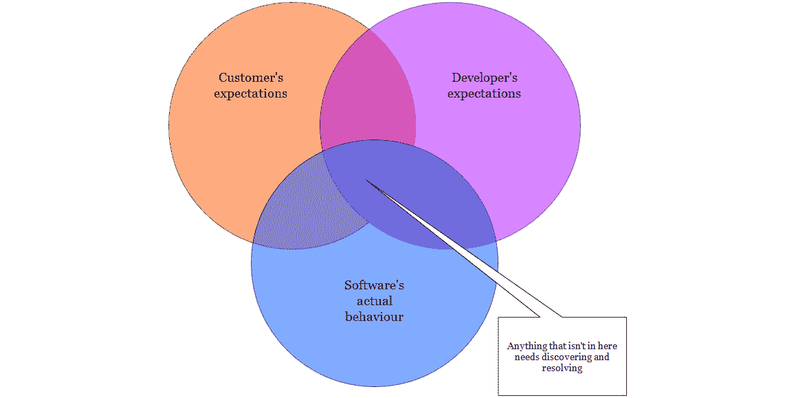

# 第七章：*第六章*

# 测试

## 简介

我在 IT 行业的第一份工作是在软件测试领域。我发现开发人员和测试人员有各自独立的社区，拥有各自的技术和知识体系。我还发现，在一些公司中，开发人员与测试人员之间存在对抗性的关系：开发人员对测试人员因吹毛求疵而感到不满，因为测试人员喜欢挑剔他们的辛勤工作。作为回报，测试人员对开发人员草率和不一致的编写和发布软件的方式感到不满。当然，这两种极端立场实际上并没有建立在现实基础上。

本章阐述了一种思考制作软件的方法，将开发人员和测试人员置于相同的位置：都希望制作一个有价值的产品。然后介绍了软件测试领域的系统化软件测试，这是软件测试人员所理解的，而开发人员似乎很少关注。

## 测试哲学

想象一下在多维图表上绘制你软件的各个维度：功能、性能、用户界面等等（在本节的图表中，我将坚持使用两个维度；即使你是在一些疯狂的未来阅读器上查看，我的图形工具也不支持超过这个数量）。

首先，要注意的是，你无法在*图 6.1*上绘制一个代表“目标”产品的点。最重要的原因是目标可能不存在。根据你对软件的哲学方法，可能没有一个**真正的**需求集合被普遍理解为要构建的**正确**事物。考虑使用软件作为支持系统的组成部分的人，因此“正确的事情”取决于这些人以及他们之间的互动。你应该构建的东西取决于上下文，并随时间变化。（Manny Lehman 对这种哲学有更完整的描述，其中他将嵌入现实世界互动和过程中的软件系统描述为“E 型”系统（E 代表**演变**）。在探索 E 型系统的属性时，他提出了八个**软件演变定律**——[`en.wikipedia.org/wiki/Lehman's_laws_of_software_evolution`](http://en.wikipedia.org/wiki/Lehman’s_laws_of_software_evolution)。我发现这些定律被描述为自然固有的法则，这是讽刺的，因为教训是，在软件方面没有普遍的真理。）

你可以绘制许多模糊的块来表示对软件的各种**看法**：客户认为它做什么，客户认为它**应该**做什么，以及项目团队各个成员认为它做什么。然后还有一个块，代表软件**实际上**做什么。



###### 图 6.1：软件行为维恩图

软件系统的行为以及不同人对该行为或其应该是什么的看法是可能行为空间中的不同区域。软件测试就是识别这些差异，以便它们可以被调和。

构成软件测试的各种实践可以看作是记录这些认知和它们之间差距的一部分。然后，调和这些不同认知和关闭差距的努力不仅仅是调试工作，这意味着测试人员会发现开发者遗漏的问题。这是一个团队的努力，其中调试只是调和活动之一。营销（改变客户的认知以匹配软件的能力）、额外的销售工程（改变部署环境以匹配软件预期的环境）和其他技术都是关闭这些差距的方法。

以这种心态，测试人员并不是在努力“展示”开发者；每个人都致力于创建一个有价值的软件系统，以及对该系统功能的共同理解。测试的目标是识别项目团队可以利用的*机会*。

## 黑盒与白盒

我发现，让开发者感到愤怒的一件事是，当问题报告是从黑盒视角编写的时——测试人员报告了一个没有其他信息的错误，除了通过用户界面可以发现的： “我试了，但不起作用。”我知道这很令人愤怒，因为我曾经是这类报告的接收者。

然而，从上一节概述的视角来看，黑盒测试报告是最有价值的报告。（在这里，“黑盒”指的是测试报告的格式，其中描述了软件的输入以及预期输出和实际输出之间的差异。在测试*规划*中，测试人员使用“黑盒”和“白盒”这些短语来指代是否在测试设计中使用了软件的源代码；这类测试仍然很可能是通过软件的接口来执行的。）任何通过用户界面无法按预期工作的情况都代表了一个被描述的差距：客户对软件功能的认知与软件实际展示的能力之间的差距。

收到这类报告常常令人沮丧的原因在于，重现报告中的问题以及隔离原因可能极其困难且耗时。通常，这个过程比找到问题后修复问题所需的时间更长；为什么测试人员不使用白盒技术，利用对软件的内部知识来单独测试组件，直接找到错误所在，而要给你增加这么多额外的工作？

这是那些感知差距的另一个例子。因为我们把所有的时间都花在与将指令组合成大约 10 个序列的方法和函数打交道，程序员对系统的自然看法就是那些指令和方法。黑盒问题报告与古老的黑盒谜题游戏非常相似，你在一边照光，可以看到光被吸收或反射。你想要思考镜子和盒子内部的其它特征，但你被迫从光束发生的情况中推断它们。

同时，测试人员是在代表客户行事，因此他们对系统的核心部分没有情感上的依恋。客户会想“我遇到*这个问题*，我相信如果我能做*这样*，软件就能帮助我解决这个问题”——这是一种自然的黑盒视角，只与软件的外部接口进行交互。换句话说，他们（以及代表他们的测试人员）对特定方法在参数为`3`时返回`true`或`false`没有意见；他们关心的是软件的输出是否是作为其输入表达的问题的有用解决方案。记住，测试人员试图找出预期行为和实际行为之间的差异；发现这些差异的原因只有在团队决定代码修复是合适的时候才需要做。

### 阐明黑盒之谜

因此，如果定位和诊断代码问题的努力只有在决定代码必须修复时才需要，那么从黑盒问题定义到根本原因的转换是由程序员而不是测试人员来完成的。不管你喜不喜欢，隔离错误是开发者的责任——无论测试人员是否能够提供帮助。

显然，通过在问题报告中重现步骤，逐步在调试器中从开始到结束执行代码，直到问题出现，是有可能隔离错误的。但这既不快，也不愉快。如果你能够假设可能的原因并迅速证明这个假设是否有效，那么诊断问题会快得多。

这就是组件和集成测试变得有用的地方，但它是更大图景的一部分：了解（或能够找出）构成整个系统的各个模块成功工作的条件，以及这些条件是否满足每个参与有缺陷行为的模块。

构建这些假设的帮助可以来自软件的行为。在问题诊断中常用的一个工具是可配置的日志输出级别：消息被标记为不同严重程度，用户选择记录在日志中的级别。在重现一个错误时，日志被设置为显示所有内容，从而更清晰地查看代码的流程。这种方法的缺点取决于具体的应用程序，但可能包括来自软件无关部分的噪声，以及如果问题是与时间相关的话，对整体行为的改变。

问题诊断也受益于拥有对应用程序的可脚本化接口；例如，命令行或 AppleScript 接口。第一个好处是它为你提供了第二个 UI 来访问相同的功能，这使得快速确定问题是在 UI 还是应用程序逻辑中成为可能。其次，它为你提供了一个可重复和可存储的测试，可以添加到回归测试套件中。最后，这样的接口通常比 GUI 简单得多，因此只有与问题相关的代码被测试，这使得隔离任务更快。

否则，从可观察的行为到可能的原因在很大程度上仍然是一个直觉和系统特定知识的问题。了解哪些模块负责应用程序外部行为的哪些部分（或能够找出——见*第八章，文档*）以及推理哪个最有可能导致问题，可以大大减少调试时间。因此，我更喜欢按照这些线路组织我的项目，使得所有进入一个功能的代码都在一个组或文件夹中，并且只有在与其他功能共享时才会拆分到另一个文件夹中。**Eclipse 的 Mylyn 任务管理器**——[`eclipse.org/mylyn/start/`](http://eclipse.org/mylyn/start/)提供了一种更丰富的方式来提供项目的问题特定视图。

## 测试用例设计

随机、无向测试（也称为与用户界面玩耍）是测试软件的低效方法。一种长期确立的技术（在迈耶的《软件测试的艺术》中有所记载——[`books.google.co.uk/books/about/The_art_of_software_testing.html?id=86rz6UExDEEC&redir_esc=y`](http://books.google.co.uk/books/about/The_art_of_software_testing.html?id=86rz6UExDEEC&redir_esc=y)）试图用最少的测试覆盖所有可能的情况。对于每个输入变量或状态，测试人员会发现代表软件中不同条件的值域。例如，一个年龄字段可能具有以下值域：

+   [0,18[ : 儿童

+   [18, 150[ : 成人

+   0[ : 太小

+   [150 : 太大

+   NaN : 非数字

然后，测试员将这些各种范围的所有输入进行表格化，并创建出执行所有这些输入所需的最小测试数量。这被称为**等价类划分**：36 岁和 38 岁的行为可能相同，因此可以合理地预期，如果你测试其中一个，不测试另一个的残余风险很小——具体来说，小于进行那个测试的成本。

事实上，测试员不会完全产生最小数量的测试；他们可能会选择额外关注边界值（也许会编写使用 17 岁、18 岁和 19 岁的测试）。边界很可能是含糊的丰富来源：是否每个人都理解“不超过 18 岁”和“超过 18 岁”意味着相同的事情？软件是否使用适合年龄的舍入方案？

这种技术最初是基于这样的假设，即软件系统的“真实”行为可以在其功能规范中找到；所有测试都可以通过将上述分析应用于功能规范来推导出来；并且观察到的行为与规范之间的任何差异都是一个错误。根据本章开头描述的测试哲学，这些假设是不成立的：即使存在功能规范，它也和其他任何对软件系统的描述一样，是不完整和含糊的。这里描述的技术仍然是有用的，因为挖掘这些含糊和误解是测试员为项目带来的价值的一部分。这只意味着他们的角色已经从验证扩展到包括成为一个（口头）语言律师。

### 代码导向测试

记住“白盒测试”这个短语具有上下文意义，我选择将其称为代码导向测试。这意味着测试是*设计*时参考了应用程序的源代码，无论它们是如何运行的。

当测试员设计这些测试时，他们通常有两个目标之一：要么确保 100%的语句覆盖率，要么确保 100%的分支覆盖率。最大化分支覆盖率会产生更多的测试。考虑这个函数：

```cpp
    void f(int x)
    {
        if (x>3)
        {
            // do some work...
        }
    }
```

一个想要执行每个语句的测试员只需要测试`x`大于 3 的情况；一个想要执行每个分支的测试员还需要考虑另一种情况（而且一个勤奋的测试员会试图发现当`x`*等于*3 时人们认为会发生什么）。

因为测试是从源代码派生出来的，而源代码按定义是一种适合软件工具操作的格式，所以工具支持非常适合代码导向的测试设计。许多平台都有用于测量和报告代码覆盖率的工具。甚至还有自动测试用例生成器，可以确保 100%的分支覆盖率；一个很好的例子是**Klee**——[`klee.llvm.org/`](http://klee.llvm.org/)，符号虚拟机。

### 非功能需求测试

原则上，测试系统的非功能性属性应该和测试其功能性行为一样。你发现系统做了什么，各方认为它应该做什么，然后进行比较。在实践中，非功能性需求可能是隐含的（有人可能希望系统以某种特定方式工作，但他们不知道如何表达，或者认为这太明显而不需要明确说明）或者用含糊不清的术语定义（“系统必须快速”）。

解决这些问题的第一步是让它们进入讨论，因此测试软件的这些方面并报告结果是一个好主意。例如，客户可能没有表达任何系统需求，因为他们不知道这很重要；一份报告说“应用程序在 32 位系统上无法正常运行，需要至少服务包 2”将揭示这是否是一个问题，从而更好地相互理解系统。

## 自动化一切

测试软件和编写软件有一个共同的特性：不是“做”它们是有益的，而是“完成”它们。能够访问到完成并工作的软件是有用的，因此一个正在进行的项目只和尚未开始的项目一样有价值（尽管正在进行的项目已经花费了更多）。因此，应该尽可能地自动化测试过程本身，以便测试人员能够专注于定义测试和发现/报告问题的更具创造性的任务。

这种自动化从设置测试环境到一个已知的初始状态开始。虚拟机越来越多地被用于这项任务（至少在服务器和桌面环境中），因为它们提供了一种快速创建已知配置环境的方法，测试工具和被测试的软件可以部署到这个环境中。测试运行结束后，虚拟机的状态会被重置，并准备好再次启动。

自动测试软件的驾驶可以通过专门的脚本接口来完成，正如之前所描述的，但这些接口并不能测试 UI 按钮和组件的行为。开发者通常不喜欢自动 GUI 驾驶测试，因为测试失败的可能性有限，这可能是由于 GUI 的一些不重要的属性改变，例如控制的位置或设计。这里有两个需要注意的地方：

+   控制的位置和设计是重要的；如果测试驱动程序在软件的两个版本之间找不到相同的控制，那么客户可能也无法找到。

+   尽管这种测试因无关紧要的更改而失败的风险存在，但如果完全取消测试，那么你可能会在发布 GUI 时遗漏未检测到的问题。这些相互冲突的风险必须得到解决。测试失败场景的影响是，在这些情况下，当 GUI 更新时，测试套件将出现一段时间的假阴性结果，直到有人意识到发生了什么并花时间更新测试。GUI 损坏场景的影响是，你的软件*肯定*不会按照客户期望的方式运行，这会导致客户不满、低评分，可能还会造成收入损失，*并且*有人将不得不花时间发布软件的修复版本。第二个场景似乎比第一个场景更不可取，因此接受保持测试更新的成本是更好的选择。

自动化特别有助于你有一个“烟雾测试”程序来确定构建是否足够稳定，可以接受进一步的测试或被视为发布候选。通过烟雾测试套件几乎可以定义为重复的苦差事，所以把它交给计算机来做。然后，开发者可以回到规划和工作于下一个构建，测试人员可以专注于提供有价值的测试。此外，自动烟雾测试套件将比手动烟雾测试更快，因此构建可以接受更大的严格性。你甚至可以将所有自动测试添加到烟雾测试电池中，这样每个构建都包含相对于先前构建没有已知的回归。

一些团队*允许构建在通过自动测试后自动部署*——[`github.com/blog/1241-deploying-at-github`](https://github.com/blog/1241-deploying-at-github)。

## 引入他人

大多数关于测试的文献都提到，外部测试人员对被测试软件的情感依恋不如开发者，在评估该软件时将更加冷静，因此会发现更多问题。事实上，开发者*可以*系统地测试自己的软件，但往往缺乏这种倾向（尤其是我们倾向于将编写代码视为我们做的有价值的事情，而其他一切都是开销）。获取某种形式的外部输入，无论是第三方测试人员还是顾问来检查我们的测试是否覆盖了相关案例，是对我们工作的宝贵检查。

注意，beta 测试者不太可能提供这样的系统审查。通常，beta 测试者是一个感兴趣的用戶，在软件仍在开发过程中，可以免费获得软件的访问权限。他们可能会以随机的方式接近测试，并且只使用对他们感兴趣的软件部分。beta 测试对于发现你认为软件将被如何使用和预期它将被如何使用之间的差距是有用的，但在分析 beta 测试者的报告时必须使用统计技术。由于“客户总是对的”这种说法，改变一个 beta 测试者报告的问题的诱惑很大，但请记住，其他`n-1`个测试者并没有报告相同的问题，而且**没有一个**测试了替代方案。

在我参与的一个项目中，我们所说的“beta 测试”实际上是指客户环境测试。我们向客户提供了软件，希望他们的配置与我们的不同，并可能揭示出特定配置的问题。作为大型企业，这些客户并没有在他们的真实网络中测试 beta 版本，而是在专门为测试而设置的“不同”环境中进行测试。因此，团队仍然不知道软件是否能在客户的配置中运行。

当测试程序需要专业知识时，获取外部参与也是有用的。安全测试、性能测试和测试软件的本地化版本都是这种情况。

## 测试的其他好处

我在本章中已经表明，软件测试在识别软件的实际行为、明显行为和预期行为之间的差距方面发挥着重要作用。此外，我还描述了使用自动化测试作为回归套件的好处，这样一旦一个问题被修复，如果它意外地再次引入，就会被检测到。投资测试你的软件也会带来其他好处。

### 可访问性

传统上，在软件界，可访问性（或 a11y，在省略了 11 个字母之后）指的是使软件界面可供某些残疾或障碍人士使用。通常，它被狭义地应用于仅考虑视觉障碍者的考虑。

事实上，一个自动化的用户界面测试套件可以提高应用程序的可访问性。一些 UI 测试框架（包括**苹果的 UI 自动化**—[`developer.apple.com/library/ios/#documentation/DeveloperTools/Reference/UIAutomationRef/_index.html`](http://developer.apple.com/library/ios/#documentation/DeveloperTools/Reference/UIAutomationRef/_index.html) 和 **微软的 UI 自动化**—[`msdn.microsoft.com/en-us/library/ms747327.aspx`](http://msdn.microsoft.com/en-us/library/ms747327.aspx)）使用为屏幕阅读器和其它辅助设备提供的元数据来查找和操作应用程序显示上的控件。在这个层面进行测试确保测试仍然可以找到标签已更改或已在屏幕上移动的控件，这对于基于图像检测的测试框架来说很难应对。

一些在其他无障碍性（a11y）方面有困难为他们的产品辩护的开发者发现，测试是一个方便的工具来做到这一点。根据我的经验，首先采取的是道德方法（“这是正确的事情”），然后是法律方法（“我们是否受残疾歧视法约束？”），然后是财务方法（“我们会吸引更多客户——竞争对手可能没有销售给他们的客户”）。即使是**无障碍软件的积极倡导者**([`mattgemmell.com/2010/12/19/accessibility-for-iphone-and-ipad-apps/`](http://mattgemmell.com/2010/12/19/accessibility-for-iphone-and-ipad-apps/))也承认财务理由是动摇的：“我不会试图提出一个令人信服的商业论点来支持无障碍性；我甚至不确定我能否做到”——[`mattgemmell.com/2012/10/26/ios-accessibility-heroes-and-villains/`](http://mattgemmell.com/2012/10/26/ios-accessibility-heroes-and-villains/)）。管理者往往喜欢降低成本和风险：自动化用户界面测试，然后将其作为回归测试的一部分来维护，可以提供这两项降低。

### 结构

从单元测试到系统测试，无论你的测试在哪个层面进行，被测试的对象必须可以从你的应用程序中提取出来，以便在测试环境中执行。这一要求强制执行了关注点的分离：在每一个层面，模块必须能够在隔离状态下或用外部依赖项替换的情况下运行。这也强烈暗示了每个模块的单个责任：如果你想找到日志功能的测试，在“日志测试”固定装置中查找比在“摊销计算（顺便提一下，也做日志）固定装置”中查找要容易得多。

诚然，这种严格的关注点分离并不总是合适的解决方案，但通常情况下是这样的，直到你发现并非如此。这将简化开发中的许多方面：尤其是将工作分配给不同开发者。如果每个问题都在一个完全独立的模块中解决，那么不同的程序员只需就这些模块之间的接口达成一致，就可以根据他们的需求构建内部结构。如果他们需要以后出于某种原因将它们结合起来，那么你作为单独的独立组件进行测试的事实，即使你不得不移除一些回归测试以使一切正常工作，也会增加它们集成的信心。

我主要在性能优化中看到这种情况。当我正在为某个特定功能编写可视化时，另一位开发者编写了功能。这些部分各自独立工作，但接口使它们变得太慢。我们决定将它们结合起来，这使得它们变得快速，但引入了模块之间的紧密依赖。某些以前可以独立测试的事情现在需要其他部分的存在；但我们确实在独立测试了它们，因此对它们的工作方式和假设有一些了解。
