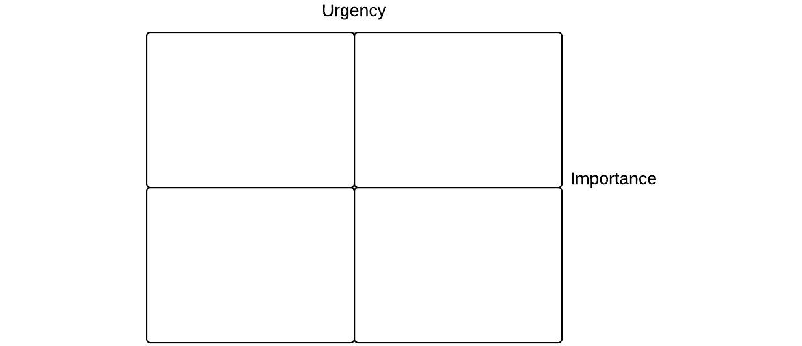

# 第十四章：*第十三章*

# 团队合作

## 引言

除非我在过去一百多页中完全失败了，你应该有这种感觉，软件是一种社会活动。我们与其他人合作来制作软件，我们作为软件制作者的共享价值观塑造了我们制作的软件。我们（或出售）我们的软件给其他人使用，这塑造了他们看待自己和彼此合作的方式。软件可以加强现有的联系或创造新的联系，但它也可以破坏或降低现有联系的重要性。从专业角度来看，我们的软件影响最接近我们编写代码时经验的联系是与我们每天互动的团队。

本章讨论了这些关系：我们如何作为一个团队工作，我们的同事如何与我们合作，以及可能出现的利益和紧张关系。

## 专注与干扰

我们已经听到了响亮的号召。我们听到了程序员需要进入“状态”——[`www.joelonsoftware.com/articles/fog0000000068.html`](http://www.joelonsoftware.com/articles/fog0000000068.html)，以便完成他们最好的工作，而且进入状态很难。我们听到了一个简单的电话或朋友的聊天就可以让我们退出状态，但重新进入可能需要 15 分钟。那么为什么每个人都不在家工作呢？如果周围有人对生产力是如此有害，那么为什么任何企业甚至要考虑办公室的资本支出呢？

因为，虽然好人可以独立工作得很好，但两个人一起工作可以很棒。让我描述一下我写这段话之前的一天。早上我并没有真正完成多少工作，因为一位同事问他正在工作的代码中的内存泄漏问题，我帮助了他。这比他自己解决得更快。

因此，午餐前我真正进入“状态”的时间只有大约一个小时，而且并不顺利。我在我的问题上取得了一些进展，但后来遇到了一个问题，一个简单的更改来添加新行为破坏了已经存在的东西。我无法找出原因。无论如何，那时是午餐时间，所以我们去买了三明治，我把问题告诉了我的同事。在我们到达三明治店之前，我们已经商定了问题以及我应该采取什么措施来解决它，当我回到我的桌子时，这第一次就成功了。

这个故事的要点是，如果我们俩都留在“状态”中，我们无疑可以工作得更快：直到我们无法单独解决问题为止。我们会在工作中更有效地失败。实际上，有一起工作的可能性让我们汇聚了知识，尽管这意味着我们中的每个人都可能在某个时刻被带出“状态”。

我在各种各样的环境中工作过。在我第一份工作中，我有一个自己的办公室——尽管其中一堵墙是电梯井，整个办公室都在地下。（事实上，这个办公室之前是负责维护我负责的系统之前几代计算机的现场**数字设备公司**工程师的宿舍。要么他们是非常沉睡的睡眠者，要么他们在夜班期间关掉了电梯。）从那时起，我在格子间空间、开放式空间以及在我的家中工作过。我知道“心流状态”是什么样的：但我也知道当你无法解决问题且没有人可以询问时，头撞墙的感觉。我知道连续 10 小时专注于一个真正有趣的问题是什么感觉，以及当 5 分钟后被告知公司已经有了你可以使用的解决方案时是什么感觉。我知道角落里的吉他是如何召唤你，以及从附近几个全神贯注且充满动力的人身上汲取能量的感觉。

事实上，“心流状态”并不总是相关的，正如上面案例所示。你可能想要进入“心流状态”来从书籍或互联网上做一些研究，但那时可能有助于从其他人那里获取一些输入，以比较他们的经验和观点与你所学的内容。在编码时，“心流状态”是有帮助的，但前提是你知道或能弄清楚你应该做什么。如果问题有任何难度，与其他人讨论将更有帮助。

最后一点：人类是“一个高度社会化的物种”——[`thoughteconomics.com/`](https://thoughteconomics.com/)，进入“心流状态”的最佳环境——在家工作或在隐蔽区域——却是最不适合与同事共享社交体验的。我们中的一些人足够幸运，能够在工作之外与朋友或家人互动来满足我们的社交需求，但对于那些重视持续社交接触的更外向的人来说，独自工作可能会对心理健康产生负面影响。

因此，独自一人在有利于独立工作的环境中工作有时是有用的，但可能会缺乏情感上的刺激。与他人一起工作可能会带来回报和益处，但也可能令人分心并感到沮丧。我们如何平衡这两个方面？常用的方法之一是“耳机规则”。耳机戴在头上：我在集中注意力。耳机摘下：请随意与我交谈。耳机规则的变体是**生产力鸭**——[`www.youtube.com/watch?v=oBw_cKdnUgw&index=11&list=PLKMpKKmHd2SvY9DLg_Lozb06M2MLcNImz&t=38s`](https://www.youtube.com/watch?v=oBw_cKdnUgw&index=11&list=PLKMpKKmHd2SvY9DLg_Lozb06M2MLcNImz&t=38s)。

在我的经验中，强制执行戴耳机或降低生产力规则是困难的：无论耳机状态如何，耳机两边的人都会觉得忽略朋友和同事是不礼貌的。改变整个团队的社会规则可能很困难。我工作过的团队提出了一条更简单的规则，更容易合作：如果我在办公室，那么我来这里是为了与每个人交谈并完成一些协作工作。如果我在其他地方（食堂、会议室、在家、附近的咖啡馆），那么我是在独自完成工作。

需要平衡的地方因人而异；因此，团队采取的最佳方法取决于团队的人员构成。外向的人可能希望花更多的时间与他人合作，因此，如果想要不受打扰地工作的人待在家里，这会让他们感到孤立。

我遇到的一种更通用的区域相关技术是基于非常轻量级的计时跟踪。这需要设置一个厨房计时器（或者一个应用程序——或者，如果你在酒店并且喜欢打扰接待员，可以设置闹钟）为 25 分钟。在这 25 分钟内，专注于你的问题。如果有人需要帮助，询问你能否在时间结束后再回复他们。在 25 分钟结束时，短暂休息，回答任何出现的干扰，并计划进入下一个 25 分钟。如果你绝对需要做其他事情，建议你中断（而不是暂停）工作周期，并在有机会时重新开始。

关于这种技术的一个重要观察是，如果你在休息或帮助他人时不在计时范围内，这是完全可以接受的：这都是你工作日的重要部分。你可能有些日子只能管理一到两个 25 分钟的爆发，但至少你可以控制“区域”和其他所有你必须做的事情之间的权衡。

我只使用了这种技术一段时间，但我发现它确实有助于提高专注力。最初，我对 25 分钟的时间段可以持续多久感到惊讶！当我写这一点时，这似乎很荒谬，但它表明我允许社交网络等干扰分散我的注意力有多严重。

即使是 25 分钟的专注也需要你环境（下一节的主题）和工具的支持。我开发的一个 iPad 应用程序只能在连接的 iPad 上测试，因为模拟器没有提供第三方库。构建和运行或启动任何单元测试需要大约 30 秒——对我来说，这足以让我被电子邮件或 Twitter 分散注意力。我还发现，我的自律能力在午餐后下降；我仍然能完成工作，但我更有可能在休息时间继续工作或在中途停下来。

## 工作环境

你与同事的互动只是构成你整个工作环境的大量经验和输入的一部分。不出所料，最好的环境与个人化程度不亚于在独立工作和团队合作之间的最佳平衡；我能做的最好的事情就是描述对我有效的方法，以及你可以考虑的一些事情来反思你自己的环境。

首先，如果你工作的地方期望有一个“标准”的桌面布局，没有任何装饰或个性化，那根本不是一个非常健康的环境。人们喜欢装饰他们的环境*以表达他们的个性*——[`www.colorado.edu/cmci/academics/communication`](https://www.colorado.edu/cmci/academics/communication)。一个同质化的工作空间可能有助于确保设施经理的木兰油漆不会弄脏，但不允许员工有任何创造性自由。限制我们软件制作者的创造力不利于制作出有创造性的软件。

《人件》1999 年版——[`books.google.co.uk/books/about/Peopleware.html?id=eA9PAAAAMAAJ&redir_esc=y`](https://books.google.co.uk/books/about/Peopleware.html?id=eA9PAAAAMAAJ&redir_esc=y) 中有很多关于工作条件的内容。我进入职场太晚，没能亲眼看到他们抱怨的全封闭式格子间（尽管我当然看过 *《tron》和《办公室空间》*），但他们讨论的办公室设置的其他方面仍然相关。

我工作过的一些地方有那些巨大的**VoIP**桌面电话，上面有所有按钮、重定向选项、开关等等，这些是**《星际迷航》**中首次引入到人机交互中的。我早期的发现是，没有人知道如何操作这些电话，这意味着如果你需要，你可以对你的任何行为都有合理的否认。在网上找到手册，找到你需要的一个静音/重定向按钮，然后平静地工作。当有人抱怨他们试图给你打电话时：

1.  为你在尝试将电话重定向到手机时按错按钮道歉。

1.  建议电子邮件或其他异步通信是联系你的更好方式。

对我来说，工作环境中的两个重要特征是书架和白板。即使我在家工作，我也有一块白板和一支记号笔，可以随时进行快速绘图——一个相当小的，如果需要，我可以把它举到 Skype 摄像头前。*没有*白板可能会对整个工作空间产生不利影响。我工作过的一个办公室只在会议室里有白板，所以我们抓起干粉笔在（便宜、白色、纤维板）书架上画图。我们很快发现墨水很难清洗；但既然已经毁了书架，就没有理由回头了。随着新的“艺术”在无法擦除的旧东西上绘制，图解很快变成了褪色的手稿。

我之前提到我的第一个办公室是在地下的。一项关于自然光对建筑物使用者 *影响* 的文献综述——[`indoorenvironment.org/effects-of-natural-light-on-building-occupants/`](http://indoorenvironment.org/effects-of-natural-light-on-building-occupants/) 发现，人们在有自然光的环境中感觉更好，因此表现也更好。这个结果不仅适用于工人；学生甚至购物者也会受到影响。正如德马尔科和利斯特观察到的，没有理由建造一个工作环境，让一些人无法看到窗户。认为不可能给每个人一个窗户的人需要看看酒店是如何设计的。

## 优先处理工作

大多数制作软件的人在任何时候都会同时处理多项工作。选择可能是在一个项目中的不同任务，不同项目中的任务，以及其他工作，如准备演示文稿、回复电子邮件等。

有些人喜欢将这些任务全部记录在一个大的审查系统中，例如 **GTD** ([`www.davidco.com/`](http://www.davidco.com/))，这样他们就可以在任何时候审查当前环境中的待办任务，并选择一个来工作。我曾在 **Sophos** ([`www.sophos.com`](http://www.sophos.com)) 的人力资源部门学到一个更简单的方法，他们是从艾森豪威尔总统那里学到的，就是画四个象限来表示任务的紧急性和重要性。

###### 图 13.1：艾森豪威尔矩阵

现在考虑目前挂起的任务，并将它们放入这些象限中。位于右上象限的任务既重要又紧急，所以可能需要尽快完成。那些重要但不紧急的任务现在还不需要做，而那些紧急但不重要的任务则根本不需要做——至少不是由你来做。

程序员的大量工作实际上是由其他代理优先处理的，这意味着在大多数情况下，你接下来应该做什么是明确的。在本章的后面部分，我们将探讨一些旨在让整个团队决定他们正在做什么的软件开发方法。 (在我对现状的罕见愤怒中，我将它们称为“软件项目管理模式”，而不是“方法论”。这个词在许多语境中与“范式”一起使用，以至于变得模糊不清。我看到芭芭拉·利斯科夫在一次反思她关于数据类型工作的演讲中使用了“方法论”一词，意思是整体软件设计方法：因此，面向对象、结构化、过程化等都是“方法论”，同时瀑布、敏捷等也是如此。)

## 告诉专家需要做什么

换句话说，不要告诉专家们要做什么。其中一些更愤世嫉俗的人会按照你说的去做。这听起来并不那么糟糕，直到你意识到**他们**是专家，并且是出于怨恨而这样做。尼尔·斯蒂芬森在他的小说《密码经济》中扩展了这个想法——[`books.google.co.uk/books/about/Cryptonomicon.html?id=Lw-00wTgBy8C&redir_esc=y`](https://books.google.co.uk/books/about/Cryptonomicon.html?id=Lw-00wTgBy8C&redir_esc=y)：

他对这些军官讲话时的极端正式方式隐含着重要的含义：先生，您的问题是决定让我做什么，而我的问题是去完成它。我的热情态度表明，一旦您下达命令，我就不会打扰您任何细节——而您的一半承诺是您最好待在您的这一边，先生，不要用您为了生计必须处理的任何鸡毛蒜皮的政治问题来打扰我。下属毫不犹豫地愿意服从命令，这种不言而喻的责任压在军官的肩上，对于任何有半点头脑的军官来说都是一种沉重的负担，沙夫特已经不止一次看到经验丰富的士官仅仅通过站在他们面前，愉快地同意执行他们的命令，就把新任中尉吓得发抖。

而不仅仅是虚构的军事人物会谈论这一点。乔治·S·巴顿将军：

*永远不要告诉人们如何做事。告诉他们要做什么，他们会用他们的独创性让你惊讶。*

这有两面性。一方面，其他人可能比你更了解你要求的事情：好吧，你是一位优秀的程序员，但说到图形设计、用户交互、文档、翻译、市场营销或构建软件所需的其他任何事情，可能有人能做得比你更好。你的最佳选择是找到其中之一，概述目标，然后让他们去做。

另一个需要注意的问题是，让别人去做事情比接管控制要容易得多，因为涉及的工作要少得多。一旦你进入《密码经济》中描述的军官-海军关系，你必须下达**每一个**命令，因为这将成为互动中预期的一部分，即你会下达每一个命令。直接说“这是需要解决的问题”并让擅长解决这个问题的某人承担责任，这样更快，而且结果更好。

因此，委托的核心技巧是放弃对所委托任务的控制。这意味着要学习的基本事情是**信任**；与其说是信任其他人不会搞砸，不如说是信任自己能够找到不会搞砸的人，并且能够清楚地向他们传达问题。

## 与初级程序员合作

经验较少的程序员只是专家的一个特殊案例——他们是正在培训中的专家。上述关于处理专家的规则同样适用，所以让他们知道需要做什么，确保你清楚地做了，然后让他们继续做。

阐明方面是需要最仔细检查的部分。记住*第十章，学习*，你会发现不同的人以不同的方式学习。有些人通过实验来接近新问题，有些人通过阅读关于概念。*图表对许多学习者有很大帮助*。在我的经验中，作为团队的高级开发者，重要的是不要无意中颠倒专家-客户关系，因为那样你就会回到微观管理的情况。让初级程序员提问；实际上，鼓励他们提问，但扮演先知而不是讲师的角色。

当他们在工作时，让自己保持可用，当他们完成任务后，进行一点回顾。尽量避开“我不会那样做”——这只是一个对显而易见之事的冒犯性陈述。无论对方的经验或技能如何，你都会以不同的方式去做。关键问题不是他们是否完成了你的工作，而是他们是否完成了好的工作。找出那些有效的事情，并指出它们。询问为什么初级程序员那样做，并强化那些决定。找出那些不有效的事情，询问为什么他们那样做，并讨论问题。专注于问题；不要谈论工作的质量（或工人的正直）。作为教师，你的角色是帮助学习者建立一个关于他们想要做的事情的通用心理模型。

*关于不同学习方式的简短评论：我曾经发现，肢体语言能给你一些关于人们如何思考他们问题的极好线索。我正在和一个初级程序员一起工作，感觉我并没有很好地沟通。这个程序员会解决我提出的问题，但经常遗漏一些细节或者不是按照我（认为）描述的方式解决。*

*然后，在一次讨论中，我有所领悟。当我描述一个软件系统时，我是从空间上描述的：我的手画方框和圆形，并将这些形状移动来表示软件中的消息或数据流。当另一个程序员描述它们时，他的手保持平坦，从上到下移动，当他解释步骤时。我在画图；他在听列表！我转而通过列出功能来解释问题，发现细节在我们之间不再消失了。*

## 与经理合作

对于“经理”这个词在职场环境中的解释有两种（几乎是相反的）观点。保守的观点认为经理是负责一群人的控制力量。这个经理的位置被视为确保他们的下属完成业务期望的工作，并且通过扩展，不去做任何意外的事情。

自由主义的观点是，经理是领导者或赋能者。这个经理的角色是确保他们的下属拥有完成工作所需的资源，不受业务其他部分（或其客户和供应商等）可能强加的干扰。

在本节中，我将暂时放下政治模型，讨论与你要汇报的人一起工作的总体思路。如果你是一名自雇程序员，你没有一个**明确的**经理。你可能会时不时地发现，某些人扮演着类似的角色；我知道一些独立开发者会聘请“商业导师”来担任指导和咨询的角色。在某些情况下，你作为顾问或承包商工作的社会结构可能要求你向你所服务的公司中的特定人员汇报。“经理”这个词可以简称为所有这些人。

回顾一下我关于与专家一起工作的说法：你应该告诉他们需要做什么，而不是如何去做。你应该期待你的经理知道并理解这一点，当然，作为专业人士，你应该表现出自己的专业素养。实际上，经理的任务是一个**适配器**。一方面，他们把业务目标和战略转化为**战术**——现在是能够做的事情，以改善战略地位。另一方面，他们把你的问题和担忧转化为业务可以采取的措施来缓解或消除这些问题。

我合作过的最佳经理似乎能够做好那部分与上下文无关的工作。这关乎**指导**；不是承担你工作的困难部分。通过用他们自己的问题来回应我们提出的每一个问题，他们迫使我们进行自我反思，诊断我们自己的问题，提出建议，并评估我们自己的解决方案。他们不会免除我们解决自己问题的**责任**，即使他们在某些时候接受（并拥有）实施解决方案的责任（和权威）。

这种看似与上下文无关的管理可能并不完全现实。在一项由大约 80 名开发者完成的问卷调查中，*杰里米·莱比希*——[`arxiv.org/abs/1303.2646v1`](http://arxiv.org/abs/1303.2646v1) 发现，开发者认为如果经理来自技术背景而不是商业背景，他们与经理的关系会更容易。

我的假设是这是一个沟通问题，因此它影响了管理的第一部分（将企业的需求转化为我们需要做的事情）。每个团体都有自己的特定语言，自己的行话和俚语。计算领域当然不陌生于此（我想象一个 Ubuntu 论坛和 Mumsnet 对“僵尸儿童”等讨论的反应会非常不同）。当你沉浸在其中时，这可能很难看到，但这种语言创造了社会不平等：理解行话的圈内人和不理解行话的局外人。如果你的管理者不是圈内人，那么你们可能都会在寻找解释事物和识别它们的方式上遇到困难，并在某种程度上将它们视为“不是我们中的一员”。 

在*第九章，需求工程*中，我确定了使用通用语言如何帮助每个人理解你所编写的软件是如何解决客户需要的问题的。现在，我们发现通用语言也有*政治*上的好处：它使你们所有人都成为同一个团队的一员。（我在一家公司工作过，该公司通过制定项目代号成功创建了员工隔阂。通常，这些名字都是一些有趣的小名字，既可以用简短的方式描述整个项目，又能让每个人都感到归属感，就像拥有一个团队名称一样。在这个例子中，公司没有提供一份所有项目名称及其内容的中央词汇表。这加强了公司内部“我们和他们”的感觉：你要么是知道“梅洛”意味着什么的精英团体成员，要么就不是。）找到与你的管理者在语言上的共同基础是你的责任，即使你拥有计算机科学背景，而他们有 MBA 学位。你会发现这样更容易记住你们都在同一个团队。

关于与管理者合作的一些最终思考，这实际上关乎职业道德：在过去的几年里，我发现管理者不喜欢听到坏消息。但如果他们*没有*听到坏消息，而是后来自己发现，那就更糟了。诚实地提醒人们早期出现的问题会导致一些尴尬的对话，但最终，你将比假装一切顺利直到灾难时刻到来时更受尊重。我不应该让自己在这个问题上积累太多经验，但我确实有了，所以你不必。

## 软件项目管理模式

在过去的五十年里，提出了许多不同的软件项目运行方式，并得到了实践。在过去的十年里，我接触到了其中的一些。哪些对你有效取决于你合作的团队和你为谁工作的人的期望。

### 水坝式（瀑布模型）

我第一次经历“死亡行军”是在一个瀑布式项目中。产品经理编写了一份文档，说明了新产品的需求。这些需求按照 1-3 的优先级排序（1 表示“我们可能会按时完成这些”，2-3 则占据页面空间）。然后，主开发人员编写了一份功能规范，解释了产品中的每个控件将是什么，以及每个控件将如何满足第一份文档中的需求。

在功能规范的基础上，主开发人员（不一定是之前提到的那位）会估算构建所需的时间，而主测试人员会估算测试所需的时间。然后，发货日期就是那项工作结束后的第二天！在构建和测试完产品后，文档编写人员可以编写手册，翻译人员可以翻译所有内容，然后进行 beta 测试，最后，市场营销人员可以编写新的网站，所有这些都会在办公室的中庭举行啤酒和小吃活动。

我应该强调，死亡行军并不是遵循瀑布流程的*结果*。死亡行军是经验不足的团队、沟通和协作不佳，以及对业务或客户认为产品应该是什么的愿景不明确的结果。

瀑布流程确实使得对这些问题的*反应*变得更加困难。在项目通常运行中有限的可见性意味着大多数参与人员都有一个理想化的项目*应该*如何进展的观点，并将此视为现实。他们没有看到项目*实际*进展的情况，因为这种反馈既没有被要求也没有被提供：等你准备好进入测试阶段再回来。涉及高级管理人员签字的昂贵变更控制程序，这些管理人员通常不参与项目的日常运行，这使得对最后一刻的反馈做出反应变得困难，甚至*不受欢迎*。不幸的是，第十二个小时与第十二个小时的相似度远大于与第一个小时的相似度。

在*第五章，编码实践*的*测试驱动 iOS 开发*部分，我试图将瀑布流程描绘成一种历史上的怪癖，对现代开发者没有任何相关性。这并不完全正确。如果你在做合同或代理工作，客户通常会形成一个类似的心理模型：

1.  我告诉你我想要的应用。

1.  你构建这个应用。

1.  也许我们每周都会通一次电话，这样我知道你还活着。如果你给我一个原型，我可能会建议移动一个按钮或更改一个单词。

1.  你把应用放到商店里。

1.  我退隐到一个被可卡因浸泡的山顶复合体。

你可以消除那个神话。事实上，你可能应该这样做：如果你从客户那里得到更多反馈，他们会感到更加投入，并且享受这个过程。他们最终也会得到他们*想要*的产品，而不是几个月前他们*要求*的产品。而且如果你*要求*客户反馈，他们会给出*那个*反馈，而不是关于按钮和单词的反馈。

### 敏捷开发（Scrum）

我看到多个项目以多种方式运行，都被称为“Scrum”，这就是为什么我把这些称为模式而不是规则。它们大多数都有以下共同点：

+   短迭代长度，只计划即将到来的迭代的工作

+   对整个团队就当前迭代的工作进展进行频繁反馈

+   在迭代结束时对上一迭代工作的接受或拒绝

+   对上一迭代中可以从中学习的内容进行某种形式的回顾

这些事情本身并没有争议，看看我上面提到的瀑布项目中的问题，我们可以看到频繁反馈、质量测量以及尤其是尽快从我们的错误中学习的益处。但实施往往让人摸不着头脑或更新他们的简历。

以“频繁反馈”这一点为例。这通常体现在站立会议中。每个人都真的站起来了吗？如果有人迟到，我们是等待还是不等待他们继续？需要多长时间（我的记录是一个半小时，在一个有 16 名开发者的团队中，显然每个人只花了 5 分钟）？我实际上需要知道会议中出现的每一件事吗？你为什么每天都问我是否完成了你告诉我需要一周才能完成的事情？（实际上，这是我的错。我认为如果估计代表超过半天的工作量，那么估计就没有价值。如果我认为某件事需要超过那个时间，那么我可能不知道涉及的内容，应该在开始依赖我的猜测之前弄清楚。）会议记录了吗？如果我想对某事进行澄清，我现在问还是在我们解散后再问？

问题是，尽管在方法上存在这些差异，但事情往往会真正发生。事情会完成，你可以看到它们正在完成，因为你对每个人在做什么有感觉。我倾向于认为 Scrum 是你能得到的与**敏捷软件开发**[`www.agilemanifesto.org/`](http://www.agilemanifesto.org/)最接近的东西——在一个仍然希望有紧密管理监督的组织中，尽管在我遇到的大多数情况下，它并不完全符合**原则**[`www.agilemanifesto.org/principles.html`](http://www.agilemanifesto.org/principles.html)。

### 精益软件开发

精益软件开发并不是真正运行软件项目的方法，而是一种用一些日语词汇描述组织软件项目的原则，这些词汇被用来帮助销售 MBA 教科书。确实，它是上面提到的 12 个敏捷原则之一：

*简单性——最大化未完成工作量的艺术——是至关重要的。*

这就是精益的全部内容（加上教科书）。专注于做有价值的事情（解决客户的问题），而不是做无价值的事情。找出你正在做的事情没有价值，然后停止做。

有趣的是，可能是因为我们喜欢这样做，我们有时会忘记编写软件*本身并没有价值*。是的，已经编写好的软件是有价值的，但实际编写它是要花钱的。也许我们应该更多地关注软件的重用，甚至找到客户可以使用而不是新定制产品的现有事物。推广精益理念的社区已经创建了*五个原则*—[`www.lean.org/WhatsLean/Principles.cfm`](http://www.lean.org/WhatsLean/Principles.cfm)：

+   识别对客户的价值

+   消除业务链中任何没有增加价值的步骤

+   创建剩余步骤的顺畅流程，最终将价值交付给客户

+   每个步骤应从上游步骤按需获取其有价值的输入

+   对上述内容进行迭代

到目前为止，这听起来还算合理，尽管我知道我（以及我想象中的很多人）觉得这听起来有点过于商业化-MBA 风格。这就是危险所在。这个价值集合实际上处于一个适当的抽象层次，而且是我们自己过于关注我们目前所做的事情，而不是它是否有用。如果你尝试用编写代码的术语重新表述上述内容，你会得到类似以下的东西：

+   识别编写代码的价值

+   消除那些阻止我们编写代码的会议和其他事情

+   编写大量自动化内容，以便代码能够自动交付给链中的下一个人

+   管理一个**看板板**—[`en.wikipedia.org/wiki/Kanban_board`](https://en.wikipedia.org/wiki/Kanban_board)

+   对上述内容进行迭代

这对于提高编写代码的效率很有用，这几乎肯定会让开发者更快乐，并逐步改进流程。但这并不能帮助确定编写代码是否是最有价值的事情去做；事实上，它反而阻碍了这一点。

### 锚定偏差和项目管理

关于本章运行软件项目的最后一思。上一节解释说，如果我们过多地从我们已做的事情的角度考虑一个流程，那么质疑这样做是否值得就会变得困难。结果发现，思考事物还有其他问题与之相关——我不是建议任何人停止思考。

在决策过程中有一个叫做**锚定**的因素—[`www.skepdic.com/anchoring.html`](http://www.skepdic.com/anchoring.html)，其中人们倾向于在做出后续判断时固定在早期呈现的信息上。锚定是电视购物广告在告诉你价格是 10 美元之前先问“你愿意为这个支付多少？100 美元？”的原因。你可能不会期望价格是 100 美元，但它给你提供了一个*锚定*，这将设定你进一步的期望。

与此相关的是**社会锚定**——[`dictionary-psychology.com/index.php?a=term&d=Dictionary+of+psychology&t=Social+anchoring`](http://dictionary-psychology.com/index.php?a=term&d=Dictionary+of+psychology&t=Social+anchoring)因素。人们倾向于以群体的方式投票。有一个很好的演示，由**所罗门·阿希（1951 年）**设计——[`www.simplypsychology.org/asch-conformity.html`](http://www.simplypsychology.org/asch-conformity.html)。要求“参与者”判断三条线中哪一条最长；前七个都是托儿，他们都选择了错误的答案。阿希发现，只有 25%的（实际）参与者从未服从群体并给出了错误的答案。

这是一个真正的问题，因为我认为它还没有被研究：这些锚定偏见对软件项目有什么影响，我们可以做些什么来纠正它们？给人们提供线框或其他原型是否会锚定他们的期望，使他们渴望类似原型的产品？像*规划扑克*这样的游戏是否会无意中将估计锚定到第一个揭示的人所想的数字？我们是否可能在会议中讨论无关的数字时无意中引入偏见（“我希望我们能在 45 分钟内完成这项工作……现在，这个功能有多少故事点”）？

### 偏见偏见

一个不幸的现象是**偏见盲点**——[`dataspace.princeton.edu/jspui/handle/88435/dsp013j333232r`](https://dataspace.princeton.edu/jspui/handle/88435/dsp013j333232r)，在这个现象中，我们更愿意报告他人推理中的偏见，而不是我们自己的。关注诸如上述锚定偏见等认知偏见的问题在于，意识到偏见后，我们现在处于一个可以识别**他人**依赖偏见的地位，并相信**我们**因为了解它而免受其害。这并不正确。意识到它并不能阻止我们应用偏见：分析、检测和纠正我们工作和决策中的偏见才能做到这一点。这本书中有一个关于**批判性分析**的章节，即第十一章。

## 谈判

你需要与其他人进行协商。好吧，如果你在销售一个消费型应用，你可能不需要与你的客户协商：你设定一个价格，他们要么支付，要么去别处。但这并不意味着协商仅限于与恐怖分子和绑匪打交道的人。你可能想要说服你的团队其他成员，重写某些组件是值得的，或者你想要构建的功能应该纳入产品中。你可能想要向你的经理请求更多的责任。也许你希望供应商修复他们软件中的错误，或者供应商给你一个优惠折扣。在任何这些情况下，你都需要进行协商。（我在牛津美国词典中查看了“negotiate”的词源。显然，它来自拉丁语“otium”，意为闲暇，所以“neg-otium”是“非闲暇”或换句话说，是商业。这与本书无关，但它真的很有趣，所以我想要分享它。）

在协商中失败的一个确定方法就是忽视对方的立场。所以，你想要时间用*FluffyMochaGerbilScript*重写那个服务器组件，而你的经理说不行。这是因为你经理是个笨蛋，根本不懂吗？难道只有你能看到世界的真实面貌吗？

不。这又是基本归因错误（参考*第十二章，商业*）。这是一个常见的问题，但如果你发现自己认为你在和一个白痴说话，那么你很可能只是在和一个有不同问题要解决的人说话。也许他们担心重写会引入回归：你能做什么来证明这不会发生？也许他们知道公司很快将承担一些额外的工作，而你认为你可以用来重写的时间实际上并不存在。

最可靠的方法是询问对方的顾虑是什么，因为基本归因错误是双向的。当你认为他们根本不懂干净的代码或工艺或本周的热门词汇时，他们可能正在想，你不懂这是一个需要赚钱的商业，不能支持一个紧张的开发者的异想天开。你们两个（或更多）中的任何一个都需要通过分享你所知道的信息并询问对方知道什么来打破僵局。这可能就是你。

我发现第一次讨论很容易过于情绪化，尤其是当它是我已经工作了几个月的项目的变更，并且疲惫已经降临的时候。对我来说，最好的做法是休息一下，思考我们如何能够达成妥协，稍后再回到讨论中。仅仅内省并思考对方的立场有助于和解，但**同理心差距**——[`en.wikipedia.org/wiki/Empathy_gap`](http://en.wikipedia.org/wiki/Empathy_gap)意味着这并不是万无一失的。我可能认为对方是理性的，低估了情绪因素在他们的决策中的重要性。但是等等，我退出了对话，因为我变得**过于**情绪化。很可能是对方在做决策时也基于直觉因素。

## **同理心**

前一节清楚地说明了成功的谈判在很大程度上依赖于**同理心**：能够看到你正在与之交谈的人的驱动力，并确定如何以解决他们的担忧、满足他们的需求和欲望的方式提出你的解决方案。让我们更深入地看看这是如何工作的。

### 情绪对协作的影响

你可能可以描述你的情绪如何影响你与他人的工作方式。我知道当我变得烦躁时，我重视独处，会对打扰我的人大声吠叫，试图避免进入对话。这可能意味着我更不可能倾听其他意见，要么有意义的参与讨论，要么学习如何更好地完成自己的工作。我宁愿在这种情况下自己犯错，也不愿接受帮助。

在《ACM 通讯》的一篇文章中，名为“情绪”——[`cacm.acm.org/magazines/2012/12/157887-moods/fulltext`](http://cacm.acm.org/magazines/2012/12/157887-moods/fulltext)，彼得·J·登宁探讨了情绪如何影响我们之间的互动，甚至在社会团队的成员之间传递情绪。他指出，当每个人都保持积极时，合作变得容易；当每个人都保持消极时，结果很可能是糟糕的，因此最好避免可能演变成对抗的情况。

当人们处于混合情绪时，结果最难预测。消极的人或人们是否会利用他人的乐观情绪，还是会对此感到怨恨？你如何最好地帮助改善消极人的情绪？

在群体的整体情绪中存在一些高级模式。布鲁斯·塔克曼描述了团队建立过程中的四个发展阶段：

+   **形成**：团队尚未存在；它是一群个体的集合。每个人都在寻求接受，因此团队不会解决任何重大或分裂的问题。人们大部分时间都是独立工作的。

+   **冲突**：团队成员的个人偏好和意见发生冲突。团队了解到成员之间的差异和相似之处，哪些是他们愿意接受的，哪些会引起问题。团队开始发现愿意被引导的方向和方式。

+   **规范**：通过一系列的协议和妥协，团队决定如何解决冲突，确定目标，以及如何朝着这些目标努力。

+   **执行**：在共同商定团队规范后，团队成员在团队框架内工作的效率更高。

你可以通过一个人使用的语言来判断他们的情绪。丹宁专栏中的一个例子是询问团队成员为什么他们认为最近的产品发布受到了负面评价。有一个人表现出好奇和惊奇：

*...我非常想采访我们的客户，找出他们反应背后的原因。我相信我会学到一些有助于改进我们软件的东西。*

其他迹象表明困惑和怨恨：

*我也不知道到底发生了什么。但我知道那些客户很糟糕...*

语言提示可以提供关于某人情绪的信息，这可以指导你如何与他们互动。

### 语言与内向

语言也能告诉你一个人的性格。心理学家在评估个性时，常常会根据一个人是内向还是外向来划分。内向的人从独处中获得能量，觉得与人互动会感到疲惫或压力过大。外向的人从与他人相处中获得能量。

内向的人使用更多具体的短语——[`www.bps-research-digest.blogspot.co.uk/2012/11/introverts-use-more-concrete-language.html`](http://www.bps-research-digest.blogspot.co.uk/2012/11/introverts-use-more-concrete-language.html)，比外向的人更少使用抽象语言。在描述人物互动的照片时，内向的人更可能坚持事实（“这位女士正指向右边，嘴巴张开”），而外向的人更可能推断照片所描绘的原因（“这位女士很生气，正在对这位男士大喊大叫”）。

能够检测到某人性格的特征，对于与他们产生共鸣大有裨益，因为你可以开始预测他们可能对某些情况或事件有何反应。语言是这一过程的工具；而且与心理测量测试（如迈尔斯-布里格斯类型指标）相比，人们更容易参与其中。

### 知道何时交谈和何时倾听

因此，外向的人比内向的人更可能使用抽象的语言，但还有其他原因可能导致人们在不同的抽象层次上讨论问题。你需要记住这些，以便从与团队的互动中获得最大收益。

你正在与之交谈的人扮演着什么角色？如果你在与另一位程序员讨论一个错误，那么你看到的奇怪现象——属性在视图中被设置，但由于被不同的线程重置而没有更新——是完全**相关**的。这可能会引起你同事的兴趣，他们会有相关的经验可以提供，并且他们想了解问题是什么，以防将来看到类似的情况。

如果你正在与客户公司的商务发展经理交谈，他们可能**并不那么感兴趣**。当然，这并不一定正确……但可能性很大。他们可能更关心的是错误是否已经修复，他们何时会收到修复，以及错误是否会影响产品的其他部分。

作为对你的一种礼貌，商务发展经理可能不会深入讨论他们与你们公司之间的合同细节以及关于你的老板每年必须给他们传真公司商业保险政策副本的棘手条款。他们期望得到同样的礼貌。同样，你的客户想知道为什么他们可能想购买你的产品，而不是你如何完全用*SuperFluffyAwesomeSquirrelNode*重写了它。

即使在与同行开发者的讨论中，也有时候细节很重要，有时候则不然。正如我们所见，你的同事的情绪可能会影响他们的接受度：也许在他们感到冷漠或认命的时候，不要去讨论你的数据库检索方法比他们的方法好多少。

情境与个性或情感一样（或更多）地扮演着重要角色：如果某人正处于崇高的“Zone”状态，正在解决一个复杂问题，他们可能不想听你关于`pre-increment`和`post-increment`操作符相对优点的意见，尽管这些意见可能很有趣。（如果你实际上对`pre-increment`和`post-increment`操作符的相对优点有意见并想分享，请将它们发送到`/dev/null`。）

## 共同语言和闪亮的流行语

任何社会群体都有其**行话**——那些加快专家之间交流的特殊词汇和短语。（行话还有另一个含义：群体用来保护其对话不被窃听的秘密语言。在这个意义上，行话和押韵俚语/背地俚语是行话。我们将在这个书中坚持使用行话的含义。）想想“树”这个词的意思；现在想想在计算机科学背景下它的意思。这个意思就是计算机科学家行话的一部分。

在某种程度上，行话术语定义了群体界限，因为它们是排他的。如果你在一个特定环境中没有学习到这些流行语，你就不会包括在那些已经学习到的人的对话中。因此，虽然行话促进了那些知情者之间的对话，但它也阻止了那些不知情者理解这些对话；这是不平等和分裂的原因。

重要的是要意识到，有时，次级行业、公司，甚至公司内的团队会发展出自己独特的俚语短语，这些短语甚至与它们所在行业或部门的俚语都有所不同。我在一家公司工作时，用“train”来描述一系列半独立的、都计划一起发布的项目，而其他项目经理可能会用“program”这个词。

我在电信行业工作的前几个月，一直被大量的三个字母缩写（TLAs）轰炸。当我询问它们的意思时，人们通常会展开这个缩写...当我询问它们*真正*的意思时，他们会看着我，好像我在好奇我们正在销售的这些“电话”东西是用来做什么的。沉浸在用行话交流的世界里，新员工会很快学会这些行话。然而，客户或供应商可能没有能力或意愿去这样做，所以当你使用它们时，他们可能会感到困惑或被误导。

应避免与困惑或被误导的供应商和客户打交道。供应商和客户（以及同事）也不应该感到*被排除在外*，但行话的使用可能会产生这种效果。如果你意识到你语言中哪些部分是你所在行业、领域或团队中发展的俚语，你就可以知道在何时使用它们会帮助讨论，何时会阻碍对话。
