# 第二章：使用现代 Vulkan

本章的目标是向您展示如何渲染从应用程序端接受输入信息（如纹理和统一数据）的场景。本章将涵盖 Vulkan API 的高级主题，这些主题基于上一章讨论的核心概念，并提供了渲染复杂场景所需的所有信息，以及 API 的新功能。此外，本章还将演示提高渲染速度的技术。

在本章中，我们将介绍以下食谱：

+   理解 Vulkan 的内存模型

+   实例化 VMA 库

+   创建缓冲区

+   将数据上传到缓冲区

+   创建阶段缓冲区

+   如何使用环形缓冲区避免数据竞争

+   设置管道屏障

+   创建图像（纹理）

+   创建图像视图

+   创建采样器

+   提供着色器数据

+   使用专用常量自定义着色器行为

+   实现 MDI 和 PVP

+   使用动态渲染增强渲染管道的灵活性

+   在队列家族之间传输资源

# 技术要求

对于本章，您需要确保已安装 VS 2022 以及 Vulkan SDK。对 C++ 编程语言的基本熟悉程度以及对 OpenGL 或任何其他图形 API 的理解将很有用。请查阅 *技术要求* 部分的 *第一章**，Vulkan 核心概念*，以获取有关设置和构建本章可执行文件的详细信息。可以通过启动 `Chapter02_MultiDrawIndirect.exe` 可执行文件来运行本章的食谱。

# 理解 Vulkan 的内存模型

在 Vulkan 中，内存分配和管理至关重要，因为几乎所有的内存使用细节都不由 Vulkan 管理。除了决定内存分配的确切内存地址外，所有其他细节都是应用程序的责任。这意味着程序员必须管理内存类型、它们的大小和对齐方式，以及任何子分配。这种方法使应用程序对内存管理有更多的控制权，并允许开发者为特定用途优化他们的程序。本食谱将提供一些关于 API 提供的内存类型的基本信息，以及如何分配和绑定该内存到资源的摘要。

## 准备工作

图形卡有两种类型，集成和独立。集成显卡与 CPU 共享相同的内存，如图 *图 2.1* 所示：

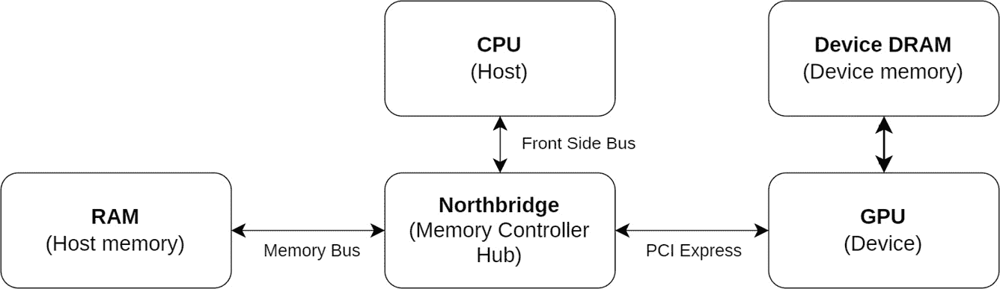

图 2.1 – 独立显卡的典型内存架构

独立显卡有自己的内存（设备内存），与主内存（主机内存）分开，如图 *图 2.2* 所示：

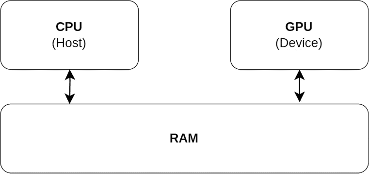

图 2.2 – 集成显卡的典型内存架构

Vulkan 提供了不同类型的内存：

+   **设备本地内存**：这种类型的内存针对 GPU 使用进行了优化，并且是设备本地的。它通常比主机可见内存要快，但不能从 CPU 访问。通常，资源如渲染目标、存储图像和缓冲区都存储在这种内存中。

+   **主机可见内存**：这种类型的内存可以从 GPU 和 CPU 访问。它通常比设备本地内存要慢，但允许在 GPU 和 CPU 之间进行高效的数据传输。在非集成 GPU 的情况下，从 GPU 到 CPU 的读取发生在**外围组件互连扩展**（**PCI-E**）通道上。它通常用于设置暂存缓冲区，其中数据在传输到设备本地内存之前被存储，以及统一缓冲区，这些缓冲区由应用程序不断更新。

+   **主机一致内存**：这种类型的内存类似于主机可见内存，但提供了 GPU 和 CPU 之间保证的内存一致性。这种类型的内存通常比设备本地和主机可见内存都要慢，但对于需要 GPU 和 CPU 频繁更新的数据存储很有用。

*图 2.3*总结了上述三种内存类型。设备本地内存对主机不可见，而主机一致和主机可见的内存是可见的。对于这两种类型的内存分配，可以使用映射内存从 CPU 到 GPU 复制数据。对于设备本地内存，有必要首先使用映射内存（暂存缓冲区）将数据从 CPU 复制到主机可见内存，然后使用 Vulkan 函数从暂存缓冲区到目标（设备本地内存）复制数据：


图 2.3 – Vulkan 中内存类型及其从应用中的可见性

图像通常是设备本地内存，因为它们有自己的布局，该布局不容易被应用程序解释。缓冲区可以是上述任何一种类型。

## 如何做…

创建并上传数据到缓冲区的典型工作流程包括以下步骤：

1.  通过使用`VkBufferCreateInfo`结构体并调用`vkCreateBuffer`来创建一个类型为`VkBuffer`的缓冲区对象。

1.  通过调用`vkGetBufferMemoryRequirements`根据缓冲区的属性检索内存需求。设备可能需要特定的对齐方式，这可能会影响分配所需的大小以容纳缓冲区的内容。

1.  创建一个类型为`VkMemoryAllocateInfo`的结构体，指定分配的大小和内存类型，并调用`vkAllocateMemory`。

1.  通过调用`vkBindBufferMemory`将分配与缓冲区对象绑定。

1.  如果缓冲区对主机可见，使用`vkMapMemory`将指针映射到目标，复制数据，然后使用`vkUnmapMemory`取消映射内存。

1.  如果缓冲区是设备本地缓冲区，首先将数据复制到阶段缓冲区，然后使用`vkCmdCopyBuffer`函数从阶段缓冲区到设备本地内存执行最终复制。

如您所见，这是一个可以通过使用 VMA 库来简化的复杂过程，VMA 库是一个开源库，它提供了一个方便且高效的方式来管理 Vulkan 中的内存。它提供了一个高级接口，抽象了内存分配的复杂细节，让您免于手动内存管理的负担。

# 实例化 VMA 库

要使用 VMA，您首先需要创建库的实例，并将句柄存储在类型为`VmaAllocator`的变量中。要创建一个实例，您需要一个 Vulkan 物理设备和设备。

## 如何操作…

创建 VMA 库实例需要实例化两个不同的结构。一个存储 VMA 需要找到的其他函数指针的 API 函数指针，另一个结构提供物理设备、设备和实例以创建分配器：

```cpp
VkPhysicalDevice physicalDevice;  // Valid Physical Device
VkDevice device; // Valid Device
VkInstance instance; // Valid Instance
const uint32_t apiVersion = VK_API_VERSION_1_3;
const VmaVulkanFunctions vulkanFunctions = {
    .vkGetInstanceProcAddr = vkGetInstanceProcAddr,
    .vkGetDeviceProcAddr = vkGetDeviceProcAddr,
#if VMA_VULKAN_VERSION >= 1003000
    .vkGetDeviceBufferMemoryRequirements =
        vkGetDeviceBufferMemoryRequirements,
    .vkGetDeviceImageMemoryRequirements =
        vkGetDeviceImageMemoryRequirements,
#endif
};
VmaAllocator allocator = nullptr;
const VmaAllocatorCreateInfo allocInfo = {
    .physicalDevice = physicalDevice,
    .device = device,
    .pVulkanFunctions = &vulkanFunctions,
    .instance = instance,
    .vulkanApiVersion = apiVersion,
};
vmaCreateAllocator(&allocInfo, &allocator);
```

分配器需要指向几个 Vulkan 函数的指针，以便它可以根据您希望使用的功能进行工作。在前面的例子中，我们只为分配和释放内存提供了最基本的内容。在上下文被销毁后，需要使用`vmaDestroyAllocator`释放分配器。

# 创建缓冲区

在 Vulkan 中，缓冲区只是一个连续的内存块，用于存储一些数据。数据可以是顶点、索引、均匀的，等等。缓冲区对象只是元数据，并不直接包含数据。与缓冲区关联的内存是在创建缓冲区之后分配的。

*表 2.1* 总结了缓冲区最重要的使用类型及其访问类型：

| **缓冲区类型** | **访问类型** | **用途** |
| --- | --- | --- |
| 顶点或索引 | 只读 |  |
| 均匀 | 只读 | 均匀数据存储 |
| 存储 | 读写 | 通用数据存储 |
| 均匀纹理 | 读写 | 数据被解释为纹理元素 |
| 存储纹理 | 读写 | 数据被解释为纹理元素 |

表 2.1 – 缓冲区类型

创建缓冲区很容易，但在开始创建它们之前了解存在哪些类型的缓冲区及其要求是有帮助的。在本章中，我们将提供一个创建缓冲区的模板。

## 准备工作

在仓库中，Vulkan 缓冲区由`VulkanCore::Buffer`类管理，该类提供了创建和上传数据到设备的功能，以及一个使用阶段缓冲区将数据上传到设备专用堆的实用函数。

## 如何操作…

使用 VMA 创建缓冲区很简单：

1.  您所需的所有内容是缓冲区创建标志（对于大多数情况，标志的值为`0`是正确的），缓冲区的大小（以字节为单位），其用途（这是您定义缓冲区如何使用的方式），并将这些值分配给`VkBufferCreateInfo`结构的实例：

    ```cpp
    VkDeviceSize size;  // The requested size of the buffer
    VmaAllocator allocator;  // valid VMA Allocator
    VkUsageBufferFlags use;  // Transfer src/dst/uniform/SSBO
    VkBuffer buffer;        // The created buffer
    VkBufferCreateInfo createInfo = {
        .sType = VK_STRUCTURE_TYPE_BUFFER_CREATE_INFO,
        .pNext = nullptr,
        .flags = {},
        .size = size,
        .usage = use,
        .sharingMode = VK_SHARING_MODE_EXCLUSIVE,
        .queueFamilyIndexCount = {},
        .pQueueFamilyIndices = {},
    };
    ```

    您还需要一组 VmaAllocationCreateFlagBits 值：

    ```cpp
    const VmaAllocationCreateFlagBits allocCreateInfo = {
        VMA_ALLOCATION_CREATE_MAPPED_BIT,
        VMA_MEMORY_USAGE_CPU_ONLY,
    };
    ```

1.  然后，调用`vmaCreateBuffer`以获取缓冲区句柄及其分配：

    ```cpp
    VmaAllocation allocation;  // Needs to live until the
                               // buffer is destroyed
    VK_CHECK(vmaCreateBuffer(allocator, &createInfo,
                             &allocCreateInfo, &buffer,
                             &allocation, nullptr));
    ```

1.  下一步是可选的，但有助于调试和优化：

    ```cpp
    VmaAllocationInfo allocationInfo;
    vmaGetAllocationInfo(allocator, allocation,
                         &allocationInfo);
    ```

一些创建标志会影响缓冲区的使用方式，因此您可能需要根据您打算在应用程序中使用的缓冲区进行调整：

# 将数据上传到缓冲区

从应用程序上传数据到 GPU 取决于缓冲区的类型。对于主机可见缓冲区，它是一个使用`memcpy`的直接复制。对于设备本地缓冲区，我们需要一个阶段缓冲区，这是一个既对 CPU 又对 GPU 可见的缓冲区。在这个配方中，我们将演示如何将数据从您的应用程序上传到设备可见内存（到设备上缓冲区的内存区域）。

## 准备工作

如果您还没有，请参考*理解 Vulkan 内存* *模型*配方。

## 如何做…

上传过程取决于缓冲区的类型：

1.  对于主机可见内存，只需使用`vmaMapMemory`检索目标指针，并使用`memcpy`复制数据即可。该操作是同步的，因此一旦`memcpy`返回，就可以取消映射映射的指针。

    在创建后立即映射主机可见缓冲区并在其销毁前保持映射是完全可以接受的。这是推荐的方法，因为您不需要每次更新内存时都映射内存的开销：

    ```cpp
    VmaAllocator allocator;   // Valid VMA allocator
    VmaAllocation allocation; // Valid VMA allocation
    void *data;               // Data to be uploaded
    size_t size;              // Size of data in bytes
    void *map = nullptr;
    VK_CHECK(vmaMapMemory(allocator, allocation,
                          &map));
    memcpy(map, data, size);
    vmaUnmapMemory(allocator_, allocation_);
    VK_CHECK(vmaFlushAllocation(allocator_,
                                allocation_, offset,
                                size));
    ```

1.  将数据上传到设备本地内存需要先（1）将其复制到一个主机可见的缓冲区（称为阶段缓冲区），然后（2）使用`vkCmdCopyBuffer`从阶段缓冲区复制到设备本地内存，如图*图 2**.4*所示。请注意，这需要一个命令缓冲区：

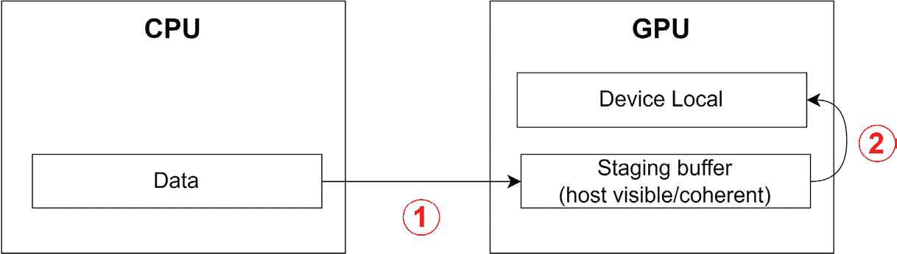

图 2.4 – 阶段缓冲区

1.  一旦数据驻留在设备上（在主机可见缓冲区上），将其复制到设备专用缓冲区就很简单了：

    ```cpp
    VkDeviceSize srcOffset;
    VkDeviceSize dstOffset;
    VkDeviceSize size;
    VkCommandBuffer commandBuffer; // Valid Command Buffer
    VkBuffer stagingBuffer; // Valid host-visible buffer
    VkBuffer buffer; // Valid device-local buffer
    VkBufferCopy region(srcOffset, dstOffset, size);
    vkCmdCopyBuffer(commandBuffer, stagingBuffer, buffer, 1, &region);
    ```

从您的应用程序到缓冲区的数据上传可以通过直接`memcpy`操作或通过阶段缓冲区完成。我们在本配方中展示了如何执行这两种上传。

# 创建阶段缓冲区

创建阶段缓冲区就像创建常规缓冲区一样，但需要指定缓冲区是主机可见的标志。在本配方中，我们将展示如何创建一个可以作为阶段缓冲区使用的缓冲区——一个可以作为从您的应用程序上传到设备本地内存的数据的中间目标。

## 准备工作

*创建缓冲区*配方解释了如何一般地创建缓冲区，而本配方展示了您需要哪些标志和参数来创建阶段缓冲区。

## 如何做…

`VkBufferCreateInfo::usage`需要包含`VK_BUFFER_USAGE_TRANSFER_SRC_BIT`，因为它将是`vkCmdCopyBuffer`命令的源操作：

```cpp
const VkBufferCreateInfo stagingBufferInfo = {
    .sType = VK_STRUCTURE_TYPE_BUFFER_CREATE_INFO,
    .size = size,
    .usage = VK_BUFFER_USAGE_TRANSFER_SRC_BIT,
};
const VmaAllocationCreateInfo
    stagingAllocationCreateInfo = {
        .flags = VMA_ALLOCATION_CREATE_HOST_ACCESS_SEQUENTIAL_WRITE_BIT |
            VMA_ALLOCATION_CREATE_MAPPED_BIT,
        .usage = VMA_MEMORY_USAGE_CPU_ONLY,
};
const VmaAllocationCreateFlagBits allocCreateInfo = {
    VMA_ALLOCATION_CREATE_MAPPED_BIT,
    VMA_MEMORY_USAGE_CPU_ONLY,
};
VmaAllocation allocation;  // Needs to live until the
                           // buffer is destroyed
VK_CHECK(vmaCreateBuffer(allocator, &stagingBufferInfo,
                         &allocCreateInfo, &buffer,
                         &allocation, nullptr));
```

可以使用应用程序中的包装器更好地实现阶段缓冲区。例如，包装器可以根据需要增加或减少缓冲区的大小。一个阶段缓冲区可能足以满足你的应用程序，但你需要关注某些架构提出的要求。

# 如何使用环形缓冲区避免数据竞争

当每个缓冲区需要每帧更新时，我们面临创建数据竞争的风险，如图*图 2.5*所示。数据竞争是一种情况，其中程序内的多个线程同时访问一个共享数据点，至少有一个线程执行写操作。这种并发访问可能会由于操作顺序不可预测而导致不可预见的行为。以一个存储视图、模型和视口矩阵并需要每帧更新的统一缓冲区为例。当第一个命令缓冲区正在记录并初始化（版本 1）时，缓冲区正在更新。一旦命令缓冲区开始在 GPU 上处理，缓冲区将包含正确的数据：


图 2.5 – 使用一个缓冲区时的数据竞争

在第一个命令缓冲区开始在 GPU 上处理之后，应用程序可能会尝试在 GPU 访问该数据用于渲染时更新缓冲区的内容到版本 2！

## 准备工作

同步无疑是 Vulkan 中最困难的部分。如果过度贪婪地使用同步元素，如信号量、栅栏和屏障，那么你的应用程序将变成一个序列，无法充分利用 CPU 和 GPU 之间的并行性。

确保你阅读了*第一章**，Vulkan 核心概念*中的*理解 swapchain 中的同步 – 栅栏和信号量*配方。这个配方和这个配方只是触及了如何处理同步的表面，但都是很好的起点。

在`EngineCore::RingBuffer`存储库中提供了一个环形缓冲区实现，它具有可配置的子缓冲区数量。其子缓冲区都是主机可见的持久缓冲区；也就是说，它们在创建后持续映射，以便于访问。

## 如何操作…

有几种方法可以避免这个问题，但最简单的一种是创建一个包含多个缓冲区（或任何其他资源）的环形缓冲区，数量等于正在飞行的帧数。*图 2.6*显示了有两个缓冲区可用的事件。一旦第一个命令缓冲区提交并在 GPU 上处理，应用程序就可以自由处理缓冲区的副本 1，因为它没有被设备访问：

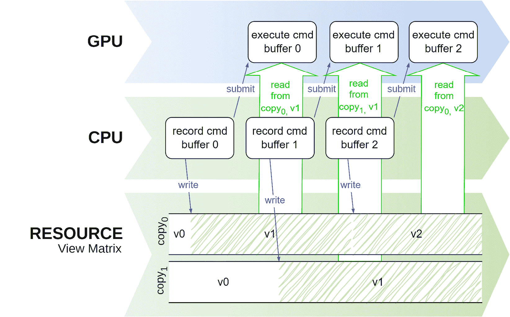

图 2.6 – 通过多个资源副本避免数据竞争

尽管这是一个简单的解决方案，但它有一个注意事项：如果允许部分更新，则在更新缓冲区时必须小心。考虑*图 2**.7*，其中包含三个子分配的环形缓冲区被部分更新。该缓冲区存储视图、模型和视口矩阵。在初始化期间，所有三个子分配都被初始化为三个单位矩阵。在`(10, 10, 0)`。在下一次帧中，**帧 1**，**缓冲区 1**变为活动状态，并且视口矩阵被更新。因为**缓冲区 1**被初始化为三个单位矩阵，只更新视口矩阵会使**缓冲区 0**和**缓冲区 1**（以及**缓冲区 3**）不同步。为了保证部分更新能够正常工作，我们需要首先将最后一个活动缓冲区**缓冲区 0**复制到**缓冲区 1**中，然后更新视口矩阵：

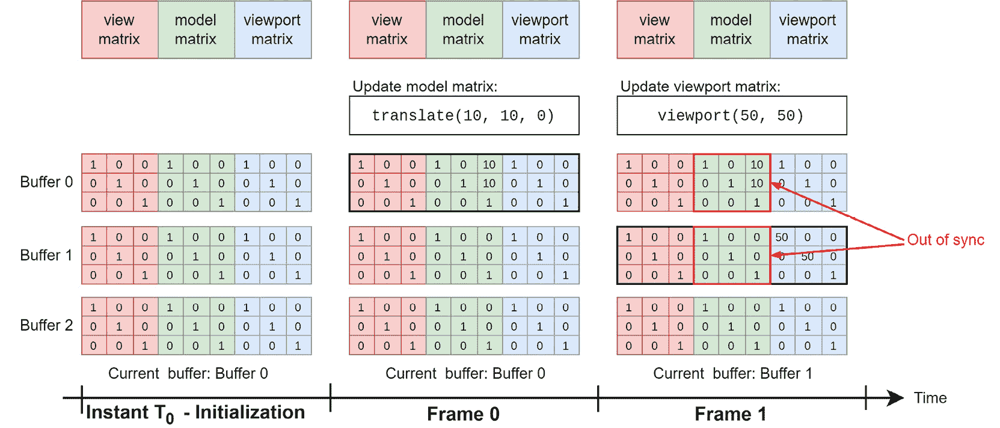

图 2.7 – 如果不复制，环形缓冲区的部分更新会使所有子分配不同步

同步是一个微妙的话题，确保您的应用程序在这么多动态部分中表现正确是棘手的。希望一个简单的环形缓冲区实现可以帮助您专注于代码的其他区域。

# 设置管道屏障

在 Vulkan 中，当命令缓冲区正在处理时，命令可能会被重新排序，但受到某些限制。这被称为命令缓冲区重新排序，它可以通过允许驱动程序优化命令执行的顺序来提高性能。

好消息是，Vulkan 提供了一个称为管道屏障的机制，以确保依赖命令按正确的顺序执行。它们用于显式指定命令之间的依赖关系，防止它们被重新排序，以及它们可能在哪些阶段重叠。本食谱将解释管道屏障是什么以及它们的属性意味着什么。它还将向您展示如何创建和安装管道屏障。

## 准备就绪

考虑连续发出的两个绘制调用。第一个调用写入一个颜色附件，而第二个绘制调用在片段着色器中从该附件采样：

```cpp
vkCmdDraw(...); // draws into color attachment 0
vkCmdDraw(...); // reads from color attachment 0
```

*图 2**.8*有助于可视化设备如何处理这两个命令。在图中，命令从上到下处理，并在管道中从左到右前进。时钟周期是一个宽泛的术语，因为处理可能需要多个时钟周期，但用来表示在一般情况下，某些任务必须在其他任务之后发生。

在示例中，第二个`vkCmdDraw`调用在**C2**处开始执行，在第一个绘制调用之后。这个偏移量不足以满足第二个绘制调用在**片段着色器**阶段读取颜色附件的需求，这需要第一个绘制调用直到达到**颜色附件输出**阶段才能生成。如果没有同步，这种设置可能会导致数据竞争：

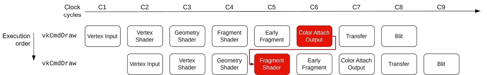

图 2.8 – 同一个命令缓冲区上记录的两个连续命令，未进行同步处理

管道屏障是一个记录到命令缓冲区中的功能，它指定了需要在屏障之前和命令缓冲区继续处理之前完成所有命令的管道阶段。在屏障之前记录的命令被称为处于*第一个同步作用域*或第一个作用域。在屏障之后记录的命令被称为是*第二个同步作用域*或第二个作用域的一部分。

该屏障还允许细粒度控制，以指定屏障之后的命令必须在哪个阶段等待，直到第一个作用域中的命令完成处理。这是因为第二个作用域中的命令不需要等待第一个作用域中的命令完成。只要满足屏障中指定的条件，它们就可以尽可能快地开始处理。

在*图 2.8*的例子中，第一个绘制调用，在第一个作用域中，需要在第二个绘制调用可以访问它之前写入附件。第二个绘制调用不需要等待第一个绘制调用完成处理**颜色附件输出**阶段。它可以立即开始，只要它的片段阶段发生在第一个绘制调用完成其**颜色附件输出**阶段之后，如*图 2.9*所示：


图 2.9 – 同一个命令缓冲区上记录的两个连续命令，带有同步处理

有三种类型的屏障：

1.  **内存屏障**是全局屏障，适用于第一个和第二个作用域中的所有命令。

1.  **缓冲区内存屏障**是仅应用于访问缓冲区一部分的命令的屏障，因为可以指定屏障应用于缓冲区的哪一部分（偏移量 + 范围）。

1.  `VK_IMAGE_LAYOUT_TRANSFER_SRC_OPTIMAL`布局，因为它将被读取，而下一个 mip 级别需要处于`VK_IMAGE_LAYOUT_TRANSFER_DST_OPTIMAL`布局，因为它将被写入。

## 如何做到这一点…

管道屏障使用`vkCmdPipelineBarrier`命令进行记录，在该命令中，你可以同时提供多种类型的多个屏障。以下代码片段显示了如何创建用于在*图 2.9*中的两个绘制调用之间创建依赖关系的屏障：

```cpp
VkCommandBuffer commandBuffer;  // Valid Command Buffer
VkImage image;                  // Valid image
const VkImageSubresourceRange subresource = {
    .aspectMask =.baseMipLevel = 0,
    .levelCount = VK_REMAINING_MIP_LEVELS,
    .baseArrayLayer = 0,
    .layerCount = 1,
};
const VkImageMemoryBarrier imageBarrier = {
    .sType = VK_STRUCTURE_TYPE_IMAGE_MEMORY_BARRIER,
    .srcAccessMask =
        VK_ACCESS_2_COLOR_ATTACHMENT_WRITE_BIT_KHR,
    .dstAccessMask = VK_ACCESS_2_SHADER_READ_BIT_KHR,
    .oldLayout = VK_IMAGE_LAYOUT_ATTACHMENT_OPTIMAL,
    .newLayout = VK_IMAGE_LAYOUT_READ_ONLY_OPTIMAL,
    .srcQueueFamilyIndex = VK_QUEUE_FAMILY_IGNORED,
    .dstQueueFamilyIndex = VK_QUEUE_FAMILY_IGNORED,
    .image = image,
    .subresourceRange = &subresource,
};
vkCmdPipelineBarrier(
    commandBuffer,
    VK_PIPELINE_STAGE_COLOR_ATTACHMENT_OUTPUT_BIT,
    VK_PIPELINE_STAGE_FRAGMENT_SHADER_BIT, 0, 0,
    nullptr, 0, nullptr, 1, &memoryBarrier);
```

需要在两个绘制调用之间记录屏障：

```cpp
vkCmdDraw(...); // draws into color attachment 0
vkCmdPipelineBarrier(...);
vkCmdDraw(...); // reads from color attachment 0
```

管道屏障在 Vulkan 中很棘手，但绝对是基础性的。在继续阅读其他食谱之前，请确保你理解它们提供了什么以及它们是如何工作的。

# 创建图像（纹理）

图像用于存储 1D、2D 或 3D 数据，尽管它们主要用于 2D 数据。与缓冲区不同，图像在内存布局中具有优化局部性的优势。这是因为大多数 GPU 都有一个固定功能的纹理单元或采样器，它从图像中读取纹理数据，并应用过滤和其他操作以产生最终的色彩值。图像可以有不同的格式，例如 RGB、RGBA、BGRA 等。

在 Vulkan 中，图像对象仅是元数据。其数据是单独存储的，并且以类似于缓冲区的方式创建（*图 2**.10*）：

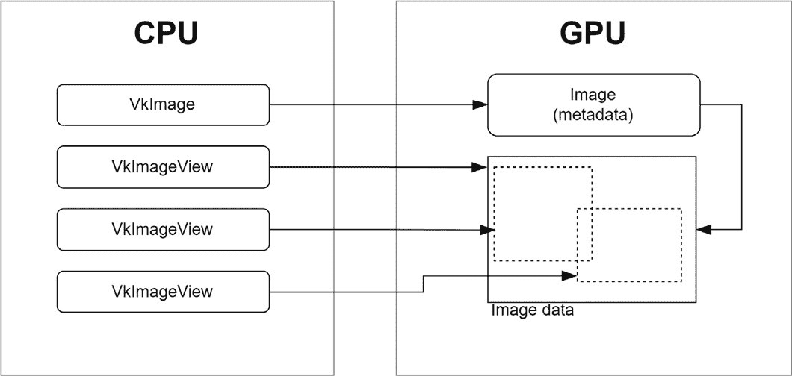

图 2.10 – 图片

Vulkan 中的图像不能直接访问，只能通过图像视图来访问。图像视图是通过指定子资源范围来访问图像数据子集的一种方式，该范围包括方面（如颜色或深度）、米柏级别和数组层范围。

图像的另一个**非常重要**的方面是它们的布局。它用于指定 Vulkan 中图像资源的预期用途，例如是否应将其用作传输操作的数据源或目标，渲染的颜色或深度附件，或作为着色器读取或写入资源。正确的图像布局非常重要，因为它确保 GPU 可以根据预期用途高效地访问和操作图像数据。使用错误的图像布局可能导致性能问题或渲染伪影，并可能导致未定义的行为。因此，在 Vulkan 应用程序中为每个图像的使用正确指定图像布局是至关重要的。常见的图像布局包括未定义（`VK_IMAGE_LAYOUT_UNDEFINED`）、颜色附件（`VK_IMAGE_LAYOUT_COLOR_ATTACHMENT_OPTIMAL`）、深度/模板附件（`VK_IMAGE_LAYOUT_DEPTH_STENCIL_ATTACHMENT_OPTIMAL`）和着色器读取（`VK_IMAGE_LAYOUT_SHADER_READ_ONLY_OPTIMAL`）。图像布局转换作为 `vkCmdPipelineBarrier` 命令的一部分进行。

在本食谱中，你将学习如何在设备上创建图像。

## 准备工作

在我们仓库中的 `VulkanCore::Texture` 类中，我们封装了图像和图像视图的复杂管理，为处理 Vulkan 纹理提供了一个全面的解决方案。从促进高效的数据上传到处理图像布局之间的转换以及生成米柏（mipmap），`Texture` 类为我们提供了在 Vulkan 示例中无缝集成纹理的手段。

## 如何操作...

创建图像需要一些关于它的基本信息，例如类型（1D、2D、3D）、大小、格式（RGBA、BGRA 等）、米柏级别数量、层数（立方体贴图的表面）、以及其他一些信息：

```cpp
VkFormat format;     // Image format
VkExtents extents;   // Image size
uint32_t mipLevels;  // Number of mip levels
uint32_t layerCount; // Number of layers (sides of cubemap)
const VkImageCreateInfo imageInfo = {
    .sType = VK_STRUCTURE_TYPE_IMAGE_CREATE_INFO,
    .flags = 0, // optional
    .imageType = VK_IMAGE_TYPE_2D,  // 1D, 2D, 3D
    .format = format,
    .extent = extents,
    .mipLevels = mipLevels,
    .arrayLayers = layerCount,
    .samples = VK_SAMPLE_COUNT_1_BIT,
    .tiling = VK_IMAGE_TILING_OPTIMAL,
    .usage = VK_IMAGE_USAGE_COLOR_ATTACHMENT_BIT,
    .sharingMode = VK_SHARING_MODE_EXCLUSIVE,
    .initialLayout = VK_IMAGE_LAYOUT_UNDEFINED,
};
```

以下结构告诉 VMA，该图像将是一个仅设备的图像：

```cpp
const VmaAllocationCreateInfo allocCreateInfo = {
    .flags = VMA_ALLOCATION_CREATE_DEDICATED_MEMORY_BIT,
    .usage = VMA_MEMORY_USAGE_AUTO_PREFER_DEVICE,
    .priority = 1.0f,
};
```

结果图像的句柄将存储在 `image` 中：

```cpp
VkImage image = VK_NULL_HANDLE;
VK_CHECK(vmaCreateImage(vmaAllocator_, &imageInfo,
                        &allocCreateInfo, &image,
                        &vmaAllocation_, nullptr));
```

下一步是可选的，但有助于调试或优化代码：

```cpp
VmaAllocationInfo allocationInfo;
vmaGetAllocationInfo(vmaAllocator_, vmaAllocation_,
                     &allocationInfo);
```

本食谱仅向您展示了如何在 Vulkan 中创建图像，但没有展示如何将其数据上传。将数据上传到图像就像上传到缓冲区一样。

# 创建图像视图

图像视图提供了一种以大小、位置和格式解释图像的方法，除了它们的布局之外，布局需要显式转换并使用图像屏障进行转换。在本食谱中，您将学习如何在 Vulkan 中创建图像视图对象。

## 准备工作

在仓库中，图像视图由 `VulkanCore::Texture` 类存储和管理。

## 如何操作…

创建图像视图很简单；您只需要该图像的句柄以及您想要表示的图像区域：

```cpp
VkDevice device;  // Valid Vulkan Device
VkImage image;    // Valid Image object
VkFormat format;
uint32_t numMipLevels;  // Number of mip levels
uint32_t layers;  // Number of layers (cubemap faces)
const VkImageViewCreateInfo imageViewInfo = {
    .sType = VK_STRUCTURE_TYPE_IMAGE_VIEW_CREATE_INFO,
    .image = image,
    .viewType =
        VK_IMAGE_VIEW_TYPE_2D,  // 1D, 2D, 3D, Cubemap
                                // and arrays
    .format = format,
    .components =
        {
            .r = VK_COMPONENT_SWIZZLE_IDENTITY,
            .g = VK_COMPONENT_SWIZZLE_IDENTITY,
            .b = VK_COMPONENT_SWIZZLE_IDENTITY,
            .a = VK_COMPONENT_SWIZZLE_IDENTITY,
        },
    .subresourceRange = {
        .aspectMask = VK_IMAGE_ASPECT_COLOR_BIT,
        .baseMipLevel = 0,
        .levelCount = numMipLevels,
        .baseArrayLayer = 0,
        .layerCount = layers,
    }};
VkImageView imageView{VK_NULL_HANDLE};
VK_CHECK(vkCreateImageView(device, &imageViewInfo,
                           nullptr, &imageView));
```

没有图像视图，着色器无法使用纹理。即使用作颜色附件，图像也需要图像视图。

# 创建采样器

Vulkan 中的采样器超越了简单对象；它是着色器执行和图像数据之间的重要桥梁。除了插值之外，它还控制过滤、寻址模式和米级映射。过滤器指定了纹理元素之间的插值，而寻址模式控制坐标如何映射到图像范围。各向异性过滤进一步增强了采样精度。米级映射，即下采样图像级别的金字塔，是采样器管理的另一个方面。本质上，创建采样器涉及协调这些属性，以无缝地协调图像数据和着色器的复杂性。在本食谱中，您将学习如何在 Vulkan 中创建采样器对象。

## 准备工作

采样器由仓库中的 `VulkanCore::Sampler` 类实现。

## 如何操作…

采样器的属性定义了图像在管道中的解释方式，通常在着色器中。过程很简单 - 实例化一个 `VkSamplerCreateInfo` 结构，并调用 `vkCreateSampler`：

```cpp
VkDevice device;  // Valid Vulkan Device
VkFilter minFilter;
VkFilter maxFilter;
float maxLod;  // Max mip level
const VkSamplerCreateInfo samplerInfo = {
    .sType = VK_STRUCTURE_TYPE_SAMPLER_CREATE_INFO,
    .magFilter = minFilter,
    .minFilter = magFilter,
    .mipmapMode = maxLod > 0
                      ? VK_SAMPLER_MIPMAP_MODE_LINEAR
                      : VK_SAMPLER_MIPMAP_MODE_NEAREST,
    .addressModeU = VK_SAMPLER_ADDRESS_MODE_REPEAT,
    .addressModeV = VK_SAMPLER_ADDRESS_MODE_REPEAT,
    .addressModeW = VK_SAMPLER_ADDRESS_MODE_REPEAT,
    .mipLodBias = 0,
    .anisotropyEnable = VK_FALSE,
    .minLod = 0,
    .maxLod = maxLod,
};
VkSampler sampler{VK_NULL_HANDLE};
VK_CHECK(vkCreateSampler(device, &samplerInfo, nullptr,
                         &sampler));
```

采样器是 Vulkan 中创建的最简单的对象之一，也是最容易理解的，因为它描述了非常常见的计算机图形概念。

# 提供着色器数据

从您的应用程序提供将在着色器中使用的数据是 Vulkan 最复杂的部分之一，需要完成多个步骤，这些步骤需要按正确的顺序（以及正确的参数）完成。在本食谱中，通过许多较小的食谱，您将学习如何提供用于着色器的数据，例如纹理、缓冲区和采样器。

## 准备工作

使用 `layout` 关键字以及 `set` 和 `binding` 限定符指定着色器消耗的资源：

```cpp
layout(set = 0, binding=0) uniform Transforms
{
    mat4 model;
    mat4 view;
    mat4 projection;
} MVP;
```

每个资源都由一个绑定表示。一组是一组绑定的集合。一个绑定不一定只代表一个资源；它也可以代表同一类型的资源数组。

## 如何操作…

将资源作为着色器的输入是一个多步骤的过程，涉及以下步骤：

1.  使用描述符集布局指定集合及其绑定。此步骤不会将实际资源与集合/绑定关联。它只是指定了集合中绑定数量和类型。

1.  构建管道布局，它描述了在管道中将使用哪些集合。

1.  创建一个描述符池，它将提供描述符集的实例。描述符池包含一个列表，列出了它可以按绑定类型（纹理、采样器、**着色器存储缓冲区（SSBO**）、统一缓冲区）提供的绑定数量。

1.  使用 `vkAllocateDescriptorSets` 从池中分配描述符集。

1.  使用 `vkUpdateDescriptorSets` 将资源绑定到绑定。在这一步中，我们将一个实际资源（一个缓冲区、一个纹理等）与一个绑定关联。

1.  在渲染期间使用 `vkCmdBindDescriptorSet` 将描述符集及其绑定绑定到管道。这一步使得在前面步骤中绑定到其集/绑定的资源对当前管道中的着色器可用。

下一个教程将展示如何执行这些步骤中的每一个。

## 使用描述符集布局指定描述符集

考虑以下 GLSL 代码，它指定了几个资源：

```cpp
struct Vertex {
    vec3 pos;
    vec2 uv;
    vec3 normal;
};
layout(set = 0, binding=0) uniform Transforms
{
    mat4 model;
    mat4 view;
    mat4 projection;
} MVP;
layout(set = 1, binding = 0) uniform texture2D textures[];
layout(set = 1, binding = 1) uniform sampler   samplers[];
layout(set = 2, binding = 0) readonly buffer VertexBuffer
{
    Vertex vertices[];
} vertexBuffer;
```

代码需要三个集合（0、1 和 2），因此我们需要创建三个描述符集布局。在本教程中，你将学习如何为前面的代码创建一个描述符集布局。

## 准备工作

描述符集和绑定由存储库中的 `VulkanCore::Pipeline` 类创建、存储和管理。在 Vulkan 中，描述符集充当一个容器，用于存储资源，如缓冲区、纹理和采样器，以便由着色器使用。绑定指的是将这些描述符集与特定着色器阶段关联起来的过程，在渲染过程中实现着色器和资源之间的无缝交互。这些描述符集作为资源无缝绑定到着色器阶段的网关，协调数据和着色器执行之间的和谐。为了促进这种协同作用，该类简化了描述符集的创建和管理，并辅以在 Vulkan 渲染管道中高效绑定资源的方法。

## 如何操作…

描述符集布局使用 `vkDescriptorSetLayout` 结构声明其绑定（数量和类型）。每个绑定使用 `vkDescriptorSetLayoutBinding` 结构的实例进行描述。创建前面代码所需的描述符集布局的 Vulkan 结构之间的关系在 *图 2**.11* 中显示：

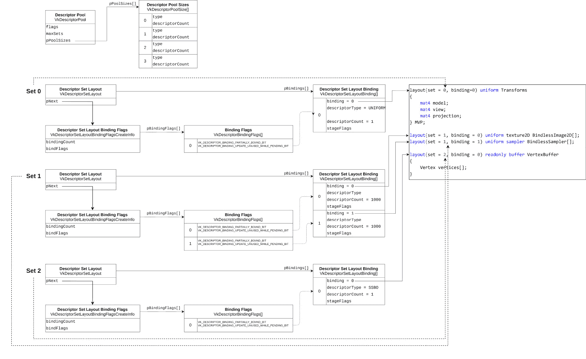

图 2.11 – 展示 GLSL 着色器的描述符集布局配置

以下代码展示了如何为集合 1 指定两个绑定，这些绑定存储在一个绑定向量中：

```cpp
constexpr uint32_t kMaxBindings = 1000;
const VkDescriptorSetLayoutBinding texBinding = {
    .binding = 0,
    .descriptorType = VK_DESCRIPTOR_TYPE_SAMPLED_IMAGE,
    .descriptorCount = kMaxBindings,
    .stageFlags = VK_SHADER_STAGE_VERTEX_BIT,
};
const VkDescriptorSetLayoutBinding samplerBinding = {
    .binding = 1,
    .descriptorType = VK_DESCRIPTOR_TYPE_SAMPLER,
    .descriptorCount = kMaxBindings,
    .stageFlags = VK_SHADER_STAGE_VERTEX_BIT,
};
struct SetDescriptor {
  uint32_t set_;
  std::vector<VkDescriptorSetLayoutBinding> bindings_;
};
std::vector<SetDescriptor> sets(1);
sets[0].set_ = 1;
sets[0].bindings_.push_back(texBinding);
sets[0].bindings_.push_back(samplerBinding);
```

由于每个绑定描述一个向量，而 `VkDescriptorSetLayoutBinding` 结构需要描述符的数量，所以我们使用了一个较大的数字，希望它能容纳数组中所有需要的元素。绑定向量存储在一个结构中，该结构描述了一个带有其编号和所有绑定的集。这个向量将用于创建描述符集布局：

```cpp
constexpr VkDescriptorBindingFlags flagsToEnable =
    VK_DESCRIPTOR_BINDING_PARTIALLY_BOUND_BIT |
    VK_DESCRIPTOR_BINDING_UPDATE_UNUSED_WHILE_PENDING_BIT;
for (size_t setIndex = 0;
     const auto& set : sets) {
  std::vector<VkDescriptorBindingFlags> bindFlags(
      set.bindings_.size(), flagsToEnable);
  const VkDescriptorSetLayoutBindingFlagsCreateInfo
      extendedInfo{
          .sType =
              VK_STRUCTURE_TYPE_DESCRIPTOR_SET_LAYOUT_BINDING_FLAGS_CREATE_INFO,
          .pNext = nullptr,
          .bindingCount = static_cast<uint32_t>(
              set.bindings_.size()),
          .pBindingFlags = bindFlags.data(),
      };
  const VkDescriptorSetLayoutCreateInfo dslci = {
      .sType =
          VK_STRUCTURE_TYPE_DESCRIPTOR_SET_LAYOUT_CREATE_INFO,
      .pNext = &extendedInfo,
      .flags =
          VK_DESCRIPTOR_SET_LAYOUT_CREATE_UPDATE_AFTER_BIND_POOL_BIT_EXT,
      .bindingCount =
          static_cast<uint32_t>(set.bindings_.size()),
      .pBindings = set.bindings_.data(),
  };
  VkDescriptorSetLayout descSetLayout{VK_NULL_HANDLE};
  VK_CHECK(vkCreateDescriptorSetLayout(
      context_->device(), &dslci, nullptr,
      &descSetLayout));
}
```

每个集合都需要自己的描述符集布局，并且前一个过程需要为每个集合重复进行。描述符集布局需要被存储起来，以便将来可以引用。

## 使用推送常量将数据传递给着色器

推送常量是向着色器传递数据的另一种方式。虽然这是一种非常高效且简单的方法，但推送常量在大小上非常有限，Vulkan 规范只保证有 128 字节。

这个菜谱将向你展示如何通过推送常量将少量数据从你的应用程序传递到着色器，用于一个简单的着色器。

## 准备工作

推送常量由`VulkanCore::Pipeline`类存储和管理。

## 如何操作…

推送常量直接记录在命令缓冲区上，并且不会受到其他资源存在的相同同步问题的困扰。它们在着色器中如下声明，每个着色器有一个最大块：

```cpp
layout (push_constant) uniform Transforms {
    mat4 model;
} PushConstants;
```

推送的数据必须分割成着色器阶段。其中一部分可以被分配到不同的着色器阶段，或者分配到单个阶段。重要的是，数据量不能超过可用于推送常量的总数量。这个限制在`VkPhysicalDeviceLimits::maxPushConstantsSize`中提供。

在使用推送常量之前，我们需要指定每个着色器阶段使用多少字节：

```cpp
const VkPushConstantRange range = {
    .stageFlags = VK_SHADER_STAGE_VERTEX_BIT,
    .offset = 0,
    .size = 64,
};
std::vector<VkPushConstantRange> pushConsts;
pushConsts.push_back(range);
```

代码表明，命令缓冲区中记录的推送常量数据的前 64 个字节（一个 4x4 浮点矩阵的大小）将被顶点着色器使用。这个结构将在下一个菜谱中用于创建管道布局对象。

## 创建管道布局

管道布局是 Vulkan 中的一个对象，需要由应用程序创建和销毁。布局是通过定义绑定和集合的结构的结构体来指定的。在这个菜谱中，你将学习如何创建管道布局。

## 准备工作

在存储库中，`VulkanCore::Pipeline`类会根据应用程序使用`VulkanCore::Pipeline::SetDescriptor`结构体提供的信息自动创建一个`VkPipelineLayoutCreateInfo`实例。

## 如何操作…

在手头有了所有集合的描述符集布局和推送常量信息后，下一步是创建管道布局：

```cpp
std::vector<VkDescriptoSetLayout> descLayouts;
const VkPipelineLayoutCreateInfo pipelineLayoutInfo = {
    .sType = VK_STRUCTURE_TYPE_PIPELINE_LAYOUT_CREATE_INFO,
    .setLayoutCount = (uint32_t)descLayouts.size(),
    .pSetLayouts = descLayouts.data(),
    .pushConstantRangeCount =
        !pushConsts.empty()
            ? static_cast<uint32_t>(pushConsts.size())
            : 0,
    .pPushConstantRanges = !pushConsts.empty()
                               ? pushConsts.data()
                               : nullptr,
};
VkPipelineLayout pipelineLayout{VK_NULL_HANDLE};
VK_CHECK(vkCreatePipelineLayout(context_->device(),
                                &pipelineLayoutInfo,
                                nullptr,
                                &pipelineLayout));
```

一旦你手头有了描述符集布局并且知道如何在你的应用程序中使用推送常量，创建管道布局就很简单了。

## 创建描述符池

描述符池包含它可以提供的最大描述符数量（从其中分配），按绑定类型分组。例如，如果同一集合的两个绑定每个都需要一个图像，描述符池就必须提供至少两个描述符。在这个菜谱中，你将学习如何创建描述符池。

## 准备工作

描述符池是在`VulkanCore::Pipeline::initDescriptorPool()`方法中分配的。

## 如何操作…

创建描述符池很简单。我们需要的只是一个绑定类型的列表和为每个类型分配的最大资源数量：

```cpp
constexpr uint32_t swapchainImages = 3;
std::vector<VkDescriptorPoolSize> poolSizes;
poolSizes.emplace_back(VkDescriptorPoolSize{
    VK_DESCRIPTOR_TYPE_SAMPLED_IMAGE,
    swapchainImages* kMaxBindings});
poolSizes.emplace_back(VkDescriptorPoolSize{
    VK_DESCRIPTOR_TYPE_SAMPLER,
    swapchainImages* kMaxBindings});
```

由于我们根据交换链图像的数量复制资源以避免 CPU 和 GPU 之间的数据竞争，我们将请求的绑定数量（`kMaxBindings = 1000`）乘以交换链图像的数量：

```cpp
const VkDescriptorPoolCreateInfo descriptorPoolInfo = {
    .sType =
        VK_STRUCTURE_TYPE_DESCRIPTOR_POOL_CREATE_INFO,
    .flags =
        VK_DESCRIPTOR_POOL_CREATE_FREE_DESCRIPTOR_SET_BIT |
        VK_DESCRIPTOR_POOL_CREATE_UPDATE_AFTER_BIND_BIT,
    .maxSets = MAX_DESCRIPTOR_SETS,
    .poolSizeCount =
        static_cast<uint32_t>(poolSizes.size()),
    .pPoolSizes = poolSizes.data(),
};
VkDescriptorPool descriptorPool{VK_NULL_HANDLE};
VK_CHECK(vkCreateDescriptorPool(context_->device(),
                                &descriptorPoolInfo,
                                nullptr,
                                &descriptorPool));
```

注意不要创建过大的池。实现高性能应用程序意味着不要分配比您需要的更多的资源。

## 分配描述符集

一旦创建了描述符布局和描述符池，在您可以使用它们之前，您需要分配一个描述符集，这是一个由描述符布局描述的布局的集合实例。在本教程中，您将学习如何分配描述符集。

## 准备工作

描述符集的分配是在 `VulkanCore::Pipeline::allocateDescriptors()` 方法中完成的。在这里，开发者定义了所需的描述符集数量，以及每个集合的绑定计数。随后的 `bindDescriptorSets()` 方法将描述符编织到命令缓冲区中，为着色器执行做准备。

## 如何做这件事...

分配描述符集（或多个描述符集）很容易。您需要填充 `VkDescriptorSetAllocateInfo` 结构并调用 `vkAllocateDescriptorSets`：

```cpp
VkDescriptorSetAllocateInfo allocInfo = {
    .sType =
        VK_STRUCTURE_TYPE_DESCRIPTOR_SET_ALLOCATE_INFO,
    .descriptorPool = descriptorPool,
    .descriptorSetCount = 1,
    .pSetLayouts = &descSetLayout,
};
VkDescriptorSet descriptorSet{VK_NULL_HANDLE};
VK_CHECK(vkAllocateDescriptorSets(context_->device(),
                                  &allocInfo,
                                  &descriptorSet));
```

当使用多个资源副本以避免竞争条件时，有两种方法：

1.  为每个资源分配一个描述符集。换句话说，为资源的每个副本调用前面的代码一次。

1.  创建一个描述符集，并在需要渲染时更新它。

## 在渲染期间更新描述符集

一旦分配了描述符集，它就不会与任何资源相关联。这种关联必须发生一次（如果您的描述符集是不可变的）或者每次您需要将不同的资源绑定到描述符集时。在本教程中，您将学习如何在渲染期间和设置管道及其布局之后更新描述符集。

## 准备工作

在存储库中，`VulkanCore::Pipeline` 提供了更新不同类型资源的方法，因为每个绑定只能与一种类型的资源（图像、采样器或缓冲区）相关联：`updateSamplersDescriptorSets()`、`updateTexturesDescriptorSets()` 和 `updateBuffersDescriptorSets()`。

## 如何做这件事...

使用 `vkUpdateDescriptorSets` 函数将资源与描述符集相关联。每个对 `vkUpdateDescriptorSets` 的调用可以更新一个或多个集合的一个或多个绑定。在更新描述符集之前，让我们看看如何更新一个绑定。

你可以将纹理、纹理数组、采样器、采样器数组、缓冲区或缓冲区数组与一个绑定关联。要关联图像或采样器，使用`VkDescriptorImageInfo`结构。要关联缓冲区，使用`VkDescriptorBufferInfo`结构。一旦实例化了一个或多个这些结构，使用`VkWriteDescriptorSet`结构将它们全部绑定到一个绑定上。表示数组的绑定使用`VkDescriptor*Info`的向量更新。

1.  考虑以下展示的着色器代码中声明的绑定：

    ```cpp
    layout(set = 1, binding = 0) uniform texture2D textures[];
    layout(set = 1, binding = 1) uniform sampler   samplers[];
    layout(set = 2, binding = 0) readonly buffer VertexBuffer
    {
      Vertex vertices[];
    } vertexBuffer;
    ```

1.  为了更新`textures[]`数组，我们需要创建两个`VkDescriptorImageInfo`实例并将它们记录在第一个`VkWriteDescriptorSet`结构中：

    ```cpp
    VkImageView imageViews[2];  // Valid Image View objects
    VkDescriptorImageInfo texInfos[] = {
     VkDescriptorImageInfo{
      .imageView = imageViews[0],
      .imageLayout = VK_IMAGE_LAYOUT_SHADER_READ_ONLY_OPTIMAL,
        },
     VkDescriptorImageInfo{
      .imageView = imageViews[1],
      .imageLayout = VK_IMAGE_LAYOUT_SHADER_READ_ONLY_OPTIMAL,
     },
    };
    const VkWriteDescriptorSet texWriteDescSet = {
        .sType = VK_STRUCTURE_TYPE_WRITE_DESCRIPTOR_SET,
        .dstSet = 1,
        ee,
        .dstArrayElement = 0,
        .descriptorCount = 2,
        .descriptorType = VK_DESCRIPTOR_TYPE_SAMPLED_IMAGE,
        .pImageInfo = &texInfos,
        .pBufferInfo = nullptr,
    };
    ```

1.  两个图像视图将被绑定到集合 1（`.dstSet = 1`）和绑定 0（`.dstBinding = 0`）作为数组的元素 0 和 1。如果你需要将更多对象绑定到数组，你只需要更多的`VkDescriptorImageInfo`实例。当前绑定中绑定的对象数量由结构的`descriptorCount`成员指定。

    对于采样器对象的过程类似：

    ```cpp
    VkSampler sampler[2];  // Valid Sampler object
    VkDescriptorImageInfo samplerInfos[] = {
        VkDescriptorImageInfo{
            .sampler = sampler[0],
        },
        VkDescriptorImageInfo{
            .sampler = sampler[1],
        },
    };
    const VkWriteDescriptorSet samplerWriteDescSet = {
        .sType = VK_STRUCTURE_TYPE_WRITE_DESCRIPTOR_SET,
        .dstSet = 1,
        .dstBinding = 1,
        .dstArrayElement = 0,
        .descriptorCount = 2,
        .descriptorType = VK_DESCRIPTOR_TYPE_SAMPLED_IMAGE,
        .pImageInfo = &samplerInfos,
        .pBufferInfo = nullptr,
    };
    ```

    这次，我们将采样器对象绑定到集合 1，绑定 1。缓冲区使用`VkDescriptorBufferInfo`结构绑定：

    ```cpp
    VkBuffer buffer;            // Valid Buffer object
    VkDeviceSize bufferLength;  // Range of the buffer
    const VkDescriptorBufferInfo bufferInfo = {
        .buffer = buffer,
        .offset = 0,
        .range = bufferLength,
    };
    const VkWriteDescriptorSet bufferWriteDescSet = {
      .sType = VK_STRUCTURE_TYPE_WRITE_DESCRIPTOR_SET,
      .dstSet = 2,
      .dstBinding = 0,
      .dstArrayElement = 0,
      .descriptorCount = 1,
      .descriptorType = VK_DESCRIPTOR_TYPE_SAMPLED_IMAGE,
      .pImageInfo = nullptr,
      .pBufferInfo = &bufferInfo,
    };
    ```

    除了将`bufferInfo`变量的地址存储到`VkWriteDescriptorSet`的`.pBufferInfo`成员外，我们还将一个缓冲区（`.descriptorCount = 1`）绑定到集合 2（`.dstSet = 2`）并将`0`（`.dstBinding = 0`）绑定。

1.  最后一步是将所有`VkWriteDescriptorSet`实例存储在一个向量中并调用`vkUpdateDescriptorSets`：

    ```cpp
    VkDevice device; // Valid Vulkan Device
    std::vector<VkWriteDescriptorSet> writeDescSets;
    writeDescSets.push_back(texWriteDescSet);
    writeDescSets.push_back(samplerWriteDescSet);
    writeDescSets.push_back(bufferWriteDescSet);
    vkUpdateDescriptorSets(device, static_cast<uint32_t>(writeDescSets.size()),
                          writeDescSets.data(), 0, nullptr);
    ```

将这项任务封装起来是避免重复和忘记更新过程中某个步骤引入的错误的最佳方式。

## 将资源传递给着色器（绑定描述符集）

在渲染过程中，我们需要绑定在绘制调用期间希望使用的描述符集。

## 准备工作

使用`VulkanCore::Pipeline::bindDescriptorSets()`方法绑定集合。

## 如何做到这一点...

为了绑定用于渲染的描述符集，我们需要调用`vkCmdBindDescriptorSets`：

```cpp
VkCommandBuffer commandBuffer;   // Valid Command Buffer
VkPipelineLayout pipelineLayout; // Valid Pipeline layout
uint32_t set;                    // Set number
VkDescriptorSet descSet;         // Valid Descriptor Set
vkCmdBindDescriptorSets(
    commandBuffer, VK_PIPELINE_BIND_POINT_GRAPHICS,
    pipelineLayout, set, 1u, &descSet, 0, nullptr);
```

现在我们已经成功绑定了用于渲染的描述符集，让我们将注意力转向图形管线另一个关键方面：更新推送常量。

## 在渲染过程中更新推送常量

在渲染过程中通过直接将它们的值记录到正在记录的命令缓冲区中来更新推送常量。

## 准备工作

使用`VulkanCore::Pipeline::updatePushConstants()`方法更新推送常量。

## 如何做到这一点...

一旦渲染完成，更新推送常量就很简单。你只需要调用`vkCmdPushConstants`：

```cpp
VkCommandBuffer commandBuffer;   // Valid Command Buffer
VkPipelineLayout pipelineLayout; // Valid Pipeline Layout
glm::vec4 mat;                   // Valid matrix
vkCmdPushConstants(commandBuffer, pipelineLayout,
                   VK_SHADER_STAGE_FRAGMENT_BIT, 0,
                   sizeof(glm::vec4), &mat);
```

这个调用将`mat`的内容记录到命令缓冲区中，从偏移量 0 开始，并指示这些数据将由顶点着色器使用。

# 使用专用常量自定义着色器行为

着色器代码编译的过程一旦完成就会变得不可变。编译过程具有相当大的时间开销，通常在运行时被规避。即使是着色器的小幅调整也需要重新编译，从而导致创建新的着色器模块，甚至可能是一个新的管道——所有这些都涉及大量的资源密集型操作。

在 Vulkan 中，特殊化常量允许你在管道创建时指定着色器参数的常量值，而不是每次更改它们时都必须重新编译着色器。当你想多次重用相同的着色器并使用不同的常量值时，这特别有用。在本食谱中，我们将深入了解 Vulkan 中特殊化常量的实际应用，以创建更高效和灵活的着色器程序，允许你在无需资源密集型重新编译的情况下进行调整。

## 准备就绪

特殊化常量可通过 `VulkanCore::Pipeline::GraphicsPipelineDescriptor` 结构在存储库中访问。你需要为每个希望应用特殊化常量的着色器类型提供一个 `VkSpecializationMapEntry` 结构的向量。

## 如何实现...

特殊化常量使用 `constant_id` 标识符和指定常量 ID 的整数在 GLSL 中声明：

```cpp
layout (VkSpecializationInfo structure that specifies the constant values and their IDs. You then pass this structure to the VkPipelineShaderStageCreateInfo structure when creating a pipeline:

```

const bool kUseShaderDebug = false;

const VkSpecializationMapEntry useShaderDebug = {

.constantID = 0, // 与 constant_id 标识符匹配

.offset = 0,

.size = sizeof(bool),

};

const VkSpecializationInfo vertexSpecializationInfo = {

.mapEntryCount = 1,

.pMapEntries = &useShaderDebug,

.dataSize = sizeof(bool),

.pData = &kUseShaderDebug,

};

const VkPipelineShaderStageCreateInfo shaderStageInfo = {

...

.pSpecializationInfo = &vertexSpecializationInfo,

};

```cpp

 Because specialization constants are real constants, branches that depend on them may be entirely removed during the final compilation of the shader. On the other hand, specialization constants should not be used to control parameters such as uniforms, as they are not as flexible and require to be known during the construction of the pipeline.
Implementing MDI and PVP
MDI and PVP are features of modern graphics APIs that allow for greater flexibility and efficiency in vertex processing.
MDI allows issuing multiple draw calls with a single command, each of which derives its parameters from a buffer stored in the device (hence the *indirect* term). This is particularly useful because those parameters can be modified in the GPU itself.
With PVP, each shader instance retrieves its vertex data based on its index and instance IDs instead of being initialized with the vertex’s attributes. This allows for flexibility because the vertex attributes and their format are not baked into the pipeline and can be changed solely based on the shader code.
In the first sub-recipe, we will focus on the implementation of **MDI**, demonstrating how this powerful tool can streamline your graphics operations by allowing multiple draw calls to be issued from a single command, with parameters that can be modified directly in the GPU. In the following sub-recipe, we will guide you through the process of setting up **PVP**, highlighting how the flexibility of this feature can enhance your shader code by enabling changes to vertex attributes without modifying the pipeline.
Implementing MDI
For using MDI, we store all mesh data belonging to the scene in one big buffer for all the meshes’ vertices and another one for the meshes’ indices, with the data for each mesh stored sequentially, as depicted in *Figure 2**.12*.
The drawing parameters are stored in an extra buffer. They must be stored sequentially, one for each mesh, although they don’t have to be provided in the same order as the meshes:
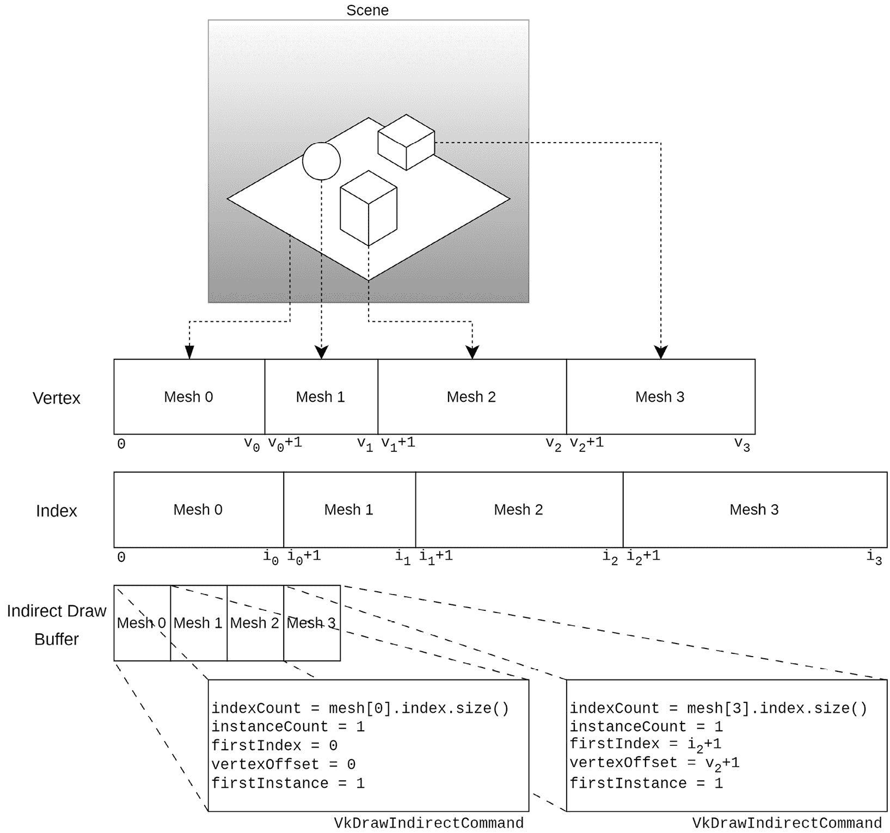

Figure 2.12 – MDI data layout
We will now learn how to implement MDI using the Vulkan API.
Getting ready
In the repository, we provide a utility function to decompose an `EngineCore::Model` object into multiple buffers suitable for an MDI implementation, called `EngineCore::convertModel2OneBuffer()`, located in `GLBLoader.cpp`.
How to do it…
Let’s begin by looking at the indirect draw parameters’ buffer.
The commands are stored following the same layout as the `VkDrawIndexedIndirectCommand` structure:

```

typedef struct VkDrawIndexedIndirectCommand {

uint32_t    indexCount;

uint32_t    instanceCount;

uint32_t    firstIndex;

int32_t     vertexOffset;

uint32_t    firstInstance;

} VkDrawIndexedIndirectCommand;

```cpp

 `indexCount` specifies how many indices are part of this command and, in our case, is the number of indices for a mesh. One command reflects one mesh, so its `instanceCount` value is one. The `firstVertex` member is the index of the first index element in the buffer to use for this mesh, while `vertexOffset` points to the first vertex element in the buffer to use. An example with the correct offsets is shown in *Figure 2**.12*.
Once the vertex, index, and indirect commands buffers are bound, calling `vkCmdDrawIndexedIndirect` consists of providing the buffer with the indirect commands and an offset into the buffer. The rest is done by the device:

```

VkCommandBuffer commandBuffer;  // 有效的命令缓冲区

VkBuffer indirectCmdBuffer;     // 有效的缓冲区

// 间接命令

uint32_t meshCount;  // 间接命令的数量

// 缓冲区

uint32_t offset = 0; // 间接命令中的偏移量

// 缓冲区

vkCmdDrawIndexedIndirect(

commandBuffer, indirectCmdBuffer, offset,

meshCount,

sizeof(VkDrawIndexedIndirectDrawCommand));

```cpp

 In this recipe, we learned how to utilize `vkCmdDrawIndexedIndirect`, a key function in Vulkan that allows for high-efficiency drawing.
Using PVP
The PVP technique allows vertex data and their attributes to be extracted from buffers with custom code instead of relying on the pipeline to provide them to vertex shaders.
Getting ready
We will use the following structures to perform the extraction of vertex data – the `Vertex` structure, which encodes the vertex’s position (`pos`), `normal`, UV coordinates (`uv`), and its material index (`material`):

```

struct Vertex {

vec3 pos;

vec3 normal;

vec2 uv;

int material;

};

```cpp

 We will also use a buffer object, referred to in the shader as `VertexBuffer`:

```

layout(set = 2, binding = 0) readonly buffer VertexBuffer

{

Vertex vertices[];

} vertexBuffer;

```cpp

 Next, we will learn how to use the `vertexBuffer` object to access vertex data.
How to do it…
The shader code used to access the vertex data looks like this:

```

void main() {

Vertex vertex = vertexBuffer.vertices[gl_VertexIndex];

}

```cpp

 Note that the vertex and its attributes are not declared as inputs to the shader. `gl_VertexIndex` is automatically computed and provided to the shader based on the draw call and the parameters recorded in the indirect command retrieved from the indirect command buffer.
Index and vertex buffers
Note that both the index and vertex buffers are still provided and bound to the pipeline before the draw call is issued. The index buffer must have the `VK_BUFFER_USAGE_INDEX_BUFFER_BIT` flag enabled for the technique to work.
Adding flexibility to the rendering pipeline using dynamic rendering
In this recipe, we will delve into the practical application of dynamic rendering in Vulkan to enhance the flexibility of the rendering pipeline. We will guide you through the process of creating pipelines without the need for render passes and framebuffers and discuss how to ensure synchronization. By the end of this section, you will have learned how to implement this feature in your projects, thereby simplifying your rendering process by eliminating the need for render passes and framebuffers and giving you more direct control over synchronization.
Getting ready
To enable the feature, we must have access to the `VK_KHR_get_physical_device_properties2` instance extension, instantiate a structure of type `VkPhysicalDeviceDynamicRenderingFeatures`, and set its `dynamicRendering` member to `true`:

```

const VkPhysicalDeviceDynamicRenderingFeatures dynamicRenderingFeatures = {

.sType = VK_STRUCTURE_TYPE_PHYSICAL_DEVICE_DYNAMIC_RENDERING_FEATURES,

.dynamicRendering = VK_TRUE,

};

```cpp

 This structure needs to be plugged into the `VkDeviceCreateInfo::pNext` member when creating a Vulkan device:

```

const VkDeviceCreateInfo dci = {

.sType = VK_STRUCTURE_TYPE_DEVICE_CREATE_INFO,

.pNext = &dynamicRenderingFeatures,

...

};

```cpp

 Having grasped the concept of enabling dynamic rendering, we will now move forward and explore its implementation using the Vulkan API.
How to do it…
Instead of creating render passes and framebuffers, we must call the `vkCmdBeginRendering` command and provide the attachments and their load and store operations using the `VkRenderingInfo` structure. Each attachment (colors, depth, and stencil) must be specified with instances of the `VkRenderingAttachmentInfo` structure. *Figure 2**.13* presents a diagram of the structure participating in a call to `vkCmdBeginRendering`:
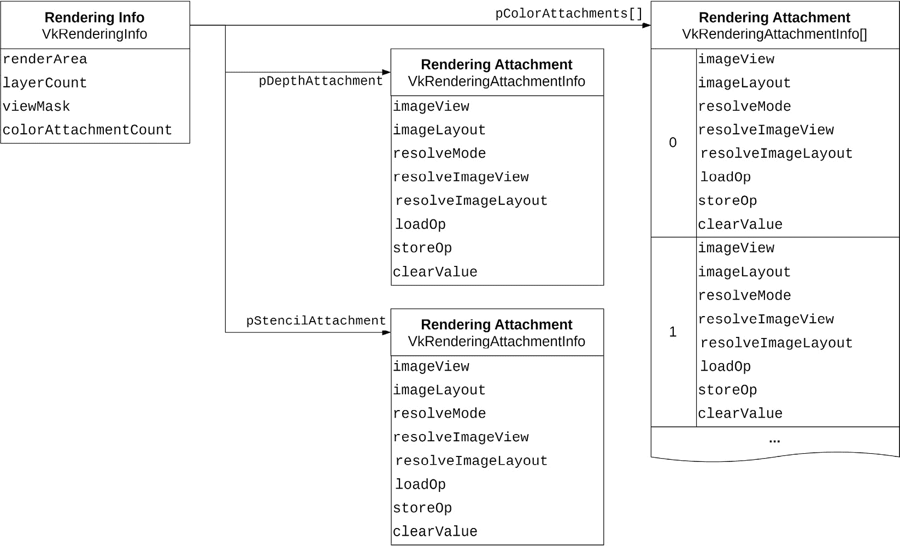

Figure 2.13 – Dynamic rendering structure diagram
Any one of the attachments, `pColorAttachments`, `pDepthAttachment`, and `pStencilAttachment`, can be `null`. Shader output written to location `x` is written to the color attachment at `pColorAttachment[x]`.
Transferring resources between queue families
In this recipe, we will demonstrate how to transfer resources between queue families by uploading textures to a device from the CPU using a transfer queue and generating mip-level data in a graphics queue. Generating mip levels needs a graphics queue because it utilizes `vkCmdBlitImage`, supported only by graphics queues.
Getting ready
An example is provided in the repository in `chapter2/mainMultiDrawIndirect.cpp`, which uses the `EngineCore::AsyncDataUploader` class to perform texture upload and mipmap generation on different queues.
How to do it…
In the following diagram, we illustrate the procedure of uploading texture through a transfer queue, followed by the utilization of a graphics queue for mip generation:
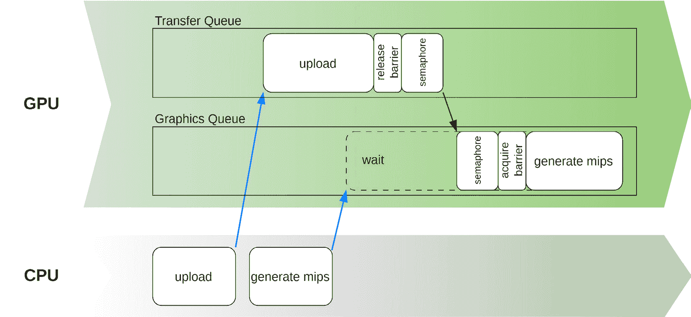

Figure 2.14 – Recoding and submitting commands from different threads and transferring a resource between queues from different families
The process can be summarized as follows:

1.  Record the commands to upload the texture to the device and add a barrier to release the texture from the transfer queue using the `VkDependencyInfo` and `VkImageMemoryBarrier2` structures, specifying the source queue family as the family of the transfer queue and the destination queue family as the family of the graphics queue.
2.  Create a semaphore and use it to signal when the command buffer finishes, and attach it to the submission of the command buffer.
3.  Create a command buffer for generating mip levels and add a barrier to acquire the texture from the transfer queue into the graphics queue using the `VkDependencyInfo` and `VkImageMemoryBarrier2` structures.
4.  Attach the semaphore created in *step 2* to the `SubmitInfo` structure when submitting the command buffer for processing. The semaphore will be signaled when the first command buffer has completed, allowing the mip-level-generation command buffer to start.

    Two auxiliary methods will help us create acquire and release barriers for a texture. They exist in the `VulkanCore::Texture` class. The first one creates an acquire barrier:

    ```

    void Texture::addAcquireBarrier(

    VkCommandBuffer cmdBuffer,

    uint32_t srcQueueFamilyIndex,

    uint32_t dstQueueFamilyIndex) {

    VkImageMemoryBarrier2 acquireBarrier = {

    .sType = VK_STRUCTURE_TYPE_IMAGE_MEMORY_BARRIER_2,

    .dstStageMask =

    VK_PIPELINE_STAGE_2_FRAGMENT_SHADER_BIT,

    .dstAccessMask = VK_ACCESS_2_MEMORY_READ_BIT,

    .srcQueueFamilyIndex = srcQueueFamilyIndex,

    .dstQueueFamilyIndex = dstQueueFamilyIndex,

    .image = image_,

    .subresourceRange = {VK_IMAGE_ASPECT_COLOR_BIT,

    0, mipLevels_, 0, 1},

    };

    VkDependencyInfo dependency_info{

    .sType = VK_STRUCTURE_TYPE_DEPENDENCY_INFO,

    .imageMemoryBarrierCount = 1,

    .pImageMemoryBarriers = &acquireBarrier,

    };

    vkCmdPipelineBarrier2(cmdBuffer, &dependency_info);

    }

    ```cpp

    Besides the command buffer, this function requires the indices of the source and destination family queues. It also assumes a few things, such as the subresource range spanning the entire image.

     5.  Another method records the release barrier:

    ```

    void Texture::addReleaseBarrier(

    VkCommandBuffer cmdBuffer,

    uint32_t srcQueueFamilyIndex,

    uint32_t dstQueueFamilyIndex) {

    VkImageMemoryBarrier2 releaseBarrier = {

    .sType = VK_STRUCTURE_TYPE_IMAGE_MEMORY_BARRIER_2,

    .srcStageMask = VK_PIPELINE_STAGE_2_TRANSFER_BIT,

    .srcAccessMask = VK_ACCESS_TRANSFER_WRITE_BIT,

    .dstAccessMask = VK_ACCESS_SHADER_READ_BIT,

    .srcQueueFamilyIndex = srcQueueFamilyIndex,

    .dstQueueFamilyIndex = dstQueueFamilyIndex,

    .image = image_,

    .subresourceRange = {VK_IMAGE_ASPECT_COLOR_BIT,

    0, mipLevels_, 0, 1},

    };

    VkDependencyInfo dependency_info{

    .sType = VK_STRUCTURE_TYPE_DEPENDENCY_INFO,

    .imageMemoryBarrierCount = 1,

    .pImageMemoryBarriers = &releaseBarrier,

    };

    vkCmdPipelineBarrier2(cmdBuffer, &dependency_info);

    }

    ```cpp

    This method makes the same assumptions as the previous one. The main differences are the source and destination stages and access masks.

     6.  To perform the upload and mipmap generation, we create two instances of `VulkanCore::CommandQueueManager`, one for the transfer queue and another for the graphics queue:

    ```

    auto transferQueueMgr =

    context.createTransferCommandQueue(

    1, 1, "transfer queue");

    auto graphicsQueueMgr =

    context.createGraphicsCommandQueue(

    1, 1, "graphics queue");

    ```cpp

     7.  With valid `VulkanCore::Context` and `VulkanCore::Texture` instances in hand, we can upload the texture by retrieving a command buffer from the transfer family. We also create a staging buffer for transferring the texture data to device-local memory:

    ```

    VulkanCore::Context context;  // Valid Context

    std::shared_ptr<VulkanCore::Texture>

    texture;        // Valid Texture

    void* textureData;  // Valid texture data

    // Upload texture

    auto textureUploadStagingBuffer =

    context.createStagingBuffer(

    texture->vkDeviceSize(),

    VK_BUFFER_USAGE_TRANSFER_SRC_BIT,

    "texture upload staging buffer");

    const auto commandBuffer =

    transferQueueMgr.getCmdBufferToBegin();

    texture->uploadOnly(commandBuffer,

    textureUploadStagingBuffer.get(),

    textureData);

    texture->addReleaseBarrier(

    commandBuffer,

    transferQueueMgr.queueFamilyIndex(),

    graphicsQueueMgr.queueFamilyIndex());

    transferQueueMgr.endCmdBuffer(commandBuffer);

    transferQueueMgr.disposeWhenSubmitCompletes(

    std::move(textureUploadStagingBuffer));

    ```cpp

     8.  For submitting the command buffer for processing, we create a semaphore to synchronize the upload command buffer and the one used for generating mipmaps:

    ```

    VkSemaphore graphicsSemaphore;

    const VkSemaphoreCreateInfo semaphoreInfo{

    .sType = VK_STRUCTURE_TYPE_SEMAPHORE_CREATE_INFO,

    };

    VK_CHECK(vkCreateSemaphore(context.device(),

    &semaphoreInfo, nullptr,

    &graphicsSemaphore));

    VkPipelineStageFlags flags =

    VK_PIPELINE_STAGE_TRANSFER_BIT;

    auto submitInfo =

    context.swapchain()->createSubmitInfo(

    &commandBuffer, &flags, false, false);

    submitInfo.signalSemaphoreCount = 1;

    submitInfo.pSignalSemaphores = &graphicsSemaphore;

    transferQueueMgr.submit(&submitInfo);

    ```cpp

     9.  The next step is to acquire a new command buffer from the graphics queue family for generating mipmaps. We also create an acquire barrier and reuse the semaphore from the previous command buffer submission:

    ```

    // Generate mip levels

    auto commandBuffer =

    graphicsQueueMgr.getCmdBufferToBegin();

    texture->addAcquireBarrier(

    commandBuffer,

    transferCommandQueueMgr_.queueFamilyIndex(),

    graphicsQueueMgr.queueFamilyIndex());

    texture->generateMips(commandBuffer);

    graphicsQueueMgr.endCmdBuffer(commandBuffer);

    VkPipelineStageFlags flags =

    VK_PIPELINE_STAGE_COLOR_ATTACHMENT_OUTPUT_BIT;

    auto submitInfo =

    context_.swapchain()->createSubmitInfo(

    &commandBuffer, &flags, false, false);

    submitInfo.pWaitSemaphores = &graphicsSemaphore;

    submitInfo.waitSemaphoreCount = 1;

    ```cpp

In this chapter, we have navigated the complex landscape of advanced Vulkan programming, building upon the foundational concepts introduced earlier. Our journey encompassed a diverse range of topics, each contributing crucial insights to the realm of high-performance graphics applications. From mastering Vulkan’s intricate memory model and efficient allocation techniques to harnessing the power of the VMA library, we’ve equipped ourselves with the tools to optimize memory management. We explored the creation and manipulation of buffers and images, uncovering strategies for seamless data uploads, staging buffers, and ring-buffer implementations that circumvent data races. The utilization of pipeline barriers to synchronize data access was demystified, while techniques for rendering pipelines, shader customization via specialization constants, and cutting-edge rendering methodologies such as PVP and MDI were embraced. Additionally, we ventured into dynamic rendering approaches without relying on render passes and addressed the intricacies of resource handling across multiple threads and queues. With these profound understandings, you are primed to create graphics applications that harmonize technical prowess with artistic vision using the Vulkan API.

```
