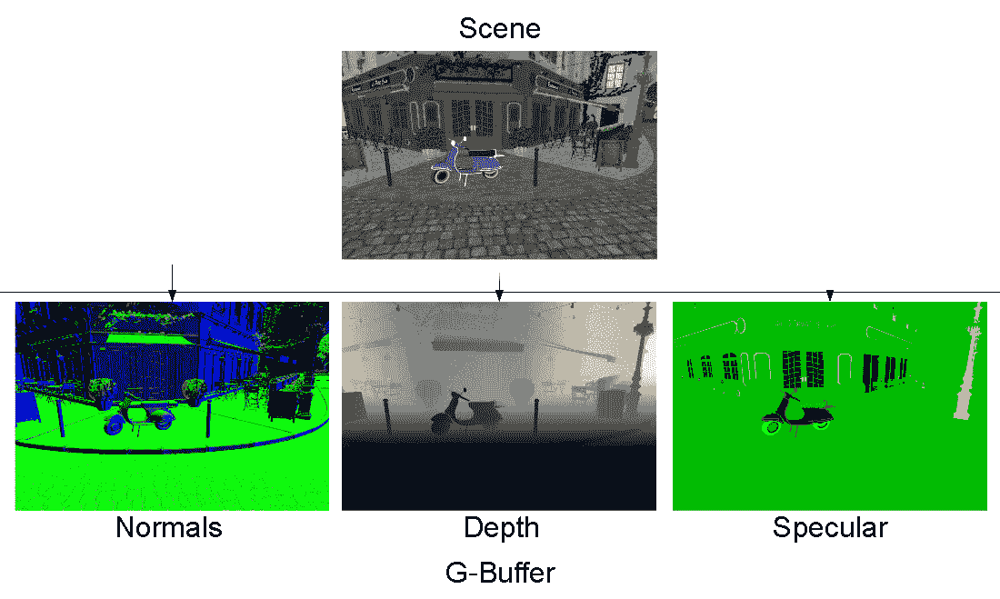
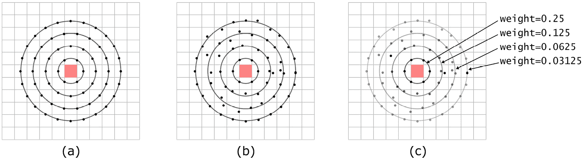
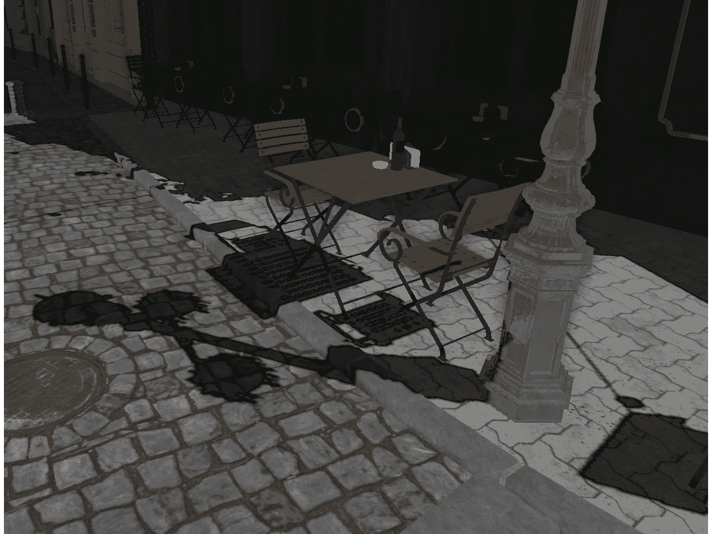
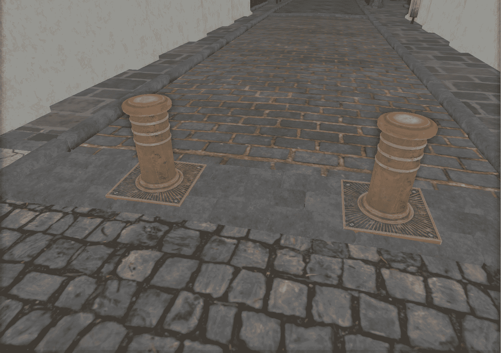

# 第四章：探索照明、阴影和阴影技术

欢迎探索旨在为您的场景注入现实感的照明和阴影技术。在图形领域，照明和阴影在增强 3D 视觉的美感和现实感方面发挥着至关重要的作用。本章深入探讨这些主题，展示了从基础到复杂的各种算法，这些算法可以增加场景的现实感。在本章中，我们将涵盖以下内容：

+   实现用于延迟渲染的 G 缓冲区

+   实现屏幕空间反射

+   实现用于实时阴影的阴影贴图

+   实现屏幕空间环境遮挡

+   实现照明通道以照亮场景

到本章结束时，您将对这些技术有全面的了解，这将使您能够熟练地将它们应用于渲染项目中。

# 技术要求

对于本章，您需要确保已安装 VS 2022 以及 Vulkan SDK。对 C++编程语言的基本了解以及 OpenGL 或任何其他图形 API 的理解将很有用。请查阅“*技术要求*”部分下的*第一章**，Vulkan 核心概念*，以获取有关设置和构建本章可执行文件的详细信息。我们还假设您现在已经熟悉了如何使用 Vulkan API 以及前几章中介绍的各种概念。本章的所有配方都封装在一个单独的可执行文件中，可以使用`Chapter04_Deferred_Renderer.exe`可执行文件启动。

# 实现用于延迟渲染的 G 缓冲区

**延迟渲染**是一种在场景渲染开始时添加一个额外渲染通道的技术，该通道在屏幕空间中累积有关场景的各种信息，例如位置、表面法线、表面颜色等。这些额外信息存储在称为**几何缓冲区**（**G 缓冲区**）的缓冲区中，其中每个在此步骤中计算出的值都存储在每个像素中。一旦这个初始通道完成，就可以进行最终的场景渲染，并且可以使用额外的信息（如反射、环境遮挡、大气效果等）来提高渲染质量。使用延迟渲染的好处是它提供了更有效地处理具有许多灯光的复杂场景的方法，因为每个灯光只需对每个像素计算一次，而不是对每个对象计算一次。我们本质上解耦了几何和阴影，这允许在渲染管道中具有更大的灵活性。这项技术也有一些缺点，例如增加了内存使用（对于 G 缓冲区本身），以及处理透明度和抗锯齿的难度。

在本教程中，您将了解延迟渲染的 G 缓冲区实现，了解其在管理具有多个光源的复杂场景中的优势，以及它可能带来的挑战，例如内存使用增加。

## 准备工作

在 Vulkan 中创建 G 缓冲区相对直接。这项技术的主体依赖于创建一个包含所有将存储场景信息（如位置、法线和材质数据）的渲染目标的引用的帧缓冲区。渲染通道还需要规定这些渲染目标在通道结束时应该如何加载和存储。最后，在片段着色器中，每个渲染目标被指定为一个输出变量，每个渲染目标的值被写入到指向正确纹理或存储缓冲区的输出。



图 4.1 – G 缓冲区纹理

在存储库中，G 缓冲区的生成被封装在`GBufferPass`类中。

## 如何做到这一点...

要生成 G 缓冲区和其衍生物，我们首先需要创建一个帧缓冲区和相应的`RenderPass`。在以下步骤中，我们将向您展示如何为材质的基本颜色、法线和深度组件创建目标：

1.  在创建帧缓冲区对象之前，有必要创建将存储 G 缓冲区通道输出的纹理（渲染目标）：

    ```cpp
    gBufferBaseColorTexture_ = context->createTexture(
        VK_IMAGE_TYPE_2D, VK_FORMAT_R8G8B8A8_UNORM, 0,
        VK_IMAGE_USAGE_COLOR_ATTACHMENT_BIT |
            VK_IMAGE_USAGE_SAMPLED_BIT |
            VK_IMAGE_USAGE_STORAGE_BIT,…
    gBufferNormalTexture_ = context->createTexture(
        VK_IMAGE_TYPE_2D,
        VK_FORMAT_R16G16B16A16_SFLOAT, 0,
        VK_IMAGE_USAGE_COLOR_ATTACHMENT_BIT |
            VK_IMAGE_USAGE_SAMPLED_BIT |
            VK_IMAGE_USAGE_STORAGE_BIT,…
    gBufferPositionTexture_ = context->createTexture(
          VK_IMAGE_TYPE_2D, VK_FORMAT_R16G16B16A16_SFLOAT, 0,
          VK_IMAGE_USAGE_COLOR_ATTACHMENT_BIT | VK_IMAGE_USAGE_SAMPLED_BIT | VK_IMAGE_USAGE_STORAGE_BIT,…
    depthTexture_ = context->createTexture(
        VK_IMAGE_TYPE_2D, VK_FORMAT_D24_UNORM_S8_UINT,
        0,
        VK_IMAGE_USAGE_DEPTH_STENCIL_ATTACHMENT_BIT |
            VK_IMAGE_USAGE_TRANSFER_DST_BIT |
            VK_IMAGE_USAGE_SAMPLED_BIT,…
    ```

1.  `Framebuffer`对象引用了前面的目标。这里的顺序很重要，并且应该在指定输出的着色器中镜像：

    ```cpp
    frameBuffer_ = context->createFramebuffer(
          renderPass_->vkRenderPass(),
          {gBufferBaseColorTexture_, gBufferNormalTexture_, gBufferEmissiveTexture_,
           gBufferSpecularTexture_, gBufferPositionTexture_, depthTexture_},
          nullptr, nullptr, "GBuffer framebuffer ");
    ```

1.  `RenderPass`对象描述了每个渲染目标应该如何加载和存储。操作顺序应与帧缓冲区使用的目标顺序相匹配：

    ```cpp
    renderPass_ = context->createRenderPass(
          {gBufferBaseColorTexture_, gBufferNormalTexture_, gBufferEmissiveTexture_,
           gBufferSpecularTexture_, gBufferPositionTexture_, depthTexture_},
          {VK_ATTACHMENT_LOAD_OP_CLEAR, VK_ATTACHMENT_LOAD_OP_CLEAR,
           VK_ATTACHMENT_LOAD_OP_CLEAR, VK_ATTACHMENT_LOAD_OP_CLEAR,
           VK_ATTACHMENT_LOAD_OP_CLEAR, VK_ATTACHMENT_LOAD_OP_CLEAR},
          {VK_ATTACHMENT_STORE_OP_STORE, VK_ATTACHMENT_STORE_OP_STORE,
           VK_ATTACHMENT_STORE_OP_STORE, VK_ATTACHMENT_STORE_OP_STORE,
           VK_ATTACHMENT_STORE_OP_STORE, VK_ATTACHMENT_STORE_OP_STORE},
          // final layout for all attachments
          {VK_IMAGE_LAYOUT_SHADER_READ_ONLY_OPTIMAL, VK_IMAGE_LAYOUT_SHADER_READ_ONLY_OPTIMAL,
           VK_IMAGE_LAYOUT_SHADER_READ_ONLY_OPTIMAL, VK_IMAGE_LAYOUT_SHADER_READ_ONLY_OPTIMAL,
           VK_IMAGE_LAYOUT_SHADER_READ_ONLY_OPTIMAL,
           VK_IMAGE_LAYOUT_SHADER_READ_ONLY_OPTIMAL},
          VK_PIPELINE_BIND_POINT_GRAPHICS, "GBuffer RenderPass");
    ```

1.  在片段着色器中，除了来自管道中先前阶段的输入数据外，输出数据通过布局关键字和位置限定符被定向到每个目标。位置索引必须在帧缓冲区上与渲染目标索引匹配：

    ```cpp
    layout(location=0) in vec2 inTexCoord;
    layout(location=1) in flat uint inflatMeshId;
    layout(location=2) in flat int inflatMaterialId;
    layout(location=3) in vec3 inNormal;
    layout(location=4) in vec4 inTangent;
    layout(location = 0) out vec4 outgBufferBaseColor;
    layout(location = 1) out vec4 outgBufferWorldNormal;
    layout(location = 2) out vec4 outgBufferEmissive;
    layout(location = 3) out vec4 outgBufferSpecular;
    layout(location = 4) out vec4 outgBufferPosition;
    const vec3 n = normalize(inNormal);
    const vec3 t = normalize(inTangent.xyz);
    const vec3 b = normalize(cross(n,t) * inTangent.w);
    const mat3 tbn =  mat3(t, b, n);
    outgBufferWorldNormal.rgb = normalize(tbn * normalize(normalTan));
    ```

在前面的代码片段中，基于法线和切线值计算出的世界法线被存储在`outgBufferWorldNormal`位置，这对应于索引为`1`的附件（参见*步骤 2*中的代码片段）。

# 实现屏幕空间反射

物理正确的反射涉及追踪光线在表面反弹时的路径。这个过程考虑了场景中的几何形状、材料属性、光源以及视角角度。然而，这是一个计算量非常大的过程，通常对实时渲染来说要求过高，尤其是在复杂场景或较弱的硬件上。为了在视觉效果和性能之间取得平衡，可以使用一种称为**屏幕空间反射**（**SSR**）的近似技术。SSR 是一种通过重用已经渲染到屏幕上的数据来近似反射的方法。通过利用屏幕空间变体，可以显著减少与物理正确反射相关的沉重计算成本，使其成为实时渲染的可行技术。在本教程中，我们将解释如何使用来自上一节中得到的缓冲区（如法线缓冲区和深度缓冲区）来计算反射。

## 准备工作

SSR 使用深度缓冲区来找到反射光线与几何形状深度的交点。反射光线基于表面法线和视图方向在世界空间中计算，并以小增量前进，直到它离开屏幕边界。对于每一步，将光线的位置投影到屏幕上，并将其坐标与深度缓冲区进行比较。如果光线位置与深度缓冲区深度的差异小于一个小阈值，则光线与某些几何形状发生了碰撞，并且表面上的光线起源点被遮挡。然后使用这个反射向量查找在已渲染图像中反射位置像素的颜色。然后使用这个颜色作为反射颜色，创造出反射的错觉。SSR 可以产生视觉上令人愉悦的反射，接近那些由计算成本更高的物理正确反射模型产生的反射；然而，它只能反射屏幕上已经可见的内容，并且对于复杂表面或屏幕边缘可能产生不准确的结果。

## 如何操作...

一旦计算出了深度和法线缓冲区，SSR 就可以在渲染或计算通道中轻松计算：

1.  以下 SSR 代码由计算通道使用，指定了作为输入使用的缓冲区，这些缓冲区是由延迟渲染步骤生成的，以及它需要执行屏幕空间交点的转换数据：

    ```cpp
    layout(set = 0, binding = 0, rgba16f) uniform image2D SSRIntersect;
    layout(set = 1, binding = 0)uniform sampler2D gBufferWorldNormal;
    layout(set = 1, binding = 1)uniform sampler2D gBufferSpecular;
    layout(set = 1, binding = 2)uniform sampler2D gBufferBaseColor;
    layout(set = 1, binding = 3)uniform sampler2D hierarchicalDepth;
    layout(set = 2, binding = 0)uniform Transforms
    {
      mat4 model;
      mat4 view;
      mat4 projection;
      mat4 projectionInv;
      mat4 viewInv;
    } cameraData;
    ```

1.  在着色器中定义了两个辅助函数。它们将世界空间中的一个点投影到屏幕空间，并计算从屏幕空间（包括深度坐标）到世界空间的投影：

    ```cpp
    vec3 generatePositionFromDepth(vec2 texturePos, float depth);
    vec2 generateProjectedPosition(vec3 worldPos);
    ```

1.  在此步骤中，从 G 缓冲区获取反射计算所需的数据。这包括当前像素的世界法线、镜面数据和基础颜色。计算 UV 坐标，这些坐标用于从 G 缓冲区采样基础颜色。粗糙度，它控制反射的模糊或清晰程度，也从中提取镜面数据。我们还从 G 缓冲区的镜面数据中检查金属度值。如果材料不是金属的（`金属度 < 0.01`），它假定它不会反射，并将基础颜色简单地写入结果并退出：

    ```cpp
    layout(local_size_x = 16, local_size_y = 16,
           local_size_z = 1) in;
    void main() {
      // Return if the coordinate is outside the screen
      ...
      imageStore(SSRIntersect,
                 ivec2(gl_GlobalInvocationID.xy),
                 vec4(0));
      vec2 uv = (vec2(gl_GlobalInvocationID.xy) +
                 vec2(0.5f)) /
                vec2(pushConstant.textureResolution);
      ivec2 pixelPos = ivec2(gl_GlobalInvocationID.xy);
      vec4 gbufferNormalData =
          texelFetch(gBufferWorldNormal, pixelPos, 0);
      vec4 gbufferSpecularData =
          texelFetch(gBufferSpecular, pixelPos, 0);
      vec3 basecolor =
          texture(gBufferBaseColor, uv).xyz;
      float roughness = gbufferSpecularData.g;
      if (gbufferSpecularData.r <
          .01) { // Metal-ness check
        imageStore(SSRIntersect,
                   ivec2(gl_GlobalInvocationID.xy),
                   vec4(basecolor, 1.0));
        return;
      }
    ```

1.  以下代码片段从深度缓冲区获取当前像素的深度，并使用 UV 和深度生成像素的世界位置。从相机位置到像素的世界位置计算视图方向。然后使用视图方向和法线计算反射方向。着色器然后在屏幕空间中沿着反射方向进行光线追踪。它沿着反射光线步进，并在每个步骤中检查光线是否与任何几何体相交，基于光线当前位置的深度与相应屏幕位置的深度之间的差异：

    ```cpp
      float z =
          texelFetch(hierarchicalDepth, pixelPos, 0).r;
      vec3 position = generatePositionFromDepth(uv, z);
      vec3 normal = normalize(gbufferNormalData.xyz);
      vec3 camPos = cameraData.viewInv[3].xyz;
      vec3 viewDirection = normalize(position - camPos);
      vec3 reflectionDirection =
          reflect(viewDirection, normal);
    ;
      float stepSize = 0.05; // Initial step size
      vec3 currentPos = position;
      for (int i = 0; i < 50; i++) {
        currentPos += reflectionDirection * stepSize;
        vec2 screenPos =
            generateProjectedPosition(currentPos);
        if (screenPos.x < 0.0 || screenPos.x > 1.0 ||
            screenPos.y < 0.0 || screenPos.y > 1.0) {
          break; // Ray went out of screen bounds
        }
        float depthAtCurrent =
            texture(hierarchicalDepth, screenPos).r;
        vec3 positionFromDepth =
            generatePositionFromDepth(screenPos,
                                      depthAtCurrent);
        float depthDifference =
            length(currentPos - positionFromDepth);
    ```

1.  如果找到交点，代码将获取交点的颜色并将其与基础颜色混合。混合基于粗糙度值，它代表交点处的表面特性：

    ```cpp
        if (depthDifference < 0.05) {
          vec3 hitColor =
              texture(gBufferBaseColor, screenPos).xyz;
          if (hitColor.x <= .1 && hitColor.y <= .1 &&
              hitColor.z <= .1 && hitColor.x >= .08 &&
              hitColor.y >= .08 &&
              hitColor.z >=
                  .08) { // .1 is considered sky color,
                         // ignore if we hit sky
            hitColor = basecolor;
          }
          vec3 blendColor =
              hitColor * (1.0 - roughness) +
              roughness * basecolor;
          imageStore(SSRIntersect,
                     ivec2(gl_GlobalInvocationID.xy),
                     vec4(blendColor, 1.0));
          return;
        }
      }
      // Fallback
      imageStore(SSRIntersect,
                 ivec2(gl_GlobalInvocationID.xy),
                 vec4(basecolor, 1.0));
    }
    ```

在前面的代码中，我们学习了如何使用深度和法线缓冲区计算 SSR。

## 参见

以下是一些关于如何实现 SSR（屏幕空间反射）的更详细参考；我们建议您阅读这些参考以获得更深入的理解：

+   [`interplayoflight.wordpress.com/2022/09/28/notes-on-screenspace-reflections-with-fidelityfx-sssr/`](https://interplayoflight.wordpress.com/2022/09/28/notes-on-screenspace-reflections-with-fidelityfx-sssr/)

+   [`roar11.com/2015/07/screen-space-glossy-reflections/`](http://roar11.com/2015/07/screen-space-glossy-reflections/)

+   [`interplayoflight.wordpress.com/2019/09/07/hybrid-screen-space-reflections/`](https://interplayoflight.wordpress.com/2019/09/07/hybrid-screen-space-reflections/)

# 实现实时阴影的阴影图实现

如其名所示，**阴影图**用于模拟阴影。阴影映射的目标是通过首先从光源的视角渲染场景，生成深度图，来确定场景中哪些部分处于阴影中，哪些部分被光源照亮。

此深度图（也称为阴影图）充当空间记录，存储场景中任意点到光源的最短距离。通过从光源的视角封装场景，深度图有效地捕捉了场景中直接可见于光源的区域以及被遮挡的区域。

然后，在主渲染通道中使用这个深度图来确定片段是否无法从光源到达，通过比较其深度值与深度图中的值。对于场景中的每个片段，我们执行一个测试来评估它是否位于阴影中。这是通过比较从光源处得到的片段深度值，该值是从主摄像机的视角推导出来的，与存储在深度图中的相应深度值进行比较来实现的。

如果片段的深度值超过深度图中记录的值，这意味着片段被场景中的另一个物体遮挡，因此处于阴影中。相反，如果片段的深度值小于或等于深度图值，这表示片段直接可见于光源，因此被照亮。

在这个菜谱中，你将学习如何实现阴影贴图以在 3D 场景中创建实时阴影。这涉及到理解阴影贴图的理论，从光源的角度生成深度图，并最终在主渲染通道中使用这个深度图来准确确定场景中哪些片段处于阴影中，哪些片段被照亮。

## 准备工作

要获取阴影贴图，我们首先需要从光源的角度渲染场景并保留深度图。这个渲染通道需要一个深度纹理来存储深度信息以及简单的顶点和片段着色器。主要的渲染通道，即场景被渲染的地方，使用深度图作为参考来确定像素是否被照亮，并需要参考前一步生成的阴影贴图，以及一个特殊的采样器来在着色器代码中访问深度图。它还包括执行片段与存储在深度图中的值之间比较的代码。

在存储库中，阴影贴图生成被封装在`ShadowPass`类中，阴影深度纹理的使用被封装在`LightingPass`类中。

## 如何做到这一点...

我们首先从阴影贴图通道的概述开始：

1.  阴影贴图是一种常规纹理，其格式支持深度值。我们的深度纹理是正常纹理分辨率的 4 倍，并使用`VK_FORMAT_D24_UNORM_S8_UINT`格式：

    ```cpp
    void ShadowPass::initTextures(
        VulkanCore::Context *context) {
      depthTexture_ = context->createTexture(
          VK_IMAGE_TYPE_2D, VK_FORMAT_D24_UNORM_S8_UINT,
          0,
          VK_IMAGE_USAGE_DEPTH_STENCIL_ATTACHMENT_BIT |
              VK_IMAGE_USAGE_TRANSFER_DST_BIT |
              VK_IMAGE_USAGE_SAMPLED_BIT,
          {
              .width =
                  context->swapchain()->extent().width *
                  4, // 4x resolution for shadow maps
              .height = context->swapchain()
                            ->extent()
                            .height *
                        4,
              .depth = 1,
          },
          1, 1, VK_MEMORY_PROPERTY_DEVICE_LOCAL_BIT,
          false, "ShadowMap Depth buffer");
    }
    ```

1.  渲染通道需要在开始时清除深度附加，然后在结束时存储它。阴影贴图渲染通道或帧缓冲区中没有颜色附加：

    ```cpp
    renderPass_ = context->createRenderPass(
        {depthTexture_}, {VK_ATTACHMENT_LOAD_OP_CLEAR},
        {VK_ATTACHMENT_STORE_OP_STORE},
        // final layout for all attachments
        {VK_IMAGE_LAYOUT_SHADER_READ_ONLY_OPTIMAL},
        VK_PIPELINE_BIND_POINT_GRAPHICS,
        "ShadowMap RenderPass");
    frameBuffer_ = context->createFramebuffer(
        renderPass_->vkRenderPass(), {depthTexture_},
        nullptr, nullptr, "ShadowMap framebuffer ");
    ```

1.  这个渲染通道的管道定义需要匹配视口的大小与阴影贴图的大小，并使用特殊的顶点和片段着色器进行此通道。片段和顶点着色器在概念上与 G 缓冲区通道相同，但它们只需要输出深度缓冲区而不是多个几何缓冲区；它还需要一个光视图投影矩阵而不是摄像机的矩阵。作为一个未来的优化，你可以使用与 G 缓冲区通道相同的专用常量而不是使用单独的着色器：

    ```cpp
    auto vertexShader = context->createShaderModule(
        (resourcesFolder / "shadowpass.vert").string(),
        VK_SHADER_STAGE_VERTEX_BIT, "shadowmap vertex");
    auto fragmentShader = context->createShaderModule(
        (resourcesFolder / "empty.frag").string(),
        VK_SHADER_STAGE_FRAGMENT_BIT,
        "shadowmap fragment");
    const VulkanCore::Pipeline::
        GraphicsPipelineDescriptor gpDesc = {
            .sets_ = setLayout,
            .vertexShader_ = vertexShader,
            .fragmentShader_ = fragmentShader,
            .dynamicStates_ =
                {VK_DYNAMIC_STATE_VIEWPORT,
                 VK_DYNAMIC_STATE_SCISSOR},
            .colorTextureFormats = {},
            .depthTextureFormat =
                VK_FORMAT_D24_UNORM_S8_UINT,
            .sampleCount = VK_SAMPLE_COUNT_1_BIT,
            .cullMode = VK_CULL_MODE_BACK_BIT,
            .viewport = VkExtent2D(
                depthTexture_->vkExtents().width,
                depthTexture_->vkExtents().height),
            .depthTestEnable = true,
            .depthWriteEnable = true,
            .depthCompareOperation = VK_COMPARE_OP_LESS,
    };
    pipeline_ = context->createGraphicsPipeline(
        gpDesc, renderPass_->vkRenderPass(),
    ```

1.  顶点着色器需要光源的变换矩阵，该矩阵设置为`depthTestEnable`、`depthWriteEnable`和`depthCompareOperation`，将决定我们在此过程中如何评估和存储深度信息：

    ```cpp
    #version 460
    #extension GL_EXT_nonuniform_qualifier : require
    #extension GL_EXT_debug_printf : enable
    #extension GL_GOOGLE_include_directive : require
    #include "CommonStructs.glsl"
    #include "IndirectCommon.glsl"
    void main() {
      Vertex vertex = vertexAlias[VERTEX_INDEX]
                          .vertices[gl_VertexIndex];
      vec3 position =
          vec3(vertex.posX, vertex.posY, vertex.posZ);
      gl_Position = MVP.projection * MVP.view *
                    MVP.model * vec4(position, 1.0);
    }
    ```

1.  片段着色器为空，因为它不需要输出任何颜色信息：

    ```cpp
    #version 460
    void main() {
    }
    ```

    主要渲染（照明）传递使用之前计算的阴影图作为参考来确定片段是否被照亮。场景没有特殊设置，除了与阴影图一起使用的采样器需要启用比较函数。顶点和片段着色器也需要一些特殊处理以执行与阴影图的深度比较。

1.  在着色器中用于访问阴影图的采样器需要启用比较函数。我们使用`VK_COMPARE_OP_LESS_OR_EQUAL`函数：

    ```cpp
    samplerShadowMap_ = context.createSampler(
        VK_FILTER_NEAREST, VK_FILTER_NEAREST,
        VK_SAMPLER_ADDRESS_MODE_CLAMP_TO_EDGE,
        VK_SAMPLER_ADDRESS_MODE_CLAMP_TO_EDGE,
        VK_SAMPLER_ADDRESS_MODE_CLAMP_TO_EDGE, 1.0f,
        true, VK_COMPARE_OP_LESS_OR_EQUAL,
        "lighting pass shadow");
    ```

1.  片段着色器也需要阴影图以及光源的视图投影矩阵。以下代码包括统一的`sampler2Dshadow`，它包含深度图或阴影图。统一的`Lights`结构包含有关光源的信息，包括其位置、方向、颜色以及从光源视角的视图投影矩阵：

    ```cpp
    #version 460
    layout(set = 0, binding = 6)uniform sampler2DShadow shadowMap;
    layout(set = 1, binding = 1)uniform Lights
    {
        vec4 lightPos;
        vec4 lightDir;
        vec4 lightColor;
        vec4 ambientColor; // environment light color
        mat4 lightVP;
        float innerConeAngle;
        float outerConeAngle;
    } lightData;
    ```

1.  我们引入一个`computeShadow`辅助函数，它接受光投影空间中的位置作为输入。它首先将此位置转换为**归一化设备坐标**（**NDCs**），然后在该对应位置查找阴影图并返回该点的阴影强度：

    ```cpp
    #version 460
    layout(set = 0, binding = 6)uniform sampler2DShadow shadowMap;
    layout(set = 1, binding = 1)uniform Lights
    {
        vec4 lightPos;
        vec4 lightDir;
        vec4 lightColor;
        vec4 ambientColor; // environment light color
        mat4 lightVP;
        float innerConeAngle;
        float outerConeAngle;
    } lightData;
    ```

1.  接下来，我们介绍另一个辅助函数，即`PCF`函数。该函数在像素周围有`16`个不同的偏移量。然后，它会计算这些样本的平均值以确定像素的最终阴影值。这个过程导致阴影边缘的像素具有介于完全照亮和完全阴影之间的中间阴影值，从而创建一个柔和的过渡，使阴影看起来更自然：

    ```cpp
    float PCF(vec4 shadowCoord) {
      vec2 texCoord = shadowCoord.xy / shadowCoord.w;
      texCoord = texCoord * .5 + .5;
      texCoord.y = 1.0 - texCoord.y;
      if (texCoord.x > 1.0 || texCoord.y > 1.0 ||
          texCoord.x < 0.0 || texCoord.y < 0.0) {
        return 1.0;
      }
      vec2 texSize = textureSize(shadowMap, 0);
      float result = 0.0;
      vec2 offset = (1.0 / texSize) * shadowCoord.w;
      for(float x = -1.5; x <= 1.5; x += 1.0) {
        for(float y = -1.5; y <= 1.5; y += 1.0) {
          result += computeShadow(shadowCoord + vec4(vec2(x, y) * offset, 0.0, 0.0));
        }
      }
      return result / 16.0;
    ```

1.  在主函数中，我们首先从 G 缓冲区检索片段的世界位置和基础颜色。如果世界位置为零（表示没有有意义的信息），我们只需将输出颜色设置为基本颜色并提前返回。作为下一步，使用光源的视图投影矩阵将世界位置转换到光投影空间，并将此位置传递给`PCF`函数以计算可见性因子，该因子表示片段在阴影中的程度。如果可见性因子低于阈值（意味着片段处于深阴影中），则将其设置为固定值以提供最小量的环境光。最后，我们将计算出的`outColor`与可见性因子相乘以创建最终颜色，如果片段在阴影中，颜色会更暗，如果片段被照亮，颜色会更亮：

    ```cpp
    void main() {
      vec4 worldPos =
          texture(gBufferPosition, fragTexCoord);
      vec3 basecolor =
          texture(gBufferBaseColor, fragTexCoord).rgb;
      if (worldPos.x == 0.0 && worldPos.y == 0.0 &&
          worldPos.z == 0.0 && worldPos.w == 0.0) {
        outColor = vec4(basecolor, 1.0);
        return;
      }
      // compute outColor …
      vec4 shadowProjPos =
          lightData.lightVP * vec4(worldPos.xyz, 1.0f);
      float vis = PCF(shadowProjPos);
      if (vis <= .001) {
        vis = .3;
      }
      outColor.xyz *= vis;
    }
    ```

在上一节中，我们展示了如何实现阴影传递，但这项技术的局限性将在下一节中讨论。

## 还有更多……

我们已经展示了基本阴影映射技术的使用；然而，这项技术有一些局限性，如下所述：

+   **走样和像素化**：简单阴影映射的主要问题之一是走样问题，阴影可能看起来是像素化的或块状的。这是因为阴影图的分辨率直接影响阴影的质量。如果阴影图的分辨率太低，生成的阴影将会是像素化的。虽然提高阴影图的分辨率可以减轻这个问题，但这会以增加内存使用和计算负载为代价。

+   **硬阴影边缘**：基本阴影映射由于使用二进制光照或非光照测试来确定阴影而产生具有硬边缘的阴影。由于光散射（半影），阴影通常具有柔和的边缘。

+   **阴影 acne 或自阴影伪影**：当表面由于深度测试中的精度错误而错误地自阴影时，会出现这个问题。使用如偏置等技术来处理这个问题，但选择正确的偏置可能具有挑战性。

    一些挑战可以通过以下更高级的技术来克服：

    +   **级联阴影图**：这项技术通过将摄像机的视锥体分成多个**级联**或部分，每个部分都有自己的阴影图来解决分辨率问题。这允许在相机附近使用更高分辨率的阴影图，因为那里的细节更重要，而在较远的地方使用较低分辨率的阴影图。

    +   **瞬间阴影图**：这项技术使用统计矩来存储关于像素内深度分布的更多信息，可以处理透明度并提供抗锯齿的柔和阴影。瞬间阴影图比基本阴影图需要更多的内存和计算，但可以提供更高质量的阴影。

## 参考信息

以下是一些讨论和提供高级技术（如级联阴影图和瞬间阴影）实现细节的参考：

+   [`learn.microsoft.com/en-us/windows/win32/dxtecharts/cascaded-shadow-maps`](https://learn.microsoft.com/en-us/windows/win32/dxtecharts/cascaded-shadow-maps)

+   [`momentsingraphics.de/I3D2015.html`](https://momentsingraphics.de/I3D2015.html)

# 实现屏幕空间环境遮挡

**屏幕空间环境遮挡**（**SSAO**）可以用来实时近似环境遮挡的效果。环境遮挡是一种着色和渲染方法，用于计算场景中每个点对环境光照的暴露程度。这项技术会在两个表面或物体相遇的地方，或者物体阻挡光线到达另一个物体时，添加更真实的阴影。

在这个菜谱中，你将学习如何实现 SSAO 以实时地真实地估计环境遮挡。你将掌握如何使用这种着色和渲染技术来计算场景中每个点的环境光照曝光度。

## 准备工作

本配方中描述的算法以环形方式计算像素深度与其邻居（样本）之间的差异。如果一个样本比中心像素更靠近相机，它将贡献到遮挡因子，使像素变暗。

算法的描述如图 *图 4**.2* 所示。代码在以像素为中心的几个 *环* 上循环，在每个环内，它进行几个样本的采样，如项目 (a) 所示。



图 4.2 – SSAO 采样模式

如项目 (b) 所示，对每个样本的位置应用少量噪声以避免带状效应。此外，对同一环上的样本应用权重，距离中心越远的环权重越小，如项目 (c) 所示。

## 如何做到这一点...

整个 SSAO 算法被实现为一个计算着色器，它将输出写入图像：

1.  我们首先声明输入和输出。输入是深度缓冲区。输出是一个图像，我们将在这里存储算法的结果。我们还需要一个在二维中生成噪声的函数。对每个样本的位置应用少量噪声以避免带状效应：

    ```cpp
    #version 460
    layout(local_size_x = 16, local_size_y = 16,
           local_size_z = 1) in;
    layout(set = 0, binding = 0,
           rgba8) uniform image2D OutputSSAO;
    layout(set = 1, binding = 0) uniform sampler2D
        gBufferDepth;
    const float nearDistance = .1f;
    const float farDistance = 100.0f;
    vec2 generateRandomNoise(
        in vec2 coord) // generating random noise
    {
      float noiseX = (fract(
          sin(dot(coord, vec2(12.9898, 78.233))) *
          43758.5453));
      float noiseY = (fract(
          sin(dot(coord,
                  vec2(12.9898, 78.233) * 2.0)) *
          43758.5453));
      return vec2(noiseX, noiseY) * 0.004;
    }
    ```

1.  我们还需要一个函数将深度缓冲区中的深度值转换为线性尺度，因为这些值不是以线性方式存储的：

    ```cpp
    float calculateLinearDepth(float depth) {
      return (2.0 * nearDistance) /
             (farDistance + nearDistance -
              depth * (farDistance - nearDistance));
    }
    ```

1.  通过 `compareDepths` 函数比较正在处理的像素深度值和周围样本的深度值，该函数返回样本之间的差异：

    ```cpp
    float compareDepths(float depth1, float depth2) {
      const float aoCap = 0.5;
      const float aoMultiplier = 50.0;
      const float depthTolerance = 0.001;
      const float aoRange = 60.0;
      float depthDifference = sqrt(
          clamp(1.0 - (depth1 - depth2) /
                          (aoRange / (farDistance -
                                      nearDistance)),
                0.0, 1.0));
      float ao =
          min(aoCap, max(0.0, depth1 - depth2 -
                                  depthTolerance) *
                         aoMultiplier) *
          depthDifference;
      return ao;
    }
    ```

1.  算法的主要部分首先收集像素的位置及其深度值，该深度值被转换为线性尺度。它还计算缓冲区的大小并计算噪声：

    ```cpp
    void main() {
      if (gl_GlobalInvocationID.x >=
              pushConstant.textureResolution.x ||
          gl_GlobalInvocationID.y >=
              pushConstant.textureResolution.y) {
        return;
      }
      imageStore(OutputSSAO,
                 ivec2(gl_GlobalInvocationID.xy),
                 vec4(0));
      vec2 uv = (vec2(gl_GlobalInvocationID.xy) +
                 vec2(0.5f)) /
                vec2(pushConstant.textureResolution);
      ivec2 pixelPos =
          ivec2(gl_GlobalInvocationID.xy);
      float depthBufferValue =
          texelFetch(gBufferDepth, pixelPos, 0).r;
      float depth =
          calculateLinearDepth(depthBufferValue);
      float textureWidth =
          float(pushConstant.textureResolution.x);
      float textureHeight =
          float(pushConstant.textureResolution.y);
      float aspectRatio =
          textureWidth / textureHeight;
      vec2 noise =
          generateRandomNoise(vec2(pixelPos));
    ```

1.  检查样本区域的大小与像素的深度值成正比：像素离相机越远，区域越小：

    ```cpp
      float w = (1.0 / textureWidth) /
                    clamp(depth, 0.05, 1.0) +
                (noise.x * (1.0 - noise.x));
      float h = (1.0 / textureHeight) /
                    clamp(depth, 0.05, 1.0) +
                (noise.y * (1.0 - noise.y));
      w *= textureWidth / 2.0;
      h *= textureHeight / 2.0;
      float sampleWidth;
      float sampleHeight;
      float ao = 0.0;
      float totalSamples = 0.0;
      float fade = 1.0;
      const int NUM_RINGS = 3;
      const int NUM_SAMPLES = 6;
    ```

1.  算法的大部分工作在于计算环的半径和样本的数量。样本的数量与环的直径成正比。对于每个样本，我们比较它们的深度，应用环权重，并累积输出，最后在函数结束时平均：

    ```cpp
      for (int i = 0; i < NUM_RINGS; i++) {
        fade *= 0.5;
        for (int j = 0; j < NUM_SAMPLES * i; j++) {
          float step = 3.14159265 * 2.0 /
                       float(NUM_SAMPLES * i);
          sampleWidth =
              (cos(float(j) * step) * float(i));
          sampleHeight =
              (sin(float(j) * step) * float(i));
          float newDepthValue =
              texelFetch(
                  gBufferDepth,
                  pixelPos +
                      ivec2(int(sampleWidth * w),
                            int(sampleHeight * h)),
                  0)
                  .r;
          ao += compareDepths(depth,
                              calculateLinearDepth(
                                  newDepthValue)) *
                fade;
          totalSamples += 1.0 * fade;
        }
      }
      ao /= totalSamples;
      ao = 1.0 - ao;
      imageStore(OutputSSAO, ivec2(gl_GlobalInvocationID.xy), vec4(ao,ao,ao, 1.0));
    ```

这就完成了我们的 SSAO 配方。为了更深入的理解和进一步探索，我们强烈建议访问以下章节中提供的各种资源。

## 参考文献还有

为了进一步理解和探索 SSAO 主题，以下资源可能会有所帮助：

+   [`github.com/NVIDIAGameWorks/HBAOPlus`](https://github.com/NVIDIAGameWorks/HBAOPlus)

+   [`www.gamedevs.org/uploads/comparative-study-of-ssao-methods.pdf`](https://www.gamedevs.org/uploads/comparative-study-of-ssao-methods.pdf)

+   [`research.nvidia.com/sites/default/files/pubs/2012-06_Scalable-Ambient-Obscurance/McGuire12SAO.pdf`](https://research.nvidia.com/sites/default/files/pubs/2012-06_Scalable-Ambient-Obscurance/McGuire12SAO.pdf)

+   [`www.ppsloan.org/publications/vo.pdf`](https://www.ppsloan.org/publications/vo.pdf)

+   [`github.com/GameTechDev/XeGTAO`](https://github.com/GameTechDev/XeGTAO)

# 实现用于照亮场景的光照通道

书中的最后一个食谱介绍了如何实现光照通道；这就是我们计算场景光照的地方。对于场景中的每个光源，我们绘制一个体积（对于点光源，这将是一个球体；对于方向光源，是一个全屏四边形；对于聚光灯，我们将绘制一个圆锥体），并且对于该体积中的每个像素，我们从 G 缓冲区获取数据并计算该光源对该像素的光照贡献。然后将结果通常相加（混合）到最终的渲染目标中，以获得最终图像。在演示中，我们只有一个用作演示的聚光灯，但我们可以轻松地添加多个光源。对于场景中的每个光源，我们需要考虑光源影响的区域（即，我们使用一个着色器，它从 G 缓冲区为每个像素获取相关数据，然后使用这些数据来计算这个光源对每个像素最终颜色的贡献）。例如，如果我们处理的是聚光灯，这个体积是以光源位置为中心的圆锥体，方向与光源方向一致，角度与聚光灯的扩散相匹配。圆锥体的长度或高度应等于聚光灯的范围。最后，我们使用一个基于物理的光照模型（**Cook-Torrance 光照模型**），它在片段着色器中应用。光照模型的输入包括光源属性（颜色、强度、位置等）和表面属性（材料颜色、光泽度、法线等），这些数据是从 G 缓冲区获取的。

## 准备工作

该食谱在`LightingPass`类和`Lighting.frag`着色器中实现。它简单地使用一个全屏顶点着色器来绘制一个全屏四边形。

如本食谱介绍中所述，我们使用 Cook-Torrance 光照模型，这是一个基于物理的渲染模型，它模拟了光线与表面交互的方式。它考虑了入射角、表面粗糙度和微面分布等各个因素，以渲染逼真的光照效果。该算法使用`Fresnel-Schlick`函数，该函数用于根据视角确定反射与折射的光的比例。GGX 分布函数计算表面微面的分布，这影响了表面看起来是粗糙还是光滑。

## 如何实现它...

整个算法实现为一个全屏空间四边形着色器，将其输出写入最终的颜色纹理：

1.  我们首先声明输入和输出。输入包括 G-缓冲区数据（法线、镜面、基础颜色、深度和位置）、环境遮挡图、阴影贴图、相机和灯光数据。输出是简单的 `fragColor`，它被写入由渲染通道指定的颜色附件：

    ```cpp
    #version 460
    #extension GL_EXT_nonuniform_qualifier : require
    #extension GL_GOOGLE_include_directive : require
    layout(set = 0, binding = 0)uniform sampler2D gBufferWorldNormal;
    layout(set = 0, binding = 1)uniform sampler2D gBufferSpecular;
    layout(set = 0, binding = 2)uniform sampler2D gBufferBaseColor;
    layout(set = 0, binding = 3)uniform sampler2D gBufferDepth;
    layout(set = 0, binding = 4)uniform sampler2D gBufferPosition;
    layout(set = 0, binding = 5)uniform sampler2D ambientOcclusion;
    layout(set = 0, binding = 6)uniform sampler2DShadow shadowMap;
    layout(set = 1, binding = 0)uniform Transforms
    {
        mat4 viewProj;
        mat4 viewProjInv;
        mat4 viewInv;
    } cameraData;
    layout(set = 1, binding = 1)uniform Lights
    {
        vec4 lightPos;
        vec4 lightDir;
        vec4 lightColor;
        vec4 ambientColor; // environment light color
        mat4 lightVP;
        float innerConeAngle;
        float outerConeAngle;
    } lightData;
    layout(location=0) in vec2 fragTexCoord;
    layout(location = 0) out vec4 outColor;
    ```

1.  之后，我们定义了一些辅助函数；这些将在主函数中使用。这些函数定义在 `brdf.glsl` 文件中。

    `fresnelSchlick` 函数计算 `Fresnel-Schlick` 近似，它根据光线击中表面的角度来模拟反射和折射的量。结果用于确定镜面颜色。

    `distributionGGX` 函数计算表面上的微面分布。结果模拟了表面看起来是粗糙还是光滑，影响镜面高光的扩散。

    `geometrySchlickGGX` 函数使用 `geometrySmith` 函数计算几何衰减项，考虑了视图方向和光方向的总几何衰减。它计算视图和光方向的几何衰减，并将两者相乘以获得最终的几何衰减，此函数假设微面分布在任何方向上都是相同的。这些函数在 `Cook-Torrance BRDF` 模型中组合，以考虑微面遮挡和阴影效果：

    ```cpp
    vec3 fresnelSchlick(float cosTheta, vec3 F0) {
      return F0 + (1.0 - F0) * pow(1.0 - cosTheta, 5.0);
    }
    float distributionGGX(vec3 N, vec3 H,
                          float roughness) {
      float a = roughness * roughness;
      float a2 = a * a;
      float NdotH = max(dot(N, H), 0.0);
      float NdotH2 = NdotH * NdotH;
      float nom = a2;
      float denom = (NdotH2 * (a2 - 1.0) + 1.0);
      denom = 3.14159265359 * denom * denom;
      return nom / denom;
    }
    float geometrySchlickGGX(float NdotV,
                             float roughness) {
      float r = (roughness + 1.0) * 0.5;
      float r2 = r * r;
      float nom = NdotV;
      float denom = NdotV * (1.0 - r2) + r2;
      return nom / denom;
    }
    float geometrySmith(vec3 N, vec3 V, vec3 L,
                        float roughness) {
      float NdotV = max(dot(N, V), 0.0);
      float NdotL = max(dot(N, L), 0.0);
      float ggx2 = geometrySchlickGGX(NdotV, roughness);
      float ggx1 = geometrySchlickGGX(NdotL, roughness);
      return ggx1 * ggx2;
    }
    ```

1.  着色器首先从 G-缓冲区检索基础颜色、世界位置、相机位置、镜面数据和法线数据：

    ```cpp
    void main() {
      vec4 worldPos =
          texture(gBufferPosition, fragTexCoord);
      vec3 basecolor =
          texture(gBufferBaseColor, fragTexCoord).rgb;
      if (worldPos.x == 0.0 && worldPos.y == 0.0 &&
          worldPos.z == 0.0 && worldPos.w == 0.0) {
        outColor = vec4(basecolor, 1.0);
        return;
      }
      vec2 gbufferSpecularData =
          texture(gBufferSpecular, fragTexCoord).rg;
      float metallic = gbufferSpecularData.r;
      float roughness = gbufferSpecularData.g;
      vec4 gbufferNormalData =
          texture(gBufferWorldNormal, fragTexCoord);
      vec3 N = normalize(gbufferNormalData.xyz);
    ```

1.  在接下来的步骤中，它计算视图向量（`V`）、光向量（`L`）和半向量（`H`）。这些向量用于光照计算：

    ```cpp
    vec3 camPos = cameraData.viewInv[3].xyz;
    vec3 V = normalize(camPos - worldPos.xyz);
    vec3 F0 = vec3(0.04);
    F0 = mix(F0, basecolor, metallic);
    vec3 L = normalize(
        lightData.lightDir.xyz -
        worldPos.xyz); // Using spotlight direction
    vec3 H = normalize(V + L);
    ```

1.  在这个部分，调用了 `Fresnel-Schlick`、`distributionGGX` 和 `geometrySmith` 函数来计算镜面反射：

    ```cpp
    vec3 F = fresnelSchlick(max(dot(H, V), 0.0), F0);
    float D = distributionGGX(N, H, roughness);
    float G = geometrySmith(N, V, L, roughness);
    vec3 nominator = D * G * F;
    float denominator = 4.0 * max(dot(N, V), 0.0) *
                            max(dot(N, L), 0.0) +
                        0.001;
    vec3 specular = nominator / denominator;
    ```

1.  在这一步，着色器计算漫反射。它是一个基于朗伯余弦定律的简单模型，但通过应用能量守恒原理进行了修改：

    ```cpp
    vec3 kS = F;
    vec3 kD = vec3(1.0) - kS;
    kD *= 1.0 - metallic;
    float NdotL = max(dot(N, L), 0.0);
    vec3 diffuse = kD * basecolor / 3.14159265359;
    ```

1.  在这些最后几个步骤中，环境光通过简单地乘以环境光颜色和基础颜色来计算。在这里，我们还根据到光源的距离计算衰减，并根据光方向和片段方向之间的角度计算点衰减。这些用于计算光强度。着色器通过将环境、漫反射和镜面分量相加来计算最终颜色：

    ```cpp
    vec3 ambient =
        lightData.ambientColor.rgb * basecolor;
    // Spotlight calculations
    vec3 lightToFragment =
        lightData.lightPos.xyz - worldPos.xyz;
    vec3 lightDirection =
        normalize(-lightData.lightDir.xyz);
    float distanceToLight = length(lightToFragment);
    float attenuation =
        1.0 /
        (1.0 + 0.1 * distanceToLight +
         0.01 * distanceToLight * distanceToLight);
    vec3 lightDir = normalize(lightToFragment);
    float cosTheta = dot(-lightDir, lightDirection);
    float spotAttenuation =
        smoothstep(lightData.outerConeAngle,
                   lightData.innerConeAngle, cosTheta);
    vec3 lightIntensity = spotAttenuation *
                          attenuation *
                          lightData.lightColor.rgb;
    // Final light contribution
    vec3 finalColor = (NdotL * (lightIntensity) *
                       (diffuse + specular)) +
                      ambient;
    ```

1.  在最后一步，最终颜色乘以环境遮挡因子（从 *实现屏幕空间环境遮挡* 菜单中采样的环境遮挡纹理）和阴影可见性因子，以考虑阴影和环境遮挡：

    ```cpp
    float ao =
        texture(ambientOcclusion, fragTexCoord).r;
    finalColor *= ao;
    outColor = vec4(finalColor, 1.0);
    vec4 shadowProjPos =
        lightData.lightVP * vec4(worldPos.xyz, 1.0f);
    float vis = PCF(shadowProjPos);
    if (vis <= .001) {
      vis = .3;
    }
    outColor.xyz *= vis;
    ```

    在以下屏幕截图中，我们展示了一张使用阴影贴图技术创建的阴影图像：



图 4.3 – 使用阴影贴图创建的阴影

以下截图展示了 SSR 技术的结果：



图 4.4 – SSR

在本章中，我们开始了理解并实现使用 Vulkan API 实现实时基于物理效果的一些最具影响力的 3D 图形技术的旅程。我们的探索从 G 缓冲区生成的原理开始，这是延迟渲染的基础概念。这项技术使我们能够管理现代光照和着色的复杂性，为更高级渲染效果的实施铺平了道路。然后我们描述了如 SSR 和阴影等技术，这些技术对于模拟渲染场景中的真实感是必需的。我们还深入探讨了光照和着色的复杂性，通过深入研究 SSAO。这项技术为我们提供了模拟现实生活中光辐射复杂方式的方法，为我们的 3D 世界中的角落增添了深度和细节。最后，我们的探索以实现光照通道结束。通过计算场景中每个对象上各种光源的贡献，我们成功地照亮了我们的 3D 环境。我们希望您已经对现代光照、着色和阴影的几个核心技术有了全面的理解，这将使您能够使用 Vulkan 创建令人惊叹且逼真的 3D 图形。
