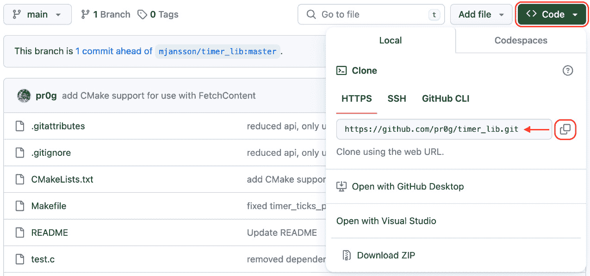
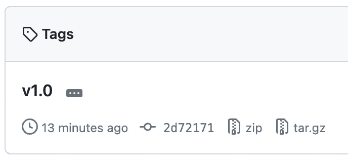
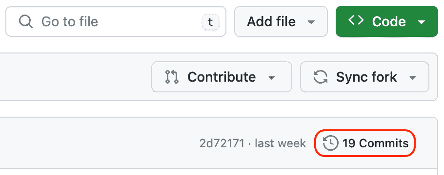

# 第三章：使用 FetchContent 与外部依赖

现在我们已经启动并运行了 CMake，值得注意的一个非常有用的功能是 `FetchContent`。`FetchContent` 是 CMake 的一项功能，允许你将外部库（也称为 **依赖**）引入到你的项目中。只需要几行代码，使用起来快速且方便。它确实依赖于依赖库本身也使用 CMake，但好消息是，使用 C 和 C++ 编写的开源软件中有相当一部分使用 CMake 进行构建。即使该依赖库不使用 CMake，添加 CMake 支持通常也非常简单，并且能使使用该库变得更加轻松。

我们将看到如何在我们的项目中使用 `FetchContent`，为我们的应用程序引入一些新的有用功能。我们还会讨论一些使用时需要注意的细节。到本章结束时，你将能够自信地使用外部库。

本章我们将覆盖以下主要内容：

+   为什么选择 FetchContent

+   使用 FetchContent

+   描述我们的依赖关系

+   为依赖设置选项

+   更新我们的应用程序

# 技术要求

为了跟上进度，请确保你已满足*第一章*《入门》中的要求。这些要求包括：

+   一台运行最新 **操作系统** (**OS**) 的 Windows、Mac 或 Linux 机器

+   一个可用的 C/C++ 编译器（如果你还没有，建议使用每个平台的系统默认编译器）

本章中的代码示例可以通过以下链接找到：[`github.com/PacktPublishing/Minimal-CMake`](https://github.com/PacktPublishing/Minimal-CMake)。

# 为什么选择 FetchContent

`FetchContent` 是 CMake 中相对较新的功能，首次出现在 2018 年 3 月的 CMake 3.11 版本中。`FetchContent` 允许你提供一个源库的路径（通常是某种类型的代码库 URL，尽管 ZIP 文件或本地目录路径的 URL 也被支持），并让 CMake 为你下载（或**获取**）代码。在最基本的情况下，只需要提供这个路径（我们稍后会介绍一些额外的参数）。

## 何时使用 FetchContent

`FetchContent` 的一个非常有价值的特点是，它允许你将任何第三方依赖的源代码从代码库中剥离。当你在没有使用 `FetchContent` 的情况下与第三方库一起工作时，有几种不同的选择，每种都有不同的权衡。一种解决方案是将第三方库复制/粘贴到你的源代码目录中（理想情况下是在一个专门的文件夹中）。如果该项目使用 CMake，你可以使用一个叫做 `add_subdirectory` 的功能相对干净地添加该库。另一种方式是将独立的库文件直接添加到你自己的 `CMakeLists.txt` 文件中，这样做可能会迅速变得不太方便。

拥有源代码的直接访问权限有一些优势，但必须小心避免对其进行任何修改。如果发生修改，将使未来的升级变得异常痛苦。在涉及许可和归属时也需要小心（确保该库的根目录下存在`LICENSE`文件尤为重要）。

另一种可能的做法是依赖 Git 子模块。它们的优势在于可以将第三方依赖的源代码文件从你的项目中排除（至少是作为跟踪文件），但使用 Git 子模块可能会有些繁琐，并且使得克隆和更新你自己的项目变得更加复杂。

`FetchContent` 解决了所有这些问题，保持了代码和依赖项之间的良好卫生，避免了引入不必要的复杂性或维护问题。

另一个需要注意的点是，使用 `FetchContent` 会使依赖项在配置时可用。这意味着你的目标可以在配置时依赖于由依赖项提供的目标（就像该依赖项是本地的一样）。依赖项将在与你的代码同时构建时构建，构建结果将添加到 `build` 文件夹中的一个名为 `_deps` 的文件夹内。

## 什么时候不应该使用 FetchContent

虽然 `FetchContent` 是一个非常有用的工具，但它并非没有缺点。使用 `FetchContent` 构建时需要注意的主要权衡是，你在构建自己的代码的同时也在构建依赖项。这通常会增加不必要的工作，并且使得在不重新构建依赖项的情况下重新构建代码变得困难（理想情况下，我们希望只构建一次依赖项，然后忘记它们）。对于小型依赖项来说，这不是大问题，但正如我们稍后将看到的，对于较大的依赖项，使用更好的替代方案会更加合适（我们将在 *第六章* 中详细讨论，*安装依赖项和 ExternalProject_Add*）。

使用 `FetchContent` 和 `ExternalProject_Add` 时需要注意的另一个因素是，所引用的依赖项将来可能会变得不可用（例如，某个仓库可能会被删除，或者远程文件可能会被重命名或移动）。这些是我们需要考虑的风险，采取一些措施，比如为公共仓库创建分支或自托管重要文件，可能是值得考虑的。

最后，如果我们想使用的依赖项目前没有 CMake 支持，我们就无法使用 `FetchContent`。对于较小的依赖项，添加 CMake 支持可能不会太困难，但对于较大的依赖项来说，这可能是一个挑战。保持 CMake 支持的持续维护也可能成为一个巨大的开销（在这里，CMake 查找模块可以提供帮助，相关内容请参见 *第七章*，*为你的库添加安装支持*）。

现在我们已经了解了 `FetchContent` 及其在更大 CMake 环境中的位置，接下来我们可以深入探讨使用它所需的具体命令。

# 使用 FetchContent

既然我们已经了解了 `FetchContent` 的作用及其使用原因，接下来我们来看看如何通过 `FetchContent` 命令将依赖项集成到我们的项目中：

```cpp
include(FetchContent)
FetchContent_Declare(
  timer_lib
  GIT_REPOSITORY https://github.com/pr0g/timer_lib.git
  GIT_TAG v1.0)
FetchContent_MakeAvailable(timer_lib)
target_link_libraries(${PROJECT_NAME} PRIVATE timer_lib)
```

我们将要介绍的库是一个跨平台的计时器库，名为 `timer_lib`。`timer_lib` 将允许我们的 `Game of Life` 应用程序独立运行，用户无需按 *Enter* 键来切换到棋盘的下一阶段。

上述代码片段来自书籍 GitHub 仓库中的 `ch3/part-1/CMakeListst.txt`，并且紧接着我们在 *第二章* 中回顾的 CMake 命令（见 `ch2/part-3/CMakeLists.txt）`。接下来，我们将逐一讲解每条命令。

## 引入其他 CMake 代码

让我们从了解如何使用 CMake 库代码开始：

```cpp
include(FetchContent)
```

`include` 命令用于引入存储在单独文件中的 CMake 功能。`FetchContent` 是 CMake 提供的**模块**，可以在你的 CMake 安装文件夹中找到。按照平台的不同，具体如下：

+   Windows: `C:\Program Files\CMake\share\cmake-3.28\Modules`

+   macOS: `/Applications/CMake.app/Contents/share/cmake-3.28/Modules`

+   Linux: `/opt/cmake-3.28.1-linux-aarch64/share/cmake-3.28/Modules`

上述路径与我们在 *第一章* *入门* 中安装 CMake 时的路径相匹配。对于 Windows 和 macOS，路径通常只会根据 CMake 版本有所不同。对于 Linux，路径可能会有所不同，具体取决于 CMake 的安装方式（例如，如果通过 `apt` 等包管理器安装 CMake，安装位置可能是 `/usr/share/cmake-<version>/Modules`）。

CMake 知道在 `Modules/` 文件夹中搜索这些默认模块（由 CMake 开发者维护）。也可以使用 `include` 命令来引入我们自己的 CMake 文件。例如，我们可以编写一个简单的 CMake 函数来列出所有 CMake 变量。让我们创建一个新文件 `CMakeHelpers.cmake`，并将该命令作为函数添加进去：

```cpp
cd ch3/part-1
code CMakeHelpers.cmake
```

添加以下代码并保存文件：

```cpp
function(list_cmake_variables)
  get_cmake_property(variable_names VARIABLES)
  foreach(variable_name ${variable_names})
    message(STATUS "${variable_name}=${${variable_name}}")
  endforeach()
endfunction()
```

不用担心现在理解该函数的实现。这只是一个示例，用来展示如何提取有用的 CMake 功能以便在我们的 `CMakeLists.txt` 文件中重用。

在 `ch3/part-1/CMakeLists.txt` 中，现在我们可以在 `project` 命令之后的任何位置写入 `include(CMakeHelpers.cmake)`，然后在脚本的末尾调用 `list_cmake_variables()`。为了查看所有 CMake 变量在终端中的输出，完成建议的更改后，从 `ch3/part-1` 目录运行 `cmake -B build`（如果你不想自己实现这些更改，可以转到 `ch3/part-2`，那里有一个功能正常的示例）。

该命令的输出非常冗长，默认情况下不建议开启。排序顺序也有些不常见，按区分大小写的顺序排序（大写的`Z`会出现在小写的`a`之前），但偶尔启用这种调试功能可以帮助我们更好地理解 CMake 在后台执行的内容：

```cpp
...
project(example-project)
include(CMakeHelpers.cmake)
...
list_cmake_variables()
```

你可能注意到我们的`include`调用与`FetchContent`的`include`调用之间有一个区别，那就是我们必须指定完整的文件名，包括扩展名（`include(CMakeHelpers.cmake)`而不是`include(CMakeHelpers)`）。这是因为当我们省略`.cmake`扩展名时，CMake 并不是在查找文件，而是在查找一个模块。模块与我们的示例文件没有区别，唯一的不同是它可以在`CMAKE_MODULE_PATH`中找到。

为了快速验证这一点，我们可以在调用`include`之前添加以下代码：

```cpp
list(APPEND CMAKE_MODULE_PATH ${CMAKE_CURRENT_SOURCE_DIR})
```

前面的命令将包含`CMakeLists.txt`文件的目录添加到`CMAKE_MODULE_PATH`中。现在`include(CMakeHelpers)`可以正常工作了。这不是推荐的做法，而是为了演示没有特殊的语法或命令可以将常规的`.cmake`文件转换为模块。`CMakeHelpers.cmake`只需要通过查找`CMAKE_MODULE_PATH`中的目录来被发现。

要了解更多关于 CMake 的`include`命令，请参阅[`cmake.org/cmake/help/latest/command/include.html`](https://cmake.org/cmake/help/latest/command/include.html).

# 描述我们的依赖

现在，使用`FetchContent`功能，我们可以指定我们想依赖的库：

```cpp
FetchContent_Declare(
  timer_lib
  GIT_REPOSITORY https://github.com/pr0g/timer_lib.git
  GIT_TAG v1.0)
```

`FetchContent_Declare`允许我们描述如何获取我们的依赖。在这里展示的命令中，我们使用了一小部分选项以简化说明。通常这些选项就足够了，但实际上有更多的选项可供使用。首先，我们需要为依赖命名。需要注意的是，这个名字完全可以是任意的，并不来自库本身。这里我们也可以将依赖命名为`CoolTimingLibrary`，并在`FetchContent_MakeAvailable`命令中使用这个名字：

```cpp
FetchContent_Declare(
  CoolTimingLibrary
  GIT_REPOSITORY https://github.com/pr0g/timer_lib.git
  GIT_TAG v1.0)
FetchContent_MakeAvailable(googletest-distribution, and the targets to depend on are gtest and gtest_main. For our purposes, naming the dependency in the context of our project as GoogleTest is very convenient and helps improve readability.
			The next argument, `GIT_REPOSITORY`, is where to find and download the code. `GIT_REPOSITORY` is just one choice; there are several including `SVN_REPOSITORY` (Subversion), `HG_REPOSITORY` (Mercurial), and `URL` (ZIP file). For open source projects, Git is by far the most popular, but you have alternatives to Git, including but not limited to the preceding list of options.
			FetchContent and ExternalProject_Add
			In this book, we’re explicitly covering `FetchContent` before `ExternalProject_Add` as it’s much easier to get to grips with initially (`ExternalProject_Add` is a useful command we’ll cover in more detail in *Chapter 6*, *Installing Dependencies and ExternalProject_Add*). Something to be aware of is that internally, `FetchContent` is implemented on top of `ExternalProject_Add`, so a lot of the configuration options are the same between the two. If you’re looking for more details about `FetchContent`, start with [`cmake.org/cmake/help/latest/module/FetchContent.html`](https://cmake.org/cmake/help/latest/module/FetchContent.html), but it can also be helpful to consult [`cmake.org/cmake/help/latest/module/ExternalProject.html`](https://cmake.org/cmake/help/latest/module/ExternalProject.html). This covers details such as download, and directory options shared between both `FetchContent` and `ExternalProject_Add`.
			Using libraries from GitHub
			To find the Git repository path referenced in the preceding subsection (where the project is hosted, in this case, GitHub), navigate to the project page ([`github.com/pr0g/timer_lib`](https://github.com/pr0g/timer_lib)), and then click the green **Code** dropdown toward the top right of the page:
			

			Figure 3.1: GitHub UI for cloning a repository
			Returning to the `FetchContent_Declare` command, after `GIT_REPOSITORY`, we follow up with the `GIT_TAG` argument. `GIT_TAG` is flexible and supports a range of different identifiers. The first and perhaps most obvious is a **Git tag** (the identifier used in the examples presented so far). These are friendly names for Git commits and can signpost versions or releases of a project. To find available Git tags on GitHub, from the project page, click the **Tags** UI option toward the middle of the screen:
			

			Figure 3.2: GitHub project page tags link
			There you’ll see a list of tags (see *Figure 3**.3*). You can usually just note down the most recent one and add that after the `GIT_TAG` argument in your `FetchContent` command. If you need to depend on a particular version of the library, it’s possible to look back through the available tags and select the version you need:
			

			Figure 3.3: GitHub tags list view
			If you are concerned that a Git tag may be removed in the future (which can sometimes happen), you can instead use the commit that’s referenced and add a comment after it in your `FetchContent_Declare` command, showing the tag it corresponds to:

```

GIT_TAG 2d7217 # v1.0

```cpp

			If a convenient tag is not available, the next best choice is to reference a specific commit hash. Looking at *Figure 3**.3*, we can see that the commit hash listed is `2d72171` (remember, a tag is just a friendly name for a commit). If we want to grab the most recent commit, we can find this from the GitHub project page by clicking the **Commits** link at the center-right of the screen:
			

			Figure 3.4: GitHub project page commits link
			This will list all commits chronologically, with the most recent commits appearing first. Clicking the **Copy** icon (*Figure 3**.5*) will copy the full commit SHA (hash) to the clipboard (don’t worry if you don’t know what this is; it’s just a unique reference to that commit):
			

			Figure 3.5: GitHub copy commit SHA UI
			We can then paste the content of our clipboard after `GIT_TAG` in our `FetchContent` command:

```

FetchContent_Declare(

timer_lib

GIT_REPOSITORY https://github.com/pr0g/timer_lib.git

GIT_TAG 2d7217114f1ab10d9b46a2e7544009867b80b59c)

# 2d72171 也可以正常工作

```cpp

			Using branch names
			There is one more type of argument that can be passed to `GIT_TAG`, and that is the branch name of your dependency. If `GIT_TAG` is omitted entirely, then CMake will default to the branch behavior, looking for a branch called `master` (most open source projects are moving away from this name and instead opting for `main`, used throughout this book, or `trunk`). It is generally not advisable to use a branch name because you lose the ability to maintain exact snapshots of your project history.
			If your project depends on the `main` branch of `timer_lib`, and `timer_lib` is under active development, then in six months if you want to jump back to an earlier commit in your project and build it, there’s a very good chance your code will fail to compile. This is because it’ll be using the most recent version of `timer_lib`, not the one from six months ago.
			This can be a huge pain. Depending on the rate of change, it can be hard to work out which commit your project would have been using at the time. There may be rare circumstances where setting `GIT_TAG` to a branch name makes sense. For example, when working in a development branch, it might be useful to temporarily set a branch name on `GIT_TAG` to make getting the most up-to-date changes from a dependency quicker (without having to remember to update the commit SHA every few days).
			It’s important to remember to ensure your library has fixed `GIT_TAG` to a commit hash, or possibly a tag, for reliable, reproducible builds when you merge your changes back to your main branch (either by rebasing or squashing in Git parlance). You will thank yourself later when you inevitably have to use `git-bisect` to track down some horrendous bug.
			Using local libraries with FetchContent
			Before we discuss using the dependency we’ve introduced with `FetchContent`, there’s one other useful way to work with it. If you are developing an application and a library at the same time, and they are both closely related, it can be tedious to keep the application in sync when making small incremental changes to the library. You need to commit your changes, push them to the remote repository, and then pull the changes down again in the application project. A better approach is to tell `FetchContent` to look directly at that source folder instead of downloading the dependency and storing it locally (inside the `build/_deps` folder). This can be achieved by setting `SOURCE_DIR`.
			We can write the following:

```

FetchContent_Declare(

<dependency-name>

SOURCE_DIR <path/to/dependency>)

```cpp

			CMake will then use this new path as the source directory, and we can easily make changes there. We will see them reflected in our application immediately when we build it. This path can either be absolute or relative from the build folder of the main application.
			To help illustrate this, let’s look at one concrete example. Let’s take the folder structure of the *Minimal CMake* GitHub repository and create `timer-lib` in the same directory:

```

├── minimal-cmake

│   └── ch3

│       └── part-1

└── timer-lib

```cpp

			To reference the local `timer-lib` library, we can write the following in `ch3/part-1/CMakeLists.txt`:

```

FetchContent_Declare(

timer_lib

SOURCE_DIR ../../../../timer-lib)

```cpp

			Notice that we used four instances of `../`, as the path is relative to our project’s build folder (`CMAKE_CURRENT_BINARY_DIR`), not its source folder (`CMAKE_CURRENT_SOURCE_DIR`). Essentially, we are targeting `ch3/part-1/build`, not `ch3/part-1`. We could also use `${CMAKE_CURRENT_SOURCE_DIR}/../../../timer-lib` to make the path relative to our project’s source directory if we prefer. If figuring out the relative path is proving difficult, it’s also fine to use an absolute path as a short-term workaround to get things working.
			This is meant as a temporary convenience and isn’t something to push to your main branch, but it can be particularly useful when iterating on functionality that may have been extracted to a separate project. It’s also important to note that `SOURCE_DIR` can be used in combination with a download method (e.g., `GIT_REPOSITORY`) to override the default location where the source code will be downloaded.
			Making the dependency available
			Now that we have described how to retrieve the dependency’s source (using `FetchContent_Declare`), we can instruct CMake to add it to our project and make the dependency ready to use:

```

FetchContent_MakeAvailable(timer_lib)

```cpp

			`FetchContent_MakeAvailable` will make the content of our dependency available to the rest of our `CMakeLists.txt` file. The CMake documentation calls this `timer_lib`), but as discussed earlier, we might have brought in other CMake utility scripts we’d like to use.
			Multiple dependencies can be listed in the `FetchContent_MakeAvailable` command (separated by a space), and all `FetchContent_Declare` statements must come before the call to `FetchContent_MakeAvailable`:

```

FetchContent_Declare(

LibraryA

...)

FetchContent_Declare(

LibraryB

...)

FetchContent_MakeAvailable(LibraryA LibraryB)

```cpp

			Something to be aware of about `FetchContent_MakeAvailable` is that it is actually an abstraction over several lower-level CMake commands (`FetchContent_GetProperties`, `FetchContent_Populate`, etc.). These allow more fine-grain control over the dependency, but in the majority of cases, they are not required. `FetchContent_MakeAvailable` is usually more than sufficient and much simpler to use. The CMake documentation recommends using `FetchContent_MakeAvailable` unless there is a good reason not to.
			Linking to the dependencies
			With targets now available for our dependency, the last step is to link against them:

```

target_link_libraries(${PROJECT_NAME} PRIVATE timer_lib)

```cpp

			When used with a CMake target as shown in the preceding code snippet, `target_link_libraries` is a deceptively powerful command. There is quite a bit going on that CMake is taking care of for us. As the library we’re depending on is using CMake, it has already described what the `include` paths are and where to find the library file itself. This might seem like a small thing, but doing this by hand is a tedious and error-prone process.
			If we were depending on a library we’d built outside of CMake (without using find modules, a topic covered in *Chapter 7*, *Adding Install Support for Your Libraries*), we would have to manually specify the include paths, library path, and library in the following manner:

```

target_include_directories(

${PROJECT_NAME}

PRIVATE third-party/timer-lib/include)

target_link_directories(

${PROJECT_NAME} PRIVATE

third-party/timer-lib/lib/macos

third-party/timer-lib/lib/win

third-party/timer-lib/lib/linux)

target_link_libraries(${PROJECT_NAME} PRIVATE timer_lib)

```cpp

			Some details have been omitted in the preceding example, but the sentiment is much the same. If you visit the book’s GitHub repository ([`github.com/PacktPublishing/Minimal-CMake`](https://github.com/PacktPublishing/Minimal-CMake)) and navigate to `ch3/part-3`, you can see a full example (both `x86_64` and `arm64` architectures are supported, to override the architecture, set `MC_ARCH` when configuring).
			This approach is sometimes necessary (especially if a library we’re depending on isn’t using CMake and creating a find module file is too much overhead for what’s needed). Building separately and updating all individual library files can be tiresome and does not scale well if you’re using many dependencies and updating them regularly.
			Another example is also included in `ch3/part-4`, which shows the use of `add_subdirectory` (it is necessary to navigate to `ch3/part-4/third-party` and run `git clone https://github.com/pr0g/timer_lib.git` to download the library before configuring the project from `ch3/part-4`; see `ch3/part-4/README.md` for details). This has the advantage of relying on the CMake target again (so we get all the `include` directories and library paths for free), but it suffers from the problem mentioned at the start of the chapter, where code from other projects can get mixed up in our source tree.
			We’ll stick with the `FetchContent` approach for the rest of this chapter, and with `timer_lib` now added to `target_link_libraries`, we’re ready to start using the dependency in our project.
			Setting options on dependencies
			When bringing in dependencies, there are often situations where we want to customize exactly what gets built. One of the most common examples is whether to build unit tests or not. Usually, libraries will provide an option to build the tests, with the default set to either `on` or `off` (this is something we’ll cover in more detail in *Chapter 4*, *Creating Libraries* *for FetchContent*).
			To understand this in a bit more detail, let’s continue to evolve our sample project, the `Game of Life` implementation introduced in *Chapter 2*, *Hello CMake!*.
			We are going to bring in another library in addition to `timer_lib` called `as-c-math`. This is a linear algebra math library intended for use in 3D applications and games. It also includes a set of 2D operations, which will help to refine our `Game of` `Life` implementation.
			To introduce the new library, let’s use the now-familiar `FetchContent_Declare` command to describe where to find it:

```

FetchContent_Declare(

as-c-math

GIT_REPOSITORY https://github.com/pr0g/as-c-math.git

GIT_TAG 616fe946956561ef4884fc32c4eec2432fd952c8)

```cpp

			We can then add it to the `FetchContent_MakeAvailable` command along with `timer_lib`:

```

FetchContent_MakeAvailable(timer_lib add_library（我们将在*第四章*，*为 FetchContent 创建库*中进一步了解 add_library），该内容包含我们希望在 target_link_libraries 中链接的目标名称。在这种情况下，它是项目的名称，使用我们在*第二章*，*Hello CMake!*中讨论的相同技术（使用 ${PROJECT_NAME} CMake 变量）。现在让我们添加这个依赖项，以确保我们正确地链接它：

```cpp
target_link_libraries(${PROJECT_NAME} PRIVATE timer_lib ch3/part-5, you can see a version of the project with the changes we have listed. Simply run cmake -B build (with your choice of generator; we’ll stick with Ninja Multi-Config) and then cmake --build build:

```

cmake -B build -G "Ninja Multi-Config"

cmake --build build

```cpp

			There’s one thing you might spot in the output:

```

[11/11] 正在链接 C 可执行文件 _deps/as-c-math-build/Debug/as-c-math-test

```cpp

			It looks like we’re inadvertently building the unit tests for `as-c-math`. If you navigate to `build/_deps/as-c-math-build/Debug` and run `as-c-math-test`, sure enough, you’ll see that the tests run. In our case, this is a waste of resources, as we’re unlikely to be making changes to the library and would hope that the test suite is already passing.
			The good news is that there’s a way to disable this right after our `FetchContent_Declare` command. If we navigate to the `CMakeLists.txt` file for `as-c-math` (which will have been downloaded for us in `build/_deps/as-c-math-src`), at the top of the file we can see this command:

```

option(AS_MATH_ENABLE_TEST "启用测试" ON)

```cpp

			This is a CMake variable used to decide whether we should build the test target or not. Scrolling a little further down, we can see the following:

```

if(AS_MATH_ENABLE_TEST)

...

endif()

```cpp

			It is generally good practice when creating libraries to segment any additional utilities such as tests, coverage, and documentation from the main build so users can choose to opt in to what they want to use. The good news is that we can set the `AS_MATH_ENABLE_TEST` variable from our project.
			In this case, we know that we don’t want to build the tests, and we also want to hide this property from users of our library as it’s an implementation detail. We can do this by adding a `set` command right after the `FetchContent_Declare` command for `as-c-math`:

```

FetchContent_Declare(

as-c-math

GIT_REPOSITORY https://github.com/pr0g/as-c-math.git

GIT_TAG 616fe946956561ef4884fc32c4eec2432fd952c8)

set(AS_MATH_ENABLE_TEST OFF CACHE INTERNAL "")

set(AS_MATH_ENABLE_COVERAGE OFF CACHE INTERNAL "")

FetchContent_MakeAvailable(timer_lib as-c-math)

```cpp

			For a full example of the preceding step, see `ch3/part-6/CMakeLists.txt`.
			In a perfect world, it would be simpler if we could just write `set(AS_MATH_ENABLE_TEST OFF)`, but the extra arguments are important to add as a best practice. The reasons why we must add them relate to the CMake cache.
			The previously mentioned `option(AS_MATH_ENABLE_TEST "Enable testing" ON)` command is essentially syntactic sugar for the following:

```

set(AS_MATH_ENABLE_TEST ON CACHE BOOL "启用测试").

```cpp

			What this does is add the variable to the CMake cache (stored in `build/CMakeCache.txt`). This keeps track of a bunch of settings and variables so CMake doesn’t have to recalculate them on every run. It is also used to allow variables to be edited by users using the CMake GUI or `ccmake` (`ccmake` is a command-line tool for manually editing cache variables; it is only available on macOS and Linux).
			When we override a variable, we first pass the name (`AS_MATH_ENABLE_TEST`), then the value (`OFF`), and then we pass `CACHE` to indicate that this value should be updated in the cache. To clarify, if we leave things as they are in `ch3/part5` and look inside `CMakeCache.txt`, we’ll see the following:

```

//启用覆盖率

AS_MATH_ENABLE_COVERAGE:BOOL=OFF

//启用测试

AS_MATH_ENABLE_TEST:BOOL=ON

```cpp

			These are listed under the `EXTERNAL cache entries` section. If we now add `set(AS_MATH_ENABLE_TEST OFF)` to our `CMakeLists.txt` file, tests will be disabled, but the cache entry will be left over with the earlier value. This could cause problems depending on the scope of where `AS_MATH_ENABLE_TEST` is defined in our `CMakeLists.txt` file.
			Another thing to note is if you do a fresh configure with just `set(AS_MATH_ENABLE_TEST OFF)` added to your `CMakeLists.txt` file, then the value suppresses the variable from ever ending up in the cache. This inconsistency can lead to esoteric problems between new and old builds and so is best avoided. It also means that the value can never be overridden from the command line (if you did want to briefly enable tests, passing `cmake -B build -D AS_MATH_ENABLE_TEST=ON` would have no effect).
			The final two arguments (`BOOL` and `"Enable testing"`) are required by CMake cache variables. CMake will complain if you don’t provide these:

```

set 给定无效的参数用于 CACHE 模式：缺少类型和文档字符串

```cpp

			As mentioned, the type shows the kind of value to be stored (`BOOL` in our case for `option`), and the `ccmake`.
			When using the full form of `set` mentioned above, when querying `build/CMakeCache.txt`, we can see that the `as-c-math` variables have been updated to look like this:

```

//启用覆盖率

AS_MATH_ENABLE_COVERAGE:INTERNAL=OFF

//启用测试

AS_MATH_ENABLE_TEST:INTERNAL=OFF

```cpp

			These will not appear in the CMake GUI or `ccmake` but can still be overridden with `-DAS_MATH_ENABLE_TEST=ON` from the command line if needed.
			In short, when enabling or disabling features for dependencies exposed in their `CMakeLists.txt` file, prefer `set(<variable> <value> CACHE <type> <docstring>)` to the shorter alternative. Make sure to also set these values between the `FetchContent_Declare` and `FetchContent_MakeAvailable` commands for a given dependency. Do all this and you shouldn’t run into any issues.
			Updating our application
			With `as-c-math` added to our `CMakeLists.txt` file (see `ch3/part-7/CMakeLists.txt`), we can now include the library in our project. We simply add `#include <as-ops.h>` at the top of `main.c` (notice the use of angle brackets (`<>`) to indicate that this is an external dependency. Quotation marks (`""`) also work, but using `<>` has the advantage of advertising to the reader that this file is outside the main project).
			If we review `main.c`, we can see it’s changed quite significantly. Instead of thinking of the board as a table with rows and columns, the logic has been updated to treat it as a grid with `x` and `y` coordinates. This is to make things a little more idiomatic when it comes to integration with the math library, but the transition can be a little jarring as the ordering of elements has changed. We traditionally write rows, then columns (`r, c`), which is the vertical position first, then horizontal. With `x` and `y` coordinates, we traditionally write `x` then `y` (`x, y`), with `x` being the horizontal position and `y` being vertical. Right now, the top left of the board is still `(0, 0)`, with `y` growing downward, but this might change in the future. These implementation details are outside the focus of this book but are included for completeness. Don’t worry too much about the changes; the good news is that when running `ch3/part7`, things look identical to how they did before.
			As we can see, what often happens with projects is that when new code is added, we decide how best to structure it after the fact. This is where CMake helps us break things up and provide reusable components.
			Summary
			Fantastic work making it to this point; there was a lot to take in. In this chapter, we covered what `FetchContent` is and why you might want to use it. We touched on how to extract useful functionality in your `CMakeLists.txt` file and then walked through the `FetchContent_Declare` and `FetchContent_MakeAvailable` commands in detail. We saw where to find commits and tags for projects on GitHub, and then how to use `FetchContent` to bring in a simple dependency to enhance our app. We then looked at how to link to our dependency (along with a few alternative approaches) to ensure we could use the code in our project. Finally, we covered how to override settings exposed by dependencies in our `CMakeLists.txt` file and discussed a small update to our *Game of* *Life* application.
			This is another significant achievement under your belt. Being able to effectively understand and use `FetchContent` is an incredibly valuable skill. It unlocks a wealth of software (open source or otherwise) for easy integration with your application.
			Now that we have the knowledge to consume libraries, the next step is learning how to create our own. In the next chapter, we’ll look at breaking out the core of our `Game of Life` application into a library that we can consume in our application and understand exactly what’s needed to make a CMake project consumable by `FetchContent`.

```

```cpp

```
