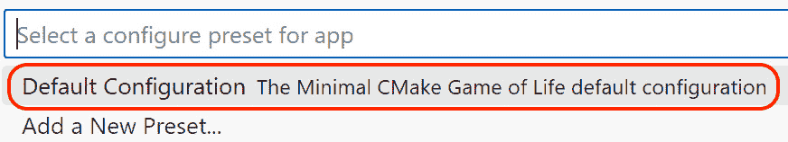
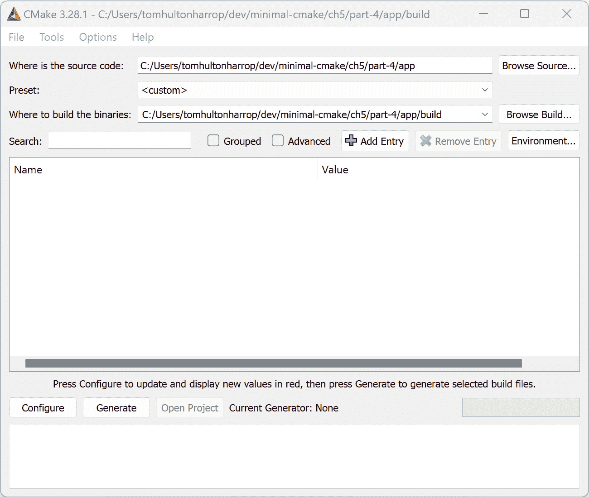
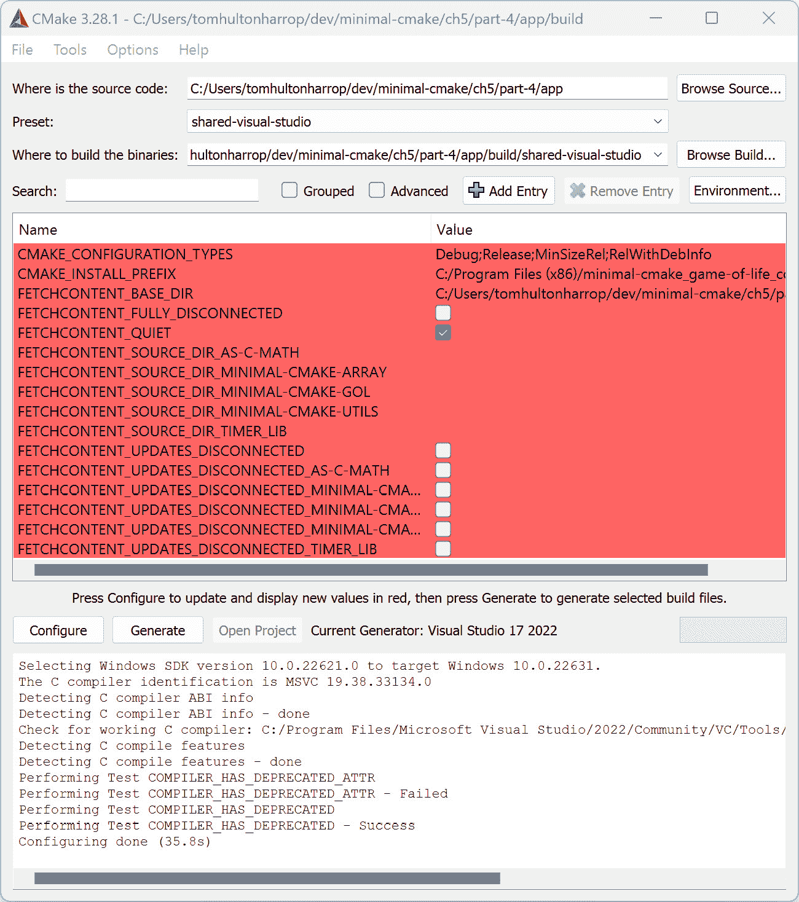

# 第五章：精简 CMake 配置

在本章中，我们将从项目中退一步，解决一些使用 CMake 时的日常痛点。我们将重点讨论如何消除使用 CMake 时的一些粗糙细节，以使日常开发更加轻松，并讨论一些工具和技术来减少手动操作。这些方法还将帮助不熟悉你的项目的用户更快上手，而无需知道所有正确的配置选项。

在本章中，我们将讨论以下主要主题：

+   回顾我们如何使用 CMake

+   使用脚本避免重复命令

+   转向 CMake 预设

+   进一步使用 CMake 预设

+   返回 CMake 图形界面

# 技术要求

为了跟上进度，请确保你已经满足*第一章*《入门》的要求。包括以下内容：

+   一台运行最新**操作** **系统**（**OS**）的 Windows、Mac 或 Linux 机器

+   一个可用的 C/C++编译器（如果你还没有，建议使用每个平台的系统默认编译器）

本章中的代码示例可以通过以下链接找到：[`github.com/PacktPublishing/Minimal-CMake`](https://github.com/PacktPublishing/Minimal-CMake)。

# 回顾我们如何使用 CMake

在本书的第一部分，我们故意专注于直接从终端运行所有 CMake 命令。这是熟悉 CMake 并理解其工作原理的一个很好的方法，但随着你对 CMake 的熟悉，反复输入这些命令会变得让人厌烦。如果你的项目开始添加几个不同的配置选项，尤其是如果你有一个演示或项目希望分享，期待不熟悉的用户输入冗长且容易出错的命令是不可行的。

第一个看起来可能是一个有前景的想法是直接在你的`CMakeLists.txt`文件中设置变量，并提示用户在那里更改值。这样做的主要问题是它会变成维护噩梦，并且使得同时支持不同的构建配置变得极其困难。你能从`CMakeLists.txt`文件中提取的设置越多越好，这样可以为自己和其他人将来使用时提供更多的自定义点。

如果我们最好将设置保存在`CMakeLists.txt`文件之外，那么我们需要用户通过熟悉的`-D<variable>=<value>`格式在命令行上传递它们。这种灵活性非常好，但如果用户每次配置时都必须提供多个变量，可能会变得混乱且容易出错。

例如，如果我们拿我们的*生命游戏*项目来举例，我们已经有了相当多的选项可以在命令行传递，其中一些是我们自己设置的，有些是 CMake 提供的。一个正常的命令可能如下所示：

```cpp
cmake -B build -G "Ninja Multi-Config" -DMC_GOL_SHARED=ON
```

如果我们决定使用 Ninja 单配置生成器并显式设置构建类型，它看起来会是这样的：

```cpp
cmake -B build -G Ninja -DCMAKE_BUILD_TYPE=Release -DMC_GOL_SHARED=ON
```

这已经开始看起来像是大量的输入，而且从这里开始只会变得更糟。是的，你只需要输入一次这些内容来启动并运行，但对于新加入团队/项目的人来说，这可能是痛苦的，甚至对于经验丰富的开发者，在新工作空间或平台上检查代码时也会感到乏味。那么，有什么替代方案呢？

# 使用脚本避免重复的命令

一开始一个完全有效的选择是，在你选择的平台上引入简单的 shell 或批处理脚本，以封装常用的 CMake 命令。例如，在 macOS 上，我们可以创建一个名为 `configure-default.sh` 的脚本，它作为用户初始使用的有主张的默认配置，并且符合我们的日常使用。在 macOS/Linux 上，这可能看起来像下面这样：

```cpp
#!/bin/bash
cmake -B build -G "Ninja Multi-Config" -DMC_GOL_SHARED=ON
```

要创建并使这个文件可执行，我们可以从终端运行以下命令：

```cpp
touch configure-default.sh
# modify file
chmod +x configure-default.sh
```

在 Windows 上，我们可以依赖用户使用 Git Bash（这样他们就可以执行 `.sh` 脚本），或者创建相应的 `.bat` 文件：

```cpp
@echo off
cmake -B build -G "Ninja Multi-Config" -DMC_GOL_SHARED=ON
```

为了提供更多灵活性，提供几个脚本并根据它们的设置命名也会很有帮助；例如，生成器的类型（例如，`configure-ninja.sh`、`configure-vs-2022.bat`、`configure-xcode.sh` 等）或我们构建的库的类型，无论是静态库还是共享库（例如，`configure-shared-ninja.sh`、`configure-static-vs-2022.bat` 等）。

除了加速日常开发外，创建这些脚本的另一个优点是可以作为一种文档形式，帮助用户了解如何配置和调整你的应用程序或库，而不必一开始就去翻找`CMakeLists.txt`文件。这再次平滑了学习曲线，并允许新开发者从终端自行迭代这些命令。

Git 中的一个有用功能是能够在你的仓库中创建自定义的 `.gitignore` 规则。这些可以添加到 `.git/info/exclude` 文件中，因此值得建议用户复制现有的配置脚本，将其重命名为 `configure-<username>.sh/bat`，然后将其添加到 `.git/info/exclude` 文件中。

直到现在，我们只关注了 CMake 配置阶段，因为第一次配置命令通常有最多的选项。将我们的配置脚本与构建命令结合使用也很有帮助，这样用户就可以一次性配置并构建应用程序。一个 `configure-build.sh/bat` 文件可能看起来像这样：

```cpp
#!/bin/bash
cmake -B build -G "Ninja Multi-Config" -DMC_GOL_SHARED=ON
cmake --build build --config Debug
cmake --build build --config RelWithDebInfo
```

更好的做法是将配置逻辑分开，然后从 `configure-build` 脚本中调用它。这可以通过在 macOS/Linux 上执行以下操作来实现：

```cpp
#!/bin/bash
./configure-default.sh
cmake --build build --config Debug
cmake --build build --config RelWithDebInfo
```

在 Windows 上，可以通过以下方式实现：

```cpp
@echo off
CALL configure-default.bat
cmake --build build --config Debug
cmake --build build --config RelWithDebInfo
```

要尝试这些脚本，请参见书籍附带仓库中的`ch5/part-1/app`。

如果你使用的是单配置生成器，为每种构建类型指定自己的子文件夹可能会很方便（尽管实际上，多配置生成器提供的功能非常优秀，能便捷地为你处理这些复杂性）。

如果你愿意，也可以包含一个调用来运行应用程序，尽管这取决于你正在构建的应用程序类型，并且如果在 `README` 或 `CMakeLists.txt` 文件中提供了关于输出文件所在位置的清晰指示，则不应有必要。工作目录（你从中运行应用程序的目录）在这里可能很重要，所以如果加载其他资源时，请记住这一点（我们将在 *第十章**，打包项目* *以供共享* 中介绍如何处理这个问题）。

拥有这些脚本对你以及任何希望查看或贡献你项目的用户或维护者来说可能是有帮助的，但维护起来可能会变得很麻烦。如果你正在构建一个跨平台项目，支持单独的 `.bat` 和 `.sh` 脚本也会让人感到沮丧。另一个缺点是，这些脚本需要从它们所在的终端运行。试图从操作系统文件浏览器中运行它们可能不起作用，因为工作目录通常会被设置为用户的主目录（在 macOS/Linux 上是`~/`，在 Windows 上是 `C:\Users\<username>`）。

脚本图形用户界面支持

如果你下定决心，可以将工作目录设置为文件所在的位置。在 macOS 和 Linux 上，可以通过在 `.sh` 文件开头添加 `cd "$(dirname "$0")"` 来实现（`$0` 展开为文件名，`dirname` 给出包含它的文件夹），在 Windows 上，可以在 `.bat` 文件的开头添加 `cd /d "%~dp0"`（`%~dp0` 是一个批处理变量，展开为文件的驱动器和路径）。你需要记住根据 CMake 安装位置的不同，在某些情况下更新路径（例如，如果 CMake 没有安装在 Linux 的默认系统位置），你还可能希望在 macOS 上将 `.sh` 文件重命名为 `.command`，以便可以轻松地从 *Finder* 中运行。由于额外的复杂性，接下来的部分我们将仅从终端运行。

幸运的是，CMake 有一个相对较新的功能，它在很大程度上（尽管不是完全）消除了对 `.bat` 和 `.sh` 脚本的需求，这个功能叫做 CMake 预设（从 CMake `3.19` 版本开始提供），我们将在下一节中介绍。

# 转向 CMake 预设

`.sh` 和 `.bat` 文件可以与 CMake 紧密集成，并可以与其他工具如 Visual Studio Code、Visual Studio 和 CLion（一个跨平台的 C/C++ 开发环境）一起使用。

要开始使用 CMake 预设，我们需要在项目根目录下创建一个名为 `CMakePresets.json` 的文件。CMake 预设仅是一个以 `{}` 作为根的文件。`CMakePresets.json` 文件有多个部分，涵盖 CMake 构建的各个阶段（配置、构建、测试、打包等）。一开始，我们将专注于配置和构建部分，但随着项目的不断发展，我们将在后续章节中再次回到 `CMakePresets.json` 文件。

编写 CMake 预设文件

编写 CMake 预设文件有时会因其使用 JSON 而变得具有挑战性。为了简化工作，强烈建议使用内置 JSON 语法支持的文本编辑器（Visual Studio Code 是一个显著的例子）。这样，如果你缺少引号或闭括号，编辑器会立即给出反馈，用红色或黄色下划线标出问题。运行 `cmake --preset <preset>` 时，如果 `CMakePreset.json` 文件无效，将输出 `JSON Parse Error` 错误，并附上列和行号，但通过视觉编辑器的反馈，你在输入时就能知道存在问题。

让我们回顾一下一个最小化的 `CMakePresets.json` 文件：

```cpp
{
  "version": 8,
  "configurePresets" : [
    {
      "name": "default",
      "generator": "Ninja Multi-Config",
      "binaryDir": "${sourceDir}/build",
      "cacheVariables": {
        "MC_GOL_SHARED": "ON"
      }
    }
  ]
}
```

在打开的 JSON 对象大括号后，我们必须首先提供一个数字，表示模式的版本（截至目前，`8` 是最新版本，并且适用于 CMake `3.28` 及以上版本）。如果你查阅 CMake 关于预设的文档（参见 [`cmake.org/cmake/help/latest/manual/cmake-presets.7.html`](https://cmake.org/cmake/help/latest/manual/cmake-presets.7.html)），功能通常与特定的模式版本相关联。

下一个键是 `configurePresets`，它映射到不同配置的值数组（这就像我们可能有一个或多个 `.bat` 或 `.sh` 脚本，提供不同的配置选项）。目前我们只提供了一个，但将来添加更多非常简单。该对象的第一个键是 `name` 字段；这是唯一必需的字段，其他键是可选的（为了简洁起见，我们省略了更多字段）。

遍历一组选项，我们可以看到每个选项如何对应于我们原本在命令行中使用的内容：

```cpp
"generator": "Ninja Multi-Config", # -G "Ninja Multi..."
"binaryDir": "${sourceDir}/build", # -B build
"cacheVariables": {
  "MC_GOL_SHARED": "ON"            # -D MC_GOL_SHARED=ON
}
```

添加此预设后，我们可以从根目录运行 `cmake --list-presets` 来查看可用预设的列表：

```cpp
Available configure presets:
  "default"
```

如果我们希望对用户更加友好，可以像这样提供一个 `displayName` 字段：

```cpp
"name": "default",
"displayName": "Default Configuration",
... # as before
```

运行 `cmake --list-presets` 将显示以下内容：

```cpp
Available configure presets:
  "default" - Default Configuration
```

也可以提供描述（使用 `description` 字段）；不过，这不会在命令行或 CMake GUI 中显示。描述可能会在其他工具中显示；例如，当选择 **CMake: Configure** 时，Visual Studio Code 选择显示它，在 *命令面板* 中显示：



图 5.1：Visual Studio Code CMake 预设描述

它的存在为使用该预设的用户提供了文档，因此根据上下文可能值得包括此信息。添加配置预设后，只需从根目录运行 `cmake --preset default`，即可让 CMake 使用提供的设置配置项目。该命令将输出已提供的 CMake 变量及其对应的值，随后是常见的配置输出：

```cpp
Preset CMake variables:
  MC_GOL_SHARED="ON"
-- The C compiler identification is AppleClang 15...
-- Detecting C compiler ABI info
-- ...
```

若要查看此功能的实际示例，请查看书籍随附的代码库中的`ch5/part-2/app/CMakePresets.json`。

我们已经介绍了添加单个 CMake 预设的方法，这对于将默认结构化配置选项添加到项目中非常有用，但 CMake 预设的功能远不止于此。

# 深入了解 CMake 预设

如果我们希望更进一步，为用户提供更多灵活性，`CMakePresets.json` 还提供了一些其他字段，值得了解。第一个字段是 `inherits`，它允许一个预设继承另一个预设的值。某些键/值对不会被继承（包括 `name`、`displayName`、`description` 和 `inherits` 本身），但几乎所有其他内容都会被继承。下一个字段是 `hidden`；它允许定义一个预设，但阻止其在运行 `cmake --list-presets` 时显示给最终用户。这对于定义基本或通用类型非常方便，这些类型可以继承更多具体类型，然后只需提供少量自定义字段。

作为示例，假设我们的 *生命游戏* 项目，我们可以像下面这样定义一个 CMake 预设文件：

```cpp
{
  "version": 8,
  "configurePresets": [
    {
      "name": "base",
      "hidden": true
      "binaryDir": "${sourceDir}/build/${presetName}",
      "generator": "Ninja Multi-Config"
    },
    {
       "name": "shared",
       "inherits": "base",
       "cacheVariables": {
         "MC_GOL_SHARED": "ON"
        }
    },
    {
      "name": "static",
      "inherits": "base",
      "cacheVariables": {
        "MC_GOL_SHARED": "OFF"
      }
    }
  ]
}
```

它以一个名为 `base` 的配置预设开始，其中 `hidden` 字段被设置为 `true`。在那里，我们根据任何后续预设名称定义了一个二进制目录：

```cpp
"binaryDir": "${sourceDir}/build/${presetName}"
```

`${sourceDir}` 和 `${presetName}` 被称为 *宏*，它们根据项目上下文展开为有意义的值（例如，`${sourceDir}` 会展开为项目根目录）。在这种情况下，我们还提供了我们首选的生成器：“`generator`："`Ninja Multi-Config"。

通常，不建议在基础预设中提供特定的生成器（特别是因为并非所有客户端都安装了 Ninja）；相反，更简单的做法是依赖于特定平台的默认生成器，并将特定的生成器覆盖项作为后续选项提供。在我们的案例中，我们选择始终使用 Ninja 多配置生成器，以保持在 macOS、Windows 和 Linux 上的一致性。

随后的两个配置使用 `inherits`，基本上将 `binaryDir` 和 `generator` 的值复制到它们自己中，而无需重复代码行。我们为每个配置提供了一个唯一的名称（`shared` 和 `static`），并分别指定了 `MC_GOL_SHARED` CMake 选项为 `ON` 或 `OFF`。然后，用户可以通过 `cmake --preset static` 或 `cmake --preset shared` 来配置 *生命游戏* 控制台应用程序，以使用库的静态或共享版本。

有帮助的是，宏会在所使用的预设的上下文中解析，这意味着在前面的示例中，当 `base` 被继承到 `static` 或 `shared` 时，`${presetName}` 变量会被分别替换为 `static` 或 `shared`。这意味着我们最终会得到两个构建文件夹，`<project-root>/build/shared` 和 `<project-root>/build/static`，它们不会互相覆盖。

如果我们运行 `cmake --list-presets`，我们会看到以下内容：

```cpp
Available configure presets:
  "shared"
  "static"
```

如果我们接着运行 `cmake --preset shared` 和 `cmake --preset static`，我们会看到以下文件夹结构：

```cpp
.
└── build
    ├── shared
    └── static
```

关于前述代码的完整示例，请参见书籍随附仓库中的 `ch5/part-3/app/CMakePresets.json`。

## CMake 预设覆盖

CMake 预设的一个非常方便的特性是它们与 CMake 命令行参数很好地组合。假设在前面的示例中，我们想使用 `shared` CMake 预设，但更愿意使用与 Ninja 多配置不同的生成器。为此，我们只需在命令行中传递一个不同的生成器，CMake 会覆盖 CMake 预设中的值：

```cpp
cmake --preset shared -G Xcode
```

上面的代码会使用预设中的所有值，除了生成器，在此案例中，它会优先选择 Xcode。我们也可以覆盖多个值，因此一个可能更好的选择可能是以下内容：

```cpp
cmake --preset shared -G Xcode -B build/xcode-shared
```

新的 `xcode-shared` 构建文件夹在将来如果我们决定恢复使用 Ninja 多配置生成器时，就不会与已定义的 `build/static` 和 `build/shared` 文件夹发生冲突（如果使用构建预设，需要显式地传递此文件夹，下一节会介绍这一点，所以从长远来看，将 Xcode 作为配置预设是个不错的选择）。还值得简要提到，Xcode 也是一个多配置生成器，因此在配置时不需要为我们指定构建类型。

拥有快速尝试不同选项的灵活性是非常棒的，但我们又回到了在终端中输入长命令的老问题。幸运的是，CMake 预设中有一个特别有用的功能，可以帮助我们，那就是 CMake 用户预设。

`CMakeUserPresets.json` 文件（与共享的 `CMakePresets.json` 文件相对）。`CMakePresets.json` 会隐式包含在 `CMakeUserPresets.json` 中，因此可以从那里继承现有的预设，就像我们之前所做的那样。

要添加一个自定义预设，使用我们选择的生成器（在此案例中为 Xcode），我们只需将以下内容添加到 `CMakeUserPresets.json` 中：

```cpp
{
  "version": 8,
  "configurePresets": [
    {
      "name": "xcode-static",
      "inherits": "static",
      "generator": "Xcode"
    }
  ]
}
```

然后我们可以运行 `cmake --preset xcode-static` 来配置我们的项目，使用 CMake，并且由于我们在 `base` 预设中指定了 `binaryDir`，我们的构建文件会自动创建在 `build/xcode-static` 中。

需要注意的是，虽然 `CMakePresets.json` 旨在供多个开发者共享并提交到源代码管理中，但 `CMakeUserPresets.json` 并不是。它纯粹用于本地开发，应当添加到你的 `.gitignore` 文件或等效文件中，以避免将其从你的机器中上传（在 *Minimal CMake* 仓库中，`CMakeUserPresets.json` 已经被添加到 `.gitignore` 文件中）。

CMake 预设中另一个有用的功能是 `condition` 字段。它用于决定一个预设是否应该启用。在前面的例子中，我们指定了 Xcode，该生成器仅在 macOS 上有效，因此我们可以更新我们的预设，包含以下几行：

```cpp
...
"generator": "Xcode",
"condition": {
  "type": "equals",
  "lhs": "${hostSystemName}",
  "rhs": "Darwin"
}
```

`Darwin` 是 CMake 用来识别 macOS 的方式。有关 CMake 如何确定其运行的操作系统的更多信息，请参见 [`cmake.org/cmake/help/latest/variable/CMAKE_HOST_SYSTEM_NAME.html`](https://cmake.org/cmake/help/latest/variable/CMAKE_HOST_SYSTEM_NAME.html)。

上述代码确保当我们运行 `cmake --list-presets` 时，在 macOS 以外的平台上不会看到 `xcode-static`。如果我们尝试运行 `cmake --preset xcode-static`，我们会得到以下错误信息：

```cpp
CMake Error: Could not use disabled preset "xcode-static"
```

`condition` 检查在常规的 `CMakePresets.json` 文件中最为有用，以确保开发人员在运行 `cmake --list-presets` 时，根据所使用的平台不会看到不必要的选项。

示例已包含在本书的仓库中。可以通过导航到 `ch5/part3/app` 并查看 `CMakeUserPresets.json.example` 来找到它。要尝试该预设，只需将文件重命名，去掉 `.example` 后缀即可。

## 其他类型的 CMake 预设

到目前为止，我们关于 CMake 预设所涵盖的内容主要集中在 CMake 配置（使用 `configurePresets`）上。配置预设通常是最常用的，我们只是触及了可用设置的表面。在我们继续之前，看看其他类型的预设是有用的。这些预设包括构建、测试、打包和工作流预设。现在，我们只介绍构建和工作流预设，但随着我们将测试和打包引入到应用程序中，我们将继续回到预设。

`buildPresets` 字段。它们可以通过调用 `cmake --build --list-presets` 来显示，并且在某些工具中也可见（例如，在 Visual Studio Code 的 CMake Tools 插件中，我们将在*第十一章*，*支持工具和下一步*中介绍）。构建预设不像配置预设那样对日常开发有如此大的影响，但它们也有自己的用途。在我们简化的示例中，我们展示了 `buildPresets` 可能如何配置：

```cpp
"buildPresets": [
    {
      "name": "shared",
      "configurePreset": "shared"
    },
    {
      "name": "static",
      "configurePreset": "static"
    }
]
```

构建预设之间可以共享的内容通常较少，因此我们暂时省略了一个隐藏的基础构建预设。每个构建预设必须映射到一个`configurePreset`；因此，我们将每个构建预设映射到一个配置预设，该配置预设对应我们应用程序的版本，使用的是静态或共享版本的*生命游戏*库。我们还可以添加另一个字段，称为`configuration`，它相当于从命令行调用 CMake 时传递的`--config`。这看起来像如下所示：

```cpp
{
  "name": "static-debug",
  "configurePreset": "static",
  "configuration": "Debug
}
```

这样做的问题是，我们需要`shared-debug`、`shared-release`、`static-debug`、`static-release`等等。这可能是必要的，当我们开始实现如**持续集成**（**CI**）构建脚本时，它也会派上用场，但现在来看可能有些过头（值得一提的是，如何避免构建预设的组合爆炸是 CMake 维护者 Kitware 正在研究的一个开放问题）。

要调用一个构建预设，我们运行`cmake --build --preset <build-preset-name>`（首先运行`cmake --preset <configure-preset-name>`），如以下示例所示：

```cpp
cmake --preset shared
cmake --build --preset shared
```

提个小提醒，在此上下文中，也可以通过`--config`来指定配置，而无需在`CMakePresets.json`文件中包含所有配置变体，这对于本地开发非常有用。以下是一个示例：

```cpp
cmake --build --preset shared --config Release
```

我们现在提到的最后一个有用的预设是工作流预设。**工作流预设**允许你将多个预设串联在一起，依次运行，允许你用一个命令潜在地配置、构建、测试和打包。配置预设必须先执行，然后可以运行后续的任何预设（目前，我们只有一个构建预设，但将来可能希望扩展这一点）。

工作流预设采取以下形式：

```cpp
"workflowPresets": [
  {
    "name": "static",
    "steps": [
      {
        "type": "configure",
        "name": "static"
      },
      {
        "type": "build",
        "name": "static"
      }
    ]
  }
]
```

它们可以通过`cmake --workflow --preset <workflow-preset-name>`来调用。在我们的情况下，我们运行以下命令：

```cpp
cmake --workflow --preset static
```

然后我们将看到以下输出：

```cpp
Executing workflow step 1 of 2: configure preset "static"
...
Executing workflow step 2 of 2: build preset "static"
...
```

不幸的是，我们无法在`--workflow`命令中提供`--config`覆盖。这意味着需要构建预设变体来指定配置（在多配置生成器的情况下），以便工作流能够构建所有不同的配置。

最后，要显示所有预设，我们可以从命令行运行`cmake --list-presets all`，一次显示所有类型的预设。预设名称只需要在同一预设类型内唯一，因此我们可以为配置、构建和工作流预设使用相同的名称：

```cpp
Available configure presets:
  "shared"
  "static"
Available build presets:
  "shared"
  "static"
Available workflow presets:
  "static"
  "shared"
```

要查看构建和工作流预设的示例，可以花点时间访问附带的*Minimal* *CMake*库中的`ch5/part-4/app/CMakePresets.json`。

CMake 预设是保持 `CMakeLists.txt` 文件简洁、不含配置细节的绝佳机制。它们需要小心处理，因为随着设置的组合爆炸，预设的数量可能会呈指数增长。从最常见的预设开始是一个不错的起点；它们可以在未来扩展，以处理更复杂的配置，帮助跨团队协作和项目维护。它们与 CMake 工具也能够很好地集成。在 *第十一章*，*支持工具与后续步骤*中，我们将讨论 CMake 预设如何使在 Visual Studio Code 中的构建与调试变得轻松。

在这一节中，我们了解了如何创建配置 CMake 预设以避免重复，如何将 CMake 预设与命令行重写结合使用，以及构建和工作流预设的作用。CMake 预设还能做更多事情，稍后我们将在测试和打包部分回顾它们的用法。接下来，我们将重新熟悉 CMake GUI。

# 回归 CMake GUI

本书中，我们几乎专注于从命令行/终端使用 CMake。这是熟悉 CMake 工作原理和理解最常用命令的最佳方式。它通常是最快完成任务的方式，我们将继续使用它，但有时候，从新视角审视项目也是值得的。

这就是 CMake GUI 的作用所在。CMake GUI 提供的功能有些有限（你不能直接从 GUI 构建项目），但获取所有相关 CMake 变量的图形化视图通常非常有帮助。

打开 CMake GUI 最可靠的方法是从项目根目录运行`cmake-gui .`。这样可以确保工具继承你从终端配置的相同环境变量。这在 Windows 上尤其重要，因为我们使用的是*Visual Studio 命令提示符*，而在 macOS 上，从*Finder*打开时，环境变量与从终端打开时不同。如果不这样做，CMake GUI 可能无法找到 CMake、C/C++ 编译器或我们想要使用的生成器（例如，在 Windows 上使用 Ninja）。

Windows 和 macOS 上的 CMake 安装程序会添加一个快捷方式/图标用于打开 CMake GUI，但不幸的是，通过这种方式打开并不总是能成功。如果你想在 Linux 桌面上打开 CMake GUI，你可以导航到`/opt/cmake-3.28.1-linux-<arch>/bin/`并双击`cmake-gui`，或者为 CMake GUI 添加一个桌面图标（如果你是按照*第一章*的方式安装 CMake，*入门*部分）。使用`cmake-gui .`命令启动 CMake GUI 是最可靠的跨平台方法，可以在正确的地方打开 CMake GUI。文档中说明了可以传递`-S`和`-B`来指定源目录和构建目录；然而，根据个人经验，这在所有平台上并不总是有效。一旦项目配置完成，仅运行`cmake-gui`（不带`.`）将会打开你上次离开的地方。如果没有提供起始目录，你可以从工具内部选择源目录和构建目录，尽管这个过程可能有点繁琐。也可以结合使用 CMake 预设和 CMake GUI，直接在命令行提供预设，或者在工具内选择一个预设。

第一次打开 CMake GUI 时，你会看到类似于以下的界面：



图 5.2：CMake GUI

顶部区域显示源目录、预设（如果选择了）和构建目录。中间区域显示配置后的所有 CMake 变量，底部区域则显示你通常在终端运行 CMake 时看到的输出。

CMake GUI 被设置为更好地与可以在某种`CMakeLists.txt`文件中打开的项目文件一起工作，且这些工具可以处理配置（例如微软的 Visual Studio Code 或 JetBrains 的 CLion）。`ch5/part-5/app`中有一个更新版的`CMakePreset.json`文件，展示了 Xcode、Visual Studio 和 Ninja Multi-Config 的配置。

一旦源目录和构建文件夹设置完成，点击**配置**将显示所有新的（或更改的）CMake 变量。这些变量会以红色显示，刚开始可能会让人感到有些困惑，但这并不是错误。再次按下**配置**按钮检查是否有任何 CMake 变量发生变化；所有红色高亮应随之消失：



图 5.3：初始配置后的 CMake GUI

CMake GUI 明确区分了**配置**和**生成**步骤，而这两个步骤通常在命令行运行时是一起完成的。配置完成后，点击**生成**按钮来创建项目文件。在之前的示例中，我们使用了 Visual Studio 生成器，因此点击**打开项目**将会打开 Visual Studio 解决方案。此时可以直接使用 Visual Studio 构建项目。

切换 `MC_GOL_SHARED` 到一个未分组的部分，但将来，所有以 `MC_` 开头的条目将会被分组在一起。

查看我们在 *第三章* 中看到的`list_cmake_variables`函数，*使用 FetchContent 和外部依赖*，虽然它是一个不错的起点，并且通常足够用。

最后一个有用的功能是**添加条目**按钮。点击它会提供一个表单，用于将新的 CMake 变量添加到 CMake 缓存中。这个界面比从命令行添加变量要友好一些。记得在添加新变量后重新运行**配置**（它会以红色出现在工具的中央部分，作为提醒）。还有一个相应的**移除条目**按钮，它会将 CMake 变量从缓存中移除。

了解 CMake 图形界面是很有帮助的，但在本书的剩余部分，我们将主要依赖命令行来完成工作。如果你更喜欢图形界面，也可以使用它，大部分内容在 CMake 图形界面和命令行之间是可以互换的。

# 小结

恭喜你完成了这一部分的内容。在这一章中，我们学习了如何使用简单的脚本消除反复输入相同 CMake 命令的单调感，以及这如何让新用户在查看你的项目时更加轻松。接着，我们探讨了如何使用 CMake 预设进一步优化项目配置，并确保保持我们的`CMakeLists.txt`文件的整洁。我们还了解了如何使用 CMake 预设来创建配置、构建和工作流命令。最后，我们深入了解了 CMake 图形界面，以便更好地理解它的工作原理以及我们可以用它做什么。

在下一章中，我们将切换主题，回到我们的*生命游戏*项目。我们将放弃控制台应用程序，转向一个真正的跨平台窗口体验。为此，我们将学习如何向项目中添加更大的依赖，并理解*安装*一个库的真正含义。
