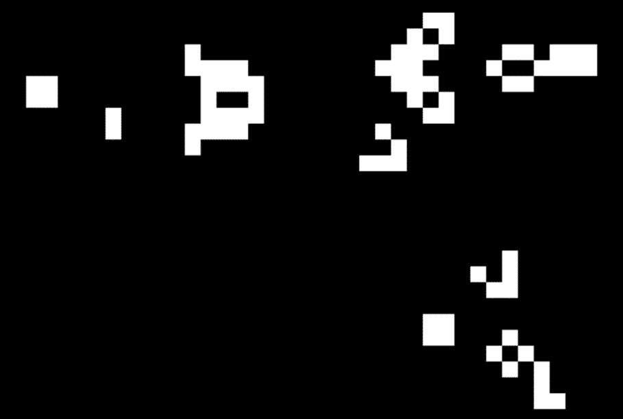
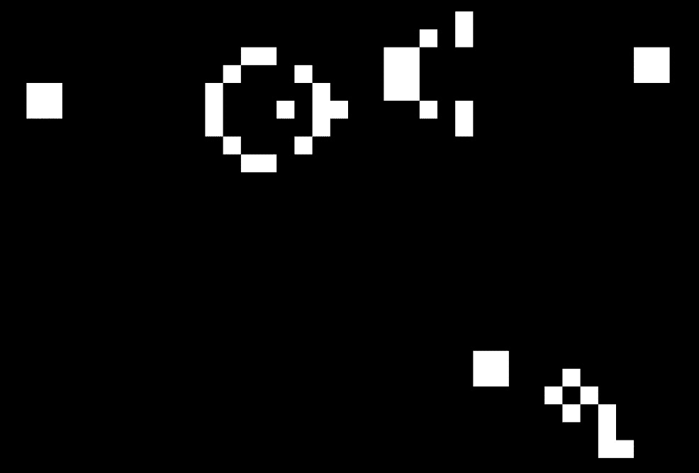

# 第六章：安装依赖项和`ExternalProject_Add`

在本章中，我们将深入探讨`FetchContent`来下载其他库，它们最终还是会进入相同的构建文件夹。安装稍微不同。安装时，我们会在构建时将库与应用程序完全分离。然后，我们会采取第二步，将其安装到一个应用程序能够找到的位置。安装可能听起来神秘，但本质上只是将一组文件从一个位置复制到另一个位置（尽管需要遵循既定的约定）。

一旦我们熟悉了手动构建和安装库，我们将探讨如何利用`ExternalProject_Add`显著减少安装时所需的手动步骤。这将使我们能够更清洁地将外部库与我们不断发展的应用程序集成。幸运的是，学习的新命令不多，当你完成了一次过程后，它可以轻松地转移到其他项目中。

在本章中，我们将涵盖以下主要主题：

+   什么是安装

+   安装一个库

+   使用已安装的库

+   使用`ExternalProject_Add`简化安装

+   使用`ExternalProject_Add`处理多个库

# 技术要求

为了跟随本书内容，请确保你已满足*第一章*《入门》一节中列出的要求。这些要求包括以下内容：

+   一台运行最新**操作** **系统**（**OS**）的 Windows、Mac 或 Linux 机器

+   一个可用的 C/C++编译器（如果你没有，建议使用系统默认的编译器）

本章中的代码示例可以通过以下链接找到：[`github.com/PacktPublishing/Minimal-CMake`](https://github.com/PacktPublishing/Minimal-CMake)。

# 什么是安装？

安装，本质上就是将文件从一个地方复制到另一个地方。一旦这些文件被复制到特定位置，应用程序（或其他库）在构建时就可以在那里查找它们。

安装在实践中有几个优点。第一个优点是，你可以构建一次库，只将必要的文件安装到已知位置，然后让多个应用程序使用它。这可以节省大量时间和资源，避免不必要地重复构建相同的代码。另一个优点是，只有所需的文件才会被复制到安装位置。当我们正常构建时，构建文件夹会充满许多中间文件，这些文件应用程序可能不需要（取决于我们的库）。而当我们安装时，我们只会指定必要的文件（通常是构建后的库文件，如`.lib`/`.a`或`.dll`/`.dylib`/`.so`、头文件和 CMake 配置文件）。我们还可以通过只安装我们希望公开的头文件，并以比内部构建结构更简单的布局，来更精确地控制库的接口。

默认情况下，当我们安装一个库时，文件会被复制到预定的系统位置。在 macOS 和 Linux 上，这通常是`/usr/local/lib`（用于库文件）、`/usr/local/include`（用于头文件）、`/usr/local/bin`（用于可执行文件）和`/usr/local/share`（用于任何类型的文档或许可证文件）。在 Windows 上，这通常是`C:/Program Files (x86)/<library-name>`，库名称下会有`lib`、`include`、`share`和`bin`子文件夹。当我们进入安装库的阶段时，我们将更详细地回顾文件夹结构，并查看哪些文件被包含。

要找到已安装的库，CMake 需要知道在哪里查找。将库安装到前面提到的默认位置之一的好处是，CMake 已经知道在哪里搜索，因此在配置依赖该库的项目时，我们不需要提供其他信息。此方法的一个缺点是它会改变我们运行的全局主机环境，这可能并非始终是你想要的。这涉及到缺乏隔离性，我们将在稍后的*安装库*部分中展示如何解决这个问题。另一个需要注意的问题是，安装到系统位置通常需要提升的权限，而库的构建者可能没有这些权限。例如，在 Windows 上将库安装到`C:\Program Files\`需要管理员权限。

接下来，我们将查看下载和安装库所需的步骤。

# 安装库

在使用已安装的库之前，我们先使用 CMake 安装一个库。我们将选择一个库，用于我们*生命游戏*应用程序，继续改进其功能；我们将使用的库叫做**Simple Directmedia Layer**（**SDL**）。SDL 是一个跨平台的窗口库，支持输入、图形、音频等多种功能。SDL 2 是最新的稳定版本，尽管在撰写本文时，SDL 3 已提供预发布版本供试用。SDL 2 以 zlib 许可证发布，允许在任何类型的软件中自由使用。要了解更多关于 SDL 的信息，请访问[`www.libsdl.org/`](https://www.libsdl.org/)。

SDL 是一个开源项目，方便地托管在 GitHub 上；可以通过访问[`github.com/libsdl-org/SDL`](https://github.com/libsdl-org/SDL)来访问。从 SDL 的 GitHub 主页开始，通过点击`ch6/part-1/third-party`来复制`.git` URL（作为提醒，*Minimal CMake*的配套示例可以通过访问[`github.com/PacktPublishing/Minimal-CMake`](https://github.com/PacktPublishing/Minimal-CMake)找到）。

运行以下命令将仓库克隆到`third-party/sdl`（如果你更愿意的话，可以使用`clone.sh/.bat`脚本，还有一些其他便捷脚本包含了配置和构建库所需的命令）：

```cpp
git clone https://github.com/libsdl-org/SDL.git sdl
```

我们创建了新的`third-party`文件夹，作为`app`和`lib`的同级目录，用来存放外部依赖项。这是为了将代码在当前章节中逻辑上分组，但在实际项目中，如果更方便的话，它可以被移动到顶层文件夹。为了避免 SDL 仓库被嵌套在`Minimal CMake`仓库中产生问题，`third-party`文件夹的`.gitignore`文件中已加入了`sdl`。我们本可以使用 Git 子模块并运行`git submodule init`和`git submodule update`，但这里的目的是展示手动安装库的每一步。如果在自己的项目中简化配置，您可以自由使用 Git 子模块，但在使用之前，请务必阅读后面的章节，*使用 ExternalProject_Add 简化安装*，以查看 CMake 提供的另一种替代方案。

克隆完 SDL 仓库后，在构建之前，我们需要确保使用正确的 SDL 版本。SDL 的默认分支（`main`）现在是 SDL 3，但由于此版本仍处于预发布阶段且在积极开发中，我们将使用 SDL 2 进行我们的*生命游戏*项目。在写这篇文章时，最新版本是`2.30.2`。

将目录切换到`sdl`文件夹并检查最新的稳定版本（如果使用了`clone.sh/.bat`脚本，您已经在正确的分支上）：

```cpp
cd sdl
git checkout release-2.30.2
```

要找到最新的版本，您可以从 SDL GitHub 仓库中点击`release-2.XX.X`行（可以使用`release-2.30.2`，示例就是基于这个版本进行测试的）。选择正确的版本后，回到`third-party`目录（`cd ..`）。

仅克隆我们需要的内容

为了避免克隆整个仓库并执行额外的检查特定标签的步骤，可以改用`git clone https://github.com/libsdl-org/SDL.git --branch release-2.30.2 --depth 1 sdl`命令。这样只会克隆我们需要的分支并执行浅克隆，省略除最新 Git 提交以外的所有内容。这样可以将仓库大小从大约 187MB 减少到 91MB，节省了大约 50%。`clone.sh`/`bat`脚本使用这种方法，可以替代前面的手动步骤。

为了将构建文件夹放在 SDL 源代码树之外，让我们从`third-party`文件夹运行 CMake，并将源代码和构建目录的位置传递给 CMake（分别为`sdl`和`build-sdl`）：

```cpp
cmake -S sdl -B build-sdl -G "Ninja Multi-Config"
```

执行此命令将为 SDL 配置并生成构建文件，就像我们在前几章的示例中所做的那样。CMake 将输出大量来自 SDL 的诊断信息，显示它为哪个架构构建，能够找到哪些编译器功能以及可以访问哪些标准库函数。这些信息对于了解 SDL 将使用哪些功能以及在出现问题时帮助诊断非常有用。

运行命令后，您应该会在输出的末尾看到以下内容：

```cpp
...
-- Configuring done (20.7s)
-- Generating done (0.1s)
-- Build files have been written to: path/to/minimal-cmake/ch6/part-1/third-party/build-sdl
```

在执行构建之前，我们漏掉了一个重要的参数。当我们最初配置时，讨论了 CMake 如果没有指定覆盖位置，默认会安装到一个位置。这有时是你想要的，但一个很大的缺点是这样做会导致项目的构建不再是自包含的。你在项目的外部进行写操作，可能会对系统上的其他应用程序造成无意的更改。

解决此问题的一种方法是为项目选择某种容器化或虚拟化方案（例如，为*Minimal CMake*创建一个虚拟机，所有必需的依赖项可以安装在默认系统位置）。这样可以保持隔离，但需要更多的时间和精力来设置。幸运的是，还有一种替代方案。

配置 SDL 时，我们可以传递另一个命令行参数，称为`CMAKE_INSTALL_PREFIX`：

```cpp
cmake -S sdl -B build-sdl -G "Ninja Multi-Config" install in the same directory we’re running CMake from (this will have install appear alongside sdl and build-sdl):

```

└── 第三方

├── build-sdl

├── install

└── sdl

```cpp

			The main advantage of this approach is that we keep everything self-contained within our project. Nothing we do within the confines of *Minimal CMake* will affect the system overall in any way. For example, we won’t inadvertently install a library that overrides a system version that is already on our machine. One downside is that we may lose out a little on the ability to reuse this library when building other applications, but by installing SDL in this way, we’ve divided it from our main application, and we will not need to rebuild it if we decide to destroy and recreate our application’s build folder. It is a separate entity, distinct from *Minimal CMake*, and this is one of the advantages of installing SDL 2, instead of including it in our build as we did with other libraries and `FetchContent` in earlier chapters.
			One other thing to note is we created a generic folder called `install`, not a folder called `install-sdl`. This is because it’s fine and often preferred to install multiple libraries in the same location. This makes depending on more than one library a lot simpler when telling CMake where to find the libraries. To learn more about `CMAKE_INSTALL_PREFIX`, see [`cmake.org/cmake/help/latest/variable/CMAKE_INSTALL_PREFIX.html`](https://cmake.org/cmake/help/latest/variable/CMAKE_INSTALL_PREFIX.html).
			Ensure that you run the preceding CMake configure command including `-DCMAKE_INSTALL_PREFIX=install` (it will be a lot quicker the second time). It’s also worthwhile checking that the CMake `CMAKE_INSTALL_PREFIX` cache variable is set to the value you expect by using the CMake GUI, or opening `build-sdl/CMakeCache.txt` in a text editor and searching for `CMAKE_INSTALL_PREFIX`.
			We are now able to build SDL 2 and install it into our `install` folder. There are two ways to perform this. The first is to provide the install target to CMake when building to have it build and then immediately install the library:

```

cmake --build build-sdl --target install 在构建命令之后，我们表示我们想要构建安装目标，该目标依赖于库的构建。因此，库必须首先构建，然后才能安装。其依赖图如下：

```cpp
install -- depends --> SDL2
```

            记住，由于我们使用的是多配置生成器，默认情况下，这将构建并安装`Debug`配置。要构建并安装库的`Release`版本，我们需要显式指定`Release`配置：

```cpp
cmake --build build-sdl --target install --config Release
```

            也可以使用单独的 CMake `install`命令安装库：

```cpp
cmake --install build-sdl
```

            要使此命令正常工作，首先需要构建库，因为在仅配置后运行该命令会生成以下错误：

```cpp
CMake Error at build-sdl/cmake_install.cmake:50 (file):
  file INSTALL cannot find
  "/path/to/minimal-cmake/ch6/part-1/third-party/build-sdl/Release/libSDL2-2.0.0.dylib":
  No such file or directory.
```

            注意，默认情况下，`--install`命令会查找`Release`配置，而不是`Debug`配置。为了让安装命令按预期执行，首先构建库的`Release`版本，然后运行安装命令：

```cpp
cmake --build build-sdl --config Release
cmake --install build-sdl
```

            如果你构建了`Debug`或`RelWithDebInfo`版本的库，也可以将`--config`传递给`--install`命令来安装这些版本：

```cpp
cmake --install build-sdl Release version of the library to get the best possible performance. It usually isn’t necessary to install the Debug version unless you need to debug a difficult-to-diagnose issue with how your application is interacting with the library. On Windows, link errors can occur due to conflicting symbols caused by a mismatch between runtime libraries used by the Debug and Release version of a library and application. A simple fix is to ensure that both the library and application are built with the same configuration.
			The CMake `--install` command also provides a `--prefix` option to set or override the install directory. This can be useful if you forgot to provide `CMAKE_INSTALL_PREFIX` or want to install the library to a different location without reconfiguring:

```

cmake --install build-sdl CMAKE_DEBUG_POSTFIX 变量。通常将调试版本和发布版本的库安装到同一文件夹中会很方便（就像我们在安装目录中所做的那样）。如果我们先构建了库的调试版本并安装它，然后构建了发布版本并安装它，调试库文件将被覆盖。为了避免这种情况，CMake 可以将后缀添加到库的调试版本（通常约定使用小写字母 d）。这意味着在安装文件夹中，我们会看到如下内容（在 Windows 上，.dll 文件会在 bin 文件夹中，其他所有文件都会在 lib 文件夹中）：

```cpp
# macOS
libSDL2-2.0.dylib, libSDL2-2.0d.dylib, libSDL2.a, libSDL2d.a
# Windows
SDL2.dll, SDL2d.dll, SDL2.lib, SDL2d.lib
# Linux
libSDL2-2.0.so, libSDL2-2.0Debug or Release version depending on the configuration we’re building.
			To summarize, to efficiently clone, build, and install SDL 2, run the following commands from the `ch6/part-1/third-party` folder:

```

git clone https://github.com/libsdl-org/SDL.git --branch release-2.30.2 --single-branch sdl --depth 1

cmake -S sdl -B build-sdl -G "Ninja Multi-Config" -DCMAKE_INSTALL_PREFIX=install

cmake --build build-sdl --config Release

cmake --install build-sdl --config Release

```cpp

			Several helper scripts have been added to `ch6/part-1/third-party` to automate this process. You can run `everything.sh`/`bat` to perform the preceding steps (`Debug` configs are also built and installed).
			With SDL `2` installed to a known folder, we can now review our `CMakeLists.txt` file in `ch6/part-1/app` to see the changes needed to use the new dependency. We’ll walk through what these changes are in the next section.
			Using an installed library
			With our library installed, what remains is to integrate it into our existing application so we can start using the functionality provided by SDL. Let’s begin by looking at the changes made to our `CMakeLists.txt` file for our application.
			We won’t share the entire file here as much of it is the same as before, but we’ll call out the significant changes as we go. To see a complete example, review `ch6/part-1/app/CMakeLists.txt` from the book’s accompanying repository.
			The first, and perhaps most important addition, is as follows:

```

find_package(SDL2 CONFIG REQUIRED)

```cpp

			The `find_package` command is an incredibly useful tool to bring external dependencies into our project. In the example shown above, the first argument is the name of the dependency to find (in our case, this is `SDL2`). The name of the dependency is defined in one of two ways, and that is linked to the second parameter we’ve specified, `CONFIG`.
			CMake search modes
			The `find_package` command can run in one of two search modes: **Config** mode or **Module** mode. We’ll look at each in turn, starting with Config mode, which we’ll be using most often.
			Config mode
			It’s easiest to think of Config mode as the native way for CMake to search for packages. Config mode is the mode to use when the dependency has itself been built and installed using CMake. As part of the install process, a file with the `<package-name>-config.cmake` or `<PackageName>Config.cmake` name will have been created by CMake, and this is what CMake will search for. This file includes all the relevant information needed to use the library (the location of built artifacts, include paths, etc.).
			If you want to have a look at the file generated for SDL 2, it can be found by going to `ch6/part-1/third-party/install/lib/cmake/SDL2/SDL2Config.cmake` after building and installing SDL 2\. Don’t worry too much about the contents of the file just yet; SDL 2 is quite a complex dependency, so there’s a lot going on. All that’s important for us is understanding that this file exists and why it’s needed. When we install our own library, we’ll walk through things in more detail.
			Module mode
			The second search mode `find_package` can run in is called Module mode. Instead of searching for a config file, CMake looks for a file called `Find<PackageName>.cmake`. CMake will search for these files in several default locations (listed in `CMAKE_MODULE_PATH`). It’s also possible to add more locations to `CMAKE_MODULE_PATH` if our `Find<PackageName>.cmake` file is found somewhere else.
			`Find<PackageName>.cmake` files are hand-crafted files and something not usually generated by CMake. If we are in an ecosystem that uses libraries built by CMake, and we are building libraries or executables using CMake, we largely don’t need to think about Module mode.
			The one big advantage to Module mode, however, is being able to integrate libraries that are not built using CMake with our project. The `Find<PackageName>.cmake` file is a bridge between CMake and other build systems. Writing a find module file is usually easier than porting a dependency to CMake (especially if it’s a dependency you have little control over), but for what we’ll be doing, we can mostly avoid them. We’ll show a simplified example of such a script in *Chapter 7*, *Adding Install Support for Your Libraries*, but to make them fully portable requires a lot of effort. Using CMake to generate config files for us tends to be a lot simpler and eliminates the need for us to maintain a `CMakeLists.txt` file and `Find<PackageName>.cmake` at the same time, removing the risk of these two files getting out of sync.
			Returning to find_package
			If we briefly return to the `find_package` command we added to our `CMakeLists.txt` file, we can cover the remaining arguments:

```

find_package(SDL2 CONFIG，我们在这里告诉 find_package 命令只查找配置文件，如果找不到依赖项，它不会回退到模块模式。这有助于确保我们能找到我们所需的确切依赖项。第三个参数 REQUIRED 告诉 CMake 如果找不到 SDL2，应该停止处理 CMakeLists.txt 文件。这主要有助于确保我们得到更清晰的错误信息，避免在无效状态下继续配置。

            要开始使用 `SDL2`，我们唯一需要做的改动是将其添加到 `target_link_libraries` 命令中。现在的命令看起来像这样：

```cpp
target_link_libraries(
  ${PROJECT_NAME} PRIVATE
  timer_lib mc-gol SDL2::). This is a find_package command does all this for us behind the scenes; we just need to remember to link against SDL2::SDL2, not SDL2 (we also need SDL2::SDL2main as we’re creating an executable, and not only linking SDL2 to another library). This convention is useful to be able to see which libraries are external (imported), or not, in the target_link_libraries command.
			There’s a final change we need to make to ensure things work correctly on Windows. As `SDL2`, by default, is built as a shared library, we need to copy the `SDL2` DLL file (`SDL2.dll` or `SDL2d.dll`) to the same directory as our application. We can do this in the exact same way as we did with `mc_gol.dll` by using the function that follows:

```

# 将 SDL2.dll 复制到与可执行文件相同的文件夹中

add_custom_command(

TARGET ${PROJECT_NAME}

POST_BUILD

COMMAND

${CMAKE_COMMAND} -E copy_if_different

$<TARGET_FILE:SDL2::SDL2>

$<TARGET_FILE_DIR:${PROJECT_NAME}>

VERBATIM)

```cpp

			That covers all changes our `CMakeLists.txt` file needs to start using SDL `2`. For a complete example, see `ch6/part-1/app/CMakeLists.txt` in the accompanying repository.
			Informing CMake where to find our library
			We now have everything we need to use SDL `2` from our application, but things won't work if we run our familiar CMake command as follows:

```

cmake -B build

```cpp

			When we do, we’ll see the following error printed:

```

CMake 错误位于 CMakeLists.txt 文件的第 4 行（find_package）：

无法找到由 "SDL2" 提供的任何以下名称的包配置文件：

SDL2Config.cmake

sdl2-config.cmake

将 "SDL2" 的安装前缀添加到 CMAKE_PREFIX_PATH，或者将 "SDL2_DIR" 设置为包含上述文件之一的目录。如果 "SDL2" 提供了一个单独的开发包或 SDK，请确保已安装。

```cpp

			This is a good thing because we know that CMake can’t find the library we installed at the start of the chapter. If running `cmake -B build` succeeds, then it means CMake has found SDL 2 from another location that we may not be aware of. One example of this happening on macOS was CMake finding SDL 2 in `/opt/homebrew/lib/cmake/SDL2`, which had been installed as a dependency of `ffmpeg` (a cross-platform tool to record, convert, and stream both audio and video).
			A sound piece of advice from the software testing community is to *see it fail*, as we then know precisely whether our next change was the thing to fix the problem or not. Otherwise, there’s no guarantee that it wasn’t something else. One way to verify that SDL 2 is found from the location we installed it in is to pass several additional arguments to `find_package`:

```

find_package(

SDL2 CONFIG REQUIRED

NO_CMAKE_ENVIRONMENT_PATH

NO_CMAKE_SYSTEM_PACKAGE_REGISTRY

NO_SYSTEM_ENVIRONMENT_PATH

NO_CMAKE_PACKAGE_REGISTRY

SDL2_DIR），它会显示依赖项所在的文件夹（对于我们来说，应该是 /path/to/minimal-cmake/ch6/part-1/third-party/install/lib/cmake/SDL2）。可以通过打开 ch6/part-1/app/build/CMakeCache.txt 文件并搜索 SDL2_DIR（或更一般地，<LIBRARY_NAME>_DIR），在 CMake GUI 中检查，或运行 cmake -L <build-folder> 快速列出所有 CMake 缓存变量（也可以使用 ccmake <build-folder> 从终端查看和编辑缓存变量，尽管如 *第三章* 所述，*使用 FetchContent 管理外部依赖*，这只适用于 macOS 和 Linux）。

            提供库的位置

            当我们配置应用程序时，需要告诉 CMake 在哪里找到我们安装的库。我们可以通过在配置步骤中使用命令行设置 `CMAKE_PREFIX_PATH` 来实现：

```cpp
cmake -B build -DCMAKE_PREFIX_PATH=../third-party/install
```

            CMake 现在能够找到我们在之前步骤中安装的库。

            在早期版本的 CMake 中，需要提供 `CMAKE_PREFIX_PATH` 的绝对路径。可以通过在 macOS 和 Linux 上使用 `$(pwd)`，或在 Windows 上使用 `%cd%` 来解决这个问题：

```cpp
# macOS/Linux
-DCMAKE_PREFIX_PATH=$(pwd)/../third-party/install
# Windows
-DCMAKE_PREFIX_PATH=3.28 and above (just keep this in mind if you encounter any issues finding libraries with CMAKE_PREFIX_PATH using earlier versions of CMake).
			With that, we just need to build (`cmake --build build`), and we can now launch our latest incarnation of *Game of Life*. The application has been renamed to `minimal-cmake_game-of-life_window`, as we’ve now moved away from displaying our *Game of Life* simulation in the console/terminal to a full windowed application with the help of SDL. The full list of commands to see things running for yourself are as follows:

```

cd ch6/part-1/third-party

./everything.sh # （在 Windows 上是 everything.bat）

cd ../app

cmake -B build -DCMAKE_PREFIX_PATH=../third-party/install

cmake --build build

```cpp

			`everything.sh/bat` more or less unwraps to the following:

```

git clone https://github.com/libsdl-org/SDL.git --branch release-2.30.2 --depth 1 sdl

cmake -S sdl -B build-sdl -G "Ninja Multi-Config" -DCMAKE_INSTALL_PREFIX=install

cmake --build build-sdl --config Release

cmake --install build-sdl --config Release

```cpp

			After running `minimal-cmake_game-of-life_window`, you should be rewarded with something resembling the following:
			

			Figure 6.1: The windowed output of Game of Life with SDL 2
			If any problems are encountered when running the preceding steps, the first thing to check is the internet connection. As part of the configure step, CMake needs to download SDL 2, and if there’s no internet, this step will fail. This might not be immediately obvious but do keep it in mind when running these examples (if you are working on Linux, ensure you also have the dependency `libgles2-mesa-dev` installed on your system. This is mentioned in *Chapter 1**, Getting Started*, but is easy to miss. To install it, run `sudo apt-get install` `libgles2-mesa-dev` from your terminal).
			The changes needed to display our *Game of Life* implementation are confined to `main.c`. They aren’t terribly important in the context of CMake, but for those who are interested, we first do some initial setup (`SDL_CreateWindow` and `SDL_CreateRenderer`). We then initialize our board as before and start our main loop, where we poll the SDL event loop, then perform our update logic. We’re using `SDL_RenderClear` to clear the display, `SDL_RenderFillRect` to draw the cells on our board, and `SDL_RenderPresent` to update the display. When a quit event is intercepted (the window corner cross is pressed or *Ctrl* + *C* is entered from the terminal), the application quits and cleans up the resources it created at the start.
			CMakePreset improvements
			We would be remiss not to mention how we can simplify the setup by utilizing CMake presets in our `app` folder. In our `CMakePresets.json` file, we can add `CMAKE_PREFIX_PATH` to our `cacheVariables` entry like so:

```

...

"cacheVariables": {

"CMAKE_PREFIX_PATH": "${sourceDir}/../third-party/install"

}

```cpp

			This removes the need for us to pass `-DCMAKE_PREFIX_PATH` at the command line. We can now, just as before, run a command such as `cmake --preset shared-ninja` to generate a Ninja Multi-Config project using the shared version of our *Game of* *Life* implementation.
			Using ExternalProject_Add to streamline installation
			So far, we’ve used several of CMake’s lower-level commands to download, build, and install our new SDL 2 dependency. It’s important to understand this manual process to gain a deep appreciation of one of CMake’s most useful features, `ExternalProject_Add`.
			To the uninitiated, using `ExternalProject_Add` can be quite confusing. One of the fundamental things to understand is that `ExternalProject_Add` must run as a separate step before you try to build a project that uses the dependencies it makes available. With everything we’ve just discussed when it comes to installing manually, this should now make more sense. `ExternalProject_Add` is essentially syntactic sugar to streamline the process we outlined. There are some clever ways to more tightly integrate it into our main build (see the discussion of super builds in *Chapter 8*, *Using Super Builds to Simplify Onboarding*), but for now, we’ll continue to keep it separate.
			The `ch6/part-2/third-party` folder shows an initial transition from using our configure, build, and install shell scripts, to relying entirely on CMake and `ExternalProject_Add`. The `third-party` folder has a new `CMakeLists.txt` file that looks like the following:

```

cmake_minimum_required(VERSION 3.28)

project(third-party)

include(ExternalProject)

ExternalProject_Add(

SDL2

GIT_REPOSITORY https://github.com/libsdl-org/SDL.git

GIT_TAG release-2.30.2

GIT_SHALLOW TRUE

CMAKE_ARGS -DCMAKE_INSTALL_PREFIX=<INSTALL_DIR>)

```cpp

			To start, we have the obligatory `cmake_minimum_required` and `project` commands, followed by an `include` command to bring in the `ExternalProject` module (this makes `ExternalProject_Add` and related functions available to us).
			Next comes the `ExternalProject_Add` command itself. The first argument is the name of the project; in our case, this is `SDL2`. We then specify the location to find the source code using `GIT_REPOSITORY` (just as we did earlier with `FetchContent`), and a specific `GIT_TAG`, which maps to the version of the code we’d like to build (this is the same value we passed to the `--branch` argument in our `git clone` command earlier). We also specify `GIT_SHALLOW TRUE` to limit the number of files that need to be downloaded.
			The last argument, `CMAKE_ARGS`, allows us to set the values to pass to CMake as if we were running it from the command line. In this case, we pass the same argument as we did when running `cmake -B build` ourselves: `-DCMAKE_INSTALL_PREFIX`. For now, instead of using the `install` folder we used earlier, we set the install folder to `<INSTALL_DIR>`. This is a default value provided by CMake in the context of `ExternalProject_Add`. There are several such values provided, and it’s useful to know what their default values map to:

```

TMP_DIR      = <prefix>/tmp

STAMP_DIR    = <prefix>/src/<name>-stamp

DOWNLOAD_DIR = <prefix>/src

SOURCE_DIR   = <prefix>/src/<name>

BINARY_DIR   = <prefix>/src/<name>-build

INSTALL_DIR  = <prefix>

LOG_DIR      = <STAMP_DIR>

```cpp

			All paths listed are relative to the build folder. Here, `<prefix>` becomes `<Project>-prefix`, which is `SDL-prefix` in our case, so we see the following:

```

.

└── build

└── SDL2-prefix

├── bin

├── include

│    └── SDL2

├── lib

│    ├── cmake

│    └── pkgconfig

├── share

│    ├── aclocal

│    └── licenses

├── src

│    ├── SDL2

│    ├── SDL2-build

│    └── SDL2-stamp

└── tmp

```cpp

			For more information about the `ExternalProject_Add` folder structure, see [`cmake.org/cmake/help/latest/module/ExternalProject.html#directory-options`](https://cmake.org/cmake/help/latest/module/ExternalProject.html#directory-options).
			All that’s needed to download, build, and install the dependency is to run `cmake -B build` and `cmake --build build`. To have our application find the installed library, we just need to update our `CMakePresets.json` file in `ch6/part-2/app` to have it point to the new location using `CMAKE_PREFIX_PATH`:

```

"cacheVariables": {

"CMAKE_PREFIX_PATH": "${sourceDir}/../third-party/build/SDL2-prefix"

}

```cpp

			By leveraging `ExternalProject_Add`, we can reduce the maintenance overhead of our earlier approach and more tightly integrate our overall build with CMake. It’s worth reiterating, however, that we’re doing the exact same thing we were before with the manual install commands, just slightly more concisely.
			Improving our use of ExternalProject_Add
			Using `ExternalProject_Add` is a huge improvement over the more manual process we outlined at the start of the chapter, but there are a few further improvements we can still make.
			The first thing we’re lacking is a way to set the build type of the `ExternalProject_Add` project. Unfortunately, things behave slightly differently when using single or multi-config generators. In the case of single-config generators, the build type (set with `-DCMAKE_BUILD_TYPE=<Config>` at configure time) is not passed through to the `ExternalProject_Add` command. When installing the library, we see the following displayed in the CMake output:

```

-- 安装配置：""

```cpp

			This shows that the build config has not been explicitly set, so there’s a little more work we need to do to properly support this.
			In the case of multi-config generators, as the build type is provided at build time (with `cmake --build build --config <Config>`), we can build and install the configuration of our choosing (we also get a build folder per config too, which is another reason to prefer multi-config generators where possible).
			In `ch6/part-3/third-party/CMakeLists.txt`, we’ve added the following block:

```

get_property(isMultiConfig GLOBAL PROPERTY GENERATOR_IS_MULTI_CONFIG)

if(NOT isMultiConfig)

if(NOT CMAKE_BUILD_TYPE)

# 如果没有提供构建类型，则默认为 Debug（匹配 CMake 默认行为）

set(CMAKE_BUILD_TYPE

Debug

CACHE STRING "" FORCE)

endif()

# 为不同的构建类型分配自己的文件夹，适用于单配置生成器

set(build_type_dir ${CMAKE_BUILD_TYPE})

# 将构建类型参数传递给 ExternalProject_Add 命令

set(build_type_arg -DCMAKE_BUILD_TYPE=$<CONFIG>)

endif()

```cpp

			We first check whether we’re using a multi-config generator; this is performed by querying the `GENERATOR_IS_MULTI_CONFIG` property. If we are, there’s nothing more to do, but if not, we first set `CMAKE_BUILD_TYPE` to `Debug` if it hasn’t already been provided, and we create two new CMake variables, `build_type_dir` and `build_type_arg` (we introduce these two new variables so they evaluate to nothing when using a multi-config generator). These map to the build type directory and the build type argument that are passed to CMake. We’re effectively reimplementing a version of multi-config generators, so if you can use a multi-config generator and avoid this, it’s likely easier, but as we want this to be used by as wide an audience as possible, accommodating single-config generators gracefully is a friendly thing to do.
			With this defined, we must make some minor adjustments to our `ExternalProject_Add` command to take advantage of these new variables:

```

ExternalProject_Add(

...

BINARY_DIR ${CMAKE_CURRENT_BINARY_DIR}/SDL2-prefix/src/SDL2-build/${build_type_dir}

INSTALL_DIR ${CMAKE_CURRENT_SOURCE_DIR}/install

CMAKE_ARGSBINARY_DIR 指向与当前配置相对应的文件夹（我们会得到与多配置生成器相同的布局），并在 CMAKE_ARGS 中传递构建类型（例如，CMAKE_BUILD_TYPE=Debug）以供配置时使用。

            如果我们通过运行以下命令使用单配置生成器进行测试：

```cpp
cmake -B build -G Ninja
cmake --build build
```

            我们将在安装输出中看到这一点，而不是像之前那样的空字符串：

```cpp
-- Install configuration: "Debug"
```

            我们可以显式地指定不同的配置，例如以下内容：

```cpp
cmake -B build -G Ninja -DCMAKE_BUILD_TYPE=Release
```

            然后我们将在安装输出中看到以下内容：

```cpp
-- Install configuration: part-1) to have installed files go to a shared install folder (see ch6/part-3/third-party/CMakeLists.txt for a full example).
			Handling multiple libraries with ExternalProject_Add
			For the final example in this chapter, we’re going to look at bringing in another larger dependency. The dependency in question is a graphics library called `bgfx` ([`github.com/bkaradzic/bgfx`](https://github.com/bkaradzic/bgfx)). `bgfx` is a cross-platform rendering library that works across Windows, macOS, and Linux, as well as many other platforms including iOS, Android, and consoles. It’s a large project that can take some time to build, which makes it a perfect candidate for installing and using with `ExternalProject_Add`.
			As we’re still writing our application in C, we need to use the C interface provided by `bgfx`, and to do so, we must use it as a shared library. One issue with this is that we need to build the shaders we’re going to load using a tool built as part of `bgfx` called `shaderc`, and this needs `bgfx` to be compiled statically (at least on Windows). To account for this, we have two references to `bgfx`: `bgfx` and `bgfxt` (we’ve added the `t` postfix for tools). We compile one version of the library statically and ensure that the tools get built and installed to our `install/bin` directory. Then we build a shared version of the library for use by our application. The setup in `ch6/part-4/third-party/CMakeLists.txt` isn’t perfect – we wind up having to clone the library twice – but it’s a reasonably simple solution, and we only need to do it once and can then forget about it. Building `bgfx` might take a little while to complete, as it’s by far the largest dependency we’ve used so far. Using Ninja Multi-Config as the generator should help, and if you are using a different generator, it’s possible to pass `--parallel <jobs>` after the `cmake --build build` command to ensure that you’re making the most of your available cores.
			Shaders
			Shaders are special programs that run on a device’s **Graphics Processing Unit** (**GPU**). They perform a wide variety of operations and can become exceedingly complex, achieving all manner of interesting graphical effects. Our application provides basic shader implementations. The first is a vertex shader, responsible for moving/positioning our geometry (often called transforming). The second is a pixel (or fragment) shader, which decides what color the pixels on our screen should be. To learn more about shaders and graphics programming in general, visit [`learnopengl.com/`](https://learnopengl.com/) for a great introduction. It’s OpenGL-specific, but many of the concepts can be applied to any graphics API.
			The updated `CMakeLists.txt` file now has two additional `ExternalProject_Add` calls:

```

ExternalProject_Add(

bgfxt

GIT_REPOSITORY https://github.com/bkaradzic/bgfx.cmake.git

GIT_TAG v1.127.8710-464

GIT_SHALLOW TRUE

BINARY_DIR ${CMAKE_CURRENT_BINARY_DIR}/bgfxt-build/${build_type_dir}

INSTALL_DIR ${CMAKE_CURRENT_SOURCE_DIR}/install

CMAKE_ARGS ${build_type_arg} -DCMAKE_INSTALL_PREFIX=<INSTALL_DIR>

CMAKE_CACHE_ARGS -DCMAKE_DEBUG_POSTFIX:STRING=d)

ExternalProject_Add(

bgfx

GIT_REPOSITORY https://github.com/bkaradzic/bgfx.cmake.git

GIT_TAG v1.127.8710-464

GIT_SHALLOW TRUE

DEPENDS bgfxt

BINARY_DIR ${CMAKE_CURRENT_BINARY_DIR}/bgfx-build/${build_type_dir}

INSTALL_DIR ${CMAKE_CURRENT_SOURCE_DIR}/install

CMAKE_ARGS ${build_type_arg} -DCMAKE_INSTALL_PREFIX=<INSTALL_DIR>

-DBGFX_LIBRARY_TYPE=SHARED -DBGFX_BUILD_TOOLS=OFF

-DBGFX_BUILD_EXAMPLES=OFF

CMAKE_CACHE_ARGS -DCMAKE_DEBUG_POSTFIX:STRING=d)

```cpp

			Most of the arguments are the same as with the `SDL2` `ExternalProject_Add` command (`GIT_REPOSITORY`, `GIT_TAG`, `GIT_SHALLOW`, etc.), just with `bgfx`-specific values. The `BINARY_DIR` path has been condensed slightly for no other reason than to not exceed the 250-character path limit set by CMake on Windows (this isn’t usually a problem, but with this example already being somewhat nested in the file structure, it can occasionally cause problems). We install `bgfx` to the same `third-party/install` directory as `SDL2`, which means that we don’t need to append another folder path to `CMAKE_PREFIX_PATH` in our `CMakePresets.json` file inside our `part-4/app` folder.
			One extra argument we pass is `-DCMAKE_DEBUG_POSTFIX:STRING=d`, which ensures that debug versions of the library get a `d` appended to them (e.g., `bgfx` for `Release` becomes `bgfxd` in `Debug`). This is handy to allow both versions of the library to be installed to the same location without stomping on one another (SDL 2 already does this by default, but we need to pass this setting to `bgfx`). We use `CMAKE_CACHE_ARGS` for this to specify cache variables. Behind the scenes, this argument is converted to a CMake `set` call with `FORCE` provided to guarantee that no entry in the cache can override this value.
			The next call is remarkably similar to the earlier `bgfxt` command. We just pass several extra arguments when configuring the `bgfx` library to build it as a shared library (and disable building any of the examples and tools):

```

-DBGFX_LIBRARY_TYPE=SHARED -DBGFX_BUILD_TOOLS=OFF

-DBGFX_BUILD_EXAMPLES=OFF

```cpp

			The last addition worth mentioning is our use of `DEPENDS`. This allows `ExternalProject_Add` commands to define an ordering, so we know `bgfxt` will be built before `bgfx` starts building. In our case, this guarantees that we install the shared library after the static one. This can be useful when you are building multiple libraries at once that may depend on one another. For example, let’s say that we were building `libcurl` ([`curl.se/libcurl`](https://curl.se/libcurl)), an excellent networking library, which itself depends on `OpenSSL` ([`www.openssl.org`](https://www.openssl.org)), which is used for secure network communication. We must ensure that `OpenSSL` is built first, so `libcurl` would need `DEPENDS OpenSSL` added to its `ExternalProject_Add` command.
			Running the bgfx example
			After building `bgfx` as our new external dependency, one step remains before we can run the application. `bgfx` requires us to provide shaders for our application to transform our geometry and color the pixels to display. We need to compile the shaders before running our application, and to perform this step, we need to run the `compile-shader-<os>.sh/bat` file. This internally invokes `shaderc` (one of the tools built when we compiled `bgfx` statically) and passes parameters specific to the platform (DirectX 11 on Windows, Metal on macOS, and OpenGL on Linux). Compiling the shader source files in `ch6/part-4/app/shader` will produce binary files we’ll load in the main application, located in the `shader/build` subdirectory. It’s not necessary to understand these files in detail – just think of them as resources our application needs to be aware of. Dealing with these files and how to handle loading them will be something we’ll revisit when installing, and later packaging, our application.
			Once the shaders are built, we can then build and run our application. It’s fine to compile the application before the shaders, we just need to make sure to build the shaders before attempting to run the application. One thing to note is that for now, we need to run the application from the source folder (the location of `main.c`), as our compiled binary files are loaded relative to that folder. This means ensuring that we start the application from `ch6/part-4/app`, such as in the example below:

```

./build/shared-ninja/Debug/minimal-cmake_game-of-life_window

```cpp

			If we don’t do this (for example, by changing the directory to the `/build/shared-ninja/Debug` folder from the preceding example), then the shader files we’re loading (`fs_vertcol.bin` and `vs_vertcol.bin`) won’t be found. As mentioned earlier, we’ll cover ways to address this when we discuss installing and packaging in *Chapter 10**, Packaging the Project* *for Sharing*.
			It’s possible to set the working directory for our application when using other tools such as Visual Studio Code, Xcode, Visual Studio, and CLion. To do this in Visual Studio Code, open the `ch6/part-4/app` as its own project by running `code .` from that folder. Then open `launch.json` and set `"program"` to the location of the executable, and `"cwd"` to `"${workspaceFolder}"` (see *Chapter 11*, *Supporting Tools and Next Steps*, for a more detailed walkthrough of how to set this up if required).
			Running the application from `ch6/part-4/app` will again display *Game of Life*, but this time drawing with `bgfx` instead of `SDL_Renderer`.
			

			Figure 6.2: The windowed output of Game of Life with bgfx
			The `ch6/part-4/app/main.c` file has changed quite a bit from `part-3` (another reminder to use the excellent **Compare Active File With...** in Visual Studio Code to view the differences). The changes aren’t important in the context of CMake but might be interesting for those wanting to learn more about (very simple) graphics programming.
			Summary
			A round of applause for reaching this milestone. Installing dependencies is a key skill to master when using CMake, which is why we learned how to do this now. It’s essential to understand what is happening behind the scenes when we install a library and then try to use it from our main application. We outlined several ways to install libraries and discussed various pros and cons of each approach. We then looked at how to integrate those installed libraries into our application. Afterward, we introduced `ExternalProject_Add` and saw how it can simplify installing larger external dependencies in a structured way. Finally, we walked through a slightly more complex example, making use of multiple dependencies and build stages.
			In the next chapter, we’ll be changing sides and delving into how we can provide installation support for our own libraries. The CMake install commands are notoriously difficult to understand and can appear quite obscure on first inspection. We’ll walk through each command in detail and look at installing our *Game of Life* library, as well as a helper rendering library. We’ll also be introduced to our first find module file.

```

```cpp

```

```cpp

```

```cpp

```

```cpp

```

```cpp

```
