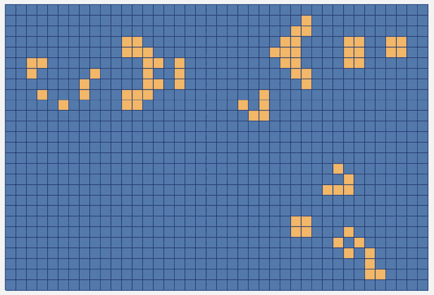

# 第七章：为你的库添加安装支持

在*第六章*，《安装依赖项和 ExternalProject_Add》中，我们讨论了如何安装现有库并在项目中使用它们。了解如何使用已安装的库非常有用，特别是当与`ExternalProject_Add`结合使用时。现在，我们将转变思路，看看如何为我们自己的库添加安装支持。这是一个庞大的话题，提供了许多不同的选项。我们无法涵盖所有内容，但我们将着重介绍 CMake 的`install`命令，它的作用以及如何使用它，还会介绍一些可用的配置选项。

在本章中你将学到的技能，如果你以后选择使自己的库可安装并通过`ExternalProject_Add`或将你的应用打包，都会非常有用。通过这样做，你将使其他开发者更容易使用你的库，并可能避免他们多次构建它。

本章我们将涵盖以下主要内容：

+   为库添加安装支持

+   处理嵌套依赖项

+   何时以及如何使用`COMPONENTS`

+   支持不同版本的库

+   编写查找模块文件

# 技术要求

为了继续学习，请确保你已经满足*第一章*，《入门》中列出的要求。包括以下内容：

+   一台运行最新**操作系统**(**OS**)的 Windows、Mac 或 Linux 机器

+   一个有效的 C/C++编译器（如果你还没有，建议使用系统默认的编译器）

本章中的代码示例可以通过以下链接找到：[`github.com/PacktPublishing/Minimal-CMake`](https://github.com/PacktPublishing/Minimal-CMake)。

# 为库添加安装支持

为库添加安装支持时，一切都围绕着`install`命令。`install`命令是我们告诉 CMake 要安装什么内容，以及文件的相对布局。好消息是，我们现有的`CMakeLists.txt`文件几乎不需要做什么更改，并且在大多数情况下，也不需要添加太多内容。不过，第一次看到我们添加的内容时可能会有些困惑，我们将在这里尽量解释清楚。

与前几章一样，我们将通过一个具体的示例，展示如何为我们现有的最简单库之一`mc-array`添加安装支持。这个静态库提供了在 C 语言中支持可调整大小的数组（非常类似于 C++中的`std::vector`）。我们在整个《生命游戏》应用中都使用了它，它是一个特别有用的工具。

我们将从查看`ch7/part-1/lib/array/CMakeLists.txt`开始。第一个变化是，我们已经明确通过提供`STATIC`参数将这个库提交为静态库，来进行使用：

```cpp
add_library(${PROJECT_NAME} mc-gol in *Chapter 4*, *Creating Libraries for FetchContent*), and we won’t be providing install support for a shared library either (we’ll cover the differences later when looking at adding install support to our mc-gol library). We could have added STATIC at the outset, but making these gradual improvements over time is never a bad thing.
			Next, we include a CMake module we haven’t come across before called `GNUInstallDirs`.

```

include(GNUInstallDirs)

```cpp

			The `GNUInstallDirs` module provides variables for standard installation directories. Even though the name refers to `GNUInstallDirs` will give us a good standard directory structure on whatever platform we’re using. To learn more about `GNUInstallDirs`, please refer to [`cmake.org/cmake/help/latest/module/GNUInstallDirs.html`](https://cmake.org/cmake/help/latest/module/GNUInstallDirs.html).
			The next minor change is updating the `target_include_directories` command to handle providing the location of `.h` files for both the regular build (`BUILD_LOCAL_INTERFACE`) and when using the installed version of the library (`INSTALL_INTERFACE`):

```

target_include_directories(

${PROJECT_NAME}

PUBLIC

$<BUILD_LOCAL_INTERFACE:${CMAKE_CURRENT_SOURCE_DIR}/include>

FetchContent），第一个生成器表达式 `BUILD_LOCAL_INTERFACE` 将评估为 true，因此 ${CMAKE_CURRENT_SOURCE_DIR}/include 将被使用。当我们的库被安装时，包含文件的相对位置可能与正常构建时不同，因此我们可以提供相对于安装目录稍微不同的位置。`${CMAKE_INSTALL_INCLUDEDIR}` 是由 GNUInstallDirs 提供的，我们将在稍后的 `install` 命令中使用它，将 .h 文件安装（复制）到安装文件夹中。也可以使用相对路径来为 $<INSTALL_INTERFACE> 提供路径，这将从安装前缀的根目录进行评估：

```cpp
$<INSTALL_INTERFACE:${CMAKE_INSTALL_INCLUDEDIR} variable here makes the relationship between the target_include_directories command and the later install command clearer.
			For good measure, we add the `DEBUG_POSTFIX` property to our target to ensure both the `Debug` and `Release` versions of the library can be installed in the same directory without overwriting one another:

```

set_target_properties(${PROJECT_NAME} PROPERTIES mc-array，当我们分别构建 Debug 和 Release 时，我们将在 macOS 和 Linux 上得到 libmc-arrayd.a 和 libmc-array.a，在 Windows 上得到 mc-array d.lib 和 mc-array.lib。

            有了这些，我们就可以开始添加 `install` 命令本身了。

            CMake 安装命令

            CMake 的 `install` 命令非常灵活，但在第一次遇到时可能会觉得难以理解。需要注意的一点是，`install` 的功能会根据传递给它的参数而大不相同。对于熟悉 C++ 的人来说，可以将 `install` 的实现看作是某种形式的 `install`，其功能依赖于上下文（它们的顺序或位置是有意义的），这也可能让事情变得相当混乱。考虑到这一点，让我们看一个具体的例子。

            传递给 `install` 的第一个参数决定了将执行哪种类型的 `install` 命令；这些被称为 `TARGETS`、`EXPORT` 和 `DIRECTORY`。该规则本质上定义了 `install` 命令所关注的内容。

            让我们回顾一下 `CMakeLists.txt` 文件中的第一个安装命令：

```cpp
install(
  TARGETS ${PROJECT_NAME}
  EXPORT ${PROJECT_NAME}-config
  ARCHIVE DESTINATION ${CMAKE_INSTALL_LIBDIR})
```

            该命令的作用是将我们库的构建产物安装到指定位置，在 macOS/Linux 上是 `libmc-array.a`，在 Windows 上是 `mc-array.lib`，并将其安装到我们使用 `CMAKE_INSTALL_PREFIX` 选定的 `lib` 文件夹中（如果未提供该路径，则为默认的系统位置）。

            第一个参数 `TARGETS` 指的是我们要安装的目标。在我们的案例中，这就是我们之前在 `CMakeLists.txt` 文件中使用 `add_library` 命令创建的库。由于这是一个小型库，我们重用了项目名称作为目标，但如果我们选择了其他名称，我们将引用那个名称。下面是一个展示这个的例子：

```cpp
add_library(dynamic-array STATIC)
...
install(
  TARGETS dynamic-array
  ...
```

            请参见 `ch7/part-2/lib/array/CMakeLists.txt`，了解如何使用不同的库名称（目标），而不是重用项目名称。我们将在本章其余部分采用这种方法，帮助区分项目/包与各个目标/库。

            我们传递给第一个`install`命令的第二个参数是`EXPORT ${PROJECT_NAME}-config`。导出意味着将目标提供给其他项目（通常通过`find_package`）。通过添加这行代码，我们通知 CMake，我们希望导出这个目标，并将其与一个以我们项目命名的配置文件（`${PROJECT_NAME}-config`，在我们这里扩展为`mc-array-config`）关联。此步骤尚未创建导出文件，但允许我们在后续的`install`命令中引用该导出，以生成`<project-name>-config.cmake`文件（我们也可以选择`${PROJECT_NAME}Config`，让 CMake 为我们生成`<ProjectName>Config.cmake`文件）。

            最后的参数是`ARCHIVE DESTINATION ${CMAKE_INSTALL_LIBDIR}`。这告诉 CMake 我们希望安装静态库的`.a`/`.lib`文件的位置。这并不是严格必要的，因为 CMake 会选择一个默认的系统位置，但显式指定并使用`GNUInstallDirs`提供的有用变量`CMAKE_INSTALL_LIBDIR`会使我们的`CMakeLists.txt`文件更加自文档化。`${CMAKE_INSTALL_LIBDIR}`很可能会扩展为`lib`，但使用这种方式提供了一个自定义点，如果用户希望覆盖库安装目录，可以根据需要进行调整。

            只需将前面的`install`命令添加到我们的`CMakeLists.txt`文件中，如果我们从`ch7/part-1/lib/array`目录运行以下命令：

```cpp
cmake -B build -G "Ninja Multi-Config" -DCMAKE_INSTALL_PREFIX=install
cmake --build build --target install
```

            我们会看到以下输出：

```cpp
[2/3] Install the project...
-- Install configuration: "Debug"
-- Installing: .../array/install/lib/libmc-arrayd.a
```

            （为提供上下文，`ch7/part-1/lib/array/CMakeLists.txt`已经包含了一个完整的安装示例，但可以随意注释掉后面的`install`命令，看看每个命令安装了什么，没安装什么。）

            这是一个好的开始，但 CMake 仍然缺少足够的信息来找到并使用我们的库。现在库文件已经安装，导出目标也已经创建，我们可以查看下一个`install`命令：

```cpp
install(
  EXPORT ${PROJECT_NAME}-config
  DESTINATION ${CMAKE_INSTALL_LIBDIR}/cmake/${PROJECT_NAME}
  NAMESPACE minimal-cmake::)
```

            这个`install`命令涉及到`EXPORT`规则。第一个参数`EXPORT ${PROJECT_NAME}-config`将这个命令与先前介绍的`${PROJECT_NAME}-config`导出链接在一起。此命令创建并安装导出文件，确保它最终被放入我们的`install`文件夹中（即`mc-array-config.cmake`文件）。我们需要提供此文件应安装的位置。如果我们没有提供，将看到以下错误信息：

```cpp
install EXPORT given no DESTINATION!
```

            这是通过`DESTINATION`参数实现的。我们再次依赖于`GNUInstallDirs`变量`CMAKE_INSTALL_LIBDIR`，然后指定一个名为`cmake`的文件夹，接着是我们的项目名称。CMake 知道要搜索这个位置，如果需要，也可以调整`${PROJECT_NAME}`和`cmake`的顺序（如果安装到默认系统目录，这一点更为重要，它决定了 CMake 配置文件的组织方式）：

```cpp
DESTINATION ${CMAKE_INSTALL_LIBDIR}/EXPORT install command is NAMESPACE. This adds a prefix to the target to be exported to reduce the chance of naming collisions with other libraries. It’s also a standard convention to disambiguate imported targets from regular targets within a CMake project (something we touched on in *Chapter 6*, *Installing Dependencies* *and ExternalProject_Add*).

```

NAMESPACE minimal-cmake::

```cpp

			If we now repeat the earlier commands (or just run `cmake --build build --target install` again), we’ll see the newly created config files be created and installed:

```

[2/3] 正在安装项目...

-- 安装配置：“调试”

-- 正在安装：.../array/install/lib/libmc-arrayd.a

-- 安装：.../array/install/lib/cmake/mc-array/mc-array-config.cmake

-- 安装：.../array/install/lib/cmake/mc-array/mc-array-config-debug.cmake

```cpp

			Note that we get two config files, one common one, and one specific to the configuration we built (this will be `Debug` by default). If we pass `--config Release` when building, a corresponding `mc-array-config-release.cmake` file is created:

```

cmake --build build --target install --config Release

```cpp

			The preceding command will output:

```

...

-- 安装：.../array/install/lib/cmake/mc-array/mc-mc-array-config.cmake 和 mc-array-config-debug.cmake/mc-array-config-release.cmake 文件，以查看底层发生了什么。有许多生成的代码我们可以安全地忽略，但需要注意的关键行如下：

```cpp
add_library(minimal-cmake::mc-array STATIC IMPORTED)
set_target_properties(minimal-cmake::mc-array PROPERTIES
  INTERFACE_INCLUDE_DIRECTORIES "${_IMPORT_PREFIX}/include")
```

            CMake 正在为我们创建一个导入的目标（因为 `mc-array` 已经构建完成），然后设置该目标的属性以显示在哪里可以找到它的 `include` 文件。然后它会遍历不同的构建配置文件，并在每个文件中根据配置为导入的目标设置更多属性：

```cpp
set_property(TARGET minimal-cmake::mc-array APPEND PROPERTY IMPORTED_CONFIGURATIONS DEBUG)
set_target_properties(minimal-cmake::mc-array PROPERTIES
  IMPORTED_LINK_INTERFACE_LANGUAGES_DEBUG "C"
  IMPORTED_LOCATION_DEBUG "${_IMPORT_PREFIX}/lib/libmc-arrayd.a")
```

            这通知 CMake 库的位置，以及构建类型（或配置）。

            深入研究这些文件并不是经常需要的，但大致了解它们在做什么，对于理解如何调试无法找到的文件问题非常有帮助。也值得注意的是，这里并没有什么魔法；CMake 只是自动生成了我们本该手动编写的许多命令（而且很可能做得比我们自己写得更好）。

            最终（幸运的是最简单的）`install` 命令涉及到 `DIRECTORY` 规则：

```cpp
install(DIRECTORY ${CMAKE_CURRENT_LIST_DIR}/include/minimal-cmake/
  DESTINATION ${CMAKE_INSTALL_INCLUDEDIR}/minimal-cmake)
```

            在这个安装步骤中，我们只是将一个目录的内容复制到另一个目录，在这种情况下是 `include` 目录。我们使用 `CMAKE_CURRENT_LIST_DIR` 获取当前 `CMakeLists.txt` 文件的路径，然后从那里引用源目录中的 `include` 文件。对于 `DESTINATION`，我们使用 `CMAKE_INSTALL_INCLUDEDIR`（这在之前的 `target_include_directories` 调用中使用过，它与 `INSTALL_INTERFACE` 生成表达式一起使用）。这将把我们的 `include` 文件放在 `include/minimal-cmake` 下（根据约定，`CMAKE_INSTALL_INCLUDEDIR` 会扩展为 `include`）。

            如果我们再运行一次 `cmake --build build --target install`，我们会看到我们的 `include` 文件会被复制到预期的安装位置：

```cpp
...
-- Installing: .../array/install/include/minimal-cmake
-- Installing: .../array/install/include/minimal-cmake/array.h
```

            文件集

            CMake `3.23` 引入了一个名为 `target_sources` 命令的新特性。指定一个文件集可以使头文件自动作为 `TARGET` 安装命令的一部分进行安装。我们在本书中坚持传统方法，但请查看 [`cmake.org/cmake/help/latest/command/target_sources.html#file-sets`](https://cmake.org/cmake/help/latest/command/target_sources.html#file-sets) 了解更多关于指定文件集的信息。

            有了 `.h` 文件，我们现在拥有了安装我们的库并在另一个项目中使用它所需的一切。

            `install` 文件夹结构现在看起来如下：

```cpp
.
├── include
│   └── minimal-cmake
│       └── array.h
└── lib
     ├── cmake
     │   └── mc-array
     │       ├── mc-array-config-debug.cmake
     │       ├── mc-array-config-release.cmake
     │       └── mc-array-config.cmake
     └── libmc-arrayd.a
```

            我们已经涵盖了很多内容，所以如果一切并不完全明了也不用担心。安装、导出和导入目标的概念随着你使用得越多会变得越清晰。一个积极的方面是，添加安装支持仅仅花了大约 10 行代码，在大局上看，这并不算太多。在`ch7/part-2/lib/array`中，除了将`mc-array`目标的名称更改为`dynamic-array`，我们还添加了一个`CMakePreset.json`文件来设置`install`目录（`"installDir"`）。只需运行`cmake --preset default`，然后运行`cmake --build build --target install`。

            现在让我们看看如何在我们的*生命游戏*应用中使用我们的数组库。

            使用我们新安装的库

            好消息是，使用我们刚刚安装的库变得简单多了。如果我们回顾一下`ch7/part-2/app/CMakeLists.txt`，与早期的`ch6/part-4/app/CMakeLists.txt`相比，有两个添加和一个删除。

            第一个添加如下：

```cpp
find_package(mc-array CONFIG REQUIRED)
```

            包的名称（`mc-array`）是我们分配给导出的名称。这与目标名称不同。它相当于我们分配给配置文件（`mc-array-config.cmake`）的名称。

            用于将`minimal-cmake-array`引入构建的`FetchContent`调用已经被移除，因为它不再需要，唯一的其他变化是更新`target_link_libraries`命令，使其引用新目标并添加我们之前添加的命名空间前缀：

```cpp
target_link_libraries(
  ${PROJECT_NAME} PRIVATE app folder’s CMakeLists.txt file. The last change needed is to update the CMAKE_PREFIX_PATH variable stored in the CMakePresets.json file to include the install path of where mc-array was installed. We could have installed the library to the same install folder as our previously installed dependencies, but installing it to a separate location and providing multiple paths can sometimes be useful. To provide more than one install path, separate each with a semicolon:

```

"CMAKE_PREFIX_PATH"：

"${sourceDir}/../third-party/installshared-ninja"，然后构建我们选择的配置，例如：

```cpp
cmake --preset shared-ninja
cmake --build build/shared-ninja --config Debug
```

            我们现在已经成功地从当前应用中使用了已安装的库。可以像往常一样运行应用，通过在应用目录下运行`./build/shared-ninja/Debug/minimal-cmake_game-of-life_window`来启动应用。由于每个`part-<n>`都是完全独立的，所以每个示例仍然需要像之前一样安装第三方依赖，并通过运行`compile-shader-<platform>.sh/bat`编译着色器。每章的`README.md`文件都描述了构建和运行每个示例所需的命令；请参考它们以回顾所有必要的步骤。

            现在我们已经安装了一个简单的静态库，接下来我们将探讨一个稍微复杂一点的案例，处理安装一个有自己依赖关系的库。

            处理嵌套依赖

            当我们说到嵌套依赖时，我们指的是我们想要依赖的库的依赖项（你可以把这些看作是间接依赖，也叫做**传递性依赖**）。例如，如果一个应用依赖于库 A，而库 A 又依赖于库 B，那么就应用而言，库 B 嵌套在库 A 中。无论这个依赖是私有的（对应用隐藏）还是公共的（对应用可见），都影响我们如何处理它。

            在我们刚才看到的示例（`mc-array`）中，幸运的是，当提供安装支持时，我们不需要担心任何依赖项。如果有依赖项，事情会变得稍微复杂一些，但一旦我们理解了需要做什么以及为什么做，支持起来并不复杂。

            为了更好地理解这一点，我们将注意力转向我们的*生命游戏*库，`mc-gol`，它位于`ch7/part-2/lib/gol`。最好为这个库以及`mc-array`添加安装支持，所以，如果我们复制刚才演示的三个 CMake `install`命令，并将它们添加到`ch7/part-2/lib/gol/CMakeLists.txt`的底部，同时在顶部添加`include(GNUInstallDirs)`并更新`target_include_directories`与`INSTALL_INTERFACE`，我们可以看看会发生什么（请参阅`part-3`获取确切的更改）。

            如果我们从`ch7/part-2/lib/gol`配置、构建并安装共享版本的库（通过设置`MC_GOL_SHARED=ON`），一切都会按预期工作，但如果我们尝试构建库的静态版本，我们会看到 CMake 报告三处错误：

```cpp
CMake Error: install(EXPORT "mc-gol-config" ...) includes target "mc-gol" which requires target "as-c-math" that is not in any export set.
CMake Error: install(EXPORT "mc-gol-config" ...) includes target "mc-gol" which requires target "mc-array" that is not in any export set.
CMake Error: install(EXPORT "mc-gol-config" ...) includes target "mc-gol" which requires target "mc-utils" that is not in any export set.
```

            这些错误的原因是，我们在`mc-gol`中使用的依赖项是通过`FetchContent`引入的，也需要被导出，因为它们被视为构建和安装的静态库的一部分。即使这些依赖项在`target_link_libraries`中被标记为`PRIVATE`，情况依然如此。处理这个问题有两种不同的方法。我们将作为`mc-gol`的一部分来看第一个方法，并作为我们将在*公共嵌套* *依赖项*部分中提取的新库来看第二个方法。

            私有嵌套依赖项

            在`mc-gol`的情况下，我们显式地将所有依赖项设置为私有（它们仅在`gol.c`中使用），并且我们不希望客户端或库的用户知道它们。幸运的是，有一个方便的生成器表达式，我们可以使用它来确保这些目标不会被导出，并且只在构建时可见。我们之前在`target_include_directories`的上下文中遇到过它，那就是`BUILD_LOCAL_INTERFACE`：

```cpp
target_link_libraries(
  ${PROJECT_NAME} PRIVATE
  $<BUILD_LOCAL_INTERFACE will ensure they are not treated as part of the export set and no further work is needed. This is the approach taken in ch7/part-3/lib/gol/CMakeLists.txt. The library is updated to search for mc-array in the installed location instead of using FetchContent and updates the target name to be game-of-life. The target_link_libraries command looks as follows:

```

target_link_libraries(

game-of-life PRIVATE

$<BUILD_LOCAL_INTERFACE:minimal-cmake::dynamic-array

as-c-math 和 mc-utils）在 BUILD_LOCAL_INTERFACE 内，但将所有内容放入其中可以确保 minimal-cmake::dynamic-array 不会被添加到生成的 mc-gol-config.cmake 文件的 INTERFACE_LINK_LIBRARIES 中。

            唯一需要的其他更改是确保我们安装共享库文件（在`mc-array`的情况下我们不需要这个，因为它只能构建为静态库）。现在，`install` `TARGET` 命令如下所示：

```cpp
install(
  TARGETS game-of-life
  EXPORT ${PROJECT_NAME}-config
  ARCHIVE DESTINATION ${CMAKE_INSTALL_LIBDIR}
  LIBRARY DESTINATION ${CMAKE_INSTALL_LIBDIR}
  LIBRARY and RUNTIME along with the corresponding install locations will ensure the .dylib/.so files on macOS/Linux, and .dll files on Windows, are copied to the correct location when building and installing the library as shared.
			Public nested dependencies
			When our nested dependencies are public, and are part of the interface of our library, there’s a little more work we need to do. To demonstrate this, we’re going to create a new library called `mc-draw`, found in `ch7/part-4/lib/draw`, that will provide some useful debug drawing functions using `bgfx` for reuse in other projects. It will also give us an example of how to export a nested dependency.
			The overall shape of the `mc-draw` `CMakeLists.txt` file is remarkably like that of `mc-gol`. Both can be built as either static or shared libraries, and both now separate the project name from the target name (in the case of `mc-draw`, the target/library name is `draw`, with the `minimal-cmake` namespace).
			The first significant difference is a subtle change to the `target_link_libraries` command:

```

target_link_libraries(

draw

PUBLIC as-c-math

PRIVATE $<BUILD_LOCAL_INTERFACE:bgfx::bgfx minimal-cmake::dynamic-array>)

```cpp

			We’re keeping `minimal-cmake::dynamic-array` and `bgfx` as private dependencies (we could make `bgfx` public too, following the same approach as we’ll describe here, but as the windowed *Game of Life* application we’re building already depends on it, we don’t need to at this time). The main change is making `as-c-math` public. This makes the transitive dependency explicit, so any application using `minimal-cmake::draw` will also get `as-c-math` without also needing to depend on it separately.
			The next change is an addition to the `install` `EXPORT` command:

```

install(

EXPORT ${PROJECT_NAME}-config

DESTINATION ${CMAKE_INSTALL_LIBDIR}/cmake/${PROJECT_NAME}

NAMESPACE minimal-cmake::

使用`find_package`命令首先定位`as-c-math`依赖项，然后再尝试定位依赖于`as-c-math`的 draw 库。

            单独来看，所有前述的变更只是将原本会生成的`mc-draw-config.cmake`文件的名称更改为`mc-draw-targets.cmake`，但这是因为我们将自己制作配置文件，然后从那里引用这个生成的文件。为此，我们在与`CMakeLists.txt`文件相同的目录中创建一个新的文件，命名为`mc-draw-config.cmake.in`。这是一个模板文件，用于生成实际的`mc-draw-config.cmake`文件，其内容如下：

```cpp
@PACKAGE_INIT@
include(CMakeFindDependencyMacro)
find_dependency(as-c-math)
include(${CMAKE_CURRENT_LIST_DIR}/mc-draw-targets.cmake)
```

            第一行在使用`configure_package_config_file`时是必需的（这是我们稍后会介绍的命令），然后我们引入一个 CMake 模块（`CMakeFindDependencyMacro`），以便我们能在`as-c-math`上调用`find_dependency`。`find_dependency`命令是`find_package`的包装器，专门设计用于在包配置文件中使用（有关`find_dependency`的更多信息，请参见[`cmake.org/cmake/help/latest/module/CMakeFindDependencyMacro.html`](https://cmake.org/cmake/help/latest/module/CMakeFindDependencyMacro.html)）。

            即使我们使用`FetchContent`将`as-c-math`引入，并作为主构建的一部分进行构建，它也需要安装支持，以便我们能够将其作为导出集的一部分。这是为了让调用`find_package(mc-draw)`时首先能找到`as-c-math`，正如之前提到的（要查看如何添加此支持，请参考[`github.com/pr0g/as-c-math`](https://github.com/pr0g/as-c-math)并查看`bfdd853`提交）。最后一行包含了我们之前`install`的`EXPORT`命令生成的文件（`mc-draw-targets.cmake`）。

            剩下的就是手动使用此模板生成新的`mc-draw-config.cmake`文件。为此，我们使用前面提到的`configure_package_config_file`命令。我们需要先包含`CMakePackageConfigHelpers` CMake 模块，然后调用代码如下：

```cpp
configure_package_config_file(
  ${PROJECT_NAME}-config.cmake.in ${PROJECT_NAME}-config.cmake
  INSTALL_DESTINATION ${CMAKE_INSTALL_LIBDIR}/cmake/${PROJECT_NAME})
install(FILES 
  "${CMAKE_CURRENT_BINARY_DIR}/${PROJECT_NAME}-config.cmake"
  INSTALL_DESTINATION. The following install command just copies the config file to the right location as part of the install process (notice how the values passed to INSTALL_DESTINATION and DESTINATION match).
			`configure_package_config_file` is used to ensure the config file is relocatable (it avoids the config file using hardcoded paths). For more information about `CMakePackageConfigHelpers`, please see [`cmake.org/cmake/help/latest/module/CMakePackageConfigHelpers.html`](https://cmake.org/cmake/help/latest/module/CMakePackageConfigHelpers.html).
			With these changes made, we can now install our library and update our `CMakeLists.txt` application file. Looking at `ch7/part-4/app/CMakeLists.txt`, we can see we now have the obligatory `find_package` call to find the installed library:

```

find_package(mc-draw CONFIG REQUIRED)

```cpp

			This is followed by an update to `target_link_libraries` to link against the new target (`minimal-cmake::draw`). The only other addition is to remember to copy the `.dll` file to the app build folder using the familiar `add_custom_command` and `copy_if_different` operation so our Windows builds work as expected.
			When trying to configure, if the `as-c-math` dependency cannot be found (this can be replicated by commenting out `find_dependency` in the `mc-draw-config.cmake.in` file before installing), then CMake will output an error resembling the following:

```

找到的包配置文件：

../minimal-cmake/ch7/part-4/lib/draw/install/lib/cmake/mc-draw/mc-draw-config.cmake

但它将 mc-draw_FOUND 设置为 FALSE，因此包“mc-draw”被认为是未找到。包给出的原因是：

以下导入的目标被引用，但缺失：在问题解决之前显示为 NOT_FOUND。

            一切应该已经正常工作，所以从`ch7/part-4/app`开始，如果我们配置并构建（使用 CMake 预设将使这变得更简单），我们可以启动我们更新后的应用程序：

```cpp
cmake --preset multi-ninja
cmake --build build/multi-ninja
./build/multi-ninja/Debug/minimal-cmake_game-of-life_window
```

            记住，我们还需要构建并安装`part-4`中的其他必需库，包括位于`third-party`文件夹中的`SDL2`和`bgfx`，以及位于`lib`文件夹中的`mc-array`、`mc-gol`和`mc-draw`。每个`lib`文件夹中都有`CMakePreset.json`文件来正确配置安装和前缀路径；只需运行`cmake --preset list`显示可用的预设，然后运行`cmake --preset <preset-name>`进行配置。要构建和安装，请为每个库运行`cmake --build build/<build-folder> --target install`。

            关于第三方依赖的提醒，只需在`third-party`文件夹中运行`cmake -B build -G <generator>`和`cmake --build build`，让`ExternalProject_Add`处理所有与`SDL2`和`bgfx`的相关操作。最后要记住的是，如果你还没有编译着色器，可以在构建并安装`bgfx`后，从`app`文件夹运行对应的批处理/脚本来编译。

            奖励将是一个更新版的*生命游戏*应用程序，借助我们新的`mc-draw`库，界面颜色和网格线将更加愉悦。

            

            图 7.1：改进版生命游戏应用程序

            更新后的*生命游戏*应用程序现在也可以互动了。点击网格外的地方将暂停和恢复模拟，而点击一个网格单元将切换该单元的开关状态。通过对网格进行少量修改，生成的各种奇特图案很有趣。

            接下来，我们将看看如何将库拆分为独立的部分，这些部分被称为**组件**。

            何时以及如何添加组件

            随着库的增长，可能会有一个时刻，当将整体库拆分为几个更小的部分时变得有意义。在这一点上，你可能会开始把库看作是一个包，由一个或多个不同的库组成。将包拆分为独立的组件，对于用户来说非常有帮助，因为他们只需要链接所需的功能。这有助于减小应用程序的二进制文件大小，并通过减少与外部依赖项的链接时间来提高构建速度。对于库本身，拆分代码也有利于解耦和打破依赖。

            为了演示这个，我们将更新我们的`mc-draw`库，使其包含三个独立的组件：`vertex`、`line`和`quad`。然后，我们可以在`find_package`调用中明确请求所需的组件，如下所示：

```cpp
find_package(mc-draw CONFIG REQUIRED target_link_libraries:

```

target_link_libraries(

...

minimal-cmake::vertex

minimal-cmake::line

minimal-cmake::quad

...

```cpp

			To understand how to achieve this, let’s review `ch7/part-5/lib/draw/CMakeLists.txt`. The key difference is instead of creating a single library with `add_library` called `draw`, we instead create three libraries called `vertex`, `line`, and `quad` in a nearly identical way (it’s completely possible to create utility functions to remove some of the boilerplate, but for simplicity, the examples omit this to avoid any potentially confusing abstractions).
			Each library (or component) has its own `<component>-config.cmake` file, just as we had with the top-level package. This is the mechanism by which we create the components we refer to in the `find_package` command. Fortunately, we don’t have to create each of these ourselves, but we do need to update our existing `mc-draw-config.cmake.in` file.
			Before we do so, the first target we need to talk about is `vertex`. This is depended on by both `quad` and `line` (it appears in their `target_link_libraries` command). It is now responsible for exporting the `as-c-math` dependency, so, the approach we took before of creating a `*-targets.cmake` file goes to `vertex` (we now have a `vertex-config.cmake.in` file with the earlier logic, referring internally to `vertex-targets.cmake` instead of `mc-draw-targets.cmake`). The top-level package config template file, `mc-draw-config.cmake.in`, has been updated to the following:

```

@PACKAGE_INIT@

# 可以搜索的有效组件

set(_draw_supported_components vertex line quad)

# 遍历组件，尝试查找

foreach(component ${${CMAKE_FIND_PACKAGE_NAME}_FIND_COMPONENTS})

# 如果我们找不到组件，设置绘图库为 no

# 找不到后，通知用户缺少的组件

if (NOT ${component} IN_LIST _draw_supported_components)

set(mc-draw_FOUND False)

set(mc-draw_NOT_FOUND_MESSAGE "不支持的组件：${component}")

else()

include(${CMAKE_CURRENT_LIST_DIR}/${component}-config.cmake)

endif()

endforeach()

```cpp

			After the required `@PACKAGE_INIT@` string, we provide a variable holding all the available components provided by the package. What follows is then a check to ensure the components requested from `find_package` are in our list of supported components. Say a user tries to request a component that does not exist, for example:

```

find_package(mc-draw CONFIG REQUIRED COMPONENTS circle)

```cpp

			Then, they will see the following error message:

```

找到的包配置文件：

../minimal-cmake/ch7/part-5/lib/draw/install/lib/cmake/mc-draw/mc-draw-config.cmake

但它将 mc-draw_FOUND 设置为 FALSE，因此包“mc-draw”被认为未找到。包给出的原因是：

不支持的组件：circle

```cpp

			This kind of error message is helpful to let a user know whether they’ve mistyped a component or are trying to use one that does not exist.
			One other important detail to note is we do not need to have a component map directly to a single target as we’ve done so previously, with an individual component for `vertex`, `quad`, and `line`. In a larger package, we may choose to create a `geometry` component that contains all the geometric libraries in our application (e.g., `vertex`, `quad`, `line`, `circle`, etc.). For a simple example showing this technique, see [`github.com/pr0g/cmake-examples/tree/main/examples/more/components`](https://github.com/pr0g/cmake-examples/tree/main/examples/more/components), which shows grouping multiple libraries under a single component (two libraries, `hello` and `hey`, are made part of the `greetings` component, with `goodbye` made part of the `farewells` component).
			COMPONENT versus COMPONENTS
			There is unfortunately another keyword in CMake called `COMPONENT` that also happens to be part of the `install` command. It bears no relation to the `COMPONENTS` keyword that’s part of `find_package`. It is used to split install artifacts based on how the library/package is to be used (`Runtime` and `Development` are commonly suggested components to separate runtime and development functionality, for example). We haven’t covered the `COMPONENT` keyword in the context of the `install` command, but to learn more about how to use it, see the CMake install documentation ([`cmake.org/cmake/help/latest/command/install.html`](https://cmake.org/cmake/help/latest/command/install.html)) and CMake `install` command documentation ([`cmake.org/cmake/help/latest/manual/cmake.1.html#install-a-project`](https://cmake.org/cmake/help/latest/manual/cmake.1.html#install-a-project)) (`cmake --install <build> --``component <comp>`).
			Whether you decide to use components or not will very much depend on the type and size of the library you’re building. One example of a library that relies heavily on components is the `s3`, `ec2`, etc.).
			Supporting different versions of a library
			Back in *Chapter 2*, *Hello, CMake!*, when we introduced the `project` command, we touched on the `VERSION` parameter, but haven’t yet had the opportunity to see how to apply it, and why it’s useful. In this section, we’ll show how to add a version to our `mc-draw` library and how to request the correct version from our `find_package` command.
			Versioning for libraries is important for us to know what functionality and interface the library we’re currently using provides. Versioning is used to manage change, and, most importantly, handle API updates that may cause breaking changes. The software industry has largely adopted `<Major>.<Minor>.<Patch>` format (e.g., `1.45.23`) where numbers further to the left represent a more notable change. For a full introduction, see [`semver.org/`](https://semver.org/). Luckily, CMake supports this format, so it’s easy to integrate into our project.
			If we look at `ch7/part-6/lib/draw/CMakeLists.txt`, we can see the changes needed to add version support by reviewing the differences between it and the corresponding file in `part-5`. The first change is adding `VERSION` to our project command:

```

project(

mc-draw

LANGUAGES C

我们可以通过与 CMakeLists.txt 文件相同的方式引用项目名称，只是这次不是使用 ${PROJECT_NAME}，而是使用 ${PROJECT_VERSION}。

            然后，大多数剩余的修改只是将 `${PROJECT_NAME}` 替换为 `${PROJECT_NAME}-${PROJECT_VERSION}`，或者在 `ARCHIVE`、`LIBRARY` 和 `RUNTIME` 目标的情况下附加它。这样做的原因是为了使得在同一位置安装多个版本的相同库成为可能。

            我们需要的最后一个添加是 `write_basic_package_version_file` CMake 命令，用于为我们生成一个 `*-config-version` 文件。它看起来如下：

```cpp
write_basic_package_version_file( 
  "${CMAKE_CURRENT_BINARY_DIR}/${PROJECT_NAME}/${PROJECT_NAME}-config-version.cmake"
  VERSION ${PROJECT_VERSION}
  COMPATIBILITY SameMajorVersion)
```

            我们将其命名为 `mc-draw-config-version` 并将 `${PROJECT_VERSION}` 传递给 `VERSION` 参数。`COMPATIBILITY` 字段用于决定库在接受版本请求时的严格程度。选项有 `AnyNewerVersion`、`SameMajorVersion`、`SameMinorVersion` 和 `ExactVersion`。我们选择了 `SameMajorVersion`，这意味着只要版本的第一个数字匹配，库就会被找到。

            我们应用程序文件夹中的 `CMakeLists.txt` 文件中的 `find_package` 调用稍微更新为以下内容：

```cpp
find_package(mc-draw 3.5.4 (even if the major versions match), things will fail (the version requested must always be the same or lower than the installed library). By using SameMajorVersion, if we request 2.0, things will fail; the following is an example showing the expected output:

```

CMake 错误位于 CMakeLists.txt 的第 16 行 (find_package)：

找不到与请求的版本 "2.0" 兼容的 "mc-draw" 包的配置文件。

以下配置文件被考虑过，但未被接受：

../minimal-cmake/ch7/part-6/lib/draw/install/lib/cmake/mc-draw-3.5.4/mc-draw-config.cmake，AnyNewerVersion，当我们安装库时，要求 2.0 不会产生错误，因为已安装的版本 3.5.4 会大于请求的 2.0 版本。决定使用哪种方案可能会很困难，这将取决于你愿意支持的向后兼容性。有关不同兼容模式的更多信息，请参见 [`cmake.org/cmake/help/latest/module/CMakePackageConfigHelpers.html#generating-a-package-version-file`](https://cmake.org/cmake/help/latest/module/CMakePackageConfigHelpers.html#generating-a-package-version-file)。

            编写查找模块文件

            在我们结束关于安装的讨论之前，还有一个话题是有用的。到目前为止，我们只讨论了使用配置模式查找依赖项，但也有一种模式，我们在 *第六章* 中简单提到过，叫做 **模块模式**。模块模式在与没有使用 CMake 本地构建的库集成时很有用（因此无法为我们自动生成配置文件）。

            在 `ch7/part-7/cmake` 目录中，添加了一个新的文件 `Findmc-gol.cmake`，它充当了我们将在 `ch7/part-7/lib/gol/install` 中安装的 `mc-gol` 库的查找模块文件。该查找模块文件从技术上讲是多余的，因为我们可以像以前一样使用生成的 `mc-gol-config.cmake` 文件进行配置模式，但假设我们使用一个单独的工具构建了这个库，并知道构建产物（库文件）和头文件的位置。

            要将 `mc-gol` 库引入我们的构建中使用 `find_package`，我们首先需要查看 `Findmc-gol.cmake` 查找模块文件。第一行使用 `find_path` CMake 命令来填充 `mc-gol_INCLUDE_DIR` 变量：

```cpp
find_path(
  mc-gol_INCLUDE_DIR minimal-cmake-gol PATHS ${mc-gol_PATH}/include)
```

            `mc-gol_PATH` 变量是我们在配置主应用程序时提供的，用来指定相对于包含文件和库文件的路径（这在 `ch7/part-7/app` 中的 `CMakePresets.json` 文件中设置）。本质上，发生的情况是一种模式匹配，我们传递给 `PATHS` 的值与 `include` 文件所在的路径匹配。

            下一行执行几乎相同的操作，不过这次不是填充 `include` 目录变量，而是使用 `find_library` 填充 `mc-gol_LIBRARY`，保存库文件的路径：

```cpp
find_library(
  mc-gol_LIBRARY
  NAMES game-of-life game-of-lifed
  PATHS ${mc-gol_PATH}/lib)
```

            `NAMES` 参数要求提供我们库的精确名称（这里可以提供多个名称）。我们还必须包含带有 `d` 后缀的库的调试版本名称，因为我们使用 `CMAKE_DEBUG_POSTFIX` 来区分库的 `Debug` 和 `Release` 版本。如果我们不这么做，`find_library` 将找不到库的调试版本。还值得一提的是，`find_library` 并不递归查找，所以我们必须提供库文件存储的精确文件夹位置。

            接下来是一个非常有用的 CMake 提供的工具，名为 `find_package_handle_standard_args`，用于在找不到前面提到的两个变量（`mc-gol_INCLUDE_DIR` 和 `mc-gol_LIBRARY`）时进行适当的消息处理。它还处理与 `find_package` 调用相关的其他细节，尽管目前我们不需要关注这些细节。如果你想了解更多关于该命令幕后做了什么，可以访问 [`cmake.org/cmake/help/latest/module/FindPackageHandleStandardArgs.html`](https://cmake.org/cmake/help/latest/module/FindPackageHandleStandardArgs.html) 获取更多信息。

            最后，如果库文件被找到，我们会调用 `add_library` 并将 `minimal-cmake::game-of-life` 作为一个导入的目标，同时使用 `set_target_properties` 将我们填充的变量与 `minimal-cmake::game-of-life` 目标关联起来：

```cpp
if(mc-gol_FOUND AND NOT TARGET minimal-cmake::game-of-life)
  add_library(minimal-cmake::game-of-life UNKNOWN IMPORTED)
  set_target_properties(
    minimal-cmake::game-of-life
    PROPERTIES
      IMPORTED_LOCATION "${mc-gol_LIBRARY}"
      INTERFACE_INCLUDE_DIRECTORIES "${mc-gol_INCLUDE_DIR}")
endif()
```

            前面提到的两个命令非常类似于 CMake 在 `ch7/part-7/lib/gol/install/lib/cmake/mc-gol` 文件夹中的 `mc-gol-config-debug/release.cmake` 和 `mc-gol-config.cmake` 文件为我们生成的命令。为了简化，我们没有做太多工作来处理不同的配置（调试版与发布版）或库类型（静态与共享），但如果需要，这一切都是可以实现的。

            倒数第二步是让 CMake 知道在哪里找到我们新的 `Findmc-gol.cmake` 文件，并填写 `mc-gol_PATH` 变量。我们在 `ch7/part-7/app/CMakePresets.json` 文件中完成这两项工作，通过更新 `CMAKE_MODULE_PATH` 以包含我们新找模块文件的位置，并设置 `mc-gol_PATH` 为我们库文件所在的位置：

```cpp
  ...
  "CMAKE_MODULE_PATH": "${sourceDir}/../cmake",
  "mc-gol_PATH": "${sourceDir}/../lib/gol/install"
}
```

            最后的修改是在 `ch7/part-7/app` 中的 `CMakeLists.txt` 文件，我们必须明确指定 `MODULE`，而不是 `CONFIG`，用于 `mc-gol`：

```cpp
find_package(mc-gol cmake --preset multi-config will display:

```

...

-- 找到 mc-gol: /Users/tomhultonharrop/dev/minimal-cmake/ch7/part-

7/lib/gol/install/lib/libgame-of-lifed.dylib

...

```cpp

			It’s likely there won’t be a need to write find module files often, but they can be incredibly helpful in a pinch. It’s much preferable to have CMake do the arduous work of generating and installing config files for us, but if that isn’t a possibility, find modules provide a useful workaround.
			Summary
			Three cheers for making it to the end of this chapter. Installing is not an easy concept to master, and this is without a doubt the trickiest part of CMake we’ve covered so far. In this chapter, we covered adding simple install support to a static library and then differentiating our package name from the installed library. We then looked at adding install support to a library with private dependencies and how to handle public dependencies as well. Next, we covered splitting up a library or package into components and then looked at how to provide robust versioning support. We closed by reviewing how to create a find module file to integrate libraries built outside of the CMake ecosystem. We also continued to improve and refine our *Game of* *Life* application.
			In the next chapter, we’re going to return to streamlining our setup yet again. Right now, we’re back to having to perform a lot of manual installs, which can become tedious, so we’ll look at improving this with the help of `ExternalProject_Add`. To improve things further, we’ll turn to what are often referred to as **super builds**, to neatly combine building our external dependencies and main project in one step. Finally, we’ll look at installing our application and will get things ready for packaging.

```

```cpp

```

```cpp

```

```cpp

```

```cpp

```

```cpp

```

```cpp

```

```cpp

```

```cpp

```

```cpp

```
