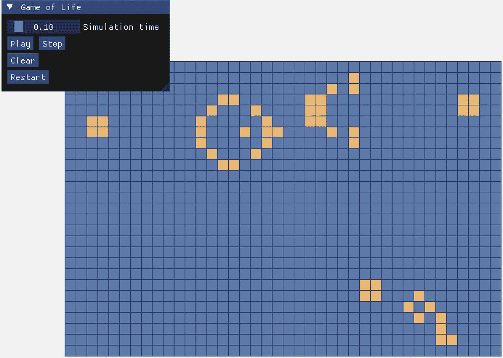
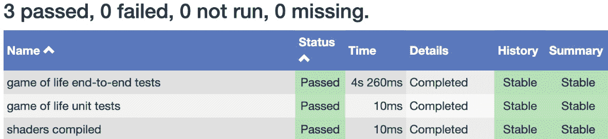
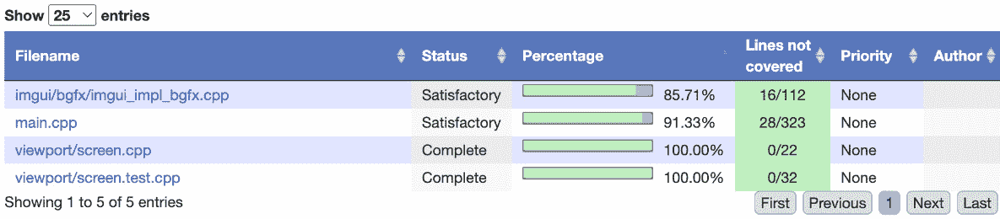

# 第九章：为项目编写测试

在本章中，我们将讨论 CMake 如何帮助我们处理软件开发中的一个极其重要的方面：**测试**。测试在任何广泛使用或长期存在的项目中都是至关重要的，它有助于建立对功能的信心，并在添加和改进新特性时帮助避免回归。在一个正常的项目中，强烈建议从一开始就考虑测试；之后引入测试会是一项挑战。幸运的是，借助我们通过将功能拆分为独立库的项目结构，测试变得更加简单。

CMake 提供了一个名为 **CTest** 的附加应用程序，旨在将多种类型的测试整合到一个平台下。我们将看到如何将测试添加到我们的库中以及应用程序中，并了解如何利用 CTest 使从 CMake 运行它们变得更简单。

在本章中，我们将涵盖以下主要主题：

+   理解 CTest

+   向库中添加单元测试

+   向应用程序添加端到端测试

+   添加其他类型的测试

+   使用 CDash 与 CTest

# 技术要求

为了跟随本章内容，请确保你已满足 *第一章*《入门》的要求。这些要求包括以下内容：

+   一台运行最新 **操作系统**（**OS**）的 Windows、Mac 或 Linux 计算机

+   一个可工作的 C/C++ 编译器（如果你还没有，建议使用每个平台的系统默认编译器）

本章中的代码示例可以通过以下链接找到：[`github.com/PacktPublishing/Minimal-CMake`](https://github.com/PacktPublishing/Minimal-CMake)。

# 理解 CTest

在我们开始查看如何将 CTest 添加到现有的 `CMakeLists.txt` 文件并使用 `ctest` 命令行应用程序之前，理解 CTest 是什么，以及，或许更重要的是，理解它不是什麽，十分重要。

`CMakeLists.txt` 文件有两个组成部分，用于描述和添加测试，另一个是 `ctest` **命令行界面**（**CLI**），用于在编译测试后运行它们。CTest 本身并不是一个特定语言的测试库。完全可以在一个由 CMake 创建的项目中添加测试，而根本不使用 CTest（例如，通过创建一个依赖于著名测试库的单独测试可执行文件，如 Google Test ([`github.com/google/googletest`](https://github.com/google/googletest)) 或 Catch2 ([`github.com/catchorg/Catch2`](https://github.com/catchorg/Catch2))）。CTest 并不是这些库的替代品，后者在编写单元测试和集成测试方面提供了极好的支持。

测试类型

在本章中，我们将提到三种不同类型的测试：单元测试、集成测试和端到端测试。简而言之，**单元测试**通常测试一个独立的类型或组件，而不会引入任何依赖（例如，测试在特定数学类型（如向量或矩阵）上的操作就算作单元测试）。**集成测试**则模糊不清；它们通常位于一个范围内，涉及多个类型/类/组件的交互，以确保它们按预期执行（例如，在一个游戏中，集成测试可能会检查玩家角色和相机组件的交互）。在这一阶段，这也是引入桩（stubs）和/或模拟（mocks）的地方（这是一种避免创建昂贵或不可靠依赖（如数据库或远程 API）的方法），事情可能会变得更加复杂（由于在 CMake 上下文中单元测试和集成测试非常相似，本章将专注于单元测试）。最后，**端到端测试**模拟最终用户与应用程序的交互。这些测试通常是最复杂且最脆弱的，但仍然具有价值，保持少量的端到端测试可以确保整个应用程序按预期执行，而无需手动检查。这三种测试类型通常在测试金字塔中表示（单元测试在底部，集成测试居中，端到端测试在顶部）。一般建议是，金字塔越高，这种类型的测试就越少（单元测试很多，端到端测试很少），这主要由时间、可靠性和成本等指标驱动。

CTest 提供的是一个统一的接口，用于一起运行多种测试并以一致的方式报告失败。这在处理多种语言和风格的不同类型测试时非常有价值。例如，一个应用程序可能有一组使用 C 或 C++ 编写的单元测试和集成测试，这些测试被编译为一个独立的测试可执行文件，还有端到端测试，它启动并运行应用程序让它自我测试（通常通过脚本语言，如 Python，或内置的测试运行器），以及用来验证生成文件的临时 shell 脚本。通过 CTest，所有这些测试方法都可以结合起来并通过单一命令执行，输出结果只显示是否通过或失败。

CTest 是一个极其灵活的工具，支持多种不同类型的测试（甚至可以在测试阶段编译代码）。我们不会涵盖它的所有功能，但我们会尽力覆盖一些最有用的操作，并为您将来在自己的项目中使用 CTest 提供一个起点。

# 向库添加单元测试

现在我们了解了 CTest 提供的功能，让我们来看一个具体的例子，展示如何向现有的两个库添加单元测试，我们从`mc-array`开始。首先要说明的是，我们可以选择几种不同的方式来构建项目以支持测试。一个选择是创建一个与根目录`CMakeLists.txt`文件解耦的子目录：

```cpp
.
├── CMakeLists.txt
├── ...
└── tests
    ├── CMakeLists.txt
    └── tests.cpp
```

使用这种设置，用户需要进入子文件夹并运行标准的 CMake 配置和构建命令。测试项目将会链接到顶层应用程序，可能依赖于使用`SOURCE_DIR`的相对路径的`FetchContent`。

另一种选择是保持前述布局，但在启用测试选项时使用`add_subdirectory`来添加`tests`子文件夹。嵌套的`CMakeLists.txt`文件可以链接到库，因为在调用`add_subdirectory`时，库会在作用域内。如果库足够小，也可以完全省略`tests`文件夹，将测试可执行文件直接放在根级别的`CMakeLists.txt`文件中。

在`ch9/part-1/lib/array/CMakeLists.txt`中，我们选择了将内容保持在一行，而在`ch9/part-1/lib/gol/CMakeLists.txt`中，我们使用了`add_subdirectory`。这只是为了给出两种版本的示例；内容几乎是相同的。唯一值得注意的区别是在引用项目中的测试文件时，在嵌套文件夹示例中指定了`CMAKE_SOURCE_DIR`。这是为了确保文件路径相对于根`CMakeLists.txt`文件，而不是`tests`子文件夹。此外，在调用`ctest`时，两个版本之间还需要一个细微的区别，我们将在本节后面讨论。

## CMakeLists.txt 的 CTest 更改

从`ch9/part-1/lib/array/CMakeLists.txt`开始，让我们一步步了解如何添加 CTest 支持。

第一个更改是添加一个名为`MC_ARRAY_BUILD_TESTING`的新选项，用于启用或禁用构建测试：

```cpp
option(MC_ARRAY_BUILD_TESTING "Enable testing" OFF)
```

请注意，我们使用`MC_ARRAY`前缀来减少与其他项目发生冲突的可能性。我们还将其默认为`OFF`（CMake 常量表示假；我们也可以使用`0`、`NO`或`FALSE`，但在此上下文中`OFF`最为清晰。有关更多信息，请参见[`cmake.org/cmake/help/latest/command/if.html#constant`](https://cmake.org/cmake/help/latest/command/if.html#constant)）。我们这样做是为了成为一个负责任的公民，防止下游用户在忘记禁用`MC_ARRAY_BUILD_TESTING`时，不小心构建测试。

在`CMakeLists.txt`文件的底部，我们检查`MC_ARRAY_BUILD_TESTING`选项是否已定义，只有在其定义时，我们才会引入 CTest 模块：

```cpp
include(CTest)
```

当我们包含此模块时，CMake 会创建一个新的 `BUILD_TESTING` 选项。不幸的是，这个选项默认设置为 `ON`，从用户的角度来看并不理想。如果我们决定在 `CMakeLists.txt` 文件的顶部包含 CTest 模块，我们可以在测试代码周围使用 `if (BUILD_TESTING)` 检查；然而，在 `FetchContent` 的上下文中包含此项目时，这就是一个全有或全无的设置。例如，我们的 *生命游戏* 库依赖于 `mc-array`，如果我们使用 `FetchContent` 包含了 `mc-array`，并且 `mc-array` 和 `mc-gol` 都使用 `BUILD_TESTING`，那么我们只能运行所有的测试或不运行任何测试。我们可能只希望在更改 *生命游戏* 库时运行它的测试，因此每个项目的选项让我们能够更好地控制哪些项目构建它们的测试。

在 `include(CTest)` 之后，我们使用 `FetchContent` 引入一个名为 `dynamic-array-test` 的测试库，并添加我们有的、能验证其功能的新测试文件：

```cpp
add_executable(dynamic-array-test)
target_sources(
  dynamic-array-test PRIVATE src/array.test.c)
```

请注意，我们已将新测试文件添加到与 `array.c` 相同的物理位置：

```cpp
.
├── CMakeLists.txt
└── src
    ├── array.c
    └── .test being inserted between the file name and extension. For unit tests, this is a common approach and has the big advantage of making the test code easy to find. It’s well understood that tests provide an incredibly valuable form of documentation, containing lots of examples of how to use a particular type. By keeping both implementation and test code together, it makes maintaining and understanding the code easier. Another benefit of tests as documentation is that tests are more likely to be kept up to date as code changes because not doing so will result in the tests failing or not compiling (that’s as long as you’re building and running them regularly, of course).
			The previously outlined approach is recommended for unit tests when there’s a one-to-one mapping between the tests and the type but is less applicable for higher-level integration tests. In those cases, maintaining a dedicated testing folder is usually advisable (either at the project root or split across directories grouped by functionality). Whatever you decide, the most important thing is having any tests at all, wherever they may be.
			We then link our new test application against both `unity` and our `dynamic-array` library and set the target compile features we care about:

```

target_link_libraries(

dynamic-array-test PRIVATE dynamic-array unity)

target_compile_features(

dynamic-array-test PRIVATE c_std_17)

```cpp

			The last and most relevant command for this section is `add_test`:

```

add_test(

名称 "动态数组单元测试"

COMMAND dynamic-array-test)

```cpp

			This registers our new `dynamic-array-test` executable with CTest so it can invoke it and report the outcome (this essentially means we can use `ctest` to run it). The first argument, `NAME`, allows us to provide a name for the test; this is what will be displayed in the output when running `ctest`. The next argument, `COMMAND`, is the test to run. In our case, this is an executable target, so we pass the target name of our test executable directly, but as we’ll see later, this can be one of many different commands.
			Very briefly, one command we haven’t included is `enable_testing()`. You may spot this in other examples, but it is technically redundant as `enable_testing()` is called automatically by the `include(CTest)` command (there are some cases where it is required however, for example when splitting tests across different files and using `add_subdirectory`, see *Chapter 11**, Supporting Tools and Next Steps* for an example). To see the complete example, please refer to `ch9/part-1/lib/array/CMakeLists.txt`. It’s encouraged to use the Visual Studio Code `ch8/part-5/lib/array/CMakeLists.txt` to more easily see the differences.
			Running the tests
			We now have everything we need to build and run our tests. Navigate to `ch9/part-1/lib/array` and run the following commands:

```

cmake --preset test

cmake --build build/test

ctest --test-dir build/test-C Debug

```cpp

			The first two commands we’ve seen many times before in one form or another; these will configure and build our application and tests (we’ve updated `CMakePresets.json` to include a new `"test"` preset with `MC_ARRAY_BUILD_TESTING` set to `ON`).
			With those out of the way, let’s briefly walk through the `ctest` command. The first argument is `--test-dir`, which we use to specify the build directory containing the tests (this saves having to `cd` into the `build` folder and run `ctest`). The next argument, `-C` (short for `--build-config`), allows us to specify the configuration to test. This is needed because we’re using the `"Ninja Multi-Config"` generator; if we’d used a single config generator, the `build` folder would already have a build type defined through `CMAKE_BUILD_TYPE` and the `-C` argument could be omitted.
			Running the preceding command produces the following output:

```

内部 ctest 更改目录: .../ch9/part-1/lib/array/build/test

测试项目 ../ch9/part-1/lib/array/build/test

开始 1: 动态数组单元测试

1/1 测试 #1: 动态数组单元测试 ... 已通过 0.17 秒

100% 测试通过，1 个测试中没有失败

总测试时间（实际） = 0.17 秒

```cpp

			It’s worth briefly mentioning if we omitted `include(CTest)` and `add_test(...)` in our `CMakeLists.txt` file, we’d lose the ability to use `ctest`, but we’d still be able to run our compiled test executable, like so:

```

./build/test/Debug/dynamic-array-test

```cpp

			For simple use cases, this might be sufficient, but the more consistent `ctest` interface makes test commands portable across different platforms. `ctest` begins to really shine when we want to combine running several different kinds of tests into a single command.
			One other useful argument that can be passed to `ctest` is the `--verbose` option. This will display additional output from the tests (in the following case, the output will match running the test executable directly):

```

ctest --test-dir build -C Debug --output-on-failure 参数可用于使 CTest 仅在测试失败时输出。这可以帮助避免随着测试套件的增长而输出过多的杂乱信息：

```cpp
ctest --test-dir build -C Debug ctest command has a bewildering number of options, not all of which we can cover here. To learn more about the different arguments and configuration options, please consult https://cmake.org/cmake/help/latest/manual/ctest.1.html for more information.
			We’ve covered how to add unit tests to some of our existing libraries and have seen how to invoke them using CTest. Next, we’re moving to the other end of the spectrum and will see an example of adding end-to-end tests for our *Game of* *Life* application.
			Adding end-to-end tests to an application
			Creating end-to-end tests for an application can be a challenge, and usually relies on an external tool or scripting language to send commands to the application to drive it. To support this, in our *Game of Life* application, we’re going to add one last library that will not only enhance our application but also make it testable end to end.
			The library in question is called **Dear ImGui** ([`github.com/ocornut/imgui`](https://github.com/ocornut/imgui)), an open source (MIT licensed) immediate mode **graphical user interface** (**GUI**), originally designed for use in games, but now used across a wide variety of applications.
			Immediate versus retained UI
			There are two main styles of UI libraries, often referred to as retained mode and immediate mode. A **retained mode** UI tends to require its widgets to be created and managed explicitly. A popular example of this is the Qt (pronounced *cute*) UI library. **Immediate mode** libraries do not require widgets to be created; instead, simply calling a function will display a UI element. There are pros and cons to each approach. Retained mode tends to be favored for UI-heavy applications, while immediate mode is preferred for graphical overlays for games or developer tools (though there are exceptions to both). We’ve opted for Dear ImGui due to its ease of use and simple integration with SDL 2.
			Integrating a UI library
			Before we look at how we go about creating end-to-end tests for our application, we’re first going to add Dear ImGui to our project. The initial integration is shown in `ch9/part-2`. Dear ImGui, like `bgfx`, does not natively support CMake, however, because Dear ImGui is a relatively small library, it’s easy to add a CMake wrapper around it.
			The repository we’ll use is [`github.com/pr0g/imgui.cmake`](https://github.com/pr0g/imgui.cmake), which takes a very similar approach to the `bgfx` CMake repository we saw in *Chapter 6*, *Installing Dependencies and ExternalProject_Add*. The main Dear ImGui repository is embedded as a Git submodule, and a `CMakeLists.txt` file is added at the root of the repository to aggregate the source files and produce a library using CMake (this makes integrating with `FetchContent` or `ExternalProject_Add` possible).
			We add Dear ImGui as a new third-party dependency in `ch9/part-2/third-party/CMakeLists.txt` and update our super build project and main `CMakeLists.txt` file accordingly to link against the new dependency.
			One other important change we’re going to make is to finally switch our application from using C to C++. This is to prepare it for being able to integrate the Dear ImGui Test Engine. Dear ImGui is written in C++, but C bindings do exist for it (see [`github.com/cimgui/cimgui`](https://github.com/cimgui/cimgui) for an example, which also comes with CMake support). They do not yet unfortunately exist for the testing library, so upgrading to C++ is a necessary step. The changes are minimal though, and as we’ve chosen to use C++ 20, we get to take advantage of designated initializers, which we’d been using in C (essentially a convenient way to initialize structs) with only a minor change in syntax.
			There are a few small additions we need before we can integrate Dear ImGui (see `ch9/part-2/app/imgui`). The first is a render backend (as we’re using `bgfx`, we need it to implement a handful of functions required by Dear ImGui), and the second is a platform backend (in this case, we use the SDL 2 platform backend provided by the Dear ImGui repository available from [`github.com/ocornut/imgui/tree/master/backends`](https://github.com/ocornut/imgui/tree/master/backends)).
			With these changes added, we can now add our Dear ImGui code. We’re going to add a few simple options to make interacting with our *Game of Life* application a bit easier. The changes include a simulation time control to adjust the amount of time between each update, the ability to pause and resume the simulation, to step the simulation a frame at a time when it’s paused, to clear the board, and to return the board to its original state. The results are shown in *Figure 9**.1*.
			

			Figure 9.1: Game of Life with Dear ImGui controls
			As a quick reminder, to configure and build the example shown previously, navigate to `ch9/part-2/app` and use the following command:

```

cmake --workflow --preset multi-ninja-super

```cpp

			The application can then be launched by running the executable produced (again from the same directory):

```

./build/multi-ninja-super/Release/minimal-cmake_game-of-life_window

```cpp

			Dear ImGui is incredibly powerful and comes with an enormous amount of functionality; our simple example is only scratching the surface. To see what else you can do with Dear ImGui, try adding a call to `ImGui::ShowDemoWindow()` right after `ImGui::NewFrame()` to see more of what it’s capable of.
			Integrating end-to-end tests using Dear ImGui
			With Dear ImGui integrated, we can now look at bringing in the Dear ImGui Test Engine (available from [`github.com/ocornut/imgui_test_engine`](https://github.com/ocornut/imgui_test_engine)). The Dear ImGui Test Engine has a slightly more restrictive license and requires obtaining a paid license in certain cases (see the `LICENSE.txt` file for more details). However, for derivative software released under an open source license (such as this book’s accompanying source code), it is free to use.
			Turning our attention to `ch9/part-3/app`, we’re first going to upgrade our third-party dependency from `imgui.cmake` to `imgui-test-engine.cmake` (see [`github.com/pr0g/imgui-test-engine.cmake`](https://github.com/pr0g/imgui-test-engine.cmake) for reference; it follows the same pattern as the previous `imgui.cmake` library). The `imgui-test-engine.cmake` library publicly depends on `imgui.cmake` (`imgui.cmake` is a transitive dependency), so we can make this small change to our `CMakeLists.txt` files, and things will continue working as they did before.
			The Dear ImGui Test Engine requires us to make changes to our source code to integrate it, and we only want this code to be compiled and executed when in test mode. To facilitate this, we can use a CMake `option` to determine whether we’re building a testable version of our application or a regular one. At the top of `ch9/part-3/app/CMakeLists.txt`, we have the following line:

```

option(MC_GOL_APP_BUILD_TESTING "启用测试" OFF)

```cpp

			This is defaulted to `OFF`, but if a user passes `-DMC_GOL_APP_BUILD_TESTING=ON` when configuring (or adds or updates a CMake preset with this setting), tests will be enabled. The test target itself is wrapped in `if (MC_GOL_APP_BUILD_TESTING)` just as we did when adding tests to our libraries earlier in the chapter.
			Because we’re testing an application, and not a library, we can’t add a new test target and link against our application as linking against executables isn’t allowed. We must recompile the application again, only with our testing code turned on. To avoid a lot of repeated code in our `app/CMakeLists.txt` file, we’ve introduced a new `INTERFACE` target called `${PROJECT_NAME}-common`. An `INTERFACE` target allows you to specify usage requirements including source files, compile definitions, libraries, and more. The target won’t be built itself but can be used by other targets (in our case, our normal application and test application), simply by calling `target_link_libraries` with the new `${``PROJECT_NAME}-common` target.
			A snippet from `ch9/part-3/app/CMakeLists.txt` using this approach is shown here:

```

add_library(${PROJECT_NAME}-common INTERFACE)

target_sources(

${PROJECT_NAME}-common

INTERFACE

main.cpp imgui/sdl2/imgui_impl_sdl2.cpp

imgui/bgfx/imgui_impl_bgfx.cpp)

...

add_executable(${PROJECT_NAME})

target_link_libraries(

${PROJECT_NAME} PRIVATE 项目名称变量带有通用后缀，并将其标记为 INTERFACE。然后像之前一样添加源文件和库，只是我们不再直接将它们添加到可执行文件中，而是使用 INTERFACE 库。在通过 add_executable 创建可执行文件后，我们只需要链接 `${PROJECT_NAME}-common`，即可引入它所定义的所有使用要求。好消息是，我们随后可以对 `${PROJECT_NAME}-test` 可执行目标做同样的事情，而无需进一步重复。

            目标属性仅适用于设置它们的目标，因此如果我们将它们设置在`${PROJECT_NAME}-common`上，它们不会传递到我们的主应用程序（`${PROJECT_NAME}`）或测试目标（`${PROJECT_NAME}-test`）。为了避免这两个目标之间的重复，一个解决方法是创建一个名为`set_common_target_properties`的 CMake 函数，它接受一个目标作为参数。我们可以将共享代码移到这个函数内，并为主应用程序和测试代码调用这个新函数。以下是这段代码的一个片段（完整示例见`ch9/part-3/app/CMakeLists.txt`）：

```cpp
function(set_common_target_properties TARGET_NAME)
  set_target_properties(
    ${TARGET_NAME}
    …
endfunction()
set_common_target_properties(CMakeLists.txt file, when defining the new test target, we set the MC_GOL_APP_BUILD_TESTING compile definition (this matches the CMake option for consistency but needn’t be the same):

```

target_compile_definitions(

${PROJECT_NAME}-test PRIVATE main.cpp 文件，我们可以在其中包装我们的测试初始化代码，并用`#ifdef`进行条件编译：

```cpp
#ifdef MC_GOL_APP_BUILD_TESTING
  // register tests
  RegisterGolTests(engine, board);
  // queue tests
  ImGuiTestEngine_QueueTests(
    engine, ImGuiTestGroup_Tests, "gol-tests",
    ImGuiTestRunFlags_RunFromGui);
#endif
```

            我们在`main.cpp`文件的顶部前向声明了`RegisterGolTests`函数，并在一个单独的文件`gol-tests.cpp`中提供实现，我们仅在测试目标中包含这个文件：

```cpp
target_sources(
  MC_GOL_APP_BUILD_TESTING again to wrap a call to ImGuiTestEngine_IsTestQueueEmpty(engine) to check when all tests have finished running. When this happens, we ensure the total number of tests run is equal to the total number of successful tests, and then terminate the application, returning either 0 for success or 1 for failure.
			The tests themselves, residing in `gol-tests.cpp`, allow us to script interactions with Dear ImGui, and because Dear ImGui interfaces with SDL 2, it can simulate mouse movements and clicks our application can respond to. To achieve this, a small change is needed to our input handling in `main.cpp`; we need to switch to using Dear ImGui instead of SDL 2 directly.
			For example, the check to see if the left mouse button has been clicked goes from the following:

```

if (current_event.type == SDL_MOUSEBUTTONDOWN) {

SDL_MouseButtonEvent* mouse_button =

(SDL_MouseButtonEvent*)&current_event;

if (mouse_button->button == SDL_BUTTON_LEFT) {

...

```cpp

			To instead, look like this:

```

if (ImGui::IsMouseClicked(ImGuiMouseButton_Left)) {

...

```cpp

			Inside `RegisterGolTests`, we then can write a full end-to-end test to move the mouse, issue a click, and check the state of the *Game of* *Life* board:

```

t = IM_REGISTER_TEST(e, "gol-tests", "点击棋盘");

t->UserData = board;

t->TestFunc = [](ImGuiTestContext* ctx) {

const auto* board = (mc_gol_board_t*)ctx->Test->UserData;

ctx->SetRef("生命游戏");

ctx->MouseMoveToPos(ImVec2(200, 200));

ctx->MouseClick(ImGuiMouseButton_Left);

ctx->MouseMoveToPos(ImVec2(400, 200));

ctx->MouseClick(ImGuiMouseButton_Left);

IM_CHECK_EQ(mc_gol_board_cell(board, 6, 6), true);

IM_CHECK_EQ(mc_gol_board_cell(board, 19, 6), true);

};

```cpp

			It’s not necessary to understand every line, but the important detail is we can now test our application as if we were a user, which can be incredibly useful for thorny kinds of test cases we’d like to cover.
			One other quick thing to mention is the Dear ImGui Test Engine also provides an interactive UI option to selectively run tests and view their output. To enable this, and stop tests from being automatically queued, pass `-D MC_GOL_APP_INTERACTIVE_TESTING=ON` when configuring the project. A CMake preset with this setting enabled has also been added called `multi-ninja-test-interactive` (see `ch9/part-3/app/main.cpp` for the full implementation).
			Integrating end-to-end tests with CTest
			Returning to our application’s `CMakeLists.txt` file, we can now see how we can integrate the preceding test application with CTest. All that’s needed (other than the obligatory call to `include(CTest)`), is the familiar `add_test` command:

```

add_test(

NAME "生命游戏端到端测试"

COMMAND ${PROJECT_NAME}-test

我们在本章之前看到的`add_test`命令用于注册我们的库测试，这一次，我们传递了一个额外的参数`WORKING_DIRECTORY`，并将其设置为`CMAKE_SOURCE_DIR`，以确保我们的应用程序使用 CMake 根目录，从而确保着色器文件可以在预期的相对位置访问。

            另一种选择是将编译后的着色器文件从`app/shader/build`复制到与编译后的测试应用程序相同的文件夹中，然后将`WORKING_DIRECTORY`设置为`${CMAKE_BINARY_DIR}/$<CONFIG>`（这在单配置生成器和多配置生成器中都能正确工作，因为在单配置生成器中，`$<CONFIG>`会解析为空字符串）。

            在一切编译和注册正确之后，剩下的就是运行测试应用程序。这可以通过从`ch9/part-3/app`文件夹执行以下命令来实现：

```cpp
cmake --preset multi-ninja-super-test
cmake --build build/multi-ninja-super-test
ctest --test-dir build/multi-ninja-super-test -C Debug
```

            在我们结束这一部分之前，值得注意的是，我们可以通过在`CMakePreset.json`文件中添加对测试预设的支持进一步改进这一点。我们可以添加一个名为`"testPresets"`的键，并使用如下所示的 JSON 对象：

```cpp
{
  "name": "multi-ninja-super-test",
  "configurePreset": "multi-ninja-super-test",
  "configuration": "Debug"
}
```

            然后，我们只需要在配置和构建完成后运行`ctest --preset multi-ninja-super-test`来启动我们的测试（这样可以存储许多我们原本需要在命令行中传递给`ctest`的配置选项）。有关`testPresets`提供的不同选项的更多信息，请参阅[`cmake.org/cmake/help/latest/manual/cmake-presets.7.html#test-preset`](https://cmake.org/cmake/help/latest/manual/cmake-presets.7.html#test-preset)。

            最后一步是为之前的所有代码包含一个 CMake 工作流预设，这样我们就可以通过以下命令配置、构建和测试所有内容：

```cpp
cmake --workflow --preset multi-ninja-super-test
```

            这涵盖了在使用 CMake 和 CTest 帮助下创建可测试版本的应用程序时需要了解的主要内容。接下来，我们将讨论如何将更多类型的测试直接添加到我们的应用程序中，并将它们与 CTest 集成。

            添加其他类型的测试

            测试是一个非常广泛的话题，通常应用程序需要多种类型的测试来有效地覆盖其行为和功能。CTest 的一个优点是它可以与这些多样化的测试类型集成，并允许它们一起管理和运行。在本节中，我们将讨论 CTest 支持的另外两种类型的测试。

            内部测试

            我们将讨论的第一个示例仍然严格来说是单元测试，但我们将它添加到应用程序的上下文中，而不是通过提取功能到单独的库来进行。这在短期内很有用，特别是当某些功能无法或不应该被提取时。我们选择的示例是视口投影函数，它将从世界空间映射到屏幕空间，然后再返回。以前，这些函数是添加到我们的`main.c`（现在是`main.cpp`）文件中的，无法在其他文件中使用。我们可以将这两个函数提取到新的文件对中，命名为`screen.h`和`screen.cpp`，并在`main.cpp`中包含`screen.h`。

            这种重构使我们能够添加测试，以验证函数的行为，并帮助捕捉回归问题，以防将来我们决定重构或优化内部实现。为了添加测试，我们可以遵循与本章开始时看到的库示例相同的方法，新增一个名为`screen.test.cpp`的文件来保存我们的测试。我们将使用著名的 C++测试库 Catch2 来进行测试。我们选择使用 Catch2 而不是本章开始时介绍的 Unity 测试库的原因是，Catch2 是专为 C++构建的，并且拥有许多有用的功能（如函数重载和不需要手动调用测试，也叫自动测试注册，等等）。我们可以通过`FetchContent`或`ExternalProject_Add`将其作为依赖项添加。由于 Catch2 构建需要一些时间，我们选择了第二种方法。我们在`ch9/part-4/app/third-party`中的更新后的第三方`CMakeLists.txt`文件现在包含以下内容：

```cpp
if(MC_GOL_APP_BUILD_TESTING)
  ExternalProject_Add(
    Catch2
    GIT_REPOSITORY https://github.com/catchorg/Catch2.git
    GIT_TAG v3.6.0
    ...
endif()
if(SUPERBUILD AND NOT PROJECT_IS_TOP_LEVEL)
  if(MC_GOL_APP_BUILD_TESTING)
    set(TEST_DEPENDENCIES Catch2)
  endif()
  ExternalProject_Add(
    ${CMAKE_PROJECT_NAME}_superbuild
    DEPENDS
      SDL2 bgfx imgui-test-engine.cmake
      mc-gol mc-draw ${TEST_DEPENDENCIES}
    ...
endif()
```

            首先，我们只有在构建应用程序的测试时才会包含 Catch2。然后我们引入了一个变量`TEST_DEPENDENCIES`，如果未设置`MC_GOL_APP_BUILD_TESTING`，它将评估为空字符串，如果设置了，则为`Catch2`。然后我们确保将这个变量传递给`ExternalProject_Add`调用中的`DEPENDS`参数，用于我们的超级构建。

            如果你查看`ch9/part-4/app/third-party/CMakeLists.txt`，在文件的顶部，我们还添加了`MC_GOL_APP_BUILD_TESTING` CMake 选项，它出现在`ch9/part-4/app/CMakeLists.txt`中。严格来说，这个设置是多余的，但它确保在单独构建第三方依赖项或作为超级构建时的一致性。

            现在 Catch2 作为第三方依赖项可用后，我们可以返回到应用程序的`CMakeLists.txt`文件，并检查需要在那里进行的更改。在`if(MC_GOL_APP_BUILD_TESTING)`块内，在我们的端到端测试可执行文件配置之后，我们添加了测试重构后的`screen.cpp`代码所需的命令。首先，我们使用`find_package`命令来引入我们在前面部分中添加的 Catch2 库：

```cpp
find_package(Catch2 REQUIRED CONFIG)
```

            然后我们需要设置一个新的可执行文件来编译我们的测试。不幸的是，像这样为应用程序添加测试比我们在本章开始时看到的库案例要复杂一些。正如前面提到的，不能将可执行文件链接到测试中，因此我们不能添加新的测试可执行文件并与应用程序链接进行测试。相反，我们需要指定我们想要测试的文件，并与主应用程序使用的任何库链接，这些库可能在编译时需要。

            以下是`ch9/part-4/app/CMakeLists.txt`中的一个提取，展示了如何进行操作：

```cpp
add_executable(${PROJECT_NAME}-unit-test)
target_sources(
  ${PROJECT_NAME}-unit-test PRIVATE
    src/viewport/screen.cpp
    src/viewport/screen.test.cpp)
target_link_libraries(
  ${PROJECT_NAME}-unit-test
    Catch2::Catch2WithMain as-c-math)
target_compile_features(
  ${PROJECT_NAME}-unit-test PRIVATE cxx_std_20)
```

            我们首先创建一个新的可执行文件 `${PROJECT_NAME}-unit-test`（它会扩展为 `minimal-cmake_game-of-life_window-unit-test`）。接下来，我们添加构建和运行测试所需编译的文件（`screen.cpp` 和 `screen.test.cpp`）。我们必须链接 Catch2（`Catch2WithMain` 有助于避免为测试创建自定义的 `main()` 入口点；有关更多信息，请参见 [`github.com/catchorg/Catch2/blob/devel/docs/cmake-integration.md#cmake-targets`](https://github.com/catchorg/Catch2/blob/devel/docs/cmake-integration.md#cmake-targets)）和 `as-c-math`，这是 `screen.h/cpp` 接口和实现所依赖的。最后，我们确保明确设置语言版本（在此情况下为 C++ `20`），以确保在不同编译器和平台之间使用一致的语言版本。

            最后的步骤就是使用这里显示的 `add_test` 命令将测试可执行文件注册到 CTest：

```cpp
add_test(
  NAME "game of life unit tests"
  COMMAND ${PROJECT_NAME}-unit-test)
```

            默认情况下，如果 CTest 检测到命令返回 `0`，它会报告成功；对于任何非零值，它会报告失败。这是一个普遍遵守的约定，不仅是 CTest，Catch2 和之前提到的 C 测试库 Unity 也都处理这一点。

            为了确认这一点，可以通过一个简单的控制台命令检查可执行文件在程序退出时的返回值。在运行应用程序后，在 Windows 上使用此命令（如果使用 PowerShell 或命令提示符）：

```cpp
echo %ERRORLEVEL%
```

            如果使用 macOS 或 Linux（或 Windows 上的 GitBash 或等效工具），请使用此命令：

```cpp
echo $?
```

            在 Catch2 中，返回的数字是失败测试的数量。为了验证这一点，我们可以在 `screen.test.cpp` 文件中更改一个或两个期望结果值，重新编译测试可执行文件，运行它，然后运行前面的某个命令。如果两个测试失败，我们将看到以下输出：

```cpp
> .../minimal-cmake_game-of-life_window-unit-test.exe
> echo $?
2
```

            如果由于某种原因，默认行为不足以满足需求，CTest 提供了一个 `PASS_REGULAR_EXPRESSION` 和 `FAIL_REGULAR_EXPRESSION` 属性，可以在测试中设置，以检查来自 `stdout` 或 `stderr` 的特定模式。例如，要验证 Catch2 运行的所有测试都成功，我们可以使用以下正则表达式检查：

```cpp
set_tests_properties(
  "game of life unit tests"
  PROPERTIES "All tests passed" when no failures occur, which CTest checks for; it will report success if it detects it. This is a somewhat contrived example but can be useful in different situations where an exit code may not be available. See https://cmake.org/cmake/help/latest/prop_test/PASS_REGULAR_EXPRESSION.html for more information.
			CMake script tests
			The last kind of test we’ll cover is using CMake itself to run a CMake script file (like the CMake scripts we created to compile our shaders). We’re going to add a simple test to verify that the shaders required for the application to run have been compiled successfully. To achieve this, we create a new CMake script called `shaders-compiled.cmake` and add it to our `tests` directory. All it does is check for the existence of our shader files; a snippet is shown here:

```

if(NOT EXISTS

${CMAKE_SOURCE_DIR}/shader/build/vs_vertcol.bin)

message(FATAL_ERROR "vs_vertcol.bin 丢失")

endif()

```cpp

			It’s not a particularly granular test, but if it fails, it is a useful early warning that the overall build is not functioning correctly and gives us a useful indicator of where to look.
			We can run this file directly by running `cmake -P tests/shaders-compiled.cmake` from `ch9/part-4/app`. When the `message(FATAL_ERROR ...` command is met, CMake will cease processing and return a non-zero error code (we can again verify this using `echo $?` or equivalent).
			To run this test as part of our top-level project, we can add the following to the testing section of our `CMakeLists.txt` file in `ch9/part-4/app`:

```

add_test(

NAME "着色器编译"

COMMAND ${CMAKE_COMMAND} -P tests/shaders-compiled.cmake

WORKING_DIRECTORY ${CMAKE_SOURCE_DIR})

```cpp

			This runs the file just as we did from the command line, and by providing a variable for `WORKING_DIRECTORY`, we ensure the test runs from `CMAKE_SOURCE_DIR` rather than the `build` folder so the relative paths to our shader files resolve correctly.
			One final tip is that now that we have multiple tests to run, when working on a particular test, it can be useful to skip the others. In this situation, the `--tests-regex` (`-R` for short) command-line option can be used to select only the tests we want to run. For example, to only run the unit tests for our application, we could use the following command:

```

ctest --test-dir build/multi-ninja-super-test -R "生命游戏单元测试" -C Debug

```cpp

			CMake also offers the ability to associate tests with specific labels. A pattern matching one or more of the labels can be passed to `ctest` to then have it only run the tests with that particular label. This can be achieved using `set_tests_properties`:

```

set_tests_properties(

"生命游戏端到端测试"

PROPERTIES --label-regex (-L) 和与 ctest 匹配的模式：

```cpp
ctest --test-dir build/multi-ninja-super-test --label-exclude (-LE) to do the opposite, and not run any tests that match the label (in the preceding example, using -LE slow would run all tests that are not labeled slow).
			There are many more command-line arguments available for `ctest`, which are worth reviewing. They can be found by visiting [`cmake.org/cmake/help/latest/manual/ctest.1.html`](https://cmake.org/cmake/help/latest/manual/ctest.1.html).
			Using CDash with CTest
			One last topic to cover in the context of testing is integrating with another CMake tool called CDash. **CDash** is a web-based software testing server that can be used to present the results of running CTest. CDash displays a dashboard showing which tests are passing and which are failing and can also be used to display the current code coverage, as well as any build warnings or errors.
			The good news is adding CDash support to our project requires minimal effort. We’ll briefly walk through the changes required and look at adding code coverage support on macOS and Linux to be displayed from CDash.
			Creating a CDash project
			The first step we need to take is to create an account and a new project with CDash. While it’s possible to self-host a CDash server, using the CDash service provided by Kitware is a quick and easy way to get set up. This can be achieved by visiting [`my.cdash.org/`](https://my.cdash.org/), creating an account, and then navigating to [`my.cdash.org/user`](https://my.cdash.org/user) and scrolling down to the **Administrator** section. Here, there is then a **Start a new** **project** option.
			When creating a project, there are several options to provide, including the project name, description, whether the project is private, protected, or public, and whether submissions should be authenticated or not. For *Minimal CMake*, we have created a new public project, which can be found by visiting [`my.cdash.org/index.php?project=minimal-cmake`](https://my.cdash.org/index.php?project=minimal-cmake).
			Once your project has been created, the next step is to connect your local project to CDash. To do this, we add a new file to the root of our CMake project (in our case, this is `ch9/part-5/app`) called `CTestConfig.cmake`. Its contents are as follows:

```

set(CTEST_PROJECT_NAME minimal-cmake)

set(

CTEST_SUBMIT_URL

https://my.cdash.org/submit.php?project=minimal-cmake)

```cpp

			There are many more options you can set, but for our purposes, we’re simply specifying the project name, and where the build artifacts should be uploaded to. For more complex cases, it’s possible to specify nightly build times, the maximum number of warnings or errors to be detected, and memory checks. For a full list of variables, please see [`cmake.org/cmake/help/latest/manual/cmake-variables.7.html#variables-for-ctest`](https://cmake.org/cmake/help/latest/manual/cmake-variables.7.html#variables-for-ctest).
			Uploading test results
			With the CDash project created and `CTestConfig.cmake` added to our project, we can run the following CTest command to run our tests and upload the results to CDash:

```

ctest --test-dir <build-dir> -C Debug -D 选项在此上下文中与我们之前使用的方式略有不同（用于设置 CMake 缓存变量）；在这里，-D 指的是 CDash Web 仪表板（--dashboard），并告知 CTest 充当 CDash 客户端。这基本上意味着在运行完测试后，结果将上传到我们在 CTestConfig.cmake 文件中设置的 CDash 项目。

            在这里，`Experimental`指的是模式，`Experimental`是供个人开发者测试本地更改的模式。还有多个其他模式（`Nightly`，`Continuous`）可以独立配置，并在不同的上下文中使用。

            通过此更改，我们可以查看 CDash Web 界面，了解哪些测试已运行以及它们是否成功或失败。

            

            图 9.2：CDash 测试结果

            增强的可视性可以让开发团队清楚地知道哪些测试通过或失败，这对于及时发现问题和早期检测回归非常有帮助。

            添加代码覆盖率

            CDash 提供的另一个有用功能是一个干净的界面，用于报告在运行测试时执行的代码行。不幸的是，这仅在**GNU 编译器集合**（**GCC**）和 Clang 编译器中受支持，因此默认情况下在 Windows 上无法使用（尽管在 Windows 环境中设置 Clang 并不困难，如果你有决心的话）。

            为了支持捕获代码覆盖率信息，我们需要在`CMakeLists.txt`文件中做一些小的修改。完整示例请参见`ch9/part-5/app/CMakeLists.txt`，但关键的代码行如下所示：

```cpp
target_compile_options(${TARGET_NAME} PRIVATE --coverage)
target_link_options(${TARGET_NAME} PRIVATE --coverage to both the compile and link options for our test targets. Internally, CMake is using a tool called gcov to generate coverage information. gcov itself is outside the scope of this book. It can be used without CMake or CTest, but fortunately for us, CTest does a nice job of providing a simple interface that wraps gcov and we can treat it as an implementation detail for now.
			One last change is to limit the amount of coverage information that’s reported (to essentially ignore files we don’t care about). This can be achieved by adding a new file called `CTestCustom.cmake.in` that contains the `CTEST_CUSTOM_COVERAGE_EXCLUDE` CTest variable, which allows us to pass coverage paths to ignore to CTest:

```

set(CTEST_CUSTOM_COVERAGE_EXCLUDE

${CTEST_CUSTOM_COVERAGE_EXCLUDE}

"src/imgui/sdl2" "third-party/install/include")

```cpp

			CTest will look for this file in the CMake `build` folder (`CMAKE_BINARY_DIR`), so we need to copy the template file to the `build` folder when we run the CMake configure step. To do this, we use `configure_file`, added at the bottom of our testing block in our application’s `CMakeList.txt` file:

```

configure_file(

CTestCustom.cmake.in

${CMAKE_BINARY_DIR}/CTestCustom.cmake COPYONLY，表示不应进行任何变量替换。现在，当我们运行之前看到的 ctest 命令时，覆盖率信息也会被上传，并与测试结果一起提交。可以查看文件的整体测试覆盖率百分比，并逐行查看在运行测试时执行了哪些代码：

            

            图 9.3：CDash 覆盖率结果

            这只是对 CDash 的一个非常简短的介绍，仅仅触及了它的表面。除了使用默认的`ctest`功能外，还可以完全脚本化`ctest`的执行（请参阅[`cmake.org/cmake/help/latest/manual/cmake-commands.7.html#ctest-commands`](https://cmake.org/cmake/help/latest/manual/cmake-commands.7.html#ctest-commands)以查看`ctest`命令的完整列表）。还可以设置定期的夜间构建和各种类型的报告，以及启用几种形式的静态分析（源代码错误检测）。如果你决定选择其他工具或不需要可视化功能，也完全可以不使用 CDash；CTests 可以独立使用。

            摘要

            这标志着我们第一次涉足测试的结束。虽然我们没有涵盖很多内容，但希望这已经让你对 CTests 的功能有所了解，并且理解它如何将多种不同的测试方法结合起来。

            在本章中，我们介绍了 CTest，以理解它是什么以及它如何帮助我们管理跨库和应用程序的各种测试。测试至关重要，理解 CTest 在测试生态系统中的定位非常重要。我们展示了如何在我们的基础库中添加单元测试时使用 CTest，如何在应用程序内结构化单元测试，以及如何创建一个独立的可测试可执行文件来运行完整的端到端测试。我们还展示了如何编写 CMake 脚本来测试项目的其他部分。所有这些都通过 CTest 进行协调和连接。这些技能将帮助你构建成功且可靠的软件项目。

            接着，我们简要浏览了 CDash，了解它提供了哪些功能以及它如何与 CTest 集成。我们查看了测试结果和代码覆盖率报告，了解了像 CDash 这样的工具如何帮助软件团队更有效地协作。

            在下一章，我们将把注意力转向 CMake 的另一个配套工具——CPack。我们将使用它来打包我们的应用程序，使其准备好进行分发，并探讨一些与平台特定差异处理相关的挑战。

```cpp

```

```cpp

```

```cpp

```

```cpp

```

```cpp

```

```cpp

```

```cpp

```
