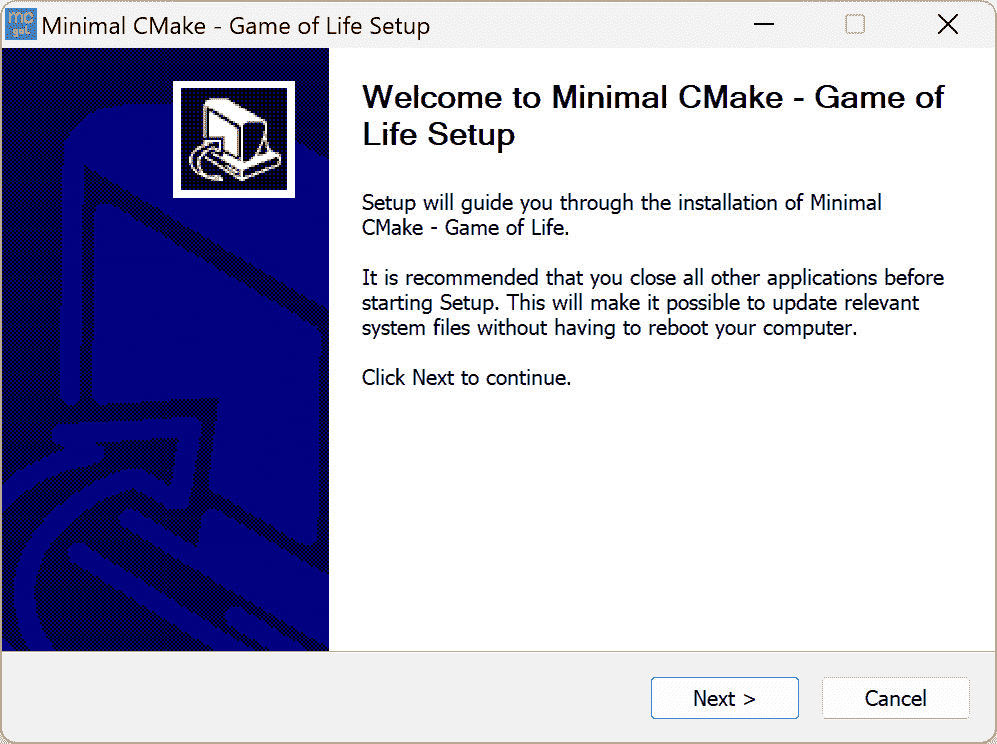
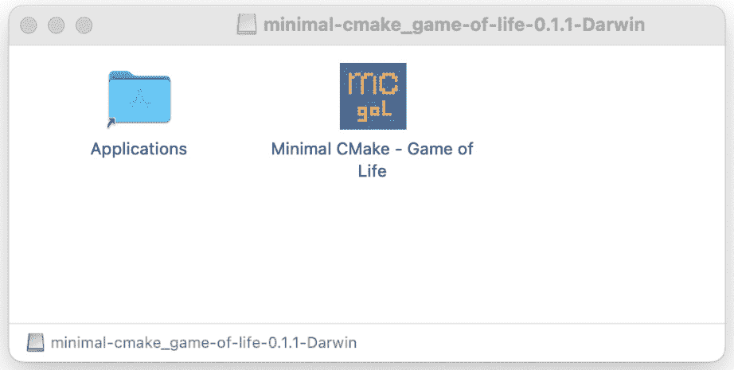
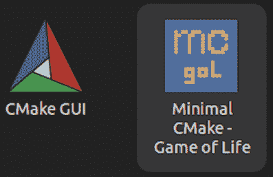

# 第十章：为共享打包项目

在本章中，我们将讨论 *Minimal CMake* 的最后一个主要主题——打包。这是将我们构建的软件转化为可以共享的格式的过程。当然，您也可以在没有打包步骤的情况下共享软件，但这样做通常是一个手动过程，容易出错，也不符合平台的预期规范——例如，Windows 的图形安装程序、macOS 的磁盘映像（`.dmg`）或 Linux（Ubuntu）Debian 包（`.deb`）。

我们将展示如何使用 CPack 来为 macOS、Windows 和 Linux 打包我们的应用程序。我们将介绍需要对 `CMakeLists.txt` 文件进行的更改以及创建软件包所需的命令。好消息是，我们已经完成了大部分的繁重工作，许多更改通常是为了处理平台特定的差异。

在本章中，我们将涵盖以下主要主题：

+   理解 CPack

+   相对于可执行文件加载资源

+   集成 CPack

+   构建 macOS 包

+   添加 CPack 预设

+   CPack 的其他用途

# 技术要求

为了跟随本书的进度，请确保你满足 *第一章*《入门》中概述的要求。这些要求包括：

+   一台安装有最新 **操作** **系统**（**OS**）的 Windows、Mac 或 Linux 机器

+   一个可用的 C/C++ 编译器（如果你还没有，建议使用系统默认的编译器）

本章中的代码示例可以通过以下链接找到：[`github.com/PacktPublishing/Minimal-CMake`](https://github.com/PacktPublishing/Minimal-CMake)。

# 理解 CPack

通过终端使用 `cpack`。理解 CPack 最好的方式是把它看作是 CMake 安装命令的封装工具。在 *第八章*，《使用超级构建简化入门》中，我们已经完成了为我们的应用程序创建安装命令的过程，也就是说，我们已经做了打包应用程序所需的工作。CPack 的作用是处理与安装软件相关的特定平台约定，它能很好地抽象化这些工作，使你无需过多担心。

打包的优势在于，能够避免让用户自己构建我们的软件。我们之前讨论过的与从安装目录（`app/install/bin` 文件夹）运行应用程序、将 DLL 复制到 Windows 上正确的文件夹以及库搜索路径（我们在 Linux/macOS 上执行的 `RPATH` 处理）相关的主题，已经为此做好了准备，使打包步骤变得更加简单。

CPack 提供了多个包生成器，这些生成器的指定方式类似于我们通过 `-G` 命令行选项传递给 CMake 的构建系统生成器。其中一些是特定于平台的（例如，macOS 上的 **Bundle** 和 **DragNDrop**），其他一些则需要额外的软件安装（例如，Windows 上的 **Nullsoft Scriptable Install System**（**NSIS**））；我们将至少介绍每个平台上的一个生成器，并展示每种情况下所需的 CPack 命令。

# 相对于可执行文件加载资源

在我们开始向 `CMakeLists.txt` 文件中添加任何 CPack 命令之前，还有一个我们之前忽略的最终话题需要讨论，那就是如何确保我们加载的资源文件可以相对于可执行文件被找到。

在 *Minimal CMake* 中，我们几乎一直从终端启动应用程序，但我们必须非常小心从哪里启动应用程序。从 `app` 文件夹中启动应用程序是可行的（例如，`./build/multi-ninja/Release/minimal-cmake_game-of-life_window`），将目录切换到 `install/bin` 文件夹并从那里启动应用程序也可以正常工作（这是因为我们确保将着色器复制到 `install` 文件夹中的正确相对位置）。问题是，如果我们尝试从其他文件夹（例如，主目录）启动应用程序，着色器将无法加载。

你将看到如下错误信息：

```cpp
Shaders not found. Have you built them using compile-shader-<platform>.sh/bat script?
```

很可能你已经构建了着色器（特别是在我们在 *第八章* 中添加了自定义命令来自动为我们完成此操作之后，*使用超级构建简化入门*）；问题是，当从主目录运行时，我们的应用程序会在 `~/shaders/build` 中寻找着色器，而不是在 `path/to/app/install/bin/shaders/build` 中。与 Windows 相比，macOS 和 Linux 上的情况要更复杂一些。在 Windows 上通过图形界面启动应用程序时，工作目录默认会设置为包含可执行文件的文件夹，但在 macOS 和 Linux 上，工作目录会是用户的主目录（`~/` 或 `$HOME`）。

为了解决这个问题，我们需要更新我们的应用程序，使其相对于可执行文件加载资源文件，而不是当前工作目录。为了实现这一点，我们需要查询应用程序在运行时的当前目录。根据使用的平台不同，这有多种方法（例如，macOS 上的 `_NSGetExecutablePath`，Linux 上的 `readlink`，Windows 上的 `GetModuleFileName`，以及其他一些替代方法）。幸运的是，既然我们使用的是 SDL 2，我们可以使用一个名为 `SDL_GetBasePath` 的工具函数（更多信息请参见 [`wiki.libsdl.org/SDL2/SDL_GetBasePath`](https://wiki.libsdl.org/SDL2/SDL_GetBasePath)），它可以为我们处理所有这些跨平台的情况（它还处理了 macOS 特定的包的差异）。

我们将对`CMakeLists.txt`文件和`main.cpp`文件做几个小改动，以支持这一点。从`ch10/part-1/app`中的`CMakeLists.txt`文件开始，我们将把着色器从其原始位置复制到我们的`build`文件夹，以确保从那里启动可执行文件能够按预期工作。为了使事情更加清晰，我们将删除`shader/build`文件夹，并将编译后的`bin`文件安装到一个名为`shader`的新文件夹中，位于应用程序旁边（稍后我们会相应更新`main.cpp`文件）。

之后，文件夹结构将如下所示：

```cpp
├── minimal-cmake_game-of-life_window
└── shader
      ├── fs_vertcol.bin
      └── vs_vertcol.bin
```

为了实现这一点，我们需要更新我们正在使用的`add_custom_command`调用，以便将我们的共享库文件（`.dylib`/`.so`/`.dll`）复制到构建文件夹，并包括一个步骤来复制着色器文件。其形式如下（省略现有的`copy`命令）：

```cpp
add_custom_command(
  TARGET ${PROJECT_NAME}
  POST_BUILD
  ...
  COMMAND
    ${CMAKE_COMMAND} -E copy_directory
      ${CMAKE_SOURCE_DIR}/shader/build
    $<TARGET_FILE_DIR:${PROJECT_NAME}>/shader
  VERBATIM)
```

我们将使用`copy_directory`命令，将`shader/build`文件夹的内容复制到目标位置的子文件夹`shader`中。需要注意的是，复制着色器的自定义命令并没有明确依赖于之前的编译着色器的自定义命令。这可能意味着，如果编译着色器失败，这个命令仍然会执行，但没有效果（或失败）。如*第八章*中讨论的，*使用超级构建简化入门*，我们可以使用`add_custom_command`的`OUTPUT`变体，并使用`DEPENDS`参数确保第二个`add_custom_command`仅在第一个成功后运行。由于`TARGET`版本更简单，我们将继续使用它来演示后续的例子，但在某些情况下，`OUTPUT`版本会非常有用（有关更多细节，请参见[`cmake.org/cmake/help/latest/command/add_custom_command.html`](https://cmake.org/cmake/help/latest/command/add_custom_command.html)）。为了保持与安装布局一致，我们还需要稍微修改我们之前创建的安装命令，将我们的着色器复制到安装树中。我们不再复制整个`shader/build`文件夹，而是将内容复制到一个新的名为`shader`的文件夹中。我们可以使用以下命令实现：

```cpp
install(
  DIRECTORY ${CMAKE_SOURCE_DIR}/shader/build/
  DESTINATION ${CMAKE_INSTALL_BINDIR}/shader
  FILES_MATCHING
  bin files, we will use the install DIRECTORY option, FILES_MATCHING, with the PATTERN match kind (this uses a glob matching pattern; for more complex cases, it’s possible to use REGEX and provide a regular expression instead). Note that we also added a trailing forward slash at the end of build on the first line to ensure that we only copy the folder’s contents, not the folder itself.
			These are the only changes we need to make to our `CMakeLists.txt` file; let’s now turn our attention to `main.cpp`. The change we need to make to this is small and self-contained, as shown in the following snippet:

```

char* base_path = SDL_GetBasePath();

std::string vs_shader_full_path;

vs_shader_full_path.append(base_path);

vs_shader_full_path.append("shader/vs_vertcol.bin");

...

std::vector<char> vs_shader =

read_file(vs_shader_full_path.c_str());

...

SDL_free(base_path);

```cpp

			We first call `SDL_GetBasePath()` to get the path to where our executable is running, and then we use the `std::string` C++ type for convenience to build a path to the file we want to load (there is undoubtedly a faster and more efficient method, using C++17’s filesystem library and/or `std::string_view`, but this is intended as a quick, simple example). Once we have the full path to our file, we can pass it to our existing `read_file` function, and when we’ve finished using it, we need to clean up `base_path` using `SDL_free`, as we’re responsible for managing its lifetime.
			With these changes applied, it’s now possible to launch our application from Finder on macOS, GNOME on Linux (the default Ubuntu desktop), and through File Explorer on Windows. With the relative loading of assets out of the way, we now have everything we need to start adding CPack support to our application.
			Integrating CPack
			Integrating CPack is deceptively simple; the majority of the work comes from the `install` commands we’ve already covered. The process involves setting several CPack-related variables (beginning with the `CPACK_` prefix) to project-specific values, and then adding `include(CPack)` at the very end of our `CMakeLists.txt` file. In fact, with the current state of our `CMakeLists.txt` file from `ch10/part-1/app`, it’s possible to just add `include(CPack)` at the end, and then running `cpack` will do something useful.
			One quick reminder is that CPack will default to installing a `Release` build, so ensure that you’ve built the `Release` configuration of the application; otherwise, invoking `cpack` will produce an error resembling the following:

```

文件 INSTALL 无法找到

"path/to/build/multi-ninja-super/Release/minimal-cmake_game-of-life_window":

没有这样的文件或目录。

```cpp

			To invoke `cpack` directly, you need to tell it where to find a newly generated file called `CPackConfig.cmake`. This file gets created after running a CMake configure step when the `include(CPack)` command is added to our `CMakeLists.txt` file. `CPackConfig.cmake` will appear at the root of the build folder; it’s also usually sensible to provide a directory for the packaged files to be added to (similarly to how we provide a build folder for CMake to store our build files).
			The following is an example of invoking CPack after we’ve configured and built our project (e.g., by running `cmake --workflow --``preset multi-ninja-super`):

```

cpack --config build/multi-ninja-super/--config 提供 CPackConfig.cmake 文件的路径，然后使用 -B 创建一个名为 package 的新文件夹来存储打包后的文件。调用 CPack 将根据平台产生不同的结果，类似于 CMake，因为每个平台都会有自己的默认生成器（在这种情况下，是包生成器而不是构建系统生成器）。我们可以像在 CMake 中一样使用 -G 来指定使用哪种生成器。

            CPack 的真正复杂性（在核心 `install` 逻辑完成后）来自于配置你关心的具体生成器（运行 `cpack --help` 将列出你所在平台上所有可用的生成器）。为了限定各种生成器的范围，我们将为每个平台选择一个最适合该平台上应用程序安装方式的生成器。一个完整的工作示例已在 `ch10/part-2/app/CMakeLists.txt` 中给出，并且包含一个新的 `packaging` 文件夹，里面有特定于包的资产和文件。我们将首先介绍常见的 `CPACK_` 变量设置，然后依次讲解每个平台。

            CPack 常见属性

            除了 `include(CPack)` 命令外，还有许多 CPack 变量可以设置，用来配置打包项目的各种设置。有些变量是所有 CPack 生成器共享的（完整的列表可以在 [`cmake.org/cmake/help/latest/module/CPack.html#variables-common-to-all-cpack-generators`](https://cmake.org/cmake/help/latest/module/CPack.html#variables-common-to-all-cpack-generators) 查阅），还有些变量是特定于某个生成器的——例如，macOS 上的 CPack Bundle 生成器以 `CPACK_BUNDLE_` 开头（它的完整变量列表可以在 [`cmake.org/cmake/help/latest/cpack_gen/bundle.html`](https://cmake.org/cmake/help/latest/cpack_gen/bundle.html) 查阅）。并非所有通用的 CPack 变量都适用于每个生成器，但它们会适用于多个生成器（例如，`CPACK_PACKAGE_EXECUTABLES` 就被 NSIS、WiX 和 Inno Setup 生成器使用）。

            我们将从最基本的常见变量开始（还有许多其他变量被省略；你可以随意尝试这些变量并将它们添加到你未来的项目中）。我们将首先指定的是 `CPACK_PACKAGE_NAME`：

```cpp
set(CPACK_PACKAGE_NAME "minimal-cmake_game-of-life")
```

            这是非常重要的，并且几乎所有 CPack 生成器都会使用。如果省略此项，目标名称将被用作包名称。在我们的案例中，我们将其设置为 `"minimal-cmake_game-of-life"`（这里要特别注意，名称中不能有空格，因为如果有空格，某些平台/生成器在安装时可能会失败）。

            我们将使用的下一个常见变量（仅用于 Windows NSIS 安装程序）是 `CPACK_PACKAGE_EXECUTABLES`：

```cpp
set(
  CPACK_PACKAGE_EXECUTABLES
  PROJECT_NAME) and the second is a friendly name for the application once the package has been installed by a user (this makes sure things such as the Start Menu icon on Windows has this name).
			That’s it for the common variables; we could specify other properties about the project, such as the version, description, and vendor, but we’ll skip those for now. Next, we’re going to look at our Windows NSIS installer and what other variables are needed.
			The CPack Windows NSIS package
			To create something that resembles a traditional Windows installer for our application, we’re going to use the NSIS package. If you don’t already have this installed, you can download it from [`nsis.sourceforge.io/Download`](https://nsis.sourceforge.io/Download) (the examples in this book were tested with NSIS `3.10`). Once this is installed, specifying the NSIS generator in CPack should work (if you don’t have it installed, you’ll get an error that CPack can’t find NSIS).
			The NSIS installer should more or less work out of the box with our current setup; all we need to do is run the following command (the exact build folder shown here, `build/multi-ninja`, may differ in your case):

```

cpack --config build/multi-ninja/CPackConfig.cmake -G package。运行安装程序将引导我们完成一系列步骤，然后将安装文件复制到 C:\Program Files\minimal-cmake_game-of-life 0.1.1。开始菜单快捷方式也会添加到 C:\ProgramData\Microsoft\Windows\Start Menu\Programs\minimal-cmake_game-of-life 0.1.1。

            我们设置的两个初始`CPACK_NSIS_`变量是为了给安装程序的欢迎屏幕一个友好的标题，并确保在高 DPI 显示器上显示清晰：

```cpp
set(CPACK_NSIS_PACKAGE_NAME "Minimal CMake - Game of Life")
set(CPACK_NSIS_MANIFEST_DPI_AWARE true)
```

            有一个重要的东西我们还缺少，以使我们的应用程序看起来更专业，那就是图标（不幸的是，接下来的章节我们大部分时间都要花在这个上，因为每个平台的图标处理方式不同）。

            我们首先需要创建一个符合 Windows 预期格式的图标。一个非常棒的工具是`.ico`文件，位于`ch10/part-2/app/packaging/windows`，名为`mc_icon.ico`，但了解如何为自己的图标执行此操作未来会很有帮助。

            一旦图标文件可用，我们需要添加一个特定于 NSIS CPack 的变量来引用它。这个 CPack 选项是`CPACK_NSIS_MUI_ICON`：

```cpp
set(
  CPACK_NSIS_MUI_ICON
  "${CMAKE_SOURCE_DIR}/packaging/windows/mc_icon.ico")
```

            这将把我们创建的图标与 NSIS 安装程序关联起来，因此在通过安装程序时，我们将在窗口的左上角和 Windows 任务栏看到该图标。但是，这不会为安装后的应用程序创建图标。为此，我们需要暂时跳出 CPack，并在我们的`CMakeLists.txt`文件中做一个小更新。我们还必须添加一个 Windows 所需的额外文件。

            我们需要添加的文件叫做资源定义脚本，以`.rc`扩展名结尾（要了解更多关于 Windows 资源文件的信息，请访问[`learn.microsoft.com/en-us/windows/win32/menurc/about-resource-files`](https://learn.microsoft.com/en-us/windows/win32/menurc/about-resource-files)）。

            该文件包含以下内容：

```cpp
IDI_ICON1 ICON "mc_icon.ico"
```

            这将链接资源定义脚本与我们生成的图标文件。然后，需要将`icon.rc`文件编译到我们的可执行文件中，这可以通过将`icon.rc`添加到`target_sources`来实现。

```cpp
target_sources(
  ${PROJECT_NAME} PRIVATE packaging/windows/icon.rc)
```

            通过这个更改，我们将看到应用程序的开始菜单和桌面快捷方式使用的图标。有更多的 CPack NSIS 选项可以进一步自定义安装程序体验，我们暂时跳过这些；完整列表请访问[`cmake.org/cmake/help/latest/cpack_gen/nsis.html`](https://cmake.org/cmake/help/latest/cpack_gen/nsis.html)。

            另一个需要注意的小细节，虽然这略微超出了 CPack 的范围，但属于让我们的应用程序准备好发布的范畴，那就是隐藏启动应用程序时出现的控制台窗口。这一点可能之前不太显眼，因为我们大部分时间都是从终端启动应用程序。你可能已经注意到，当从 Windows GUI 启动时，会在后台出现一个控制台窗口，显示我们添加的调试控制台输出。这个窗口在开发过程中可能很有用，但对于 `Release` 版本来说，最好将其隐藏。可以通过将 `WIN32_EXECUTABLE` 属性传递给 `set_target_properties` 来实现，并确保只有在 CMake 配置设置为 `Release` 时才进行设置。

            这可以通过将以下内容添加到我们的`CMakeLists.txt`文件中完成：

```cpp
set_target_properties(
  ${PROJECT_NAME} PROPERTIES WIN32_EXECUTABLE
  if(WIN32) block to ensure that we only set these values on Windows (see ch10/part-2/app/CMakeLists.txt for the complete example). Here’s another quick reminder that using Visual Studio Code’s part-<n>/ folders for each chapter).
			The last (and optional) change we can make to our `CMakeLists.txt` file is to add a desktop shortcut for our application. This can be achieved by using `CPACK_NSIS_EXTRA_INSTALL_COMMANDS` and `CPACK_NSIS_EXTRA_UNINSTALL_COMMANDS`. The following snippet shows how this is done:

```

set(

CPACK_NSIS_EXTRA_INSTALL_COMMANDS

"CreateShortCut '$DESKTOP\\\\Minimal CMake - Game of Life.lnk' '$INSTDIR\\\\bin\\\\${PROJECT_NAME}.exe'")

```cpp

			We use the `CreateShortCut` command to create a shortcut on the user’s desktop, named `Minimal CMake - Game of Life.lnk`, and link it to the name of the executable in its install location.
			The abundance of backslashes unfortunately isn’t a typo; they are needed to escape the backslash character at multiple stages. To represent a literal backslash in CMake, it must be escaped by using a backslash character (`\`), and NSIS also expects the path it uses to be separated by backslashes, and they too need to be escaped. The processing of the path reduces the backslashes from 4 to 2, and finally to 1 (by the time NSIS sees the path). This is a bit ugly and confusing, but unfortunately, there isn’t much we can do about it.
			With that final change, we’re done crafting our Windows installer. There’s more we can add, but this should give you a solid base to work from when building your own installers in the future.
			

			Figure 10.1: The Windows NSIS installer
			To package our application on Windows using the NSIS installer, use the following command from `ch10/part-2/app` (remembering to have first configured and built a `Release` configuration of the application):

```

cpack --config build/multi-ninja/CPackConfig.cmake -G NSIS64 -B package

```cpp

			This will create an executable installer, and running it will install *Minimal CMake – Game of Life* in your `Program Files` directory, like any other application you might install (a quick note that administrator privileges are required to install to `Program Files`). An uninstaller is also generated, which makes it easy to remove the application and associated shortcuts in the future.
			The CPack macOS bundle package
			We are now going to look at the commands needed to package an application bundle on macOS. In this section, we’re going to show how to use the `Bundle` generator. There is another approach we’ll touch on later in the chapter that shows how to build a macOS bundle directly (this works a little differently from how we’ve configured things so far and differs significantly from other platforms, so using it will depend on your exact situation and preference).
			The good news is that the `CMakeLists.txt` changes are confined to a single block, as shown here:

```

set(CPACK_BUNDLE_NAME "Minimal CMake - Game of Life")

set(CPACK_BUNDLE_PLIST

"${CMAKE_SOURCE_DIR}/packaging/macos/info.plist")

set(CPACK_BUNDLE_ICON

"${CMAKE_SOURCE_DIR}/packaging/macos/gol.icns")

set(CPACK_BUNDLE_STARTUP_COMMAND

"${CMAKE_SOURCE_DIR}/packaging/macos/bundle-run.sh")

```cpp

			We’ll walk through each line to understand what it’s doing and why it’s needed:

				*   The first line (`CPACK_BUNDLE_NAME`) simply sets the name of the application bundle. This is the name that will appear inside the bundle when it’s opened and dragged to the application folder.
				*   The second line (`CPACK_BUNDLE_PLIST`) refers to an information property list (`info.plist` for short) that is used to store metadata about the application. This is the mechanism used by macOS and iOS to store configuration information for applications (to learn more about information property lists, go to [`developer.apple.com/library/archive/documentation/General/Reference/InfoPlistKeyReference/Introduction/Introduction.html`](https://developer.apple.com/library/archive/documentation/General/Reference/InfoPlistKeyReference/Introduction/Introduction.html)). There’s a lot of properties that can be added to this file, but for our purposes, we only need one for the time being, and that’s the `CFBundleIconFile` property. This will refer to the icon file in the bundle, which will share the name of the bundle (this is different from the name of the icon file (`gol.icns`) before packaging; the `.icns` file is renamed to match the value of `CPACK_BUNDLE_NAME` inside the bundle). The `info.plist` file will be added to the `Contents` folder of the bundle.
				*   The third variable (`CPACK_BUNDLE_ICON`) refers to the icon file to use for the bundle. The file we’re using here is `gol.icns`, which was generated by running the `generate-icons.sh` script in the packaging folder. It internally uses `sips` ([`ss64.com/mac/sips.html`](https://ss64.com/mac/sips.html)) on macOS to generate icons of increasing size (all power of 2 dimensions) from a source image (for things to work, ensure that the source image you use is 1,024 x 1,024 pixels in size), and then it uses `iconutil` ([`www.unix.com/man-page/osx/1/iconutil/`](https://www.unix.com/man-page/osx/1/iconutil/)) to create the `.icns` file for CPack (and our `info.plist` file) to refer to. With these changes, we’ll get an icon for our bundle and application after it’s installed.
				*   The last variable (`CPACK_BUNDLE_STARTUP_COMMAND`) holds a path to a small helper startup script to ensure that we can launch our application from the bundle. This file will be copied to `Contents/MacOS` inside the bundle.

			The content of the file it refers to (`bundle-run.sh`) is as follows:

```

cd "$(dirname "$0")"

../Resources/bin/minimal-cmake_game-of-life_window

```cpp

			The first line changes the directory to the location of the script that’s currently running (so we’ll end up in the bundle’s `Contents/MacOS` folder), and the second line launches our executable (all resources will then load relative to it). It’s a little unconventional but works well when dealing with a cross-platform `CMakeLists.txt` file.
			To package our application on macOS using the bundle generator, navigate to `ch10/part2/app`, and then run the following command (again, remember to build the application in the `Release` configuration first):

```

cpack --config build/multi-ninja/CPackConfig.cmake -B package -G .dmg 文件），该文件可以打开，之后将打包的应用程序拖到“应用程序”文件夹中进行安装（只需将应用程序从“应用程序”文件夹移动到 macOS Bin 中即可卸载它）。

            

            图 10.2：macOS 磁盘映像

            还有其他方法可以自定义已挂载磁盘映像的外观，例如创建自定义的 `.DS_Store` 文件，并使用 `CPACK_DMG_DS_STORE` 变量来引用它。请参阅 `ch10/part-4/app/CMakeLists.txt` 和 `ch10/part-4/app/packaging/macos/custom_DS_Store` 了解示例。

            CPack Linux Debian 包

            现在我们将回顾 `ch10/part-2/app` 中的 `CMakeLists.txt` 文件的更改，以了解支持 Linux 上 Debian（`.deb`）安装程序所做的添加。

            好消息是这些更改是有限的。第一个更改类似于我们在 Windows 上所做的操作，目的是确保安装后应用程序会显示图标。这一次，我们需要添加两个额外的`install`命令，分别用于复制 Linux `.desktop` 文件（负责应用程序出现在 Linux GUI 中）和相关的 `.png` 图像到安装位置：

```cpp
install(
  FILES ${CMAKE_SOURCE_DIR}/packaging/linux/mc-gol.desktop
  DESTINATION ${CMAKE_INSTALL_DATAROOTDIR}/applications)
install(
  FILES packaging/linux/mc-gol-logo.png
  DESTINATION ${CMAKE_INSTALL_DATAROOTDIR}/icons)
endif()
```

            第一个命令将我们的`.desktop`文件复制到数据根目录，相对于我们选择的安装文件夹（默认情况下，这是`<install-folder>/share`）。根据惯例，`.desktop`文件通常会位于`share`下的`applications`文件夹中，因此我们将`applications`附加到`CMAKE_INSTALL_DATAROOTDIR`。图标本身会在`share/icons`中查找，因此我们需要确保将其也复制到该位置。

            在这个例子中，我们使用了 Debian 包生成器；当我们安装包时，文件将被复制到平台标准位置（`/usr/share/icons`、`/usr/share/applications`、`/usr/bin`等）。这样做的好处是，我们不需要在`.desktop`文件中硬编码绝对路径，因为可执行文件和图标可以在预期的位置找到。

            为了完整性，`.desktop`文件的内容如下：

```cpp
[Desktop Entry]
Name=Minimal CMake - Game of Life
Comment=Interactive Game of Life simulation
Exec=minimal-cmake_game-of-life_window
Icon=mc-gol-logo
Terminal=false
Type=Application
Categories=Development
```

            由于我们正在创建一个窗口化应用程序，我们将`Terminal`设置为`false`，并添加一些额外的元数据，帮助描述我们构建的应用程序类型（有关`.desktop`文件的更多信息，请参见[`wiki.archlinux.org/title/Desktop_entries`](https://wiki.archlinux.org/title/Desktop_entries)以获取有用的概述）。请注意，在指定图标时，我们不包括扩展名；我们只需要提供名称。

            为了支持 Linux 上的 Debian 包，我们唯一需要做的代码更改是提供包的维护者名称。可以使用以下命令来实现：

```cpp
set(CPACK_DEBIAN_PACKAGE_MAINTAINER "<maintainer-email>")
```

            这是一个有用的方法，用户可以在遇到问题或有反馈时联系包的所有者/维护者。此字段是必须提供的；否则，CPack 会返回错误并且不会生成 Debian 包。

            应用这些更改到我们的`CMakeLists.txt`文件后，我们现在可以运行 CPack 并提供 DEB 包生成器。在构建项目的发布配置（例如，`cmake --build build/multi-ninja --config Release`）之后，只需从`ch10/part-2/app`目录运行以下命令：

```cpp
cpack --config build/multi-ninja/CPackConfig.cmake -G .deb file in the package folder. To install the package to the system, use the following command:

```

sudo dpkg -i package/minimal-cmake_game-of-life-0.1.1-Linux.deb

```cpp

			This will install the package and make it available in your path; it can be launched by typing `minimal-cmake_game-of-life_window` from the terminal (try changing the directory to your `$HOME`*/*`~` folder and launching it), or by navigating to `Minimal CMake – Game` `of Life`.
			

			Figure 10.3: The installed icon on Linux (Ubuntu)
			The last important detail to cover is if we wish to uninstall an application from our system, we can do this by running the inverse of the `dpkg -i` command, which takes the following form:

```

sudo dpkg -P minimal-cmake_game-of-life

```cpp

			This will remove the executable, libraries, icons, and `.desktop` file from the system and restore it to the state it was before the package was installed.
			That covers creating three separate package generators on three separate platforms. There are, of course, many more, and the packages we did create can continue to be improved and refined, but this should hopefully give a taste of how to use CPack and some of the details to be aware of.
			In the next section, we’re going to spend a bit of time on a macOS-specific topic, relating to CMake’s built-in support for application bundles.
			Building a macOS bundle
			When looking at macOS in *The CPack macOS bundle package* section earlier, we used the CPack generator `Bundle` type to package our application’s build artifacts in a macOS bundle. There is, however, an interesting alternative that is worth briefly mentioning.
			CMake provides an option to directly build an application as a macOS bundle. The setting is called `MACOSX_BUNDLE`, and it can be passed directly to `add_executable` or set separately with `set_target_properties`, as shown here:

```

set_target_properties(

${PROJECT_NAME} PROPERTIES Minimal CMake - Game of Life.app 位于 build/<preset>/<config>文件夹中，而不是我们迄今为止看到的可执行文件和松散的文件集合，包括库和资源。事实上，`.app`文件只是一个包含所有这些文件的文件夹；唯一的区别是它以一个稍微整洁的包的形式呈现。从 Finder 中，如果右键点击`.app`文件并点击 CMakeLists.txt 文件（查看 ch10/part-3/app/CMakeLists.txt 以查看完整示例）。

            可执行文件最终会被放入一个名为 `MacOS` 的文件夹中，我们的共享库（`.dylib` 文件）会被添加到名为 `Frameworks` 的文件夹中。最后，我们的着色器（以及 `.icns` 文件）会被添加到一个名为 `Resources` 的文件夹中。这个布局是 macOS 应用程序的标准布局，CMake 使得支持它相对容易。值得一提的改动是对 `set_target_properties` 的 `INSTALL_RPATH` 命令进行了小的更新，将 `Frameworks` 添加到搜索路径中：

```cpp
$<$<PLATFORM_ID:Darwin>:@loader_path;.dylib files relative to its location, without the files needing to be in the same folder. We also used an add_custom_target command to create the Frameworks folder for us before we tried to copy any files there:

```

add_custom_target(

create_frameworks_directory ALL

COMMAND

${CMAKE_COMMAND} -E make_directory

$<TARGET_FILE_DIR:${PROJECT_NAME}>/../Frameworks

COMMENT "创建 Frameworks 目录")

add_dependencies(

${PROJECT_NAME} create_frameworks_directory)

```cpp

			We use `add_dependencies` to ensure that this happens before our main executable is built (`${PROJECT_NAME}` will depend on the `create_frameworks_directory` target, ensuring that `create_frameworks_directory` happens first).
			We can forgo a lot of our install commands in the case of a macOS bundle because it handles copying all the files to the correct location internally; for the install step, we just need to install `BUNDLE`:

```

install(TARGETS ${PROJECT_NAME} if(APPLE) block. 我们使用 CMake 的 set_source_files_properties 命令来设置各种文件的包位置（这包括我们的着色器文件，vs_vertcol.bin 和 fs_vertcol.bin 以及新的 gol.icns 文件）。这些文件被复制到 Resources/shader 文件夹和包内 Contents 文件夹中的 Resources 文件夹（.app 文件）。

            以下代码片段展示了如何实现这一点：

```cpp
set_source_files_properties(
  shader/build/vs_vertcol.bin shader/build/fs_vertcol.bin
  PROPERTIES MACOSX_PACKAGE_LOCATION "Resources/shader")
set_source_files_properties(
  packaging/macos/gol.icns
  PROPERTIES MACOSX_PACKAGE_LOCATION target_sources command:

```

target_sources(

${PROJECT_NAME} PRIVATE shader/build/vs_vertcol.bin

设置 MACOSX_BUNDLE 为 TRUE 后，CMake 将使用位于 /Applications/CMake.app/Contents/share/cmake-3.28/Modules（CMAKE_MODULE_PATH）中的一个名为 MacOSXBundleInfo.plist.in 的 Info.plist 模板文件，而不是我们自己创建 Info.plist 文件。然后可以使用 set_target_properties 提供多个 MACOSX_BUNDLE_ 属性来覆盖这些值（完整列表请参见 https://cmake.org/cmake/help/latest/prop_tgt/MACOSX_BUNDLE_INFO_PLIST.html）。

            在我们的例子中，我们设置了一些通常有用的属性；对于我们的用途，`MACOSX_BUNDLE_ICON_FILE` 是最显著的，它确保我们的应用程序具有独特的外观。下面展示了部分命令：

```cpp
set_target_properties(
  ${PROJECT_NAME}
  PROPERTIES OUTPUT_NAME "Minimal CMake - Game of Life"
    MACOSX_BUNDLE_BUNDLE_NAME
      "Minimal CMake - Game of Life"
    MACOSX_BUNDLE_GUI_IDENTIFIER
      "com.minimal-cmake.game-of-life"
    MACOSX_BUNDLE_ICON_FILE "gol.icns"
  ...)
```

            也可以通过提供一个自定义的 `Info.plist` 文件并使用 `MACOSX_BUNDLE_INFO_PLIST` 从我们的 `CMakeLists.txt` 文件中引用它，来覆盖模板。

            唯一剩下的变化是从我们的 `CMakeLists.txt` 文件中移除了 `set(CPACK_BUNDLE_...` 调用，因为它们不再需要。通过这些更改，我们可以将应用程序构建为 macOS 包，并且在打包应用程序时，不再使用之前的 `Bundle` 生成器，而是可以使用 `DragNDrop` 生成器。这里展示了一个示例：

```cpp
cpack --config build/multi-ninja/CPackConfig.cmake \
  -B package -G CPACK_DMG_... variables. As mentioned earlier, when discussing the Bundle generator, these values can be used to further customize the macOS disk image (for example, CPACK_DMG_DS_STORE can be used to refer to a customized .DS_Store file to provide a custom layout; for more information, see https://cmake.org/cmake/help/latest/cpack_gen/dmg.html and ch10/part-4/app as an example). It’s worth highlighting that the previous Bundle generator we used inherits from DragNDrop, which is why the CPACK_DMG_... settings can also be used to customize the .dmg file when using the Bundle generator.
			When building macOS applications that are going to be installed and launched through Finder, using the `MACOSX_BUNDLE` approach is incredibly useful and a sensible option to take. However, it does make maintaining a cross-platform application a little more complicated, as things behave quite differently between platforms. Whether you choose to use it or not will depend on your specific use case. Hopefully, showing how both approaches can be used is useful (`ch10/part-3/app` contains a full example for reference). For the remaining part of this chapter, we’ll switch back to the approach shown in `part-2` to help keep things more consistent across Windows, macOS, and Linux.
			Adding CPack presets
			Before closing out this chapter, it’s worth covering one more useful topic when it comes to CPack, and that’s its support for CMake presets. CMake provides the package presets (`packagePresets`) field in `CMakePresets.json`, and various CPack options can be set there, instead of from the command line or inside our `CMakeLists.txt` file.
			The upshot of this is that we don’t have to write the following on macOS:

```

cpack --config build/multi-ninja/CPackConfig.cmake -B package -G Bundle

```cpp

			We can instead write this:

```

cpack –preset macos

```cpp

			This will use the preconfigured options we’ve set for macOS; an example listing is shown here:

```

"packagePresets": [

{

"name": "base",

"configurePreset": "multi-ninja-super",

"packageDirectory": "${sourceDir}/package",

"hidden": true

},

{

"name": "macos",

"condition": {

"type": "equals",

"lhs": "${hostSystemName}",

"rhs": "Darwin"

},

"generators": ["Bundle"],

"inherits": ["base"]

},

...

```cpp

			We start with a base preset that can be shared across multiple package presets (one for each platform), and then we set the package directory to `${sourceDir}/package` so that we can omit `-B package` from the command line. We must also provide `configurePreset` so that CPack knows which build folder to use (this is because the build folder is specified by the configure preset). We then provide our actual preset; the preceding example is for macOS, but presets are added for each platform in `ch10/part-4/app/CMakePresets.json`. By using the `condition` property, we ensure that this preset only appears when running on macOS, and we also provide the explicit generator to use (in this case, `Bundle`).
			The other useful thing about package presets is that they can be included in workflow presets, making it possible to configure, build, test, and package all with one command.
			As CPack requires the `Release` configuration to be compiled (`-DCMAKE_BUILD_TYPE=Release` when configuring with a single-config generator, or `--config Release` when building with a multi-config generator), we skip the testing preset in the packaging workflow, as we explicitly build it in a `Debug` configuration (see the `multi-ninja-super-test` build preset in `ch10/part-4/app/CMakePresets.json`).
			The following is an example of the workflow preset for Linux:

```

{

"name": "multi-ninja-super-package-linux",

"steps": [

{

"type": "configure",

"name": "multi-ninja-super"

},

{

"type": "build",

"name": "multi-ninja-super"

},

{

"type": "package",

"name": "linux"

}

]

}

```cpp

			This can be invoked by using the following command (run from `ch10/part-4/app`):

```

cmake --workflow --preset \

multi-ninja-super-package-linux

```cpp

			At the time of writing, workflow presets do not currently support the `condition` property we used for other presets. This means that it’s not possible to hide the workflow presets for other platforms, but they will fail to run, as we’ve specified which package preset is allowed on which platform already. It is possible that workflow presets will be updated in the future to inherit `condition` properties from the steps they use; however, there is no timeframe for when this may happen. This topic is an ongoing area of discussion within the CMake community.
			Other uses for CPack
			In addition to the main packaging and installer logic we’ve covered so far in this chapter, there are a couple more uses for CPack that are worth mentioning briefly. The first is the ability to use a standard archive format (such as `.zip`, `.7z`, or `.tar.gz`) to create a snapshot of an application at a certain point in time. It might be useful to do this to share a work-in-progress build with someone before sending them a full installer (running the application from the extracted folder will work and will not affect the wider system). It can also be useful to keep an archive of builds for milestones or releases you can then go back to easily in the future (this is commonly done in the *Tags and Releases* section of projects on GitHub. A good example is a tool such as `ripgrep` ([`github.com/BurntSushi/ripgrep/releases`](https://github.com/BurntSushi/ripgrep/releases)). For a full list of archive formats (and other package generators), run `cpack --help`.
			There is also one more file generated by CPack that we haven’t covered yet, and that’s `CPackSourceConfig.cmake`. By providing this file to the `cpack` `--config` argument, it’s possible to create an archive of the source directory itself, not the built artifacts. We must do a little bit of work to tell CPack which files not to include, which we achieve by setting the `CPACK_SOURCE_IGNORE_FILES` variable before invoking the `include(CPack)` command.
			The following is an example from `ch10/part-5/app/CMakeLists.txt`:

```

set(CPACK_SOURCE_IGNORE_FILES

"build.*\/"

"package.*\/"

"install\/"

"\.git\/"

"\.gitignore"

"\.vscode"

)

```cpp

			The `CPACK_SOURCE_IGNORE_FILES` variable uses regular expressions to match against the different file and folder paths to discount.
			With this change, we can then run the following command to create a snapshot of the source directory if we wish:

```

cpack --config build/multi-ninja-super/CPackSourceConfig.cmake -G TGZ -B package-source

```cpp

			Instead of providing `CPackConfig.cmake` as we did earlier in the chapter, we pass `CPackSourceConfig.cmake`, as well as a package generator (`-G`) to use and a folder (`-B`) to add the archived file to. We could also configure a CMake preset to handle this by using the `configFile` entry to specify the source config file. The following is one way to do this (we’re using `ZIP` instead of `TGZ` as the package generator in this example):

```

{

"name": "source",

"generators": ["ZIP"],

"packageDirectory": "${sourceDir}/package-source",

"configFile": "CPackSourceConfig.cmake",

"inherits": ["base"]

}

```cpp

			Review `ch10/part-5/app/CMakePresets.json` to see this in context. It’s then possible to use `cpack --preset source` to create a source package.
			Summary
			You made it! Packaging was the last hurdle on our CMake journey. Making your application shareable with others is a significant achievement, and you now have everything you need to create a cross-platform application that’s easy to build and distribute. This is no small feat, and although there’s of course still plenty more to learn, you’re standing on a solid foundation and have the tools available to build your own applications from scratch.
			In this chapter, we got to know CPack and how it integrates with our existing CMake scripts. We first learned how to handle loading files relative to our executable, an important detail to make sure that running our application from any location works reliably. We then took a tour of CPack, seeing how to provide packaging support for Windows, macOS, and Linux. This is essential for providing a familiar means for users to install your application, matching what they’ve come to expect from existing conventions on their platform. We then took a small detour to discuss building macOS bundles with CMake and the various improvements and trade-offs in doing so. We then looked at how to simplify CPack usage by taking advantage of CMake presets to configure and automate the packaging step, another key factor in keeping our projects clean and maintainable. We concluded by looking at some other uses of CPack, as well as how to package our project’s source and its build artifacts.
			We’ve now covered all the main topics to get you up and running with CMake. In the final chapter, we’re going to cover useful tools available in the CMake ecosystem to make day-to-day development faster and easier. We’ll also touch on where to go next and introduce some topics we weren’t able to cover in detail in this book.

```

```cpp

```

```cpp

```

```cpp

```

```cpp

```

```cpp

```

```cpp

```
