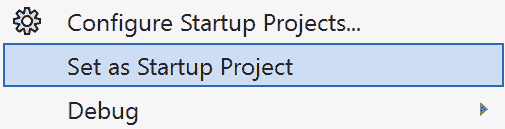

# 第十一章：支持工具和后续步骤

本章将介绍一些与 CMake 核心生态系统相辅相成的出色工具，帮助使 CMake 开发更加容易、快速和愉快。许多出色的项目扩展和增强了 CMake，了解这些工具可以显著改善你的开发体验。我们还将介绍一些其他流行的**集成开发环境**（**IDE**），并了解如何让它们与 CMake 兼容。

除此之外，我们还将介绍一些关于开发 C/C++应用程序的推荐实践，以及 CMake 如何帮助实现这些目标，最后还会提供一些关于如何组织 CMake 脚本的建议。最后，我们将展望未来，介绍一些本书未能涵盖的 CMake 话题，并告诉你可以在哪里深入学习这些内容。

本章将覆盖以下主要内容：

+   Visual Studio Code 的 CMake 工具

+   Visual Studio Code 附加功能

+   CMake 与其他 IDE 的配合

+   C/C++构建建议

+   CMake 脚本结构

+   未来的主题

# 技术要求

要跟随本书的内容，请确保你已经满足*第一章*《入门》中列出的要求。包括以下内容：

+   一台运行最新**操作系统**（**OS**）的 Windows、Mac 或 Linux 机器

+   一款可用的 C/C++编译器（如果你尚未安装，建议使用平台的系统默认编译器）

本章中的代码示例可以通过以下链接找到：https://github.com/PacktPublishing/Minimal-CMake。

# Visual Studio Code 的 CMake 工具

在本书开头，我们推荐使用**Visual Studio Code**作为首选编辑器，以确保无论你是在 Windows、macOS 还是 Linux 上开发，都能获得一致的体验。这完全是可选的，但使用 CMake 与 Visual Studio Code 结合起来有很多优点。在本节中，我们将讨论如何最好地使用本书中的示例，并展示如何在 Visual Studio Code 中配置、构建和调试项目。

如果你按照*第一章*《入门》中的*Visual Studio Code 设置*部分进行操作，你将已经通过**C/C++扩展包**安装了**CMake Tools**。

## 导航 Minimal CMake 源代码

为了能够在*Minimal CMake*源代码中进行导航，建议从仓库的根目录打开一个 Visual Studio Code 项目。这可以通过克隆仓库，然后从该目录打开 Visual Studio Code 来实现：

```cpp
cd <your-dev-folder>
git clone https://github.com/PacktPublishing/Minimal-CMake.git mc
code mc
```

你也可以切换到`mc`文件夹（`cd mc`），然后运行`code .`从该目录打开 Visual Studio Code。

这对于浏览示例以及比较各部分之间的差异和更新非常有用，但遗憾的是，它不适合构建和运行各个示例。为了获得更具代表性的使用 CMake Tools 在 Visual Studio Code 中配置、构建和调试示例的体验，最好为每个包含根级 `CMakeLists.txt` 文件的目录打开一个新的 Visual Studio Code 实例。例如，在某些后续示例的情况下，你可以在终端中切换到 `ch10/part-5/app` 目录，然后从该文件夹输入 `code .` （或者如果你在仓库根目录，可以直接输入 `code ch10/part-5/app`）；这就是你通常与 CMake 项目合作的方式。随附的源代码由多个随着时间演变的嵌套项目组成；每个 `ch<n>/part-<n>` 的 `README.md` 文件列出了要打开的根文件夹作为参考。

除了之前描述的工作流外，Visual Studio Code 还支持多根工作区（有关更多信息，请参见 [`code.visualstudio.com/docs/editor/multi-root-workspaces`](https://code.visualstudio.com/docs/editor/multi-root-workspaces)）。要激活多根工作区，你可以通过命令面板使用 **工作区：添加文件夹到工作区…** 选项，或者导航到 **文件** 菜单并选择 **添加文件夹到工作区...**。


图 11.1：添加文件夹到工作区… 选项

然后，你可以选择一个包含 `CMakeLists.txt` 文件的文件夹，在该文件夹中运行示例（在书中的后续示例中，通常是 `app` 文件夹）。以下是一个示例，展示了 Visual Studio Code **EXPLORER** 中的工作区视图：


图 11.2：EXPLORER 中的多工作区视图

你可以保存工作区并跟踪其中的文件夹。如果选择这样做，一个新文件将会以与工作区同名并带有 `.code-workspace` 文件扩展名的方式创建。还可以为文件夹添加显示名称，这在多个位置的文件夹具有相同名称时尤其有用（例如，之前提到的底部两个子文件夹，如果没有名称覆盖，它们将被称为 `app`）。

以下是之前显示的工作区中 `.code-workspace` 文件的内容：

```cpp
{
  "folders": [
    {
      "name": "minimal-cmake",
      "path": "."
    },
    {
      "name": "ch8_part-2_app",
      "path": "ch8/part-2/app"
    },
    {
      "name": "ch11_part-3_app",
      "path": "ch11/part-3/app"
    }
  ],
  "settings": {}
}
```

Visual Studio Code 的 CMake Tools 扩展也支持多根工作区，并使得通过 CMake Tools 扩展侧边栏中的 **项目大纲** 部分在工作区之间切换成为可能（只需点击齿轮图标以设置活动工作区）。多根工作区对于将多个项目保存在一个单一仓库中非常方便。

## 配置、构建和调试

在 Visual Studio Code 中，如果你打开了某个文件夹的项目视图，例如：

```cpp
cd ch2/part-1
code .
```

按下 `F1` 会打开命令面板。在命令面板中输入 CMake，会显示所有通过 Visual Studio Code CMake 工具扩展提供的 CMake 命令。在那里，你可以搜索诸如 `configure` 和 `build` 等命令：


图 11.3：CMake 工具的配置和构建命令

在 Visual Studio Code 的侧边栏中，还有一个非常方便的 CMake 工具面板，提供了一系列选项，允许你在 Visual Studio Code 内部配置、构建、测试、调试和启动应用程序：


图 11.4：Visual Studio Code 的 CMake 工具面板

将鼠标悬停在每一行时，右侧会显示一个可以按下的图标，以执行相应的操作。这比在 Visual Studio Code 中为没有使用 CMake 的 C/C++ 应用程序配置 `launch.json` 文件要简单得多。

使用 macOS 的用户可能会遇到 `lldb-mi` 的问题。解决方法是在你的工作区或用户的 `settings.json` 文件中提供 `miDebuggerPath`。以下是一个示例路径，具体位置可能会有所不同：

```cpp
"cmake.debugConfig": {
    "miDebuggerPath": "/Users/<username>/.vscode/extensions/ms-vscode.cpptools-1.21.6-darwin-arm64/debugAdapters/lldb-mi/bin/lldb-mi"
}
```

要打开 `settings.json` 文件，只需按下 `F1` 以打开命令面板，然后搜索 `settings`，并选择 **首选项：打开用户设置（JSON）** 或 **首选项：打开工作区设置（JSON）**，具体取决于你想在哪设置选项（全系统，或仅此工作区）。

如果因为某些原因，CMake 的 `launch.json` 文件和手动设置可执行文件位置以及工作目录，操作方法是进入 Visual Studio Code 的 **运行与调试** 面板，按下 **创建一个** **launch.json 文件**。


图 11.5：Visual Studio Code 的运行与调试面板

会打开 `launch.json`，或者打开命令面板，提供选择调试器的选项。这将根据你所使用的平台有所不同。如果你先使用 CMake 配置和构建，那么会显示 C++ 调试器（如果没有构建文件夹，则只会显示默认选项）。

`launch.json` 文件最初应如下所示：

```cpp
{
  // Use IntelliSense to learn about possible attributes.
  // Hover to view descriptions of existing attributes.
  // For more information, visit: https://go.microsoft.com/fwlink/?linkid=830387
  "version": "0.2.0",
  "configurations": []
}
```

屏幕右下角有一个名为 **添加配置...** 的按钮，点击它会显示调试选项列表。根据你的平台选择最合适的选项，例如：

+   **macOS**：**{} C/C++：(****lldb) 启动**

+   **Windows**：**{} C/C++：(****Windows) 启动**

+   **Linux**：**{} C/C++：(****gdb) 启动**

生成的配置然后需要做两个小的修改：`"program"` 需要设置为可执行文件的位置，`"cwd"` 应该设置为您希望应用程序运行的工作目录（在大多数情况下，这将与 `${workspaceFolder}` 相同）。

这里展示了一个 macOS 配置示例：

```cpp
{
  "name": "(lldb) Launch",
  "type": "cppdbg",
  "request": "launch",
  "program": "${workspaceFolder}/build/Debug/minimal-cmake_game-of-life",
  "args": [],
  "stopAtEntry": false,
  "cwd": "${workspaceFolder}",
  "environment": [],
  "externalConsole": false,
  "MIMode": "lldb"
}
```

通过这个更改，按下 *F5* 或者在 **RUN AND DEBUG** 侧边栏面板中点击 **Start Debugging** 播放符号将启动应用程序，并允许您设置断点并逐步调试代码。接下来，我们将看看 CMake 预设如何与 Visual Studio Code 集成。

## Visual Studio Code 和 CMake 预设

Visual Studio Code 在配置和构建阶段的处理方式与 CMake 从命令行本地处理方式类似（根据生成器做出最佳猜测，并为诸如 `build` 文件夹之类的事项选择一些合理的默认值，默认情况下该文件夹设置为 `${workspaceFolder}/build`）。

好消息是，Visual Studio Code 在利用 CMake 预设的项目中表现得更好。如果项目根目录下存在 `CMakePresets.json` 文件，当您在 Visual Studio Code 中通过 CMake Tools 扩展点击配置按钮时，命令面板会提示您首先选择一个预设。它还提供了创建全新预设的选项。如果选择了预设，项目将使用该预设中定义的所有设置进行配置。输出会显示在 **OUTPUT** 窗口中，通常位于 Visual Studio Code 窗口的底部：


图 11.6: Visual Studio Code CMake – 配置输出

点击 **Build** 图标（出现在 CMake Tools 扩展中的 Build 标题旁边），然后会为我们构建应用程序，如果点击播放图标（当悬停在 CMake Tools 扩展中的 **Debug** 或 **Launch** 标题上时显示），应用程序将启动。**Debug** 功能特别有用，因为您可以在 Visual Studio Code 中设置断点，并使用 **VARIABLES** 和 **WATCH** 窗口查看程序中变量的状态。

有趣的是，`enable_testing()` 命令需要添加到我们的 `CMakeLists.txt` 文件中（紧接着 `include(CTest)` 后添加即可）。虽然从命令行使用 `ctest` 可以正常工作，但为了使 Visual Studio Code 中的功能顺利运行，这个命令是必须的。

在打包方面，不幸的是，CMake Tools 不会尊重我们用来隐藏其他平台打包配置的 `"condition"` 属性。这意味着在 CMake Tools 中查看时，打包预设将会丢失。要恢复它们，只需从 `CMakePresets.json` 文件中的包预设中删除 `"condition"` 块。

例如，您需要从 `windows` 包预设中移除以下内容：

```cpp
"condition": {
  "type": "equals",
  "lhs": "${hostSystemName}",
  "rhs": "Windows"
},
```

删除这些内容后，您将看到包预设按预期出现：


图 11.7：CMake Tools 中列出的包预设

点击铅笔图标，你将可以选择一个可用的预设：


图 11.8：从命令面板选择包预设

这是一个小小的不便，希望在未来版本的 CMake Tools 中修复。有关我们项目的示例，已做了小调整以使其完全兼容 CMake Tools，请参见`ch11/part-1/app`。

## 调试 CMakeLists.txt 文件

另一个值得简要提及的优秀功能是支持调试`CMakeLists.txt`文件。大多数情况下，`CMakeLists.txt`文件应该足够简单和声明性，不需要调试，但无疑会有一些情况，通过逐步执行代码来查看发生了什么非常有用。打开包含`CMakeLists.txt`文件的目录中的 Visual Studio Code 后，打开命令面板（*F1* 或 *Cmd* + *Shift* + *P* 在 macOS 上，*Ctrl* + *Shift* + *P* 在 Windows/Linux 上），搜索`CMake Debugger`；这将显示**CMake：使用 CMake 调试器配置**选项。在此之前，如果你添加了一些断点（要添加断点，点击 Visual Studio Code 文本编辑器的左侧边距，位于行号左侧，或位于侧边栏的右侧），执行将在此停止，你可以使用**变量**和**观察**窗口更好地了解脚本处理时的状态。

*图 11.9* 显示了你可以期待的一个例子。在其中，我们在一个 `APPLE` 检查的断点处停止。我们可以看到已经添加的几个观察变量的值，**局部**部分包含所有相关的缓存变量、局部变量、目录和目标。


图 11.9：Visual Studio Code CMake 调试器

请注意，调试我们的主`CMakeLists.txt`文件在超级构建中并不完全有效，因为对`ExternalProject_Add`命令的调用无法直接处理我们的文件。为了解决这个问题，只需创建另一个常规构建（使用常规 CMake 预设之一，如`multi-ninja`），然后使用该构建进行调试。

你可以通过访问[`github.com/microsoft/vscode-cmake-tools`](https://github.com/microsoft/vscode-cmake-tools)并浏览文档来了解更多关于 CMake Tools 的信息。还可以通过访问[`code.visualstudio.com/docs/cpp/cmake-linux`](https://code.visualstudio.com/docs/cpp/cmake-linux)来获取另一个关于如何设置 CMake 和 Visual Studio Code 的视角。

# Visual Studio Code 附加功能

本节涵盖了一些与 Visual Studio Code 和 CMake 密切相关的有用工具和功能，这些工具和功能可以简化开发，并且在未来的项目中可能会非常有用。

## 语法高亮

第一个是一个有用的扩展，它提供了 `CMakeLists.txt` 和 `.cmake` 文件的语法高亮。该扩展名为 `twxs.cmake`。你可以从 [`marketplace.visualstudio.com/items?itemName=twxs.cmake`](https://marketplace.visualstudio.com/items?itemName=twxs.cmake) 下载，或者从 Visual Studio Code 的侧边栏扩展管理器中下载。它不仅提供语法高亮，还提供有用的代码片段和自动补全功能。

## 生成 compile_commands.json

当使用 Ninja 或 Make 生成器时，可以向 CMake 提供一个缓存变量，叫做 `CMAKE_EXPORT_COMPILE_COMMANDS`，以启用生成名为 `compile_commands.json` 的文件。`CMAKE_EXPORT_COMPILE_COMMANDS` 可以添加到 CMake 预设中，也可以在运行配置步骤时通过命令行传递，例如：

```cpp
cmake -B build -G Ninja compile_commands.json, is a compilation database, which essentially describes how code is compiled, independent of the build system being used (for more information, see https://clang.llvm.org/docs/JSONCompilationDatabase.html). What’s useful about this file is it’s used by a variety of other tools to perform operations on your code (this covers things such as static analysis, improved editor support, such as navigation and refactoring, and code coverage analysis). Visual Studio Code can also use this file to give improved completions and navigation (e.g., Go to definition).
			To set it, open the Command Palette, type `edit configurations`, and then select `"compileCommands"`, and set the value to something resembling `"${workspaceFolder}/build/multi-ninja/compile_commands.json"`. If the file can be found, the yellow squiggle underneath the path should disappear. In context, it looks like this:

```

{

"configurations": [

{

...

"compileCommands": "${workspaceFolder}/build/multi-ninja/compile_commands.json"

}

],

"version": 4

}

```cpp

			When using CMake Tools, this shouldn’t be strictly necessary, as the IntelliSense support from the `"ms-vscode.cmake-tools"` provider should work out of the box. However, knowing how to generate a `compile_commands.json` file is useful, as well as how to set it in Visual Studio Code to get improved suggestions/completions and navigation support.
			Code auto-formatting
			To make formatting your `CMakeLists.txt` files much easier, there is an application to automatically format your CMake files available called `cmake-format` (the repository is hosted on GitHub and can be found here: [`github.com/cheshirekow/cmake_format`](https://github.com/cheshirekow/cmake_format)).
			It comes bundled as part of a Python package called `cmakelang`. To install it, first, ensure you have a recent version of Python installed on your system (to download the latest version of Python, please see [`www.python.org/downloads/`](https://www.python.org/downloads/)). On Linux/Ubuntu, you may wish to use a package manager to do this; it may also be necessary to run `sudo apt install python3-pip` before trying to install `cmake-format`.
			Once Python and Pip (Python’s package manager) are downloaded and available in your path, you can run the following commands:

```

python3 -m pip install cmakelang

python3 -m pip install pyyaml # cmake-format 所需

```cpp

			You can then run `cmake-format` from the command line, passing the name of the `CMakeLists.txt` file you wish to format. On Linux (Ubuntu), you may first need to add `~/.local/bin` to your path, as this is the default location Pip installs executables and it might not already be in your path. To achieve this, simply add the following to your `.bashrc` file (found in your `$``HOME` directory):

```

export PATH="$HOME/.local/bin:$PATH"

```cpp

			When running `cmake-format` from the terminal, pass the `-i` command-line argument to have the file updated in place (if you don’t pass `-i`, the result of the formatting operation will be output to the console). An example command might look like the following:

```

cmake-format CMakeLists.txt -i

```cpp

			To take advantage of `cmake-format` inside of Visual Studio Code, you need to install the `cmake-format` Visual Studio Code extension. This can be installed either through Visual Studio Marketplace ([`marketplace.visualstudio.com/items?itemName=cheshirekow.cmake-format`](https://marketplace.visualstudio.com/items?itemName=cheshirekow.cmake-format)) or through the integrated Visual Studio Code extension manager. Once `cmake-format` is installed, running the `cmake-format` will process the open file. Unfortunately, at the time of writing, this does not seem to work reliably on Linux but should work on macOS and Windows.
			There are several configuration options to control how the formatting looks; these are added to a file called `.cmake-format.yaml` that lives at the root of the project. (`cmake-format` will search up the folder structure until it finds a `.cmake-format.yaml` file. In the case of *Minimal CMake*, there’s just one file at the root of the repo used to format all examples.) The contents of the *Minimal CMake* `.cmake-format.yml` file are as follows:

```

line_width: 80

tab_size: 2

enable_sort: True

dangle_parens: False

dangle_align: 'prefix'

command_case: 'canonical'

keyword_case: 'upper'

line_ending: 'auto'

```cpp

			Feel free to experiment with different settings to find a style that works for you. To learn more about `cmake-format`, see the documentation available at [`cmake-format.readthedocs.io/en/latest/index.html`](https://cmake-format.readthedocs.io/en/latest/index.html). Regrettably, `cmake-format` is no longer under active maintenance, so it’s possible that if issues are discovered, fixes may not be forthcoming, and it may not be updated to handle newer versions of CMake. Even with that being the case, it’s still an incredibly useful tool, and infinitely superior to formatting things manually. There is also an alternative tool called `gersemi` ([`github.com/BlankSpruce/gersemi`](https://github.com/BlankSpruce/gersemi)), which also formats CMake code and is under active development; it may be worth exploring in the future.
			Diff Folders
			One last tool worth briefly mentioning is an extension called `build`, `build-third-party`, `install`, `package`, and `.vscode` folders to the Diff Folders exclude list (`l13Diff.exclude` in `settings.json`). The diff panel allows you to clearly view changes between multiple files at once.
			

			Figure 11.10: Diff panel display in Diff Folders
			The options along the top-left panel are useful for customizing the display to show all files, added files, changed files, or deleted files. Diff Folders can be a helpful companion tool when the built-in **Compare Active File With...** Visual Studio Code command is not sufficient.
			CMake with other IDEs
			Throughout this book, we’ve focused exclusively on Visual Studio Code, primarily because it provides a consistent experience across Windows, macOS, and Linux. It is sometimes necessary and useful to use an editor or IDE for a specific platform and knowing how to configure it to play nicely with CMake can be helpful. We’ll briefly cover a few useful settings for Visual Studio, Xcode, and CLion.
			Visual Studio
			If developing on Windows, using the fully-fledged Visual Studio development environment can be especially useful at times. *Visual Studio Community Edition* is completely free and comes with a host of useful features when developing in C++ (see *Chapter 1*, *Getting Started*, for instructions on how to install it).
			When trying to run projects from within Visual Studio (especially examples from earlier parts of this book), things unfortunately might not work as expected. The reason for this is, by default, the working directory Visual Studio uses is the folder of the executable, not the project root that we relied on up until *Chapter 10*, *Packaging the Project for Sharing* (this is because we’d normally launch our executable from the command line).
			To try things out, configure the project using the Visual Studio generator. This can either be done by using the `vs` preset in later chapters, or by specifying the generator directly:

```

cmake --preset vs # 选项 1

cmake -B build/vs -G "Visual Studio 17" # 选项 2

```cpp

			Depending on the `ch<n>/part<n>` directory you’re trying this from, you will need to have built the third-party dependencies first, either separately, or as part of a super build. For simplicity, in later examples, we’ll assume you’ve used `cmake --preset multi-ninja-super` to configure and build the project using Ninja, and then can use `cmake --preset vs` to create the Visual Studio generator files. It’s also possible to perform the super build using Visual Studio; there’s just a possibility it might take slightly longer than with Ninja:

```

cmake -B build/vs -G "Visual Studio 17" -DSUPERBUILD=ON

```cpp

			To open our project in Visual Studio, after running one of the configure steps mentioned previously, open the `build/vs` folder, and double-click the `.sln` file (for example, `minimal-cmake_game-of-life_window.sln`). When inside Visual Studio, the first thing we need to do is review the **Solution Explorer** window (by default, on the right of the screen) and set the project that’s been created for us as **Startup Project** (this corresponds to our executable target):
			

			Figure 11.11: Visual Studio Solution Explorer
			This can be achieved by right-clicking the project and selecting the **Set as Startup** **Project** option:
			

			Figure 11.12: The Visual Studio Set as Startup Project context menu
			We’ll then see our project displayed in bold:
			

			Figure 11.13: Application set at Startup Project
			To avoid having to make this change manually every time the solution is generated from scratch, it’s possible to use the `VS_STARTUP_PROJECT` CMake property to refer to the target we want to be the startup project. This can be achieved with the following addition to our `CMakeLists.txt` file:

```

set_property(

DIRECTORY ${CMAKE_CURRENT_SOURCE_DIR}

PROPERTY VS_ 特定项。

            要构建并启动应用程序，我们可以使用屏幕顶部中央的 **本地 Windows 调试器** 选项，或者按 *F5*（如果只构建不运行，使用 *F7*）：

            

            图 11.14：Visual Studio 配置和启动选项

            记得选择与我们为第三方依赖项构建的配置相匹配的配置，如果你使用本书后面的示例。若你在 `Debug` 模式下构建依赖项，然后尝试在 `Release` 模式下构建应用程序（或反之），可能会遇到链接器错误。

            一旦所有构建完成，并且你可以运行可执行文件，在从 *第二章* 到 *第九章* 的所有示例中，你将看到以下错误信息：

```cpp
Shaders not found. Have you built them using compile-shader-<platform>.sh/bat script?
```

            这是因为应用程序正在 `build/vs/<config>` 文件夹中寻找资源（着色器）文件，而不是项目的根文件夹，通常我们会从终端在其中运行程序。

            我们在 *第十章*中看到了解决这一问题的一种方式，*为共享项目打包*，但是如果我们还没有达到那个阶段，一个有用的解决方法是提供一个名为 `CMAKE_VS_DEBUGGER_WORKING_DIRECTORY` 的 CMake 缓存变量，用于设置 Visual Studio 中工作目录的位置。这可以通过为整个项目设置 `CMAKE_VS_DEBUGGER_WORKING_DIRECTORY`，或者为特定目标在 `CMakeLists.txt` 文件中添加以下命令来实现：

```cpp
set_target_properties(
  ${PROJECT_NAME}
  PROPERTIES
    cmake --preset vs), and if it’s open, Visual Studio will show a popup letting us know the solution has been changed and needs to be reloaded.
			Select **Reload All** and then build and run again from within Visual Studio. The application should now run successfully as it will be looking for the shader files in the location we expect. This isn’t something to use when reaching the stage of making your application sharable; the technique outlined in *Chapter 10*, *Packaging the Project for Sharing*, is more appropriate, but this can be a useful tool in the initial stages of development.
			Visual Studio is a great tool and well worth exploring if you’re developing on Windows. The debugging features, profiling tools, and code analysis support are all high quality and provide a lot of utility while developing larger more complex projects. Visual Studio also provides the ability to debug CMake scripts just as Visual Studio Code does (see [`learn.microsoft.com/en-us/cpp/build/configure-cmake-debugging-sessions`](https://learn.microsoft.com/en-us/cpp/build/configure-cmake-debugging-sessions) for more information).
			Xcode
			`Info.plist` file, which were discussed in *Chapter 10*, *Packaging the Project* *for Sharing*.
			To generate a project for Xcode, either use the existing CMake preset we defined or name the generator manually (Xcode will need to be installed before trying this):

```

cmake --preset xcode # 选项 1

cmake -B build/xcode -G Xcode # 选项 2

```cpp

			To open the Xcode project, navigate to `build/xcode` (in `.xcodeproj` extension (for example, `minimal-cmake_game-of-life_window.xcodeproj`).
			There, like in Visual Studio, we need to change the working directory to be the root of our project for things to work correctly in some of the earlier examples. Fortunately, this is simple to do, and like how we set `VS_DEBUGGER_WORKING_DIRECTORY` in the case of Visual Studio.
			In our application’s `CMakeLists.txt` file, we need to add the following settings:

```

set_target_properties(

${PROJECT_NAME} PROPERTIES

XCODE_GENERATE_SCHEME TRUE

XCODE_SCHEME_WORKING_DIRECTORY ${CMAKE_SOURCE_DIR})

```cpp

			This will update the Xcode scheme for the executable target. This can be viewed by clicking the top bar in Xcode, selecting the name of the target, and then clicking **Edit scheme...**. Clicking the **Options** tab will then display a series of settings, including **Working Directory**:
			

			Figure 11.15: Custom working directory in Xcode
			There are a lot more `XCODE_SCHEME_` variables that can also be set to configure a scheme outside of Xcode; for a full list, please see [`cmake.org/cmake/help/latest/prop_tgt/XCODE_GENERATE_SCHEME.html`](https://cmake.org/cmake/help/latest/prop_tgt/XCODE_GENERATE_SCHEME.html). To view other `Info.plist` options that can be configured, click the top-level project in the left-hand sidebar and click the **Build Settings** tab from the top bar. Either scroll down or use the filter to search for the **Info.plist** **Values** section.
			Xcode is necessary when it comes to publishing your app on macOS or iOS. The code signing functionality must be used for this; see [`developer.apple.com/documentation/xcode/distribution`](https://developer.apple.com/documentation/xcode/distribution) for more information on this topic. Xcode also comes bundled with an application called **Instruments**, which includes a suite of tools to perform memory tracking, profiling, and more.
			CLion
			`CMakeLists.txt` file of your project. CLion then stores project-specific settings in a hidden `.idea` folder. Very much like Visual Studio Code, one of the most convenient ways to use CLion with CMake is by using our existing CMake presets. CLion currently only supports CMake presets up to version `6`, so we need to drop our version from `8` to `6` for things to work correctly. With that change applied, it’s possible to load the CMake presets we’ve already defined with all the right settings. CLion doesn’t handle super builds by default so it’s recommended to build a super build configuration separately outside of CLion, and then use a normal preset when working with CLion.
			IDEs can be a huge productivity boost once they’re configured, but they take time to master and can come with a relatively steep learning curve, along with their own quirks and idiosyncrasies. Knowing how to get by without them is useful but don’t be afraid to try them out and see what they have to offer.
			We’re now going to turn our attention to some important topics to be aware of when building our C and C++ code.
			C/C++ build recommendations
			To ensure the code we write is as correct as possible, it’s a wise move to enable as many warnings and checks as we can while working on our project. There are a few ways to achieve this using CMake. The first is ensuring we’re using standard C++ and avoiding any compiler-specific extensions to guarantee our code is cross-platform. This can be achieved with `CXX_STANDARD_REQUIRED` and `CXX_EXTENSIONS`, as shown in the following code (for C, just replace `CXX_` with `C_`):

```

set_target_properties(

${PROJECT_NAME}

PROPERTIES

CXX_STANDARD_REQUIRED ON

CMakeLists.txt 文件：

```cpp
set(CMAKE_CXX_STANDARD_REQUIRED ON)
set(CMAKE_CXX_EXTENSIONS OFF)
```

            此外，通常建议启用尽可能多的警告，以帮助在编码过程中尽早捕捉错误（这有助于捕获未初始化变量的使用、数组越界访问等问题，以及许多其他问题）。为了启用这些警告，我们需要根据所使用的编译器设置不同的编译器标志。我们可以使用 CMake 生成器表达式来帮助实现这一点，并为所使用的编译器（无论是**Microsoft Visual C++**（**MSVC**）、**GNU 编译器集合**（**GCC**）还是 Clang）设置正确的警告。

            以下代码片段展示了可能的实现方式：

```cpp
string(
  APPEND
  compile_options
    "$<$<OR:"
    "$<CXX_COMPILER_ID:Clang>,"
    "$<CXX_COMPILER_ID:AppleClang>>:"
      "-Weverything;-Wno-c++98-compat;-Wno-;"
      "-Wno-global-constructors;-Wno-;"
      "-Wno-c++98-compat-pedantic;-Wno->"
    ...
target_compile_options(
  ${PROJECT_NAME} PRIVATE ${compile_options})
```

            在上面的片段中，我们使用 CMake 变量来保存我们希望看到的各种编译标志，然后通过 `target_compile_options` 命令应用它们。你决定启用或禁用的警告将取决于你希望采用的项目和编码实践。从 `cppbestpractices` GitHub 页面（[`github.com/cpp-best-practices/cppbestpractices/blob/master/02-Use_the_Tools_Available.md#compilers`](https://github.com/cpp-best-practices/cppbestpractices/blob/master/02-Use_the_Tools_Available.md#compilers)）可以找到一个关于警告及其含义的优秀列表。要查看完整的警告集示例，请参见 `ch11/part-2/app/CMakeLists.txt`。尝试编译项目，看看在 *Minimal CMake* 示例代码中可以检测到多少警告（当然，这些警告的数量是为了演示目的）。

            Unity 构建

            CMake 提供了一种构建设置，称为 `.c` 或 `.cpp` 文件，并将它们连接在一起。这是通过常规的 C/C++ 预处理器 `#include` 指令完成的。CMake 将动态生成这些文件并编译它们，而不是编译现有的 `.c/.cpp` 文件。在我们的 `app` 示例项目中，创建了一个名为 `unity_0_cxx.cxx` 的单一统一 `.cpp` 文件，它包含了项目中的所有 `.cpp` 文件（该文件可以在 `build` 文件夹下的 `CMakeFiles/minimal-cmake_game-of-life_window.dir/Unity` 目录中找到）。

            要启用 Unity 构建，可以在命令行中传递 `-DCMAKE_UNITY_BUILD=ON`（或者你可以创建一个 Unity CMake 预设来做到这一点）。Unity 构建的一个缺点是它违反了 C/C++ 中的一个核心规则，那就是 `.c` 或 `.cpp` 文件可以定义具有内部链接的值，这些定义是私有的。这意味着它们不会与其他文件发生冲突，因为它们是单独编译的（这同样适用于匿名命名空间）。然而，当启用 Unity 构建并且这些源文件被分组在一起时，如果两个变量或函数恰好共享相同的名称，程序将会出错（你最有可能会遇到重复定义符号的错误）。Unity 构建还可能导致相反的问题，即在源文件之间引入隐式依赖。如果 `.cpp` 文件从同一 Unity 文件中的前一个 `.cpp` 文件引入了 `include`，那么它可能会在 Unity 构建中编译成功，但如果缺少该 `include`，它就无法单独编译。

            确保项目在启用和不启用 Unity 构建的情况下都能正常工作可能是一个挑战，除非定期启用这两种构建方式。Unity 构建的另一个缺点是，在某些情况下，它们的使用可能会减慢迭代时间。这是因为对一个 `.cpp` 文件进行更改时，会触发该文件所在的 Unity 文件中所有其他文件的重新编译（因为该 Unity 文件是作为一个整体进行编译的）。构建时间的变化取决于 Unity 文件的分组方式，但对于小的更改，它可能会导致更长的编译时间。在迭代开发时，最好禁用 Unity 构建，并仅在持续集成构建时启用它们，以减少外部资源的使用。

            通过排除可能无法干净编译的文件，确实可以微调 Unity 构建，但这可能是一个繁琐的过程。尝试为一个已经成熟的项目启用 Unity 构建可能会是一个挑战；因此，如果你认为它们会带来好处，最好在开发早期就启用它们。这也非常重要，要衡量和分析节省的时间（如果有的话），以了解它们带来的影响。要了解更多关于 Unity 构建的信息，请参阅 [`cmake.org/cmake/help/latest/prop_tgt/UNITY_BUILD.html`](https://cmake.org/cmake/help/latest/prop_tgt/UNITY_BUILD.html)。

            CMake 脚本结构

            为了尽量保持简单，在*最小化 CMake*中，我们选择将项目中的 `CMakeLists.txt` 文件数量限制在最少的数量，保持大部分内容集中在一个地方（我们每个项目最多有两个 `CMakeLists.txt` 文件，一个用于第三方依赖，一个用于主应用程序）。这有一些优势；集中管理可以让查找内容和理解项目变得更容易，但随着项目的增长，处理一个庞大的单一文件可能会变成维护噩梦（尤其是对于大团队来说）。

            为了改善关注点的分离并使事情更加模块化，可以将`CMakeLists.txt`文件添加到不同的目录中，以处理应用程序的不同部分的构建，然后通过`add_subdirectory`将它们引入主构建中。例如，我们可以将测试和打包逻辑移动到各自的文件夹中，然后从顶层的`CMakeLists.txt`文件中按如下方式包含它们：

```cpp
if(MC_GOL_APP_BUILD_TESTING)
  enable_testing()
  add_subdirectory(tests)
endif()
add_subdirectory(packaging)
```

            但是，在进行这些更改时，我们需要注意一些细微之处，特别是在`tests`子文件夹的情况下。通过将逻辑从`app/CMakeLists.txt`移动到`app/tests/CMakeLists.txt`，我们之前使用的任何相对路径将不再有效；因此，我们需要处理这些路径（在我们的情况下，我们需要更新`shaders-compiled.cmake`的路径，并显式地使用`CMAKE_SOURCE_DIR`来包含完整路径）。我们还需要记住从顶层的`CMakeLists.txt`文件中调用`enable_testing()`，否则当使用 CTest 时，子文件夹中的测试将无法被发现。

            由于我们也在`tests`文件夹中创建了一个可执行目标，默认情况下，它将位于`build`文件夹中的`tests`子文件夹中。这将破坏我们的`RPATH`加载；因此，为了保持简单，我们确保它进入与之前相同的输出目录。我们可以通过在`app/tests/CMakeLists.txt`中使用以下命令来实现这一点：

```cpp
set_target_properties(
  ${PROJECT_NAME}-test PROPERTIES RUNTIME_OUTPUT_DIRECTORY
  ${CMAKE_BINARY_DIR})
```

            幸运的是，如果我们使用单配置或多配置生成器，`CMAKE_BINARY_DIR`将会正确工作（在多配置生成器的情况下，它将映射到正确的配置文件夹）。要查看完整的上下文，请参阅`ch11/part-3/app`。

            我们可以进一步将安装逻辑移动到一个单独的`CMakeLists.txt`文件中，或者将我们的工具函数提取到新的`.cmake`文件中，并使用`include`将其引入。我们还可以使用在*第九章*中讨论的接口目标技术，*为项目编写测试*，创建一个单独的目标，其中包含所有设置的 C/C++编译警告标志，然后让我们的应用程序和测试链接到该目标。CMake 在脚本结构方面提供了很大的自由度和灵活性，通过时间和经验（并且通过阅读其他`CMakeLists.txt`文件），你将会找到最适合自己的方法。

            未来的主题

            这就是我们 CMake 之旅的终点。本书的目标一直是尽量分享 CMake 的精华部分，而不陷入琐碎的细节（当然也有一些琐碎的部分，但它本可以更糟）。目的是展示可以使用和学习的实用示例。只有亲眼看到像 CMake 这样的工具如何实际运作，才能真正理解它的能力，并开始理解它的工作原理。我们已经覆盖了很多内容，希望你现在可以使用这些工具来开始构建自己的库和应用程序，并将你构建的内容与越来越容易使用的开源软件进行集成。

            话虽如此，仍有很多内容我们没有覆盖，还有许多东西需要学习。如果你有兴趣使用 CMake 来构建其他平台的代码（例如 Android 或 iOS），**工具链文件**是值得研究的内容。它们允许你为与主机平台不同的目标平台构建代码。当构建嵌入式设备、移动平台、不同操作系统或不同架构（例如，ARM 与 x86_64）上的代码时，这非常有用。

            我们没有讨论如何在我们的项目中使用完备的包管理器。值得探索的是开源包管理器 `vcpkg`，它会下载你想使用的库的预构建二进制文件（如果它们适用于你使用的平台/架构的话）（它们也因此使用工具链文件；因此，理解它们的工作原理及其必要性将有所帮助）。

            还有一个有用的工具叫做 `CPM.cmake` ([`github.com/cpm-cmake/CPM.cmake`](https://github.com/cpm-cmake/CPM.cmake))，它是 CMake 的 `FetchContent` 命令的封装器。它提供了一种更简洁的方式来定义依赖项（它们的位置、名称和版本）。例如，使用 Catch2 的代码如下：

```cpp
include(cmake/CPM.cmake)
CPMAddPackage("gh:catchorg/Catch2@3.6.0")
target_link_libraries(
  ${PROJECT_NAME} ... Catch2::Catch2WithMain)
```

            还有一个问题是关于持续交付和持续集成，用于在每次变更时自动构建，从而尽早发现问题。深入探讨这一点超出了本书的范围，但如果你想看一个简单的示例，展示如何使用 GitHub Actions 构建、测试和打包代码，可以查看 *Minimal* *CMake* 仓库根目录下的 `.github/workflows/cmake.yml` 文件。

            还有更多资源可以帮助你继续学习 CMake。首先可以查看 CMake 官方文档（[`cmake.org/cmake/help/latest/`](https://cmake.org/cmake/help/latest/)）。它不是完美的，但它在不断改进，且在查找特定功能或属性的细节时是一个重要的资源。如果你遇到困难并需要寻求帮助，CMake 论坛社区（[`discourse.cmake.org/`](https://discourse.cmake.org/)）是一个很好的资源，里面有许多 CMake 专家随时准备回答你的问题（通过搜索问题存档也能找到很多有用的信息）。除了 CMake 论坛社区，你还可以访问 C++ Slack 工作区（[`cpplang.slack.com/`](https://cpplang.slack.com/)）获得更多帮助。那里有一个专门的 CMake 频道，很多友好且乐于助人的人拥有丰富的 CMake 知识，可以为你提供帮助。

            另一个你可能会觉得有用的资源是*《掌握 CMake》*，这本书最初由 Ken Martin 和 Bill Hoffman 编写，现在可以在网上免费阅读，网址是[`cmake.org/cmake/help/book/mastering-cmake/`](https://cmake.org/cmake/help/book/mastering-cmake/)。虽然有些过时，但里面有很多有价值的信息。说到书籍，Craig Scott 编写的*《专业 CMake：实用指南》*（[`crascit.com/professional-cmake/`](https://crascit.com/professional-cmake/)）是一本非常详细的 CMake 参考书，几乎涵盖了你需要了解的所有内容。

            如果你喜欢本书并希望了解更多关于 CMake 的内容，Packt 出版的几本关于 CMake 的书值得一看，包括*《现代 CMake for C++：探索更好的构建、测试和打包软件的方法》*，*《CMake 最佳实践：用 CMake 升级你的 C++ 构建，达到最大效率和可扩展性》*，以及*《CMake 烹饪书：使用现代 CMake 构建、测试和打包模块化软件》*。

            最后，为了查看更多实际案例，GitHub 上有一些有用的资源库，提供了设置 CMake 项目的建议和经过验证的方法。这些包括来自`cppbestpractices`的`cmake_template`（参见[`github.com/cpp-best-practices/cmake_template`](https://github.com/cpp-best-practices/cmake_template)）以及本书作者的[`github.com/pr0g/cmake-examples`](https://github.com/pr0g/cmake-examples)（这就是整个项目的起源）。此外，`awesome-cmake` GitHub 仓库上列出了大量链接和资源，涵盖了库、书籍和文章（[`github.com/onqtam/awesome-cmake`](https://github.com/onqtam/awesome-cmake)）。

            摘要

            我们（终于）完成了。这标志着本书的结束，我们从 CMake 新手到自信的 CMake 从业者的转变也已经完成。

            在本章中，我们花了一些时间更深入地了解 Visual Studio Code 的 CMake Tools 扩展，并理解它如何让使用 CMake 更加轻松愉快。从调试 CMake 脚本到与 CMake 预设的无缝集成，CMake Tools 在 Visual Studio Code 中处理 CMake 时是一个必不可少的工具。接着，我们介绍了一些其他扩展，以增强语法高亮和自动格式化，改善整体编辑体验。然后，我们将注意力转向其他流行的编辑器，了解如何确保它们从一开始就与我们的项目兼容。之后，我们提出了一些关于如何构建 C/C++ 代码的建议，并分析了需要注意的各种利弊。接下来，我们讨论了如何拆分 `CMakeLists.txt` 文件，以便在项目扩展时保持可管理性。这没有标准答案，但了解一些拆分技巧有助于在项目或团队扩展时保持维护的简易性。最后，我们展望未来，了解 CMake 还能提供哪些功能，并指引您去哪里获取更多的学习资源。

            很荣幸能与您分享这些知识，希望您能从中收获一些有价值的信息。我们的目标一直是让您掌握足够的 CMake 知识，以便完成任务，然后继续构建您的应用程序/库/工具，专注于最重要的事情。CMake 虽然并不完美，但它是 C 和 C++ 生态系统中主要的构建工具，因此熟练掌握它是一项宝贵的技能，并将为您解锁其他框架和库，简化您自己的软件创建过程。

            感谢阅读，祝您构建愉快！

```cpp

```

```cpp

```
