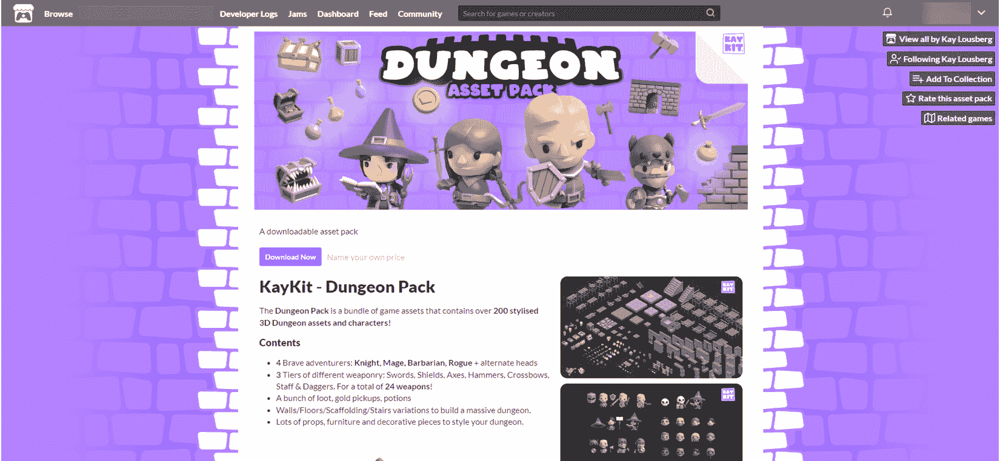
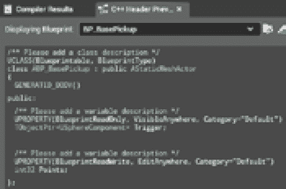
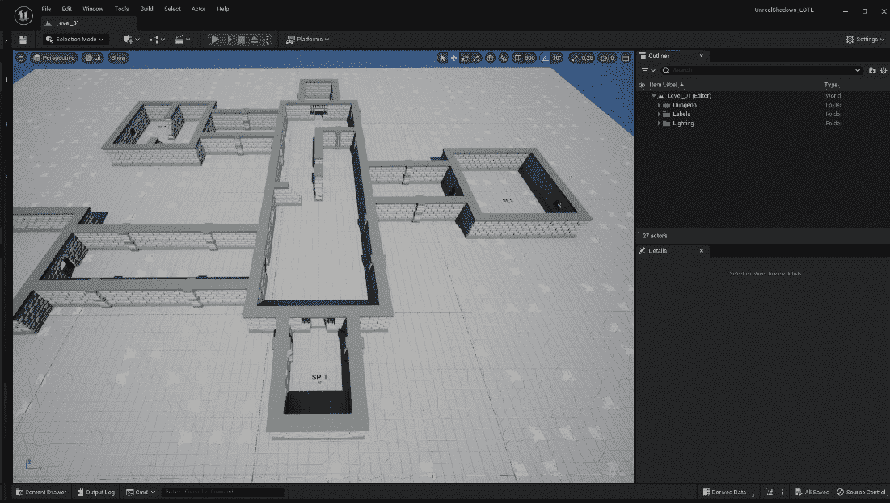
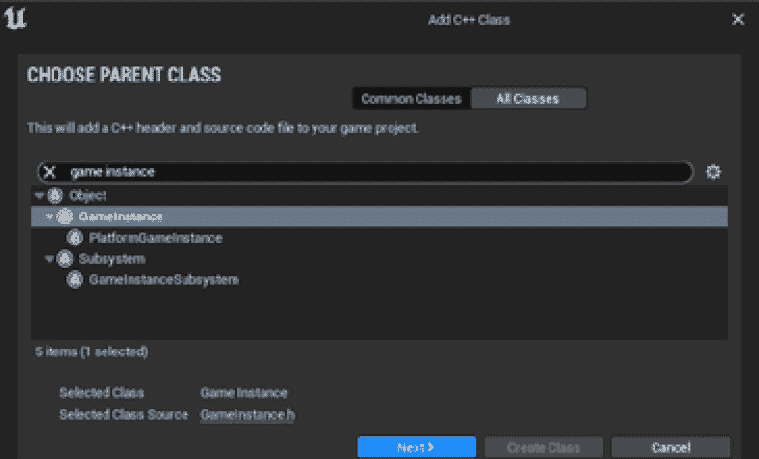
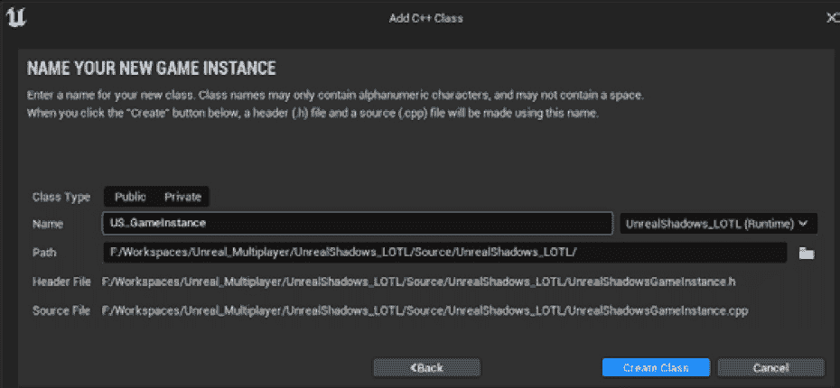
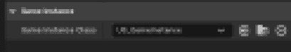
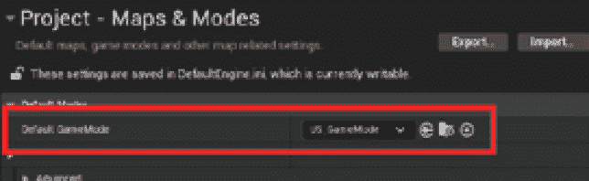
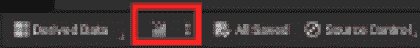
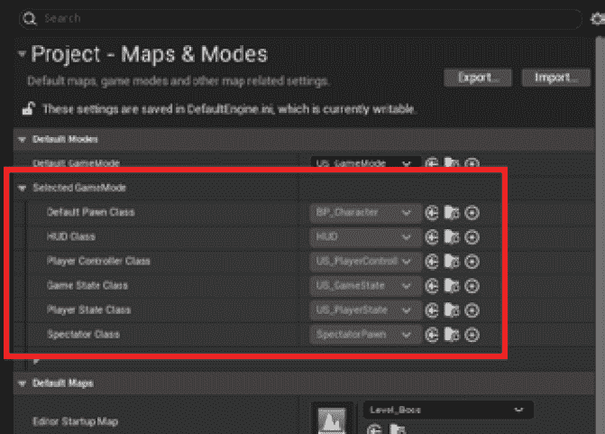

# 第四章：设置您的第一个多人游戏环境

在 UE5 中设置完整的联网游戏可能是一项令人畏惧的任务。这需要了解网络、编码以及引擎本身，所有这些都可能让经验丰富的开发者感到不知所措。但是，有了正确的指导和一些努力，您可以在很短的时间内（好吧，有点儿...）创建一个引人入胜的多人游戏体验！

为了避免在重新思考和修改过程中出现多个问题，第一步应该是清楚地理解项目的主题。这可以避免从一开始就产生混淆，并使工作流程更加顺畅。之后，您需要创建一个虚幻项目并正确设置一切。这包括创建您的**游戏框架**（**GF**）类，以便您能够访问开发所需的所有必要功能，以及配置项目设置以使用这些类。

到本章结束时，您将对使用 C++在 UE 中进行编程有一个扎实的理解，并为您的多人游戏奠定了基础。

在接下来的几节中，我将向您介绍以下主题：

+   介绍虚幻阴影 - 骷髅领主的遗产

+   在虚幻引擎中理解 C++

+   开始您的虚幻多人游戏项目

+   添加玩家类

# 技术要求

为了跟随本章内容，您应该已经按照*第一章*中解释的，设置了包含所有虚幻依赖项的 Visual Studio（或 JetBrains Rider）。

您将使用本书配套仓库中提供的起始内容，该仓库位于[`github.com/PacktPublishing/Multiplayer-Game-Development-with-Unreal-Engine-5`](https://github.com/PacktPublishing/Multiplayer-Game-Development-with-Unreal-Engine-5)。

通过此链接，找到本章的相应部分并下载以下`.zip`文件：`Unreal Shadows – Starter Content`。如果在本章的进展过程中您迷路了，在仓库中您也会在这里找到最新的项目文件：`Unreal Shadows –` `Chapter` `04` `End`。

此外，为了完全理解本章内容，在您跟随我了解 UE 框架主要特性的关键特性时，您需要对 C++编程有一些基本知识。

# 介绍虚幻阴影 - 骷髅领主的遗产

考虑以下来自（从未出版）奇幻小说《虚幻阴影 - 骷髅领主的遗产》的段落：

*“空气中弥漫着腐朽的恶臭，三个盗贼走进了骷髅领主的地下城。他们的任务很明确：潜入堡垒，找到国王的骑士，并把他活着带回来。他们找到的任何东西都可以带回家。”*

*当他们悄悄穿过阴暗的走廊时，他们都清楚自己并不孤单：成群的亡灵小兵潜伏在每一个角落，他们那绿色的眼睛空洞地 staring blankly.*

*公会之前已经遇到了不少危险的敌人，但从未遇到过如此强大的不死军队。他们静静地穿过走廊，小心翼翼地不引起任何注意。他们最不想做的就是吸引整个僵尸群向他们扑来。* 

恭喜你 – 你刚刚被雇佣来制作这部畅销书的视频游戏改编版！而且更棒的是，它将是一款多人游戏！

## 解释项目概述

你将要开发的游戏将是一款**第三人称射击游戏**，它将使用**捉迷藏**游戏玩法变化，正如在*第一章*中介绍的那样，*开始多人游戏开发*。这意味着这将是一款潜行游戏，玩家只能通过安静和谨慎地移动来生存。

在这款多人游戏中，每个参与者将扮演盗贼公会的一员，这是一个由游民和盗贼组成的秘密组织，潜入一个不死巫师的领域。主要目标将是营救被关押在地下监狱中的非玩家角色（希望它们还活着！）。此外，玩家还将收集来自过去和不太幸运的冒险者的宝藏和装备。

每个角色都将具备以下能力：

+   通过行走或跑步移动

+   操纵武器

+   获取增强道具

+   装备新武器

+   通过经验点提高技能

这款游戏的主要焦点将是潜行移动，因为不死军队将证明对角色来说直接交战过于强大。因此，移动（尤其是奔跑）和挥舞武器会产生噪音，使得之前未察觉的敌人立刻对玩家的存在警觉起来。

敌人将由 Lichlord 的随从代表，一群无意识的骷髅僵尸，它们将在关卡中四处游荡，对玩家角色一无所知。

角色发出的过多噪音或掉入陷阱会惊动附近的敌人，使得完成游戏变得几乎不可能。遗憾的是，玩家角色获得经验点只能通过击败敌人来实现，这进一步增加了整体体验的参与度！

注意

由于这本书是关于多人游戏编程而不是游戏设计，因此游戏机制的平衡将不会是游戏玩法的主要焦点；相反，重点将在于使事物有效运作。

## 开始项目

我们希望游戏在视觉上吸引人，但我猜你们大多数人可能没有 3D 建模的背景（我没有！）。这就是为什么我们将使用 Kay Lousberg([`kaylousberg.com/`](https://kaylousberg.com/))提供的某些惊人的资源，这些资源可以免费用于个人和商业用途。

*图 4**.1* 展示了我们将要使用的一种包装：



图 4.1 – KayKit 地牢包

你将从 UE5 中可用的**空白**模板创建一个全新的项目开始，然后你将添加上述套件中的某些资产；然而，为了避免正确导入它们的繁琐任务，我已经为你打包好了。

项目文件以及每一章的代码都可以在这个书的配套项目页面上找到，位于此处：[`github.com/PacktPublishing/Multiplayer-Game-Development-with-Unreal-Engine-5`](https://github.com/PacktPublishing/Multiplayer-Game-Development-with-Unreal-Engine-5)。

在确定了你要做什么之后，现在是时候了解如何在 UE5 中使用 C++了。以下部分将简要介绍引擎框架提供的核心功能。

# 理解虚幻引擎中的 C++

如果你和我一样热爱游戏开发和编程，你可能会发现，在 UE5 中编写 C++代码相当有趣，而且实际上并不太难入门。Epic Games 在添加让 C++变得容易使用的功能方面做得非常出色。

虽然在 UE5 中可以编写标准的 C++代码，但要实现更好的游戏性能，建议使用引擎最常用的功能，如内置的反射系统和内存管理。

## 蓝图和 C++

如你所知，UE 提供了两种编程游戏逻辑的方法：蓝图可视化脚本和 C++。

**蓝图可视化脚本**使得没有丰富编码经验的开发者能够创建复杂的游戏机制，而无需编写任何代码。另一方面，**C++**是一种**面向对象编程**（**OOP**）语言，它需要更多的技术知识，但比蓝图提供了对游戏引擎的更多控制。

应该注意的是，C++和蓝图是严格相连的，因为蓝图提供了底层 C++代码的视觉表示，并遵循其原则，包括继承和多态。虽然蓝图不需要高级编码技能，但它们在数据类型、指针、引用和其他规则方面遵循与编程语言相同的原理。

这两种语言都可以在 UE5 项目中一起使用，大多数情况下，你可以用 C++实现的事情同样可以用蓝图实现；然而，C++在定制 UE 的核心功能或创建扩展其功能（超出开箱即用的功能）的插件方面表现更出色。

尽管蓝图可视化脚本和 C++在处理 UE 项目时都提供了强大的工具集，但 C++通过面向对象编程技术提供了更底层的访问权限——这就是为什么一旦开始开发多人游戏，对它的深入了解非常重要。

## 理解 C++类

一个虚幻引擎 C++类，嗯，就是一个普通的 C++类！

如果你已经对 C++ 中的 OOP 有很好的了解，你在这里会感到很自在：创建新的 UE C++ 类的过程首先是通过定义它将表示的对象类型开始的，例如 Actor 或组件。一旦定义了类型，变量和方法就在头文件（`.h`）中声明，代码逻辑在源文件（`.cpp`）中实现。

虽然源文件的行为类似于其种类的常规 C++ 文件，但头文件将允许你为将用于继承自你的类的 Blueprints 的变量和函数声明附加信息。此外，它将减轻在运行时管理内存的痛苦（我稍后会回到这一点）。

随着 UE5 的发布，Epic Games 引入了一个令人惊叹的检查工具，称为 `BP_BasePickup`，这是在上一个章节中创建的。



图 4.2 – C++ 头文件预览工具的实际应用

在 UE 中，有三个主要的类类型，你将在开发过程中从中派生：

+   **UObject** 是 UE 的基类，提供了 UE 中大部分主要功能，例如**垃圾回收**（**GC**）（是的，UE 提供了它！），网络支持，属性和方法反射等。**AActor** 是一种可以添加到游戏关卡中的 UObject，可以从编辑器或运行时添加：在后一种情况下，我们说 Actor 被已**生成**。在多人环境中，AActor 是可以在网络中复制的基类型，它将为需要同步的任何组件提供信息。

+   **UActorComponent** 是定义将附加到 Actor 或 Actor 自身的另一个组件的组件的基本类。

此外，你还将使用以下实体：

+   **UStruct** 用于创建平面数据结构，并且不扩展自任何特定类

+   **UEnum** 用于表示元素枚举

最后一点，在这本书中，你会发现类名以一些字母开头，一旦在编辑器中使用这些类，这些字母将不可见。UE 使用前缀来指明类类型。主要使用的前缀如下：

+   `UObject`（例如，组件）

+   （**AActor**）并且可以添加到关卡中

+   `FColor` 结构

+   `TArray` 或 `TMap`

+   **I** 用于接口

+   **E** 用于枚举

+   `bool` 或 `uint8`（可以用来代替 `bool`）

注意

请记住，大多数这些前缀是强制性的；如果你尝试命名一个没有 `A` 前缀的从 Actor 继承的类，你会得到一个错误。UE 会在编辑器中隐藏前缀。此规则仅适用于 C++ 类；Blueprints 可以没有这样的前缀命名。

现在你已经熟悉了 UE 中可用的主要类型，是时候探索类头文件的主要功能，以便理解其核心功能了。

## UE C++ 头文件的解剖

UE5 中 Actor 的 C++头文件将类似于以下代码片段：

```cpp
#include "Engine/StaticMEshActor.h"
#include "APickup.generated.h"
UCLASS(Blueprintable, BlueprintType)
class APickup : public AStaticMeshActor
{
  GENERATED_BODY()
public:
  APickup();
  UPROPERTY(BlueprintReadOnly, VisibleAnywhere, Category="Default")
  TObjectPtr<class USphereComponent> Trigger;
  UPROPERTY(BlueprintReadWrite, EditAnywhere, Category="Default")
  int32 Points;
  UFUNCTION(BlueprintCallable)
  void Reactivate();
};
```

如你所见，这里有很多事情在进行中。

首先，你会注意到一个`#include "APickup.generated.h"`声明。这一行代码是自动生成的，由你的头文件中声明的`include`文件或编译器抛出错误。

注意

UHT 是一个自定义解析和代码生成工具，它支持 Unreal Engine 中的 UObject 系统。UHT 用于解析 Unreal 的 C++头文件，并生成引擎与用户创建的类一起工作所需的样板代码。

类构造函数（在这种情况下，`APickup()`）用于设置属性默认值，就像你在常规 C++类中做的那样；更重要的是，你将使用它来创建和添加组件到 Actor 本身。

接下来，你会找到一些声明，例如`UCLASS()`、`GENERATED_BODY()`、`UPROPERTY()`和`UFUNCTION()`，这些是由 UE 使用的，并且每个都有精确的功能。如果你想知道名为`BlueprintReadOnly`、`VisibleAnywhere`等属性的含义，不要害怕！我将在*第五章*中解释它们的含义，*在多人游戏环境中管理 Actor*。

在下一个子节中，我将向你展示它们的精确含义。

## Unreal Engine 反射系统

术语**反射**指定了允许程序在运行时检查其自身结构的特性。这个特性非常有价值，并作为 UE 的核心技术之一，支持编辑器中的详细面板、序列化、垃圾回收、网络复制以及蓝图与 C++之间的通信等众多系统。

由于 C++没有对反射的原生支持，Epic Games 为其在 UE 中开发了自己的系统，用于收集、检查和修改与 C++类、结构等相关数据。

为了使用反射，你需要使用注释（如`UCLASS()`、`UFUNCTION()`或`UPROPERTIES()`）来标记任何你希望使系统可见的类型或属性。

为了启用这些注释，你将使用我在上一个子节中介绍的`#include "APickup.generated.h"`声明（当你使用 Unreal Class Wizard 创建类时，此声明会自动生成，因此你不必担心它）。

以下列表提供了在反射系统中可访问的基本标记元素：

+   `UCLASS()`: 用于为需要从`UObject`派生的类生成反射数据

+   `USTRUCT()`: 用于为结构生成反射数据

+   `GENERATED_BODY()`: 此标记将被替换为所需的所有类型样板代码

+   `UPROPERTY()`: 用于通知引擎，关联的成员变量将具有一些附加功能，例如蓝图可访问性或跨网络复制（这对你来说在以后会非常重要！）

+   `UFUNCTION()`: 允许（以及其他事情）从扩展的 Blueprint 类或从 Blueprint 本身覆盖此函数

反射系统也被垃圾回收器使用，所以你不必担心内存管理，正如你将在下一小节中看到的。

## 内存管理和垃圾回收

在游戏级别中有成千上万个（有时是数万个！）活跃对象时，GC 是编程的一个基本部分。它就像你运行代码的清洁工——通过自动收集和处置不再需要的对象，帮助保持一切整洁有序。这是一个确保你的程序运行顺畅、没有内存泄漏或性能问题的好方法，这样你就可以专注于创建令人惊叹的功能。

C++ 没有原生实现垃圾回收（GC），因此 UE 实现了自己的系统：你只需确保对象的合法引用得到维护。为了使你的类启用 GC，你需要确保它们继承自 `UObject`；然后系统会保留一个对象列表（也称为 **root**），这些对象不应该被垃圾回收。只要对象在 root 列表中，它就不会被删除；一旦它从列表中移除，它将在下一次垃圾回收器被调用时（即，在特定间隔）从内存中删除。

注意

除非你调用它们的 `Destroy()` 方法，否则演员仅在级别关闭时被销毁：在这种情况下，它们将立即从游戏中移除并由垃圾回收器删除。

在本节中，我向你介绍了区分 Unreal Engine 项目和常规 C++ 项目的核心功能。在下一节中，你将通过创建空白项目并扩展主要的 Unreal GF 类来开始应用这些知识。

# 开始你的 Unreal 多人游戏项目

在本节中，你终于要开始开发多人游戏项目了（我知道你迫不及待地想要开始它！）！你将创建一个 Unreal C++ 空白项目，并添加我提供的已打包的资产。然后，你将创建管理多人会话所需的 GF 类。那么，让我们开始吧。

## 创建你的项目文件

让我们先创建一个空白项目：

1.  打开 Epic Games Launcher 并启动 Unreal 编辑器。

1.  从 **Games** 部分选择 **Blank** 模板。

1.  在 **Project Defaults** 中，选择 **C++** 作为项目类型。

1.  确保未选中 **Starter Content** 字段，因为你不会使用它。

1.  给项目一个有意义的名称（例如，`UnrealShadows_LOTL`）。

1.  点击 **Create** 按钮。

1.  创建 UE 项目后，获取你在本章开头下载的 `UnrealShadows-StarterContent.zip` 文件，并将其解压到你的电脑上。

1.  导航到你的项目 `Content` 文件夹，位于 `[Your Project Path]` | `UnrealShadows_LOTL` | `Content`。

1.  将解压文件的文件内容（`_ExternalActors_`、`Blueprints`、`KayKit` 和 `Maps` 文件夹）复制到 `Content` 文件夹中，以将所有需要的资产添加到你的项目中。

一旦复制了文件，它们应该出现在 UE 编辑器中，并在你的项目中可用。如果文件没有在内容浏览器中弹出，只需关闭编辑器并重新打开，让 UE 更新 `Content` 文件夹。

你会注意到我已经添加了两个级别（`Maps` 文件夹：这些级别将在本书中使用，并且为了便于开发而创建。你可以自由创建自己的地图或添加额外的资产，这些资产可以位于 **内容** | **KayKit** | **Dungeon Elements**）。

只是为了确认一切如预期进行，打开 `Level_01` 地图，你应该能看到 *图 4**.3* 中显示的关卡：



图 4.3 – Level 01 地图

是时候添加任何 UE5 项目中使用的某些主要类了，这些类扩展了 GF 元素。

## 创建项目游戏实例

如你可能已经知道的，在 UE5 中，**GameInstance** 是一个负责管理需要在关卡变化或游戏会话之间持久化的高级数据的类。它本质上是一个全局可访问的 UObject，可以存储你想要在整个游戏中保持的数据，例如玩家得分，以及其他需要在不同关卡或游戏会话之间共享的信息。

可以创建一个扩展 GameInstance 的类作为蓝图类或 C++，它在游戏启动时实例化，并且仅在游戏关闭时销毁。

重要提示

与大多数 C++ Unreal Engine 项目一样，你将使用 C++ 类和蓝图混合工作。C++ 类位于 **所有 | C++ 类 | UnrealShadows_LOTL** 文件夹中，并且只能添加到那里（或子文件夹中）。如果你找不到这个文件夹，你可能创建了一个仅蓝图的项目。不要绝望，一旦创建了第一个 C++（稍后将有更多介绍），Unreal Engine 编辑器将负责将其转换为 C++ 项目，一切都将就绪！

要创建你的项目 GameInstance，请按照以下步骤操作：

1.  在主菜单中，选择 **工具** | **新建** **C++ 类...**。

1.  `游戏实例`。

1.  选择 **GameInstance** 类，如图 *图 4**.4*：



图 4.4 – 类创建向导

1.  点击 **下一步** 进入 **命名新游戏** **实例** 面板。

1.  在 `US_GameInstance`。你可以保留其他字段不变，这样面板看起来就像 *图 4**.5*：



图 4.5 – 命名你的类

1.  点击 **创建类** 按钮以生成你的类文件。

注意

我将在项目中扩展主要 GF 元素的大部分类中使用 `US_` 前缀：这只是一个 UnrealShadows 的简称，将使我们能够看到这些文件来自我们的项目。

一旦创建过程结束，您将获得两个新文件：`US_GameInstance.h` 和 `US_GameInstance.cpp`。恭喜您——您刚刚创建了您的第一个 Unreal C++ 类！

打开头文件，您将看到以下代码：

```cpp
// Fill out your copyright notice in the Description page of Project Settings.
#pragma once
#include "CoreMinimal.h"
#include "Engine/GameInstance.h"
#include "US_GameInstance.generated.h"
/**
 *
*/
UCLASS()
class UNREALSHADOWS_LOTL_API UUSGameInstance : public UGameInstance
{
  GENERATED_BODY()
};
```

源文件将保持为空，除了头文件中的 `#``include` 声明：

```cpp
// Fill out your copyright notice in the Description page of Project Settings.
#include "US_GameInstance.h"
```

如您所见，这个类扩展了基础 `GameInstance` 类（即 `UGameInstance`），目前除了在上一节中引入的宏声明之外，它没有任何功能。然而，随着项目的进展，将添加新的功能，例如数据收集或在线服务管理。

注意

如果您将项目命名为不同于我的名称（例如，`UnrealShadows_LOTL`），您将在类声明中获得不同的 API 导出名称；正如您从前面的代码中看到的，我的名称是 `UNREALSHADOWS_LOTL_API`。请记住这一点，因为我的代码将引用此名称，您可能会遇到编译错误。为了修复这个问题，您应该将 `UNREALSHADOWS_LOTL_API` 文本更改为 `YOUR_PROJECT_NAME`（全部大写），并带有 `_API` 后缀。

这个游戏实例需要添加到项目设置中，以便在运行时被实例化。为此，请按照以下步骤操作：

1.  从主菜单打开 **项目设置**。然后点击 **项目** | **地图与模式** 部分。

1.  在 **游戏实例类** 下拉菜单中，选择 **UG_GameInstance**，如图 *4**.6* 所示：



图 4.6 – 分配给项目的游戏实例

现在我们已经将游戏实例分配给了项目，是时候为菜单和大厅关卡创建一个游戏模式了。

## 创建游戏模式和游戏状态

在 UE 中，**游戏模式** 是一个控制游戏规则的类，例如玩家如何加入游戏，如何在不同关卡之间过渡，以及其他游戏特定设置。游戏模式通常与 **游戏状态** 类配对，该类管理游戏的当前状态，例如得分、剩余时间和其他重要信息。游戏模式和游戏状态类一起允许开发者创建复杂和定制的游戏机制。

如果您检查您的 `C++ Classes` 文件夹，您会注意到已经有一个名为 `UnrealShadowsLOTLGameModeBase` 的游戏模式（如果您的项目名称与我的不同，名称可能会有所不同）。这是一个从 GF 自动生成的类，扩展了 `AGameModeBase`。

你将不会使用这个，因为你需要从`AGameMode`创建一个类；这个类通过添加一些增强多人游戏系统的功能来扩展`AGameModeBase`，例如游戏规则和胜负条件。要使用自己的设置扩展游戏模式，请按照以下步骤操作：

1.  创建一个与之前章节中为游戏实例创建的类相同的新的 C++类。

1.  从**所有类**部分选择**GameMode**并点击**下一步**。

1.  将你的类命名为`US_GameMode`并点击**创建类**按钮。

1.  一旦创建了类，就需要将其设置为所有级别的默认游戏模式。为此，打开**项目设置**并选择**地图与模式**部分。

1.  然后，点击**默认游戏模式**下拉菜单并选择**US_GameMode**，如图 4.7 所示：



图 4.7 – 默认游戏模式

1.  关闭**项目设置**窗口。

现在游戏模式已经定义，是时候创建一个游戏状态了：

1.  创建另一个从`GameState`（来自**所有类**部分）扩展的 C++类。

1.  在点击`US_GameState`后，点击**创建类**按钮。

1.  现在，通过在 Unreal 编辑器的`C++类`文件夹中双击相应的图标来声明`US_GameMode`文件。这将打开 IDE 内的头文件和源文件。

1.  在`US_GameMode.h`中声明一个构造函数，添加以下两行代码：

    ```cpp
    public:
    ```

    ```cpp
       AUS_GameMode();
    ```

1.  在`US_GameMode.cpp`中实现构造函数，添加以下代码：

    ```cpp
    #include "US_GameState.h"
    ```

    ```cpp
    AUS_GameMode::AUS_GameMode()
    ```

    ```cpp
    {
    ```

    ```cpp
       GameStateClass = AUS_GameState::StaticClass();
    ```

    ```cpp
    }
    ```

之前的代码实际上声明了`US_GameMode`的 Game State 类为之前创建的`US_GameState`。请注意，此声明也可以在子蓝图中进行；这将允许在编辑器中通过下拉菜单切换类。最终，这取决于个人喜好，你可能更倾向于代码导向，并偏好代码解决方案，或者你可能想利用原生代码和编辑器之间令人印象深刻的交互。

在本节中，你已创建了系统将用于处理多人会话的主要类。目前，这些只是等待添加一些游戏逻辑的空容器；请耐心等待，我们还有许多章节要填补这个空白！

在下一节中，你将创建处理游戏中的角色输入和存在的类。

# 添加玩家类

现在，你已经准备好创建一些几乎任何 UE 游戏都会使用的主要类：那些用于管理玩家输入并在游戏中显示角色及其状态的类。

**玩家控制器**负责管理来自玩家输入设备（如键盘和鼠标）的输入，并向玩家的角色发送命令，使其执行相应的动作。玩家控制器类通常用于控制**Pawn**类或**Character**类，这些类代表游戏中玩家的角色。

最后，**玩家状态** 是一个包含有关玩家游戏状态信息的类，例如经验点、分数和其他相关数据。它在服务器和客户端上存在，以确保所有玩家都能访问相同的信息。

让我们创建这三个类：

1.  创建一个扩展 `PlayerController` 的 C++ 类，并将其命名为 `US_PlayerController`。

1.  创建另一个扩展 `Character` 的 C++ 类，并将其命名为 `US_Character`。

1.  最后，创建一个扩展 `PlayerState` 的 C++ 类，并将其命名为 `US_PlayerState`。

这三个类应该像添加游戏状态一样添加到游戏模式中，但为了给我们的 `Character` 类提供更多灵活性，你将从中创建一个 Blueprint。要从新创建的 C++ 类中获取 Blueprint，你需要编译项目。

你现在将第一次编译你的源代码，以检查一切是否已正确设置。

## 编译你的源代码

在 Unreal Engine 项目中编译是指将用 C++ 编写的可读代码转换为计算机可以理解和运行的可执行代码的过程 – 这是开发过程中的一个重要步骤。UE 提供了工具来简化编译过程并提高开发体验。

在 Unreal Engine 中，你可以利用 **Live Coding** 功能，该功能允许在 UE 引擎运行时重建应用程序的 C++ 代码并修补其二进制文件。

使用 Live Coding，你可以修改 C++ 类，编译它们，并在编辑器运行时观察更改生效 – 所有这些都不需要中断游戏测试会话或正在进行的工作。这个特性为迭代开发带来了巨大的优势，尤其是在使用 C++ 运行时逻辑，如游戏代码或前端用户交互时。

Live Coding 默认启用，当使用 IDE 或 Unreal Engine 时，你可以通过按键盘上的 *Ctrl* + *Alt* + *F11* 来启动 Live Coding 构建。

或者，要禁用 Live Coding 并开始编译过程，你可以点击 Unreal Engine 编辑器右下角的 **编译** 按钮，如图 *图 4.8* 所示：



图 4.8 – 编译按钮

一旦源代码编译完成，你应该会收到成功消息。否则，你将收到失败的编译产生的通常错误或警告；在这种情况下，确保你的代码编写正确且无错误至关重要。

一旦你的项目成功编译，就是时候从你的 `Character` 类创建一个 Blueprint 了。

## 创建角色 Blueprint 类

由于你将在稍后对角色进行一些定制，因此拥有由 Blueprint 类提供的额外灵活性是至关重要的。

由于您已成功编译代码，您可能会期望您创建的类现在将准备好在蓝图创建向导中可用。这是一个正确的假设，您现在将测试它。让我们这样做：

1.  导航到`内容` | `蓝图`文件夹。

1.  创建一个继承自`US_Character`的蓝图类，命名为`BP_Character`。

1.  保存并关闭蓝图：您现在不会对它做任何事情。

这个新的蓝图应该被添加到游戏模式中，作为游戏会话期间使用的默认 Pawn。不幸的是，蓝图类不能直接在 C++类中引用。这意味着您必须通过`ConstructorHelpers`实用类中可用的`FClassFinder`方法来找到它。

## 将玩家类添加到游戏模式

您现在将声明新创建的类到游戏模式中。让我们再次打开`US_GameMode.cpp`文件并添加一些代码逻辑。在`声明`部分，添加以下代码块：

```cpp
#include "US_PlayerController.h"
#include "US_PlayerState.h"
#include "US_Character.h"
#include "UObject/ConstructorHelpers.h"
```

这将声明您将要声明的所有 GF 类以及`ConstructorHelpers`实用类。

然后，在构造函数的闭合括号之前，添加以下代码块：

```cpp
PlayerStateClass = AUS_PlayerState::StaticClass();
PlayerControllerClass = AUS_PlayerController::StaticClass();
static ConstructorHelpers::FClassFinder<APawn> PlayerPawnBPClass(TEXT("/Game/Blueprints/BP_Character"));
if (PlayerPawnBPClass.Class != nullptr)
{
   DefaultPawnClass = PlayerPawnBPClass.Class;
}
```

如您所见，代码的前两行以与您在上一节中为`GameStateClass`所做的类似方式声明了`PlayerStateClass`和`PlayerControllerClass`。

同时，从 C++类中检索蓝图引用（例如`PlayerPawnBPClass`）的方式与常规 C++类不同：您需要硬编码一个路径到您的项目。这可能不是一个理想的解决方案，因为文件可能会被移动或删除，但...它确实有效！

请记住，我的文件路径（即`"/Game/Blueprints/BP_Character"`）可能因您的文件夹组织方式而略有不同。

现在游戏模式类已经被修改，点击 Unreal 编辑器中的**编译**按钮。

一旦得到成功的结果，就是时候查看游戏模式实例，以确保一切正确。为此，请按照以下步骤操作：

1.  打开**项目设置** | **地图与模式**部分。

1.  定位到**选定的游戏模式**字段，通过点击其旁边的箭头将其展开。

1.  检查我们创建的 GF 类是否都正确分配，如图*图 4.9*所示：



图 4.9 – 更新的默认游戏模式

在本节最后，您已经通过添加下一章中将要扩展的所有 GF 类，完成了游戏模式的设置。

# 摘要

在本章中，您被简要介绍了您将在本书的其余部分开发的项目：一款涉及盗贼、秘密宝藏和大量不死小弟的多人潜行游戏。道路仍然漫长，但必须阻止巫妖王！

之后，你了解了 Unreal Engine C++“方言”的主要主题。涉及了许多额外的功能，书中剩余部分还将发现更多。其中最令人兴奋的事情之一是，如果设置得当，你不必担心内存管理：Unreal Engine 完美地处理它。更重要的是，通过向你的类、变量和函数添加装饰，你可以将它们暴露给 Blueprint 系统，让你的项目对非代码导向的开发者更加灵活和易于访问。

最后，你创建了将用于你的游戏的主要类，这些类扩展了 GF 提供的类。从持久的 GameInstance 开始，你进入了 Game Mode，然后是所有面向玩家的元素。你现在有一个坚实的基础来开始开发你的多人游戏项目。

在下一章中，我将通过展示如何在多人环境中管理它来引导你创建玩家角色。
