# 第五章：在多人环境中管理 Actor

在 UE5 中正确设置多人环境时，了解 Actor 的连接管理方式以及其属性在游戏会话中的相关性非常重要。

在本章中，您将开始增强玩家角色（目前只是一个空壳），以全面理解之前提到的概念。为此，您将为 Character 类添加更多组件（相机是您绝对需要的！）并实现玩家输入逻辑。

此外，您还将了解在多人环境中知道谁拥有 Actor 的重要性，以及它如何根据其在关卡中的相关性而表现不同。

到本章结束时，您将具备如何管理 Unreal 多人游戏中的 Actor 的扎实知识，这将使您能够创建更稳健和高效的多人体验。

因此，在本章中，我将向您介绍以下主题：

+   设置角色

+   控制 Actor 的连接

+   理解 Actor 的相关性

+   介绍权限

# 技术要求

要跟随本章介绍的主题，您应该已完成上一章，并理解其内容。

此外，如果您希望从本书的配套仓库开始编写代码，您可以下载`.zip`项目文件，链接为[`github.com/PacktPublishing/Multiplayer-Game-Development-with-Unreal-Engine-5`](https://github.com/PacktPublishing/Multiplayer-Game-Development-with-Unreal-Engine-5)。

您可以通过点击`Unreal Shadows –` `第四章` `结束`链接下载与上一章结尾同步的文件。

# 设置角色

在我开始撰写关于连接、权限和角色等主题之前，我需要您正确设置玩家角色——目前，我们可怜的英雄只是一个空类！

因此，在本节中，您将添加一个相机和一些用户输入，并设置允许盗贼角色在关卡中移动以寻找宝藏和金子的主要功能！

## 为角色添加基本设置

在接下来的几个步骤中，您将添加构成第三人称相机行为的组件，并实现它们的逻辑。之后，您将为 Character 类中已存在的组件设置一些默认值：箭头、胶囊和骨骼网格组件。

### 为角色添加相机组件

要开始，打开`US_Character.h`头文件。您将添加一个相机组件和一个弹簧组件，将相机连接到 Character 类中可用的胶囊组件。为此，在`GENERATED_BODY()`宏之后添加这两个组件声明：

```cpp
UPROPERTY(VisibleAnywhere, BlueprintReadOnly, Category = Camera, meta = (AllowPrivateAccess = "true"))
TObjectPtr<class USpringArmComponent> CameraBoom;
UPROPERTY(VisibleAnywhere, BlueprintReadOnly, Category = Camera, meta = (AllowPrivateAccess = "true"))
TObjectPtr<class UCameraComponent> FollowCamera;
```

在前面的代码块中，我们正在声明一个相机组件和一个弹簧组件，这将创建相机系统。首先，你会注意到两个变量上都有`UPROPERTY()`声明和一些属性指定符。让我来解释一下：

+   `VisibleAnywhere`属性表示这个属性在所有相关的虚幻引擎编辑器窗口中都是可见的，但不能被编辑

+   `BlueprintReadOnly`属性表示这个属性可以被蓝图读取但不能修改

+   `Category`属性指定了当在**蓝图****详情**面板中显示属性时的类别

你还会注意到一个`meta`声明，它让你可以控制属性如何与虚幻引擎和编辑器的各个方面交互：在这种情况下，`AllowPrivateAccess`表示私有成员应该可以从蓝图访问。我们需要这个声明，因为这些属性的访问性没有明确声明，因此它们默认为`private`。

注意

对于属性指定符的详尽列表，请查看官方 Epic Games 文档，可以在以下链接找到：[`docs.unrealengine.com/5.1/en-US/unreal-engine-uproperty-specifiers/`](https://docs.unrealengine.com/5.1/en-US/unreal-engine-uproperty-specifiers/)。

接下来，看看类型之前的`class`关键字——这是一个 C++的**类前向声明**。如果你不熟悉这个概念，它是一种在不提供完整类定义的情况下声明类名及其成员的方法。这在你想在头文件中使用一个类但不想包含整个类定义的情况下很有用，这可能会使编译变慢并创建不必要的依赖。

最后，你会注意到`TObjectPtr<T>`模板——这是 UE5 中的一个新特性，它被引入来替换头文件中的原始指针（例如，`USpringComponent*`）与 UProperties。`TObjectPtr<T>`模板仅适用于在代码头文件中声明的成员属性。对于`.cpp`文件中的函数和短生命周期范围，使用`TObjectPtr<T>`与使用原始指针相比没有提供额外的优势。

由于相机和弹簧组件是私有的，你需要为它们添加两个 getter 方法。在头文件的`public`声明中，找到以下代码行：

```cpp
virtual void SetupPlayerInputComponent(UInputComponent* PlayerInputComponent) override;
```

然后，在这行代码下面添加以下内容：

```cpp
FORCEINLINE USpringArmComponent* GetCameraBoom() const { return CameraBoom; }
FORCEINLINE UCameraComponent* GetFollowCamera() const { return FollowCamera; }
```

这两种方法将允许你访问指针组件，并且`FORCEINLINE`宏强制代码内联；这将给你的代码带来一些性能优势，因为当你使用这种方法时，你将避免函数调用。

### 实现相机行为

现在你的属性已经添加好了，是时候添加一些代码逻辑来处理它们了。打开`.cpp`文件，并在其顶部添加以下包含：

```cpp
#include "Camera/CameraComponent.h"
#include "Components/CapsuleComponent.h"
#include "GameFramework/CharacterMovementComponent.h"
#include "GameFramework/SpringArmComponent.h"
```

然后，在构造函数（即`AUS_Character::AUS_Character()`）中添加以下代码：

```cpp
CameraBoom = CreateDefaultSubobject<USpringArmComponent>(TEXT("CameraBoom"));
CameraBoom->SetupAttachment(RootComponent);
CameraBoom->TargetArmLength = 800.0f;
CameraBoom->bUsePawnControlRotation = true;
```

在这里，`CreateDefaultSubobject()<T>`是一个用于创建一个新子对象的功能，该子对象将由另一个对象拥有。**子对象**本质上是一个对象的组件或成员变量，该方法通常在对象的构造函数中调用以初始化其子对象（在这种情况下，是组件）。

`SetupAttachment()`方法会将一个组件重新父化到另一个组件。在这种情况下，你将相机组件附加到`RootComponent`，实际上它是胶囊组件。

让我们给相机同样的处理。在之前的代码行之后添加此代码块：

```cpp
FollowCamera = CreateDefaultSubobject<UCameraComponent>(TEXT("FollowCamera"));
FollowCamera->SetupAttachment(CameraBoom, USpringArmComponent::SocketName);
FollowCamera->bUsePawnControlRotation = false;
```

这里的唯一真正区别是，你将相机重新父化到弹簧组件而不是根组件。

你刚刚创建了一种“命令链”，其中相机连接到与 Actor 根连接的弹簧组件——这将在相机撞击障碍物时让相机以“弹簧”行为跟随角色，并为玩家提供更好的感觉。

### 设置默认组件属性

作为最后一步，你将修改一些属性以创建 Character 类的默认设置。在构造函数中添加以下代码行：

```cpp
bUseControllerRotationPitch = false;
bUseControllerRotationYaw = false;
bUseControllerRotationRoll = false;
GetCapsuleComponent()->InitCapsuleSize(60.f, 96.0f);
GetMesh()->SetRelativeLocation(FVector(0.f, 0.f, -91.f));
static ConstructorHelpers::FObjectFinder<USkeletalMesh> SkeletalMeshAsset(TEXT("/Game/KayKit/Characters/rogue"));
if (SkeletalMeshAsset.Succeeded())
{
   GetMesh()->SetSkeletalMesh(SkeletalMeshAsset.Object);
}
GetCharacterMovement()->bOrientRotationToMovement = true;
GetCharacterMovement()->RotationRate = FRotator(0.0f, 500.0f, 0.0f);
GetCharacterMovement()->MaxWalkSpeed = 500.f;
GetCharacterMovement()->MinAnalogWalkSpeed = 20.f;
GetCharacterMovement()->BrakingDecelerationWalking = 2000.f;
```

在这里，你只是更改了角色 Actor 及其组件的一些默认值。需要注意的是，你通过`FObjectFinder()`实用方法（在之前使用的`ConstructorHelpers`类中可用）获取角色模型并将其分配给`SkeletalMeshComponent`。

### 更新角色蓝图

现在是时候编译你的项目了，只是为了检查你没有语法错误，并且角色已经正确设置。为此，保存你的文件，回到 Unreal 编辑器，并点击**编译**按钮。

一旦编译阶段完成，打开**BP_Character**蓝图，你应该注意到你的更改没有显示出来。这是因为蓝图尚未更新。要修复这个问题，选择**文件** | **刷新所有节点**。现在你应该在**组件**面板中看到添加到层次结构中的**相机吊杆**和**跟随相机**元素，如图*图 5.1*所示：

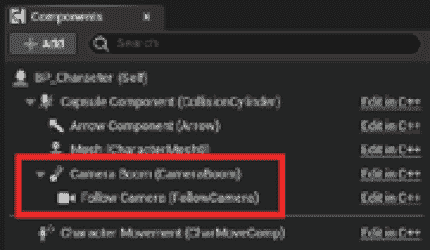

图 5.1 – 新增的角色组件

你可能仍然看不到更新后的网格在骨骼网格组件中。要修复这个问题，请执行以下步骤：

1.  在**组件**面板中选择**网格**元素，并在**细节**面板中查找**骨骼网格资产**字段。

1.  如果**骨骼网格资产**显示为**None**，点击它旁边的**重置属性**箭头，如图*图 5.2*所示：

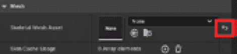

图 5.2 – 重置属性按钮

1.  仔细检查**使用控制器旋转偏航 Y**属性，因为它可能也需要重置。

现在，你应该能够看到视口已经更新，并添加了选定的网格，如图 *图 5**.3* 所示：

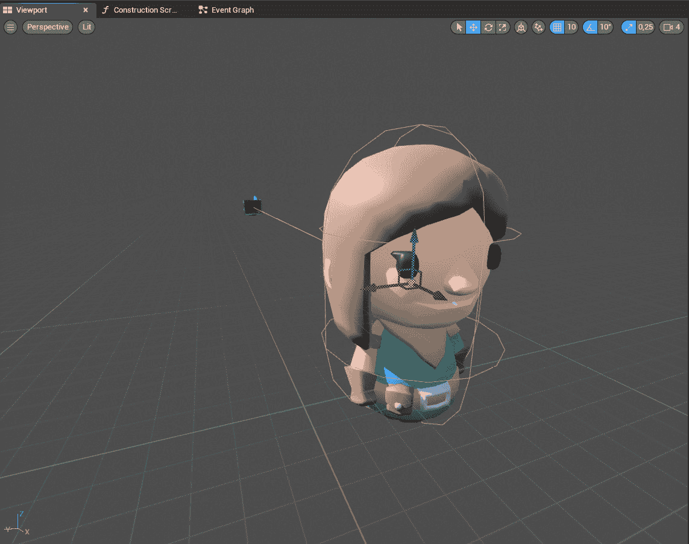

图 5.3 – 更新的角色蓝图

当你的角色设置完成后，就是时候通过添加一些用户交互来让它动起来了。

## 为角色添加交互

现在我们将为角色添加输入设置。为此，我们将使用 UE5 中引入的新 **增强输入系统**。这个新系统为开发者提供了比之前一个（简单地称为输入系统）更高级的功能，例如复杂的输入处理和运行时控制重映射。由于旧系统正在被弃用，它可能迟早会被从 Unreal Engine 中移除，因此最好保持对变化的关注。

关于增强输入系统，最重要的是了解它与你的代码如何通信：这是通过表示角色在游戏过程中可以做什么的 **输入动作** 来实现的（即，行走、跳跃或攻击）。一组输入动作可以收集在一个 **输入映射上下文** 中，它代表了一组触发包含动作的规则。

在运行时，UE5 将检查一个输入触发器列表，以确定用户输入如何激活输入动作，验证如长按、释放事件或双击等模式。在触发输入之前，系统可以通过一系列 **Input Modifiers** 预处理原始输入，这些修改器将改变数据，例如为摇杆设置自定义的死区或从输入本身获取负值。

在本节中，你将为你的角色创建一些基本的交互，包括移动、冲刺和与物体交互（我们将攻击动作留到后面的章节）。冲刺和交互动作将通过按下一个按钮来激活，而移动动作将由键盘/鼠标组合或控制器摇杆控制。

注意

如果你想要探索增强输入系统提供的全部可能性，你可以通过访问这个网页来查看官方文档：[`docs.unrealengine.com/5.1/en-US/enhanced-input-in-unreal-engine/`](https://docs.unrealengine.com/5.1/en-US/enhanced-input-in-unreal-engine/)。

### 创建输入动作

要开始创建输入动作，请按照以下步骤操作：

1.  打开你的 `Input`。

1.  在文件夹内，右键单击并选择 **Input** | **Input Action** 来创建一个输入动作资产。

1.  将其命名为 `IA_Interact`。

1.  创建另外三个输入动作，并将它们命名为 `IA_Look`、`IA_Move` 和 `IA_Sprint`。

让我们开始编辑 **IA_Interact** 动作 – 我们需要它通过单次按钮（或按键）按下激活，并且这个动作应该在按钮按下的一瞬间被触发。为此，双击资产以打开它，并执行以下操作：

1.  点击 **Triggers** 字段旁边的 **+** 按钮，添加一个触发器。

1.  点击创建的下拉菜单并选择 **按下** – 此选项将避免在玩家按住按钮时触发多个事件。

1.  其他保持不变 - 只需确保 **值类型** 已设置为默认值 **数字（bool）**。

交互动作资产的最终结果如图 *图 5**.4* 所示：

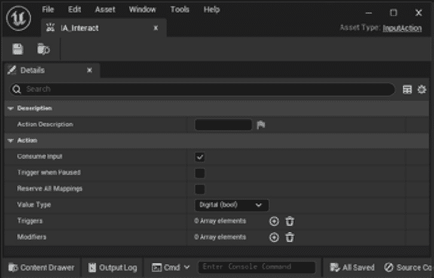

图 5.4 – 交互动作设置

**IA_Sprint** 动作与交互动作非常相似，但需要在角色开始冲刺时触发一个按下事件，在角色停止冲刺时触发一个释放事件。

双击 **IA_Sprint** 资产以打开它并按以下说明更改设置：

1.  通过点击 **Triggers** 字段旁边的 **+** 按钮两次添加两个触发器。

1.  点击创建的第一个下拉菜单并选择 **按下**。

1.  点击第二个下拉菜单并选择 **已释放**。

1.  其他保持不变，确保 **值类型** 已设置为默认值 **数字（bool）**。

冲刺动作资产的最终结果如图 *图 5**.5* 所示：

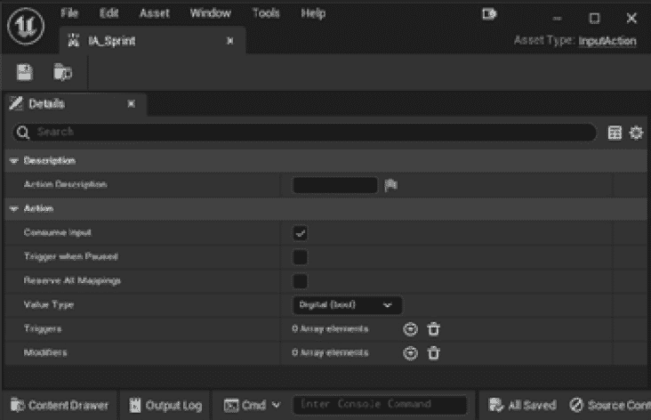

图 5.5 – 冲刺动作设置

是时候设置 **IA_Move** 资产了，所以打开它并将 **值类型** 更改为如图 *图 5**.6* 所示：

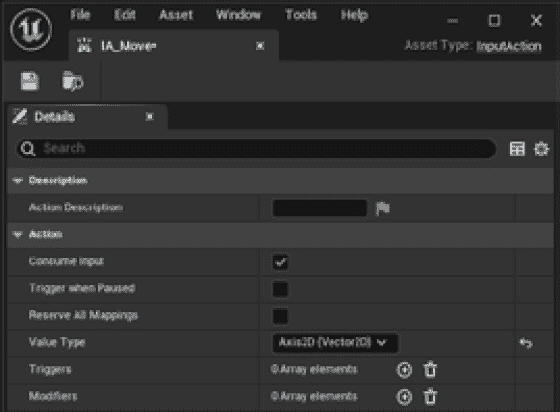

图 5.6 – 移动动作设置

作为最后一步，打开 **AI_Look** 资产并将 **值类型** 更改为 **Axis2D (Vector2D)**，如图 *图 5**.7* 所示：

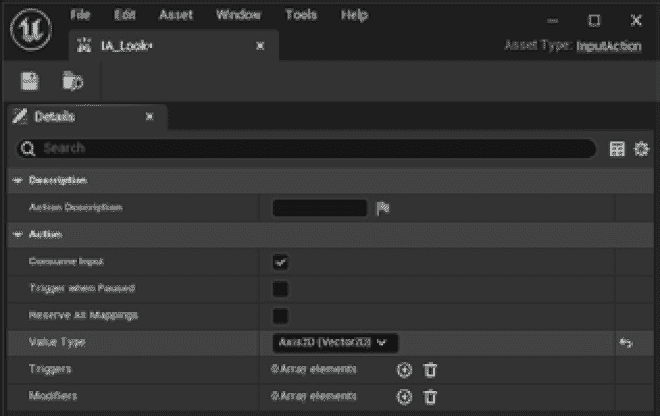

图 5.7 – 查看动作设置

现在基本动作已经定义，是时候创建映射上下文并设置其属性了。

### 设置输入映射上下文

如前所述，映射上下文指的是一组输入动作，它标识玩家可能遇到的具体情况。这里需要创建的是角色可以执行的基本动作（移动、环顾四周和交互），因此是时候打开 **内容浏览器** 并创建此资产：

1.  右键单击 `Input` 文件夹并选择 **Input** | **Input Mapping Context**。

1.  将新创建的资产命名为 `IMC_Default` 并双击它以开始编辑。

1.  点击 **Mappings** 字段旁边的 **+** 按钮。在下拉菜单中，选择 **IA_Interact**。

1.  重复此步骤三次以添加 **IA_Sprint**、**IA_Move** 和 **IA_Look**。

到这些步骤结束时，你应该会有类似于 *图 5**.8* 的内容：


图 5.8 – 输入映射上下文面板

现在上下文已经创建，是时候映射玩家将使用的输入了。正如我之前所述，我们将允许他们使用控制器或键盘和鼠标交互的混合。目前，所有映射都应该设置为**无**；这意味着没有输入将通过此上下文。

让我们通过从**IA_Interact**映射开始解决这个问题：

1.  点击**IA_Interact**下面的键盘图标，并按下键盘上的*I*（交互）键。

1.  然后点击**IA_Interact**字段右侧的**+**按钮以添加另一个映射。

1.  从下拉菜单中选择**游戏手柄** | **游戏手柄面按钮底部**。或者，如果你有一个连接到你的 PC 的游戏控制器，你可以简单地点击键盘图标，然后按下相应的按钮（例如，Xbox 控制器的*A*按钮）。

现在我们将设置**IA_Sprint**的映射：

1.  如果玩家使用键盘，则设置**左 Shift**。

1.  如果玩家使用控制器，则设置**游戏手柄** | **游戏手柄左摇杆按钮**（此第二个选项将允许玩家按下摇杆以冲刺）。

接下来，**IA_Move**将允许玩家使用左摇杆控制器或常用的 WASD 键——这意味着你需要添加五个交互：一个用于摇杆，然后是上、下、左和右方向的四个交互。让我们将它们添加到映射上下文中，从摇杆设置开始：

1.  将**游戏手柄** | **游戏手柄左摇杆 2D 轴**添加到映射中。此外，从**修饰符**列表中添加一个具有值**Dead Zone**的修饰符。

1.  接下来是方向，对于右方向（在键盘上映射为*D*），添加一个没有修饰符的**键盘** | **D** 映射。

1.  对于左方向（在键盘上映射为*A*），添加一个**键盘** | **A** 映射。然后添加一个具有值**Negate**的修饰符。这将从这个交互中赋予负值（即，向右移动是正值，而向左移动是负值）。

1.  对于前进方向（在键盘上映射为*W*），添加一个**键盘** | **W** 映射。然后，添加一个具有值**Swizzle Input Axis Values**的修饰符，这将把*x*值转换为*y*（反之亦然），因此你会为你的角色获得一个“前进”值。

1.  最后，对于后退方向（在键盘上映射为*S*），添加一个**键盘** | **S** 映射。然后，添加一个具有值**Swizzle Input Axis Values**的修饰符和一个具有值**Negate**的附加修饰符。这将以与*A*键中解释的左移动类似的方式，从这个交互中赋予负值。

最后，**IA_Look**映射将由控制器的右摇杆或鼠标的移动控制。要添加这些设置，请执行以下步骤：

1.  从下拉菜单中选择控制器为 **Gamepad** | **Gamepad Right Thumbstick 2D-Axis**。此外，从 **Modifiers** 列表中添加一个值为 **Dead Zone** 的修饰符，这样摇杆在静止位置时不会发送数据。

1.  为鼠标选择 **Mouse** | **Mouse XY 2D-Axis** 交互。然后从 **Modifiers** 列表中添加一个值为 **Negate** 的修饰符，并取消选择 **X** 和 **Z** 复选框，只保留 **Y** 值被选中。这将赋予鼠标交互负值 – 例如，向前移动将使角色向下移动相机，向后移动将使相机向上移动。

你现在应该有一个类似于 *图 5.9* 中所示的映射上下文：

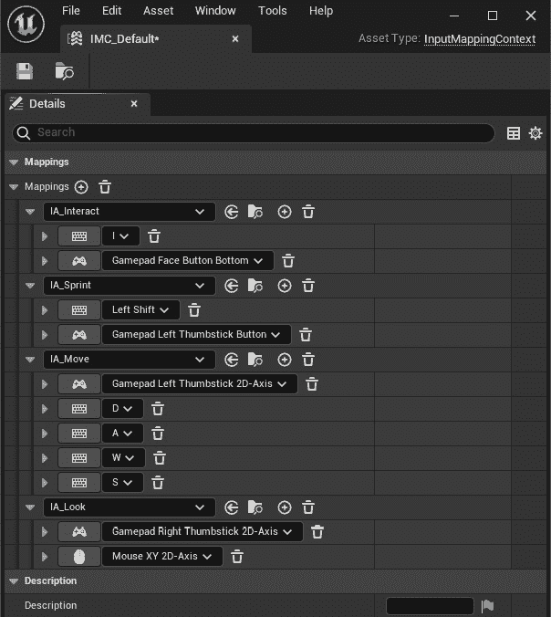

图 5.9 – 完整的映射上下文

现在映射上下文已经定义好了，是时候设置角色以便它能接收来自玩家的输入了。

## 导入增强型输入模块

让我们回到 IDE，因为你现在已经准备好为你的角色添加一些组件和代码逻辑了。由于我们使用的是增强型输入系统，你首先需要做的是将它添加到 `Build.cs` 文件中的模块声明中。

要这样做，打开你的 C++ 项目的 `Source` 文件夹中的 `UnrealShadows_LOTL.Build.cs` 文件（如果你的项目名称不同，名称可能会有所不同）。然后找到以下代码行：

```cpp
PublicDependencyModuleNames.AddRange(new string[] { "Core", "CoreUObject", "Engine", "InputCore" });
```

通过添加增强型输入模块来更改它：

```cpp
PublicDependencyModuleNames.AddRange(new string[] { "Core", "CoreUObject", "Engine", "InputCore", "EnhancedInput" });
```

这将使增强型输入模块可用于你的项目，你将准备好开始实现用户交互，这正是你现在要做的。

## 向角色添加用户交互

要向角色添加用户交互，你需要声明你刚刚创建的增强型输入资产。

在接下来的步骤中，你将声明映射上下文和动作引用到你的代码中，以及相应的函数。之后，你将实现处理所有动作所需的代码逻辑。最后，你将在角色蓝图内部声明这些动作。

### 声明输入属性和函数

首先要做的是为映射上下文和要添加到 `US_Character.h` 头文件中的动作添加所需的资产引用。打开头文件，它应该已经包含了以下代码行（如果没有，则添加为公共声明）：

```cpp
virtual void SetupPlayerInputComponent(UInputComponent* PlayerInputComponent) override;
```

接下来，声明一个指向输入映射上下文的指针以及每个输入动作的指针。为此，在类的隐式 `private` 部分中（即 `GENERATED_BODY()` 宏之后，组件声明之后）添加以下代码：

```cpp
UPROPERTY(EditAnywhere, BlueprintReadOnly, Category = "Input", meta = (AllowPrivateAccess = "true"))
TObjectPtr<class UInputMappingContext> DefaultMappingContext;
UPROPERTY(EditAnywhere, BlueprintReadOnly, Category = "Input", meta = (AllowPrivateAccess = "true"))
TObjectPtr<class UInputAction> MoveAction;
UPROPERTY(EditAnywhere, BlueprintReadOnly, Category = "Input", meta = (AllowPrivateAccess = "true"))
TObjectPtr<UInputAction> LookAction;
UPROPERTY(EditAnywhere, BlueprintReadOnly, Category = "Input", meta = (AllowPrivateAccess = "true"))
TObjectPtr<UInputAction> SprintAction;
UPROPERTY(EditAnywhere, BlueprintReadOnly, Category = "Input", meta = (AllowPrivateAccess = "true"))
TObjectPtr<UInputAction> InteractAction;
```

作为头声明步骤的最后一步，在 `protected` 部分中，在 `BeginPlay()` 方法声明之后添加以下方法：

```cpp
void Move(const struct FInputActionValue& Value);
void Look(const FInputActionValue& Value);
void SprintStart(const FInputActionValue& Value);
void SprintEnd(const FInputActionValue& Value);
void Interact(const FInputActionValue& Value);
```

如你所见，你为之前定义的每个交互添加了一个方法。只需记住，在 `SprintStart()` 和 `SprintEnd()` 中。

### 实现角色的映射上下文

在接下来的步骤中，你将通过初始化它并将每个输入动作绑定到相应的方法来实现映射上下文。

打开`US_Character.ccp`并添加以下代码块，其中包含了你在接下来的步骤中将使用的所有类：

```cpp
#include "Components/InputComponent.h"
#include "GameFramework/Controller.h"
#include "EnhancedInputComponent.h"
#include "EnhancedInputSubsystems.h"
```

然后，查找`BeginPlay()`方法，并在`Super`声明之后添加此代码块：

```cpp
if (APlayerController* PlayerController = Cast<APlayerController>(Controller))
{
   if (UEnhancedInputLocalPlayerSubsystem* Subsystem = ULocalPlayer::GetSubsystem<UEnhancedInputLocalPlayerSubsystem>(PlayerController->GetLocalPlayer()))
   {
      Subsystem->AddMappingContext(DefaultMappingContext, 0);
   }
}
```

第一行代码通过`Cast<T>`模板检查控制器是否为`PlayerController`。

注意

在 Unreal Engine 中工作，频繁地对特定类进行转换是很常见的（就像你在之前的章节中用蓝图所做的那样）。你可能已经习惯了纯 C++中的转换，但你应该知道 Unreal 的行为略有不同，因为它可以安全地将类型转换为可能不合法的类型。如果你习惯于在这种情况下出现常规 C++崩溃，你可能会很高兴地知道 Unreal 将简单地返回一个更安全的`nullptr`。

然后，代码将尝试从玩家那里获取增强输入子系统，如果成功，将映射上下文添加到它上面。从这一点开始，上下文中声明的所有动作都将由输入系统“跟踪”。

当然，你需要将这些动作绑定到相应的方法实现（即移动、冲刺、交互等）。为此，查找`SetupPlayerInputComponent()`方法，并在`Super()`声明之后添加此代码块：

```cpp
if (UEnhancedInputComponent* EnhancedInputComponent = Cast<UEnhancedInputComponent>(PlayerInputComponent))
{
   EnhancedInputComponent->BindAction(MoveAction, ETriggerEvent::Triggered, this, &AUS_Character::Move);
   EnhancedInputComponent->BindAction(LookAction, ETriggerEvent::Triggered, this, &AUS_Character::Look);
   EnhancedInputComponent->BindAction(InteractAction, ETriggerEvent::Started, this, &AUS_Character::Interact);
   EnhancedInputComponent->BindAction(SprintAction, ETriggerEvent::Started, this, &AUS_Character::SprintStart);
   EnhancedInputComponent->BindAction(SprintAction, ETriggerEvent::Completed, this, &AUS_Character::SprintEnd);
}
```

如你所见，我们正在调用输入组件指针上的`BindAction()`方法来将每个动作绑定到相应的方法。

### 实现动作

现在你已经准备好实现每个动作的方法。让我们从`Move`方法开始。添加以下代码块：

```cpp
void AUS_Character::Move(const FInputActionValue& Value)
{
   const auto MovementVector = Value.Get<FVector2D>();
   GEngine->AddOnScreenDebugMessage(0, 5.f, FColor::Yellow, FString::Printf(TEXT("MovementVector: %s"), *MovementVector.ToString()));
   if (Controller != nullptr)
   {
      const auto Rotation = Controller->GetControlRotation();
      const FRotator YawRotation(0, Rotation.Yaw, 0);
      const auto ForwardDirection = FRotationMatrix(YawRotation).GetUnitAxis(EAxis::X);
      const auto RightDirection = FRotationMatrix(YawRotation).GetUnitAxis(EAxis::Y);
     AddMovementInput(ForwardDirection, MovementVector.Y);
      AddMovementInput(RightDirection, MovementVector.X);
   }
}
```

如你所见，这段代码首先做的事情是从`Value`参数获取一个二维向量。这个向量包含了左摇杆（或键盘）的*x*和*y*方向，并指示角色应该移动的方向。我添加了一个屏幕上的消息来跟踪这个值。

接下来，如果有控制器拥有这个 Actor，我们将计算角色的前向和右向方向，并将其移动到相应的方向（如果你曾经尝试过 Unreal 第三人称模板，你应该已经熟悉这个过程）。

你接下来要实现的方法是`Look()`，所以就在`Move()`函数之后添加这些行：

```cpp
void AUS_Character::Look(const FInputActionValue& Value)
{
   const auto LookAxisVector = Value.Get<FVector2D>();
   GEngine->AddOnScreenDebugMessage(1, 5.f, FColor::Green, FString::Printf(TEXT("LookAxisVector: %s"), *LookAxisVector.ToString()));
   if (Controller != nullptr)
   {
      AddControllerYawInput(LookAxisVector.X);
      AddControllerPitchInput(LookAxisVector.Y);
   }
}
```

如你所见，我们正在从`Value`参数获取一个二维向量，这次它将来自右摇杆或鼠标。之后，我们向控制器添加偏航/俯仰；这将导致弹簧组件以及随之而来的相机组件围绕角色旋转。

对于冲刺动作，角色有两个可用方法——一个用于开始冲刺，另一个用于结束冲刺。在之前的函数之后添加此代码块：

```cpp
void AUS_Character::SprintStart(const FInputActionValue& Value)
{
   GEngine->AddOnScreenDebugMessage(2, 5.f, FColor::Blue, TEXT("SprintStart"));
   GetCharacterMovement()->MaxWalkSpeed = 3000.f;
}
void AUS_Character::SprintEnd(const FInputActionValue& Value)
{
   GEngine->AddOnScreenDebugMessage(2, 5.f, FColor::Blue, TEXT("SprintEnd"));
   GetCharacterMovement()->MaxWalkSpeed = 500.f;
}
```

此代码简单地在角色冲刺时增加其最大速度。

注意

步行和冲刺的值是硬编码的；随着我们通过本书的进展，我们将在稍后从数据集中获取这些值。

你需要实现的最后一个方法是`Interact()`，但截至目前，我们还没有任何可以与之交互的东西！所以，你只需在函数内添加一个屏幕上的消息：

```cpp
void AUS_Character::Interact(const FInputActionValue& Value)
{
   GEngine->AddOnScreenDebugMessage(3, 5.f, FColor::Red, TEXT("Interact"));
}
```

要使角色完全功能化，你需要做的最后一件事是将输入资产添加到蓝图。

### 更新角色蓝图

要更新蓝图，请执行以下步骤：

1.  保存你修改的所有文件，并返回到 Unreal 编辑器。

1.  点击**编译**按钮，等待成功消息。

1.  打开你的**BP_Character**蓝图，并选择**类****默认**部分。

1.  在**详细信息**面板中搜索**输入**类别。你应该会得到**默认映射上下文**属性以及创建的四个动作。

1.  点击**默认映射上下文**下拉按钮，并选择相应的资产（应该只有一个可供选择）。

1.  对于每个动作属性，从下拉菜单中选择相应的动作资产。

前一步骤的结果在*图 5.10*中展示：

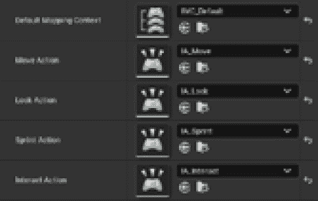

图 5.10 – 蓝图输入设置

角色终于完成了！虽然很艰难，但你现在可以开始测试它了。

## 测试角色的移动

现在基础用户交互已经实现，是时候开始在可玩级别上测试它了。打开**Level_01**地图，并执行以下操作：

1.  在级别中寻找**SP 1**（代表*SpawnPoint 1*）标签，并在其附近添加一个**玩家开始**演员。

1.  将**网络模式**设置为**监听服务器**，并包含**3**名玩家。

1.  点击**播放**按钮来测试游戏。

你应该能够移动角色，并让他们冲刺和四处张望。

你可能想知道，尽管你没有添加任何多人游戏代码逻辑，你为什么已经玩起了网络游戏。答案在角色类中，它已经被设置为可复制的——只需打开`true`。

你可能也注意到了，虽然服务器窗口中的角色移动和冲刺很顺畅，但在客户端窗口中，当你跑步时，动作看起来有点跳跃。这是因为在客户端尝试执行冲刺动作，但服务器实际上是控制者——结果，客户端会让角色移动得更快，但服务器会将其带回移动位置。基本上，目前我们正在尝试在客户端“作弊”，但权威的服务器会禁止你这样做。显然，这是我们代码中的错误，但我们仍然需要理解复制的完整含义以及如何从服务器执行函数。

要修复这个错误，你需要了解更多关于复制的知识。请耐心等待——我将在*第六章*，*通过网络复制属性* *O**ver the Network*，和*第七章*，*使用远程过程调用* *Calls (RPCs)*中提供更多关于这个主题的详细信息。

现在你已经从头开始创建了自己的英雄角色，是时候了解如何控制 Actor 连接了：我将在下一节介绍这个主题。

# 控制 Actors 的连接

现在你已经创建了一个完全工作的角色，是时候了解在虚幻引擎内部如何处理连接了（为了快速刷新你对连接工作原理的理解，你可以参考*第二章*，*理解* *网络基础*）。

每个连接都有自己的`PlayerController`，它是专门为该连接创建的；在这种情况下，我们说`PlayerController`“属于”该连接。

在虚幻引擎中，Actors 可以有一个`PlayerController`，然后`PlayerController`就成为了该 Actor 的所有者。这意味着第一个 Actor 也由拥有`PlayerController`的相同连接拥有。

在 Actor 复制过程中使用所有权的概念来确定哪些连接接收每个 Actor 的更新：例如，一个 Actor 可能会被标记，以便只有拥有该 Actor 的连接才会收到其属性更新。

例如，让我们想象一下你的盗贼角色（基本上是一个 Actor）被`PlayerController`控制——这个`PlayerController`将是角色的所有者。在游戏过程中，盗贼获得了一个可以赋予魔法匕首的拾取物品：一旦装备，这件武器将属于角色。这意味着`PlayerController`也将拥有这把匕首。最终，盗贼 Actor 和匕首都将由`PlayerController`连接拥有。一旦盗贼 Actor 不再被 Player Controller 控制，它将不再由连接拥有，武器也是如此。

如果你已经开发过独立游戏，你可能习惯于通过使用诸如`Get Player Controller`或`Get Player Character`（或它们对应的 C++版本，`UGameplayStatics::GetPlayerController()`和`UGameplayStatics::GetPlayerCharacter()`）这样的节点来检索玩家控制器或角色。如果你不知道自己在做什么，在网络环境中使用这些函数可能会导致许多问题，因为根据上下文，你将得到不同的结果。

例如，当`Player Index`等于`0`时调用`Get Player Controller`函数将给出以下结果：

+   如果你是从监听服务器调用它，监听服务器的`PlayerController`

+   如果你是从专用服务器调用它，第一个客户端的`PlayerController`

+   如果你是从客户端调用它，客户端的`PlayerController`

如果事情看起来很混乱，考虑到索引在服务器和不同的客户端之间可能不一致，它们将变得更加混乱。

正因如此，当在 Unreal Engine 中开发多人游戏时，你很可能会使用以下一些函数（或它们相应的节点）：

+   `AActor::GetOwner()`，它返回一个 Actor 实例的所有者

+   `APawn::GetController()`，它返回 Pawn 或角色实例的控制器

+   `AController::GetPawn()`，它返回控制器所拥有的 Pawn

+   `APlayerState::GetPlayerController()`，它将返回创建 Player State 实例的 Player Controller（远程客户端将返回 null 值）

关于组件，你应该知道它们有自己确定拥有连接的方式——它们将从遵循组件的外部链开始，直到找到拥有它们的 Actor。从那里开始，系统将像之前解释的那样继续确定该 Actor 的拥有连接。要获取组件的所有者，你将使用`UActorComponent::GetOwner()`方法。

在本节中，我们刚刚“触及”了所有者的概念以及如何获取有关它的信息，但你应该知道连接所有权非常重要，它将在本书的其余部分无处不在：换句话说，拥有连接的想法被认为足够重要，以至于将在我们正在开发的多玩家项目中得到处理。

在下一节中，我将介绍一个与连接所有权紧密相关的话题：相关性。

# 理解 Actor 相关性

相关性是确定场景中哪些对象应该根据其对玩家的重要性可见或更新的过程。这是 Unreal Engine 中的一个重要概念，通过理解它是如何工作的，你可以确保你的游戏运行得高效。在本节中，我们将探讨这个主题，并展示一个根据其设置如何工作的示例。

## 理解相关性

在 Unreal Engine 中，**相关性**这个术语指的是引擎如何根据 Actor 在游戏世界中的当前位置来确定应该将哪些 Actor 复制到哪些客户端，以及哪些 Actor 对玩家的当前视图或区域是相关的。

一个游戏关卡的大小可以从非常小到非常大不等。这可能会在更新网络上所有内容以及连接到服务器的每个客户端时引起问题。由于游戏角色可能不需要知道关卡中发生的每一件事，大多数时候，只需让它知道附近发生的事情就足够了。

因此，引擎使用几个因素来让玩家知道一个 Actor 上是否发生了变化：这些因素包括 Actor 本身的距离、其可见性以及 Actor 是否在游戏世界中当前处于活动状态。被认为无关紧要的 Actor 将不会被复制到玩家的客户端，这将减少网络流量并提高游戏性能。

Unreal 使用一个名为`AActor::IsNetRelevantFor()`的虚函数来测试演员的相关性。这个测试评估一组旨在提供对能够真正影响客户端的演员的可靠估计的属性。测试可以总结如下：

+   `bAlwaysRelevant`标志设置为`true`

+   或者，它属于`Pawn`或`PlayerController`

+   或者，它是`Pawn`对象

+   或者，`Pawn`对象是诸如噪音或伤害等动作的发起者

+   `bNetUseOwnerRelevancy`属性设置为`true`，并且演员本身有一个所有者，所有者的相关性将被使用。*   `bOnlyRelevantToOwner`属性设置为`true`并且未通过第一次检查，那么它就不相关。*   **第四次检查**：如果演员附着在另一个演员的骨骼上，那么其相关性由其父级的相关性决定。*   `bHidden`属性设置为`true`并且根组件没有与检查演员发生碰撞，那么演员就不相关。*   `AGameNetworkManager`设置为使用基于距离的相关性，如果演员比网络裁剪距离更近，则演员是相关的。

注意

`Pawn`/`Character`和`PlayerController`类在相关性检查上略有不同，因为它们需要考虑额外的信息，例如运动组件。

应该注意的是，这个系统并不完美，因为在处理大型演员时，距离检查可能会给出错误的否定结果。此外，该系统没有考虑声音遮挡或其他与环境声音相关的复杂性。尽管如此，这个近似值足够精确，在游戏过程中可以得到良好的结果。

在介绍完所有这些理论之后，现在是时候将我们的注意力转回到项目上，开始实现一个有形的示例。在下面的子节中，你将通过测试你的角色来看到相关性在实际中的应用。

## 测试相关性

要测试游戏过程中的相关性效果，你将创建一个简单的拾取并对其设置进行操作。

### 创建拾取演员

首先，创建一个新的从`US_BasePickup`继承的 C++类。然后，打开生成的头文件，在`private`部分添加这两个组件声明：

```cpp
UPROPERTY(VisibleAnywhere, BlueprintReadOnly, Category="Components",  meta = (AllowPrivateAccess = "true"))
TObjectPtr<class USphereComponent> SphereCollision;
UPROPERTY(VisibleAnywhere, BlueprintReadOnly, Category="Components", meta = (AllowPrivateAccess = "true"))
TObjectPtr<class UStaticMeshComponent> Mesh;
```

你应该熟悉之前的代码——我们只是在声明用于触发拾取的碰撞组件和用于其视觉外观的网格组件。

接下来，在`protected`部分，在`BeginPlay()`声明之后，添加一个将处理角色与演员重叠的声明：

```cpp
UFUNCTION()
void OnBeginOverlap(UPrimitiveComponent* OverlappedComponent, AActor* OtherActor, UPrimitiveComponent* OtherComp, int32 OtherBodyIndex, bool bFromSweep, const FHitResult& SweepResult);
```

紧接着，添加拾取动作的声明：

```cpp
UFUNCTION(BlueprintCallable, BlueprintNativeEvent, Category = "Pickup", meta=(DisplayName="Pickup"))
void Pickup(class AUS_Character* OwningCharacter);
```

我们需要这个函数在蓝图内部可调用，所以我们使用`BlueprintCallable`指定符。

然后，`BlueprintNativeEvent`指定符表示该函数可以被蓝图覆盖，但它也具有一个默认的本地 C++实现，如果蓝图没有实现任何内容，则会调用该实现。

为了原生实现方法，在`US_BasePickup.cpp`文件中，我们需要实现一个与主函数同名但末尾添加`_Implementation`的 C++函数。

最后，进入`public`部分 - 在相应的属性之后，为了避免前向声明 - 为之前声明的组件添加两个获取器：

```cpp
FORCEINLINE USphereComponent* GetSphereCollision() const { return SphereCollision; }
FORCEINLINE UStaticMeshComponent* GetMesh() const { return Mesh; }
```

现在已经完全声明了头文件，打开`US_BasePickup.cpp`文件以开始向 Actors 添加代码逻辑。首先，在文件顶部添加必要的包含：

```cpp
#include "US_Character.h"
#include "Components/SphereComponent.h"
```

然后，在构造函数中添加以下代码块，它创建两个组件并将它们附加到 Actors 上：

```cpp
SphereCollision = CreateDefaultSubobject<USphereComponent>("Collision");
RootComponent = SphereCollision;
SphereCollision->SetGenerateOverlapEvents(true);
SphereCollision->SetSphereRadius(200.0f);
Mesh = CreateDefaultSubobject<UStaticMeshComponent>("Mesh");
Mesh->SetupAttachment(SphereCollision);
Mesh->SetCollisionEnabled(ECollisionEnabled::NoCollision);
```

立即之后，将`bReplicates`设置为`true`（因为默认情况下 Actors 不会复制）：

```cpp
bReplicates = true;
```

在`BeginPlay()`函数内部，为重叠事件添加一个动态多播委托：

```cpp
SphereCollision->OnComponentBeginOverlap.AddDynamic(this, &AUS_BasePickup::OnBeginOverlap);
```

注意

为了对复制给予适当的关注和重点，我已将*第六章*，*通过网络复制属性* *O**ver the Network*，指定为对这一主题的深入探讨。

现在，在`BeginPlay()`函数的括号关闭后添加重叠处理程序：

```cpp
void AUS_BasePickup::OnBeginOverlap(UPrimitiveComponent* OverlappedComponent, AActor* OtherActor,
                                    UPrimitiveComponent* OtherComp, int32 OtherBodyIndex, bool bFromSweep, const FHitResult& SweepResult)
{
    if (const auto Character = Cast<AUS_Character>(OtherActor))
    {
        Pickup(Character);
    }
}
```

之前的代码块相当直接：在检查重叠 Actors 是`AUS_Character`（即我们的多人游戏英雄）之后，我们简单地调用`Pickup()`方法。

为了完成拾取逻辑，你现在将添加`Pickup()`的 C++实现：

```cpp
void AUS_BasePickup::Pickup_Implementation(AUS_Character * OwningCharacter)
{
   SetOwner(OwningCharacter);
}
```

此方法的代码逻辑可以在继承的蓝图中实现，但为了演示，我们只是将此 Actors 的所有者设置为重叠的 Actors：这是在下一个相关性测试中使事物正常工作的一个重要步骤。

现在是时候回到虚幻引擎编辑器并做一些“魔法”了 - 毕竟，这是一本关于创建幻想游戏的书！

### 创建拾取蓝图类

为了测试相关性在实际操作中的效果，你将创建一个蓝图拾取... 嗯，差不多吧。初步检查时，相关性可能会表现出一些奇特的趋势。这正是我们将召唤一本神奇神秘的书籍悬浮在半空中的原因！

打开虚幻引擎编辑器，按照以下步骤操作：

1.  编译你的项目以将拾取添加到蓝图的可用类中。

1.  在你的`Blueprints`文件夹中，创建一个新的`BP_SpellBook`。

1.  在**蓝图详情**面板中，选择**静态网格**属性的网格 - 我选择了**spellBook**模型。

要使书本漂浮，我们将通过使用**时间轴**节点上下移动网格。为此，请按照以下步骤操作：

1.  打开蓝图事件图，在画布上右键单击，并添加一个`Float`。

1.  双击节点以打开相应的编辑器。

1.  点击`Alpha`。按钮在*图 5**.11*中显示：

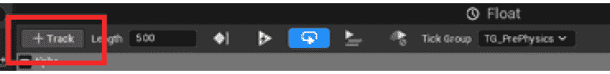

图 5.11 – 跟踪按钮

1.  点击**循环**按钮以启用循环模式。按钮在*图 5**.12*中显示：

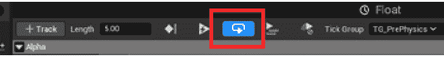

图 5.12 – 循环按钮

1.  右键单击曲线面板，并选择**添加键到...**选项。然后，将**时间**设置为**0**，将**值**设置为**0**。

1.  创建另一个键，但这次将**时间**设置为**2.5**，将**值**设置为**0.5**。

1.  创建最后一个键，这次将**时间**设置为**5**，将**值**设置为**0**。

1.  右键单击每个键，并将**键插值**值设置为**自动**。

**时间轴**节点的最终结果在*图 5.13*中显示：

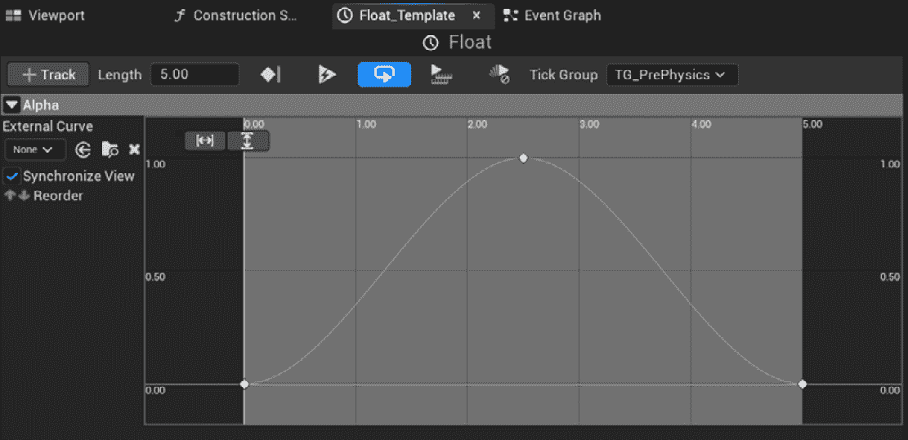

图 5.13 – 时间轴节点设置

你刚刚创建了一个在 0 和 1 之间无限循环的正弦值；你将使用这个浮动值来移动书籍上下。要实现这种浮动运动，返回到事件图，并执行以下操作：

1.  将**事件开始播放**节点连接到**时间轴**节点。

1.  将**组件**面板中的**网格**组件拖动到事件图画布上。从其输出引脚点击并拖动以添加一个**设置相对位置**节点。

1.  将**设置相对位置**的输入执行引脚连接到**时间轴**节点的**更新**执行引脚。

1.  将**时间轴**节点的**Alpha**引脚连接到一个**乘法**节点，并将此最后一个节点的第二个参数设置为**100**。

1.  右键单击**设置相对位置**节点的**新位置**引脚，并选择**拆分结构引脚**以暴露 X、Y 和 Z 值。

1.  将**乘法**节点的**结果**引脚连接到**设置相对位置**节点的**新位置 Z**。

完整的图示在*图 5.14*中显示：

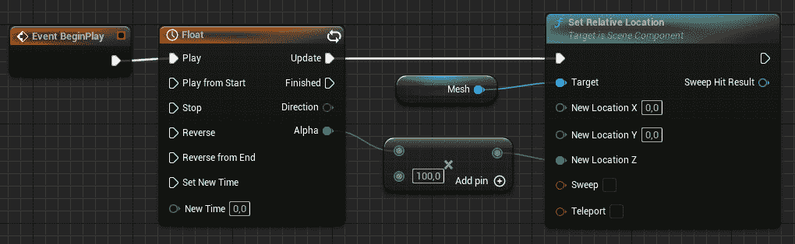

图 5.14 – 浮动书籍图

请注意，这个浮动动画纯粹是视觉效果，所以我们不会担心它是否在网络中同步。

现在蓝图项目已经创建，是时候将其添加到关卡中并测试其拾取功能了——我们将在下一小节中这样做。

## 测试相关性设置

现在是时候测试当相关性设置更改时，魔法书在多人环境中的行为如何了。

首先，将**BP_SpellBook**蓝图的一个实例拖动到关卡中，靠近**PlayerStart**演员，以便玩家在它被生成时处于视线范围内。

打开**PB_SpeelBook**蓝图，并选择**类默认值**面板，查找**复制**类别。默认设置应类似于*图 5.15*中显示的设置：

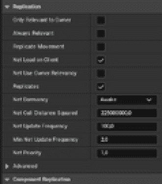

图 5.15 – 复制类别

尝试以监听服务器的形式玩游戏，有三个玩家，每个玩家都应该看到预期的书籍。接下来事情会变得有点复杂...

停止应用程序播放，回到**BP_SpellBook**蓝图。查找**Net Load on Client**属性并取消选中。由于这个属性将在地图加载期间加载角色，我们需要禁用它，以便角色仅在它对客户端相关时才被加载。

现在，你准备好根据你在下一步中更改的属性测试不同的情况。

### 设置网络剔除距离

你将要测试的第一个情况是关于距离剔除 - 目前，你的对象被设置为在非常远的距离上相关。为了检查这一点，再次运行游戏，你应该看到与上次游戏没有区别。但是，如果你将**Net Cull Distance Squared**降低到一个非常低的数字，例如，**500**，会发生什么？你将得到非常“奇怪”的行为：服务器窗口将显示这本书，而两个客户端则不会！

在一个客户端窗口激活的情况下，尝试走到书应该所在的区域附近，它将立即弹出！我没有已经警告过你这本书几乎就是魔法般的存在吗？

你刚才更改的属性设置了用于使角色对客户端相关的距离的平方。这意味着法术书将在角色位于这个距离的平方根内时“神奇”地出现。由于服务器是权威的（即，知道一切），它将始终显示角色。

现在我们来测试一种设置角色始终相关并且始终可见的方法。

### 设置角色始终相关

返回到法术书蓝图，并将**Always Relevant**属性设置为**True**，其余的保持与上一个示例相同。当你玩游戏时，你会注意到每个客户端都会从开始就能看到这本书。这是因为这本书现在被标记为无论角色在关卡中的任何位置都应该是相关的；因此，它将立即被客户端加载并对玩家可见。

这显然不是我们想要的情况 - 考虑到我们的游戏中可能有无数移动元素，我们不想对关卡中的每个角色都进行连续更新。但你可能已经想象到了这一点，不是吗？

让我们通过设置基于角色的所有者来避免这个问题。

### 设置所有者的相关性

你可能记得，`Pickup()`函数的 C++代码将拾取的所有者的所有权分配给与之重叠的角色。相反，在这个蓝图里，我们将看到如果角色只对所有者相关会发生什么：

1.  将**Only Relevant to Owner**属性设置为**True**。

1.  将**Always Relevant**属性设置为**False**。

1.  将**Net Cull Distance Squared**设置为一个非常低的数字，比如说**10**。

在最后一步，我们正在设置法术书，使其不会对任何客户端相关，除非它直接位于对象上；这将使我们能够测试谁是该角色的所有者。

客户端除非进入其碰撞区域，否则无法看到这本书，这时角色成为拾取物的所有者。一旦另一个角色进入拾取区域，它将成为新的所有者，这本书将变得相关。几分钟后，第一个客户端会看到这本书消失，因为角色不再是拾取物的所有者，因此它不再与它相关！

作为最后的注意事项，还有一个属性你应该知道：**Net Use Owner Relevancy**将根据其所有者的相关性返回 Actor 的相关性。当你将武器分配给角色或敌人时，这将会很有用！

在本节中，你已经揭开了相关性的神秘秘密，并见证了它的实际应用。当你开始优化游戏时，这个概念将非常有价值，但始终最好从一开始就打下坚实的基础，并设定正确的方向。下一节将介绍另一个重要的概念，即权限。

# 介绍权限

如我们所述的*第二章*，*理解网络基础*，术语**权限**指的是游戏状态中哪个实例具有对某些方面的最终决定权。在虚幻引擎的多玩家环境中，服务器对游戏状态具有权限：这意味着服务器对诸如玩家移动、伤害计算和其他游戏机制等事项做出最终决定。

当客户端请求执行影响游戏状态的操作时，它会向服务器发送一条消息，请求执行该操作的权限。服务器随后确定该操作是否有效，如果是的话，相应地更新游戏状态。一旦服务器更新了游戏状态，它就会向所有客户端发送消息，告知他们更新的状态。

在虚幻引擎中，Actor 可以是本地控制或远程控制，权限的概念在确定哪些控制有效时很重要。本地控制的 Actor 对其自己的动作具有权限，而远程控制的 Actor 则从服务器接收命令并遵循这些命令。

总体而言，权限的概念确保所有玩家看到一致的游戏状态，并且没有玩家拥有不公平的优势。

## 使用 Actor 的 Role 和 Remote Role 属性控制权限

在虚幻引擎中，有两个属性返回关于 Actor 复制的 重要信息：**角色**和**远程角色**。这两个属性提供了有关谁对 Actor 具有权限、Actor 是否被复制以及复制方式的信息。

在虚幻引擎中，Actor 在网络游戏中可以具有四种可能的角色之一：

+   `ROLE_Authority`：运行实例对 Actor 具有权威控制

+   `ROLE_AutonomousProxy`：运行实例是 Actor 的自主代理

+   `ROLE_SimulatedProxy`：运行实例是 Actor 的本地模拟代理

+   `ROLE_None`：在这种情况下，角色无关紧要

总体而言，`Role` 和 `RemoteRole` 属性用于控制 Actor 在 Unreal Engine 网络游戏中的行为，它们的值可能根据 Actor 的所有权和复制设置而有所不同。特别是，`Role` 属性指定了 Actor 在本地机器上的角色，而 `RemoteRole` 属性指定了 Actor 在远程机器上的角色。

例如，如果将 `Role` 设置为 `ROLE_Authority` 并且 `RemoteRole` 设置为 `ROLE_SimulatedProxy` 或 `ROLE_AutonomousProxy` 中的任何一个，那么当前游戏实例将负责将此 Actor 复制到远程连接。

应该注意的是，只有服务器将 Actor 复制到连接的客户端，因为客户端永远不会将 Actor 复制到服务器。这意味着只有服务器会将 `Role` 设置为 `ROLE_Authority`，并将 `RemoteRole` 设置为 `ROLE_SimulatedProxy` 或 `ROLE_AutonomousProxy`。

## 自主和模拟代理

在测试法术书拾取（好吧，这严格来说不是一个“拾取”，但你应该明白这个意思）时，你可能注意到，一旦 Actor 的所有者发生变化，这本书似乎在一段时间内对旧所有者和新所有者都保持相关。为了避免使用过多的 CPU 资源和带宽，服务器不会在每次更新时复制 Actor，而是在由 `AActor::NetUpdateFrequency` 属性确定的频率下进行复制。

在更新任何 Actor 的移动过程中，也会发生同样的事情，客户端将在预定义的间隔内接收数据；因此，玩家可能会在 Actor 上收到看似不规律更新。为了避免这些问题，引擎将尝试根据最新的数据外推移动。

默认行为依赖于预测移动，并由 `ROLE_SimulatedProxy` 管理。在这种模式下，客户端会根据从服务器接收到的最新速度持续更新 Actor 的位置。

当一个 Actor 由 `PlayerController` 对象控制时，你可以使用 `ROLE_AutonomousProxy`。在这种情况下，系统将直接从人类玩家那里接收额外信息，使预测未来动作的过程更加平滑。

在本节中，你对权限和 Actor 角色领域有了一些了解。这些概念无疑将在未来的章节中派上用场，尤其是在你深入研究诸如角色武器和敌人 AI 等复杂主题时。

# 摘要

在本章中，你通过更新你的角色所需的移动和交互功能，进一步推进了你的多人项目开发——这得益于 Unreal Engine 提供的增强输入系统。

接下来，你通过理解什么是所有者，对多人环境中谁在操纵 Actor 有了一些清晰的认识。

之后，你开始意识到在游戏中相关性至关重要的角色。正如你亲自发现的，了解属性是如何设置的至关重要，否则事情将开始出现大转变，变得奇怪起来。

最后，你对组成虚幻引擎多人游戏的不同角色以及为什么它们在跨多个客户端复制演员行为中扮演关键角色有了宝贵的见解。

这引出了最后一个问题：究竟“复制”一个对象意味着什么？嗯，我想是时候散步或享受一杯咖啡来充电了。你需要调动你所有的能量和注意力，因为我在下一章将揭露（几乎）所有复制的秘密！
