# 第六章：在网络上复制属性

当使用虚幻引擎创建多人游戏时，复制是一个重要的概念。特别是，**属性复制**允许在多个玩家之间同步对象，使他们能够在共享环境中交互。此功能还处理诸如角色移动和物理计算等问题，确保每个人都能获得一致的游戏世界体验和视角，无论平台类型如何，并且没有人因作弊或延迟问题而获得优势。

在本章中，你将开始处理复制，主要关注角色技能的属性复制。接下来，从上一章中创建的基础拾取开始，你将实现一个硬币拾取，这将授予角色经验点，在游戏过程中使角色升级。最后，你将通过更新一个简单的用户界面来应用复制，该界面将显示角色的经验点和等级。

在本章结束时，你将很好地掌握在多人设置中 Actor 如何复制以及与之相关的属性。基本上，你将了解 Actor 在多人环境中的行为和操作。

在接下来的几节中，我将介绍以下主题：

+   添加角色统计数据

+   理解属性复制

+   处理角色等级提升

+   为游戏添加 HUD

# 技术要求

要跟随本章中介绍的主题，你应该已经完成了前面的内容，并理解了它们的内容。

此外，如果你希望从本书的配套仓库开始编写代码，你可以下载本书配套项目仓库中提供的`.zip`项目文件：

[`github.com/PacktPublishing/Multiplayer-Game-Development-with-Unreal-Engine-5`](https://github.com/PacktPublishing/Multiplayer-Game-Development-with-Unreal-Engine-5).

你可以通过点击`Unreal Shadows –` `第五章``结束`链接下载与最后一章结尾同步的文件。

# 添加角色统计数据

在介绍属性复制并在项目中实现它之前，我们的盗贼英雄需要为这样一个大步做好准备：这就是为什么我会引导你创建一组将被插入到角色类中的统计数据。

首件事是定义你的角色统计数据。特别是，你需要以下数据：

+   行走和冲刺速度，以处理游戏过程中角色的不同步伐

+   一个伤害倍数，用于管理角色升级时的更强大打击

+   检查角色是否达到下一个等级时需要提升的等级值

+   一个潜行倍数，将处理角色在行走或冲刺时产生的噪音

你可能已经注意到你的角色没有生命值 – 这是因为这是一个潜行游戏，玩家将不得不小心翼翼地穿过地牢。一旦被发现，他们在这个特定游戏中将没有面对一群不死随从的选项！因此，游戏玩法将更多地集中在从远处击败敌人或悄悄地从他们身边溜走。

根据前面的信息，你将创建一个包含初始化角色所需的所有数据点的数据结构，然后你将创建一个数据表，让你可以管理玩家在游戏过程中获得的经验。所以，让我们开始吧。

## 创建统计结构

首先，你需要创建一个结构，它将包括所有上述统计数据。由于这不是一个类，你不需要从 Unreal Engine 编辑器创建它，而是从 IDE 创建。

注意

无法在 Unreal 编辑器内部直接创建非类实体。

打开你的集成开发环境（IDE），在你的`UnrealShadows_LOTL` | `Source` | `UnrealShadows_LOTL`文件夹中创建一个名为`US_CharacterStats.h`的文件（因为这是一个数据结构，你不需要`.cpp`文件）。然后，打开该文件并插入以下代码：

```cpp
#pragma once
#include "CoreMinimal.h"
#include "Engine/DataTable.h"
#include "US_CharacterStats.generated.h"
USTRUCT(BlueprintType)
struct UNREALSHADOWS_LOTL_API FUS_CharacterStats : public FTableRowBase
{
 GENERATED_BODY()
 UPROPERTY(BlueprintReadWrite, EditAnywhere)
 float WalkSpeed = 200.0f;
 UPROPERTY(BlueprintReadWrite, EditAnywhere)
 float SprintSpeed = 400.0f;
 UPROPERTY(BlueprintReadWrite, EditAnywhere)
 float DamageMultiplier = 1.0f;
 UPROPERTY(BlueprintReadWrite, EditAnywhere)
 int32 NextLevelXp = 10.0f;
 UPROPERTY(BlueprintReadWrite, EditAnywhere)
 float StealthMultiplier = 1.0f;
};
```

`include`部分是自解释的 – 之后，除了标准的 C++ `struct`关键字来声明结构外，你还会注意到一个`USTRUCT()`声明而不是`UCLASS()`，以及结构名称前的`F`前缀（即`FUS_CharacterStats`）。这是在 Unreal Engine 中声明结构的标准方法。然后，为了使 Unreal 编辑器能够从该结构创建数据表（稍后将有更多介绍），扩展了`FTableRowBase`类型。

在结构声明内部，我们只是添加了一个属性列表 – 所有这些属性都被标记为`BlueprintReadWrite`，以便蓝图访问和修改数据，以及`EditAnywhere`，以便你可以在下一步创建的数据表中编辑值。

## 创建统计数据表

现在你已经为你的角色创建了一个数据结构，并准备好从它创建实际的数据。在 Unreal Engine 中，我们将使用`UObject`属性 – 包括来自项目的资产引用，例如材料或纹理。

要创建你的角色数据表，请按照以下步骤操作：

1.  在内容浏览器中打开你的`Blueprints`文件夹。

1.  编译你的项目，以便在编辑器中可用 C++结构。

1.  在内容浏览器中右键单击并选择**杂项** | **数据表**。

1.  在**选择行结构**弹出窗口中，从下拉菜单中选择**US_CharacterStats**，如图*图 6.1*所示：


图 6.1 – 数据表创建面板

1.  点击`US_CharacterStats`。

1.  双击新创建的资产以打开它。你将得到一个如*图 6.2*所示的空数据集：

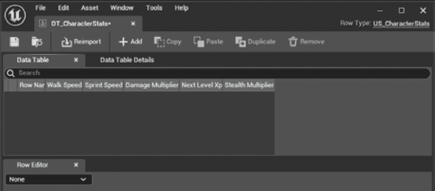

图 6.2 – 空数据表

注意

您也可以通过将`.csv`或`.json`文件导入到项目中生成数据表。此外，虚幻引擎将允许您轻松地将项目表导出为`.csv`和`.json`格式。有关导入和导出过程的更多信息，请参阅此处链接的官方文档：[`docs.unrealengine.com/5.1/en-US/data-driven-gameplay-elements-in-unreal-engine/`](https://docs.unrealengine.com/5.1/en-US/data-driven-gameplay-elements-in-unreal-engine/)。

当您的表格打开时，是时候添加一些按角色级别组织的数据行 - 您当然希望角色在获得足够经验时能够成长，不是吗？

让我们先为角色的基础级别添加一行：

1.  在**表格**面板中点击**添加**按钮。

1.  `level_01`。

1.  您现在可以为角色的第一个经验级别设置一些统计数据。寻找`250,0`

1.  `800,0`

1.  `1,0`

1.  `10`

1.  `1,0`

最终结果应与*图 6**.3*中显示的设置相同：

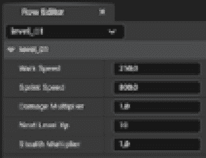

图 6.3 – level_01 角色的设置

我们将添加几个更多级别来处理游戏中的角色经验增长。重复之前的步骤，但将两个新行分别命名为`level_02`和`level_03`。然后为`**level_02**`行使用以下值：

+   `275,0`

+   `850,0`

+   `1,1`

+   `25`

+   `1,5`

为`**level_03**`行添加以下值：

+   `300,0`

+   `900,0`

+   `1,0`

+   `50`

+   `2`

这些纯粹是指示性值 - 您可以根据自己的需求进行调整，并添加尽可能多的附加级别。

现在您已经为角色的经验添加了数据集，您就可以直接从代码中读取包含的信息了。这就是为什么我需要您回到`US_Character.h`头文件中添加数据表声明的原因。

## 从角色读取数据表

在本节中，您将向角色添加数据表，以便根据经验水平读取其值。首先要做的事情是添加对`US_Character.h`头文件的引用。因此，在头文件的`private`部分，在所有现有声明之后，添加以下代码：

```cpp
UPROPERTY(EditAnywhere, BlueprintReadOnly, Category = "Character Data", meta = (AllowPrivateAccess = "true"))
class UDataTable* CharacterDataTable;
struct FUS_CharacterStats* CharacterStats;
```

第一项声明将允许您直接从子蓝图类中引用数据表，而结构声明将允许您从数据表中引用单行并将其用作角色统计数据。

之后，您需要创建一个函数，允许系统更新角色的当前级别。在`public`部分，添加以下方法声明：

```cpp
void UpdateCharacterStats(int32 CharacterLevel);
```

您需要添加到类头文件中的最后一件事是用于统计结构的获取器函数。仍然在`public`部分，在最后一个闭合括号之前，添加以下代码行：

```cpp
FORCEINLINE FUS_CharacterStats* GetCharacterStats() const { return CharacterStats; }
```

现在，你可以保存此文件并打开`US_Character.cpp`以处理数据检索。在文件顶部，添加你将要使用的类的`include`声明：

```cpp
#include "US_CharacterStats.h"
#include "Engine/DataTable.h"
```

接下来，通过在文件末尾添加以下代码来实现`UpdateCharacterStats()`方法：

```cpp
void AUS_Character::UpdateCharacterStats(int32 CharacterLevel)
{
 if(CharacterDataTable)
 {
  TArray<FUS_CharacterStats*> CharacterStatsRows;
  CharacterDataTable->GetAllRows<FUS_CharacterStats>(TEXT("US_Character"), CharacterStatsRows);
  if(CharacterStatsRows.Num() > 0)
  {
   const auto NewCharacterLevel = FMath::Clamp(CharacterLevel, 1, CharacterStatsRows.Num());
   CharacterStats = CharacterStatsRows[NewCharacterLevel - 1];
   GetCharacterMovement()->MaxWalkSpeed = GetCharacterStats()->WalkSpeed;
  }
 }
}
```

如你所见，首先我们检查数据表是否被引用（你稍后将从角色蓝图添加它），然后使用`GetAllRows<T>()`方法将所有表行检索到本地数组中（即`CharacterStatsRows`变量）。如果数据表中至少有一行，我们获取对应于角色等级减 1 的行（即对于 1 级角色，我们将获取行号 0）。请注意，还有`FMath::Clamp()`方法，它保证我们不会尝试获取高于数据集中可用行数的等级值。

之后，我们从行中检索`WalkSpeed`列并将其值分配给角色的移动组件的`MaxWalkSpeed`属性——这意味着，如果有数据表分配，你的角色将以数据集中的值开始游戏，而不是从构造函数开始。

现在，你准备好将角色的统计数据更新到 1 级——你将在`BeginPlay()`函数中执行此操作。为此，在`BeginPlay()`函数中，并在括号关闭之前，添加以下代码：

```cpp
UpdateCharacterStats(1);
```

你需要做的最后一件事是更新两个使用硬编码值但需要使用数据表统计信息的冲刺方法。为此，搜索`SprintStart()`方法并找到以下行：

```cpp
GetCharacterMovement()->MaxWalkSpeed = 3000.f;
```

然后，将其更改为以下代码：

```cpp
if (GetCharacterStats())
{
 GetCharacterMovement()->MaxWalkSpeed = GetCharacterStats()->SprintSpeed;
}
```

让我们用`SprintEnd()`方法做同样的事情，它应该位于上一个方法之后。找到以下行：

```cpp
GetCharacterMovement()->MaxWalkSpeed = 500.f;
```

然后使用以下代码块进行更改：

```cpp
if(GetCharacterStats())
{
 GetCharacterMovement()->MaxWalkSpeed = GetCharacterStats()->WalkSpeed;
}
```

在这两种情况下，代码都是自解释的——我们只是检查在角色统计数据中是否有有效的数据引用，并将冲刺或行走速度分配给角色移动组件。

现在保存你的文件并编译项目，只是为了确保一切正常且为下一步做好准备。

你的角色现在准备好接受我们在本章开头创建的数据表。

## 将数据表添加到角色中

要将数据表资产添加到角色中，切换回 Unreal 编辑器并按照以下步骤操作：

1.  打开**BP_Character**蓝图。

1.  选择**类默认值**选项卡，然后在**详细信息**面板中查找**字符****数据**类别。

1.  在**角色数据表**属性中，点击下拉菜单并选择**DT_CharacterStats**。

你的角色现在可以使用数据集中的统计数据了——即使这个可怜的小偷被锁定在 1 级经验等级中，稍后你将在地牢中释放他们，看看他们的表现如何！

测试游戏以检查一切是否正常工作。只需记住我在上一章中提到的话：由于客户端和服务器试图强制角色符合不同的速度值，移动仍然存在 bug，但你正接近解决方案。

因此，在本节中，你通过添加从数据表中检索的一些统计数据并使用它们来初始化一些属性来改进了角色。目前，你只使用了移动属性，但不要害怕！一旦角色完成，一切都将各就各位。

在接下来的章节中，我们将深入研究虚幻中的属性复制主题——当需要提升角色等级时，这将很有用，你将在本章结束时完成这项工作。

# 理解属性复制

如前所述，属性复制允许在虚幻多人环境中同步对象。需要注意的是，由于服务器是权威的，更新永远不会由客户端发送。显然，客户端可能会（礼貌地）请求服务器更改属性值，服务器将相应地行事。此外，属性复制充当一个可靠的服务：因此，客户端的 Actor 最终将与服务器上的值相同。

这意味着如果你试图从客户端修改一个复制的属性，你对该属性所做的任何更改都将是临时的。你应该已经熟悉这个主题，因为目前角色的移动逻辑有点 buggy——我们试图让客户端的角色运行，但一旦网络更新，服务器就会阻止我们的命令。

这是因为，一旦服务器向客户端发送更新，包含该属性新值的更新，你在客户端本地所做的任何更改都将被覆盖并替换为来自服务器的新、正确的值。因此，如果服务器更新不频繁，客户端可能需要一段时间才能通知到新的、正确的值。

修复那个讨厌的 bug 是我们将在*第七章*中进行的，*使用远程过程调用（RPCs）*，在那里你需要学习如何从客户端调用函数到服务器。然而，本章的主要焦点是理解如何复制属性。所以，无需多言，让我们来看看内部是如何运作的！

## 启用属性复制

为了使属性能够复制，你需要设置一些事情。首先，在将包含属性的 Actor 构造函数中，你需要将`bReplicates`标志设置为`true`。

注意

从`APawn`或`ACharacter`扩展的类或蓝图将默认将`bReplicates`属性设置为`true`，而常规 Actor 则不会。

然后，需要复制的属性需要在`UPROPERTY()`宏中添加`Replicated`指定符。例如，你可以使用以下代码来复制你角色的分数：

```cpp
UPROPERTY(Replicated)
int32 Score;
```

如果你需要一个在属性更新时执行的回调函数，你可以使用`ReplicatedUsing=[FunctionName]`代替——这个属性将允许你指定一个在更新发送到客户端时将被执行的函数。例如，如果你想在你角色的分数被复制时执行名为`OnRep_Score()`的方法，你将编写类似于以下代码的内容：

```cpp
UPROPERTY(ReplicatedUsing="OnRep_Score")
int32 Score;
```

接下来，你需要在同一类中实现`OnRep_Score()`方法；这个函数必须声明`UFUNCTION()`宏。

一旦所有复制属性都通过之前的属性正确装饰，它们需要在`AActor::GetLifetimeReplicatedProps()`函数内部使用`DOREPLIFETIME()`宏进行声明。使用之前的分数示例，你需要使用以下代码来声明`Score`属性：

```cpp
DOREPLIFETIME(AMyActor, Score);
```

属性注册复制后，无法取消注册，因为虚幻引擎将优化数据存储以减少计算时间：这意味着默认情况下，你将无法对属性的复制有太多控制。

幸运的是，你可以使用`DOREPLIFETIME_CONDITION()`宏代替，这将允许你添加一个额外的条件以更精确地控制复制。这些条件的值是预定义的——一个例子是`COND_OwnerOnly`，它只会将数据发送给 Actor 的所有者（我们将在本章后面使用这个值）。作为另一个例子，如果你需要在属性复制中拥有更精细的控制，你可以使用`DOREPLIFETIME_ACTIVE_OVERRIDE()`宏，这将允许你使用 Actor 内部定义的自己的条件。

使用额外的条件进行复制的最大缺点是性能，因为引擎在复制属性之前需要执行额外的检查——这意味着在没有任何迫切要求指定使用替代选项的情况下，建议使用`DOREPLIFETIME()`宏。

现在你已经了解了如何复制一个对象，是时候介绍如何在网络上引用对象了。

## 在网络上引用 Actor 和组件

总有一天，你需要从你的代码中引用一个 Actor 或组件——这意味着在多人游戏中，你需要知道这个引用是否可以被复制。简单来说，一个 Actor 或组件只有在支持网络的情况下才能在网络上被引用。

有一些简单的规则可以帮助你确定你的对象是否可以在网络上被引用：

+   如果一个 Actor 被复制，它也可以作为引用被复制

+   如果一个组件被复制，它也可以作为引用被复制

+   需要稳定命名的非复制的 Actors 和组件，以便作为引用进行复制

注意

一个**稳定命名**的对象意味着一个实体将在服务器和客户端都存在，并且具有相同的名称。例如，如果一个 Actor 在游戏过程中没有被生成，而是直接从包中加载到级别中，那么它就是一个稳定命名的 Actor。

本节为您提供了关于 Unreal Engine 中网络复制的根本概念的介绍，解释了它是如何与 Actors 和组件交互的。如果你觉得理论太多而感到有些迷茫，不要害怕！你将通过创建角色的等级提升系统，将所有这些理论转化为一个具体、可工作的示例。

# 处理角色等级提升

如我之前提到的，在本节中，你将提升你英雄的经验值和技能。像往常一样，你将运用代码魔法来实现它！毕竟，你正在编写一个幻想游戏。

我知道你可能觉得在 Character 类内部编写代码是个好主意，但请相信我，实际上有一个更好的地方。那就是`PlayerState`类，我们碰巧已经为这次场合设置了它——之前，我让你创建`US_PlayerState`类，现在就是时候在其中添加一些有价值的代码了。

如在*第四章*中介绍的，*设置您的第一个多人游戏环境*，`PlayerState`是一个包含玩家游戏状态信息的类，存在于服务器和客户端上。由于我们需要同步角色的经验值和等级，这是放置所有内容的理想位置。

我们在这里需要做的是跟踪经验值，一旦角色达到新的等级，就通过网络广播信息并更新角色统计数据。

但首先，最重要的是要有一个清晰的思路，知道我们打算做什么。

## 提前规划

由于`PlayerState`类将保存有关角色的重要信息，因此必须提前考虑你想要实现的目标以及如何达到那个目标——这意味着我们必须确切地规划我们将要添加到这个类中的内容。

下面是这个游戏框架类将实现的一些主要功能：

+   跟踪角色的当前等级和经验值

+   在网络上同步上述属性

+   当玩家等级提升时更新角色类

+   当角色获得一些经验值或等级提升时广播事件

作为起点，在下一个子节中，我们将首先声明所需的属性和函数。

## 声明`PlayerState`属性和函数

在以下步骤中，我们将定义主要属性，以便角色在获得足够经验时能够升级——这意味着我们需要跟踪盗贼的经验点和等级。此外，每当值发生变化时，我们将在网络上复制这些属性，并将此事件通知游戏中注册的每个 Actor。

因此，让我们首先打开`US_PlayerState.h`文件，并在`protected`部分添加以下代码：

```cpp
UPROPERTY(EditDefaultsOnly, BlueprintReadOnly, ReplicatedUsing="OnRep_Xp", Category = "Experience")
int Xp = 0;
UPROPERTY(EditDefaultsOnly, BlueprintReadOnly, ReplicatedUsing="OnRep_CharacterLevelUp", Category = "Experience")
int CharacterLevel = 1;
UFUNCTION()
void OnRep_Xp(int32 OldValue) const;
UFUNCTION()
void OnRep_CharacterLevelUp(int32 OldValue) const;
```

如你所见，我们首先声明了两个属性`Xp`（代表经验点）和`CharacterLevel`；它们都可以在 Unreal 的`EditDefaultsOnly`属性中进行修改，但`BlueprintsReadOnly`使它们在蓝图不可修改，以保持所有升级逻辑都在 C++源代码中。

作为附加属性，我们使用`ReplicatedUsing`属性，我在上一节中介绍了它。这将使我们能够在属性更新时执行函数——在这种情况下，我们为`Xp`属性设置了`OnRep_Xp`，为`CharacterLevel`设置了`OnRep_CharacterLevelUp`。

接下来，在你的头文件中创建一个`public`部分，并添加以下代码：

```cpp
UFUNCTION(BlueprintCallable, Category="Experience")
void AddXp(int32 Value);
```

此函数将使我们能够为新`PlayerState`分配新的经验点。我们需要将其设置为`BlueprintCallable`，以便从我们的蓝图（例如，从拾取物品）中使用此函数。

在此之后，添加以下声明：

```cpp
virtual void GetLifetimeReplicatedProps(TArray<FLifetimeProperty>& OutLifetimeProps) const override;
```

如前所述，我们需要重写此方法以声明将要复制的属性（更多内容将在稍后介绍）。

实现我们两个属性复制的所有必要设置已经完成，但仍需添加一些额外的元素以确保一切正常工作。我们需要在属性更改时广播一些信息——当你在本章的稍后部分实现用户界面时，这将很有用。

要实现此类功能，你将使用**委托**。你可能已经熟悉这个话题在 C++中的使用，但你应该知道，在 Unreal Engine 中，委托提供了一种以通用、类型安全的方式通过专用宏在 C++对象上调用成员函数的方法。

注意

如果你想要了解更多关于 Unreal Engine 支持的类型和如何在项目中使用它们的信息，请查看官方文档，可以在以下链接找到：[`docs.unrealengine.com/5.1/en-US/delegates-and-lamba-functions-in-unreal-engine/`](https://docs.unrealengine.com/5.1/en-US/delegates-and-lamba-functions-in-unreal-engine/)。

由于我们想要为两个属性广播事件，我们将声明两个委托——一个用于每个属性。在头文件的开头，在`UCLASS()`声明之前，添加以下代码：

```cpp
DECLARE_DYNAMIC_MULTICAST_DELEGATE_OneParam(FOnXpChanged, int32, NewXp);
DECLARE_DYNAMIC_MULTICAST_DELEGATE_OneParam(FOnCharacterLevelUp, int32, NewLevelXp);
```

这两行代码非常相似——它们都声明了一个`Broadcast()`方法来通知系统中的每个监听器发生变化。我们将在我们的蓝图类中使用这些功能来绑定事件并相应地做出反应。

让我们声明我们的`delegate`函数。创建一个`protected`部分，并添加以下两行代码，这些代码将用于广播事件：

```cpp
UPROPERTY(BlueprintAssignable, Category = "Events")
FOnXpChanged OnXpChanged;
UPROPERTY(BlueprintAssignable, Category = "Events")
FOnCharacterLevelUp OnCharacterLevelUp;
```

由于它们的目的不言自明，我想现在是时候停止说话，开始写下实现代码了！

## 实现玩家状态（PlayerState）逻辑

现在所有属性和方法都已声明，你将实现玩家状态（PlayerState）逻辑——每当角色获得一些经验时，你应该检查它是否达到了升级所需的足够点数。获得的经验点和升级应该广播到系统中，以保持一切同步。

首先，打开`US_PlayerState.cpp`文件并添加所需的`include`声明：

```cpp
#include "US_Character.h"
#include "US_CharacterStats.h"
#include "Net/UnrealNetwork.h"
```

接下来，为`GetLifetimeReplicatedProps()`方法添加实现：

```cpp
void AUS_PlayerState::GetLifetimeReplicatedProps(TArray<FLifetimeProperty>& OutLifetimeProps) const
{
 Super::GetLifetimeReplicatedProps(OutLifetimeProps);
 DOREPLIFETIME_CONDITION(AUS_PlayerState, Xp, COND_OwnerOnly);
 DOREPLIFETIME_CONDITION(AUS_PlayerState, CharacterLevel, COND_OwnerOnly);
}
```

如你所见，我们正在使用上一节中引入的`DOREPLIFETIME_CONDITION()`宏来声明`Xp`和`CharacterLevel`属性应该被复制——在这种情况下，我们只想让属性在拥有角色的玩家（即玩家的客户端）上被复制，我们通过使用`COND_OwnerOnly`标志来实现这一点。

接下来，使用以下代码为`AddXp()`方法添加实现：

```cpp
void AUS_PlayerState::AddXp(const int32 Value)
{
 Xp += Value;
 OnXpChanged.Broadcast(Xp);
 GEngine->AddOnScreenDebugMessage(0, 5.f, FColor::Yellow, FString::Printf(TEXT("Total Xp: %d"), Value));
 if (const auto Character = Cast<AUS_Character>(GetPawn()))
 {
  if(Character->GetCharacterStats()->NextLevelXp < Xp)
  {
   GEngine->AddOnScreenDebugMessage(3, 5.f, FColor::Red, TEXT("Level Up!"));
   CharacterLevel++;
   Character->UpdateCharacterStats(CharacterLevel);
   OnCharacterLevelUp.Broadcast(CharacterLevel);
  }
 }
}
```

在这里，每当收到经验点更新时，我们只需将值添加到角色池（即`Xp`属性）中。接下来，我们通过强制转换为`AUS_Character`类型来确认角色类型，如果转换成功，我们检索其统计数据以检查是否应该升级。如果检查成功，我们简单地增加角色等级并调用`UpdateCharacterStats()`方法来让盗贼更新技能行。当我们更改属性值时，然后向所有听众广播新的值。一些（暂时的）调试信息完成了代码。

玩家状态（PlayerState）现在几乎完成了——我们只需要在服务器端更新值时向客户端广播这些值。为此，将以下代码块添加到文件中：

```cpp
void AUS_PlayerState::OnRep_Xp(int32 OldValue) const
{
 OnXpChanged.Broadcast(Xp);
}
void AUS_PlayerState::OnRep_CharacterLevelUp(int32 OldValue) const
{
 OnCharacterLevelUp.Broadcast(CharacterLevel);
}
```

广播调用是显而易见的——每个注册的 Actor 都会收到通知，包括`Xp`和`CharacterLevel`属性的新的值。

因此，在之前的步骤中，你已经成功开发了一个完全可操作的复制系统，该系统能够有效管理获得的角色经验和技能发展。我知道手头的任务可能感觉令人畏惧，甚至有时感觉反直觉，但随着时间和实践，你可以放心，一切都会变得更容易、更易于管理！

在我们的游戏中还有一些东西缺失：实际的经验点。让我们不要浪费时间，着手添加一个角色可以使用以获得经验点的物品。在接下来的步骤中，你将创建一些金币，从之前创建的`US_BasePickup`类开始，以赋予你的盗贼渴望的经验。

## 将金币收集添加到关卡中

因此，我们准备好创建一些将在游戏中使用以增加角色经验值的硬币 – 这将是一个简单的蓝图，每当敌人被杀死或该级别可用时都会生成。

要这样做，请返回 Unreal 编辑器并编译项目，以便更新所有改进。然后，导航到`Blueprints`文件夹并完成以下步骤：

1.  在内容浏览器中右键点击并选择**蓝图类** | **US_BasePickup**，从它创建一个新的蓝图。

1.  将蓝图命名为`BP_GoldCoinPickup`，双击它以打开它。

1.  在**组件**面板中，选择**网格**组件，并将其分配给**静态网格**属性，设置为**硬币**静态网格。将其比例改为**2**，以便在游戏中更明显。

您的蓝图现在应该类似于**图 6.4**所示：

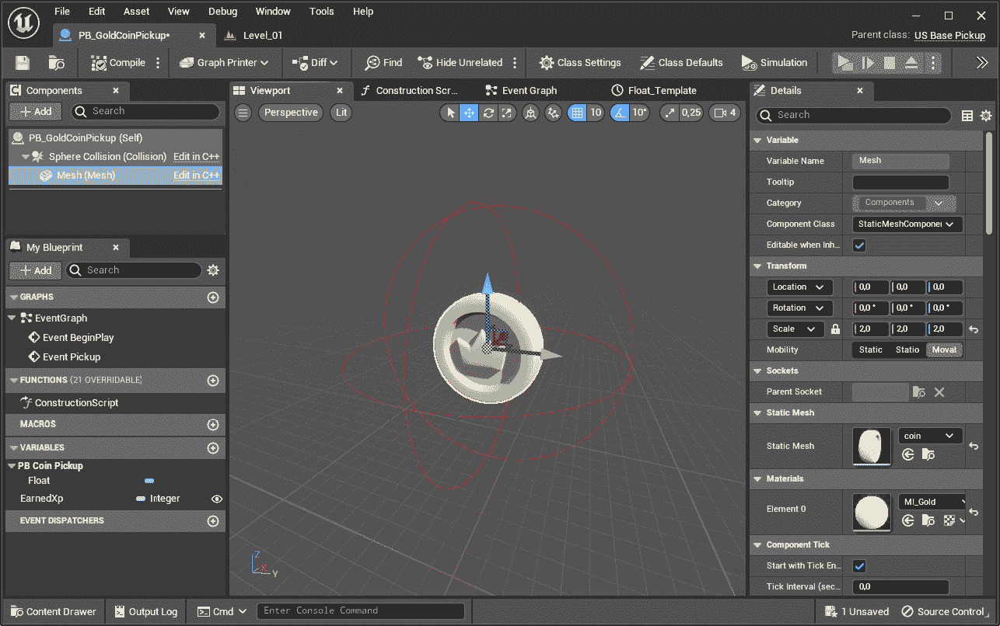

图 6.4 – 金币蓝图

现在拾取项已经有了基础形状，是时候添加一些代码逻辑来使它完全功能化了。打开**事件图**选项卡，按照以下步骤操作：

1.  创建一个类型为**整数**的变量，命名为**获得经验值**，并为其设置默认值**5**。

1.  在画布上右键点击，查找**事件拾取**，并将其添加到图中。

1.  添加一个**转换为 US_PlayerState**节点，并将其输入执行引脚连接到事件的输出执行引脚。

1.  从**拥有角色**的**事件**引脚点击并拖动，在释放按钮后，从出现的选项中选择添加一个**获取玩家状态**节点。

1.  将**PlayerState**的输出引脚连接到**Cast**节点的**对象**引脚。

1.  从**As Us PlayerState**的输出引脚点击并拖动以创建一个**添加经验值**节点。

1.  将**Cast**节点的成功执行引脚连接到**添加经验值**节点的输入执行引脚。

1.  从**变量**部分拖动一个**获取获得经验值**节点到画布中，并将其引脚连接到**添加经验值**节点的**值**引脚。

1.  最后，添加一个**销毁演员**节点并将其连接到**添加经验值**节点的输出执行引脚。

图的最终结果如**图 6.5**所示：

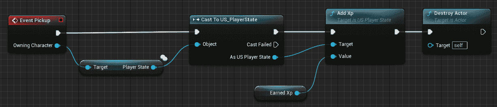

图 6.5 – 硬币事件图

如您所见，视觉脚本代码相当简单 – 每当角色捡起硬币时，其 PlayerState 将更新为它授予的经验值。

要测试游戏，只需将一堆硬币拖放到您的级别中并玩游戏。每次角色捡起硬币时，您应该看到一个显示消息，当角色获得足够的经验时，您应该得到另一个消息，即升级消息。

应该注意的是，在之前的代码中，拾取事件将在客户端和服务器上同时调用——这是不应该做的事情，因为它可能会在你的游戏中引发问题。幸运的是，在这种情况下，PlayerState 将正确处理数据，所以我们不必担心。你将在 *第六章* 中学习如何处理更复杂的情况，*在网络中复制属性*。

作为额外的练习，你可以给硬币添加一个浮动动画，就像你在 *第五章* 中为法术书所做的，*在多人环境中管理演员*。

### 添加硬币子类

作为可选步骤，你可以创建具有不同经验值的不同硬币拾取。以下是这样做的方法：

1.  右键点击 `BP_SilverCoinPickup`。

1.  将 **Earned Xp** 和 **MI_Metal** 的值设置为 **3** 作为网格材质。

为了让你的角色有各种物品去寻找，你可以重复此步骤多次。这将赋予你的角色一个多样化的宝藏去寻找。

在本节中，你已经为你的盗贼英雄创建了一个升级系统。借助复制的帮助，当角色达到足够经验值时，将获得正确的升级通知。目前，这可以通过收集关卡周围的硬币拾取来实现——稍后，你将在击败那些讨厌的巫妖领主小兵时生成宝藏！

在下一节中，我将指导你创建一个简单的用户界面，该界面将显示角色的等级和获得的经验值；你将通过监听玩家状态通知并相应地做出反应来完成此任务。

# 向游戏中添加 HUD

在本节中，你将为游戏创建一个 **抬头显示** (**HUD**)，以帮助在游戏过程中监控玩家角色的进度。正如你可能已经知道的，创建此类信息的最佳方式是通过 **Unreal 动作图形** (**UMG**) 系统——这是一个基于 GUI 的编辑器，允许开发者为他们游戏创建用户界面元素，如菜单、HUD 和其他显示屏幕。你将使用此系统来创建带有相对信息的 HUD 小部件。

目前我们需要显示的内容相当简单——一组显示角色经验值的文本和另一组显示等级的文本。

首先，让我们创建蓝图和视觉元素。

## 创建小部件蓝图

要创建小部件蓝图，在 Unreal 编辑器中，请执行以下步骤：

1.  打开你的 `Blueprints` 文件夹，右键点击内容浏览器，选择 `WB_HUD` 并双击资产以打开它。

1.  从 **Palette** 选项卡拖动一个 **Canvas** 元素到 **Designer** 视图中。这个画布将作为你的视觉元素的主要容器。

1.  将一个**Text**元素拖入之前添加的**Canvas**中，并将其命名为**XpLabel**。确保在**Details**面板中勾选**Is Variable**字段，以便在稍后使用的图中暴露此元素。

1.  将标签放置在画布上适合你需求的位置；在我的情况下，我选择了屏幕的左上角。

1.  将另一个**Text**元素拖入之前添加的**Canvas**实例中，并将其命名为**CharacterLevelLabel**。再次确保在**Details**面板中勾选**Is Variable**字段，以便在稍后使用的图中暴露此元素。

1.  将标签放置在画布上适合你需求的位置；在我的情况下，我选择了屏幕的右上角。

你的 HUD 最终结果应该类似于*图 6**.6*：

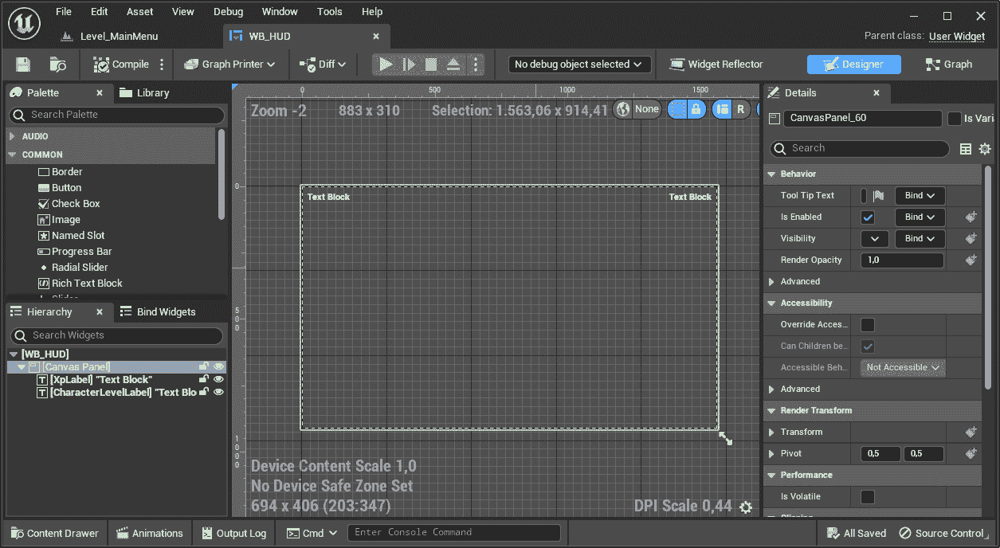

图 6.6 – HUD 设计面板

现在你已经创建了小部件，是时候添加一些 Visual Scripting 代码来使其完全功能化了。

## 向 Widget 蓝图添加代码逻辑

在以下步骤中，你将在蓝图上添加一些代码逻辑，以便监听 PlayerState 的事件并相应地做出反应。

### 为经验值标签创建自定义事件

让我们先创建一个自定义事件，该事件将更新经验值标签。为此，打开你的小部件的**Graph**面板并执行以下步骤：

1.  创建一个自定义事件，并将其命名为`OnXpChanged_Event`。

1.  选择它，在`NewXp`。

1.  从**MyBlueprint**面板中，拖动一个**XpLabel**的获取节点。

1.  从**XpLabel**输出引脚，点击并拖动，添加一个**SetText (****Text)**节点。

1.  将**OnXpChanged_Event**执行引脚连接到传入的**SetText (Text)**执行引脚。

1.  将**Event**节点的**New Xp**引脚连接到**SetText (Text)**节点的**In Text**引脚。此操作将自动添加一个**To Text (Integer)**节点转换器。

这段代码的最终结果显示在*图 6**.7*中：

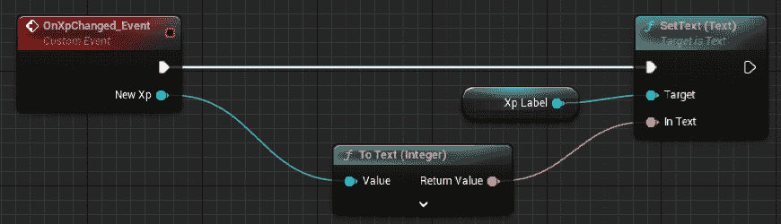

图 6.7 – Xp 自定义事件

作为额外的、可选步骤，你可能想要添加一个`经验值`（例如，`经验` `值: 150`）。

现在你有一个自定义事件来处理经验值标签，是时候为角色等级做同样的事情了。

### 为角色等级标签创建自定义事件

现在让我们创建一个自定义事件，该事件将更新角色等级标签：

1.  创建一个自定义事件，并将其命名为`OnCharacterLevelUp_Event`。

1.  选择它，在`NewLevel`。

1.  从**MyBlueprint**面板中，拖动一个**CharacterLevelLabel**的获取节点。

1.  从**CharacterLevelLabel**输出引脚，点击并拖动，在释放鼠标按钮后，从出现的选项中选择一个**SetText (Text)**节点。

1.  将**OnLevelLabelChanged_Event**执行引脚连接到传入的**SetText (Text)**执行引脚。

1.  将**事件**节点的**新关卡**引脚连接到**setText (Text)**节点的**In Text**引脚。此操作将自动添加一个**To Text (Integer)**节点转换器。

这段代码的最终结果显示在*图 6.8*中：

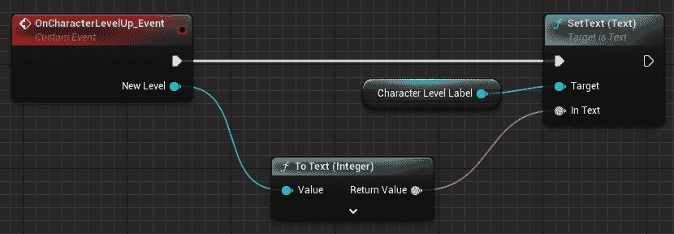

图 6.8 – 角色等级自定义事件

就像之前的标签一样，你可能想使用`Level:`（例如，`Level: 1`）。

现在你已经有了处理角色等级标签的自定义事件，是时候将这些事件绑定到 PlayerState 广播的通知上了。

### 绑定到 PlayerState 事件

在 Widget 蓝图的这个最终步骤中，你将绑定之前创建的事件到 PlayerState，以便在每次更新通知分发时更新 HUD：

1.  在图中添加一个**初始化事件**节点。此节点在游戏过程中仅执行一次（即，当对象已初始化时），是添加绑定操作的最佳位置。

1.  将事件连接到一个**Delay**节点，其**Duration**设置为**0,2**。由于 PlayerState 在初始化时不可用，等待它可用是快速解决问题的方法。

1.  添加一个**Branch**节点，并将其输入执行引脚连接到**Delay**节点的**Completed**执行引脚。将**Branch**节点的**False**执行引脚连接到**Delay**节点的输入执行引脚；这将创建一个循环，直到 PlayerState 被正确初始化。

现在我们将从这个 widget 的拥有者恢复 PlayerState。

1.  在图中添加一个**获取拥有玩家**节点。此节点返回控制（即，拥有）HUD 的玩家。

1.  从此节点的**返回值**引脚，点击并拖动以创建一个**Get PlayerState**节点。

1.  从`US_PlayerState`类，我们相当确信我们将恢复那种类型的 PlayerState，因此我们不需要担心验证。

1.  将**Cast To US_PlayerState**节点的**Success**引脚连接到**Branch**节点的**Condition**引脚。

1.  从输出的`PlayerState`。

1.  将**Branch**节点的**True**执行引脚连接到**Set PlayerState**的输入执行引脚。

到目前为止创建的可视化脚本代码显示在*图 6.9*中：

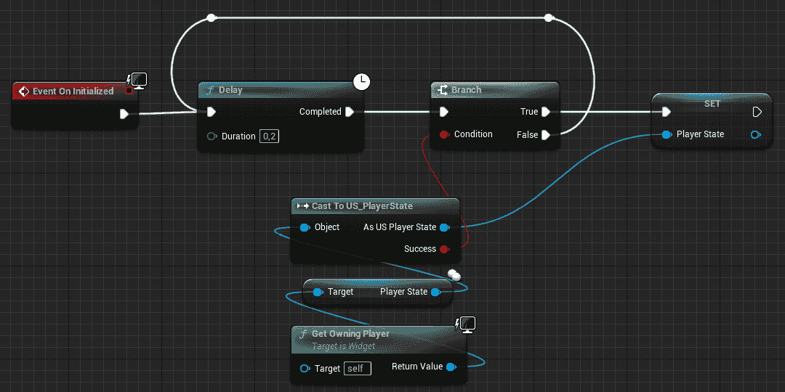

图 6.9 – PlayerState 绑定的第一部分

现在你已经拥有了`PlayerState`的引用，是时候将自定义事件绑定到之前章节中创建的委托上了。

1.  从`US_PlayerState`类的输出引脚。

1.  将**Set PlayerState**的输出执行引脚连接到**Bind Event to On Xp Changed**节点的输入执行引脚。

1.  从绑定节点的**Event**引脚，点击并拖动以添加一个**Create Event**节点。此节点有一个下拉菜单 – 在这里，选择**OnXpChanged_Event (NewXp)**，这将执行**OnXpChanged_Event**自定义事件，每当系统从 PlayerState 接收到相应的通知时。

1.  将**Bind Event to On Xp Changed**节点的输出执行引脚连接到一个**On Xp Changed Event**节点；这将初始化时调用事件，以更新 HUD。

1.  从**Variables**部分，拖动一个**Get PlayerState**节点，并从它创建一个**Get Xp**节点。将**Get Xp**节点的输出引脚连接到**On Xp Changed Event**节点的**New Xp**引脚。

此部分的 Visual Scripting 代码如*图 6.10*所示：

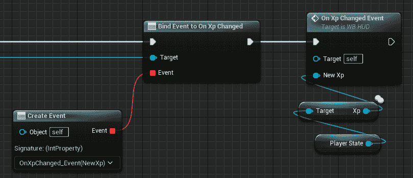

图 6.10 – PlayerState 绑定的第二部分

绑定阶段的最后部分几乎与您刚刚采取的步骤相同，只是我们现在为玩家等级创建绑定。

1.  从**On Xp Changed Event**节点的输出引脚，点击并拖动以创建一个**Bind Event to On Character Level Up** **Up**节点。

1.  从**Variables**部分拖动一个**Get PlayerState**节点并将其连接到**Bind Event to On Character Level Up**节点的**Target**引脚。

1.  从**Bind Event to On Character Level Up**节点的**Event**引脚，点击并拖动以添加一个**Create Event**节点。从下拉菜单中选择**OnCharacterLevelUp_Event (NewLevel)**。此选择将在系统从 PlayerState 接收到相应的通知时执行**OnCharacterLevelUp_Event**自定义事件。

1.  将**Bind**节点的输出执行引脚连接到一个**On Character Level Up Event**节点；这将初始化时调用事件，以更新 HUD。

1.  从**Variables**部分，拖动一个**Get PlayerState**节点以创建一个**Get Character Level**节点。将**Get Character Level**节点的输出引脚连接到**On Character Level Up Event**节点的**New Level**引脚。

此图的最后一部分如*图 6.11*所示：

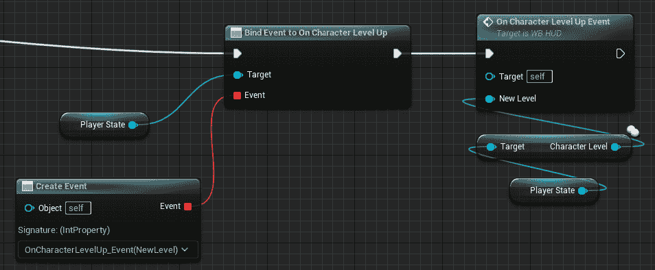

图 6.11 – PlayerState 绑定的最后一部分

你已经创建好了所有用于监听任何 PlayerState 通知并相应更新 HUD 的绑定。现在是时候添加最后一步 – 在游戏中显示 HUD。

## 将 HUD 添加到角色上

现在将添加 HUD 到玩家视图中。如果你已经熟悉独立游戏中的 Unreal Engine 用户界面，你可能已经知道如何操作。

然而，你应该意识到，在多人环境中，只有当角色由本地控制（即拥有客户端）时，用户界面小部件才应该附加到游戏视图中。如果你没有检查创建小部件的角色是否由本地控制，你将为级别中生成的每个角色创建一个小部件——包括由其他玩家控制并在客户端复制的角色。显然，在游戏中出现杂乱无章的叠加 HUD 不是你想要看到的情况！

要将 HUD 添加到角色，请按照以下步骤操作：

1.  首先，找到**BP_Character**蓝图并打开它。

1.  在事件图中，找到**开始播放**事件。然后，将一个**分支**节点添加到事件的执行引脚。

1.  将**分支**节点的**条件**引脚连接到一个**本地控制**节点——这将确保我们只将 HUD 附加到由客户端控制的角色。

1.  从**分支**节点的**True**执行引脚创建一个**创建小部件**节点。从**类**下拉菜单中选择**WB_HUD**以选择我们的 HUD。

1.  将**创建小部件**节点的输出执行引脚连接到**添加到视图**节点。将**返回值**引脚连接到**目标**引脚。

图表的最终结果可以在*图 6**.12*中看到：

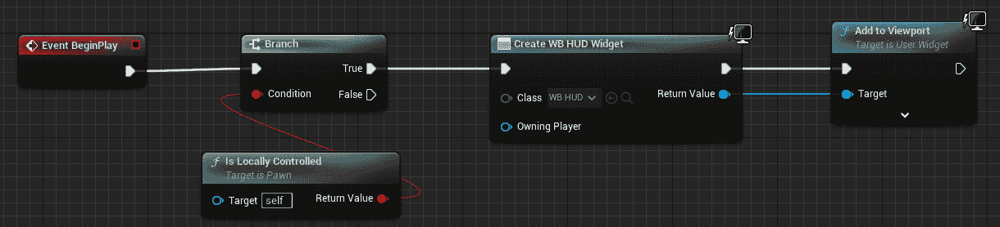

图 6.12 – 将 HUD 添加到视图中

之前的视觉脚本代码相当容易理解，但重要的是要提到，视口只添加到由客户端控制的角色，因为多个 HUD 重叠并不是理想的情况！

现在一切都已经设置妥当，你将测试你的游戏以查看它的工作情况！

## 测试游戏

要测试游戏，请以监听服务器的形式开始玩游戏，并检查一切是否正常工作。特别是，你应该看到以下行为：

+   游戏开始时，HUD 应显示 0 经验值和角色等级等于 1

+   每当角色捡起一枚硬币时，HUD 应更新总经验值

+   如果达到目标经验值，玩家应升级，并且 HUD 将显示新的等级

最终结果应该与*图 6**.13*中显示的相当相似：

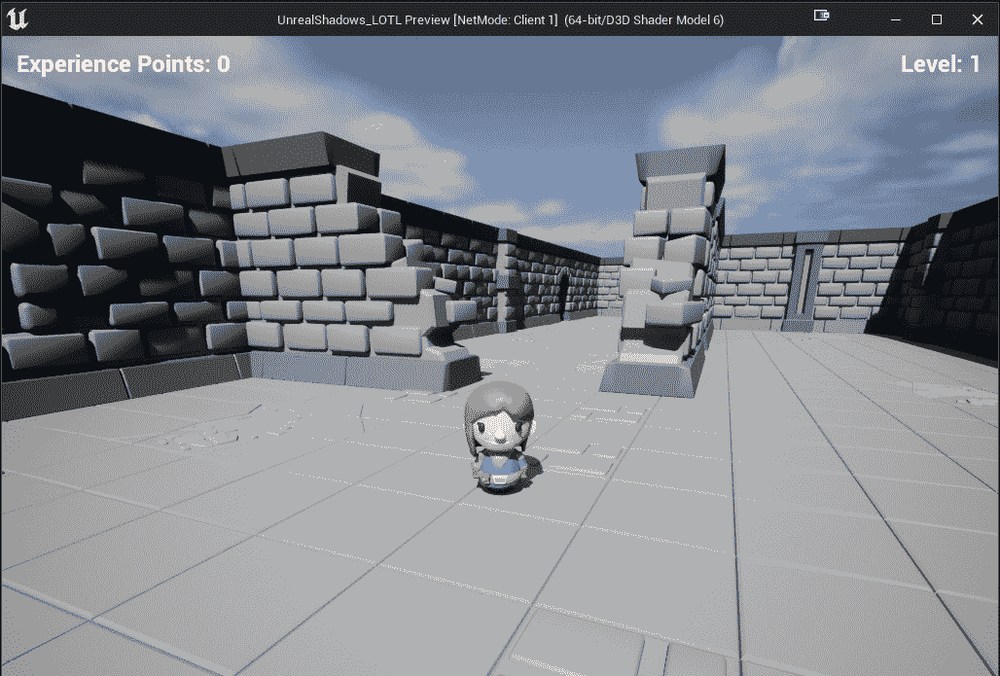

图 6.13 – 最终 HUD

如果一切按计划进行，你就可以开始进入 Lichlord 多人史诗的下一章：客户端-服务器通信了！

# 摘要

在本章中，我向您介绍了虚幻引擎多人框架中最重要的话题之一：复制。

作为第一步，你为玩家创建了一些统计数据，以便使你的游戏玩法更加灵活。你是通过结构和数据表来做到这一点的——即使你在开发独立游戏，这个话题也会很有用。

接下来，我解释了属性复制的主题以及如何将其应用到你的项目中。一旦主要概念被定义，你开始在使用它们在 PlayerState 中，以便在游戏过程中跟踪角色的进度。

作为最后一步，你创建了一个 HUD 来向玩家展示进度。在这里，复制功能尤为重要，因为每个客户端都应该获得自己的更新并将其展示给玩家。

在下一章中，你将深入神秘复制的领域，展示你在从客户端到服务器以及返回的微妙艺术中运用技能，仿佛这并非难事。

准备好将事物提升到下一个层次——我们将一步步攀登多人游戏开发的阶梯，每次前进两步！
