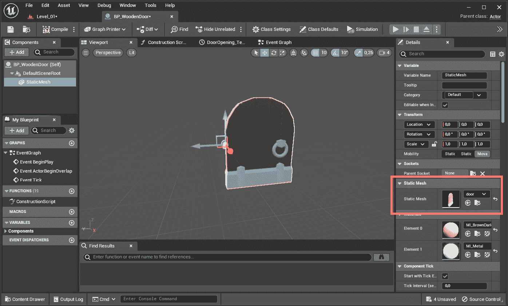
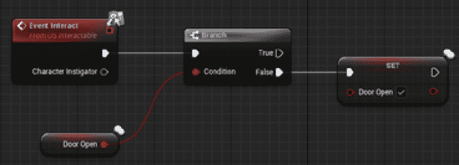
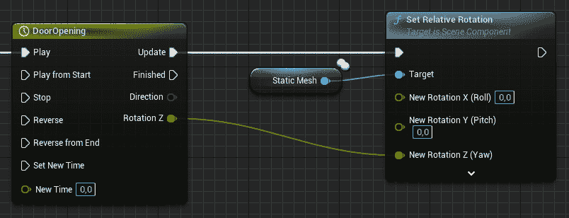

# 第七章：使用远程过程调用（RPCs）

现在你已经对属性复制的世界有了牢固的把握，是时候向你介绍函数如何在网络上调用的方式了。在 Unreal 中，这是通过**远程过程调用**（**RPCs**）实现的——这是引擎网络系统中最强大的功能之一。

在本章中，你将学习如何通过 RPC 执行函数，并理解如何在服务器、客户端或所有具有特定对象实例的客户端上运行它们。

此外，你还将了解正确调用这些类型函数的常见要求——特别是，我将解释可靠函数和不可靠函数之间的区别。

最后，你显然会将这新获得、宝贵的知识应用到迄今为止你开发的项目中。

因此，在接下来的几节中，我将介绍以下主题：

+   理解 RPC 是什么

+   在网络上执行 RPCs

+   实现门系统

# 技术要求

要跟进本章中介绍的主题，你应该已经完成了前面的章节，并理解了它们的内容。

此外，如果你希望从本书的配套仓库开始，你可以下载本书配套项目仓库中提供的`.zip`项目文件：

[`github.com/PacktPublishing/Multiplayer-Game-Development-with-Unreal-Engine-5`](https://github.com/PacktPublishing/Multiplayer-Game-Development-with-Unreal-Engine-5)

你可以通过点击`Unreal Shadows –` `Chapter 06``End`链接下载与最后一章结尾一致的文件。

# 理解 RPC 是什么

**RPC**是一个可以在本地调用但在不同机器上执行的函数——例如，服务器计算机可以调用客户端计算机上的函数，命令它在关卡中的某个地方生成视觉效果或声音。RPC 的另一个有用应用是能够在服务器和客户端之间通过网络连接双向发送消息。

Unreal Engine 中提供了三种类型的 RPCs：

+   **服务器**：该函数将由客户端 PC 上的对象调用，但仅在相同对象的服务器版本上执行。客户端必须拥有调用该方法的对象（如果你需要，请检查*第五章*，*在多人环境中管理 Actor*，以复习关于拥有 Actor 的内容）。

+   **客户端**：该函数将由对象在服务器上调用，但仅在调用该函数的对象所属的客户端版本上执行。

+   **NetMulticast**：该函数可以由对象在服务器上调用并在服务器和调用该函数的对象的所有客户端版本上执行。它也可以由客户端调用，但在此情况下，它将仅在本地执行（即，在调用它的客户端上）。

为了使一个函数能够作为 RPC 正确执行，它必须由 Actor 调用，并且 Actor 必须是复制的。此外，该函数需要使用 `UFUNCTION()` 宏进行装饰。

仅在拥有客户端上运行的功能将在 `.h` 文件中声明，如下代码片段所示：

```cpp
UFUNCTION(Client)
void DoSomething_Client();
```

在上一个头文件对应的 `.cpp` 文件中，你需要使用 `_Implementation` 后缀来实现这个函数。这个类的自动生成代码位于 `.generated.h` 文件中，当需要时，它将自动包含对 `_Implementation` 方法的调用。关于 `.generated.h` 文件的更多信息，请参阅*第四章*，*设置您的第一个* *多人游戏环境*。

看一个例子，假设你的 `.h` 头文件中的方法声明类似于以下代码片段：

```cpp
UFUNCTION(Server)
void DoSomething_Server();
```

你需要在你的 `.cpp` 文件中实现以下函数：

```cpp
void DoSomething_Server_Implementation()
{ /* Your code here */ }
```

由于性能原因，方法并不总是能保证被接收者接收到；然而，这种行为是可以调整的，如下小节所示。

## RPC 的可靠性

RPC 默认是不可靠的——这意味着无法保证函数调用能够到达目的地。如果执行代码不是那么重要，例如在客户端生成视觉效果或播放靠近角色的随机噪音，这通常是可接受的；如果消息没有收到，效果将不会生成或声音将不会被听到，但游戏玩法不会受到影响。

然而，有些情况下，你希望强制执行可靠性并确保消息能够安全地到达目的地——例如，在本章中，你将从服务器端执行冲刺动作（你真的不希望失去与玩家的重要交互）。为了确保 RPC 调用在远程机器上执行，你可以使用 `Reliable` 关键字。

为了说明这一点，一个应该在客户端可靠执行的功能将被以下代码声明：

```cpp
UFUNCTION(Client, Reliable)
void DoSomethingReliably_Client();
```

这将保证方法调用将被客户端接收并正确执行，不会因为网络不可靠而存在数据丢失的风险。

注意

避免在 `Tick()` 事件中使用可靠的 RPC，并且在将它们绑定到玩家输入时要小心。这是因为玩家可以非常快速地重复按按钮，导致可靠 RPC 队列溢出。

除了可靠性之外，你可能还希望有一个方法在执行前进行验证——这正是我现在要向你展示的！

## 验证 RPCs

Unreal Engine 提供了一个额外的功能，它增加了检查函数是否会在没有坏数据或输入的情况下执行的能力——这就是**验证**的全部内容。

要声明一个方法应该为 RPC 调用进行验证，你需要在`UFUNCTION()`声明语句中添加`WithValidation`指定符，并实现一个额外的函数，该函数将返回`bool`类型，并以验证函数的名称命名，但带有`_Validate`后缀。

例如，带有验证的函数在`.h`文件中的声明将类似于以下代码：

```cpp
UFUNCTION(Server, WithValidation)
void DoSomethingWithValidation();
```

然后，在`.cpp`文件中，你需要实现两个方法。第一个将是常规函数，其代码如下：

```cpp
void DoSomethingWithValidation_Implementation()
{ /* Your code here */ }
```

第二个将是实际的验证函数，其代码如下：

```cpp
bool DoSomethingWithValidation_Validate()
{ /* Your code here */ }
```

`_Validate`函数将返回`true`如果代码已验证，否则返回`false`。如果验证成功，相应的函数将被执行；否则，它将不会执行。

在本节中，我介绍了 RPC 以及虚幻引擎如何处理它们。请耐心等待——如果你在联网游戏行业工作，掌握 RPC 是保持你的工作和职业发展的关键！

现在你已经对如何实现 RPC 有了坚实的理解，是时候编写一些代码了——我们将从追踪那个讨厌的小虫子开始，它阻止我们的盗贼英雄在地下城中自由（且正确地）冲刺。

# 在网络上执行 RPC

在本节中，你将通过修复角色正确冲刺的问题来练习使用 RPC。如你所记，当角色在客户端冲刺时，你会得到“跳跃”的行为——角色似乎开始奔跑，但立即被恢复到步行速度。

这是因为冲刺动作是在玩家客户端上执行的，但并没有在服务器上执行，而服务器才是掌握控制权的一方；因此，来自服务器的覆盖操作会在每次更新时将角色移动速度减慢。这意味着你试图以冲刺速度移动你的角色，但一旦服务器在客户端复制了移动动作，它就会将角色速度恢复到正常移动速度。

我们甚至不希望客户端控制这种重要交互——记住，服务器才是掌握控制权的一方——所以，回到项目中，开始编写一些代码来修复这个问题！

## 在服务器上调用函数

要让我们的角色跑步，我们只需在服务器上执行移动速度的改变，而不是在客户端。这将确保对行为有完全的控制，并在所有客户端上正确复制。

让我们从打开`US_Character.h`文件并进行一些代码声明开始。在`protected`部分，添加以下两个方法：

```cpp
UFUNCTION(Server, Reliable)
void SprintStart_Server();
UFUNCTION(Server, Reliable)
void SprintEnd_Server();
```

这些函数具有`Server`属性，正如前一小节所述，它将在服务器上执行它们。我们还添加了`Reliable`属性，因为我们不希望由于系统的默认不可靠性而丢失这个 RPC。`_Server`后缀不是强制性的，只是为了清晰（有些人使用前缀，所以这取决于个人喜好！）。

现在打开`US_Character.cpp`文件，通过添加以下代码来实现这两个函数：

```cpp
void AUS_Character::SprintStart_Server_Implementation()
{
 if (GetCharacterStats())
 {
  GetCharacterMovement()->MaxWalkSpeed = GetCharacterStats()->SprintSpeed;
 }
}
void AUS_Character::SprintEnd_Server_Implementation()
{
 if (GetCharacterStats())
 {
  GetCharacterMovement()->MaxWalkSpeed = GetCharacterStats()->WalkSpeed;
 }
}
```

代码相当简单，因为我们只是在两个新函数中执行速度更改，并且很快，我们将从它们之前的位置（即客户端调用）中移除它们。

这里，请注意`_Implementation`后缀——这是强制性的，因为`SprintStart_Server()`和`SprintEnd_Server()`函数将由 Unreal 在`.generated.h`类文件中自动生成，并负责调用实际实现。

我们现在需要更改`SprintStart()`和`SprintEnd()`函数，以便调用相应的服务器函数（即`SprintStart_Server()`和`SprintEnd_Server()`）。找到这两个函数，删除它们的所有内容（即对`MaxWalkSpeed`的更改），然后在`SprintStart()`函数中添加以下简单代码行：

```cpp
SprintStart_Server();
```

在`SprintEnd()`函数中添加以下代码行：

```cpp
SprintEnd_Server();
```

要使冲刺动作完全可用，我们需要采取最后一步。目前，如果角色正在奔跑并升级，移动速度将恢复到步行速度。这是因为，在`UpdateCharacterStats()`函数中，我们将`MaxWalkSpeed`属性设置为新的步行速度，即使角色正在冲刺。

让我们通过找到`UpdateCharacterStats()`方法并在其开头添加以下代码来解决这个问题：

```cpp
auto IsSprinting = false;
if(GetCharacterStats())
{
 IsSprinting = GetCharacterMovement()->MaxWalkSpeed == GetCharacterStats()->SprintSpeed;
}
```

这段代码只是检查角色是否在冲刺，并将结果存储在局部变量中。

然后，找到以下代码行：

```cpp
GetCharacterMovement()->MaxWalkSpeed = GetCharacterStats()->WalkSpeed;
```

在它之后添加以下命令：

```cpp
if(IsSprinting)
{
 SprintStart_Server();
}
```

虽然很简单，但如果角色正在冲刺，我们只需在服务器上调用相应的方法来正确更新一切。

我们几乎完成了移动管理，但还有一些小事情需要我们处理。不过别担心，我们正在努力确保在*第十章*，“增强玩家体验”结束前完成一切。所以请耐心等待，保持关注！

在本节中，你已经开始在你的角色类中实现简单的 RPC。具体来说，你从拥有角色的客户端发送了一个命令到服务器，以便正确更新移动速度。

在下一节中，你将为你的游戏添加一些更复杂的 RPC。特别是，你将开发一个巧妙的开门系统。准备好展示你的编程技能吧！

# 实现门系统

在本节中，你将重复一些之前解释过的关于 RPC 的主题，但会有一个小调整——你将在网络上开发一些 Actor 到 Actor 的通信。更重要的是，它将在一个 C++ 类——你的角色——和一个蓝图类——一个应该被打开的门——之间进行。

为了实现这种行为，你将使用你在 *第四章* 中创建的功能，即 *设置您的第一个多人游戏环境*——交互动作。由于你至今为止开发的所有内容，它可能已经从你的脑海中溜走了，但不用担心——现在是时候把它翻出来，再次投入使用。

## 创建交互式界面

为了在您的角色和门之间建立通信，您将使用一个 **接口**。正如你可能已经知道的，C++ 中的接口是创建不同类之间抽象的强大工具。它们允许你定义一个所有实现类都必须遵守的合同，从而允许你创建更易于维护、扩展和重用的代码。

在 Unreal Engine 中，接口与传统编程接口的不同之处在于，不是必须实现所有函数。相反，实现它们是可选的。更重要的是，你可以在 C++ 中声明一个接口，并在蓝图（Blueprint）中实现它——这正是你在这里要做的。

让我们从打开您的开发 IDE 并创建一个名为 `US_Interactable.h` 的文件开始。然后，将以下代码添加到该文件中：

```cpp
#pragma once
#include "CoreMinimal.h"
#include "UObject/Interface.h"
#include "US_Interactable.generated.h"
UINTERFACE(MinimalAPI, Blueprintable)
class UUS_Interactable : public UInterface
{
 GENERATED_BODY()
};
class UNREALSHADOWS_LOTL_API IUS_Interactable
{
 GENERATED_BODY()
public:
 UFUNCTION(BlueprintCallable, BlueprintNativeEvent, Category = "Interaction", meta=(DisplayName="Interact"))
 void Interact(class AUS_Character* CharacterInstigator);
 UFUNCTION(BlueprintCallable, BlueprintNativeEvent, Category = "Interaction", meta=(DisplayName="Can Interact"))
 bool CanInteract( AUS_Character * CharacterInstigator) const;
};
```

你可能会注意到你刚刚添加的代码中有些奇怪的地方——有两个类。为了正确地声明 Unreal Engine 接口，你需要声明两个类：

+   带有 `U` 前缀的类并扩展 `UInterface`：这并不是实际的接口，而是一个空类，其唯一目的是使该类在 Unreal Engine 系统中可见

+   带有 `I` 前缀的类：这是实际的接口，将包含所有接口方法定义

如你所见，带有 U 前缀的类被 `UINTERFACE()` 宏和 `Blueprintable` 属性装饰，这将允许你从蓝图（Blueprint）中实现此接口。这不是很酷吗？

最后，我们声明了两个函数，分别命名为 `Interact()` 和 `CanInteract()`。这两个函数可以在蓝图（Blueprint）中调用和实现（多亏了 `BlueprintCallable` 和 `BlueprintNativeEvent` 属性）。

尽管我们不会在我们的门蓝图（Blueprint）中实现第二个函数（即 `CanInteract()`），但拥有这样的功能是很好的——例如，检查角色是否可以使用在地下某个地方找到的钥匙打开门。正如我之前告诉你的，Unreal Engine 中的接口不会强制实现所有方法声明。

因此，你已经创建了一个接口，允许角色与...好吧，与某物交互。现在是时候让盗贼角色执行这个英勇行为——你将在下一个子节中实现的行为。

## 实现交互动作

现在，你准备好回到`US_Character.h`头文件类，并为交互动作添加一些代码逻辑。因为我们已经为角色移动做了，我们需要从服务器执行这个交互。

为了做到这一点，打开头文件，并在`protected`部分查找以下声明：

```cpp
void Interact(const FInputActionValue& Value);
```

在它之后添加相应的服务器调用：

```cpp
UFUNCTION(Server, Reliable)
void Interact_Server();
```

至于冲刺动作，这个调用必须是`Reliable`的，因为我们需要确保它将被正确执行，并且不会丢失任何信息。

作为最后一步，将以下代码行添加到`private`部分：

```cpp
UPROPERTY()
AActor* InteractableActor;
```

你将使用这个属性作为与对象交互的引用。

现在头文件已经正确更新，打开`US_Character.cpp`文件，在文件开头添加以下包含语句：

```cpp
#include "US_Interactable.h"
#include "Kismet/KismetSystemLibrary.h"
```

然后，查找到目前为止只是一个空壳的`Interact()`方法。在方法内部，添加以下代码：

```cpp
Interact_Server();
```

此代码执行一个简单的 RPC 调用到相应的服务器交互实现。显然，你需要实现服务器调用，将其添加到你的代码中，紧随`Interact()`函数之后：

```cpp
void AUS_Character::Interact_Server_Implementation()
{
 if(InteractableActor)
 {
  IUS_Interactable::Execute_Interact(InteractableActor, this);
 }
}
```

仅当找到`InteractableActor`的引用时，才会执行此调用。

如果你来自面向对象编程（OOP）背景，并且不熟悉 Unreal 中接口的工作方式，这个调用可能看起来相当奇怪——我们在没有类型检查的情况下对 Actor 引用执行调用！这是 Unreal Engine 中接口工作的方式；它们只是发送给对象引用的消息。如果对象没有实现该接口，调用将简单地丢失。

显然，我们希望调用执行到可以与之交互的东西（即实现了`US_Interactable`接口的东西）。为了实现这一点，我们将持续检查角色是否指向实现了该接口的任何东西，如果找到，我们将在`InteractableActor`属性中引用它。

在你的`.cpp`类中查找`Tick()`方法，并开始添加以下代码片段：

```cpp
if(GetLocalRole() != ROLE_Authority) return;
FHitResult HitResult;
FCollisionQueryParams QueryParams;
QueryParams.bTraceComplex = true;
QueryParams.AddIgnoredActor(this);
auto SphereRadius = 50.f;
auto StartLocation = GetActorLocation() + GetActorForwardVector() * 150.f;
auto EndLocation = StartLocation + GetActorForwardVector() * 500.f;
auto IsHit = UKismetSystemLibrary::SphereTraceSingle(
 GetWorld(),
 StartLocation,
 EndLocation,
 SphereRadius,
 UEngineTypes::ConvertToTraceType(ECC_WorldStatic),
 false,
 TArray<AActor*>(),
 EDrawDebugTrace::ForOneFrame,
 HitResult,
 true
);
```

我们在这里做的第一件事是检查执行跟踪的实例是否有权这样做——这意味着只有服务器将为所有角色执行跟踪，这显然是为了避免客户端作弊。

然后，我们执行一个常规的球体跟踪来检查角色是否指向某个东西。如果你不熟悉 Unreal Engine 中的**跟踪**，它是一种用于检测对象之间碰撞和重叠的工具。它用于诸如视线、武器发射甚至 AI 路径查找等事物。跟踪可以通过诸如碰撞通道、对象类型过滤、形状、起点/终点等参数进行配置，这允许你指定应该检测哪种类型的碰撞以及它应该如何与环境交互。

注意

更多关于虚幻引擎中追踪内部工作原理的信息，您可以查看官方文档，链接如下：[`docs.unrealengine.com/5.1/en-US/traces-with-raycasts-in-unreal-engine/`](https://docs.unrealengine.com/5.1/en-US/traces-with-raycasts-in-unreal-engine/)。

在追踪后，结果存储在`HitResult`变量中，我们将使用它来检查我们是否找到了可交互的 Actor。为此，在您刚刚编写的代码之后添加以下代码：

```cpp
if (IsHit && HitResult.GetActor()->GetClass()->ImplementsInterface(UUS_Interactable::StaticClass()))
{
 DrawDebugSphere(GetWorld(), HitResult.ImpactPoint, SphereRadius, 12, FColor::Magenta, false, 1.f);
 InteractableActor = HitResult.GetActor();
}
else
{
 InteractableActor = nullptr;
}
```

之前的检查是我们交互控制的核心 - 如果被追踪的对象实现了`US_Interactable`接口，我们存储引用并绘制一个洋红色调试球体以进行测试。如果没有找到任何东西，我们只需从任何以前的引用中清理`InteractableActor`属性。

为了检查一切是否按预期工作，您可以打开虚幻引擎编辑器，编译后，您可以玩游戏。现在服务器应该为每个角色绘制一个红色球体轨迹，当击中物体时变为绿色。我们还没有任何可以与之交互的东西，所以您不会看到调试球体。

在下一个子节中，您将实现一个对角色交互做出反应的门蓝图。

## 创建门蓝图

现在是时候创建可以与之交互的东西了，我们将通过添加一些门到地牢中来实现这一点。所以，让我们打开`Blueprints`文件夹并完成以下步骤：

1.  创建一个新的从**Actor**派生的蓝图类，命名为**BP_WoodenDoor**，并打开它。

1.  在**细节**面板中，勾选**复制**属性以启用此 Actor 的复制。

1.  添加一个**静态网格**组件，并将门网格分配给**静态****网格**属性。

1.  在**组件**面板中，选择**静态网格**组件，然后在**细节**面板中，勾选**组件复制**以启用复制。

最终结果应该类似于*图 7.1*1*所示：



图 7.1 – 木门蓝图

现在，打开事件图，执行以下操作：

1.  创建一个类型为`DoorOpen`的变量。在其**细节**面板中，将**复制**属性设置为**已复制**。

1.  选择**类设置**选项卡，然后在**接口**类别中添加**US_Interactable**接口。这将向**我的****蓝图**窗口添加**接口**部分。

1.  在**我的蓝图**标签页的**接口**部分，打开**交互**类别，右键单击**交互**方法，并选择**实现事件**。这将向事件图添加一个**事件交互**节点。

1.  从事件的输出引脚添加一个**分支**节点，并在**条件**引脚中添加**DoorOpen**变量的获取节点，该变量位于**变量**部分。

1.  将**分支**节点的**False**引脚连接到**Door Open**变量的**Setter**节点，并检查此最后一个节点的输入值引脚以将其设置为**True**。

到目前为止创建的事件图在*图 7.2*中显示：



图 7.2 – 门检查

目前的图表相当简单；它只是检查门是否已经打开，如果它是关闭的，则将其标记为打开。你将通过使门网格在开启动画中旋转来完成蓝图。

1.  将**Set Door Open**节点的输出引脚连接到**时间线**节点。将此节点命名为**DoorOpening**，并双击它以打开其相应的图表。

1.  添加一个**浮点轨迹**并将其命名为**RotationZ**。在轨迹上添加两个键，分别具有值**(0, 0)**和**(1, -90)**。

时间线窗口在*图 7.3*中显示：


图 7.3 – 门时间线窗口

1.  返回主事件图，并将**静态网格**组件的引用从**组件**面板拖动到图中本身。

1.  将此引用的输出引脚连接到**设置相对旋转**节点。

1.  右键单击**新旋转**引脚并选择**拆分结构引脚**以暴露**新旋转**的**Z**值。

1.  将**时间线**节点的**更新**执行引脚连接到**设置相对旋转**节点的输入执行引脚。将**Rotation Z**引脚连接到**新旋转 Z**以完成图表。

图表的最后部分在*图 7.3*中描述：



图 7.4 – 图表的第二部分

图表的这一部分将仅在网格的*z*轴上启动旋转动画，使其在交互时打开。

现在让我们给盗贼英雄一个展示的时刻，让他自由地在地牢中游荡，急切地打开门，寻找要解放的囚犯和要挖掘的宝藏！

## 测试交互动作

打开你的游戏关卡，并将门蓝图的一个或两个实例拖动到图中开始测试游戏。每当服务器控制的球体追踪击中门时，你应该能看到一个洋红色的球体，表示该对象可以交互。在客户端按下*I*键将打开门并显示隐藏的宝藏（或危险！）。

交互检查的最终结果，连同调试球体，在*图 7.4*中显示：


图 7.5 – 交互检查的实际操作

因此，门系统最终已经创建，你现在可以自由地在地牢中放置尽可能多的门。作为额外的练习，你可以从**BP_WoodenDoor**创建一个蓝图子类，并使用**door_gate**网格为你的关卡添加一些变化。

在本节的最后部分，你已经实现了一个蓝图，允许角色与游戏中的其他 Actors 进行交互。具体来说，你创建了一个可以通过玩家交互打开的门系统，并且将在网络上进行同步。这意味着每个连接的玩家都将看到正确的更新。

# 概述

在本章中，你被介绍到了虚幻引擎多人环境中最重要且最有用的功能之一，远程过程调用，或称 RPC。正如你所见，它们允许你从服务器执行函数到客户端，反之亦然。

在本章中，你通过改进角色冲刺系统和在角色与其他游戏中的 Actors（例如，地牢门）之间添加交互逻辑，从客户端向服务器发起请求。请放心，到本书结束时，你也将看到 RPC 的其他用例，因为它们在多人游戏中非常普遍。

本章结束了本书的第二部分——从下一章开始，你将开始在网络中实现一些 AI 逻辑。让我们通过总结那些讨厌的 Lichlord 小兵，并给我们的角色一个挑战来提升自己来增加一些趣味吧！

# 第三部分：提升你的游戏

在本书的这一部分，你将发现如何增强你的游戏对玩家的吸引力。这个过程从创建吸引人的对手开始。之后，你将增强玩家角色的能力，并添加一些非玩家角色进行交互。此外，你还将学习如何在虚幻引擎中调试和修复网络系统。

本部分包括以下章节：

+   *第八章*，*将 AI 引入多人环境*

+   *第九章*，*扩展 AI 行为*

+   *第十章*，*增强玩家体验*

+   *第十一章*，*调试多人游戏*
