# 第十二章：管理多人会话

如您从之前的章节中已经了解到的，游戏会话由一个服务器表示，多个玩家都连接到这个服务器上。

虚幻引擎提供了一个强大的框架来创建、销毁和处理游戏会话。通过掌握如何处理多人会话，程序员可以确保他们的游戏将为所有玩家提供愉快且无瑕疵的体验。

在本章中，您将了解到管理游戏会话所需的主要概念，从基本设置到创建会话。然后，您将学习如何让客户端搜索可用的会话以及如何加入它们。到本章结束时，您将构建一个用户界面，该界面将用于后续处理虚幻引擎的多玩家会话系统。

在接下来的几节中，我将介绍以下主题：

+   理解游戏会话

+   准备项目游戏会话

+   创建会话

+   加入会话

# 技术要求

要跟进本章介绍的主题，您应该已经完成了*第十一章*，*调试多人游戏*，并理解其内容。

此外，如果您希望从本书的配套仓库开始编写代码，您可以下载本书配套项目仓库中提供的`.zip`项目文件：[`github.com/PacktPublishing/Multiplayer-Game-Development-with-Unreal-Engine-5`](https://github.com/PacktPublishing/Multiplayer-Game-Development-with-Unreal-Engine-5)。

您可以通过点击`Unreal Shadows –` *第十一章*`结束`链接下载与上一章结尾同步的文件。

# 理解游戏会话

在**游戏会话**期间，玩家可以通过连接到远程服务器或甚至使用他们的计算机作为专用服务器来参与在线游戏。虚幻引擎的游戏会话系统提供了一系列令人印象深刻的在线功能，如服务器浏览器、玩家限制、网络上的服务器搜索等。它易于使用，只需几个命令即可激活。无论运行在玩家的机器上还是专用服务器上，游戏会话都为玩家提供了连接并沉浸于游戏虚拟世界的方式。在本章中，我们将专注于设置本地网络环境，将专用服务器的设置留到下一章。

然而，在我们开始处理会话之前，我需要向您介绍在线子系统和其独特的特性。

## 介绍在线子系统

在虚幻引擎中，**在线子系统**是一个提供访问在线服务（如 Epic 在线服务、Steam、Xbox Live 等）功能的标准方法的系统。这在支持多个平台或在线服务的游戏开发场景中特别有用。在这种情况下，在线子系统通过为每个支持的服务启用配置调整来消除开发者进行代码更改的需求。这确保了编码过程和开发努力在整个支持的平台和服务中都是简化的、高效的和一致的。

在线子系统的核心目的是管理与各种在线平台的异步通信。由于网络速度、服务器延迟和后端服务运行时间通常对本地机器来说是未知的，因此与这些系统的交互在持续时间方面高度不可预测。为了解决这个问题，在线子系统利用委托来处理所有远程操作，确保它们在利用任何支持异步功能时总是执行。委托通过允许系统在请求完成时响应，以及允许开发者查询运行时请求，发挥着双重作用。通过提供一个单一的代码路径来遵循，委托消除了开发者编写自定义代码来处理各种成功或失败条件的需要。

支持的功能被分组到特定于服务的模块化接口中。例如，**排行榜**接口涵盖了与排行榜访问相关的所有方面——例如注册个人分数或时间，以及检查来自全球玩家或你朋友列表中的排行榜分数——而**购买**接口涵盖了游戏内购买和处理过去购买历史的过程。每个支持在线服务的功能集都有一个相关的接口，允许开发者编写与所使用的在线服务无关的代码，从而在服务之间促进一致性。

Epic Games 提供了一系列插件，允许开发者在线子系统上工作，包括针对最常见和常用平台的专用插件。*图 12*.*1*显示了虚幻引擎的**插件** | **在线** **平台**部分中可用的许多元素的一部分：

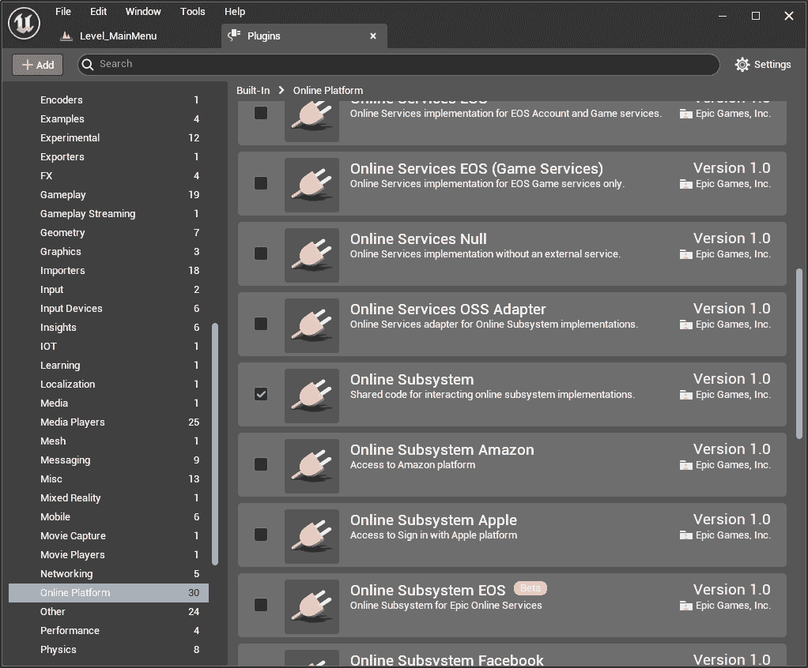

图 12.1 – 可用的某些在线子系统插件

在本章中，我们将使用默认的在线子系统，它提供了处理会话的最基本操作，包括其创建、销毁和加入。在*第十五章*“添加 Epic 在线服务（EOS）”，我们将深入了解更高级的在线子系统功能。让我们先学习如何管理最基本的会话操作。

## 理解会话命令

那么，如何管理和操作多人会话呢？您可以使用以下四种主要操作来处理会话：

+   **创建会话**

+   **销毁会话**

+   **查找会话**

+   **加入会话**

让我们逐一深入了解它们，并详细分析。

### 创建会话

**创建会话**命令构成了会话过程的起点。一旦会话创建成功，它就会对游戏的其他实例可见，这些实例随后可以加入。**创建会话**命令允许您指定关键方面，例如会话中允许的玩家数量和局域网模式，这可以让您管理基于互联网的游戏或局域网游戏。

### 销毁会话

如果您正在托管会话（即您创建了会话），**销毁会话**将关闭它，使其不再可用于发现和加入。连接的客户端将立即从会话中断开连接。如果您是连接到会话的客户端，调用此命令是离开会话和游戏的方法。

### 查找会话

通过使用**查找会话**命令，您可以检索当前创建和可访问的游戏会话的完整列表。在成功调用此方法后，返回的对象可以查询以获取重要信息，例如服务器的名称、ping 和玩家数量。至于**创建会话**命令，您可以选择基于互联网的游戏或基于局域网的。

### 加入会话

在确定所需的会话后，您可以发起一个**加入会话**调用以加入游戏。在成功连接到服务器后，游戏将自动切换到服务器的地图，并允许您参与正在进行的游戏。

## 理解连接错误

如您所知，网络操作总是存在遇到错误的风险，对于游戏来说，妥善处理这些错误至关重要。例如，主机离开会话（或崩溃）、临时互联网连接问题或其他不可预见的问题都是常见例子。

与上述会话功能相关的任何失败都将通过适当的事件进行通信，或者在蓝图的情况下，通过专门的执行引脚，以便开发者相应地配置游戏响应。这将确保即使在关键时刻，玩家也能获得良好的体验。

现在您已经掌握了如何创建和监督多人游戏会话，让我们回到虚幻引擎中，将这一知识应用到我们的项目中！在接下来的几节中，您将创建一个用户界面，让您能够托管会话并将其暴露给网络或加入一个会话。

# 准备项目游戏会话

在本章和下一章中，我们将创建一个新的级别，它将作为你游戏的起点，并允许玩家托管会话或加入会话。如前所述，在本章中，我们将专注于创建局域网托管的游戏——这意味着所有玩家都将连接到同一个本地网络——将托管互联网游戏的更复杂细节留到下一章。

级别将非常简单，并将包含以下元素：

+   一个用户界面小部件，它将执行以下操作：

    +   允许玩家创建和托管会话

    +   允许玩家查找并加入托管会话

+   玩家将使用的角色 3D 模型，用于更改皮肤颜色

在本章中，我们将专注于创建用户界面——包括所有必需的 widgets——将级别创建和皮肤处理留给下一章。

此界面将专注于主要会话功能，而不是其视觉外观。然而，你可以根据自己的个人喜好来决定风格和外观——只需让你的创造力自由发挥！

为了创建我们的用户界面，我们再次使用 UMG——你在*第六章*，*在网络中复制属性* *O**ver the Network*中使用了它。使用 UMG 系统的优点之一是你可以创建一个自定义小部件，并使用它来组合完整的界面。这将让你将元素分离成逻辑块，并保持整体系统的整洁和可重用性。

我们将首先创建创建和加入会话所需的所有元素。在本章结束时，我们将把所有内容整合到主菜单界面中。

要开始，我们需要四个主要组件：

+   一个**创建会话**小部件，它将帮助我们处理会话创建

+   一个**查找会话**小部件，它将允许我们在用户界面中查找并列出可用会话

+   一个**会话项渲染器**小部件，它将用于显示每个会话的信息，并允许我们加入会话

+   一个**主菜单**小部件，它将允许我们在屏幕上显示之前的 widgets

让我们通过打开虚幻项目并导航到`内容` | `蓝图`文件夹来开始创建这些小部件。我们将添加的第一个小部件是**创建会话**。

# 创建会话

在本节中，你将创建一个用户界面小部件，它将允许你管理会话创建。特别是，**创建会话**小部件将执行以下操作：

+   允许玩家选择单个会话中允许连接的玩家数量

+   通过点击按钮创建会话

+   打开游戏级别并开始游戏

我们必须做的第一件事是创建实际的界面小部件，因此，在内容浏览器的`蓝图`文件夹中，执行以下操作：

1.  右键单击并选择**用户界面** | **小部件蓝图**。在出现的弹出窗口中，选择**用户小部件**，如图*图 12**.2*所示：

图 12.2 – 用户小部件创建窗口

1.  将新创建的小部件命名为 `WB_CreateSession` 并双击它以打开它。

现在，我们将添加视觉元素。

## 添加视觉元素

一旦编辑器打开，选择 **设计** 视图并执行以下操作：

1.  从 `CreateSessionPanel`.

1.  从 `Background`.

1.  设置其 `(0, 0,` `0, 0.4)`.

1.  按住 *Ctrl* 和 *Shift* 键，点击 **锚点** 下拉菜单并选择右下角的按钮，使背景扩展到 **画布** 面板的整个区域。选择按钮在 *图 12.3* 中显示：

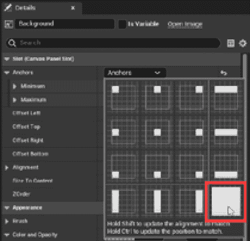

图 12.3 – 背景锚点选择

1.  从 `Container`

1.  按住 *Ctrl* 和 *Shift* 键，点击 **锚点** 下拉菜单并选择右下角的按钮，使背景扩展到 **画布** 面板的整个区域

到此为止，您已创建了小部件的容器 – 没有什么花哨的，但它完全功能正常。小部件层次结构可以在 *图 12**.4* 中看到：

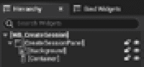

图 12.4 – CreateSession 小部件的部分层次结构

现在我们将添加允许玩家创建会话的工作元素。为此，请按照以下步骤操作：

1.  从 `TitleLabel`

1.  设置其 `5.0`

1.  将**文本**属性设置为**创建会话**

1.  从 `Separator`

1.  设置其 `10.0`

1.  从 `MaxPlayersLabel`

1.  设置其 `5.0`

1.  将**文本**属性设置为**最大玩家数**

1.  从 `MaxPlayersSpinBox`

1.  设置其 `10.0`

1.  启用 `1`

1.  启用 `5`

1.  设置两个 `0`

1.  确认已选中 **是变量** 复选框

1.  从 `CreateSessionBtn`

1.  设置其 `5.0`

1.  确认已选中 **是变量** 复选框

1.  从 `CreateSessionLabel`

1.  将其**文本**属性设置为**创建**

1.  将其 **对齐** 属性设置为 **文本居中**

小部件的最终结构在 *图 12**.5* 中显示：

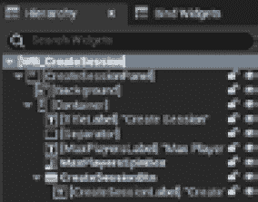

图 12.5 – 最终 CreateSession 小部件层次结构

小部件的 **设计** 视图在 *图 12**.6* 中显示：

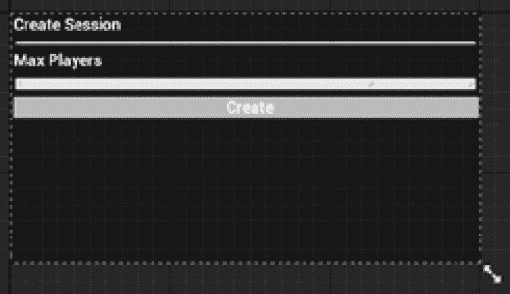

图 12.6 – CreateSession 小部件的设计视图

使用此布局，玩家将能够选择会话中托管的最大玩家数并启动会话本身。

## 实现视觉脚本逻辑

现在视觉部分的小部件已完成，您可以开始添加视觉脚本逻辑。通过点击 **图形** 按钮打开 **图形** 面板，在 **变量** 面板中，您应该已经有两个变量 – **CreateSessionBtn** 和 **MaxPlayersSpinBox**。然后，完成以下步骤：

1.  添加一个名为 `MaxPlayers` 的新变量。

1.  选择**MaxPlayersSpinBox**变量，在**Events**面板中点击**On Value Changed +**按钮以创建一个事件。

1.  选择**CreateSessionBtn**变量，在**Events**面板中点击**On Clicked +**按钮以创建一个事件。

之前的步骤将创建两个事件来处理相应的用户交互，如图*12.7*所示：

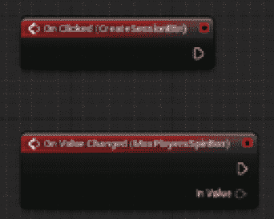

图 12.7 – CreateSession 图事件

我们将首先处理旋转框更改事件，这只需要将其值分配给**MaxConnections**变量。为此，请按照以下步骤操作：

1.  从**Variables**面板中拖动一个**Set Max Players**节点。

1.  将**On Value Changed (MaxPlayersSpinBox)**事件的输出执行引脚连接到**Set Max Players**节点的输入执行引脚。

1.  将事件节点的**In Value**引脚连接到**Set**节点的**Max Players**引脚。这将自动创建一个**Truncate**节点，将旋转框的浮点值转换为整数。

图的这部分最终结果如图*12.8*所示：

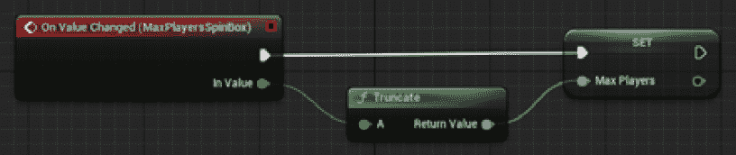

图 12.8 – 旋转框事件图

我们现在可以开始处理图中的会话创建部分，它将在**CreateSessionBtn**按钮被点击时触发。

1.  在图中添加一个**Create Session**节点和一个**Get Player Controller**节点。

1.  从**Variables**面板中拖动一个**Get Max Players**节点。

1.  将**On Clicked (CreateSessionBtn)**事件的输出执行引脚连接到**Create Session**节点的输入执行引脚。

1.  将**Get Player Controller**节点的**Return Value**引脚连接到**Create Session**节点的**Player Controller**引脚。

1.  将**Max Players**节点的输出引脚连接到**Create Session**节点的**Public Connections**引脚。

1.  启用**Create Session**节点的**Use LAN**复选框。

1.  将`Level_01`添加到`listen`到**Options**输入字段，以将级别作为监听服务器打开。

1.  将**Create Session**节点的**On Success**执行引脚连接到**Open Level (by Name)**节点的输入执行引脚。

1.  可选地，将**Create Session**节点的**On Failure**执行引脚连接到一个**Print String**节点；这将显示错误消息。这将跟踪在**Output Log**窗口中创建会话期间可能出现的任何失败。

最终的图如图*12.9*所示：

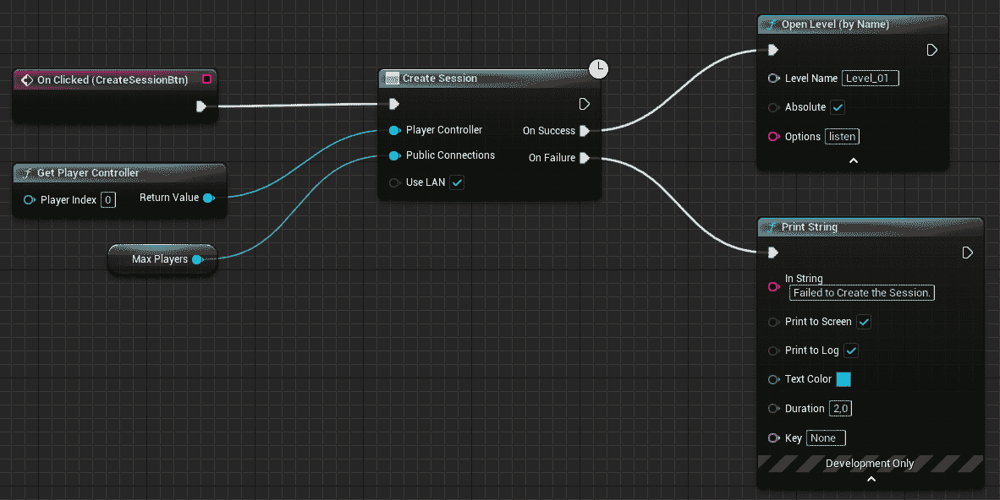

图 12.9 – Create Session 事件图

你刚刚创建的图简单但功能强大，包括在局域网中创建会话、设置每场会话的最大玩家数以及打开游戏级别以开始实际的多玩家会话。

在下一节中，我们将处理一个界面，该界面将允许玩家搜索并加入现有的会话。

# 加入会话

在本节中，我们将处理几个小部件，这些小部件将显示网络中可用的会话列表并允许玩家加入它们。我们需要两个小部件：**Session Item Renderer** 和 **Find Session**。第一个将用于显示单个会话的信息，而第二个将负责将第一个作为可用会话的列表使用。

## 创建 SessionItemRenderer 小部件

您将创建的小部件将具有以下功能：

+   显示可用的服务器名称

+   显示可用的最大连接数，以及已连接玩家的数量

+   提供一个加入按钮，让玩家能够进入会话

我们必须做的第一件事是创建小部件。因此，在内容浏览器区域，按照以下步骤操作：

1.  右键单击并选择 **用户界面** | **小部件蓝图**。在出现的弹出窗口中，选择 **用户小部件**。

1.  将新创建的小部件命名为 `WB_SessionItemRenderer` 并双击它以打开它。

再次，我们将从添加用户界面元素开始。

### 添加视觉元素

一旦编辑器打开，选择 **Designer** 面板并执行以下操作：

1.  从 `Container`。

1.  从 `ServerNameLabel` 并勾选 `Fill` 和 `5.0`

1.  设置 `服务器名称`

1.  从 `NumPlayersLabel` 并勾选 `5.0`

1.  设置 `0/0`

1.  从 `JoinBtn` 并双检查 `5.0`

1.  从 `JoinLabel`

1.  设置 `加入会话`

小部件的最终结构显示在 *图 12*。10*：

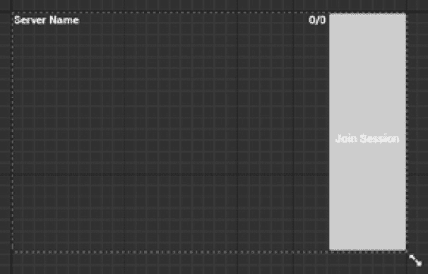

图 12.10 – SessionItemRenderer 小部件的层次结构视图

小部件的 **Designer** 视图显示在 *图 12*。11*：

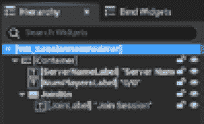

图 12.11 – SessionItemRenderer 小部件的 Designer 视图

使用此布局，玩家将能够看到每个可用会话的信息以及加入按钮。

现在部件的视觉部分已完成，您可以从添加 Visual Scripting 逻辑开始。

### 实现 Visual Scripting 逻辑

通过单击 **Graph** 按钮打开 **Graph** 面板并执行以下操作：

1.  在 **变量** 面板中，您应该已经有了三个变量 – **JoinBtn**、**NumPlayersLabel** 和 **ServerNameLabel**。在 Designer 图中，它们都已被标记为 **Is Variable**。

1.  添加一个新的 `SearchResult` 变量

1.  在其 **详细信息** 面板中，启用 **实例可编辑** 和 **在生成时暴露** 属性，以便从其他蓝图访问此属性

你应该已经熟悉**实例可编辑**属性，但**在生成时暴露**可能对你来说是新的。启用它将在生成此蓝图时显示该属性的引脚，这将在我们稍后添加此渲染器到可用会话列表时初始化数据时有所帮助。

现在变量已经设置好了，是时候添加一些视觉脚本了。我们将从实现**加入会话**逻辑开始。为此，请按照以下步骤操作：

1.  选择**JoinBtn**变量后，在**事件**面板中点击**On Clicked +**按钮添加一个**On Clicked (JoinBtn)**事件。

1.  在图表中添加一个**Join Session**节点，并将其输入执行引脚连接到**On Clicked (JoinBtn)**事件的输出执行引脚。

1.  在图表中添加一个**获取玩家控制器**节点，并将其**返回值**引脚连接到**Join**会话节点的**Player Controller**引脚。

1.  从**变量**面板中，将一个**获取搜索结果**节点拖动到图表中，并将其引脚连接到**Join**会话节点的**Search Result**节点。

图表这一部分的最终结果如图*图 12*所示。12*：

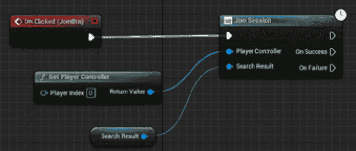

图 12.12 – 加入会话图表

如你所见，一旦你有了会话数据（即搜索结果），加入会话就相当直接；这些数据将在我们稍后添加的**查找会话**过程中获得。

请注意，加入一个会话后我们不需要像为**创建会话**小部件那样打开任何级别；一旦我们连接到主机，这将会自动发生。

为了完成这个小部件，我们需要在之前创建的标签中显示搜索结果数据，因为我们之前已经暴露了这些数据，所以在构造时它们已经可用。让我们通过在图表中查找**事件构造**事件节点来完成小部件的视觉脚本——它应该默认可用。然后，执行以下步骤：

1.  为了保持整洁，添加一个具有两个输出引脚的**Sequence**节点（默认设置），并将其输入执行引脚连接到事件节点的输出执行引脚。

1.  从**变量**面板中，拖动一个**获取服务器名称标签**节点和一个**获取搜索结果**节点。

1.  从**服务器名称标签**输出引脚，点击并拖动以创建一个**setText (Text)**节点。

1.  将**setText (Text)**节点的输入执行引脚连接到**Sequence**节点的**Then 0**执行引脚。

1.  从**搜索结果**输出引脚，点击并拖动以添加一个**获取服务器名称**节点。

1.  将**获取服务器名称**输出的引脚连接到**setText (Text)**节点的**In Text**引脚。这将自动创建一个**To Text (String)**节点，它将文本转换为正确的类型。

到目前为止，图表应该如图*图 12*所示。13*：

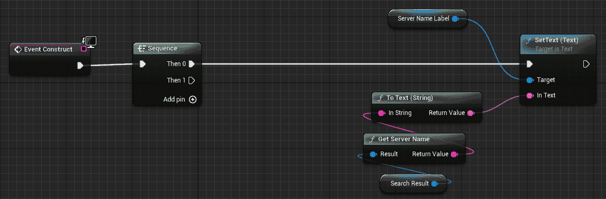

图 12.13 – 事件构造事件节点的第一部分

之前的图表只是从搜索结果数据中获取可用的服务器名称，并在相应的标签中显示它。我们将对连接的玩家数量做类似处理。为此，继续在同一图表上工作，并继续以下步骤。

1.  从**变量**面板，拖动一个**Get Num Players Label**节点和一个**Get Search** **Result**节点。

1.  从**Num Players Label**的输出引脚，点击并拖动以创建一个**SetText (****Text)**节点。

1.  将**SetText (Text)**节点的输入执行引脚连接到**Sequence**节点的**Then 1**执行引脚。

1.  从**Search Result**的输出引脚，点击并拖动以添加一个**Get Current Players**节点。重复此步骤，但这次添加一个**Get Max** **Players**节点。

1.  在**B**引脚的输入字段中添加一个`/`字符。

1.  将输入引脚**C**连接到**Get Max Players**节点的**Return Value**。这将自动添加一个转换后的节点。

1.  将**Append**节点的输出引脚连接到**SetText (Text)**节点的**In Text**引脚。这将自动创建一个**To Text (String)**节点，该节点会将文本转换为正确的类型。

此部分图表将看起来像*图 12**.14*：

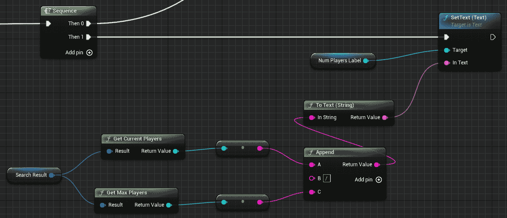

图 12.14 – 事件构造事件节点的第二部分

此小部件现在已完成，并包含显示会话信息和加入会话的所有逻辑。

我们现在将创建第三个小部件，它将允许我们在网络上搜索可用的会话。

## 创建**FindSessions**小部件

**FindSessions**小部件将具有以下功能：

+   让玩家通过点击按钮来查找可用的会话

+   显示可用会话的列表

+   如有需要，显示信息消息

我们必须做的第一件事是创建实际的小部件。因此，在内容浏览器区域，执行以下操作：

1.  右键单击并选择**用户界面** | **Widget Blueprint**。在出现的弹出窗口中，选择**User Widget**。

1.  将新创建的小部件命名为`WB_FindSessions`，双击它以打开。

如同往常，你将首先向小部件添加视觉元素。

### 添加视觉元素

一旦编辑器打开，选择**Designer**面板并按照以下步骤操作：

1.  从`FindSessionsPanel`。

1.  从**Background**

1.  设置其`(0, 0,` `0, 0.4)`

1.  在按住*Ctrl*和*Shift*键的同时，点击**Anchors**下拉菜单并选择右下角的按钮，使背景扩展到**Canvas**面板的整个区域。

1.  从**Container**

1.  在按住*Ctrl*和*Shift*键的同时，点击**Anchors**下拉菜单，并选择右下角的按钮，使背景扩展到**Canvas**面板的整个区域。

到目前为止，您已经创建了小部件的容器 – 没有什么花哨的，但完全功能。小部件层次结构可以在*图 12*。15*中看到：

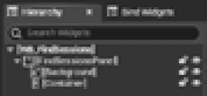

图 12.15 – 部分 FindSessions 小部件层次结构

现在，我们将添加允许玩家查找网络会话的工作元素。

1.  从`FindSessionsBtn`

1.  设置其`10.0`

1.  确认**是变量**复选框被选中

1.  从`FindSessionsLabel`

1.  设置`查找会话`

1.  从`Separator`

1.  设置其`10.0`

1.  从`SessionsScrollBox`

1.  设置其`10.0`

1.  设置其**大小**属性为**填充**

1.  确认**是变量**复选框被选中

1.  从`SessionMessage`中勾选`10.0`

1.  将**文本**属性设置为**无****会话可用**

小部件的最终结构显示在*图 12*。16*中：

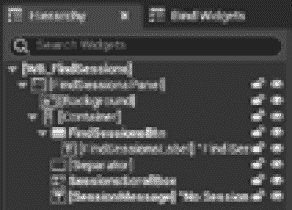

图 12.16 – 最终 FindSessions 小部件层次结构

小部件的**设计**视图显示在*图 12*。17*中：

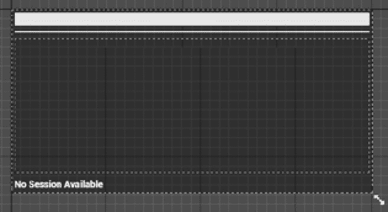

图 12.17 – 最终 FindSessions 小部件设计视图

使用这种布局，玩家将能够点击**查找会话**按钮来搜索网络中的可用会话，并在可选择的列表中显示它们。您现在需要打开**图**面板并添加一些可视化脚本逻辑。

### 实现可视化脚本逻辑

这部分将比其他部分复杂一些，因为会有很多事情发生；特别是，代码逻辑必须执行以下操作：

+   在局域网中搜索可用网络

+   通过**SessionItemRenderer**小部件显示可用会话的列表

+   显示错误消息

+   根据情况启用和禁用搜索按钮

作为第一步，我需要您检查在**变量**面板中，有三个引用您将使用的项目：**FindSessionBtn**、**SessionMessage**和**SessionScrollBox**。然后，按照以下步骤操作：

1.  添加一个名为`SessionResults`的新变量，类型为**蓝图会话结果**，并将其设置为**数组** – 这将包含在网络上找到的会话列表。

1.  选择**FindSessionBtn**，在**事件**面板中，通过点击对应元素旁边的**+**按钮添加一个**On Clicked**事件。

1.  将**On Clicked (FindSessionBtn)**的输出执行引脚连接到一个具有两个执行引脚的**序列**节点（即默认的）。

现在，为了保持整洁，您将创建一些函数来执行一些小操作：

+   **AddItemRenderer**向列表中添加会话项

+   **EnableSearchButton/DisableSearchButton**根据情况使搜索按钮可交互或不交互

+   **GetSessionResultMessage**来组成搜索的结果消息

让我们现在创建这些。

#### 创建 AddItemRenderer 函数

我们将从第一个函数开始，通过在 **My Blueprint** 窗口的 **函数** 部分的 **+** 按钮上点击。按照以下步骤操作：

1.  将函数命名为 `AddItemRenderer`，在 `SearchResult`

1.  在函数节点被选中时，查找 **My Blueprint** 窗口的 **图** 部分并将 **访问修饰符** 设置为 **受保护的**

1.  在图中添加一个 **获取玩家控制器** 节点。

1.  在图中添加一个 **创建小部件** 节点，并执行以下操作：

    +   将其传入执行插针连接到 **Add Item Renderer** 函数节点的传出执行插针

    +   从 **类** 插针的下拉菜单中选择 **WB_SessionItemRenderer**

    +   将 **拥有玩家** 插针连接到 **Get Player** **Controller** 节点的 **返回值**

    +   将 **搜索结果** 插针连接到 **Add Item Renderer** 函数节点的 **搜索结果** 插针

1.  从 **变量** 面板将 **Get Session Scroll Box** 节点拖动到图中。

1.  在图中添加一个 **添加子节点** 节点，并执行以下操作：

    +   将其传入执行插针连接到 **创建** **小部件** 节点的传出执行插针

    +   将 **内容** 插针连接到 **创建** **小部件** 节点的 **返回值** 插针

    +   将 **目标** 插针连接到 **Session Scroll Box** 获取器节点

**AddItemRenderer** 函数的最终图示如 *图 12*.18* 所示：

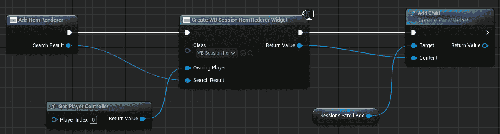

图 12.18 – AddItemRenderer 函数

现在我们可以开始创建一个函数，当请求时启用搜索按钮。

#### 创建 EnableSearchButton 函数

让我们从在 **My Blueprint** 窗口的 **函数** 部分的 **+** 按钮创建函数开始。按照以下步骤操作：

1.  将函数命名为 `EnableSearchButton`，在函数节点被选中时，查找 **My Blueprint** 窗口的 **图** 部分并将 **访问修饰符** 设置为 **受保护的**。

1.  从 **变量** 面板拖动一个 **FindSessionsBtn** 节点。

1.  在图中添加一个 **设置启用状态** 节点，并执行以下操作：

    +   将其传入执行插针连接到 **启用搜索按钮** 函数节点的传出执行插针

    +   将 **目标** 插针连接到 **Find Session** **Btn** 获取器

    +   打开 **启用** **状态** 复选框

此函数的最终图示如 *图 12*.19* 所示：

图 12.19 – EnableSearchButton 函数

将要禁用按钮的函数几乎与上一个函数相同，所以让我们创建它。

#### 创建 DisableSearchButton 函数

让我们从在 **My Blueprint** 窗口的 **函数** 部分的 **+** 按钮创建函数开始。按照以下步骤操作：

1.  在函数节点被选中时，查找 **My Blueprint** 窗口的 **图** 部分并将 **访问修饰符** 设置为 **受保护的**。

1.  从**变量**面板中，拖动一个**FindSessionsBtn**节点。

1.  在图中添加一个**设置启用**节点，并执行以下操作：

    +   将其输入执行引脚连接到**启用搜索按钮**函数节点的输出执行引脚

    +   将**目标**引脚连接到**查找会话****按钮**获取器

    +   保持**是否启用**复选框未勾选

该函数的最终图示如*图 12.20*所示：

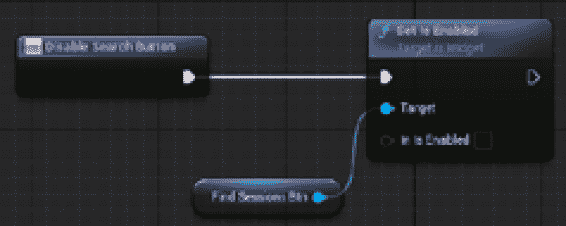

图 12.20 – 禁用搜索按钮函数

我们只需要一个最后的函数——一个将组成会话消息的函数。

#### 创建 GetSessionResultMessage 函数

首先，通过点击**我的蓝图**窗口中**函数**部分的**+**按钮来创建函数。按照以下步骤操作：

1.  将函数命名为`GetSessionsResultMessage`并执行以下操作：

    +   在选择函数节点后，查找`ReturnValue`；这将向图中添加**返回节点**。

1.  从**变量**面板中，拖动一个**获取会话****结果**节点。

1.  从**会话结果**获取器的输出引脚，点击并拖动以添加一个**长度**节点。

1.  添加一个`Found:`

1.  连接`sessions`

1.  将**追加**节点的输出引脚连接到**返回节点**的**返回值**；这将自动在之间创建一个**转换为文本（字符串）**转换器节点。

该函数的最终图示如*图 12.21*所示：

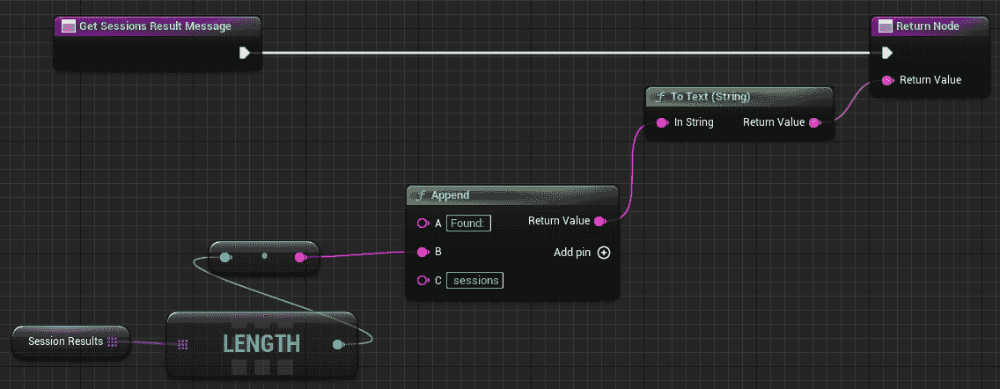

图 12.21 – 获取会话结果消息函数

最后一个函数已经创建完成，现在是时候回到主事件图并创建搜索和结果逻辑。

#### 实现事件图

主图需要在网络中查找可用的会话并在小部件列表中暴露它们。要开始这个视觉脚本逻辑，请按照以下步骤操作：

1.  定位到**点击（FindSessionBtn）**事件，并将一个**序列**节点添加到输出的执行引脚上。

1.  从**变量**面板中，拖动一个**SessionsScrollBox**节点，并从其输出引脚，点击并拖动以添加一个**清除****子节点**。

1.  将**清除子节点**的输入执行引脚连接到**序列**节点的**然后 0**的输出执行引脚。

1.  从**函数**面板中，拖动一个**禁用搜索按钮**函数，并将其输入执行引脚连接到**清除****子节点**的输出执行引脚。

1.  从**变量**面板中，拖动一个**Session Message**节点，并从其输出引脚，点击并拖动以添加一个**设置文本**节点（从**内容**类别）。

1.  将**设置文本**节点的输入执行引脚连接到**禁用****搜索按钮**的输出引脚。

1.  将**搜索会话...**插入到**设置文本**节点的**文本**字段中。

这第一部分的图表基本上从之前的搜索结果中清理会话列表，禁用搜索按钮以避免多次点击，并显示消息。这如图 *图 12.22* 所示：

图 12.22 – FindSessions 图的第一部分

图表的第二部分将负责搜索网络会话并显示实际结果。

1.  将一个 **获取玩家控制器** 节点添加到图表中。

1.  添加一个 `10`

1.  打开 **使用 LAN** 复选框以启用它

1.  从 **变量** 面板中，拖动一个 **设置会话结果** 节点，并将其输入执行引脚连接到 **Find** **会话** 节点的 **On Success** 执行引脚。

1.  从 **函数** 面板中，拖动一个 **Get Sessions Result** **消息** 节点。

1.  从 **变量** 面板中，拖动一个 **会话消息** 获取节点，并执行以下操作：

    +   从其输出引脚，点击并拖动以添加一个 **设置文本** 节点（来自 **内容** 类别）

    +   将其 **文本** 引脚连接到 **Get Sessions Result** **消息** 节点的 **返回值** 引脚

    +   将其输入执行引脚连接到 **设置会话** **结果** 节点的输出执行引脚

1.  从 **变量** 面板中，拖动一个 **获取会话结果** 节点。从其输出引脚，点击并拖动以添加一个 **For Each Loop** 节点。将 **For Each Loop** 节点的输入 **Exec** 引脚连接到 **Set Text** 节点的输出引脚。

1.  从 **函数** 面板中，将一个 **添加项目渲染器** 节点拖动到图表中，并执行以下操作：

    +   将其输入执行引脚连接到 **For Each** **循环** 节点的 **Loop Body** 执行引脚

    +   将其 **搜索结果** 引脚连接到 **For Each** **循环** 节点的 **数组元素** 引脚

1.  从 **函数** 面板中，将一个 **启用搜索按钮** 节点拖动到图表中，并将其输入执行引脚连接到 **For Each** **循环** 节点的 **Completed** 执行引脚。

这第二部分的图表在网络上查找可用会话列表，显示结果消息，并将结果添加到会话列表中。图表在 *图 12.23* 中展示：

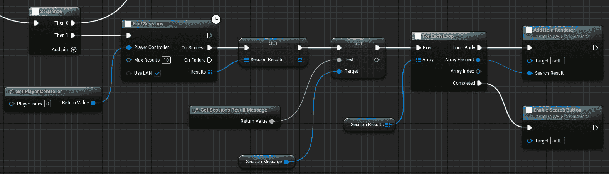

图 12.23 – FindSessions 图的第二部分

图表的最后一部分将在搜索结果失败时仅显示错误消息。

1.  从 **变量** 面板中，拖动一个 **会话消息** 获取节点，并从其输出引脚，点击并拖动以添加一个 **设置文本** 节点（来自 **内容** 类别）。

1.  在 `Error searching for` `available sessions`。

1.  将其输入执行引脚连接到 **Find** **会话** 节点的 **On Failure** 输出执行引脚。

1.  将其输出执行引脚连接到一个 **启用搜索按钮** 节点，使按钮可点击。

这一部分的图表是自我解释的，并在 *图 12.24* 中展示：

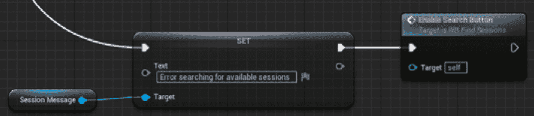

图 12.24 – 查找会话图的第三部分

我们终于完成了这个小部件，现在我们准备在 **主** **菜单** 小部件中组合这些内容。

## 创建主菜单小部件

**主菜单** 小部件 – 第四个也是最后一个 – 简单地充当 **创建会话** 和 **查找会话** 的容器。要创建它，请按照以下步骤操作：

1.  在内容浏览器区域内右键单击，然后选择 **用户界面** | **部件蓝图**。在出现的弹出窗口中，选择 **用户部件**。

1.  将新创建的小部件命名为 `WB_MainMenu` 并双击它以打开。

1.  从 **调色板** 窗口中，将一个 **画布面板** 项拖入 **设计器** 视图。

1.  从 **调色板** 菜单中，将一个 **WB 创建会话** 项拖到 **画布** 面板上，并将其放置在你认为合适的位置。

1.  从 **调色板** 菜单中，将一个 **WB 查找会话** 项拖到 **画布** 面板上，并将其放置在你认为合适的位置。

此小部件的 **设计器** 视图应类似于 *图 12.25* 中所示：

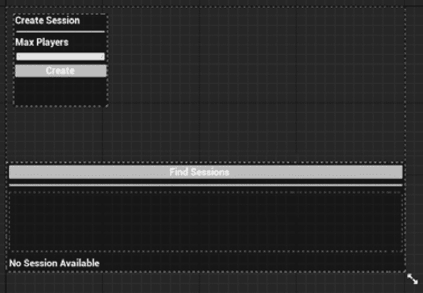

图 12.25 – 主菜单小部件

在本节中，您创建了主菜单级别的用户界面，它由可重复使用的部件组成。每个部件都包含用于创建会话和加入会话的专用逻辑。

# 摘要

本章向您介绍了 Unreal Engine 的在线子系统中的主要会话命令，为您提供了轻松创建、加入和管理多人游戏会话所需的工具。有了这些知识，您已经创建了一个利用这些功能并将其付诸实际应用的用户界面。

如果你想将你的多人游戏从只是一个基本的原型变成一个功能齐全且完整的游戏体验，那么你必须学习如何使用这些功能。相信我 – 拥有这些知识将大有裨益，并帮助你创建一些真正出色的多人游戏！

在下一章中，我们将使用这些有用的部件来创建游戏的主菜单。我们还将创建所需的 Gameplay Framework 类，以及一个用于自定义角色外观的酷炫系统！
