# 第十五章：添加 Epic 在线服务（EOS）

在开发多人游戏时，向整体体验中添加在线服务对于使玩家能够通过互联网与其他人连接和玩游戏至关重要。这对于需要大量玩家或由世界各地不同地点的人玩的游戏尤为重要。添加在线服务可以让玩家享受更社交的游戏体验，并增加游戏的总体乐趣和参与度。此外，它还允许游戏开发者收集玩家的数据和反馈，这对于改进游戏和修复出现的问题非常有用。

在本章中，我将向您介绍**Epic 在线服务**（**EOS**），这是一个为开发者提供创建、部署和运营高性能游戏体验工具的云平台。由 Epic Games 开发，这个强大的平台将所有现有技术和专业知识整合到一个统一系统中。凭借其可扩展的基础设施和高级功能，如分析和云托管能力，Epic Games EOS 允许开发者构建针对任何设备或操作系统的最大性能优化的游戏。

在接下来的几节中，我将向您介绍以下主题：

+   介绍 EOS

+   访问开发者门户

+   开始使用 EOS SDK

# 技术要求

要跟随本章介绍的主题，您应该完成所有前面的章节，并理解其内容。

# 介绍 EOS

EOS（[`dev.epicgames.com/en-US/services`](https://dev.epicgames.com/en-US/services)）是一套强大的服务和工具集，旨在帮助开发者创建尽可能沉浸式的在线体验。使用 EOS，开发者可以轻松管理用户身份验证、匹配、排行榜、成就等——所有这些都可以从一个集中的系统中完成。无论您是在开发 MMO 游戏还是具有多人模式或排行榜等在线功能的单人游戏，EOS 都有为每个希望将游戏提升到更高水平的开发者提供的东西。有一点需要提及的是，所有服务都是免费使用的，即使您没有 Epic Games 账户也是如此。

EOS 可以分为三个不同的服务集合：

+   **游戏服务**，涵盖多人功能，如会话、大厅或成就

+   **账户服务**，涵盖玩家身份，如身份验证和资料处理，以及好友管理

+   **商店服务**，涵盖 Epic Games 商店交易，包括目录管理和验证

游戏服务也可以与任何身份提供者一起使用，例如 Discord、Steam、Google，当然还有 Epic Games；这意味着玩家不需要 Epic Game 账户就可以访问这些服务。另一方面，账户服务和商店服务只能与 Epic Games 账户一起使用。

注意

如果您有所疑问，EOS 不包括用于托管专用服务器（就像您在*第十四章*，*部署多人游戏*）的云机器。要在云中托管您的服务器，您需要使用诸如**亚马逊网络服务**（**AWS**）或**微软 Azure**等服务。官方 Epic Games 文档有关于此主题的专用部分，可以在以下网页上找到：[`docs.unrealengine.com/5.0/en-US/unreal-engine-cloud-deployments/`](https://docs.unrealengine.com/5.0/en-US/unreal-engine-cloud-deployments/)。

EOS 可通过**Epic Games 开发者门户**访问，这是一个基于浏览器的工具，使用户能够通过一系列开发者资源配置和设置他们的游戏。除了 EOS，开发者门户还提供管理您可能在 Epic Games Store 中提供的游戏的功能。

成功注册开发者门户账户后，您将获得管理您产品的能力，配置服务，并为身份提供者和可用平台建立设置。开发者门户内提供的其他功能包括用户更新游戏信息，为玩家提供支持，管理游戏财务，以及访问使用报告和统计数据。

值得注意的是，开发者门户旨在实现跨平台兼容，为开发者提供在多种不同平台（如游戏机、桌面和移动设备）上部署游戏的能力，同时利用单一服务来管理所有这些平台上的游戏玩法。这种功能有助于为这些不同平台上的玩家提供一致且无缝的体验。

注意

由于开发者门户和 EOS 都是基于网络的，它们始终处于开发状态。因此，可能会遇到以下章节中描述的功能和功能的不一致性或变化。尽管存在任何差异，您仍然应该能够有效地导航并参与这些服务，并且对整体体验的干扰最小。

由于 EOS 本身是一个庞大的主题——并且不仅仅是为 Unreal Engine 设计，而是与许多开发者平台一起使用——对其有全面的理解超出了本书的范围；然而，在以下章节中，我将指导您了解开发者门户、EOS 及其特性的主要部分，这样您就有了一个坚实的基础，可以在游戏中使用它们。

首件事是开始创建您自己的组织，以便您能够访问云服务中所有可用的功能。

# 访问开发者门户

在本节中，我将指导您创建一个开发者门户账户，以便正确设置和管理您自己的项目，无论它们是否是多人游戏。您需要完成的步骤以使您的游戏准备就绪如下：

+   设置 Epic Games 账户（你应该已经有了）并为开发者门户创建一个组织

+   创建产品

+   配置产品

那么，让我们开始吧。

## 访问 Epic Games 开发者门户

为了访问和使用 Epic Games 开发者门户，你需要做的第一件事是创建一个**组织**——这是一个负责在 Epic Games 开发者门户中创建和拥有产品的团队。

首先，访问专门的网页，该网页可以通过此链接找到：[`dev.epicgames.com/portal`](https://dev.epicgames.com/portal)。使用你的 Epic Games 账户登录后，你将看到一个注册表单，你需要在此插入组织名称和电子邮件，如图*图 15.1*所示：

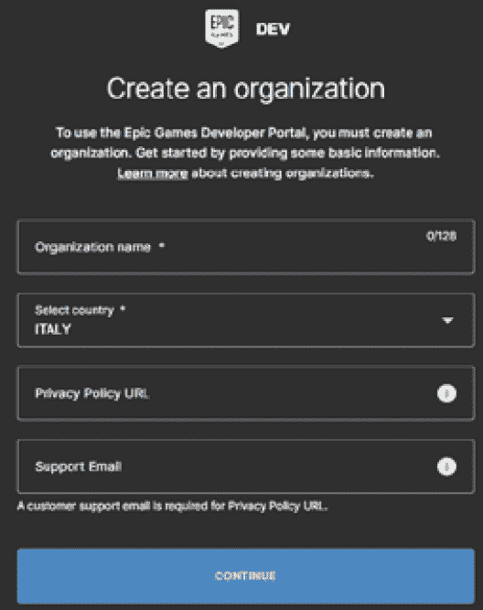

图 15.1 – 组织创建表单

注册完成后，你将获得访问开发者门户的权限，在那里你可以管理你的组织，下载 EOS SDK，创建你的项目，最重要的是，设置它们。

作为组织的创建者，你将负责为其设置所有必要的信息，例如如果你计划从你的游戏中获得一些收入，那么你需要提供税务和支付信息。

此外，除非你打算作为一个单打独斗者工作，否则你将能够邀请额外的成员加入组织本身。这个功能在**组织 | 成员**部分可用。每个成员都可以被分配一个角色，以获取访问组织中的某些或所有功能。你可以创建自己的角色，每个角色都有其自定义的访问级别，但 Epic Games 已经为你创建了一些；其中一些角色在此列出：

+   **管理员**：这个角色将授予成员访问门户中所有功能的权限。这是自动分配给组织创建者（即你）的角色。

+   **社区工具**：这个角色将使成员能够访问所有与社区相关的功能，例如游戏分析、账户和票务系统。

+   **支付**：这个角色将使成员能够访问所有与财务相关的部分，例如支付和报告。

如果你在一个游戏工作室工作——即使是一个小工作室——拥有这种成员访问权限对于使一切完美运行将非常重要。

一旦组织被正确设置并且你有一个组织良好的团队，接下来要做的事情就是创建你的第一个产品，无论是多人游戏还是其他任何东西。

## 创建产品

一旦你在一个组织中，你需要创建一个**产品**——这是一个包含一些 EOS 逻辑的游戏或软件项目。一旦创建了一个产品，它将被分配一个默认的**沙盒**，这是一个包含分发数据（如商店相关或特定部署信息）的开发环境。在撰写本书时，Epic Games 提供了以下默认沙盒：

+   **Dev**：用于在开发时编辑和配置产品

+   **Stage**：用于测试产品的就绪状态

+   **Live**：用于在 Epic Games Store 上分发产品

在沙盒中，你将能够创建一个或多个**部署**，这是一个特定的分发，将存储所有游戏玩法和玩家数据，例如成就和当前比赛。

例如，让我们想象你想为 Unreal Shadows 游戏实现一些服务，并且不想使事情过于复杂。首先，你需要创建一个专用产品，然后你将与一个沙盒一起工作；在沙盒中，你将根据需要使用上述部署环境。例如，参见以下：

+   在**Dev**环境中，你将进行项目开发和内部测试

+   在**Stage**环境中，你将测试游戏

+   在**Live**环境中，你将作为官方发布发行游戏

让我们现在想象一下，在你的游戏开发过程中，你（或游戏设计团队）决定添加一个新实验性功能，比如为所有玩家提供语音聊天。你将创建一个新的部署，称为**Dev-Experimental-VOIP**，并在内部测试其功能。一旦这个功能稳定并准备好发布，你只需将其添加到你的**Stage**部署中，一旦足够稳定，就添加到**Live**部署中。

作为实际示例，我们将创建一个演示产品。在你的**开发者门户仪表板**中，点击**创建产品**按钮，如图*图 15.2*所示：

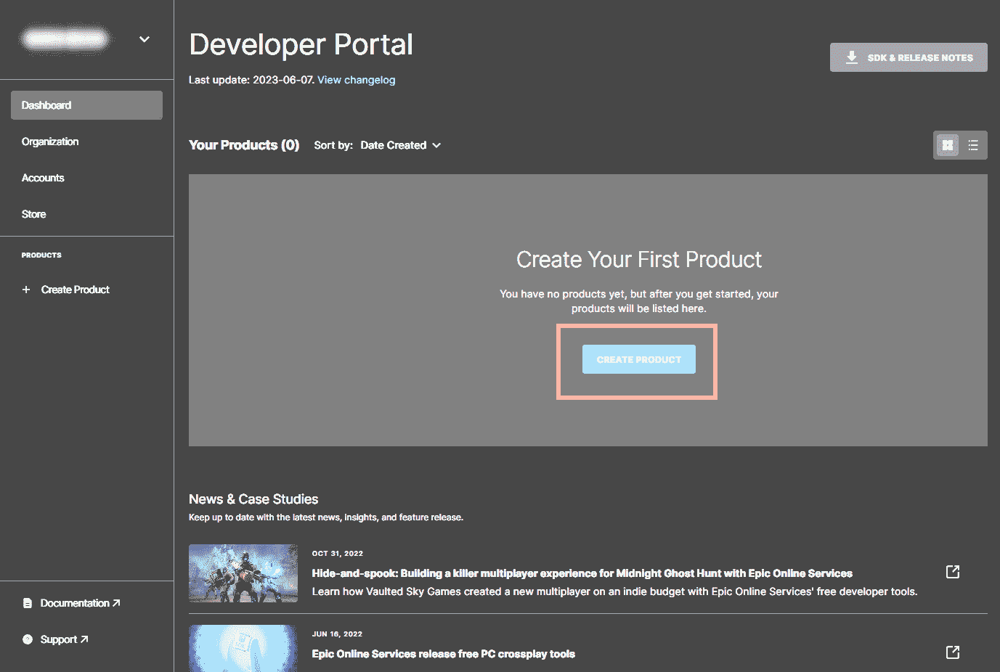

图 15.2 – 创建新产品

你将得到一个弹出窗口，其中你需要输入产品名称。在我的情况下，我选择了`EOS Demo`，如图*图 15.3*所示：

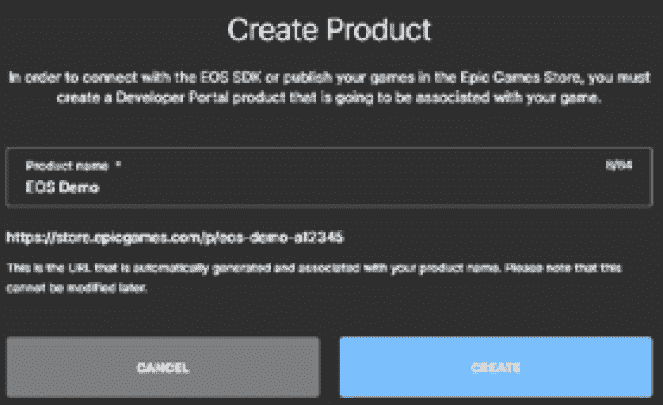

图 15.3 – 命名产品

注意

创建产品后，你将无法更改其名称，所以请谨慎选择！

如果这是您组织创建的第一个产品，您将需要审查一些与 Epic Games 相关的协议，涉及主题如商店分销和营销订阅者名单；仔细阅读它们，如果您同意条款，请点击**接受**按钮。一旦接受，您可能需要支付提交费；只需跳过这一步，因为它与 Epic Games Store 有关，与我们目前感兴趣的 Game Services 无关——一旦您决定在 Epic Games Store 上发布游戏，您可能需要它。

现在您已经创建了您自己的产品，您就可以进行下一步，配置您将要使用的服务。

## 配置产品服务

要访问您的项目页面，您只需点击您的产品链接——在我的情况下，是开发者门户中的**EOS 演示**产品链接——如*图 15**.4*所示：

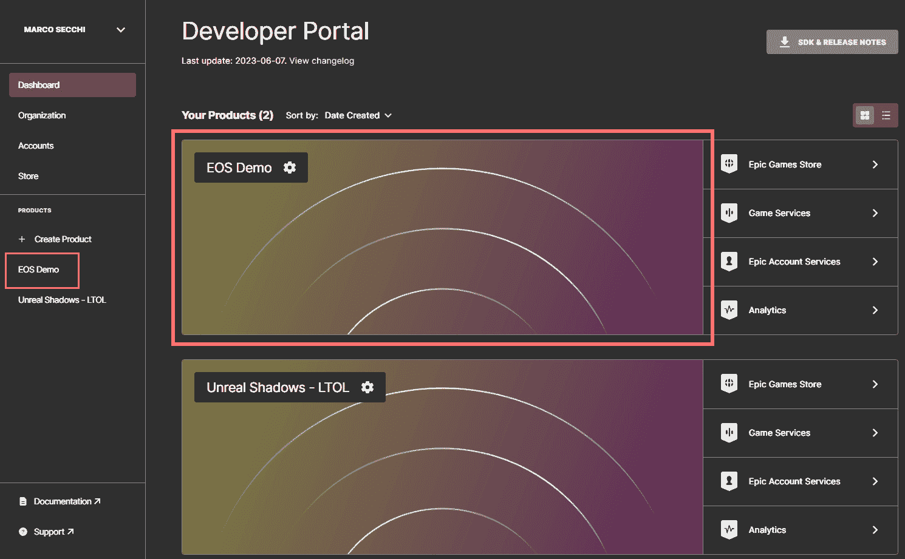

图 15.4 – 选择产品配置

一旦您进入产品页面，您可以通过点击**产品设置**来访问其设置，如*图 15**.5*所示：

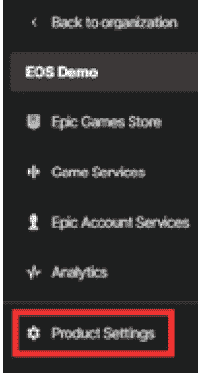

图 15.5 – 产品设置部分

现在，您可以为您的应用程序创建 EOS 客户端。

### 创建 EOS 客户端

在 Epic Online Services 的上下文中，术语**客户端**指的是一个利用 EOS 特定产品功能的应用程序。这可以包括最终用户在其系统上运行的本地安装的游戏构建，由产品所有者维护的专用服务器，或任何需要访问 EOS 提供的后端服务的其他程序。每个客户端都将有自己的 ID 和用于身份验证的秘密密码。

每个客户端还将有自己的**客户端策略**，这将确定将要实施的功能的访问级别。这意味着，如果您使用 EOS 创建多人游戏，您的专用服务器将需要自己的 EOS 客户端，而玩家的客户端将有自己的专用 EOS 客户端。另一方面，如果您计划分发您游戏的监听服务器版本，您只需要一个 EOS 客户端用于您的游戏。

如果您对这个上下文中的“客户端”一词感到有些困惑，请不要担心——我第一次阅读官方 EOS 文档时也有同样的感觉！为了帮助理解，让我们实际创建一个客户端：

1.  点击主页面工具栏中的**客户端**链接，如*图 15**.6*所示：

图 15.6 – 客户端部分

点击**添加新客户端**按钮；这将打开**添加新客户端**窗口（稍后将在*图 15**.8*中展示）。

1.  在 `EOS` `演示客户端` 中。

1.  点击`EOS` `演示策略`。

1.  在**客户端策略类型**中，您可以选择预制的配置之一，或者创建一个自定义配置。在本例中，我选择了**GameClient**选项，这些选项配置为管理不受信任的客户端应用程序，因此将需要一个经过身份验证的用户。

1.  之前的选项将启用一系列附加选项，例如**排行榜**、**匹配**或**大厅**，您可以根据自己的需求进行更改。

1.  一旦您对客户端的配置满意，请点击**添加新客户端策略**，如图*图 15.7*所示：

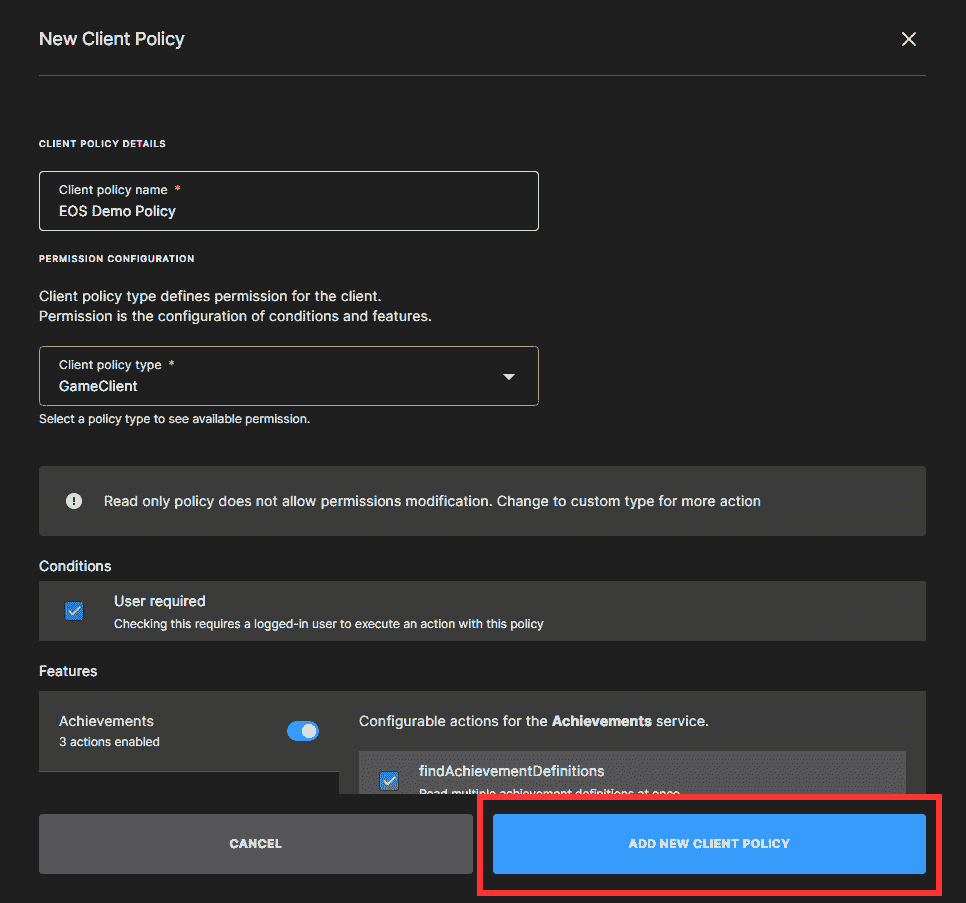

图 15.7 – 客户端策略创建

1.  一旦创建客户端策略，您将返回到客户端创建页面。点击**添加新客户端**按钮，如图*图 15.8*所示：

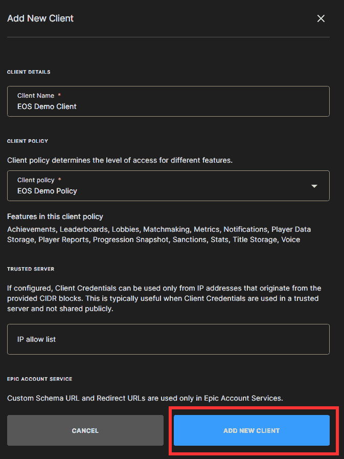

图 15.8 – 客户端创建

一旦创建客户端，您将返回到产品页面，您应该会看到列出的客户端和客户端策略，如图*图 15.9*所示：

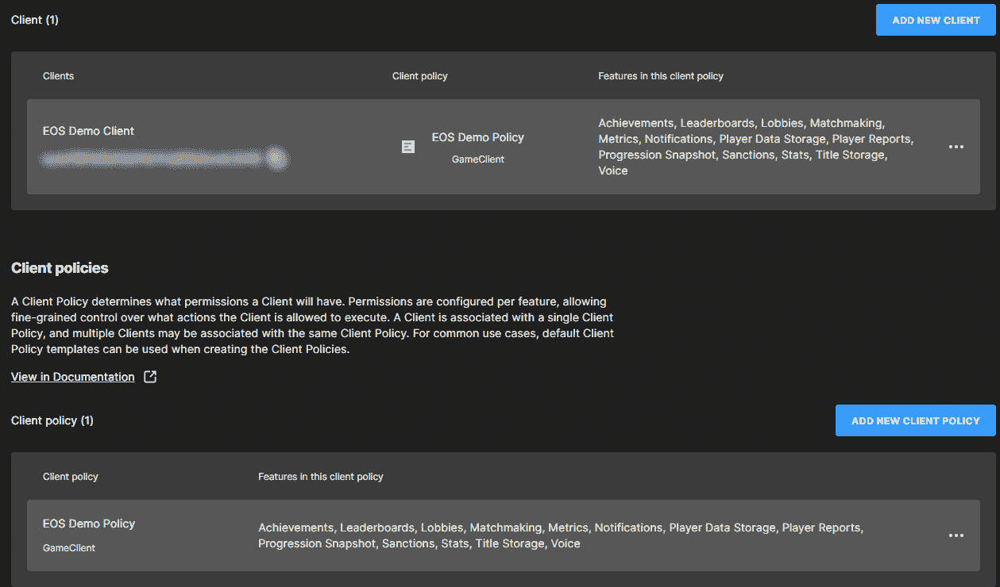

图 15.9 – 产品设置页面上的客户端和客户端策略

在**客户端**部分，您将注意到为该客户端启用的功能及其 ID，这些 ID 将在连接到服务时使用。

### 访问 Epic 账户服务

现在客户端已经创建，您需要访问产品页面上的**Epic 账户服务**部分，以便完成 EOS 配置。要访问此部分，请点击**Epic 账户服务**按钮，如图*图 15.10*所示：

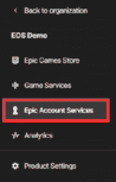

图 15.10 – Epic 账户服务部分

首件事是为客户端配置权限，因此请点击**EOS 演示**应用程序部分中的**权限**按钮，如图*图 15.11*所示：

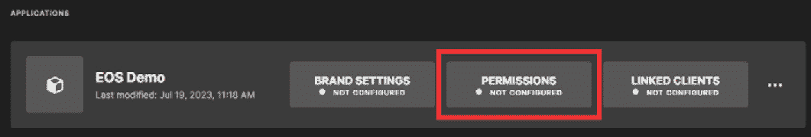

图 15.11 – PERMISSIONS 部分

除非您想添加一些自定义配置，否则只需点击**保存更改**按钮，以初始化权限配置。这将设置此部分为**已配置**，如图*图 15.12*所示：

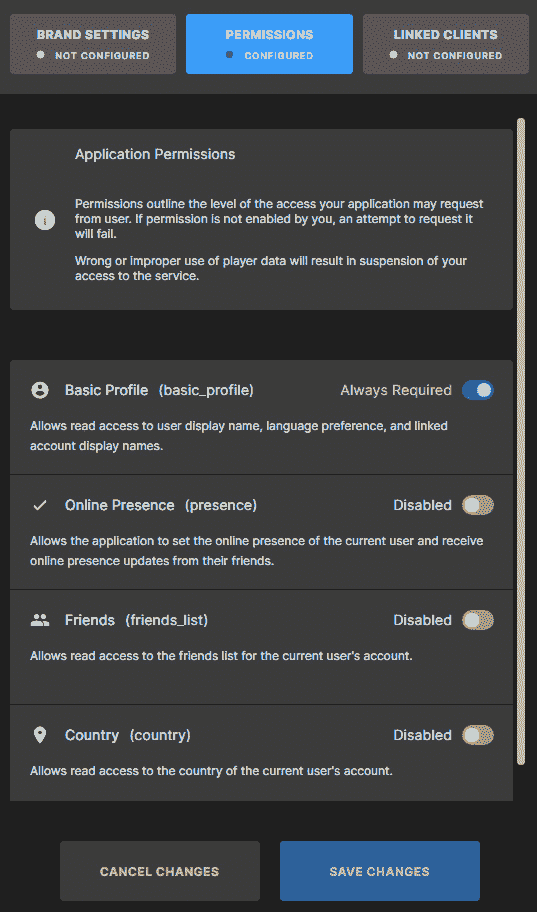

图 15.12 – 已配置的 PERMISSIONS 部分

接下来，您需要选择**链接客户端**部分，以便设置之前创建的客户端为所选客户端。一旦您进入**链接客户端**部分，您只需从下拉菜单中选择您的客户端 – 在这种情况下，**EOS 演示客户端** – 并点击**保存更改**按钮。这将设置此部分为**已配置**，如图*图 15.13*所示：

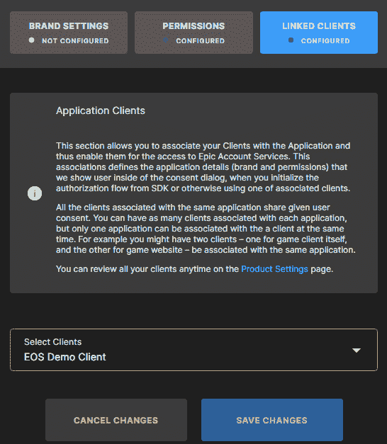

图 15.13 – 配置好的链接客户端部分

**品牌设置**部分可以在开发阶段保持未配置，因为它只有在您进入发布阶段并且您的应用程序需要由 Epic Games 审查和批准时才需要。

完成此操作后，您的应用程序就准备好了，EOS 可以与您的游戏或应用程序连接。

在本节中，您已经了解了 Epic Games 开发者门户及其在线服务。如您所见，您将需要访问该门户以初始化和配置您将在游戏中实现的所有云功能。在下一节中，我将简要介绍您将在游戏中使用的工具，以及如何将其集成到 EOS 环境中。

# 开始使用 EOS SDK

**EOS SDK**是一个独立于任何特定游戏引擎的工具，为开发者提供访问多个跨平台服务的能力，这些服务可以集成到他们的游戏中。根据所使用的游戏引擎，将 EOS SDK 集成到游戏中的集成选项水平可能会有所不同。尽管如此，集成方法由开发团队自行决定，他们甚至可以使用集成选项的组合。

为了开始使用 EOS SDK，您必须：

+   从开发者门户下载

+   将其集成到您的游戏中

在本节中，我将简要介绍如何获取 SDK 以及如何在项目中集成它的基本概念。

## 下载 EOS SDK

要下载 SDK，请转到您的**开发者门户仪表板**页面，并点击**SDK & 发布说明**按钮，如图*图 15.14*所示：

图 15.14 – 下载 SDK 按钮

如前所述，SDK 旨在针对多个开发者平台，因此您将获得多个下载选项（即 C、C#、iOS 或 Android 的 SDK），如图*图 15.15*所示：

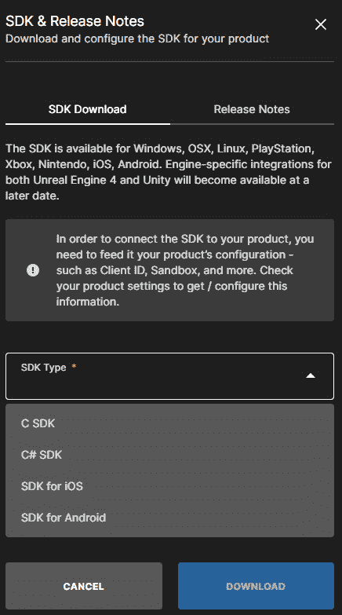

图 15.15 – 下载选项

选择您首选的平台后，下载将开始。一旦完成，您就可以开始将 SDK 与您自己的应用程序集成。

## 将系统集成到您的游戏中

无论您决定使用哪个游戏引擎，您都可以在您的游戏中完全使用 EOS SDK！您需要做的所有事情——在开发者门户中配置产品并下载 SDK 之后——就是将集成代码写入您选择的游戏引擎中。

如果您计划将 SDK 与 Unreal Engine 项目集成，有两种方法可以集成 EOS SDK：

+   使用 EOS **在线子系统**（**OSS**）插件

+   使用第三方插件或自己编写一个

让我们来看看这两种选项。

### 使用 EOS 在线子系统

正如您在*第十二章**，管理多人会话*中已经看到的，Unreal Engine 中的 OSS 是一个工具，通过一系列插件提供了一种统一的方式来访问不同在线服务提供的众多在线功能。这包括 Xbox Live、Steam，最后是 Epic Online Services - 通过专门的 EOS OSS 插件 - 使其在支持多个平台或在线服务的游戏开发工作流程中具有极大的价值。考虑到这一点，您将能够在 Unreal 编辑器中轻松配置您游戏的 EOS 设置，而无需编写代码。

要访问 EOS OSS，您需要在 Unreal Engine 中启用插件。这相当容易实现。一旦您打开了您的 Unreal Engine 项目，您只需做以下事情：

1.  从主菜单中选择**编辑 | 插件**。

1.  启用**在线子系统 EOS**和**EOS 共享**插件。

1.  重新启动 Unreal Engine 以初始化插件。

一旦插件已启用，您将需要设置您的项目，将其与您之前创建的 EOS 产品连接。这个设置相当长，但相当直接；您可以在官方文档中找到如何操作的说明，文档链接为：[`docs.unrealengine.com/5.1/en-US/online-subsystem-eos-plugin-in-unreal-engine/`](https://docs.unrealengine.com/5.1/en-US/online-subsystem-eos-plugin-in-unreal-engine/)。您还可以找到有关 OSS 插件的更多信息，这超出了本书的范围。

值得注意的是，在撰写本书时，EOS SDK 的一些接口尚未在 EOS OSS 插件中开发，因此它们将不会作为默认选项提供。以下是不再可用的接口：

+   反作弊界面

+   报告界面

+   处罚界面

+   自定义邀请界面

这意味着如果您的游戏需要这些功能，您将不得不编写自己的插件，或者使用第三方插件。

### 使用第三方插件

如前所述，将您的游戏与 EOS SDK 集成的另一种方法是开发自己的 Unreal Engine 插件。

注意

EOS SDK 需要在插件内部初始化 - 在您的项目中编写自己的实现可能会导致意外的行为或某些界面根本无法工作。

在 Unreal Engine 中开发自己的插件是磨练技能并将其提升到下一个水平的一种美妙方式。要开始，最好的建议是阅读官方文档，该文档详细描述了在 Unreal Engine 中开发和管理工作插件的过程。文档页面可以通过以下链接找到：[`docs.unrealengine.com/5.1/en-US/plugins-in-unreal-engine/`](https://docs.unrealengine.com/5.1/en-US/plugins-in-unreal-engine/)。

然而，如果你对插件开发感到不舒服，你可以利用虚幻引擎市场([`unrealengine.com/marketplace`](https://unrealengine.com/marketplace))并寻找商业解决方案。例如，有几款令人惊叹的集成工具，如由 Redpoint Games 开发的**EOS Online Subsystem**([`unrealengine.com/marketplace/en-US/product/eos-online-subsystem`](https://unrealengine.com/marketplace/en-US/product/eos-online-subsystem))和由 Betide Studio 开发的**EOS Integration Kit**([`unrealengine.com/marketplace/en-US/product/eos-integration-kit`](https://unrealengine.com/marketplace/en-US/product/eos-integration-kit))。两者都提供了与 EOS 的无缝集成，几乎所有的服务接口都暴露出来，以便使你的多人游戏开发更加容易和高效。

值得注意的是，这两个插件都提供某种形式的免费或开源许可，因此你可以尝试它们，以检查它们是否适合你。当然，购买它们将有助于开发团队维护插件并在未来添加新功能。

现在你已经对 EOS 有了基本的知识，是时候开始着手制作你即将成功的游戏，并将其与 Epic Games 提供的某些（或所有！）服务集成。

注意

要了解 EOS 附带的所有功能，你可以从检查这个网页上的官方文档开始：[`dev.epicgames.com/docs/epic-online-services`](https://dev.epicgames.com/docs/epic-online-services)。

# 摘要

在这本书的最后一章，我向你介绍了开发者门户和 EOS 平台。你访问开发者门户是为了创建自己的产品，并将其与任何类型的应用或游戏连接。你也看到了 EOS 应用程序的基本结构和如何使用一些基本和默认设置进行初始化。

最后，你已经了解到你可以将这些服务与任何开发平台集成，包括虚幻引擎；这可以通过使用官方的——但截至目前还不完整的——插件来实现；你也可以使用第三方集成系统，或者甚至可以自己编写代码，这样你就可以专注于你真正需要的功能。

正如你所猜想的，关于这个话题还有很多内容，而你只是刚刚开始触及这个环境的表面。我的最终建议是尝试使用这些服务，并探索 SDK 提供的所有接口。通过编写自己的代码进行实验，如果你足够勇敢的话——甚至可以创建自己的插件；我向你保证，如果你是一个游戏程序员，这将是非常有趣的事情！（但也许，这个话题最好留给另一本书来讨论！）

这就是《使用虚幻引擎 5 开发多人游戏》的结束。我很高兴与你分享我的知识和经验，并且我确信你现在知道如何为你的即将到来的玩家创建令人惊叹的多人游戏。

感谢您与我一同踏上这段旅程，愿您的项目好运连连！
