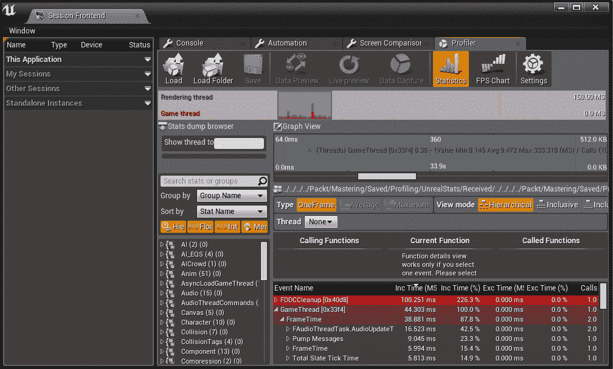
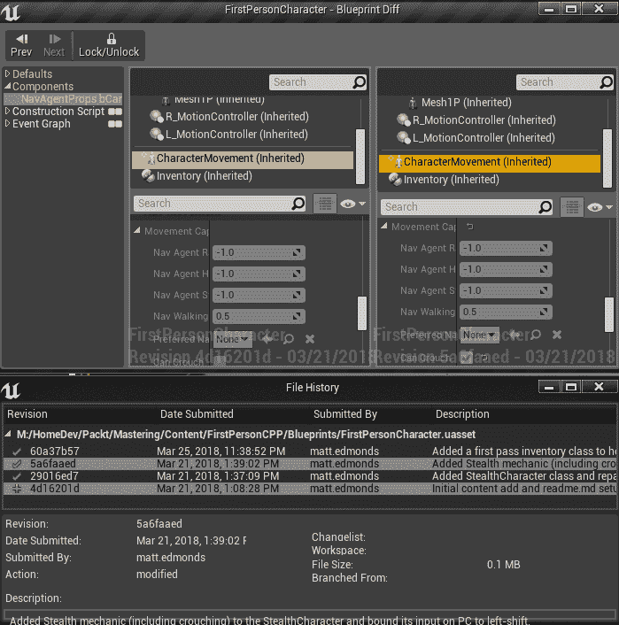
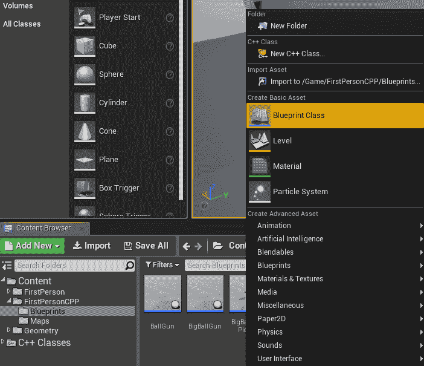
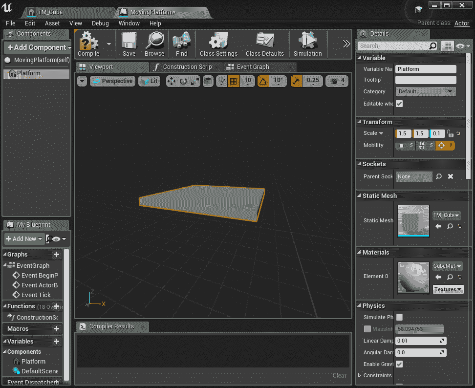
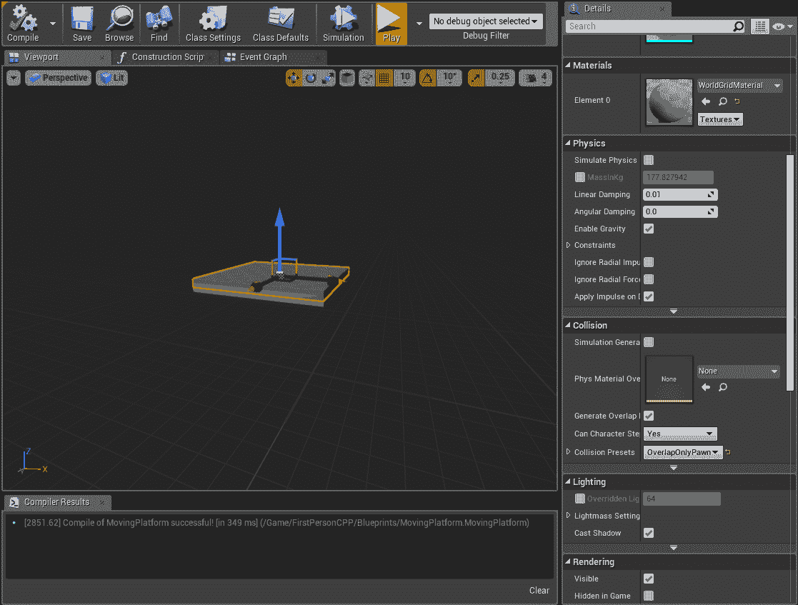
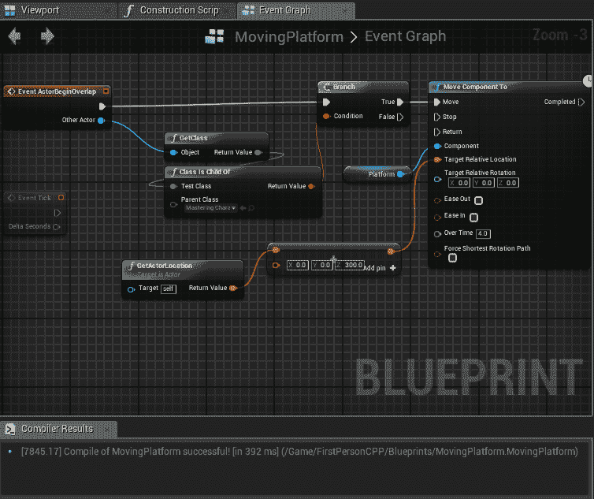
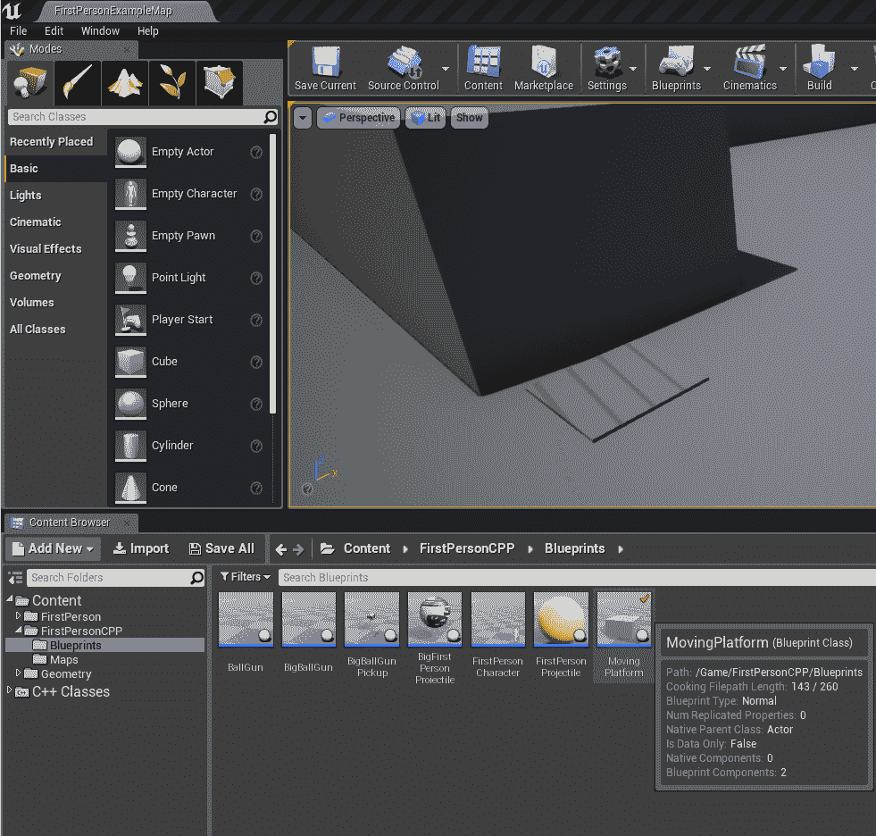
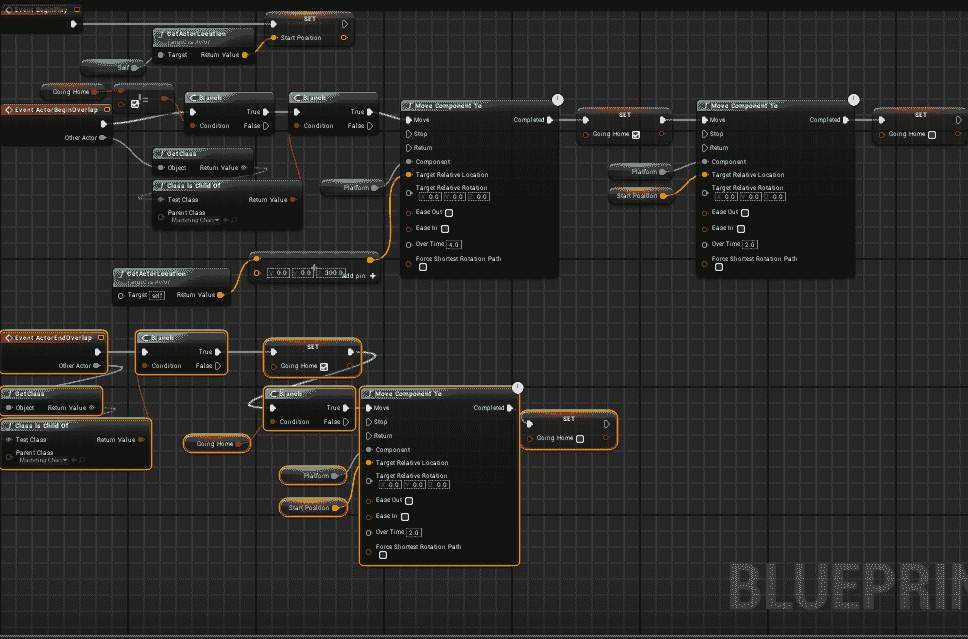

# 第三章：蓝图审查及何时使用 BP 脚本

# 简介

欢迎来到我们的下一章。这将是我们第一次从专注于 C++代码的焦点中跳出来，但不是最后一次。Unreal 拥有许多具有强大功能且无需编写代码即可从编辑器访问的系统。最灵活且与实际编写代码最紧密相关的是在这里探索的，深入探讨 UE4 的蓝图系统和其功能与局限性。到目前为止，我们的大部分工作都是用 C++实现事物，并尽可能展示这些是如何作为编辑器中的蓝图对象进行交互的。蓝图的功能远不止于此，包括制作整个游戏。在本章中，我们将涵盖：

+   蓝图审查/概述

+   仅使用蓝图的游戏，优缺点

+   使用蓝图编写对象（电梯）

+   蓝图技巧与窍门

# 技术要求

如同上次，本章的工作将通过利用第二章，*玩家的库存和武器*中完成的内容来完成。然而，这并不是严格必要的，这里的内容应该可以使用第一章，*为第一人称射击游戏创建 C++项目*的项目或甚至是一个新的 UE4 模板来实现。

如同往常，本章的 GitHub 分支如下：

[`github.com/PacktPublishing/Mastering-Game-Development-with-Unreal-Engine-4-Second-Edition/tree/Chapter-3`](https://github.com/PacktPublishing/Mastering-Game-Development-with-Unreal-Engine-4-Second-Edition/tree/Chapter-3)

使用的引擎版本：4.19.0。

# 蓝图审查和仅使用蓝图的游戏

合理地提出问题：究竟什么是“蓝图”？实际上有两个主要领域需要关注。第一个我们在之前已经涉及并使用过：将 C++类与 UE4 编辑器集成。在编辑器中使用的类通常在某个级别上派生自`UObject`，这使得它们可以利用诸如`UPROPERTY`和`UFUNCTION`宏等特性，从而允许这些类通过蓝图实例访问，例如`StealthCharacter`。除了少数基本几何形状和其他基本游戏对象外，几乎所有直接放置在关卡中的内容，无论是你自己、设计师还是艺术家，都将是一个蓝图类的实例，例如现在关卡中的我们的角色。另一个需要关注的是每个项目都应该根据其需求评估的领域是**蓝图可视化脚本**（**BVS**）系统。几乎所有你能在 C++中想到的游戏玩法概念在蓝图脚本中都是可能的。它还集成了你可以在运行时使用断点调试的调试器。在这里，我们将更深入地探讨这些概念，并查看脚本的优势和局限性。

# 蓝图概述

正如我们在前几章中多次展示的那样，在许多相同类类型的实例中公开将要迭代的变量或使变量独特化的优势相当明显：这些变量可以在编辑器运行时被没有任何编程知识的创作者修改。特别是系统设计师依赖于公开正确的变量，以便他们可以快速调整和构建系统的变体，并同样快速地进行测试。这意味着从 C++作为 FPS 模板开始，几乎完全这样做，改变这些值在最好的情况下需要编译并在编辑器中执行热重载游戏，在最坏的情况下则需要关闭编辑器、构建并重新启动它。这与下一段讨论的蓝图脚本类似，蓝图在游戏中的许多公开和利用最终都取决于你团队和项目的需求。如果你的游戏类的设计几乎肯定在整个项目过程中不会改变或只会发生非常小的变化，并且你有足够的 C++程序员作为资源，那么以像 FPS 模板中为我们启动的角色那样非常直接的方式完成任务可能是有意义的。然而，如果你有设计师（系统级或其他）急于开始构建各种游戏对象，并且不断更改它们，添加新的变体，并在关卡中快速测试这些对象，那么你能给予他们的蓝图灵活性越多，就越好！如前所述，在最基本层面上，蓝图类是优秀的数据容器：即使设计师或艺术家永远不会使用它们，程序员也能直接受益于在编辑器中访问并经常修改尽可能多的数据，同时保持编辑器中的上下文。迭代时间是瞬间的，你总是可以检查你的值，而无需从编辑器切换到 Visual Studio 或其他窗口。当然，有一些敏感的、关键的价值你可能不希望任何人随意从蓝图中进行修改，但使用`UPROPERTY`标志，如`BlueprintReadOnly`，你可以轻松地让人们查看当前设置的属性，同时防止某人意外修改它并保存一个不良的值。希望这里已经充分说明了这一点，即除了确保你让没有经验的人不要更改关键数据之外，公开任何可以在编辑器中以`UPROPERTY`类型查看的有趣变量几乎没有任何缺点。

现在，让我们转向视觉脚本。到目前为止，在我们的项目中这部分内容完全未被触及，但在下一节（*蓝图脚本和性能*）中，我们将通过一个充分利用的示例来改变这一状况。对于那些刚开始使用蓝图脚本的人来说，即使完全不使用它，也可以制作整个游戏，所以请不要担心，在那一节中会有很多截图和直接的工作内容。不过，现在，我们只是从高层次上讨论使用脚本的能力和缺点。首先，在蓝图脚本中你能做哪些主要的事情呢？

+   游戏逻辑：包括`for`/`while`循环、使用大多数类型的局部和类变量，以及访问现有 UE4 类中的大量函数。

+   游戏机制：世界中对象之间的交互、碰撞响应、移动，甚至路径查找。

+   访问可共享的蓝图函数库：这些是你可以用 C++或蓝图脚本编写的无状态/静态实用函数组，你可以与不同的团队或项目共享。

+   可以轻松地与 UMG 编辑器中的 UI 集成，这对于 UI/UX 设计师的工作流程通常至关重要。

+   无需重新构建任何可执行文件或代码，并且可以轻松地将一个对象引用到另一个对象：正如将在紧接着本节之后的章节中讨论的，你可以（并且人们确实这样做）仅使用脚本进行逻辑来制作整个游戏。

听起来很棒，对吧！？好吧，在你认为接下来会有一个非常大的*但是*出现之前，让我们先明确一点：蓝图脚本*确实*很棒，而且功能强大。以下是一些需要注意的缺点列表，但与那些投入时间和精力去熟悉和适应它的团队相比，这些缺点总体上非常小：

+   性能成本可能相当显著：通常可以最小化这些成本，但分析它们并确定问题区域更困难，并且需要与分析 C++代码以解决问题不同的技能集。

+   无法访问某些数据类型：C++只依赖于你的平台编译器设置，但蓝图必须能够在 UE4 支持的所有平台上（32 位和 64 位、移动、网页等）使用和访问。

+   调试可能会...出现错误：通常，你到达断点的上下文信息可能缺失，或者当你悬停在变量上时，某些变量可能不可用。调试器很棒，但当它不起作用时，你就得自己解决了。

+   任何人都可以修改或向蓝图添加内容：*任何人*！这意味着你的团队需要对谁可以修改哪些类型的内容有非常明确的角色定义，以防止没有专业知识的人引入难以找到的错误。

+   在 C++代码和蓝图脚本之间来回切换可能会分散注意力：通常，为了全面了解正在发生的事情，你需要从两者中获取数据，而切换上下文可能会减慢开发速度。

首先，简要讨论一些这些点以及如何减轻它们。对于性能分析，编辑器内置了一个非常好的工具，如果你还不熟悉，花点时间看看它能做什么。这是会话前端窗口中的 Profiler，可以通过开发工具下的窗口工具栏访问：



如果一个团队从一开始就注重跟踪性能，那么通常更容易追踪到发生了什么变化并导致了问题。但再次提醒，即使是改变一个变量的值也可能对性能产生不利影响，如果你使用了编译蓝图，可能没有简单的方法在版本跟踪历史中搜索这个变化。两种缓解这种状况的策略是将源代码控制集成到编辑器中，以及“本地化”蓝图。如果你有一个受支持的源代码控制包（这本书的项目使用 Git），你可以在编辑器中通过右键单击任何蓝图资产来启用源代码控制集成，在弹出窗口的底部有连接到源代码控制选项。

一旦设置好，你再次可以右键单击任何蓝图资产，例如 FirstPersonCharacter 及其不同版本：



有时寻找数据变化可能很困难（仔细看看，你会在上一张截图的 Can Crouch 处看到变化），但当它正确工作时，将脚本变化以视觉图表的形式并排显示，在追踪新变化可能引起的问题的地方非常有帮助。

在本章的“进一步阅读”部分可以找到关于为 Git 设置此功能的教程。在项目设置 | 打包 | 蓝图下可以启用蓝图本地化。这会将编辑器中的所有蓝图类转换为中间 C++类，并将它们打包到你的项目中。你可能有一些这样做的原因。如果你的项目在理解为什么某些蓝图没有按预期工作时有困难，这是一个可以实验的选项，但在这里我们不会进一步讨论这个选项。

最后，关于数据类型丢失的问题，使用蓝图函数库是完全可能的。你可以使用平台的本地（编译器）类型，并以蓝图可以使用的数据类型返回结果。例如，如果你有一些使用现有 UE4 `FDateTime`值的 UI，并想要它们之间的秒数差，在蓝图直接中这是不可行的，因为这些日期时间`structs`的值是本地`int64`格式。因此，你可以轻松地创建一个这样的函数，它从蓝图接收两个日期，本地进行数学运算（`ToUnixTimestamp`返回`int64`），然后以`int32`返回结果，蓝图可以访问（因此 UI 可以显示）：

```cpp
UCLASS()
class UDateTime : public UBlueprintFunctionLibrary
{
        GENERATED_BODY()

public:

        UFUNCTION(BlueprintPure, Category = "Date and Time")
        static int32 SecondsBetweenDateTimes(FDateTime time1, FDateTime time2);
```

然后是简单的 C++实现：

```cpp
int32 UDateTime::SecondsBetweenDateTimes(FDateTime time1, FDateTime time2)
{
        return time2.ToUnixTimestamp() - time1.ToUnixTimestamp();
}
```

因此，在 C++中，我们使用一种不允许在蓝图直接使用的类型，但这一点在所有现代 C++编译器中都适用。当然，如果日期相差非常远，在这个计算/截断过程中可能会丢失一些数据，但只要可以假设没有日期会接近这种分离程度的情况，这便是一个简单的解决方案，用于现在可以从蓝图中的任何位置访问的`int64`计算。

在之前提到的缺点列表之前，提到这些问题总体来说非常小，但请记住，这是在考虑蓝图赋予你的能力的情况下说的。例如，你可以设置一个多人游戏会话，让其他玩家搜索并连接到它，然后开始一起玩游戏，所有这些都可以通过仅使用 UE4 为你提供的几个现有蓝图节点来完成。这非常强大，对于一个不熟悉该工作流程的程序员来说，可能需要几天甚至几周的时间才能正确使用`FAsyncTask`任务和`OnlineSubsystem`调用，所有这些都是从`GameMode`或类似事件的正确触发中开始的。那么，这是 100%正确的做法吗？我们是否应该忘记整个 C++业务，只为你的项目使用这种方法？这就是我们接下来要讨论的。

# 仅蓝图的游戏——这适合你吗？

我们已经确定，任何游戏在某种程度上都需要蓝图，而蓝图脚本是一种非常强大的工具，在实现系统或可重用的组件时，它可以节省大量时间，否则这些组件可能需要用成百上千行 C++代码编写。我们现在也已经讨论了使用蓝图脚本的风险和缺点，但请记住，在一个仅使用蓝图的项目中，你必须接受这些选择。一旦遇到看似无法解决的问题，不得不向项目中添加多达一个新 C++类，那么，从后视镜来看，你或许从一开始就应该从基本的 C++项目开始，这是一个非常常见的结局。那些非常熟悉蓝图脚本及其局限性并在项目开始时就能在设计阶段就规避这些问题的团队可以提前规划好这些问题。如果你不确定在项目开始时是否能够完成游戏设计所需的所有工作，那么就使用 C++，然后你可以根据团队带宽和开发者的偏好，尽可能多地使用蓝图和 C++。但是，将一个非常大的仅使用蓝图的项目转换为 C++将在项目后期的工作流程中需要更多的工作。如果你在开发过程中更深入，添加 C++构建可能会对习惯于从未需要执行这些任务的团队造成很大的干扰和分心，所以，如果你不确定，就只从你的流程中开始使用 C++功能，并在两种系统之间以最优的方式平衡你的工作量。一个在一段时间内几乎没有任何 C++代码更改或添加的团队会发现，他们的工作流程与仅使用蓝图的项目一样，主要是快速迭代，但同时也拥有所有基础设施和工作流程，以便在需要时添加 C++。

iOS 开发者！如果你考虑长期（甚至整个项目）仅使用蓝图，有一个很大的原因：UE4 可以从 Windows PC 打包、运行和测试 iOS 设备构建，前提是它们仅使用蓝图。这可以快速证明 iOS 概念，或者在快速迭代游戏玩法想法时大幅减少构建时间。你最终仍然需要至少一台可以运行 Xcode 版本的 Mac，以及一个 Apple 开发者许可证，才能最终提交给苹果，但仅使用蓝图是一个快速证明你的游戏在 iPhone 或 iPad 上能做什么的好方法。

按照惯例，通常有两种类型的团队会希望仅使用蓝图：

+   没有人可以处理困难的 C++开发、问题或设置工作流程

+   对于设计非常简单，或者有一组非常经验丰富的蓝图开发者，他们知道其局限性

常常独立游戏团队会陷入这些问题的其中一些，再次强调，快速在蓝图下原型化一个游戏并没有什么错误，如果你发现你以后必须切换，这也是可以做到的。对于那些在几个不同团队中有些经验的人来说，始终要权衡前面提到的话题，并在尽可能的情况下明智地决定开始。

在进行了一些（甚至不是那么重要/重大的）C++工作之后，再回到仅使用蓝图的游戏可能会非常困难，甚至可以说是完全不切实际的过程。这也是一个很好的经验法则：一旦你打开了 C++的盒子，就不要有任何期望你会再次关闭它。

# 蓝图脚本和性能

到目前为止，我相信你一定可以想象到：我们确实谈了很多关于蓝图脚本的好处和坏处，以及仅使用蓝图的问题，但我们还没有坐下来实际制作一些东西来看看它如何运作，以及我们如何可以分析其性能。现在让我们这样做，并构建一个真实的游戏系统，我们可以用它来调查：在这种情况下，是一个游戏中的经典移动平台。

# 蓝图脚本示例 - 移动平台和电梯

如同你想象的那样，在所有这些讨论之后，这个类以及实现其游戏玩法的工作几乎完全在编辑器中完成（你始终有方法可以将 C++连接到蓝图，这将在结尾附近讨论）。所以，首先打开编辑器，进入内容浏览器标签，转到我们的内容 | FirstPersonCPP | Blueprints，然后右键单击，就像我们之前做的那样，创建一个新的类：



将蓝图作为父类，命名为 MovingPlatform。现在，我们有一个可以放置在我们世界中的完全裸骨演员，但当然它没有任何几何形状。让我们快速解决这个问题。在水平面上四处查看，你会看到两个灰色矩形框（不是白色框，但那些也可以正常工作）：点击一个，然后右键点击它并选择浏览资源 (*Ctrl* + *B*) （注意，你还可以在编辑大多数资源时在菜单栏下的资源中找到这个选项），现在你应该在内容 | 几何 | 网格下，并且 1M_Cube 被选中。所以，既然我们已经知道了如何找到这个简单的几何形状，让我们回到我们的 MovingPlatform 并双击它。你可能注意到，因为我们从一开始就将其作为蓝图类创建，你将自动获得完整的蓝图编辑器，而不是通常用于不使用脚本的本地类的那种最小界面，就像我们以前经常做的那样。对于我们的平台对象，我们现在需要添加一个组件。请注意，你只需添加一个简单的立方体或平面作为静态网格组件。这些功能可用真是太好了，再次强调，特别是对于快速原型设计。但是，为了熟悉工作流程，这是更典型的专业游戏的工作流程，我们将使用我们刚才查看的静态网格立方体。所以，在组件下拉菜单中输入以过滤或滚动以找到静态网格，并添加一个。现在注意在层次结构中，这个组件是如何添加到默认场景组件（命名为 DefaultSceneRoot）下的。一旦在我们的案例中有一个演员组件，它可以是我们的演员对象的根组件，默认设置实际上只是一个占位符。所以，将网格组件重命名为 Platform 并将其拖到场景组件的顶部以替换它。

现在，我们将进行两个快速操作来使这个平台看起来正确，点击网格组件，在其属性中的右侧，在静态网格 | 静态网格下选择 1M_Cube，这是我们之前找到的，然后点击变换 | 缩放右侧的解锁图标，事情应该就会开始整合：



我们现在可以将这些拖入我们的场景，但当然，除了阻挡我们的玩家之外，它不会做任何事情，因为步高太高，无法处理碰撞。你也会注意到它需要编译和保存，每当你在一个蓝图上取得进展时，这都是一个好的步骤，尽管如果它的脚本还没有准备好成功编译，显然要等到它准备好了。你可以保存并使用带有损坏脚本的蓝图，但它们的警告信息可能会非常分散注意力，并让人们注意不到其他可能至关重要的损坏蓝图问题。

然而，在我们真正使用和脚本化这个平台之前，我们还需要添加一个组件。虚幻引擎将（碰撞）和（接触）碰撞分开处理，在这种情况下，我们需要两者都有一点。因此，点击添加组件，这次我们只需从列表中选择一个立方体。注意它应该成为平台的父级，因此由于平台的比例传播到我们新的立方体，其大小是相同的。现在，通过在视图中沿 Z 轴拖动或在其变换中输入一个值将其抬起几厘米，直到你可以看到它已经在上方，但仍然基本上接触到我们的原始平台（我发现 Z 值为 50 适用于 5 厘米，因为我们的 Z 比例是 0.1）。现在，向下滚动直到你看到碰撞展开，并确保已选中生成重叠事件。在预设下拉菜单中点击，选择重叠 OnlyPawn，在渲染展开中，取消选中可见，因为我们不希望看到这个部件，因为它只是为了检测我们的角色是否在它上面行走。在平台组件的碰撞事件中，你可以将其保留为 BlockAllDynamic，并注意生成重叠事件是不相关的，因为碰撞事件优先于重叠，所以当项目或玩家撞击平台时，你会收到事件，但我们永远不会通过这些过滤器收到所需的重叠事件。



这就是点击此截图底部可见框之前一切应该看起来的样子。

最后，进行一些蓝图脚本编写！点击到事件图标签页，你会看到现有的事件被灰色显示，并带有有关如何启用它们的说明。在我们的情况下，我们想要重叠框。点击并从蓝色其他演员引脚（从现在起，我们只称之为从引脚拉出），你会看到一个我们可以添加的许多东西的列表，这些列表是按上下文排序的（只要复选框保持选中状态），并且可以接受演员作为输入，就像事件中的引脚那样作为输出。过滤`GetClass`，你会看到它已经被添加了。对于熟悉蓝图脚本的人来说，只需查看以下截图以了解进度。以下是添加`GetClass`后的步骤：

1.  拉取`Get Class`的返回值，并在列表中找到`Is Child Of`。现在它们应该已经连接。在`Is Child Of`框中，在其下拉菜单中选择我们的`MasteringCharacter`类作为类型，这样只有我们的玩家在这里给出真实的结果。

1.  从子组件中拉出红色结果引脚，然后过滤或查找分支，然后从演员开始重叠事件的白色三角形输出引脚中连接到分支的输入白色引脚。

1.  从分支的真实结果中拉出白色输出（指向右侧）引脚，并添加一个移动组件到块。

1.  从`MoveComponentTo`块的蓝色组件引脚向左拉，并输入以过滤`GetPlatform`（对我们根组件的引用）。

1.  从目标相对位置黄色图钉向左拉，并输入+或以其他方式在列表中过滤/滚动以找到向量+向量。

1.  从其左上角图钉拉出，并输入/过滤以获取 GetActorLocation，你可以将输入图钉留在该节点上为 self（这是我们想要的）。

1.  将底部向量的目的地设置为所需的值。在我的测试案例中，Z 值为 300 使我们与地图周围的其他大型灰色方块齐平。

TargetRelativeLocation 变量似乎命名得不太好，因为它想要的适当运动是一个世界位置。最后，在 MoveToLocation 节点上，将时间设置为任何你喜欢的值：这里设置为 4 秒，因为有点慢且无聊，但非常适合演示这一切都能正常工作：



不要忘记编译并保存。

注意，在编辑器模式下运行游戏将始终尝试在运行之前编译任何已编辑的蓝图（如果有错误，将在输出日志中给出错误），但它不会保存这些资产！你仍然需要在蓝图和级别编辑窗口中使用“全部保存”或 Ctrl + S 来保存！如果你直接通过 Visual Studio 关闭你的编辑器，甚至不会提示你保存任何未保存的级别或资产，所以当在编辑器中工作时，通常最好通过其窗口的 X 按钮关闭。

现在要展示这个功能，只需将我们的移动平台拖到地板上的某个位置，然后走过去踩上它。你就可以飞起来了！注意，如果你再次跳上跳下地踩它，它会带你飞得更高。我们很快会把这个东西做得更好，但现在，这是 GitHub 版本项目的良好检查点。在这里，你可以看到它在书籍项目地图中的位置（再次，通过将移动平台蓝图图标拖入主级别窗口本身）：



现在我们可以用类似的东西做很多很多其他的事情。可以添加各种逻辑，包括其他组件，使这个平台能够进行路径寻找导航，或者向世界中添加一个平台在级别蓝图中使用（从主编辑窗口，点击蓝图 | 打开编辑蓝图以访问可以相互引用的级别中的各个蓝图）。在这些领域可以完成大量非常有价值的工作。现在，我们将使平台在玩家离开时返回其起点，同样，当它到达运动的顶部时也是如此：



注意，这使用了添加到类中的几个蓝图变量，其中简短参考在*进一步阅读*部分中添加。简而言之，在左侧的 My Blueprint 标签页下。有添加新内容，在其下是变量。一旦添加一个，你就可以更改类型和默认值。在这里，我们在 My Blueprint | 变量下添加了一个重命名为 StartPosition 的变量，在右侧的详细信息下，将其类型设置为 vector，并添加 GoingHome 作为布尔值。你总是可以在蓝图脚本窗口中的 get/set 块中访问这些类型，就像 C++公开的变量一样。注意，除非你创建一个特定的访问器（这里有一个示例，它*不是*使用，但你可以实现），否则这些变量不能在 C++中访问：

```cpp
UFUNCTION(BlueprintImplementableEvent)
FVector GetStartPosition();

```

将其制作为一个蓝图可实现的事件，这意味着对于混合 C++/蓝图类，你可以在蓝图中将此作为事件类型函数添加，然后简单地让它返回 StartPosition。这样，仅定义在蓝图中的变量就可以被 C++访问。同样，为了使 C++中的本地函数能够像我们之前那样执行工作，请务必记住将 BlueprintCallable 作为`UFUNCTION`关键字，因为它们可以在任何你处于或使用实现它的类的实例时被蓝图访问。预告：在下一章中，我们将做很多这样的事情，第四章，*U.I. 必需品：菜单、HUD 和加载/保存*，类似于以下内容：

```cpp
UFUNCTION(BlueprintCallable, Category="Appearance")
void SetColorAndOpacity(FSlateColor InColorAndOpacity);
```

这些函数在 C++中可以工作，但可以直接由蓝图调用。注意，从 C++到蓝图以及相反方向的调用有一个相当大的调用栈开销。在之前的硬件上，这是一个主要性能问题，但为了节省你的时间，在大多数平台上，这些开销现在实际上是非常小的。记住，如果你经常在这两者之间切换，但不再有 UE3 类似系统中引起的那种同样水平的工作压力。

好的，所以关于如何从 C++到蓝图以及相反方向调用的这些旁白就到这里，让我们回到我们的快速逻辑，以使这个电梯达到完成状态。正如你所看到的，有几个步骤，为了简洁起见，我们在这里按顺序列出它们：

1.  首先，我们需要两个新变量，所以如前所述，在 My Blueprint 标签页中，点击两次添加新内容，然后从列表中选择变量。

1.  对于第一个，将其重命名为 GoingHome，其类型可以保持不变，作为一个布尔值。

1.  对于第二个，也如前所述，命名为 StartPosition，并给它一个 vector 的类型。

1.  现在，从脚本窗口中的 BeginPlay 事件中拉取，并过滤到设置起始位置。

1.  从其矢量向左拉，就像我们之前做的那样，再次将 self 作为对象。现在，当我们开始播放时，这个平台将标记其初始位置，并将其保存在我们刚刚创建的蓝图变量中。

1.  现在，从我们现有的 MoveComponentTo 节点拉取并筛选到 Set Going Home，并勾选它的框为 true。

1.  从那个节点拉取，并创建一个新的 MoveComponentTo 节点，类似于我们之前所做的那样。再次使用 Platform 作为输入组件，但作为 TargetRelativeLocation，从它那里拖动并筛选到 GetStartPosition。

1.  从新的 MoveComponentTo 节点的输出拉取并筛选到 SetGoingHome，确保这次节点未被勾选，因此设置为 false。

1.  我们需要一个新的事件：在任意位置右键点击并筛选到 ActorEndOverlap。

1.  从它的输出拖动并添加另一个分支。拉取那个分支的条件并执行我们之前所做的相同逻辑，从重叠结束的 OtherActor 拉取到 `GetClass` 节点，然后从那里返回到 ClassIsChildOf MasteringCharacter，或者只需复制并粘贴这些节点，使用多选或 shift/control 选择从 begin-overlap 开始，这样就可以节省一些麻烦。

1.  当那个分支为真时（这意味着我们的玩家角色不再在平台上），从真分支拉取，筛选到 SetGoingHome，并勾选它的框。

1.  从那里拉取到一个分支，从它的条件拉取并筛选到 GetGoingHome。

1.  从分支的真值拉取，并添加与之前相同的逻辑集，使用 MoveComponentTo（到 StartPosition，在完成后清除 GoingHome 为 false）。

你现在应该有的内容应该与前面的截图以及 GitHub 上 `chapter 3` 分支的最终提交相匹配。这个电梯垫现在应该能够可靠地将你带到下一层，但到达那里或被遗弃后也会返回到起点。理想情况下，在自动返回之前，到达顶部之前可能应该有一个计时器，而且大多数游戏没有理由不能一般性地仅依赖重叠结束路径来重置平台。再次强调，这只是为了展示蓝图能为你做什么的一个提示，并且是一个很好的进一步实验的起点！

# 蓝图技巧、窍门和性能影响

关于蓝图，最后一个真正的问题是如何看到你的性能问题可能出现在哪里，以及什么可以使生活变得更轻松。正如已经提到的，你可以使用内置的 UE4 性能分析工具。这是一个很好的开始地方。在本节的末尾，还列出了额外的阅读材料，包括关于性能分析工具的 Stack Overflow 讨论。我强烈推荐 Intel 的 VTune，如果你有一个兼容的硬件设备，NVIDIA Visual Profiler 也是一个出色的工具。然而，请注意，这些工具会显示在 C++类中哪些是热点。当你从 C++中看到 K2 类（或者对于旧类型，名字中带有*Kismet*的类）时，你可以确信这些是在蓝图中进行工作并花费时间的，但其他事情，如路径查找、物理或碰撞可能不那么明显。你可能需要逆向工作来找到这些在蓝图中的含义。使用蓝图测试性能的一个更快但更粗糙的方法是简单地断开连接（使蓝图的部分不被调用）并比较之前的性能分析结果与当前的性能分析结果（或者甚至只是看看你的每秒帧数！）。可能有一些明显的蓝图区域正在导致你的性能问题，修复它们或更改它们将减轻问题。不过，特别要注意的是，就像在可能性的例子中：路径查找或修改 NavMesh 完全是可以通过蓝图对象实现的。如果我们电梯平台修改了 NavMesh（这是一个相当简单的设置，但超出了本章的范围），那么在移动时可能会对性能产生重大影响！了解你的工具并使用最适合的工具，但始终关注性能。每个游戏都必须在目标平台上流畅运行才能成功。

本章的最后一条经验法则：如果你可以用蓝图实现，**首先**用蓝图来实现。快速证明一个机制是可行的并且很有趣。让玩家通过蓝图节点一起加入并开始多人游戏，而不是编写大量的新 C++代码。利用现有的资源，在你编写自己的 C++版本之前，找到它最终达到你要求极限的时刻。蓝图不能做所有事情，但它可以非常高效地完成大量事情，对于那些了解它的人来说，几乎不需要付出太多努力。

# 摘要

在这一章中，我们学习了如何进行蓝图脚本编写，看到了一些示例，以及它带来的某些局限性和性能问题。与编写 C++代码相比，它非常强大且易于学习，但在复杂项目的后期使用它可能会带来很大的麻烦。了解你的团队，了解你的选择，了解你的局限性：这些是在涉及蓝图和你的项目时做出正确决策的关键。此外，这种蓝图知识在进行甚至基本的 UI 工作（如下一章所述）时也将非常有价值！UMG（UE4 主要使用的编辑界面）在蓝图工作中根深蒂固，蓝图从游戏集成回 UI 相对容易。这些，就像 UE4 中的大多数事情一样，并不是必须一起工作才能实现，但现在有了坚实的基础和对蓝图优势的理解，快速实现 UI 并达到期望规格的好处将很容易看到！

# 问题

1.  蓝图是从 UE3 中的哪两个系统发展而来的，为什么大多数 C++类都使用 K2_ 前缀？

1.  在编辑器中拥有源代码控制集成有什么巨大优势？

1.  为什么`UFUNCTIONS`和`UPROPERTIES`如此有价值？

1.  添加通过 C++进行会话加入的大致需要多长时间？

1.  使用哪些工具来分析在蓝图中所做工作的性能？

1.  在蓝图而不是 C++中构建游戏玩法有哪些缺点？

1.  为什么在某些层面上，蓝图对于任何 UE4 项目都是绝对必需的？

1.  如果你让运行 PIE 游戏编译蓝图，你还需要做些什么？

# 进一步阅读

UE4 编辑器中的 Git 集成：

[`wiki.unrealengine.com/Git_source_control_(Tutorial)`](https://wiki.unrealengine.com/Git_source_control_(Tutorial))

蓝图在线会话节点的快速概述。如果你不熟悉它们，请务必阅读有关在线子系统的链接：

[`docs.unrealengine.com/en-us/Engine/Blueprints/UserGuide/OnlineNodes`](https://docs.unrealengine.com/en-us/Engine/Blueprints/UserGuide/OnlineNodes)

蓝图变量概述：

[`docs.unrealengine.com/en-us/Engine/Blueprints/UserGuide/Variables`](https://docs.unrealengine.com/en-us/Engine/Blueprints/UserGuide/Variables)

C++性能分析工具：

[`stackoverflow.com/questions/67554/whats-the-best-free-c-profiler-for-windows`](https://stackoverflow.com/questions/67554/whats-the-best-free-c-profiler-for-windows)
