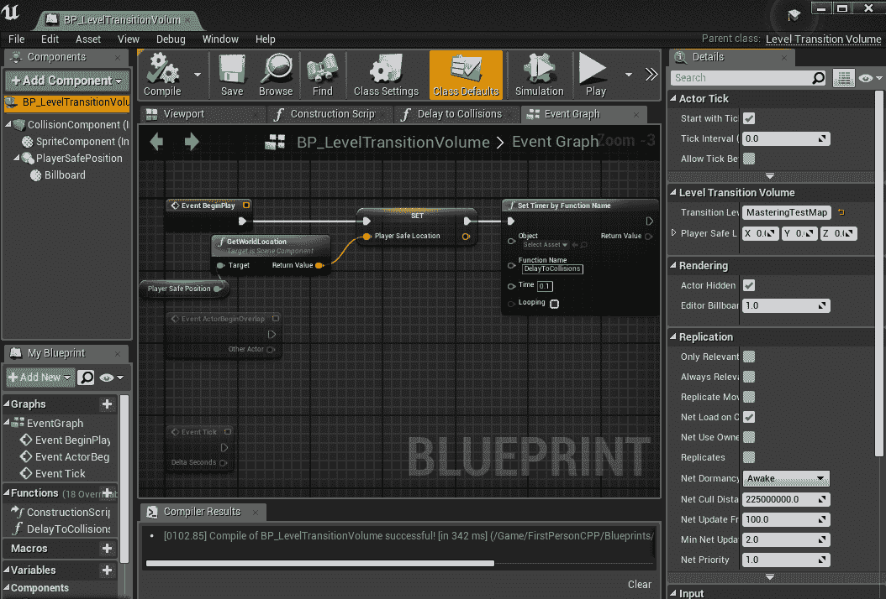

# 第六章：改变层级、流式传输和保留数据

# 简介

在 UE4 中切换层级有两种类型。一种是非常简单的：卸载旧层级，加载新层级，完成（如果这就是你需要的，这一章可能非常简短！）。第二种方法是在连续流式传输层级进出的过程中具有更多挑战，但也可以提供更丰富的用户体验。在这两种情况下，问题仍然是：在加载这些层级时，哪些游戏元素或玩家数据会与你一起保留？拥有这些数据持久化可能是一个真正的挑战，我们在这里也会探索一些解决方案，以便无论选择哪种方法，最终玩家都能有一个连续的游戏体验，希望这对那些从事关卡设计的人来说不会太有压力！我们的目标如下：

+   涵盖 UE4 中地图切换的基础知识

+   为过渡到新层级添加一个新层级

+   将加载/保存系统调整为在地图转换之间持久化状态

+   创建从持久层级进行层级流式传输的实用示例

# 技术要求

如往常一样，建议从第五章的结尾“添加敌人！”开始，以保持连贯性，但这绝对不是必需的。这里的所有课程都应能够应用于任何 UE4 项目在任何开发阶段的任何项目。 

对应的 GitHub 项目可以在以下位置找到：

[`github.com/PacktPublishing/Mastering-Game-Development-with-Unreal-Engine-4-Second-Edition/tree/Chapter-6`](https://github.com/PacktPublishing/Mastering-Game-Development-with-Unreal-Engine-4-Second-Edition/tree/Chapter-6)

使用的引擎版本：4.19.2。

# 传统层级加载

改变层级（地图）一直是虚幻引擎自诞生以来的固有系统。因此，自然地，随着时间的发展，已经出现了许多与之相关的工具和选项。话虽如此，我们已经有所有进行基本层级转换所需的工具，但了解这些工具仍然是有益的，我们将在本节中更新我们的加载和保存，以保持在这些切换期间的游戏进度和状态。首先，快速回顾一下 UE4 中层级转换的基础。

# 基础知识

蓝图和 C++都内置了改变层级的方式。在我们这里快速使用的蓝图示例中，它是可以从蓝图中的大多数地方访问的 Open Level 节点。在 C++中，我们已经在加载/保存时使用过它（尽管请注意，对于基于服务器的游戏，你通常会传递所需的层级作为第一个参数；这里，我们只是使用它来使用`"?Restart"`特殊字符串重新启动现有层级）：

```cpp
if (mapName == currentMapName)
{
        World->ServerTravel("?Restart", true);
}
else
{
        UGameplayStatics::OpenLevel(World, *mapName, true);
}
```

因此，在游戏中触发这些操作大约是最简单不过的了。在我们的默认 FirstPersonExampleMap 中，我添加了一些方块，以模拟一个位于我们之前添加的移动平台顶部的传送门。

如果你查看 GitHub，会发现有一个用于修复移动平台的 Stash，因为它们可以在移动回下方的过程中将玩家（或 NPC）挤压出关卡。这不是一个完美的解决方案，但它简单地禁用了平台移动回下方的碰撞，并在它到达底部时重新启用（还修复了一些平台上的其他小逻辑）。然而，由于这并不是本章的具体目标，所以它被存档而不是直接提交到 GitHub 项目。

在这个过程中，我添加了一个简单的触发器体积，来自左侧的体积集（甚至不需要新的蓝图类或实例）：


选中它后，通过点击主菜单栏顶部的蓝图按钮，选择打开关卡蓝图。在里面，当体积被选中并且你右键点击时，在最顶部你可以访问该特定对象在关卡中的特定选项。我们将使用它的重叠事件，检查是否是玩家，如果是，就像这里所示打开 MasteringTestLevel：


就这些。真的。只需走进触发器，我们就会被发射到另一个关卡。如果这就是你项目的需求，那么最好在这里停下来，保持生活简单！

# 使用加载/保存进行过渡

然而，大多数游戏，尤其是那些有基于故事的单人模式或类似模式的游戏，都希望玩家离开后的状态以及关卡本身的状态能够跨这个过渡过程持续存在。如果我们像上一节那样简单地创建一个返回到`FirstPersonExampleMap`的传送门，你会在切换回来和去的时候注意到，那些关卡中的玩家、物品、NPC 等似乎是我们刚刚打开的，而不是我们离开时的状态，玩家的库存也被重新加载。所以现在我们实际上需要两个不同的东西：

+   在任何关卡加载过程中保持玩家数据完整

+   在切换时加载和保存该关卡及其动态对象的状态

幸运的是，我们已经在实现动态的任意时间加载和保存，所以我们将只修改这一点，并利用它来处理关卡状态。但是，我们需要一些新的方法来跨地图变化持久化数据。这里有几种选择（一些肯定比其他更安全或更干净），但针对我们的游戏，我们将创建一个新的`UGameInstance` C++类，并像单例一样使用它来保存将在游戏运行整个生命周期内持续的数据和信息。

任何引入静态或全局数据的时候，您都必须非常小心，因为它可能会对诸如在编辑器中的游戏等事物产生不可预见的影响，尽管您停止了游戏，只要编辑器没有关闭和重新打开，任何静态数据都会持续存在，因此您不能指望在启动和重新启动 PIE 与游戏的独立版本（例如，在设备或其他平台上）之间有相同的行为。我们将为我们的示例添加一些安全措施，但尽可能谨慎并最小化危险数据存储！

我们将命名新的游戏实例为`MasteringGameInstance`并给它一些单例功能：

```cpp
UCLASS()
class MASTERING_API UMasteringGameInstance : public UGameInstance
{
        GENERATED_BODY()

public:
        UFUNCTION(BlueprintCallable, Category = "Mastering Game Instance")
        static UMasteringGameInstance* GetInstance();

        virtual void Init() override;
        virtual void BeginDestroy() override;
        virtual void FinishDestroy() override;

        bool ShouldPersistInventory() const
        {
                return bPersistPlayerInventory;
        }

        void SetPersistInventory(const bool bPersist = true)
        {
                bPersistPlayerInventory = bPersist;
        }

        void SetPlayerInventory(class UMasteringInventory* Inv);

        FORCEINLINE class UMasteringInventory* GetInventory() const
        {
                return PlayerInv;
        }

        void SetPlayerSafeLocation(const FVector& InLoc)
        {
                PlayerSafeLocation = InLoc;
        }

        FORCEINLINE FVector GetPlayerSafeLocation() const
        {
                return PlayerSafeLocation;
        }

        void ClearData();

protected:

        UPROPERTY()
        class UMasteringInventory* PlayerInv;

        bool bPersistPlayerInventory;
        FVector PlayerSafeLocation;
};

```

如您所见，这为我们提供了一些我们希望能够在加载和保存周期中持续存在的持久数据。

接下来，一些辅助函数来使所有这些工作正常，并使设置玩家的库存和清理游戏实例中的我们自己的状态变得简单：

```cpp
static UMasteringGameInstance* Instance = nullptr;

UMasteringGameInstance* UMasteringGameInstance::GetInstance()
{
        checkf(Instance != nullptr, TEXT("Someone is trying to use the game instance before it has initialized!"));

        return Instance;
}

void UMasteringGameInstance::Init()
{
        Super::Init();

        Instance = this;

        AddToRoot();
}

void UMasteringGameInstance::BeginDestroy()
{
        ClearData();
        Super::BeginDestroy();
}

void UMasteringGameInstance::FinishDestroy()
{
        Super::FinishDestroy();
}

void UMasteringGameInstance::SetPlayerInventory(class UMasteringInventory* Inv)
{
        if (PlayerInv == nullptr)
        {
                PlayerInv = NewObject<UMasteringInventory>(this, TEXT("PlayerInventory"));
        }

        PlayerInv->CopyFromOther(Inv);
}

void UMasteringGameInstance::ClearData()
{
        bPersistPlayerInventory = false;
        PlayerInv = nullptr;
        PlayerSafeLocation = FVector::ZeroVector;
}
```

在这一点上，`BeginDestroy`和`FinishDestroy`可能不需要都在这里；但通常对于像这样的静态数据持有者来说，同时拥有它们是个好主意。在`FinishDestroy`中，如果没有其他事情，您可以添加一些安全措施来确保在会话之后没有代码使用这个`GameInstance`的同一实例而不先调用`Init`，并清理任何剩余的问题（如果您想更加安全，甚至可以将`Instance`设置回`nullptr`）。作为参考，`BeginDestroy`是立即清除任何其他类可能会查找并使用的数据的地方。一旦我们开始认真进行加载/保存任务，我们将有几个这样的地方（例如，您绝对不希望在加载/保存周期中退出游戏，然后在重新启动时变量设置为加载/保存开始时的设置）。确保这一点指向设置，项目设置，然后在地图和模式中，将游戏实例设置为`MasteringGameInstance`。

接下来，为了使我们的游戏加载代码更加精简和抽象，我们将创建一个新的蓝图函数库 C++类（根据定义，这是一个静态函数的集合，这正是我们在这里需要的，即使它不一定从蓝图中调用）：

```cpp
class MASTERING_API LoadSaveLibrary
{
public:
        LoadSaveLibrary();
        ~LoadSaveLibrary();

        UFUNCTION(BlueprintCallable)
        static void LoadGameFile(FString SaveFile, UWorld* World);

        UFUNCTION(BlueprintCallable)
        static void SaveGameFile(FString SaveFile, UWorld* World);

        static void OnGameLoadedFixup(UWorld* World);

        static void FixupPlayer(UWorld* World, class AMasteringCharacter* Char);

protected:
        static TArray<uint8> BinaryData;
};
```

并且重构`MainMenuWidget`类，将大量代码移动到这里，使其在未来的使用中更加合适，使这个 UI 类更加专注和具体。此外，我们现在有一些额外的修复代码，它调整了玩家的位置，并考虑到在加载周期中持续当前库存，就像我们返回之前访问过的关卡时想要的那样：

```cpp
TArray<uint8> LoadSaveLibrary::BinaryData;

LoadSaveLibrary::LoadSaveLibrary()
{
}

LoadSaveLibrary::~LoadSaveLibrary()
{
}

void LoadSaveLibrary::LoadGameFile(FString SaveFile, UWorld* World)
{
        FString outPath = FPaths::ProjectSavedDir() + SaveFile;
        if (!FFileHelper::LoadFileToArray(BinaryData, *outPath))
        {
                UE_LOG(LogTemp, Warning, TEXT("%s"), *(FString("Game Load Failed: ") + outPath));
                return;
        }

        checkSlow(World != nullptr);
        FMemoryReader FromBinary = FMemoryReader(BinaryData, true);
        FromBinary.Seek(0);

        FGameSavedData SaveGameData;
        FromBinary << SaveGameData;

        FromBinary.FlushCache();
        FromBinary.Close();

        UMasteringGameInstance* gameInst = UMasteringGameInstance::GetInstance();
        FVector playerSafeLoc = SaveGameData.PlayerSafeLocation;
        gameInst->SetPlayerSafeLocation(playerSafeLoc);

        FString mapName = SaveGameData.MapName.ToString();

        FString currentMapName = World->GetMapName();

        currentMapName.Split("UEDPIE_0_", nullptr, &currentMapName);

        if (mapName == currentMapName)
        {
                World->ServerTravel("?Restart", true);
        }
        else
        {
                UGameplayStatics::OpenLevel(World, *mapName);
        }
}
```

在上方，您可以看到加载方法，如果我们打算进入我们已经在的世界，我们基本上告诉世界重新启动，否则，我们打开新关卡。我们还将玩家的当前位置保存为“安全”，因为我们有信心这是一个玩家可以占据的有效位置，如果我们稍后需要返回这个关卡，我们可能需要它。

```cpp
void LoadSaveLibrary::SaveGameFile(FString SaveFile, UWorld* World)
{
        checkSlow(World != nullptr);
        FGameSavedData SaveGameData;
        FString outPath = FPaths::ProjectSavedDir() + SaveFile;

        SaveGameData.Timestamp = FDateTime::Now();

        FString mapName = World->GetMapName();

        mapName.Split("UEDPIE_0_", nullptr, &mapName);

        SaveGameData.MapName = *mapName;

        UMasteringGameInstance* gameInst = UMasteringGameInstance::GetInstance();
        SaveGameData.PlayerSafeLocation = gameInst->GetPlayerSafeLocation();
        gameInst->SetPlayerSafeLocation(FVector::ZeroVector); // so this will not be valid in future saves unless set again

        TArray<AActor*> Actors;
        UGameplayStatics::GetAllActorsWithInterface(World, USavedActorInterface::StaticClass(), Actors);

        TArray<FActorSavedData> SavedActors;
        for (auto Actor : Actors)
        {
                FActorSavedData ActorRecord;
                ActorRecord.MyName = FName(*Actor->GetName());
                ActorRecord.MyClass = Actor->GetClass()->GetPathName();
                ActorRecord.MyTransform = Actor->GetTransform();
                ActorRecord.MyVelocity = Actor->GetVelocity();

                FMemoryWriter MemoryWriter(ActorRecord.MyData, true);
                FSaveGameArchive Ar(MemoryWriter);
                AMasteringCharacter* Mast = Cast<AMasteringCharacter>(Actor);

                ISavedActorInterface::Execute_ActorSaved(Actor);

                Actor->Serialize(Ar);

                if (Mast != nullptr)
                {
                        UMasteringInventory* Inv = Mast->GetInventory();
                        SaveGameData.InventoryData.CurrentWeapon = Inv->GetCurrentWeapon()->GetPathName();
                        SaveGameData.InventoryData.CurrentWeaponPower = Inv->GetCurrentWeaponPower();
                        for (FWeaponProperties weapon : Inv->GetWeaponsArray())
                        {
                                FInventoryItemData data;
                                data.WeaponClass = weapon.WeaponClass->GetPathName();
                                data.WeaponPower = weapon.WeaponPower;
                                data.Ammo = weapon.Ammo;
                                data.TextureClass = weapon.InventoryIcon->GetPathName();

                                SaveGameData.InventoryData.WeaponsArray.Add(data);
                        }
                }

                SavedActors.Add(ActorRecord);
        }

        FBufferArchive SaveData;

        SaveGameData.SavedActors = SavedActors;

        SaveData << SaveGameData;

        FFileHelper::SaveArrayToFile(SaveData, *outPath);

        SaveData.FlushCache();
        SaveData.Empty();
}
```

保存是真正的工作所在，遵循流程可能有点棘手；但如果您折叠上述演员循环的实现，其余部分就相当直接了，获取安全位置，清除安全位置（为了清晰），然后迭代这些演员，序列化到我们的输出，并将其保存为文件。

```cpp
void LoadSaveLibrary::FixupPlayer(UWorld* World, class AMasteringCharacter* Char)
{
        UMasteringGameInstance* gameInst = UMasteringGameInstance::GetInstance();

        // Assuming we found our player character and saved out some inventory, this is where we do its custom serialization and fix-up
        if (Char != nullptr)
        {
                if (!gameInst->GetPlayerSafeLocation().IsZero())
                {
                        Char->SetActorLocation(gameInst->GetPlayerSafeLocation());
                }

                if (gameInst->ShouldPersistInventory())
                {
                        UMasteringInventory* NewInv = NewObject<UMasteringInventory>(Char, TEXT("PlayerInventory"), RF_Transient);

                        checkf(gameInst->GetInventory() != nullptr, TEXT("Game Instance is trying to persist inventory with no inventory setup!"));
                        NewInv->CopyFromOther(gameInst->GetInventory(), Char);

                        Char->SetInventory(NewInv);
                        NewInv->SetupToCurrent();
                }
                else if (BinaryData.Num() > 0)
                {
                        FMemoryReader FromBinary = FMemoryReader(BinaryData, true);
                        FromBinary.Seek(0);

                        FGameSavedData SaveGameData;
                        FromBinary << SaveGameData;

                        UMasteringInventory* NewInv = NewObject<UMasteringInventory>(Char, TEXT("PlayerInventory"), RF_Transient);

                        Char->SetInventory(NewInv);

                        FWeaponProperties propsEquipped;
                        for (FInventoryItemData ItemData : SaveGameData.InventoryData.WeaponsArray)
                        {
                                FWeaponProperties props;
                                props.WeaponClass = FindObject<UClass>(ANY_PACKAGE, *ItemData.WeaponClass);
                                props.InventoryIcon = FindObject<UTexture2D>(ANY_PACKAGE, *ItemData.TextureClass);
                                props.WeaponPower = ItemData.WeaponPower;
                                props.Ammo = ItemData.Ammo;

                                if (ItemData.WeaponClass == SaveGameData.InventoryData.CurrentWeapon)
                                        propsEquipped = props;

                                NewInv->AddWeapon(props);
                        }

                        Char->GetInventory()->SelectWeapon(propsEquipped);
                }
        }
}
```

修复玩家是一个特殊情况，需要大量细致的工作，因此在此以完整形式包含。将玩家的所有属性放回到保存时想要的位置相当棘手，但请花时间通读（并在您的 IDE 中使用断点逐步执行）上述代码几次。正确地完成这项工作，并从这种加载/保存系统开始时就是正确的，这是至关重要的。花时间理解它，并在实现它时正确地实现它，测试，测试，再测试！

需要修改菜单小部件类的更改应该是显而易见的，但如果需要，可以在 GitHub 项目的检查点中看到。这使我们能够利用从任何地方（基本上是 C++或甚至蓝图）加载和保存的代码。

现在，我们真正缺少的只是一个具有少量特殊 C++代码的新触发盒类型，调整我们的加载/保存过程以忽略在保存时保存的库存，并在层级切换时恢复库存。所以，两个快速步骤：创建一个新的触发盒子子类，并将玩家的库存和体积的安全位置添加到游戏实例中。因此，将我们的新体积命名为`LevelTransitionVolume`，并给它添加一些功能，通过向游戏实例添加变量和函数，我们现在可以过渡到带有玩家库存的，其余从我们要去的地方的保存游戏中加载，如果我们只是切换层级，我们保留玩家的当前库存（以及如果需要，任何其他信息）。如果我们正在进行完整加载，当然我们需要恢复保存的内容。

这个体积的逻辑，我们将替换之前用于测试的两个层级中的两个体积，看起来是这样的：

```cpp
void ALevelTransitionVolume::NotifyActorBeginOverlap(AActor* OtherActor)
{
        AMasteringCharacter* Mast = Cast<AMasteringCharacter>(OtherActor);
        UWorld* World = GetWorld();

        if (Mast != nullptr)
        {
                UMasteringGameInstance* gameInst = UMasteringGameInstance::GetInstance();
                gameInst->SetPersistInventory();

                AMasteringCharacter* Char = Cast<AMasteringCharacter>(World->GetFirstPlayerController()->GetPawn());
                check(Char != nullptr);

                gameInst->SetPlayerInventory(Char->GetInventory());

                FString currentMapName = World->GetMapName();
                currentMapName.Split("UEDPIE_0_", nullptr, &currentMapName); // strip out PIE prefix if in PIE
                FString toMapName = TransitionLevel;

                FString fromFile = currentMapName + TEXT("_to_") + toMapName + TEXT(".sav");
                FString toFile = toMapName + TEXT("_to_") + currentMapName + TEXT(".sav");

                gameInst->SetPlayerSafeLocation(GetPlayerSafeLocation());

                // always save on our way out so we can restore the state on the way back
                LoadSaveLibrary::SaveGameFile(fromFile, World);

                if (FPaths::FileExists(FPaths::ProjectSavedDir() + toFile))
                {
                        LoadSaveLibrary::LoadGameFile(toFile, World);
                }
                else
                {
                        UGameplayStatics::OpenLevel(World, *toMapName);
                }
        }
}
```

因此，我们现在正在过渡到新层级，并保存了我们离开当前层级时的位置。

```cpp
void LoadSaveLibrary::OnGameLoadedFixup(UWorld* World)
{
        if (BinaryData.Num() == 0)
        {
                checkSlow(World->GetFirstPlayerController() != nullptr);
                AMasteringCharacter* charPawn = Cast<AMasteringCharacter>(World->GetFirstPlayerController()->GetPawn());

                FixupPlayer(World, charPawn);
                return;
        }

        FMemoryReader FromBinary = FMemoryReader(BinaryData, true);
        FromBinary.Seek(0);

        FGameSavedData SaveGameData;
        FromBinary << SaveGameData;

        FromBinary.FlushCache();
        BinaryData.Empty();
        FromBinary.Close();

        TArray<AActor*> Actors;
        UGameplayStatics::GetAllActorsWithInterface(World, USavedActorInterface::StaticClass(), Actors);

        TArray<FActorSavedData> ActorDatas = SaveGameData.SavedActors;

        AMasteringCharacter* Char = nullptr; // if ever more than one, we'll need an array and a map to their inventory

        // iterate these arrays backwards as we will remove objects as we go, can also use iterators, but RemoveAt is simpler here for now
        for (int i = Actors.Num() - 1; i >= 0; --i)
        {
                AActor* Actor = Actors[i];

                for (int j = ActorDatas.Num() - 1; j >= 0; --j)
                {
                        FActorSavedData ActorRecord = ActorDatas[j];

                        // These are actors spawned into the world that we also found in our save data (TODO: use TArray intersection?)
                        if (ActorRecord.MyName == *Actor->GetName())
                        {
                                FMemoryReader MemoryReader(ActorRecord.MyData, true);
                                FSaveGameArchive Ar(MemoryReader);

                                AMasteringCharacter* Mast = Cast<AMasteringCharacter>(Actor);
                                if (Mast != nullptr)
                                {
                                        Char = Mast;
                                }

                                Actor->Serialize(Ar);
                                Actor->SetActorTransform(ActorRecord.MyTransform);
                                ISavedActorInterface::Execute_ActorLoaded(Actor);

                                APawn* pawn = Cast<APawn>(Actor);
                                if (pawn != nullptr)
                                {
                                        // controller needs the rotation too as this may set the pawn's rotation once play starts
                                        AController* controller = pawn->GetController();
                                        controller->ClientSetRotation(ActorRecord.MyTransform.Rotator());
                                }

                                ActorDatas.RemoveAt(j);
                                Actors.RemoveAt(i);
                                break;
                        }
                }
        }

```

我们将在这一点上处理玩家，然后完成找到的任何已保存数据的演员（通常是我们在其中创建的投射物等）：

```cpp
        FixupPlayer(World, Char);

        // These are actors in our save data, but not in the world, spawn them
        for (FActorSavedData ActorRecord : ActorDatas)
        {
                FVector SpawnPos = ActorRecord.MyTransform.GetLocation();
                FRotator SpawnRot = ActorRecord.MyTransform.Rotator();
                FActorSpawnParameters SpawnParams;
                // if we were in a space when saved, we should be able to spawn there again when loaded, but we could also
                // be overlapping an object that loaded, but will be subsequently destroyed below as it was there at level start
                // but not there at save time
                SpawnParams.SpawnCollisionHandlingOverride = ESpawnActorCollisionHandlingMethod::AlwaysSpawn;
                SpawnParams.Name = ActorRecord.MyName;
                UClass* SpawnClass = FindObject<UClass>(ANY_PACKAGE, *ActorRecord.MyClass);
                if (SpawnClass)
                {
                        AActor* NewActor = GWorld->SpawnActor(SpawnClass, &SpawnPos, &SpawnRot, SpawnParams);
                        FMemoryReader MemoryReader(ActorRecord.MyData, true);
                        FSaveGameArchive Ar(MemoryReader);
                        NewActor->Serialize(Ar);
                        NewActor->SetActorTransform(ActorRecord.MyTransform);
                        ISavedActorInterface::Execute_ActorLoaded(NewActor);
                }
        }

        // These are actors in the world that are not in our save data, destroy them (for example, a weapon pickup that was, well, picked up)
        for (auto Actor : Actors)
        {
                Actor->Destroy();
        }
}
```

在替换了旧的触发体积并在层级中的新盒子上设置正确的过渡层级名称后，当然我们也可以在层级蓝图中去掉旧的逻辑。所以，如之前所见，如果我们已经有了与即将进行的过渡到/从的匹配的保存文件，就加载那个保存文件。无论如何，我们仍然会保留玩家的库存，因为游戏实例中靠近这个函数顶部的这些行设置了这一点，并在离开之前以我们的从/到形式保存状态。

为了使我们的库存容易转移，我们可以添加几个实用函数。注意：也可以在级别加载期间持久化`UObject`实例（除了游戏实例之外），但这通常会对在级别加载期间可能被销毁的引用其他对象的实例产生不可预见的影响。因此，在这种情况下，我们只是使库存对象的复制变得简单：

```cpp
void UMasteringInventory::CopyFromOther(UMasteringInventory *Other, class AMasteringCharacter* ownerOverride /* = nullptr */)
{
        Reset();

        TArray<FWeaponProperties>& otherProps = Other->GetWeaponsArray();
        for (auto prop : otherProps)
        {
                WeaponsArray.Add(prop);
        }

        DefaultWeaponPickup = Other->DefaultWeaponPickup;
        CurrentWeapon = Other->GetCurrentWeapon();
        CurrentWeaponPower = Other->GetCurrentWeaponPower();
        MyOwner = ownerOverride == nullptr ? Other->GetOwningCharacter() : ownerOverride;
}

void UMasteringInventory::Reset()
{
        WeaponsArray.Empty();
        CurrentWeapon = nullptr;
        CurrentWeaponPower = -1;
        MyOwner = nullptr;
}

void UMasteringInventory::SetupToCurrent()
{
        for (auto WeaponIt = WeaponsArray.CreateConstIterator(); WeaponIt; ++WeaponIt)
        {
                const FWeaponProperties &currentProps = *WeaponIt;
                OnWeaponAdded.Broadcast(currentProps);
                if (currentProps.WeaponClass == CurrentWeapon)
                {
                        SelectWeapon(currentProps);
                }
        }
}
```

现在最后要做的就是制作一个新的触发盒的实际蓝图，并给它一个合适的安放位置，以便我们可以放置玩家。如果我们不这样做，玩家将不断被放置在保存的位置（当它们与盒子相交时），并且玩家将在两个级别之间无限弹跳。对于那些仔细观察的人，你会在构造脚本中看到碰撞最初是禁用的，然后这里的计时器重新启用它。这是因为我们需要游戏世界的一个 tick 来将玩家移动到更新后的位置，如果我们不暂时禁用重叠事件，当我们尝试移动时，就会得到前面提到的 ping-pong 行为：



到目前为止，玩家可以在我们的两个可玩级别之间来回切换，库存保持在当前级别，被放置在安全位置，这样他们就不会立即回到另一个级别，每个级别都像正常加载保存一样保存和恢复其状态。现在唯一缺少的一般功能可能是在加载过程中有一个旋转图标或淡入黑色和进度条。UE4 当然允许这些类型的事情，它们在主游戏线程 tick 之外更新，但在这里不会具体实现，因为我们还有另一个主要主题要深入研究：流式传输级别。

# 有可能进行流式传输吗？

到目前为止，我们已经使用了触发元素来加载特定级别。流式传输，正如其通常所知，是另一种按需加载级别的的方法，它允许在不必须加载所有包围演员的情况下拥有更大的游戏区域。虚幻引擎以两种不同的方式允许这样做，但它们可以相互补充：流式体积和世界组成。我们在这里简要探讨这些内容，但它们是提供巨大游戏区域并保持任何给定时刻加载内存处于合理水平的好方法。当然，这种方法也有一些缺点。

# 流式传输的优点和缺点

流式传输的优势可能很明显。正如之前提到的，有较大的空间和可管理的内存负载。其缺点可能不太明显，但通过我们在 GitHub 项目中的第一个检查点可以清楚地说明：基本上是将`MasteringTestMap`复制（除去天空盒和光照）到两个与之偏移的其他级别，并使用流式体积进行流式传输。为此，首先转到主编辑窗口菜单并选择级别。已经添加了两个新级别，并带有它们的偏移量，每个级别周围都有一个 NavMesh 体积来生成适当的网格。当级别加载时，这些网格将组合在一起。

然而，当级别被流式传输出去时，其中的所有演员都将被销毁，当它被流式传输回来时，它们将全部重新创建，就像新加载一样。所以在这个例子中，有两个新级别，MasteringTestMapW1 和 W2。MasteringTestMap 将是我们的持久级别。这是最顶层的级别，它总是被加载。所有流式传输体积也都需要放置在这个级别中。所以，正如这里所看到的，以粗略的演示方式，当开始 MasteringTestMap 并左转 90 度跑动时，你会看到流进 W1 的体积有短短几米的重叠，同样，W1 的地图和流进 W2 的体积也有小范围的重叠。通常你希望这些体积包括玩家可以看到的任何区域，但在这个情况下，我们想展示流式传输出去：所以如果你跑向左边，在碰到 MasteringTestMap 的边缘之前，W1 就会流进。如果你继续向 W2 前进，你会看到当玩家离开 W1 的体积时，W1 就会流出去。同样，当你通过 W1 返回时，你可以看到 W2 迅速流出去。现在我们遇到了问题。在 W2 中有一个体积用于生成更多的敌人。如果你慢慢走，小心行事，他们可以把你赶回 W1，但如果你跑得快，W2 就会流出去，女伯爵们就会从世界中掉落。此外，当流式传输 W1 回来时，之前收集到的任何武器拾取现在都会返回。

动态对象和此类流式传输是最大的协调问题：你如何通知新加载的关卡它不应该重新生成放置在地面上的武器拾取？女伯爵们如何处理她们的主关卡流式传输出去？这完全破坏了她们的回家行为，因为她们实际上无法这样做（它们的路径查找失败）。当然，当流式传输的关卡流式传输出去时，可以在持久关卡中以小的方式保存（例如，简单地存储角色的位置和状态）或在游戏实例中，就像我们在上一节中加载关卡时跨关卡加载玩家的库存一样。然而，这需要大量的维护，因此，像这样的许多功能一样，如果你打算使用流式传输，请务必尽早决定，并教育任何其他团队成员如何正确设置这些事情，以便你的玩家感觉这是一个无缝的世界。但是首先，让我们快速看一下这两种流式传输方法的区别，并观察提到的困难。

# 示例流式传输和最佳实践

要流式传输这些关卡，在“关卡”窗口中，你首先必须点击顶部的“关卡”下拉菜单，然后点击“添加现有”。

添加 W1 和 W2 使我们能够选择它们，然后将它们的加载状态连接到此处显示的体积：


添加了这些，并将体积添加到 MasteringTestMap 中，它应该看起来像这样：


在“关卡”窗口中，点击体积数组上的加号按钮，然后我们可以使用吸管工具将它们拖入世界并选择正确的体积，或者简单地使用下拉菜单选择我们想要与该关卡关联的体积。再次注意这些小的重叠。为了避免玩家注意到流式传输，通常最好制作一个更大的重叠区域，并可能引入雾距离，这样实际的加载就不会那么明显。在我们的教学案例中，我们再次希望它在这里是明显的。现在，有了这些组件，你可以运行 West，看到关卡随着玩家（确切地说，是摄像机）进入这些区域并离开而进入和消失。再次，通过几次测试运行，应该很明显，如果没有考虑到这些提到的缺点，当关卡流式传输进和出时，它们会明显可见。女伯爵是否永远不应该离开她的主关卡？当她的主关卡流式传输出去时，她应该消失吗？拾取物是否应该以某种方式知道它们之前已经被拾取，并且要么不生成，要么像我们在加载存档游戏时拾取的拾取物那样销毁自己？这些都是每个项目必须决定的问题，权衡维护此类系统的复杂性以及玩家体验和避免破坏他们的沉浸感。

使用体积可以是一种手动控制精确细节水平的好方法。例如，你可以使用一个非常大的体积来流式传输基本的物理和少量的静态网格几何形状，以避免任何世界掉落问题，比如伯爵遇到的问题，同时还有一个额外的级别，体积更小，只有当玩家靠近时才加载，这会加载大量不影响游戏玩法的外观几何形状。然而，基于体积的流式传输的一个限制是，级别只能从持久级别的起点扩展到`WORLD_MAX`，大约是 2 公里（或者从起点开始，东西方向 1 公里，南北方向 1 公里）。在大多数游戏中，这已经足够了。对于在这个尺寸限制内的开放世界（别忘了你仍然可以硬切换到其他持久级别，比如室内区域！），我们发现砖块状拼接最适合重叠级别加载。因此，当你处于中心级别时，按照这种模式围绕它的级别将会被加载：


这样你还可以与级别设计师合作，确保这七个级别的总内存始终低于某个特定的上限。例如，你可以有一些低细节区域和中心的高细节区域，但当然，随着你的移动和这个模式的重复，任何七个加载级别的总和应该保持在商定的上限以下。而且，令人高兴的是，基于服务器的多人游戏已经尊重这种流式传输，并且没有问题跟踪客户端之间的玩家。如果你的世界需要一个更大或几乎无界的游戏空间，世界组成值得探索。

世界组成是创建自动化的、基于网格的拼接的好方法，它内置在 UE4 中。这对于非常大的世界非常有用，玩家可以在任何给定方向上几乎无限地旅行，但通常需要艺术家或级别设计师的大量工作来制作这些部分，并确保它们在边界处完全匹配。世界组成的完美应用是一个单人开放世界游戏，其中探索和真正广阔的游戏区域是目标。由于这是一个相当小众的领域，Epic 本身已经对功能做了很好的文档记录，将在*进一步阅读*部分添加链接。

# 摘要

从本章的开始到结束，我们现在已经展示了如何在传统的关卡加载中独立持久化关卡状态和玩家状态，以及玩家移动时流式传输关卡的基础知识。这些对于几乎所有的 UE4 可想象的游戏都是基本的，现在应该成为任何团队和项目向前发展的最佳策略的基础。始终记住：尽早做出这些决定！例如，将假设硬关卡加载的关卡改造为流式模型几乎是不可能的，但如果你从第一天就采用流式模型并帮助你的团队坚持其限制，那么这将是你在项目周期后期不会感到困扰的一个担忧。

# 问题

1.  在 UE4 中可以使用哪些现有的类或对象来实现无需新更改的关卡加载？

1.  仅使用这些方法有哪些局限性？

1.  游戏实例对象的生命周期范围是什么？

1.  当打开新关卡或加载现有关卡的状态时，游戏实例是如何用来持久化数据的？

1.  将关卡加载/保存代码抽象到蓝图函数库的目的是什么？

1.  为什么玩家的库存被复制而不是将`UObject`范围限定在游戏实例中？

1.  基于体积的流式传输的主要缺点是什么？

1.  哪些类型的游戏肯定应该使用世界组成？

# 进一步阅读

UE4 中的世界组成：

[`docs.unrealengine.com/en-US/Engine/LevelStreaming/WorldBrowser`](https://docs.unrealengine.com/en-US/Engine/LevelStreaming/WorldBrowser)
