# 第十一章：体积光图、雾和预计算

# 简介

UE4 提供了开发者希望拥有的最前沿的大量图形功能。好消息是，对于许多平台上的许多游戏，有了良好的关卡设计师团队，这将被大部分自动处理。然而，对系统工作原理的普遍无知可能会给团队带来两个主要缺点：未能利用内置的高级引擎技术，或者你可能遇到构建时间或构建大小问题，却不知道从何开始解决。虽然 Unreal 中可用的实际技术和光照物理本身可以填满一本书（确实如此！），但我们在本章中再次关注的是了解选项和使用方法。到本章结束时，将确保对如何最佳使用光照以及如何解决由此产生的问题有信心，以帮助制作现代美观的游戏并指导团队遵循最佳实践。本章涵盖：

+   体积光图

+   大气雾和体积雾

+   光照质量（设置和预览工具）

+   光照质量分析

# 技术要求

如同惯例，本章将使用 GitHub 上我们项目`第十一章`分支的示例，但概念和技术适用于任何项目：

[`github.com/PacktPublishing/Mastering-Game-Development-with-Unreal-Engine-4-Second-Edition/tree/Chapter-11`](https://github.com/PacktPublishing/Mastering-Game-Development-with-Unreal-Engine-4-Second-Edition/tree/Chapter-11)

使用的引擎版本：4.19.2。

# 体积光图、光照质量和雾

在本节中，我们将简要介绍标题中列出的三个主题，这些主题对于新或业余游戏制作者来说往往令人困惑：

1.  体积光图是一组预先计算的基于体积的颜色，可以快速用于确定地图中任何给定区域的反弹光照。对于那些熟悉 4.18 之前 UE4 的用户，这是通过间接光照缓存完成的，但它有一个固定的采样大小。新的光照质量使用更动态的采样以增加细节。这些与普通光照质量不同，普通光照质量是直接烘焙到场景中的颜色，通常作为混合纹理应用到对象上。另一种思考体积光图的方式是将其视为空间样本中复杂颜色信息的快速查找表。

1.  光照质量是 Unreal 中确定光照属性的系统名称，包括如何（以及是否）计算体积光图。为了防止光照时间过长，通常你将添加一个或多个光照质量重要性体积（一个实际的 Unreal 基本体积类型），以告诉引擎和编辑器你关心这些计算的位置。由于光和体积结合的方式和次数很多，难怪它很难理解。

1.  大气雾是一种视觉效果，模拟阳光（或其他光线）穿越行星大气层的过程。这是通过地图中的大气雾对象以及影响它的灯光设置来实现的。与之相关但独特的是，**体积雾**是一种视觉效果，雾似乎填充了指定区域内的体积，并且适当地受到光照的影响。虽然在这个部分中又使用了“体积”这个词，但它是在地图中通过指数高度雾对象全局定义的，或者在局部区域通过粒子定义的。像大气雾一样，它也主要是由影响它的灯光来定义的。

# 使用光量体积添加体积光图

如前文所述，当添加光量重要性体积时，该体积内部区域将默认生成体积光图。我们的 FrozenCove 地图提供了这些内容的优秀概述。让我们首先检查这个体积及其在关卡中的位置：

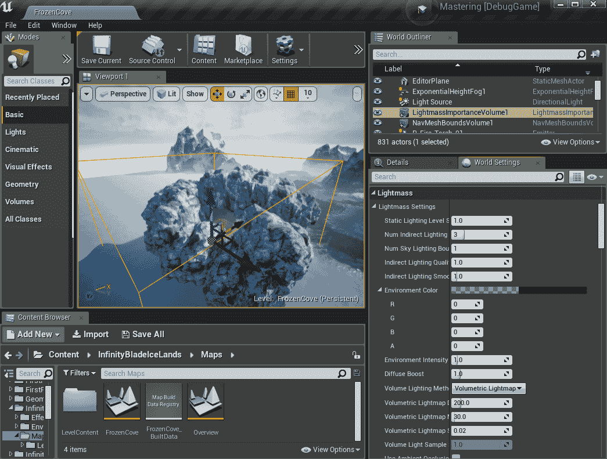

从实际的海湾/洞穴可玩区域拉远视角，你可以看到这个体积完全包围了该可玩区域，但除此之外没有太多其他内容。这正是你应该尝试采用的做法，以降低灯光构建时间，减少保存出的光图的总数（从而减少内存使用），同时给玩家提供他们在直接观看和交互区域的最佳视觉体验。从那个高度环顾四周，你可以看到实际上在这些周围的岩石悬崖中有很多建模出的几何形状。然而，它们对玩家场景的光照贡献并不相关，而且除了可能在我们的游戏中添加的幸运的长距离射击外，没有动态对象打算在这些区域被近距离看到。

这些事情为什么很重要？让我们快速概述一下在这个例子中预置灯光能给我们带来什么，以及这些光照贴图对我们有什么好处。首先也是最重要的就是**漫反射**。这是对光子质量主要用途的技术术语：获取一个非常详细的光线如何从物体上反射的模型，并在运行时预先计算成可用的形式。光子质量以两种不同的方式完成这项工作：首先是通过构建场景中所有静态物体的光照贴图，这些光照贴图在运行时直接与几何形状一起渲染；其次是通过体积光照贴图，这是运行时动态移动物体的反射颜色的快速查找表。不深入探讨涉及的计算，让我们关注这个概念为什么很重要：在构建你的游戏时花费一些时间预先计算这些信息，可以在运行时以最小的性能成本为观众生成一个**更加真实**和视觉上令人愉悦的场景。这种**漫反射**概念，即颜色从一个物体向其附近的另一个物体渗透，可能看起来有点多余，但花点时间查找一些应用了和不应用这种技术的相同场景的例子，你的大脑会立即选择使用这种技术的场景，认为它更真实、渲染质量更高。同样，光子质量会计算各种阴影、环境遮蔽（一种在角落和缝隙中遮蔽光线的技巧）以及更多。在本章的第二部分，我们将深入探讨光子质量设置的更多具体细节以及如何最好地利用它们。本节主要介绍了将光子质量添加到你的游戏中的最基本方法（通过添加重要性体积）以及为什么添加这个重要性体积是，嗯，很重要的！

# 使用大气雾

Epic 多年来（特别是更新到 4.16）一直在努力使更复杂的雾技术更容易为开发者所用，目前它们相对容易添加，至少与过去相比是这样。在我们的洞穴地图示例中，首先我们将检查它内部放置的大气雾对象的使用，以及天空及其对应的方向性光照属性。对于希望实现一种低空雾效果的玩家，在游戏中低海拔处雾变得更浓、更明显，请参阅下一小节关于**指数高度雾（体积雾）**的内容。对于希望使用局部体积雾来增强（甚至模糊）某个区域、为局部区域赋予特殊属性以及/或移动/改变动态体积雾的读者，下一小节也将简要介绍这一主题，并且这两个小节在*进一步阅读*部分都有链接。

但是，现在让我们转到这里的例子。虽然当你跳入这个级别时可能没有立即注意到，如果你移除效果或夸大它（我们将在两个镜头中做后者），你很容易看到当我们从洞穴中靠近太阳看时，它产生了多大的差异：

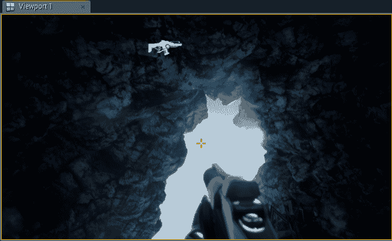

希望顶部岩石周围的雾霾足够清晰，如果你看看场景的其他部分，当太阳出现在视野中时，可以看到的天空区域会明显变亮，就像这里一样。让我们看看产生这种效果的设置。首先是天空球体，如下所示：

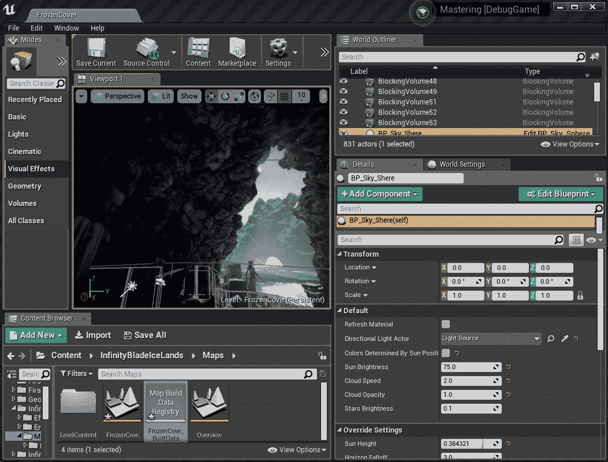

注意特别的是，它指定了一个方向光演员。如果我们跟随它到屏幕上我们看到的那一个，这里是其属性：

当然，这些属性的核心是大气/雾太阳光框，它让我们的大气雾属性知道这是创建体积雾时的太阳光来源：

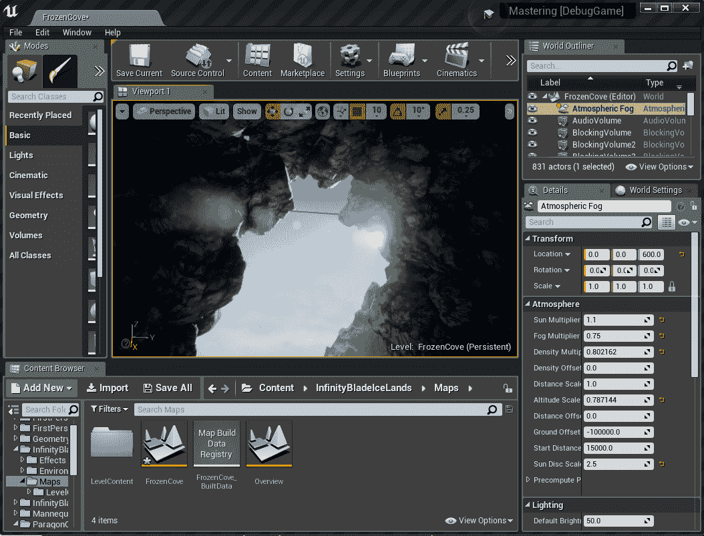

最后，让我们展示如何修改大气雾对象的一些设置（该对象位于左侧模式面板中的指数高度雾对象中）：

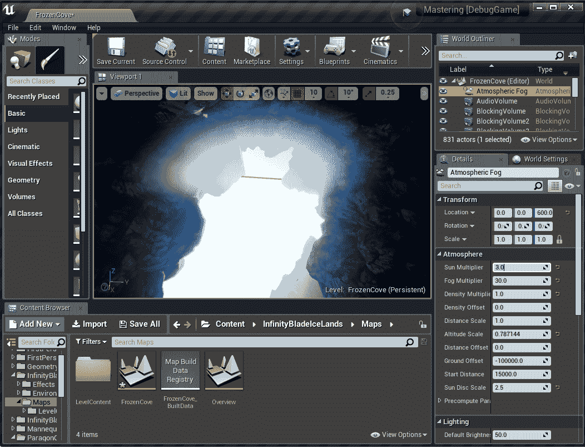

现在它非常明显，你不可能错过！我强烈建议你尝试所有这些设置。这里有很多可以探索的，看到所有不同的参数如何实时影响结果是非常有趣的。与许多光量效果和设置不同，大气雾不需要通过顶部的构建按钮进行构建来更新，并且非常容易快速地玩弄。

# 使用体积雾

体积雾是一种非常棒的视觉效果，目前它非常具体地设计用于玩家可能在一个相对平坦的地图上行走的地方，或者他们可能从某个高度变化处向上或向下看的地方。鉴于计算的难度，目前它不支持其他情况（例如，根据相机视角变化），但它仍然是一个非常强大的工具，并且是一个很好的系统，可以舒适地向团队解释其重要性。首先，让我们再次看看 FrozenCove 中已经存在的内容，然后我们稍作修改：

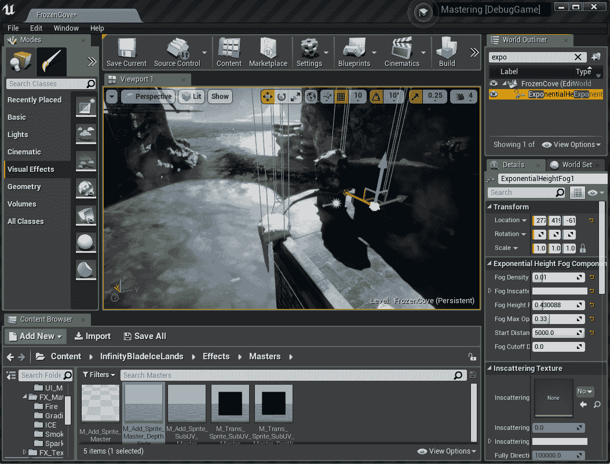

这些设置产生了一种微妙的雾气，这种雾气只在高度雾对象放置位置相当远的地方才开始。因此，为了演示目的，我们再次将其设置得更极端一些（而且更细心的观察者会注意到前景中的粒子，我们将在下一部分讨论）：

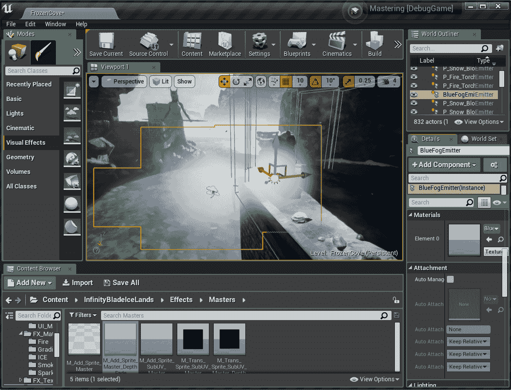

这个级别使用传统的粒子，我们之前讨论过，因为它们的混合性能成本较高，用于模拟雪堆；但正如你所看到的，我们也可以使用体积雾粒子发射器来完成这项工作，你可以在地图中查看它。然而，为了让这个发射器工作，我们需要将高度雾的体积雾设置切换为真（目前复选框未勾选）。请注意，虽然我们稍后会讨论如何优化你的 Lightmass 输出，如果需要的话。如果你以这种方式使用体积雾，你应该意识到潜在的性能成本，并使用第八章中的技术，*着色器编辑和优化技巧*。那么，让我们看看我们可以添加到粒子系统中的材料，以获得动态变化和着色的体积雾：

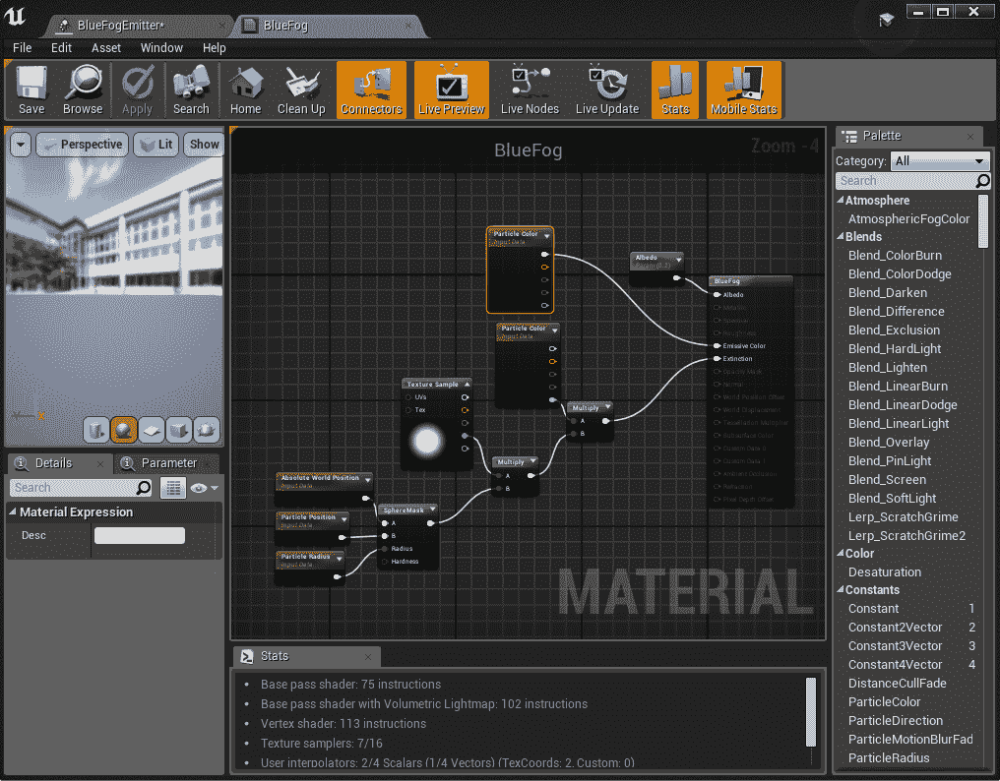

现在，以这个材料目前的状态，添加到场景中的发射器，你会得到一个相当引人注目的蓝色（这是原始意图），如下所示：

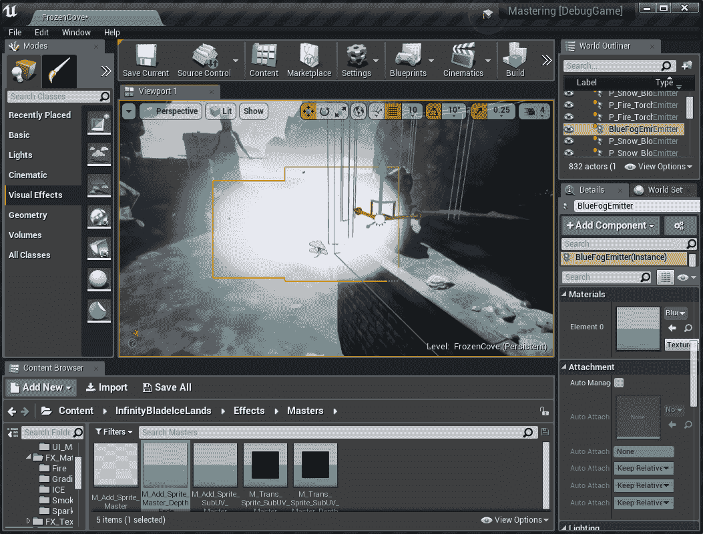

结果表明，如果你断开发射色，这将是一个更加微妙的效果，与雾的自然颜色相匹配。这就是 GitHub 项目目前的内容：

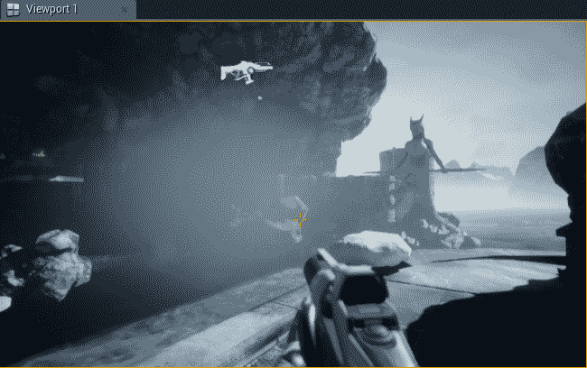

体积雾，无论是局部还是全局，都可以真正地决定场景的沉浸感，所以虽然这里的主要目的是自信地使用它们，但有一些经验丰富的环境艺术家在旁边确保它们在场景美学上不会被过度使用，这已经讨论了可能的性能成本。

# Lightmass 工具

现在基础知识已经介绍完毕，我们也看到了体积雾的强大功能和它如何与一般光照结合，是时候更深入地了解 Lightmass 本身了。有无数的对象、变量以及两者之间无尽的组合可以探索，但为了保持我们的技术信心，我们将关注几个关键区域：

+   漫反射互反射设置

+   动态间接光照光照贴图及其可视化与调整方法

+   漫反射和它的优点和缺点

+   影响光照构建时间的一些额外因素

+   质量模式

+   光照贴图，它们的位置，以及如何分析你对它们的用法

我们在这里的第二个小节将专门讨论光照贴图，因此对于我们的第一个部分，我们将检查 Lightmass 定义属性的一个固态子集，以及质量模式的影响。

# 学习 Lightmass 设置和预览工具

首先，让我们看看全局 Lightmass 设置，它位于“世界设置”中：

前五个选项对间接光照影响最大。如果你的光照时间非常长，将静态光照级别设置为大于 1 可以通过缩放采样大小显著减少光照构建时间。如果各种级别或整个游戏的光照构建时间成为问题，并且你的游戏和团队可以接受光照准确性的降低，请首先尝试这种方法。反弹次数同样可以产生重大影响。间接光照的目的是模拟现实世界，其中一部分光子（我们眼睛感知的光的粒子）从物体上被反射或折射，而另一部分被吸收。反弹次数意味着在计算空间中的每个点时，还需要计算一定量的反弹光照。自然地，反弹次数越多，工作量就越大（但同时也更真实准确）。接下来的三个选项稍微有些晦涩，但你可以自由地鼠标悬停在上面以了解它们的内容。例如，光平滑处理在特定类型的地图上可以大有帮助，但正如所述，间接阴影细节的成本需要权衡。不幸的是，与之前讨论的许多雾设置不同，所有这些都需要构建以充分欣赏它们带来的变化，这可能相当耗时。理论上，如果一个游戏有一个固定的风格，可以在早期进行一些实验，选择首选值，然后在整个项目期间锁定这些值。

为了可视化光照效果，请确保在视口选项中查看“详细光照”、“仅光照”和“反射”：

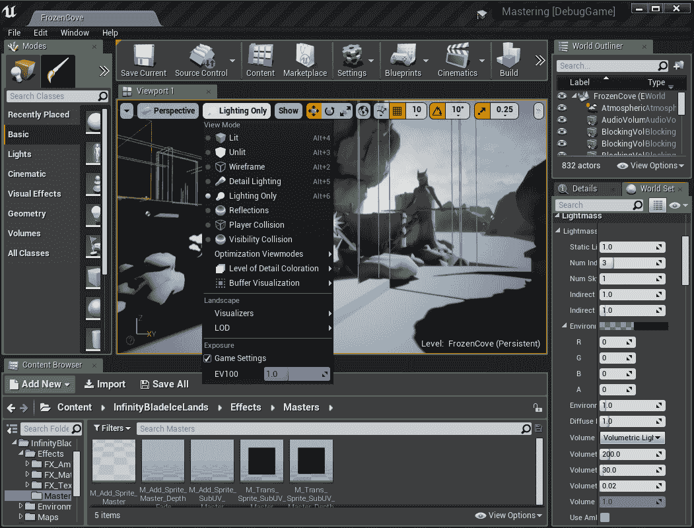

然而，这里可能最引人注目的是体积光光量，可以通过视口的“显示 | 可视化 | 体积光照图”来预览，如下所示：

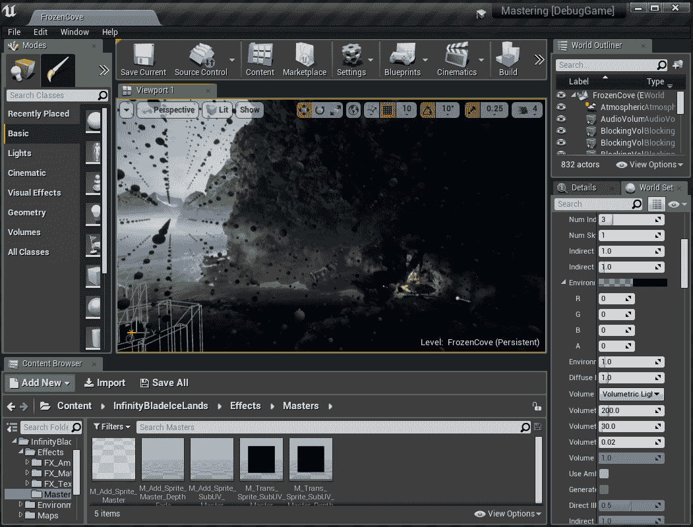

这些方向性光照样本将用于运行时移动对象，也用于在重新构建静态光照之前移动的静态网格。对于经验丰富的 UE4 开发者来说，不要忘记，从 4.18 版本开始，这是默认设置，并且通常比旧的光照缓存模型更受欢迎。关于这些变化的详细描述可以在“进一步阅读”部分找到。

快速提及环境光遮蔽（实际上在 FrozenCove 中是关闭的），可以将其视为变暗区域。凹面表面在现实生活中会阻挡光线反射。虽然它增加了真实感，如果你已经至少进行了一次间接光照反射，它对光照的构建时间几乎不会增加，但请注意，它是以顶向下光照来简化计算的。所以在某种程度上，它与指数高度雾相似，如果你的游戏不是本质上平坦的游戏（例如，玩家在类似地球的表面上移动，就像我们大多数人一样），它可能会失去其真实感和价值。然而，在“使用环境光遮蔽”设置下关闭它却非常简单，在你的世界的 Lightmass 设置中。就像许多 Lightmass 选项一样，通常最好的做法是简单地尝试开启它来构建光照，在场景中四处走动，也许拍摄一些特定的截图，然后关闭它并重复这个过程，看看它是否有用。你可以在视口中的视图模式 | 缓冲区可视化 | 环境光遮蔽中预览这里完成的工作。

如果你发现自己遇到了光照构建时间问题，并且已经调整了一些可能影响这些构建时间的参数，那么值得注意的是，光照构建使用的是 Swarm Agent 系统，可以将计算任务分配到网络上的多台计算机上。更多关于这一点的内容也列在了*进一步阅读*部分。另外，对于许多游戏来说，纯动态光照已经足够好，对于需要适度动态光照细节但又不希望承受烘焙/烹饪光照的内存成本和构建时间的移动游戏等，大部分 Lightmass 可以关闭。就像往常一样，了解你的项目和它的需求，并准备好做一些早期实验，并与你的艺术家讨论最佳选项。如果消除烘焙光照能让你的艺术家为环境或角色添加更多细节纹理，这可能是一个他们愿意做出的权衡，这取决于你游戏的分辨率和其他设置，所以不要害怕实验和讨论！

最后，了解你的光照质量级别。它们可以从构建按钮的下拉菜单中选择，如下所示：

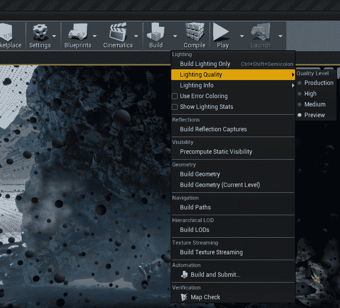

这实际上只是从高到低构建时间与质量级别的一个非常高级的概述。如果你想快速在这之间切换，那么这应该是你质量与时间之间的首选。

# 光照贴图分析

正如所述，Lightmass 会自动在重要性体积内所有区域创建光照贴图。但这对你项目的内存意味着什么？你总是可以检查构建数据大小以快速估算（提示：这大部分将是你的光照贴图，可能还有一部分用于导航网格，以及一些内部的小需求）。例如，查看我们项目的`Content/InfinithBladeIceLands/Maps`文件夹，你会看到冻结湾的构建数据`.ubulk`文件，大约 100 MB。这是我们地图中的典型大小。然而，如果你想要更多细节，点击光照贴图世界设置中的向下箭头（更多选项），你将找到类似这样的光照贴图飞出菜单：

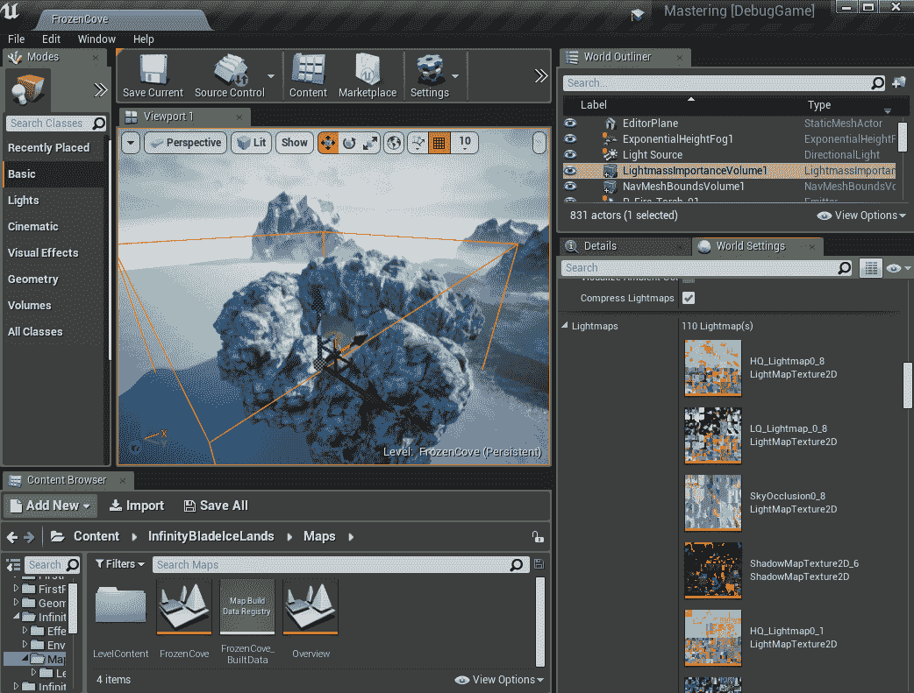

双击其中任何一个都会提供更多细节：

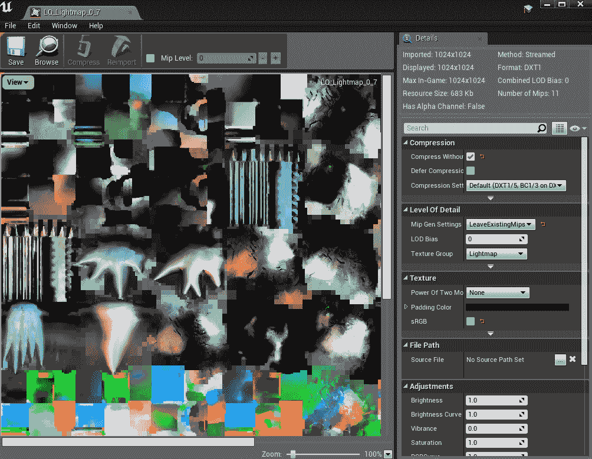

在这里，你可以看到压缩、大小（分辨率和内存），当然，你也可以更改这些设置中的许多。在静态网格编辑器中，单个网格可以在其网格设置下更改其光照贴图分辨率。此外，你可以在视口中通过视图模式 | 优化视图模式 | 光照密度查看这些光照贴图的 texel 密度，如下所示：

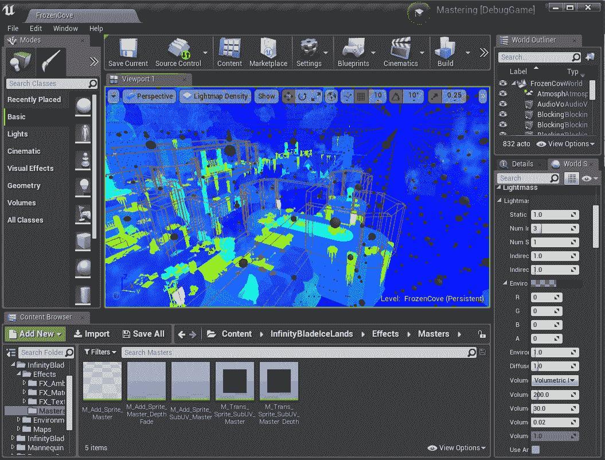

# 摘要

这里有很多可以探索的内容，因此避免感到不知所措很重要。在这个阶段，团队或项目可能遇到的任何主要问题都应该可以得到一般性的解答。话虽如此，如果你发现自己与艺术家就视觉质量争论，或者与整个团队就构建时间争论，现在你应该手中有工具来探索选项、调整、微调，并找到最佳解决方案。UE4 中的光照既神奇又复杂，但幸运的是，理解整个系统的*如何*并不是关键，只需掌握*什么*和*为什么*，就能做出正确的决策。在下一章中，我们将有更多轻松的时间展示 UE4 在场景视频中可以做到的一些更酷的视觉效果！

# 问题

1.  体积光照贴图的功能是什么？

1.  你会如何描述 Lightmass 默认包含的功能？

1.  大气雾和体积雾有什么区别？

1.  如何创建体积雾的本地实例？

1.  如果你遇到缓慢的光照构建时间，最简单的方法是什么来调整质量与时间的关系？

1.  指数高度贴图和环境遮蔽有什么限制？

1.  在构建时，你可以在哪里找到光照贴图数据的一般大小？

1.  传统光照贴图和体积光照贴图有什么区别？

# 进一步阅读

指数高度雾：

[`docs.unrealengine.com/en-us/Engine/Actors/FogEffects/HeightFog`](https://docs.unrealengine.com/en-us/Engine/Actors/FogEffects/HeightFog)

体积雾（通过粒子的局部雾）：

[体积雾](https://docs.unrealengine.com/en-us/Engine/Rendering/LightingAndShadows/VolumetricFog)

间接光照贴图与光照缓存对比：

[体积光照贴图](https://docs.unrealengine.com/en-US/Engine/Rendering/LightingAndShadows/VolumetricLightmaps)

Unreal 中的群体代理：

[Unreal Swarm 概述](https://docs.unrealengine.com/en-us/Engine/Rendering/LightingAndShadows/Lightmass/Unreal-Swarm-Overview)
