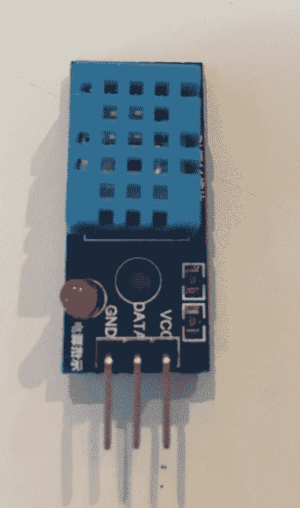
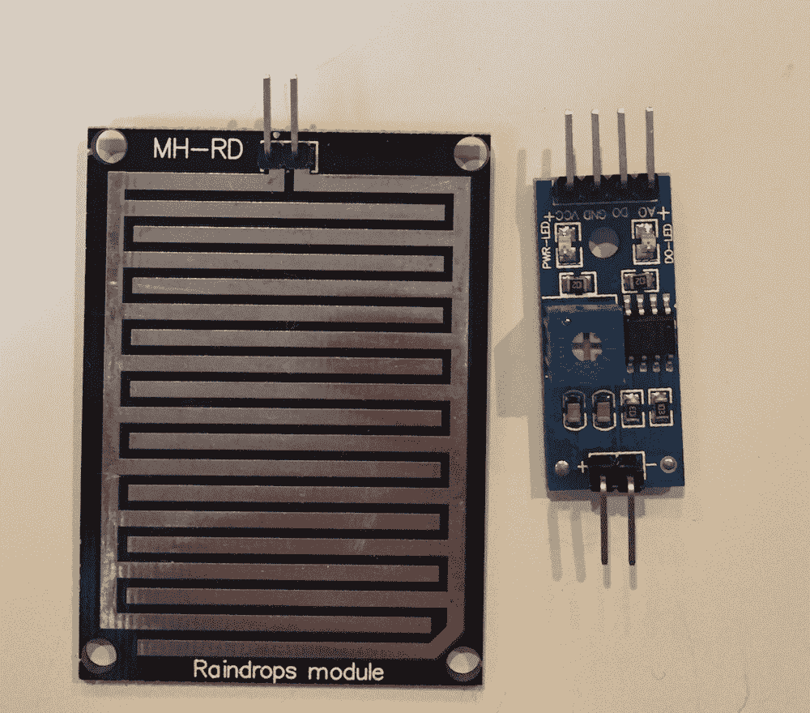
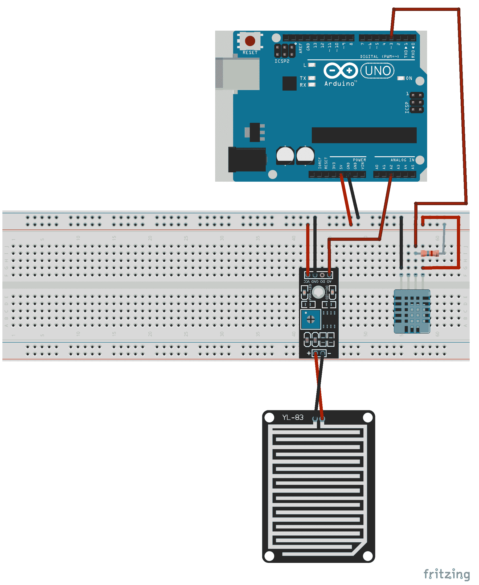
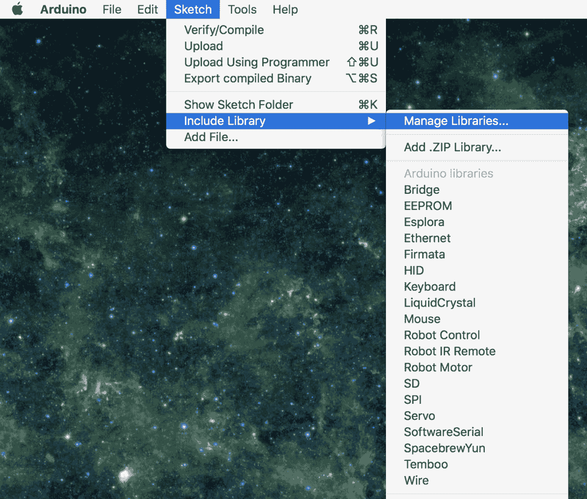
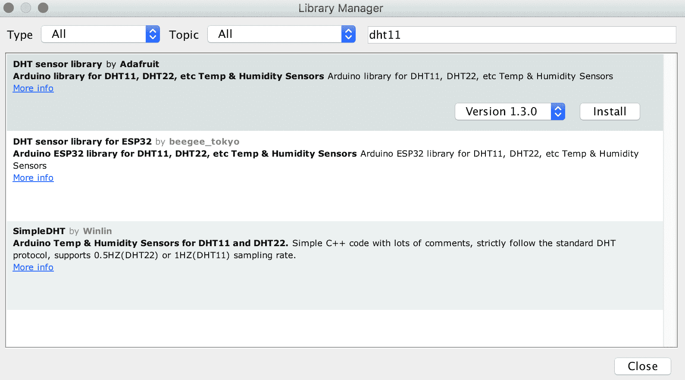
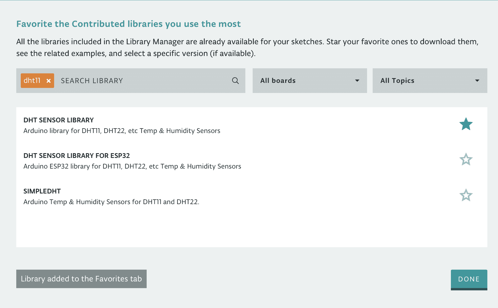
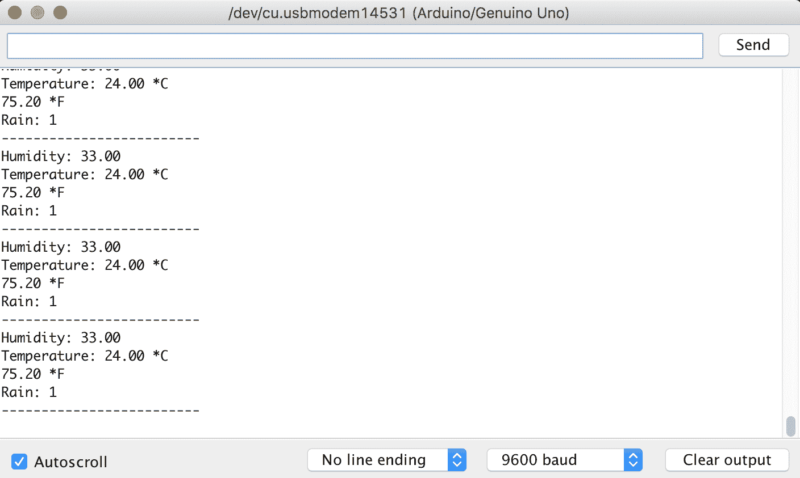

# 第九章：环境传感器

在本章中，我们将探讨如何使用 DHT11 温度/湿度传感器和雨滴传感器构建一个真正简单的气象站。虽然上一章使用了基本的数字输入，但 DHT11 温度传感器将给我们提供使用第三方库的机会，而雨滴传感器将使用模拟引脚。我们还将介绍一些实用的函数，我们可以使用它们。

在本章中，你将学习：

+   如何将第三方库添加到草图

+   如何使用`isnan()`函数

+   如何使用`map()`函数

+   如何使用 DHT11 温度和湿度传感器

+   如何使用雨传感器

# 简介

DHT11 是一种低成本的温度和湿度传感器。该传感器使用热敏电阻来测量温度。**热敏电阻**这个词是由热（温度）和电阻组合而成的，因为它是一种电阻，其电阻对温度的敏感性非常高，甚至比普通电阻还要高。可以根据热敏电阻的输出电压确定当前温度。

当与热敏电阻一起工作时，我们首先需要做的是确定如何根据输出电压计算温度。在第四章中我们使用的 TMP36 温度传感器原型中，我们可以通过一个基本的公式（*电压* - *0.5*）* *100.0*轻松地根据传感器的输出电压计算温度，因为这个传感器使用固态技术来确定温度。热敏电阻的情况并非如此。虽然线性近似，类似于我们使用 TMP36 传感器计算温度的方法，可能适用于较小的温度范围，但要从热敏电阻中获得准确的温度测量，我们需要确定设备的电阻/温度曲线。

幸运的是，有几个 Arduino 库是为了帮助我们从 DHT11 温度和湿度传感器中获得准确的温度而编写的。在本章中，我们将使用**Adafruit**库。DHT11 传感器将看起来类似于以下照片：



对于大多数 DHT11 传感器，引脚标记得很清楚，如前一张照片所示。**VCC**引脚将连接到面包板上的电源轨，它应该连接到 Arduino 的 5V 输出引脚。**GND**引脚将连接到面包板上的地轨，它应该连接到 Arduino 的地输出引脚。**DATA**引脚将连接到 Arduino 的一个数字引脚。

一些 DHT 温度传感器内置了上拉电阻，而另一些则需要外部上拉电阻。请查阅您的传感器文档，以验证是否需要添加外部上拉电阻。在本章的项目中，我们将展示外部上拉电阻。

对于本章的项目，我们还将使用一个通用的雨滴传感器。这个传感器有两个部分。第一部分是雨传感器板，当水完成板上的印刷引线电路时，它会检测到雨水。这个传感器板充当一个可变电阻，随着板变湿，电流的量增加。雨滴传感器的第二部分是电子印刷电路板，它将根据传感器板的电流确定水的量。

以下照片显示了雨滴传感器的样子：



印刷电路板上的 +/- 引脚连接到雨传感器板上的引脚。印刷电路板的另一侧有四个引脚。VCC 和 GND 引脚将分别连接到面包板的电源和地轨。对于本章的项目，我们将使用 **A0** 模拟输出引脚作为传感器的输出。A0 引脚将直接连接到 Arduino 上的一个模拟输入引脚。

# 需要的组件

我们需要以下组件来完成本章的项目：

+   一个 Arduino Uno 或兼容板

+   一个 DHT11 温湿度传感器

+   一个 MH-RD 雨滴传感器

+   一个 4.7K 电阻

+   跳线

+   一个面包板

# 电路图

以下图表显示了本项目的 Fritzing 图：



在这个图表中，我们可以看到两个传感器的 VCC 和地引脚都连接到面包板上的电源和地轨。面包板上的电源和地轨连接到 Arduino 的 5V 输出和地引脚。

我们在本章前面展示的 DHT11 传感器图像显示了一个带有三个引脚的 DHT11 传感器；然而，Fritzing 库中的传感器有四个引脚。在 Fritzing 图中忽略额外的引脚是安全的。

此图表显示 DHT11 传感器的数据引脚连接到 Arduino 的数字 3 引脚，并且它还有一个 4.7K 上拉电阻。如果您使用的 DHT11 传感器没有内置上拉电阻，您需要添加此图中所示的外部上拉电阻。雨传感器上的模拟输出连接到 Arduino 的模拟 2 输入引脚。

# 代码

在我们开始编写代码之前，我们需要加载我们将使用的 DHT11 Adafruit 库来读取温度和湿度读数。您可以在 Adafruit 的 GitHub 页面上找到此库的源代码：[`github.com/adafruit/DHT-sensor-library`](https://github.com/adafruit/DHT-sensor-library)。

**注意：**您需要参考此代码来完成本章的挑战部分。

要安装库，如果您使用 Arduino IDE，请从菜单栏中选择 Sketch 选项，然后选择 Include Library，然后选择 Manage Libraries，如下面的截图所示：



在打开的窗口中，在搜索栏中输入`dht11`，你应该会看到几个不同的 DHT11 传感器库。在本章中，我们将使用来自 Adafruit 的库（在以下列表中，第一个结果）。点击这个库，你会在最右边看到一个安装按钮，如下面的屏幕截图所示：



对于 Arduino Web 编辑器，点击“库”选项，然后在搜索栏中输入`dht11`，如下面的屏幕截图所示：


这可能不会返回任何结果；因此，我们需要点击“库管理器”链接，这将打开库管理器，并显示 DHT11 搜索的结果，如下面的图片所示：



如此窗口顶部的说明所述，我们需要点击要包含的库的星号，然后点击“完成”按钮。不幸的是，Web 编辑器中的库管理器没有告诉我们是谁创建了库；然而，如果你注意到，三个库的名称与我们在 Arduino IDE 中看到的库名称相匹配。因此，我们可以通过标题来判断哪个是 Adafruit 库。

现在我们已经安装了库，是时候开始编写代码了。我们首先需要做的是包含 DHT 传感器库的头文件。我们可以通过在代码顶部添加以下`include`语句来实现：

```cpp
#include "DHT.h"
```

接下来，我们需要定义一些宏。我们将从定义 DHT11 和雨滴传感器连接到的 Arduino 引脚开始：

```cpp
#define DHT_PIN 3
#define RAIN_PIN A2
```

这段代码告诉我们 DHT11 传感器连接到数字 3 引脚，雨传感器连接到模拟 2 引脚。Adafruit DHT 传感器库可以读取 DHT11 和 DHT22 传感器。因此，我们需要告诉库我们使用的是哪种传感器类型，并且我们应该创建一个包含此类型的宏。以下代码定义了 DHT 传感器类型：

```cpp
#define DHT_TYPE DHT11
```

最后，我们需要创建四个宏，这将帮助我们理解雨传感器的读数。如果你还记得，模拟输入引脚将输入电压映射到 0 到 1023 的整数值。当我们从雨传感器读取输入时，1023 的值表示没有雨，而 0 的值表示洪水。从纯电子角度来看，这是有意义的；然而，从逻辑角度来看，这似乎是相反的，因为雨传感器应该在雨更多时报告更高的值。

我们将使用 Arduino 的`map()`函数来帮我们转换。因此，我们需要定义模拟读数的最大/最小值以及我们想要将模拟值转换到的最大/最小值。我们将在查看`map()`函数的代码时进一步解释这一点；现在，这里有一些宏：

```cpp
#define RAIN_SENSOR_MAX 1023
#define RAIN_SENSOR_MIN 0
#define RAIN_OUT_MAX 20
#define RAIN_OUT_MIN 0
```

现在我们将想要使用我们刚刚定义的 `DHT_PIN` 和 `DHT_TYPE` 宏来创建 `DHT` 类的一个实例。以下代码将创建 `DHT` 类的一个实例：

```cpp
DHT dht(DHT_PIN, DHT_TYPE);
```

既然我们已经定义了所需的宏并创建了 `DHT` 类的全局实例，我们需要创建 `setup()` 函数。在 `setup()` 函数中，我们需要初始化串行监视器和 `DHT` 类。`DHT` 类的 `begin()` 方法用于初始化类的实例。以下代码显示了 `setup()` 函数：

```cpp
void setup() {
  Serial.begin(9600);
 dht.begin();
}
```

现在我们有了 `setup()` 函数，让我们看看如何读取 DHT 和雨量传感器。本章剩余的代码将进入我们的草图中的 `loop()` 函数。以下代码将使用 Adafruit 库从 DHT 传感器读取湿度和温度：

```cpp
float humidity = dht.readHumidity();
float celsius = dht.readTemperature();
float fahrenheit = dht.readTemperature(true);

if (isnan(humidity) || isnan(celsius) || isnan(fahreheit)) {
  Serial.println("Read Failed");
  return;
}

Serial.print("Humidity: ");
Serial.println(humidity);
Serial.print("Temperature: ");
Serial.print(celsius);
Serial.println(" *C ");
Serial.print(fahreheit);
Serial.println(" *F");

delay(3000);
```

此代码首先调用 `DHT` 类的 `readHumidity()` 方法来从 DHT 传感器读取湿度。然后调用 `readTemperature()` 方法两次，一次读取摄氏度温度，一次读取华氏度温度。请注意，当 `readTemperature()` 方法不带参数调用时，我们接收摄氏度温度；当我们传递布尔参数 `true` 时，我们接收华氏度温度。我们也可以传递布尔参数 `false` 来接收摄氏度温度。

在从传感器读取温度和湿度之后，验证读取是否成功是一个好习惯。为此，我们使用了 `isnan()` 函数。如果传入的值不是数字，`isnan()` 函数将返回 `true`，因此，行 `if (isnan(humidity) || isnan(celsius) || isnan(Fahrenheit))` 读取为“如果湿度不是数字或摄氏度不是数字或华氏度不是数字，则执行代码块”。此代码块将打印错误消息到控制台，然后执行 `return` 语句以退出此循环。

如果所有变量都是数字，我们将湿度温度打印到串行控制台，然后等待 3 秒钟，退出此循环并再次开始循环函数。

现在我们来看看如何读取雨量传感器。将以下代码放在最终的 `Serial.println()` 语句和 DHT 传感器代码中的 `delay()` 函数调用之间：

```cpp
int rain = analogRead(RAIN_PIN);
if (isnan(rain)) {
  Serial.println("Read Failed");
  return;
}
int range = map(rain, RAIN_SENSOR_MIN, RAIN_SENSOR_MAX, RAIN_OUT_MAX, RAIN_OUT_MIN);

Serial.print("Rain: ");
Serial.println(range);
Serial.println("-------------------------");
```

在此代码中，我们调用 `analogRead()` 函数来读取雨量传感器连接的模拟引脚，并使用 `isnan()` 函数来验证读取是否成功。在验证 `analogRead()` 函数成功执行后，我们调用 `map()` 函数。`map()` 函数将重新映射一个值从一个数字范围到新的数字范围。

此函数有五个参数，它们是：

+   `value`：要映射的值

+   `fromLow`：值当前范围的下限

+   `fromHigh`：值当前范围的上限

+   `toLow`：值的新范围的下限

+   `toHigh`：值新范围的上限

如果我们将前一段代码中的`map()`函数调用中的宏替换为实际值，`map()`函数将看起来像这样：

```cpp
int range = map(rain, 0, 1023, 20, 0);
```

雨变量值来自`analogRead()`函数，我们知道它的值将在`0`到`1023`之间。因此，我们将当前范围的下限设置为`0`，上限设置为`1023`。如果你还记得本章前面的内容，1023 的值表示没有雨，而 0 的值表示洪水。我们希望在新范围内反转这个值，其中较高的值表示更多的雨，而较低的值表示较少的雨。因此，我们将新范围的下限设置为`20`，上限设置为`0`。这将把旧范围内的 1023 值映射到新范围内的 0，而旧范围内的 0 值映射到新范围内的`20`。

使用这个新范围，`20`的高值表示洪水，而零的低位值表示没有雨。旧范围中的中间值（511 或 512）将映射到新范围中的中间值（10）。`map()`函数在我们想要改变比例和/或反转顺序时非常有用，就像在这个例子中看到的那样。

在调用`map()`函数后，我们将结果打印到串行控制台。现在让我们看看运行这个项目会发生什么。

# 运行项目

当我们运行这个项目时，我们应该看到以下截图类似的结果：



现在尝试用水喷洒雨传感器板（雨滴传感器感应雨的部分）并观察它如何改变雨输出。

**注意**：在电子项目周围使用水时总是要小心。如果你让你的 Arduino 或其他电子元件弄湿，你会损坏它们。当使用继电器处理交流电时，你也面临着触电的风险。

现在让我们看看挑战。

# 挑战

对于这个挑战，使用`DHT`库来计算热指数。热指数是温度和湿度结合引起的不适感。`DHT`类中有方法可以为你完成这个工作。

在本章的开头，我们提供了一个链接到包含 DHT 传感器库代码的 GitHub 仓库。查看`DHT.h`文件以了解 DHT 类中有哪些方法。

# 概述

在本章中，我们首次使用了第三方库。这是 Adafruit DHT 传感器库。我们还看到了两个之前未使用过的新函数。这些函数是`isnan()`和`map()`函数。

在下一章中，我们将探讨范围和碰撞检测传感器。
