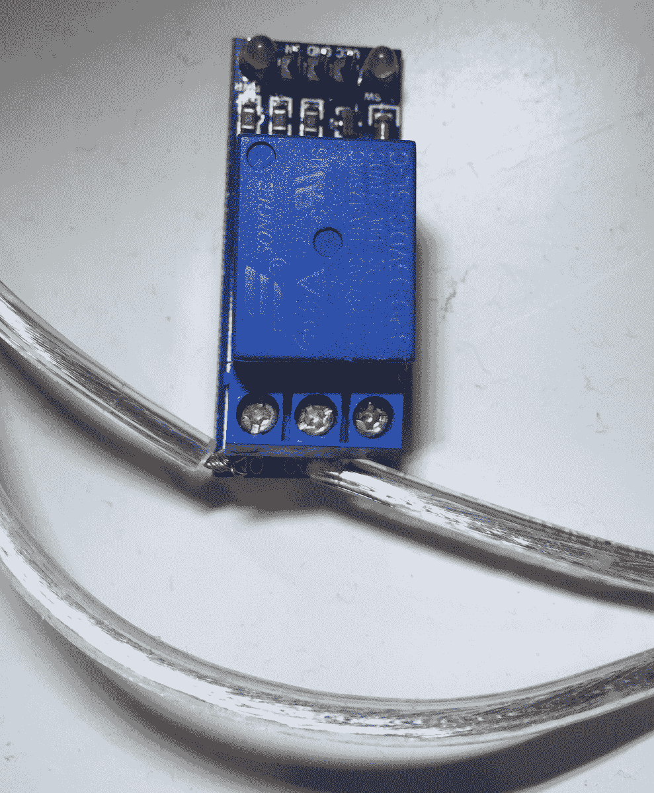
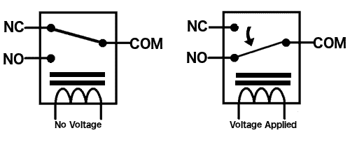
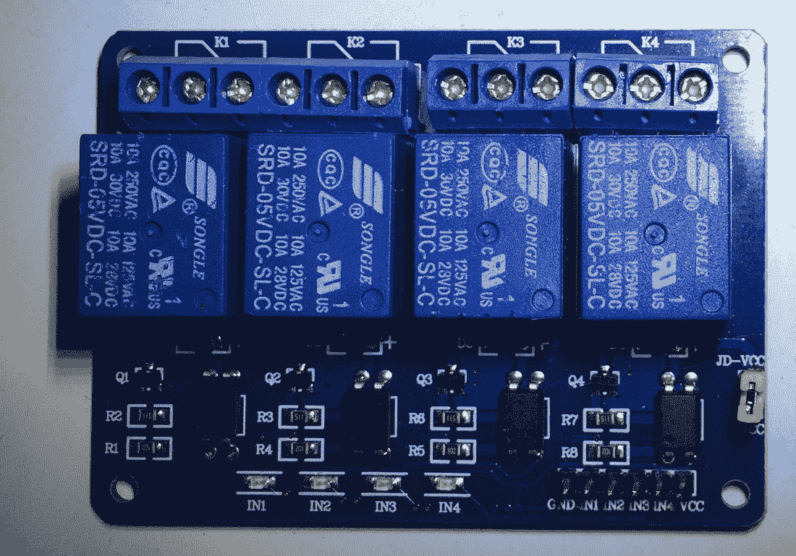
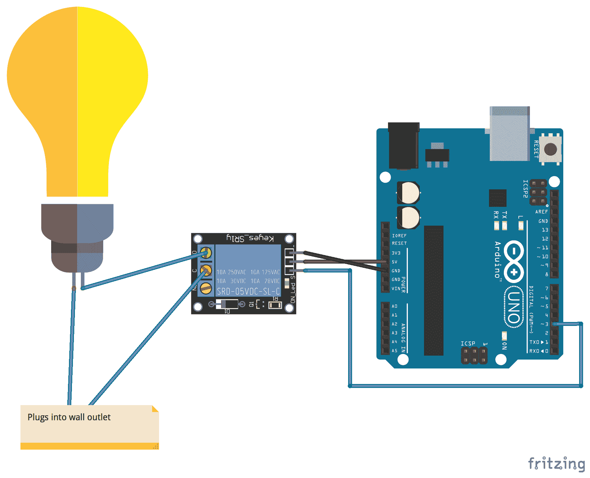
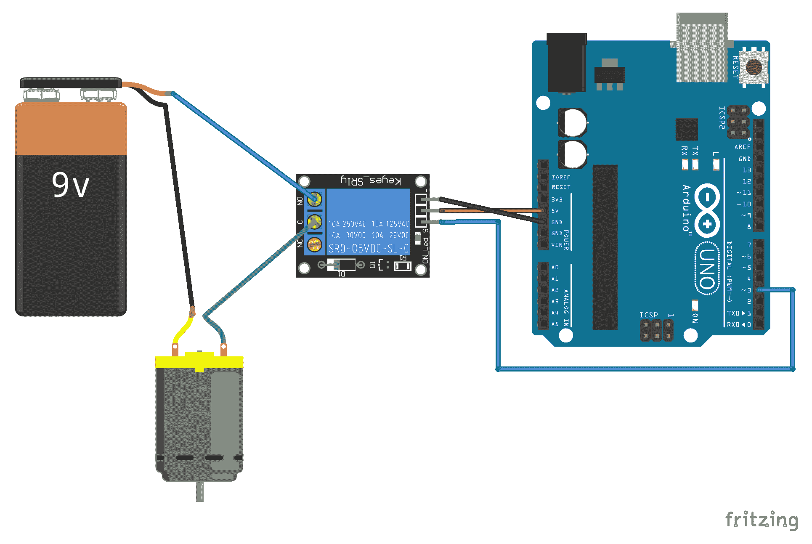

# 第十七章：使用继电器

有时候，我们想要控制高电压的物品，如灯、风扇或任何其他家用电器。然而，Arduino 以及本书中迄今为止的所有项目都使用**直流电**（**DC**），而你的家用电器使用**交流电**（**AC**）。交流电和直流电之间存在显著差异。在本章中，我们将探讨如何使用 Arduino 和继电器来控制使用交流电的灯。

在本章中，你将学习：

+   什么是继电器

+   如何使用继电器控制交流供电设备

+   如何使用继电器控制直流供电设备

+   如何使用继电器隔离电路

# 简介

**警告：**在本章中，我们将根据你所在的国家使用 120V 或 240V 交流电，这比本书中我们使用过的任何其他东西都要强大得多。

如果不当处理、使用不当或不正确使用继电器或电源线，可能会导致严重伤害，甚至死亡。在尝试本章中的项目之前，请确保你已经阅读并理解了你的继电器板的工作原理，它所标称的电压和电流，以及使用交流电的风险。

**不要害怕寻求专业帮助**，如果你对任何事情不确定。交流电比我们在本书中之前使用的直流电危险得多。

如果你在一个项目中使用交流电感到不舒服，或者你对它不够熟悉，那么本章将提供两个电路图。一个图将展示如何将交流供电的灯连接到继电器，另一个图将展示如何使用继电器连接电机和 9V 电源。本章的代码将适用于任何项目，并将使灯或电机开启和关闭。

在对交流供电设备进行操作时，**始终**确保在开始工作之前将设备拔掉插头。来自电源插座的电击可能导致严重伤害，甚至死亡。

继电器可以被视为一个电开关。许多继电器使用电磁铁来机械地操作开关。然而，还有其他控制继电器的方法。一个例子是固态继电器，它不使用任何机械部件。我们与 Arduino 一起使用的多数继电器使用电磁铁来操作开关。

当需要将两个或更多电路彼此隔离，同时仍能从其中一个电路（例如 Arduino）控制另一个电路中的组件时，会使用继电器。当你在项目中使用所有组件的直流电时，通常不需要隔离电路；然而，当你想要控制一个交流供电设备，如台灯时，就需要一个像继电器这样的设备。

如我们之前提到的，如果你不熟悉在交流供电设备上工作，那么请使用直流电机项目而不是灯项目。这两个项目使用相同的概念；然而，一个由交流电供电，另一个由直流电供电。

AC 供电设备的插头包含两根线。为了将此设备连接到继电器，我们需要剪断其中一根线，并将一端连接到继电器上的 COM 连接，另一端连接到继电器上的 NO 连接。另一根电缆保持完好。以下照片说明了这一点：



电磁继电器上的**NO**标签代表**常开**，而**NC**标签代表**常闭**。COM 连接，通常位于 NO 和 NC 连接之间，是公共连接。当继电器关闭时，电源通过 NC 连接，这意味着如果继电器关闭时 AC 供电设备应该开启，那么它应该连接到 COM 和 NC 连接。如果 AC 供电设备仅在继电器开启时开启，那么它应该连接到 COM 和 NO 连接，就像我们在这里做的那样。

继电器通常标有最大电压为 230 VAC 至 250 VAC 或 30 VDC，电流为 10A。您需要验证项目中的继电器能否处理您正在运行的电压和电流。

以下图示展示了继电器的工作原理：



在前面的图像中，我们看到当没有电压施加到继电器上时（左侧的图像），NC 引脚连接到 COM 端子，从而完成该电路。当施加电压时，电枢被拉到 NO 引脚，连接到 COM 端子，完成该电路。

在前面的照片中，使用了单个继电器的板。然而，还有包含多个继电器的板，这使我们能够控制多个电路中的组件。以下照片展示了一个包含四个继电器的板：



本章中展示的继电器适用于交流和直流电路。因此，它们可以用于本章中的任何项目。如果您愿意，甚至可以尝试两个项目。

让我们看看本章项目所需的组件。

# 需要的组件

+   一个 Arduino Uno 或兼容板

+   一个继电器板

+   跳线

+   您希望用 Arduino 控制的 AC 供电设备，例如台灯，或者如果您希望使用直流电源设备而不是交流电源设备

+   一个 9V 电池适配器，带有直流电机的电池

# 电路图

以下图示展示了我们如何将 AC 供电设备和 Arduino 连接到继电器：



AC 供电设备按照*简介*部分所述连接到继电器。继电器上的**VCC**引脚连接到 Arduino 的**5V**输出，继电器上的**GND**引脚连接到 Arduino 的**GND**引脚。我们将 Arduino 的数字 3 引脚连接到继电器上标记为**IN**的引脚。数字 3 引脚将用于控制继电器。

以下图示展示了我们如何使用继电器通过 Arduino 控制直流电机和 9V 电源：



在之前的电路中，我们强调了在各个组件之间需要有公共地线的重要性；然而，在这个电路中，你会注意到 Arduino 和电机/9V 电池电路之间没有公共地线。当使用继电器时，继电器两边的电路是相互隔离的；因此，我们不想在这两者之间有公共地线。如果你希望两个电路之间有公共地线，那么继电器就不再必要了，因为继电器是用来隔离两个电路的。

现在，让我们看看这些电路的代码。

# 代码

以下为本章项目中代码的示例：

```cpp
#define RELAY 3 

void setup() {
  pinMode(RELAY, OUTPUT);
}

void loop() {
  digitalWrite(RELAY, HIGH);
  delay(3000);
  digitalWrite(RELAY, LOW);
  delay(3000);
}
```

现在代码看起来应该很熟悉了。此代码首先定义继电器连接到 Arduino 的数字 3 号引脚。在`setup()`函数中，我们启用继电器引脚以输出模式，因为我们想使用`digitalWrite()`函数来开启和关闭继电器。

在`loop()`函数中，我们使用`digitalWrite()`函数将继电器引脚设置为高电平，暂停三秒钟，然后再次使用`digitalWrite()`函数将继电器引脚设置为低电平，并最终再次暂停三秒钟。这样，连接到继电器的组件每三秒钟就会开启和关闭一次。此代码适用于本章之前展示的交流电路或直流电路。

# 挑战

对于本章的挑战，使用带有四个继电器的板，并尝试将可以由 Arduino 控制的组件连接到每个继电器上。请注意，每个电路都需要其自身的独立电源。

# 概述

在本章中，我们看到了如何使用继电器控制交流电和直流电组件。我们还了解到，继电器两边的电路需要各自的独立电源。

在下一章中，我们将看到如何使用无线电频率远程控制 Arduino。
