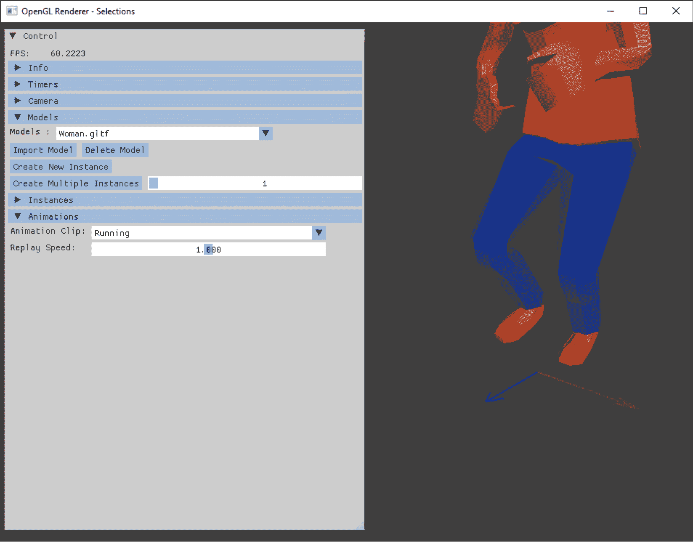
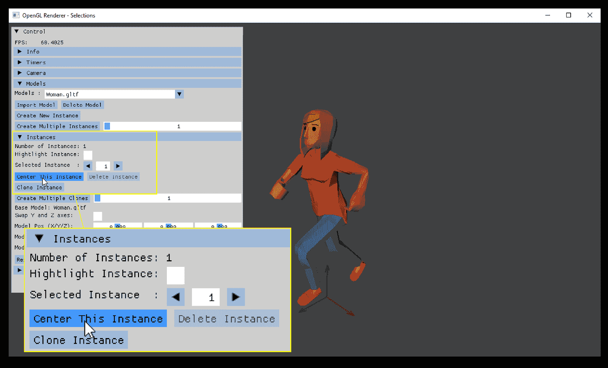
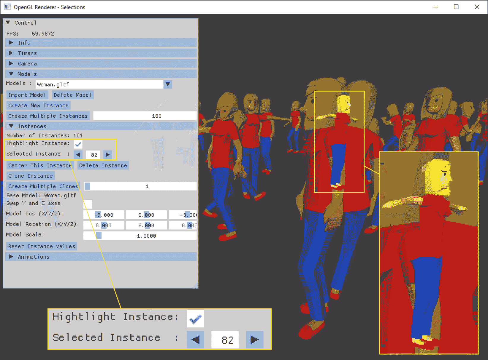

# 第三章：添加视觉选择

欢迎来到*第三章*！在前一章中，我们将大部分矩阵和向量计算任务卸载到了 GPU 上。现代显卡的计算核心（以及更专业的计算核心）比桌面 CPU 要多，因此，将计算负载移至 GPU 将释放主 CPU 的大部分动画工作。

在本章中，我们将添加一些简化操作，以便在处理大量模型实例时使用。在前一章的更改之后，我们能够在屏幕上显示数千个模型实例，但选择特定的实例仍然很困难。我们将首先添加坐标箭头以识别当前选定的实例。接下来，我们将添加一个允许我们将指定实例居中显示在屏幕中间的功能。然后，我们将创建一个图形高亮显示，进一步帮助我们找到所有实例中的选定实例。作为最后一步，我们将添加一个没有三角形的模型，以及从这个空模型中创建的一个实例，允许我们取消选择可见的实例。

在本章中，我们将涵盖以下主题：

+   实现一个“移动到实例”功能

+   为选定的实例添加高亮显示

+   使用点选选择模型实例

+   实现一个空对象以允许取消选择

初看，这些主题似乎与动画编程无关。但适当的工具是创建用户友好应用程序的重要组成部分。好的工具将帮助用户简化应用程序的处理。

在本书的后续章节中，当你创建了数十个甚至数百个实例，它们在屏幕上快乐地跳跃和随机移动时，只需用鼠标单击一个实例即可选择它，使用 UI 按钮将实例居中显示在屏幕上，或使用鼠标移动和旋转实例，这将使你的生活变得更加轻松。你甚至可能会忘记前两章在选择实例或更改实例属性时是多么繁琐。

# 技术要求

我们需要从*第二章*中的应用代码：[`github.com/PacktPublishing/Mastering-Cpp-Game-Animation-Programming`](https://github.com/PacktPublishing/Mastering-Cpp-Game-Animation-Programming)。

本章的示例源代码可以在文件夹`chapter03`的子文件夹`01_opengl_selection`（用于 OpenGL）和`02_vulkan_selection`（用于 Vulkan）中找到。

# 实现一个“移动到实例”功能

作为“移动到实例”功能的第一个更改，我们将添加一组小坐标箭头，出现在绘制的模型的原点，以识别当前选定的实例。我们还将添加一个按钮以居中当前选定的实例。让我们从坐标箭头的实现开始。

## 添加坐标箭头

由于我们将使用线条而不是三角形在所选实例的中心绘制坐标箭头，我们需要一些额外的数据结构、对象和着色器。为了存储顶点和颜色数据，我们在 `opengl` 文件夹中的 `OGLRenderData.h` 文件声明中添加了两个新的结构体：

```cpp
struct OGLLineVertex {
  glm::vec3 position = glm::vec3(0.0f);
  glm::vec3 color = glm::vec3(0.0f);
};
struct OGLLineMesh {
  std::vector<OGLLineVertex> vertices{};
}; 
```

对于 Vulkan，新的结构体命名为 `VkLineVertex` 和 `VkLineMesh`，位于 `vulkan` 文件夹中的 `VkRenderData.h` 文件中。

将坐标箭头数据上传到 GPU 时，将在 `opengl` 文件夹中添加一个新的类 `LineVertexBuffer`。获取新类文件的一个简单方法是将 `VertexIndexBuffer` 类的两个源文件（`VertexIndexBuffer.h` 和 `VertexIndexBuffer.cpp`）复制到 `opengl` 文件夹中，然后调整 `init()` 方法以将 `position` 和 `color` 数据发送到显卡：

```cpp
 glVertexAttribPointer(0, 3, GL_FLOAT,
    GL_FALSE, sizeof(OGLLineVertex),
    (void*) offsetof(OGLLineVertex, position));
  glVertexAttribPointer(1, 3, GL_FLOAT,
    GL_FALSE, sizeof(OGLLineVertex),
    (void*) offsetof(OGLLineVertex, color));
  glEnableVertexAttribArray(0);
  glEnableVertexAttribArray(1); 
```

我们还必须通过使用 `glEnableVertexAttribArray()` 并提供相应的索引值（`glVertexAttribPointer` 的第一个参数）来启用 `position` 和 `color` 属性，以便将这两个属性的数据发送到顶点着色器。

在 GPU 端，需要两个简单的透射着色器——顶点着色器和片段着色器将只传递数据，而不进行额外的变换，除了所需的视图和投影矩阵变换。名为 `line.vert` 的顶点着色器位于 `shader` 文件夹中，它使用相机位置的视图和投影矩阵来计算最终的顶点位置。然后，将线条端点的位置和颜色传递给也位于 `shader` 文件夹中的名为 `line.frag` 的片段着色器。

我们坐标箭头的顶点是从名为 `CoordArrowsModel` 的静态模型文件中获取的，该文件位于 `model` 文件夹中。我们可以通过硬编码顶点位置和颜色来简化初始化过程：

```cpp
 /*  X axis - red */
  mVertexData.vertices[0].position =
    glm::vec3(0.0f,0.0f, 0.0f);
  mVertexData.vertices[1].position =
    glm::vec3(1.0f, 0.0f,  0.0f);
  mVertexData.vertices[2].position =
    glm::vec3(1.0f, 0.0f,  0.0f);
  ...
  mVertexData.vertices[0].color =
    glm::vec3(0.8f, 0.0f, 0.0f);
  mVertexData.vertices[1].color =
    glm::vec3(0.8f, 0.0f, 0.0f);
  mVertexData.vertices[2].color =
    glm::vec3(0.8f, 0.0f, 0.0f);
  ... 
```

坐标箭头顶点的最终位置是在渲染的 `draw()` 调用中设置的。作为第一步，行计数器将被置零，用于坐标箭头顶点的 `mLineMesh` 向量将被清空：

```cpp
 mCoordArrowsLineIndexCount = 0;
  mLineMesh->vertices.clear(); 
```

接下来，我们检索当前所选实例的设置，包含实例的位置和旋转：

```cpp
 InstanceSettings instSettings =
    mModelInstData.miAssimpInstances.at(
    mModelInstData.miSelectedInstance)
    ->getInstanceSettings(); 
```

然后，我们将顶点数添加到行计数器变量 `mCoordArrowsLineIndexCount` 中，并使用 `std::for_each` 迭代每个顶点：

```cpp
mCoordArrowsLineIndexCount +=
     mCoordArrowsMesh.vertices.size();
std::for_each(mCoordArrowsMesh.vertices.begin(),
    mCoordArrowsMesh.vertices.end(),
      ={
      n.color /= 2.0f;
      n.position =
        glm::quat(glm::radians(
        instSettings.isWorldRotation)) * n.position;
        n.position += instSettings.isWorldPosition;
    }); 
```

通过使用 lambda 函数，顶点的位置数据被修改以匹配实例的位置和旋转。此外，我们通过将颜色向量除以 2 的值来降低坐标箭头的颜色。

每个顶点的结果数据被收集在 `mLineMesh` 向量中：

```cpp
 mLineMesh->vertices.insert(mLineMesh->vertices.end(),
      mCoordArrowsMesh.vertices.begin(),
      mCoordArrowsMesh.vertices.end()); 
```

然后，我们将顶点数据上传到 GPU，并绘制坐标线：

```cpp
 mLineVertexBuffer.uploadData(*mLineMesh);
  if (mCoordArrowsLineIndexCount > 0) {
    mLineShader.use();
    mLineVertexBuffer.bindAndDraw(GL_LINES, 0,
      mCoordArrowsLineIndexCount);
  } 
```

在这里，`mCoordArrowsLineIndexCount`用于检查是否存在坐标线，并且作为绘制正确数量点的参数。使用线数作为检查值和计数器可以帮助我们，如果我们根本不想绘制任何坐标线：我们可以简单地跳过填充`mLineMesh`和计数坐标线，自动跳过线绘制。或者，我们可以在多选场景中绘制多个坐标箭头。

在 Vulkan 中上传顶点数据比 OpenGL 复杂得多，因为 Vulkan API 的显式性。创建不同着色器和上传顶点数据的完整过程在 Vulkan 中需要以下步骤：

1.  在 GLSL 或 HLSL（DirectX 的高级着色语言）中创建一对透射着色器。对于 GLSL 着色器，语法只有细微的差别——大多数情况下是在使用`layout`语句时更加明确。

1.  使用新的着色器和相应的属性定义创建一个新的管线。Vulkan 需要一个新管线，因为创建后管线本身将变为**不可变**的（除了少数几个显式动态可配置的子对象，如视口）。Vulkan 的着色器**不能**像 OpenGL 那样在运行时交换；我们需要绑定另一个管线来使用不同的着色器绘制顶点。

1.  通过使用阶段缓冲区将顶点数据上传到 GPU。为了在 Vulkan 中获得最佳性能，顶点数据应存储在只有 GPU 可以访问的优化格式内存区域中。使用 CPU 和 GPU 之间共享的缓冲区需要驱动程序进行额外的同步，并且数据可能不是 GPU 绘制的最佳格式，从而导致性能损失。

1.  在记录要发送到 GPU 的渲染传递命令时，我们必须使用`vkCmdBindPipeline()`方法绑定新管线，并使用`vkCmdBindVertexBuffers()`方法绑定顶点缓冲区。在提交命令缓冲区到驱动程序后，使用新着色器绘制顶点。

您可以在示例代码的`vulkan`文件夹中查看`Shader`、`Pipeline`和`VertexBuffer`类的实现细节。此外，在*附加资源*部分提供了一个指向 Vulkan 教程的链接。该教程有一个关于顶点缓冲区创建和数据上传的单独部分。

现在，在所选实例上添加了三个小箭头，如图*图 3.1*所示：



图 3.1：新的坐标箭头以识别所选实例

红色箭头指向正`x`轴的方向，蓝色箭头指向正`z`轴，绿色箭头指向正`y`轴。

作为“移动到实例”功能的第二步，将添加新的 UI 按钮。

## 创建一个按钮以居中选择的实例

对于用户界面中的新按钮，我们将遵循之前的实现，并为`UserInterface`类添加一个回调。该回调调用渲染器类中的方法，将用户界面中的相机计算相关部分移动到渲染器。

在`UserInterface`类中，我们添加了一个新的 ImGui 按钮，以及新的回调，使用当前实例作为参数：

```cpp
 if (ImGui::Button("Center This Instance")) {
      std::shared_ptr<AssimpInstance> currentInstance =
        modInstData.miAssimpInstances.at(
          modInstData.miSelectedInstance);
       modInstData.miInstanceCenterCallbackFunction(
         currentInstance);
    } 
```

当渲染器初始化时，回调`miInstanceCenterCallbackFunction`将通过 lambda 函数绑定到渲染器的新的`centerInstance()`方法：

```cpp
 mModelInstData.miInstanceCenterCallbackFunction =
   this
   { centerInstance(instance); }; 
```

`centerInstance()`方法提取实例的位置，在所有轴向上添加 5 个单位的静态偏移量，并调用相机对象的`moveCameraTo()`方法：

```cpp
void OGLRenderer::centerInstance(
    std::shared_ptr<AssimpInstance> instance) {
  InstanceSettings instSettings =
    instance->getInstanceSettings();
  mCamera.moveCameraTo(mRenderData,
    instSettings.isWorldPosition + glm::vec3(5.0f));
} 
```

最后，`moveCameraTo()`将相机移动到渲染器中给出的实例位置加上偏移量，并使用固定的方位角和仰角值将选定的实例居中在屏幕中间：

```cpp
void Camera::moveCameraTo(OGLRenderData& renderData,
    glm::vec3 position) {
  renderData.rdCameraWorldPosition = position;
  renderData.rdViewAzimuth = 310.0f;
  renderData.rdViewElevation = -15.0f;
} 
```

使用硬编码的方位角和仰角值使过程变得稍微容易一些，因为从像`glm::lookAt()`这样的方法生成的矩阵中提取这两个值要复杂一些。您可能尝试自己通过变换矩阵设置相机角度 - 请参阅*实践课程*部分。

您可以在实例的折叠标题中的任何位置添加新的 ImGui 居中按钮。在示例代码中，按钮被放置在箭头下方以选择当前实例，如图*图 3.2*所示：



图 3.2：当前选定的实例已被居中

将当前选定的实例居中是朝着更好的*外观和感觉*迈出的巨大一步。我们不需要搜索闪烁的实例或坐标箭头以找到选定的实例；现在，我们实际上只需点击一下鼠标即可到达实例。

然而，这个解决方案还有一些缺点。如果我们不想居中选定的实例，可能是因为我们希望保持相机位置固定，那该怎么办？所以，让我们在代码中添加另一个函数，使得当前选定的实例在屏幕上显示的所有实例中更容易找到。

# 为选定的实例添加高亮

初看起来，通过向顶点和顶点缓冲区添加更多字段，添加某种类型的高亮似乎很简单。遗憾的是，我们出于性能原因正在使用实例渲染。这意味着所有实例共享相同的顶点数据。因此，这种方法不可行。

下一个想法可能是实例放置和动画数据。这些矩阵完全由我们的计算着色器从*第二章*计算得出，由节点的节点变换数据提供。将模型相关数据添加到每个节点似乎有点过度，因为高亮的数据只需要每个实例一次，而不是每个节点一次。

一个更好的想法是另一个 SSBO，在从实例中检索节点变换数据后，立即在渲染器的`draw()`调用中填充正确的数据。在实例循环中，我们直接访问模型的所有实例，并可以简单地向`std::vector`推送一个值，表示这是否是选定的实例。在将向量的数据上传到 SSBO 之后，着色器实例可以检查缓冲区数据，以确定是否应该将其高亮添加到它正在处理的实例中，或者不添加。

## 准备渲染器以支持高亮显示

作为向选定实例添加高亮的第一个步骤，我们向渲染器头文件添加一个包含`float`的向量和，对于 OpenGL 渲染器，一个 SSBO：

```cpp
 std::vector<float> mSelectedInstance{};
    ShaderStorageBuffer mSelectedInstanceBuffer{}; 
```

由于不同的数据逻辑，对于 Vulkan，文件`VkRenderData.h`中的`VkRenderData`结构体将使用`VkShaderStorageBufferData`对象代替。

在渲染器的`draw()`调用中，我们在开始遍历模型和实例之前，保存当前选定实例的智能指针：

```cpp
 std::shared_ptr<AssimpInstance> currentSelectedInstance =
    nullptr;
  ...
    currentSelectedInstance =
      mModelInstData.miAssimpInstances.at(
      mModelInstData.miSelectedInstance); 
```

除了存储实例之外，我们通过添加缩放的`deltaTime`并重置值，一旦达到`2.0f`，在`OGLRenderData`相应的`VkRenderData`结构体中更改一个浮点值：

```cpp
 mRenderData.rdSelectedInstanceHighlightValue +=
    deltaTime * 4.0f;
  if (mRenderData.rdSelectedInstanceHighlightValue > 2.0f) {
      mRenderData.rdSelectedInstanceHighlightValue = 0.1f
  } 
```

变量`rdSelectedInstanceHighlightValue`的值将在着色器中使用，以放大或缩小选定实例的颜色。通过在每次`draw()`调用中添加`deltaTime`的值，并在达到`2.0f`时将高亮变量重置为`0.1f`，选定的实例将从非常暗变为非常亮，闪烁的实例在屏幕上更容易被发现，比仅仅的坐标箭头更容易识别。

在实例循环内部，我们比较我们正在处理的实例的智能指针和保存的选定实例的智能指针。如果它们相同，变量`rdSelectedInstanceHighlightValue`的交替值将被设置为`mSelectedInstance`向量中当前实例的索引：

```cpp
 if (currentSelectedInstance ==
        modelType.second.at(i)) {
        mSelectedInstance.at(i) =
          mRenderData.rdSelectedInstanceHighlightValue;
      } else {
        mSelectedInstance.at(i) = 1.0f;
      } 
```

如果我们在循环中处理任何其他实例，我们只需将`x`值设置为`1.0f`，这将导致着色器中实例的颜色保持不变。

然后将`mSelectedInstance`向量的收集数据上传到 SSBO。例如，OpenGL 渲染器使用`ShaderStorageBuffer`类的`uploadSsboData()`方法将向量数据上传到 GPU：

```cpp
 mSelectedInstanceBuffer.uploadSsboData(
      mSelectedInstance, 3); 
```

## 调整着色器和 UI 的逻辑

作为向选定实例添加高亮的下一个步骤，着色器需要进行调整。在`shader`文件夹中的`assimp_skinning.vert`顶点着色器中，必须添加新的 SSBO：

```cpp
layout (std430, binding = 3) readonly restrict
    buffer InstanceSelected {
  float selected[];
}; 
```

在`shader`文件夹中用于非动画模型实例的`assimp.vert`着色器中也需要进行相同的添加。

请检查绑定编号——由于缺少动画数据，动画和非动画实例的着色器中 SSBO 的数量不同：动画模型的着色器在绑定点`3`上绑定实例选择数据，因为绑定点`2`已经被世界位置矩阵使用：

```cpp
 mShaderBoneMatrixBuffer.bind(1);
  mShaderModelRootMatrixBuffer.uploadSsboData(
      mWorldPosMatrices, 2);
  mSelectedInstanceBuffer.uploadSsboData(
      mSelectedInstance, 3); 
```

相比之下，非动画模型的着色器只绑定两个缓冲区：

```cpp
 mShaderModelRootMatrixBuffer.uploadSsboData(
    mWorldPosMatrices, 1);
  mSelectedInstanceBuffer.uploadSsboData(
    mSelectedInstance, 2); 
```

现在我们可以使用着色器的内部变量`gl_InstanceID`来调整所选实例的颜色，检索`selected`缓冲区中实例位置的数据：

```cpp
 color = aColor * selected[gl_InstanceID]; 
```

作为可选的更改，我们还可以将所选实例的深度值减去`1.0f`：

```cpp
 if (selected[gl_InstanceID] != 1.0f) {
    gl_Position.z -= 1.0f;
  } 
```

降低内部变量`gl_Position`的`z`元素将调整三角形的深度值到可能的最小值。这种深度调整使得高亮显示的实例即使在其他实例更靠近摄像机位置时也能可见。

最后，我们在`OGLRenderData`和`VkRenderData`结构体中添加了一个名为`rdHighlightSelectedInstance`的`Boolean`变量，使我们能够开关高亮显示。这个新变量将被附加到`UserInterface`类中的 ImGui 复选框：

```cpp
 ImGui::Text("Hightlight Instance:");
    ImGui::SameLine();
    ImGui::Checkbox("##HighlightInstance",
      &renderData.rdHighlightSelectedInstance); 
```

在*图 3.3*中，展示了在顶点着色器中结合高亮显示和`z`位置调整的效果：



图 3.3：在靠近摄像机的实例上绘制的高亮显示实例

根据较亮实例的相对大小，这个实例至少部分地隐藏在靠近摄像机的其他实例后面。然而，`z`位置的调整将所选实例绘制在屏幕上所有实例的顶部。

图片中无法展示的是所选实例的交替亮度。如渲染器的`draw()`调用中设置的那样，所选实例的颜色从只有原始颜色的 10%（`0.1f`的起始值）增加到原始颜色的 200%（限制在`2.0f`）。

实例的闪烁颜色将使在屏幕上找到当前所选实例变得相当容易。但应用程序中仍有一块缺失的部分：能够通过点击窗口而不是使用实例编号箭头搜索所有实例来选择所需的实例。现在让我们处理视觉选择。

# 使用点和点击选择模型实例

在我们开始实现之前，我们将探讨向应用程序添加视觉选择的不同方法：通过“射击”一个光线到虚拟场景中，以及使用包含实例索引的纹理。

## 射击虚拟光线的优缺点

你可能会发现将虚拟光线射入场景中的以下想法很有吸引力：

我们已经拥有了虚拟世界中的摄像机位置作为第一个端点，通过将鼠标指针位置从屏幕位置映射回场景坐标，你将得到第二个端点。将坐标映射回场景只需要进行几个矩阵的逆运算和乘法运算。

听起来很有希望且简单，不是吗？

很遗憾，在这个阶段低估最终复杂性的情况很常见。只要世界上只有一个模型，或者两个，一切都会好。你将虚拟射线射入场景，然后遍历每个实例的三角形，以找到射线与实例三角形之间的最近交点。

但当你有，比如说，1,000 个实例时会发生什么呢？

每次你点击鼠标上的选择按钮时，你都需要遍历所有实例的所有三角形，希望至少找到一个匹配项。书中提到的测试模型大约有 2,000 个三角形，因此你将需要在包含 1,000 个实例的虚拟世界中检查 2,000,000 个可能的交点。即使使用大规模并行计算机着色器，这么多的计算量对于现代显卡来说也是相当大的。

有几种方法可以排除虚拟世界中大片区域参与碰撞测试。结合节点级别的其他分层方法，可以通过几个数量级降低交点检查的数量。我们将在处理实例碰撞时，在*第八章*中介绍该过程的优化。

那么，关于使用纹理的替代想法呢？

## 将实例索引绘制到纹理中的优势

一个额外的纹理用于实例选择的基点理念来源于**延迟渲染**。在延迟渲染中，像光照这样的计算不是在片段着色器中完成的，而是在将所需信息存储在纹理中之后“延迟”执行。包含屏幕上所有像素信息的纹理集合被称为**G-Buffer**，简称**几何缓冲区**。

通过使用 G-Buffer 中纹理的数据，将光照应用于场景的复杂性从“三角形数量 * 场景中所有灯光的数量”降低到“G-Buffer 的像素数量 * 附近灯光的数量”。

即使是 4K 或 8K 的图形分辨率，创建光照信息所需的操作数量也会大幅降低。此外，通过使用渲染过程中的其他信息，使用延迟渲染可以轻松实现其他效果，如阴影映射或间接光照。

对于简单的光线投射，选择复杂性随着虚拟世界中实例数量的增加而增加，即使这些实例在屏幕上不可见。当我们应用延迟渲染方法到视觉选择时，我们在绘制一些像素到单独纹理上有一个恒定的开销。我们的选择过程不再依赖于世界中实例的变量数量。此外，缓冲区的分辨率可能只会对实例选择性能产生轻微的影响。

添加具有单独纹理的视觉选择所需的更改量出人意料地低。让我们看看我们必须采取的步骤。

## 调整帧缓冲区

我们从`FrameBuffer`类开始，并添加一个新的颜色附加组件。对于 OpenGL 版本，新的颜色附加组件创建如下。

```cpp
 glGenTextures(1, &mSelectionTex);
  glBindTexture(GL_TEXTURE_2D, mSelectionTex);
  glTexImage2D(GL_TEXTURE_2D, 0, GL_R32F, width, height,
    0, GL_RED, GL_FLOAT, NULL);
  glBindTexture(GL_TEXTURE_2D, 0);
  glFramebufferTexture(GL_FRAMEBUFFER,
    GL_COLOR_ATTACHMENT1, mSelectionTex, 0); 
```

对于选择纹理，我们添加一个只包含单个元素的纹理，即红色。但我们使用 32 位宽的红色，而不仅仅是 8 位，这使得我们可以存储更多的实例索引。然后，新的纹理作为索引为 1 的颜色附加组件添加到帧缓冲区中。

关于纹理数据类型（float）的说明

有可能创建一个类型为`GL_R32UI`的纹理，每个像素包含一个 32 位宽的无符号整数。但所有整数的纹理版本都使用一个转换因子来处理组件，这增加了选择过程的复杂性，因为读取和写入时需要进行额外的计算。相比之下，`GL_R32F`缓冲区存储和检索未更改的浮点值。通过在 GPU 端使用浮点数，我们仍然能够存储约 1670 万个实例索引（2²⁴），在 32 位浮点数的精度可能导致整数和浮点值转换时的舍入误差之前。有关浮点精度的更多详细信息，请参阅*附加资源*部分中的博客文章链接。

此外，在创建帧缓冲区时，我们必须确保我们的着色器写入两个颜色附加组件：

```cpp
 const GLenum buffers[] = { GL_COLOR_ATTACHMENT0,
   GL_COLOR_ATTACHMENT1 };
  glDrawBuffers(2, buffers); 
```

如果我们不更改要绘制的缓冲区，则只有模型将在屏幕上绘制，选择纹理永远不会被填充。

为了使用不同的值清除颜色缓冲区和选择缓冲区，已向`FrameBuffer`类添加了一个名为`clearTextures()`的新方法：

```cpp
void Framebuffer::clearTextures() {
  static GLfloat colorClear[] =
    { 0.25f, 0.25f, 0.25f, 1.0f };
  glClearBufferfv(GL_COLOR, 0, colorClear);
  static GLfloat selectionClearColor = -1.0f;
  glClearBufferfv(GL_COLOR, 1, &selectionClearColor);
  static GLfloat depthValue = 1.0f;
  glClearBufferfv(GL_DEPTH, 0, &depthValue);
} 
```

选择纹理可以存储任意浮点值，使用`-1.0f`来清除选择纹理，这是一个为空背景拥有唯一值的好方法。

我们还避免了创建另一个 SSBO 来存储实例索引，并将`mSelectedInstance`向量从`float`扩展到`glm::vec2`：

```cpp
 std::vector<glm::vec2> mSelectedInstance{}; 
```

通过将现有的高亮颜色移动到`glm::vec2`向量的`x`元素，我们有一个免费的`float`类型位置，并且可以将实例索引存储在`y`元素中。

### 创建选择着色器

向帧缓冲器添加新的颜色缓冲区也需要两对新的顶点/片段着色器：一对用于动画模型，另一对用于非动画模型。但由于我们已将实例高亮选取信息发送到着色器，因此只需对现有着色器代码进行少量添加。

由于我们可以重用着色器，第一步是复制现有文件。对于非动画模型，将着色器`assimp.vert`复制到`assimp_selection.vert`，将`assimp.frag`复制到`assimp_selection.frag`。相同的名称添加也将用于动画模型着色器：将文件`assimp_skinning.vert`复制到`assimp_skinning_selection.vert`，将`assimp_skinning.frag`复制到`assimp_skinning_selection.frag`。

我们还需要在渲染器中添加两个新的着色器对象，因此我们在文件`OGLRenderer.h`中添加名为`mAssimpSelectionShader`和`mAssimpSkinningSelectionShader`的`private` `Shader`成员变量：

```cpp
 Shader mAssimpSelectionShader{};
    Shader mAssimpSkinningSelectionShader{}; 
```

与现有的着色器一样，两个新的着色器在渲染器的`init()`方法中加载。

然后，必须向新的顶点着色器中添加两行代码。第一行新代码向顶点着色器添加一个名为`selectInfo`的新输出变量，使我们能够将当前三角形的选取数据传递给片段着色器：

```cpp
...
layout (location = 2) out vec2 texCoord;
**layout** **(****location** **=** **3****)** **out****float** **selectInfo;** 
```

`main()`方法的最后一行负责实际转发到片段着色器：

```cpp
 selectInfo = selected[gl_InstanceID].y;
} 
```

对于两个新的片段着色器，需要类似的更改。在着色器代码之上，我们必须添加新的输入变量`selectInfo`：

```cpp
layout (location = 2) in vec2 texCoord;
**layout** **(****location** **=** **3****)** **flat****in****float** **selectInfo;** 
```

此外，片段着色器的输出也需要调整。将单个`FragColor`输出行替换为以下两行：

```cpp
**layout** **(****location** **=** **0****)** **out****vec4** **FragColor;**
**layout** **(****location** **=** **1****)** **out****float** **SelectedInstance;** 
```

现在，我们写入两个不同的输出，每个颜色缓冲区一个：帧缓冲器的颜色缓冲区将填充每个像素的屏幕颜色 RGBA 值，就像之前一样，在`main()`方法的末尾，从顶点着色器传递的实例索引将被写入第二个颜色缓冲区：

```cpp
 SelectedInstance = selectInfo; 
```

如果现在在绘制实例时使用新的选取着色器，实例的索引将添加到每个实例屏幕上的选取缓冲区中的每个像素。

### 从纹理中读取像素

在给定位置读取像素的颜色将在`FrameBuffer`类的`readPixelFromPos()`方法中完成。

首先，我们使用特殊值初始化指定的返回变量，以便在 OpenGL 由于配置问题拒绝读取像素颜色时容易找到错误：

```cpp
float Framebuffer::readPixelFromPos(unsigned int xPos,
    unsigned int yPos) {
  float pixelColor = -444.0f; 
```

接下来，我们将帧缓冲对象绑定为缓冲区以读取，并选择帧缓冲区的颜色附加`1`，其中包含选取纹理：

```cpp
 glBindFramebuffer(GL_READ_FRAMEBUFFER, mBuffer);
  glReadBuffer(GL_COLOR_ATTACHMENT1); 
```

然后，我们调整读取过程中使用的内部对齐方式，并在给定的`xPos`和`yPos`位置读取单个像素的颜色值：

```cpp
 glPixelStorei(GL_UNPACK_ALIGNMENT, 1);
  glReadPixels(xPos, yPos, 1, 1, GL_RED, GL_FLOAT,
    &pixelColor); 
```

最后，我们将帧缓冲区切换回颜色附加`0`，解绑缓冲区并返回像素颜色：

```cpp
 glReadBuffer(GL_COLOR_ATTACHMENT0);
  glBindFramebuffer(GL_READ_FRAMEBUFFER, 0);
  return pixelColor;
} 
```

## 添加鼠标按钮处理

将实例选择添加到左鼠标按钮。点击实例来选择它感觉很自然。为了存储选择状态，我们在渲染器中添加了一个名为 `mMousePick` 的布尔成员变量。

然后，必须在渲染器的 `handleMouseButtonEvents()` 方法中添加以下行：

```cpp
 if (button == GLFW_MOUSE_BUTTON_LEFT &&
      action == GLFW_RELEASE) {
    mMousePick = true;
  } 
```

使用 `GLFW_RELEASE` `action` 在这里，当左鼠标按钮释放时做出反应，与许多应用程序的选择风格相匹配。如果您想更改行为，可以使用 `GLFW_PRESS` 动作。

我们仅在用户通过选择事件触发选择时，使用 `mMousePick` 值在绘图过程中触发不同的动作。将正常绘制和选择额外操作分开，有助于保持应用程序的最大速度，避免仅在选择期间需要的操作。

例如，只有当触发选择事件时，具有将内容绘制到选择纹理中的逻辑的着色器才会被调用：

```cpp
 if (mMousePick) {
      mAssimpSkinningSelectionShader.use();
    } else {
      mAssimpSkinningShader.use();
    } 
```

## 为每个实例分配一个索引

为了确保我们始终为每个实例维护一个唯一的索引，每次添加或删除实例时，我们都会分配其整体索引。使用每个实例的唯一索引也有助于我们在 `miAssimpInstances` 向量中访问当前实例。

我们在 `model` 文件夹中 `InstanceSettings.h` 文件所在的 `InstanceSettings` 结构体中添加了一个新变量 `isInstanceIndexPosition`：

```cpp
struct InstanceSettings {
 ...
  int isInstanceIndexPosition = -1;
}; 
```

变量 `isInstanceIndexPosition` 将在 `assignInstanceIndices()` 方法中设置，该方法会遍历所有实例：

```cpp
void OGLRenderer::assignInstanceIndices() {
  for (size_t i = 0;
      i < mModelInstData.miAssimpInstances.size(); ++i) {
  InstanceSettings instSettings =
    mModelInstData.miAssimpInstances.at(i)
    ->getInstanceSettings();
  instSettings.isInstanceIndexPosition = i;
  mModelInstData.miAssimpInstances.at(i)
    ->setInstanceSettings(instSettings);
  }
} 
```

当实例被添加或删除时，会调用 `assignInstanceIndices()` 方法。

手头有一个易于访问的实例编号有助于我们在遍历模型的所有实例时填充 `mSelectedInstance` 向量的 `y` 元素：

```cpp
 if (mMousePick) {
      InstanceSettings instSettings =
         modelType.second.at(i)->getInstanceSettings();
      mSelectedInstance.at(i).y =
        static_cast<float>(
        instSettings.isInstanceIndexPosition);
    } 
```

## 在鼠标位置选择实例

作为视觉选择的最后一步，我们在渲染器中的 `draw()` 调用结束时触发像素读取：

```cpp
 if (mMousePick) {
    glFlush();
    glFinish(); 
```

通过在像素读取周围检查 `mMousePick` 变量，我们确保只有在选择事件上才会调用读取像素的函数。

这种保护检查对于调用 `glFlush()` 和 `glFinish()` 尤为重要。这两个命令都是必需的，以确保所有着色器运行都已结束，选择纹理中的数据已完整。虽然 `glFlush()` 清空内部缓冲区并触发渲染本身，但 `glFinish()` 会阻塞渲染器并等待所有之前的 OpenGL 调用完成。在大多数实现中，强制这些 OpenGL 命令在每个帧上都会降低每秒帧数。

接下来，我们在 `FrameBuffer` 实例上调用 `readPixelFromPos()`：

```cpp
 float selectedInstanceId =
      mFramebuffer.readPixelFromPos(mMouseXPos,
      (mRenderData.rdHeight - mMouseYPos - 1)); 
```

由于 OpenGL 中的 `y` 轴方向在 Windows 和 Linux 上的不同，我们需要在读取像素时反转 `y` 位置。

在我们检索像素颜色之后，我们检查是否有任何实例被选中，或者鼠标点击是在屏幕的背景上完成的：

```cpp
 if (selectedInstanceId >= 0.0f) {
      mModelInstData.miSelectedInstance =
        static_cast<int>(selectedInstanceId);
    }
    mMousePick = false;
  } 
```

作为最后一步，我们将 `mMousePick` 设置为 `false`，立即停止选择模式。

在 *图 3.4* 中，展示了较大组模型实例的选择纹理：


图 3.4：选择纹理

*图 3.4* 中的背景颜色已被改为白色。在实际的选择纹理中，清晰的值 `-1.0f` 将被钳位到零，从而得到一个黑色背景。此外，索引值已调整以增强实例的可见性。如果我们用实际的浮点值渲染选择纹理，所有索引值都将被钳位到 `1.0f`，从而得到一个所有实例都显示为鲜红色的图片。

使用鼠标选择单个实例现在工作得很好。作为 *实践课程* 部分中的一个想法，你可以尝试添加更多功能，比如同时选择多个实例。例如，在选中实例时按住 *Ctrl* 或 *Shift* 键，新选中的实例将被添加，显示所有选中实例的坐标箭头和高亮。

但还有一件事可能让你感到烦恼：没有方法可以完全不选择任何实例。我们将在本章的最后部分添加一个空选择的解决方案。

# 实现空对象以允许取消选择

在应用程序窗口的背景上点击以取消选择带来了一系列有趣的含义。例如，位置 `0` 可能是 `miAssimpInstance` 向量中的一个有效索引，表示已选择了第一个实例。所以，简单地使用零来表示没有实例被选中是不行的。更糟糕的是：将零作为第一个索引可能会让应用程序的用户感到困惑，因为从零开始计数并不是有意为之，而是从一开始的。

此外，`-1` 的默认缓冲区背景值是一个无效的数组索引。使用 `-1` 作为 `miAssimpInstance` 向量的索引将简单地导致应用程序崩溃。由于我们将在代码中频繁使用实例向量，为每次单独访问添加范围检查将至关重要，因为即使错过一次检查也会导致崩溃。

因此，我们需要另一种信号机制来在两种选择变体之间切换，并简化范围检查。为了用一个解决方案来捕捉这两个问题，我们将使用一个空模型作为 **空对象**。

## 什么是空对象？

使用空对象是面向对象编程中众所周知的设计模式。通常，你会使用 `nullptr` 来表示对象实例的缺失。但是，使用 `nullptr` 需要在每次使用实例之前进行额外的检查，以确定其实例是否有效。取消引用一个不存在的实例会导致运行时错误，并使应用程序崩溃。

空对象是一个有效的对象实例，提供了一种定义良好但中性的行为。空对象实例中的函数调用是有效的，但可能返回无用的结果，例如空列表或一些默认值。这种行为使得代码无需进行额外的检查，因为实例本身是有效的。

对于我们的选择问题，我们简单地创建一个返回无顶点的 `AssimpModel` 类实例，以及节点、网格等空列表或向量。然后，我们将特殊模型作为第一个模型添加到 `miModelList` 向量中，并将一个“空模型”实例作为第一个实例添加到 `miAssimpInstances` 向量以及 `miAssimpInstancesPerModel` 映射中。

如果我们现在选择第一个模型实例，我们将有一个有效的对象，只是屏幕上没有绘制任何三角形。关闭坐标箭头或调整用户界面以禁用未选择实例的控制，无需额外的信号变量。我们只需要测试 `miSelectedInstance` 是否为 `0`。

我们将稍微改变原始模式，不使用派生类。相反，我们将提供一个空的 `AssimpModel` 类对象。

## 创建和使用 AssimpModel 空对象

由于我们已经在头文件 `AssimpModel.h` 中使用默认值初始化了类成员变量，因此创建一个空对象可以通过创建一个空实例来实现。创建 `AssimpModel` 类实例而不设置任何数据的最简单方法是通过使用隐式创建的默认构造函数。我们甚至不需要定义自定义构造函数；C++ 编译器将在后台处理我们需要的所有内容。

在渲染器的 `init()` 方法中，我们创建了一个指向空模型的智能指针，并将模型指针添加到 `miModelList` 向量中：

```cpp
 std::shared_ptr<AssimpModel> nullModel =
    std::make_shared<AssimpModel>();
  mModelInstData.miModelList.emplace_back(nullModel) 
```

然后，我们可以从空模型创建一个 `AssimpInstance` 实例，并将其放入 `miAssimpInstancesPerModel` 映射和 `miAssimpInstances` 向量中：

```cpp
 std::shared_ptr<AssimpInstance> nullInstance =
    std::make_shared<AssimpInstance>(nullModel);
  mModelInstData.miAssimpInstancesPerModel[nullModel
    ->getModelFileName()].emplace_back(nullInstance);
  mModelInstData.miAssimpInstances.emplace_back(
    nullInstance); 
```

作为最后的初始化步骤，我们更新实例的索引号：

```cpp
 assignInstanceIndices(); 
```

现在，`nullModel` 模型实例的索引号为 `0`。任何在应用程序中添加的实例现在将从索引 `1` 开始。匹配实例总数和实例索引号将避免对实例编号方案的混淆。

为了在渲染器的 `draw()` 调用中跳过模型进行顶点处理，添加了一个对三角形数量的检查：

```cpp
 if (numberOfInstances > 0 &&
        modelType.second.at(0)->getModel()
        ->getTriangleCount() > 0) {
      ... 
```

如果模型中没有三角形，将跳过该特定模型的全部实例。

此外，我们在生成坐标箭头的最终顶点位置之前检查实例号 `0`：

```cpp
 if (mModelInstData.miSelectedInstance > 0) {
    .... 
```

当选择第一个实例——空模型实例——时，屏幕上不会绘制任何坐标箭头。我们甚至可以在这里移除 `miAssimpInstances` 向量的 `size()` 检查，因为我们知道至少有一个有效的实例可用。

## 调整用户界面

在用户界面中，我们将稍微作弊一下，以保持实例选择字段在选中空实例时禁用：

```cpp
 bool modelListEmtpy =
       modInstData.miModelList.size() == 1;
    bool nullInstanceSelected =
      modInstData.miSelectedInstance == 0;
    size_t numberOfInstances =
      modInstData.miAssimpInstances.size() - 1; 
```

通过从 `miModelList` 向量的尺寸中减去 `1`，我们忽略了该向量中的空模型。我们还忽略了空模型的空实例，以计算 `numberOfInstances` 中的实例数量。额外的布尔值 `nullInstanceSelected` 帮助我们在模型和实例可用但未选择任何实例时禁用用户界面的部分。

在 *图 3.5* 中，展示了使用空对象取消选择的效果：


图 3.5：当没有选择任何内容时，用户界面部分禁用

模型实例的脚下不绘制坐标箭头，因为我们选择空实例时隐藏箭头。此外，用户界面部分禁用，这是在计算实例数量时忽略空实例的效果。

# 摘要

在本章中，我们增强了代码中的实例选择方法，以更好地处理在屏幕上找到所选实例。此外，我们添加了使用鼠标选择实例的能力。首先，我们实现了一个按钮，将我们的虚拟相机中心对准所选实例。接下来，我们添加了突出显示所选模型的能力，使其更容易在屏幕上找到。然后，我们实现了视觉选择，允许用户通过点击任何实例来选择实例。最后，我们创建了选择零个实例的可能性，以避免意外更改。

在下一章中，我们将为将更多游戏引擎功能适配到模型查看器打下一些基础。除了将查看器的行为分为编辑模式和纯查看功能外，我们还将添加将正在进行中的更改还原到实例的能力。在下一章的结尾，我们将实现撤销/重做功能，使用户能够撤销更改，或者重新应用之前的更改。

# 实践课程

你可以在代码中添加一些内容：

+   在移动相机时计算方位角和仰角。

目前，方位角和仰角的值是硬编码的。你可以尝试从变换矩阵中计算这两个值。

+   实现视觉多选。

增强选择功能，以便在选择点击时按住 *Ctrl* 或 *Shift*，将新选定的实例添加到其他选定的实例中，而不是替换当前选定的实例。

+   额外难度：通过坐标箭头实现实例移动。

由于选择用的坐标箭头是在一个单独的着色器中绘制的，你可以尝试向箭头添加一组额外的选择索引，并将箭头添加到选择纹理中。当用户点击箭头而不是模式时，你可以将应用程序切换到允许实例沿选定轴移动的模式。这种行为类似于在任何常见的 3D 编辑器中移动实例。

# 其他资源

+   OpenGL 基础：[`learnopengl.com/Getting-started/Hello-Triangle`](https://learnopengl.com/Getting-started/Hello-Triangle)

+   OpenGL 着色器编程：[`learnopengl.com/Getting-started/Shaders`](https://learnopengl.com/Getting-started/Shaders)

+   Vulkan 教程：[`vulkan-tutorial.com`](https://vulkan-tutorial.com)

+   浮点精度揭秘：[`blog.demofox.org/2017/11/21/floating-point-precision/`](https://blog.demofox.org/2017/11/21/floating-point-precision/)

+   空对象模式：[`www.geeksforgeeks.org/null-object-design-pattern/`](https://www.geeksforgeeks.org/null-object-design-pattern/)

# 加入我们的 Discord 社区

加入我们的 Discord 空间，与作者和其他读者进行讨论：[`packt.link/cppgameanimation`](https://packt.link/cppgameanimation)


