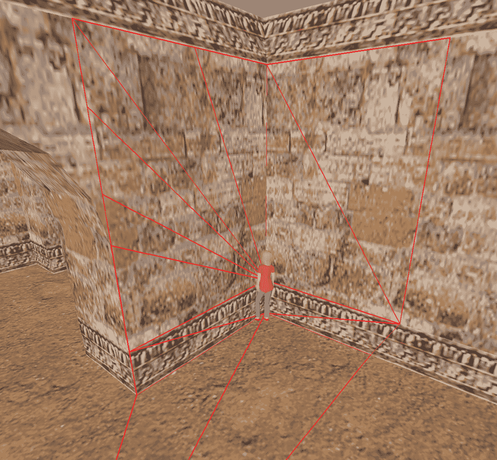
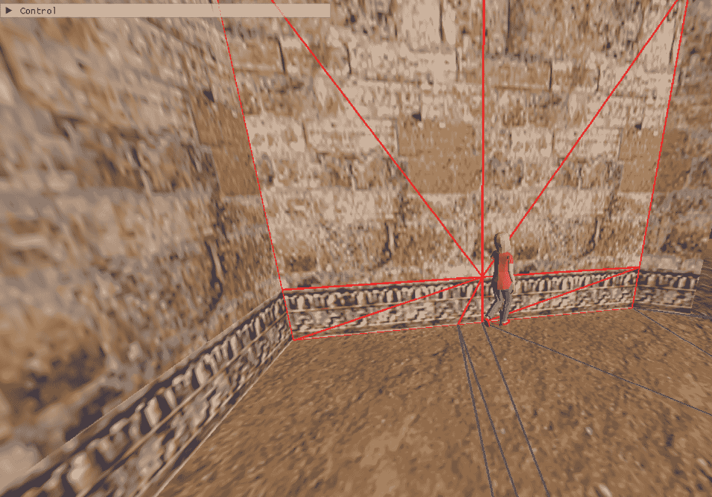
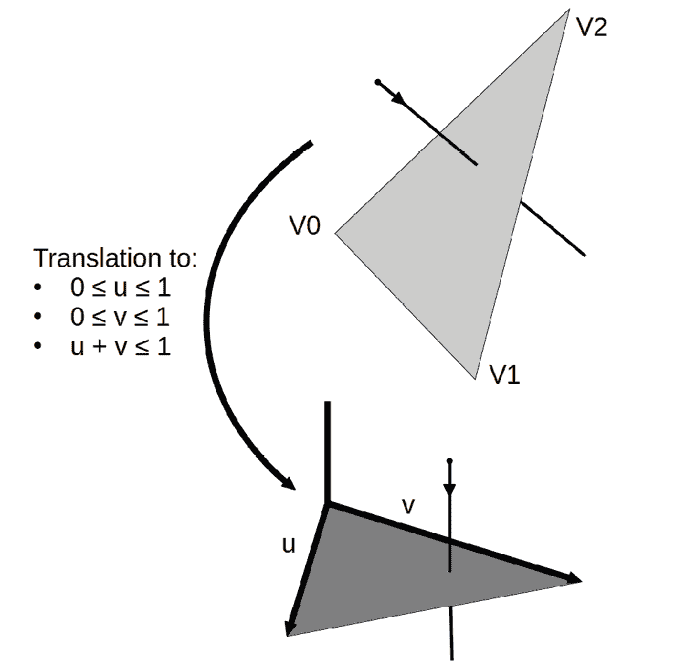
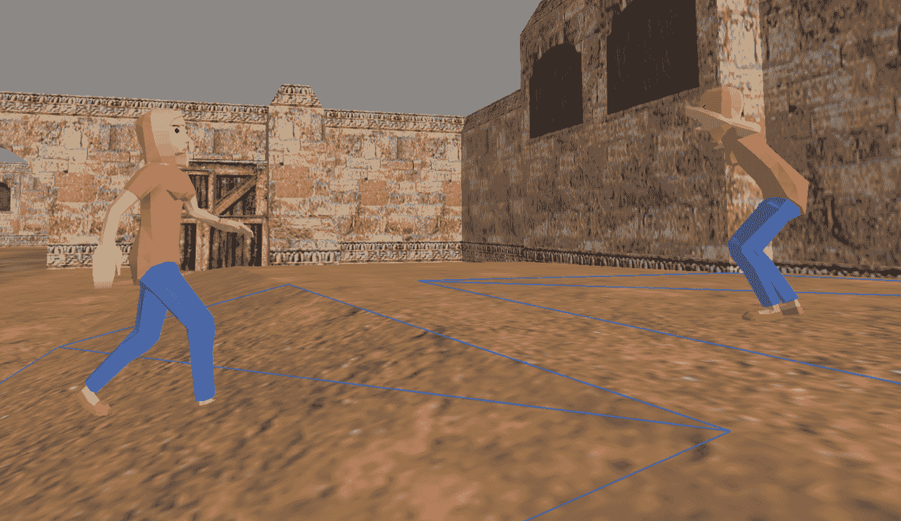
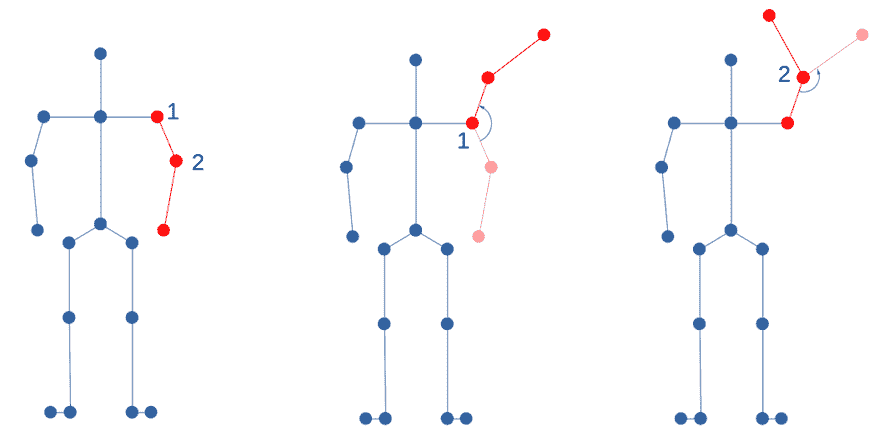
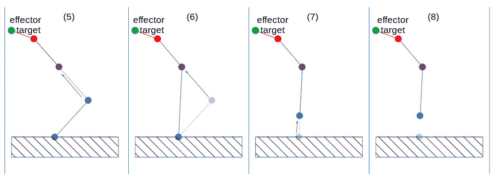
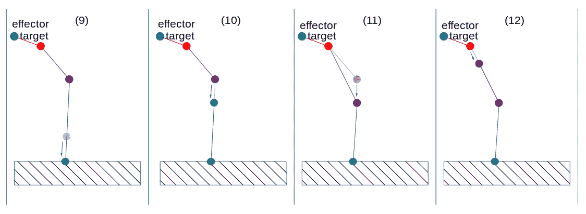
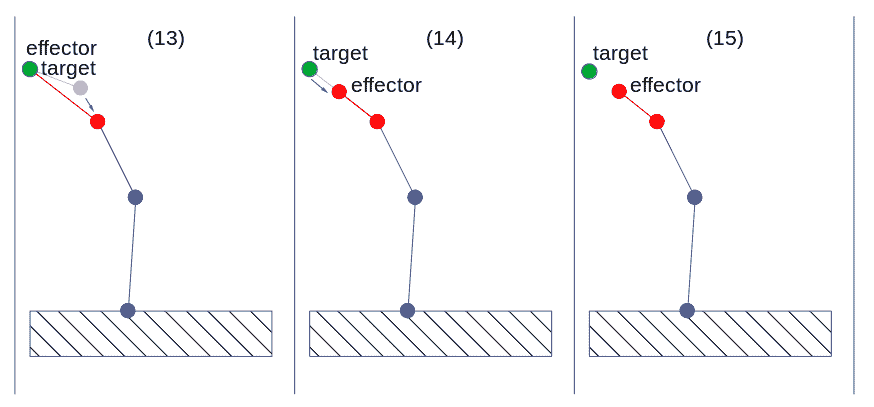
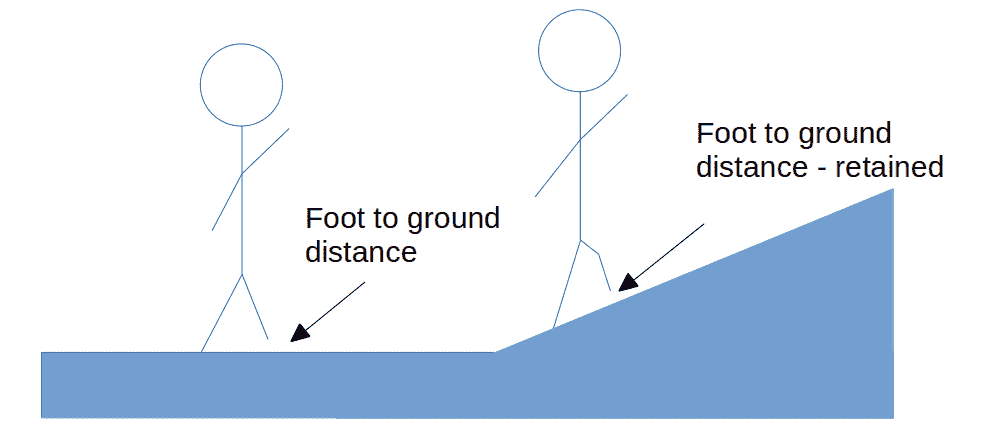
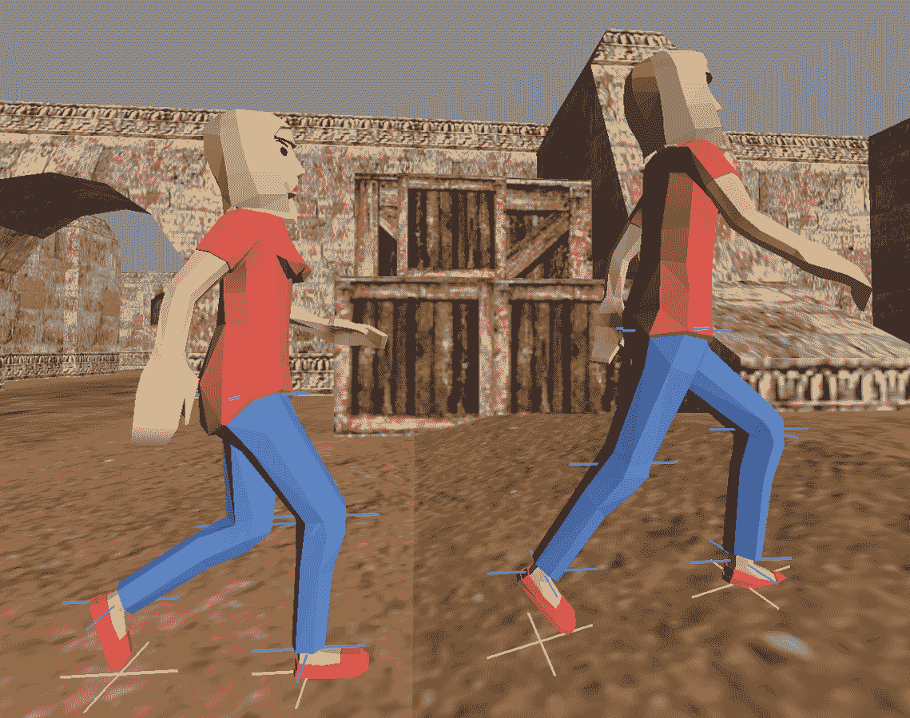

# 第十二章：高级碰撞检测

欢迎来到**第十二章**！在前一章中，我们向虚拟世界添加了加载静态关卡数据的能力。现在实例不再需要在空中运行；它们可以拥有一个虚拟的家。首先，我们探讨了模型数据和关卡数据之间的差异，以及主要用于关卡数据的文件格式，以及在哪里可以找到互联网上的游戏地图。然后，我们添加了加载关卡数据的代码，并用三维八叉树替换了二维四叉树。最后，我们实现了关卡数据的渲染，包括线框、八叉树和关卡 AABB 线的调试数据。

在本章中，我们将扩展前一章中的关卡数据。首先，我们将为关卡数据添加一个专门的八叉树，并更新代码以支持实例和关卡几何之间的碰撞检测。然后，我们将向虚拟世界添加一种简化的重力形式，以使实例保持在地面水平，而不是在空中漂浮。作为最后一步，我们将为实例腿部引入逆运动学，以允许实例以更自然的腿部动作爬坡和上楼梯，并防止脚部嵌入地面或漂浮在空中。

在本章中，我们将涵盖以下主题：

+   提升关卡数据的碰撞检测

+   使用重力使实例保持在地板水平

+   添加逆运动学

# 技术要求

本章的示例代码位于`chapter12`文件夹中，对于 OpenGL 位于`01_opengl_adv_collision`子文件夹，对于 Vulkan 位于`02_vulkan_adv_collision`子文件夹。

# 提升关卡数据的碰撞检测

为了加速实例和关卡几何之间的碰撞检测，我们将为关卡数据创建空间分区，例如八叉树。但是，我们不会将关卡三角形添加到实例八叉树中，而是为三角形数据单独构建一个专门的八叉树。

## 添加新的八叉树类型

使用单独的数据结构来处理关卡数据比试图将两种数据类型混合到现有的八叉树中更有意义，原因如下：

+   关卡数据是静态的，而实例位置频繁变化。我们需要在每次实例位置变化时对高度使用的八叉树进行昂贵的更新，这可能导致在移除和重新添加实例时进行大量的分割和合并操作。

+   关卡数据和实例的细分数量可能完全不同，这取决于关卡复杂性和实例数量。在详细关卡周围只有少数实例漫游可能会导致在搜索附近的三角形或实例时产生巨大的开销。

+   我们为了简化，使用八叉树来处理关卡数据，但其他数据结构，如 BSP 树或**边界体积层次（BVHs）**，更为常见。由于 BSP 树和 BVHs 不能像我们的八叉树那样快速动态更新，因此在关卡数据和实例之间仍然需要进行分割。

通过使用两个不同的八叉树，我们可以克服上述提到的问题。在添加所有级别三角形后，级别数据八叉树保持不变，两个八叉树都有它们自己的细分，这取决于每个八分体的数据量，但我们可以通过使用级别八叉树中的实例边界框来组合信息。

作为级别八叉树的第一步，我们在 `opengl` 文件夹中的 `OGLRenderData.h` 文件中添加了一个名为 `MeshTriangle` 的新 `struct`：

```cpp
struct MeshTriangle {
  int index;
  std::array<glm::vec3, 3> points;
  BoundingBox3D boundingBox;
}; 
```

对于 Vulkan，三角形 `struct` 将添加到 `vulkan` 文件夹中的 `VkRenderData.h` 文件中。

`index` 成员主要用于调试目的，如果某些三角形无法添加到八叉树中，它将被添加到日志输出行中。在 `points` 数组中，我们保存三角形三个点的世界位置。世界位置用于创建三角形适当边界框，我们稍后也将使用世界位置进行碰撞检测。`boundingBox` 成员包含级别数据网格中每个三角形的 `AABB`。

使用边界框而不是八叉树中的实际三角形数据大大简化了查询操作，因为我们不需要在搜索碰撞时检查每个三角形的精确轮廓。我们可能会通过使用 AABB 检查出更多的三角形，但由于我们只需要进行最多六个简单的 `float` 比较即可，因此 AABB 检查的成本很低。由于大多数级别的几何部分要么是墙壁要么是地面，因此 `AABB` 的额外大小并不重要。

接下来，我们在 `octree` 文件夹中添加了新的八叉树类 `TriangleOctree`。新的三角形八叉树将在两个新文件 `TriangleOctree.h` 和 `TriangleOctree.cpp` 中实现。

`TriangleOctree` 类是正常 `Octree` 类的一个副本，但有几点例外：

+   我们在树中存储三角形数据而不是实例索引。

+   由于级别数据八叉树将保持只读状态，我们不需要更新或删除对象或合并八分体的方法。

+   在三角形八叉树中，我们只处理静态数据，对同一级别的三角形进行交点搜索不会为我们提供任何有用的信息。因此，`findAllIntersections()` 和 `findIntersectionsInDescendants()` 方法也可以省略。

除了在 *添加新的八叉树类型* 部分中提到的使用单独八叉树存储级别数据的理由外，我们还为不适合单个八分体的对象使用不同的方法。

在实例八叉树中，实例的边界框只有在罕见情况下才会大于单个八分体，例如实例通过大因子缩放时。但在级别八叉树中，许多三角形的边界框可能无法适应单个细分八分体。级别的创建者会尝试最小化级别中的三角形数量，以获得良好的渲染性能，从而产生仅由少数大三角形组成的地形区域。

我们可以通过以下三种方法之一克服大小问题：

1.  保持一个足够大的三角形在八分界中，以包含整个三角形。这种解决方案将在父节点中存储额外的对象，而不仅仅是叶子节点。

1.  将三角形添加到所有受影响的细分八分界中。我们只有在最坏的情况下才会重复 8 次三角形数据，但叶子节点中只有数据。

1.  在八分界线上分割三角形，并将子三角形添加到每个八分界中。同样，每个受影响的八分界将增加一个额外的三角形，并且可能在分割线上存在舍入误差的问题。

为了保持代码简单，我们将使用第一种方法，并且只在父八分界中添加超出细分八分界尺寸的任何三角形。

我们可以通过在`add()`和`split()`方法中进行两步检查来实现超大三角形的存储过程。首先，我们遍历所有子八分界以找到三角形与子八分界边界的可能交点：

```cpp
 int intersectingChildren = 0;
    for (int i = 0; i < node->childs.size(); ++i) {
      BoundingBox3D childBox = getChildOctant(box, i);
      if (childBox.intersects(triangle.boundingBox)) {
        intersectingChildren++;
      }
    } 
```

如果我们与子八分界相交，我们增加`intersectingChildren`变量。然后，对于`add()`方法，我们检查三角形将与多少个子八分界相交。如果超过一个八分界，则保持三角形在当前八分界中：

```cpp
 if (intersectingChildren > 1) {
      node->triangles.emplace_back(triangle);
    } else {
      int i = getOctantId(box, triangle.boundingBox);
      if (i != -1) {
        add(node->childs.at(i), depth + 1,
         getChildOctant(box, i), triangle);
      }
    } 
```

如果我们只与单个子八分界相交，我们将递归地将三角形交给子八分界。

对于`split()`方法，我们做同样的事情，如果在当前八分界中找到与未来子八分界的多个交点，则保持三角形在当前八分界中：

```cpp
 if (intersectingChildren > 1) {
      newTriangles.emplace_back(triangle);
    } else {
      int i = getOctantId(box, triangle.boundingBox);
      if (i != -1) {
        node->childs.at(i)
          ->triangles.emplace_back(triangle);
      }
    } 
```

查询三角形八叉树以检测与边界框的碰撞的`query()`方法和显示八叉树调试线的`getTreeBoxes()`方法与原始八叉树相同，只需调整`private` `query()`方法的数据类型。

在`TriangleOctree`准备就绪后，我们可以将级别数据添加到新的八叉树中，并查询树以检测碰撞。

## 填充级别数据八叉树

如同实例八叉树一样，我们需要将`TriangleOctree.h`头文件添加到渲染器头文件中，然后添加一个名为`mTriangleOctree`的新`private`成员和两个`private`方法`initTriangleOctree()`和`generateLevelOctree()`：

```cpp
std::shared_ptr<TriangleOctree> mTriangleOctree = nullptr;
void initTriangleOctree(int thresholdPerBox, int maxDepth);
void generateLevelOctree(); 
```

为了有默认的阈值和深度值，并且能够通过 UI 稍后控制设置，在`opengl`文件夹中的`OGLRenderData.h`文件中的`OGLRenderData` `struct`中存储了两个新变量`rdLevelOctreeThreshold`和`rdLevelOctreeMaxDepth`：

```cpp
 int rdLevelOctreeThreshold = 10;
  int rdLevelOctreeMaxDepth = 5; 
```

对于 Vulkan，在`vulkan`文件夹中的`VkRenderData.h`文件中添加了两个变量到`VkRenderData` `struct`。

在渲染器的`init()`方法中，调用`initTriangleOctree()`来创建具有给定阈值和最大深度的八叉树：

```cpp
void OGLRenderer::initTriangleOctree(int thresholdPerBox,
  int maxDepth) {
  mTriangleOctree = std::make_shared<TriangleOctree>(
    mWorldBoundaries, thresholdPerBox, maxDepth);
} 
```

在生成级别 AABB 期间更新世界边界，因此我们的三角形八叉树在加载级别后与级别数据大小完全相同。

在`generateLevelOctree()`方法中完成填充级别数据八叉树。我们在这里只是走过重要的部分，因为外部代码只是遍历`ModelInstanceCamData`结构体中的`micLevels`向量的所有级别。

对于`micLevels`中的每个级别，我们以绘制级别的优化网格形式获取级别网格。然后，我们遍历级别网格的所有索引：

```cpp
 std::vector<OGLMesh> levelMeshes =
      level->getLevelMeshes();
      glm::mat4 transformMat =
        level->getWorldTransformMatrix();
      glm::mat3 normalMat =
        level->getNormalTransformMatrix();
    for (const auto& mesh : levelMeshes) {
      int index = 0;
      for (int i = 0; i < mesh.indices.size(); i += 3) { 
```

对于 Vulkan，`levelMeshes`向量将包含`VkMesh`数据类型。

我们必须使用索引来绘制三角形，因为三角形数据是根据索引存储的；直接使用顶点将不会给我们提供正确的信息来推断三角形的顶点。我们还从级别中检索世界和法线变换矩阵。法线变换矩阵只是世界变换矩阵的逆矩阵的转置，已经添加了`getNormalTransformMatrix()`方法来保持`AssimpLevel`类中的额外变换。

接下来，我们创建一个空的`MeshTriangle`并使用级别的变换矩阵将级别顶点变换到世界位置：

```cpp
 MeshTriangle tri{};
        tri.points.at(0) = transformMat *
          glm::vec4(glm::vec3(mesh.vertices.at(
          mesh.indices.at(i)).position), 1.0f);
        tri.points.at(1) = transformMat *
          glm::vec4(glm::vec3(mesh.vertices.at(
          mesh.indices.at(i + 1)).position), 1.0f);
        tri.points.at(2) = transformMat *
          glm::vec4(glm::vec3(mesh.vertices.at(
          mesh.indices.at(i + 2)).position), 1.0f); 
```

现在是时候为每个三角形创建边界了：

```cpp
 AABB triangleAABB;
        triangleAABB.clear();
        triangleAABB.addPoint(tri.points.at(0));
        triangleAABB.addPoint(tri.points.at(1));
        triangleAABB.addPoint(tri.points.at(2)); 
```

使用`AABB`可以轻松计算边界框坐标。从这个`AABB`中，我们创建一个`BoundingBox3D`并将结果存储在`MeshTriangle` `struct`的`boundingBox`成员中：

```cpp
 tri.boundingBox = BoundingBox3D(
          triangleAABB.getMinPos() -
          glm::vec3(0.0001f),
          triangleAABB.getMaxPos() -
          triangleAABB.getMinPos() + glm::vec3(0.0002f)); 
```

为了保持与`X`、`Y`或`Z`平面共面的三角形，需要添加一个小偏移量。如果没有偏移量，三角形的边界框在某个或多个维度上的尺寸可能会变成零，这将使我们无法检测与该三角形的碰撞。

最后，我们存储并增加调试索引号并将三角形添加到级别数据八叉树：

```cpp
 tri.index = index++;
        mTriangleOctree->add(tri);
     } 
```

通过在添加或删除级别数据时调用`generateLevelOctree`，我们确保我们的八叉树具有所有三角形的正确世界位置。在级别变化时实现更新的最佳方式是将八叉树更新与已经实现的级别数据`AABB`更新绑定。

为了实现这种耦合，我们添加了一个名为`generateLevelVertexData()`的新`private`方法，并在那里调用`AABB`和八叉树生成：

```cpp
void OGLRenderer::generateLevelVertexData() {
  generateLevelAABB();
  generateLevelOctree();
} 
```

然后，所有`generateLevelAABB()`的出现都被新的`generateLevelVertexData()`方法所替换，并且每当级别数据或其他属性，如旋转或缩放，发生变化时，级别八叉树也会更新。

使用最新的级别八叉树，我们最终可以检查实例是否与级别几何体发生碰撞。

## 检测实例/级别碰撞

通过使用与我们在*第八章*中“添加四叉树以存储附近的模型实例”部分相同的策略，对于实例/实例碰撞，找到实例与关卡三角形的碰撞很容易。我们只需遍历所有实例，获取实例的边界框，并查询三角形八叉树以获取与该边界框的碰撞。八叉树为我们提供了所有三角形，其中三角形的边界框与实例的边界框发生碰撞，即使实例未存储在三角形八叉树中。

要实现实例和关卡数据之间的碰撞检测，请按照以下步骤操作：

1.  首先，我们在`InstanceSettings.h`文件中的`InstanceSettings` `struct`中添加一个新的成员`isCollidingTriangles`，用于存储碰撞的三角形：

    ```cpp
     std::vector<MeshTriangle> isCollidingTriangles{}; 
    ```

1.  然后，在`AssimpInstance`类中创建一个新的`public`方法`setCollidingTriangles()`，将传入的三角形数据存储在实例设置中：

    ```cpp
    void AssimpInstance::setCollidingTriangles(
        std::vector<MeshTriangle>& collidingTriangles) {
      mInstanceSettings.isCollidingTriangles =
       collidingTriangles;
    } 
    ```

1.  接下来，在渲染器中创建一个新的私有方法`checkForLevelCollisions()`。我们首先获取实例设置并跳过空实例：

    ```cpp
    void OGLRenderer::checkForLevelCollisions() {
      for (const auto& instance :
          mModelInstCamData.micAssimpInstances) {
        InstanceSettings instSettings =
          instance->getInstanceSettings();
        if (instSettings.isInstanceIndexPosition == 0)
          continue;
        } 
    ```

1.  然后，我们简单地使用实例的边界框查询三角形八叉树：

    ```cpp
     std::vector<MeshTriangle> collidingTriangles =
          mTriangleOctree→query(instance->getBoundingBox()); 
    ```

1.  仅知道存在碰撞是好的，但我们希望存储碰撞数据以供进一步操作，例如响应碰撞或绘制调试线。因此，我们将`MeshTriangles`的向量存储在实例设置中：

    ```cpp
     instances.at(i)->setCollidingTriangles(
          collidingTriangles);
      }
    } 
    ```

在实例渲染完毕且在 UI 绘制之前，调用`checkForLevelCollisions()`方法到渲染器的`draw()`方法。现在，每一帧都会检查所有实例与关卡几何体的碰撞，如果找到碰撞的三角形，我们将它们存储在实例的`InstanceSettings`中。

虽然你可以信任碰撞检测的一般功能能够工作，但眼见为实。我们现在为各种关卡数据添加额外的调试线，允许我们在屏幕上作为叠加线绘制有效信息。

## 绘制调试线

如果我们想在屏幕上实时看到碰撞，我们可以突出显示关卡几何体中受影响的三角形。为了实现这种突出显示，我们将遵循以下步骤：

1.  我们向渲染器添加一个新的`private`成员`mLevelCollidingTriangleMesh`，用于存储碰撞的三角形网格：

    ```cpp
     std::shared_ptr<OGLLineMesh>
          mLevelCollidingTriangleMesh = nullptr; 
    ```

1.  然后，在`checkForLevelCollisions()`中，我们清除网格：

    ```cpp
     mLevelCollidingTriangleMesh->vertices.clear(); 
    ```

1.  然后，我们遍历所有碰撞的三角形，将顶点成对添加到网格存储中，为三角形的每一边创建一条线：

    ```cpp
     for (const auto& tri : collidingTriangles) {
         OGLLineVertex vert;
         vert.color = glm::vec3(1.0f, 0.0f, 0.0f);
         vert.position = glm::vec4(tri.points.at(0), 1.0f);
         mLevelCollidingTriangleMesh->vertices.push_back(vert);
         vert.position = glm::vec4(tri.points.at(1), 1.0f);
         mLevelCollidingTriangleMesh->vertices.push_back(vert);
         vert.position = glm::vec4(tri.points.at(1), 1.0f);
         mLevelCollidingTriangleMesh->vertices.push_back(vert);
         vert.position = glm::vec4(tri.points.at(2), 1.0f);
         mLevelCollidingTriangleMesh->vertices.push_back(vert);
         vert.position = glm::vec4(tri.points.at(2), 1.0f);
         mLevelCollidingTriangleMesh->vertices.push_back(vert);
         vert.position = glm::vec4(tri.points.at(0), 1.0f);
         mLevelCollidingTriangleMesh->vertices.push_back(vert);
      } 
    ```

1.  现在我们已经保存了所有实例检测到的三角形的轮廓。将三角形渲染到屏幕上可以通过简单的线绘制调用完成：

    ```cpp
    mLineVertexBuffer.uploadData(*mLevelCollidingTriangleMesh);
      if (mLevelCollidingTriangleMesh->vertices.size() > 0) {
        mLineShader.use();
        mLineVertexBuffer.bindAndDraw(GL_LINES, 0,
          mLevelCollidingTriangleMesh->vertices.size());
      } 
    ```

运行带有实例/关卡碰撞和调试绘制的应用程序，结果类似于*图 12.1*：



图 12.1：实例与关卡几何体的碰撞

在*图 12.1*中，实例与地面和几堵墙发生了碰撞。所有三角形都是通过使用它们的边界框被检测到的，所以当实例仍然离三角形本身有点距离时，如果三角形被高亮显示，请不要感到惊讶。在这种情况下，三角形的边界框被击中，覆盖了一个比三角形本身更大的区域。但是，检测到的碰撞中的误报数量很低，可能只会对碰撞检测的性能产生很小的影响。

为了让实例对与关卡几何形状的碰撞有适当的反应，我们将增强节点树。

## 扩展节点树以支持关卡几何形状碰撞

感谢在前几章中建立的良好基础，通过遵循这些步骤，添加新的碰撞类型只需几分钟：

1.  首先，我们将新的事件类型添加到`Enums.h`文件中的`nodeEvent` `enum`：

    ```cpp
    enum class nodeEvent : uint8_t {
      ...
     **instanceToLevelCollision,**
      NUM
    }; 
    ```

1.  我们还在渲染器的`init()`方法期间向`micNodeUpdateMap`添加了一些文本，以便在节点树中添加一个名称：

    ```cpp
     mModelInstCamData.micNodeUpdateMap[
        nodeEvent::instanceToLevelCollision] =
        “Inst to Level collision”; 
    ```

1.  然后，在`checkForLevelCollisions()`函数中，如果有至少一个碰撞的三角形，就触发新的事件：

    ```cpp
     if (collidingTriangles.size() > 0) {
          mModelInstCamData.micNodeEventCallbackFunction(
            instSettings.isInstanceIndexPosition,
            nodeEvent::instanceToLevelCollision);
        } 
    ```

1.  事件通知实例节点发生了与关卡几何形状的碰撞。例如，我们可以让实例通过 180 度转身，如图*图 12.2*所示：


图 12.2：一个响应实例/关卡碰撞的事件节点

在*图 12.2*中的事件节点中，实例在遇到关卡碰撞时会立即转身。此外，还添加了 250 毫秒的冷却时间。使用冷却时间应该会给实例一些时间，让它足够远离受影响的关卡几何形状，以避免立即重新触发关卡碰撞。

但目前，碰撞检测有一个巨大的缺点：实例始终在相同的高度水平上行走，因此在海拔变化时，会穿过山丘或在空中行走。

为了让实例保持在地面，让我们给应用程序添加一种简单的重力形式。

# 使用重力来保持实例在地板上

重力实际上始终在我们周围，加速物体向下直到它们撞击某个其他不可移动的物体，例如地面。我们在四处走动或站立时通常不会意识到重力的作用；我们只有在某物掉落并很可能在撞击地面时破碎时才会意识到它的力量。

在我们可以添加重力之前，我们需要找到一种方法来检测关卡几何形状中的三角形是否属于地面。

## 在关卡数据中找到地面三角形

对于现实世界的关卡，可以使用额外的属性来标记关卡区域是否可通行。由于我们希望将地面级别的技术尽可能通用，我们将采用不同的方法，并使用三角形的法线来检查我们周围的区域是否属于地板或墙壁，以及斜面区域可以行走到哪个角度。

我们将每个三角形的`normal`作为 3 元素向量存储在`MeshTriangle` `struct`中，以及其他三角形数据：

```cpp
struct MeshTriangle {
  ...
 **glm::vec3 normal;**
  BoundingBox3D boundingBox;
}; 
```

在`generateLevelOctree()`中生成三角形八叉树时，取三角形第一个顶点的法线：

```cpp
 tri.normal = glm::normalize(normalMat *
          glm::vec3(mesh.vertices.at(
          mesh.indices.at(i)).normal)); 
```

由于级别数据的索引结构，使用顶点的一个法线可能会导致由于为不同的三角形重复使用相同的顶点而产生的伪影。在这种情况下，我们可以改变法线的计算方法，使其成为每个三角形两条边的叉积：

```cpp
 glm::vec3 edge1 = glm::vec3(mesh.vertices.at(
          mesh.indices.at(i + 1)).position -
          mesh.vertices.at(mesh.indices.at(i)).position);
        glm::vec3 edge2 = glm::vec3(mesh.vertices.at(
          mesh.indices.at(i + 2)).position -
          mesh.vertices.at(mesh.indices.at(i)).position);
        tri.normal = glm::normalize(normalMat *
          glm::cross(edge1, edge2)); 
```

为了能够在用户界面中控制地面坡度，我们在`OGLRenderData` `struct`中添加了一个名为`rdMaxLevelGroundSlopeAngle`的新变量：

```cpp
 float rdMaxLevelGroundSlopeAngle = 0.0f; 
```

对于 Vulkan，像往常一样，变量将被添加到`VkRenderData` `struct`中。

然后，在`checkForLevelCollisions()`中，我们添加了一个新的检查，以确定向上指向的向量与三角形法线之间的角度是否大于可配置的最大地面坡度：

```cpp
 if (glm::dot(tri.normal, glm::vec3(0.0f, 1.0f, 0.0f))
         >= glm::cos(glm::radians(
         mRenderData.rdMaxLevelGroundSlopeAngle))) { 
```

在`if`块内部，我们现在可以将事件发送代码的限制条件改为仅触发墙壁，而不是地面三角形。我们还更改了检测为地面三角形的三角形的调试线条颜色为蓝色，而墙壁三角形的颜色保持为红色：

```cpp
 vertexColor = glm::vec3(0.0f, 0.0f, 1.0f);
     } else {
        vertexColor = glm::vec3(1.0f, 0.0f, 0.0f);
        mModelInstCamData.micNodeEventCallbackFunction(
          instSettings.isInstanceIndexPosition,
          nodeEvent::instanceToLevelCollision);
        } 
```

在`UserInterface`类的**级别...**部分，我们添加了一个浮点滑块以交互式地控制最大地面坡度：

```cpp
 ImGui::Text("Max Ground Slope:");
    ImGui::SameLine();
    ImGui::SliderFloat("##MaxSlope",
      &renderData.rdMaxLevelGroundSlopeAngle,
      0.0f, 45.0f, "%.2f", flags); 
```

现在应用程序以不同的颜色绘制墙壁和地面碰撞，如图*图 12.3*所示：



图 12.3：地面和墙壁的独立碰撞

如*图 12.3*所示，墙壁碰撞现在由红色三角形边缘标记，而地面碰撞则由蓝色三角形边缘突出显示。可以通过滑块配置斜率角度，允许微调哪些斜坡或边缘仍被视为地面。

除了实例与墙壁或地面之间的碰撞具有不同的颜色之外，事件报告也有所不同。对于地面碰撞，不会生成实例/级别几何碰撞事件，允许实例在级别中运行并仅与墙壁发生碰撞。

在我们可以检查实例是否与地面多边形发生碰撞后，是时候将重力添加到代码中。

## 添加基本重力

对于我们的应用，我们只使用简单的重力。我们只是在每一帧中将实例向下移动一定的距离，而不考虑更复杂的模式，例如随时间变化的加速度。如果你想实现更多细节，*附加资源*部分包含了深入探讨高级物理和碰撞检测主题的书籍的 ISBN。此外，*实践环节*部分的一个任务实现了增强重力。

为了能够向实例添加重力效果，我们在`AssimpInstance`类中创建了一个名为`applyGravity()`的新`public`方法：

```cpp
void AssimpInstance::applyGravity(float deltaTime) {
  glm::vec3 gravity =
    glm::vec3(0.0f, GRAVITY_CONSTANT * deltaTime, 0.0f);
  mInstanceSettings.isWorldPosition -= gravity;
} 
```

在`AssimpInstance.h`头文件中定义了私有变量`GRAVITY_CONSTANT`并将其设置为`9.81`，类似于地球上的真实重力。然后，在渲染器的`draw()`方法中的实例循环中应用重力：

```cpp
 if (mRenderData.rdEnableSimpleGravity) {
            instances.at(i)->applyGravity(deltaTime);
          } 
```

在`OGLRenderData.h`文件中，为 OpenGL 添加了`rdEnableSimpleGravity`变量到`OGLRenderData` `struct`，在`VkRenderData.h`头文件中为 Vulkan 添加了到`VkRenderData` `struct`。

在`UserInterface`类的`createFrame()`方法的`Levels...`折叠标题中，使用复选框来控制重力：

```cpp
 ImGui::Text("Simple Gravity:  ");
    ImGui::SameLine();
    ImGui::Checkbox("##EnableGravity",
      &renderData.rdEnableSimpleGravity); 
```

我们将使用这个复选框来防止在没有加载级别几何体时所有实例掉落。

最后一步是使实例能够在级别的地板上四处游走。让我们创建代码的最终部分来完成实例的地面处理。

## 保持实例在地面三角形上

通过本章前面部分的代码，我们可以检测实例与级别墙壁和地板之间的碰撞，并处理墙壁碰撞。对于地面碰撞，我们需要特殊处理，因为实例大多数时候将停留在级别的地板上。

对于地面碰撞的一个简单想法是在应用重力后向上移动实例一点。遗憾的是，如果垂直移动量不相同，应用重力并将实例移回会导致振荡。但我们可以避免首先应用重力，一旦检测到碰撞，就将实例留在地面三角形上。

通过以下步骤实现保持实例在级别地面三角形上的功能：

1.  对于每个实例，我们使用名为`isInstanceOnGround`的新布尔变量在`InstanceSettings.h`文件中的`InstanceSettings` `struct`中存储“在地面上”的状态：

    ```cpp
     bool isInstanceOnGround = false; 
    ```

1.  在`AssimpInstance`类中，也将添加一个`public`的设置器用于状态：

    ```cpp
    void AssimpInstance::setInstanceOnGround(bool value) {
      mInstanceSettings.isInstanceOnGround = value;
    } 
    ```

1.  然后我们更新`applyGravity()`方法，如果发现实例位于地面上，则禁用在垂直位置添加重力：

    ```cpp
     if (!mInstanceSettings.isInstanceOnGround) {
          mInstanceSettings.isWorldPosition -= gravity;
        } 
    ```

要在渲染器中设置`isInstanceOnGround`实例变量，需要在渲染器的`draw()`方法中添加新的检查代码，紧接在调用三角形八叉树的`query()`方法下方。这样，我们确保使用的是最新的三角形碰撞数据。

1.  首先，我们将局部`instanceOnGround`布尔值设置为`true`，这样如果禁用重力，实例将不会掉落。接下来，我们使用与实例相同的公式计算重力，并将实例的当前`footPoint`初始化为世界位置：

    ```cpp
     bool instanceOnGround = true;
        if (mRenderData.rdEnableSimpleGravity) {
          glm::vec3 gravity =
            glm::vec3(0.0f, 9.81 * deltaTime, 0.0f);
          glm::vec3 footPoint =
            instSettings.isWorldPosition; 
    ```

在下一步中，我们需要脚点有一个有效的位置，以防地面检测失败。

1.  现在，我们将`instanceOnGround`设置为默认设置`false`用于地面级检测，并遍历所有碰撞的三角形：

    ```cpp
     instanceOnGround = false;
            for (const auto& tri : collidingTriangles) { 
    ```

1.  然后，使用与`checkForLevelCollisions()`中相同的检查角度，检查三角形的法向量与一个向上指的向量之间的角度，以确定三角形是否是地面三角形，从而被认为是可走的：

    ```cpp
     if (glm::dot(tri.normal, glm::vec3(0.0f, 1.0f,
                0.0f)) >= glm::cos(glm::radians(
                mRenderData.rdMaxLevelGroundSlopeAngle))) { 
    ```

1.  如果三角形是可走的地面，我们尝试获取一个虚拟射线与地面的交点，该射线从实例向上指，且实例已经稍微沉入地面：

    ```cpp
     std::optional<glm::vec3> result =
                    Tools::rayTriangleIntersection(
                    instSettings.isWorldPosition – gravity,
                    glm::vec3(0.0f, 1.0f, 0.0f), tri);
                    if (result.has_value()) {
                      footPoint = result.value();
                      instances.at(i)->setWorldPosition(
                        footPoint);
                      instanceOnGround = true;
                   }
                 } 
    ```

在应用重力值后检查实例是必要的，因为如果实例与地面三角形完全处于同一水平，则不会报告任何碰撞。

`Tools`类中的辅助函数`rayTriangleIntersection()`实现了 Möller-Trumbore 算法，以找到射线和三角形之间的交点。该算法检测射线是否与三角形相交，并返回交点的确切位置。

在*图 12.4*中展示了算法的可视化：



图 12.4：Möller-Trumbore 算法的可视化

Möller-Trumbore 算法使用由三个顶点`V0`、`V1`和`V2`创建的三角形的重心坐标来检查射线是否在三角形内部或外部。为了简化检测过程，该算法将三角形顶点和射线都进行了转换，使得三角形的两个边映射到笛卡尔坐标系统的`X`和`Y`轴上，定义了一个单位三角形。交点的重心坐标在这些转换过程中保持不变。最终测试交点只需要检查交点的`x`和`y`坐标是否在三角形内部，通过测试有效的重心坐标来完成。在*附加资源*部分提供了一个链接，可以了解该算法的数学背景。

1.  在新渲染器代码的`draw()`调用部分的最后一步，我们将地面标志设置为实例并应用重力：

    ```cpp
     instances.at(i)-setInstanceOnGround(instanceOnGround);
        instances.at(i)->applyGravity(deltaTime); 
    ```

在“添加基本重力”部分添加的针对`rdEnableSimpleGravity`的额外检查可以在`applyGravity()`周围被移除。我们通过将`instanceOnGround`的默认值设置为`true`，已经确保如果`rdEnableSimpleGravity`为`false`时不会添加重力。

在启用碰撞三角形调试绘制并调整地面坡度的情况下运行应用程序，将得到类似于*图 12.5*的图像：



图 12.5：不同高度的层级上的实例行走

在*图 12.5*中，我们可以看到实例正在它们自己的层级上行走，左侧的实例正在爬上一个小的斜坡。在运行的应用程序中，你将看到下山也是按预期工作的。

在启用水平重力后，实例在水平地面上运行。但在不平的地面上，一个实例在爬坡时可能会与地面相交，或者在下坡时其中一只脚仍然悬在空中。你可以在左侧实例的右脚上看到这个效果：整个脚都嵌入到地面三角形中。

让我们通过添加逆向运动学来固定实例的脚。

# 添加逆向运动学

“运动学”这个词被定义为物体运动背后的力学，但不涉及引起这种运动的力量。因此，我们日常的每一个动作都可以用运动学的术语来描述，即我们骨骼的运动。

## 两种类型的运动学

之前章节中我们角色的动画类型被称为 **正向运动学**。正向运动学的例子在 *图 12.6* 中展示：



图 12.6：通过正向运动学抬起简单骨骼的手

*图 12.6* 中的骨骼通过在第一根骨头（肩部）和第二根骨头（肘部）旋转来抬起其简化的手。

在骨骼骨的运动或旋转过程中，所有连接到它的其他节点也会受到影响。围绕肩部旋转手臂不会改变肘部或前臂，因为我们一次只改变一根骨头。接下来，前臂围绕肘部旋转，将手带到最终位置。手的这个最终位置是由手之前所有骨骼的变化的连接定义的。

但是……如果我们只知道手期望的最终位置会怎样？

如果我们想将 *图 12.7* 中的骨骼手移动到绿色目标点，或者想将脚放到绿色目标块上，使用正向运动学我们唯一的选项就是试错。


图 12.7：如何将手移动到目标点，或者将脚放到盒子上？

我们可能需要反复调整手臂或腿上的所有节点，直到达到匹配的位置。这就是 **逆向运动学** 发挥作用的地方。我们不是直接旋转节点，而是计算与最终运动匹配的骨骼位置，并从最终骨骼位置读取节点旋转，

在逆向运动学中，**执行器**这个名词用来描述骨骼中应该到达 **目标** 的部分。如果目标太远，执行器节点无法触及，我们至少应该尝试找到一个尽可能接近目标的位置。除了执行器和目标之外，还必须选择一个 **根节点**。根节点是骨骼的第一个未改变的节点。

虽然已经创建了多种逆向运动学求解器算法，但我们将使用其中一种基本算法：FABRIK，即 **正向和反向到达逆向运动学** 求解器。FABRIK 容易理解且易于实现，并且为节点找到良好的解决方案。因此，让我们通过 FABRIK 深入了解逆向运动学。

## 理解 FABRIK 基础知识

FABRIK 算法由 Andreas Aristidou 博士于 2011 年提出。FABRIK 算法通过逐个移动骨骼链的节点，使其逐渐接近目标，然后重新缩放骨骼回到原始长度来解决逆运动学问题。此外，FABRIK 沿着骨骼链在两个方向上移动，即正向和反向，因此得名。

我们将使用一个简单的机器人臂来描述使用 FABRIK 解决逆运动学问题的步骤。手臂的四个节点定义了三个骨骼，目标和效应节点在每一步都被绘制出来，蓝色节点连接到地面作为根节点，外部的红色节点用作效应节点。所有步骤都显示在*图 12.8*到*图 12.11*中。

让我们逐步分析算法的单次迭代。首先，我们将检查 FABRIK 的*正向*求解部分。


图 12.8：使用 FABRIK 正向迭代进行逆运动学计算 – 第一部分

起始情况如*图 12.8*（**1**）所示：

1.  如*图 12.8*（**2**）所示，我们将第一步*移动*效应节点到目标的位置。你可以看到移动节点会使红色骨骼远远超出其原始长度。

1.  我们必须纠正红色骨骼的长度，因此我们需要在移动效应节点之前保存骨骼的长度。通过使用保存的长度，我们将红色骨骼缩回到原始长度，正如*图 12.8*（**3**）所示。将红色骨骼缩回到之前的长度会撕裂我们的机器人臂，正如*图 12.8*（**3**）所示，但在 FABRIK 迭代过程中这是一种预期的行为。

1.  然后，我们将紫色骨骼的外节点移回到红色骨骼的末端，再次将其缩放到任意长度。*图 12.8*（**4**）显示了在机器人臂重新连接后的结果。

1.  紫色骨骼缩回到其之前的长度，如*图 12.9*（**5**）所示，将末端节点移离蓝色骨骼。



图 12.9：使用 FABRIK 正向迭代进行逆运动学计算 – 第二部分

1.  最后，我们将重复紫色骨骼移动的*步骤 4*和*步骤 5*，使用蓝色骨骼。我们将在每次重新连接手臂并将骨骼缩回到原始长度，正如*图 12.9*（**6**）和*图 12.9*（**7**）所示。

*图 12.9*（**8**）显示了 FABRIK 算法的*正向*步骤完成后得到的结果。但是，机器人臂与地面断开连接并不是我们想要的结果。为了修复手臂，我们将重复相同的步骤，但这次是在同一骨骼链上*反向*进行。

在 FABRIK 的*反向*部分，我们将交换目标节点、效应节点和根节点。我们使用手臂的原始连接点作为目标，蓝色骨骼的末端成为效应节点，原始效应节点成为新的根节点。

1.  在反向操作的第一步，我们将手臂重新连接到地面，如*图 12.10*（**9**）所示。



图 12.10：使用 FABRIK 向后迭代进行逆运动学 – 第一部分

1.  然后，我们将蓝色骨骼缩放到其原始大小，并以与最初在*步骤 2*和*步骤 3*中相同的方式移动紫色骨骼。在*图 12.10*（**10**）、*图 12.10*（**11**）和*图 12.10*（**12**）中，展示了调整蓝色和紫色骨骼的结果。

1.  现在，红色骨骼的较低节点将移动，红色骨骼缩回到其原始大小，如图*图 12.11*（**13**）和*图 12.11*（**14**）所示。



图 12.11：使用 FABRIK 向后迭代进行逆运动学 – 第二部分

*图 12.11*（**14**）将执行器从目标位置移开，但再次强调，这是 FABRIK 中目标无法到达时的预期行为。在*图 12.11*（**15**）中，一个 FABRIK 迭代已经结束。

对于 FABRIK 的后续迭代，重复*步骤 2*到*步骤 9*，直到执行器节点达到目标位置，或者达到最大迭代次数。

通过使用简单的伪代码，FABRIK 可以简化为以下过程：

```cpp
NodePositions := OrigNodePositions
StoreOriginalBoneLengths
RootNodePos := NodePositions[LastPosition];
For NumIterations; Do
    EffectorPos := NodePositions[0]
    If TargetIsCloseToEffector
       Return
    SolveForward(TargetNodePos)
    SolveBackwards(RootNodePos)
EndFor 
```

`SolveForward`和`SolveBackwards`方法类似，所以我们只需查看 FABRIK 前向求解部分的伪代码：

```cpp
NodePositions[0] = TargetNodePos
For i = 1; i < NodePositions.Size; i += 1
    BoneDirection = NodePositions[i] - NodePositions[i-1]
    NewOffset = BoneDirection * BoneLengths[i - 1]
    NodePositions[i] = NodePositions[i-1] + NewOffset
EndFor 
```

向后求解部分仅从保存的根节点位置开始，以相反的方向遍历骨骼。

如您所见，步骤数量很少，这些步骤中的动作也很简单。掌握了新知识后，让我们添加一个 FABRIK 求解器。

## 实现 FABRIK 逆运动学算法

使用 FABRIK 算法的逆运动学求解器通过以下步骤实现：

1.  对于 FABRIK 逆运动学求解器，我们在`tools`文件夹中添加`IKSolver.h`和`IKSolver.cpp`文件来创建一个新的类`IKSolver`。

1.  除了构造函数和设置迭代次数的 setter 外，还添加了一个名为`solveFABRIK()`的`public`方法：

    ```cpp
     std::vector<glm::vec3> solveFARBIK(
          std::vector<glm::mat4>& nodeMatrices,
        glm::vec3 targetPos); 
    ```

1.  我们还添加了两个`private`成员`mNodePositions`和`mBoneLengths`，以及三个`private`方法`solveFABRIKForward()`、`solveFABRIKBackwards()`和`calculateOrigBoneLengths()`：

    ```cpp
     std::vector<glm::vec3> mNodePositions{};
        std::vector<float> mBoneLengths{};
        void solveFABRIKForward(glm::vec3 targetPos);
        void solveFABRIKBackwards(glm::vec3 rootPos);
        void calculateOrigBoneLengths(); 
    ```

1.  在`mNodePositions`中，我们存储计算过程中节点的世界位置，在`mBoneLengths`中保存所需的原始骨骼长度。`calculateOrigBoneLengths()`方法的名字本身就说明了问题；我们不需要深入细节。但让我们快速浏览一下剩下的三个方法。

1.  FABRIK 的前向部分由`solveFABRIKForward()`处理。首先，我们将`mNodePositions`的第一个元素设置为目标位置：

    ```cpp
    void IKSolver::solveFABRIKForward(glm::vec3 targetPos) {
      mNodePositions.at(0) = targetPos;
      for (size_t i = 1; i < mNodePositions.size(); ++i) {
        glm::vec3 boneDirection =
          glm::normalize(mNodePositions.at(i) -
          mNodePositions.at(i – 1));
        glm::vec3 offset = boneDirection *
          mBoneLengths.at(i – 1);
        mNodePositions.at(i) =
          mNodePositions.at(i - 1) + offset;
      }
    } 
    ```

1.  然后我们遍历剩余的节点，在移动前一个节点后计算骨骼的新方向，并使用原始长度计算节点的新位置。最后，我们将节点移动到新位置，保持长度不变。

1.  在`solveFABRIKBackwards()`中，我们执行与*步骤 5 和 6*相同的操作，但沿着节点链相反的方向。我们以根节点位置为目标，逐个调整节点位置：

    ```cpp
    void IKSolver::solveFABRIKBackwards(glm::vec3 rootPos) {
      mNodePositions.at(mNodePositions.size() - 1) = rootPos;
      for (int i = mNodePositions.size() - 2; i >= 0; --i) {
        glm::vec3 boneDirection =
          glm::normalize(mNodePositions.at(i) -
          mNodePositions.at(i + 1));
        glm::vec3 offset = boneDirection * mBoneLengths.at(i);
        mNodePositions.at(i) =
          mNodePositions.at(i + 1) + offset;
      }
    } 
    ```

1.  最后一个方法`solveFARBIK()`用于控制 FABRIK 的迭代以及效应节点和目标位置的比较。我们从一个简单的空节点矩阵向量的检查开始。在这种情况下，我们返回一个空向量：

    ```cpp
    std::vector<glm::vec3> IKSolver::solveFARBIK(
        std::vector<glm::mat4>& nodeMatrices,
        glm::vec3 targetPos) {
      if (nodeMatrices.size() == 0) {
        return std::vector<glm::vec3>{};
      } 
    ```

1.  然后，我们调整并填充`mNodePositions`向量：

    ```cpp
     mNodePositions.resize(nodeMatrices.size());
      for (int i = 0; i < nodeMatrices.size(); ++i) {
        mNodePositions.at(i) =
          Tools::extractGlobalPosition(
          nodeMatrices.at(i));
      } 
    ```

1.  在辅助方法`extractGlobalPosition()`中，提取节点矩阵的平移部分并返回。现在我们可以计算骨骼长度，并存储根节点位置以用于 FABRIK 的反向部分：

    ```cpp
     calculateOrigBoneLengths();
      glm::vec3 rootPos =
        mNodePositions.at(mNodePositions.size() - 1); 
    ```

1.  我们需要存储根节点位置，因为我们会在前向计算中更改`mNodePositions`向量。如果没有保存原始根节点，反向部分将无法解决。

1.  然后，我们启动一个循环，最大迭代次数为：

    ```cpp
     for (unsigned int i = 0; i < mIterations; ++i) {
        glm::vec3 effector = mNodePositions.at(0);
        if(glm::length(targetPos - effector) <
            mCloseThreshold) {
          return mNodePositions;
        } 
    ```

在循环开始时，我们比较效应节点和目标位置。如果位置接近，则返回当前节点位置作为解决方案。

1.  现在是 FABRIK 解决部分。我们使用目标位置调用前向求解方法，然后使用保存的根节点位置调用反向求解方法：

    ```cpp
     solveFABRIKForward(targetPos);
        solveFABRIKBackwards(rootPos);
      } 
    ```

1.  在解决两个部分之后，我们继续下一个迭代。最后，我们返回 FABRIK 找到的节点位置：

    ```cpp
     return mNodePositions;
    } 
    ```

可能效应节点无法达到目标位置，即因为节点链太短。在这种情况下，FABRIK 能找到的最佳位置将被返回。

在我们可以继续 FABRIK 的最后部分之前，我们需要确保配置模型的根节点和效应节点。在这里，我们将仅使用脚部来创建在上下坡时自然的外观。

## 定义实例脚部的节点链

为了能够配置脚部的节点，我们在`ModelSettings.h`文件中的`ModelSettings`结构体中添加了两个新成员：

```cpp
 std::array<std::pair<int, int>, 2> msFootIKChainPair{};
  std::array<std::vector<int>, 2> msFootIKChainNodes{}; 
```

在`msFootIKChainPair`数组中，我们存储左脚和右脚的效应节点和根节点的节点 ID。我们只需要这对用户界面，因为`msFootIKChainNodes`数组的内容将根据效应节点和根节点 ID 计算得出。

对于用户界面，我们使用实例模型骨骼名称列表中的名称。由于骨骼 ID 和名称之间存在 1:1 的关系，因此遍历列表以创建组合框很容易。

与一个布尔变量一起，用于启用或禁用逆运动学以及一个迭代滑块，关于模型脚部逆运动学的部分用户界面看起来像*图 12.12*：


图 12.12：为女性模型配置的逆运动学

对于*图 12.12*，使用了`Women`模型作为示例。对于其他模型，节点名称可能不同。

逆运动学依赖于模型

配置模型脚部逆运动学的能力在很大程度上取决于模型的骨骼。很可能你在互联网上找到的一些模型可能缺少骨骼节点之间的某些父子关系，例如腿部和脚部节点之间的关系，导致逆运动学无法正常工作。

FABRIK 算法还有另一部分通过使用计算出的位置调整原始节点的世界位置。我们在*实现 FABRIK 逆运动学算法*部分跳过了最终部分的代码，因为出于技术原因我们必须拆分 FABRIK 算法——FABRIK 算法使用的节点数据位于 GPU 上，但一些计算在 CPU 上更容易处理。

现在我们来合并节点位置。

## 调整节点位置

由于使用了计算着色器，包含旋转、平移、缩放以及节点世界位置的矩阵仅存在于 GPU 内存中。此外，为了性能原因，节点位置在计算着色器中计算。我们需要在 CPU 和 GPU 之间来回复制数据，以调整节点旋转以适应 FABRIK 求解器提供的结果。使用 FABRIK 计算所有实例的最终节点位置后，每个节点从目标到执行器的旋转数据都会更新。结果变换矩阵被上传到 GPU，并使用计算着色器计算新的变换矩阵。由于一个节点的所有子节点都受变换矩阵的影响，我们必须为每个节点单独执行这些步骤。

### 保持节点变换的分离

为了简化使用计算着色器中计算出的数据，我们不会将 TRS 矩阵的旋转、平移和缩放数据合并成一个单一的矩阵。相反，我们将值存储在一个新的`struct`中。

在三个着色器文件`assimp_instance_matrix_mult.comp`、`assimp_instance_transform.comp`和`assimp_instance_headmove_transform.comp`中，我们在顶部添加以下`TRSMat` `struct`：

```cpp
struct TRSMat {
  vec4 translation;
  vec4 rotation;
  vec4 scale;
}; 
```

注意，`rotation`元素是一个四元数；我们只是使用`vec4`将其传输到着色器，因为 GLSL 不支持直接使用四元数。

为了避免在一个着色器中添加平移、旋转和缩放到一个矩阵，然后在另一个着色器中再次提取值，我们将分解的变换数据作为单独的值保存在 SSBO 中：

```cpp
 uint index = node + numberOfBones * instance;
  trsMat[index].translation = finalTranslation;
  trsMat[index].rotation = finalRotation;
  trsMat[index].scale = finalScale; 
```

将创建最终的 TRS 矩阵的操作移动到矩阵乘法着色器中，包括`createTRSMatrix()`、`createTranslationMatrix()`、`createScaleMatrix()`和`createRotationMatrix()`辅助方法。TRS 矩阵将实时创建，而不是在`assimp_instance_matrix_mult.comp`着色器的`main()`方法中进行查找：

```cpp
 mat4 nodeMatrix = **createTRSMatrix(****index****)**;
  ...
  nodeMatrix = **createTRSMatrix(parent)** * nodeMatrix; 
```

由于计算完全在 GPU 上完成，渲染器代码中反映 TRS 数据拆分的唯一更改是`mShaderTRSMatrixBuffer` SSBO 的大小计算：

```cpp
 size_t trsMatrixSize = numberOfBones *
    numberOfInstances * 3 * sizeof(glm::vec4); 
```

与使用完整的 TRS 矩阵的`glm::mat4`不同，这里我们使用三个`glm::vec4`实例，将节点变换拆分为平移、旋转和缩放，就像在计算着色器中一样。

在`OGLRenderData.h`文件中，添加了一个匹配的`TRSMatrixData` `struct`：

```cpp
struct TRSMatrixData{
  glm::vec4 translation;
  glm::quat rotation;
  glm::vec4 scale;
}; 
```

对于 Vulkan，`TRSMatrixData`的添加发生在`VkRenderData.h`文件中。

在计算着色器计算出最终节点位置之后，但在实例渲染之前，将添加新的代码以处理动画实例。

### 添加动画实例的代码

我们首先检索 TRS 缓冲区的当前内容：

```cpp
 mTRSData =
      mShaderTRSMatrixBuffer.getSsboDataTRSMatrixData(); 
```

然后，我们遍历两只脚并计算每只脚的节点链大小：

```cpp
 for (int foot = 0; foot <
      modSettings.msFootIKChainPair.size(); ++foot) {
      int nodeChainSize =
        modSettings.msFootIKChainNodes[foot].size();
      if (nodeChainSize == 0) {
        continue;
      } 
```

如果脚节点链为空，我们将立即继续，因为我们在这里没有要计算的内容。但是，如果我们有一个有效的脚节点链，我们将遍历节点链，并在每个节点链中，我们遍历所有实例：

```cpp
 for (int index = nodeChainSize - 1; index > 0;
          --index) {
        for (size_t i = 0; i < numberOfInstances; ++i) { 
```

循环的顺序——先脚，然后节点链，最后实例——有很好的理由：处理一个脚节点链为空或脚节点链大小不同的情况要容易得多，因为我们可以跳过一个整个循环或使用不同数量的迭代。反向遍历节点链是必要的，因为脚链向量包含从效应器到根节点的节点顺序，但世界位置更新是从根节点作为第一个节点开始的。

在内循环中，我们从脚节点链中提取当前节点和前一个节点的节点 ID：

```cpp
 int nodeId =
            modSettings.msFootIKChainNodes[foot].at(index);
          int nextNodeId =
            modSettings.msFootIKChainNodes[foot]
            .at(index - 1); 
```

通过使用两个节点 ID，我们提取节点的世界位置：

```cpp
 glm::vec3 position = Tools::extractGlobalPosition(
          mWorldPosMatrices.at(i) *
          mShaderBoneMatrices.at(i * numberOfBones +
          nodeId) *
          model->getInverseBoneOffsetMatrix(nodeId));
        glm::vec3 nextPosition =
          Tools::extractGlobalPosition(
          mWorldPosMatrices.at(i) *
          mShaderBoneMatrices.at(i * numberOfBones +
          nextNodeId) *
          model->getInverseBoneOffsetMatrix(nextNodeId)); 
```

在乘以骨骼偏移节点的逆矩阵、当前节点位置和实例世界位置之后，我们得到脚节点链的两个相邻节点的世界位置。

使用这两个位置，我们计算归一化的`toNext`向量：

```cpp
 glm::vec3 toNext = glm::normalize(nextPosition -
            position); 
```

为了计算节点的期望旋转，我们需要找到一个四元数，该四元数将骨骼从当前世界旋转旋转到由 FABRIK 算法计算的旋转。

### 创建新的世界位置

我们提取由 FABRIK 计算的同节点的新世界位置，计算新世界位置之间的归一化`toDesired`向量，并计算`toNext`和`toDesired`向量之间的旋转角度作为四元数，`nodeRotation`：

```cpp
 int newNodePosOffset = i * nodeChainSize + index;
          glm::vec3 toDesired = glm::normalize(
            mNewNodePositions.at(foot)
            .at(newNodePosOffset - 1) –
            mNewNodePositions.at(foot)
            .at(newNodePosOffset));
          glm::quat nodeRotation = glm::rotation(toNext,
            toDesired); 
```

到目前为止，我们有了骨骼当前位置和模型骨骼相同骨骼的新位置之间的世界级旋转。

现在，我们提取当前节点的世界级旋转并计算匹配节点世界级旋转所需的局部旋转：

```cpp
 glm::quat rotation = Tools::extractGlobalRotation(
          mWorldPosMatrices.at(i) *
          mShaderBoneMatrices.at(i * numberOfBones +
          nodeId) *
          model->getInverseBoneOffsetMatrix(nodeId));
        glm::quat localRotation = rotation *
          nodeRotation * glm::conjugate(rotation); 
```

最后，我们读取节点的当前局部旋转，连接新的旋转，并将旋转存储回 TRS 数据：

```cpp
 glm::quat currentRotation = mTRSData.at(i *
            numberOfBones + nodeId).rotation;
          glm::quat newRotation = currentRotation *
            localRotation;
          mTRSData.at(i*numberOfBones + nodeId).rotation =
            newRotation;
        } 
```

通过运行`mAssimpMatrixComputeShader`并上传更新的 TRS 数据，重新计算脚节点链中所有节点的新的节点矩阵。作为最后一步，我们读取`mShaderBoneMatrixBuffer`的内容，以便将新的节点矩阵用于脚节点链中的下一个节点。

我们离一个工作的逆运动学实现只有一步之遥。现在剩下的只是检测脚位置与地面三角形之间的碰撞。让我们处理本章的最后部分。

## 检测脚与地面的碰撞

检测实例脚与地面之间碰撞的一般思想与实例相同。我们使用射线到三角形的检查来找到射线与定义的脚节点下方或上方的三角形的交点。然后，这个交点被用作 FABRIK 求解器的目标位置。

对于每个实例的两个脚，我们使用与 FABRIK 求解器代码的最后一步相同的方法来提取世界位置：

```cpp
 int footNodeId =
          modSettings.msFootIKChainPair.at(foot).first;
        glm::vec3 footWorldPos =
          Tools::extractGlobalPosition(
          mWorldPosMatrices.at(i) *
          mShaderBoneMatrices.at(i * numberOfBones +
          footNodeId) *
          model->getInverseBoneOffsetMatrix(footNodeId)); 
```

我们还计算脚节点与地面的偏移量：

```cpp
 float footDistAboveGround = std::fabs(
          instSettings.isWorldPosition.y - footWorldPos.y); 
```

这个`footDistAboveGround`偏移量是必要的，以便让脚在斜地面三角形上以与平地面三角形上相同的距离悬浮。然后，我们使用实例的`AABB`来计算边界框的完整高度和半高度：

```cpp
 AABB instanceAABB = model->getAABB(instSettings);
        float instanceHeight = instanceAABB.getMaxPos().y -
          instanceAABB.getMinPos().y;
        float instanceHalfHeight = instanceHeight / 2.0f 
```

使用两个高度值，我们创建一个射线来检测与地面三角形的交点。接下来，我们为交点的最终`hitPoint`设置一个默认值，并遍历碰撞的三角形：

```cpp
 glm::vec3 hitPoint = footWorldPos;
        for (const auto& tri :
          instSettings.isCollidingTriangles) {
           std::optional<glm::vec3> result{}; 
```

然后，我们检查每个碰撞的三角形是否与从实例半高度开始的射线相交，指向最多整个实例高度向下：

```cpp
 result = Tools::rayTriangleIntersection(
            footWorldPos +
            glm::vec3(0.0f, instanceHalfHeight, 0.0f),
            glm::vec3(0.0f, -instanceHeight, 0.0f), tri); 
```

使用射线的一个上限和下限有助于防止误检测任何附近的三角形。接下来，我们检查是否找到了交点：

```cpp
 if (result.has_value()) {
            hitPoint = result.value() +
              glm::vec3(0.0f, footDistAboveGround, 0.0f);
          } 
```

在这里，我们将`footDistAboveGround`添加到结果值中，以保持动画与地面之间的原始距离。*图 12.13*展示了保持脚与地面距离如何影响实例的简化示例：



图 12.13：保持脚在地面上的距离

现在我们可以运行逆运动学求解器来计算调整后的节点位置。

## 运行 FABRIK 求解器

首先，我们清除包含要解决的位置的向量。然后，我们将当前脚节点链中节点的矩阵放置在`mIKWorldPositionsToSolve`中：

```cpp
 mIKWorldPositionsToSolve.clear();
        for (int nodeId :
            modSettings.msFootIKChainNodes[foot]) {
          mIKWorldPositionsToSolve.emplace_back(
            mWorldPosMatrices.at(i) *
            mShaderBoneMatrices.at(i * numberOfBones +
            nodeId) *
            model->getInverseBoneOffsetMatrix(nodeId));
        } 
```

作为逆运动学的最后一步，我们让 FABRIK 解决我们找到的交点处的节点位置，并将结果插入到我们正在工作的脚的`mNewNodePositions`向量中：

```cpp
 mIKSolvedPositions = mIKSolver.solveFARBIK(
          mIKWorldPositionsToSolve, hitPoint);
        mNewNodePositions.at(foot).insert(
          mNewNodePositions.at(foot).end(),
          mIKSolvedPositions.begin(),
          mIKSolvedPositions.end()); 
```

到这一点，脚的位置已经准备好从*检测脚与地面碰撞*部分进行节点矩阵和 TRS 更新。

在加载关卡后启用和配置逆运动学会在屏幕上渲染出类似于*图 12.14*的图像：



图 12.14：右侧实例的右脚在斜坡地面上的交点较少

如你在*图 12.14*右侧的实例中看到的那样，右侧的脚不再完全与地面三角形相交。此外，右侧膝盖的角度已经被调整，以便脚能够放置在地面三角形的较高部分。

仍然有一些交叉点在左侧的脚趾上。在*实践环节*部分，通过将脚趾对齐到地面斜坡来修复剩余的交叉点是一个任务。但即使有这种最小的交叉点，观看实例在山丘上上下下，更像真实的人类，也是非常有趣的。

## FABRIK 的限制

使用 FABRIK 求解器创建的逆运动学动画通常看起来很好，但该算法有一些限制需要解决。

当节点旋转创建出不自然的骨骼位置时，会出现最大的问题。例如，人类不能向前弯曲膝盖，但屏幕上的实例可以这样做。如果不检查和限制节点的旋转，实例的骨骼可能会最终处于几乎任何位置。在*实践环节*部分有一个任务通过限制节点旋转来处理这个问题。

如果目标点离效应器太远，就会变得无法触及，这时就会出现另一个问题。FABRIK 通过将整个骨骼链从根节点拉伸到效应器节点成一条直线来解决这个问题，导致实例像机器人一样用僵硬的腿行走。由于我们可以检测到效应器无法触及目标，因此处理这些情况比无限旋转节点要容易。在*实践环节*部分有一个任务是用来解决无法触及目标的问题。

# 概述

在本章中，我们增强了我们关卡中的碰撞检测。首先，我们为关卡数据添加了一个单独的、专门的八叉树，使我们能够快速检查实例和关卡几何之间的碰撞。然后，我们在虚拟世界中添加了简单的重力，并调整了碰撞检测以允许实例在关卡地面上行走。最后，我们为实例的脚添加了逆运动学，通过避免脚在地面上方漂浮或切入关卡地面三角形的地面，使得在斜坡地面上有更自然的脚和腿的运动。

在下一章中，我们将对关卡数据进行最终扩展并添加简单的导航。我们将首先简要回顾几种在游戏中实现导航的方法。接下来，我们将探讨 A* 寻路算法并将其实现到应用中。然后，我们将向地图中添加航点，作为 A* 计算的目标。最后，我们将实现航点导航到实例，使实例能够移动到随机的航点或巡逻于一系列定义好的航点之间。

# 实践课程

下面是一些你可以添加到代码中的改进：

+   添加更完整的重力。

而不是仅仅操纵实例的垂直位置，使用垂直加速度以更复杂的方式应用重力。由于重力在两个地方使用，一个是在实例中用于速度，另一个是在渲染器中用于碰撞检测，因此需要在这两部分代码之间进行同步。

+   为第三人称摄像机添加碰撞检测。

在真实游戏中，摄像机也是虚拟世界中的一个普通对象。并且摄像机不会穿过关卡数据，它总是保持在跟随的角色相同的边界内，通过弹簧臂结构连接，以便在摄像机无法保持角色精确后方位置时进行调整。你可以尝试为第三人称摄像机添加边界框，并检查边界与关卡八叉树的对齐。记住，如果发生碰撞，也要检查和更改摄像机的距离和高度。

+   增强楼梯和悬崖检测。

为了使实例能够爬楼梯，代码中已经添加了基本的逻辑，该逻辑比较楼梯的步高与实例的位置。这个想法可能不适用于不同类型的游戏地图，而且当楼梯检测返回错误结果时，实例可能会从悬崖上掉下来。增强逻辑以实现更好的楼梯检测，并防止实例在“认为”它站在台阶前面时实际上站在深渊边缘时掉下来。

+   将实例的脚对齐以跟随斜坡和法线，如果地面的话。

目前，实例的脚可能仍然会与地面相交，这取决于地面的斜坡和实例的位置。添加一些代码，甚至可能向模型添加更多节点，以将实例的脚对齐到地面三角形。这种调整应该适用于向前/向后倾斜以及脚的侧向旋转以匹配地面。

+   处理无法到达的目标。

实现逻辑以检测效应器是否无法到达目标，并为节点添加一些默认旋转，例如，从当前动画剪辑帧中获取。

+   将 FABRIK 的节点更新部分移动到计算着色器中。

为了使 FABRIK 代码更新最终节点旋转简单易懂，使用了 CPU/GPU 组合。当前代码的缺点是在每次更新节点链的开始时，需要从 GPU 内存中复制 TRS 矩阵数据和最终节点位置。通过创建用于节点旋转更新的计算着色器，可以将整个节点更新过程保持在 GPU 上。

+   扩展难度：编写一个用于逆运动学的计算着色器。

FABRIK 逆运动学算法简单直接。在计算着色器中实现相同的算法不应太难。你可以使用矩阵乘法计算着色器作为如何在 GLSL 代码中执行循环的示例，而不需要硬编码循环变量。

+   扩展难度：将节点限制添加到逆运动学算法中。

在默认版本中，逆运动学在求解位置时不会担心不自然的骨骼旋转。对于一个游戏角色来说，如果膝盖或肘部向错误的方向弯曲，看起来会很奇怪。通过为所有三个旋转轴添加每个节点的限制，目标可能无法达到，但角色仍然看起来像人类。但请注意：添加节点限制可能会影响逆运动学算法的稳定性。

+   扩展难度：使用**边界体积层次结构**（**BVH**）进行碰撞检测。

在*第八章*的“使用空间划分来降低复杂性”部分提到了边界体积层次结构的概念，而克里斯蒂安·埃里克森的《*实时碰撞检测*》一书有一个关于 BHV 的完整章节。用 BHV 替换八叉树来检测碰撞可能是一项长期任务，因为创建层次结构已经给碰撞检测增加了相当大的复杂性。

# 补充资源

+   雅可比矩阵简介：[`medium.com/unity3danimation/overview-of-jacobian-ik-a33939639ab2`](https://medium.com/unity3danimation/overview-of-jacobian-ik-a33939639ab2)

+   《*交互式 3D 环境中的碰撞检测*》由*吉诺·范登伯格*著，由*CRC 出版社*出版：ISBN 978-1558608016

+   《*游戏物理引擎开发*》由*伊恩·米林顿*著，由*CRC 出版社*出版：ISBN 978-0123819765

+   《*游戏物理*》由*大卫·H·埃伯利*著，由*摩根考夫曼出版社*出版：ISBN 978-0123749031

+   《*实时碰撞检测*》由*克里斯蒂安·埃里克森*著，由*CRC 出版社*出版：ISBN 9781000750553

+   FABRIK 出版物：[`www.andreasaristidou.com/FABRIK.html`](http://www.andreasaristidou.com/FABRIK.html)

+   Unreal Engine 中的逆运动学：[`dev.epicgames.com/documentation/en-us/unreal-engine/ik-setups?application_version=4.27`](https://dev.epicgames.com/documentation/en-us/unreal-engine/ik-setups?application_version=4.27)

+   全身逆运动学：[`dev.epicgames.com/documentation/en-us/unreal-engine/control-rig-full-body-ik-in-unreal-engine`](https://dev.epicgames.com/documentation/en-us/unreal-engine/control-rig-full-body-ik-in-unreal-engine)

+   Möller-Trumbore 算法用于光线-三角形交点检测：[`www.lighthouse3d.com/tutorials/maths/ray-triangle-intersection/`](http://www.lighthouse3d.com/tutorials/maths/ray-triangle-intersection/)
