# 第二章：理解库

理解库的工作原理对于掌握 C++游戏开发非常重要。了解 C++库的工作方式将使您能够构建更健壮的游戏和工具。通常，创建游戏引擎核心的最基本要素可以在易于使用的*可再分发*库中找到。在本章中，我们将探讨库类型之间的关键差异，以及如何创建、构建和使用它们。在本章中，我假设您已经阅读了第一章，*C++游戏开发*，并且对编译和链接过程有一般的了解。本章包括以下部分：

+   库构建类型

+   构建自定义可共享库

# 我们为什么使用库？

库是 C++中的一个关键概念，它是使语言能够构建模块化设计和可移植代码的机制。通过使用库，我们能够创建可重用的代码，可以轻松地在多个程序之间共享，并与其他开发人员共享。它允许开发人员节省时间，不必一遍又一遍地重写特定的代码块。它还通过允许使用其他开发人员针对常见问题的解决方案来节省开发人员的时间。**标准模板库**（**STL**）就是一个很好的例子。STL 提供了大量在 C++中常见的问题的解决方案。这些解决方案包括数据类型的实现，如字符串，容器，如向量，以及排序等算法。这些标准实现经过多年的改进和开发。因此，它们往往非常高效和高度优化，我建议在适用的情况下默认使用 STD 实现而不是手写实现。对于 C++开发，有成千上万的库可供使用。

# 库构建类型

创建库文件有几种不同的方法。您可以使用不同的工具，如**集成开发环境**（**IDE**）。开发环境工具，如 Visual Studio 和 XCode，通常包含了用于创建各种平台和情况下的库文件的模板或起始项目。另一种更简单的方法，也是我们将在这里使用的方法，是通过命令行。更具体地说，是与 Visual Studio 2015 一起提供的开发人员命令提示符和 macOS X 提供的终端程序。您可以在 Visual Studio 网站上获取 Visual Studio 2015 社区版的副本，这是一个免费版本，适用于五名或更少开发人员的团队。

要在 Windows 8 或更高版本上打开开发人员命令提示符，请按 Windows 键，然后开始输入`developer command prompt`，并在出现时选择 VS2105 的 Developer Command Prompt：

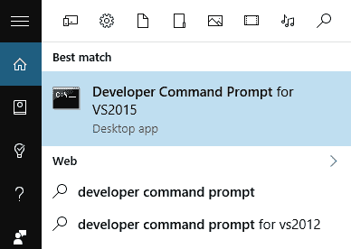

要在 OS X 上打开终端，请打开应用程序启动器，然后在屏幕顶部的搜索栏中键入`Terminal`：


首先，让我们创建一个基本库，然后我们将能够从其他程序中使用它。在这个例子中，我们将只编写一个简单的函数，它将打印出经典的一行`Hello World`。没有至少一个 hello world 程序的编程书籍就不完整了。这是我们将使用的文件，我将我的保存为`hello.cpp`。

```cpp
#include <iostream> 
void Hello() 
{ 
  std::cout<< "Hello World!"<<std::endl; 
} 
```

# 静态链接库

静态库是作为应用程序的一部分编译的库。这意味着与库相关的所有代码都包含在一个单独的文件中，Windows 上是`.lib`，Linux/OS X 系统上是`.a`，并且直接链接到程序中。包含静态库的程序会从库中创建所需的代码副本，并将该副本放在调用库实现的程序中。对于每次调用库，都会这样做。这导致使用静态库的一个较大的缺点，即增加了可执行文件的总体大小。另一方面，使用静态库的优点是没有用户运行程序所需的外部依赖项。这有助于避免用户系统上的库版本错误或必须将其与程序一起分发的问题，这可能会产生一堆问题。您经常会听到这个常见问题被称为*Dll Hell*。静态库的另一个优点是，由于它们作为构建过程的一部分进行链接，这将使编译器和构建工具有更多机会优化实现。一个很好的经验法则是，对于大多数用户都会有的常见或标准库（如 OpenGL 或 DirectX），使用动态或共享库。对于较不常见的库（如 GLFW 或 SDL），您更有可能使用静态库。

要将我们的`hello.cpp`文件转换为静态库，我们可以在开发人员命令提示符中按照以下步骤进行操作：

# 在 Windows 上

按照以下步骤进行操作：

1.  对于 Windows，您需要输入以下命令：

```cpp
    cl /c hello.cpp
```

`cl`是编译和链接的命令。`/c`告诉编译器我们只想编译而不链接我们的文件。最后，我们传入要编译的文件。这将创建一个对象文件`hello.obj`，然后我们可以使用它来创建我们的静态库文件。

1.  现在我们已经创建了对象文件，我们可以使用库构建工具创建静态库。我们使用以下命令生成`.lib`文件：

```cpp
    lib /out:MyLib.lib hello.obj
```

`lib`是启动构建工具的命令。`/out:MyLib.lib`告诉编译器将库构建命名为`MyLib.lib`。

1.  如果列出目录的内容，您会看到我们现在有了静态库`MyLib.lib`：

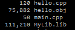

1.  我们现在可以在其他项目中使用我们新创建的库。让我们创建一个非常简单的程序来使用我们的库：

```cpp
void Hello(); //Forward declaration of our Hello function 
void main() 
{ 
  Hello(); 
} 
```

我将文件保存为`main.cpp`。

该程序将调用`Hello`函数，编译器将在我们的链接库中寻找实现。

1.  要编译此程序并链接我们的静态库，可以使用以下命令：

```cpp
    cl main.cpp /link MyLib.lib
```

1.  编译完成后，我们现在在 Windows 目录中有一个`main.exe`：

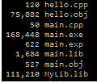

# 在 macOS X 上

按照以下步骤进行操作：

1.  对于 macOS X，您需要输入以下命令：

```cpp
    g++ -c hello.cpp 
```

`g++`是我们使用的开源编译器。标志`-c`告诉`g++`输出一个对象文件。在标志之后，我们指定了构建对象文件时要使用的 cpp 文件。此命令将生成文件`hello.o`。

1.  在 macOS X 平台上，我们使用以下命令生成`.a`文件：

```cpp
    arrvsMylib.ahello.o
```

`ar`是我们用来创建静态库的库构建工具。首先我们设置了一些标志，`rvs`，告诉`ar`工具如何设置库存档。然后我们告诉工具我们正在创建的库的名称，然后是组成库的对象文件。

如果列出目录的内容，您会看到我们现在有了静态库`Mylib.a`：

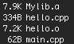

1.  我们现在可以在其他项目中使用我们新创建的库。让我们创建一个非常简单的程序来使用我们的库：

```cpp
void Hello(); //Forward declaration of our Hello function 
void main() 
{ 
  Hello(); 
} 
```

我将文件保存为`main.cpp`。

该程序将调用`Hello`函数，编译器将在我们的链接库中寻找实现。

1.  我们使用以下命令编译程序并链接我们的静态库：

```cpp
    g++ main.cpp MyLib.a -o Main 
```

编译完成后，我们现在将在我们的目录中有一个`main.exe`（在 Windows 上）或一个主可执行文件（在 macOS X 上）。

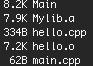

注意 Windows 和 macOS X 上这个可执行文件的大小。再次，因为我们在静态链接我们的库，实际上我们将库的必要部分包含在可执行文件中。这消除了需要单独打包库与程序的需求，从而阻止了库的不匹配。事实上，现在库（.lib 文件）已经编译到可执行文件中，我们不再需要它，可以删除它。我们的程序仍然可以运行，但是如果我们想对库进行任何更改，我们将不得不重复前面的步骤来重新编译库，链接它，并将其添加到我们程序的构建中。

# 动态链接库

动态或共享库是在运行时链接其代码实现的库。这意味着动态库在程序源代码中可以被引用。当编译器看到这些引用时，它会在库实现中查找链接。当程序启动时，通过这些创建的链接包含了引用的代码。当程序使用动态库时，它只会创建对代码的引用，而不是代码的任何副本。这是使用动态库的最大优势之一，因为它们只是被引用，因此不像静态库那样增加可执行文件的总体大小。使用动态库的另一个重要优势是可维护性或修改。由于库是在运行时包含的，您可以进行更新或修改，而无需重新编译整个程序。这对于*补丁*样式的更新以及允许用户自己进行修改非常有用。最大的缺点是我之前提到的。通常需要将动态库与程序一起打包或安装。当然，这可能导致不匹配和可怕的 Dll Hell。

对于动态或共享库，我们必须进行一些修改并遵循略有不同的编译和链接步骤。首先，我们必须更改我们的库文件，让编译器知道我们希望与其他程序共享某些部分。在 Microsoft 平台上，我们使用`__declspec`或声明规范来实现这一点。将`dllexport`参数传递给`__declspec`让编译器知道这个函数甚至类应该作为动态链接库的一部分导出。在 OS X 平台上，我们还使用一种声明类型来让编译器知道这些类或函数要导出。在这里，我们使用`__attribute__((visibility("default")))`代替`__declspec`。

# 在 Windows 上编译和链接动态库

以下是在 Windows 上编译和链接动态库的步骤：

1.  `hello.cpp`文件现在看起来是这样的：

```cpp
      #include <iostream> 
      __declspec(dllexport) void Hello() 
      { 
        std::cout<< "Hello World Dynamically" <<std::endl; 
      } 
```

现在我们已经指定了要导出的函数，我们可以将文件编译成一个动态共享库。

1.  在 Windows 上，我们可以使用以下命令从开发者控制台提示符创建一个`.dll`。

```cpp
    cl /LD /FeMyDynamicLib.dll hello.cpp
```

再次，`cl`是启动编译器和链接器的命令。`/LD`告诉编译器我们要创建一个动态链接库。`/FeMyDynamicLib.dll`设置库的名称，`/Fe`是编译器选项，`MyDynamicLib.dll`是名称。最后，再次传入我们要使用的文件。

1.  当编译器完成后，我们列出目录，现在将有`MyDynamicLib.lib`和`MyDynamicLib.dll`两个文件：

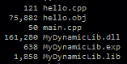

你可能已经注意到的第一件事是，这个版本的`.lib`文件比之前的静态库示例要小得多。这是因为实现不存储在这个文件中。相反，它充当指向`.dll`文件中实际实现的指针。

1.  接下来，我们可以使用以下命令（在 Windows 上）链接和构建我们的程序与我们新创建的库，就像前面的例子一样：

```cpp
    cl main.cpp /link MyDynamicLib.lib  
```

1.  所以现在如果我们运行程序，会看到显示`Hello World Dynamically!`这一行：

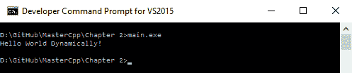

如果我们现在列出目录，会注意到新的主可执行文件，就像这个例子中的`.lib`文件一样，比使用静态库的上一个版本要小得多。这是因为我们在构建时没有包含库的所需部分。相反，我们在运行时按需加载它们，动态地：

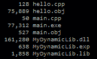

1.  我之前提到的一个好处是，当您对动态链接库进行更改时，您不必重新编译整个程序；我们只需要重新编译库。为了看到这一点，让我们对`hello.cpp`文件进行一些小改动：

```cpp
   #include <iostream> 
   __declspec(dllexport) void Hello() 
   { 
     std::cout<< "Hello World Dynamically!"<<std::endl; 
     std::cout<< "Version 2" <<std::endl; 
   } 
```

1.  接下来，我们可以使用与之前相同的命令重新编译我们的库：

```cpp
    cl /LD /FeMyDynamicLib.dll hello.cpp
```

1.  这将添加我们的新更改，我们可以看到它们在不重新编译`main.exe`的情况下生效，只需运行它。输出现在将是两行：`Hello World Dynamically!`和`Version 2`：

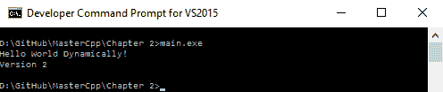

这使得升级非常容易，但也很容易在没有更新的库的机器上迅速导致 Dll 不匹配，通常被称为 Dll 地狱。

# 在 macOS X 上编译和链接动态库

现在，`hello.cpp`文件看起来会是这样：

```cpp
#include <iostream> 
__attribute__((visibility("default"))) void Hello() 
{ 
  std::cout<< "Hello World Dynamically" <<std::endl; 
} 
```

我们可以使用以下命令从终端 shell 创建`.dylib`文件：

```cpp
g++ -dynamiclib -o MyDynamicLib.dylib hello.cpp
```

在这里，我们使用`g++`编译器，并设置一个标志来创建一个动态库文件，`-dynamiclib`。接下来的标志`-o MyDynamicLib.dylib`告诉编译器输出文件的名称。最后，我们指定创建库时要使用的文件。如果你现在列出目录，你会看到新创建的`MyDynamicLib.dylib`文件：


接下来，我们可以使用以下命令链接和构建我们的程序与我们新创建的库，就像前面的例子一样：

```cpp
g++ main.cpp MyDynamicLib.dylib -o Main
```

所以现在如果我们运行程序，会看到显示`Hello World Dynamically!`这一行：

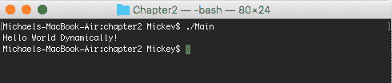

如果我们现在列出目录，你会注意到新的主可执行文件，就像这个例子中的`.lib`文件一样，比使用静态库的上一个版本要小得多。这是因为我们在构建时没有包含库的所需部分。相反，我们在运行时按需加载它们，动态地：

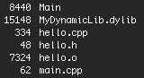

我之前提到的一个好处是，当您对动态链接库进行更改时，您不必重新编译整个程序；我们只需要重新编译库。为了看到这一点，让我们对`hello.cpp`文件进行一些小改动：

```cpp
#include <iostream> 
__attribute__((visibility("default"))) void Hello() 
{ 
  std::cout<< "Hello World Dynamically!"<<std::endl; 
  std::cout<< "Version 2" <<std::endl; 
} 
```

接下来，我们可以使用与之前相同的命令重新编译我们的库：

```cpp
g++ -dynamiclib -o MyDynamicLib.dylib hello.cpp 
```

前一个命令的输出将会是这样：

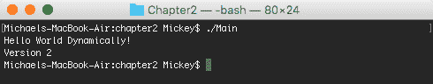

这使得升级非常容易，但也很容易在没有更新的库的机器上迅速导致 Dll 不匹配，通常被称为 Dll 地狱。

# 仅有头文件或源文件的库

我想提到的最后一种共享库的方式是简单地共享源代码或头文件实现。这是一种完全合法的共享库方式，在开源和较小的项目中非常常见。它的明显优点是提供修改的源代码，并且可以让使用的开发人员轻松选择他们想要在项目中实现的部分。不过，这也可以被视为一个缺点，因为现在您的源代码是公开可用的。通过公开和自由地提供您的代码，您放弃了对其使用的控制，并且根据许可可能对其实现的解决方案几乎没有专有权主张。

要将我们的小例子更改为仅包含头文件的实现，我们只需将`hello.cpp`文件更改为头文件`hello.h`，并在其中执行所有函数的实现。我们的新`hello.h`文件现在将如下所示：

```cpp
#pragma once 
#include <iostream> 
void Hello() 
{ 
  std::cout<< "Hello World Header!"<<std::endl; 
} 
```

然后，为了使用头文件库，我们将在`main.cpp`文件中包含它，就像包含任何其他头文件一样：

```cpp
#include "hello.h" 
void main() 
{ 
  Hello(); 
} 
```

由于我们使用的是仅包含头文件的实现，我们不必担心在构建过程中链接库。我们可以使用以下命令从开发人员控制台提示符编译程序。

在 Windows 上：

```cpp
cl main.cpp
```

编译后，您可以运行主可执行文件并看到类似的 hello world 消息，`Hello World Header!`：

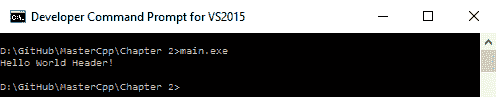

在 macOS X 上：

```cpp
g++ main.cpp -o Main
```

编译后，您可以运行主可执行文件并看到类似的 hello world 消息，`Hello World Header!`：


# 构建自定义可共享库

拥有创建自定义库的能力是一项非常有价值的技能。建立对创建、构建和使用库所需步骤的深入了解，将使您能够创建更有能力的系统和解决方案。在下一节中，我们将深入探讨如何在受控开发环境中创建、构建和使用可共享库项目。

# 设置和结构

对于本示例，我将继续在 Windows 上使用 Visual Studio，并在 macOS X 上使用 XCode。虽然在每个开发环境中一些确切的细节会有所不同，但推断这些步骤应该不会太困难。您可以在代码存储库的`Chapter02`文件夹中找到此示例的完整源代码。

首先，我们将创建一个新项目。

# 在 Windows 上创建新项目

在 Windows 上，我们可以通过转到文件|新建|项目，然后展开 Visual C++下拉菜单，最后选择 Win32 控制台应用程序来完成这个操作。我将我的新项目命名为`MemoryMgr`：

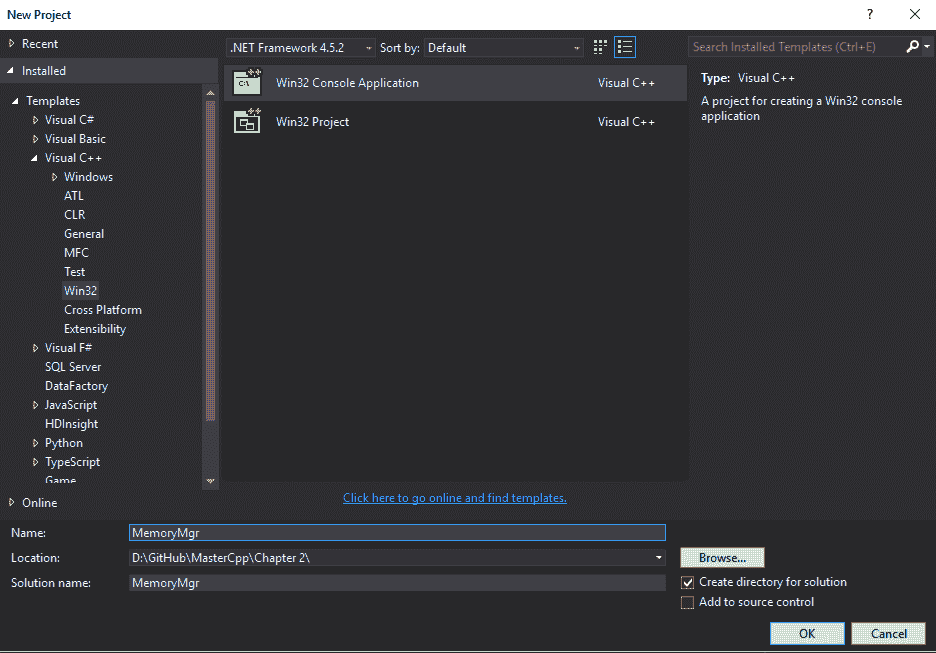

一旦您选择了“确定”，Win32 应用程序向导对话框将弹出。单击“下一步”将对话框移动到下一页：

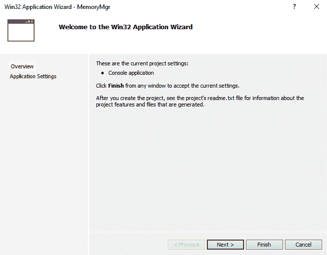

在此对话框页面上，我们提供了一些不同的应用程序设置。对于我们的应用程序类型，我们将选择 DLL。这将创建一个`.dll`和相应的`.lib`文件，然后我们可以共享和使用。我们选择动态或共享库而不是静态库的原因是因为我可以演示如何构建和编译可共享库。这是一个简单的内存管理器库，在大多数情况下，它将包含在一套其他实用程序库中。我们可以很容易地修改此库为静态库，有关说明，请参见上一节。

选择空项目选项，这将为我们提供一个完全空白的项目，我们可以从中构建我们的库。这也会使大多数其他选项变灰，例如附加选项中的预编译头。这是一个常用的选项，通过在单个头文件中调用所有或大多数需要的头文件，然后将其作为单个头文件添加到其他实现文件中，来帮助加快大型项目的编译速度。您可以将安全开发生命周期（SDL）检查保留为选定状态，因为它不会引起任何问题。单击完成退出对话框并打开新项目：

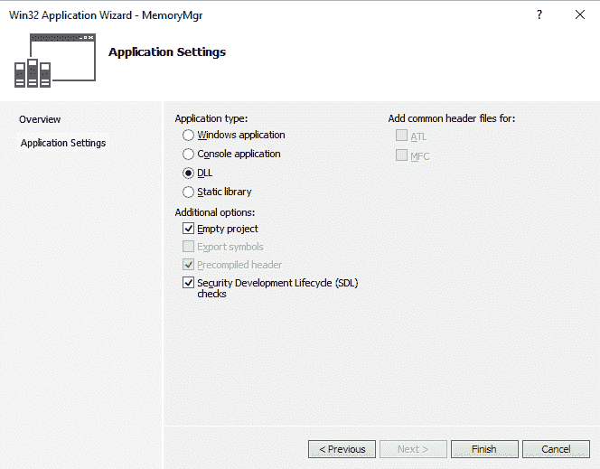

项目加载后，我们将看到一个空白的编辑器窗口和空的解决方案资源管理器。

# 在 macOS X 上创建一个新项目

我们通过转到文件|新建|项目来创建一个新项目，然后从模板选择中选择 OS X，然后选择库：

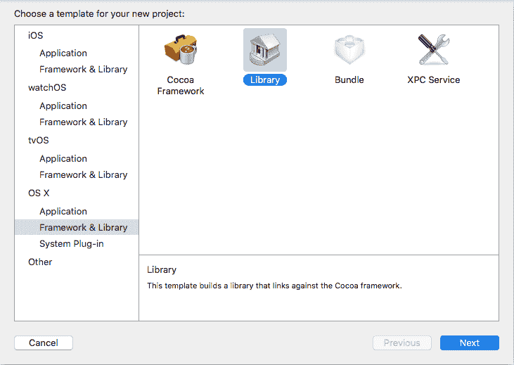

单击下一步后，将出现一个包含项目设置选项的对话框。这些选项包括产品名称，我选择了`MemoryMgr`，组织名称和组织标识符，我将其保留为默认选择。在生产环境中，您需要调整这些选项以匹配您的项目。最后两个选项是框架和类型。对于框架，选择 STL（C++库），这是在使用将包括对 STL 的访问权限的库时使用的模板。对于类型，选择动态，还有一个静态库项目的选项：

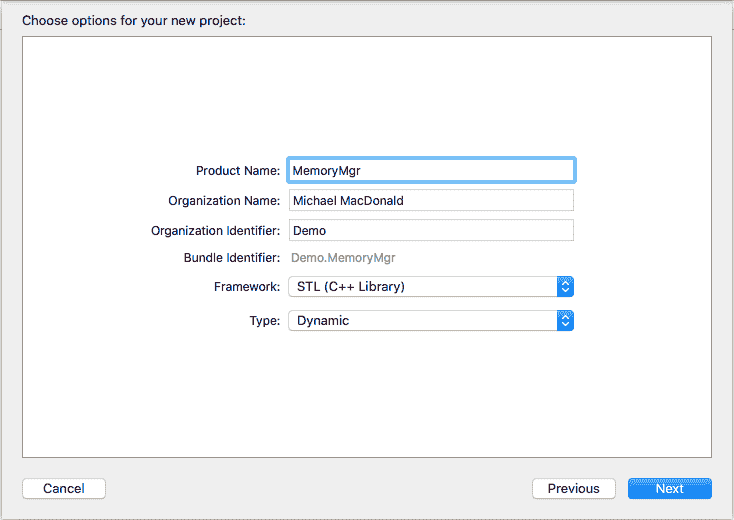

我们的下一步是创建库所需的源文件。在这个例子中，我们只会创建一个类，包括一个单独的头文件`.h`和实现文件`.cpp`。

# 在 Windows 上创建源文件

我们可以使用添加|类...对话框在 Visual Studio 中快速添加此类。

在解决方案资源管理器中右键单击 MemoryMgr 项目，导航到添加|类：

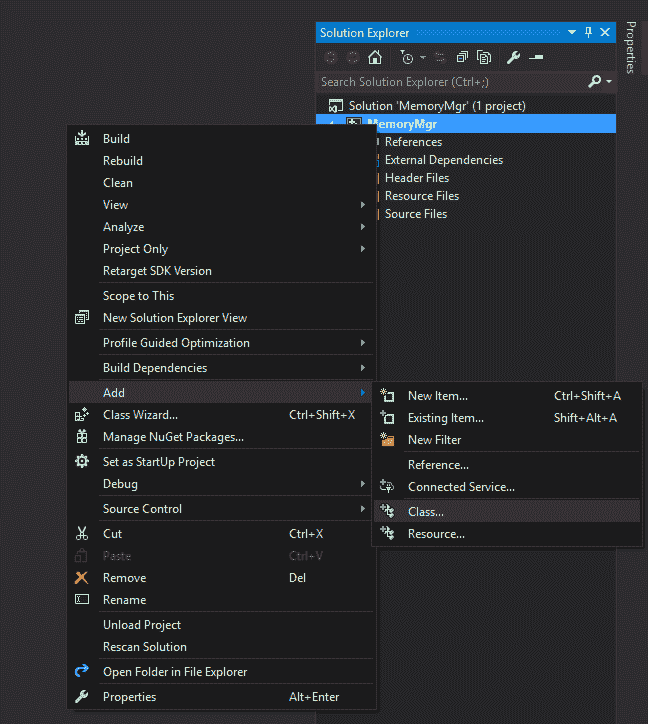

一个新的屏幕将弹出，其中有一些选项用于创建新的类；我们只会使用默认的通用 C++类选项。

选择添加以进入下一个对话框屏幕。现在我们在通用 C++类向导屏幕上。在类名部分添加您要创建的新类的名称，在我的例子中我称之为`MemoryMgr`。当您输入类名时，向导将自动为您填充.h 文件和.cpp 文件。由于这不是一个继承的类，我们可以将基类部分留空。我们将访问保留在公共的默认设置，并且最后我们将保持虚析构函数和内联选项未选中。

单击完成以将类添加到我们的项目中：

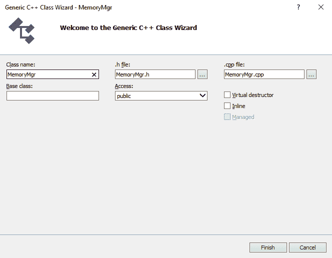

当然，这与我们简单地键入完整的导出说明符是一样的：

```cpp
__declspec(dllexport) int n; //Exporting a variable 
__declspec(dllexport) intfnMemoryMgr(void); //Exporting a function 
```

# 在 macOS X 上创建源文件

这一步已经默认为我们完成。项目创建向导会自动包含一个实现文件`.cpp`和一个头文件，但在这种情况下，头文件的扩展名是`.hpp`。自动生成的文件还包含一堆存根代码，以帮助启动项目。在我们的示例中，为了使事情更连贯，我们将删除这些存根代码并删除两个`.hpp`文件。而是我们将创建一个新的`.h`文件并插入我们自己的代码。创建一个新的`.h`文件非常简单，导航到文件|新建|文件。在新文件对话框中，从左侧的平台列表中选择 OS X，然后从类型选择窗口中选择头文件：

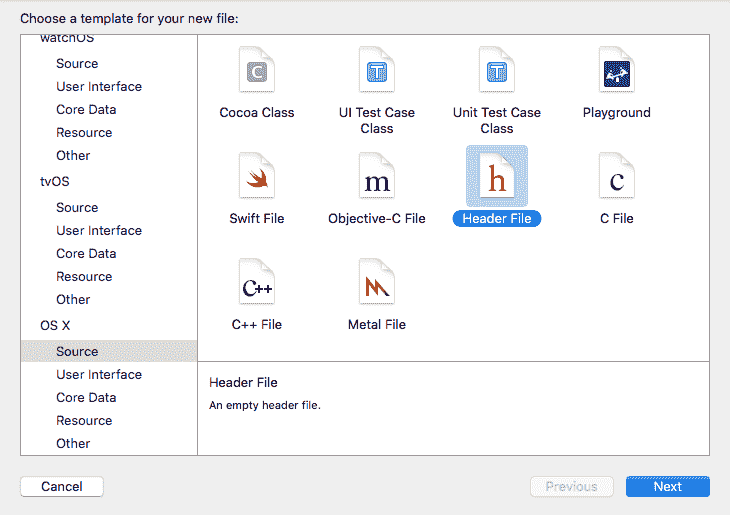

单击“下一步”按钮将弹出文件保存对话框。将文件保存为`MemoryMgr.h`，请注意我指定了`.h`作为扩展名。如果您不指定扩展名，向导将默认为`.hpp`。还要注意的是，确保在对话框底部选择了目标项目，这将确保它被视为 XCode 项目解决方案的一部分。

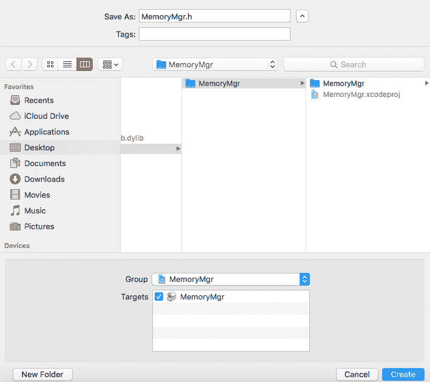

您的项目布局现在应该如下所示：

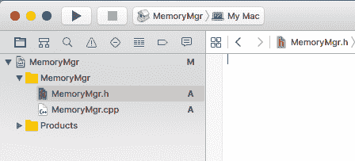

现在是编写代码的时候了。我们将从`MemoryMgr`头文件`MemoryMgr.h`开始。在这个文件中，我们将声明所有我们将使用的函数和变量，以及将提供对我们动态库访问的定义。这是`MemoryMgr.h`，已经删除了注释以保持简洁：

```cpp
#ifdef MEMORYMGR_EXPORTS 
#ifdef _WIN32 
#define EXPORT __declspec(dllexport) 
#else 
#define EXPORT __declspec(dllimport) 
#elif __APPLE__ 
#define EXPORT __attribute__((visibility("default"))) 
#endif 
#endif 
```

完整的文件内容可以在`Chapter02`文件夹中的代码库中找到。

创建新动态库时的第一步是一个有用的快捷方式，它允许我们节省一些按键和简化导出类、函数或变量的创建。使用`ifdef`指令，我们首先可以为我们的内存管理器创建一个标识符`MEMORYMGR_EXPORTS`，然后为目标平台创建标识符，`_WIN32`表示 Windows，`__APPLE__`表示 macOS X。在每个平台的`ifdef`指令内，我们可以为宏`EXPORT`添加定义，对于 Windows，这些是`dllexport`和`dllimport`。这是使用宏的标准方式，使得导出和导入的过程更加简单。有了这些宏，包含此文件的任何项目将看到暴露的函数被导入，而动态库将看到使用此宏定义的任何内容被导出。这意味着我们现在可以简单地使用`EXPORT`来代替在动态库中指定应该提供给其他人的内容时使用的`_declspec(dllexport)`或`__attribute__((visibility("default")))`。

创建内存管理器的下一步是创建一对`struct`，用于我们的`Block`和`Heap`对象。一个块是我们将存储单个对象的内存切片或块。`Heap`是这些`Block`的集合，包含在内存的连续容器中。`Block`结构简单地保存指向下一个`Block`指针；这为每个`Heap`中的`Block`对象创建了一个单链表。`Heap`结构还保存指向内存中下一个`Heap`的指针，这再次为`Heap`对象创建了一个单链表。`Heap`结构还包含一个小的辅助函数，返回`Heap`中的下一个块：

```cpp
struct Block 
{ 
  Block* next; 
}; 

struct Heap 
{ 
  Heap* next; 
  Block* block() 
  { 
    return reinterpret_cast<Block*>(this + 1); 
  } 
}; 
```

现在我们已经有了`Heap`和`Block`结构，我们可以继续定义实际的内存管理器类`CMemoryMgr`。这就是我们之前创建的定义派上用场的地方。在这种情况下，我们使用`EXPORT`来指定我们希望整个类在动态库中被导出。当我们以这种方式导出类时，类的访问方式与任何其他类完全相同。这意味着所有的`private`、`protected`和`public`对象继续具有相同的访问权限。

```cpp
class EXPORT CMemoryMgr 
```

在我们的简单示例中，导出整个类是有意义的，但并不总是如此。如果我们只想导出一个函数或变量，我们可以使用我们创建的`EXPORT`宏来实现：

```cpp
EXPORT int n; //Exporting a variable 
EXPORT void fnMemoryMgr(void); //Exporting a function 
```

当然，这与我们简单地输入完整的导出说明符是完全相同的（在 macOS X 上）：

```cpp
__attribute__((visibility("default"))) int n; //Exporting a 
 variable__attribute__((visibility("default"))) intfnMemoryMgr(void); 
 //Exporting a function
```

关于`MemoryMgr`文件的更多信息：

现在我们知道如何导出类、函数和变量，让我们继续快速查看`MemoryMgr`头文件的其余部分。首先，我们定义了我们的公共方法，在调用我们的库时将可用。这些包括构造函数，它接受三个参数；`dataSize`，每个块对象的大小，`heapSize`，每个内存堆的大小，以及`memoryAlignmentSize`，这是我们用来在内存中移动对象的变量。

在内存中移动对象意味着我们将始终使用一定量的内存来保存对象，无论大小如何。我们这样做是为了使对象以这样的方式对齐，以便我们可以减少对实际内存硬件的调用次数，这当然会提高性能。这通常是开发人员使用自定义内存管理器的主要原因。

接下来，我们有一个不带参数的析构函数，然后是`Allocate`，`Deallocate`和`DeallocateAll`，它们确切地执行它们的名字所暗示的操作。唯一带有参数的函数是`Deallocate`函数，它接受一个指向要删除的内存的指针：

```cpp
class EXPORT CMemoryMgr 
{ 
public: 
  CMemoryMgr(unsigned int dataSize, unsigned int heapSize, unsigned int 
             memoryAlignmentSize); 
  ~CMemoryMgr(); 
  void* Allocate(); 
  void Deallocate(void* pointerToMemory); 
  void DeallocateAll(); 
```

这些函数是我们的库中唯一公开的函数，在这个简单的例子中，可以被视为这个库的基本实现接口。

公共声明之后，当然需要私有声明来完成我们的库。它们以三个静态常量开始，这些常量保存了我们将使用的简单十六进制模式。这将帮助我们在调试时识别每个内存段，并提供一个简单的机制来检查我们是否在正确的时间段上工作：

```cpp
private: 
  static const unsigned char ALLOCATION_PATTERN = 0xBEEF; 
  static const unsigned char ALIGNMENT_PATTERN = 0xBADD; 
  static const unsigned char FREE_MEMORY_PATTERN = 0xF00D; 
```

然后我们有用于在我们的库中进行繁重工作的`private`方法。辅助函数`GetNextBlock`将返回`Heap`中下一个链接的`block`。`OverWriteHeap`函数接受一个指向将写入特定`Heap`的堆的指针。`OverWriteBlock`接受一个指向要写入的块的指针，`OverWriteAllocated`再次接受一个分配给写入的`Block`指针：

```cpp
Block* GetNextBlock(Block* block); 
void OverWriteHeap(Heap* heapPointer); 
void OverWriteBlock(Block* blockPointer); 
void OverWriteAllocatedBlock(Block* blockPointer); 
```

在`private`方法之后，我们有将存储我们内存管理器库所需的各种类型数据的成员变量。前两个是指针列表，我们用它们来保存我们创建的堆和可用的空闲块：

```cpp
Heap* m_heapList = nullptr; 
Block* m_freeBlockList = nullptr; 
```

最后，我们有一组无符号整数，保存各种数据。由于变量的名称相当不言自明，我不会逐个解释：

```cpp
 unsigned int m_dataSize; 
 unsigned int m_heapSize; 
 unsigned int m_memoryAlignment; 
 unsigned int m_blockSize; 
 unsigned int m_blocksPerHeap; 
 unsigned int m_numOfHeaps; 
 unsigned int m_numOfBlocks; 
 unsigned int m_numOfBlocksFree; 
}; 
```

现在，在我们的实现文件（`MemoryMgr.cpp`）中，由于在这个例子中我们正在导出整个类，我们不必包含任何特殊的内容，所有公开访问的内容将对使用我们的库的任何项目可用。如果我们决定只导出选定的函数和变量，而不是整个类，我们将不得不使用我们创建的`EXPORT`宏来指定它们应该在我们的库中导出。为此，您只需在实现前面添加`EXPORT`：

```cpp
// This is an example of an exported variable 
EXPORT int nMemoryMgr=0; 
// This is an example of an exported function. 
EXPORT int fnMemoryMgr(void) 
{ 
  return 42; 
} 
```

为了节省时间和空间，我不打算逐行讨论`MemoryMgr.cpp`的实现。该文件有很好的文档，应该足够清楚地解释内存管理器的简单机制。尽管它很简单，但这个库是构建更健壮的内存管理器系统的绝佳起点，以满足任何项目的特定需求。

# 构建自定义库

在您或其他人可以使用您的自定义库之前，您需要构建它。我们可以通过几种不同的方式来实现这一点。

# 在 Windows

在我们之前部分的例子中，我们使用了 Visual Studio 2015，在这种情况下构建库非常简单。例如，要构建`MemoryMgr`库，您可以在“解决方案资源管理器”中右键单击解决方案'MemoryMgr'，然后选择“生成解决方案”，或者使用键盘快捷键*Ctrl*+*Shift*+*B*：

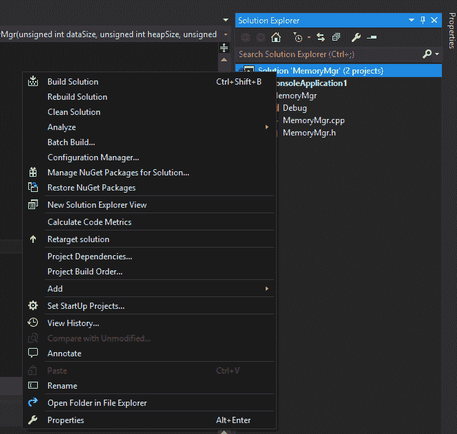

这将在项目的输出文件夹中创建所需的`MemoryMgr.dll`和`MemoryMgr.lib`文件，分别位于 Debug 或 Release 下，具体取决于所选的构建设置。我们构建库的另一种方法是使用我们在本章第一部分讨论的开发人员命令行工具。在这种情况下，我们可以简单地更改目录到项目文件并使用`cl`命令以包括库名称和输入文件：

```cpp
cl /LD /FeMemoryMgr.dll MemoryMgr.cpp
```

同样，这将创建`MemoryMgr.dll`和`MemoryMgr.lib`文件，这些文件在其他项目中使用我们的库时是需要的。

# 在 macOS X 上

构建 XCode 库项目非常容易。您可以简单地从工具栏中选择产品，然后单击构建，或者使用键盘快捷键 Command + *B*：

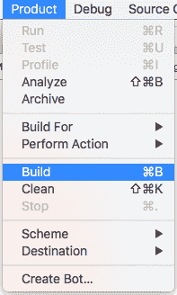

这将创建`MemoryMgr.dylib`文件，这是我们在其他项目中包含库时需要的。我们构建库的另一种方法是使用我们在本章前面看到的终端 shell。在这种情况下，我们只需切换到项目文件的目录并运行`g++`，并包括库名称和输入文件：

```cpp
g++ -dynamiclib -o MemoryMgr.dylib MemoryMgr.cpp
```

# 在 Windows 上使用.def 文件构建动态库

我们将探讨使用仅`.def`文件或同时使用链接器选项构建动态库的选项。

# 仅使用.def 文件

我还想提一下我们可以用来构建动态库的另一种方法，那就是使用`.def`文件。模块定义或`.def`文件是一个文本文件，其中包含描述动态库导出属性的模块语句。使用`.def`文件，您无需创建任何宏或使用`__declspec(dllexport)`指定符来导出 DLL 的函数。对于我们的`MemoryMgr`示例，我们可以通过打开文本编辑器并添加以下内容来创建一个`.def`文件：

```cpp
LIBRARY MEMORYMGR 
EXPORTS 
  Allocate      @1 
  Deallocate    @2 
  DeallocateAll @3 
```

这将告诉编译器我们希望导出这三个函数：`Allocate`，`Deallocate`和`DeallocateAll`。将文件保存为`.def`文件；我把我的叫做`MemoryMgr.def`。

在我们可以使用模块定义文件重新编译库之前，我们必须对`MemoryMgr`的源代码进行一些更改。首先，我们可以删除我们创建的宏，并在`CMemoryMgr`类定义之前删除`EXPORT`。与需要宏或`_declspec(dllexport)`指定符不同，我们之前创建的`.def`文件将处理告诉编译器应该导出什么的工作。

在 Windows 平台上使用模块定义文件编译动态库，我们有几个选项。我们可以像之前一样使用开发者控制台编译库，但是需要额外的选项来指定`.def`文件。从控制台编译`MemoryMgr`库的命令看起来可能是这样的：

```cpp
 cl /LD /DEF:MemoryMgr.def /FeMemoryMgr2.dll MemoryMgr.cpp
```

`/DEF:filename`是告诉编译器使用指定的模块定义文件来构建库的标志。这个命令将产生一个名为`MemoryMgr2.dll`的动态库。

# 设置链接器选项

我们构建动态库使用`.def`文件的第二个选项是在 Visual Studio 开发环境中设置链接器选项。这样做非常简单。

首先，通过右键单击解决方案资源管理器中项目的名称或使用键盘快捷键*Alt* + *Enter*来打开属性页对话框。打开属性页对话框后，选择链接器，点击输入属性页，最后在模块定义文件属性中输入`.def`文件的名称。最终结果应该看起来像以下内容：

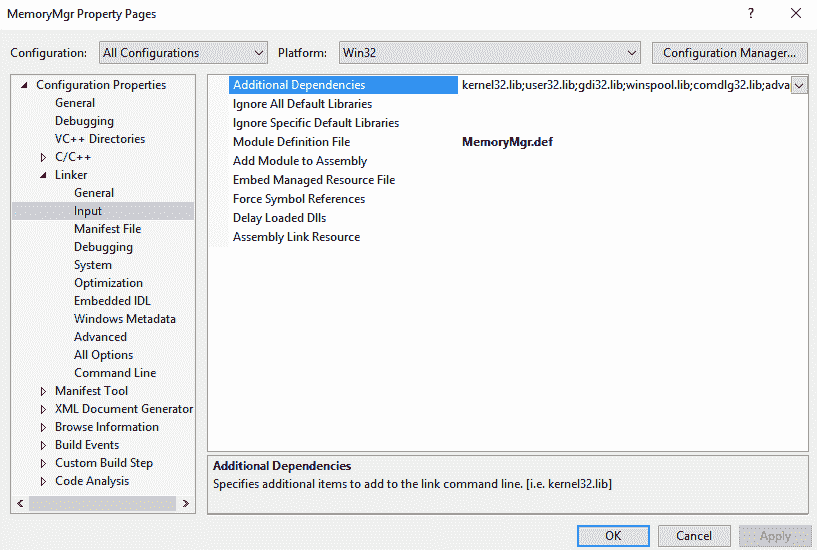

现在，当您构建动态库项目时，编译器将使用`MemoryMgr.def`文件来确定应该导出哪些属性。

接下来，我们将看看在使用 Visual Studio 和 XCode 项目时如何使用和消耗这个和其他库。

# 共享和使用库

现在我们已经构建了自定义库，我们可以开始在其他项目中使用它。正如我们在本章前面看到的，我们可以使用命令行编译器工具链接动态和静态库。如果您只有几个库或者可能创建了一个自定义的构建脚本，那么这是可以的，但是在大多数情况下，当使用像 Visual Studio 这样的集成开发环境时，有更简单的方法来管理。实际上，在 Visual Studio 中向项目添加库可以非常简单。首先添加库，我们再次打开“属性页”对话框，右键单击并转到“属性”或在“解决方案资源管理器”中选择项目后按*Alt* + *Enter*。接下来，展开链接器并选择输入。在对话框顶部的“附加依赖项”属性上，单击下拉菜单并选择“编辑”。这将打开一个类似于此处所示的对话框：

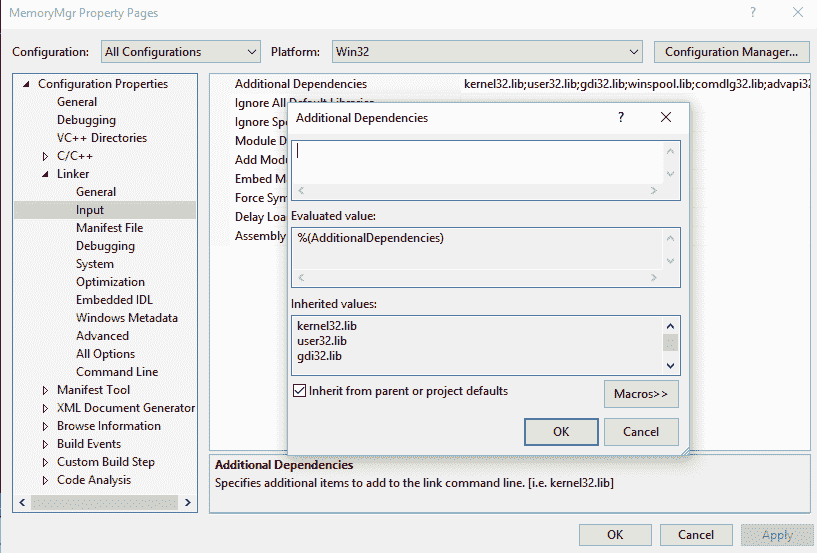

在此对话框的属性窗口中，我们可以在编译时指定要包含的库。无论是动态库还是静态库，我们都包括`.lib`文件。如果您已经在“配置属性”下的 VC++目录文件夹中设置了库目录，您可以简单地使用库名称，如`MemoryMgr.lib`。您还可以通过指定库的路径来包含库，例如`C:\project\lib\MemoryMgr.lib`。此属性还接受宏，使用宏很重要，因为否则将项目移动到另一个目录会破坏包含。您可以使用的一些宏包括：

+   `$(SolutionDir)`: 这是顶层解决方案目录

+   `$(SourceDir)`: 这是项目源代码的目录

+   `$(Platform)`: 这是所选的平台（Win32、x64 或 ARM）

+   `$(Configuration)`: 这是所选的配置（调试或发布）

这意味着如果我在解决方案目录中的一个名为`lib`的文件夹中为每个平台和配置都有一些库，我可以通过使用这样的宏来节省大量工作：

```cpp
$(SolutionDir)/lib/$(Platform)/$(Configuration)/MemoryMgr.lib 
```

现在，如果我切换平台或配置，我就不必每次都返回属性页面进行更改。

这解决了链接库的问题，但在使用或共享库时还需要另一个部分。在本章的第一组示例中，您一定已经注意到，在创建用于演示库使用的小控制台程序时，我使用了前向声明来指定库中`Hello`函数的实现。

```cpp
void Hello(); //Forward declaration of our Hello function 
```

虽然这在像这样的小例子中可以工作，但是如果您使用具有多个属性的库，前向声明将变得非常繁琐。为了在项目中使用库，您通常需要包含定义文件，即头文件。这就是为什么当您看到共享库时，它们通常会有一个`Include`文件夹，其中包含与该库一起使用所需的所有头文件。对于我们的`MemoryMgr`库来说，这意味着如果我想在新项目中使用它或与其他开发人员共享它，我需要包含三个文件。`MemoryMgr.dll`库实际上是一个动态库。`MemoryMgr.lib`库是用于链接的库文件。最后，我还需要包含`MemoryMgr.h`文件，该文件包含了我的库的所有属性定义。

由于大多数库都有多个头文件，简单地将它们复制到项目中可能会变得混乱。好消息是，像大多数集成开发环境一样，Visual Studio 具有配置设置，允许您指定哪些文件夹包含您希望包含在项目中的文件。设置这些配置选项也非常简单。首先，在“解决方案资源管理器”中突出显示项目后，打开“属性页”对话框，*Alt *+ *Enter*。

接下来，单击 C/C++文件夹以展开它。然后选择“常规”部分。在此属性窗口的顶部，您将看到“附加包含目录”，选择此属性的下拉菜单，然后单击“编辑”。这将带来一个类似于这里所示的对话框：

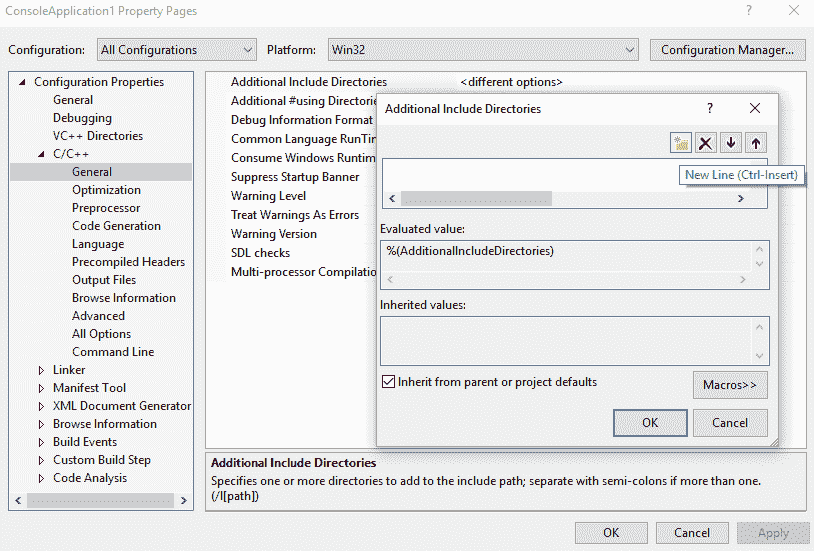

在此对话框中，我们可以通过单击添加文件夹图标或使用键盘快捷键*Ctrl* + *Insert*来添加新行。您可以使用文件夹资源管理器对话框来查找和选择所需的包含文件夹，但此属性还支持宏，因此指定所需的包含文件夹的更好方法是使用宏。如果我们在主解决方案目录中有一个名为 Include 的文件夹，其中包含一个名为`MemoryMgr`的文件夹，我们可以使用以下宏来包含该文件夹：

```cpp
$(SolutionDir)Include\MemoryMgr\
```

一旦您选择“确定”并应用以关闭“属性页”对话框，您可以像在项目中的任何其他头文件一样包含头文件。在我们的`MemoryMgr`文件夹的情况下，我们将使用以下代码：

```cpp
#include<MemoryMgr\MemoryMgr.h>;
```

请注意，文件系统层次结构得到了尊重。

# 总结

在本章中，我们介绍了可共享库的高级主题。我们看了看可用的不同类型的库。我们介绍了创建自己的可共享库的各种方法。

在下一章中，我们将利用这些高级库知识来构建资产管理流水线。
