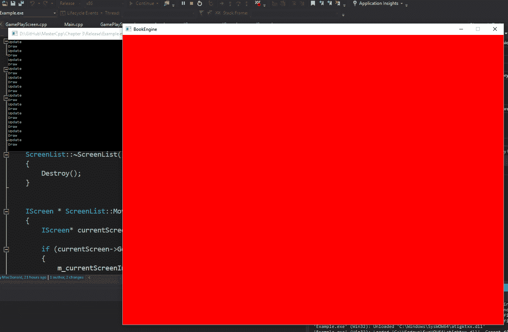
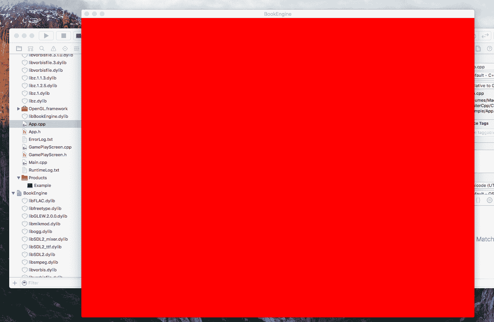

# 建立坚实的基础

虽然从头开始构建自己的库可能是一个有益的过程，但也很快会变得耗时。这就是为什么大多数专业游戏开发者依赖一些常见的库来加快开发时间，更重要的是提供专业的实现。通过连接这些常见的库并构建辅助和管理类来抽象这些库，实际上是在构建最终将驱动您的工具和游戏引擎的结构。

在接下来的几节中，我们将介绍这些库如何协同工作，并构建一些需要补充结构的库，为我们提供一个坚实的基础，以扩展本书其余部分的演示。

首先，我们将专注于任何游戏项目中可能是最重要的方面之一，即渲染系统。适当的、高效的实现不仅需要大量的时间，还需要对视频驱动程序实现和计算机图形学的专业知识。话虽如此，事实上，自己创建一个自定义的低级图形库并不是不可能的，只是如果您的最终目标只是制作视频游戏，这并不是特别推荐的。因此，大多数开发人员不会自己创建低级实现，而是转向一些不同的库，以提供对图形设备底层的抽象访问。

在本书中的示例中，我们将使用几种不同的图形 API 来帮助加快进程并在各个平台上提供一致性。这些 API 包括以下内容：

+   **OpenGL** ([`www.opengl.org/`](https://www.opengl.org/))：**开放图形库**（**OGL**）是一个开放的跨语言、跨平台的应用程序编程接口，用于渲染 2D 和 3D 图形。该 API 提供对**图形处理单元**（**GPU**）的低级访问。

+   **SDL** ([`www.libsdl.org/`](https://www.libsdl.org/))：**简单直接媒体层**（**SDL**）是一个跨平台的软件开发库，旨在为多媒体硬件组件提供低级硬件抽象层。虽然它提供了自己的渲染机制，但 SDL 可以使用 OGL 来提供完整的 3D 渲染支持。

虽然这些 API 通过在处理图形硬件时提供一些抽象来节省我们的时间和精力，但很快就会显而易见，抽象的级别还不够高。

您需要另一层抽象来创建一种有效的方式在多个项目中重用这些 API。这就是辅助和管理类的作用。这些类将为我们和其他编码人员提供所需的结构和抽象。它们将包装设置和初始化库和硬件所需的所有通用代码。无论游戏玩法或类型如何，任何项目所需的代码都可以封装在这些类中，并成为引擎的一部分。

在本章中，我们将涵盖以下主题：

+   构建辅助类

+   使用管理器进行封装

+   创建接口

# 构建辅助类

在面向对象编程中，辅助类用于辅助提供一些功能，这些功能不是直接是应用程序的主要目标。辅助类有许多形式，通常是一个为方法或类的当前范围之外提供功能的总称。许多不同的编程模式使用辅助类。在我们的示例中，我们也将大量使用辅助类。这里只是一个例子。

让我们来看看用于创建窗口的非常常见的一组步骤。可以说，你将创建的大多数游戏都会有某种显示，并且通常会在不同的目标上是典型的，比如在我们的情况下是 Windows 和 macOS。不得不为每个新项目不断重复输入相同的指令似乎有点浪费。这种情况非常适合在一个帮助类中进行抽象，最终将成为引擎本身的一部分。以下代码是演示代码示例中包含的`Window`类的头文件，你可以在 GitHub 代码库的`Chapter03`文件夹中找到完整的源代码。

首先，我们需要一些必要的包含，`SDL`，`glew`是一个窗口创建辅助库，最后，标准的`string`类也被包含进来：

```cpp
#pragma once 
#include <SDL/SDL.h> 
#include <GL/glew.h> 
#include <string> 
```

接下来，我们有一个`enum WindowFlags`。我们使用它来设置一些位操作，以改变窗口的显示方式；不可见、全屏或无边框。你会注意到我已经将代码放入了`BookEngine`命名空间中，正如我在前一章中提到的，这对于避免发生命名冲突是必不可少的，并且一旦我们开始将我们的引擎导入项目中，这将非常有帮助：

```cpp
namespace BookEngine
{ 
  enum WindowFlags //Used for bitwise passing  
  { 
    INVISIBLE = 0x1, 
    FULLSCREEN = 0x2, 
    BORDERLESS = 0x4 
  }; 
```

现在我们有了`Window`类本身。在这个类中有一些`public`方法。首先是默认构造函数和析构函数。即使它们是空的，包括一个默认构造函数和析构函数也是一个好主意，尽管编译器包括自己的，但如果你打算创建智能或托管指针，比如`unique_ptr`，这些指定的构造函数和析构函数是必需的：

```cpp
class Window 
  { 
  public: 
    Window(); 
    ~Window(); 
```

接下来是`Create`函数，这个函数将是构建或创建窗口的函数。它需要一些参数来创建窗口，比如窗口的名称、屏幕宽度和高度，以及我们想设置的任何标志，参见前面提到的`enum`：

```cpp
int Create(std::string windowName, int screenWidth, int 
screenHeight, unsigned int currentFlags);
```

然后我们有两个`Get`函数。这些函数将分别返回宽度和高度：

```cpp
int GetScreenWidth() { return m_screenWidth; } 
int GetScreenHeight() { return m_screenHeight; } 
```

最后一个公共函数是`SwapBuffer`函数；这是一个重要的函数，我们将很快深入研究它。

```cpp
void SwapBuffer(); 
```

为了结束类定义，我们有一些私有变量。首先是指向`SDL_Window*`类型的指针，适当命名为`m_SDL_Window`。然后我们有两个持有者变量来存储屏幕的宽度和高度。这就完成了新的`Window`类的定义，正如你所看到的，它在表面上非常简单。它提供了对窗口的创建的简单访问，而开发人员不需要知道实现的确切细节，这是面向对象编程和这种方法如此强大的一个方面：

```cpp
private: 
    SDL_Window* m_SDL_Window; 
    int m_screenWidth; 
    int m_screenHeight; 
  }; 
} 
```

为了真正理解抽象，让我们走一遍`Window`类的实现，并真正看到创建窗口本身所需的所有部分：

```cpp
#include ""Window.h"" 
#include ""Exception.h"" 
#include ""Logger.h"" 
namespace BookEngine 
{ 
  Window::Window() 
  { 
  } 
  Window::~Window() 
  { 
  } 
```

`Window.cpp`文件以需要的包含开始，当然，我们需要包含`Window.h`，但你还会注意到我们还需要包含`Exception.h`和`Logger.h`头文件。这是另外两个帮助文件，用于抽象它们自己的过程。`Exception.h`文件是一个帮助类，提供了一个易于使用的异常处理系统。`Logger.h`文件是一个帮助类，正如其名称所示，提供了一个易于使用的日志记录系统。随意查看每一个；代码位于 GitHub 代码库的`Chapter03`文件夹中。

在包含文件之后，我们再次将代码放入`BookEngine`命名空间中，并为类提供空构造函数和析构函数。

`Create`函数是第一个要实现的函数。在这个函数中，需要创建实际窗口的步骤。它开始设置窗口显示`flags`，使用一系列`if`语句来创建窗口选项的位表示。我们使用之前创建的`enum`使得这对我们人类来说更容易阅读。

```cpp
  int Window::Create(std::string windowName, int screenWidth, int 
 screenHeight, unsigned int currentFlags) 
  { 
    Uint32 flags = SDL_WINDOW_OPENGL; 
    if (currentFlags & INVISIBLE) 
    { 
      flags |= SDL_WINDOW_HIDDEN; 
    } 
    if (currentFlags & FULLSCREEN) 
    { 
      flags |= SDL_WINDOW_FULLSCREEN_DESKTOP; 
    } 
    if (currentFlags & BORDERLESS) 
    { 
      flags |= SDL_WINDOW_BORDERLESS; 
    } 
```

设置窗口的显示选项后，我们继续使用 SDL 库创建窗口。正如我之前提到的，我们使用诸如 SDL 之类的库来帮助我们简化这些结构的创建。我们开始将这些函数调用包装在`try`语句中；这将允许我们捕获任何问题并将其传递给我们的`Exception`类，正如我们很快将看到的那样：

```cpp
try { 
      //Open an SDL window 
      m_SDL_Window = SDL_CreateWindow(windowName.c_str(), 
              SDL_WINDOWPOS_CENTERED, 
              SDL_WINDOWPOS_CENTERED, 
              screenWidth, 
              screenHeight, 
              flags); 
```

第一行将私有成员变量`m_SDL_Window`设置为使用传入的变量创建的新窗口，用于名称、宽度、高度和任何标志。我们还通过将`SDL_WINDOWPOS_CENTERED`定义传递给函数，将默认窗口的生成点设置为屏幕中心：

```cpp
if (m_SDL_Window == nullptr) 
    throw Exception(""SDL Window could not be created!""); 
```

在尝试创建窗口之后，检查并查看进程是否成功是一个好主意。我们使用一个简单的 if 语句来检查变量`m_SDL_Window`是否设置为`nullptr`；如果是，我们抛出一个`Exception`。我们向`Exception`传递字符串`""SDL Window could not be created!""`。这是我们可以在 catch 语句中打印出的错误消息。稍后，我们将看到这方面的一个例子。使用这种方法，我们提供了一些简单的错误检查。

创建窗口并进行一些错误检查后，我们可以继续设置其他一些组件。其中之一是需要设置的 OGL 库，它需要所谓的上下文。OGL 上下文可以被视为描述应用程序渲染相关细节的一组状态。在进行任何绘图之前，必须设置 OGL 上下文。

一个问题是，创建窗口和 OGL 上下文并不是 OGL 规范本身的一部分。这意味着每个平台都可以以不同的方式处理这个问题。幸运的是，SDL API 再次为我们抽象了繁重的工作，并允许我们在一行代码中完成所有这些工作。我们创建了一个名为`glContext`的`SDL_GLContext`变量。然后，我们将`glContext`分配给`SDL_GL_CreateContext`函数的返回值，该函数接受一个参数，即我们之前创建的`SDL_Window`。之后，我们当然要进行简单的检查，以确保一切都按预期工作，就像我们之前创建窗口时所做的那样：

```cpp
//Set up our OpenGL context 
SDL_GLContext glContext = SDL_GL_CreateContext(m_SDL_Window); 
   if (glContext == nullptr) 
     throw Exception(""SDL_GL context could not be created!""); 
```

我们需要初始化的下一个组件是`GLEW`。同样，这对我们来说是一个简单的命令，`glewInit()`。这个函数不带参数，但会返回一个错误状态码。我们可以使用这个状态码来执行类似于我们之前对窗口和 OGL 进行的错误检查。这次，我们不是检查它是否等于定义的`GLEW_OK`。如果它的值不是`GLEW_OK`，我们会抛出一个`Exception`，以便稍后捕获。

```cpp
//Set up GLEW (optional) 
GLenum error = glewInit(); 
  if (error != GLEW_OK) 
    throw Exception(""Could not initialize glew!""); 
```

现在需要初始化的组件已经初始化，现在是记录有关运行应用程序的设备的一些信息的好时机。您可以记录有关设备的各种数据，这些数据在尝试跟踪晦涩问题时可以提供有价值的见解。在这种情况下，我正在轮询系统以获取运行应用程序的 OGL 版本，然后使用`Logger`辅助类将其打印到运行时文本文件中：

```cpp
//print some log info 
std::string versionNumber = (const 
char*)glGetString(GL_VERSION);      
WriteLog(LogType::RUN, ""*** OpenGL Version: "" + 
versionNumber + ""***"");
```

现在设置清除颜色或用于刷新图形卡的颜色。在这种情况下，它将是我们应用程序的背景颜色。`glClearColor`函数接受四个浮点值，表示范围为`0.0`到`1.0`的红色、绿色、蓝色和 alpha 值。Alpha 是透明度值，其中`1.0f`是不透明的，`0.0f`是完全透明的：

```cpp
//Set the background color to blue 
glClearColor(0.0f, 0.0f, 1.0f, 1.0f); 
```

下一行设置`VSYNC`值，这是一种机制，它将尝试将应用程序的帧速率与物理显示器的帧速率匹配。`SDL_GL_SetSwapInterval`函数接受一个参数，一个整数，可以是`1`表示开启，`0`表示关闭：

```cpp
//Enable VSYNC 
SDL_GL_SetSwapInterval(1);
```

组成`try`语句块的最后两行，启用混合并设置执行 alpha 混合时使用的方法。有关这些特定函数的更多信息，请查看 OGL 开发文档：

```cpp
 //Enable alpha blend 
 glEnable(GL_BLEND); 
 glBlendFunc(GL_SRC_ALPHA, GL_ONE_MINUS_SRC_ALPHA); 
} 
```

在我们的`try`块之后，我们现在必须包括`catch`块。这是我们将捕获发生的任何抛出错误的地方。在我们的情况下，我们只会捕获所有的异常。我们使用`Logger`辅助类的`WriteLog`函数将异常消息`e.reason`添加到错误日志文本文件中。这是一个非常基本的情况，但当然，我们在这里可以做更多的事情，可能甚至可以在可能的情况下从错误中恢复：

```cpp
catch (Exception e) 
 { 
    //Write Log 
    WriteLog(LogType::ERROR, e.reason); 
  } 
  } 
```

最后，在`Window.cpp`文件中的最后一个函数是`SwapBuffer`函数。不深入实现，交换缓冲区的作用是交换 GPU 的前后缓冲区。简而言之，这允许更流畅地绘制到屏幕上。这是一个复杂的过程，再次被 SDL 库抽象出来。我们的`SwapBuffer`函数再次将这个过程抽象出来，这样当我们想要交换缓冲区时，我们只需调用`SwapBuffer`而不必调用 SDL 函数并指定窗口，这正是函数中所做的：

```cpp
void Window::SwapBuffer() 
 { 
   SDL_GL_SwapWindow(m_SDL_Window); 
 } 
} 
```

因此，正如您所看到的，构建这些辅助函数可以在开发和迭代过程中大大加快和简化。接下来，我们将看一种再次将繁重的工作抽象出来并为开发者提供对过程的控制的编程方法，即管理系统。

# 管理器封装

在处理诸如输入和音频系统之类的复杂系统时，直接控制和检查系统的每个状态和其他内部状态很容易变得乏味和笨拙。这就是管理器编程模式的概念所在。使用抽象和多态性，我们可以创建类，使我们能够模块化和简化与这些系统的交互。管理器类可以在许多不同的用例中找到。基本上，如果您发现需要对某个系统进行结构化控制，这可能是管理器类的候选对象。接下来是我为本书示例代码创建的管理器类的示例。随着我们的继续，您将看到更多。

暂时远离渲染系统，让我们看看任何游戏都需要执行的一个非常常见的任务，处理输入。由于每个游戏都需要某种形式的输入，将处理输入的代码移动到一个我们可以一遍又一遍使用的类中是很有意义的。让我们来看看`InputManager`类，从头文件开始：

```cpp
#pragma once 
#include <unordered_map> 
#include <glm/glm.hpp> 
namespace BookEngine { 
  class InputManager 
  { 
  public: 
    InputManager(); 
    ~InputManager(); 
```

`InputManager`类的开始就像其他类一样，我们需要的包括和再次将类包装在`BookEngine`命名空间中以方便和安全。标准构造函数和析构函数也被定义。

接下来，我们有几个公共函数。首先是`Update`函数，这将不奇怪地更新输入系统。然后我们有`KeyPress`和`KeyReleased`函数，这些函数都接受与键盘键对应的整数值。以下函数分别在按下或释放`key`时触发：

```cpp
void Update(); 
void KeyPress(unsigned int keyID);  
void KeyRelease(unsigned int keyID);
```

在`KeyPress`和`KeyRelease`函数之后，我们还有两个与键相关的函数`isKeyDown`和`isKeyPressed`。与`KeyPress`和`KeyRelease`函数一样，`isKeyDown`和`isKeyPressed`函数接受与键盘键对应的整数值。显着的区别是这些函数根据键的状态返回布尔值。我们将在接下来的实现文件中看到更多关于这一点的内容。

```cpp
 bool isKeyDown(unsigned int keyID); //Returns true if key is 
 held    bool isKeyPressed(unsigned int keyID); //Returns true if key 
 was pressed this update
```

`InputManager`类中的最后两个公共函数是`SetMouseCoords`和`GetMouseCoords`，它们确实如其名称所示，分别设置或获取鼠标坐标。

```cpp
void SetMouseCoords(float x, float y); 
glm::vec2 GetMouseCoords() const { return m_mouseCoords; }; 
```

接下来是私有成员和函数，我们声明了一些变量来存储有关键和鼠标的一些信息。首先，我们有一个布尔值，用于存储按下键的状态。接下来，我们有两个无序映射，它们将存储当前的`keymap`和先前的键映射。我们存储的最后一个值是鼠标坐标。我们使用另一个辅助库**OpenGL Mathematics**（**GLM**）中的`vec2`构造。我们使用这个`vec2`，它只是一个二维向量，来存储鼠标光标的*x*和*y*坐标值，因为它在一个二维平面上，即屏幕上。如果你想要复习向量和笛卡尔坐标系，我强烈推荐*Dr. John P Flynt*的*Beginning Math Concepts for Game Developers*一书：

```cpp
private: 
   bool WasKeyDown(unsigned int keyID); 
std::unordered_map<unsigned int, bool> m_keyMap; 
   std::unordered_map<unsigned int, bool> m_previousKeyMap; 
   glm::vec2 m_mouseCoords;
}; 
```

现在让我们看一下实现，`InputManager.cpp`文件。

我们再次从包含和命名空间包装器开始。然后我们有构造函数和析构函数。这里需要注意的亮点是在构造函数中将`m_mouseCoords`设置为`0.0f`：

```cpp
namespace BookEngine 
{ 
  InputManager::InputManager() : m_mouseCoords(0.0f) 
  { 
  } 
  InputManager::~InputManager() 
  { 
  } 
```

接下来是`Update`函数。这是一个简单的更新，我们正在遍历`keyMap`中的每个键，并将其复制到先前的`keyMap`持有者中。

`m_previousKeyMap`：

```cpp
void InputManager::Update() 
 { 
   for (auto& iter : m_keyMap) 
   { 
     m_previousKeyMap[iter.first] = iter.second;  
   } 
 } 
```

接下来是`KeyPress`函数。在这个函数中，我们使用关联数组的技巧来测试和插入与传入 ID 匹配的按下的键。技巧在于，如果位于`keyID`索引处的项目不存在，它将自动创建：

```cpp
void InputManager::KeyPress(unsigned int keyID) 
 { 
   m_keyMap[keyID] = true; 
 } 
. We do the same for the KeyRelease function below. 
 void InputManager::KeyRelease(unsigned int keyID) 
 { 
   m_keyMap[keyID] = false; 
  } 
```

`KeyRelease`函数与`KeyPressed`函数的设置相同，只是我们将`keyMap`中的项目在`keyID`索引处设置为 false：

```cpp
bool InputManager::isKeyDown(unsigned int keyID) 
 { 
   auto key = m_keyMap.find(keyID); 
   if (key != m_keyMap.end()) 
     return key->second;   // Found the key 
   return false; 
 }
```

在`KeyPress`和`KeyRelease`函数之后，我们实现了`isKeyDown`和`isKeyPressed`函数。首先是`isKeydown`函数；在这里，我们想测试键是否已经按下。在这种情况下，我们采用了与`KeyPress`和`KeyRelease`函数中不同的方法来测试键，并避免了关联数组的技巧。这是因为我们不想在键不存在时创建一个键，所以我们手动进行：

```cpp
bool InputManager::isKeyPressed(unsigned int keyID) 
 { 
   if(isKeyDown(keyID) && !m_wasKeyDown(keyID)) 
   { 
     return true; 
   } 
   return false; 
 } 
```

`isKeyPressed`函数非常简单。在这里，我们测试与传入 ID 匹配的键是否被按下，通过使用`isKeyDown`函数，并且它还没有被`m_wasKeyDown`按下。如果这两个条件都满足，我们返回 true，否则返回 false。接下来是`WasKeyDown`函数，与`isKeyDown`函数类似，我们进行手动查找，以避免意外创建对象使用关联数组的技巧：

```cpp
bool InputManager::WasKeyDown(unsigned int keyID) 
 { 
   auto key = m_previousKeyMap.find(keyID); 
   if (key != m_previousKeyMap.end()) 
     return key->second;   // Found the key 
   return false; 
} 
```

`InputManager`中的最后一个函数是`SetMouseCoords`。这是一个非常简单的`Set`函数，它接受传入的浮点数并将它们分配给二维向量`m_mouseCoords`的*x*和*y*成员：

```cpp
void InputManager::SetMouseCoords(float x, float y) 
 { 
   m_mouseCoords.x = x; 
   m_mouseCoords.y = y; 
 } 
}
```

# 创建接口

有时你会面临这样一种情况，你需要描述一个类的能力并提供对一般行为的访问，而不承诺特定的实现。这就是接口或抽象类的概念发挥作用的地方。使用接口提供了一个简单的基类，其他类可以继承而不必担心内在的细节。构建强大的接口可以通过提供一个标准的类来与之交互来实现快速开发。虽然理论上接口可以创建任何类，但更常见的是在代码经常被重用的情况下使用它们。以下是书中示例代码创建的一个接口，用于创建游戏的主类的接口。

让我们看一下存储库中示例代码的接口。这个接口将提供对游戏的核心组件的访问。我将这个类命名为`IGame`，使用前缀`I`来标识这个类是一个接口。以下是从定义文件`IGame.h`开始的实现。

首先，我们有所需的包含和命名空间包装器。您会注意到，我们包含的文件是我们刚刚创建的一些文件。这是抽象的延续的一个典型例子。我们使用这些构建模块来继续构建结构，以便实现无缝的抽象：

```cpp
#pragma once 
#include <memory> 
#include ""BookEngine.h"" 
#include ""Window.h"" 
#include ""InputManager.h"" 
#include ""ScreenList.h"" 
namespace BookEngine 
{ 
```

接下来，我们有一个前向声明。这个声明是为另一个为屏幕创建的接口。这个接口及其支持的辅助类的完整源代码都可以在代码存储库中找到。类`IScreen`；在 C++中使用这样的前向声明是一种常见的做法。

如果定义文件只需要简单定义一个类，而不添加该类的头文件，将加快编译时间。

接下来是公共成员和函数，我们从构造函数和析构函数开始。您会注意到，在这种情况下，这个析构函数是虚拟的。我们将析构函数设置为虚拟的，以便通过指针调用派生类的实例上的 delete。当我们希望接口直接处理一些清理工作时，这很方便：

```cpp
class IGame 
  { 
  public: 
    IGame(); 
    virtual ~IGame(); 
```

接下来我们有`Run`函数和`ExitGame`函数的声明。

```cpp
    void Run(); 
    void ExitGame(); 
```

然后我们有一些纯虚函数，`OnInit`，`OnExit`和`AddScreens`。纯虚函数是必须由继承类重写的函数。通过在定义的末尾添加`=0;`，我们告诉编译器这些函数是纯虚的。

在设计接口时，定义必须被重写的函数时要谨慎。还要注意，拥有纯虚函数会使其所定义的类成为抽象类。抽象类不能直接实例化，因此任何派生类都需要实现所有继承的纯虚函数。如果不这样做，它们也会变成抽象类：

```cpp
    virtual void OnInit() = 0; 
    virtual void OnExit() = 0; 
    virtual void AddScreens() = 0; 
```

在纯虚函数声明之后，我们有一个名为`OnSDLEvent`的函数，我们用它来连接到 SDL 事件系统。这为我们提供了对输入和其他事件驱动系统的支持：

```cpp
void OnSDLEvent(SDL_Event& event);
```

`IGame`接口类中的公共函数是一个简单的辅助函数`GetFPS`，它返回当前的`fps`。注意`const`修饰符，它们快速标识出这个函数不会以任何方式修改变量的值：

```cpp
const float GetFPS() const { return m_fps; } 
```

在我们的受保护空间中，我们首先有一些函数声明。首先是`Init`或初始化函数。这将是处理大部分设置的函数。然后我们有两个虚函数`Update`和`Draw`。

像纯虚函数一样，虚函数是可以被派生类实现的函数。与纯虚函数不同，虚函数默认不会使类成为抽象类，也不必被重写。虚函数和纯虚函数是多态设计的基石。随着开发的继续，您将很快看到它们的好处：

```cpp
protected: 
   bool Init(); 
   virtual void Update(); 
   virtual void Draw(); 
```

在`IGame`定义文件中，我们有一些成员来存放不同的对象和值。我不打算逐行讨论这些成员，因为我觉得它们相当容易理解：

```cpp
    std::unique_ptr<ScreenList> m_screenList = nullptr; 
    IGameScreen* m_currentScreen = nullptr; 
    Window m_window; 
    InputManager m_inputManager; 
    bool m_isRunning = false; 
    float m_fps = 0.0f; 
  }; 
} 
```

现在我们已经看过了接口类的定义，让我们快速浏览一下实现。以下是`IGame.cpp`文件。为了节省时间和空间，我将重点介绍关键点。在大多数情况下，代码是不言自明的，存储库中的源代码有更多的注释以提供更清晰的解释：

```cpp
#include ""IGame.h"" 
#include ""IScreen.h"" 
#include ""ScreenList.h"" 
#include ""Timing.h"" 
namespace BookEngine 
{ 
  IGame::IGame() 
  { 
    m_screenList = std::make_unique<ScreenList>(this); 
  } 

  IGame::~IGame() 
  { 
  } 
```

我们的实现从构造函数和析构函数开始。构造函数很简单，它的唯一工作是使用这个`IGame`对象作为参数添加一个新屏幕的唯一指针。有关屏幕创建的更多信息，请参阅`IScreen`类。接下来，我们实现了`Run`函数。当调用这个函数时，将启动引擎。在函数内部，我们快速检查以确保我们已经初始化了对象。然后，我们再次使用另一个助手类`fpsLimiter`来`SetMaxFPS`，让我们的游戏可以运行。之后，我们将`isRunning`布尔值设置为`true`，然后用它来控制游戏循环：

```cpp
void IGame::Run() 
  { 
    if (!Init()) 
      return; 
    FPSLimiter fpsLimiter; 
    fpsLimiter.SetMaxFPS(60.0f); 
    m_isRunning = true; 
```

接下来是游戏循环。在游戏循环中，我们进行了一些简单的调用。首先，我们启动了`fpsLimiter`。然后，我们在我们的`InputManager`上调用更新函数。

在进行其他更新或绘图之前，始终检查输入是一个好主意，因为它们的计算肯定会使用新的输入值。

在更新`InputManager`之后，我们递归调用我们的`Update`和`Draw`类，我们很快就会看到。我们通过结束`fpsLimiter`函数并在`Window`对象上调用`SwapBuffer`来结束循环：

```cpp
///Game Loop 
    while (m_isRunning) 
    { 
      fpsLimiter.Begin(); 
      m_inputManager.Update(); 
      Update(); 
      Draw(); 
      m_fps = fpsLimiter.End(); 
      m_window.SwapBuffer(); 
    } 
  } 
```

我们实现的下一个函数是`ExitGame`函数。最终，这将是在游戏最终退出时调用的函数。我们关闭，销毁，并释放屏幕列表创建的任何内存，并将`isRunning`布尔值设置为`false`，这将结束循环：

```cpp
void IGame::ExitGame() 
 { 
   m_currentScreen->OnExit(); 
   if (m_screenList) 
   { 
     m_screenList->Destroy(); 
     m_screenList.reset(); //Free memory 
   } 
   m_isRunning = false; 
 } 
```

接下来是`Init`函数。这个函数将初始化所有内部对象设置，并调用连接系统的初始化。同样，这是面向对象编程和多态性的一个很好的例子。以这种方式处理初始化允许级联效应，使代码模块化，并更容易修改：

```cpp
  bool IGame::Init() 
  { 
    BookEngine::Init(); 
    SDL_GL_SetAttribute(SDL_GL_ACCELERATED_VISUAL, 1); 
    m_window.Create(""BookEngine"", 1024, 780, 0); 
    OnInit(); 
    AddScreens(); 
    m_currentScreen = m_screenList->GetCurrentScreen(); 
    m_currentScreen->OnEntry();     
    m_currentScreen->Run(); 
    return true; 
}
```

接下来是`Update`函数。在这个`Update`函数中，我们创建一个结构，允许我们根据当前屏幕所处的状态执行特定的代码。我们使用一个简单的 switch case 方法和`ScreenState`类型的枚举元素作为 case 来实现这一点。这种设置被认为是一个简单的有限状态机，是游戏开发中使用的一种非常强大的设计方法。你可以肯定会在整本书的示例中再次看到它：

```cpp
void IGame::Update() 
  { 
    if (m_currentScreen) 
    { 
      switch (m_currentScreen->GetScreenState()) 
      { 
      case ScreenState::RUNNING: 
        m_currentScreen->Update(); 
        break; 
      case ScreenState::CHANGE_NEXT: 
        m_currentScreen->OnExit(); 
        m_currentScreen = m_screenList->MoveToNextScreen(); 
        if (m_currentScreen) 
        { 
          m_currentScreen->Run(); 
          m_currentScreen->OnEntry(); 
        } 
        break; 
      case ScreenState::CHANGE_PREVIOUS: 
        m_currentScreen->OnExit(); 
        m_currentScreen = m_screenList->MoveToPreviousScreen(); 
        if (m_currentScreen) 
        { 
          m_currentScreen->Run(); 
          m_currentScreen->OnEntry(); 
        } 
        break; 
      case ScreenState::EXIT_APP: 
          ExitGame(); 
          break; 
      default: 
          break; 
      } 
    } 
    else 
    { 
      //we have no screen so exit 
      ExitGame(); 
    } 
  }
```

在我们的`Update`之后，我们实现了`Draw`函数。在我们的函数中，我们只做了一些事情。首先，我们将`Viewport`重置为一个简单的安全检查，然后如果当前屏幕的状态与枚举值`RUNNING`匹配，我们再次使用多态性将`Draw`调用传递到对象行：

```cpp
void IGame::Draw() 
  { 
    //For safety 
    glViewport(0, 0, m_window.GetScreenWidth(), m_window.GetScreenHeight()); 

    //Check if we have a screen and that the screen is running 
    if (m_currentScreen && 
      m_currentScreen->GetScreenState() == ScreenState::RUNNING) 
    { 
      m_currentScreen->Draw(); 
    } 
  } 
```

我们需要实现的最后一个函数是`OnSDLEvent`函数。就像我在这个类的定义部分提到的那样，我们将使用这个函数将我们的`InputManager`系统连接到 SDL 内置的事件系统。

每次按键或鼠标移动都被视为一个事件。根据发生的事件类型，我们再次使用 switch case 语句创建一个简单的有限状态机。请参考前面的管理模式讨论部分，了解每个函数是如何实现的。

```cpp
  void IGame::OnSDLEvent(SDL_Event & event) 
  { 
    switch (event.type) { 
    case SDL_QUIT: 
      m_isRunning = false; 
      break; 
    case SDL_MOUSEMOTION: 
      m_inputManager.SetMouseCoords((float)event.motion.x, 
(float)event.motion.y); 
      break; 
    case SDL_KEYDOWN: 
      m_inputManager.KeyPress(event.key.keysym.sym); 
      break; 
    case SDL_KEYUP: 
      m_inputManager.KeyRelease(event.key.keysym.sym); 
      break; 
    case SDL_MOUSEBUTTONDOWN: 
      m_inputManager.KeyPress(event.button.button); 
      break; 
    case SDL_MOUSEBUTTONUP: 
      m_inputManager.KeyRelease(event.button.button); 
      break; 
    } 
  } 
}
```

好了，这就完成了`IGame`接口。有了这个创建，我们现在可以创建一个新的项目，利用这个和其他接口在示例引擎中创建一个游戏，并只需几行代码就可以初始化它。这是位于代码存储库的`Chapter03`文件夹中示例项目的`App`类：

```cpp
#pragma once 
#include <BookEngine/IGame.h> 
#include ""GamePlayScreen.h"" 
class App : public BookEngine::IGame 
{ 
public: 
  App(); 
  ~App(); 
  virtual void OnInit() override; 
  virtual void OnExit() override; 
  virtual void AddScreens() override; 
private: 
  std::unique_ptr<GameplayScreen> m_gameplayScreen = nullptr; 
}; 
```

这里需要注意的亮点是，一，`App`类继承自`BookEngine::IGame`接口，二，我们拥有继承类所需的所有必要覆盖。接下来，如果我们看一下`main.cpp`文件，我们的应用程序的入口点，你会看到设置和启动所有我们接口、管理器和助手抽象的简单命令：

```cpp
#include <BookEngine/IGame.h> 
#include ""App.h"" 
int main(int argc, char** argv) 
{ 
  App app; 
  app.Run(); 
  return 0; 
} 
```

正如您所看到的，这比每次创建新项目时不断从头开始重新创建框架要简单得多。

要查看本章描述的框架的输出，请构建`BookEngine`项目，然后构建并运行示例项目。XCode 和 Visual Studio 项目可以在 GitHub 代码存储库的`Chapter03`文件夹中找到。

在 Windows 上，运行示例项目将如下所示：

>

在 macOS 上，运行示例项目将如下所示：



# 摘要

在本章中，我们涵盖了相当多的内容。我们看了一下使用面向对象编程和多态性创建可重用结构的不同方法。我们通过真实代码示例详细介绍了辅助、管理器和接口类之间的区别。

在接下来的章节中，我们将看到这种结构被重复使用并不断完善以创建演示。事实上，在下一章中，我们将构建更多的管理器和辅助类，以创建资产管理流水线。
