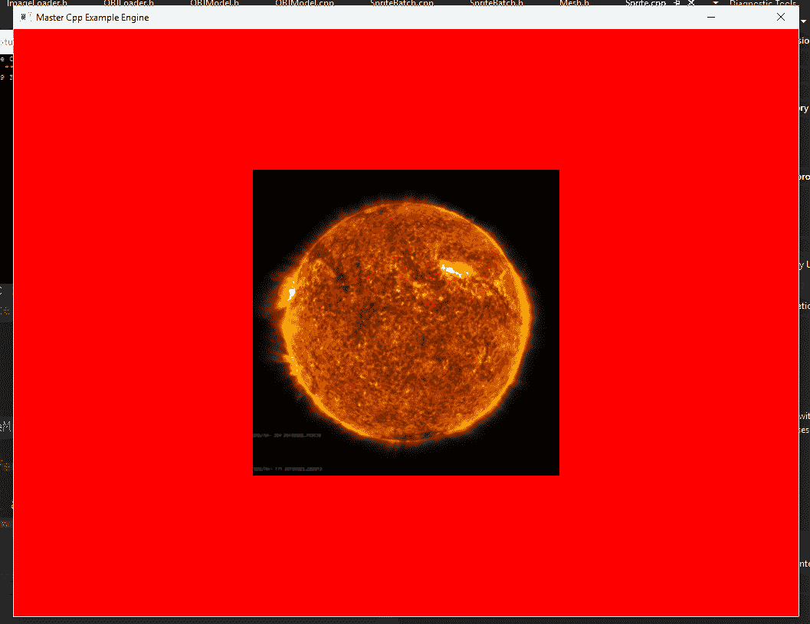
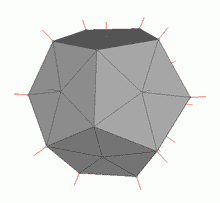
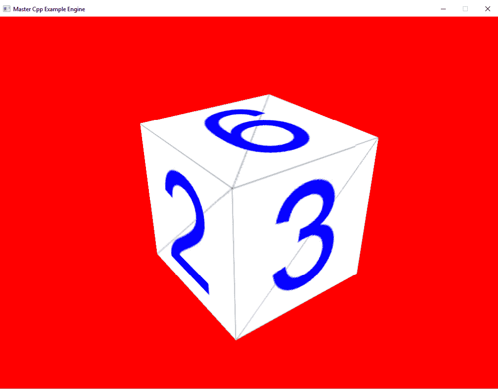
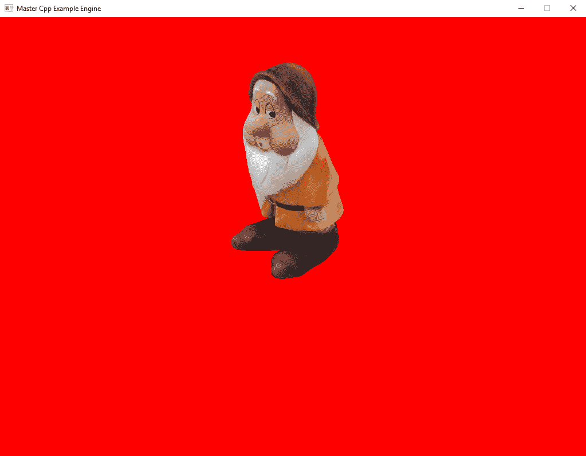
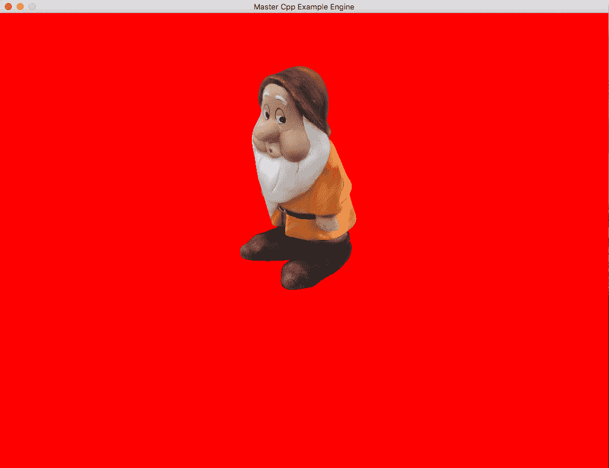

# 第四章：构建资产流水线

游戏本质上是以有趣和引人入胜的方式打包的资产或内容的集合。处理视频游戏所需的所有内容本身就是一个巨大的挑战。在任何真正的项目中，都需要一个结构来导入、转换和使用这些资产。在本章中，我们将探讨开发和实施资产流水线的主题。以下是我们将要涵盖的主题：

+   处理音频

+   处理图像

+   导入模型网格

# 什么是资产流水线？

在第三章中，*构建坚实的基础*，我们看了一下如何使用辅助和管理类的结构，将多个方法封装成易于消费的接口，以处理项目的各个部分。在接下来的几节中，我们将使用这些技术来构建我们自己的自定义框架/内容流水线。

# 处理音频

为了开始，我们将通过查看如何处理游戏项目中的音频资产来逐步进入这个过程。为了帮助我们进行这个过程，我们将再次使用一个辅助库。有数百种不同的库可以帮助使用音频。以下是一些较受欢迎的选择：

+   FMOD ([`www.fmod.org`](http://www.fmod.org/))

+   Wwise ([`www.audiokinetic.com/products/wwise/`](https://www.audiokinetic.com/products/wwise/))

+   XAudio2 ([`msdn.microsoft.com/en-us/library/windows/desktop/ee415813(v=vs.85).aspx`](https://msdn.microsoft.com/en-us/library/windows/desktop/ee415813(v=vs.85).aspx))

+   OpenAL ([`www.openal.org/`](https://www.openal.org/))

+   SDL_mixer ([`www.libsdl.org/projects/SDL_mixer/`](https://www.libsdl.org/projects/SDL_mixer/))

每个库都有其自身的优势和劣势。为您的项目选择合适的库归结为您应该问自己的几个不同问题。

这个库是否满足你的技术需求？它是否具有你想要的所有功能？

它是否符合项目的预算限制？许多更强大的库都有很高的价格标签。

这个库的学习曲线是否在你或团队的技能范围内？选择一个带有许多酷炫功能的高级 API 可能看起来是个好主意，但如果你花费更多时间来理解 API 而不是实施它，那可能是有害的。

在本书的示例中，我选择使用`SDL_mixer API`有几个原因。首先，与其他一些库相比，它相对容易上手。其次，它非常符合我的项目需求。它支持 FLAC、MP3，甚至 Ogg Vorbis 文件。第三，它与项目框架的其余部分连接良好，因为它是 SDL 库的扩展，而我们已经在使用。最后，我选择这个 API 是因为它是开源的，而且有一个简单的许可证，不需要我支付创建者我的游戏收益的一部分来使用该库。

让我们首先看一下我们需要的几个不同类的声明和实现。我们要看的文件是`AudioManager.h`文件，可以在代码库的`Chapter04`文件夹中找到。

我们从必要的包含开始，`SDL/SDL_mixer.h`，`string`和`map`的实现。与所有其他引擎组件一样，我们将这些声明封装在`BookEngine`命名空间中：

```cpp
#pragma once 
#include <SDL/SDL_mixer.h> 
#include <string> 
#include <map> 

namespace BookEngine 
{
```

在`"AudioManager.h"`文件中，我们声明了一些辅助类。第一个是`SoundEffect`类。这个类定义了游戏中要使用的音效对象的结构：

```cpp
class SoundEffect 
 { 
  public: 
    friend class AudioManager; 
    ///Plays the sound file 
    ///@param numOfLoops: If == -1, loop forever, 
    ///otherwise loop of number times provided + 1 
    void Play(int numOfLoops = 0); 

  private: 
    Mix_Chunk* m_chunk = nullptr; 
  }; 
```

这些可以包括玩家跳跃、武器开火等声音，以及我们将在短暂时间内播放的任何声音。

在类定义内部，我们需要一个`friend`类语句，允许这个类访问`AudioManager`类的方法和变量，包括私有的。接下来是`Play`函数的定义。这个函数将简单地播放音效，并只接受一个参数，循环播放声音的次数。默认情况下，我们将其设置为`0`，如果您将循环次数设置为`-1`，它将无限循环播放音效。最后一个定义是一个`Mix_Chunk`类型的私有变量。`Mix_Chunk`是一个`SDL_mixer`对象类型，它在内存中存储音频数据。

`Mix_Chunk`对象的结构如下：

```cpp
typedef struct { 
        int allocated; 
        Uint8 *abuf; 
        Uint32 alen; 
        Uint8 volume; 
} Mix_Chunk; 
```

这是对象的内部：

+   `allocated`：如果设置为`1`，`struct`有自己的分配缓冲区

+   `abuf`：这是指向音频数据的指针

+   `alen`：这是音频数据的长度，以字节为单位

+   `volume`：这是每个样本的音量值，介于 0 和 128 之间

我们在`AudioManager.h`文件中的下一个辅助类是`Music`类。像音效一样，`Music`类定义了`Music`对象的结构。这可以用于像加载屏幕音乐、背景音乐和任何我们希望长时间播放或需要停止、开始和暂停的声音：

```cpp
class Music 
  { 
  public: 
    friend class AudioManager; 
    ///Plays the music file 
    ///@param numOfLoops: If == -1, loop forever, 
    ///otherwise loop of number times provided 
    void Play(int numOfLoops = -1); 

    static void Pause() { Mix_PauseMusic(); }; 
    static void Stop() { Mix_HaltMusic(); }; 
    static void Resume() { Mix_ResumeMusic(); }; 

  private: 
    Mix_Music* m_music = nullptr; 
  }; 
```

对于类定义，我们再次从一个`friend`类语句开始，以便`Music`类可以访问`AudioManager`类的所需部分。接下来是一个`Play`函数，就像`SoundEffect`类一样，它接受一个参数来设置声音循环的次数。在`Play`函数之后，我们有另外三个函数，`Pause()`、`Stop()`和`Resume()`函数。这三个函数只是对底层 SDL_mixer API 调用的包装，用于暂停、停止和恢复音乐。

最后，我们有一个`Mix_Music`对象的私有声明。`Mix_Music`是用于音乐数据的 SDL_mixer 数据类型。它支持加载 WAV、MOD、MID、OGG 和 MP3 音频文件。我们将在接下来的实现部分中了解更多关于这个的信息：

```cpp
class AudioManager 
  { 
  public: 
    AudioManager(); 
    ~AudioManager(); 

    void Init(); 
    void Destroy(); 

    SoundEffect LoadSoundEffect(const std::string& filePath); 
    Music LoadMusicEffect(const std::string& filePath); 
  private: 
    std::map<std::string, Mix_Chunk*> m_effectList; 
    std::map<std::string, Mix_Music*> m_musicList; 
    bool m_isInitialized = false; 
  }; 
} 
```

在两个`Music`和`SoundEffect`辅助类之后，我们现在来到`AudioManager`类的定义。`AudioManager`类将在我们这一边承担大部分繁重的工作，它将加载、保存和管理所有音乐和音效的创建和删除。

我们的类声明像大多数其他类一样以默认构造函数和析构函数开始。接下来是一个`Init()`函数。这个函数将处理音频系统的设置或初始化。然后是一个`Destroy()`函数，它将处理音频系统的删除和清理。在`Init`和`Destroy`函数之后，我们有两个加载函数，`LoadSoundEffect()`和`LoadMusicEffent()`函数。这两个函数都接受一个参数，一个标准字符串，其中包含音频文件的路径。这些函数将加载音频文件，并根据函数返回`SoundEffect`或`Music`对象。

我们的类的私有部分有三个对象。前两个私有对象是`Mix_Chunk`或`Mix_Music`类型的映射。这是我们将存储所有需要的效果和音乐的地方。通过存储我们加载的音效和音乐文件列表，我们创建了一个缓存。如果在项目的以后时间需要文件，我们可以检查这些列表并节省一些宝贵的加载时间。最后一个变量`m_isInitialized`保存一个布尔值，指定`AudioManager`类是否已经初始化。

这完成了`AudioManager`和辅助类的声明，让我们继续实现，我们可以更仔细地查看一些函数。您可以在代码存储库的`Chapter04`文件夹中找到`AudioManager.cpp`文件：

```cpp
#include "AudioManager.h"
#include "Exception.h" 
#include "Logger.h"

namespace BookEngine 
{ 

  AudioManager::AudioManager() 
  { 
  } 

  AudioManager::~AudioManager() 
  { 
    Destroy(); 
  } 
```

我们的实现从包括、默认构造函数和析构函数开始。这里没有什么新东西，唯一值得注意的是我们从析构函数中调用`Destroy()`函数。这允许我们通过析构函数或通过显式调用对象本身的`Destroy()`函数来清理类的两种方法：

```cpp
void BookEngine::AudioManager::Init() 
  { 
    //Check if we have already been initialized 
    if (m_isInitialized) 
      throw Exception("Audio manager is already initialized"); 
```

`AudioManager`类实现中的下一个函数是`Init()`函数。这是设置管理器所需组件的函数。函数开始时进行简单检查，看看我们是否已经初始化了该类；如果是，我们会抛出一个带有调试消息的异常：

```cpp
//Can be Bitwise combination of  
//MIX_INIT_FAC, MIX_INIT_MOD, MIX_INIT_MP3, MIX_INIT_OGG 
if(Mix_Init(MIX_INIT_OGG || MIX_INIT_MP3) == -1) 
 throw Exception("SDL_Mixer could not initialize! Error: " + 
 std::string(Mix_GetError()));
```

在检查我们是否已经这样做之后，我们继续初始化 SDL_mixer 对象。我们通过调用`Mix_Init()`函数并传入一组标志的位组合来实现这一点，以设置支持的文件类型。这可以是 FLAC、MOD、MP3 和 OGG 的组合。在这个例子中，我们传递了 OGG 和 MP3 支持的标志。我们将这个调用包装在一个 if 语句中，以检查`Mix_Init()`函数调用是否有任何问题。如果遇到错误，我们会抛出另一个带有从`Mix_Init()`函数返回的错误信息的调试消息的异常：

```cpp
if(Mix_OpenAudio(MIX_DEFAULT_FREQUENCY, MIX_DEFAULT_FORMAT, 2, 
 1024) == -1)      throw Exception("Mix_OpenAudio Error: " + 
 std::string(Mix_GetError()));
```

一旦`SDL_mixer`函数被初始化，我们就可以调用`Mix_OpenAudio`来配置要使用的`frequency`、`format`、`channels`和`chunksize`。重要的是要注意，这个函数必须在任何其他`SDL_mixer`函数之前调用。函数定义如下：

```cpp
int Mix_OpenAudio(int frequency, Uint16 format, int channels, int chunksize)
```

以下是参数的含义：

+   `frequency`：这是每秒采样的输出频率，以赫兹为单位。在示例中，我们使用`MIX_DEFAULT_FREQUENCY`定义，即 22050，这是大多数情况下的一个很好的值。

+   `format`：这是输出样本格式；同样，在示例中，我们将其设置为默认值，使用`MIX_DEFAULT_FORMAT`定义，这与使用`AUDIO_S16SYS`或有符号 16 位样本，系统字节顺序相同。要查看完整的格式定义列表，请参见`SDL_audio.h`文件。

+   `channels`：这是输出中的声道数。立体声为 2 声道，单声道为 1 声道。我们的示例中使用值 2。

+   `chunksize`：这是每个输出样本使用的字节数。我们使用`1024`字节或 1 兆字节（mb）作为我们的 chunksize。

最后，在这个函数中我们做的最后一件事是将`m_isInitalized`布尔值设置为 true。这将阻止我们意外地尝试再次初始化该类：

```cpp
m_isInitialized = true; 
  } 
```

`AudioManager`类中的下一个函数是`Destroy()`方法：

```cpp
  void BookEngine::AudioManager::Destroy() 
  { 
    if (m_isInitialized) 
    { 
      m_isInitialized = false; 

      //Release the audio resources 
      for(auto& iter : m_effectList) 
        Mix_FreeChunk(iter.second); 
      for(auto& iter : m_musicList) 
        Mix_FreeMusic(iter.second); 
      Mix_CloseAudio(); 
      Mix_Quit(); 
    } 
  } 
```

我不会逐行讲解这个函数，因为它是不言自明的。基本概述是：检查`AudioManager`是否已经初始化，如果是，则使用`Mix_FreeChunk()`函数释放我们创建的每个声音和音乐资源。最后，我们使用`Mix_CloseAudio()`和`Mix_Quit()`来关闭、清理和关闭 SDL_mixer API。

`LoadSoundEffect`是我们需要查看的下一个函数。这个函数就像它的名字所暗示的那样，是加载音效的函数：

```cpp
 SoundEffect BookEngine::AudioManager::LoadSoundEffect(const std::string & filePath)
  { 
    SoundEffect effect; 
```

这个函数的第一步是创建一个`SoundEffect`对象，临时保存数据，直到我们将效果返回给调用方法。我们简单地称这个变量为 effect。

创建了我们的临时变量后，我们快速检查一下我们需要的这个效果是否已经被创建并存储在我们的缓存中，即 map 对象`m_effectList`：

```cpp
//Lookup audio file in the cached list 
auto iter = m_effectList.find(filePath); 
```

我们在这里做的有趣的方法是创建一个迭代器变量，并将其赋值为`Map.find()`的结果，其中传递的参数是我们要加载的声音文件的位置。这种方法的有趣之处在于，如果在缓存中找不到声音效果，迭代器的值将被设置为地图的末尾对象的索引，从而允许我们进行一个简单的检查，你将看到如下所示：

```cpp
//Failed to find in cache, load 
    if (iter == m_effectList.end()) 
    { 
      Mix_Chunk* chunk = Mix_LoadWAV(filePath.c_str()); 
      //Error Loading file 
      if(chunk == nullptr) 
        throw Exception("Mix_LoadWAV Error: " + 
              std::string(Mix_GetError())); 

      effect.m_chunk = chunk; 
      m_effectList[filePath] = chunk; 
    } 

```

使用迭代器值技巧，我们只需检查`iter`变量的值是否与`Map.end()`函数的返回值匹配；如果是，这意味着音效不在缓存列表中，应该创建。

要加载音效，我们使用`Mix_LoadWAV()`函数，并将文件路径位置作为`c`字符串的参数。我们将返回的对象分配给一个名为块的`Mix_Chunk`指针。

然后我们检查块的值是否为`nullptr`指针，表示加载函数出现错误。如果是`nullptr`指针，我们将抛出一个异常，并提供`Mix_GetError()`函数提供的一些调试信息。如果成功，我们将临时持有者，效果的成员`m_chunk`，赋值为块的值，即我们加载的音效数据。

接下来，我们将这个新加载的效果添加到我们的缓存中，以便将来节省一些工作。

或者，如果我们对`iter`值的检查返回 false，这意味着我们尝试加载的音效在缓存中：

```cpp
else //Found in cache 
    { 
      effect.m_chunk = iter->second; 
    } 

    return effect; 
  } 
```

现在迭代器的真正美丽被揭示了。查找结果，也就是`auto iter = m_effectList.find(filePath);`这一行的结果，当它找到音效时，将指向列表中的音效。所以我们所要做的就是将持有者变量效果成员值`m_chunk`分配给`iter`的第二个值，即音效的数据值。`LoadSoundEffect()`函数中的最后一件事是将效果变量返回给调用方法。这完成了过程，我们的音效现在可以使用了。

在`LoadSoundEffect()`函数之后，是`LoadMusic()`函数：

```cpp
Music BookEngine::AudioManager::LoadMusic(const std::string & filePath) 
  { 
    Music music; 

    //Lookup audio file in the cached list 
    auto iter = m_musicList.find(filePath); 

    //Failed to find in cache, load 
    if (iter == m_musicList.end()) 
    { 
      Mix_Music* chunk = Mix_LoadMUS(filePath.c_str()); 
      //Error Loading file 
      if (chunk == nullptr) 
           throw Exception("Mix_LoadMUS Error: " +
            std::string(Mix_GetError())); 

      music.m_music = chunk; 
      m_musicList[filePath] = chunk; 
    } 
    else //Found in cache 
    { 
      music.m_music = iter->second; 
    } 

    return music; 
  } 
```

我不会详细介绍这个函数，因为您可以看到它非常像`LoadSoundEffect()`函数，但它不是包装`Mix_LoadWAV()`函数，而是包装了`SDL_mixer`库的`Mix_LoadMUS()`。

`AudioManager.cpp`文件中的最后两个函数实现不属于`AudioManager`类本身，而是`SoundEffect`和`Music`辅助类的`Play`函数的实现：

```cpp
 void SoundEffect::Play(int numOfLoops) 
  { 
    if(Mix_PlayChannel(-1, m_chunk, numOfLoops) == -1) 
      if (Mix_PlayChannel(0, m_chunk, numOfLoops) == -1) 
          throw Exception("Mix_PlayChannel Error: " + 
                std::string(Mix_GetError())); 
  } 

  void Music::Play(int numOfLoops) 
  { 
    if (Mix_PlayMusic(m_music, numOfLoops) == -1) 
      throw Exception("Mix_PlayMusic Error: " + 
                 std::string(Mix_GetError())); 
  }   
} 
```

我不会逐行步进每个函数，而是想简单指出这些函数如何在 SDL_mixer 的`Mix_PlayChannel`和`Mix_PlayMusic`函数周围创建包装器。这实质上是`AudioManager`类的目的，它只是一个抽象加载文件和直接创建对象的包装器。这帮助我们创建一个可扩展的框架，管道，而不必担心底层机制。这意味着在任何时候，理论上，我们可以用另一个或甚至多个库替换底层库，而不会影响调用管理器类函数的代码。

为了完成这个示例，让我们看看如何在演示项目中使用这个`AudioManager`。您可以在代码存储库的`Chapter04`文件夹中找到这个演示，标记为`SoundExample`。音乐的来源归功于 Bensound（[`www.bensound.com`](http://www.bensound.com/)）。

从`GameplayScreen.h`文件开始：

```cpp
private: 
  void CheckInput(); 
  BookEngine::AudioManager m_AudioManager; 
  BookEngine::Music m_bgMusic; 
}; 
```

我们在私有声明中添加了两个新对象，一个是名为`m_AudioManager`的`AudioManager`，另一个是名为`m_bgMusic`的`Music`对象。

在`GameplayScreen.cpp`文件中：

```cpp
void GameplayScreen::OnEntry() 
{ 
  m_AudioManager.Init(); 
  m_bgMusic = m_audioManager.LoadMusic("Audio/bensound-epic.mp3"); 
  m_bgMusic.Play(); 
} 
```

要初始化、加载和播放我们的音乐文件，我们需要在`GameplayScreen`类的`OnEntry()`中添加三行。

+   第一行`m_AudioManager.Init()`设置了`AudioManager`并像之前看到的那样初始化了所有组件。

+   接下来加载音乐文件，这里是`bensound-epic.mp3`文件，并将其分配给`m_bgMusic`变量。

+   最后一行`m_bgMusic.Play()`开始播放音乐曲目。通过不传入循环音乐曲目的次数，默认为`-1`，这意味着它将继续循环直到程序停止。

这处理了音乐曲目的播放，但当游戏结束时，我们需要添加一些更多的函数调用来清理`AudioManager`，并在切换屏幕时停止音乐。

为了在离开这个屏幕时停止音乐播放，我们在`GameplayScreen`类的`OnExit`函数中添加以下内容：

```cpp
m_bgMusic.Stop(); 
```

为了清理`AudioManager`并阻止任何潜在的内存泄漏，我们在`GameplayScreen`类的`Destroy`函数中调用以下内容：

```cpp
  m_AudioManager.Destroy(); 
```

这将进而处理我们在前一节中所加载的任何音频资产的销毁和清理。

现在所有这些都已经就位，如果你运行`SoundExample`演示，你将听到一些史诗般的冒险音乐开始播放，并且如果你足够耐心，它将不断循环。现在我们在游戏中有了一些声音，让我们再进一步，看看如何将一些视觉资产导入到我们的项目中。

# 处理纹理

如果你对这个术语不熟悉，纹理基本上可以被认为是一种图像。这些纹理可以应用到一个简单的几何正方形，两个三角形，以制作一幅图像。这种类型的图像通常被称为`Sprite`。我们在本节末尾的演示中使用了`Sprite`类。还需要注意的是，纹理可以应用到更复杂的几何图形中，并且在 3D 建模中用于给物体上色。随着我们在书中后面继续进行演示，纹理将扮演更重要的角色。

# 资源管理器

让我们从高级别的类`ResourceManager`开始。这个管理类将负责在缓存中维护资源对象，并提供一个简单的、抽象的接口来获取资源：

```cpp
#pragma once 
#include "TextureCache.h"
#include <string> 
namespace BookEngine 
{ 
class ResourceManager 
  { 
  public: 
    static GLTexture GetTexture(std::string pathToTextureFile); 
  private: 
    static TextureCache m_textureCache; 
  }; 
} 
```

声明文件`ResourceManager.h`是一个简单的类，包括一个公共函数`GetTexture`，和一个私有成员`TextureCache`。`GetTexure`将是我们向其他类公开的函数。它将负责返回纹理对象。`TextureCache`就像我们在`AudioManager`中使用的缓存，它将保存加载的纹理以供以后使用。让我们继续实现，这样我们就可以看到这是如何设置的：

```cpp
#include "ResourceManager.h"
namespace BookEngine 
{ 
  TextureCache ResourceManager::m_textureCache; 

  GLTexture ResourceManager::GetTexture(std::string texturePath) 
  { 
    return m_textureCache.GetTexture(texturePath); 
  } 
} 
```

`ResourceManager`的实现实际上只是对底层结构的抽象调用。当我们调用`ResourceManager`类的`GetTexture`函数时，我们期望得到一个`GLTexture`类型的返回。作为这个函数的调用者，我不需要担心`TextureCache`的内部工作方式或对象是如何解析的。我所需要做的就是指定我希望加载的纹理的路径，然后资产管道就会完成剩下的工作。这应该是资产管道系统的最终目标，无论采用何种方法，接口都应该足够抽象，以允许开发人员和设计师在项目中导入和使用资产，而不需要底层系统的实现成为阻碍。

接下来我们将看一下这个例子纹理系统，它是`ResourceManager`类接口简单性的核心。

# 纹理和纹理缓存

之前我们看到了`ResourceManager`类结构中引入的两个新对象，`GLTexture`和`TextureCache`。在接下来的章节中，我们将更详细地看一下这两个类，以便了解这些类如何与其他系统连接，构建一个强大的资产管理系统，最终回到`ResourceManager`的简单接口。

首先我们将看一下`GLTexture`类。这个类完全由一个描述我们纹理属性的`struct`组成。以下是`GLTexture`类的完整代码：

```cpp
#pragma once 
#include <GL/glew.h> 
namespace BookEngine 
{ 
  struct GLTexture 
  { 
    GLuint id; 
    int width; 
    int height; 
  }; 
} 
```

如前所述，`GLTexture`类实际上只是一个名为`GLTexture`的`struct`的包装器。这个`struct`保存了一些简单的值。一个`GLuint id`，用于标识纹理和两个整数值，`width`和`height`，当然保存了纹理/图像的高度和宽度。这个`struct`可以很容易地包含在`TextureClass`中，我选择以这种方式实现它，一是为了使它更容易阅读，二是为了允许一些未来发展的灵活性。再次，我们希望确保我们的资产管道允许适应不同的需求和包含新的资产类型。

接下来我们有`TextureCache`类，就像我们对音频资产所做的那样，为图像文件创建一个缓存是一个好主意。这将再次通过将它们保存在一个映射中并根据需要返回它们来为我们提供更快的访问所需的图像文件。我们只需要在缓存中不存在时创建一个新的纹理。在构建任何与资产相关的系统时，我倾向于使用这种带有缓存机制的实现方式。

虽然这些示例提供了一个基本的实现，但它们是创建更健壮的系统的绝佳起点，可以集成内存管理和其他组件。以下是`TextureCache`类的声明，它应该从前面的音频示例中看起来非常熟悉：

```cpp
#pragma once 
#include <map> 
#include "GLTexture.h"

namespace BookEngine 
{ 
  class TextureCache 
  { 
  public: 
    TextureCache(); 
    ~TextureCache(); 

    GLTexture GetTexture(std::string texturePath);  
  private: 
    std::map<std::string, GLTexture> m_textureMap; 

  }; 
} 
```

继续实现`TextureCache`类，在`TextureCache.cpp`文件中，让我们看一下`GetTexture()`：

```cpp
GLTexture TextureCache::GetTexture(std::string texturePath) { 

    //lookup the texture and see if it''''s in the map 
    auto mit = m_textureMap.find(texturePath); 

    //check if its not in the map 
    if (mit == m_textureMap.end()) 
    { 
      //Load the texture 
      GLTexture newTexture = ImageLoader::LoadPNG(texturePath); 

      //Insert it into the map 
      m_textureMap.insert(std::make_pair(texturePath, newTexture)); 

      //std::cout << "Loaded Texture!\n"; 
      return newTexture; 
    } 
    //std::cout << "Used Cached Texture!\n"; 
    return mit->second; 
  }
```

这个实现看起来与我们之前看到的`AudioManager`示例非常相似。这里需要注意的主要一行是调用`ImageLoader`类加载图像文件的那一行，`GLTexture newTexture = ImageLoader::LoadPNG(texturePath);`。这个调用是类的重要部分，正如你所看到的，我们再次抽象了底层系统，只是从我们的`GetTexture`类中提供了一个`GLTexture`作为返回类型。让我们跳到下一节，看一下`ImageLoader`类的实现。

# ImageLoader 类

现在我们已经有了结构来将纹理对象传递回给调用资源管理器，我们需要实现一个实际加载图像文件的类。`ImageLoader`就是这个类。它将处理加载、处理和创建纹理。这个简单的例子将加载一个**便携式网络图形**（**PNG**）格式的图像。

由于我们在这里专注于资产管道的结构，我将坚持课程的核心部分。我将假设您对 OpenGL 的缓冲区和纹理创建有一些了解。如果您对 OpenGL 不熟悉，我强烈推荐 OpenGL 圣经系列作为一个很好的参考。在未来的章节中，当我们研究一些高级渲染和动画技术时，我们将会看到一些这些特性。

在这个例子中，`ImageLoader.h`文件只有一个`LoadPNG`函数的声明。这个函数接受一个参数，即图像文件的路径，并将返回一个`GLTexture`。以下是完整的`ImageLoader`：

```cpp
#pragma once 
#include "GLTexture.h" 
#include <string> 
namespace BookEngine 
{ 
  class ImageLoader 
  { 
  public: 
    static GLTexture LoadPNG(std::string filePath);
    static GLTexture LoadDDS(const char * imagepath);
  }; 
} 
```

继续实现，在`ImageLoader.cpp`文件中，让我们看一下`LoadPNG`函数：

```cpp
... 
  GLTexture ImageLoader::LoadPNG(std::string filePath) { 
unsigned long width, height;     
GLTexture texture = {}; 
std::vector<unsigned char> in; 
  std::vector<unsigned char> out; 
```

我们要做的第一件事是创建一些临时变量来保存我们的工作数据。一个无符号的`长`用于`高度`和`宽度`，一个`GLTexture`对象，然后我们将其所有字段初始化为`0`。然后我们有两个存储无符号字符的向量容器。`in`向量将容纳从 PNG 中读取的原始编码数据。`out`向量将保存已转换的解码数据。

```cpp
  ... 
  //Read in the image file contents into a buffer 
    if (IOManager::ReadFileToBuffer(filePath, in) == false) {
      throw Exception("Failed to load PNG file to buffer!");
    }

    //Decode the .png format into an array of pixels
    int errorCode = DecodePNG(out, width, height, &(in[0]), in.size());
    if (errorCode != 0) {
      throw Exception("decodePNG failed with error: " + std::to_string(errorCode));
    }
  ... 
```

接下来我们有两个函数调用。首先我们调用一个使用`IOManager`类的`ReadFileToBuffer`函数来读取图像文件的原始数据的函数。我们传入`pathToFile`和`in`向量；函数将用原始编码数据填充向量。第二个调用是`DecodePNG`函数；这是我之前提到的单一函数库的调用。这个库将处理原始数据的读取、解码，并用解码后的数据填充输出向量容器。函数有四个参数：

+   第一个是用来保存解码数据的向量，我们的例子中是`out`向量

+   第二个是`width`和`height`变量，`DecodePNG`函数将用图像的值填充它们

+   第三个是指一个容器，它保存着编码数据，在我们的例子中，是`in`向量

+   最后一个参数是缓冲区的大小，也就是向量`in`的大小

这两个调用是这个类的主要部分，它们完成了我们资产管道的图像加载组件的系统。我们现在不会深入到原始数据的读取和解码中。在下一节中，我们将看到一个类似的技术来加载 3D 模型，我们将看到如何详细地读取和解码数据。

函数的其余部分将处理在 OpenGL 中上传和处理图像，我不会在这部分函数上花时间。随着我们继续前进，我们将看到更多 OpenGL 框架的调用，并且在那时我会更深入地讨论。这个例子是专门为 OpenGL 构建的，但它很容易被更通用的代码或特定于其他图形库的代码所替代。

除了`IOManger`和`DecodePNG`类，这就完成了资产管道的图像处理。希望你能看到，有一个像我们所见的这样的结构，可以在底层提供很大的灵活性，同时提供一个简单的接口，几乎不需要了解底层系统。

现在我们通过一个简单的一行调用返回了一个纹理，`ResourceManger::GetTexture(std::string pathToTextureFile)`，让我们把这个例子完整地展示一下，看看我们如何插入这个系统来创建一个`Sprite`（2D 图像）从加载的纹理中：

```cpp
void Sprite::Init(float x, float y, float width, float height, std::string texturePath) { 
        //Set up our private vars 
        m_x = x; 
        m_y = y; 
        m_width = width; 
        m_height = height; 

        m_texture = ResourceManager::GetTexture(texturePath); 
```

在纹理示例项目中，进入`Sprite`类，如果我们关注`Init()`，我们会看到我们的简单接口允许我们调用`ResourceManager`类的`GetTexture`来返回处理过的图像。就是这样，非常简单！当然，这不仅限于精灵，我们可以使用这个函数来加载其他用途的纹理，比如建模和 GUI 用途。我们还可以扩展这个系统，加载不仅仅是 PNG 的文件，事实上，我会挑战你花一些时间为更多的文件格式构建这个系统，比如 DDS、BMP、JPG 和其他格式。`ResourceManager`本身有很大的改进和增长空间。这个基本结构很容易重复用于其他资产，比如声音、3D 模型、字体和其他一切。在下一节中，我们将深入一点，看看加载 3D 模型或网格时的情况。

要看整个系统的运行情况，运行纹理示例项目，你将看到一个由 NASA 的善良人士提供的非常漂亮的太阳图像。

以下是在 Windows 上的输出：

>

以下是在 macOS 上的输出：


# 导入模型-网格

模型或网格是三维空间中物体的表示。这些模型可以是玩家角色，也可以是小型景物，比如桌子或椅子。加载和操作这些对象是游戏引擎和底层系统的重要部分。在本节中，我们将看看加载 3D 网格的过程。我们将介绍一种描述三维对象的简单文件格式。我们将学习如何加载这种文件格式并将其解析为可供图形处理器使用的可读格式。最后，我们将介绍 OpenGL 用于渲染对象的步骤。让我们立即开始并从`Mesh`类开始：

```cpp
namespace BookEngine 
{ 
  class Mesh 
  { 
  public: 
    Mesh(); 
    ~Mesh(); 
    void Init(); 
    void Draw(); 
  private: 
    GLuint m_vao; 
    GLuint m_vertexbuffer; 
    GLuint m_uvbuffer; 
    GLTexture m_texture;   

    std::vector<glm::vec3> m_vertices; 
    std::vector<glm::vec2> m_uvs; 
    std::vector<glm::vec3> m_normals; 
    // Won''''t be used at the moment. 
  }; 
} 
```

我们的`Mesh`类声明文件`Mesh.h`非常简单。我们有`normal`构造函数和析构函数。然后我们有另外两个作为`public`公开的函数。`Init()`函数将初始化所有`Mesh`组件，`Draw`函数将实际处理并将信息传递给渲染器。在`private`声明中，我们有一堆变量来保存网格的数据。首先是`GLuint m_vao`变量。这个变量将保存 OpenGL 顶点数组对象的句柄，我现在不会详细介绍，可以参考 OpenGL 文档进行快速了解。

接下来的两个`GLuint`变量，`m_vertexbuffer`和`m_uvbuffer`是用来保存`vertex`和`uv`信息数据的缓冲区。在接下来的实现中会更多介绍。在缓冲区之后，我们有一个`GLTexture`变量`m_texture`。你会记得这个对象类型之前提到过；这将保存网格的纹理。最后三个变量是`glm vec3`的向量。这些向量保存了`Mesh`的顶点的笛卡尔坐标，纹理`uvs`和`normal`。在当前的例子中，我们不会使用 normal 值。

这让我们对`Mesh`类需要什么有了很好的理解；现在我们可以继续实现。我们将逐步学习这个类，遇到其他类时会转到其他类。让我们从`Mesh.cpp`文件开始：

```cpp
namespace BookEngine 
{ 
  Mesh::Mesh() 
  { 
    m_vertexbuffer = 0; 
    m_uvbuffer = 0; 
    m_vao == 0; 
  }
```

`Mesh.cpp`文件以构造函数的实现开始。`Mesh`构造函数将两个缓冲区和顶点数组对象的值设置为零。我们这样做是为了以后进行简单的检查，看它们是否已经被初始化或删除，接下来我们将看到：

```cpp
OBJModel::~OBJModel() 
  { 
    if (m_vertexbuffer != 0) 
      glDeleteBuffers(1, &m_vertexbuffer); 
    if (m_uvbuffer != 0)  
      glDeleteBuffers(1, &m_uvbuffer); 
if (m_vao != 0) 
      glDeleteVertexArrays(1, &m_vao); 
  } 
```

`Mesh`类的析构函数处理了`Buffer`和`Vertex`数组的删除。我们进行简单的检查，看它们是否不等于零，这意味着它们已经被创建，如果它们不是，则删除它们：

```cpp
void OBJModel::Init() 
  {   
    bool res = LoadOBJ("Meshes/Dwarf_2_Low.obj", m_vertices, m_uvs, m_normals); 
    m_texture = ResourceManager::GetTexture("Textures/dwarf_2_1K_color.png"); 
```

接下来是`Init()`函数，我们从加载我们的资源开始。在这里，我们使用熟悉的帮助函数`ResourceManager`类的`GetTexture`函数来获取模型所需的纹理。我们还加载`Mesh`，在这种情况下是一个名为`Dwarf_2_Low.obj`的 OBJ 格式模型，由 andromeda vfx 提供在[TurboSquid.com](https://www.turbosquid.com/)上。这是通过使用`LoadOBJ`函数实现的。让我们暂时离开`Mesh`类，看看这个函数是如何实现的。

在`MeshLoader.h`文件中，我们看到了`LoadOBJ`函数的声明：

```cpp
bool LoadOBJ( 
    const char * path, 
    std::vector<glm::vec3> & out_vertices, 
    std::vector<glm::vec2> & out_uvs, 
    std::vector<glm::vec3> & out_normals 
  ); 
```

`LoadOBJ`函数有四个参数，OBJ 文件的文件路径和三个将填充 OBJ 文件中数据的向量。该函数还具有布尔类型的返回值，这是为了简单的错误检查能力。

在继续查看这个函数是如何组合的，以及它将如何解析数据来填充我们创建的向量之前，重要的是要了解我们正在使用的文件的结构。幸运的是，OBJ 文件是一种开放的文件格式，实际上可以在任何文本编辑器中以纯文本形式阅读。您也可以使用 OBJ 格式手工创建非常简单的模型。举个例子，让我们看一下在文本编辑器中查看的`cube.obj`文件。顺便说一句，您可以在 Visual Studio 中查看 OBJ 格式的 3D 渲染模型；它甚至有基本的编辑工具：

```cpp
# Simple 3D Cube Model 
mtllib cube.mtl 
v 1.000000 -1.000000 -1.000000 
v 1.000000 -1.000000 1.000000 
v -1.000000 -1.000000 1.000000 
v -1.000000 -1.000000 -1.000000 
v 1.000000 1.000000 -1.000000 
v 0.999999 1.000000 1.000001 
v -1.000000 1.000000 1.000000 
v -1.000000 1.000000 -1.000000 
vt 0.748573 0.750412 
vt 0.749279 0.501284 
vt 0.999110 0.501077 
vt 0.999455 0.750380 
vt 0.250471 0.500702 
vt 0.249682 0.749677 
vt 0.001085 0.750380 
vt 0.001517 0.499994 
vt 0.499422 0.500239 
vt 0.500149 0.750166 
vt 0.748355 0.998230 
vt 0.500193 0.998728 
vt 0.498993 0.250415 
vt 0.748953 0.250920 
vn 0.000000 0.000000 -1.000000 
vn -1.000000 -0.000000 -0.000000 
vn -0.000000 -0.000000 1.000000 
vn -0.000001 0.000000 1.000000 
vn 1.000000 -0.000000 0.000000 
vn 1.000000 0.000000 0.000001 
vn 0.000000 1.000000 -0.000000 
vn -0.000000 -1.000000 0.000000 
usemtl Material_ray.png 
s off 
f 5/1/1 1/2/1 4/3/1 
f 5/1/1 4/3/1 8/4/1 
f 3/5/2 7/6/2 8/7/2 
f 3/5/2 8/7/2 4/8/2 
f 2/9/3 6/10/3 3/5/3 
f 6/10/4 7/6/4 3/5/4 
f 1/2/5 5/1/5 2/9/5 
f 5/1/6 6/10/6 2/9/6 
f 5/1/7 8/11/7 6/10/7 
f 8/11/7 7/12/7 6/10/7 
f 1/2/8 2/9/8 3/13/8 
f 1/2/8 3/13/8 4/14/8 
```

正如您所看到的，这些文件中包含了大量的数据。请记住，这只是一个简单的立方体模型的描述。看一下矮人 OBJ 文件，以更深入地了解其中包含的数据。对我们来说重要的部分是`v`、`vt`、`vn`和`f`行。`v`行描述了`Mesh`的几何顶点，即模型在局部空间中的`x`、`y`、`z`值（相对于模型本身的原点的坐标）。`vt`行描述了模型的纹理顶点，这次值是标准化的 x 和 y 坐标，标准化意味着它们是`0`和`1`之间的值。`vn`行是顶点法线的描述，我们在当前示例中不会使用这些，但这些值给出了垂直于顶点的标准化向量单位。在计算光照和阴影等内容时，这些是非常有用的值。以下图示了一个十二面体形状网格的顶点法线：



最后一组行，`f`行，描述了网格的面。这些是构成网格的单个面，三角形的三个向量值组。这些再次是局部空间的 x、y 和 z 坐标。

在我们的示例引擎中渲染此文件将如下所示：



好了，这就是 OBJ 文件格式的概况，现在让我们继续并看看我们将如何解析这些数据并将其存储在缓冲区中供我们的渲染器使用。在`MeshLoader.cpp`文件中，我们找到了`LoadOBJ()`函数的实现：

```cpp
... 
bool LoadOBJ( 
    std::string path, 
    std::vector<glm::vec3> & out_vertices, 
    std::vector<glm::vec2> & out_uvs, 
    std::vector<glm::vec3> & out_normals 
    )  
{ 
    WriteLog(LogType::RUN, "Loading OBJ file " + path + " ..."); 
    std::vector<unsigned int> vertexIndices, uvIndices, normalIndices; 
    std::vector<glm::vec3> temp_vertices; 
    std::vector<glm::vec2> temp_uvs; 
    std::vector<glm::vec3> temp_normals; 
```

为了开始`LoadOBJ`函数，创建了一些占位变量。变量声明的第一行是三个整数向量。这些将保存`vertices`、`uvs`和`normals`的索引。在索引之后，我们有另外三个向量。两个`vec3`向量用于`vertices`和`normal`，一个`vec2`向量用于`uvs`。这些向量将保存每个临时值，允许我们执行一些计算：

```cpp
    try  
{ 
std::ifstream in(path, std::ios::in); 
```

接下来我们开始一个`try`块，它将包含函数的核心逻辑。我们这样做是为了在这个函数的最后内部抛出一些异常，如果出现任何问题就在内部捕获它们。`try`块中的第一行，`std::ifstream in(path, std::ios::in);`尝试加载我们传入位置的文件。`ifstream`，正如您可能已经注意到的，是标准库的一部分，用于定义一个流对象，可以用来从文件中读取字符数据。在现代 I/O 系统中经常看到`ifstream`的使用，它是 C++中常见的`fopen`的替代品，后者实际上是 C 的：

```cpp
if (!in) {
throw Exception("Error opening OBJ file: " + path); }
```

然后我们可以测试是否有任何加载文件错误，使用简单的 if 语句`if(!in)`，这与直接检查状态标志相同，例如`in.bad() == true;`或`in.fail() == true`。如果我们遇到错误，我们会抛出一个带有调试消息的异常。我们稍后在函数中处理这个异常：

```cpp
std::string line; 
while (std::getline(in, line)) 
  { 
```

接下来，我们需要创建一个循环，这样我们就可以遍历文件并根据需要解析数据。我们使用`while()`循环，使用`std::getline(in, line)`函数作为参数。`std::getline`返回一行字符，直到它达到一个换行符。`parameters std::getline()`接受的是包含字符的流，我们的情况下是`in`，以及一个将保存函数输出的`std::string`对象。

通过将这个作为`while`循环的条件参数，我们将继续逐行遍历输入文件，直到达到文件的末尾。在条件变为假的时间内，我们将停止循环。这是一个非常方便的逐步遍历文件以解析的方法：

```cpp
  if (line.substr(0, 2) == "v ") { 
    std::istringstream v(line.substr(2)); 
    glm::vec3 vert; 
    double x, y, z; 
    v >> x; v >> y; v >> z; 
    vert = glm::vec3(x, y, z); 
    temp_vertices.push_back(vert); 
  } 
```

在我们的`while`循环内，我们首先要尝试解析的是 OBJ 文件中的顶点数据。如果你还记得我们之前的解释，顶点数据包含在一个单独的行中，用`v`表示。然后，为了解析我们的顶点数据，我们应该首先测试一下这行是否是一个顶点（`v`）行。`std::string()`对象有一个方便的方法，允许你从字符串中选择一定数量的字符。这个方法就是`substr()`，`substr()`方法可以接受两个参数，字符在字符串中的起始位置和结束位置。这样就创建了一个子字符串对象，然后我们可以对其进行测试。

在这个例子中，我们使用`substr()`方法来取字符串`line`的前两个字符，然后测试它们是否与字符串`"v "`（注意空格）匹配。如果这个条件是`true`，那就意味着我们有一个顶点行，然后可以继续将其解析成我们系统中有用的形式。

这段代码相当容易理解，但让我们来强调一些重要的部分。首先是`std::istringstream`对象`v`。`stringstream`是一个特殊的对象，它提供了一个字符串缓冲区，方便地操作字符串，就像操作 I/O 对象（`std::cout`）一样。这意味着你可以使用`>>`和`<<`操作符来处理它，也可以使用`str()`方法来像处理`std::string`一样处理它。我们使用我们的字符串流对象来存储一组新的字符。这些新字符是通过对`line.substr(2)`的方法调用提供的。这一次，通过只传递一个参数`2`给`substr`方法，我们告诉它返回从第二个字符开始的行的其余部分。这样做的效果是返回顶点行的值`x`、`y`和`z`，而不包括`v`标记。一旦我们有了这组新的字符，我们就可以逐个遍历每个字符，并将其分配给它匹配的双精度变量。正如你所看到的，这就是我们使用字符串流对象的独特性来将字符流到它的变量的地方，即`v >> x;``v >> y; v >> x;`行。在`if`语句的末尾，我们将这些`x`、`y`、`z`双精度数转换为`vec3`，最后将新创建的`vec3`推送到临时`vertices`向量的末尾：

```cpp
else if (line.substr(0, 2) == "vt")  
{ 
std::istringstream v(line.substr(3)); 
          glm::vec2 uv; 
          double U, V; 
          v >> U;v >> V; 
          uv = glm::vec2(U, V); 
          uv.y = -uv.y; 
          temp_uvs.push_back(uv); 
        } 
```

对于纹理，我们做了很多相同的事情。除了检查`"vt"`之外，主要的区别是我们只寻找两个值，或者`vec2`向量。这里的另一个注意事项是我们反转了`v`坐标，因为我们使用的是纹理格式，它们是反转的。如果你想使用 TGA 或 BMP 格式的加载器，可以删除这部分：

```cpp
        else if (line.substr(0, 2) == "vn") 
 { 

          std::istringstream v(line.substr(3)); 
          glm::vec3 normal; 
          double x, y, z; 
          v >> x;v >> y;v >> z; 
          normal = glm::vec3(x, y, z); 
          temp_normals.push_back(normal); 
        } 
```

对于法线，我们做的和顶点一样，但是寻找的是`vn`行：

```cpp

        else if (line.substr(0, 2) == "f ") 
        { 
          unsigned int vertexIndex[3], uvIndex[3], normalIndex[3]; 
          const char* cstring = line.c_str(); 
          int matches = sscanf_s(cstring, "f %d/%d/%d %d/%d/%d %d/%d/%d\n", &vertexIndex[0], &uvIndex[0], &normalIndex[0], &vertexIndex[1], &uvIndex[1], &normalIndex[1], &vertexIndex[2], &uvIndex[2], &normalIndex[2]); 
```

对于面，一个三角形的集合，我们做一些不同的事情。首先，我们检查是否有一个`"f "`行。如果有，我们设置一些数组来保存`vertex`，`uv`和`normal`的索引。然后我们将我们的`std::string`，line，转换为一个字符数组，即 C 字符串，使用`const char* cstring = line.c_str();`这一行。然后我们使用另一个 C 函数，`sscanf_s`来解析实际的字符串，并将每个字符分离到特定的索引数组元素中。一旦这个语句完成，`sscanf_s()`函数将返回一个元素集的整数值，我们将其赋给变量 matches：

```cpp
if (matches != 9) 
    throw Exception("Unable to parse format"); 
```

然后我们使用`matches`变量来检查它是否等于`9`，这意味着我们有九个元素，这是我们可以处理的格式。如果 matches 的值不是`9`，那意味着我们有一个我们没有设置好处理的格式，所以我们抛出一个带有简单调试消息的异常：

```cpp
          vertexIndices.push_back(vertexIndex[0]); 
          vertexIndices.push_back(vertexIndex[1]); 
          vertexIndices.push_back(vertexIndex[2]); 
          uvIndices.push_back(uvIndex[0]); 
          uvIndices.push_back(uvIndex[1]); 
          uvIndices.push_back(uvIndex[2]); 
          normalIndices.push_back(normalIndex[0]); 
          normalIndices.push_back(normalIndex[1]); 
          normalIndices.push_back(normalIndex[2]); 
        } 
      }
```

在`"f "`或面行的 if 语句中，我们做的最后一件事是将所有分离的元素推入相应的索引向量中。我们使用这些值来构建实际的网格数据：

```cpp
      for (unsigned int i = 0; i < vertexIndices.size(); i++)  
{ 
        // Get the indices of its attributes 
        unsigned int vertexIndex = vertexIndices[i]; 
        unsigned int uvIndex = uvIndices[i]; 
        unsigned int normalIndex = normalIndices[i]; 
```

为了创建我们的最终网格数据以提供输出向量，我们创建另一个循环来遍历模型数据，这次使用一个 for 循环和顶点数量作为条件。然后我们创建三个变量来保存每个`vertex`，`uv`和`normal`的当前索引。每次我们通过这个循环，我们将这个索引设置为`i`的值，这个值在每一步中递增：

```cpp
        glm::vec3 vertex = temp_vertices[vertexIndex - 1]; 
        glm::vec2 uv = temp_uvs[uvIndex - 1]; 
        glm::vec3 normal = temp_normals[normalIndex - 1]; 
```

然后，由于这些索引值，我们可以获得每个`vertex`，`uv`和`normal`的属性。我们将这些设置为`vec2`或`vec3`，这是我们输出向量所需要的：

```cpp
        out_vertices.push_back(vertex); 
        out_uvs.push_back(uv); 
        out_normals.push_back(normal); 
      } 
    } 
```

最后，最后一步是将这些新值推入它们特定的输出向量中：

```cpp
    catch (Exception e) 
    { 
      WriteLog(LogType::ERROR, e.reason); 
      return false; 
    } 
    return true; 
  } 
  ...
```

最后，我们有一个`catch`块来匹配顶部的`try`块。这个 catch 非常简单，我们从传入的`Exception`对象中取出 reason 成员对象，并用它来将调试消息打印到错误日志文件中。我们还从`LoadOBJ()`函数中返回 false，以让调用对象知道发生了错误。如果没有什么可捕捉的，我们简单地返回 true，以让调用对象知道一切都按预期工作。现在我们准备使用这个函数来加载我们的 OBJ 文件，并为渲染系统生成有用的数据。

现在，回到`Mesh.cpp`文件，我们将继续使用这个加载的数据来使用示例引擎绘制模型。我不会在每个函数上花太多时间，这再次是特定于 OpenGL API，但可以以更通用的方式编写，或者使用其他图形库，比如 DirectX：

```cpp
    if (m_vao == 0)  
      glGenVertexArrays(1, &m_vao); 
    glBindVertexArray(m_vao); 
```

在这里，我们检查顶点数组对象是否已经生成；如果没有，我们使用我们的`m_vao`作为引用对象来创建一个。接下来我们绑定 VAO，这将允许我们在这个类中的所有后续 OpenGL 调用中使用它：

```cpp
    if (m_vertexbuffer == 0) 
glGenBuffers(1, &m_vertexbuffer); 
    if (m_uvbuffer == 0)  
      glGenBuffers(1, &m_uvbuffer); 
```

接下来我们检查我们的顶点缓冲是否已经创建；如果没有，我们使用`m_vertexbuffer`变量作为引用对象来创建一个。我们对`uvbuffer`也是同样的操作：

```cpp
    glBindBuffer(GL_ARRAY_BUFFER, m_vertexbuffer); 
    glBufferData(GL_ARRAY_BUFFER, m_vertices.size() * sizeof(glm::vec3), &m_vertices[0], GL_STATIC_DRAW); 
    glBindBuffer(GL_ARRAY_BUFFER, m_uvbuffer); 
    glBufferData(GL_ARRAY_BUFFER, m_uvs.size() * sizeof(glm::vec2), &m_uvs[0], GL_STATIC_DRAW); 
  }
```

在我们的`Meshes Init()`函数中，我们做的最后一件事是绑定`vertex`和`uv`缓冲区，然后使用 OpenGL 的`glBindBuffer()`和`glBufferData()`函数将数据上传到图形卡上。查看 OpenGL 文档以获取有关这些函数的更详细信息：

```cpp
  void Mesh::Draw() 
  {   
    glActiveTexture(GL_TEXTURE0); 
    glBindTexture(GL_TEXTURE_2D, m_texture.id); 
```

对于`Mesh`类的`Draw()`函数，我们首先在 OpenGL API 框架中设置纹理。我们使用函数调用`glActiveTexture()`来激活纹理，使用`glBindTexture()`来实际绑定内存中的纹理数据：

```cpp
    glBindBuffer(GL_ARRAY_BUFFER, m_vertexbuffer); 
    glVertexAttribPointer( 0,  3,  GL_FLOAT,  GL_FALSE,  0, (void*)0); 
    glBindBuffer(GL_ARRAY_BUFFER, m_uvbuffer); 
    glVertexAttribPointer(1, 2, GL_FLOAT, GL_FALSE, 0, (void*)0); 
```

接下来我们绑定缓冲区并设置顶点数据和纹理坐标数据的属性。同样，我不会在这里专注于细节，代码中有注释来解释每个参数。关于这些函数的更多信息，我建议在线查看 OpenGL 文档。

```cpp
    glDrawArrays(GL_TRIANGLES, 0, m_vertices.size()); 
```

当所有数据都绑定，并且所有属性都设置好之后，我们可以调用函数来实际绘制`Mesh`对象。在这种情况下，我们使用`glDrawArrays()`函数，传入`GL_TRIANGLES`作为绘制的方法。这意味着我们要使用三角形来渲染顶点数据。尝试将这个值更改为`GL_POINTS`来玩玩。

```cpp
    glDisableVertexAttribArray(0); 
    glDisableVertexAttribArray(1); 
    glBindBuffer(GL_ARRAY_BUFFER, 0); 
  } 
}
```

在我们的绘制调用结束时，我们还有最后一步要完成，清理工作。在每次 OpenGL 绘制调用之后，需要禁用已设置的使用过的属性，并解绑已使用的缓冲区。`glDisableVertexAttribArray()`和`glBindBuffer()`函数用于这些任务。

在`GameplayScreen.cpp`文件中，我们添加了初始化模型的调用：

```cpp
 ... 
//Init Model 
  m_model.Init("Meshes/Dwarf_2_Low.obj", "Textures/dwarf_2_1K_color.png"); 
  ... 
```

然后我们可以通过简单地在`GameplayScreen`的`Draw()`函数中添加对模型的`Draw()`函数的调用来开始绘制它：

```cpp
  ... 
//Draw Model 
  m_model.Draw(); 
... 
```

就是这样！如果你运行`ModelExample`，你会在屏幕上看到矮人模型的输出。我还为游戏添加了一个简单的 3D 摄像头，这样你就可以在模型周围移动。在游戏空间中，使用`W`、`A`、`S`和`D`来移动摄像头。使用鼠标来四处看。

以下是在 Windows 上的输出：



以下是在 macOS 上的输出：



# 总结

在本章中，我们涵盖了开发中非常重要的一个部分，即处理资产。我们看了一下导入、处理和管理内容（如声音、图像和 3D 对象）的过程。有了这个基础系统，我们可以继续完善游戏开发所需的其余系统。

在下一章中，我们将着眼于开发核心的游戏玩法系统，包括状态系统、物理系统、摄像头和 GUI/HUD 系统。
