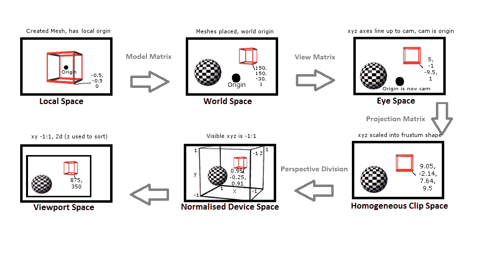
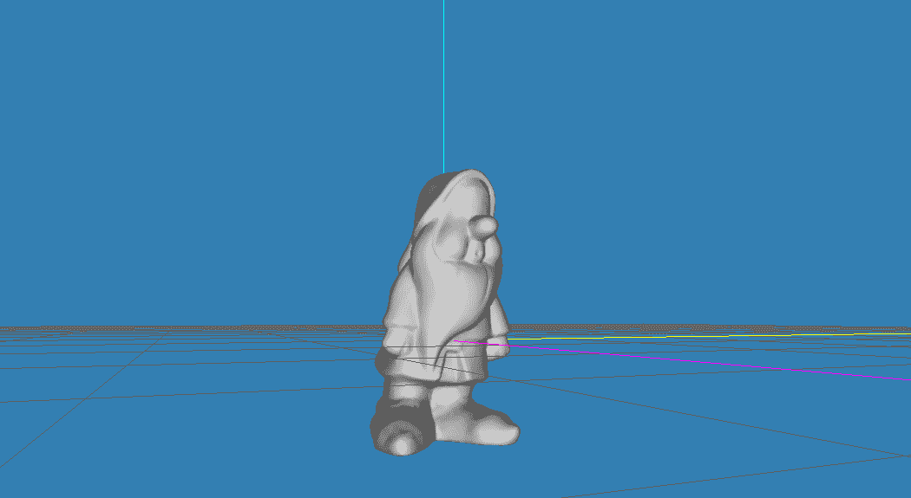
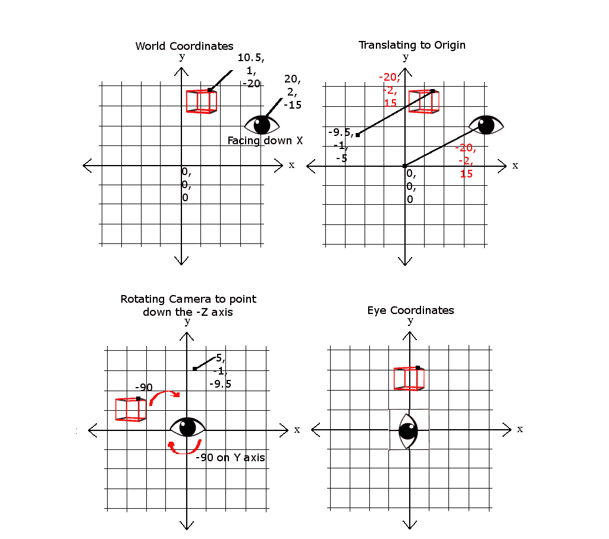
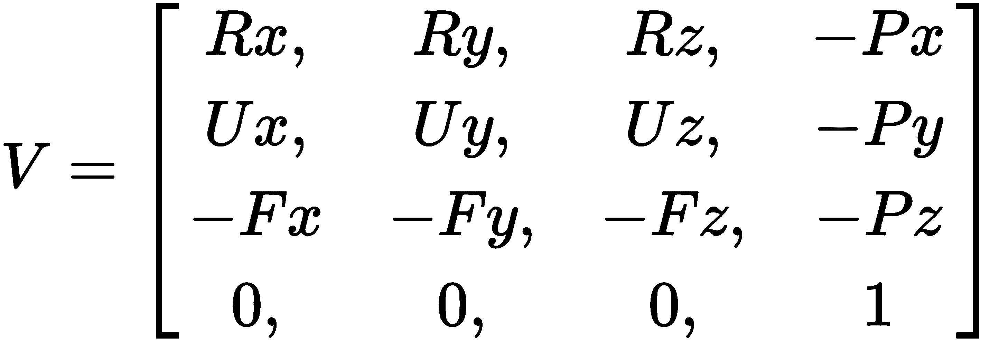
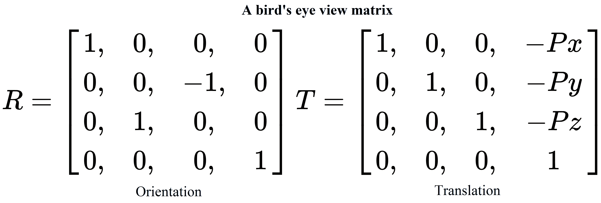
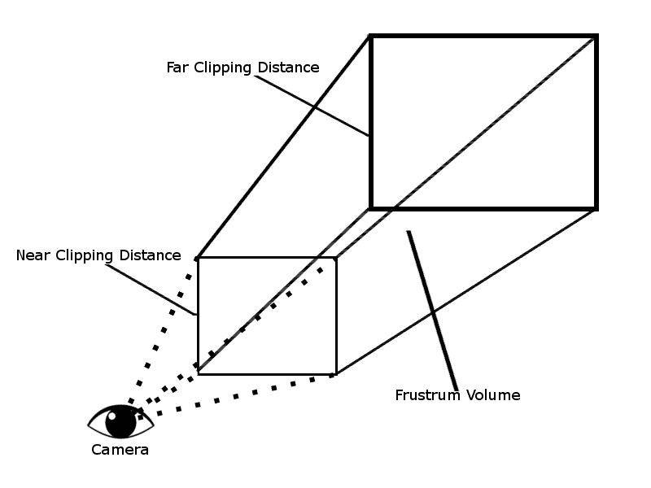
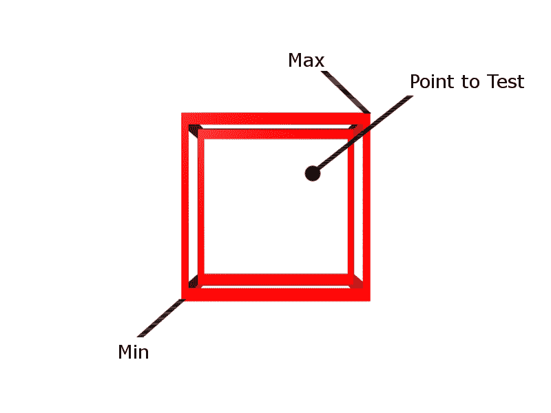
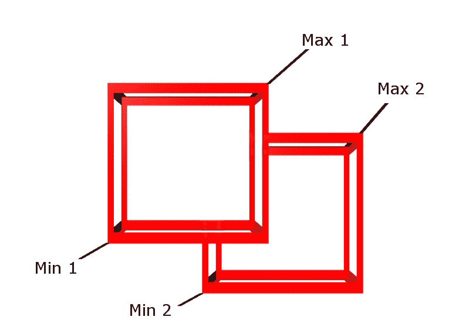
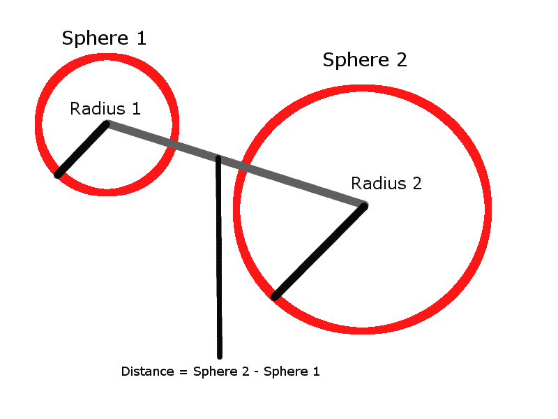
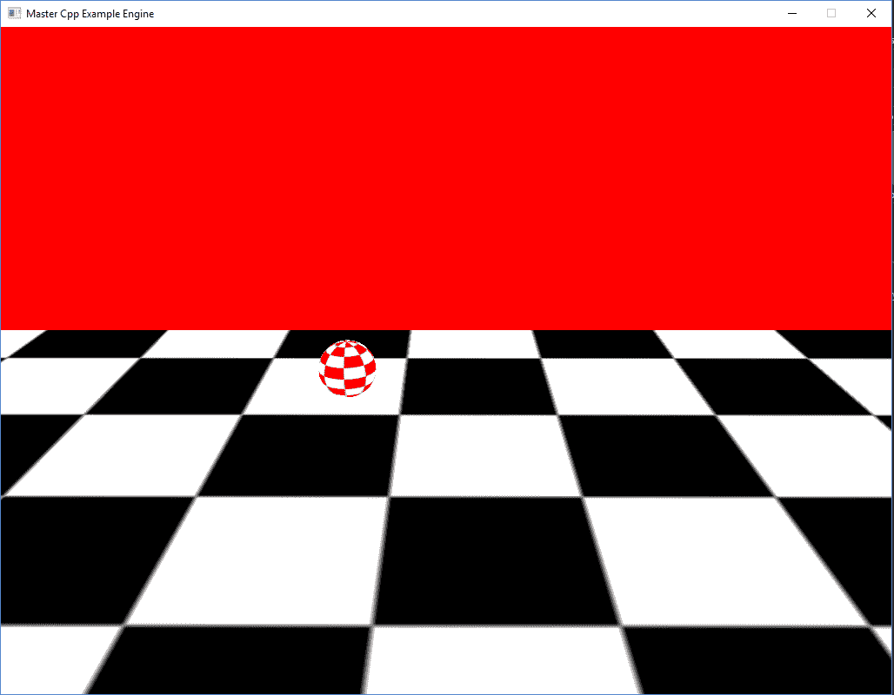

# 构建游戏系统

我们已经到了我们的旅程中的一个节点，我们能够开始将我们将用来驱动我们的游戏和工具的各种系统逐步拼凑在一起。这些系统是引擎的一部分，它们为我们现在能够导入游戏中的所有惊人资产提供互动的动力：

+   理解状态

+   设计摄像机系统

+   使用物理

# 理解状态

我们以许多不同的方式使用状态。它们可以用于控制游戏流程，处理角色行为和反应的不同方式，甚至用于简单的菜单导航。不用说，状态是强大且可管理的代码基础的重要要求。

有许多不同类型的状态机；我们将在本节中重点关注**有限状态机（FSM）**模式。你们中的敏锐读者可能已经注意到，我们已经在实现的屏幕系统的功能中看到了 FSM 模式。事实上，我们将在这里创建的东西与为该系统创建的东西非常相似，只是有一些关键的区别，这将使其成为一个更通用和灵活的状态机。

我们可以在游戏中实现简单状态机的几种方式。一种方式是简单地使用 switch case 来控制状态，并使用`enum`结构来表示状态类型。一个例子如下：

```cpp
enum PlayerState 
{ 
    Idle, 
      Walking 
} 
... 
PlayerState currentState = PlayerState::Idle; //A holder variable for the state currently in 
... 
// A simple function to change states 
void ChangeState(PlayState nextState) 
{ 
    currentState = nextState; 
} 
void Update(float deltaTime) 
{ 
    ... 
    switch(currentState) 
{ 
    case PlayerState::Idle: 
        ... //Do idle stuff 
        //Change to next state 
ChangeState(PlayerState::Walking); 
break; 
        case PlayerState::Walking: 
            ... //Do walking stuff 
            //Change to next state 
            ChangeState(PlayerState::Idle); 
break; 
    } 
    ... 
} 
```

像这样使用 switch/case 对于许多情况来说是有效的，但它确实有一些强大的缺点。如果我们决定添加一些新的状态怎么办？如果我们决定添加分支和更多的`if`条件呢？

我们开始时使用的简单 switch/case 突然变得非常庞大，无疑难以控制。每当我们想要进行更改或添加一些功能时，我们就会增加复杂性，并引入更多的错误机会。通过采用稍微不同的方法并使用类来表示我们的状态，我们可以帮助减轻一些这些问题，并提供更多的灵活性。通过继承和多态性的使用，我们可以构建一个结构，允许我们将状态链接在一起，并提供在许多情况下重用它们的灵活性。

让我们逐步了解如何在我们的演示示例中实现这一点，从我们将来将继承的基类`IState`开始：

```cpp
... 
namespace BookEngine 
{ 
    class IState { 
    public: 
        IState() {} 
        virtual ~IState(){} 
        // Called when a state enters and exits  
        virtual void OnEntry() = 0; 
        virtual void OnExit() = 0; 

        // Called in the main game loop 
        virtual void Update(float deltaTime) = 0; 
    }; 
} 
```

正如你所看到的，这只是一个非常简单的类，它有一个构造函数，一个虚拟析构函数，以及三个完全虚拟的函数，每个继承的状态都必须重写。`OnEntry`将在状态首次进入时调用，每次状态更改时只执行一次。`OnExit`和`OnEntry`一样，每次状态更改时只执行一次，并在状态即将退出时调用。最后一个函数是`Update`函数；这将在每个游戏循环中调用，并包含大部分状态的逻辑。虽然这看起来非常简单，但它给了我们一个很好的起点来构建更复杂的状态。现在让我们在我们的示例中实现这个基本的`IState`类，并看看我们如何将其用于状态机的一个常见需求：创建游戏状态。

首先，我们将创建一个名为`GameState`的新类，它将继承自`IState`。这将是我们的游戏所需的所有状态的新基类。`GameState.h`文件包括以下内容：

```cpp
#pragma once 
#include <BookEngine\IState.h> 
class GameState : BookEngine::IState 
{ 
public: 
    GameState(); 
    ~GameState(); 
    //Our overrides 
    virtual void OnEntry() = 0; 
    virtual void OnExit() = 0; 
    virtual void Update(float deltaTime) = 0; 
    //Added specialty function 
    virtual void Draw() = 0; 
}; 
```

`GameState`类非常类似于它继承的`IState`类，除了一个关键的区别。在这个类中，我们添加了一个新的虚拟方法`Draw()`，所有继承自`GameState`的类现在都将实现它。每次我们使用`IState`并创建一个新的专门的基类，比如玩家状态、菜单状态等，我们可以添加这些新函数来根据状态机的要求进行定制。这就是我们如何使用继承和多态性来创建更复杂的状态和状态机。

继续我们的示例，现在让我们创建一个新的`GameState`。我们首先创建一个名为`GameWaiting`的新类，它继承自`GameState`。为了更容易跟踪，我将所有新的`GameState`继承类分组到一个名为`GameStates.h`和`GameStates.cpp`的文件集中。`GamStates.h`文件将如下所示：

```cpp
#pragma once 
#include "GameState.h" 

class GameWaiting: GameState 
{ 
    virtual void OnEntry() override; 
    virtual void OnExit() override; 
    virtual void Update(float deltaTime) override; 
    virtual void Draw() override; 
}; 

class GameRunning: GameState 
{ 
    virtual void OnEntry() override; 
    virtual void OnExit() override; 
    virtual void Update(float deltaTime) override; 
    virtual void Draw() override; 
}; 

class GameOver : GameState 
{ 
    virtual void OnEntry() override; 
    virtual void OnExit() override; 
    virtual void Update(float deltaTime) override; 
    virtual void Draw() override; 
}; 
```

这里没有什么新东西；我们只是声明了每个`GameState`类的函数。现在，在我们的`GameStates.cpp`文件中，我们可以按照前面的代码实现每个单独状态的函数。

```cpp
#include "GameStates.h" 
    void GameWaiting::OnEntry() 
{ 
...  
//Called when entering the GameWaiting state's OnEntry function 
... 
} 

void GameWaiting::OnExit() 
{ 
...  
//Called when entering the GameWaiting state's OnEntry function 
... 
} 

void GameWaiting::Update(float deltaTime) 
{ 
...  
//Called when entering the GameWaiting state's OnEntry function 
... 

} 

void GameWaiting::Draw() 
{ 
...  
//Called when entering the GameWaiting state's OnEntry function 
... 

} 
...  
//Other GameState implementations  
... 
```

出于页面空间的考虑，我只显示了`GameWaiting`的实现，但其他状态也是一样的。每个状态都将有其自己独特的这些函数实现，这使您能够控制代码流程并根据需要实现更多状态，而不会创建一个难以遵循的代码路径迷宫。

现在我们已经定义了我们的状态，我们可以在游戏中实现它们。当然，我们可以以许多不同的方式进行。我们可以遵循与屏幕系统相同的模式，并实现一个`GameState`列表类，其定义可能如下所示：

```cpp
    class GameState; 

    class GameStateList { 
    public: 
        GameStateList (IGame* game); 
        ~ GameStateList (); 

        GameState* GoToNext(); 
        GameState * GoToPrevious(); 

        void SetCurrentState(int nextState); 
        void AddState(GameState * newState); 

        void Destroy(); 

        GameState* GetCurrent(); 

    protected: 
        IGame* m_game = nullptr; 
        std::vector< GameState*> m_states; 
        int m_currentStateIndex = -1; 
    }; 
} 
```

或者我们可以简单地使用我们创建的`GameState`类与一个简单的`enum`和一个 switch case。状态模式的使用允许这种灵活性。在示例中，我选择了与屏幕系统相同的设计；您可以在源代码存储库中看到`GameStateExample`项目的完整实现。值得浏览源代码，因为我们将在整本书中继续使用这些状态设计。尝试修改示例；添加一个创建与其他状态不同的屏幕打印的新状态。您甚至可以尝试在状态内部嵌套状态，以创建更强大的代码分支能力。

# 与相机一起工作

到目前为止，我们已经讨论了系统结构的很多内容，现在我们已经能够继续设计与我们的游戏和 3D 环境交互的方式。这将我们带到一个重要的话题：虚拟相机系统的设计。相机是为我们提供 3D 世界的视觉表示的东西。这是我们如何沉浸自己，并为我们选择的交互提供反馈。在本节中，我们将讨论计算机图形学中虚拟相机的概念。

在我们开始编写相机代码之前，了解它的工作原理非常重要。让我们从能够在 3D 世界中导航的想法开始。为了做到这一点，我们需要使用所谓的变换管道。变换管道可以被认为是相对于相机视点的位置和方向来转换所有对象和点所采取的步骤。以下是一个详细说明变换管道流程的简单图表：



从管道的第一步开始，局部空间，当一个网格被创建时，它有一个局部原点 0 x，0 y，0 z。这个局部原点通常位于对象的中心，或者在一些玩家角色的情况下，位于脚的中心。构成该网格的所有点都是基于该局部原点的。当谈论一个尚未转换的网格时，我们称之为处于局部空间中。



上图显示了在模型编辑器中的侏儒网格。这就是我们所谓的局部空间。

接下来，我们想将一个网格带入我们的环境，即世界空间。为了做到这一点，我们必须将我们的网格点乘以所谓的模型矩阵。然后将网格放置在世界空间中，这将使所有网格点相对于单个世界原点。最容易将世界空间想象为描述构成游戏环境的所有对象的布局。一旦网格被放置在世界空间中，我们就可以开始做一些事情，比如比较距离和角度。这一步的一个很好的例子是在世界/关卡编辑器中放置游戏对象；这是在与其他对象和单个世界原点（0,0,0）相关的模型网格的描述。我们将在下一章更详细地讨论编辑器。

接下来，为了在这个世界空间中导航，我们必须重新排列点，使它们相对于摄像机的位置和方向。为了实现这一点，我们进行了一些简单的操作。首先是将对象平移到原点。首先，我们会将摄像机从其当前的世界坐标移动。

在下面的示例图中，*x*轴上有**20**，*y*轴上有**2**，*z*轴上有**-15**，相对于世界原点或**0,0,0**。然后我们可以通过减去摄像机的位置来映射对象，即用于平移摄像机对象的值，这种情况下为**-20**，**-2**，**15**。因此，如果我们的游戏对象在*x*轴上开始为**10.5**，在*y*轴上为**1**，在*z*轴上为**-20**，则新的平移坐标将是**-9.5**，**-1**，**-5**。最后一个操作是将摄像机旋转到所需的方向；在我们当前的情况下，这意味着指向-*z*轴。对于下面的示例，这意味着将对象点旋转**-90**度，使示例游戏对象的新位置为**5**，**-1**，**-9.5**。这些操作组合成所谓的视图矩阵：



在我们继续之前，我想简要介绍一些重要的细节，当涉及到处理矩阵时，特别是处理矩阵乘法和操作顺序。在使用 OpenGL 时，所有矩阵都是以列主布局定义的。相反的是行主布局，在其他图形库中可以找到，比如微软的 DirectX。以下是列主视图矩阵的布局，其中 U 是指向上的单位向量，F 是我们指向前方的向量，R 是右向量，P 是摄像机的位置：



构建一个矩阵时，其中包含平移和旋转的组合，比如前面的视图矩阵，通常不能简单地将旋转和平移值放入单个矩阵中。为了创建一个正确的视图矩阵，我们需要使用矩阵乘法将两个或多个矩阵组合成一个最终的矩阵。记住我们使用的是列主记法，因此操作的顺序是从右到左。这很重要，因为使用方向（R）和平移（T）矩阵，如果我们说 V = T x R，这将产生一个不希望的效果，因为这首先会将点围绕世界原点旋转，然后将它们移动到与摄像机位置对齐。我们想要的是 V = R x T，其中点首先与摄像机对齐，然后应用旋转。在行主布局中，当然是相反的：



好消息是，我们不一定需要手动处理视图矩阵的创建。OpenGL 的旧版本和大多数现代数学库，包括 GLM，都有一个`lookAt()`函数的实现。大多数函数需要相机位置、目标或观察位置以及上方向作为参数，并返回一个完全创建好的视图矩阵。我们将很快看到如何使用 GLM 的`lookAt()`函数的实现，但如果你想看到刚才描述的想法的完整代码实现，请查看项目源代码库中包含的 GLM 的源代码。

继续通过变换管线，下一步是从眼空间转换为齐次裁剪空间。这个阶段将构建一个投影矩阵。投影矩阵负责一些事情。

首先是定义近裁剪平面和远裁剪平面。这是沿着定义的前向轴（通常为*z*）的可见范围。任何落在近距离前面或者远距离后面的物体都被视为超出范围。在后续步骤中，处于此范围之外的任何几何对象都将被*裁剪*（移除）。

第二步是定义**视野**（**FOV**）。尽管名字是视野，但实际上是一个角度。对于 FOV，我们实际上只指定了垂直范围；大多数现代游戏使用 66 或 67 度。水平范围将由矩阵根据我们提供的宽高比（宽度相对于高度）来计算。举例来说，在 4:3 宽高比的显示器上，67 度的垂直角度将有一个 FOV 为 89.33 度（*67 * 4/3 = 89.33*）。

这两个步骤结合起来创建了一个形状类似于被截去顶部的金字塔的体积。这个创建的体积被称为视锥体。任何落在这个视锥体之外的几何体都被视为不可见。

以下图示了视锥体的外观：



你可能会注意到在视锥体的末端有更多的可见空间。为了在 2D 屏幕上正确显示这一点，我们需要告诉硬件如何计算透视。这是管线中的下一步。视锥体的较大、远端将被推在一起，形成一个盒子形状。在这个宽端可见的物体也将被挤在一起；这将为我们提供一个透视视图。要理解这一点，想象一下看着一条笔直的铁轨。随着铁轨延伸到远处，它们看起来会变得更小、更接近。

在定义裁剪空间之后，管线中的下一步是使用所谓的透视除法将点归一化为一个具有尺寸为(-1 到 1，-1 到 1，-1 到 1)的盒子形状。这被称为**归一化设备空间**。通过将尺寸归一化为单位大小，我们允许点被乘以以缩放到任何视口尺寸。

变换管线中的最后一个重要步骤是创建将要显示的 3D 的 2D 表示。为了做到这一点，我们将归一化设备空间中的远处物体绘制在靠近摄像机的物体后面（绘制深度）。尺寸从*X*和*Y*的归一化值被缩放为视口的实际像素值。在这一步之后，我们有了一个称为**视口空间**的 2D 空间。

这完成了转换管道阶段。有了这个理论，我们现在可以转向实现并编写一些代码。我们将从创建一个基本的第一人称 3D 摄像机开始，这意味着我们是通过玩家角色的眼睛观察。让我们从摄像机的头文件`Camera3D.h`开始，它可以在源代码库的`Chapter05`项目文件夹中找到。

```cpp
... 
#include <glm/glm.hpp> 
#include <glm/gtc/matrix_transform.hpp> 
..., 
```

我们从必要的包含开始。正如我刚提到的，GLM 包括支持使用矩阵，所以我们包括`glm.hpp`和`matrix_transform.hpp`来获得 GLM 的`lookAt()`函数的访问权限。

```cpp
... 
   public: 
      Camera3D(); 
      ~Camera3D(); 
      void Init(glm::vec3 cameraPosition = glm::vec3(4,10,10), 
              float horizontalAngle = -2.0f,  
              float verticalAngle = 0.0f,  
              float initialFoV = 45.0f); 
      void Update(); 
```

接下来，我们有 Camera3D 类的公共可访问函数。前两个只是标准的构造函数和析构函数。然后是`Init()`函数。我们声明这个函数时提供了一些默认值，这样如果没有传入值，我们仍然有值可以在第一次更新调用中计算我们的矩阵。这将带我们到下一个声明的函数，`Update()`函数。这是游戏引擎每次循环调用以保持摄像机更新的函数。

```cpp
glm::mat4 GetView() { return m_view; };
glm::mat4 GetProjection() { return m_projection; };
glm::vec3 GetForward() { return m_forward; };
glm::vec3 GetRight() { return m_right; };
glm::vec3 GetUp() { return m_up; };
```

在`Update()`函数之后，有一组五个获取函数，用于返回视图和投影矩阵，以及摄像机的前向、向上和向右向量。为了保持实现的整洁，我们可以在头文件中简单地声明和实现这些*getter*函数。

```cpp
void SetHorizontalAngle(float angle) { m_horizontalAngle = angle; };
void SetVerticalAngle(float angle) { m_verticalAngle = angle; };
```

在获取函数集之后，我们有两个设置函数。第一个将设置水平角度，第二个将设置垂直角度。当屏幕大小或纵横比发生变化时，这是很有用的。

```cpp
void MoveCamera(glm::vec3 movementVector) { m_position +=   movementVector; };
```

Camera3D 类中的最后一个公共函数是`MoveCamera()`函数。这个简单的函数接收一个向量 3，然后将该向量累加到`m_position`变量中，这是当前摄像机的位置。

```cpp
...
  private:
    glm::mat4 m_projection;
    glm::mat4 m_view; // Camera matrix
```

对于类的私有声明，我们从两个`glm::mat4`变量开始。`glm::mat4`是 4x4 矩阵的数据类型。我们创建一个用于视图或摄像机矩阵，一个用于投影矩阵。

```cpp
glm::vec3 m_position;
float m_horizontalAngle;
float m_verticalAngle;
float m_initialFoV;
```

接下来，我们有一个单一的三维向量变量来保存摄像机的位置，然后是三个浮点值——一个用于水平角度，一个用于垂直角度，以及一个用于保存视野的变量。

```cpp
glm::vec3 m_right;
glm::vec3 m_up;
glm::vec3 m_forward; 
```

然后我们有另外三个向量 3 变量类型，它们将保存摄像机对象的右、上和前向值。

现在我们已经声明了我们的 3D 摄像机类，下一步是实现头文件中尚未实现的任何函数。我们只需要提供两个函数，`Init()`和`Update()`函数。让我们从`Init()`函数开始，它位于`Camera3D.cpp`文件中。

```cpp
void Camera3D::Init(glm::vec3 cameraPosition, 
     float horizontalAngle, 
     float verticalAngle, 
     float initialFoV)
   {
     m_position = cameraPosition;
     m_horizontalAngle = horizontalAngle;
     m_verticalAngle = verticalAngle;
     m_initialFoV = initialFoV;

     Update();
    }
    ...

```

我们的`Init()`函数很简单；在函数中，我们只是接收提供的值并将它们设置为我们声明的相应变量。一旦我们设置了这些值，我们只需调用`Update()`函数来处理新创建的摄像机对象的计算。

```cpp
...
   void Camera3D::Update()
   {
      m_forward = glm::vec3(
          glm::cos(m_verticalAngle) * glm::sin(m_horizontalAngle),
          glm::sin(m_verticalAngle),
          glm::cos(m_verticalAngle) * glm::cos(m_horizontalAngle)
        );
```

`Update()`函数是类的所有繁重工作都在做的地方。它首先计算摄像机的新前向。这是通过利用 GLM 的余弦和正弦函数的简单公式来完成的。正在发生的是，我们正在从球坐标转换为笛卡尔坐标，以便我们可以在创建我们的视图矩阵中使用该值。

```cpp
  m_right = glm::vec3(
        glm::sin(m_horizontalAngle - 3.14f / 2.0f),
        0,
        glm::cos(m_horizontalAngle - 3.14f / 2.0f)
     );  
```

在计算了新的前向之后，我们然后使用一个简单的公式计算摄像机的新右向量，再次利用 GLM 的正弦和余弦函数。

```cpp
 m_up = glm::cross(m_right, m_forward);
```

现在我们已经计算出了前向和向上的向量，我们可以使用 GLM 的叉积函数来计算摄像机的新向上向量。这三个步骤在摄像机改变位置或旋转之前，以及在创建摄像机的视图矩阵之前发生是很重要的。

```cpp
  float FoV = m_initialFoV;
```

接下来，我们指定视野。目前，我只是将其设置回初始化摄像机对象时指定的初始视野。如果摄像机被放大或缩小，这将是重新计算视野的地方（提示：鼠标滚轮可能在这里很有用）：

```cpp
m_projection = glm::perspective(glm::radians(FoV), 4.0f / 3.0f, 0.1f, 100.0f);
```

一旦我们指定了视野，我们就可以计算摄像机的投影矩阵。幸运的是，GLM 有一个非常方便的函数叫做`glm::perspective()`，它接受弧度制的视野、宽高比、近裁剪距离和远裁剪距离，然后返回一个创建好的投影矩阵。由于这只是一个示例，我指定了一个 4:3 的宽高比（4.0f/3.0f）和一个直接的裁剪空间从 0.1 单位到 100 单位。在生产中，你理想情况下会将这些值移动到可以在运行时更改的变量中：

```cpp
 m_view = glm::lookAt(
            m_position,           
            m_position + m_forward, 
            m_up
         );
      }
```

最后，在`Update()`函数中我们要做的是创建视图矩阵。正如我之前提到的，我们很幸运，GLM 库提供了一个`lookAt()`函数，用于抽象我们在本节前面讨论的所有步骤。这个`lookAt()`函数接受三个参数。第一个是摄像机的位置。第二个是摄像机指向的矢量值，或者*看向*的位置，我们通过简单地将摄像机当前位置和计算出的前向矢量相加来提供。最后一个参数是摄像机当前的上矢量，同样，我们之前计算过。完成后，这个函数将返回新更新的视图矩阵，供我们在图形管线中使用。

这就是一个简单的 3D 摄像机类。继续运行 CameraDemo 项目，看看系统是如何运作的。你可以用 WASD 键移动摄像机，用鼠标改变视角。接下来，我们将转向另一个重要的游戏引擎系统，物理！

# 处理物理

如今，很少有游戏不实现至少一些基本形式的物理。游戏物理的话题相当庞大和复杂，很容易填满几卷书才能算是全面覆盖。正因为如此，整个团队都致力于创建*物理引擎*，并且可能需要数年的开发才能构建生产级系统。因为情况如此，我们不会尝试在这里覆盖所有方面，而是采取更高层次的方法。我们将覆盖一些更常见的物理系统方面，特别是基本的碰撞检测。对于更高级的需求，比如支持重力、摩擦和高级碰撞检测，我们将覆盖第三方物理库的实现。在本节结束时，我们的演示引擎将具有高级的物理支持。

# AABB 中的点

首先，让我们来看看在 3D 中可以执行的较简单的碰撞检查之一，即找出一个点是否在**轴对齐边界框**（**AABB**）内或外。AABB 非常容易创建。你可以基本上将其想象成不可旋转的立方体或盒子。以下图像描述了 AABB 和点之间的碰撞：



要创建一个边界框，你可以指定一个向量格式的最大点和最小点，或者通过指定一个中心点，然后指定高度、宽度和深度。在这个例子中，我们将使用最小点和最大点的方法创建我们的 AABB：

```cpp
struct BoundingBox
{
 glm::vec3 m_vecMax;
 glm::vec3 m_vecMin;
};  
```

前面的代码是一个简单的 AABB 结构的示例。

现在我们有了一个 AABB，我们可以开发一种方法来检查单个点是否落在 AABB 内。这个检查非常简单；我们只需要检查它的所有值，x、y 和 z，是否大于 AABB 的最小值并且小于 AABB 的最大值。在代码中，这个检查看起来会像下面这样，以最简单的形式：

```cpp
bool PointInAABB(const BoundingBox& box, const glm::vec3 & vecPoint)
 {
   if(vecPoint.x > tBox.m_vecMin.x && vecPoint.x < tBox.m_vecMax.x &&
      vecPoint.y > tBox.m_vecMin.y && vecPoint.y < tBox.m_vecMax.y &&
      vecPoint.z > tBox.m_vecMin.z && vecPoint.z < tBox.m_vecMax.z)
     {
         return true;
     }
    return false;
  }

```

# AABB 到 AABB

现在我们已经看到如何测试一个点是否在某个 AABB 内，接下来我们将看到的非常有用的碰撞检查是 AABB 到 AABB 的检查——一个快速测试，以找出两个 AABB 是否发生碰撞。以下图像描述了这个碰撞检查：



两个 AABB 之间的碰撞检查非常简单和快速。这是大多数需要一种碰撞检测形式的对象的常见选择。

AABB 的不好之处在于它们不能旋转。一旦它们旋转，它们就不再是 AABB，因为它们不再与*x*、*y*和*z*轴对齐。对于旋转的对象，更好的选择是使用球体、胶囊体，甚至是**定向包围盒**（**OBBs**）。

要检查两个 AABB 是否发生碰撞，我们只需要检查第一个 AABB 的最大点是否大于第二个 AABB 的最小点，并且第一个 AABB 的最小点是否小于第二个 AABB 的最大点。以下是这个检查在代码中的简单形式：

```cpp
bool AABBtoAABB(const BoundingBox& box1, const BoundingBox& box2) 
{ 
 if (box1.m_vecMax.x > tBox2.m_vecMin.x &&  
    box1.m_vecMin.x < tBox2.m_vecMax.x && 
    box1.m_vecMax.y > tBox2.m_vecMin.y && 
    box1.m_vecMin.y < tBox2.m_vecMax.y && 
    box1.m_vecMax.z > tBox2.m_vecMin.z && 
    box1.m_vecMin.z < tBox2.m_vecMax.z)  
{  
   return true; 
} 
return false; 
} 
```

当然，盒子的顺序，哪一个是第一个，哪一个是第二个，都无关紧要。

由于这个检查包含很多`&&`比较，如果第一个检查是假的，它将不会继续检查其余的；这就是允许非常快速测试的原因。

# 球到球

我想在这里谈论的最后一个简单的碰撞检查是测试两个球体是否相互碰撞。测试球体之间的碰撞非常简单且易于执行。球体相对于 AABB 等物体的优势在于，不管物体是否旋转，球体都将保持不变。以下是描述两个球体之间碰撞检查的图像：



为了进行检查，我们只需要计算球心之间的距离，并将其与它们的半径之和进行比较。如果这个距离小于它们的半径之和，那么球体重叠。如果相同，那么球体只是接触。以下是这个碰撞测试在代码中的简单形式：

```cpp
... 
struct BoundingSphere 
{ 
glm::vec3    m_vecCenter; 
float          m_radius; 
}; 
... 
bool SphereToSphere(const BoundingSphere & Sphere1, const BoundingSphere & Sphere2) 
{ 

glm::vec3 distance(Sphere2.m_vecCenter - Sphere1.m_vecCenter); 
float distanceSqaured(glm::dot( & distance, & distance) ); 

```

为了得到球心之间的距离，我们需要创建一个连接它们中心点的向量：

```cpp
float radiiSumSquared( Sphere1.m_radius + Sphere2.m_radius ); 
radiiSumSquared *= radiiSumSquared; 
```

然后我们可以计算该向量与半径之和的长度：

有一种更有效的方法。由于向量与自身的点积等于该向量的平方长度，我们可以只计算该向量的平方长度与半径之和的平方。如果我们这样做，就不需要计算向量的长度，这本身就是一个昂贵的操作。

```cpp
if( distanceSqaured <= radiiSumSquared ) 
{ 
    return true; 
} 
return false; 
} 
... 
```

最后，我们可以进行碰撞检查。如果距离的平方小于或等于平方和，那么球体已经碰撞，否则，物体没有碰撞，我们返回 false。

有了这些简单的检查，大多数基本的碰撞检测都可以处理。事实上，正如我们将在下一节中看到的，大多数高级检查都由许多较小的检查组成。然而，总会有一个时刻，你会发现自己需要更高级或优化的物理处理方式；这时你可以求助于第三方库来提供支持。在下一节中，我们将看一下其中一个第三方库的实现。

# 实现 Bullet 物理库。

Bullet 是一个模拟碰撞检测和软体和刚体动力学的物理引擎。它已经被用于许多发布的视频游戏以及电影中的视觉效果。Bullet 物理库是免费的开源软件，受 zlib 许可证的条款约束。

Bullet 提供的一些功能包括：

+   刚体和软体模拟，使用离散和连续碰撞检测

+   碰撞形状：球、盒子、圆柱、锥体、使用 GJK 的凸壳、非凸和三角网格

+   软体支持：布料、绳索和可变形物体

具有约束限制和电机的丰富的刚体和软体约束集。

你可以在以下网址找到源代码链接和更多信息：[`bulletphysics.org`](http://bulletphysics.org)。

让我们看看如何将 Bullet 引入到你自己的游戏项目中。我不打算花时间讲解如何将库链接到我们的演示项目，因为我们已经讲解了几次了。如果你需要复习，请翻回几章看看。我们要做的是将 Bullet 引擎整合到我们的演示引擎中，然后使用 Bullet 引擎的计算来实时定位我们的游戏对象。在这个例子中，我们将创建一个简单的地面平面，然后一个球（球体）下落并与地面碰撞。我们将使用 Bullet 的内置类型来支持这一点，包括重力以给它一个真实的效果。

从地面`GameObject`开始，我们设置了一些需要的物理值的变量。第一个是`btCollisionShape`类型。这是一个 Bullet 类型，允许在创建物理测试的边界对象时定义简单的形状。接下来是`btDefaultMotionState`类型，这也是一个 Bullet 数据类型，描述了物体在运动时的行为方式。我们需要的最后一个变量是`btRigidBody`类型，这是一个 Bullet 数据类型，将保存我们的物理引擎关心的物体的所有物理属性：

```cpp
class GroundObject : BookEngine::GameObject 
{ 
   ... 

   btCollisionShape* groundShape = nullptr; 
   btDefaultMotionState* groundMotionState = nullptr; 
   btRigidBody* groundRigidBody = nullptr; 
```

一旦我们定义了这些变量，我们就可以在`Init()`函数中构建地面对象的物理表示：

```cpp
void GroundObject::Init(const glm::vec3& pos, const glm::vec3& scale) 
{ 
   ... 
   groundShape = new btStaticPlaneShape(btVector3(0, 1, 0), 1); 
   groundMotionState = 
      new btDefaultMotionState(btTransform(btQuaternion(0, 0, 0, 1), btVector3(m_position.x, m_position.y, m_position.z))); 
```

我们首先将我们的`groundShape`变量设置为`btStaticPlanShape`。这是一个指定简单平面对象的 Bullet 对象，非常适合我们的需要和一个简单的地面对象。接下来，我们设置`groundMotionState`。我们通过使用`btDefaultMotionState` Bullet 对象来实现这一点。`btDefaultMotionState`是用于指定物体在运动中的行为方式的类型。创建一个新的`btDefaultMotionState`时，我们需要传入一些关于物体变换的信息，即物体的旋转和位置。为此，我们传入一个`btTransform`对象，其自身参数为四元数格式的旋转（`btQuaternion(0, 0, 0, 1)`）和三维向量格式的位置（`btVector3(m_position.x, m_position.y, m_position.z)`）：

```cpp
btRigidBody::btRigidBodyConstructionInfo 
 groundRigidBodyCI(0, groundMotionState, groundShape, btVector3(0, 0,  0)); 
 groundRigidBody = new btRigidBody(groundRigidBodyCI); 
```

现在，`groundShape`和`groundMotionState`设置好了，我们可以继续创建和设置刚体信息。首先，我们为构造信息定义了一个`btRigidBodyConstuctionInfo`变量，名为`groundRigidBodyCI`。这个对象接受一些参数值，一个标量值来指定质量，物体的运动状态，碰撞形状，以及一个三维向量来指定局部惯性值。惯性是任何物体对其运动状态的任何改变的抵抗力。基本上是物体保持以恒定速度直线运动的倾向。

由于我们的地面对象是静态的，不需要根据物理输入进行任何更改，我们可以跳过`Update()`函数，继续进行我们将用来测试系统的 Ball 对象。

进入`BallObject.h`文件，我们定义了一些我们需要的变量，就像我们为地面对象做的那样。我们创建了一个运动状态，一个标量（整数）值用于质量，碰撞形状，最后是一个刚体：

```cpp
btDefaultMotionState* fallMotionState;
btScalar mass = 1;
btCollisionShape* fallShape;
btRigidBody* fallRigidBody;
...  
```

现在，进入`BallObject.cpp`文件，我们为刚刚定义的变量分配一些值：

```cpp
void BallObject::Init(const glm::vec3& pos, const glm::vec3& scale)
 {
    ...

    fallShape = new btSphereShape(10);
    btVector3 fallInertia(0.0f, 0.0f, 0.0f);  
```

首先，我们设置碰撞形状。在这种情况下，我们将使用类型`btSphereShape`。这是球体的默认形状，并接受一个参数来设置球体的半径。接下来，我们创建一个三维向量来保存球体的惯性。我们将其设置为全零，因为我们希望这个球体根据物体的质量和我们即将设置的重力值自由下落，没有阻力：

```cpp
fallMotionState =
       new btDefaultMotionState(btTransform(btQuaternion(0, 0, 0, 1),     
       btVector3(m_position.x, m_position.y, m_position.z)));
```

接下来，我们设置球的运动状态，就像我们为地面物体做的一样。我们将旋转设置为 0，位置设置为球对象的当前位置：

```cpp
 fallShape->calculateLocalInertia(mass, fallInertia);
    btRigidBody::btRigidBodyConstructionInfo fallRigidBodyCI(mass,  fallMotionState, fallShape, fallInertia);
    fallRigidBody = new btRigidBody(fallRigidBodyCI);
     }

```

然后我们使用方便的`calculateLocalInertia()`函数计算局部惯性值，传入质量和`fallInertia`值。这将设置我们的球对象的下落向量，用于物理引擎的第一个 tick。最后，我们以与之前地面对象完全相同的方式设置刚体对象。

对于球对象，我们确实希望物理引擎的输出会影响球对象。正因为如此，我们需要在球对象的`Update()`函数中进行一些调整：

```cpp
void BallObject::Update(float deltaTime)
 {
    btTransform trans;
    fallRigidBody->getMotionState()->getWorldTransform(trans);
    m_position.x = trans.getOrigin().getX();
    m_position.y = trans.getOrigin().getY();
    m_position.z = trans.getOrigin().getZ();
  }
```

对于球对象的更新循环中的第一步是从刚体获取物理对象的变换。一旦我们有了这个变换对象，我们就可以将球对象的网格（可见对象）设置为物理变换对象的位置。这就是对象本身的全部内容。球和地面对象现在包含了所有所需的物理信息。现在我们可以将物理引擎循环实现到我们的游戏循环中，并让球滚动，不是在开玩笑！

对于将物理引擎实现到我们现有的游戏引擎循环中，我们首先需要设置一些值。进入我们的`Gameplayscreen.h`，我们定义变量来保存这些值：

```cpp
btBroadphaseInterface* broadphase = new btDbvtBroadphase();  
```

首先是`btBroadphaseInterface`类对象的定义，它提供了一个 Bullet 接口来检测 AABB 重叠的对象对。在这种情况下，我们将其设置为`btDbvtBroadphase`，它使用两个动态 AABB 边界体积层次/树来实现`btBroadphase`。当处理许多移动对象时，这往往是最好的广相位；它的对象插入/添加和移除通常比在`btAxisSweep3`和`bt32BitAxisSweep3`中找到的扫描和修剪广相位更快：

```cpp
btDefaultCollisionConfiguration* collisionConfiguration = new     
       btDefaultCollisionConfiguration();
btCollisionDispatcher* dispatcher = new              
       btCollisionDispatcher(collisionConfiguration); btSequentialImpulseConstraintSolver* solver = new    
       btSequentialImpulseConstraintSolver;
```

接下来，我们已经为碰撞配置、碰撞分发器和顺序脉冲约束求解器定义了。我们不会深入讨论每一个，但主要观点是碰撞配置设置了一些 Bullet 内部值，比如碰撞检测堆栈分配器和池内存分配器。碰撞分发器是处理碰撞的定义。它支持处理*凸凸*和*凸凹*碰撞对的算法，时间的影响，最近的点和穿透深度。最后，顺序脉冲约束求解器定义了可以被认为是算法，将决定如何解决物体之间的碰撞。对于那些希望了解的人，这是一种**单指令，多数据**（**SIMD**）实现的投影高斯-塞德尔（迭代 LCP）方法：

```cpp
btDiscreteDynamicsWorld* dynamicsWorld = new       
     btDiscreteDynamicsWorld(dispatcher, broadphase, solver,    
     collisionConfiguration);
```

我们需要定义的最后一个变量是我们的动态世界对象。`btDiscreteDynamicsWorld`提供了离散刚体模拟。这可以被认为是发生物理模拟的环境或*世界*。一旦我们定义了这个，我们就有了开始物理模拟的所有要素。

让我们跳转到`GameplayScreen.cpp`文件，看看我们将用来初始化物理模拟的`OnEntry()`函数：

```cpp
void GameplayScreen::OnEntry() 
{ 
   ... 

   dynamicsWorld->setGravity(btVector3(0, -1, 0)); 
   dynamicsWorld->addRigidBody(m_ground.groundRigidBody); 
   dynamicsWorld->addRigidBody(m_ball.fallRigidBody); 
... 
} 
```

我们设置的第一件事是重力向量。在我们的简单示例中，我们将其设置为*y*轴上的`-1`。接下来，我们将两个创建的刚体添加到模拟环境中，一个用于地面，一个用于球。这处理了我们物理引擎的初始化；现在我们需要在每个引擎 tick 上更新它：

```cpp
void GameplayScreen::Update(float deltaTime) 
{ 
   CheckInput(deltaTime); 
   dynamicsWorld->stepSimulation(1 / 60.f, 10); 
   m_ball.Update(deltaTime); 
```

在`GameplayScreen::Update()`函数中，我们首先检查输入，然后调用物理引擎的更新，最后调用游戏对象本身的更新。重要的是要注意这个顺序。我们首先要接受用户的输入，但我们要确保在对象之前已经更新了物理引擎。原因是物理计算应该对对象产生一些影响，我们不希望出现绘图循环领先于物理循环的情况，因为这肯定会导致一些不需要的效果。您还会注意到物理更新函数`stepSimulation`接受两个参数。第一个是要按时间步长模拟的时间量。这通常是自上次调用它以来的时间。在这种情况下，我们将其设置为 1/60 秒，或 60 FPS。第二个参数是 Bullet 允许每次调用它执行的最大步数。如果您将一个非常大的值作为第一个参数传递，比如，是固定内部时间步长或游戏时钟大小的五倍，那么您必须增加`maxSubSteps`的数量来补偿这一点；否则，您的模拟将*丢失*时间，这将再次导致一些不需要的物理计算输出。

就是这样！我们现在有一个物理引擎在运行其模拟，并影响我们在屏幕上绘制的世界中的对象。您可以通过在`Chapter05` GitHub 存储库中运行`PhysicsDemo`示例项目来看到这一点。输出将类似于以下内容：



# 总结

在本章中，我们涵盖了很多内容，并在开发专业级项目所需的核心游戏系统方面取得了良好的进展。我们现在拥有自己的自定义游戏状态系统，可以被游戏引擎中的许多其他组件采用。我们在构建对摄像机的工作原理的理解的同时，开发了自己的自定义摄像机系统。最后，我们看了一下如何通过将 Bullet 物理引擎添加到我们的示例引擎中，可以向我们的项目添加完整的第三方游戏系统。
