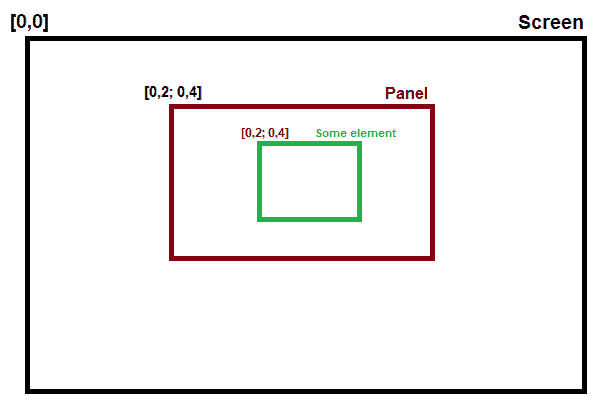
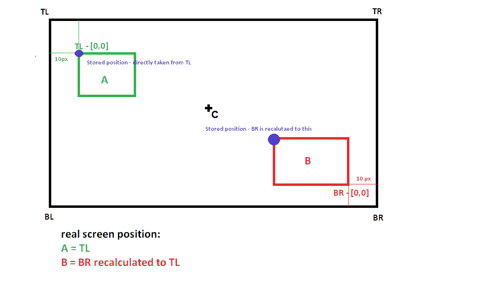
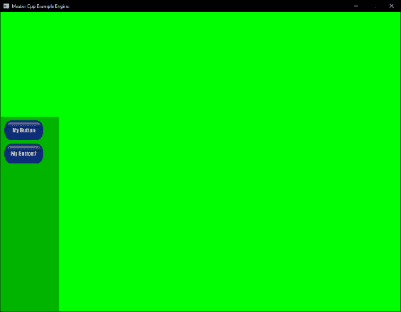
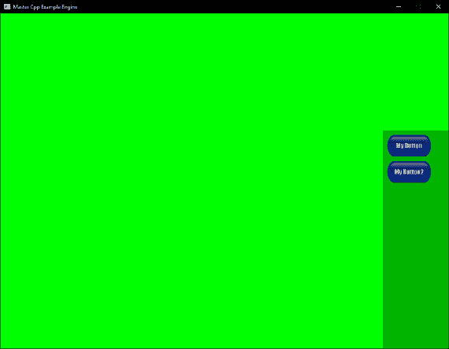
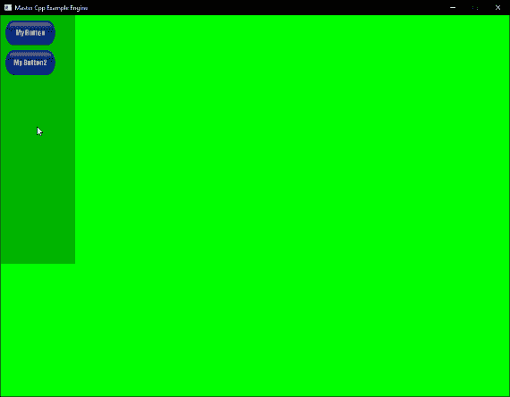
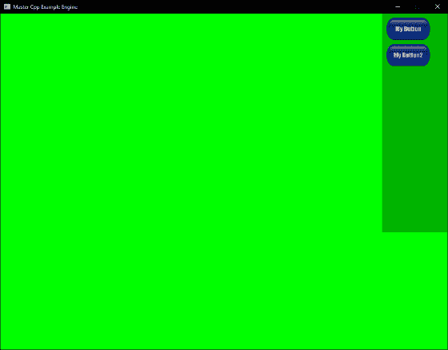
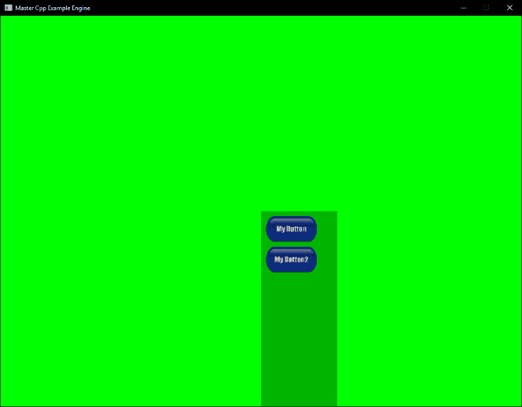

# 第六章：创建图形用户界面

在游戏中，用户交互是设计中非常重要的一部分。能够为用户提供视觉信息和视觉选择的能力是**图形用户界面**（**GUI**）的作用所在。与本书中讨论的许多其他系统一样，已经有现成的库可供使用。在开源游戏开发世界中最常见的一个是**Crazy Eddies GUI**（**CEGUI**）。虽然 CEGUI 是一个非常强大的 GUI 系统实现，但随着这种强大性而来的是复杂性，老实说，大多数时候你真的只需要一个文本标签、一个简单的按钮，也许还有一个复选框和图标支持。有了这些简单的构建模块，你就可以创建很多东西。

在本章中，我们将构建基本组件并创建一个简单的 GUI 系统。需要注意的是，从头开始创建一个完整的、可生产的 GUI 系统是一项艰巨的任务，不是一个单独的章节可以完成的。因此，我们将专注于核心概念，并构建一个可以在以后扩展和扩展的系统。我们的 GUI 将不使用任何 API 特定内容，并将继续构建前几章创建的结构。本章涉及的主题如下：

+   坐标系统和定位

+   添加控制逻辑

+   渲染 GUI

本章的完整代码示例可以在代码存储库的`Chapter06`文件夹中找到。为了简洁起见，我将省略一些非必要的代码行，并可能更频繁地跳转文件和类。

# 坐标系统和定位

每个 GUI 系统中最重要的部分之一是对象/元素在屏幕上的位置。在大多数情况下，图形 API 使用称为屏幕空间的坐标，通常表示为绝对范围[-1,1]。虽然这对于渲染是很好的，但在尝试开发我们的 GUI 系统时可能会引起一些问题。例如，让我们以使用绝对系统的想法为例。在这个系统中，我们将明确地将 GUI 中的每个元素设置为真实的像素坐标。这可能很容易实现，但只有在游戏的分辨率保持不变的情况下才能工作。如果我们在任何时候改变分辨率，元素将保持锁定在其像素坐标上，并且不会按比例缩放以匹配新的分辨率。

另一个选择是创建一个相对系统，其中每个 GUI 元素的位置都是相对于其他元素或屏幕位置描述的。这种方法比绝对系统好得多，但仍然存在一些缩放问题。例如，如果我们在屏幕的左上角放置了一个带有小偏移的元素，如果游戏的分辨率在任何时候发生了变化，我们使用的间距也会发生变化。

我们要构建的是 CEGUI 所采用的一种类似方法，这是前面提到的两种解决方案的结合。与此同时，我们还将添加现代 GUI 中使用的另一个常见约定：将组合的元素包含在*面板*中。我们希望将 GUI 元素分组在面板中有几个很好的理由。首先，如果我们想移动一堆元素，比如一个带有健康、弹药和物品指示器的状态栏，如果我们将它们分组在一个面板中，我们只需要移动面板，所有元素都会正确地跟随移动。这就引出了第二个原因：通过在面板中将元素分组在一起，我们可以定义元素相对于面板位置的位置，而不是将元素位置设置为像素坐标或相对于屏幕位置。

以下是描述此设计布局的图表：



如您所见，使用了相对和绝对定位的组合，但这次相对起始点不是整个屏幕的原点**[0,0]**，而是我们面板的原点**[0,0]**。虽然面板的原点在屏幕上已经有一些坐标，但我们不使用它们来设置元素的位置。

理论上，我们现在在面板内有可扩展的元素，但我们仍然需要一种方法来*锁定*或*固定*面板的位置，而不受屏幕分辨率的影响。这就是 GUI 锚点系统的概念发挥作用的地方。如果您以前使用过 GUI，很可能已经看到过锚点的作用。在我们的例子中，为了节省时间，我们将稍微简化这个概念。在我们的系统中，每个面板都将能够将其原点相对于五个锚点之一设置：左上、右上、左下、右下和中心。

以下图表演示了这个概念：



好的，那么我们如何在代码中实现这些概念并设计它们呢？让我们从一个所有其他元素都将继承的`IGUIElement`类开始。看一下`IGUIElement`类：

```cpp
class IGUIElement
{
public:
virtual void Update() = 0;
glm::vec2 GetPosition() { return m_position; };
protected:
glm::vec2 m_position;
};
}
```

首先，我们的元素并不复杂。每个元素都将有一个`Update()`函数，以及一个 getter 函数来返回元素的位置。我们将在本章后面扩展这个类。

我们可以实现系统的下一部分是面板的概念。让我们从`IGUIPanel.h`的头文件开始看一下：

```cpp
...
static enum class GUIAnchorPos {
TopRight,
TopLeft,
BottomRight,
BottomLeft,
Center
};
...
```

文件以声明一个名为`GUIAnchorPos`的`enum class`开始；这个`enum`将给元素们访问计算出的锚点的权限。我们将这个`enum`类作为`IGUIPanel`类内部的一个`enum`，而不是一个`IGUIPanel`实例的需要，这样可以让元素们在不需要`IGUIPanel`实例的情况下访问锚点。后面，我们将看到一个将这些枚举值连接到已计算出的屏幕位置的函数。

```cpp
...
IGUIPanel(glm::vec4 panelBounds = glm::vec4(0,0,200,480),
glm::vec2 panelAnchor = glm::vec2(0,0),
glm::vec2 offset = glm::vec2(0,0));
...
```

文件中感兴趣的下一部分是构造函数。在这里，我们要求传入一个 vector 4 来定义要创建的面板的边界。接下来，我们要求一个 vector two 来定义面板锚点的原点位置，以及一个 vector two 来提供面板位置的偏移或*填充*。您还会注意到，我们还为每个参数提供了一些默认值。我们这样做有几个原因，但最重要的原因是我们希望能够默认创建 GUI 元素并将它们附加到面板上。通过提供默认值，如果我们创建了一个 GUI 元素，而没有现有的面板可以附加它，我们可以在创建时不需要传入值来创建一个面板。我们将在本章后面重新讨论这个问题。让我们继续实现：

```cpp
IGUIPanel::IGUIPanel(glm::vec4 panelBounds, glm::vec2 panelAnchor, glm::vec2 offset) : m_bounds(panelBounds), m_offset(offset)
{
  m_Pos = panelAnchor + m_offset;
  m_panelWidth = m_bounds.z;
  m_panelHeight = m_bounds.w;
}
```

对于`IGUIPanel`构造函数的实现，我们首先要计算的是面板在屏幕上的位置。我们通过将面板的锚点与传入的偏移相加来实现这一点，并将其存储在受保护的成员变量`m_Pos`中。接下来，我们计算面板的宽度和高度；我们使用传入的边界值来实现这一点。我们分别将它们存储在名为`m_panelWidth`和`m_panelHeight`的受保护成员变量中。

现在我们已经放置了面板构造函数，我们可以继续设置面板如何保存它们的元素。为了实现这一点，我们简单地创建了一个名为`m_GUIElementList`的`IGUIElements`指针的向量。然后我们可以开始创建一些公共方法来访问和操作面板的元素列表：

```cpp
...
  void IGUIPanel::AddGUIElement(IGUIElement & GUIElement)
  {
     m_GUIElement.List.push_back(&GUIElement);
  }
...
```

首先，在`IGUIPanel.cpp`文件中，我们创建一个`AddGUIElement()`函数来向面板添加新元素。这个函数实现了对面板元素列表的`push_back()`方法的调用，将给定的`GUIElement`引用推入其中：

```cpp
virtual std::vector<IGUIElements*>& GetGUIElementList() 
{ 
   return m_ GetGUIElementList; 
};
```

跳转到`IGUIPanel.h`文件，我们实现了一个 getter 函数`GetGUIElementList()`，以提供对私有元素列表的公共访问：

```cpp
void IGUIPanel::Update()
{
  for (auto const& element : m_ m_GUIElement.List)
  {
     element ->Update();
  }
}
```

切换回`IGUIPanel.cpp`文件，我们可以查看面板类的`Update()`函数的实现。这个更新将遍历面板的元素列表，然后调用列表中每个元素的`Update()`函数。这将允许面板控制其元素的更新，并为实现诸如在面板隐藏时暂停元素更新等概念提供结构：

```cpp
IGUIPanel::~IGUIPanel()
{
  std::for_each(m_GUIElementList.begin(),
  m_ GUIElementList.end(),
  std::default_delete<IGUIElement>());
}
```

最后，我们需要记住在调用析构函数时清理属于面板的所有元素。为此，我们将使用`standard`库的`for_each()`方法。我们主要使用这个方法是因为这是一个例子，而且我想向你介绍它。`for_each()`方法接受三个参数。前两个应用于范围，第三个是要执行的函数。在我们的例子中，我们将在我们遍历的每个元素上调用`default_delete()`，再次使用这个方法是为了向你介绍这个函数。`default_delete()`函数实际上是一个函数对象类，其类似函数的调用接受一个模板化的对象类型并删除它。这可以与简单使用 delete 进行删除操作的非专门化版本或用于数组的专门化版本`delete[]`进行比较。这个类专门设计用于与`unique_ptr`一起使用，并提供了一种在没有开销的情况下删除`unique_ptr`对象的方法。

好了，现在我们已经放置了`IGUIPanel`类，我们可以继续构建我们 GUI 系统所需的更复杂的元素。在这个例子中，我们将添加一个带有标签支持的基本按钮：

```cpp
...
class IGUIButton : public IGUIElement
{
 public:
 IGUIButton(glm::vec4& bounds,
 glm::vec2& position,
 GLTexture* texture,
 std::string label,
 SpriteFont* font,
 glm::vec2& fontScale = glm::vec2(1.0f),
 IGUIPanel* panel = NULL);
 ~IGUIButton();
 virtual void Update() override;
...
```

在`IGUIButton.h`文件中，我们可以看到按钮继承自我们基本的`IGUIElement`。这当然意味着我们可以访问父类的所有函数和受保护的成员，包括`m_position`和`GetPosition()`函数，因此我们不在这里重新定义它们。当我们查看`IGUIButton.h`时，我们还可以看一下构造函数，在那里我们定义了创建按钮时需要传入的内容。在我们的示例按钮中，我们正在寻找按钮的边界（大小），位置，绘制按钮时要使用的纹理，按钮的标签（要显示的文本），用于标签的字体，字体的比例（我们默认为`1.0f`），最后是要将按钮添加到的面板，默认为`NULL`，除非另有说明。随着我们继续本章，我们将更深入地研究这些参数。

在构造函数的实现方面，在`IGUIButton.cpp`中，在`IGUIButton::IGUIButton(glm::vec4 & bounds, glm::vec2 & position, std::string label, GLTexture * texture, SpriteFont* font, glm::vec2& fontScale, IGUIPanel* panel)`之前：

```cpp

m_texture(*texture),
m_buttonLabel(label),
m_spriteFont(font),
m_fontScale(fontScale),
m_panel(panel)
{
   m_bounds = bounds;
   if (m_panel != NULL)
   {
   m_position = *m_panel->GetPosition() + position;
```

在大部分情况下，我们只是将内部成员变量设置为传入的值，但值得注意的是我们如何处理面板的值。在构造函数体中，我们进行了一个检查，看看`m_panel`中存储的值是否为空。如果这个检查为真，我们可以继续设置按钮元素相对于面板位置的位置。我们首先调用面板的`GetPosition()`函数，将返回的值添加到我们传入的位置值中，并将该计算保存在`m_position`成员变量中。这将部分地通过将按钮的位置设置为面板的关系原点来给我们想要的东西，但由于默认面板元素的原点是左下角，结果是按钮被放置在面板的底部。这不一定是期望的行为。为了纠正这一点，我们需要根据面板的顶部计算按钮的新*y*轴值，当然还有面板中已经存在的元素：

```cpp
//Move to just below the last element in the list
if (!m_panel->GetGUIElementList().empty())
{
  IGUIElement* lastElement = m_panel-> GetGUIElementList().back();
  m_position.y = lastElement ->GetPosition().y -
  lastElement ->GetBounds().w -
  10.0f; // Used as default padding (should be dynamic)
}
else
{
   //Move to top of panel
   m_position.y += m_panel->GetBounds()->w - m_bounds.w;
   }
  }
}
```

首先，我们要检查我们要添加按钮的面板是否已经有任何现有元素。我们通过检查面板的向量和`GetGUIElementList().empty()`函数来实现这一点。如果面板的元素列表不为空，我们需要获取面板列表中最后一个元素的位置。我们通过创建一个临时元素`lastElement`并使用`GetGUIElementList().back()`将其赋值为面板列表中的最后一个元素来实现这一点。有了存储的元素，我们可以用它来计算按钮的*y*轴值。我们通过从存储的元素的*y*轴值减去存储的元素的高度(`GetBounds().w`)和一个默认的填充值来实现这一点，在这个例子中我们将填充值设置为`10.0f`。在完整的 GUI 实现中，您可能希望使这个填充值动态化。最后，如果面板是空的，并且这是第一个元素，我们通过计算面板的高度(`GetBounds()->w`)减去新按钮的高度来设置按钮的*y*轴。这将把按钮元素放在面板的顶部。

现在我们有了一个带有元素类和实现的按钮元素的面板系统。我们需要做的最后一件事是构建一个高级类来将系统粘合在一起。我们将创建一个`IGUI`类，它将容纳面板，为其他游戏系统提供对 GUI 方法的访问，并且，正如我们将在接下来的部分中看到的，提供输入、更新和绘制机制。让我们跳转到`IGUI.cpp`文件中的构造函数实现：

```cpp
IGUI::IGUI(Window& window) : m_window(window)
{
...
m_BL = new glm::vec2( 
                      0,
                      0
                      );
m_BR = new glm::vec2( 
                      m_window.GetScreenWidth(),
                      0
                      );
m_TL = new glm::vec2( 
                      0,
                      m_window.GetScreenHeight()
                      );
m_TR = new glm::vec2( 
                      m_window.GetScreenWidth(),                     
                      m_window.GetScreenHeight()
                     );
m_C = new glm::vec2( 
                     m_window.GetScreenWidth() * 0.5f,                 
                     m_window.GetScreenHeight() * 0.5f
                     );
 ...
```

在`IGUI`类的构造函数中，我们将定义我们将用于`IGUI`实例中保存的所有面板的锚点。我们将把这些值存储在私有成员变量中：`m_BL`表示屏幕左下角，`m_BR`表示屏幕右下角，`m_TL`表示屏幕左上角，`m_TR`表示屏幕右上角，`m_C`表示屏幕中心。我们使用设置`m_window`窗口对象来返回用于计算锚点的屏幕的宽度和高度。我们将看到这些点如何用于后面的课程中为面板提供锚点。

接下来，让我们看一下我们将用来将元素和面板添加到`IGUI`实例中的函数。

```cpp
void IGUI::AddGUIElement(IGUIElement& GUIElement)
{
   if (!m_GUIPanelsList.empty())
  {
   m_GUIPanelsList[0]->AddGUIObject(GUIElement);
   }
   else
   {
   IGUIPanel* panel = new IGUIPanel();
   m_GUIPanelsList.push_back(panel);
   m_GUIPanelsList[0]->AddGUIObject(GUIElement);
   }
}
```

从`AddGUIElement`函数开始，这个函数，正如它的名字所暗示的那样，将一个 GUI 元素添加到 GUI 中。默认情况下，元素将被添加到 GUI 的面板列表中找到的第一个面板中，这些面板存储在`m_GUIPanelsList`向量中。如果面板列表为空，我们将创建一个新的面板，将其添加到列表中，然后最终将元素添加到该面板中：

```cpp
void IGUI::AddGUIPanel(IGUIPanel& GUIPanel)
{
  m_GUIPanelsList.push_back(&GUIPanel);
}
```

`AddGUIPanel()`函数非常简单。我们使用`push_back()`向量方法将传入的`IGUIPanel`对象添加到 GUI 的面板列表中。

我们需要查看的定位系统的最后一部分是`GetAnchorPos()`函数。这个函数将根据之前在`IGUI`构造函数中看到的计算屏幕值和面板本身的大小返回面板的锚点位置：

```cpp
...
glm::vec2* IGUI::GetAnchorPos(GUIAnchorPos anchorPos, glm::vec4 bounds)
{
  switch (anchorPos)
  {
    case(GUIAnchorPos::TopRight):
    m_TR->y -= bounds.w;
    m_TR->x -= bounds.z;
    return m_TR;
    break;
    case(GUIAnchorPos::TopLeft):
    m_TL->y -= bounds.w;
    return m_TL;
    break;
    case(GUIAnchorPos::BottomRight):
    m_BR->x -= bounds.z;
    return m_BR;
    break;
    case(GUIAnchorPos::BottomLeft):
    return m_BL;
    break;
    case(GUIAnchorPos::Center):
    m_C->y -= bounds.w;
    return m_C;
    break;
  }
}
...
```

我们首先传入两个值。第一个是`GUIAnchorPos`，您可能还记得在`IGUIPanel.h`文件中定义`enum`类时在本章前面的部分。第二个是用四个向量对象描述的面板的边界。在函数内部，我们有一个 switch case 语句，我们使用它来确定要计算的锚点。

如果情况匹配`TopRight`枚举值，首先我们修改锚点的*y*轴值。我们这样做是因为我们使用左下角作为默认原点，所以我们需要修改这一点，使得左上角成为锚点的新原点。接下来，我们修改锚点的*x*轴值。我们这样做是因为我们需要将锚点从屏幕的右上角移动到面板对象的宽度。如果我们不修改*x*轴值，面板将绘制到屏幕右侧。

接下来，如果情况匹配`TopLeft`枚举值，我们修改锚点的*y*轴值。如前所述，我们这样做是为了考虑我们的坐标系的原点位于左下角。这次我们不需要修改*x*轴的值，因为当我们从左到右绘制时，我们的面板将出现在屏幕上。

如果情况匹配`BottomRight`枚举值，我们需要修改*x*轴的值。如前所述，我们需要将锚点向左移动面板的宽度，以确保面板绘制在屏幕上。这次我们不需要修改*y*轴的值，因为锚点将匹配默认坐标系的屏幕底部的*y*原点。

如果情况匹配`BottomLeft`枚举值，我们只需返回未修改的锚点，因为它与坐标系的默认原点匹配。

最后，如果情况匹配`Center`枚举值，我们只会修改*y*轴的值，因为我们只需要考虑默认原点位于屏幕左下角。构造函数中计算的*x*轴值将使面板向右移动，以正确地将其定位在屏幕中心。

这样就处理了我们的 GUI 系统的定位和锚点系统。我们现在有了一个坚实的框架，可以在本章的其余部分继续构建。接下来，我们将看看如何将输入控制添加到我们的 GUI 系统中。

# 添加控制逻辑

GUI 远不止是屏幕上所见的。在幕后还有逻辑运行，提供与对象交互所需的功能。处理鼠标移动到元素上时发生的情况，复选框被选中时发生的情况，或者按钮被点击时发生的情况，都是 GUI 输入系统的一部分。在本节中，我们将构建处理 GUI 鼠标输入所需的架构。

虽然我们可以以几种不同的方式实现处理 GUI 输入的系统，但我认为这是一个完美的机会，可以向您介绍我最喜欢的编程模式之一，即观察者模式。观察者是**四人帮**中最广为人知的模式之一。观察者如此常用，以至于 Java 有一个专门的核心库`java.util.Observer`，而 C#则将其纳入语言本身，以事件关键字的形式。

我认为解释观察者模式最简单的方法是，当您有对象执行另一个类或对象感兴趣的各种操作时，您可以*订阅* *事件*，并在这些对象执行其有趣功能时得到通知。很可能您在开发过程中已经见过并/或使用过观察者模式。事实上，我们在本书中已经见过它。SDL 库使用自己的观察者模式来处理输入。我们利用它来根据用户的输入执行任务。以下是我们用来处理游戏输入的 SDL 事件实现：

```cpp
SDL_Event event;
while (SDL_PollEvent(&event))
{
  m_game->OnSDLEvent(event);
}
```

我们要构建的东西可能有点基础，但它将让您了解如何为 GUI 实现输入系统，并且您可以希望熟悉一种灵活的模式，以便未来的开发。

首先，在`IGUIElement`头文件中，我们创建一个名为`GUIEvent`的新`enum`类：

```cpp
enum class GUIEvent
{
 HoverOver,
 Released,
 Clicked,
};
```

这个`enum`类定义了我们的 GUI 元素可以监听的不同类型的事件。接下来，在我们的`IGUIElement`类头文件中，我们需要添加一个完全虚拟的函数`OnNotify()`：

```cpp
virtual void OnNotify(IGUIElement& element, GUIEvent event) = 0;
```

这个函数将被每种元素类型覆盖，并在事件发生时调用。实现了这个函数的元素可以*监听*对它们重要的事件，并根据需要执行操作。`OnNotify()`接受两个参数：一个定义受影响的元素的`IGUIElement()`，以及事件类型。这两个参数将为我们提供确定如何处理发送的每个事件的所有所需信息。

让我们来看看我们的`IGUIButton()`对象类中`OnNotify()`的实现：

```cpp
void IGUIButton::OnNotify(IGUIElement & button, GUIEvent event)
{
   If(event == GUIEvent::HoverOver)
  {
   //Handle Hover
  }
}
```

在`IGUIButton::OnNotify`的实现中，我们可以监听传入的不同类型的事件。在这个例子中，我们正在检查传入的事件是否是`HoverOver`事件。如果是，我们会添加一个注释，说明当按钮悬停时我们需要执行的任何操作。这就是设置*listener*的全部内容。接下来，我们需要将我们的 GUI 输入系统连接到当前输入系统，并开始发送事件通知。让我们继续看看`IGUI`对象类中`CheckInput()`函数的实现：

```cpp
void IGUI::CheckInput(InputManager inputManager)
{
   float pointX = inputManager.GetMouseCoords().x;
   float pointY = inputManager.GetMouseCoords().y;
   for (auto &panel : m_GUIPanelsList) // access by reference to avoid                  
                                          copying
   {
    for (auto& object : panel->GetGUIElementList())
    {
    //Convert Y coordinate position to top upper left origin, y-down
     float convertedY =
     m_window.GetScreenHeight() -
     (object->GetPosition().y + object->GetBounds().w);
     if (pointX < object->GetPosition().x + (object->GetBounds().z) &&
     pointX >(object->GetPosition().x - (object->GetBounds().z)) &&
     pointY < convertedY + object->GetBounds().w &&
     pointY > convertedY - object->GetBounds().w)
    {
      object->OnNotify(*object, GUIEvent::HoverOver); 
      }
    }
  }
}
```

我们将逐步查看它。首先，我们从传入的`InputManager`对象中获取当前鼠标坐标，并将它们保存到临时变量中：

```cpp
void IGUI::CheckInput(InputManager inputManager)
{
float pointX = inputManager.GetMouseCoords().x;
float pointY = inputManager.GetMouseCoords().y;
```

接下来，我们需要使用嵌套的`for`循环来遍历 GUI 中的所有面板，依次遍历每个面板上附加的所有元素：

```cpp
for (auto &panel : m_GUIPanelsList) // access by reference to avoid copying
{
for (auto& object : panel->GetGUIElementList())
{
```

在嵌套循环内，我们将进行一个简单的*hit*测试，以查看我们是否在按钮的边界内。然而，首先，我们需要进行一个快速的计算。在本章的坐标和位置部分中，您可能还记得我们进行了一个转换，将锚点的*y*轴移动到左上角。现在我们需要做相反的操作，将元素位置的*y*轴转换回到左下角。我们之所以需要这样做，是因为鼠标光标的屏幕坐标系统与按钮位置相同：

```cpp
float convertedY = m_window.GetScreenHeight() -
                  (object->GetPosition().y + object->GetBounds().w);
```

循环中我们需要做的最后一件事是执行实际的*hit*或边界检查。为此，我们检查并查看鼠标光标的*x*轴值是否在按钮的屏幕区域内。我们还使用之前转换的*y*值在*y*轴上进行相同的检查。如果所有这些条件都满足，那么我们可以向元素发送一个`HoverOver`事件通知：

```cpp
if (pointX <element->GetPosition().x + (element->GetBounds().z) &&
pointX >(element->GetPosition().x - (element->GetBounds().z)) &&
pointY < convertedY + element->GetBounds().w &&
pointY > convertedY - element->GetBounds().w)
{
   object->OnNotify(*object, GUIEvent::HoverOver);
}
...
```

通过这样，我们虽然粗糙，但已经有了一个工作的事件系统。我们需要放置的最后一块拼图是将其连接到游戏引擎的当前输入处理系统。为此，我们在`ExampleScreen`类的`CheckInput()`函数中添加一行简单的代码，`m_gui->CheckInput(m_game->GetInputManager());`：

```cpp
void ExampleScreen::CheckInput(float deltaTime)
{
   SDL_Event event;
   while (SDL_PollEvent(&event))
   {
   m_game->OnSDLEvent(event);
   }
   ...
   m_gui->CheckInput(m_game->GetInputManager());
   ...
}
```

这就完成了本章示例的逻辑实现。肯定还有重构和调优的空间，但这应该为您提供了一个扩展的良好起点。我建议您继续进行下一步，并添加更多功能，甚至可能添加新的元素来使用。在下一节中，我们将通过向我们的 GUI 系统添加渲染并最终在屏幕上绘制示例来结束本章。

# 渲染 GUI

有了所有的定位和输入逻辑，我们现在可以通过实现一些基本的渲染来完成我们的 GUI 系统。好消息是，我们在书中前面已经建立了一个强大的主要渲染基础设施。我们将利用这个基础设施在屏幕上渲染我们的 GUI。基本上，在渲染 GUI 时有两种选择。您可以将 GUI 渲染到纹理中，然后将创建的纹理混合到最终绘制的场景中。另一个选择是在每一帧中将所有内容作为几何体渲染在场景的顶部。两者都有各自的问题，但我认为在大多数情况下，创建纹理并混合该纹理会比将 GUI 元素渲染为几何体要慢。

为了保持事情稍微简单，并更专注于实现，我们从一个更简单的方法开始，分别渲染每个元素。当然，如果 GUI 中有大量元素，这并不是最友好的性能渲染方式。在我们的示例中，我们不会有大量元素，如果您正在构建类似开始游戏/菜单 GUI 的东西，当前形式的解决方案将是完全足够的。注意您的帧率，如果注意到下降，那么很可能是有太多的绘制调用。

我们可以采用与渲染模型时相同的方法来处理我们的解决方案，只是有些细微差异。我们将再次使用着色器来绘制几何图形，因为这将为我们提供大量控制和执行任何混合、蒙版、图案和效果的能力。对于我们的 GUI 示例，我们将重用前几章的纹理顶点和片段着色器。在下一章中，我们将深入探讨高级着色器和绘图技术。

所以，让我们深入实现。将这些添加到`IGUI.h`文件中：

```cpp
std::unique_ptr<Camera2D> m_camera = nullptr; 

        std::unique_ptr<ShaderManager> m_textureProgram = nullptr; 
        std::unique_ptr<SpriteBatch> m_spriteBatch = nullptr; 

```

然后在`IGUI`对象的构造函数中添加这个：

```cpp
IGUI::IGUI(Window& window) : m_window(window)
{
   m_camera = std::make_unique<Camera2D>();
   ...
   m_textureProgram = std::make_unique<BookEngine::ShaderManager>();
   m_spriteBatch = std::make_unique<BookEngine::SpriteBatch>();
}
```

在这里，我们指定了一个着色器纹理程序、一个精灵批处理和一个 2D 相机。这个相机与我们在本书前面创建的 3D 版本略有不同。我不会深入讨论 2D 相机，因为它略微超出了本章的范围，但我会提到主要的变化是我们正在为 2D 绘图构建正交矩阵。我们为每个 GUI 实例提供自己的着色器、相机和精灵批处理。最终设置将由实例来处理。

`ExampleGUI`是我们示例中`IGUI`类的实现。看一下`OnInit()`函数，我们可以看到这些资源的设置：

```cpp
void ExampleGUI::OnInit()
{
m_textureProgram->CompileShaders(
                        "Shaders/textureShading.vert",
                        "Shaders/textureShading.frag");
m_textureProgram->AddAttribute("vertexPosition");
m_textureProgram->AddAttribute("vertexColor");
m_textureProgram->AddAttribute("vertexUV");
m_textureProgram->LinkShaders();
m_spriteBatch->Init();
m_camera->Init(m_window.GetScreenWidth(), 
               m_window.GetScreenHeight());
m_camera->SetPosition(glm::vec2(
                                m_window.GetScreenWidth() * 0.5f, 
                                m_window.GetScreenHeight()* 0.5f));
panel = new BookEngine::IGUIPanel(
                                glm::vec4(0, 0, 150, 500),
                                *GetAnchorPos(
                                   BookEngine::GUIAnchorPos:BottomLeft,
                                    glm::vec4(0, 0, 150, 500)
                                  ),
                                  glm::vec2(0,0));
AddGUIPanel(*panel);

      BookEngine::GLTexture texture
    =BookEngine::ResourceManager::GetTexture("Textures/button.png");

button = new BookEngine::IGUIButton(
    glm::vec4(0, 0, 100, 50),
    glm::vec2(10, -10),"My Button", &texture,
    new BookEngine::SpriteFont("Fonts/Impact_Regular.ttf", 72),
       glm::vec2(0.2f), panel);

       AddGUIElement (*button);
}
```

我们将逐个分解。首先，我们需要编译我们 GUI 所需的`Shaders`，所以我们添加着色器所需的属性，最后将它们链接以供使用。这应该很熟悉：

```cpp
m_textureProgram->CompileShaders(
"Shaders/textureShading.vert",
"Shaders/textureShading.frag");
m_textureProgram->AddAttribute("vertexPosition");
m_textureProgram->AddAttribute("vertexColor");
m_textureProgram->AddAttribute("vertexUV");
m_textureProgram->LinkShaders();
Next, we call Init on the sprite batch for the GUI instance:
m_spriteBatch->Init();
```

然后我们在 2D 相机实例上调用`Init`，传递屏幕宽度和高度。在`Init`之后，我们将相机的位置设置为屏幕中间，通过将屏幕的高度和宽度值除以 2：

```cpp
m_camera->Init(m_window.GetScreenWidth(), 
               m_window.GetScreenHeight());
m_camera->SetPosition(glm::vec2(
                       m_window.GetScreenWidth() * 0.5f,
                       m_window.GetScreenHeight()* 0.5f));
```

现在我们有了着色器程序、精灵批处理和相机设置，我们继续创建 GUI 元素。首先是面板元素，我们使用之前在本章创建的架构来创建它。我们将其锚点设置为屏幕的左下角。面板创建完成后，我们通过调用类继承的`AddGUIPanel`函数将其添加到 GUI 实例中：

```cpp
panel = new BookEngine::IGUIPanel(glm::vec4(0, 0, 150, 500),
                                 *GetAnchorPos(
                                 BookEngine::GUIAnchorPos:BottomLeft,                                  
                                 glm::vec4(0, 0, 150, 500)
                                 ),
  glm::vec2(0,0));
  AddGUIPanel(*panel);
```

面板创建并添加到 GUI 实例的面板列表后，我们将一个按钮添加到该面板。为此，我们首先创建一个临时变量来保存我们想要为此按钮加载的纹理。然后我们创建按钮本身。我们再次使用本章前面构建的结构。我们传入标签`My Button`和刚刚加载的纹理。完成后，我们调用`AddGUIElement()`函数并将按钮添加到面板：

```cpp
BookEngine::GLTexture texture = BookEngine::ResourceManager::GetTexture("Textures/button.png");
button = new BookEngine::IGUIButton(
           glm::vec4(0, 0, 100, 50),
           glm::vec2(10, -10),
           "My Button",
           &texture,
           new BookEngine::SpriteFont("Fonts/Impact_Regular.ttf", 72),
glm::vec2(0.2f), panel);
AddGUIElement (*button);
```

现在我们的元素已经就位，渲染组件已经创建并设置好，我们可以为 GUI 系统最终确定渲染流程。为了做到这一点，我们将回归到我们在对象中创建的继承结构。要开始绘制调用链，我们从`ExampleGUI`类和它的`Draw()`函数实现开始：

```cpp
void ExampleGUI::Draw() 
{ 

    ... 

    m_textureProgram->Use(); 

    ... 

    m_spriteBatch->Begin(); 

    //Draw all of the panels 
    for (auto const&panel : m_GUIPanelsList) 
    { 
        panel->Draw(*m_spriteBatch); 
    } 

    m_spriteBatch->End(); 
    m_spriteBatch->BatchRender(); 
    m_textureProgram->UnUse(); 

} 
```

关注我们 GUI 实现的一个重要方面，我们首先在`Draw()`函数中指定我们在渲染 GUI 元素时要使用的着色器程序。接下来，我们启动将用于 GUI 元素的精灵批次。然后，在精灵批次的开始和结束之间，我们使用一个`for`循环来遍历 GUI 面板列表中的所有面板，并调用其`Draw()`函数的实现。一旦`for`循环完成，我们就结束了精灵批次，调用`BatchRender()`方法来渲染批次中的所有对象，最后通过在着色器程序上调用`UnUse()`方法来关闭函数。

让我们在绘制链中再往下一级，并查看 IGUIPanel 的 Draw 函数实现：

```cpp
void IGUIPanel::Draw(SpriteBatch& spriteBatch) 
    { 
spriteBatch.Draw(glm::vec4(m_Pos.x,  
m_Pos.y, 
m_panelWidth,  
m_panelHeight), 
 glm::vec4(0,0,1,1), 
BookEngine::ResourceManager::GetTexture( 
"Textures/background.png").id,  
-0.1f,  
ColorRGBA8(0,0,0,75) 
); 

        for (auto const&element : m_GUIElementList) 
        { 
            element->Draw(spriteBatch); 
        } 
    } 
```

在`IGUIPanel::Draw()`函数中，我们首先将面板本身添加到从调用对象传入的精灵批次中。这将绘制一个略带不透明的黑色背景。理想情况下，您希望使用于背景的纹理成为一个非硬编码的值，并允许为每个实例进行设置。在我们将面板添加到用于绘制的精灵批次后，我们再次使用`for`循环来遍历面板元素列表中的每个元素，并调用其`Draw()`函数的实现。这实际上将其使用推到了绘制链中的下一层。

对于`IGUIElement`类，我们只需创建一个纯虚函数，继承该函数的元素将不得不实现：

```cpp
virtual void Draw(SpriteBatch& spriteBatch) = 0;
```

这意味着我们现在可以进入我们绘制链示例中的最后一个链接，并查看`IGUIButton::Draw()`函数的实现：

```cpp
void IGUIButton::Draw(SpriteBatch& spriteBatch)   { 
        ... 

        spriteBatch.Draw(glm::vec4(m_position.x, 
 m_position.y,  
m_bounds.z,  
m_bounds.w),  
uvRect,  
m_texture.id,  
0.0f,  
ColorRGBA8(255, 255, 255, 255)); 

        char buffer[256]; 
        m_spriteFont->Draw(spriteBatch,  
buffer,  
glm::vec2( 
m_position.x + (m_bounds.z * 0.5f),  
(m_position.y + (m_bounds.w * 0.5f)) - ((m_spriteFont->GetFontHeight() * m_fontScale.y) * 0.5f) 
), 
                            m_fontScale,  
0.2f,  
BookEngine::ColorRGBA8(255, 255, 255, 255), 
Justification::MIDDLE);         
    } 

```

再次，这些函数的实现并不太复杂。我们将元素添加到由调用对象传入的精灵批次中以进行绘制。这样做的效果是，所有面板及其元素将被添加到单个 GUI 实例的精灵批次中，这将比每个面板和对象依次绘制自身要更高效。`Draw()`函数中的最后一个代码块是对 Sprite Font 实例的`Draw()`方法的调用。我不会详细介绍 Sprite Font 类的工作原理，因为这超出了本章的范围，但请查看代码文件以了解其内部工作原理。`SpriteFont`类的作用与`Sprite`类类似，只是它提供了在屏幕上绘制字体/文本的方法。在这个例子中，我们使用它来绘制按钮的标签。

这就结束了绘制链。现在我们只需要将 GUI 的头部`Draw()`调用连接到主游戏的`Draw()`调用。为此，在`ExampleScreen`类的`Draw()`函数中添加一行调用 GUI 实例的`Draw()`方法：

```cpp
void EditorScreen::Draw()
{ 
... 
    m_gui->Draw(); 
} 

```

现在，我很高兴地说，我们已经有了一个简单但完整的工作 GUI 系统。您可以运行示例演示来查看已完成的 GUI 运行情况。如果您想要查看面板如何受到每个定义的锚点的影响，您只需要在`ExampleGUI`类中设置面板时更改`BookEngine::GUIAnchorPos`的值：

```cpp
 panel = new BookEngine::IGUIPanel(glm::vec4(0, 0, 150, 500), 
*GetAnchorPos( 
BookEngine::GUIAnchorPos::BottomRight, 
glm::vec4(0, 0, 150, 500) 
), 
 glm::vec2(0,0)); 
```

以下是 GUI 在运行中的屏幕截图，其锚点已更改为`BottomLeft`、`BottomRight`、`TopLeft`、`TopRight`和`Center`：

`BottomRight`的屏幕截图如下图所示：



`BottomLeft`的屏幕截图如下图所示：



`TopLeft`的屏幕截图如下图所示：



`TopRight`的屏幕截图如下图所示：



`Center`的屏幕截图如下图所示：



# 总结

在本章中，我们涵盖了大量信息。我们讨论了创建 GUI 所需的不同方面。我们深入探讨了工作 GUI 背后的核心架构。我们开发了一个面板和元素架构，包括用于控制定位的锚点。我们使用“观察者”设计模式实现了用户输入结构，并通过编写渲染管道来显示屏幕上的 GUI 元素。在下一章中，我们将深入探讨游戏开发中使用的一些高级渲染技术。
