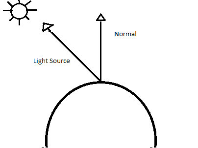
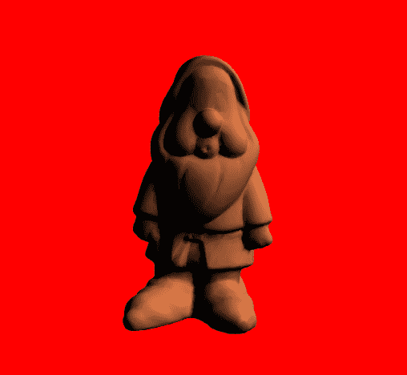
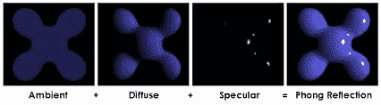
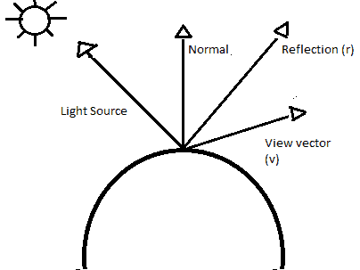
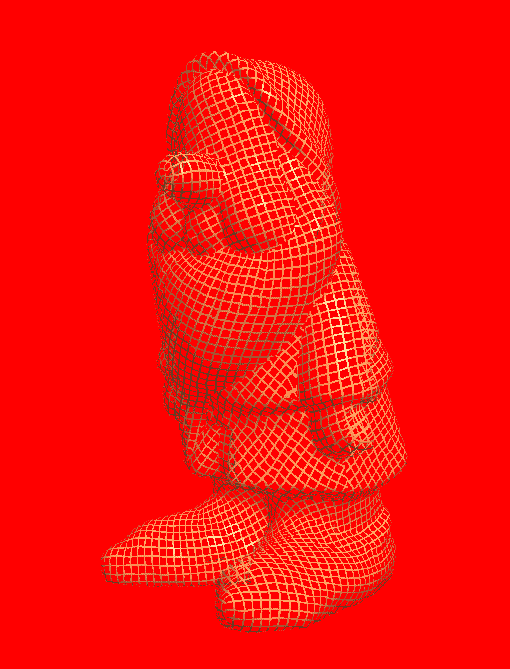
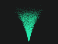
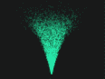

# 第七章：高级渲染

玩家对游戏的第一印象通常来自屏幕上的视觉效果。深入了解创建高级渲染技术对于构建引人入胜和沉浸式体验至关重要。在本章中，我们将探讨如何通过实现着色器技术来创建一些高级渲染效果。

+   着色器简介

+   照明技术

+   使用着色器创建效果

# 着色器简介

简而言之，着色器是用于进行图像处理的计算机程序，例如特效、颜色效果、照明和着色。在运行时，可以使用在着色器程序中构建的算法改变屏幕上所有像素、顶点或纹理的位置、亮度、对比度、色调和其他效果，以产生最终图像。如今，大多数着色器程序都是为了直接在**图形处理单元**（**GPU**）上运行而构建的。着色器程序是并行执行的。这意味着，例如，一个着色器可能会在每个像素上执行一次，每次执行都在 GPU 上的不同线程上同时运行。同时执行的线程数量取决于图形卡特定的 GPU，现代卡配备了数千个处理器。所有这些意味着着色器程序可以非常高效，并为开发人员提供了很多创造性的灵活性。在本节中，我们将熟悉着色器并为示例引擎实现自己的着色器基础设施。

# 着色器语言

随着图形卡技术的进步，渲染管线增加了更多的灵活性。曾经开发人员对于固定功能管线渲染等概念几乎没有控制权，新的进步使程序员能够更深入地控制图形硬件来渲染他们的作品。最初，这种更深入的控制是通过使用汇编语言编写着色器来实现的，这是一项复杂而繁琐的任务。不久之后，开发人员渴望有一个更好的解决方案。着色器编程语言应运而生。让我们简要地看一下一些常用的语言。

**图形 C**（**Cg**）是由 Nvidia 图形公司最初开发的着色语言。Cg 基于 C 编程语言，尽管它们共享相同的语法，但对 C 的一些特性进行了修改，并添加了新的数据类型，使 Cg 更适合于编程 GPU。Cg 编译器可以输出由 DirectX 和 OpenGL 都支持的着色器程序。虽然 Cg 大部分已经被淘汰，但它在 Unity 游戏引擎中的使用使其以一种新形式复兴。

**高级着色语言**（**HLSL**）是由微软公司为 DirectX 图形 API 开发的着色语言。HLSL 再次是基于 C 编程语言建模，并且与 Cg 着色语言有许多相似之处。HLSL 仍在开发中，并且继续是 DirectX 的首选着色语言。自 DirectX 12 发布以来，HLSL 语言甚至支持更低级的硬件控制，并且性能有了显著的改进。

**OpenGL 着色语言**（**GLSL**）是一种基于 C 编程语言的着色语言。它是由**OpenGL 架构审查委员会**（**OpenGL ARB**）创建的，旨在使开发人员能够更直接地控制图形管线，而无需使用 ARB 汇编语言或其他硬件特定语言。该语言仍在开发中，并且将是我们在示例中专注的语言。

# 构建着色器程序基础设施

大多数现代着色器程序由多达五种不同类型的着色器文件组成：片段或像素着色器、顶点着色器、几何着色器、计算着色器和镶嵌着色器。构建着色器程序时，每个这些着色器文件必须被编译和链接在一起以供使用，就像 C++程序的编译和链接一样。接下来，我们将带您了解这个过程是如何工作的，看看我们如何构建一个基础设施，以便更轻松地与我们的着色器程序进行交互。

首先，让我们看看如何编译 GLSL 着色器。GLSL 编译器是 OpenGL 库的一部分，我们的着色器可以在 OpenGL 程序中进行编译。我们将构建一个支持内部编译的架构。编译着色器的整个过程可以分解为一些简单的步骤。首先，我们必须创建一个着色器对象，然后将源代码提供给着色器对象。然后我们可以要求着色器对象被编译。这些步骤可以用以下三个基本调用来表示 OpenGL API。

首先，我们创建着色器对象：

```cpp
GLuint vertexShader = glCreateShader(GL_VERTEX_SHADER);
```

我们使用`glCreateShader()`函数创建着色器对象。我们传递的参数是我们要创建的着色器的类型。着色器的类型可以是`GL_VERTEX_SHADER`、`GL_FRAGMENT_SHADER`、`GL_GEOMETRY_SHADER`、`GL_TESS_EVALUATION_SHADER`、`GL_TESS_CONTROL_SHADER`或`GL_COMPUTE_SHADER`。在我们的示例中，我们尝试编译一个顶点着色器，所以我们使用`GL_VERTEX_SHADER`类型。

接下来，我们将着色器源代码复制到着色器对象中：

```cpp
GLchar* shaderCode = LoadShader("shaders/simple.vert");
glShaderSource(vertexShader, 1, shaderCode, NULL);
```

在这里，我们使用`glShaderSource()`函数将我们的着色器源代码加载到内存中。这个函数接受一个字符串数组，所以在调用`glShaderSource()`之前，我们使用一个尚未创建的方法创建一个指向`shaderCode`数组对象开头的指针。`glShaderSource()`的第一个参数是着色器对象的句柄。第二个是包含在数组中的源代码字符串的数量。第三个参数是指向源代码字符串数组的指针。最后一个参数是包含前一个参数中每个源代码字符串的长度的`GLint`值的数组。

最后，我们编译着色器：

```cpp
glCompileShader(vertexShader);
```

最后一步是编译着色器。我们通过调用 OpenGL API 方法`glCompileShader()`来实现这一点，并传递我们想要编译的着色器的句柄。

当然，因为我们正在使用内存来存储着色器，我们应该知道如何在完成后进行清理。要删除着色器对象，我们可以调用`glDeleteShader()`函数。

删除着色器对象当不再需要着色器对象时，可以通过调用`glDeleteShader()`来删除。这将释放着色器对象使用的内存。应该注意，如果着色器对象已经附加到程序对象，即链接到着色器程序，它不会立即被删除，而是被标记为删除。如果对象被标记为删除，它将在从链接的着色器程序对象中分离时被删除。

一旦我们编译了我们的着色器，我们在将它们用于程序之前需要采取的下一步是将它们链接在一起成为一个完整的着色器程序。链接步骤的核心方面之一涉及从一个着色器的输入变量到另一个着色器的输出变量之间建立连接，并在着色器的输入/输出变量与 OpenGL 程序本身的适当位置之间建立连接。

链接与编译着色器非常相似。我们创建一个新的着色器程序，并将每个着色器对象附加到它上。然后我们告诉着色器程序对象将所有内容链接在一起。在 OpenGL 环境中实现这些步骤可以分解为对 API 的几个调用，如下所示：

首先，我们创建着色器程序对象：

```cpp
GLuint shaderProgram = glCreateProgram();
```

首先，我们调用`glCreateProgram()`方法创建一个空的程序对象。这个函数返回一个句柄给着色器程序对象，这个例子中我们将其存储在一个名为`shaderProgram`的变量中。

接下来，我们将着色器附加到程序对象：

```cpp
glAttachShader(shaderProgram, vertexShader);
glAttachShader(shaderProgram, fragmentShader);
```

为了将每个着色器加载到着色器程序中，我们使用`glAttachShader()`方法。这个方法接受两个参数。第一个参数是着色器程序对象的句柄，第二个是要附加到着色器程序的着色器对象的句柄。

最后，我们链接程序：

```cpp
glLinkProgram(programHandle);
```

当我们准备将着色器链接在一起时，我们调用`glLinkProgram()`方法。这个方法只有一个参数：我们要链接的着色器程序的句柄。

重要的是，我们记得清理掉我们不再使用的任何着色器程序。要从 OpenGL 内存中删除着色器程序，我们调用`glDeleteProgram()`方法。`glDeleteProgram()`方法接受一个参数：要删除的着色器程序的句柄。这个方法调用使句柄无效，并释放着色器程序使用的内存。重要的是要注意，如果着色器程序对象当前正在使用，它不会立即被删除，而是被标记为删除。这类似于删除着色器对象。还要注意，删除着色器程序将分离在链接时附加到着色器程序的任何着色器对象。然而，这并不意味着着色器对象会立即被删除，除非这些着色器对象已经被之前调用`glDeleteShader()`方法标记为删除。

这些就是创建、编译和链接着色器程序所需的简化 OpenGL API 调用。现在我们将继续实现一些结构，使整个过程更容易处理。为此，我们将创建一个名为`ShaderManager`的新类。这个类将充当编译、链接和管理着色器程序清理的接口。首先，让我们看一下`ShaderManager.cpp`文件中`CompileShaders()`方法的实现。我应该指出，我将专注于与架构实现相关的代码的重要方面。本章的完整源代码可以在 GitHub 存储库的`Chapter07`文件夹中找到。

```cpp
void ShaderManager::CompileShaders(const std::string&                        
                        vertexShaderFilePath, const std::string&      
                        fragmentShaderFilepath)
{
   m_programID = glCreateProgram();
   m_vertexShaderID = glCreateShader(GL_VERTEX_SHADER);
   if (m_vertexShaderID == 0){
      Exception("Vertex shader failed to be created!");
   }
   m_fragmentShaderID = glCreateShader(GL_FRAGMENT_SHADER);
   if (m_fragmentShaderID == 0){
    Exception("Fragment shader failed to be created!");
   }
   CompileShader(vertexShaderFilePath, m_vertexShaderID);
   CompileShader(fragmentShaderFilepath, m_fragmentShaderID);
}
```

首先，对于这个示例，我们专注于两种着色器类型，所以我们的`ShaderManager::CompileShaders()`方法接受两个参数。第一个参数是顶点着色器文件的文件路径位置，第二个是片段着色器文件的文件路径位置。两者都是字符串。在方法体内，我们首先使用`glCreateProgram()`方法创建着色器程序句柄，并将其存储在`m_programID`变量中。接下来，我们使用`glCreateShader()`命令创建顶点和片段着色器的句柄。我们在创建着色器句柄时检查是否有任何错误，如果有，我们会抛出一个带有失败的着色器名称的异常。一旦句柄被创建，我们接下来调用`CompileShader()`方法，接下来我们将看到。`CompileShader()`函数接受两个参数：第一个是着色器文件的路径，第二个是编译后的着色器将被存储的句柄。

以下是完整的`CompileShader()`函数。它处理了从存储中查找和加载着色器文件，以及在着色器文件上调用 OpenGL 编译命令。我们将逐块地分解它：

```cpp
void ShaderManager::CompileShader(const std::string& filePath, GLuint id) 
{
  std::ifstream shaderFile(filePath);
  if (shaderFile.fail()){
     perror(filePath.c_str());
     Exception("Failed to open " + filePath);
  }
    //File contents stores all the text in the file
     std::string fileContents = "";
    //line is used to grab each line of the file
    std::string line;
   //Get all the lines in the file and add it to the contents
    while (std::getline(shaderFile, line)){
    fileContents += line + "n";
 }
   shaderFile.close();
   //get a pointer to our file contents c string
   const char* contentsPtr = fileContents.c_str();   //tell opengl that        
   we want to use fileContents as the contents of the shader file 
  glShaderSource(id, 1, &contentsPtr, nullptr);
  //compile the shader
  glCompileShader(id);
  //check for errors
  GLint success = 0;
  glGetShaderiv(id, GL_COMPILE_STATUS, &success);
  if (success == GL_FALSE){
    GLint maxLength = 0;
    glGetShaderiv(id, GL_INFO_LOG_LENGTH, &maxLength);
    //The maxLength includes the NULL character
    std::vector<char> errorLog(maxLength);
    glGetShaderInfoLog(id, maxLength, &maxLength, &errorLog[0]);
    //Provide the infolog in whatever manor you deem best.
    //Exit with failure.
    glDeleteShader(id); //Don't leak the shader.
    //Print error log and quit
    std::printf("%sn", &(errorLog[0]));
        Exception("Shader " + filePath + " failed to compile");
  }
}
```

首先，我们使用一个`ifstream`对象打开包含着色器代码的文件。我们还检查是否有任何加载文件的问题，如果有，我们会抛出一个异常通知我们文件打开失败：

```cpp
std::ifstream shaderFile(filePath);
if (shaderFile.fail()) {
  perror(filePath.c_str());
  Exception("Failed to open " + filePath);
}
```

接下来，我们需要解析着色器。为此，我们创建一个名为`fileContents`的字符串变量，它将保存着色器文件中的文本。然后，我们创建另一个名为 line 的字符串变量；这将是我们试图解析的着色器文件的每一行的临时持有者。接下来，我们使用`while`循环逐行遍历着色器文件，逐行解析内容并将每个循环保存到`fileContents`字符串中。一旦所有行都被读入持有变量，我们调用`shaderFile`的`ifstream`对象上的 close 方法，以释放用于读取文件的内存：

```cpp
std::string fileContents = "";
std::string line;
while (std::getline(shaderFile, line)) {
  fileContents += line + "n";
}
shaderFile.close();
```

您可能还记得本章前面提到的，当我们使用`glShaderSource()`函数时，我们必须将着色器文件文本作为指向字符数组开头的指针传递。为了满足这一要求，我们将使用一个巧妙的技巧，即利用字符串类内置的 C 字符串转换方法，允许我们返回指向我们着色器字符数组开头的指针。如果您不熟悉，这本质上就是一个字符串：

```cpp
const char* contentsPtr = fileContents.c_str();
```

现在我们有了指向着色器文本的指针，我们可以调用`glShaderSource()`方法告诉 OpenGL 我们要使用文件的内容来编译我们的着色器。最后，我们使用着色器的句柄作为参数调用`glCompileShader()`方法：

```cpp
glShaderSource(id, 1, &contentsPtr, nullptr);
glCompileShader(id);
```

这处理了编译，但是为自己提供一些调试支持是个好主意。我们通过在`CompileShader()`函数中首先检查编译过程中是否有任何错误来实现这种编译调试支持。我们通过请求来自着色器编译器的信息来做到这一点，通过`glGetShaderiv()`函数，其中，它的参数之一是指定我们想要返回的信息。在这个调用中，我们请求编译状态：

```cpp
GLint success = 0;
glGetShaderiv(id, GL_COMPILE_STATUS, &success);
```

接下来，我们检查返回的值是否为`GL_FALSE`，如果是，那意味着我们出现了错误，应该向编译器请求更多关于编译问题的信息。我们首先询问编译器错误日志的最大长度。我们使用这个最大长度值来创建一个名为 errorLog 的字符值向量。然后，我们可以通过使用`glGetShaderInfoLog()`方法请求着色器编译日志，传入着色器文件的句柄、我们要提取的字符数以及我们要保存日志的位置：

```cpp
if (success == GL_FALSE){
  GLint maxLength = 0;
  glGetShaderiv(id, GL_INFO_LOG_LENGTH, &maxLength);
  std::vector<char> errorLog(maxLength); 
  glGetShaderInfoLog(id, maxLength, &maxLength, &errorLog[0]);
```

一旦我们保存了日志文件，我们继续使用`glDeleteShader()`方法删除着色器。这确保我们不会因为着色器而产生任何内存泄漏：

```cpp
glDeleteShader(id);
```

最后，我们首先将错误日志打印到控制台窗口。这对于运行时调试非常有用。我们还会抛出一个异常，其中包括着色器名称/文件路径以及编译失败的消息：

```cpp
std::printf("%sn", &(errorLog[0]));
Exception("Shader " + filePath + " failed to compile");
}
...
```

通过提供简单的接口来调用底层 API，这真的简化了编译着色器的过程。现在，在我们的示例程序中，要加载和编译着色器，我们使用类似以下的一行简单代码：

```cpp
shaderManager.CompileShaders("Shaders/SimpleShader.vert",
"Shaders/SimpleShader.frag");
```

现在编译了着色器，我们已经完成了可用着色器程序的一半。我们仍然需要添加一个部分，即链接。为了抽象出一些链接着色器的过程并为我们提供一些调试功能，我们将为我们的`ShaderManager`类创建`LinkShaders()`方法。让我们看一下，然后分解它：

```cpp
void ShaderManager::LinkShaders() {
//Attach our shaders to our program
glAttachShader(m_programID, m_vertexShaderID);
glAttachShader(m_programID, m_fragmentShaderID);
//Link our program
glLinkProgram(m_programID);
//Note the different functions here: glGetProgram* instead of glGetShader*.
GLint isLinked = 0;
glGetProgramiv(m_programID, GL_LINK_STATUS, (int *)&isLinked);
if (isLinked == GL_FALSE){
  GLint maxLength = 0;
  glGetProgramiv(m_programID, GL_INFO_LOG_LENGTH, &maxLength);
  //The maxLength includes the NULL character
  std::vector<char> errorLog(maxLength);
  glGetProgramInfoLog(m_programID, maxLength, &maxLength,   
  &errorLog[0]);
  //We don't need the program anymore.
  glDeleteProgram(m_programID);
  //Don't leak shaders either.
  glDeleteShader(m_vertexShaderID);
  glDeleteShader(m_fragmentShaderID);
  //print the error log and quit
  std::printf("%sn", &(errorLog[0]));
  Exception("Shaders failed to link!");
}
  //Always detach shaders after a successful link.
  glDetachShader(m_programID, m_vertexShaderID);
  glDetachShader(m_programID, m_fragmentShaderID);
  glDeleteShader(m_vertexShaderID);
  glDeleteShader(m_fragmentShaderID);
}
```

要开始我们的`LinkShaders()`函数，我们调用`glAttachShader()`方法两次，分别使用先前创建的着色器程序对象的句柄和我们希望链接的每个着色器的句柄：

```cpp
glAttachShader(m_programID, m_vertexShaderID);
glAttachShader(m_programID, m_fragmentShaderID);
```

接下来，我们通过调用`glLinkProgram()`方法，使用程序对象的句柄作为参数，执行实际的着色器链接，将它们链接成一个可用的着色器程序：

```cpp
glLinkProgram(m_programID);
```

然后我们可以检查链接过程是否已经完成，没有任何错误，并提供任何调试信息，如果有任何错误的话。我不会逐行讲解这段代码，因为它几乎与我们使用`CompileShader()`函数时所做的工作完全相同。但是请注意，从链接器返回信息的函数略有不同，使用的是`glGetProgram*`而不是之前的`glGetShader*`函数：

```cpp
GLint isLinked = 0;
glGetProgramiv(m_programID, GL_LINK_STATUS, (int *)&isLinked);
if (isLinked == GL_FALSE){
  GLint maxLength = 0;
  glGetProgramiv(m_programID, GL_INFO_LOG_LENGTH, &maxLength);
  //The maxLength includes the NULL character
  std::vector<char> errorLog(maxLength);  
  glGetProgramInfoLog(m_programID, maxLength, &maxLength,   
  &errorLog[0]);
  //We don't need the program anymore.
  glDeleteProgram(m_programID);
  //Don't leak shaders either.
  glDeleteShader(m_vertexShaderID);
  glDeleteShader(m_fragmentShaderID);
  //print the error log and quit
  std::printf("%sn", &(errorLog[0]));
  Exception("Shaders failed to link!");
}
```

最后，如果我们在链接过程中成功了，我们需要稍微清理一下。首先，我们使用`glDetachShader()`方法从链接器中分离着色器。接下来，由于我们有一个完成的着色器程序，我们不再需要保留着色器在内存中，所以我们使用`glDeleteShader()`方法删除每个着色器。同样，这将确保我们在着色器程序创建过程中不会泄漏任何内存：

```cpp
  glDetachShader(m_programID, m_vertexShaderID);
  glDetachShader(m_programID, m_fragmentShaderID);
  glDeleteShader(m_vertexShaderID);
  glDeleteShader(m_fragmentShaderID);
}
```

现在我们有了一个简化的方式将我们的着色器链接到一个工作的着色器程序中。我们可以通过简单地使用一行代码来调用这个接口到底层的 API 调用，类似于以下的代码：

```cpp
  shaderManager.LinkShaders();
```

这样处理了编译和链接着色器的过程，但与着色器一起工作的另一个关键方面是将数据传递给运行在 GPU 上的程序/游戏和着色器程序之间的数据传递。我们将看看这个过程，以及如何将其抽象成一个易于使用的接口，用于我们引擎。接下来。

# 处理着色器数据

与着色器一起工作的最重要的方面之一是能够将数据传递给运行在 GPU 上的着色器程序，并从中传递数据。这可能是一个深入的话题，就像本书中的其他话题一样，有专门的书籍来讨论。在讨论这个话题时，我们将保持在较高的层次上，并再次专注于基本渲染所需的两种着色器类型：顶点和片段着色器。

首先，让我们看看如何使用顶点属性和**顶点缓冲对象**（**VBO**）将数据发送到着色器。顶点着色器的工作是处理与顶点连接的数据，进行任何修改，然后将其传递到渲染管线的下一阶段。这是每个顶点发生一次。为了使着色器发挥作用，我们需要能够传递数据给它。为此，我们使用所谓的顶点属性，它们通常与所谓的 VBO 紧密配合工作。

对于顶点着色器，所有每个顶点的输入属性都使用关键字`in`进行定义。例如，如果我们想要定义一个名为`VertexColour`的三维向量输入属性，我们可以写如下内容：

```cpp
in vec3 VertexColour;
```

现在，`VertexColour`属性的数据必须由程序/游戏提供。这就是 VBO 发挥作用的地方。在我们的主游戏或程序中，我们建立输入属性和顶点缓冲对象之间的连接，还必须定义如何解析或遍历数据。这样，当我们渲染时，OpenGL 可以从缓冲区中为每个顶点着色器调用提取属性的数据。

让我们来看一个非常简单的顶点着色器：

```cpp
#version 410
in vec3 VertexPosition;
in vec3 VertexColour;
out vec3 Colour;
void main(){
  Colour = VertexColour;
  gl_Position = vec4(VertexPosition, 1.0);
}
```

在这个例子中，这个顶点着色器只有两个输入变量，`VertexPosition`和`VertexColor`。我们的主 OpenGL 程序需要为每个顶点提供这两个属性的数据。我们将通过将我们的多边形/网格数据映射到这些变量来实现。我们还有一个名为`Colour`的输出变量，它将被发送到渲染管线的下一阶段，即片段着色器。在这个例子中，`Colour`只是`VertexColour`的一个未经处理的副本。`VertexPosition`属性只是被扩展并传递到 OpenGL API 输出变量`gl_Position`以进行更多处理。

接下来，让我们来看一个非常简单的片段着色器：

```cpp
#version 410
in vec3 Colour;
out vec4 FragColour;
void main(){
  FragColour = vec4(Colour, 1.0);
}
```

在这个片段着色器示例中，只有一个输入属性`Colour`。这个输入对应于前一个渲染阶段的输出，顶点着色器的`Colour`输出。为了简单起见，我们只是扩展了`Colour`并将其输出为下一个渲染阶段的变量`FragColour`。

这总结了连接的着色器部分，那么我们如何在引擎内部组合和发送数据呢？我们可以基本上通过四个步骤来完成这个过程。

首先，我们创建一个**顶点数组对象**（**VAO**）实例来保存我们的数据：

```cpp
GLunit vao;
```

接下来，我们为每个着色器的输入属性创建和填充 VBO。我们首先创建一个 VBO 变量，然后使用`glGenBuffers()`方法生成缓冲对象的内存。然后，我们为我们需要缓冲区的不同属性创建句柄，并将它们分配给 VBO 数组中的元素。最后，我们通过首先调用`glBindBuffer()`方法为每个属性填充缓冲区，指定要存储的对象类型。在这种情况下，对于两个属性，它是`GL_ARRAY_BUFFER`。然后我们调用`glBufferData()`方法，传递类型、大小和绑定句柄。`glBufferData()`方法的最后一个参数是一个提示 OpenGL 如何最好地管理内部缓冲区的参数。有关此参数的详细信息，请参阅 OpenGL 文档：

```cpp
GLuint vbo[2];
glGenBuffers(2, vbo);
GLuint positionBufferHandle = vbo[0];
GLuint colorBufferHandle = vbo[1];
glBindBuffer(GL_ARRAY_BUFFER,positionBufferHandle);
glBufferData(GL_ARRAY_BUFFER,
             9 * sizeof(float),
             positionData,
             GL_STATIC_DRAW);
glBindBuffer(GL_ARRAY_BUFFER,
             colorBufferHandle);
glBufferData(GL_ARRAY_BUFFER,
             9 * sizeof(float),
             colorData,
             GL_STATIC_DRAW);
```

第三步是创建和定义 VAO。这是我们将定义着色器的输入属性和我们刚刚创建的缓冲区之间关系的方法。VAO 包含了关于这些连接的信息。要创建一个 VAO，我们使用`glGenVertexArrays()`方法。这给了我们一个新对象的句柄，我们将其存储在之前创建的 VAO 变量中。然后，我们通过调用`glEnableVertexAttribArray()`方法来启用通用顶点属性索引 0 和 1。通过调用启用属性，我们指定它们将被访问和用于渲染。最后一步是将我们创建的缓冲对象与通用顶点属性索引进行匹配：

```cpp
glGenVertexArrays( 1, &vao );
glBindVertexArray(vao);
glEnableVertexAttribArray(0);
glEnableVertexAttribArray(1);
glBindBuffer(GL_ARRAY_BUFFER, positionBufferHandle);
glVertexAttribPointer(0, 3, GL_FLOAT, GL_FALSE, 0, NULL);
glBindBuffer(GL_ARRAY_BUFFER, colorBufferHandle);
glVertexAttribPointer(1, 3, GL_FLOAT, GL_FALSE, 0, NULL);
```

最后，在我们的`Draw()`函数调用中，我们绑定到 VAO 并调用`glDrawArrays()`来执行实际的渲染：

```cpp
glBindVertexArray(vaoHandle);glDrawArrays(GL_TRIANGLES, 0, 3 );
```

在我们继续传递数据到着色器的另一种方式之前，我们需要讨论这种属性连接结构的另一个部分。如前所述，着色器中的输入变量在链接时与我们刚刚看到的通用顶点属性相关联。当我们需要指定关系结构时，我们有几种不同的选择。我们可以在着色器代码本身中使用称为布局限定符的内容。以下是一个例子：

```cpp
layout (location=0) in vec3 VertexPosition;
```

另一种选择是让链接器在链接时创建映射，然后在之后查询它们。我个人更喜欢的第三种方法是在链接过程之前指定关系，通过调用`glBindAttribLocation()`方法。我们将在讨论如何抽象这些过程时很快看到这是如何实现的。

我们已经描述了如何使用属性将数据传递给着色器，但还有另一个选择：统一变量。统一变量专门用于不经常更改的数据。例如，矩阵非常适合作为统一变量的候选对象。在着色器内部，统一变量是只读的。这意味着该值只能从着色器外部更改。它们还可以出现在同一着色器程序中的多个着色器中。它们可以在程序中的一个或多个着色器中声明，但是如果具有给定名称的变量在多个着色器中声明，则其类型在所有着色器中必须相同。这使我们了解到统一变量实际上是在整个着色器程序的共享命名空间中保存的。

要在着色器中使用统一变量，首先必须在着色器文件中使用统一标识符关键字声明它。以下是这可能看起来的样子：

```cpp
uniform mat4 ViewMatrix;
```

然后我们需要从游戏/程序内部提供统一变量的数据。我们通过首先使用`glGetUniformLocation()`方法找到变量的位置，然后使用`glUniform()`方法之一为找到的位置赋值。这个过程的代码可能看起来像下面这样：

```cpp
GLuint location = glGetUniformLocation(programHandle," ViewMatrix ");
if( location >= 0 )
{
glUniformMatrix4fv(location, 1, GL_FALSE, &viewMatrix [0][0])
}
```

然后我们使用`glUniformMatrix4fv()`方法为统一变量的位置赋值。第一个参数是统一变量的位置。第二个参数是正在分配的矩阵的数量。第三个是 GL `bool`类型，指定矩阵是否应该被转置。由于我们在矩阵中使用 GLM 库，不需要转置。如果您使用的是按行顺序而不是按列顺序的数据来实现矩阵，您可能需要对这个参数使用`GL_TRUE`类型。最后一个参数是统一变量的数据的指针。

统一变量可以是任何 GLSL 类型，包括结构和数组等复杂类型。OpenGL API 提供了与每种类型匹配的不同后缀的`glUniform()`函数。例如，要分配给`vec3`类型的变量，我们将使用`glUniform3f()`或`glUniform3fv()`方法（*v*表示数组中的多个值）。

因此，这些是将数据传递给着色器程序和从着色器程序传递数据的概念和技术。然而，就像我们为编译和链接着色器所做的那样，我们可以将这些过程抽象成我们`ShaderManager`类中的函数。我们将专注于处理属性和统一变量。我们有一个很好的类来抽象模型/网格的 VAO 和 VBO 的创建，我们在第四章中详细讨论了这一点，*构建游戏系统*，当时我们讨论了构建资产流水线。要查看它是如何构建的，要么翻回到[第四章](https://cdp.packtpub.com/mastering_c___game_development/wp-admin/post.php?post=325&action=edit#post_245)，*构建游戏系统*，要么查看`BookEngine`解决方案的`Mesh.h`和`Mesh.cpp`文件中的实现。

首先，我们将看一下使用`ShaderManger`类的`AddAttribute()`函数添加属性绑定的抽象。这个函数接受一个参数，作为字符串绑定的属性名称。然后我们调用`glBindAttribLocation()`函数，传递程序的句柄和当前属性的索引或数量，我们在调用时增加，最后是`attributeName`字符串的 C 字符串转换，它提供了指向字符串数组中第一个字符的指针。这个函数必须在编译之后调用，但在着色器程序链接之前调用。

```cpp
void ShaderManager::AddAttribute(const std::string& attributeName)
{
glBindAttribLocation(m_programID,
                     m_numAttributes++,
                     attributeName.c_str());
 }
```

对于统一变量，我们创建一个抽象查找着色器程序中统一变量位置的函数`GetUniformLocation()`。这个函数再次只接受一个变量，即以字符串形式的统一变量名称。然后我们创建一个临时持有者来保存位置，并将其赋值为`glGetUniformLocation()`方法调用的返回值。我们检查位置是否有效，如果不是，我们抛出一个异常，让我们知道错误。最后，如果找到，我们返回有效的位置。

```cpp
GLint ShaderManager::GetUniformLocation(const std::string& uniformName)
{
    GLint location = glGetUniformLocation(m_programID,
    uniformName.c_str());
    if (location == GL_INVALID_INDEX) 
    {
     Exception("Uniform " + uniformName + " not found in shader!");
    }
  return location;
}
```

这为我们绑定数据提供了抽象，但我们仍然需要指定哪个着色器应该用于某个绘制调用，并激活我们需要的任何属性。为了实现这一点，我们在`ShaderManager`中创建一个名为`Use()`的函数。这个函数将首先使用`glUseProgram()`API 方法调用将当前着色器程序设置为活动的着色器程序。然后我们使用一个 for 循环来遍历着色器程序的属性列表，激活每一个：

```cpp
void ShaderManager::Use(){
  glUseProgram(m_programID);
  for (int i = 0; i < m_numAttributes; i++) { 
    glEnableVertexAttribArray(i);
  }
}
```

当然，由于我们有一种抽象的方法来启用着色器程序，所以我们应该有一个函数来禁用着色器程序。这个函数与`Use()`函数非常相似，但在这种情况下，我们将正在使用的程序设置为 0，有效地使其为`NULL`，并使用`glDisableVertexAtrribArray()`方法在 for 循环中禁用属性：

```cpp
void ShaderManager::UnUse() {
  glUseProgram(0);
  for (int i = 0; i < m_numAttributes; i++) {
    glDisableVertexAttribArray(i);
 }
}
```

这种抽象的净效果是，我们现在可以通过几个简单的调用来设置整个着色器程序结构。类似以下的代码将创建和编译着色器，添加必要的属性，将着色器链接到程序中，找到一个统一变量，并为网格创建 VAO 和 VBO：

```cpp
shaderManager.CompileShaders("Shaders/SimpleShader.vert",
                             "Shaders/SimpleShader.frag");
shaderManager.AddAttribute("vertexPosition_modelspace");
shaderManager.AddAttribute("vertexColor");
shaderManager.LinkShaders();
MatrixID = shaderManager.GetUniformLocation("ModelViewProjection");
m_model.Init("Meshes/Dwarf_2_Low.obj", "Textures/dwarf_2_1K_color.png");
```

然后，在我们的`Draw`循环中，如果我们想要使用这个着色器程序进行绘制，我们可以简单地使用抽象函数来激活和停用我们的着色器，类似于以下代码：

```cpp
  shaderManager.Use();
  m_model.Draw();
  shaderManager.UnUse();
```

这使得我们更容易使用着色器来测试和实现高级渲染技术。我们将使用这种结构来构建本章剩余部分以及实际上整本书的示例。

# 光照效果

着色器最常见的用途之一是创建光照和反射效果。通过使用着色器实现的光照效果有助于提供每个现代游戏都追求的一定程度的光泽和细节。在接下来的部分，我们将看一些用于创建不同表面外观效果的知名模型，并提供可以实现所讨论的光照效果的着色器示例。

# 每顶点漫反射

首先，我们将看一下其中一个较为简单的光照顶点着色器，即漫反射反射着色器。漫反射被认为更简单，因为我们假设我们正在渲染的表面看起来在所有方向上均匀地散射光线。通过这个着色器，光线与表面接触并在稍微穿透后在所有方向上被投射出去。这意味着一些光的波长至少部分被吸收。漫反射着色器的一个很好的例子是哑光油漆。表面看起来非常暗淡，没有光泽。

让我们快速看一下漫反射的数学模型。这个反射模型需要两个向量。一个是表面接触点到初始光源的方向，另一个是同一表面接触点的法向量。这看起来像下面这样：



值得注意的是，击中表面的光量部分取决于表面与光源的关系，而达到单个点的光量在法向量上最大，在法向量垂直时最低。通过计算点法向量和入射光线的点积，我们可以表达这种关系。这可以用以下公式表示：

*光密度（源向量）法向量*

这个方程中的源向量和法向量被假定为归一化。

如前所述，表面上的一些光线在重新投射之前会被吸收。为了将这种行为添加到我们的数学模型中，我们可以添加一个反射系数，也称为漫反射率。这个系数值成为入射光的缩放因子。我们指定出射光强度的新公式现在看起来像下面这样：

出射光 = (漫反射系数 x 光密度 x 光源向量) 法向量

有了这个新的公式，我们现在有了一个代表全向均匀散射的光照模型。

好了，现在我们知道了理论，让我们看看如何在 GLSL 着色器中实现这个光照模型。这个例子的完整源代码可以在 GitHub 存储库的`Chapter07`文件夹中找到，从以下所示的顶点着色器开始：

```cpp
#version 410
in vec3 vertexPosition_modelspace;
in vec2 vertexUV;
in vec3 vertexNormal;
out vec2 UV;
out vec3 LightIntensity;
uniform vec4 LightPosition;
uniform vec3 DiffuseCoefficient ;
uniform vec3 LightSourceIntensity;
uniform mat4 ModelViewProjection;
uniform mat3 NormalMatrix;
uniform mat4 ModelViewMatrix;
uniform mat4 ProjectionMatrix;
void main(){
    vec3 tnorm = normalize(NormalMatrix * vertexNormal);
    vec4 CameraCoords = ModelViewMatrix *
    vec4(vertexPosition_modelspace,1.0);
    vec3 IncomingLightDirection = normalize(vec3(LightPosition -
    CameraCoords));
    LightIntensity = LightSourceIntensity * DiffuseCoefficient *
                     max( dot( IncomingLightDirection, tnorm ), 0.0 );
    gl_Position = ModelViewProjection *                   
                  vec4(vertexPosition_modelspace,1);
                  UV = vertexUV;
 }
```

我们将逐块地浏览这个着色器。首先，我们有我们的属性，`vertexPosition_modelspace`，`vertexUV`和`vertexNormal`。这些将由我们的游戏应用程序设置，在我们浏览完着色器之后我们会看到。然后我们有我们的输出变量，UV 和`LightIntensity`。这些值将在着色器中计算。然后我们有我们的 uniform 变量。这些包括我们讨论过的反射计算所需的值。它还包括所有必要的矩阵。与属性一样，这些 uniform 值将通过我们的游戏设置。

在这个着色器的主函数内部，我们的漫反射将在相机相对坐标中计算。为了实现这一点，我们首先通过将顶点法线乘以法线矩阵来归一化顶点法线，并将结果存储在一个名为`tnorm`的向量 3 变量中。接下来，我们通过使用模型视图矩阵将目前在模型空间中的顶点位置转换为相机坐标，从而计算出入射光方向，归一化，通过从相机坐标中的顶点位置减去光的位置。接下来，我们通过使用我们之前讨论过的公式计算出射光强度。这里需要注意的一点是使用 max 函数。这是当光线方向大于 90 度时的情况，就像光线是从物体内部发出一样。由于在我们的情况下，我们不需要支持这种情况，所以当出现这种情况时，我们只使用`0.0`的值。为了关闭着色器，我们将在裁剪空间中计算的模型视图投影矩阵存储在内置的输出变量`gl_position`中。我们还传递纹理的 UV，未更改，这在这个例子中实际上并没有使用。

现在我们已经有了着色器，我们需要提供计算所需的值。正如我们在本章的第一节中所学的，我们通过设置属性和 uniform 来实现这一点。我们构建了一个抽象层来帮助这个过程，所以让我们看看我们如何在游戏代码中设置这些值。在`GamePlayScreen.cpp`文件中，我们在`Draw()`函数中设置这些值。我应该指出，这是一个例子，在生产环境中，出于性能原因，你只想在循环中设置变化的值。由于这是一个例子，我想让它稍微容易一些：

```cpp
GLint DiffuseCoefficient =    
        shaderManager.GetUniformLocation("DiffuseCoefficient ");
glUniform3f(DiffuseCoefficient, 0.9f, 0.5f, 0.3f);
GLint LightSourceIntensity =    
       shaderManager.GetUniformLocation("LightSourceIntensity ");
glUniform3f(LightSourceIntensity, 1.0f, 1.0f, 1.0f);
glm::vec4 lightPos = m_camera.GetView() * glm::vec4(5.0f, 5.0f, 2.0f,              
                     1.0f);
GLint lightPosUniform =      
                shaderManager.GetUniformLocation("LightPosition");
glUniform4f(lightPosUniform, lightPos[0], lightPos[1], lightPos[2],    
             lightPos[3]);
glm::mat4 modelView = m_camera.GetView() * glm::mat4(1.0f);
GLint modelViewUniform =           
               shaderManager.GetUniformLocation("ModelViewMatrix");
glUniformMatrix4fv(modelViewUniform, 1, GL_FALSE, &modelView[0][0]);
glm::mat3 normalMatrix = glm::mat3(glm::vec3(modelView[0]),     
                         glm::vec3(modelView[1]),  
                         glm::vec3(modelView[2]));
GLint normalMatrixUniform =     
                   shaderManager.GetUniformLocation("NormalMatrix");
glUniformMatrix3fv(normalMatrixUniform, 1, GL_FALSE, &normalMatrix[0][0]);
glUniformMatrix4fv(MatrixID, 1, GL_FALSE, &m_camera.GetMVPMatrix()[0][0]);
```

我不会逐行进行，因为我相信你可以看到模式。我们首先使用着色器管理器的`GetUniformLocation()`方法返回 uniform 的位置。接下来，我们使用 OpenGL 的`glUniform*()`方法设置这个 uniform 的值，该方法与值类型匹配。我们对所有需要的 uniform 值都这样做。我们还必须设置我们的属性，并且正如本章开头讨论的那样，我们要在编译和链接过程之间进行这样的操作。在这个例子中，我们在`GamePlayScreen()`类的`OnEntry()`方法中设置这些值：

```cpp
shaderManager.AddAttribute("vertexPosition_modelspace");
shaderManager.AddAttribute("vertexColor");
shaderManager.AddAttribute("vertexNormal");
```

这样就处理了顶点着色器和传入所需的值，接下来，让我们看看这个例子的片段着色器：

```cpp
#version 410
in vec2 UV;
in vec3 LightIntensity;
// Ouput data
out vec3 color;
// Values that stay constant for the whole mesh.
uniform sampler2D TextureSampler;
void main(){
  color = vec3(LightIntensity);
}
```

对于这个示例，我们的片段着色器非常简单。首先，我们有我们的 UV 和`LightIntensity`的输入值，这次我们只使用`LightIntensity`。然后，我们声明了我们的输出颜色值，指定为一个矢量 3。接下来，我们有用于纹理的`sampler2D`统一变量，但在这个示例中我们也不会使用这个值。最后，我们有主函数。这是我们通过简单地将`LightIntensity`传递到管道中的下一个阶段来设置最终输出颜色的地方。

如果你运行示例项目，你会看到漫反射的效果。输出应该看起来像下面的屏幕截图。正如你所看到的，这种反射模型对于非常迟钝的表面效果很好，但在实际环境中的使用有限。接下来，我们将看一下一个反射模型，它将允许我们描绘更多的表面类型：



# 每顶点环境、漫反射和镜面

**环境**、**漫反射**和**镜面**（**ADS**）反射模型，也通常被称为**冯氏反射模型**，提供了一种创建反射光照着色器的方法。这种技术使用三种不同组件的组合来模拟光线在表面上的相互作用。环境组件模拟来自环境的光线；这意味着模拟光线被反射多次的情况，看起来好像它从任何地方都发出。我们在之前的示例中建模的漫反射组件代表了一个全向反射。最后一个组件，镜面组件，旨在表示在一个首选方向上的反射，提供了光*眩光*或明亮的点的外观。

这些组件的组合可以使用以下图表来可视化：



来源：维基百科

这个过程可以分解成讨论各个组件。首先，我们有环境组件，代表将均匀照亮所有表面并在所有方向上均匀反射的光线。这种光照效果不依赖于光线的入射或出射向量，因为它是均匀分布的，可以简单地通过将光源强度与表面反射性相乘来表示。这在数学公式 *I[a] = L[a]K[a]* 中显示。

下一个组件是我们之前讨论过的漫反射组件。漫反射组件模拟了一个粗糙或粗糙的表面，将光线散射到所有方向。同样，这可以用数学公式 *I[d] = L[d]Kd* 来表示。

最后一个组件是镜面组件，它用于模拟表面的*光泽*。这会产生一个*眩光*或明亮的点，在表现出光滑特性的表面上很常见。我们可以使用以下图表来可视化这种反射效果：



对于镜面分量，理想情况下，我们希望当与反射向量对齐时，反射最明显，然后随着角度的增加或减小而逐渐减弱。我们可以使用我们的观察向量和反射角之间的角度的余弦来模拟这种效果，然后将其提高到某个幂，如下面的方程所示：*(r v) ^p*。在这个方程中，*p*代表镜面高光，*眩光*点。输入的*p*值越大，点的大小就会越小，表面看起来就会*更光滑*。在添加了表示表面反射性和镜面光强度的值之后，用于计算表面镜面效果的公式如下：*I[s] = L[s]Ks ^p*。

现在，如果我们将所有组件放在一起并用一个公式表示，我们得到 *I = I[a] + I[d] + I[s]* 或者更详细地分解为 *I = L[a]K[a] + L[d]Kd + L[s]Ks ^p*。

有了我们的理论基础，让我们看看如何在每顶点着色器中实现这一点，从我们的顶点着色器开始如下：

```cpp
#version 410
// Input vertex data, different for all executions of this shader.
in vec3 vertexPosition_modelspace;
in vec2 vertexUV;
in vec3 vertexNormal;
// Output data ; will be interpolated for each fragment.
out vec2 UV;
out vec3 LightIntensity;
struct LightInfo {
  vec4 Position; // Light position in eye coords.
  vec3 La; // Ambient light intensity
  vec3 Ld; // Diffuse light intensity
  vec3 Ls; // Specular light intensity
};
uniform LightInfo Light;
struct MaterialInfo {
  vec3 Ka; // Ambient reflectivity
  vec3 Kd; // Diffuse reflectivity
  vec3 Ks; // Specular reflectivity
  float Shininess; // Specular shininess factor
};
  uniform MaterialInfo Material;
  uniform mat4 ModelViewMatrix;
  uniform mat3 NormalMatrix;
  uniform mat4 ProjectionMatrix;
  uniform mat4 ModelViewProjection;
  void main(){
     vec3 tnorm = normalize( NormalMatrix * vertexNormal);
     vec4 CameraCoords = ModelViewMatrix *                
                     vec4(vertexPosition_modelspace,1.0);
     vec3 s = normalize(vec3(Light.Position - CameraCoords));
     vec3 v = normalize(-CameraCoords.xyz);
     vec3 r = reflect( -s, tnorm );
     float sDotN = max( dot(s,tnorm), 0.0 );
     vec3 ambient = Light.La * Material.Ka;
     vec3 diffuse = Light.Ld * Material.Kd * sDotN;
     vec3 spec = vec3(0.0);
     if( sDotN > 0.0 )
      spec = Light.Ls * Material.Ks *
      pow( max( dot(r,v), 0.0 ), Material.Shininess );
      LightIntensity = ambient + diffuse + spec;
      gl_Position = ModelViewProjection *
                vec4(vertexPosition_modelspace,1.0);
}
```

让我们先看看有什么不同。在这个着色器中，我们引入了一个新概念，即统一结构。我们声明了两个`struct`，一个用于描述光线，`LightInfo`，一个用于描述材质，`MaterialInfo`。这是一种非常有用的方式，可以将代表公式中一部分的值作为集合来包含。我们很快就会看到如何设置这些`struct`元素的值从游戏代码中。接着是函数的主要部分。首先，我们像在上一个例子中一样开始。我们计算`tnorm`，`CameraCoords`和光源向量。接下来，我们计算指向观察者/摄像机的向量(v)，这是规范化的`CameraCoords`的负值。然后，我们使用提供的 GLSL 方法计算*纯*反射的方向。然后我们继续计算我们三个分量的值。环境光通过将光环境强度和表面的环境反射值相乘来计算。`diffuse`使用光强度、表面漫反射值和光源向量与`tnorm`的点积的结果来计算，我们刚刚在环境值之前计算了这个值。在计算镜面反射值之前，我们检查了`sDotN`的值。如果`sDotN`为零，则没有光线到达表面，因此没有计算镜面分量的意义。如果`sDotN`大于零，我们计算镜面分量。与前面的例子一样，我们使用 GLSL 方法将点积的值限制在`1`和`0`之间。GLSL 函数`pow`将点积提升到表面光泽指数的幂，我们之前在着色器方程中定义为`p`。

最后，我们将这三个分量值相加，并将它们的总和作为 out 变量`LightIntensity`传递给片段着色器。最后，我们将顶点位置转换为裁剪空间，并通过将其分配给`gl_Position`变量将其传递到下一个阶段。

对于我们着色器所需的属性和统一变量的设置，我们处理过程与前面的例子中一样。这里的主要区别在于，我们需要在获取统一位置时指定我们正在分配的`struct`的元素。一个示例看起来类似于以下内容，您可以在 GitHub 存储库的`Chapter07`文件夹中的示例解决方案中看到完整的代码：

```cpp
GLint Kd = shaderManager.GetUniformLocation("Material.Kd");
glUniform3f(Kd, 0.9f, 0.5f, 0.3f);
```

这个例子使用的片段着色器与我们用于漫反射的片段着色器相同，所以我在这里不再介绍它。

当您从 GitHub 存储库的`Chapter07`代码解决方案中运行 ADS 示例时，您将看到我们新创建的着色器生效，输出类似于以下内容：


在这个例子中，我们在顶点着色器中计算了阴影方程；这被称为每顶点着色器。这种方法可能会出现的一个问题是我们

*眩光*点，镜面高光，可能会出现扭曲或消失的现象。这是由于阴影被插值而不是针对脸部的每个点进行计算造成的。例如，设置在脸部中间附近的点可能不会出现，因为方程是在镜面分量接近零的顶点处计算的。在下一个例子中，我们将看一种可以通过在片段着色器中计算反射来消除这个问题的技术。

# 每片段 Phong 插值

在以前的例子中，我们一直在使用顶点着色器来处理光照计算。使用顶点着色器来评估每个顶点的颜色时会出现一个问题，就像在上一个例子中提到的那样，即颜色然后在整个面上进行插值。这可能会导致一些不太理想的效果。有另一种方法可以实现相同的光照效果，但精度更高。我们可以将计算移到片段着色器中。在片段着色器中，我们不是在整个面上进行插值，而是在法线和位置上进行插值，并使用这些值来在每个片段上计算。这种技术通常被称为**冯氏插值**。这种技术的结果比使用每个顶点实现的结果要准确得多。然而，由于这种按片段实现会评估每个片段，而不仅仅是顶点，所以这种实现比按顶点的技术运行得更慢。

让我们从查看这个例子的顶点着色器开始实现着色器的实现：

```cpp
#version 410
in vec3 vertexPosition_modelspace;
in vec2 vertexUV;
in vec3 vertexNormal;
out vec2 UV;
out vec3 Position;
out vec3 Normal;
uniform mat4 ModelViewMatrix;
uniform mat3 NormalMatrix;
uniform mat4 ProjectionMatrix;
uniform mat4 ModelViewProjection;
void main(){
    UV = vertexUV;
    Normal = normalize( NormalMatrix * vertexNormal);
    Position = vec3( ModelViewMatrix *        
               vec4(vertexPosition_modelspace,1.0));
    gl_Position = ModelViewProjection *
                 vec4(vertexPosition_modelspace,1.0);
}
```

由于这种技术使用片段着色器来执行计算，我们的顶点着色器相当轻。在大多数情况下，我们正在进行一些简单的方程来计算法线和位置，然后将这些值传递到下一个阶段。

接下来，我们将看一下这种技术在片段着色器中的核心实现。以下是完整的片段着色器，我们将介绍与以前例子的不同之处：

```cpp
#version 410
in vec3 Position;
in vec3 Normal;
in vec2 UV;
uniform sampler2D TextureSampler;
struct LightInfo {
  vec4 Position; // Light position in eye coords.
  vec3 Intensity; // A,D,S intensity
};
uniform LightInfo Light;
struct MaterialInfo {
  vec3 Ka; // Ambient reflectivity
  vec3 Kd; // Diffuse reflectivity
  vec3 Ks; // Specular reflectivity
  float Shininess; // Specular shininess factor
};
uniform MaterialInfo Material;
out vec3 color;
void phongModel( vec3 pos, vec3 norm, out vec3 ambAndDiff, out vec3
spec ) {
  vec3 s = normalize(vec3(Light.Position) - pos);
  vec3 v = normalize(-pos.xyz);
  vec3 r = reflect( -s, norm );
  vec3 ambient = Light.Intensity * Material.Ka;
  float sDotN = max( dot(s,norm), 0.0 );
  vec3 diffuse = Light.Intensity * Material.Kd * sDotN;
  spec = vec3(0.0);
  if( sDotN > 0.0 )
   spec = Light.Intensity * Material.Ks *
        pow( max( dot(r,v), 0.0 ), Material.Shininess );
        ambAndDiff = ambient + diffuse;
}
void main() {
   vec3 ambAndDiff, spec;
   vec3 texColor = texture( TextureSampler, UV ).rbg;
   phongModel( Position, Normal, ambAndDiff, spec );
   color = (vec3(ambAndDiff * texColor) + vec3(spec));
 }
```

这个片段着色器应该看起来非常熟悉，因为它几乎与我们以前的例子中的顶点着色器相同。除了这将按片段而不是按顶点运行之外，另一个重要的区别是我们通过实现一个处理冯氏模型计算的函数来清理着色器。这次我们还要传递一个纹理，把纹理还给小矮人。冯氏模型计算与我们以前看到的完全相同，所以我不会再次介绍它。我们将它移到一个函数中的原因主要是为了可读性，因为它使主函数保持整洁。在 GLSL 中创建函数几乎与在 C++和 C 中相同。你有一个返回类型，一个函数名，后面跟着参数和一个主体。我强烈建议在任何比几行更复杂的着色器中使用函数。

为了将我们的着色器连接到游戏中的值，我们遵循与之前相同的技术，在那里我们设置所需的属性和统一值。在这个例子中，我们必须提供 Ka、Kd、Ks、材料光泽度、`LightPosition`和`LightIntensity`的值。这些值与先前描述的 ADS 方程相匹配。我们还需要传递通常的矩阵值。完整的代码可以再次在 GitHub 存储库的`Chapter07`文件夹中找到。

如果我们运行`Chapter07`解决方案中的`Phong_Example`，我们将看到新的着色器在运行中，包括纹理和更准确的反射表示。以下是输出的屏幕截图：


我们将在这里结束我们对光照技术的讨论，但我鼓励你继续研究这个主题。使用着色器可以实现许多有趣的光照效果，我们只是刚刚开始涉及。在下一节中，我们将看一下着色器的另一个常见用途：渲染效果。

# 使用着色器创建效果

着色器不仅仅局限于创建光照效果。您可以使用不同的着色器技术创建许多不同的视觉效果。在本节中，我们将介绍一些有趣的效果，包括使用丢弃关键字来*丢弃*像素，并使用着色器创建一个简单的粒子效果系统。

# 丢弃片段

通过使用片段着色器工具，我们能够创建一些很酷的效果。其中一个工具就是使用丢弃关键字。丢弃关键字，顾名思义，移除或丢弃片段。当使用丢弃关键字时，着色器立即停止执行并跳过片段，不向输出缓冲区写入任何数据。创建的效果是多边形面上的孔洞，而不使用混合效果。丢弃关键字也可以与 alpha 贴图结合使用，以允许纹理指定应丢弃哪些片段。在建模损坏对象等效果时，这可能是一个方便的技术。

在这个例子中，我们将创建一个片段着色器，使用丢弃关键字根据 UV 纹理坐标移除某些片段。效果将是我们的小矮人模型呈现出格子或穿孔的外观。

让我们从查看这个例子的顶点着色器开始：

```cpp
#version 410
// Input vertex data, different for all executions of this shader.
in vec3 vertexPosition_modelspace;
in vec2 vertexUV;
in vec3 vertexNormal;
out vec3 FrontColor;
out vec3 BackColor;
out vec2 UV;
struct LightInfo {
vec4 Position; // Light position in eye coords.
vec3 La; // Ambient light intensity
vec3 Ld; // Diffuse light intensity
vec3 Ls; // Specular light intensity
};
uniform LightInfo Light;
struct MaterialInfo {vec3 Ka; // Ambient reflectivity
vec3 Kd; // Diffuse reflectivity
vec3 Ks; // Specular reflectivity
float Shininess; // Specular shininess factor
};
uniform MaterialInfo Material;
uniform mat4 ModelViewMatrix;
uniform mat3 NormalMatrix;
uniform mat4 ProjectionMatrix;
uniform mat4 ModelViewProjection;
void getCameraSpace( out vec3 norm, out vec4 position )
{
norm = normalize( NormalMatrix * vertexNormal);
position = ModelViewMatrix * vec4(vertexPosition_modelspace,1.0);
}
vec3 phongModel( vec4 position, vec3 norm )
{
...
//Same as previous examples
...}
void main()
{
vec3 cameraNorm;
vec4 cameraPosition;
UV = vertexUV;
// Get the position and normal in eye space
getCameraSpace(cameraNorm, cameraPosition);
FrontColor = phongModel( cameraPosition, cameraNorm );
BackColor = phongModel( cameraPosition, -cameraNorm );
gl_Position = ModelViewProjection *
vec4(vertexPosition_modelspace,1.0);
}
```

在这个例子中，我们将光照计算移回到顶点着色器。您可能已经注意到，这个顶点着色器与上一个例子非常相似，只是有一些细微的变化。要注意的第一个变化是，我们在这个例子中使用了 UV 纹理坐标。我们使用纹理坐标来确定要丢弃的片段，并且这次我们不打算渲染模型的纹理。由于我们将丢弃一些小矮人模型的片段，我们将能够看到模型的内部和另一侧。这意味着我们需要为脸的正面和背面都计算光照方程。我们通过为每一侧计算冯氏模型来实现这一点，改变传入的法向量。然后我们将这些值存储在`FrontColor`和`BackColor`变量中，以便传递到片段着色器。为了使我们的主类再次更易于阅读，我们还将相机空间转换移到一个函数中。

接下来，让我们看一下这个例子的片段着色器：

```cpp
#version 410
in vec3 FrontColor;
in vec3 BackColor;
in vec2 UV;
out vec4 FragColor;
void main() {
const float scale = 105.0;
bvec2 toDiscard = greaterThan( fract(UV * scale), vec2(0.2,0.2) );
if( all(toDiscard) )
discard;
else {
if( gl_FrontFacing )
FragColor = vec4(FrontColor, 1.0);
else
FragColor = vec4(BackColor, 1.0);
}
}
```

在我们的片段着色器中，我们正在计算要丢弃的片段，以实现所需的穿孔效果。为了实现这一点，我们首先使用我们的缩放因子来缩放 UV 坐标。这个缩放因子代表每个纹理坐标的穿孔矩形的数量。接下来，我们使用 GLSL 函数`fract()`来计算纹理坐标分量的小数部分。然后，我们使用另一个 GLSL 函数`greaterThan()`将每个*x*和*y*分量与 0.2 的浮点值进行比较。

如果`toDiscard`变量中的向量的*x*和*y*分量都评估为 true，这意味着片段位于穿孔矩形的边框内，我们希望丢弃它。我们可以使用 GLSL 函数来帮助我们执行这个检查。如果函数调用返回 true，我们执行`discard`语句来丢弃该片段。

接下来，我们有一个`else`块，根据片段是背面还是正面多边形来着色。为了帮助我们，我们使用`gl_FronFacing()`函数根据多边形的法线返回 true 或 false。

就像我们在之前的例子中一样，我们必须再次确保在游戏程序中设置着色器所需的属性和统一变量。要查看示例的完整实现，请参见`Chapter07`，`DiscardExample`项目。如果我们运行这个例子程序，您将看到我们的小矮人模型看起来好像是由格子制成的。以下是输出的屏幕截图：



# 生成粒子

通过使用着色器，您可以实现的另一个效果是通常称为粒子效果的效果。您可以将粒子系统视为一组对象，这些对象一起用于创建烟雾、火灾、爆炸等的视觉外观。系统中的单个粒子被认为是一个具有位置但没有大小的点对象。要渲染这些点对象，`GL_POINTS`原语通常是最常见的方法。但是，您也可以像渲染任何其他对象一样渲染粒子，使用三角形或四边形。

在我们的示例中，我们将实现一个简单的粒子系统，它将呈现出一个喷泉的外观。我们系统中的每个粒子都将遵循这些规则。它将有一个有限的寿命，它将根据定义的标准被创建和动画化，然后终止。在一些粒子系统中，您可以回收粒子，但为了简单起见，我们的示例不会这样做。粒子的动画标准通常基于运动方程，这些方程定义了粒子的运动，基于重力加速度、风、摩擦和其他因素。同样，为了保持我们的示例简单，我们将使用标准的运动学计算来对粒子进行动画处理。以下方程描述了给定时间*t*时粒子的位置，其中*P[0]*是初始位置，*V[0]t*是初始速度，*a*代表加速度：

*P(t) = P[0]+ V­[0]t + ½at²*

在我们的示例中，我们将定义粒子的初始位置为原点(0,0,0)。初始速度将在一个范围内随机计算。由于每个粒子将在我们方程中的不同时间间隔内创建，时间将相对于该粒子的创建时间。

由于所有粒子的初始位置相同，我们不需要将其作为着色器的属性提供。我们只需要提供两个顶点属性：粒子的初始速度和开始时间。如前所述，我们将使用`GL_POINTS`来渲染每个粒子。使用`GL_POINTS`的好处是很容易将纹理应用到点精灵上，因为 OpenGL 会自动生成纹理坐标并通过 GLSL 变量`gl_PointCoord`将其传递给片段着色器。为了使粒子看起来逐渐消失，我们还将在粒子的寿命内线性增加点对象的透明度。

让我们从这个示例的顶点着色器开始：

```cpp
#version 410
in vec3 VertexInitVel; // Particle initial velocity
in float StartTime; // Particle "birth" time
out float Transp; // Transparency of the particle
uniform float Time; // Animation time
uniform vec3 Gravity = vec3(0.0,-0.05,0.0); // world coords
uniform float ParticleLifetime; // Max particle lifetime
uniform mat4 ModelViewProjection;
void main()
{
// Assume the initial position is (0,0,0).
vec3 pos = vec3(0.0);
Transp = 0.0;
// Particle dosen't exist until the start time
if( Time > StartTime ) {
float t = Time - StartTime;
if( t < ParticleLifetime ) {
pos = VertexInitVel * t + Gravity * t * t;
Transp = 1.0 - t / ParticleLifetime;
}
}
// Draw at the current position
gl_Position = ModelViewProjection * vec4(pos, 1.0);
}
```

我们的着色器以两个必需的输入属性开始，即粒子的初始速度`VertexInitVel`和粒子的开始时间`StartTime`。然后我们有输出变量`Transp`，它将保存粒子透明度的计算结果传递到下一个着色器阶段。接下来，我们有我们的统一变量：时间，动画运行时间，重力，用于计算恒定加速度，以及`ParticleLifetime`，它指定粒子可以保持活动状态的最长时间。在主函数中，我们首先将粒子的初始位置设置为原点，在本例中为(0,0,0)。然后我们将透明度设置为 0。接下来，我们有一个条件，检查粒子是否已激活。如果当前时间大于开始时间，则粒子处于活动状态，否则粒子处于非活动状态。如果粒子处于非活动状态，则位置保持在原点，并且以完全透明度渲染粒子。然后，如果粒子仍然存活，我们通过从当前时间减去开始时间来确定粒子的当前*年龄*，并将结果存储在浮点值`t`中。然后我们将`t`与`ParticleLiftime`值进行比较，如果`t`大于粒子的寿命值，则粒子已经完成了其寿命动画，然后以完全透明度渲染。如果`t`不大于寿命值，则粒子处于活动状态，我们对粒子进行动画处理。我们使用我们之前讨论的方程来实现这种动画。透明度是根据粒子的运行时间或*年龄*进行插值确定的。

现在让我们看一下这个例子的片段着色器：

```cpp
#version 410
in float Transp;
uniform sampler2D ParticleTex;
out vec4 FragColor;
void main()
{
FragColor = texture(ParticleTex, gl_PointCoord);
FragColor.a *= Transp;
}
```

我们这个例子的片段着色器非常基本。在这里，我们根据其纹理查找值设置片段的颜色。如前所述，因为我们使用`GL_POINT`原语，所以纹理坐标由 OpenGL 的`gl_PointCoord`变量自动计算。最后，我们将片段的最终颜色的 alpha 值乘以`Transp`输入变量。这将在我们的粒子运行时消逝时给我们淡出效果。

在我们的游戏代码中，我们需要创建两个缓冲区。第一个缓冲区将存储每个粒子的初始速度。第二个缓冲区将存储每个粒子的开始时间。我们还必须设置所需的统一变量，包括`ParticleTex`用于粒子纹理，`Time`变量用于表示动画开始后经过的时间量，`Gravity`变量用于表示加速度常数，以及`ParticleLifetime`变量用于定义粒子运行动画的持续时间。为了简洁起见，我不会在这里介绍代码，但您可以查看`Chapter07`文件夹中粒子示例项目的实现。

在测试我们的示例之前，我们还需要确保深度测试关闭，并且启用了 alpha 混合。您可以使用以下代码来实现：

```cpp
glDisable(GL_DEPTH_TEST);
glEnable(GL_BLEND);
glBlendFunc(GL_SRC_ALPHA, GL_ONE_MINUS_SRC_ALPHA);
```

您可能还想将点对象的大小更改为更合理的值。您可以使用以下代码将值设置为 10 像素：

```cpp
glPointSize(10.0f);
```

如果我们现在运行我们的示例项目，我们将看到类似喷泉的粒子效果。可以看到一些捕获的帧如下：



虽然这只是一个简单的例子，但它有很大的性能和灵活性提升空间，应该为您实现基于 GPU 的粒子系统提供了一个很好的起点。请随意尝试不同的输入值，甚至可以添加更多因素到粒子动画计算中。实验可能会带来很多有趣的结果。

# 总结

在本章中，我们介绍了使用着色器的基础知识。我们学习了如何构建编译器和链接抽象层，以节省时间。我们了解了光照技术理论以及如何在着色器语言中实现它们。最后，我们通过研究着色器的其他用途，比如创建粒子效果，结束了本章。在下一章中，我们将通过创建高级游戏玩法系统进一步扩展我们的示例游戏框架。
