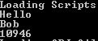
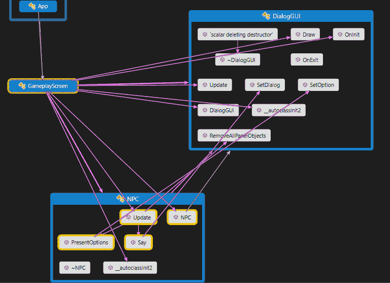
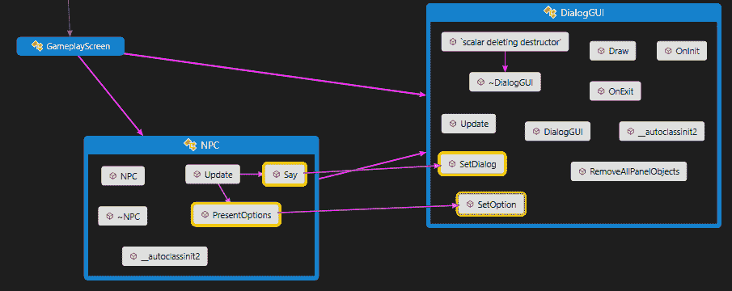
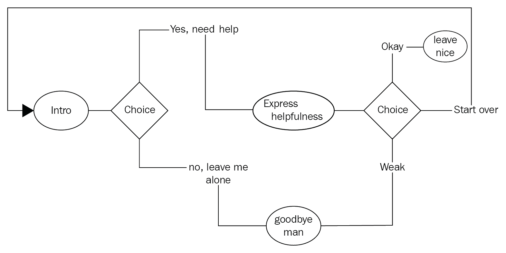
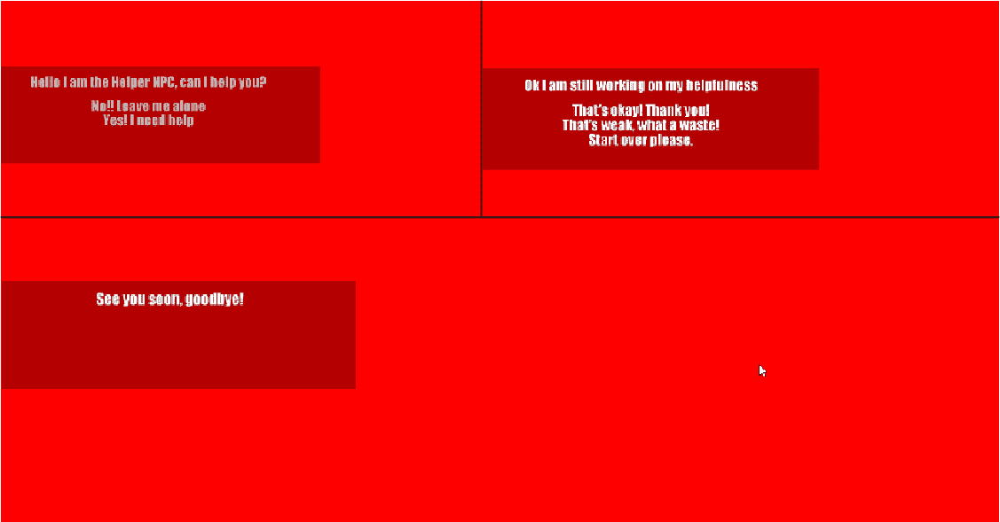

# 高级游戏系统

游戏不仅仅是简单的机制和基础引擎。它们由复杂的游戏系统组成，使我们能够与游戏世界互动，让我们感到被包容和沉浸其中。这些系统通常需要大量的时间和开发者专业知识来实现。在本章中，我们将看一下一些高级游戏系统以及在我们自己的项目中实现它们时如何给自己一层帮助。

本章包括以下主题：

+   实现脚本语言

+   构建对话系统

+   脚本任务

# 实现脚本语言

正如之前提到的，实现一个高级游戏系统通常需要许多编码小时，并且可能需要开发人员对该特定系统具有专业知识。然而，我们可以通过包含对脚本语言的支持来使这一切变得更容易，对我们自己和其他人在项目上的工作也更容易。

# 为什么要使用脚本语言

也许你会想知道，既然这是一本关于 C++的书，为什么我们要花时间谈论脚本语言呢？为什么要加入脚本语言？我们难道不能只用 C++来构建整个引擎和游戏吗？是的，我们可以！然而，一旦你开始着手更大的项目，你会很快注意到每次需要进行更改时所花费的编译和重新编译的时间。虽然有一些方法可以解决这个问题，比如将游戏和引擎分成较小的模块并动态加载它们，或者使用 JSON 或 XML 描述性文件系统，但是这些技术不能提供实现脚本系统的所有好处。

那么，将脚本语言添加到游戏引擎中有什么好处呢？首先，你将使用的大多数脚本语言都是解释性语言，这意味着与 C++不同，你不需要编译代码。相反，你的代码在运行时加载和执行。这样做的一个巨大优势是你可以对脚本文件进行更改并快速看到结果，而无需重新编译整个游戏。事实上，你可以在游戏运行时重新加载脚本并立即看到更改。使用脚本语言的另一个可能好处是相对于 C++这样的语言，它被认为更易于使用。大多数脚本语言都是动态类型的，具有简化的语法和结构。这可以为团队的创造性一面，比如艺术家和设计师，提供机会，他们可以在不需要理解 C++这样的语言复杂性的情况下对项目进行小的更改。想象一下 GUI 设计师能够创建、放置和修改 GUI 元素，而无需知道 IGUI 框架是如何实现的。添加脚本支持还为社区内容支持打开了一条道路——想象一下地图、关卡和物品都是由游戏玩家设计的。这对于新游戏来说已经成为一个巨大的卖点，并为你的游戏提供了一些可能的长期性。在谈到长期性时，DLC 的实施可以通过脚本完成。这可以实现更快的开发周转，并且可以在不需要庞大补丁的情况下投入游戏中。

这些是使用脚本语言的一些好处，但并不总是在每种情况下都是最佳解决方案。脚本语言以运行速度较慢而臭名昭著，正如我们所知，性能在构建游戏时很重要。那么，什么时候应该使用脚本而不是使用 C++呢？我们将更仔细地看一些系统示例，但作为一个简单的遵循规则，你应该总是使用 C++来处理任何可以被认为是 CPU 密集型的东西。程序流程和其他高级逻辑是脚本的绝佳候选对象。让我们看看脚本可以在我们的游戏引擎组件中使用的地方。

让我们从物理组件开始。当然，当我们想到物理时，我们立刻想到大量的 CPU 使用。在大多数情况下，这是正确的。物理系统的核心应该是用 C++构建的，但也有机会在这个系统中引入脚本。例如，物理材料的概念。我们可以在脚本中定义材料的属性，比如质量，摩擦力，粘度等。我们甚至可以从脚本内部修改这些值。物理系统中脚本的另一个潜在用途是定义碰撞的响应。我们可以处理声音的生成，特效和其他事件，都可以在脚本中完成。

那么 AI 系统呢？这可以说是游戏引擎中脚本语言最常见的用途之一，我们将在下一章更深入地研究这一点。AI 系统的许多组件可以移入脚本中。这些包括复杂的行为定义，AI 目标的规定，AI 之间的通信，AI 个性和特征的定义，以及更多。虽然列表很长，但你应该注意到给出的示例并不占用 CPU，并且 AI 系统的复杂组件，如路径查找，模糊逻辑和其他密集算法应该在 C++代码中处理。

甚至可以将脚本添加到看似 CPU 和 GPU 密集的系统中，比如图形引擎。脚本可以处理设置光照参数，调整雾等效果，甚至在屏幕上添加和删除游戏元素。正如你所看到的，引擎中几乎没有什么是不能用某种形式的脚本抽象来补充的。

那么，你应该使用哪种脚本语言？有很多选择，从游戏特定的语言，如 GameMonkey（在撰写本书时似乎已经停用），到更通用的语言，如 Python 和 JavaScript。选择取决于你的具体需求。虽然 Python 和 JavaScript 等语言具有一些令人惊叹的功能，但为了获得这些功能，学习和执行会更加复杂。在本书的示例中，我们将使用一种称为 Lua 的语言。Lua 已经存在多年，虽然近年来其流行度有所下降，但在游戏开发行业中有着非常强大的记录。在本章的下一部分，我们将更好地了解 Lua，并看看如何将其纳入我们现有的引擎系统中。

# 介绍 LUA

Lua，发音为 LOO-ah，是一种轻量级的可嵌入脚本语言。它支持现代编程方法论，如面向对象，数据驱动，函数式和过程式编程。Lua 是一种可移植的语言，几乎可以在提供标准 C 编译器的所有系统上构建。Lua 可以在各种 Unix，Windows 和 Mac 系统上运行。Lua 甚至可以在运行 Android，iOS，Windows Phone 和 Symbian 的移动设备上找到。这使得它非常适合大多数游戏标题，并且是包括暴雪娱乐在内的公司使用它的主要原因之一，例如《魔兽世界》。Lua 也是免费的，根据 MIT 权限许可分发，并且可以用于任何商业目的而不产生任何费用。

Lua 也是一种简单但强大的语言。在 Lua 中，只有一种数据结构被称为**table**。这种表数据结构可以像简单数组一样使用，也可以像键值字典一样使用，我们甚至可以使用表作为原型来实现一种面向对象编程。这与在其他语言中进行 OOP 非常相似，比如 JavaScript。

虽然我们不会详细介绍语言，但有一些很好的资源可供参考，包括 Lua 文档网站。我们将简要介绍一些关键的语言概念，这些概念将在示例中得到体现。

让我们从变量和简单的程序流开始。在 Lua 中，所有数字都是双精度浮点数。您可以使用以下语法分配一个数字：

```cpp
number = 42 
```

请注意缺少类型标识符和分号来表示语句结束。

Lua 中的字符串可以用几种方式定义。您可以用单引号定义它们，如下所示：

```cpp
string = 'single quote string' 
```

您也可以使用双引号：

```cpp
string = "double quotes string" 
```

对于跨多行的字符串，您可以使用双方括号来表示字符串的开始和结束：

```cpp
string  = [[ multi-line  
             string]] 
```

Lua 是一种垃圾收集语言。您可以通过将对象设置为`nil`来删除定义，这相当于 C++中的*NULL*：

```cpp
string = nil 
```

Lua 中的语句块用语言关键字来表示，比如`do`和`end`。`while`循环块将如下所示：

```cpp
while number < 100 do 
    number = number + 1 
end 
```

您可能会注意到我们在这里使用了`number + 1`，因为 Lua 语言中没有增量和减量运算符(`++`，`--`)。

`if`条件代码块将如下所示：

```cpp
if number > 100 then 
    print('Number is over 100') 
elseif number == 50 then 
    print('Number is 50') 
else 
    print(number) 
end 
```

Lua 中的函数构造方式类似，使用 end 来表示函数代码语句块的完成。一个简单的计算斐波那契数的函数将类似于以下示例：

```cpp
function fib(number) 
    if number < 2 then 
        return 1 
    end 
    return fib(number - 2) + fib(number -1) 
end 
```

如前所述，表是 Lua 语言中唯一的复合数据结构。它们被视为关联数组对象，非常类似于 JavaScript 对象。表是哈希查找字典，也可以被视为列表。使用表作为映射/字典的示例如下：

```cpp
table = { key1 = 'value1', 
          key2 = 100, 
          key3 = false }
```

在处理表时，您还可以使用类似 JavaScript 的点表示法。例如：

```cpp
print (table.key1) 
Prints the text value1 

table.key2 = nil 
```

这将从表中删除`key2`。

```cpp
table.newKey = {}  
```

这将向表中添加一个新的键/值对。

这就结束了我们对 Lua 语言特定内容的快速介绍；随着我们构建示例，您将有机会了解更多。如果您想了解更多关于 Lua 的信息，我再次建议阅读官方网站上的文档[`www.lua.org/manual/5.3/`](http://www.lua.org/manual/5.3/)。

在下一节中，我们将看看如何在我们的示例游戏引擎项目中包含 Lua 语言支持的过程。

# 实现 LUA

为了在我们的示例引擎中使用 Lua，我们需要采取一些步骤。首先，我们需要获取 Lua 解释器作为一个库，然后将其包含在我们的项目中。接下来，我们将不得不获取或构建我们自己的辅助桥梁，以使我们的 C++代码和 Lua 脚本之间的交互更容易。最后，我们将不得不*公开*或*绑定*函数、变量和其他对象，以便我们的 Lua 脚本可以访问它们。虽然这些步骤对于每个实现可能略有不同，但这将为我们的下一个示例提供一个很好的起点。

首先，我们需要一个 Lua 库的副本，以便在我们的引擎中使用。在我们的示例中，我们将使用 Lua 5.3.4，这是当时的最新版本。我选择在示例中使用动态库。您可以在 Lua 项目网站的预编译二进制文件页面([`luabinaries.sourceforge.net/`](http://luabinaries.sourceforge.net/))上下载动态和静态版本的库，以及必要的包含文件。下载预编译库后，解压缩并将必要的文件包含在我们的项目中。我不打算再次详细介绍如何在项目中包含库。如果您需要复习，请翻回到第二章，*理解库*，在那里我们详细介绍了步骤。

与我们在整本书中看到的其他示例一样，有时创建辅助类和函数以允许各种库和组件之间更容易地进行交互是很重要的。当我们使用 Lua 时，这又是一个例子。为了使开发者更容易地进行交互，我们需要创建一个桥接类和函数来提供我们需要的功能。我们可以使用 Lua 本身提供的接口来构建这个桥接，Lua 有很好的文档，但也可以选择使用为此目的创建的众多库之一。在本章和整本书的示例中，我选择使用`sol2`库（[`github.com/ThePhD/sol2`](https://github.com/ThePhD/sol2)），因为这个库是轻量级的（只有一个头文件），速度快，并且提供了我们示例中需要的所有功能。有了这个库，我们可以抽象出很多桥接的维护工作，并专注于实现。要在我们的项目中使用这个库，我们只需要将单个头文件实现复制到我们的`include`文件夹中，它就可以使用了。

现在我们已经有了 Lua 引擎和`sol2`桥接库，我们可以继续进行最后一步，实现脚本。如前所述，为了我们能够使用底层游戏引擎组件，它们必须首先暴露给 Lua。这就是`sol2`库的作用所在。为了演示在我们的示例引擎中如何实现这一点，我创建了一个名为`Bind_Example`的小项目。您可以在代码存储库的`Chapter08`文件夹中找到完整的源代码。

首先让我们看一下 Lua 脚本本身。在这种情况下，我把我的脚本命名为`BindExample.lua`，并将它放在示例项目父目录的`Scripts`文件夹中：

```cpp
player = { 
    name = "Bob", 
    isSpawned = false 
} 

function fib(number) 
    if number < 2 then 
        return 1 
    end 
    return fib(number - 2) + fib(number -1) 
end 
```

在这个示例中，我们的 Lua 脚本非常基本。我们有一个名为`player`的表，有两个元素。一个带有键`name`和值`Bob`的元素，以及一个带有键`isSpawned`和值`false`的元素。接下来，我们有一个名为`fib`的简单 Lua 函数。这个函数将计算斐波那契数列中直到传入的数字的所有数字。我觉得在这个例子中加入一点数学会很有趣。我应该指出，这个计算在序列越高时可能会变得相当消耗处理器，所以如果您希望它快速处理，请不要传入一个大于，比如说，20 的数字。

这给了我们一些快速的 Lua 代码示例来使用。现在我们需要将我们的程序和它的逻辑连接到这个新创建的脚本中。在这个示例中，我们将把这个连接代码添加到我们的`GameplayScreen`类中。

我们首先添加了`sol2`库的必要包含：

```cpp
#include <sol/sol.hpp> 
```

接下来，我们将创建 Lua 状态。在 Lua 中，`state`可以被视为代码的操作环境。将其视为虚拟机。这个`state`是您的代码将被执行的地方，也是通过这个`state`您将能够访问正在运行的代码的地方：

```cpp
    sol::state lua; 
```

然后我们打开了一些我们在 Lua 代码交互中需要的辅助库。这些库可以被视为 C++中`#include`的等价物。Lua 的理念是保持核心的精简，并通过这些库提供更多的功能：

```cpp
    lua.open_libraries(sol::lib::base, sol::lib::package); 
```

在我们打开了库之后，我们可以继续加载实际的 Lua 脚本文件。我们通过调用之前创建的 Lua`state`的`script_file`方法来实现这一点。这个方法接受一个参数：文件的位置作为一个字符串。当执行这个方法时，文件将被自动加载和执行：

```cpp
    lua.script_file("Scripts/PlayerTest.lua"); 
```

现在脚本已经加载，我们可以开始与它交互。首先，让我们看看如何从 Lua 的变量（表）中提取数据并在我们的 C++代码中使用它：

```cpp
    std::string stringFromLua = lua["player"]["name"]; 
    std::cout << stringFromLua << std::endl; 
```

从 Lua 脚本中检索数据的过程非常简单。在这种情况下，我们创建了一个名为`stringFromLua`的字符串，并将其赋值为 Lua 表 players 的`name`元素中存储的值。语法看起来类似于调用数组元素，但在这里我们用字符串指定元素。如果我们想要`isSpawned`元素的值，我们将使用`lua["player"]["isSpawned"]`，在我们的例子中，这将当前返回一个布尔值`false`。

调用 Lua 函数和检索值一样简单，而且非常类似：

```cpp
    double numberFromLua = lua"fib"; 
    std::cout << numberFromLua << std::endl; 
```

在这里，我们创建了一个名为`numberFromLua`的双精度类型的变量，并将其赋值为 Lua 函数`fib`的返回值。在这里，我们将函数名指定为一个字符串`fib`，然后指定该函数需要的任何参数。在这个例子中，我们传入值 20 来计算斐波那契数列直到第 20 个数字。

如果你运行`Bind_Example`项目，你将在引擎的命令窗口中看到以下输出：



虽然这涵盖了我们的 C++代码与 Lua 脚本系统之间的交互基础知识，但还有很多可以发现的地方。在接下来的几节中，我们将探讨如何利用这种脚本结构来增强各种高级游戏系统，并为我们提供一种灵活的方式来扩展我们的游戏项目。

# 构建对话系统

与游戏世界互动的最常见形式之一是通过某种对话形式。能够与`NPC`类进行交流，获取信息和任务，当然，通过对话推动故事叙述在大多数现代游戏标题中都是必不可少的。虽然你可以轻松地硬编码交互，但这种方法会让我们的灵活性非常有限。每次我们想要对任何对话或交互进行轻微更改时，我们都必须打开源代码，搜索项目，进行必要的更改，然后重新编译以查看效果。显然，这是一个繁琐的过程。想想你玩过多少游戏出现拼写、语法或其他错误。好消息是我们还有另一种方法。使用 Lua 这样的脚本语言，我们可以以动态方式驱动我们的交互，这将允许我们快速进行更改，而无需进行先前描述的繁琐过程。在本节中，我们将详细介绍构建对话系统的过程，它在高层描述上将加载一个脚本，将其附加到一个`NPC`，向玩家呈现带有选择的对话，最后，根据返回的玩家输入驱动对话树。

# 构建 C++基础设施

首先，我们需要在我们的示例引擎中构建基础设施，以支持对话系统的脚本化。实际上有成千上万种不同的方法可以实现这个实现。对于我们的示例，我会尽力保持简单。我们将使用我们在之前章节中学到的一些技术和模式，包括状态和更新模式，以及我们构建的 GUI 系统来处理交互和显示。

他们说一张图片胜过千言万语，所以为了让你对这个系统的连接方式有一个大致的了解，让我们来看一下一个代码映射图，它描述了所有类之间的连接：



这里有一些事情要做，所以我们将逐个类地分解它。首先，让我们看一下`DialogGUI`类。这个类是基于我们在之前章节中构建的 IGUI 示例。由于我们已经深入讨论了 IGUI 类的设计，我们只会涵盖我们添加的特定方面，以提供我们对话系统所需的功能。

首先，我们需要一些变量来保存对话和我们想要为玩家提供的任何选择。在`DialogGUI.h`中，我们有以下内容：选择的`IGUILabel`对象的向量和对话的单个`IGUILabel`。有关`IGUILabel`类的实现，请查看其源代码：

```cpp
std::vector<BookEngine::IGUILabel*> choices; 
BookEngine::IGUILabel* m_dialog;
```

接下来，我们需要添加一些新的函数，为我们的 GUI 提供所需的交互和脚本提供的数据。为此，我们将在`DialogGUI`类中添加三种方法：

```cpp
void SetDialog(std::string text); 
void SetOption(std::string text, int choiceNumber); 
void RemoveAllPanelElements(); 
```

`SetDialog`函数，顾名思义，将处理为每个交互屏幕设置对话框文本的工作。该函数只接受一个参数，即我们想要放置在 GUI 上的交互文本：

```cpp
void DialogGUI::SetDialog(std::string text) 
{ 
    m_dialog = new BookEngine::IGUILabel(glm::vec4(0, 110, 250, 30), 
        glm::vec2(110, -10), 
        text, 
        new BookEngine::SpriteFont("Fonts/Impact_Regular.ttf", 72), 
        glm::vec2(0.3f), m_panel); 

    AddGUIElement(*m_dialog); 
} 
```

在函数体中，我们将`m_dialog`标签变量分配给`IGUILabel`对象的新实例。构造函数应该类似于之前看到的`IGUIButton`，其中传入了文本值。最后，我们通过调用`AddGUIElement`方法将标签添加到 GUI 面板中。

`SetOption`函数，顾名思义，再次设置当前交互屏幕上每个选项的文本。此函数接受两个参数。第一个是我们要将`IGUILabel`设置为的文本，第二个是选择编号，它是在呈现的选择选项列表中的编号。我们使用这个来查看选择了哪个选项：

```cpp
void DialogGUI::SetOption(std::string text, int choiceNumber) 
{ 
    choices.resize(m_choices.size() + 1); 
    choices[choiceNumber] =  
new BookEngine::IGUILabel(glm::vec4(0, 110, 250, 20), 
            glm::vec2(110, 10), 
            text, 
            new BookEngine::SpriteFont("Fonts/Impact_Regular.ttf", 72), 
            glm::vec2(0.3f), m_panel); 

    AddGUIObject(*choices[choiceNumber]); 
}
```

在函数体中，我们正在执行与`SetDialog`函数非常相似的过程。这里的区别在于，我们将向选择向量添加`IGUILabel`实例。首先，我们进行一个小技巧，将向量的大小增加一，然后这将允许我们将新的标签实例分配给传入的选择编号值的向量位置。最后，我们通过调用`AddGUIElement`方法将`IGUILabel`添加到面板中。

我们添加到`DialogGUI`类的最后一个函数是`RemoveAllPanelElements`，它当然将处理删除我们添加到当前对话框屏幕的所有元素。我们正在删除这些元素，以便我们可以重用面板并避免每次更改交互时重新创建面板：

```cpp
void DialogGUI::RemoveAllPanelElements() 
{ 
    m_panel->RemoveAllGUIElements(); 
} 
```

`RemoveAllGUIElements`函数反过来只是调用`m_panel`对象上的相同方法。`IGUIPanel`类的实现只是调用向量上的 clear 方法，删除所有元素：

```cpp
void RemoveAllGUIObjects() { m_GUIObjectsList.clear(); }; 
```

这样就完成了对话系统的 GUI 设置，现在我们可以继续构建`NPC`类，该类将处理大部分脚本到引擎的桥接。

正如我之前提到的，我们将利用之前学到的一些模式来帮助我们构建对话系统。为了帮助我们控制何时构建 GUI 元素以及何时等待玩家做出选择，我们将使用有限状态机和更新模式。首先，在`NPC.h`文件中，我们有一个将定义我们将使用的状态的`enum`。在这种情况下，我们只有两个状态，`Display`和`WaitingForInput`：

```cpp
... 
    enum InteractionState 
    { 
        Display, 
        WaitingForInput, 
    }; 
...
```

当然，我们还需要一种方式来跟踪状态，所以我们有一个名为`currentState`的`InteractionState`变量，我们将把它设置为我们当前所处的状态。稍后，我们将在`Update`函数中看到这个状态机的完成：

```cpp
InteractionState currentState; 
```

我们还需要一个变量来保存我们的 Lua 状态，这是本章前一节中看到的：

```cpp
    sol::state lua; 
```

您可能还记得之前显示的代码映射图中，我们的`NPC`将拥有一个`DialogGUI`的实例，用于处理对话内容的显示和与玩家的交互，因此我们还需要一个变量来保存它：

```cpp
    DialogGUI* m_gui; 
```

继续实现`NPC`类，我们首先将查看`NPC.cpp`文件中该类的构造函数：

```cpp
NPC::NPC(DialogGUI& gui) : m_gui(&gui) 
{ 
    std::cout << "Loading Scripts n"; 
    lua.open_libraries(sol::lib::base, sol::lib::package, sol::lib::table); 
    lua.script_file("Scripts/NPC.lua"); 
    currentState = InteractionState::Display; 
} 
```

构造函数接受一个参数，即我们将用于交互的对话实例的引用。我们将此引用设置为成员变量 `m_gui` 以供以后使用。然后，我们处理将要使用的 Lua 脚本的加载。最后，我们将内部状态机的当前状态设置为 `Display` 状态。

让我们重新查看我们的代码地图，看看我们需要实现的不同连接，以将 `NPC` 类的加载的脚本信息传递给我们已附加的 GUI 实例：



正如我们所看到的，有两个处理连接的方法。`Say` 函数是其中较简单的一个。在这里，`NPC` 类只是在附加的 GUI 上调用 `SetDialog` 方法，传递包含要显示的对话的字符串：

```cpp
 void NPC::Say(std::string stringToSay) 
{ 
    m_gui->SetDialog(stringToSay); 
} 
```

`PresentOptions` 函数稍微复杂一些。首先，该函数从 Lua 脚本中检索一个表，该表表示当前交互的选择，我们很快就会看到脚本是如何设置的。接下来，我们将遍历该表（如果它是有效的），并简单地在附加的 GUI 上调用 `SetOption` 方法，传递选择文本作为字符串和用于选择的选择编号：

```cpp
void NPC::PresentOptions() 
{ 

    sol::table choices = lua["CurrentDialog"]["choices"]; 
    int i = 0; 
    if (choices.valid()) 
    { 
        choices.for_each(& 
        { 
            m_gui->SetOption(value.as<std::string>(), i); 
            i++; 
        }); 
    } 
}
```

我们需要放置在引擎端对话系统的最后一部分是 `Update` 方法。正如我们已经多次看到的那样，这个方法将推动系统向前。通过连接到引擎的现有 `Update` 事件系统，我们的 `NPC` 类的 `Update` 方法将能够控制每一帧对话系统中发生的事情：

```cpp
void NPC::Update(float deltaTime) 
{ 
    switch (currentState) 
    { 
    case InteractionState::Display: 
        Say(lua["CurrentDialog"]["say"]); 
        PresentOptions(); 
        currentState = InteractionState::WaitingForInput; 
        break; 
    case InteractionState::WaitingForInput: 
        for (int i = 0; i < m_gui->choices.size(); i++) 
        { 
            if (m_gui->choices[i]->GetClickedStatus() == true) 
            { 
                lua["CurrentDialog"]"onSelection"); 
                currentState = InteractionState::Display; 
                m_gui->choices.clear(); 
                m_gui->RemoveAllPanelElements (); 
            } 
        } 
        break; 
    } 
} 
```

与我们之前的有限状态机实现一样，我们将使用 switch case 来确定基于当前状态应该运行什么代码。在这个例子中，我们的 `Display` 状态是我们将调用连接方法 `Say` 和 `PresentOptions` 的地方。在这里，`Say` 调用单独传递了它从已加载的脚本文件中提取的文本。我们将在接下来的脚本中看到这是如何工作的。如果在这个例子中，我们处于 `WaitingForInput` 状态，我们将遍历我们已加载的每个选择，并查看玩家是否已经选择了其中任何一个。如果找到了一个，我们将回调脚本并告诉它已选择了哪个选项。然后，我们将切换我们的状态到 `Display` 状态，这将启动加载下一个对话屏幕。然后，我们将清除附加的 `DisplayGUI` 中的选择向量，允许它随后加载下一组选择，并最后调用 `RemoveAllPanelElements` 方法来清理我们的 GUI 以便重用。

有了 `Update` 方法，我们现在已经设置好了处理加载、显示和输入处理所需的框架，用于我们的 `NPC` 交互脚本。接下来，我们将看看如何构建其中一个这样的脚本，以便与我们引擎新创建的对话系统一起使用。

# 创建对话树脚本

对话或会话树可以被视为交互的确定流程。实质上，它首先提供一个陈述，然后，基于呈现的响应选择，交互可以分支出不同的路径。我们示例对话流程的可视化表示如下图所示：



在这里，我们以一个介绍开始对话树。然后用户被呈现两个选择：**是，需要帮助**和**不，离开我**。如果用户选择**是**路径，那么我们继续到**表达帮助**对话。如果用户选择**不**，我们移动到**再见**对话。从**表达帮助**对话，我们呈现三个选择：**好的**，**重新开始**和**虚弱**。根据选择，我们再次移动到对话树的下一个阶段。**好的**导致**离开愉快**对话。**虚弱**导致**再见**对话，**重新开始**，嗯，重新开始。这是一个基本的例子，但它演示了对话树如何工作的整体概念。

现在让我们看看如何在我们的 Lua 脚本引擎中实现这个示例树。以下是完整的脚本，我们将在接下来的部分深入了解细节：

```cpp
intro = { 
    say = 'Hello I am the Helper NPC, can I help you?', 
    choices = { 
                 choice1 = "Yes! I need help", 
                 choice2 = "No!! Leave me alone" 
    }, 

    onSelection = function (choice)  
        if choice == CurrentDialog["choices"]["choice1"] then CurrentDialog = getHelp end 
        if choice  == CurrentDialog["choices"]["choice2"] then CurrentDialog = goodbye_mean end 
    end 
} 

getHelp = { 
    say = 'Ok I am still working on my helpfulness', 
    choices = { 
                 choice1 = "That's okay! Thank you!", 
                 choice2 = "That's weak, what a waste!", 
                 choice3 = "Start over please." 
        }, 
    onSelection = function (choice)  
        if choice  == CurrentDialog["choices"]["choice1"] then CurrentDialog = goodbye  
        elseif choice  == CurrentDialog["choices"]["choice2"] then CurrentDialog = goodbye_mean  
        elseif choice  == CurrentDialog["choices"]["choice3"] then CurrentDialog = intro end 
    end 

} 

goodbye = { 
    say = "See you soon, goodbye!" 
} 

goodbye_mean = { 
    say = "Wow that is mean, goodbye!" 
} 

CurrentDialog = intro 
```

正如你所看到的，整个脚本并不长。我们有一些概念使得这个脚本工作。首先是一个非常简单的状态机版本。我们有一个名为`CurrentDialog`的变量，这个变量将指向活动对话。在我们的脚本的最后，我们最初将其设置为`intro`对话对象，这将在加载脚本时启动对话树。我们在脚本设计中的下一个重要概念是将每个交互屏幕描述为一个表对象。让我们以介绍对话表为例。

```cpp
intro = { 
    say = 'Hello I am the Helper NPC, can I help you?', 
    choices = { 
                 choice1 = "Yes! I need help", 
                 choice2 = "No!! Leave me alone" 
    }, 

    onSelection = function (choice)  
        if choice == CurrentDialog["choices"]["choice1"] then CurrentDialog = getHelp end 
        if choice  == CurrentDialog["choices"]["choice2"] then CurrentDialog = goodbye_mean end 
    end 
} 
```

每个对话表对象都有一个`Say`元素，这个元素是当`Say`函数询问脚本其对话内容时将显示的文本。接下来，我们有两个可选元素，但如果你想与玩家进行交互，这些元素是必需的。第一个是一个名为`choices`的嵌套表，其中包含了对话系统在玩家请求时将呈现给玩家的选择。第二个可选元素实际上是一个函数。当用户选择一个选项时，将调用此函数，并由一些`if`语句组成。这些`if`语句将测试选择了哪个选项，并根据选择将`CurrentDialog`对象设置为对话树路径上的下一个对话。

这就是全部。以这种方式设计我们的对话树系统的最大优点是，即使没有太多指导，甚至非程序员也可以设计一个像之前展示的简单脚本。

如果你继续使用`Chapter08`解决方案运行`Dialog_Example`项目，你将看到这个脚本的运行并能与之交互。以下是一些截图，展示输出的样子：



尽管这是一个简单的系统实现，但它非常灵活。再次需要指出的是，这些脚本不需要重新编译即可进行更改。自己试试吧。对`NPC.lua`文件进行一些更改，重新运行示例程序，你会看到你的更改出现。

在下一节中，我们将看到如何通过 Lua 脚本实现一个由任务系统驱动的对话树。

# 脚本任务

另一个非常常见的高级游戏玩法系统是任务系统。虽然任务更常见于角色扮演游戏中，但也可以出现在其他类型的游戏中。通常，这些其他类型会通过不同的名称来掩饰任务系统。例如，一些游戏有挑战，本质上与任务是一样的。

任务可以简单地被认为是为了实现特定结果而进行的尝试。通常，任务将涉及必须在任务被视为完成之前进行的一定数量的步骤。一些常见类型的任务包括击杀任务，玩家通常必须击败一定数量的敌人，通常被称为**刷怪**，以及**交付**任务，玩家必须扮演信使的角色，并经常需要前往游戏世界的新位置交付货物。当然，这是一个很好的方式，可以让玩家前往下一个期望的位置而不强迫他们。在收集任务中，玩家必须收集一定数量的特定物品。在护送任务中，玩家经常因为历史上糟糕的实现而感到害怕，玩家经常必须陪同一个`NPC`前往新的位置，并保护他们免受伤害。最后，混合任务通常是上述类型的混合，并且通常是更长的任务。

任务系统的另一个常见部分是支持所谓的任务链或任务线。在任务链中，每个任务的完成都是开始序列中下一个任务的先决条件。随着玩家在任务链中的进展，这些任务通常涉及越来越复杂的任务。这些任务是逐渐揭示情节的一个很好的方式。

这解释了任务是什么。在下一节中，我们将讨论在我们的游戏项目中添加任务支持的几种不同方式。然而，在我们查看实现的具体细节之前，对于我们来说定义每个任务对象需要的是很有用的。

为了简单起见，我们将假设任务对象将由以下内容组成：

+   **任务名称**：任务的名称

+   **目标**：完成任务所必须采取的行动

+   **奖励**：玩家完成任务后将获得的奖励

+   **描述**：关于任务的一些信息，也许是玩家为什么要承担这项任务的背景故事

+   **任务给予者**：给予任务的`NPC`

有了这些简单的元素，我们就可以构建我们的基本任务系统。

正如我们在先前的游戏玩法系统示例中所看到的，我们可以以许多不同的方式来实现我们在示例引擎中的任务系统。现在让我们简要地看一下其中的一些，并讨论它们的优点和缺点。

# 引擎支持

我们支持任务系统的一种方式是将其构建到游戏引擎本身中。整个系统将设计得靠近引擎代码，并且使用本机引擎语言，对于我们来说是 C++。我们将创建基础设施来支持任务，使用我们已经多次看到的技术。通过继承，我们可以公开所需的基本函数和变量，并让开发人员构建这个结构。然后，一个简单的高级任务类可能看起来类似于以下内容：

```cpp
class Quest 
{ 
public: 
    Quest(std::string name,  
    std::vector<GameObjects> rewards,  
    std::string description,  
    NPC questGiver); 
    ~Quest(); 
    Accept(); //accept the quest 
    TurnIn(); //complete the quest 
private: 
     std::string m_questName; 
       std::vector<GameObjects> m_rewards; 
       std::string m_questDescription; 
       NPC m_questGiver; 
     Bool isActive; 
}; 
```

当然，这只是一个简单的演示，而在这种情况下，我们将跳过实现。

这种实现方法的优点是它是用本机代码编写的，意味着它将运行得很快，并且它靠近引擎，这意味着它将更容易地访问底层系统，而无需接口层或其他库的需要。

这种实现方法的缺点包括，因为它是游戏引擎或游戏代码的一部分，这意味着任何更改都需要重新编译。这也使得非编程人员难以添加他们自己的任务想法，或者在发布后处理任务系统的扩展。

虽然这种方法确实有效，但更适用于较小的项目，在这些项目中，一旦任务或系统就位，您将不需要或不想要对其进行更改。

# 引擎/脚本桥

这种方法与我们之前实现`NPC`对话系统的方法相同。在这种设计中，我们创建一个处理脚本加载和数据传递的接口类。由于我们之前已经看到了类似的实现，我将跳过这里的示例代码，而是继续讨论这种方法的优缺点。

这种实现方法的优点包括与仅引擎实现相比的灵活性。如果我们想要进行任何更改，我们只需要在编辑器中加载脚本，进行更改，然后重新加载游戏。这也使得非编码人员更容易创建自己的任务。

这种实现方法的缺点包括它仍然部分地与引擎本身相关。脚本只能访问引擎接口公开的元素和函数。如果您想要为任务添加更多功能，您必须在脚本使用之前将其构建到引擎端。

这种方法更适合于较大的项目，但如前所述，仍然有其缺点。

# 基于脚本的系统

我们可以采取的另一种方法是在我们的脚本语言中构建整个系统，只从引擎中公开通用方法。这些通用方法很可能是模板函数的良好候选者。在这种方法中，任务系统的内部和任务脚本都将用脚本语言编写。在脚本中编写的每个任务都将包括对处理管理的任务系统脚本的引用。这种方法与仅引擎方法非常相似；它只是从引擎中移出，并进入脚本系统。

让我们来看一个简化版本的任务系统脚本。出于简洁起见，有些部分被省略了：

```cpp
local questsys = {} 
questsys.quest = {} 

function questsys.new(questname, objectives, reward, description, location, level, questgiver) 
for keys, value in ipairs(objectives) do 
    value.value = 0 
  end 
  questsys.quest[#questsys.quest+1] = { 
    questname = questname, 
    objectives = objectives, 
    reward = reward, 
    description = description, 
    questgiver = questgiver, 
    accepted = false, 
    completed = false, 
    isAccepted = function(self) return self.accepted end, 
    isCompleted = function(self) return self.completed end 
  } 
end 

function questsys.accept(questname) 
  for key, value in ipairs(questsys.quest) do 
    if value.questname == questname then 
      if not value.accepted then 
        value.accepted = true 
      end 
  end 
end 

... 

function questsys.turnin(questname) 
  rejectMsg = "You have not completed the quest." 
  for key, value in ipairs(questsys.quest) do 
    if value.questname == questname then 
      for i, j in ipairs(questsys.quest[key].objectives) do 
        if j.value == j.maxValue then 
          value.completed = true 
          value.reward() 
        else return rejectMsg end 
      end 
  end 
end 

... 

questsys.get(questname, getinfo) 
  for key, value in ipairs(questsys.quest) do 
    if value.questname == questname then 
      if getinfo == "accepted" then return value:isAccepted() end 
      if getinfo == "completed" then return value:isCompleted() end 
      if getinfo == "questname" then return value.questname end 
      if getInfo == "description" then return value.description end 
      if getInfo == "location" then return value.location end 
      if getInfo == "level" then return value.level end 
      if getInfo == "questgiver" then return value.questgiver end 
    else error("No such quest name!") 
  end 
end 

return questsys 
```

再次，我省略了一些函数以节省空间，但理解系统所需的核心组件都在这里。首先，我们有一个创建新任务的函数，接受名称、目标、描述和任务给予者。然后我们有接受函数，将任务设置为活动状态。请注意，我们使用键/值查找方法来遍历我们的表 - 我们会经常这样做。然后我们有一个完成任务的函数，最后是一个简单的返回所有任务信息的函数。这里没有描绘的函数是用于获取和设置任务各种目标值的。要查看完整的实现，请查看代码存储库的`Chapter08`文件夹中的`Quest_Example`项目。

现在，有了任务系统脚本，我们有几个选择。首先，我们可以通过使用 Lua 内置的`require`系统将此系统添加到其他脚本中，这将允许我们在其他脚本中使用该脚本。这样做的语法如下：

```cpp
local questsys = require('questsys') 
```

或者我们可以简单地在游戏引擎中加载脚本并使用接口，就像我们在上一个示例中所做的那样，并以这种方式与我们的任务系统交互。有了这种灵活性，选择权在于开发人员和情况。

这种实现方法的优点包括极大的灵活性。在这种方法中，不仅可以修改任务，还可以在不需要重新构建游戏或引擎的情况下即时修改任务系统本身。这通常是在产品发布后包含可下载内容（DLC）、游戏修改（mod）和其他额外内容的方法。

这种实现的缺点包括，尽管它非常灵活，但增加了额外的复杂性。它也可能会更慢，因为系统是用解释性的脚本语言编写的，性能可能会受到影响。它还要求开发人员对脚本语言有更多的了解，并可能需要更多的学习时间。

像其他方法一样，这种方法也有其适用的场合和时间。虽然我倾向于在较大的项目中使用这样的系统，但如果团队没有准备好，这种方法可能会增加更多的开销而不是简化使用。

# 总结

在本章中，当涉及到实施高级游戏玩法系统时，我们涵盖了大量内容。我们深入探讨了如何在游戏项目中包含像 Lua 这样的脚本语言。然后我们在这些知识的基础上，探讨了实施对话和任务系统到我们示例引擎中的方法。虽然我们讨论了很多内容，但我们只是触及了这个主题的表面。在下一章中，我们将继续基于这些新知识，为我们的游戏构建一些人工智能。
