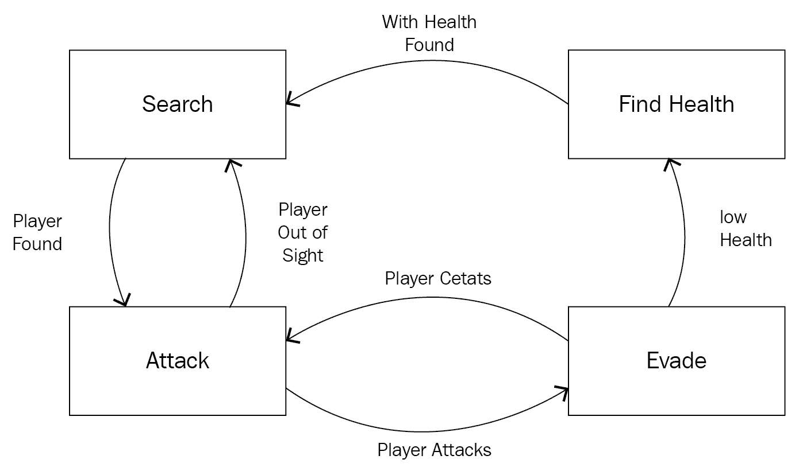
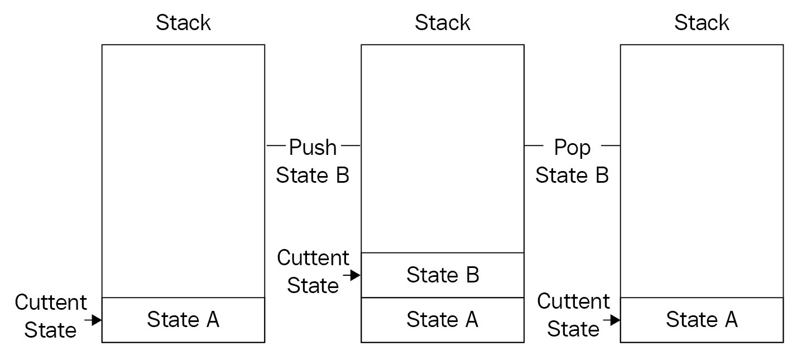
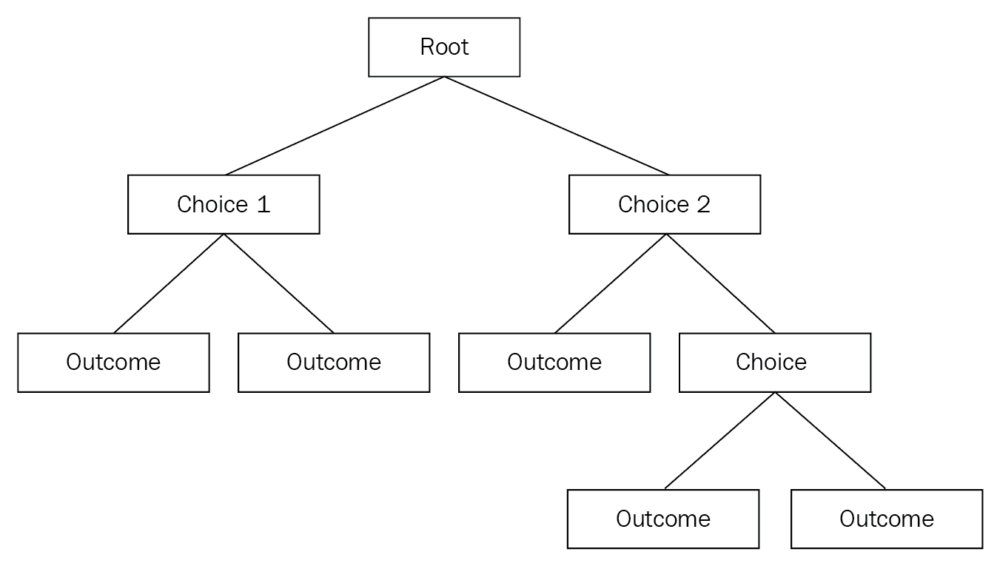
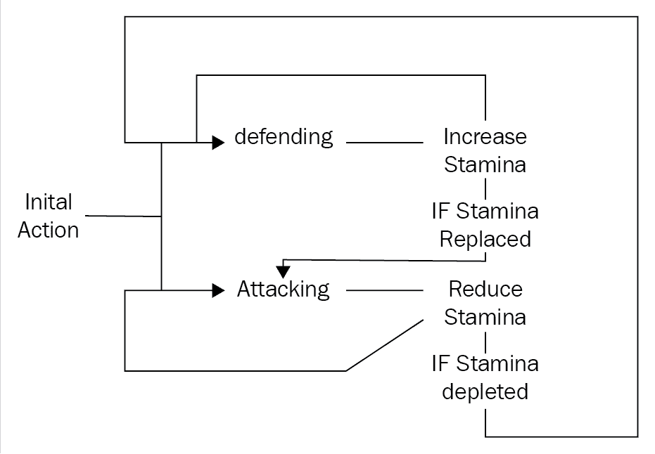
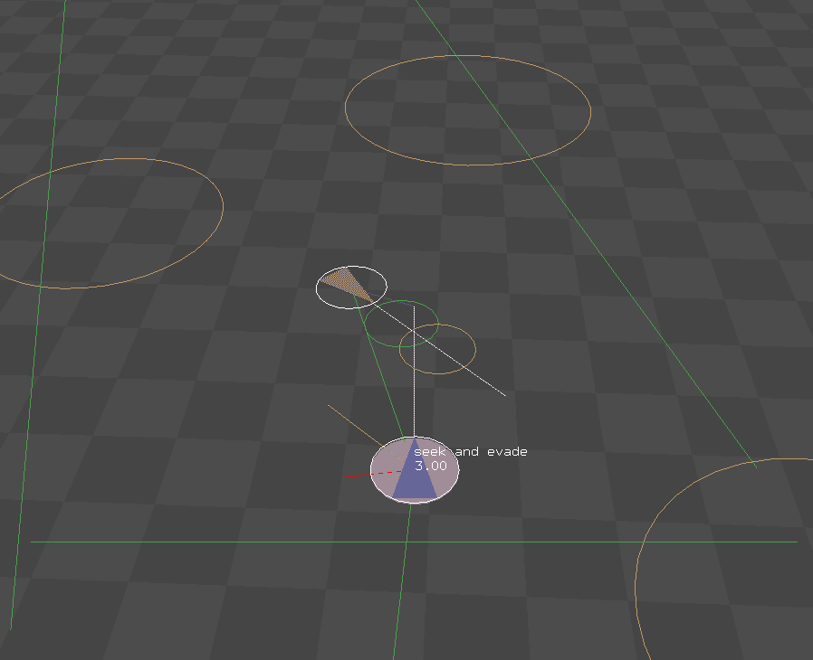
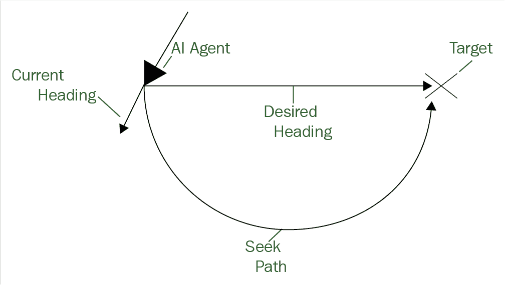
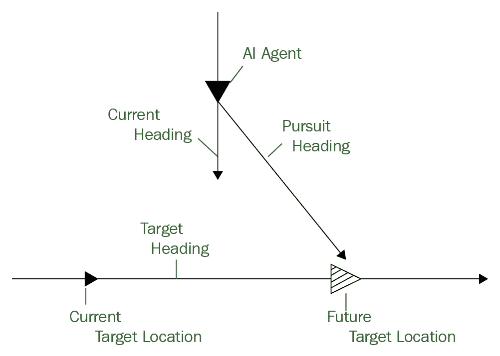
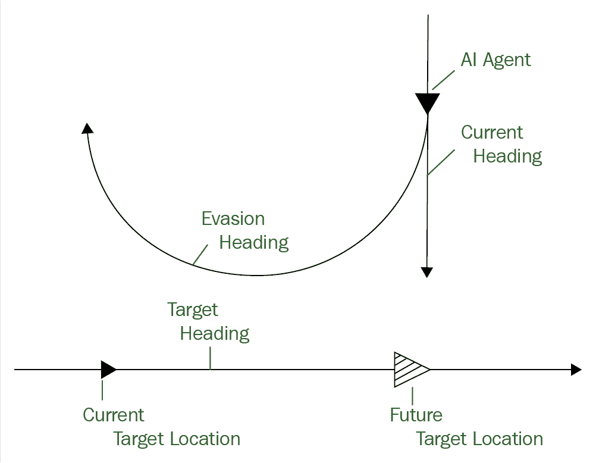
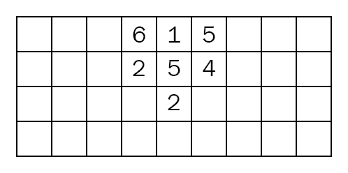
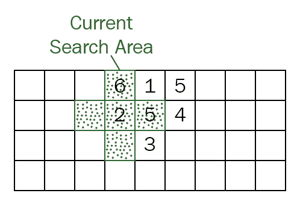

# 人工智能

大多数游戏都建立在竞争取胜的概念上。这种形式的竞争可以采取多种形式。自最早的视频游戏以来，玩家们发现自己在与机器竞争。思考、反应和挑战计算机对手的加入使游戏感觉生动并与玩家联系在一起。在本章中，我们将学习如何通过引入人工智能来为我们的游戏增加思考。

本章涵盖以下内容：

+   什么是游戏人工智能？

+   做决定

+   运动和寻路技术

# 什么是游戏人工智能？

往往被误解的游戏人工智能的定义，以及游戏人工智能不是一项非常具有挑战性的任务。在 AI 这样一个广泛的领域中，很容易在这个主题上填满许多卷的书。鉴于我们只有一个章节来讨论这个概念和实施，在本节中，我们将尽力发展一个合理的游戏人工智能的定义以及它不是什么。

# 定义游戏人工智能

如前所述，确切地定义游戏人工智能是一项艰巨的任务，但我将尽力描述我认为是关于电子视频游戏的简明解释。当设计师创建游戏世界时，他们通过塑造愿景和定义一些常见的互动规则来实现。通常，玩家将通过观察世界的元素来体验这个世界。与世界的 NPC、对手和环境的互动，以及通过叙事方面，给玩家一种沉浸在游戏世界中的感觉。这些互动可以采取许多形式。在游戏中，玩家不断通过与无生命的物体互动来体验世界，但与其他人的互动才是真正突出的。这使得游戏感觉更具沉浸感、更具触感和更有生命力。

游戏世界中某物感觉活灵活现通常是通过对游戏世界和物体的观察来实现的，比如 NPC 做出决定。这是寻找游戏人工智能定义的一个重要标志。在更广泛的意义上，人工智能可以被认为是这种感知决策的应用。通常，这种决策的感知以自主的人工智能代理的形式出现，例如常见的 NPC。这些决定可能包括从移动、对话选择，甚至对环境的改变，这些改变可能传达开发者试图创造的体验。这再次是我在定义游戏人工智能时的另一个标志。本质上，这是关于开发者试图创造的体验。因此，游戏人工智能更多地是关于近似实现期望效果，而不一定是完美的科学解释。

当开发者着手创建人工智能体验时，重要的是要牢记玩家的乐趣和沉浸感。没有人想要与完美的对手对战。我们希望在互动的另一端感知到智能，只是不希望它更聪明。这就是游戏人工智能的开发和通用人工智能发展领域开始产生分歧的地方。我们将在下一节深入探讨这种分歧，但现在让我们看看游戏开发中人工智能的一些用途。

# 对话

通过对话进行某种形式的互动的游戏往往通过角色与玩家的连接以及玩家对他们故事的投入来给人一种沉浸在世界中的感觉。然而，这是一个挑战，通常是通过对话树来实现的，正如我们在上一章中所看到的。这种对话树的方法，在某些情况下是可靠的，但很容易变得复杂。

完全脚本化对话的另一个问题是，随着对话随着时间的推移而继续，玩家很快就会摆脱这是一种智能互动的幻觉。这使得互动感觉受限，反过来也使得世界感觉受限。解决这个问题的一种方法是在对话中引入人工智能。您可以使用决策算法来增强脚本化的互动，从而在回应中给人一种更深层次的智能感。在这个概念的极端方面，您可以采用一种解析玩家输入并动态生成回应的方法。这样的方法可能包括所谓的**自然语言处理**（**NLP**）。通过利用类似于聊天机器人的东西，设计师和工程师可以创建由在用户互动时思考的代理人所居住的世界。虽然这听起来可能非常诱人，但自然语言处理领域仍被认为处于起步阶段。借助云计算提供动力的 API，如微软的认知服务 API，创建支持 NLP 的基础设施的过程变得更加容易。然而，适当的实施和语言模型的培训可能非常耗时。

# 竞争对手

许多游戏包括敌人或竞争对手的概念，供玩家进行互动。事实上，我会说这是大多数人会认为是游戏人工智能的一个例子。这些对手如何与玩家、他们的环境和其他由 AI 控制的对手互动，都是他们的人工智能设计的一部分。通常，这种人工智能设计将包括决策制定的概念，如行为树、反馈循环、状态和其他模式。它们通常还会包括其他人工智能组件，如运动算法和路径规划技术，我们稍后将更深入地介绍。创建有趣而具有挑战性的对手并不是一件容易的事。正如我之前所说，没有人想玩一个他们觉得没有赢的机会的游戏。拥有一个比玩家更快更聪明的人工智能不应该是设计对手人工智能的目标；相反，您应该专注于给用户一个有竞争力的人工智能，可能能够适应玩家不断增长的技能。正是在这种情况下，像使用机器学习来构建自适应人工智能这样的高级技术开始引起关注。尽管这些技术仍处于探索阶段，但定制人工智能对手的日子可能很快就会到来。

# 运动和路径规划

可以说，与使用人工智能作为对手一样常见的是利用人工智能进行运动和路径规划的概念。在运动中使用人工智能包括实施算法来处理游戏元素的自主移动。诸如转向、追逐和躲避等概念都可以在人工智能算法中表达。运动人工智能也常常用于处理简单的碰撞回避。路径规划是使用人工智能在将游戏对象从一个位置移动到另一个位置时找到最有效或最有效的路线的概念。自六十年代以来，**Dijkstra**和**A***等算法一直存在，并为路径规划人工智能的发展提供了支柱。我们将在本章后面更深入地探讨运动和路径规划算法和技术。

# 游戏人工智能不是什么

人工智能作为一个研究领域非常广泛，实际上包括的远不止游戏使用的内容。最近，围绕开发者空间中的人工智能的讨论变得更加广泛，越来越多的开发者寻求在其项目中利用人工智能技术的方法。因此，我认为重要的是要提及游戏开发领域之外一些更常见的人工智能用例。

AI 领域中最热门的领域之一是机器学习。**机器学习**（**ML**）可能最好由 Arthur Lee Samuel 描述，当他创造了机器学习这个术语时：*计算机学习如何在没有明确编程的情况下实现结果或预测的能力。*在数据分析领域，机器学习被用作一种方法来设计复杂的模型和算法，帮助预测给定问题的结果。这也被称为预测性分析。这些分析模型允许研究人员和数据科学家创建可靠、可重复的计算和结果，并通过数据中的历史关系和趋势发现其他见解。正如前一节中提到的，定制 AI 从您的游戏风格中学习并适应的想法是非常吸引人的概念。然而，这可能是一个很棘手的问题；如果 AI 变得太聪明，那么游戏的乐趣水平就会迅速下降。机器学习在游戏中的使用的一个很好的例子是 Forza 赛车游戏系列。在这里，赛车 AI 头像通过云计算驱动的机器学习实现来调整您遇到的 AI 赛车手的竞争水平，以适应您当前的能力水平。

AI 在游戏开发领域之外的另一个不断增长的用途是其在数据挖掘场景中的应用。虽然这一领域的 AI 仍处于早期阶段，但其在理解用户和客户数据方面的应用对许多商业部门非常有吸引力。这种 AI 用例的边界及其与游戏开发概念的潜在重叠尚未被定义。然而，一些数据挖掘的核心组件，用于理解玩家如何与游戏及其各个组件进行交互，很容易被视为对游戏开发者有益。准确了解玩家如何与游戏 GUI 等元素进行交互，将使开发者能够为每个用户创造更好的体验。

我想要讨论的 AI 在游戏开发领域之外的最后一个用例可能是当普通人想到 AI 时最为认可的用途之一，那就是在认知处理研究中使用 AI。在 AI 的学术解释中，认知处理是开发科学上可证明的这些过程的模型。这基本上可以概括为在 AI 过程中对人类智能进行建模。虽然这种方法对科学研究非常重要，但目前对游戏开发的用例来说还太过抽象，无法被认为是有用的。也就是说，机器人和自然语言处理的使用开始渗入游戏开发，正如前面提到的。

学术和研究 AI 的具体目标往往与游戏 AI 的目标完全不同。这是因为两者之间的实现和技术的固有差异完全不同。更多时候，游戏 AI 解决方案会倾向于简化方法，以便进行简单的更改和调整，而研究方法很可能会选择最科学完整的实现。在接下来的几节中，我们将看一些这些更简单的游戏开发实现，并讨论它们的用例和理论。

# 做决定

AI 的目标更多地是给人类智能的外观。智能感知的关键方面之一是 AI 代理做出决策的想法。即使是脚本化的，对某些行动有选择权，给玩家一种思考世界的感觉，由思考实体构成。在下一节中，我们将介绍游戏 AI 中一些更为知名的决策制定技术。

# AI 状态机

如果你一直在按章节跟着这本书，你可能已经注意到状态模式的使用不止一次。这种模式是一个非常强大的模式，因此在我们各种组件设计中经常使用。在人工智能领域，状态模式再次成为一颗耀眼的明星。状态机的使用，特别是有限状态机（FSM），允许对代码的执行流程进行详细的表示。它非常适合在游戏中实现 AI，允许设计强大的交互而不需要复杂的代码。

我不打算花太多时间来讨论有限状态机实现的概念和理论，因为我们已经详细覆盖了。相反，我们将看一个在 AI 脚本中实现它的例子。如果你需要对这种模式进行复习，请查看第五章中关于理解状态的部分。

以下是一个描述敌人简单大脑的图表。在这个例子中，每个状态代表一个动作，比如搜索或攻击：



虽然这是一个简单的例子，但它确实为许多情况提供了有用的 AI。我们可以在 C++中实现这个项目，就像我们在*Screen*示例和其他地方看到的那样。然而，如果你已经阅读了前一章，你会看到我们可以在脚本中实现这样的逻辑。当然，这使我们能够灵活地进行脚本编写，比如不必重新构建项目来调整代码的元素。这对于 AI 来说非常有益，因此在本章中，我将展示使用 Lua 脚本的示例代码，这可以使用前一章中描述的步骤来实现。

在 Lua 脚本中，这种 AI 设计的可能实现可能看起来类似于以下内容：

```cpp
Search = function () 
{ 
    //Do search actions.. 
    if playerFound == true then currentState = Attack end 
} 
Attack = function() 
{ 
    //Do attack actions 
    if playerAttacks == true then currentState = Evade  
    elseif playerOutOfSight == true then currentState = Search end 
} 
Evade = function() 
{ 
    //Do evade actions 
    If healthIsLow == true then currentState = FindHealth 
    Elseif playerRetreats == true then currentState == Attack end 
} 
FindHealth = function() 
{ 
    //Do finding health actions 
    If healthFound == true then currentState = Search end 
} 
currentState = Search 
```

这应该看起来很熟悉，就像上一章中的 NPC 对话示例。在这里，为了完成系统，我们首先会将脚本加载到 AI 代理或 NPC 的实例中，然后在游戏代码的`Update`循环中调用`currentState`变量当前分配的函数。通过这种代码实现，我们有了一种有效的构建基本 AI 交互的方法。这种技术自游戏开发的早期就存在。事实上，这与街机经典游戏《吃豆人》中的幽灵对手 AI 的实现非常相似。

我们还可以扩展这种简单的 FSM 实现，并将基于堆栈的 FSM 添加到解决方案中。这与第五章中看到的实现示例非常相似，因此我不会详细介绍关于基于堆栈的 FSM 理论的所有细节。基于堆栈的 FSM 的基本原则是，我们可以按照先进后出的顺序向堆栈添加和移除对象。向堆栈添加项目的常用术语称为推送，从堆栈中移除对象的操作称为弹出。因此，对于状态示例，在不同的函数期间，堆栈可能看起来类似于以下图表：



使用基于堆栈的 FSM 的一个主要优势是，现在可以使用堆栈来控制当前状态。每个状态可以从堆栈中弹出自己，允许执行下一个状态。我们还可以实现“进入”和“退出”的概念，使我们能够在状态内部有更多的状态。我们可以在每个状态中进行设置和清理等操作，使我们的 AI 状态系统更加灵活。

在 Lua 脚本中实现基于堆栈的有限状态机（FSM）的状态可能看起来类似于以下内容：

```cpp
StateA =  
{ 
    Update = function () 
    { 
        //Do state update actions 
} 
OnEnter = function() 
{ 
    //Do actions for first load 
} 
OnExit = function() 
{ 
    //Do action for last call for this state 
} 
} 
```

然后，在我们的 C++代码中，我们将添加其余的架构，以支持基于状态的 FSM。在这里，我们将创建一个向量或数组对象，该对象将保存从 Lua 脚本中加载的状态对象的指针。然后，我们将调用`OnEnter`、`OnExit`和`Update`函数，用于当前占据数组中最后一个元素的状态对象。如前所述，我们可以通过简单创建一个枚举并切换案例来处理状态流。我们也可以创建一个`StateList`类，该类将实现包装 FSM 所需函数。对于我们的示例，这个`StateList`类可能如下所示：

```cpp
class StateList { 
    public: 
        StateList (); 
        ~ StateList (); 

        LuaState * GoToNext(); 
        LuaState * GoToPrevious(); 

        void SetCurrentState(int nextState); 
        void AddState(State * newState); 

        void Destroy(); 

        LuaState* GetCurrent(); 

    protected: 
        std::vector< LuaState*> m_states; 
        int m_currentStateIndex = -1; 
    }; 
} 
```

无论你选择以哪种方式实现基于状态的 FSM，你仍然会获得堆栈控制的额外好处。正如你所看到的，状态模式在 AI 开发中使用时，为我们创建 AI 交互提供了一个伟大而灵活的起点。接下来，我们将看一些其他技术，介绍如何将决策引入到你的 AI 设计中。

# 决策树

决策树是一种类似流程图的结构，由分支和叶子组成。树的每个分支都是一个条件，用于做出决策。每个叶子是在条件中做出的选择的动作。在树的最远端，叶子是控制 AI 代理的实际命令。使用决策树结构可以更容易地设计和理解 AI 实现的流程。在决策树中实现的简单 AI 大脑可能看起来类似于以下图表：



你可能会想到，这看起来和听起来非常像我们在第八章中实现的对话树，*高级游戏系统*。那是因为它们就是！就像在处理对话和选择的情况下一样，使用树结构是脚本化 AI 交互流程的一种绝佳方式。决策树可以非常深，具有调用执行特定功能的子树的分支和节点。这使设计师能够使用大量不同的决策库，这些决策可以链接在一起，提供令人信服的 AI 交互深度。你甚至可以发展出可以根据当前任务的整体可取性排序的分支，然后在所需的分支失败时回退到其他决策。这种弹性和灵活性正是树结构的优势所在。

熟悉 C++数据结构的人可能已经在考虑如何在代码中实现这种树结构。也许列表已经浮现在脑海中。有许多不同的实现决策树的方法。我们可以将树定义为外部格式，比如 XML。我们可以使用 C++和 Lua 等脚本语言的混合来实现它的结构和架构，但由于我真的想要深入理解树设计，我们将把整个实现放在 Lua 中。这可以通过 David Young 在书籍*使用 Lua 学习游戏 AI 编程*中演示的一个很好的例子来完成，所以我们将以 David 更详细的例子为基础，构建我们的简单示例。

首先，让我们看一下树对象的结构。在`DecisionTree.lua`文件中，我们可以有以下代码：

```cpp
DecisionTree = {}; 

function DecisionTree.SetBranch(self, branch)     
self.branch_ = branch; 
end 

function DecisionTree.Update(self, deltaTime)     
-- Skip execution if the tree hasn't been setup yet.     
if (self.branch_ == nil) then 
        return; 
    end 
    -- Search the tree for an Action to run if not currently     
    -- executing an Action. 
    if (self.currentAction_ == nil) then 
        self.currentAction_ = self.branch_:Evaluate(); 
        self.currentAction_:Initialize(); 
    end 
        local status = self.currentAction_:Update(deltaTime); 
end 
function DecisionTree.new() 
    local decisionTree = {}; 
        -- The DecisionTree's data members. 
    decisionTree.branch_ = nil; 
    decisionTree.currentAction_ = nil; 
        -- The DecisionTree's accessor functions. 
    decisionTree.SetBranch = decisionTree.SetBranch; 
    decisionTree.Update = decisionTree.Update; 
        return decisionTree; 
end 
```

在我们的树结构中，我们实现了一个更新循环，该循环评估树中的根分支并处理结果动作。一旦动作被创建、处理和完成，决策树将重新评估自身，从根分支重新开始确定下一个要执行的动作。

接下来是分支对象。在我们的实现中，分支将包括一个条件，该条件将确定接下来执行哪个元素。条件评估的责任是返回一个值，该值范围从分支中的子级的最大数量。这将表示应该执行哪个元素。我们的决策分支 Lua 类对象将具有基本函数，用于添加额外的子级以及在分支计算期间使用的设置条件函数。在`DecisionBranch.lua`文件中，我们可以有一个类似以下的实现：

```cpp
DecisionBranch = {} 
DecisionBranch.Type = " DecisionBranch "; 
function DecisionBranch.new() 
    local branch = {}; 
    -- The DecisionBranch data members. 
    branch.children_ = {}; 
    branch.conditional_ = nil; 
    branch.type_ = DecisionBranch.Type; 
    -- The DecisionBranch accessor functions. 
    branch.AddChild = DecisionBranch.AddChild; 
    branch.Evaluate = DecisionBranch.Evaluate; 
    branch. SetConditional = DecisionBranch. SetConditional; 
    return branch; 
end 
function DecisionBranch.AddChild(self, child, index) 
    -- Add the child at the specified index, or as the last child. 
    index = index or (#self.children_ + 1); 
        table.insert(self.children_, index, child); 
end 
function DecisionBranch.SetConditional (self, conditional) 
    self. conditional _ = conditional; 
end 
```

正如大卫在他的例子中指出的那样，由于叶子只是动作，我们可以将每个叶子动作包含在分支中。这使我们能够在代码中获得所需的功能，而无需额外的结构。通过使用`type_ 变量`，我们可以确定分支的子级是另一个分支还是需要执行的动作。

对于分支本身的评估，我们执行条件，然后使用返回的值来确定树中的下一步。值得注意的是，树中的每个分支最终都必须以一个动作结束。如果树中有任何不以动作结束的叶子，那么树就是畸形的，将无法正确评估。

留在`DecisionBranch.lua`文件中，评估分支的代码看起来类似以下内容：

```cpp
function DecisionBranch.Evaluate(self) 
    -- Execute the branch's evaluator function, this will return a 
    -- numeric value which indicates what child should execute. 
    local conditional = self. conditional _(); 
    local choice = self.children_[conditional]; 
    if (choice.type_ == DecisionBranch.Type) then 
        -- Recursively evaluate children to see if they are decision branches. 
        return choice:Evaluate(); 
    else 
        -- Return the leaf action. 
        return choice; 
    end 
end 
```

现在我们已经有了树数据结构，我们可以继续构建一个供使用的树。为此，我们首先创建决策树的新实例，创建树中所需的每个分支，连接条件分支，最后添加动作叶子。在`AILogic.lua`文件中，我们可以有类似以下的内容：

```cpp
function AILogic_DecisionTree() 
    --Create a new instance of the tree 
    local tree = DecisionTree.new(); 
--Add branches 
local moveBranch = DecisionBranch.new(); 
    local shootBranch = DecisionBranch.new(); 
    --Connect the conditional branches and action leaves 
... 
moveBranch:AddChild(MoveAction()); 
      moveBranch:AddChild(randomBranch); 
      moveRandomBranch:SetConditional( 
        function() 
            if Conditional_HasMovePosition() then 
                return 1; 
            end 
            return 2; 
        end); 
... 
    --Set initial branch 
    tree:SetBranch(moveBranch); 
return tree; 
end 
```

有了决策树，我们现在可以调用此脚本并将树加载到 AI 代理对象中。我们可以随时进行更改，添加更多决策和动作，甚至添加其他 AI 技术来增强决策。虽然决策树允许开发人员和设计师创建易于理解和阅读的 AI 结构，但它也有缺点。最显着的缺点之一是其对复杂逻辑条件的建模，其中您需要考虑条件的每种可能结果。此外，随着更多分支可能性的增加，树也将开始需要平衡。如果不进行平衡，树的部分将需要复制，迅速增加树结构的复杂性，并导致更容易出现错误的代码。

# 反馈循环

我想简要谈一下 AI 决策中的最后一个主题，即反馈循环的概念。反馈循环是指系统的某个输出值被反馈或返回给系统，进而影响系统的状态，影响其后续值。理想情况下，在视频游戏中，特别是在 AI 交互中，每个循环都应该是一个稳定的反馈循环。稳定反馈循环的简单定义是系统的输出用于扭转导致反馈值的情况，使反馈系统移动到稳定状态的收敛。这可以防止您的 AI 反馈引起负面或正面反馈循环的失控效应。

为了帮助您真正理解反馈循环是什么，让我们以视频游戏中最常见的例子来说明，即耐力。耐力在许多场景中都有体现，比如角色奔跑或奔跑的能力，或者角色攀爬的能力。在我们的例子中，我们将看一下拳击比赛的例子。以下是一个显示我们想要实现的反馈循环的图表：



如前所述，我们需要确保拳击示例中的耐力反馈循环是稳定的。 这意味着当我们达到预定义的低耐力水平时，我们需要将循环切换到防守，以便我们恢复耐力。 如果达到预定义的恢复水平，我们则相反地切换到进攻以降低耐力水平。 这种切换允许我们保持循环稳定，并被称为振荡反馈循环。

在代码中实现这一点是令人惊讶地简单：

```cpp
void Update(float deltaTime) 
{ 
    if(currentState == attacking) 
    { 
        ReduceStamina(); 
    if(player.stamina <= depleted) 
{ 
        currentState = defending; 
} 
} 
else if (currentState == defending) 
{ 
    IncreaseStamina(); 
    if(stamina >= replenished) 
    { 
        currentState = attacking; 
    } 
} 
} 
```

就是这样，老实说。 编写这种技术的实现并不复杂。 我们确实跳过了一些事情，比如如何处理减少和增加耐力。 考虑到这是一个 AI 系统，我们希望它看起来更真实，因此静态地增加这些值并不是很好。 在这里放置一个好的随机值可以使其更具真实感。 最终，这是一种易于实现的技术，可以提供一种很好的方式来改变结果，并为 AI 组件提供更独特的交互。

# 运动和路径规划技术

AI 代理和其他非玩家角色经常需要在游戏世界中移动。 实现这种移动，使其看起来像是真实的，是一个具有挑战性的过程。 在下一节中，我们将看看如何实现算法和技术，以将 AI 代理的移动和路径规划添加到我们的游戏开发项目中。

# 运动算法和技术

使用运动算法来控制 AI 代理在关卡或游戏世界中的移动是视频游戏中 AI 算法的一个非常常见的用例。 这些算法可以实现行为，给人以思考和反应的 AI 代理的印象，它们还可以执行其他任务，如简单的物体避让。 在下一节中，我们将看一些这些运动技术。

# 转向行为

转向行为是由各种技术组成的运动算法的子集，用于基于外部和内部变量控制 AI 代理的移动。 在我们的示例引擎中，我们已经整合了一个 3D 物理计算库-请参阅第五章，“构建游戏系统”，进行复习-我们已经有了一个 NPC 类的概念，作为我们的 AI 代理。 这意味着我们已经拥有了创建基于牛顿物理的转向系统所需框架的大部分内容，也称为基于转向的运动系统。 基于转向的运动系统由几个不同的分类组成，用于向 AI 代理添加力。 这些包括寻找、逃避、规避、徘徊、追逐等分类。 这些算法的完全详细实现将占据自己的章节，因此我们将专注于每个算法的高级概念和用例。 为了帮助您在实现方面，我在示例引擎中包含了`OpenSteer`库。 `OpenSteer`将处理计算的细节，使我们的引擎和我们的 AI Lua 脚本更容易使用这些算法来控制代理的移动。

以下是运行寻找和逃避算法的`OpenSteer`库程序的屏幕截图：



# 寻找

让我们从寻找算法开始。 寻找算法的目标是引导 AI 代理朝向游戏空间中的特定位置。 这种行为施加力，使当前航向和期望的航向朝向目标目的地对齐。 以下图表描述了这个过程：



**期望航向**实际上是一个从角色到目标的方向向量。**期望航向**的长度可以设置为一个值，比如角色当前的速度。转向向量或**寻找路径**是期望航向与角色当前航向的差。这个方程可以简化为以下形式：

```cpp
    desiredHeading = normalize (position - target) * characterSpeed 
    steeringPath = desiredHeading - velocity 
```

寻找算法的一个有趣的副作用是，如果 AI 代理继续寻找，它最终会穿过目标，然后改变方向再次接近目标。这会产生一种看起来有点像蛾子围绕灯泡飞舞的运动路径。要使用`OpenSteer`来计算转向力，你需要调用`steerForSeek`函数，传递一个 3 点向量来描述目标的位置：

```cpp
Vec3 steerForSeek (const Vec3& target); 
```

# 


逃避

使用`OpenSteer`来计算逃避 AI 代理的转向力，你需要调用`steerForEvasion`函数，传递一个对象作为我们要逃避的目标，以及一个浮点值来指定在计算要施加的力时要使用的未来最大时间量：

```cpp
 Vec3 steerForFlee (const Vec3& target); 
```

# 追逐

追逐转向行为与寻找行为非常相似，但这里的区别在于目标点实际上是一个移动的对象或玩家。下图说明了这个行为：

逃避

为了创建有效的追逐行为，我们需要对目标的未来位置进行一些预测。我们可以采取的一种方法是使用一个预测方法，在每次更新循环中重新评估。在我们简单的预测器中，我们将假设我们的目标在此更新循环中不会转向。虽然这种假设更容易出错，但预测结果只会在一小部分时间（1/30）内使用。这意味着，如果目标确实改变方向，下一个模拟步骤中将根据目标改变方向进行快速修正。同时，根据这个假设，可以通过将目标的速度乘以 X 并将该偏移添加到其当前位置来计算 X 单位时间内的目标位置。然后，只需将寻找转向行为应用于预测的目标位置，就可以实现追逐行为。

要使用`OpenSteer`来计算追逐 AI 代理的转向力，你需要调用`steerForPursuit`函数，传递一个对象作为我们要追逐的目标：

```cpp
Vec3 steerForPursuit (const TargetObject& target); 
```

# 使用`OpenSteer`来计算逃避 AI 代理的转向力，你需要调用`steerForFlee`函数，传递一个 3 点向量来描述目标的位置：

逃避就像逃离是寻找的反向，逃避是追逐的反向。这意味着，我们不是朝着目标的计算未来位置驾驶 AI 代理，而是从目标的当前位置逃离。下图说明了这个行为：



使用逃避转向行为时，AI 代理将远离预测的相遇点。这通常会导致不太自然的行为，因为大多数真正逃离的实体可能会有一个随机的逃避模式。实现更自然效果的一种方法是修改施加的力与另一个行为，比如我们接下来将要介绍的漫游行为。

逃避行为就是寻找行为的反向。这意味着，AI 代理不是朝着特定目标对齐航向，而是朝着目标点的相反方向对齐航向。下图说明了这个过程：

```cpp
Vec3 steerForEvasion (const AbstractVehicle& menace, 
                      const float maxPredictionTime); 
```

# 漫游

正如我之前提到的，有时通过添加另一个行为来修改力来使行为有一些波动会更好。漫游行为是一个很好的修改行为的例子。漫游行为基本上返回一个与代理的前向矢量相关的切线转向力。值得注意的是，由于漫游行为旨在为代理的移动增加一些偏差，它不应该单独用作转向力。

要使用`OpenSteer`来为 AI 代理计算漫游转向力，你可以调用`steerForWander`函数，并传递一个浮点值来指定漫游之间的时间步长。时间步长值允许在帧时间变化时保持漫游速率一致：

```cpp
Vec3 steerForWander (float dt); 
```

虽然这本书中我们只能花这么多时间来研究 AI 转向行为，但我们只是开始了解可用的内容。像群集和简单的物体避让这样的概念不幸地超出了本章的范围，但是`OpenSteer`库完全支持这些概念。如果你有兴趣了解更多关于这些行为的内容，我强烈建议阅读`OpenSteer`文档。

# 搜索算法和路径规划技术

在许多游戏中，我们经常需要找到从一个位置到另一个位置的路径。游戏开发中人工智能的另一个非常常见的需求，也是本章将要涉及的最后一个需求，是使用搜索算法来寻找 AI 代理周围移动的最佳路径。

例如，这里我们将专注于图搜索算法。图搜索算法，顾名思义，使用图作为其数据输入的来源。在我们的地图示例中，图是一组位置和它们之间的连接。它们通常分别被称为节点和边。以下是一个非常基本的图数据可能看起来像的示例：



这些图搜索算法的输出可以用来制定 AI 代理需要采取的路径。这条路径由图的节点和边组成。值得注意的是，这些算法会告诉你的 AI 去哪里移动，但不会提供如何移动。这些算法不像本章前面的转向力算法，它们不会移动 AI 代理。然而，结合转向算法，这些路径规划算法将创建出色的整体 AI 行为。

现在我们对图是如何表示地图以及我们想要找到路径的点有了基本的了解，让我们来看一些最常用的算法。

# 广度优先

广度优先搜索是最简单的搜索算法。它平等地探索所有方向。那么它是如何探索的呢？在所有这些搜索算法中，关键思想是跟踪一个不断扩展的区域，称为前沿。广度优先算法通过从起点向外移动并首先检查其邻居，然后是邻居的邻居，依此类推来扩展这个前沿。以下是一个显示这种扩展在网格上发生的图表。数字表示网格方格被访问的顺序：



以下是如何在 C++中实现这一点的一个简单示例。出于篇幅考虑，我省略了一些代码部分。完整的实现可以在源代码库的`Chapter09`示例项目中找到：

```cpp
void SearchGraph::BreadthFirst(int s) 
{ 
    // Mark all the vertices as not visited 
    bool *visited = new bool[V]; 
    for(int i = 0; i < V; i++) 
        visited[i] = false; 

    // Create a queue for BFS 
    list<int> queue; 

    // Mark the current node as visited and enqueue it 
    visited[s] = true; 
    queue.push_back(s); 

    // 'i' will be used to get all adjacent vertices of a vertex 
    list<int>::iterator i; 

    while(!queue.empty()) 
    { 
        // Dequeue a vertex from queue and print it 
        s = queue.front(); 
        cout << s << " "; 
        queue.pop_front(); 

        // Get all adjacent vertices of the dequeued vertex s 
        // If a adjacent has not been visited, then mark it visited 
        // and enqueue it 
        for(i = adj[s].begin(); i != adj[s].end(); ++i) 
        { 
            if(!visited[*i]) 
            { 
                visited[*i] = true; 
                queue.push_back(*i); 
            } 
        } 
    } 
} 
```

从源代码中你可能已经注意到，这个算法的一个技巧是我们需要避免重复处理节点并多次处理一个节点。在这个简单的例子中，我们实现了一个布尔值数组来标记已访问的节点。如果我们不在这个例子中标记已访问的顶点，我们就会创建一个无限循环过程。

这是一个非常有用的算法，不仅适用于常规路径规划，还适用于程序地图生成、流场路径规划、距离图和其他类型的地图分析。

# Dijkstra 算法

在某些情况下，当每一步都可能有不同的成本时，我们需要找到最短的路径。例如，在*文明*游戏系列中，穿越不同的地形类型需要不同数量的回合。在这种情况下，我们可以实现 Dijkstra 算法，也称为**统一成本搜索**。这个算法让我们可以优先考虑要探索的路径。它不是平等地探索所有可能的路径，而是偏向于成本较低的路径。为了实现路径的优先级，我们需要跟踪移动成本。实质上，我们希望在决定如何评估每个位置时考虑移动成本。在这个算法中，我们需要所谓的优先队列或堆。使用堆而不是常规队列会改变前沿的扩展方式。以下是 C++中演示 Dijkstra 算法的示例代码摘录，为了节省空间，我再次省略了一些部分。您可以在源代码库的`Chapter09`文件夹中找到完整的 Dijkstra 示例：

```cpp
// Prints shortest paths from src to all other vertices 
void SearchGraph:: Dijkstra(int src) 
{ 
    // Create a priority queue to store vertices that are being preprocessed 
    priority_queue< iPair, vector <iPair> , greater<iPair> > pq; 

    // Create a vector for distances and initialize all distances as infinite (INF) 
    vector<int> dist(V, INF); 

    // Insert source itself in priority queue and initialize its distance as 0\. 
    pq.push(make_pair(0, src)); 
    dist[src] = 0; 

    /* Looping till priority queue becomes empty (or all 
      distances are not finalized) */ 
    while (!pq.empty()) 
    { 
        int u = pq.top().second; 
        pq.pop(); 

        // 'i' is used to get all adjacent vertices of a vertex 
        list< pair<int, int> >::iterator i; 
        for (i = adj[u].begin(); i != adj[u].end(); ++i) 
        { 
            // Get vertex label and weight of current adjacent of u. 
            int v = (*i).first; 
            int weight = (*i).second; 

            // If there is shorted path to v through u. 
            if (dist[v] > dist[u] + weight) 
            { 
                // Updating distance of v 
                dist[v] = dist[u] + weight; 
                pq.push(make_pair(dist[v], v)); 
            } 
        } 
    } 

    // Print shortest distances stored in dist[] 
    printf("Vertex   Distance from Sourcen"); 
    for (int i = 0; i < V; ++i) 
        printf("%d tt %dn", i, dist[i]); 
}  
```

这个算法在使用不同成本找到最短路径时非常好，但它确实浪费时间在所有方向上探索。接下来，我们将看看另一个算法，它让我们找到通往单一目的地的最短路径。

# A*

在路径规划中，可以说最好和最流行的技术之一是**A***算法。A*是 Dijkstra 算法的一种优化，适用于单一目的地。Dijkstra 算法可以找到到所有位置的路径，而 A*找到到一个位置的路径。它优先考虑似乎更接近目标的路径。实现非常类似于 Dijkstra 实现，但不同之处在于使用启发式搜索函数来增强算法。这种启发式搜索用于估计到目标的距离。这意味着 A*使用 Dijkstra 搜索和启发式搜索的总和来计算到某一点的最快路径。

以下是维基百科提供的 A*算法过程的伪代码示例，非常出色（[`en.wikipedia.org/wiki/A*_search_algorithm`](https://en.wikipedia.org/wiki/A*_search_algorithm)）：

```cpp
function A*(start, goal) 
    // The set of nodes already evaluated 
    closedSet := {} 

    // The set of currently discovered nodes that are not evaluated yet. 
    // Initially, only the start node is known. 
    openSet := {start} 

    // For each node, which node it can most efficiently be reached from. 
    // If a node can be reached from many nodes, cameFrom will eventually contain the 
    // most efficient previous step. 
    cameFrom := the empty map 

    // For each node, the cost of getting from the start node to that node. 
    gScore := map with default value of Infinity 

    // The cost of going from start to start is zero. 
    gScore[start] := 0 

    // For each node, the total cost of getting from the start node to the goal 
    // by passing by that node. That value is partly known, partly heuristic. 
    fScore := map with default value of Infinity 

    // For the first node, that value is completely heuristic. 
    fScore[start] := heuristic_cost_estimate(start, goal) 

    while openSet is not empty 
        current := the node in openSet having the lowest fScore[] value 
        if current = goal 
            return reconstruct_path(cameFrom, current) 

        openSet.Remove(current) 
        closedSet.Add(current) 

        for each neighbor of current 
            if neighbor in closedSet 
                continue        // Ignore the neighbor which is already evaluated. 

            if neighbor not in openSet    // Discover a new node 
                openSet.Add(neighbor) 

            // The distance from start to a neighbor 
            tentative_gScore := gScore[current] + dist_between(current, neighbor) 
            if tentative_gScore >= gScore[neighbor] 
                continue        // This is not a better path. 

            // This path is the best until now. Record it! 
            cameFrom[neighbor] := current 
            gScore[neighbor] := tentative_gScore 
            fScore[neighbor] := gScore[neighbor] + heuristic_cost_estimate(neighbor, goal) 

    return failure 

function reconstruct_path(cameFrom, current) 
    total_path := [current] 
    while current in cameFrom.Keys: 
        current := cameFrom[current] 
        total_path.append(current) 
    return total_path 
```

这就是我们对一些常见路径规划技术的快速介绍。虽然在本节中我们看到了一些实现，但如果您正在寻找生产游戏的绝佳起点，我强烈建议您查看一些开源库。这些是非常有价值的学习资源，并提供了经过验证的实现技术，您可以在此基础上构建。

# 总结

在本章中，我们在短时间内涵盖了一个广泛的研究领域。我们对游戏 AI 的真正定义进行了基本界定，以及它不是什么。在本章中，我们还探讨了如何通过包括 AI 技术来扩展决策功能。我们讨论了如何通过使用转向力和行为来控制 AI 代理的移动。最后，我们通过查看路径规划算法的使用来为我们的 AI 代理创建从一个点到另一个点的路径来结束了本章。虽然我们在本章中涵盖了相当多的内容，但在游戏 AI 的世界中仍有许多未被发掘的内容。我恳请您继续您的旅程。在下一章中，我们将看看如何将多人游戏和其他网络功能添加到我们的示例游戏引擎中。
