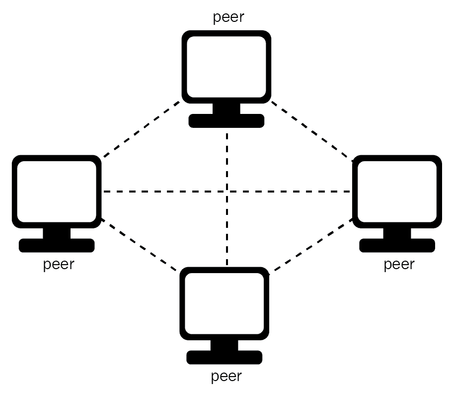
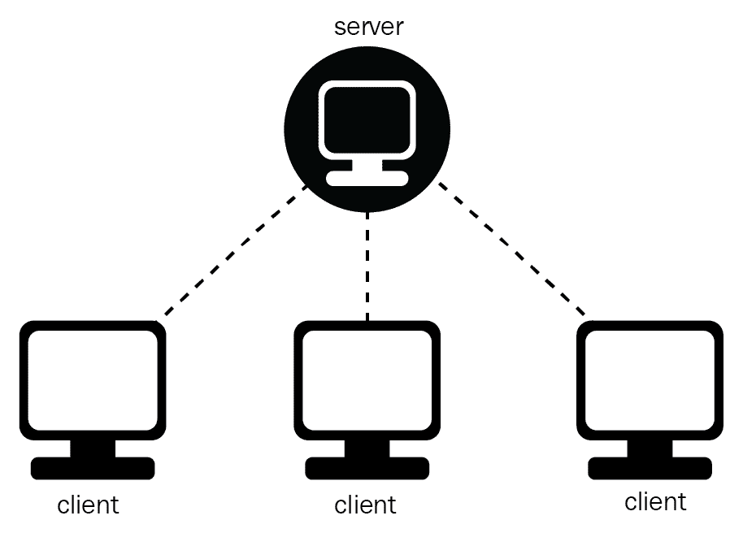
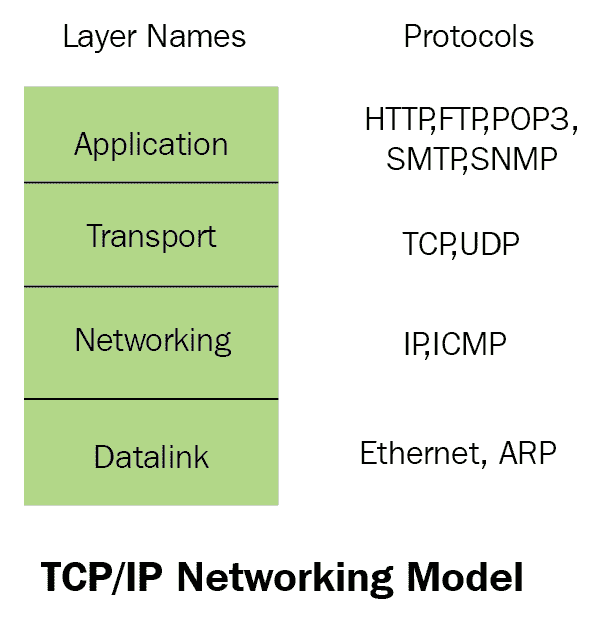
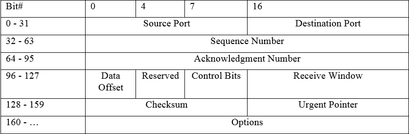

# 第十章：多人游戏

自从我最早的游戏冒险以来，我发现分享体验总是让它更加难忘。在那些日子里，多人游戏的概念围绕着与朋友一起在沙发上玩游戏或者与其他游戏爱好者聚在一起举办一场史诗般的**LAN**（本地区域网络）派对。自那时以来，情况发生了巨大变化，现在在线、全球共享的游戏体验已成为新常态。在本章中，我们将介绍如何为您的游戏项目添加多人支持的概念，重点关注网络多人游戏。正如我之前所说，计算机网络的话题是一个非常庞大和多样化的话题，需要比我们现在有的时间和空间更多的时间来全面覆盖。因此，我们将重点介绍高层概述，并在需要时深入讨论。在本章中，我们将涵盖以下主题：

+   多人游戏简介

+   网络设计和协议开发

+   创建客户端/服务器

# 游戏中的多人游戏简介

简而言之，多人游戏是一种视频游戏类型，可以让多人同时玩。而单人游戏通常是围绕一个玩家与人工智能对手竞争和实现预定目标，而多人游戏则是围绕与其他人类玩家的互动而设计的。这些互动可以是竞争、合作伙伴关系，或者简单的社交互动。多人互动的实现方式可以根据地点和类型的因素而有所不同，从同屏多人游戏的格斗游戏到在线多人角色扮演游戏，用户共享一个共同的环境。在接下来的部分，我们将看一些多人互动可以包含在视频游戏中的各种方式。

# 本地多人游戏

游戏中的多人游戏概念最早出现在本地多人游戏的形式中。很早以前，很多游戏都有两人模式。一些游戏会实现一种称为回合制多人游戏的两人模式，玩家可以轮流玩游戏。尽管如此，开发者早早就看到了共享体验的好处。甚至最早的游戏，比如《Spacewar!》（1962）和《PONG》（1972）也是让玩家互相对抗的。街机游戏的兴起推动了本地多人游戏，比如《Gauntlet》（1985）这样的游戏提供了最多四个玩家的合作游戏体验。

大多数本地多人游戏可以分为几类，回合制、共享单屏或分屏多人游戏。

回合制，顾名思义，是一种多人游戏模式，玩家轮流使用单个屏幕玩游戏。一个很好的回合制多人游戏的例子是原版的《超级马里奥兄弟》，适用于**任天堂娱乐系统**（**NES**）。在这个游戏中，如果选择了双人模式，第一个玩家扮演马里奥角色；当玩家死亡时，第二个玩家轮到，扮演另一个兄弟路易吉。

共享单屏多人游戏是一种常见的本地多人游戏模式，每个玩家的角色都在同一个屏幕上。每个玩家同时控制他们的角色/化身。这种模式非常适合对战游戏，比如体育和格斗游戏，以及合作游戏，比如平台游戏和解谜游戏。这种模式今天仍然非常受欢迎，一个很好的例子就是最近发布的《杯头》游戏。

# 单屏多人游戏

分屏多人游戏是另一种流行的本地多人游戏模式，其中每个玩家在整个本地屏幕上都有自己的游戏视图。每个玩家同时控制自己的角色/化身。这种模式非常适合对战游戏，如射击游戏。尽管大多数选择实施分屏模式的游戏都是双人游戏，但有些游戏支持多达四名本地玩家，本地屏幕被垂直和水平分成四分之一。一个很好的实施分屏多人游戏的游戏是第一人称射击游戏《光环》。

# 局域网

随着个人电脑在 20 世纪 90 年代初的大量普及，将计算机连接在一起共享信息的想法很快成为大多数计算机用户的核心需求。连接多台计算机的早期方法之一是通过局域网（LAN）。LAN 允许有限区域内的计算机进行连接，例如大学、办公室、学校，甚至个人住所。除非在 LAN 所在的有限区域内，否则默认情况下无法连接 LAN。虽然商业计算世界已经采用了 LAN 计算的想法，但游戏行业真正开始使用这项技术进行多人游戏是在 1993 年发布《毁灭战士》时。

自从互联网被广泛采用以来，基于局域网的多人游戏的流行度已经下降。尽管如此，局域网仍然是当今电子竞技联赛等比赛中进行多人游戏的方式。基于局域网的多人游戏也催生了一种称为**局域网聚会**的现象。局域网聚会是玩家们聚集在同一物理位置，将所有计算机连接在一起以便彼此游玩的活动。这些活动通常持续多天，玩家们会跋涉长途前来参加。局域网聚会是 20 世纪 90 年代初至 90 年代末游戏界的一个重要组成部分，对于参与其中的任何玩家来说，这是一种与其他玩家联系的难忘方式。

# 在线多人游戏

互联网的普及带来了全球玩家以全新方式连接和游玩的能力。与旧时的局域网聚会不同，玩家现在可以在家中舒适的环境中与世界各地的玩家一起游玩和竞争。在线多人游戏的历史可以追溯到早期的例子，如**MUD**（多用户地下城），用户可以通过互联网玩简单的角色扮演游戏。在线多人游戏几乎涵盖了当今游戏的各种类型，从第一人称射击游戏到实时策略游戏。基于互联网的游戏还催生了一种称为**大型多人在线**（MMO）游戏的新类型游戏。在 MMO 中，大量玩家可以在单个实例或世界中连接和互动。迄今为止最受欢迎的 MMO 游戏之一是《魔兽世界》。

# 网络设计和协议开发

在设计和开发多人游戏时，两个最重要的考虑因素是决定要使用的网络拓扑和连接协议。每个选择对实施和游戏本身都有重大影响。在本章的下一部分中，我们将介绍不同的网络拓扑和使用的协议，并讨论它们的各种影响和考虑因素。

# 网络拓扑

简单来说，网络拓扑是网络上的计算机如何连接在一起的方式。对于在线游戏，网络拓扑将决定如何组织网络上的计算机，以允许用户接收游戏的更新。计算机如何组网将决定整体多人游戏设计的许多方面，每种拓扑类型都有其自身的优势和劣势。在接下来的部分中，我们将介绍游戏开发中使用的两种最流行的拓扑结构，即客户端/服务器和点对点模型。

# 点对点

在点对点网络中，每个玩家都与游戏实例中的每个其他玩家连接。



点对点网络通常采用非权威设计。这意味着没有单一实体控制游戏状态，因此每个玩家必须处理自己的游戏状态，并将任何本地更改通知给其他连接的玩家。这意味着由于这种拓扑结构，我们需要考虑一些问题。首先是带宽；正如你可能想象的那样，使用这种设计需要在玩家之间传递大量数据。事实上，连接的数量可以表示为一个二次函数，其中每个玩家将有 O(n-1)个连接，这意味着对于这种网络拓扑结构，总共将有 O(2n)个连接。这种网络设计也是对称的，这意味着每个玩家都必须具有相同的可用带宽，用于上传和下载流。我们需要考虑的另一个问题是权威的概念。

正如我在这里提到的，处理点对点网络中的权威的最常见方法是让所有玩家共享对网络上每个其他玩家的更新。由于以这种方式处理权威的结果是玩家同时看到两种情况发生，即玩家自己的输入立即更新游戏状态以及其他玩家移动的模拟。由于其他玩家的更新需要在网络上传播，因此更新不是即时的。当本地玩家收到更新时，比如说将对手移动到（x，y，z）的位置，对手在收到更新时仍然在那个位置的可能性很低，这就是为什么需要对其他玩家的更新进行模拟。模拟更新的最大问题是随着延迟的增加，模拟变得越来越不准确。我们将在本章的下一节讨论处理更新延迟和模拟的技术。

# 客户端/服务器

在客户端-服务器拓扑结构中，一个实例被指定为服务器，所有其他玩家实例都连接到它。每个玩家实例（客户端）只会与服务器通信。服务器反过来负责将玩家的所有更新通知给网络上连接的其他客户端。以下图片展示了这种网络拓扑结构：



虽然不是唯一的方法，但客户端-服务器网络通常实现了一种权威设计。这意味着，当玩家执行动作，比如将他们的角色移动到另一个地方时，这些信息以更新的形式发送到服务器。服务器会检查更新是否正确，如果是，服务器会将此更新信息传递给网络上连接的其他玩家。如果客户端和服务器在更新信息上发生分歧，服务器被认为是正确的版本。与点对点拓扑结构一样，在实施时需要考虑一些事情。在带宽方面，理论上，每个玩家的带宽要求不会随着连接的玩家数量而改变。如果我们将其表示为二次方程，给定 n 个玩家，连接的总数将是 O(2n)。然而，与点对点拓扑结构不同，客户端-服务器拓扑结构是不对称的，这意味着服务器只有 O(n)个连接，或者每个客户端一个连接。这意味着随着连接的玩家数量增加，支持连接所需的带宽将线性增加。也就是说，在实践中，随着更多玩家加入，需要模拟更多对象，这可能会导致客户端和服务器的带宽需求略微增加。

权威设计被认为比作弊更安全。这是因为服务器完全控制游戏状态和更新。如果从玩家传递了可疑的更新，服务器可以忽略它，并向其他客户端提供正确的更新信息。

# 理解协议

在深入实现多人游戏之前，了解事情是如何处理的非常重要。其中最重要的一个方面是数据如何在两台计算机之间交换。这就是协议的作用。尽管在网络上有许多不同的数据交换方式，但在本节中，我们将重点关注主机到主机层协议的**传输控制协议/互联网协议（TCP/IP）**模型。

# TCP/IP 模型

TCP/IP 模型是一个协议套件的描述，它是一组旨在共同工作以将数据从一台计算机传输到另一台计算机的协议。它以两个主要协议（TCP 和 IP）命名。TCP/IP 被认为是当今的事实标准协议，并已取代了较旧的协议套件，如 IPX 和 SPX。TCP/IP 协议套件可以分解为以下图像中显示的 4 层模型：



大多数现代网络课程教授 7 层 OSI 模型。OSI 模型是一种理想化的网络模型，目前还没有实际实现。

这四层分别是应用层、传输层、网络层和数据链路层。应用层代表用户的数据并处理编码和对话控制。一个众所周知的应用层协议是**超文本传输协议（HTTP）**，这是我们日常使用的网站的协议。传输层，也称为主机到主机层，支持各种设备和网络之间的低级通信，独立于所使用的硬件。我们将在下一节深入探讨这一层。网络层确定数据通过网络的最佳路径并处理寻址。这一层中最常见的协议是**互联网协议（IP）**。IP 有两个版本：IPv4 标准和 IPv6 标准。第四层也是最后一层是数据链路或网络访问层。数据链路层指定组成网络的硬件设备和媒体。常见的数据链路协议是以太网和 Wi-Fi。

现在我们对层有了一般的了解，让我们更仔细地看一下游戏开发中最常用的两个网络层协议：TCP 和 UDP。

# UDP – 用户数据报协议

首先，让我们看看**用户数据报协议（UDP）**。UDP 是一个非常轻量级的协议，可用于从一台主机的指定端口传递数据到另一台主机的指定端口。一次发送的数据组称为数据报。数据报由 8 字节的头部和随后要传递的数据组成，称为有效载荷。UDP 头部如下表所示：

| **位#** | 0 | 16 |
| --- | --- | --- |
| 0-31 | 源端口 | 目标端口 |
| 32-63 | 长度 | 校验和 |

UDP 头部

逐位分解：

+   **源端口**：（16 位）这标识传递数据的端口的来源。

+   **目标端口**：（16 位）这是传递数据的目标端口。

+   **长度**：（16 位）这是 UDP 头部和数据有效载荷的总长度。

+   **校验和**：（16 位，可选）这是根据 UDP 头部、有效载荷和 IP 头部的某些字段计算的校验和。默认情况下，此字段设置为全零。

因为 UDP 是一个如此简单的协议，它放弃了一些功能以保持轻量级。一个缺失的功能是两个主机之间的共享状态。这意味着不会有努力来确保数据报的完整传递。不能保证数据到达时会按正确的顺序，甚至是否会到达。这与我们将要看的下一个协议 TCP 协议非常不同。

# TCP - 传输控制协议

与 UDP 不同，TCP 协议创建了两个主机之间的传输恒定连接，这允许可靠的数据流在两个主机之间来回传递。TCP 还试图确保所有发送的数据实际上都被接收并且按正确的顺序。随着这些附加功能的增加，也带来了一些额外的开销。TCP 连接的头部比 UDP 的要大得多。TCP 头部的表格格式如下所示：



TCP 头部

对于 TCP 连接，数据传输的一个单位称为一个段。一个段由 TCP 头部和在该单个段中传递的数据组成。

让我们逐位分解如下：

+   源端口：（16 位）这标识了正在传递的数据的起始端口。

+   **目标端口**：（16 位）这是正在传递的数据的目标端口。

+   **序列号**：（32 位）这是一个唯一的标识号。由于 TCP 试图让接收方按照发送顺序接收数据，通过 TCP 传输的每个字节都会收到一个序列号。这些数字允许接收方和发送方通过遵循这些数字的顺序来确保顺序。

+   **确认号**：（32 位）这是发送方正在传递的下一个数据字节的序列号。实质上，这充当了所有序列号低于此号码的数据的确认。

+   **数据偏移**：（4 位）这指定了头部以 32 位字为单位的长度。如果需要，它允许添加自定义头部组件。

+   **控制位**：（9 位）这保存了头部的元数据。

+   **接收窗口**：（16 位）这传达了发送方用于传入数据的剩余缓冲空间的数量。在尝试维护流量控制时，这很重要。

+   **紧急指针**：（16 位）这是该段中数据的第一个字节和紧急数据的第一个字节之间的增量值。这是可选的，只有在头部的元数据中设置了`URG`标志时才相关。

# 介绍套接字

在 OSI 模型中，有几种不同类型的套接字确定了传输层的结构。最常见的两种类型是流套接字和数据报套接字。在本节中，我们将简要介绍它们以及它们的区别。

# 流套接字

流套接字用于不同主机之间可靠的双向通信。您可以将流套接字视为类似于打电话。当一个主机呼叫时，另一个主机的连接被初始化；一旦连接建立，双方可以来回通信。连接像流一样是恒定的。

流套接字的使用示例可以在我们在本章前面讨论过的传输控制协议中看到。使用 TCP 允许数据以序列或数据包的形式发送。如前所述，TCP 维护状态并提供了一种确保数据到达并且顺序与发送时相同的方法。这对于许多类型的应用程序非常重要，包括 Web 服务器、邮件服务器和它们的客户端应用程序之间的通信。

在后面的部分，我们将看看如何使用传输控制协议实现自己的流套接字。

# 数据报套接字

与流套接字相反，数据报套接字更像是寄信而不是打电话。数据报套接字连接是单向的，是不可靠的连接。不可靠是指您无法确定数据报套接字数据何时甚至是否会到达接收方。无法保证数据到达的顺序。

如前一节所述，用户数据报协议使用数据报套接字。虽然 UDP 和数据报套接字更轻量级，但在只需要发送数据时，它们提供了一个很好的选择。在许多情况下，创建流套接字、建立然后维护套接字连接的开销可能过大。

数据报套接字和 UDP 通常用于网络游戏和流媒体。当客户端需要向服务器发出短查询并且希望接收单个响应时，UDP 通常是一个不错的选择。为了提供这种发送和接收服务，我们需要使用 UDP 特定的函数调用`sendto()`和`recvfrom()`，而不是在套接字实现中看到的`read()`和`write()`。

# 创建一个简单的 TCP 服务器

在本节中，我们将看一下使用前面部分讨论的套接字技术实现一个简单的 TCP 服务器示例的过程。然后可以扩展此示例以支持各种游戏需求和功能。

由于为每个平台创建服务器的过程略有不同，我已将示例分成了两个不同的版本。

# Windows

让我们首先看看如何在 Windows 平台上使用 WinSock 库创建一个简单的套接字服务器，该服务器将监听连接并在建立连接时打印一个简单的调试消息。有关完整实现，请查看代码存储库的`Chapter10`目录：

```cpp
…
#include <stdio.h>
#include <windows.h>
#include <winsock2.h>
#include <ws2tcpip.h>

#define PORT "44000" /* Port to listen on */

…
```

首先，我们有我们的包含文件。这使我们能够访问我们需要创建套接字的库（这对其他平台来说是不同的）。

```cpp
…
 if ((iResult = WSAStartup(wVersion, &wsaData)) != 0) {
     printf("WSAStartup failed: %d\n", iResult);
     return 1;
 }
```

跳转到主方法，我们开始初始化底层库。在这种情况下，我们使用 WinSock 库。

```cpp

 ZeroMemory(&hints, sizeof hints);
 hints.ai_family = AF_INET;
 hints.ai_socktype = SOCK_STREAM;
 if (getaddrinfo(NULL, PORT, &hints, &res) != 0) {
     perror("getaddrinfo");
     return 1;
 }
```

接下来，我们为套接字设置寻址信息。

```cpp
 sock = socket(res->ai_family, res->ai_socktype, res->ai_protocol);
 if (sock == INVALID_SOCKET) {
     perror("socket");
     WSACleanup();
     return 1;
 }
```

然后我们创建套接字，传入我们在寻址阶段创建的元素。

```cpp
    /* Enable the socket to reuse the address */
    if (setsockopt(sock, SOL_SOCKET, SO_REUSEADDR, (const char *)&reuseaddr,
        sizeof(int)) == SOCKET_ERROR) {
        perror("setsockopt");
        WSACleanup();
        return 1;
    }
```

创建完套接字后，最好设置套接字以便在关闭或重置时能够重用我们定义的地址。

```cpp
    if (bind(sock, res->ai_addr, res->ai_addrlen) == SOCKET_ERROR) {
        perror("bind");
        WSACleanup();
        return 1;
    }
    if (listen(sock, 1) == SOCKET_ERROR) {
        perror("listen");
        WSACleanup();
        return 1;
    }
```

现在我们可以绑定我们的地址，最后监听连接。

```cpp
…
    while(1) {
        size_t size = sizeof(struct sockaddr);
        struct sockaddr_in their_addr;
        SOCKET newsock;
        ZeroMemory(&their_addr, sizeof (struct sockaddr));
        newsock = accept(sock, (struct sockaddr*)&their_addr, &size);
        if (newsock == INVALID_SOCKET) {
            perror("accept\n");
        }
        else {
            printf("Got a connection from %s on port %d\n",
                inet_ntoa(their_addr.sin_addr), ntohs(their_addr.sin_port));
 …
        }
    }
```

在我们的主循环中，我们检查新的连接，当接收到一个有效的连接时，我们会在控制台上打印一个简单的调试消息。

```cpp
    /* Clean up */
    closesocket(sock);
    WSACleanup();
    return 0;
}
```

最后，我们必须清理自己。我们关闭套接字并调用`WSACleanup`函数来初始化清理 WinSock 库。

就是这样。现在我们有一个简单的服务器，它将在我们指定的端口`44000`上监听传入的连接。

# macOS

对于 macOS（和其他*nix 系统），该过程与 Windows 示例非常相似，但是我们需要使用不同的库来帮助我们支持。

```cpp
#include <stdio.h>
#include <string.h> /* memset() */
#include <sys/socket.h>
#include <netinet/in.h>
#include <arpa/inet.h>
#include <unistd.h>
#include <netdb.h>
#define PORT    "44000"
…
```

首先，我们有包含文件，在这里我们使用系统套接字，*nix 系统上基于 BSD 实现。

```cpp
int main(void)
{
    int sock;
    struct addrinfo hints, *res;
    int reuseaddr = 1; /* True */
    /* Get the address info */
    memset(&hints, 0, sizeof hints);
    hints.ai_family = AF_INET;
    hints.ai_socktype = SOCK_STREAM;
    if (getaddrinfo(NULL, PORT, &hints, &res) != 0) {
        perror("getaddrinfo");
        return 1;
    }
```

在我们的主函数中，我们首先设置寻址信息。

```cpp
    /* Create the socket */
    sock = socket(res->ai_family, res->ai_socktype, res->ai_protocol);
    if (sock == -1) {
        perror("socket");
        return 1;
    }
```

然后我们创建套接字，传入我们在寻址阶段创建的元素。

```cpp
    /* Enable the socket to reuse the address */
    if (setsockopt(sock, SOL_SOCKET, SO_REUSEADDR, &reuseaddr, sizeof(int)) == -1) {
        perror("setsockopt");
        return 1;
    }
```

创建完套接字后，最好设置套接字以便在关闭或重置时能够重用我们定义的地址。

```cpp
    if (bind(sock, res->ai_addr, res->ai_addrlen) == -1) {
        perror("bind");
        return 1;
    }

    if (listen(sock, 1) == -1) {
        perror("listen");
        return 1;
    }
```

现在我们可以绑定我们的地址，最后监听连接。

```cpp
    while (1) {
        socklen_t size = sizeof(struct sockaddr_in);
        struct sockaddr_in their_addr;
        int newsock = accept(sock, (struct sockaddr*)&their_addr, &size);
        if (newsock == -1) {
            perror("accept");
        }
        else {
            printf("Got a connection from %s on port %d\n",
                    inet_ntoa(their_addr.sin_addr), htons(their_addr.sin_port));
            handle(newsock);
        }
    }
```

在我们的主循环中，我们检查新的连接，当接收到一个有效的连接时，我们会在控制台上打印一个简单的调试消息。

```cpp
    close(sock);
    return 0;
}
```

最后，我们必须清理自己。在这种情况下，我们只需要关闭套接字。

就是这样。现在我们有一个简单的服务器，它将在我们指定的端口`44000`上监听传入的连接。

为了测试我们的示例，我们可以使用现有的程序，比如**putty**来连接到我们的服务器。或者我们可以创建一个简单的客户端，这个项目就留给你来完成。虽然只是一个简单的服务器，但这为构建你自己的实现提供了一个起点。

# 总结

在本章中，我们迈出了重要的一步，以了解多人游戏是如何在更低的层次上实现的。你学习了关于 TCP/IP 协议栈和不同的网络拓扑在游戏开发中的使用。我们研究了使用 UDP 和 TCP 协议来在客户端-服务器设置中传递数据。最后，我们看了一些开发者在开始实现多人游戏功能时面临的问题。在下一章中，我们将看看如何将我们的游戏带入一个新的领域——虚拟现实。
