# 虚拟现实

**虚拟现实**（**VR**）是当今游戏开发中非常热门的话题。在本章中，我们将看看如何利用 C++的强大功能来创建沉浸式的 VR 体验。需要注意的是，虽然用于示例集成的 SDK 可用于 macOS，但本章中介绍的硬件和示例代码尚未在 macOS 上进行测试，也不能保证支持。还需要注意的是，您需要一台 VR 头戴式显示器和一台性能强大的 PC 和显卡来运行本章的示例。建议您拥有与英特尔 i5-4590 或 AMD FX 8350 相匹配或超过的 CPU，以及与 NVIDIA GeForce GTX 960 或 AMD Radeon R9 290 相匹配或超过的 GPU。在本章中，我们将涵盖以下主题：

+   当前 VR 硬件

+   VR 渲染概念

+   头戴式显示器 SDK

+   实施 VR 支持

# 快速 VR 概述

VR 是一种计算机技术，利用各种形式的硬件通过逼真的图像、声音和其他感觉来生成用户在重建或虚构环境中的物理存在的模拟。处于 VR 环境中的用户能够环顾周围的人工世界，并且随着 VR 技术的新进展，还能在其中移动并与虚拟物品或对象进行交互。虽然 VR 技术可以追溯到 20 世纪 50 年代，但随着计算机图形、处理和性能的最新进展，VR 技术已经出现了复苏。著名的科技巨头，如 Facebook、索尼、谷歌和微软，都在虚拟和增强现实技术上进行了大笔投资。自鼠标发明以来，用户与计算机的交互方式从未有过如此大的创新潜力。VR 的用例不仅限于游戏开发。许多其他领域都希望利用 VR 技术来扩展他们自己独特的交互方式。医疗保健、教育、培训、工程、社会科学、营销，当然还有电影和娱乐，都为具有本书和游戏开发中学到的技能集的开发人员提供了有前途的机会。我经常建议寻求改变步调或新挑战的游戏开发人员，将目光投向新兴的 VR 开发领域，作为他们知识和技能基础的替代用途。

# 当前 VR 硬件

作为开发人员，我们正处于 VR 硬件开发的非常幸运的时期。在 VR 硬件方面有许多不同的选择，包括投影系统，如**CAVE**，**头戴式显示器**（**HMDs**），甚至基于手机的系统，如 Google Daydream 和 Cardboard。在这里，我们将重点关注沉浸式 PC 和主机驱动的 HMDs。这些 HMD 背后的大部分技术都非常相似。这里列出的每个 HMD 在运动方面至少有**六个自由度**（**6DOF**），即在 3D 空间中的头部跟踪，并且一些甚至具有基本的空间意识，通常称为*房间感知*。对于这些头戴式显示器的开发，从高层次上来说，可以以类似的方式进行，但了解每个不同设备的基本情况是很有必要的。接下来，我们将快速浏览目前消费者可以获得的一些最常见的头戴式显示器。

# Oculus Rift CV1

最初作为众筹项目开始，Oculus Rift 已成为目前最受欢迎的头戴式显示器之一。Oculus Rift 已经推出了几个版本。最初的两个硬件发布是面向开发人员的（DK1 和 DK2）。在 Facebook 收购 Oculus 后，这家社交媒体巨头发布了硬件的第一个商用版本，称为**消费者版本 1**（**CV1**）。虽然在**Steam**游戏平台上受到支持，但 Oculus 与自己的启动器和软件平台紧密相连。该头戴式显示器目前仅支持 PC 开发：

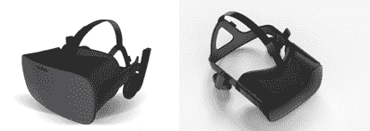

以下是 Oculus Rift CV1 的特点：

+   **屏幕类型**：AMOLED

+   **分辨率**：每只眼睛 1080 x 1200

+   **视野**：~110⁰

+   **头部跟踪**：IMU（指南针、加速计、陀螺仪），红外光学跟踪

最低推荐的 PC 规格如下：

+   **GPU**：NVIDIA GeForce GTX 970 或 AMD Radeon R9 290

+   **CPU**：Intel i5-4590 或 AMD FX 8350

+   **RAM**：8 GB

+   **操作系统**：Windows 7

# HTC Vive

可以说是目前最受欢迎的头戴式显示器，HTC Vive 是由 HTC（一家智能手机和平板电脑制造商）和 Valve 公司（一家以 Steam 游戏平台闻名的游戏公司）共同创建的。与 Oculus Rift 直接比较，HTC Vive 在设计上有许多相似之处，但在许多开发人员看来，略有不同之处使 HTC Vive 成为更优秀的硬件：

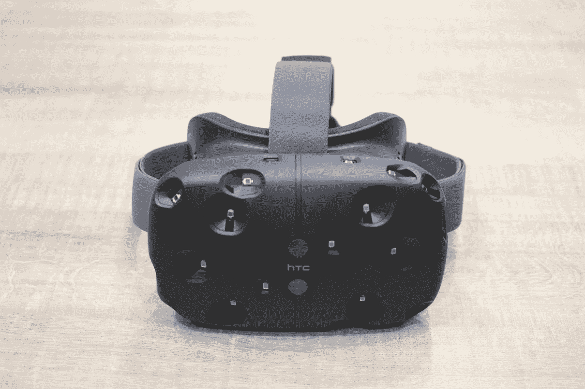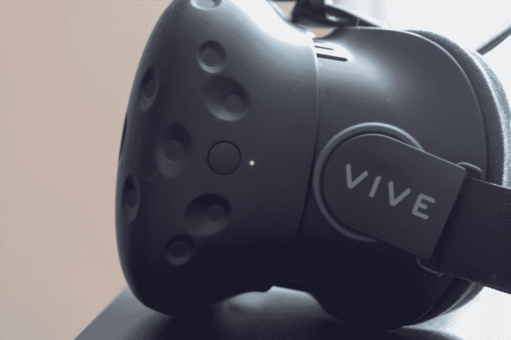

以下是 HTC Vive 的特点：

+   **屏幕类型**：AMOLED

+   **分辨率**：每只眼睛 1080 x 1200

+   **视野**：110⁰

+   **头部跟踪**：IMU（指南针、加速计、陀螺仪），2 个红外基站

最低推荐的 PC 规格如下：

+   **GPU**：NVIDIA GeForce GTX 970 或 AMD Radeon R9 290

+   **CPU**：Intel i5-4590 或 AMD FX 8350

+   **RAM**：4 GB

+   **操作系统**：Windows 7，Linux

# 开源虚拟现实（OSVR）开发套件

另一个非常有趣的硬件选择是由雷蛇和 Sensics 开发的 OSVR 套件。 OSVR 的独特之处在于它是一个开放许可、非专有硬件平台和生态系统。这使得开发人员在设计其 AR/VR 体验时有很大的自由度。OSVR 也是一个软件框架，我们很快会介绍。该框架与硬件一样，是开放许可的，旨在跨平台设计：

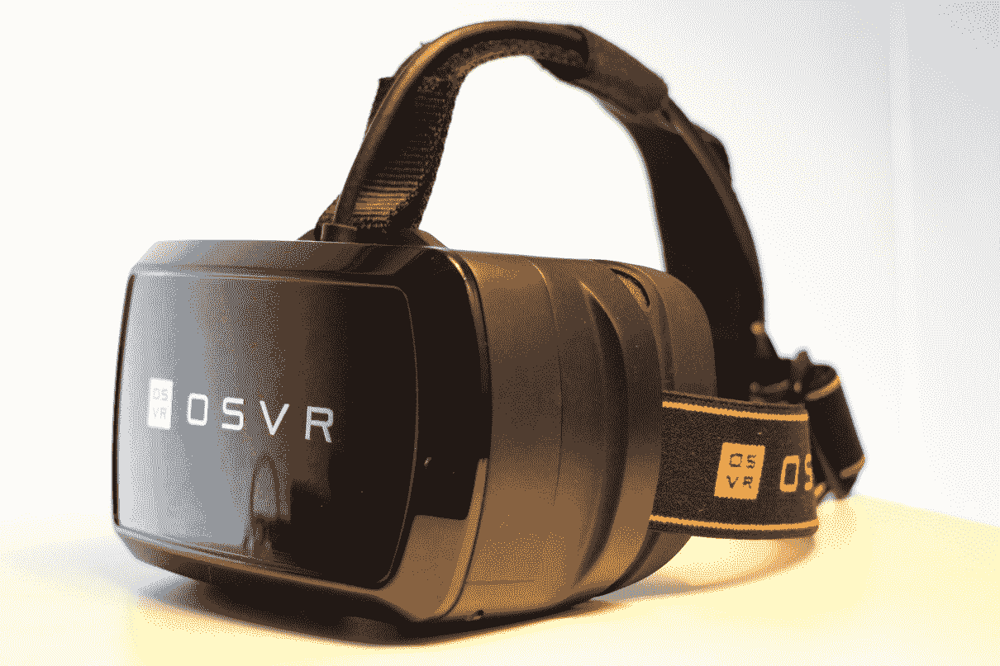

以下是 OSVR 的特点：

+   屏幕类型：AMOLED

+   **分辨率**：每只眼睛 960 x 1080

+   **视野**：100⁰

+   **头部跟踪**：IMU（指南针、加速计、陀螺仪），红外光学跟踪

最低推荐的 PC 规格如下：

+   **GPU**：NVIDIA GeForce GTX 970 或 AMD Radeon R9 290

+   **CPU**：Intel i5-4590 或 AMD FX 8350

+   **RAM**：4 GB

+   **操作系统**：跨平台支持

# 索尼 PlayStation VR

最初被称为**Project Morpheus**，索尼 PlayStation VR 是索尼公司进入 VR 领域的产品。与此列表中的其他头戴式显示器不同，索尼 PlayStation VR 头戴式显示器不是由 PC 驱动，而是连接到索尼 PlayStation 4 游戏主机。通过使用 PS4 作为其平台，索尼 PlayStation VR 头戴式显示器有 3000 多万的游戏主机用户：

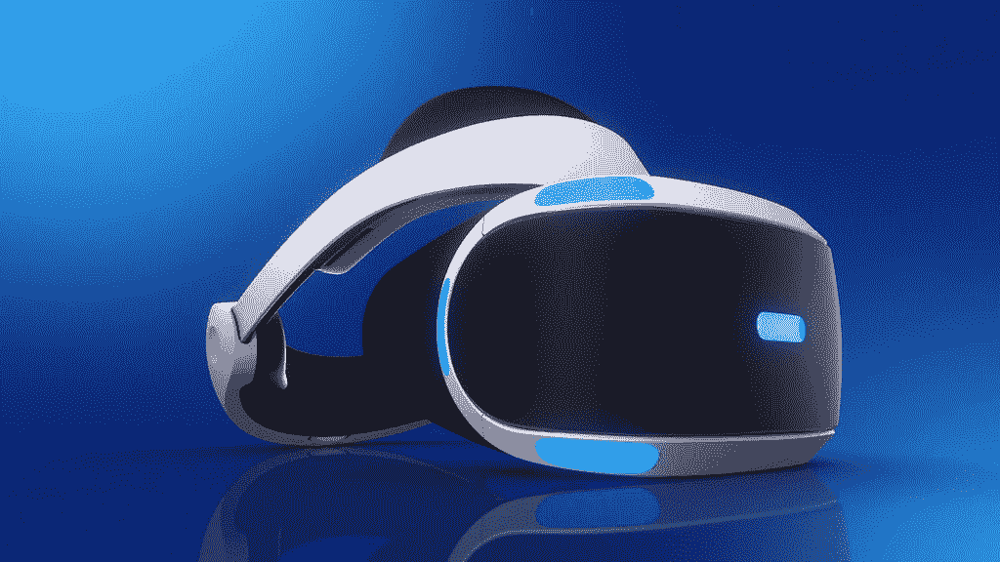

以下是索尼 PlayStation VR 的特点：

+   **屏幕类型**：AMOLED

+   **分辨率**：每只眼睛 960 x 1080

+   **视野**：~100⁰

+   **头部跟踪**：IMU（指南针、加速计、陀螺仪），红外光学跟踪

+   **控制台硬件**：索尼 PlayStation 4

# Windows Mixed Reality 头戴式显示器

最新进入 VR 硬件领域的是 Windows Mixed Reality 启用的一组头戴式显示器。虽然不是单一的头戴式显示器设计，但 Windows Mixed Reality 具有一套规格和软件支持，可以从 Windows 10 桌面实现 VR。被称为**混合现实**（**MR**），这些头戴式显示器的独特功能是其内置的空间感知或房间感知。其他头戴式显示器，如 Oculus Rift 和 HTC Vive，支持类似的功能，但与 Windows MR 设备不同，它们需要额外的硬件来支持跟踪。这种缺乏额外硬件意味着 Windows MR 头戴式显示器应该更容易设置，并有可能使 PC 供电的 VR 体验更加便携：

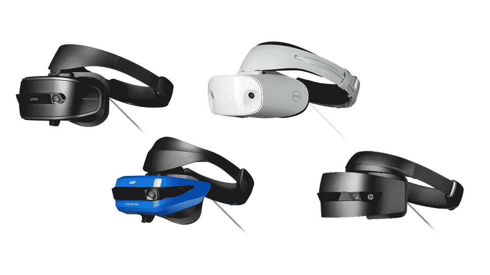

以下是 Windows MR 头戴式显示器的特点：

+   **屏幕类型**：各种

+   **分辨率**：各种

+   **视野**：各种

+   **头部跟踪**：基于头戴式内部 9DoF 追踪系统

最低推荐的 PC 规格如下：

+   **GPU**：NVIDIA GeForce GTX 960，AMD Radeon RX 460 或集成的 Intel HD Graphics 620

+   **CPU**：Intel i5-4590 或 AMD FX 8350

+   **内存**：8 GB

+   **操作系统**：Windows 10

# VR 渲染概念

从渲染的角度来看 VR，很快就会发现 VR 提出了一些独特的挑战。这部分是由于需要达到一些必要的性能基准和当前渲染硬件的限制。在渲染 VR 内容时，需要以比标准高清更高的分辨率进行渲染，通常是两倍或更多。渲染还需要非常快速，每只眼睛的帧率达到 90 帧或更高是基准。这，再加上抗锯齿和采样技术的使用，意味着渲染 VR 场景需要比以 1080p 分辨率以 60 帧每秒运行的标准游戏多五倍的计算能力。在接下来的章节中，我们将介绍在渲染 VR 内容时的一些关键区别，并涉及一些你可以实施以保持性能的概念。

# 使用视锥体

在开发 VR 就绪引擎时最大的区别在于理解如何在处理多个视点时构建适当的、裁剪的视锥体。在典型的非 VR 游戏中，你有一个单一的视点（摄像头），从中创建一个视锥体。如果需要完整的复习，请参考本书早些时候的内容，但这个视锥体决定了将被渲染并最终显示在屏幕上给用户的内容。以下是一个典型视锥体的图示：

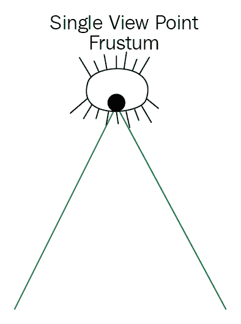

在 VR 渲染时，每只眼睛至少有一个视锥体，通常显示在单个头戴式显示器上，意味着在单个屏幕上显示一对图像，从而产生深度的错觉。通常这些图像描绘了场景的左眼和右眼视图。这意味着我们必须考虑两只眼睛的位置，并通过结合它们来产生最终的渲染视锥体。以下是这些视锥体的图示：

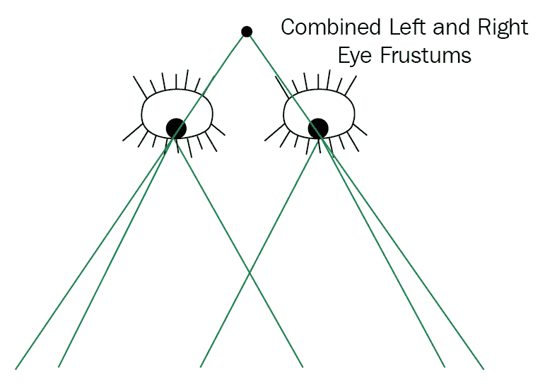

当创建一个结合了左右眼视锥体的单个视锥体时，实际上是非常容易的。如下图所示，你需要将新视锥体的顶点放在两只眼睛之间并略微向后移动。然后移动近裁剪平面的位置，使其与任一眼睛视锥体的裁剪平面对齐。这对于最终的显示**视锥体剔除**是很重要的。

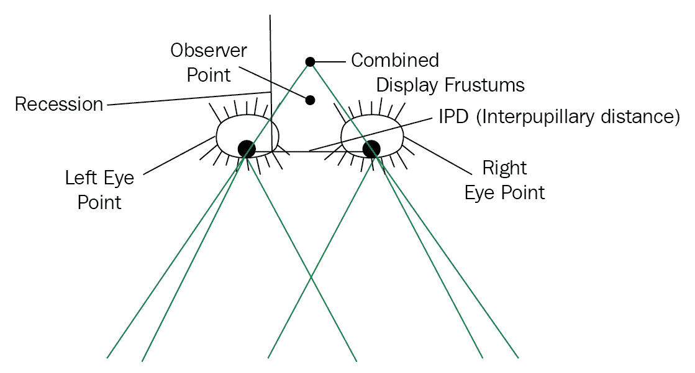

你可以使用一些简单的数学计算来计算这个视锥体，使用**瞳距**（**IPD**）来演示，正如 Oculus Rift 团队的 Cass Everitt 在以下图示中所展示的：

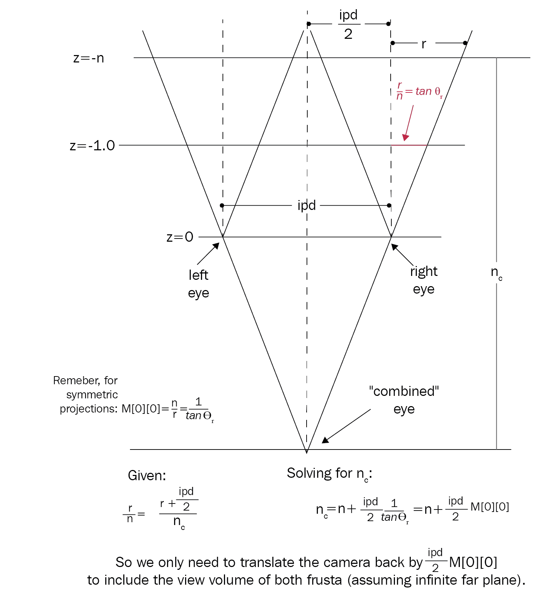

我们也可以通过简单地对共享眼睛视锥体的顶部和底部平面进行剔除来简化这个过程。虽然在技术上并不形成完美的视锥体，但使用一个测试单个平面的剔除算法将产生期望的效果。

好消息是大部分可以被抽象化，而且在许多头戴式显示器 SDK 中都有方法来帮助你。然而，重要的是要理解在非 VR 场景渲染中，视锥体的使用方式与 VR 中的不同。

# 提高渲染性能

当使用单个摄像头和视点时，就像大多数非 VR 游戏一样，我们可以简单地将渲染过程视为引擎内的一个步骤。但是当使用多个视点时，情况就不同了。当然，我们可以将每个视点视为一个单独的渲染任务，依次处理，但这会导致渲染速度慢。

如前一节所示，每只眼睛看到的内容有很大的重叠。这为我们提供了通过共享和重用数据来优化我们的渲染过程的绝佳机会。为此，我们可以实现**数据上下文**的概念。使用这个概念，我们可以对哪些元素是唯一适用于单只眼睛进行分类，哪些元素可以共享进行分类。让我们看看这些数据上下文以及如何使用它们来加快我们的渲染速度：

+   **帧上下文**：简而言之，帧上下文用于任何需要被渲染且与视角无关的元素。这将包括诸如天空盒、全局反射、水纹理等元素。任何可以在视点之间共享的东西都可以放在这个上下文中。

+   **眼睛上下文**：这是不能在视点之间共享的元素的上下文。这将包括在渲染时需要立体视差的任何元素。我们还可以在这个上下文中存储每只眼睛的数据，这些数据将在我们的着色器计算中使用。

通过将数据简单地分成不同的上下文，我们可以重新组织我们的渲染过程，使其看起来类似于以下内容：

```cpp
RenderScene(Frame f)
{
  ProcessFrame(f); //Handle any needed globally shared calculations
  RenderFrame(f); //Render any globally shared elements
  for(int i=0; i<numview points; i++) //numview points would be 2 for                            stereo
    {
      ProcessEye(i, f); //Handle any per eye needed calculations
      RenderEye(i, f); //Render any per eye elements
    }
}
```

虽然这在表面上看起来很基本，但这是一个非常强大的概念。通过以这种方式分离渲染并共享我们可以的内容，我们大大提高了整体渲染器的性能。这是最简单的优化之一，但回报却很大。我们还可以将这种方法应用到如何设置我们的着色器统一变量上，将它们分成上下文片段：

```cpp
layout (binding = 0) uniform FrameContext
{
  Mat4x4 location; //modelview
  Mat4x4 projection;
  Vec3 viewerPosition;
  Vec3 position;
}frame;
layout (binding = 1) uniform EyeContext
{
  Mat4x4 location; //modelview
  Mat4x4 projection;
  Vec3 position;
}eye;
```

从概念上讲，数据的这种分割非常有效，每个数据片段都可以在不同的时间更新，从而提供更好的性能。

这基本上描述了以高层次处理多个视点的 VR 渲染的高效方法。如前所述，在开发中，与硬件和管道连接相关的大部分设置都在我们开发的 SDK 中被抽象掉了。在下一节中，我们将看一些这些 SDK，并通过查看在我们的示例引擎中实现 SDK 来结束本章。

# 头显 SDK

有许多 SDK 可用于实现各种头显和支持硬件，大多数制造商以某种形式提供自己的 SDK。在接下来的章节中，我们将快速查看开发 PC 驱动 HMD VR 体验时最常用的三个 SDK：

+   Oculus PC SDK（[`developer.oculus.com/downloads/package/oculus-sdk-for-windows/`](https://developer.oculus.com/downloads/package/oculus-sdk-for-windows/)）：此 SDK 专为在 C++中开发 Oculus Rift HMD 体验和游戏而创建。核心 SDK 提供了开发人员访问渲染、跟踪、输入和其他核心硬件功能所需的一切。核心 SDK 由其他支持音频、平台和头像的 SDK 支持。

+   **OpenVR**（[`github.com/ValveSoftware/openvr`](https://github.com/ValveSoftware/openvr)）：这是由 Valve 公司提供的默认 API 和 SteamVR 平台的运行时的 SDK。这也是 HTC Vive HMD 开发的默认 SDK，但设计为支持多个供应商。这意味着您可以在不知道连接了哪个 HMD 的情况下，针对多个 HMD 进行开发。这将是我们在示例引擎中实现的 SDK。

+   **OSVR**（[`osvr.github.io/`](http://osvr.github.io/)）：OSVR SDK，正如其名称所示，是一个设计用于与多个硬件供应商配合使用的开源 SDK。这个 SDK 是同名头显 OSVR 的默认 SDK。该项目由雷蛇和 Sensics 领导，许多大型游戏合作伙伴也加入了。OSVR SDK 可用于 Microsoft Windows、Linux、Android 和 macOS。

# 实现 VR 支持

与本书中讨论过的许多其他系统一样，从头开始实现 VR 支持可能是一个非常具有挑战性和耗时的过程。然而，就像其他系统一样，存在着可以帮助简化和简化过程的库和 SDK。在下一节中，我们将介绍如何使用 Valve 公司提供的 OpenVR SDK 向我们的示例引擎添加 VR 渲染支持。我们将只完整地介绍主要要点。要查看每种方法的更完整概述，请参考示例代码中的注释，并访问 OpenVR SDK Wiki 获取更多 SDK 特定信息（[`github.com/ValveSoftware/openvr/wiki`](https://github.com/ValveSoftware/openvr/wiki)）。

# 验证 HMD

首先，我们需要做一些事情来设置我们的硬件和环境。我们需要首先测试一下计算机上是否连接了头显。然后我们需要检查 OpenVR 运行时是否已安装。然后我们可以初始化硬件，最后询问一些关于其功能的问题。为此，我们将向我们的`GameplayScreen`类添加一些代码；为简洁起见，我们将跳过一些部分。完整的代码可以在代码存储库的`Chapter11`文件夹中的示例项目中找到。

让我们首先检查一下计算机是否连接了 VR 头显，以及 OpenVR（SteamVR）运行时是否已安装。为此，我们将在`Build()`方法中添加以下内容：

```cpp
void GameplayScreen::Build()
{
  if (!vr::VR_IsHmdPresent())
   {
      throw BookEngine::Exception("No HMD attached to the system");
   }
  if (!vr::VR_IsRuntimeInstalled())
   {
      throw BookEngine::Exception("OpenVR Runtime not found");
   }
}
```

在这里，如果这些检查中的任何一个失败，我们会抛出一个异常来处理和记录。现在我们知道我们有一些硬件和所需的软件，我们可以初始化框架。为此，我们调用`InitVR`函数：

```cpp
InitVR();
```

`InitVR`函数的主要目的是依次调用 OpenVR SDK 的`VR_Init`方法。为了做到这一点，它需要首先创建和设置一个错误处理程序。它还需要我们定义这将是什么类型的应用程序。在我们的情况下，我们声明这将是一个场景应用程序，`vr::VRApplication_Scene`。这意味着我们正在创建一个将绘制环境的 3D 应用程序。还有其他选项，比如创建实用程序或仅覆盖应用程序。最后，一旦 HMD 初始化完成，没有错误，我们要求头显告诉我们一些关于它自身的信息。我们使用`GetTrackedDeviceString`方法来做到这一点，我们很快就会看到。整个`InitVR`方法看起来像下面这样：

```cpp
void GameplayScreen::InitVR()
{
   vr::EVRInitError err = vr::VRInitError_None;
   m_hmd = vr::VR_Init(&err, vr::VRApplication_Scene);
   if (err != vr::VRInitError_None)
   {
     HandleVRError(err);
   }
   std::cout << GetTrackedDeviceString(m_hmd,
   vr::k_unTrackedDeviceIndex_Hmd,vr::Prop_TrackingSystemName_String)
   << std::endl;
   std::clog << GetTrackedDeviceString(m_hmd,                  vr::k_unTrackedDeviceIndex_Hmd, vr::Prop_SerialNumber_String)<<        std::endl;
}
```

`HandleVRError`方法只是一个简单的辅助方法，它接受传入的错误并抛出一个要处理和记录的错误，同时提供错误的英文翻译。以下是该方法的全部内容：

```cpp
void GameplayScreen::HandleVRError(vr::EVRInitError err)
{
  throw BookEngine::Exception(vr::VR_GetVRInitErrorAsEnglishDescription(err));
}
```

`InitVR`函数调用的另一个方法是`GetTrackedDeviceString`函数。这是 OpenVR 示例代码的一部分，允许我们返回有关附加设备的一些信息的函数。在我们的情况下，我们要求返回附加设备的系统名称和序列号属性（如果可用）：

```cpp
std::string GameplayScreen::GetTrackedDeviceString(vr::IVRSystem * pHmd, vr::TrackedDeviceIndex_t unDevice, vr::TrackedDeviceProperty prop, vr::TrackedPropertyError * peError)
{
  uint32_t unRequiredBufferLen = pHmd-                  >GetStringTrackedDeviceProperty(unDevice, prop, NULL, 0, peError);
    if (unRequiredBufferLen == 0)
      return "";

   char *pchBuffer = new char[unRequiredBufferLen];
   unRequiredBufferLen = pHmd->GetStringTrackedDeviceProperty(unDevice,   prop, pchBuffer, unRequiredBufferLen, peError);
   std::string sResult = pchBuffer;
   delete[] pchBuffer;
   return sResult;
}
```

最后，在我们的`Build`方法中，现在我们已经完成了初始化步骤，我们可以通过询问系统`VRCompositor`函数是否设置为 NULL 以外的值来检查一切是否顺利。如果是，那意味着一切准备就绪，我们可以询问我们的 HMD 希望我们的渲染目标大小是多少，并在控制台窗口中显示为字符串输出：

```cpp
if (!vr::VRCompositor())
 {
   throw BookEngine::Exception("Unable to initialize VR compositor!\n ");
 }
m_hmd->GetRecommendedRenderTargetSize(&m_VRWidth, &m_VRHeight);

std::cout << "Initialized HMD with suggested render target size : " << m_VRWidth << "x" << m_VRHeight << std::endl;
}
```

我们需要做的最后一件事是确保在程序完成时进行清理。在`GamplayScreen`的`Destroy`方法中，我们首先检查 HMD 是否已初始化；如果是，我们调用`VR_Shutdown`方法并将`m_hmd`变量设置为 NULL。在应用程序关闭时调用`VR_Shutdown`非常重要，因为如果不这样做，OpenVR/SteamVR 可能会挂起，并且可能需要重新启动才能再次运行：

```cpp
void GameplayScreen::Destroy()
{
   if (m_hmd)
    {
       vr::VR_Shutdown();
       m_hmd = NULL;
    }
}
```

现在，如果我们继续运行这个示例，在控制台窗口中，您应该看到类似以下的内容：

**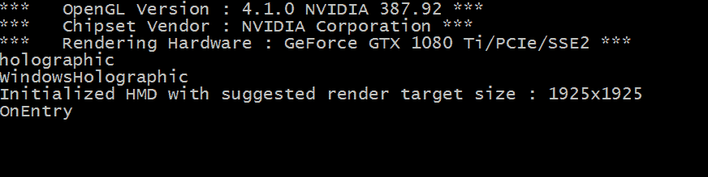**

# 渲染

现在我们已经设置好了 HMD 并与我们的引擎进行了通信，下一步是对其进行渲染。实际上，这个过程并不复杂；如前所述，SDK 已经为我们处理了很多事情。为了尽可能简单，这个示例只是一个简单的渲染示例。我们不处理头部跟踪或输入，我们只是简单地在每只眼睛中显示不同的颜色。与之前的示例一样，为了节省时间和空间，我们只会涵盖重要的元素，让您掌握概念。完整的代码可以在代码库的`Chapter11`文件夹中的示例项目中找到。

正如我们之前讨论的那样，在立体视觉渲染时，通常会渲染一个被分成两半的单个显示器。然后我们将适当的数据传递给每半部分，取决于在该眼睛中可见的内容。回顾一下*使用视锥*部分，了解为什么会这样。这归结为我们需要为每只眼睛创建一个帧缓冲。为此，我们有一个`RenderTarget`类，它创建帧缓冲，附加纹理，最后创建所需的视口（即总显示宽度的一半）。为了节省空间，我不会打印出`RenderTarget`类；它非常简单，我们以前已经见过。相反，让我们继续设置和实际处理在 HMD 中显示场景的函数。首先，我们需要将我们的`RenderTarget`连接到我们的纹理，并且为了正确实现清除和设置缓冲区。为此，我们将以下内容添加到`GameplayScreen`的`OnEntry`方法中：

```cpp
BasicRenderTarget leftRT(1, vrApp.rtWidth, vrApp.rtHeight);
BasicRenderTarget rightRT(1, vrApp.rtWidth, vrApp.rtHeight);

leftRT.Init(leftEyeTexture.name);
rightRT.Init(rightEyeTexture.name);

glClearColor(1.0f, 0.0f, 0.0f, 1.0f);
leftRT.fbo.Bind(GL_FRAMEBUFFER);
glClear(GL_COLOR_BUFFER_BIT | GL_DEPTH_BUFFER_BIT);

if (glCheckFramebufferStatus(GL_FRAMEBUFFER) != GL_FRAMEBUFFER_COMPLETE)
  {
    throw std::runtime_error("left rt incomplete");
  }
glClearColor(0.0f, 1.0f, 0.0f, 1.0f);
rightRT.fbo.Bind(GL_FRAMEBUFFER);
glClear(GL_COLOR_BUFFER_BIT | GL_DEPTH_BUFFER_BIT);
if (glCheckFramebufferStatus(GL_FRAMEBUFFER) != GL_FRAMEBUFFER_COMPLETE)
  {
    throw std::runtime_error("right rt incomplete");
  }
glBindFramebuffer(GL_FRAMEBUFFER, 0);

glClearColor (0.0f, 0.0f, 1.0f, 1.0f);
```

我不会逐行讲解之前的代码，因为我们以前已经看过了。现在，我们的缓冲区和纹理已经设置好，我们可以继续添加绘图调用了。

OpenVR SDK 提供了处理显示 VR 场景复杂部分所需的方法。大部分这些复杂工作是由合成器系统完成的。正如 Valve 所说的那样，*“合成器通过处理失真、预测、同步和其他细微问题，简化了向用户显示图像的过程，这些问题可能对于获得良好的 VR 体验而言是一个挑战。”*

为了连接到合成器子系统，我们创建了一个名为`SubmitFrames`的简单方法。这个方法接受三个参数——每只眼睛的纹理和一个布尔值，用于指定颜色空间是否应该是`线性`。在撰写本文时，我们总是希望指定颜色空间应该是`Gamma`，适用于`OpenGL`。在方法内部，我们获取希望渲染到的设备，设置颜色空间，转换纹理，然后将这些纹理提交给`VRCompositor`，然后在幕后处理将纹理显示到正确的眼睛上。整个方法看起来像下面这样：

```cpp
void GameplayScreen::SubmitFrames(GLint leftEyeTex, GLint rightEyeTex, bool linear = false)
{
 if (!m_hmd)
  {
    throw std::runtime_error("Error : presenting frames when VR system handle is NULL");
  }
  vr::TrackedDevicePose_t trackedDevicePose[vr::k_unMaxTrackedDeviceCount];
  vr::VRCompositor()->WaitGetPoses(trackedDevicePose,        vr::k_unMaxTrackedDeviceCount, nullptr, 0);

  vr::EColorSpace colorSpace = linear ? vr::ColorSpace_Linear :    vr::ColorSpace_Gamma;

  vr::Texture_t leftEyeTexture = { (void*)leftEyeTex,    vr::TextureType_OpenGL, colorSpace };
  vr::Texture_t rightEyeTexture = { (void*)rightEyeTex,   vr::TextureType_OpenGL, colorSpace };

  vr::VRCompositor()->Submit(vr::Eye_Left, &leftEyeTexture);
  vr::VRCompositor()->Submit(vr::Eye_Right, &rightEyeTexture);

  vr::VRCompositor()->PostPresentHandoff();
}
```

有了我们的`SubmitFrames`函数，我们可以在`GameplayScreen`更新中调用该方法，就在`glClear`函数调用之后：

```cpp
…
glClear(GL_COLOR_BUFFER_BIT);
SubmitFrames(leftEyeTexture.id, rightEyeTexture.id);
```

如果您现在运行示例项目，并且已经安装了必要的 SteamVR 框架，您应该会看到头戴显示器的每只眼睛显示不同的颜色。

# 总结

虽然这只是对 VR 开发世界的快速介绍，但它应该为您的体验创意提供了一个很好的测试基础。我们学习了如何处理多个视图截头体，了解了各种硬件选项，最后看了一下我们如何使用 OpenVR SDK 为我们的示例引擎添加 VR 支持。随着硬件的进步，VR 将继续获得动力，并将继续向新领域推进。全面了解 VR 渲染的工作原理将为您的开发知识储备提供新的深度水平。
