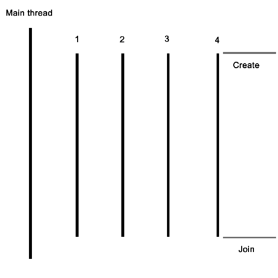
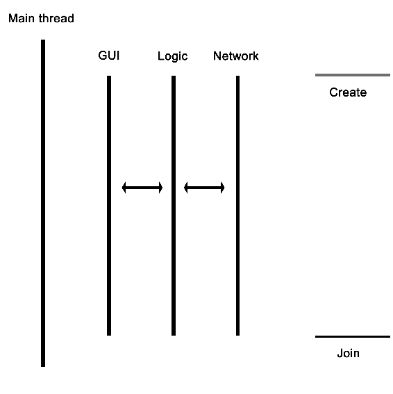

# 重新审视多线程

如果您正在阅读本书，很可能您已经在 C++中进行了一些多线程编程，或者可能是其他语言。本章旨在从 C++的角度纯粹回顾这个主题，通过一个基本的多线程应用程序，同时也涵盖了本书中将要使用的工具。在本章结束时，您将拥有继续阅读后续章节所需的所有知识和信息。

本章涵盖的主题包括以下内容：

+   使用本地 API 在 C++中进行基本的多线程

+   编写基本的 makefile 和使用 GCC/MinGW

+   使用`make`编译程序并在命令行上执行

# 入门

在本书的过程中，我们将假设使用基于 GCC 的工具链（在 Windows 上是 GCC 或 MinGW）。如果您希望使用其他工具链（如 clang、MSVC、ICC 等），请查阅这些工具链提供的文档以获取兼容的命令。

为了编译本书提供的示例，将使用 makefile。对于不熟悉 makefile 的人来说，它们是一种简单但功能强大的基于文本的格式，用于与`make`工具一起自动化构建任务，包括编译源代码和调整构建环境。`make`于 1977 年首次发布，至今仍然是最受欢迎的构建自动化工具之一。

假设您熟悉命令行（Bash 或等效），并且建议使用 MSYS2（Windows 上的 Bash）。

# 多线程应用程序

在其最基本的形式中，多线程应用程序由一个具有两个或多个线程的进程组成。这些线程可以以各种方式使用；例如，通过使用一个线程来处理每个传入事件或事件类型，使进程能够以异步方式响应事件，或者通过将工作分配到多个线程中来加快数据处理速度。

对事件的异步响应的示例包括在单独的线程上处理图形用户界面（GUI）和网络事件，以便两种类型的事件都不必等待对方，也不会阻止事件及时得到响应。通常，一个线程执行一个任务，比如处理 GUI 或网络事件，或者处理数据。

对于这个基本示例，应用程序将以一个单一线程开始，然后启动多个线程，并等待它们完成。每个新线程将在完成之前执行自己的任务。



让我们从应用程序的包含和全局变量开始：

```cpp
#include <iostream>
#include <thread>
#include <mutex>
#include <vector>
#include <random>

using namespace std;

// --- Globals
mutex values_mtx;
mutex cout_mtx;
vector<int> values;

```

I/O 流和向量头文件对于任何使用过 C++的人来说应该是很熟悉的：前者用于标准输出（`cout`），而向量用于存储一系列的值。

`c++11`中的 random 头文件是新的，顾名思义，它提供了用于生成随机序列的类和方法。我们在这里使用它来使我们的线程做一些有趣的事情。

最后，线程和互斥锁的包含是我们多线程应用程序的核心；它们提供了创建线程的基本手段，并允许它们之间进行线程安全的交互。

接下来，我们创建两个互斥锁：一个用于全局向量，一个用于`cout`，因为后者不是线程安全的。

接下来，我们创建主函数如下：

```cpp
int main() {
    values.push_back(42);

```

我们将一个固定值推送到向量实例中；这个值将在我们稍后创建的线程中使用：

```cpp
    thread tr1(threadFnc, 1);
    thread tr2(threadFnc, 2);
    thread tr3(threadFnc, 3);
    thread tr4(threadFnc, 4);

```

我们创建新线程，并为它们提供要使用的方法的名称，同时传递任何参数--在这种情况下，只是一个整数：

```cpp

    tr1.join();
    tr2.join();
    tr3.join();
    tr4.join();

```

接下来，我们通过在每个线程实例上调用`join()`来等待每个线程完成：

```cpp

    cout << "Input: " << values[0] << ", Result 1: " << values[1] << ", Result 2: " << values[2] << ", Result 3: " << values[3] << ", Result 4: " << values[4] << "\n";

    return 1;
}

```

在这一点上，我们期望每个线程都已经完成了它应该做的事情，并将结果添加到向量中，然后我们读取并向用户显示。

当然，这几乎没有显示应用程序中真正发生的事情，主要只是使用线程的基本简单性。接下来，让我们看看我们传递给每个线程实例的方法内部发生了什么：

```cpp
void threadFnc(int tid) {
    cout_mtx.lock();
    cout << "Starting thread " << tid << ".\n";
    cout_mtx.unlock();

```

在前面的代码中，我们可以看到传递给线程方法的整数参数是线程标识符。为了指示线程正在启动，输出包含线程标识符的消息。由于我们在这里使用了`非线程安全`方法，我们使用`cout_mtx`互斥实例来安全地执行此操作，确保只有一个线程可以在任何时候写入`cout`：

```cpp
    values_mtx.lock();
    int val = values[0];
    values_mtx.unlock();

```

当我们获得向量中的初始值集时，我们将其复制到一个局部变量中，以便我们可以立即释放向量的互斥锁，使其他线程可以使用该向量：

```cpp
    int rval = randGen(0, 10);
    val += rval;

```

最后两行包含了线程创建的本质：它们获取初始值，并向其添加一个随机生成的值。`randGen()`方法接受两个参数，定义返回值的范围：

```cpp

    cout_mtx.lock();
    cout << "Thread " << tid << " adding " << rval << ". New value: " << val << ".\n";
    cout_mtx.unlock();

    values_mtx.lock();
    values.push_back(val);
    values_mtx.unlock();
}

```

最后，我们（安全地）记录一条消息，通知用户此操作的结果，然后将新值添加到向量中。在这两种情况下，我们使用相应的互斥锁来确保在使用其他线程访问资源时不会发生重叠。

一旦方法达到这一点，包含它的线程将终止，主线程将少一个要等待重新加入的线程。线程的加入基本上意味着它停止存在，通常会将返回值传递给创建线程的线程。这可以显式发生，主线程等待子线程完成，或者在后台进行。

最后，让我们来看看`randGen()`方法。在这里，我们可以看到一些多线程特定的添加：

```cpp
int randGen(const int& min, const int& max) {
    static thread_local mt19937 generator(hash<thread::id>()(this_thread::get_id()));
    uniform_int_distribution<int> distribution(min, max);
    return distribution(generator)
}

```

前面的方法接受一个最小值和最大值，如前所述，限制了此方法可以返回的随机数的范围。在其核心，它使用基于 mt19937 的`generator`，它采用了一个具有 19937 位状态大小的 32 位**Mersenne Twister**算法。这对于大多数应用程序来说是一个常见且合适的选择。

这里需要注意的是`thread_local`关键字的使用。这意味着即使它被定义为静态变量，其范围也将被限制在使用它的线程中。因此，每个线程都将创建自己的`generator`实例，在 STL 中使用随机数 API 时这一点很重要。

内部线程标识符的哈希用作`generator`的种子。这确保每个线程都为其`generator`实例获得一个相当独特的种子，从而获得更好的随机数序列。

最后，我们使用提供的最小和最大限制创建一个新的`uniform_int_distribution`实例，并与`generator`实例一起使用它来生成我们返回的随机数。

# Makefile

为了编译前面描述的代码，可以使用 IDE，或者在命令行上输入命令。正如本章开头提到的，我们将在本书的示例中使用 makefile。这样做的重大优势是不必反复输入相同的广泛命令，并且它可以在支持`make`的任何系统上使用。

进一步的优点包括能够自动删除先前生成的工件，并且只编译那些已更改的源文件，以及对构建步骤的详细控制。

这个示例的 makefile 相当基本：

```cpp
GCC := g++

OUTPUT := ch01_mt_example
SOURCES := $(wildcard *.cpp)
CCFLAGS := -std=c++11 -pthread

all: $(OUTPUT)

$(OUTPUT):
    $(GCC) -o $(OUTPUT) $(CCFLAGS) $(SOURCES)

clean:
    rm $(OUTPUT)

.PHONY: all

```

从上到下，我们首先定义我们将使用的编译器（`g++`），设置输出二进制文件的名称（在 Windows 上的`.exe`扩展名将自动添加后缀），然后收集源文件和任何重要的编译器标志。

通配符功能允许一次性收集与其后的字符串匹配的所有文件的名称，而无需单独定义文件夹中每个源文件的名称。

对于编译器标志，我们只对启用`c++11`功能感兴趣，对于这一点，GCC 仍然需要提供这个编译器标志。

对于`all`方法，我们只需告诉`make`使用提供的信息运行`g++`。接下来，我们定义一个简单的清理方法，只需删除生成的二进制文件，最后，我们告诉`make`不要解释文件夹或文件夹中名为`all`的任何文件，而是使用带有`.PHONY`部分的内部方法。

当我们运行这个 makefile 时，我们看到以下命令行输出：

```cpp
$ make
g++ -o ch01_mt_example -std=c++11 ch01_mt_example.cpp

```

之后，在同一文件夹中找到一个名为`ch01_mt_example`（在 Windows 上附加了`.exe`扩展名）的可执行文件。执行此二进制文件将导致类似以下的命令行输出：

```cpp
$ ./ch01_mt_example.exe

Starting thread 1.

Thread 1 adding 8\. New value: 50.

Starting thread 2.

Thread 2 adding 2\. New value: 44.

Starting thread 3.

Starting thread 4.

Thread 3 adding 0\. New value: 42.

Thread 4 adding 8\. New value: 50.

Input: 42, Result 1: 50, Result 2: 44, Result 3: 42, Result 4: 50

```

在这里可以看到线程及其输出的异步性质。虽然线程`1`和`2`似乎是同步运行的，按顺序启动和退出，但线程`3`和`4`显然是异步运行的，因为它们在记录其动作之前同时启动。因此，在长时间运行的线程中，几乎不可能确定日志输出和结果将以何种顺序返回。

虽然我们使用一个简单的向量来收集线程的结果，但无法确定`Result 1`是否真的来自我们在开始时分配 ID 为 1 的线程。如果我们需要这些信息，我们需要通过使用包含有关处理线程或类似信息的信息结构来扩展我们返回的数据。

例如，可以像这样使用`struct`：

```cpp
struct result {
    int tid;
    int result;
};

```

然后，向量将被更改为包含结果实例而不是整数实例。可以直接将初始整数值作为其参数之一传递给线程，或者通过其他方式传递。

# 其他应用程序

本章的示例主要适用于需要并行处理数据或任务的应用程序。对于前面提到的基于 GUI 的应用程序，具有业务逻辑和网络相关功能，启动所需线程的主应用程序的基本设置将保持不变。但是，每个线程都将是完全不同的方法，而不是每个线程都相同。

对于这种类型的应用程序，线程布局将如下所示：



如图所示，主线程将启动 GUI、网络和业务逻辑线程，后者将与网络线程通信以发送和接收数据。业务逻辑线程还将从 GUI 线程接收用户输入，并发送更新以在 GUI 上显示。

# 总结

在本章中，我们讨论了使用本机线程 API 在 C++中实现多线程应用程序的基础知识。我们看了如何让多个线程并行执行任务，并探讨了如何在多线程应用程序中正确使用 STL 中的随机数 API。

在下一章中，我们将讨论多线程是如何在硬件和操作系统中实现的。我们将看到这种实现如何根据处理器架构和操作系统而异，以及这如何影响我们的多线程应用程序。
