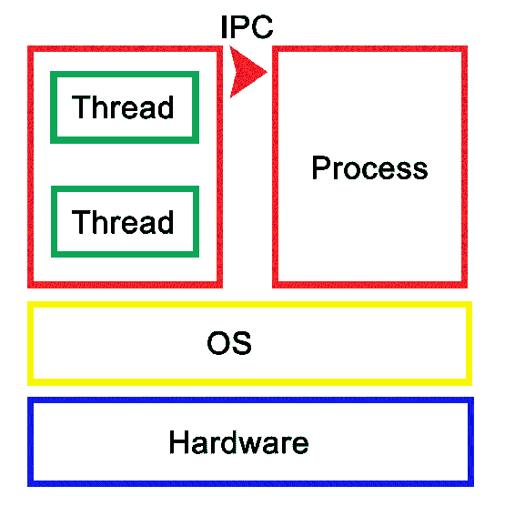
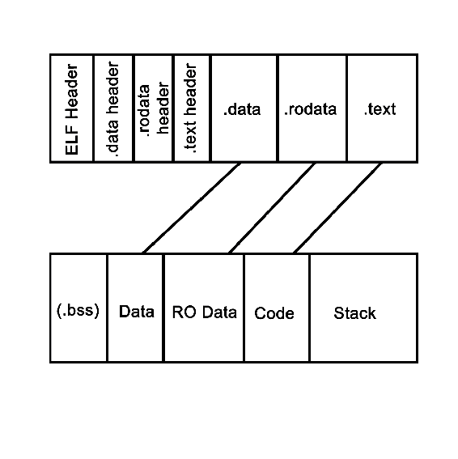
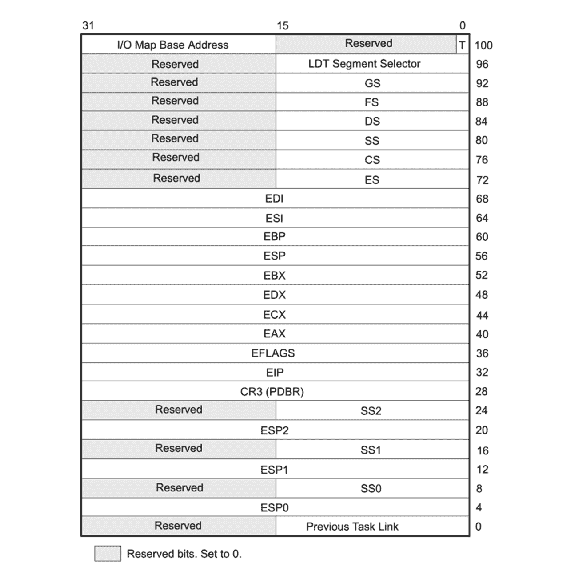
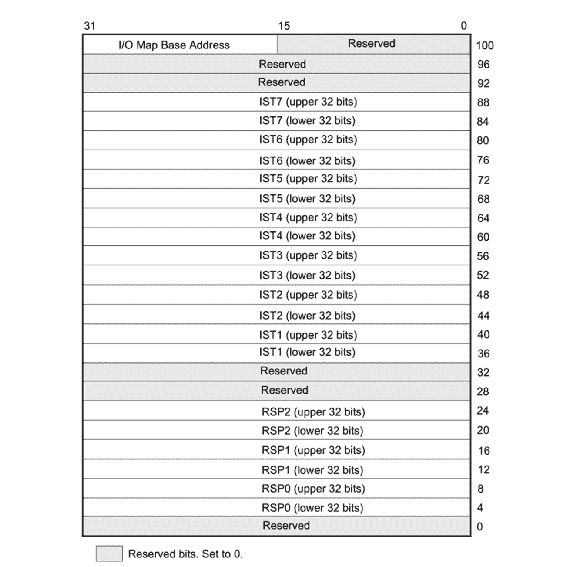
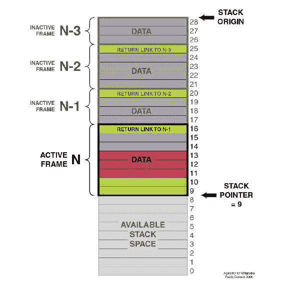
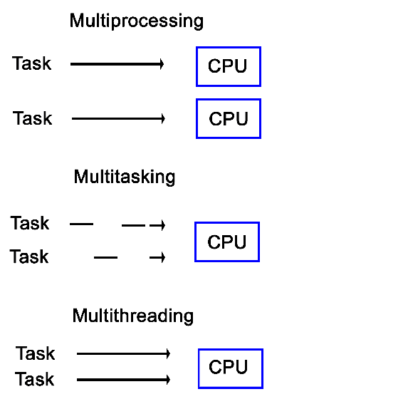
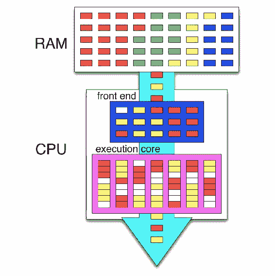
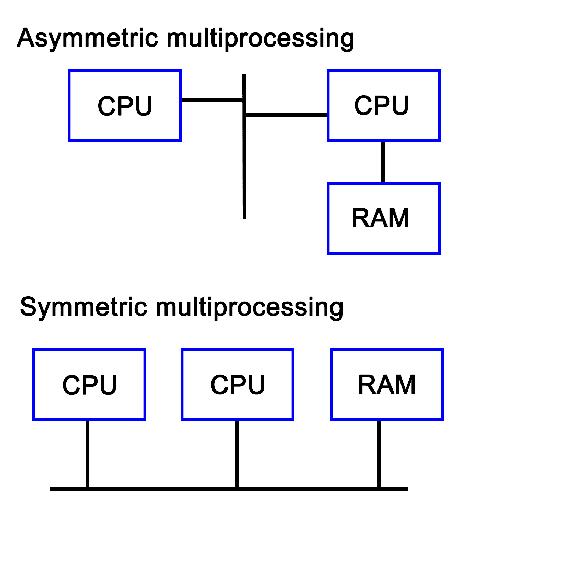
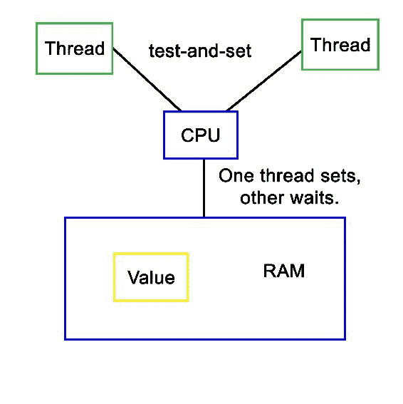

# 处理器和操作系统上的多线程实现

任何多线程应用程序的基础是由处理器硬件实现所需功能以及这些功能如何被操作系统转换为应用程序使用的 API 所形成的。了解这个基础对于开发对多线程应用程序的最佳实现方式至关重要。

本章将探讨多年来硬件和操作系统是如何演变到当前的实现和 API 的，展示了前一章的示例代码最终如何转换为对处理器和相关硬件的命令。

本章涵盖的主题包括以下内容：

+   为了支持多线程概念而发展的处理器硬件的演变

+   操作系统如何改变以使用这些硬件特性

+   各种架构中内存安全和内存模型背后的概念

+   操作系统之间各种进程和线程模型的差异

# 定义进程和线程

基本上，对于**操作系统**（**OS**）来说，一个进程由一个或多个线程组成，每个线程处理自己的状态和变量。可以将其视为分层配置，操作系统作为基础，为（用户）进程的运行提供支持。然后，每个进程由一个或多个线程组成。进程之间的通信由操作系统提供的**进程间通信**（**IPC**）来处理。

在图形视图中，这看起来像下面这样：



操作系统中的每个进程都有自己的状态，进程中的每个线程也有自己的状态，相对于该进程中的其他线程。虽然 IPC 允许进程之间进行通信，但线程可以以各种方式与进程内的其他线程进行通信，我们将在接下来的章节中更深入地探讨这些方式。这通常涉及线程之间的某种共享内存。

应用程序是从特定的可执行格式的二进制数据中加载的，例如，**可执行和可链接格式**（**ELF**），通常用于 Linux 和许多其他操作系统。对于 ELF 二进制文件，应该始终存在以下数量的部分：

+   `.bss`

+   `.data`

+   `.rodata`

+   `.text`

`.bss`部分基本上是分配未初始化的内存，包括空数组，因此在可执行文件中不占用任何空间，因为在可执行文件中存储纯零行是没有意义的。类似地，还有`.data`部分包含初始化数据。其中包括全局表、变量等。最后，`.rodata`部分类似于`.data`，但正如其名称所示，是只读的。其中包含硬编码的字符串等内容。

在`.text`部分，我们找到实际的应用程序指令（代码），这些指令将由处理器执行。整个内容将被操作系统加载，从而创建一个进程。这样的进程布局如下图所示：



这是从 ELF 格式二进制文件启动时进程的样子，尽管在内存中的最终格式在基本上任何操作系统中都大致相同，包括从 PE 格式二进制文件启动的 Windows 进程。二进制文件中的每个部分都加载到它们各自的部分中，BSS 部分分配给指定的大小。`.text`部分与其他部分一起加载，并且一旦完成，将执行其初始指令，从而启动进程。

在诸如 C++之类的系统语言中，可以看到在这样的进程中变量和其他程序状态信息是如何存储在堆栈（变量存在于作用域内）和堆（使用 new 运算符）中的。堆栈是内存的一部分（每个线程分配一个），其大小取决于操作系统及其配置。在创建新线程时，通常也可以通过编程方式设置堆栈大小。

在操作系统中，一个进程由一块内存地址组成，其大小由其内存指针的大小限制。对于 32 位操作系统，这将限制该块为 4GB。在这个虚拟内存空间中，操作系统分配了一个基本的堆栈和堆，两者都可以增长，直到所有内存地址都被耗尽，进程进一步尝试分配更多内存将被拒绝。

堆栈对操作系统和硬件都是一个概念。本质上，它是一组所谓的堆栈帧的集合，每个堆栈帧由与任务的执行框架相关的变量、指令和其他数据组成。

从硬件角度来看，堆栈是任务（x86）或进程状态（ARM）的一部分，这是处理器定义执行实例（程序或线程）的方式。这个硬件定义的实体包含了一个线程的整个状态。有关此内容的更多详细信息，请参见以下各节。

# x86（32 位和 64 位）中的任务

在 Intel IA-32 系统编程指南第 3A 卷中，任务定义如下：

“任务是处理器可以分派、执行和挂起的工作单元。它可以用于执行程序、任务或进程、操作系统服务实用程序、中断或异常处理程序，或内核或执行实用程序。”

“IA-32 架构提供了一种保存任务状态、分派任务执行和从一个任务切换到另一个任务的机制。在保护模式下，所有处理器执行都是在任务内部进行的。即使是简单的系统也必须定义至少一个任务。更复杂的系统可以使用处理器的任务管理设施来支持多任务应用程序。”

IA-32（Intel x86）手册中的这段摘录总结了硬件如何支持和实现对操作系统、进程以及这些进程之间的切换的支持。

重要的是要意识到，对于处理器来说，没有进程或线程这样的东西。它所知道的只是执行线程，定义为一系列指令。这些指令被加载到内存的某个地方，并且当前位置和变量数据（变量）的创建情况都在进程的数据部分中被跟踪，当应用程序在数据部分中执行时。

每个任务也在硬件定义的保护环中运行，操作系统的任务通常在环 0 上运行，用户任务在环 3 上运行。环 1 和 2 很少被使用，除非在 x86 架构的现代操作系统中有特定的用例。这些环是硬件强制执行的特权级别，例如严格分离内核和用户级任务。

32 位和 64 位任务的任务结构在概念上非常相似。它的官方名称是**任务状态结构**（**TSS**）。对于 32 位 x86 CPU，它的布局如下：



以下是字段：

+   **SS0**：第一个堆栈段选择器字段

+   **ESP0**：第一个 SP 字段

对于 64 位 x86_64 CPU，TSS 布局看起来有些不同，因为在这种模式下不支持基于硬件的任务切换：



在这里，我们有类似的相关字段，只是名称不同：

+   **RSPn**：特权级别 0 到 2 的 SP

+   **ISTn**：中断堆栈表指针

尽管在 32 位模式下，x86 CPU 支持任务之间的硬件切换，但大多数操作系统将每个 CPU 仅使用单个 TSS 结构，而不管模式如何，并且在软件中实际执行任务之间的切换。这部分是出于效率原因（仅交换变化的指针），部分是由于只有通过这种方式才可能的功能，例如测量进程/线程使用的 CPU 时间，并调整线程或进程的优先级。在软件中执行此操作还简化了代码在 64 位和 32 位系统之间的可移植性，因为前者不支持基于硬件的任务切换。

在基于软件的任务切换期间（通常通过中断），ESP/RSP 等存储在内存中，并用下一个计划任务的值替换。这意味着一旦执行恢复，TSS 结构现在将具有新任务的**堆栈指针**（**SP**）、段指针、寄存器内容和所有其他细节。

中断的来源可以是基于硬件或软件。硬件中断通常由设备用于向 CPU 发出信号，表示它们需要 OS 的注意。调用硬件中断的行为称为中断请求，或 IRQ。

软件中断可能是由 CPU 本身的异常条件引起的，也可能是 CPU 指令集的一个特性。OS 内核通过触发软件中断来执行任务切换的操作。

# ARM 中的进程状态

在 ARM 架构中，应用程序通常在非特权的**异常级别 0**（**EL0**）级别运行，这与 x86 架构上的 ring 3 相当，而 OS 内核在 EL1 中。ARMv7（AArch32，32 位）架构将 SP 放在通用寄存器 13 中。对于 ARMv8（AArch64，64 位），为每个异常级别实现了一个专用的 SP 寄存器：`SP_EL0`，`SP_EL1`等。

对于任务状态，ARM 架构使用**程序状态寄存器**（**PSR**）实例来表示**当前程序状态寄存器**（**CPSR**）或**保存的程序状态寄存器**（**SPSR**）程序状态寄存器。PSR 是**进程状态**（**PSTATE**）的一部分，它是进程状态信息的抽象。

虽然 ARM 架构与 x86 架构有很大不同，但在使用基于软件的任务切换时，基本原则并未改变：保存当前任务的 SP，寄存器状态，并在恢复处理之前将下一个任务的详细信息放入其中。

# 堆栈

正如我们在前面的部分中看到的，堆栈与 CPU 寄存器一起定义了一个任务。正如前面提到的，这个堆栈由堆栈帧组成，每个堆栈帧定义了该特定任务执行实例的（局部）变量、参数、数据和指令。值得注意的是，尽管堆栈和堆栈帧主要是软件概念，但它是任何现代操作系统的重要特性，在许多 CPU 指令集中有硬件支持。从图形上看，可以像下面这样进行可视化：



SP（x86 上的 ESP）指向堆栈顶部，另有另一个指针（x86 上的扩展基指针（EBP））。每个帧包含对前一个帧的引用（调用者返回地址），由操作系统设置。

在使用调试器与 C++应用程序时，当请求回溯时，基本上就是看到了堆栈的各个帧，显示了一直到当前帧的初始堆栈帧。在这里，可以检查每个单独帧的细节。

# 定义多线程

在过去的几十年中，与计算机处理任务方式相关的许多不同术语已经被创造并广泛使用。其中许多也被交替使用，正确与否。其中一个例子是多线程与多处理的比较。

在这里，后者意味着在具有多个物理处理器的系统中每个处理器运行一个任务，而前者意味着在单个处理器上同时运行多个任务，从而产生它们都在同时执行的错觉：



多处理和多任务之间的另一个有趣区别是，后者使用时间片来在单个处理器核上运行多个线程。这与多线程不同，因为在多任务系统中，没有任务会在同一 CPU 核上以并发方式运行，尽管任务仍然可以被中断。

从软件角度来看，进程和进程内的线程之间共享的内存空间的概念是多线程系统的核心。尽管硬件通常不知道这一点--只看到操作系统中的单个任务。然而，这样的多线程进程包含两个或多个线程。每个线程都执行自己的一系列任务。

在其他实现中，例如英特尔的 x86 处理器上的**超线程**（**HT**），这种多线程是在硬件中实现的，通常被称为 SMT（有关详细信息，请参见*同时多线程（SMT）*部分）。启用 HT 后，每个物理 CPU 核被呈现给操作系统为两个核。硬件本身将尝试同时执行分配给这些所谓的虚拟核心的任务，并安排可以同时使用处理核心的不同元素的操作。实际上，这可以在不需要任何类型的优化的操作系统或应用程序的情况下显着提高性能。

当然，操作系统仍然可以进行自己的调度，以进一步优化任务的执行，因为硬件对其正在执行的指令的许多细节并不知情。

启用 HT 的外观如下所示：



在上述图形中，我们看到内存（RAM）中四个不同任务的指令。其中两个任务（线程）同时执行，CPU 的调度器（在前端）试图安排指令，以便尽可能多地并行执行指令。在这种情况下不可能时，会出现所谓的流水线气泡（白色），表示执行硬件处于空闲状态。

加上内部 CPU 优化，这导致了非常高的指令吞吐量，也称为**每秒指令数**（**IPC**）。与 CPU 的 GHz 评级不同，这个 IPC 数字通常更重要，用于确定 CPU 的性能。

# 弗林分类

不同类型的计算机架构使用迈克尔·J·弗林在 1966 年首次提出的系统进行分类。这个分类系统有四个类别，根据处理硬件的输入和输出流的数量来定义其能力：

+   **单指令，单数据**（**SISD**）：单个指令被提取以操作单个数据流。这是 CPU 的传统模型。

+   **单指令，多数据**（**SIMD**）：使用这种模型，单个指令可以并行操作多个数据流。这是图形处理单元（**GPU**）等矢量处理器使用的模型。

+   **多指令，单数据**（**MISD**）：这个模型最常用于冗余系统，通过不同的处理单元对相同的数据执行相同的操作，最终验证结果以检测硬件故障。这通常由航空电子系统等使用。

+   **多指令，多数据**（**MIMD**）：对于这个模型，多处理系统非常适用。多个处理器上的多个线程处理多个数据流。这些线程不是相同的，就像 SIMD 一样。

需要注意的一点是，这些类别都是根据多处理来定义的，这意味着它们指的是硬件的固有能力。使用软件技术，几乎可以在甚至是常规的 SISD 架构上近似任何方法。然而，这是多线程的一部分。

# 对称与非对称多处理

在过去的几十年中，许多系统都包含了多个处理单元。这些可以大致分为对称多处理（SMP）和非对称多处理（AMP）系统。

AMP 的主要特点是将第二处理器作为外围连接到主 CPU。这意味着它不能运行控制软件，而只能运行用户应用程序。这种方法也被用于连接使用不同架构的 CPU，以允许例如在 Amiga，68k 系统上运行 x86 应用程序。

在 SMP 系统中，每个 CPU 都是对等的，可以访问相同的硬件资源，并以合作的方式设置。最初，SMP 系统涉及多个物理 CPU，但后来，多个处理器核心集成在单个 CPU 芯片上：



随着多核 CPU 的普及，SMP 是嵌入式开发之外最常见的处理类型，其中单处理（单核，单处理器）仍然非常普遍。

从技术上讲，系统中的声音、网络和图形处理器可以被视为与 CPU 相关的非对称处理器。随着**通用 GPU**（GPGPU）处理的增加，AMP 变得更加相关。

# 松散和紧密耦合的多处理

多处理系统不一定要在单个系统内实现，也可以由多个连接在网络中的系统组成。这样的集群被称为松散耦合的多处理系统。我们在第九章中涵盖了分布式计算，*分布式计算中的多线程*。

这与紧密耦合的多处理系统形成对比，紧密耦合的多处理系统是通过单个印刷电路板（PCB）上使用相同的低级高速总线或类似的方式集成在一起。

# 将多处理与多线程结合

几乎任何现代系统都结合了多处理和多线程，这要归功于多核 CPU，它将两个或更多处理核心集成在单个处理器芯片上。对操作系统来说，这意味着它必须在多个处理核心之间调度任务，同时也必须在特定核心上调度它们，以提取最大性能。

这是任务调度器的领域，我们稍后会看一下。可以说这是一个值得一本书的话题。

# 多线程类型

与多处理类似，多线程也不是单一实现，而是两种主要实现。这两者之间的主要区别在于处理器在单个周期内可以同时执行的线程数量。多线程实现的主要目标是尽可能接近 100%的处理器硬件利用率。多线程利用线程级和进程级并行性来实现这一目标。

接下来我们将介绍两种多线程类型。

# 时间多线程

也被称为超线程，**时间多线程**（TMT）的主要子类型是粗粒度和细粒度（或交错）。前者在不同任务之间快速切换，保存每个任务的上下文，然后切换到另一个任务的上下文。后者在每个周期中切换任务，导致 CPU 流水线包含来自各种任务的指令，从中得到*交错*这个术语。

细粒度类型在桶处理器中实现。它们比 x86 和其他架构具有优势，因为它们可以保证特定的时间（对于硬实时嵌入式系统很有用），并且由于可以做出的假设较少，实现起来更不复杂。

# 同时多线程（SMT）

SMT 实现在超标量 CPU 上（实现指令级并行性），其中包括 x86 和 ARM 架构。SMT 的定义特征也由其名称指示，特别是其能够在每个核心中并行执行多个线程。

通常，每个核心有两个线程是常见的，但某些设计支持每个核心最多八个并发线程。这样做的主要优势是能够在线程之间共享资源，明显的缺点是多个线程的冲突需得到管理。另一个优势是由于缺乏硬件资源重复，使得结果 CPU 更节能。

英特尔的超线程技术本质上是英特尔的 SMT 实现，从 2002 年的一些奔腾 4 CPU 开始提供基本的双线程 SMT 引擎。

# 调度程序

存在许多任务调度算法，每个算法都专注于不同的目标。有些可能寻求最大化吞吐量，其他人则最小化延迟，而其他人可能寻求最大化响应时间。哪种调度程序是最佳选择完全取决于系统所用于的应用程序。

对于桌面系统，调度程序通常尽可能保持通用，通常优先考虑前台应用程序，以便为用户提供最佳的桌面体验。

对于嵌入式系统，特别是在实时、工业应用中，通常会寻求保证定时。这允许进程在恰当的时间执行，这在例如驱动机械、机器人或化工过程中至关重要，即使延迟几毫秒也可能成本高昂甚至致命。

调度程序类型还取决于操作系统的多任务状态--合作式多任务系统无法提供关于何时可以切换运行中进程的许多保证，因为这取决于活动进程何时让出。

使用抢占式调度程序，进程在不知情的情况下进行切换，允许调度程序更多地控制进程在哪些时间点运行。

基于 Windows NT 的操作系统（Windows NT，2000，XP 等）使用所谓的多级反馈队列，具有 32 个优先级级别。这种类型的优先级调度程序允许对任务进行优先级排序，从而可以微调产生的体验。

Linux 最初（内核 2.4）也使用了基于多级反馈队列的优先级调度程序，类似于具有 O(n)调度程序的 Windows NT。在 2.6 版本中，这被替换为 O(1)调度程序，允许进程在恒定的时间内被调度。从 Linux 内核 2.6.23 开始，默认调度程序是**完全公平调度程序**（**CFS**），它确保所有任务获得可比较的 CPU 时间份额。

以下是一些常用或知名操作系统使用的调度算法类型：

| **操作系统** | **抢占** | **算法** |
| --- | --- | --- |
| Amiga OS | 是 | 优先级轮转调度 |
| FreeBSD | 是 | 多级反馈队列 |
| Linux 内核 2.6.0 之前 | 是 | 多级反馈队列 |
| Linux 内核 2.6.0-2.6.23 | 是 | O(1)调度程序 |
| Linux 内核 2.6.23 之后 | 是 | 完全公平调度程序 |
| 经典 Mac OS 9 之前 | 无 | 合作式调度程序 |
| Mac OS 9 | 一些 | 用于 MP 任务的抢占式调度程序，以及用于进程和线程的合作式调度程序 |
| OS X/macOS | 是 | 多级反馈队列 |
| NetBSD | 是 | 多级反馈队列 |
| Solaris | 是 | 多级反馈队列 |
| Windows 3.1x | 无 | 合作式调度程序 |
| Windows 95, 98, Me | Half | 32 位进程使用抢占式调度程序，16 位进程使用合作式调度程序 |
| Windows NT（包括 2000、XP、Vista、7 和 Server） | 是 | 多级反馈队列 |

（来源：[`en.wikipedia.org/wiki/Scheduling_(computing)`](https://en.wikipedia.org/wiki/Scheduling_(computing))）

抢占列指示调度程序是否具有抢占性，下一列提供了更多细节。可以看到，抢占式调度程序非常常见，所有现代桌面操作系统都使用它。

# 跟踪演示应用程序

在第一章的演示代码中，*重新审视多线程*，我们看了一个简单的`c++11`应用程序，它使用四个线程来执行一些处理。在本节中，我们将从硬件和操作系统的角度来看同一个应用程序。

当我们看`main`函数中的代码开头时，我们看到创建了一个包含单个（整数）值的数据结构：

```cpp
int main() {
    values.push_back(42);

```

操作系统创建新任务和相关的堆栈结构后，在堆栈上分配了一个向量数据结构的实例（针对整数类型进行了定制）。这个大小在二进制文件的全局数据部分（ELF 的 BSS）中指定。

当应用程序使用其入口函数（默认为`main()`）开始执行时，数据结构被修改为包含新的整数值。

接下来，我们创建四个线程，为每个线程提供一些初始数据：

```cpp
    thread tr1(threadFnc, 1);
    thread tr2(threadFnc, 2);
    thread tr3(threadFnc, 3);
    thread tr4(threadFnc, 4);

```

对于操作系统来说，这意味着创建新的数据结构，并为每个新线程分配一个堆栈。对于硬件来说，如果不使用基于硬件的任务切换，最初不会改变任何东西。

此时，操作系统的调度程序和 CPU 可以结合起来尽可能高效和快速地执行这组任务（线程），利用硬件的特性，包括 SMP、SMT 等。

在此之后，主线程等待其他线程停止执行：

```cpp
    tr1.join();
    tr2.join();
    tr3.join();
    tr4.join();

```

这些是阻塞调用，标记主线程被阻塞，直到这四个线程（任务）执行完成。此时，操作系统的调度程序将恢复主线程的执行。

在每个新创建的线程中，我们首先在标准输出上输出一个字符串，确保锁定互斥锁以确保同步访问：

```cpp
void threadFnc(int tid) {
    cout_mtx.lock();
    cout << "Starting thread " << tid << ".\n";
    cout_mtx.unlock();

```

互斥锁本质上是一个存储在堆栈或堆上的单个值，然后使用原子操作访问。这意味着需要某种形式的硬件支持。使用这个，任务可以检查它是否被允许继续，还是必须等待并再次尝试。

在这段特定的代码中，这个互斥锁允许我们在标准 C++输出流上输出，而不会受到其他线程的干扰。

在这之后，我们将向一个本地变量复制向量中的初始值，再次确保它是同步完成的：

```cpp
    values_mtx.lock();
    int val = values[0];
    values_mtx.unlock();

```

这里发生的事情与之前相同，只是现在互斥锁允许我们读取向量中的第一个值，而不会在我们使用它时有其他线程访问甚至更改它的风险。

接着生成一个随机数如下：

```cpp
    int rval = randGen(0, 10);
    val += rval;

```

这使用了以下`randGen()`方法：

```cpp
int randGen(const int& min, const int& max) {
    static thread_local mt19937 generator(hash<thread::id>() (this_thread::get_id()));
    uniform_int_distribution<int> distribution(min, max);
    return distribution(generator);
}

```

这种方法之所以有趣，是因为它使用了线程局部变量。线程局部存储是线程特有的内存部分，用于全局变量，但必须保持限制在特定线程中。

对于像这里使用的静态变量来说，这是非常有用的。`generator`实例是静态的，因为我们不希望每次使用这种方法时都重新初始化它，但我们也不希望在所有线程之间共享这个实例。通过使用线程局部的静态实例，我们可以实现这两个目标。为每个线程创建并使用一个静态实例。

`Thread`函数最后以相同的一系列互斥锁结束，并将新值复制到数组中。

```cpp
    cout_mtx.lock();
    cout << "Thread " << tid << " adding " << rval << ". New value: " << val << ".\n";
    cout_mtx.unlock();

    values_mtx.lock();
    values.push_back(val);
    values_mtx.unlock();
}

```

在这里，我们看到对标准输出流的同步访问，然后是对值数据结构的同步访问。

# 互斥实现

互斥是多线程应用程序中数据的线程安全访问的原则。可以在硬件和软件中实现这一点。**互斥**（**mutex**）是大多数实现中这种功能的最基本形式。

# 硬件

在单处理器（单处理器核心），非 SMT 系统上最简单的基于硬件的实现是禁用中断，从而防止任务被更改。更常见的是采用所谓的忙等待原则。这是互斥的基本原则--由于处理器获取数据的方式，只有一个任务可以获取和读/写共享内存中的原子值，即与 CPU 寄存器相同（或更小）大小的变量。这在第八章“原子操作-与硬件一起工作”中有进一步详细说明。

当我们的代码尝试锁定互斥锁时，这实际上是读取这样一个原子内存区域的值，并尝试将其设置为其锁定值。由于这是一个单操作，只有一个任务可以在任何给定时间更改该值。其他任务将不得不等待，直到它们可以在这个忙等待周期中获得访问，如图所示：



# 软件

基于忙等待的软件定义的互斥实现。一个例子是**Dekker**算法，它定义了一个系统，其中两个进程可以同步，利用忙等待等待另一个进程离开临界区。

该算法的伪代码如下：

```cpp
    variables
        wants_to_enter : array of 2 booleans
        turn : integer

    wants_to_enter[0] ← false
    wants_to_enter[1] ← false
    turn ← 0 // or 1

```

```cpp
p0:
    wants_to_enter[0] ← true
    while wants_to_enter[1] {
        if turn ≠ 0 {
            wants_to_enter[0] ← false
            while turn ≠ 0 {
                // busy wait
            }
            wants_to_enter[0] ← true
        }
    }
    // critical section
    ...
    turn ← 1
    wants_to_enter[0] ← false
    // remainder section

```

```cpp
p1:
    wants_to_enter[1] ← true
    while wants_to_enter[0] {
        if turn ≠ 1 {
            wants_to_enter[1] ← false
            while turn ≠ 1 {
                // busy wait
            }
            wants_to_enter[1] ← true
        }
    }
    // critical section
    ...
    turn ← 0
    wants_to_enter[1] ← false
    // remainder section

```

（引用自：[`en.wikipedia.org/wiki/Dekker's_algorithm`](https://en.wikipedia.org/wiki/Dekker's_algorithm)）

在上述算法中，进程表明他们打算进入临界区，检查是否轮到他们（使用进程 ID），然后在进入后将其意图设置为 false。只有当进程再次将其意图设置为 true 时，它才会再次进入临界区。如果它希望进入，但`turn`与其进程 ID 不匹配，它将忙等待直到条件变为真。

软件基础的互斥算法的一个主要缺点是，它们只在禁用代码的**乱序**（**OoO**）执行时才能工作。 OoO 意味着硬件积极重新排序传入的指令，以优化它们的执行，从而改变它们的顺序。由于这些算法要求各个步骤按顺序执行，它们在 OoO 处理器上不再起作用。

# 总结

在本章中，我们看到了进程和线程在操作系统和硬件中的实现方式。我们还研究了处理器硬件的各种配置以及涉及调度的操作系统元素，以了解它们如何提供各种类型的任务处理。

最后，我们再次运行了上一章的多线程程序示例，并考虑了在执行过程中操作系统和处理器发生了什么。

在下一章中，我们将看看通过操作系统和基于库的实现提供的各种多线程 API，以及比较这些 API 的示例。
