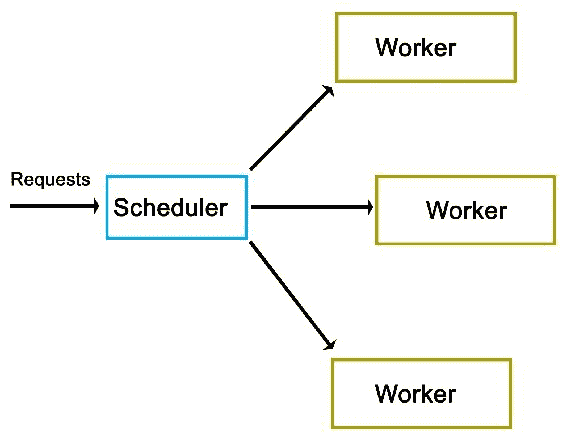

# 线程同步和通信

虽然通常线程用于相对独立地处理任务，但有许多情况下，人们希望在线程之间传递数据，甚至控制其他线程，比如来自中央任务调度器线程。本章将介绍如何使用 C++11 线程 API 完成这些任务。

本章涵盖的主题包括以下内容：

+   使用互斥锁、锁和类似的同步结构

+   使用条件变量和信号来控制线程

+   在线程之间安全地传递和共享数据

# 安全第一

并发的核心问题是确保在线程之间进行通信时对共享资源进行安全访问。还有线程能够进行通信和同步的问题。

多线程编程的挑战在于能够跟踪线程之间的每次交互，并确保每种形式的访问都得到保护，同时不会陷入死锁和数据竞争的陷阱。

在本章中，我们将看一个涉及任务调度器的相当复杂的例子。这是一种高并发、高吞吐量的情况，许多不同的要求与许多潜在的陷阱相结合，我们将在下面看到。

# 调度程序

多线程与大量线程之间的同步和通信的一个很好的例子是任务调度。在这里，目标是尽快接受传入的任务并将它们分配给工作线程。

在这种情况下，有许多不同的方法。通常情况下，有工作线程在活动循环中运行，不断轮询中央队列以获取新任务。这种方法的缺点包括在轮询上浪费处理器周期，并且在使用的同步机制（通常是互斥锁）上形成的拥塞。此外，当工作线程数量增加时，这种主动轮询方法的扩展性非常差。

理想情况下，每个工作线程都会空闲等待直到再次需要。为了实现这一点，我们必须从另一方面解决问题：不是从工作线程的角度，而是从队列的角度。就像操作系统的调度程序一样，调度程序既知道需要处理的任务，也知道可用的工作线程。

在这种方法中，一个中央调度器实例将接受新任务并主动分配给工作线程。该调度器实例还可以管理这些工作线程，例如它们的数量和优先级，这取决于传入任务的数量和任务的类型或其他属性。

# 高层视图

在其核心，我们的调度程序或调度器非常简单，像一个队列，所有调度逻辑都内置其中，如下图所示：



从前面的高层视图可以看出，实际上并没有太多内容。然而，正如我们将在下面看到的，实际的实现确实有许多复杂之处。

# 实施

像往常一样，我们从`main`函数开始，包含在`main.cpp`中：

```cpp
#include "dispatcher.h"
#include "request.h"

#include <iostream>
#include <string>
#include <csignal>
#include <thread>
#include <chrono>

using namespace std;

sig_atomic_t signal_caught = 0;
mutex logMutex; 

```

我们包括的自定义头文件是我们的调度器实现和我们将使用的`request`类。

全局上，我们定义了一个用于信号处理程序的原子变量，以及一个将同步输出（在标准输出上）的互斥锁，来自我们的日志方法：

```cpp
void sigint_handler(int sig) {
    signal_caught = 1;
} 

```

我们的信号处理函数（用于`SIGINT`信号）只是设置了我们之前定义的全局原子变量：

```cpp
void logFnc(string text) {
    logMutex.lock();
    cout << text << "\n";
    logMutex.unlock();
} 

```

在我们的日志函数中，我们使用全局互斥锁来确保对标准输出的写入是同步的：

```cpp
int main() {
    signal(SIGINT, &sigint_handler);
    Dispatcher::init(10); 

```

在`main`函数中，我们安装`SIGINT`的信号处理程序，以允许我们中断应用程序的执行。我们还调用`Dispatcher`类的静态`init()`函数来初始化它：

```cpp
    cout << "Initialised.\n";
        int cycles = 0;
    Request* rq = 0;
    while (!signal_caught && cycles < 50) {
        rq = new Request();
        rq->setValue(cycles);
        rq->setOutput(&logFnc);
        Dispatcher::addRequest(rq);
        cycles++;
    } 

```

接下来，我们设置循环，在其中我们将创建新的请求。在每个周期中，我们创建一个新的`Request`实例，并使用其`setValue()`函数设置一个整数值（当前周期号）。在将此新请求添加到`Dispatcher`时，我们还在请求实例上设置我们的日志函数，使用其静态的`addRequest()`函数。

这个循环将继续，直到达到最大周期数，或者使用*Ctrl*+*C*或类似方法发出`SIGINT`信号为止：

```cpp
        this_thread::sleep_for(chrono::seconds(5));
        Dispatcher::stop();
    cout << "Clean-up done.\n";
    return 0; 
} 

```

最后，我们使用线程的`sleep_for()`函数和`chrono`STL 头文件中的`chrono::seconds()`函数等待 5 秒。

我们还在返回之前在`Dispatcher`上调用`stop()`函数。

# 请求类

对于`Dispatcher`的请求总是派生自纯虚拟的`AbstractRequest`类：

```cpp
#pragma once
#ifndef ABSTRACT_REQUEST_H
#define ABSTRACT_REQUEST_H

class AbstractRequest {
    //
    public:
    virtual void setValue(int value) = 0;
    virtual void process() = 0;
    virtual void finish() = 0;
};
#endif 

```

这个`AbstractRequest`类定义了一个具有三个函数的 API，派生类始终必须实现这些函数。其中，`process()`和`finish()`函数是最通用的，可能在任何实际实现中使用。`setValue()`函数是特定于此演示实现的，可能会被调整或扩展以适应实际情况。

使用抽象类作为请求的基础的优势在于，只要它们都遵循相同的基本 API，`Dispatcher`类就可以处理许多不同类型的请求。

使用这个抽象接口，我们实现一个基本的`Request`类如下：

```cpp
#pragma once
#ifndef REQUEST_H
#define REQUEST_H

#include "abstract_request.h"

#include <string>

using namespace std;

typedef void (*logFunction)(string text);

class Request : public AbstractRequest {
    int value;
    logFunction outFnc;
    public:    void setValue(int value) { this->value = value; }
    void setOutput(logFunction fnc) { outFnc = fnc; }
    void process();
    void finish();
};
#endif 

```

在头文件中，我们首先定义函数指针的格式。之后，我们实现请求 API，并将`setOutput()`函数添加到基本 API 中，该函数接受用于记录日志的函数指针。这两个 setter 函数仅将提供的参数分配给它们各自的私有类成员。

接下来，给出类函数的实现如下：

```cpp
#include "request.h"
void Request::process() {
    outFnc("Starting processing request " + std::to_string(value) + "...");
    //
}
void Request::finish() {
    outFnc("Finished request " + std::to_string(value));
} 

```

这两个实现都非常基本；它们仅使用函数指针来输出指示工作线程状态的字符串。

在实际实现中，可以将业务逻辑添加到`process()`函数中，而`finish()`函数包含完成请求的任何功能，例如将映射写入字符串。

# Worker 类

接下来是`Worker`类。这包含了`Dispatcher`将调用以处理请求的逻辑。

```cpp
#pragma once
#ifndef WORKER_H
#define WORKER_H

#include "abstract_request.h"

#include <condition_variable>
#include <mutex>

using namespace std;

class Worker {
    condition_variable cv;
    mutex mtx;
    unique_lock<mutex> ulock;
    AbstractRequest* request;
    bool running;
    bool ready;
    public:
    Worker() { running = true; ready = false; ulock = unique_lock<mutex>(mtx); }
    void run();
    void stop() { running = false; }
    void setRequest(AbstractRequest* request) { this->request = request; ready = true; }
    void getCondition(condition_variable* &cv);
};
#endif 

```

虽然将请求添加到`Dispatcher`不需要任何特殊逻辑，但`Worker`类需要使用条件变量来与调度程序同步。对于 C++11 线程 API，这需要一个条件变量，一个互斥锁和一个唯一的锁。

唯一的锁封装了互斥锁，并且最终将与条件变量一起使用，我们将在下一刻看到。

除此之外，我们定义了启动和停止工作线程的方法，设置新请求进行处理的方法，以及获取其内部条件变量的访问权限。

接下来，其余的实现如下所示：

```cpp
#include "worker.h"
#include "dispatcher.h"

#include <chrono>

using namespace std;

void Worker::getCondition(condition_variable* &cv) {
    cv = &(this)->cv;
}

void Worker::run() {
    while (running) {
        if (ready) {
            ready = false;
            request->process();
            request->finish();
        }
        if (Dispatcher::addWorker(this)) {
            // Use the ready loop to deal with spurious wake-ups.
            while (!ready && running) {
                if (cv.wait_for(ulock, chrono::seconds(1)) == cv_status::timeout) {
                    // We timed out, but we keep waiting unless  
                    // the worker is 
                    // stopped by the dispatcher. 
                }
            }
        }
    }
} 

```

除了条件变量的`getter`函数之外，我们定义了`run()`函数，`dispatcher`将在启动每个工作线程时运行。

它的主循环仅检查`stop()`函数是否已被调用，该函数会将运行布尔值设置为`false`，并结束工作线程。这在`Dispatcher`关闭时被使用，允许它终止工作线程。由于布尔值通常是原子的，设置和检查可以同时进行，而无需风险或需要互斥锁。

接下来，对`ready`变量的检查是为了确保在线程首次运行时实际上有一个请求在等待。在工作线程的第一次运行时，没有请求会等待，因此，尝试处理一个请求将导致崩溃。当`Dispatcher`设置一个新请求时，这个布尔变量将被设置为`true`。

如果有请求在等待，`ready`变量将再次设置为`false`，之后请求实例将调用其`process()`和`finish()`函数。这将在工作线程的线程上运行请求的业务逻辑，并完成它。

最后，工作线程使用其静态的`addWorker()`函数将自己添加到调度器。如果没有新请求可用，此函数将返回`false`，并导致工作线程等待直到有新请求可用。否则，工作线程将继续处理`Dispatcher`设置的新请求。

如果要求等待，我们进入一个新的循环。这个循环将确保当条件变量被唤醒时，是因为我们得到了`Dispatcher`（`ready`变量设置为`true`）的信号，而不是因为虚假唤醒。

最后，我们使用之前创建的唯一锁实例和超时进入条件变量的实际`wait()`函数。如果超时发生，我们可以终止线程，或者继续等待。在这里，我们选择什么都不做，只是重新进入等待循环。

# 调度器

作为最后一项，我们有`Dispatcher`类本身：

```cpp
    #pragma once
    #ifndef DISPATCHER_H
    #define DISPATCHER_H

    #include "abstract_request.h"
    #include "worker.h"

    #include <queue>
    #include <mutex>
    #include <thread>
    #include <vector>

    using namespace std;

    class Dispatcher {
        static queue<AbstractRequest*> requests;
        static queue<Worker*> workers;
        static mutex requestsMutex;
        static mutex workersMutex;
        static vector<Worker*> allWorkers;
        static vector<thread*> threads;
        public:
        static bool init(int workers);
        static bool stop();
        static void addRequest(AbstractRequest* request);
        static bool addWorker(Worker* worker);
     };
     #endif 

```

大部分内容都会看起来很熟悉。到目前为止，您已经推测到，这是一个完全静态的类。

继续，其实现如下：

```cpp
    #include "dispatcher.h"

    #include <iostream>
    using namespace std;

    queue<AbstractRequest*> Dispatcher::requests;
    queue<Worker*> Dispatcher::workers;
    mutex Dispatcher::requestsMutex;
    mutex Dispatcher::workersMutex;
    vector<Worker*> Dispatcher::allWorkers;
    vector<thread*> Dispatcher::threads; 

    bool Dispatcher::init(int workers) {
        thread* t = 0;
        Worker* w = 0;
        for (int i = 0; i < workers; ++i) {
            w = new Worker;
            allWorkers.push_back(w);
            t = new thread(&Worker::run, w);
            threads.push_back(t);
        }
   return true;
 } 

```

在设置静态类成员之后，定义了`init()`函数。它启动指定数量的工作线程，并在各自的向量数据结构中保留对每个工作线程和线程实例的引用：

```cpp
    bool Dispatcher::stop() {
        for (int i = 0; i < allWorkers.size(); ++i) {
            allWorkers[i]->stop();
        }
            cout << "Stopped workers.\n";
            for (int j = 0; j < threads.size(); ++j) {
            threads[j]->join();
                    cout << "Joined threads.\n";
        }
    }

```

在`stop()`函数中，每个工作线程实例都调用其`stop()`函数。这将导致每个工作线程终止，正如我们在`Worker`类描述中看到的那样。

最后，我们等待每个线程加入（即完成）后再返回：

```cpp
    void Dispatcher::addRequest(AbstractRequest* request) {
        workersMutex.lock();
        if (!workers.empty()) {
            Worker* worker = workers.front();
            worker->setRequest(request);
            condition_variable* cv;
            worker->getCondition(cv);
            cv->notify_one();
            workers.pop();
            workersMutex.unlock();
        }
        else {
            workersMutex.unlock();
            requestsMutex.lock();
            requests.push(request);
            requestsMutex.unlock();
        }
    } 

```

`addRequest()`函数是有趣的地方。在这个函数中，添加了一个新请求。接下来会发生什么取决于是否有工作线程在等待新请求。如果没有工作线程在等待（工作线程队列为空），则将请求添加到请求队列中。

使用互斥锁确保对这些队列的访问是安全的，因为工作线程将同时尝试访问这两个队列。

这里需要注意的一个重要问题是死锁的可能性。也就是说，两个线程将持有资源的锁，第二个线程在释放自己的锁之前等待第一个线程释放其锁。在单个作用域中使用多个互斥锁的每种情况都具有这种潜力。

在这个函数中，死锁的潜在可能性在于释放工作线程互斥锁，并在获取请求互斥锁时。在这个函数持有工作线程互斥锁并尝试获取请求锁（当没有工作线程可用时），有可能另一个线程持有请求互斥锁（寻找要处理的新请求）同时尝试获取工作线程互斥锁（找不到请求并将自己添加到工作线程队列）。

解决方案很简单：在获取下一个互斥锁之前释放一个互斥锁。在某人觉得必须持有多个互斥锁时，必须仔细检查和测试自己的代码是否存在潜在的死锁。在这种特殊情况下，当不再需要工作线程互斥锁时，或在获取请求互斥锁之前，显式释放工作线程互斥锁，从而防止死锁。

这段代码的另一个重要方面是它如何向工作线程发出信号。正如可以在 if/else 块的第一部分看到的那样，当工作线程队列不为空时，从队列中获取一个工作线程，设置请求，然后引用并发出条件变量的信号，或通知。

在内部，条件变量使用我们在`Worker`类定义中提供的互斥锁来保证对它的原子访问。当在条件变量上调用`notify_one()`函数（在其他 API 中通常称为`signal()`）时，它将通知等待条件变量返回并继续的线程队列中的第一个线程。

在`Worker`类的`run()`函数中，我们将等待这个通知事件。收到通知后，工作线程将继续处理新的请求。然后线程引用将从队列中移除，直到它再次添加自己，一旦它完成了处理请求：

```cpp
    bool Dispatcher::addWorker(Worker* worker) {
        bool wait = true;
        requestsMutex.lock();
        if (!requests.empty()) {
            AbstractRequest* request = requests.front();
            worker->setRequest(request);
            requests.pop();
            wait = false;
            requestsMutex.unlock();
        }
        else {
            requestsMutex.unlock();
            workersMutex.lock();
            workers.push(worker);
            workersMutex.unlock();
        }
            return wait;
    } 

```

在这个最后的函数中，工作线程在处理完一个请求后会将自己添加到队列中。它与之前的函数类似，首先会主动匹配等待在请求队列中的任何请求。如果没有可用的请求，工作线程将被添加到工作线程队列中。

这里需要注意的是，我们返回一个布尔值，指示调用线程是否应该等待新的请求，或者在尝试添加自己到队列时是否已经收到了新的请求。

虽然这段代码比之前的函数要简单，但由于在同一范围内处理了两个互斥锁，它仍然存在潜在的死锁问题。在这里，我们首先释放我们持有的互斥锁，然后再获取下一个互斥锁。

# Makefile

这个`Dispatcher`示例的 makefile 非常基本--它收集当前文件夹中的所有 C++源文件，并使用`g++`将它们编译成一个二进制文件：

```cpp
    GCC := g++

    OUTPUT := dispatcher_demo
    SOURCES := $(wildcard *.cpp)
    CCFLAGS := -std=c++11 -g3

    all: $(OUTPUT)
        $(OUTPUT):
        $(GCC) -o $(OUTPUT) $(CCFLAGS) $(SOURCES)
        clean:
        rm $(OUTPUT)
        .PHONY: all

```

# 输出

编译应用程序后，运行它会产生以下输出，总共有 50 个请求：

```cpp
    $ ./dispatcher_demo.exe
    Initialised.
    Starting processing request 1...
    Starting processing request 2...
    Finished request 1
    Starting processing request 3...
    Finished request 3
    Starting processing request 6...
    Finished request 6
    Starting processing request 8...
    Finished request 8
    Starting processing request 9...
    Finished request 9
    Finished request 2
    Starting processing request 11...
    Finished request 11
    Starting processing request 12...
    Finished request 12
    Starting processing request 13...
    Finished request 13
    Starting processing request 14...
    Finished request 14
    Starting processing request 7...
    Starting processing request 10...
    Starting processing request 15...
    Finished request 7
    Finished request 15
    Finished request 10
    Starting processing request 16...
    Finished request 16
    Starting processing request 17...
    Starting processing request 18...
    Starting processing request 0...

```

此时，我们已经清楚地看到，即使每个请求几乎没有时间来处理，请求仍然明显是并行执行的。第一个请求（请求 0）只有在第 16 个请求之后才开始处理，而第二个请求在第九个请求之后就已经完成了。

决定哪个线程，因此，哪个请求首先被处理的因素取决于操作系统调度程序和基于硬件的调度，如第二章中所述，“处理器和操作系统上的多线程实现”。这清楚地显示了即使在单个平台上，也不能对多线程应用程序的执行做出多少假设。

```cpp
    Starting processing request 5...
    Finished request 5
    Starting processing request 20...
    Finished request 18
    Finished request 20
    Starting processing request 21...
    Starting processing request 4...
    Finished request 21
    Finished request 4   

```

在前面的代码中，第四个和第五个请求也以相当延迟的方式完成。

```cpp

    Starting processing request 23...
    Starting processing request 24...
    Starting processing request 22...
    Finished request 24
    Finished request 23
    Finished request 22
    Starting processing request 26...
    Starting processing request 25...
    Starting processing request 28...
    Finished request 26
    Starting processing request 27...
    Finished request 28
    Finished request 27
    Starting processing request 29...
    Starting processing request 30...
    Finished request 30
    Finished request 29
    Finished request 17
    Finished request 25
    Starting processing request 19...
    Finished request 0

```

此时，第一个请求终于完成了。这可能表明，与后续请求相比，第一个请求的初始化时间总是会延迟。多次运行应用程序可以确认这一点。重要的是，如果处理顺序很重要，这种随机性不会对应用程序产生负面影响。

```cpp
    Starting processing request 33...
    Starting processing request 35...
    Finished request 33
    Finished request 35
    Starting processing request 37...
    Starting processing request 38...
    Finished request 37
    Finished request 38
    Starting processing request 39...
    Starting processing request 40...
    Starting processing request 36...
    Starting processing request 31...
    Finished request 40
    Finished request 39
    Starting processing request 32...
    Starting processing request 41...
    Finished request 32
    Finished request 41
    Starting processing request 42...
    Finished request 31
    Starting processing request 44...
    Finished request 36
    Finished request 42
    Starting processing request 45...
    Finished request 44
    Starting processing request 47...
    Starting processing request 48...
    Finished request 48
    Starting processing request 43...
    Finished request 47
    Finished request 43
    Finished request 19
    Starting processing request 34...
    Finished request 34
    Starting processing request 46...
    Starting processing request 49...
    Finished request 46
    Finished request 49
    Finished request 45

```

第 19 个请求也变得相当延迟，再次显示了多线程应用程序有多么不可预测。如果我们在这里并行处理大型数据集，每个请求中都有数据块，我们可能需要在某些时刻暂停以应对这些延迟，否则我们的输出缓存可能会变得太大。

由于这样做会对应用程序的性能产生负面影响，人们可能需要考虑低级优化，以及在特定处理器核心上对线程进行调度，以防止这种情况发生。

```cpp
    Stopped workers.
    Joined threads.
    Joined threads.
    Joined threads.
    Joined threads.
    Joined threads.
    Joined threads.
    Joined threads.
    Joined threads.
    Joined threads.
    Joined threads.
    Clean-up done.

```

最初启动的所有 10 个工作线程在这里终止，因为我们调用了`Dispatcher`的`stop()`函数。

# 共享数据

在本章的示例中，我们看到了如何在线程之间共享信息，除了同步线程之外--这是我们从主线程传递到调度程序的请求的形式，每个请求都会传递到不同的线程中。

在线程之间共享数据的基本思想是要共享的数据以某种方式存在于两个或更多个线程都可以访问的地方。之后，我们必须确保只有一个线程可以修改数据，并且在读取数据时数据不会被修改。通常，我们会使用互斥锁或类似的方法来确保这一点。

# 使用读/写锁

在这里，读写锁是一种可能的优化，因为它们允许多个线程同时从单个数据源读取。如果一个应用程序中有多个工作线程反复读取相同的信息，使用读写锁比基本互斥锁更有效，因为尝试读取数据不会阻塞其他线程。

读写锁因此可以被用作互斥锁的更高级版本，即，它可以根据访问类型调整其行为。在内部，它建立在互斥锁（或信号量）和条件变量之上。

# 使用共享指针

共享指针首先通过 Boost 库提供，并在 C++11 中引入，它们是使用引用计数对堆分配实例进行内存管理的抽象。它们在某种程度上是线程安全的，因为可以创建多个共享指针实例，但引用的对象本身并不是线程安全的。

根据应用程序的不同，这可能已经足够了。为了使它们真正线程安全，可以使用原子操作。我们将在第八章中更详细地讨论这个问题，*原子操作 - 与硬件一起工作*。

# 总结

在本章中，我们讨论了如何以安全的方式在相当复杂的调度程序实现中在线程之间传递数据。我们还研究了所述调度程序的结果异步处理，并考虑了在线程之间传递数据的一些潜在替代方案和优化。

在这一点上，您应该能够安全地在线程之间传递数据，并同步访问其他共享资源。

在下一章中，我们将研究本地 C++线程和基本 API。
