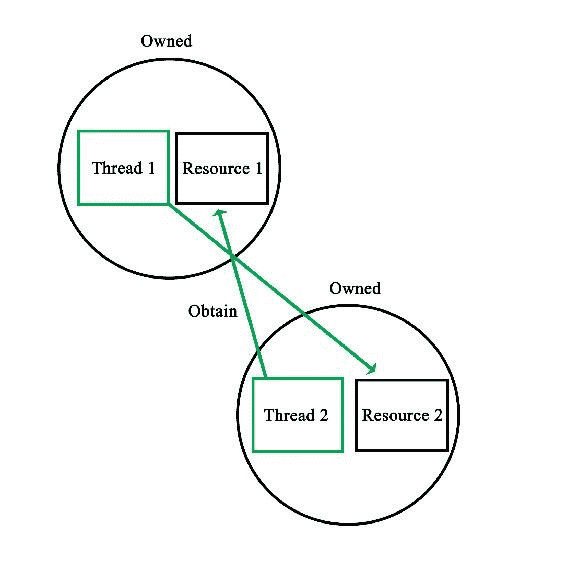
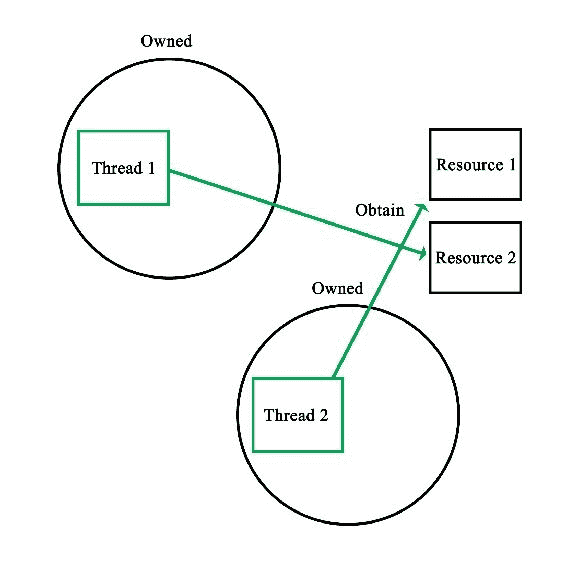
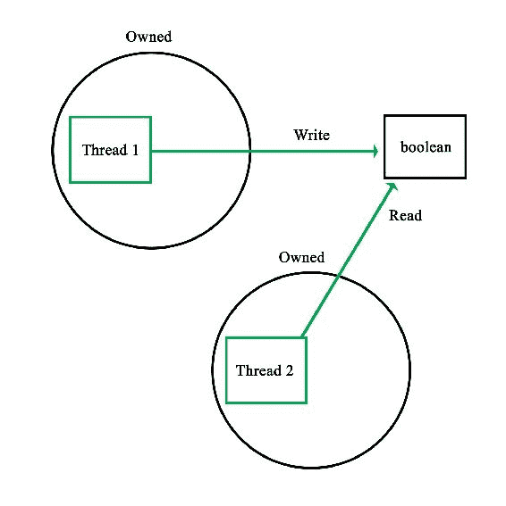
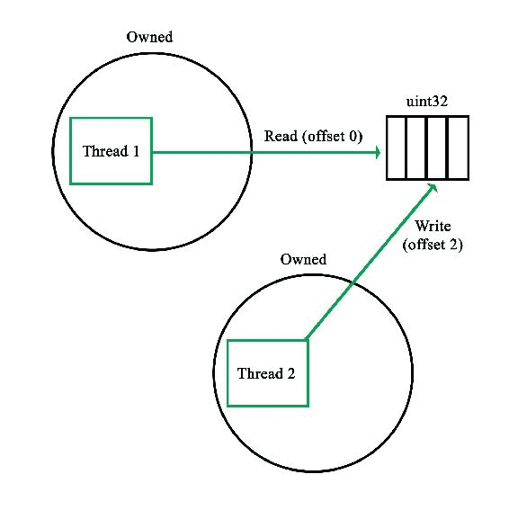
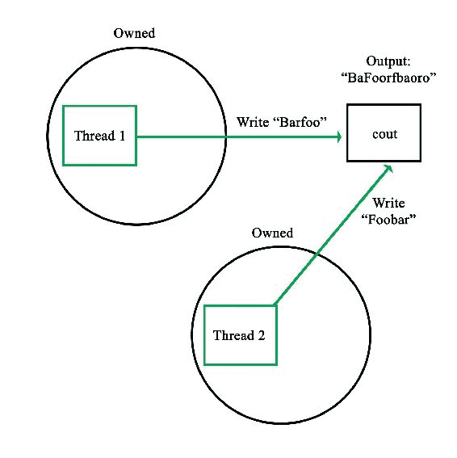
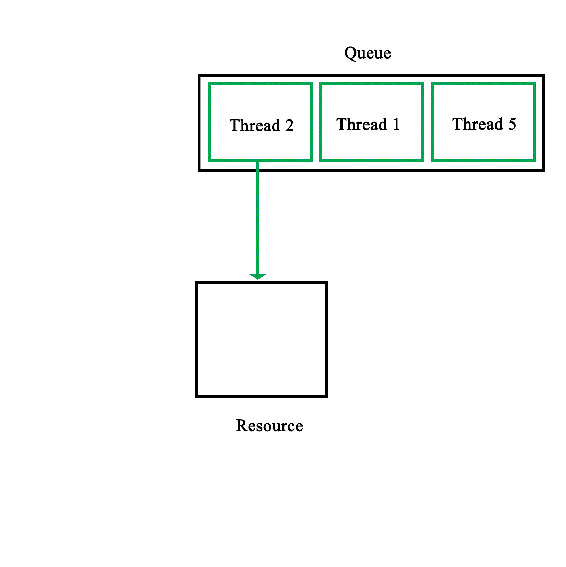

# 第七章：最佳实践

与大多数事物一样，最好是避免犯错误，而不是事后纠正。本章介绍了多线程应用程序中的许多常见错误和设计问题，并展示了避免常见和不太常见问题的方法。

本章的主题包括：

+   常见的多线程问题，如死锁和数据竞争。

+   正确使用互斥锁、锁和陷阱。

+   在使用静态初始化时可能出现的问题。

# 适当的多线程

在前面的章节中，我们已经看到了编写多线程代码时可能出现的各种潜在问题。这些问题从明显的问题，比如两个线程无法同时写入同一位置，到更微妙的问题，比如互斥锁的不正确使用。

还有许多与多线程代码直接相关的元素的问题，但这些问题可能导致看似随机的崩溃和其他令人沮丧的问题。其中一个例子是变量的静态初始化。在接下来的章节中，我们将看到所有这些问题以及更多问题，以及避免不得不处理它们的方法。

就像生活中的许多事情一样，它们是有趣的经历，但通常你不想重复它们。

# 错误的期望-死锁

死锁的描述已经非常简洁了。当两个或更多进程试图访问另一个进程持有的资源，而另一个线程同时正在等待访问它持有的资源时，就会发生死锁。

例如：

1.  线程 1 获得对资源 A 的访问

1.  线程 1 和 2 都想要访问资源 B

1.  线程 2 获胜，现在拥有 B，而线程 1 仍在等待 B

1.  线程 2 现在想要使用 A，并等待访问

1.  线程 1 和 2 都永远等待资源

在这种情况下，我们假设线程最终将能够在某个时刻访问每个资源，而事实正好相反，因为每个线程都持有另一个线程需要的资源。

可视化，这个死锁过程看起来像这样：



这清楚地表明了在防止死锁时有两个基本规则：

+   尽量不要同时持有多个锁。

+   尽快释放任何持有的锁。

在第四章中，我们看到了一个现实生活中的例子，*线程同步和通信*，当我们看了调度程序演示代码时。这段代码涉及两个互斥锁，以保护对两个数据结构的访问：

```cpp
void Dispatcher::addRequest(AbstractRequest* request) {
    workersMutex.lock();
    if (!workers.empty()) {
          Worker* worker = workers.front();
          worker->setRequest(request);
          condition_variable* cv;
          mutex* mtx;
          worker->getCondition(cv);
          worker->getMutex(mtx);
          unique_lock<mutex> lock(*mtx);
          cv->notify_one();
          workers.pop();
          workersMutex.unlock();
    }
    else {
          workersMutex.unlock();
          requestsMutex.lock();
          requests.push(request);
          requestsMutex.unlock();
    }
 } 

```

这里的互斥锁是`workersMutex`和`requestsMutex`变量。我们可以清楚地看到，在尝试获取另一个互斥锁之前，我们从不持有互斥锁。我们明确地在方法的开始处锁定`workersMutex`，以便我们可以安全地检查工作数据结构是否为空。

如果不为空，我们将新请求交给工作线程。然后，当我们完成了工作，数据结构，我们释放了互斥锁。此时，我们保留零个互斥锁。这里没有太复杂的地方，因为我们只使用了一个互斥锁。

有趣的是在 else 语句中，当没有等待的工作线程并且我们需要获取第二个互斥锁时。当我们进入这个范围时，我们保留一个互斥锁。我们可以尝试获取`requestsMutex`并假设它会起作用，但这可能会导致死锁，原因很简单：

```cpp
bool Dispatcher::addWorker(Worker* worker) {
    bool wait = true;
    requestsMutex.lock();
    if (!requests.empty()) {
          AbstractRequest* request = requests.front();
          worker->setRequest(request);
          requests.pop();
          wait = false;
          requestsMutex.unlock();
    }
    else {
          requestsMutex.unlock();
          workersMutex.lock();
          workers.push(worker);
          workersMutex.unlock();
    }
          return wait;
 } 

```

先前的函数的伴随函数也使用了这两个互斥锁。更糟糕的是，这个函数在一个单独的线程中运行。结果，当第一个函数在尝试获取`requestsMutex`时持有`workersMutex`，而第二个函数同时持有后者并尝试获取前者时，我们就会陷入死锁。

然而，在这里看到的函数中，这两条规则都已成功实现；我们从不同时持有多个锁，并且尽快释放我们持有的任何锁。这可以在两个 else 情况中看到，在进入它们时，我们首先释放不再需要的任何锁。

在任何一种情况下，我们都不需要再分别检查工作者或请求数据结构；我们可以在做其他任何事情之前释放相关的锁。这导致了以下可视化效果：



当然，我们可能需要使用两个或更多数据结构或变量中包含的数据；这些数据同时被其他线程使用。很难确保在生成的代码中没有死锁的机会。

在这里，人们可能想考虑使用临时变量或类似的东西。通过锁定互斥量，复制相关数据，并立即释放锁，就不会与该互斥量发生死锁的机会。即使必须将结果写回数据结构，也可以在单独的操作中完成。

这在预防死锁方面增加了两条规则：

+   尽量不要同时持有多个锁。

+   尽快释放任何持有的锁。

+   永远不要持有锁的时间超过绝对必要的时间。

+   当持有多个锁时，请注意它们的顺序。

# 粗心大意 - 数据竞争

数据竞争，也称为竞争条件，发生在两个或更多线程试图同时写入同一共享内存时。因此，每个线程执行的指令序列期间和结束时共享内存的状态是非确定性的。

正如我们在第六章中看到的，*调试多线程代码*，数据竞争经常被用于调试多线程应用程序的工具报告。例如：

```cpp
    ==6984== Possible data race during write of size 1 at 0x5CD9260 by thread #1
 ==6984== Locks held: none
 ==6984==    at 0x40362C: Worker::stop() (worker.h:37)
 ==6984==    by 0x403184: Dispatcher::stop() (dispatcher.cpp:50)
 ==6984==    by 0x409163: main (main.cpp:70)
 ==6984== 
 ==6984== This conflicts with a previous read of size 1 by thread #2
 ==6984== Locks held: none
 ==6984==    at 0x401E0E: Worker::run() (worker.cpp:51)
 ==6984==    by 0x408FA4: void std::_Mem_fn_base<void (Worker::*)(), true>::operator()<, void>(Worker*) const (in /media/sf_Projects/Cerflet/dispatcher/dispatcher_demo)
 ==6984==    by 0x408F38: void std::_Bind_simple<std::_Mem_fn<void (Worker::*)()> (Worker*)>::_M_invoke<0ul>(std::_Index_tuple<0ul>) (functional:1531)
 ==6984==    by 0x408E3F: std::_Bind_simple<std::_Mem_fn<void (Worker::*)()> (Worker*)>::operator()() (functional:1520)
 ==6984==    by 0x408D47: std::thread::_Impl<std::_Bind_simple<std::_Mem_fn<void (Worker::*)()> (Worker*)> >::_M_run() (thread:115)
 ==6984==    by 0x4EF8C7F: ??? (in /usr/lib/x86_64-linux-gnu/libstdc++.so.6.0.21)
 ==6984==    by 0x4C34DB6: ??? (in /usr/lib/valgrind/vgpreload_helgrind-amd64-linux.so)
 ==6984==    by 0x53DF6B9: start_thread (pthread_create.c:333)
 ==6984==  Address 0x5cd9260 is 96 bytes inside a block of size 104 alloc'd
 ==6984==    at 0x4C2F50F: operator new(unsigned long) (in /usr/lib/valgrind/vgpreload_helgrind-amd64-linux.so)
 ==6984==    by 0x40308F: Dispatcher::init(int) (dispatcher.cpp:38)
 ==6984==    by 0x4090A0: main (main.cpp:51)
 ==6984==  Block was alloc'd by thread #1

```

生成前面警告的代码如下：

```cpp
bool Dispatcher::stop() {
    for (int i = 0; i < allWorkers.size(); ++i) {
          allWorkers[i]->stop();
    }
          cout << "Stopped workers.\n";
          for (int j = 0; j < threads.size(); ++j) {
          threads[j]->join();
                      cout << "Joined threads.\n";
    }
 } 

```

考虑一下`Worker`实例中的这段代码：

```cpp
   void stop() { running = false; } 

```

我们还有：

```cpp
void Worker::run() {
    while (running) {
          if (ready) {
                ready = false;
                request->process();
                request->finish();
          }
                      if (Dispatcher::addWorker(this)) {
                while (!ready && running) {
                      unique_lock<mutex> ulock(mtx);
                      if (cv.wait_for(ulock, chrono::seconds(1)) == cv_status::timeout) {
                      }
                }
          }
    }
 } 

```

在这里，`running`是一个布尔变量，被设置为`false`（从一个线程写入），向工作者线程发出信号，告诉它应该终止其等待循环，其中从不同进程（主线程与工作者线程）读取布尔变量：



这个特定示例的警告是由于一个布尔变量同时被写入和读取。当然，这种特定情况之所以安全，是因为原子性，如在第八章中详细解释的那样，*原子操作 - 与硬件交互*。

即使像这样的操作也存在潜在风险的原因是，读取操作可能发生在变量仍在更新过程中。例如，对于一个 32 位整数，在硬件架构上，更新这个变量可能是一次完成，或者多次完成。在后一种情况下，读取操作可能读取一个具有不可预测结果的中间值：



更有趣的情况是，当多个线程写入一个标准输出而不使用，例如，`cout`时。由于这个流不是线程安全的，结果输出流将包含输入流的片段，每当任何一个线程有机会写入时：



因此，预防数据竞争的基本规则是：

+   永远不要对未锁定的、非原子的共享资源进行写入

+   永远不要从未锁定的、非原子的共享资源中读取

这基本上意味着任何写入或读取都必须是线程安全的。如果一个线程写入共享内存，那么其他线程就不能同时写入它。同样，当我们从共享资源中读取时，我们需要确保最多只有其他线程也在读取共享资源。

这种级别的互斥自然是通过互斥实现的，正如我们在前面的章节中看到的那样，读写锁提供了一种改进，允许同时进行读取，同时将写入作为完全互斥的事件。

当然，互斥也有一些陷阱，我们将在接下来的部分中看到。

# 互斥并非魔法

互斥基本上是所有形式的互斥 API 的基础。从本质上讲，它们似乎非常简单，只有一个线程可以拥有一个互斥，其他线程则整齐地排队等待获取互斥的锁。

可以将这个过程想象成下面这样：



现实当然没有那么美好，主要是由于硬件对我们施加的实际限制。一个明显的限制是同步原语并不是免费的。即使它们是在硬件中实现的，也需要多次调用才能使它们工作。

在硬件中实现互斥的两种最常见方式是使用**测试和设置**（TAS）或**比较和交换**（CAS）CPU 特性。

测试和设置通常被实现为两个汇编级指令，它们是自主执行的，意味着它们不能被中断。第一条指令测试某个内存区域是否设置为 1 或零。只有当值为零（`false`）时，第二条指令才会执行。这意味着互斥尚未被锁定。第二条指令将内存区域设置为 1，从而锁定互斥。

在伪代码中，这看起来像这样：

```cpp
bool TAS(bool lock) { 
   if (lock) { 
         return true; 
   } 
   else { 
         lock = true; 
         return false; 
   } 
} 

```

比较和交换是对此的一个较少使用的变体，它对内存位置和给定值执行比较操作，只有在前两者匹配时才替换该内存位置的内容：

```cpp
bool CAS(int* p, int old, int new) { 
   if (*p != old) { 
               return false; 
         } 

   *p = new; 
         return true; 
} 

```

在任何情况下，都必须积极重复函数，直到返回正值：

```cpp
volatile bool lock = false; 

 void critical() { 
     while (TAS(&lock) == false); 
     // Critical section 
     lock = 0; 
 } 

```

在这里，使用简单的 while 循环不断轮询内存区域（标记为 volatile 以防止可能有问题的编译器优化）。通常，使用的算法会逐渐减少轮询的频率，以减少对处理器和内存系统的压力。

这清楚地表明互斥的使用并非免费，每个等待互斥锁的线程都会主动使用资源。因此，一般规则是：

+   确保线程等待互斥和类似锁的时间尽可能短。

+   对于较长的等待时间使用条件变量或定时器。

# 锁是花哨的互斥

正如我们在互斥一节中看到的，使用互斥时需要牢记一些问题。当然，这些问题也适用于使用基于互斥的锁和其他机制，即使这些 API 可能会弥补其中一些问题。

当首次使用多线程 API 时，人们可能会困惑的一件事是不同同步类型之间的实际区别。正如我们在本章前面讨论的那样，互斥在几乎所有同步机制中起着基础作用，只是在使用互斥实现所提供功能的方式上有所不同。

重要的是，它们不是独立的同步机制，而只是基本互斥类型的特殊化。无论是使用常规互斥、读/写锁、信号量，甚至像可重入（递归）互斥或锁这样奇特的东西，完全取决于要解决的特定问题。

对于调度器，我们首先在第四章中遇到，*线程同步和通信*，我们使用常规互斥锁来保护包含排队工作线程和请求的数据结构。由于对任何数据结构的访问可能不仅涉及读取操作，还涉及结构的操作，因此在那里使用读/写锁是没有意义的。同样，递归锁也不会对谦虚的互斥锁产生任何作用。

对于每个同步问题，因此必须问以下问题：

+   我有哪些要求？

+   哪种同步机制最适合这些要求？

因此，选择复杂类型是有吸引力的，但通常最好坚持满足所有要求的更简单的类型。当涉及调试自己的实现时，与花哨的实现相比，可以节省宝贵的时间。

# 线程与未来

最近，有人开始建议不要使用线程，而是倡导使用其他异步处理机制，如`promise`。背后的原因是使用线程和涉及的同步是复杂且容易出错的。通常，人们只想并行运行一个任务，而不关心如何获得结果。

对于只运行短暂的简单任务，这当然是有意义的。基于线程的实现的主要优势始终是可以完全定制其行为。使用`promise`，可以发送一个要运行的任务，并在最后从`future`实例中获取结果。这对于简单的任务很方便，但显然不能涵盖很多情况。

这里的最佳方法是首先充分了解线程和同步机制，以及它们的限制。只有在那之后，才真正有意义去考虑是否希望使用 promise、`packaged_task`或完整的线程。

对于这些更复杂的、基于未来的 API，另一个主要考虑因素是它们严重依赖模板，这可能会使调试和解决可能发生的任何问题变得比使用更直接和低级的 API 更不容易。

# 静态初始化顺序

静态变量是只声明一次的变量，基本上存在于全局范围，尽管可能只在特定类的实例之间共享。也可能有完全静态的类：

```cpp
class Foo { 
   static std::map<int, std::string> strings; 
   static std::string oneString; 

public: 
   static void init(int a, std::string b, std::string c) { 
         strings.insert(std::pair<int, std::string>(a, b)); 
         oneString = c; 
   } 
}; 

std::map<int, std::string> Foo::strings; 
std::string Foo::oneString; 

```

正如我们在这里看到的，静态变量以及静态函数似乎是一个非常简单但强大的概念。虽然在其核心是如此，但在静态变量和类的初始化方面，存在一个会让不慎的人陷入困境的主要问题。这是初始化顺序的形式。

想象一下，如果我们希望从另一个类的静态初始化中使用前面的类，就像这样：

```cpp
class Bar { 
   static std::string name; 
   static std::string initName(); 

public: 
   void init(); 
}; 

// Static initializations. 
std::string Bar::name = Bar::initName(); 

std::string Bar::initName() { 
   Foo::init(1, "A", "B"); 
   return "Bar"; 
} 

```

虽然这看起来可能会很好，但向类的映射结构添加第一个字符串作为键意味着这段代码很有可能会崩溃。其原因很简单，没有保证在调用`Foo::init()`时`Foo::string`已经初始化。因此，尝试使用未初始化的映射结构将导致异常。

简而言之，静态变量的初始化顺序基本上是随机的，如果不考虑这一点，就会导致非确定性行为。

这个问题的解决方案相当简单。基本上，目标是使更复杂的静态变量的初始化显式化，而不是像前面的例子中那样隐式化。为此，我们修改 Foo 类：

```cpp
class Foo { 
   static std::map<int, std::string>& strings(); 
   static std::string oneString; 

public: 
   static void init(int a, std::string b, std::string c) { 
         static std::map<int, std::string> stringsStatic = Foo::strings(); 
         stringsStatic.insert(std::pair<int, std::string>(a, b)); 
         oneString = c; 
   } 
}; 

std::string Foo::oneString; 

std::map<int, std::string>& Foo::strings() { 
   static std::map<int, std::string>* stringsStatic = new std::map<int, std::string>(); 
   return *stringsStatic; 
} 

```

从顶部开始，我们看到我们不再直接定义静态地图。相反，我们有一个同名的私有函数。这个函数的实现可以在这个示例代码的底部找到。在其中，我们有一个指向具有熟悉地图定义的地图结构的静态指针。

当调用这个函数时，如果还没有实例，就会创建一个新的地图，因为它是一个静态变量。在修改后的`init()`函数中，我们看到我们调用`strings()`函数来获得对这个实例的引用。这是显式初始化的部分，因为调用函数将始终确保在我们使用它之前初始化地图结构，解决了我们之前遇到的问题。

我们还在这里看到了一个小优化：我们创建的`stringsStatic`变量也是静态的，这意味着我们只会调用一次`strings()`函数。这样做可以避免重复的函数调用，并恢复我们在先前简单但不稳定的实现中所拥有的速度。

因此，静态变量初始化的基本规则是，对于非平凡的静态变量，始终使用显式初始化。

# 总结

在本章中，我们看了一些编写多线程代码时需要牢记的良好实践和规则，以及一些建议。到目前为止，人们应该能够避免一些编写此类代码时的重大陷阱和主要混淆源。

在下一章中，我们将看到如何利用原子操作和 C++11 引入的`<atomics>`头文件来利用底层硬件。
