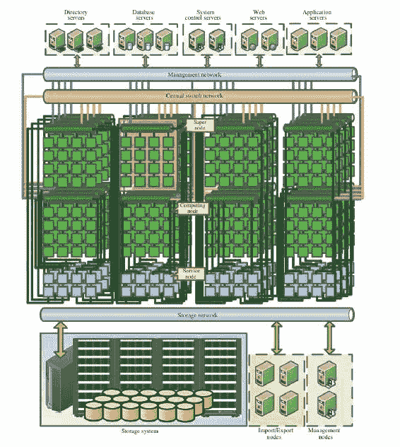
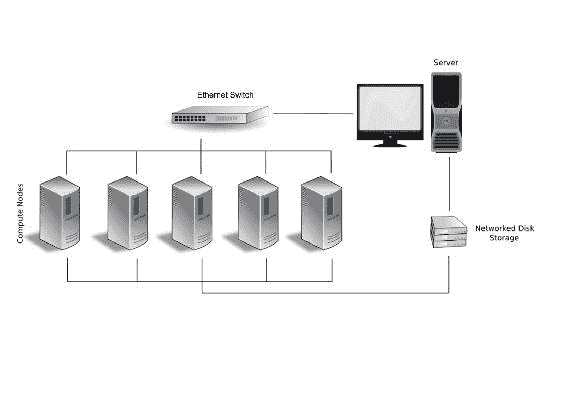
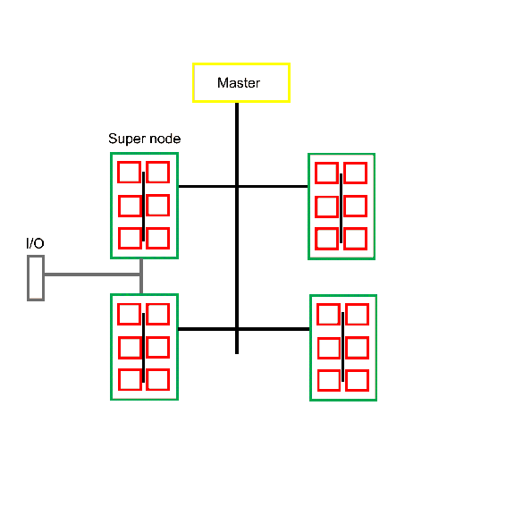

# 第九章：多线程与分布式计算

分布式计算是多线程编程的最初应用之一。在每台个人计算机只包含单个处理器和单个核心的时代，政府和研究机构，以及一些公司会拥有多处理器系统，通常是集群的形式。它们可以进行多线程处理；通过在处理器之间分割任务，它们可以加速各种任务，包括模拟、CGI 电影渲染等。

如今，几乎每台桌面级或更高级别的系统都有多个处理器核心，并且使用廉价的以太网布线很容易将多台系统组装成一个集群。结合 OpenMP 和 Open MPI 等框架，很容易将基于 C++（多线程）的应用程序扩展到分布式系统上运行。

本章的主题包括：

+   在多线程 C++应用程序中集成 OpenMP 和 MPI

+   实现分布式、多线程应用程序

+   分布式、多线程编程的常见应用和问题

# 分布式计算，简而言之

当涉及并行处理大型数据集时，如果能够将数据分割成许多小部分，并将其推送到许多线程中，从而显著缩短处理所述数据的总时间，那将是理想的。

分布式计算的理念正是这样：在分布式系统的每个节点上运行我们的应用程序的一个或多个实例，这个应用程序可以是单线程或多线程。由于进程间通信的开销，使用多线程应用程序通常更有效，也由于其他可能的优化--由于资源共享。

如果已经有一个多线程应用程序准备好使用，那么可以直接使用 MPI 使其在分布式系统上运行。否则，OpenMP 是一个编译器扩展（用于 C/C++和 Fortran），可以相对轻松地使应用程序成为多线程，而无需重构。

为了做到这一点，OpenMP 允许标记一个通用的代码段，以便在所有从属线程上执行。主线程创建了一些从属线程，它们将同时处理相同的代码段。一个基本的“Hello World” OpenMP 应用程序看起来像这样：

```cpp
/******************************************************************************
 * FILE: omp_hello.c
 * DESCRIPTION:
 *   OpenMP Example - Hello World - C/C++ Version
 *   In this simple example, the master thread forks a parallel region.
 *   All threads in the team obtain their unique thread number and print it.
 *   The master thread only prints the total number of threads.  Two OpenMP
 *   library routines are used to obtain the number of threads and each
 *   thread's number.
 * AUTHOR: Blaise Barney  5/99
 * LAST REVISED: 04/06/05
 ******************************************************************************/
 #include <omp.h>
 #include <stdio.h>
 #include <stdlib.h>

 int main (int argc, char *argv[])  {
    int nthreads, tid;

    /* Fork a team of threads giving them their own copies of variables */
 #pragma omp parallel private(nthreads, tid) {
          /* Obtain thread number */
          tid = omp_get_thread_num();
          printf("Hello World from thread = %d\n", tid);

          /* Only master thread does this */
          if (tid == 0) {
                nthreads = omp_get_num_threads();
                printf("Number of threads = %d\n", nthreads);
                }

    }  /* All threads join master thread and disband */ 
} 

```

从这个基本示例中可以很容易地看出，OpenMP 通过`<omp.h>`头文件提供了一个基于 C 的 API。我们还可以看到每个线程将执行的部分，由`#pragma omp`预处理宏标记。

与我们在前面章节中看到的多线程代码示例相比，OpenMP 的优势在于可以轻松地将代码部分标记为多线程，而无需进行任何实际的代码更改。这带来的明显限制是，每个线程实例将执行完全相同的代码，并且进一步的优化选项有限。

# MPI

为了在特定节点上安排代码的执行，通常使用**MPI**（消息传递接口）。Open MPI 是这种的免费库实现，被许多高级超级计算机使用。MPICH 是另一个流行的实现。

MPI 本身被定义为并行计算编程的通信协议。它目前处于第三个修订版（MPI-3）。

总之，MPI 提供了以下基本概念：

+   通信器：通信器对象连接了 MPI 会话中的一组进程。它为进程分配唯一标识符，并在有序拓扑中安排进程。

+   点对点操作：这种操作允许特定进程之间直接通信。

+   **集体函数**：这些函数涉及在一个进程组内进行广播通信。它们也可以以相反的方式使用，从一个组中的所有进程获取结果，并且例如在单个节点上对它们进行求和。更有选择性的版本将确保特定的数据项被发送到特定的节点。

+   **派生数据类型**：由于 MPI 集群中的每个节点都不能保证具有相同的定义、字节顺序和数据类型的解释，MPI 要求指定每个数据段的类型，以便 MPI 可以进行数据转换。

+   **单边通信**：这些操作允许在远程内存中写入或读取，或者在多个任务之间执行归约操作，而无需在任务之间进行同步。这对于某些类型的算法非常有用，比如涉及分布式矩阵乘法的算法。

+   **动态进程管理**：这是一个功能，允许 MPI 进程创建新的 MPI 进程，或者与新创建的 MPI 进程建立通信。

+   **并行 I/O**：也称为 MPI-IO，这是分布式系统上 I/O 管理的抽象，包括文件访问，方便与 MPI 一起使用。

其中，MPI-IO、动态进程管理和单边通信是 MPI-2 的特性。从基于 MPI-1 的代码迁移以及动态进程管理与某些设置不兼容，以及许多应用程序不需要 MPI-2 的特性，意味着 MPI-2 的采用相对较慢。

# 实现

MPI 的最初实现是**MPICH**，由**阿贡国家实验室**（**ANL**）和密西西比州立大学开发。它目前是最受欢迎的实现之一，被用作 MPI 实现的基础，包括 IBM（蓝色基因）、英特尔、QLogic、Cray、Myricom、微软、俄亥俄州立大学（MVAPICH）等的 MPI 实现。

另一个非常常见的实现是 Open MPI，它是由三个 MPI 实现合并而成的：

+   FT-MPI（田纳西大学）

+   LA-MPI（洛斯阿拉莫斯国家实验室）

+   LAM/MPI（印第安纳大学）

这些，以及斯图加特大学的 PACX-MPI 团队，是 Open MPI 团队的创始成员。Open MPI 的主要目标之一是创建一个高质量的开源 MPI-3 实现。

MPI 实现必须支持 C 和 Fortran。C/C++和 Fortran 以及汇编支持非常普遍，还有其他语言的绑定。

# 使用 MPI

无论选择哪种实现，最终的 API 都将始终符合官方 MPI 标准，只有选择的库支持的 MPI 版本会有所不同。任何 MPI 实现都应该支持所有 MPI-1（修订版 1.3）的特性。

这意味着规范的 Hello World（例如，在 MPI 教程网站上找到的[`mpitutorial.com/tutorials/mpi-hello-world/`](http://mpitutorial.com/tutorials/mpi-hello-world/)）对于 MPI 应该在选择哪个库时都能工作：

```cpp
#include <mpi.h> 
#include <stdio.h> 

int main(int argc, char** argv) { 
         // Initialize the MPI environment 
         MPI_Init(NULL, NULL); 

         // Get the number of processes 
         int world_size; 
         MPI_Comm_size(MPI_COMM_WORLD, &world_size); 

         // Get the rank of the process 
         int world_rank; 
         MPI_Comm_rank(MPI_COMM_WORLD, &world_rank); 

         // Get the name of the processor 
         char processor_name[MPI_MAX_PROCESSOR_NAME]; 
         int name_len; 
         MPI_Get_processor_name(processor_name, &name_len); 

         // Print off a hello world message 
         printf("Hello world from processor %s, rank %d" 
                     " out of %d processors\n", 
                     processor_name, world_rank, world_size); 

         // Finalize the MPI environment. 
         MPI_Finalize(); 
} 

```

阅读这个基于 MPI 的应用程序的基本示例时，熟悉 MPI 使用的术语非常重要，特别是：

+   **World**：此作业的注册 MPI 进程

+   **通信器**：连接会话中所有 MPI 进程的对象

+   **秩**：通信器内进程的标识符

+   **处理器**：物理 CPU，多核 CPU 的单个核心，或系统的主机名

在这个 Hello World 的例子中，我们可以看到我们包含了`<mpi.h>`头文件。这个 MPI 头文件将始终相同，无论我们使用哪种实现。

初始化 MPI 环境只需要调用一次`MPI_Init()`，这个调用可以有两个参数，但在这一点上都是可选的。

接下来是获取世界的大小（即可用进程数）。这是使用`MPI_Comm_size()`完成的，它接受`MPI_COMM_WORLD`全局变量（由 MPI 定义供我们使用）并使用第二个参数更新该世界中的进程数。

然后我们获得的等级基本上是 MPI 分配给此进程的唯一 ID。获取此 UID 是使用`MPI_Comm_rank()`执行的。同样，这需要`MPI_COMM_WORLD`变量作为第一个参数，并将我们的数字等级作为第二个参数返回。此等级对于自我识别和进程之间的通信很有用。

获取正在运行的特定硬件的名称也可能很有用，特别是用于诊断目的。为此，我们可以调用`MPI_Get_processor_name()`。返回的字符串将具有全局定义的最大长度，并且将以某种方式标识硬件。该字符串的确切格式由实现定义。

最后，我们打印出我们收集的信息，并在终止应用程序之前清理 MPI 环境。

# 编译 MPI 应用程序

为了编译 MPI 应用程序，使用`mpicc`编译器包装器。这个可执行文件应该是已安装的任何 MPI 实现的一部分。

然而，使用它与使用例如 GCC 完全相同：

```cpp
    $ mpicc -o mpi_hello_world mpi_hello_world.c

```

这可以与以下进行比较：

```cpp
    $ gcc mpi_hello_world.c -lmsmpi -o mpi_hello_world

```

这将把我们的 Hello World 示例编译和链接成一个二进制文件，准备执行。然而，执行此二进制文件不是直接启动它，而是使用启动器，如下所示：

```cpp
    $ mpiexec.exe -n 4 mpi_hello_world.exe
    Hello world from processor Generic_PC, rank 0 out of 4 processors
    Hello world from processor Generic_PC, rank 2 out of 4 processors
    Hello world from processor Generic_PC, rank 1 out of 4 processors
    Hello world from processor Generic_PC, rank 3 out of 4 processors

```

前面的输出来自在 Windows 系统上运行的 Bash shell 中的 Open MPI。正如我们所看到的，总共启动了四个进程（4 个等级）。每个进程的处理器名称报告为主机名（“PC”）。

用于启动 MPI 应用程序的二进制文件称为 mpiexec 或 mpirun，或者 orterun。这些是相同二进制文件的同义词，尽管并非所有实现都具有所有同义词。对于 Open MPI，所有三者都存在，可以使用其中任何一个。

# 集群硬件

MPI 基于或类似应用程序将运行的系统由多个独立系统（节点）组成，每个系统都使用某种网络接口连接到其他系统。对于高端应用程序，这些往往是具有高速、低延迟互连的定制节点。在光谱的另一端是所谓的 Beowulf 和类似类型的集群，由标准（台式）计算机组成，通常使用常规以太网连接。

在撰写本文时，根据 TOP500 榜单，最快的超级计算机是中国无锡国家超级计算中心的 Sunway TaihuLight 超级计算机。它使用了总共 40960 个中国设计的 SW26010 多核 RISC 架构 CPU，每个 CPU 有 256 个核心（分为 4 个 64 核心组），以及四个管理核心。术语“多核”是指一种专门的 CPU 设计，它更注重显式并行性，而不是大多数 CPU 核心的单线程和通用重点。这种类型的 CPU 类似于 GPU 架构和矢量处理器。

每个节点都包含一个 SW26010 和 32GB 的 DDR3 内存。它们通过基于 PCIe 3.0 的网络连接，本身由三级层次结构组成：中央交换网络（用于超级节点），超级节点网络（连接超级节点中的所有 256 个节点）和资源网络，提供对 I/O 和其他资源服务的访问。节点之间的网络带宽为 12GB/秒，延迟约为 1 微秒。

以下图表（来自“Sunway TaihuLight 超级计算机：系统和应用”，DOI：10.1007/s11432-016-5588-7）提供了该系统的视觉概述：



对于预算不允许这样一个复杂和高度定制的系统的情况，或者特定任务不需要这样的方法的情况，总是可以采用“Beowulf”方法。Beowulf 集群是指由普通计算机系统构建的分布式计算系统。这些可以是基于 Intel 或 AMD 的 x86 系统，现在也变得流行的是基于 ARM 的处理器。

通常有助于使集群中的每个节点与其他节点大致相同。虽然可能有不对称的集群，但当可以对每个节点进行广泛的假设时，管理和作业调度变得更加容易。

至少，希望匹配处理器架构，具有一定级别的 CPU 扩展，如 SSE2/3，也许还有 AVX 等，这些在所有节点上都是通用的。这样做可以让我们在节点上使用相同的编译二进制文件，以及相同的算法，大大简化作业的部署和代码库的维护。

对于节点之间的网络，以太网是一个非常受欢迎的选择，通信时间以十到几百微秒计，成本只是更快选项的一小部分。通常，每个节点都会连接到一个单独的以太网网络，就像这张图中的情况：



还有一个选择，就是为每个或特定节点添加第二甚至第三个以太网链接，以便它们可以访问文件、I/O 和其他资源，而无需在主要网络层上竞争带宽。对于非常大的集群，可以考虑一种类似于 Sunway TaihuLight 和许多其他超级计算机所使用的方法：将节点分割成超级节点，每个节点都有自己的节点间网络。这将允许通过将流量限制在相关节点上来优化网络流量。

一个优化的 Beowulf 集群的示例如下：



很明显，基于 MPI 的集群有各种可能的配置，可以利用定制的、现成的，或两种类型硬件的组合。集群的预期用途通常决定了特定集群的最佳布局，比如运行模拟，或处理大型数据集。每种类型的作业都有自己的一系列限制和要求，这也反映在软件实现中。

# 安装 Open MPI

在本章的其余部分，我们将专注于 Open MPI。为了获得 Open MPI 的工作开发环境，需要安装其头文件和库文件，以及支持工具和二进制文件。

# Linux 和 BSD

在具有软件包管理系统的 Linux 和 BSD 发行版上，这很容易：只需安装 Open MPI 软件包，一切都应该设置和配置好，准备好使用。查阅特定发行版的手册，了解如何搜索和安装特定软件包。

在基于 Debian 的发行版上，可以使用：

```cpp
    $ sudo apt-get install openmpi-bin openmpi-doc libopenmpi-dev

```

上述命令将安装 Open MPI 二进制文件、文档和开发头文件。最后两个软件包可以在计算节点上省略。

# Windows

在 Windows 上情况会稍微复杂一些，主要是因为 Visual C++和相关的编译器工具链的主导地位。如果希望在 Linux 或 BSD 上使用 MinGW 作为开发环境，就需要采取一些额外的步骤。

本章假设使用 GCC 或 MinGW。如果希望在 Visual Studio 环境下开发 MPI 应用程序，请查阅相关文档。

最容易使用和最新的 MinGW 环境是 MSYS2，它提供了一个 Bash shell，以及大多数在 Linux 和 BSD 下熟悉的工具。它还配备了 Pacman 软件包管理器，就像 Linux Arch 发行版中所知的那样。使用这个环境，很容易安装 Open MPI 开发所需的软件包。

从[`msys2.github.io/`](https://msys2.github.io/)安装 MSYS2 环境后，安装 MinGW 工具链：

```cpp
    $ pacman -S base-devel mingw-w64-x86_64-toolchain

```

这假设安装了 64 位版本的 MSYS2。对于 32 位版本，选择 i686 而不是 x86_64。安装这些软件包后，我们将安装 MinGW 和基本开发工具。为了使用它们，使用 MinGW 64 位后缀的名称启动一个新的 shell，可以通过开始菜单中的快捷方式，或者通过 MSYS2 `install`文件夹中的可执行文件来启动。

准备好 MinGW 后，现在是时候安装 MS-MPI 版本 7.x 了。这是微软在 Windows 上使用 MPI 的最简单的方法。它是 MPI-2 规范的实现，与 MPICH2 参考实现大部分兼容。由于 MS-MPI 库在不同版本之间不兼容，我们使用这个特定的版本。

尽管 MS-MPI 的第 7 版已被存档，但仍可以通过 Microsoft 下载中心下载，网址为[`www.microsoft.com/en-us/download/details.aspx?id=49926`](https://www.microsoft.com/en-us/download/details.aspx?id=49926)。

MS-MPI 版本 7 带有两个安装程序，`msmpisdk.msi`和`MSMpiSetup.exe`。都需要安装。之后，我们应该能够打开一个新的 MSYS2 shell，并找到以下环境变量设置：

```cpp
    $ printenv | grep "WIN\|MSMPI"
    MSMPI_INC=D:\Dev\MicrosoftSDKs\MPI\Include\
    MSMPI_LIB32=D:\Dev\MicrosoftSDKs\MPI\Lib\x86\
    MSMPI_LIB64=D:\Dev\MicrosoftSDKs\MPI\Lib\x64\
    WINDIR=C:\Windows

```

printenv 命令的输出显示 MS-MPI SDK 和运行时已正确安装。接下来，我们需要将静态库从 Visual C++ LIB 格式转换为 MinGW A 格式：

```cpp
    $ mkdir ~/msmpi
    $ cd ~/msmpi
    $ cp "$MSMPI_LIB64/msmpi.lib" .
    $ cp "$WINDIR/system32/msmpi.dll" .
    $ gendef msmpi.dll
    $ dlltool -d msmpi.def -D msmpi.dll -l libmsmpi.a
    $ cp libmsmpi.a /mingw64/lib/.

```

首先，我们将原始 LIB 文件复制到我们的主文件夹中的一个新临时文件夹中，以及运行时 DLL。接下来，我们使用 DLL 上的 gendef 工具来创建我们需要的定义，以便将其转换为新格式。

这最后一步是使用 dlltool 完成的，它接受定义文件和 DLL，并输出一个与 MinGW 兼容的静态库文件。然后我们将这个文件复制到 MinGW 在链接时可以找到的位置。

接下来，我们需要复制 MPI 头文件：

```cpp
    $ cp "$MSMPI_INC/mpi.h" .

```

复制完这个头文件后，我们必须打开它并找到以下部分的开头：

```cpp
typedef __int64 MPI_Aint 

```

在那一行的上面，我们需要添加以下行：

```cpp
    #include <stdint.h>

```

这个包含了`__int64`的定义，这是我们在代码中需要为了正确编译。

最后，将头文件复制到 MinGW 的`include`文件夹中：

```cpp
    $ cp mpi.h /mingw64/include

```

现在我们已经准备好了用 MinGW 进行 MPI 开发所需的库和头文件，可以编译和运行之前的 Hello World 示例，并继续本章的其余部分。

# 跨节点分发作业

为了在集群中的节点之间分发 MPI 作业，必须将这些节点作为`mpirun`/`mpiexec`命令的参数指定，或者使用主机文件。这个主机文件包含网络上将用于运行的节点的名称，以及主机上可用插槽的数量。

在远程节点上运行 MPI 应用程序的先决条件是在该节点上安装了 MPI 运行时，并且已为该节点配置了无密码访问。这意味着只要主节点安装了 SSH 密钥，它就可以登录到每个节点上以在其上启动 MPI 应用程序。

# 设置 MPI 节点

在节点上安装 MPI 后，下一步是为主节点设置无密码 SSH 访问。这需要在节点上安装 SSH 服务器（在基于 Debian 的发行版中是*ssh*软件包的一部分）。之后我们需要生成并安装 SSH 密钥。

一个简单的方法是在主节点和其他节点上都有一个共同的用户，并使用 NFS 网络共享或类似的方式在计算节点上挂载主节点上的用户文件夹。这样所有节点都将拥有相同的 SSH 密钥和已知主机文件。这种方法的一个缺点是缺乏安全性。对于连接到互联网的集群，这不是一个很好的方法。

然而，确实很明智的做法是以相同的用户在每个节点上运行作业，以防止可能出现的权限问题，特别是在使用文件和其他资源时。通过在每个节点上创建一个公共用户帐户，并生成 SSH 密钥，我们可以使用以下命令将公钥传输到节点上：

```cpp
    $ ssh-copy-id mpiuser@node1

```

或者，我们可以在设置节点时将公钥复制到节点系统上的`authorized_keys`文件中。如果要创建和配置大量节点，最好使用一个镜像复制到每个节点的系统驱动器上，使用设置脚本，或者可能通过 PXE 引导从镜像引导。

完成了这一步，主节点现在可以登录到每个计算节点上运行作业。

# 创建 MPI 主机文件

如前所述，为了在其他节点上运行作业，我们需要指定这些节点。最简单的方法是创建一个文件，其中包含我们希望使用的计算节点的名称，以及可选参数。

为了让我们能够使用节点的名称而不是 IP 地址，我们首先必须修改操作系统的主机文件：例如，在 Linux 上是`/etc/hosts`：

```cpp
    192.168.0.1 master
    192.168.0.2 node0
    192.168.0.3 node1

```

接下来我们创建一个新文件，这将是用于 MPI 的主机文件：

```cpp
    master
    node0
    node1

```

有了这个配置，作业将在计算节点和主节点上执行。我们可以从这个文件中删除主节点以防止这种情况发生。

如果没有提供任何可选参数，MPI 运行时将使用节点上的所有可用处理器。如果需要，我们可以限制这个数字：

```cpp
    node0 slots=2
    node1 slots=4

```

假设两个节点都是四核 CPU，这意味着只有 node0 上的一半核心会被使用，而 node1 上的所有核心都会被使用。

# 运行作业

在多个 MPI 节点上运行 MPI 作业基本上与仅在本地执行相同，就像本章前面的示例一样：

```cpp
    $ mpirun --hostfile my_hostfile hello_mpi_world

```

这个命令将告诉 MPI 启动器使用一个名为`my_hostfile`的主机文件，并在该主机文件中找到的每个节点的每个处理器上运行指定的 MPI 应用程序的副本。

# 使用集群调度程序

除了使用手动命令和主机文件在特定节点上创建和启动作业之外，还有集群调度程序应用程序。这些通常涉及在每个节点以及主节点上运行一个守护进程。使用提供的工具，可以管理资源和作业，安排分配并跟踪作业状态。

最流行的集群管理调度程序之一是 SLURM，它是 Simple Linux Utility for Resource management 的缩写（尽管现在更名为 Slurm Workload Manager，网站是[`slurm.schedmd.com/`](https://slurm.schedmd.com/)）。它通常被超级计算机以及许多计算机集群使用。其主要功能包括：

+   为特定用户分配对资源（节点）的独占或非独占访问权限，使用时间段

+   在一组节点上启动和监视作业，例如基于 MPI 的应用程序

+   管理挂起作业的队列，以调解对共享资源的争用

设置集群调度程序对于基本的集群操作并不是必需的，但对于更大的集群、同时运行多个作业或希望运行自己的作业的多个用户来说，它可能非常有用。

# MPI 通信

在这一点上，我们有一个功能齐全的 MPI 集群，可以用来并行执行基于 MPI 的应用程序（以及其他应用程序）。虽然对于一些任务来说，只需发送几十个或几百个进程并等待它们完成可能是可以的，但很多时候，这些并行进程能够相互通信是至关重要的。

这就是 MPI（即“消息传递接口”）的真正意义所在。在 MPI 作业创建的层次结构中，进程可以以各种方式进行通信和共享数据。最基本的是，它们可以共享和接收消息。

MPI 消息具有以下属性：

+   一个发送者

+   一个接收者

+   消息标签（ID）

+   消息中的元素计数

+   MPI 数据类型

发送方和接收方应该是相当明显的。消息标签是发送方可以设置的数字 ID，接收方可以使用它来过滤消息，例如，允许对特定消息进行优先处理。数据类型确定消息中包含的信息的类型。

发送和接收函数如下所示：

```cpp
int MPI_Send( 
         void* data, 
         int count, 
         MPI_Datatype datatype, 
         int destination, 
         int tag, 
         MPI_Comm communicator) 

int MPI_Recv( 
         void* data, 
         int count, 
         MPI_Datatype datatype, 
         int source, 
         int tag, 
         MPI_Comm communicator, 
         MPI_Status* status) 

```

这里需要注意的有趣的事情是，发送函数中的计数参数指示函数将发送的元素数，而接收函数中的相同参数指示此线程将接受的最大元素数。

通信器指的是正在使用的 MPI 通信器实例，接收函数包含一个最终参数，可以用来检查 MPI 消息的状态。

# MPI 数据类型

MPI 定义了许多基本类型，可以直接使用：

| **MPI 数据类型** | **C 等效** |
| --- | --- |
| `MPI_SHORT` | short int |
| `MPI_INT` | int |
| `MPI_LONG` | long int |
| `MPI_LONG_LONG` | long long int |
| `MPI_UNSIGNED_CHAR` | unsigned char |
| `MPI_UNSIGNED_SHORT` | unsigned short int |
| `MPI_UNSIGNED` | unsigned int |
| `MPI_UNSIGNED_LONG` | unsigned long int |
| `MPI_UNSIGNED_LONG_LONG` | unsigned long long int |
| `MPI_FLOAT` | float |
| `MPI_DOUBLE` | double |
| `MPI_LONG_DOUBLE` | long double |
| `MPI_BYTE` | char |

MPI 保证使用这些类型时，接收方始终以其期望的格式获取消息数据，而不受字节顺序和其他与平台相关的问题的影响。

# 自定义类型

除了这些基本格式之外，还可以创建新的 MPI 数据类型。这些使用了许多 MPI 函数，包括`MPI_Type_create_struct`：

```cpp
int MPI_Type_create_struct( 
   int count,  
   int array_of_blocklengths[], 
         const MPI_Aint array_of_displacements[],  
   const MPI_Datatype array_of_types[], 
         MPI_Datatype *newtype) 

```

使用此函数，可以创建一个包含结构的 MPI 类型，就像基本的 MPI 数据类型一样：

```cpp
#include <cstdio> 
#include <cstdlib> 
#include <mpi.h> 
#include <cstddef> 

struct car { 
        int shifts; 
        int topSpeed; 
}; 

int main(int argc, char **argv) { 
         const int tag = 13; 
         int size, rank; 

         MPI_Init(&argc, &argv); 
         MPI_Comm_size(MPI_COMM_WORLD, &size); 

         if (size < 2) { 
               fprintf(stderr,"Requires at least two processes.\n"); 
               MPI_Abort(MPI_COMM_WORLD, 1); 
         } 

         const int nitems = 2; 
         int blocklengths[2] = {1,1}; 
   MPI_Datatype types[2] = {MPI_INT, MPI_INT}; 
         MPI_Datatype mpi_car_type; 
         MPI_Aint offsets[2]; 

         offsets[0] = offsetof(car, shifts); 
         offsets[1] = offsetof(car, topSpeed); 

         MPI_Type_create_struct(nitems, blocklengths, offsets, types, &mpi_car_type); 
         MPI_Type_commit(&mpi_car_type); 

         MPI_Comm_rank(MPI_COMM_WORLD, &rank); 
         if (rank == 0) { 
               car send; 
               send.shifts = 4; 
               send.topSpeed = 100; 

               const int dest = 1; 

         MPI_Send(&send, 1, mpi_car_type, dest, tag, MPI_COMM_WORLD); 

               printf("Rank %d: sent structure car\n", rank); 
         } 

   if (rank == 1) { 
               MPI_Status status; 
               const int src = 0; 

         car recv; 

         MPI_Recv(&recv, 1, mpi_car_type, src, tag, MPI_COMM_WORLD, &status); 
         printf("Rank %d: Received: shifts = %d topSpeed = %d\n", rank, recv.shifts, recv.topSpeed); 
    } 

    MPI_Type_free(&mpi_car_type); 
    MPI_Finalize(); 

         return 0; 
} 

```

在这里，我们看到了一个名为`mpi_car_type`的新 MPI 数据类型是如何定义和用于在两个进程之间传递消息的。要创建这样的结构类型，我们需要定义结构中的项目数，每个块中的元素数，它们的字节位移以及它们的基本 MPI 类型。

# 基本通信

MPI 通信的一个简单示例是从一个进程向另一个进程发送单个值。为了做到这一点，需要使用以下列出的代码，并运行编译后的二进制文件，以启动至少两个进程。这些进程是在本地运行还是在两个计算节点上运行都无所谓。

以下代码感谢从[`mpitutorial.com/tutorials/mpi-hello-world/`](http://mpitutorial.com/tutorials/mpi-hello-world/)借用：

```cpp
#include <mpi.h> 
#include <stdio.h> 
#include <stdlib.h> 

int main(int argc, char** argv) { 
   // Initialize the MPI environment. 
   MPI_Init(NULL, NULL); 

   // Find out rank, size. 
   int world_rank; 
   MPI_Comm_rank(MPI_COMM_WORLD, &world_rank); 
   int world_size; 
   MPI_Comm_size(MPI_COMM_WORLD, &world_size); 

   // We are assuming at least 2 processes for this task. 
   if (world_size < 2) { 
               fprintf(stderr, "World size must be greater than 1 for %s.\n", argv[0]); 
               MPI_Abort(MPI_COMM_WORLD, 1); 
   } 

   int number; 
   if (world_rank == 0) { 
         // If we are rank 0, set the number to -1 and send it to process 1\. 
               number = -1; 
               MPI_Send(&number, 1, MPI_INT, 1, 0, MPI_COMM_WORLD); 
   }  
   else if (world_rank == 1) { 
               MPI_Recv(&number, 1, MPI_INT, 0, 0,  
                           MPI_COMM_WORLD,  
                           MPI_STATUS_IGNORE); 
               printf("Process 1 received number %d from process 0.\n", number); 
   } 

   MPI_Finalize(); 
} 

```

这段代码并不复杂。我们通过常规的 MPI 初始化，然后检查确保我们的世界大小至少有两个进程。

然后，等级为 0 的进程将发送一个数据类型为`MPI_INT`且值为`-1`的 MPI 消息。等级为`1`的进程将等待接收此消息。接收进程指定`MPI_Status MPI_STATUS_IGNORE`，表示进程不会检查消息的状态。这是一种有用的优化技术。

最后，预期的输出如下：

```cpp
    $ mpirun -n 2 ./send_recv_demo
    Process 1 received number -1 from process 0

```

在这里，我们使用两个进程开始编译后的演示代码。输出显示第二个进程从第一个进程接收了 MPI 消息，并且值是正确的。

# 高级通信

对于高级 MPI 通信，可以使用`MPI_Status`字段来获取有关消息的更多信息。可以使用`MPI_Probe`在接受`MPI_Recv`之前发现消息的大小。这对于事先不知道消息大小的情况很有用。

# 广播

广播消息意味着世界中的所有进程都将接收到它。这简化了广播函数相对于发送函数：

```cpp
int MPI_Bcast( 
   void *buffer,  
   int count,  
   MPI_Datatype datatype, 
         int root,    
   MPI_Comm comm) 

```

接收进程将简单地使用普通的`MPI_Recv`函数。广播函数所做的一切只是优化使用算法发送多条消息，该算法同时使用多个网络链接，而不仅仅是一个。

# 散射和收集

散射与广播消息非常相似，但有一个非常重要的区别：它不是在每条消息中发送相同的数据，而是将数组的不同部分发送给每个接收者。其函数定义如下：

```cpp
int MPI_Scatter( 
         void* send_data, 
         int send_count, 
         MPI_Datatype send_datatype, 
         void* recv_data, 
         int recv_count, 
         MPI_Datatype recv_datatype, 
         int root, 
         MPI_Comm communicator) 

```

每个接收进程将获得相同的数据类型，但我们可以指定将发送到每个进程的项目数（`send_count`）。这个函数在发送和接收方都会用到，后者只需要定义与接收数据相关的最后一组参数，提供根进程的世界等级和相关的通信器。

收集是散射的反向过程。在这里，多个进程将发送的数据最终到达单个进程，并且这些数据按发送它的进程的等级进行排序。其函数定义如下：

```cpp
int MPI_Gather( 
         void* send_data, 
         int send_count, 
         MPI_Datatype send_datatype, 
         void* recv_data, 
         int recv_count, 
         MPI_Datatype recv_datatype, 
         int root, 
         MPI_Comm communicator) 

```

人们可能会注意到，这个函数看起来与散射函数非常相似。这是因为它基本上是以相同的方式工作，只是这一次发送节点必须填写与发送数据相关的参数，而接收进程必须填写与接收数据相关的参数。

这里需要注意的是，`recv_count`参数与从每个发送进程接收的数据量有关，而不是总大小。

这两个基本函数还有进一步的专业化，但这里不会涉及到。

# MPI 与线程

有人可能会认为，在每个集群节点的单个 CPU 核心上分配一个 MPI 应用程序的实例使用 MPI 可能是最简单的方法，这是正确的。然而，这并不是最快的解决方案。

尽管在跨网络的进程间通信方面，MPI 可能是在这种情况下最佳的选择，在单个系统（单个或多 CPU 系统）中使用多线程是非常有意义的。

这样做的主要原因是线程之间的通信明显比进程间通信快得多，特别是在使用诸如 MPI 之类的通用通信层时。

可以编写一个使用 MPI 在集群网络上进行通信的应用程序，其中为每个 MPI 节点分配一个应用程序实例。应用程序本身将检测该系统上的 CPU 核心数量，并为每个核心创建一个线程。因此，混合 MPI 通常被广泛使用，因为它提供了以下优势：

+   **更快的通信** - 使用快速的线程间通信。

+   **更少的 MPI 消息** - 更少的消息意味着带宽和延迟的减少。

+   **避免数据重复** - 数据可以在线程之间共享，而不是向一系列进程发送相同的消息。

实现这一点可以通过前几章中所见的方式来完成，即使用 C++11 和后续版本中找到的多线程特性。另一个选择是使用 OpenMP，就像我们在本章开头看到的那样。

使用 OpenMP 的明显优势在于它对开发人员的工作量几乎没有要求。如果我们需要运行相同例程的更多实例，只需要对代码进行少量修改，标记用于工作线程的代码即可。

例如：

```cpp
#include <stdio.h>
#include <mpi.h>
#include <omp.h>

int main(int argc, char *argv[]) {
  int numprocs, rank, len;
  char procname[MPI_MAX_PROCESSOR_NAME];
  int tnum = 0, tc = 1;

  MPI_Init(&argc, &argv);
  MPI_Comm_size(MPI_COMM_WORLD, &numprocs);
  MPI_Comm_rank(MPI_COMM_WORLD, &rank);
  MPI_Get_processor_name(procname, &len);

  #pragma omp parallel default(shared) private(tnum, tc) {
      np = omp_get_num_threads();
      tnum = omp_get_thread_num();
      printf("Thread %d out of %d from process %d out of %d on %s\n", 
      tnum, tc, rank, numprocs, procname);
  }

  MPI_Finalize();
}

```

上述代码将 OpenMP 应用程序与 MPI 结合起来。要编译它，我们可以运行如下命令：

```cpp
$ mpicc -openmp hellohybrid.c -o hellohybrid

```

接下来，要运行该应用程序，我们将使用 mpirun 或等效工具：

```cpp
$ export OMP_NUM_THREADS=8
$ mpirun -np 2 --hostfile my_hostfile -x OMP_NUM_THREADS ./hellohybrid

```

mpirun 命令将使用 hellohybrid 二进制文件运行两个 MPI 进程，并向每个新进程传递我们使用-x 标志导出的环境变量。然后，OpenMP 运行时将使用该变量中包含的值来创建相应数量的线程。

假设我们的 MPI 主机文件中至少有两个 MPI 节点，我们将在两个节点上分别运行两个 MPI 进程，每个进程运行八个线程，这将适合具有超线程的四核 CPU 或八核 CPU。

# 潜在问题

在编写基于 MPI 的应用程序并在多核 CPU 或集群上执行时，可能会遇到的问题与我们在前几章中遇到的多线程代码问题非常相似。

然而，MPI 的另一个问题是，它依赖于网络资源的可用性。由于用于`MPI_Send`调用的发送缓冲区在网络堆栈处理缓冲区之前无法回收，并且此调用是阻塞类型，因此发送大量小消息可能导致一个进程等待另一个进程，而另一个进程又在等待调用完成。

在设计 MPI 应用程序的消息传递结构时，应该牢记这种死锁类型。例如，可以确保一方没有发送调用积累，这将导致这种情况。提供有关队列深度和类似信息的反馈消息可以用来减轻压力。

MPI 还包含使用所谓的屏障的同步机制。这是用于在 MPI 进程之间进行同步的，例如在任务上。使用 MPI 屏障（`MPI_Barrier`）调用与互斥锁类似，如果 MPI 进程无法实现同步，一切都将在此时挂起。

# 概要

在本章中，我们详细研究了 MPI 标准，以及其中一些实现，特别是 Open MPI，并且我们看到了如何设置集群。我们还看到了如何使用 OpenMP 轻松地为现有代码添加多线程。

此时，读者应该能够建立一个基本的 Beowulf 或类似的集群，为 MPI 进行配置，并在其上运行基本的 MPI 应用程序。应该知道如何在 MPI 进程之间进行通信以及如何定义自定义数据类型。此外，读者将意识到在为 MPI 编程时可能遇到的潜在问题。

在下一章中，我们将把前几章的知识结合起来，看看如何在最后一章中进行通用计算机图形处理器（GPGPU）的计算。
