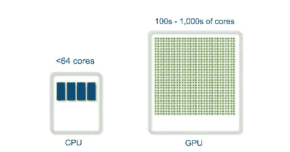
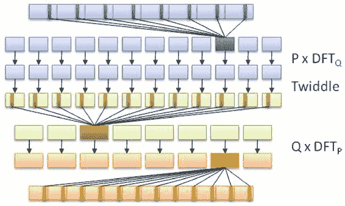
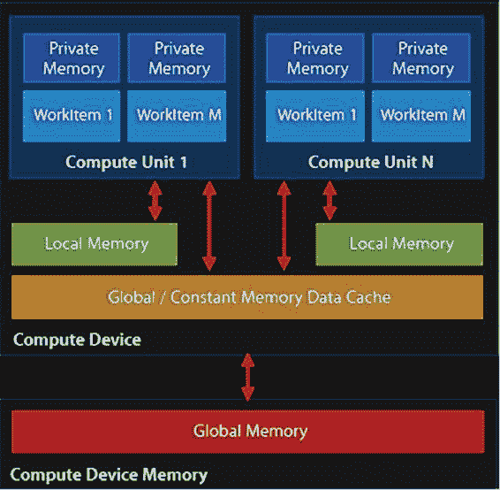
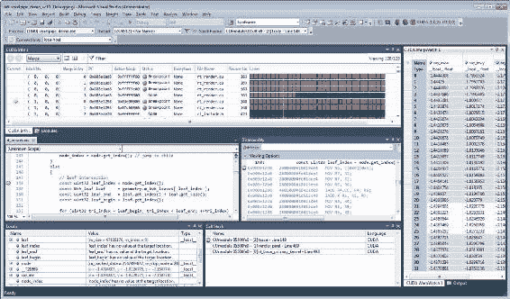

# 第十章：使用 GPGPU 进行多线程处理

最近的一个发展是使用视频卡（GPU）进行通用计算（GPGPU）。使用诸如 CUDA 和 OpenCL 之类的框架，可以加速例如在医疗、军事和科学应用中并行处理大型数据集的处理。在本章中，我们将看看如何使用 C++和 OpenCL 来实现这一点，以及如何将这样的功能集成到 C++中的多线程应用程序中。

本章的主题包括：

+   将 OpenCL 集成到基于 C++的应用程序中

+   在多线程中使用 OpenCL 的挑战

+   延迟和调度对多线程性能的影响

# GPGPU 处理模型

在第九章中，*使用分布式计算进行多线程处理*，我们看到在集群系统中跨多个计算节点运行相同的任务。这样设置的主要目标是以高度并行的方式处理数据，从理论上讲，相对于具有较少 CPU 核心的单个系统，可以加快处理速度。

**GPGPU**（图形处理单元上的通用计算）在某些方面与此类似，但有一个主要区别：虽然只有常规 CPU 的计算集群擅长标量任务--即在一组数据上执行一个任务（SISD）--GPU 是擅长 SIMD（单输入，多数据）任务的矢量处理器。

基本上，这意味着一个人可以将大型数据集发送到 GPU，以及单个任务描述，GPU 将继续在其数百或数千个核上并行执行该数据的部分相同任务。因此，人们可以将 GPU 视为一种非常专业化的集群：



# 实施

当 GPGPU 的概念首次被提出（大约在 2001 年左右），编写 GPGPU 程序的最常见方式是使用 GLSL（OpenGL 着色语言）和类似的着色器语言。由于这些着色器语言已经针对 SIMD 任务（图像和场景数据）进行了优化，因此将它们调整为更通用的任务相对比较简单。

自那时起，出现了许多更专业的实现：

| **名称** | **自** | **所有者** | **备注** |
| --- | --- | --- | --- |
| CUDA | 2006 | NVidia | 这是专有的，仅在 NVidia GPU 上运行 |
| Close to Metal | 2006 | ATi/AMD | 这被放弃，支持 OpenCL |
| DirectCompute | 2008 | Microsoft | 这是随 DX11 发布的，可以在 DX10 GPU 上运行，仅限于 Windows 平台 |
| OpenCL | 2009 | Khronos Group | 这是开放标准，适用于所有主流平台上的 AMD、Intel 和 NVidia GPU，以及移动平台 |

# OpenCL

在各种当前的 GPGPU 实现中，由于没有限制，OpenCL 是迄今为止最有趣的 GPGPU API。它适用于几乎所有主流 GPU 和平台，甚至在某些移动平台上也得到支持。

OpenCL 的另一个显着特点是它不仅限于 GPGPU。作为其名称的一部分（开放计算语言），它将系统抽象为所谓的*计算设备*，每个设备都有自己的功能。GPGPU 是最常见的应用，但这个特性使得在 CPU 上首先进行测试实现变得相当容易，以便进行简单的调试。

OpenCL 的一个可能的缺点是它对内存和硬件细节采用了高度抽象，这可能会对性能产生负面影响，尽管它增加了代码的可移植性。

在本章的其余部分，我们将专注于 OpenCL。

# 常见的 OpenCL 应用

许多程序包括基于 OpenCL 的代码，以加快操作。这些包括旨在进行图形处理的程序，以及 3D 建模和 CAD、音频和视频处理。一些例子包括：

+   Adobe Photoshop

+   GIMP

+   ImageMagick

+   Autodesk Maya

+   Blender

+   Handbrake

+   Vegas Pro

+   OpenCV

+   Libav

+   Final Cut Pro

+   FFmpeg

在办公应用程序中，包括 LibreOffice Calc 和 Microsoft Excel 中，还发现了某些操作的进一步加速。

也许更重要的是，OpenCL 通常用于科学计算和密码学，包括 BOINC 和 GROMACS 以及许多其他库和程序。

# OpenCL 版本

自 2008 年 12 月 8 日发布 OpenCL 规范以来，迄今已经有五次更新，将其升级到 2.2 版本。这些更新中的重要变化如下。

# OpenCL 1.0

首次公开发布是由苹果作为 macOS X Snow Leopard 发布的一部分于 2009 年 8 月 28 日发布。

与此同时，AMD 宣布将支持 OpenCL 并淘汰其自己的 Close to Metal（CtM）框架。 NVidia，RapidMind 和 IBM 还为其自己的框架添加了对 OpenCL 的支持。

# OpenCL 1.1

OpenCL 1.1 规范于 2010 年 6 月 14 日由 Khronos Group 批准。它为并行编程和性能增加了额外的功能，包括以下内容：

+   包括 3 组分向量和额外的图像格式在内的新数据类型

+   处理来自多个主机线程的命令，并在多个设备上处理缓冲区

+   对缓冲区的区域进行操作，包括读取、写入和复制 1D、2D 或 3D 矩形区域

+   增强事件的使用来驱动和控制命令执行

+   额外的 OpenCL 内置 C 函数，如整数夹紧、洗牌和异步步进（不连续，但数据之间有间隙）复制

+   通过有效共享图像和缓冲区来改进 OpenGL 互操作性，通过链接 OpenCL 和 OpenGL 事件

# OpenCL 1.2

OpenCL 1.2 版本于 2011 年 11 月 15 日发布。其最重要的功能包括以下内容：

+   **设备分区：**这使应用程序能够将设备分成子设备，直接控制对特定计算单元的工作分配，为高优先级/延迟敏感任务保留设备的一部分，或有效地使用共享硬件资源，如缓存。

+   **对象的分离编译和链接：**这提供了传统编译器的功能和灵活性，使得可以创建 OpenCL 程序的库，供其他程序链接。

+   **增强的图像支持：**这包括对 1D 图像和 1D 和 2D 图像数组的增强支持。此外，OpenGL 共享扩展现在可以从 OpenGL 1D 纹理和 1D 和 2D 纹理数组创建 OpenCL 图像。

+   **内置内核：**这代表了专门或不可编程硬件及相关固件的功能，如视频编码器/解码器和数字信号处理器，使得这些定制设备可以从 OpenCL 框架中驱动并与之紧密集成。

+   **DX9 媒体表面共享：**这使得 OpenCL 和 DirectX 9 或 DXVA 媒体表面之间的有效共享成为可能。

+   **DX11 表面共享：**实现 OpenCL 和 DirectX 11 表面之间的无缝共享。

# OpenCL 2.0

OpenCL2.0 版本于 2013 年 11 月 18 日发布。此版本具有以下重大变化或增加：

+   **共享虚拟内存：**主机和设备内核可以直接共享复杂的、包含指针的数据结构，如树和链表，提供了重要的编程灵活性，并消除了主机和设备之间昂贵的数据传输。

+   **动态并行性：**设备内核可以在没有主机交互的情况下将内核排队到同一设备，从而实现灵活的工作调度范例，并避免在设备和主机之间传输执行控制和数据，通常显著减轻主机处理器瓶颈。

+   **通用地址空间：**函数可以在不指定参数的命名地址空间的情况下编写，特别适用于声明为指向类型的指针的参数，消除了需要为应用程序中使用的每个命名地址空间编写多个函数的需要。

+   **图像**：改进的图像支持，包括 sRGB 图像和 3D 图像写入，内核可以从同一图像读取和写入，以及从 mip-mapped 或多采样 OpenGL 纹理创建 OpenCL 图像以改进 OpenGL 互操作性。

+   **C11 原子操作**：C11 原子操作和同步操作的子集，可以使一个工作项中的赋值对设备上执行的其他工作项或在设备和主机之间共享数据的工作组可见。

+   **管道**：管道是以 FIFO 形式存储数据的内存对象，OpenCL 2.0 提供了内核读取或写入管道的内置函数，可以直接编程管道数据结构，这可以由 OpenCL 实现者进行高度优化。

+   **Android 可安装客户端驱动扩展**：使得可以在 Android 系统上发现和加载 OpenCL 实现作为共享对象。

# OpenCL 2.1

OpenCL 2.1 标准于 2015 年 11 月 16 日发布，这个版本最显著的特点是引入了 OpenCL C++内核语言，就像 OpenCL 语言最初是基于带有扩展的 C 一样，C++版本是基于 C++14 的子集，同时向后兼容 C 内核语言。

OpenCL API 的更新包括以下内容：

+   **子组**：这些使得对硬件线程的更精细控制现在已经成为核心，还有额外的子组查询操作，以增加灵活性。

+   **内核对象和状态的复制**：clCloneKernel 可以复制内核对象和状态，以安全地实现包装类中的复制构造函数

+   **低延迟设备定时器查询**：这允许在设备和主机代码之间对齐分析数据

+   **运行时的中间 SPIR-V 代码**：

+   LLVM 到 SPIR-V 之间的双向翻译器，以便在工具链中灵活使用这两种中间语言。

+   通过上述翻译生成 SPIR-V 的 OpenCL C 到 LLVM 编译器。

+   SPIR-V 汇编器和反汇编器。

标准可移植中间表示（SPIR）及其后继者 SPIR-V，是为了在 OpenCL 设备上提供设备无关的二进制文件的一种方式。

# OpenCL 2.2

2017 年 5 月 16 日，现在的 OpenCL 版本发布。根据 Khronos Group 的说法，它包括以下更改：

+   OpenCL 2.2 将 OpenCL C++内核语言纳入核心规范，显著增强了并行编程的生产力

+   OpenCL C++内核语言是 C++14 标准的静态子集，包括类、模板、Lambda 表达式、函数重载和许多其他用于通用和元编程的构造

+   利用全面支持 OpenCL C++内核语言的新 Khronos SPIR-V 1.1 中间语言

+   OpenCL 库函数现在可以利用 C++语言来提供更高的安全性和减少未定义行为，同时访问原子操作、迭代器、图像、采样器、管道和设备队列内置类型和地址空间

+   管道存储是 OpenCL 2.2 中的一种新的设备端类型，对于 FPGA 实现非常有用，因为它可以在编译时知道连接大小和类型，并能够在内核之间实现高效的设备范围通信

+   OpenCL 2.2 还包括增强生成代码的功能：应用程序可以在 SPIR-V 编译时提供特化常量的值，新的查询可以检测程序范围全局对象的非平凡构造函数和析构函数，用户回调可以在程序释放时设置

+   可在任何支持 OpenCL 2.0 的硬件上运行（只需要更新驱动程序）

# 设置开发环境

无论您使用哪个平台和 GPU，进行 OpenCL 开发最重要的部分是从制造商那里获取适用于自己 GPU 的 OpenCL 运行时。在这里，AMD、Intel 和 Nvidia 都为所有主流平台提供 SDK。对于 Nvidia，OpenCL 支持包含在 CUDA SDK 中。

除了 GPU 供应商的 SDK 之外，人们还可以在他们的网站上找到有关该 SDK 支持哪些 GPU 的详细信息。

# Linux

在按照提供的说明安装供应商的 GPGPU SDK 后，我们仍然需要下载 OpenCL 头文件。与供应商提供的共享库和运行时文件不同，这些头文件是通用的，可以与任何 OpenCL 实现一起使用。

对于基于 Debian 的发行版，只需执行以下命令行：

```cpp
    $ sudo apt-get install opencl-headers

```

对于其他发行版，软件包可能被称为相同的名称，或者是不同的名称。请查阅发行版的手册，了解如何找到软件包的名称。

安装 SDK 和 OpenCL 头文件后，我们就可以编译我们的第一个 OpenCL 应用程序了。

# Windows

在 Windows 上，我们可以选择使用 Visual Studio（Visual C++）或 Windows 版的 GCC（MinGW）进行开发。为了与 Linux 版本保持一致，我们将使用 MinGW 以及 MSYS2。这意味着我们将拥有相同的编译器工具链、相同的 Bash shell 和实用程序，以及 Pacman 软件包管理器。

在安装供应商的 GPGPU SDK 后，如前所述，只需在 MSYS2 shell 中执行以下命令行，即可安装 OpenCL 头文件：

```cpp
    $ pacman -S mingw64/mingw-w64-x86_64-opencl-headers

```

或者，在使用 32 位 MinGW 版本时，执行以下命令行：

```cpp
    mingw32/mingw-w64-i686-opencl-headers 

```

有了这个，OpenCL 头文件就位了。现在我们只需要确保 MinGW 链接器可以找到 OpenCL 库。使用 NVidia CUDA SDK，您可以使用`CUDA_PATH`环境变量，或浏览 SDK 的安装位置，并将适当的 OpenCL LIB 文件从那里复制到 MinGW lib 文件夹中，确保不要混淆 32 位和 64 位文件。

现在共享库也已经就位，我们可以编译 OpenCL 应用程序。

# OS X/MacOS

从 OS X 10.7 开始，OS 中提供了 OpenCL 运行时。安装 XCode 以获取开发头文件和库后，就可以立即开始 OpenCL 开发。

# 一个基本的 OpenCL 应用程序

一个常见的 GPGPU 应用程序的例子是计算快速傅里叶变换（FFT）。这个算法通常用于音频处理等领域，允许您将例如从时域到频域进行转换，以进行分析。

它的作用是对数据集应用分治法，以计算 DFT（离散傅里叶变换）。它通过将输入序列分成固定的小数量的较小子序列，计算它们的 DFT，并组装这些输出，以组成最终序列。

这是相当高级的数学，但可以说它之所以非常适合 GPGPU，是因为它是一个高度并行的算法，采用数据的分割来加速 DFT 的计算，如图所示：



每个 OpenCL 应用程序至少由两部分组成：设置和配置 OpenCL 实例的 C++代码，以及实际的 OpenCL 代码，也称为内核，例如基于维基百科 FFT 演示示例的这个。

```cpp
// This kernel computes FFT of length 1024\.  
// The 1024 length FFT is decomposed into calls to a radix 16 function,  
// another radix 16 function and then a radix 4 function
 __kernel void fft1D_1024 (__global float2 *in,  
                     __global float2 *out,  
                     __local float *sMemx,  
                     __local float *sMemy) {
          int tid = get_local_id(0);
          int blockIdx = get_group_id(0) * 1024 + tid;
          float2 data[16];

          // starting index of data to/from global memory
          in = in + blockIdx;  out = out + blockIdx;

          globalLoads(data, in, 64); // coalesced global reads
          fftRadix16Pass(data);      // in-place radix-16 pass
          twiddleFactorMul(data, tid, 1024, 0);

          // local shuffle using local memory
          localShuffle(data, sMemx, sMemy, tid, (((tid & 15) * 65) + (tid >> 4)));
          fftRadix16Pass(data);               // in-place radix-16 pass
          twiddleFactorMul(data, tid, 64, 4); // twiddle factor multiplication

          localShuffle(data, sMemx, sMemy, tid, (((tid >> 4) * 64) + (tid & 15)));

          // four radix-4 function calls
          fftRadix4Pass(data);      // radix-4 function number 1
          fftRadix4Pass(data + 4);  // radix-4 function number 2
          fftRadix4Pass(data + 8);  // radix-4 function number 3
          fftRadix4Pass(data + 12); // radix-4 function number 4

          // coalesced global writes
    globalStores(data, out, 64);
 } 

```

这个 OpenCL 内核表明，与 GLSL 着色器语言一样，OpenCL 的内核语言本质上是 C 语言，具有许多扩展。虽然可以使用 OpenCL C++内核语言，但这个语言仅在 OpenCL 2.1（2015 年）之后才可用，因此对它的支持和示例比 C 内核语言更少。

接下来是 C++应用程序，使用它，我们运行前面的 OpenCL 内核：

```cpp
#include <cstdio>
 #include <ctime>
 #include "CL\opencl.h"

 #define NUM_ENTRIES 1024

 int main() { // (int argc, const char * argv[]) {
    const char* KernelSource = "fft1D_1024_kernel_src.cl"; 

```

在这里，我们可以看到，我们只需要包含一个头文件，就可以访问 OpenCL 函数。我们还要指定包含我们 OpenCL 内核源代码的文件的名称。由于每个 OpenCL 设备可能是不同的架构，当我们加载内核时，内核会被编译为目标设备：

```cpp
          const cl_uint num = 1;
    clGetDeviceIDs(0, CL_DEVICE_TYPE_GPU, 0, 0, (cl_uint*) num); 

   cl_device_id devices[1];
    clGetDeviceIDs(0, CL_DEVICE_TYPE_GPU, num, devices, 0);

```

接下来，我们必须获取可以使用的 OpenCL 设备列表，并通过 GPU 进行过滤：

```cpp
    cl_context context = clCreateContextFromType(0, CL_DEVICE_TYPE_GPU,  
                                                   0, 0, 0); 

```

然后，我们使用找到的 GPU 设备创建一个 OpenCL`context`。上下文管理一系列设备上的资源：

```cpp
    clGetDeviceIDs(0, CL_DEVICE_TYPE_DEFAULT, 1, devices, 0);
    cl_command_queue queue = clCreateCommandQueue(context, devices[0], 0, 0); 

```

最后，我们将创建包含要在 OpenCL 设备上执行的命令的命令队列：

```cpp
    cl_mem memobjs[] = { clCreateBuffer(context, CL_MEM_READ_ONLY | CL_MEM_COPY_HOST_PTR, sizeof(float) * 2 * NUM_ENTRIES, 0, 0),              
   clCreateBuffer(context, CL_MEM_READ_WRITE, sizeof(float) * 2 * NUM_ENTRIES, 0, 0) }; 

```

为了与设备通信，我们需要分配缓冲区对象，这些对象将包含我们将复制到它们的内存中的数据。在这里，我们将分配两个缓冲区，一个用于读取，一个用于写入：

```cpp
    cl_program program = clCreateProgramWithSource(context, 1, (const char **)& KernelSource, 0, 0); 

```

现在我们已经将数据放在设备上，但仍需要在设备上加载内核。为此，我们将使用前面查看的 OpenCL 内核源代码创建一个内核，使用我们之前定义的文件名：

```cpp
    clBuildProgram(program, 0, 0, 0, 0, 0); 

```

接下来，我们将按以下方式编译源代码：

```cpp
   cl_kernel kernel = clCreateKernel(program, "fft1D_1024", 0); 

```

最后，我们将从我们创建的二进制文件中创建实际的内核：

```cpp
    size_t local_work_size[1] = { 256 };

    clSetKernelArg(kernel, 0, sizeof(cl_mem), (void *) &memobjs[0]);
    clSetKernelArg(kernel, 1, sizeof(cl_mem), (void *) &memobjs[1]);
    clSetKernelArg(kernel, 2, sizeof(float) * (local_work_size[0] + 1) * 16, 0);
    clSetKernelArg(kernel, 3, sizeof(float) * (local_work_size[0] + 1) * 16, 0); 

```

为了将参数传递给我们的内核，我们必须在这里设置它们。在这里，我们将添加指向我们缓冲区的指针和工作大小的维度：

```cpp
    size_t global_work_size[1] = { 256 };
          global_work_size[0] = NUM_ENTRIES;
    local_work_size[0]  =  64;  // Nvidia: 192 or 256
    clEnqueueNDRangeKernel(queue, kernel, 1, 0, global_work_size, local_work_size, 0, 0, 0); 

```

现在我们可以设置工作项维度并执行内核。在这里，我们将使用一种内核执行方法，允许我们定义工作组的大小：

```cpp
          cl_mem C = clCreateBuffer(context, CL_MEM_WRITE_ONLY, (size), 0, &ret);
                      cl_int ret = clEnqueueReadBuffer(queue, memobjs[1], CL_TRUE, 0, sizeof(float) * 2 * NUM_ENTRIES, C, 0, 0, 0); 

```

执行内核后，我们希望读取生成的信息。为此，我们告诉 OpenCL 将分配的写缓冲区复制到新分配的缓冲区中。现在我们可以自由地使用这个缓冲区中的数据。

然而，在这个例子中，我们不会使用这些数据：

```cpp
    clReleaseMemObject(memobjs[0]);
    clReleaseMemObject(memobjs[1]); 
   clReleaseCommandQueue(queue); 
   clReleaseKernel(kernel); 
   clReleaseProgram(program); 
   clReleaseContext(context); 
   free(C);
 } 

```

最后，我们释放分配的资源并退出。

# GPU 内存管理

在使用 CPU 时，我们必须处理多层内存层次结构，从主内存（最慢）到 CPU 缓存（更快），再到 CPU 寄存器（最快）。GPU 也是如此，我们必须处理一个可能会显著影响应用程序速度的内存层次结构。

在 GPU 上最快的也是寄存器（或私有）内存，我们拥有的比平均 CPU 多得多。之后是本地内存，这是一种由多个处理单元共享的内存。GPU 本身上最慢的是内存数据缓存，也称为纹理内存。这是卡上的一个内存，通常被称为视频 RAM（VRAM），使用高带宽，但相对高延迟的内存，比如 GDDR5。

绝对最慢的是使用主机系统的内存（系统 RAM），因为这需要通过 PCIe 总线和其他各种子系统传输数据。相对于设备内存系统，主机设备通信最好称为“冰川”。

对于 AMD、Nvidia 和类似的专用 GPU 设备，内存架构可以像这样进行可视化：



由于这种内存布局，建议以大块传输任何数据，并在可能的情况下使用异步传输。理想情况下，内核将在 GPU 核心上运行，并将数据流式传输到它，以避免任何延迟。

# GPGPU 和多线程

将多线程代码与 GPGPU 结合使用要比尝试管理在 MPI 集群上运行的并行应用程序容易得多。这主要是由于以下工作流程：

1.  准备数据：准备要处理的数据，比如大量的图像或单个大图像，将其发送到 GPU 的内存中。

1.  准备内核：加载 OpenCL 内核文件并将其编译为 OpenCL 内核。

1.  执行内核：将内核发送到 GPU 并指示它开始处理数据。

1.  读取数据：一旦我们知道处理已经完成，或者已经达到特定的中间状态，我们将读取我们作为 OpenCL 内核参数传递的缓冲区，以获取我们的结果。

由于这是一个异步过程，可以将其视为一种“发射并忘记”的操作，只需有一个专用线程来监视活动内核的过程。

在多线程和 GPGPU 应用方面最大的挑战不在于基于主机的应用程序，而是在于运行在 GPU 上的 GPGPU 内核或着色器程序，因为它必须在本地和远程处理单元之间协调内存管理和处理，确定根据数据类型使用哪种内存系统，而不会在处理其他地方引起问题。

这是一个需要大量试错、分析和优化的细致过程。一个内存复制优化或使用异步操作而不是同步操作可能会将处理时间从几个小时减少到几分钟。对内存系统的良好理解对于防止数据饥饿和类似问题至关重要。

由于 GPGPU 通常用于加速持续时间显著的任务（几分钟到几小时甚至更长），因此最好从多线程的角度来看待它，尽管存在一些重要的复杂性，主要是延迟的形式。

# 延迟

正如我们在早期关于 GPU 内存管理的部分中提到的，最好首先使用最接近 GPU 处理单元的内存，因为它们是最快的。这里的最快主要意味着它们具有较低的延迟，意味着从内存请求信息到接收响应所花费的时间。

确切的延迟会因 GPU 而异，但以 Nvidia 的 Kepler（Tesla K20）架构为例，可以期望延迟为：

+   **全局**内存：450 个周期。

+   **常量**内存缓存：45-125 个周期。

+   **本地**（**共享**）内存：45 个周期。

这些测量都是在 CPU 本身上进行的。对于 PCIe 总线，一旦开始传输多兆字节的缓冲区，一个传输可能需要几毫秒的时间。例如，填充 GPU 的内存以千兆字节大小的缓冲区可能需要相当长的时间。

对于通过 PCIe 总线的简单往返，延迟可以用微秒来衡量，对于以 1+ GHz 运行的 GPU 核心来说，似乎是一段漫长的时间。这基本上定义了为什么主机和 GPU 之间的通信应该绝对最小化并且高度优化。

# 潜在问题

GPGPU 应用的一个常见错误是在处理完成之前读取结果缓冲区。在将缓冲区传输到设备并执行内核之后，必须插入同步点以通知主机处理已经完成。这些通常应该使用异步方法实现。

正如我们在延迟部分中所介绍的，重要的是要记住请求和响应之间可能存在非常大的延迟，这取决于内存子系统或总线。不这样做可能会导致奇怪的故障、冻结和崩溃，以及数据损坏和似乎永远等待的应用程序。

对于 GPGPU 应用进行分析是至关重要的，以便了解 GPU 利用率如何，以及流程是否接近最佳状态。

# 调试 GPGPU 应用

GPGPU 应用的最大挑战是调试内核。CUDA 出于这个原因带有一个模拟器，它允许在 CPU 上运行和调试内核。OpenCL 允许在 CPU 上运行内核而无需修改，尽管这可能不会得到与在特定 GPU 设备上运行时相同的行为（和错误）。

一个稍微更高级的方法涉及使用专用调试器，例如 Nvidia 的 Nsight，它有适用于 Visual Studio（[`developer.nvidia.com/nvidia-nsight-visual-studio-edition`](https://developer.nvidia.com/nvidia-nsight-visual-studio-edition)）和 Eclipse（[`developer.nvidia.com/nsight-eclipse-edition`](https://developer.nvidia.com/nsight-eclipse-edition)）的版本。

根据 Nsight 网站上的营销宣传：

NVIDIA Nsight Visual Studio Edition 将 GPU 计算引入了 Microsoft Visual Studio（包括 VS2017 的多个实例）。这个 GPU 的应用程序开发环境允许您构建、调试、分析和跟踪使用 CUDA C/C++、OpenCL、DirectCompute、Direct3D、Vulkan API、OpenGL、OpenVR 和 Oculus SDK 构建的异构计算、图形和虚拟现实应用程序。

以下截图显示了一个活跃的 CUDA 调试会话：



这样一个调试工具的一个很大的优势是，它允许用户通过识别瓶颈和潜在问题来监视、分析和优化自己的 GPGPU 应用程序。

# 总结

在本章中，我们看了如何将 GPGPU 处理集成到 C++应用程序中，以 OpenCL 的形式。我们还研究了 GPU 内存层次结构以及这如何影响性能，特别是在主机设备通信方面。

现在你应该熟悉 GPGPU 的实现和概念，以及如何创建一个 OpenCL 应用程序，以及如何编译和运行它。如何避免常见错误也应该是已知的。

作为本书的最后一章，希望所有主要问题都已得到解答，并且前面的章节以及本章在某种程度上都是有益的和有帮助的。

从这本书开始，读者可能对更详细地探究其中任何一个主题感兴趣，而在线和离线都有许多资源可用。多线程和相关领域的主题非常广泛，涉及到许多应用，从商业到科学、艺术和个人应用。

读者可能想要建立自己的 Beowulf 集群，或者专注于 GPGPU，或者将两者结合起来。也许有一个复杂的应用程序他们想要写一段时间了，或者只是想玩编程。
