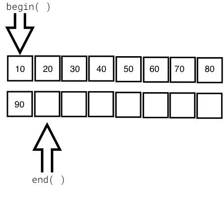

# 第二章：标准模板库

本章将涵盖以下主题：

+   STL 概述

+   STL 架构

+   容器

+   迭代器

+   算法

+   函数对象

+   STL 容器

+   序列

+   关联

+   无序

+   适配器

让我们在以下各节中逐个查看 STL 主题。

# 标准模板库架构

C++ **标准模板库**（**STL**）提供了现成的通用容器、可应用于容器的算法以及用于导航容器的迭代器。STL 是用 C++模板实现的，模板允许在 C++中进行通用编程。

STL 鼓励 C++开发人员专注于手头的任务，通过摆脱编写低级数据结构和算法的开发人员。STL 是一个经过时间考验的库，可以实现快速应用程序开发。

STL 是一项有趣的工作和架构。它的秘密公式是编译时多态性。为了获得更好的性能，STL 避免了动态多态性，告别了虚函数。广义上来说，STL 有以下四个组件：

+   算法

+   函数对象

+   迭代器

+   容器

STL 架构将所有上述四个组件都连接在一起。它具有许多常用的算法，并提供性能保证。有趣的是，STL 算法可以在不了解包含数据的容器的情况下无缝工作。这是由于迭代器的高级遍历 API，它完全抽象了容器中使用的底层数据结构。STL 广泛使用运算符重载。让我们逐个了解 STL 的主要组件，以便对 STL 的概念有一个很好的理解。

# 算法

STL 算法由 C++模板支持；因此，相同的算法可以处理不同的数据类型，或者独立于容器中数据的组织方式。有趣的是，STL 算法足够通用，可以使用模板支持内置和用户定义的数据类型。事实上，算法通过迭代器与容器进行交互。因此，对算法来说重要的是容器支持的迭代器。话虽如此，算法的性能取决于容器中使用的底层数据结构。因此，某些算法仅适用于选择性的容器，因为 STL 支持的每个算法都期望某种类型的迭代器。

# 迭代器

迭代器是一种设计模式，但有趣的是，STL 的工作开始得早得多

*四人帮*将他们与设计模式相关的工作发布给了软件社区。迭代器本身是允许遍历容器以访问、修改和操作容器中存储的数据的对象。迭代器以如此神奇的方式进行操作，以至于我们不会意识到或需要知道数据存储在何处以及如何检索。

以下图像直观地表示了一个迭代器：


从上图中，您可以了解到每个迭代器都支持`begin()` API，它返回第一个元素的位置，`end()` API 返回容器中最后一个元素的下一个位置。

STL 广泛支持以下五种类型的迭代器：

+   输入迭代器

+   输出迭代器

+   前向迭代器

+   双向迭代器

+   随机访问迭代器

容器实现了迭代器，让我们可以轻松地检索和操作数据，而不需要深入了解容器的技术细节。

以下表格解释了五种迭代器中的每一种：

| **迭代器的类型** | **描述** |
| --- | --- |
| 输入迭代器 |

+   用于从指向的元素中读取

+   它适用于单次导航，一旦到达容器的末尾，迭代器将失效

+   它支持前增量和后增量运算符

+   它不支持递减运算符

+   它支持解引用

+   它支持`==`和`!=`运算符来与其他迭代器进行比较

+   `istream_iterator`迭代器是输入迭代器

+   所有容器都支持这个迭代器

|

| 输出迭代器 |
| --- |

+   它用于修改指向的元素

+   它对于单次导航是有效的，一旦到达容器的末尾，迭代器将无效

+   它支持前增量和后增量运算符

+   它不支持减量运算符

+   它支持解引用

+   它不支持`==`和`!=`运算符

+   `ostream_iterator`，`back_inserter`，`front_inserter`迭代器是输出迭代器的示例

+   所有容器都支持这个迭代器

|

| 前向迭代器 |
| --- |

+   它支持输入迭代器和输出迭代器的功能

+   它允许多次导航

+   它支持前增量和后增量运算符

+   它支持解引用

+   `forward_list`容器支持前向迭代器

|

| 双向迭代器 |
| --- |

+   它是一个支持双向导航的前向迭代器

+   它允许多次导航

+   它支持前增量和后增量运算符

+   它支持前减量和后减量运算符

+   它支持解引用

+   它支持`[]`运算符

+   `list`，`set`，`map`，`multiset`和`multimap`容器支持双向迭代器

|

| 随机访问迭代器 |
| --- |

+   元素可以使用任意偏移位置进行访问

+   它支持前增量和后增量运算符

+   它支持前减量和后减量运算符

+   它支持解引用

+   它是功能上最完整的迭代器，因为它支持先前列出的其他类型迭代器的所有功能

+   `array`，`vector`和`deque`容器支持随机访问迭代器

+   支持随机访问的容器自然也支持双向和其他类型的迭代器

|

# 容器

STL 容器通常是动态增长和收缩的对象。容器在内部使用复杂的数据结构存储数据，并提供高级函数来访问数据，而不需要我们深入了解数据结构的复杂内部实现细节。STL 容器非常高效且经过时间考验。

每个容器使用不同类型的数据结构以有效的方式存储、组织和操作数据。尽管许多容器可能看起来相似，但在内部它们的行为是不同的。因此，选择错误的容器会导致应用程序性能问题和不必要的复杂性。

容器有以下几种类型：

+   顺序

+   关联

+   容器适配器

容器中存储的对象是复制或移动的，而不是引用。我们将在接下来的部分中使用简单而有趣的示例来探索每种类型的容器。

# 函数对象

函数对象是行为类似于常规函数的对象。美妙之处在于函数对象可以替代函数指针的位置。函数对象是方便的对象，让您在不损害面向对象编码原则的情况下扩展或补充 STL 函数的行为。

函数对象很容易实现；你只需要重载函数运算符。函数对象也被称为函数对象。

以下代码将演示如何实现一个简单的函数对象：

```cpp
#include <iostream>
#include <vector>
#include <iterator>
#include <algorithm>
using namespace std;

template <typename T>
class Printer {
public:
  void operator() ( const T& element ) {
    cout << element << "\t";
  }
};

int main () {
  vector<int> v = { 10, 20, 30, 40, 50 };

  cout << "\nPrint the vector entries using Functor" << endl;

  for_each ( v.begin(), v.end(), Printer<int>() );

  cout << endl;

  return 0;
}
```

让我们快速编译程序，使用以下命令：

```cpp
g++ main.cpp -std=c++17
./a.out
```

让我们来检查程序的输出：

```cpp
Print the vector entries using Functor
10  20  30  40  50
```

我们希望你意识到函数对象是多么简单和酷。

# 序列容器

STL 支持一系列非常有趣的序列容器。序列容器以线性方式存储同质数据类型，可以按顺序访问。STL 支持以下序列容器：

+   数组

+   向量

+   列表

+   `forward_list`

+   双端队列

由于存储在 STL 容器中的对象只是值的副本，STL 从用户定义的数据类型中期望满足一些基本要求，以便将这些对象存储在容器中。存储在 STL 容器中的每个对象都必须提供以下最低要求：

+   一个默认构造函数

+   一个复制构造函数

+   一个赋值运算符

让我们逐个探索序列容器在以下子节中。

# 数组

STL 数组容器是一个固定大小的序列容器，就像 C/C++内置数组一样，只是 STL 数组是大小感知的，比内置的 C/C++数组要聪明一点。让我们通过一个例子来了解 STL 数组：

```cpp
#include <iostream>
#include <array>
using namespace std;
int main () {
  array<int,5> a = { 1, 5, 2, 4, 3 };

  cout << "\nSize of array is " << a.size() << endl;

  auto pos = a.begin();

  cout << endl;
  while ( pos != a.end() ) 
    cout << *pos++ << "\t";
  cout << endl;

  return 0;
}
```

可以使用以下命令编译前面的代码并查看输出：

```cpp
g++ main.cpp -std=c++17
./a.out 
```

程序的输出如下：

```cpp
Size of array is 5
1     5     2     4     3
```

# 代码演示

以下行声明了一个固定大小（`5`）的数组，并用五个元素初始化了数组：

```cpp
array<int,5> a = { 1, 5, 2, 4, 3 };
```

一旦声明，大小就不能更改，就像 C/C++内置数组一样。`array::size()`方法返回数组的大小，不管在初始化列表中初始化了多少个整数。`auto pos = a.begin()`方法声明了一个`array<int,5>`的迭代器，并分配了数组的起始位置。`array::end()`方法指向数组中最后一个元素的下一个位置。迭代器的行为类似于或模拟 C++指针，对迭代器进行解引用会返回迭代器指向的值。迭代器位置可以通过`++pos`和`--pos`向前和向后移动。

# 数组中常用的 API

以下表格显示了一些常用的数组 API：

| **API** | **描述** |
| --- | --- |
| `at( int index )` | 这返回存储在由索引引用的位置的值。索引是从零开始的索引。如果索引超出数组的索引范围，此 API 将抛出`std::out_of_range`异常。 |
| `operator [ int index ]` | 这是一个不安全的方法，如果索引超出数组的有效范围，它不会抛出任何异常。这比`at`稍微快一点，因为此 API 不执行边界检查。 |
| `front()` | 这返回数组中的第一个元素。 |
| `back()` | 这返回数组中的最后一个元素。 |
| `begin()` | 这返回数组中第一个元素的位置 |
| `end()` | 这返回数组中最后一个元素的下一个位置 |
| `rbegin()` | 这返回反向开始位置，即返回数组中的最后一个元素的位置 |
| `rend()` | 这返回反向结束位置，即返回数组中第一个元素之前的一个位置 |
| `size()` | 这返回数组的大小 |

数组容器支持随机访问；因此，给定一个索引，数组容器可以在*O(1)*或常量时间内获取一个值。

可以使用反向迭代器以反向方式访问数组容器元素：

```cpp
#include <iostream>
#include <array>
using namespace std;

int main () {

    array<int, 6> a;
    int size = a.size();
    for (int index=0; index < size; ++index)
         a[index] = (index+1) * 100;   

    cout << "\nPrint values in original order ..." << endl;

    auto pos = a.begin();
    while ( pos != a.end() )
        cout << *pos++ << "\t";
    cout << endl;

    cout << "\nPrint values in reverse order ..." << endl;

    auto rpos = a.rbegin();
    while ( rpos != a.rend() )
    cout << *rpos++ << "\t";
    cout << endl;

    return 0;
}
```

我们将使用以下命令来获取输出：

```cpp
./a.out
```

输出如下：

```cpp
Print values in original order ...
100   200   300   400   500   600

Print values in reverse order ...
600   500   400   300   200   100
```

# Vector

Vector 是一个非常有用的序列容器，它的工作原理与数组完全相同，只是向量可以在运行时增长和缩小，而数组的大小是固定的。但是，在数组和向量下面使用的数据结构是一个简单的内置 C/C++样式数组。

让我们看下面的例子更好地理解向量：

```cpp
#include <iostream>
#include <vector>
#include <algorithm>
using namespace std;

int main () {
  vector<int> v = { 1, 5, 2, 4, 3 };

  cout << "\nSize of vector is " << v.size() << endl;

  auto pos = v.begin();

  cout << "\nPrint vector elements before sorting" << endl;
  while ( pos != v.end() )
    cout << *pos++ << "\t";
  cout << endl;

  sort( v.begin(), v.end() );

  pos = v.begin();

  cout << "\nPrint vector elements after sorting" << endl;

  while ( pos != v.end() )
    cout << *pos++ << "\t";
  cout << endl;

  return 0;
}
```

可以使用以下命令编译前面的代码并查看输出：

```cpp
g++ main.cpp -std=c++17
./a.out
```

程序的输出如下：

```cpp
Size of vector is 5

Print vector elements before sorting
1     5     2     4     3

Print vector elements after sorting
1     2     3     4     5
```

# 代码演示

以下行声明了一个向量，并用五个元素初始化了向量：

```cpp
vector<int> v = { 1, 5, 2, 4, 3 };
```

然而，向量还允许使用`vector::push_back<data_type>( value )` API 将值附加到向量的末尾。`sort()`算法接受两个表示必须排序的数据范围的随机访问迭代器。由于向量内部使用内置的 C/C++数组，就像 STL 数组容器一样，向量也支持随机访问迭代器；因此，`sort()`函数是一个高效的算法，其运行时复杂度是对数的，即*O(N log2 (N))*。

# 常用的向量 API

以下表格显示了一些常用的向量 API：

| **API** | **描述** |
| --- | --- |
| `at ( int index )` | 这返回索引位置存储的值。如果索引无效，则会抛出`std::out_of_range`异常。 |
| `operator [ int index ]` | 这返回索引位置存储的值。它比`at( int index )`更快，因为该函数不执行边界检查。 |
| `front()` | 这返回向量中存储的第一个值。 |
| `back()`  | 这返回向量中存储的最后一个值。 |
| `empty()` | 如果向量为空，则返回 true，否则返回 false。 |
| `size()`  | 这返回向量中存储的值的数量。 |
| `reserve( int size )`  | 这保留向量的初始大小。当向量大小达到容量时，插入新值需要重新调整向量大小。这使得插入消耗*O(N)*的运行时复杂度。`reserve()`方法是对描述的问题的一种解决方法。 |
| `capacity()` | 这返回向量的总容量，而大小是向量中实际存储的值。 |
| `clear()`  | 这清除所有值。 |
| `push_back<data_type>( value )` | 这在向量末尾添加一个新值。 |

使用`istream_iterator`和`ostream_iterator`从/向向量读取和打印会非常有趣和方便。以下代码演示了向量的使用：

```cpp
#include <iostream>
#include <vector>
#include <algorithm>
#include <iterator>
using namespace std;

int main () {
    vector<int> v;

    cout << "\nType empty string to end the input once you are done feeding the vector" << endl;
    cout << "\nEnter some numbers to feed the vector ..." << endl;

    istream_iterator<int> start_input(cin);
    istream_iterator<int> end_input;

    copy ( start_input, end_input, back_inserter( v ) );

    cout << "\nPrint the vector ..." << endl;
    copy ( v.begin(), v.end(), ostream_iterator<int>(cout, "\t") );
    cout << endl;

    return 0;
}
```

请注意，程序的输出被跳过，因为输出取决于您输入的输入。请随时尝试在命令行上执行这些指令。

# 代码演示

基本上，复制算法接受一系列迭代器，其中前两个参数表示源，第三个参数表示目标，这恰好是向量：

```cpp
istream_iterator<int> start_input(cin);
istream_iterator<int> end_input;

copy ( start_input, end_input, back_inserter( v ) );
```

`start_input`迭代器实例定义了一个从`istream`和`cin`接收输入的`istream_iterator`迭代器，而`end_input`迭代器实例定义了一个文件结束符，它默认为空字符串(`""`)。因此，输入可以通过在命令行输入终端中键入`""`来终止。

同样，让我们了解以下代码片段：

```cpp
cout << "\nPrint the vector ..." << endl;
copy ( v.begin(), v.end(), ostream_iterator<int>(cout, "\t") );
cout << endl;
```

复制算法用于将向量中的值逐个复制到`ostream`中，并用制表符(`\t`)分隔输出。

# 向量的陷阱

每个 STL 容器都有其优点和缺点。没有单个 STL 容器在所有情况下都表现更好。向量内部使用数组数据结构，而在 C/C++中数组的大小是固定的。因此，当您尝试在向量大小已经达到最大容量时向向量添加新值时，向量将分配新的连续位置，以容纳旧值和新值在一个连续的位置。然后开始将旧值复制到新位置。一旦所有数据元素都被复制，向量将使旧位置无效。

每当这种情况发生时，向量插入将需要*O(N)*的运行时复杂度。随着向量大小随时间增长，按需，*O(N)*的运行时复杂度将表现出相当糟糕的性能。如果你知道所需的最大大小，你可以预留足够的初始大小来克服这个问题。然而，并不是在所有情况下你都需要使用向量。当然，向量支持动态大小和随机访问，在某些情况下具有性能优势，但你可能真的不需要随机访问，这种情况下列表、双端队列或其他一些容器可能更适合你。

# 列表

列表 STL 容器在内部使用双向链表数据结构。因此，列表只支持顺序访问，在最坏的情况下，在列表中搜索随机值可能需要*O(N)*的运行时复杂度。然而，如果你确定只需要顺序访问，列表确实提供了自己的好处。列表 STL 容器允许你以常数时间复杂度在最佳、平均和最坏的情况下在末尾、前面或中间插入数据元素，即*O(1)*的运行时复杂度。

以下图片展示了列表 STL 使用的内部数据结构：


让我们编写一个简单的程序，亲身体验使用列表 STL：

```cpp
#include <iostream>
#include <list>
#include <iterator>
#include <algorithm>
using namespace std;

int main () {

  list<int> l;

  for (int count=0; count<5; ++count)
    l.push_back( (count+1) * 100 );

  auto pos = l.begin();

  cout << "\nPrint the list ..." << endl;
  while ( pos != l.end() )
    cout << *pos++ << "-->";
  cout << " X" << endl;

  return 0;
}
```

我相信到现在为止你已经对 C++ STL 有了一些了解，它的优雅和强大。观察到语法在所有 STL 容器中保持不变是不是很酷？你可能已经注意到，无论你使用数组、向量还是列表，语法都保持不变。相信我，当你探索其他 STL 容器时，你会得到同样的印象。

话虽如此，前面的代码是不言自明的，因为我们在其他容器中做了差不多的事情。

让我们尝试对列表进行排序，如下所示的代码：

```cpp
#include <iostream>
#include <list>
#include <iterator>
#include <algorithm>
using namespace std;

int main () {

    list<int> l = { 100, 20, 80, 50, 60, 5 };

    auto pos = l.begin();

    cout << "\nPrint the list before sorting ..." << endl;
    copy ( l.begin(), l.end(), ostream_iterator<int>( cout, "-->" ));
    cout << "X" << endl;

    l.sort();

    cout << "\nPrint the list after sorting ..." << endl;
    copy ( l.begin(), l.end(), ostream_iterator<int>( cout, "-->" ));
    cout << "X" << endl; 

    return 0;
}
```

你注意到了`sort()`方法吗？是的，列表容器有自己的排序算法。列表容器支持自己版本的排序算法的原因是，通用的`sort()`算法需要一个随机访问迭代器，而列表容器不支持随机访问。在这种情况下，相应的容器将提供自己的高效算法来克服这个缺点。

有趣的是，列表支持的`sort`算法的运行时复杂度是*O(N log2 N)*。

# 列表中常用的 API

以下表格显示了 STL 列表的最常用 API：

| **API** | **描述** |
| --- | --- |
| `front()` | 返回列表中存储的第一个值 |
| `back() ` | 返回列表中存储的最后一个值 |
| `size()` | 返回列表中存储的值的数量 |
| `empty()` | 当列表为空时返回`true`，否则返回`false` |
| `clear()` | 清除列表中存储的所有值 |
| `push_back<data_type>( value )` | 这在列表末尾添加一个值 |
| `push_front<data_type>( value )` | 在列表的前面添加一个值 |
| `merge( list )` | 这将两个相同类型值的排序列表合并 |
| `reverse()` | 这将列表反转 |
| `unique()` | 从列表中删除重复的值 |
| `sort()` | 这对存储在列表中的值进行排序 |

# 前向列表

STL 的`forward_list`容器建立在单向链表数据结构之上；因此，它只支持向前导航。由于`forward_list`在内存和运行时方面每个节点消耗一个更少的指针，因此与列表容器相比，它被认为更有效。然而，作为性能优势的额外边缘的代价，`forward_list`不得不放弃一些功能。

以下图表显示了`forward_list`中使用的内部数据结构：


让我们来探索以下示例代码：

```cpp
#include <iostream>
#include <forward_list>
#include <iterator>
#include <algorithm>
using namespace std;

int main ( ) {

  forward_list<int> l = { 10, 10, 20, 30, 45, 45, 50 };

  cout << "\nlist with all values ..." << endl;
  copy ( l.begin(), l.end(), ostream_iterator<int>(cout, "\t") );

  cout << "\nSize of list with duplicates is " << distance( l.begin(), l.end() ) << endl;

  l.unique();

  cout << "\nSize of list without duplicates is " << distance( l.begin(), l.end() ) << endl;

  l.resize( distance( l.begin(), l.end() ) );

  cout << "\nlist after removing duplicates ..." << endl;
  copy ( l.begin(), l.end(), ostream_iterator<int>(cout, "\t") );
  cout << endl;

  return 0;

}
```

可以使用以下命令查看输出：

```cpp
./a.out
```

输出如下：

```cpp
list with all values ...
10    10    20    30    45    45    50
Size of list with duplicates is 7

Size of list without duplicates is 5

list after removing duplicates ...
10    20   30   45   50
```

# 代码演示

以下代码声明并初始化了`forward_list`容器，其中包含一些唯一值和一些重复值：

```cpp
forward_list<int> l = { 10, 10, 20, 30, 45, 45, 50 };
```

由于`forward_list`容器不支持`size()`函数，我们使用`distance()`函数来找到列表的大小：

```cpp
cout << "\nSize of list with duplicates is " << distance( l.begin(), l.end() ) << endl;
```

以下`forward_list<int>::unique()`函数删除重复的整数，保留唯一的值：

```cpp
l.unique();
```

# 在`forward_list`容器中常用的 API

下表显示了常用的`forward_list` API：

| **API** | **描述** |
| --- | --- |
| `front()` | 返回`forward_list`容器中存储的第一个值 |
| `empty()` | 当`forward_list`容器为空时返回 true，否则返回 false |
| `clear()` | 清除`forward_list`中存储的所有值 |
| `push_front<data_type>( value )` | 在`forward_list`的前面添加一个值 |
| `merge( list )` | 将两个排序的`forward_list`容器合并为相同类型的值 |
| `reverse()` | 反转`forward_list`容器 |
| `unique()` | 从`forward_list`容器中删除重复的值 |
| `sort()` | 对`forward_list`中存储的值进行排序 |

让我们再探索一个例子，以更好地理解`forward_list`容器：

```cpp
#include <iostream>
#include <forward_list>
#include <iterator>
#include <algorithm>
using namespace std;

int main () {

    forward_list<int> list1 = { 10, 20, 10, 45, 45, 50, 25 };
    forward_list<int> list2 = { 20, 35, 27, 15, 100, 85, 12, 15 };

    cout << "\nFirst list before sorting ..." << endl;
    copy ( list1.begin(), list1.end(), ostream_iterator<int>(cout, "\t") );
    cout << endl; 

    cout << "\nSecond list before sorting ..." << endl;
    copy ( list2.begin(), list2.end(), ostream_iterator<int>(cout, "\t") );
    cout << endl;

    list1.sort();
    list2.sort();

    cout << "\nFirst list after sorting ..." << endl;
    copy ( list1.begin(), list1.end(), ostream_iterator<int>(cout, "\t") );
    cout << endl; 

    cout << "\nSecond list after sorting ..." << endl;
    copy ( list2.begin(), list2.end(), ostream_iterator<int>(cout, "\t") );
    cout << endl;    

    list1.merge ( list2 );

    cout << "\nMerged list ..." << endl;
    copy ( list1.begin(), list1.end(), ostream_iterator<int>(cout, "\t") );

    cout << "\nMerged list after removing duplicates ..." << endl;
    list1.unique(); 
    copy ( list1.begin(), list1.end(), ostream_iterator<int>(cout, "\t") );

    return 0;
}
```

前面的代码片段是一个有趣的例子，演示了`sort()`、`merge()`和`unique()` STL 算法的实际用法。

可以使用以下命令查看输出：

```cpp
./a.out
```

程序的输出如下：

```cpp
First list before sorting ...
10   20   10   45   45   50   25
Second list before sorting ...
20   35   27   15   100  85   12   15

First list after sorting ...
10   10   20   25   45   45   50
Second list after sorting ...
12   15   15   20   27   35   85   100

Merged list ...
10   10   12   15   15   20   20   25   27   35   45   45  50   85  100
Merged list after removing duplicates ...
10   12   15   20   25   27   35   45   50   85  100
```

输出和程序都很容易理解。

# Deque

deque 容器是一个双端队列，其使用的数据结构可以是动态数组或向量。在 deque 中，可以在前面和后面插入元素，时间复杂度为*O(1)*，而在向量中，插入元素在后面的时间复杂度为*O(1)*，而在前面的时间复杂度为*O(N)*。deque 不会遭受向量遭受的重新分配问题。然而，deque 具有向量的所有优点，除了在性能方面稍微优于向量，因为每一行都有几行动态数组或向量。

以下图表显示了 deque 容器中使用的内部数据结构：



让我们编写一个简单的程序来尝试 deque 容器：

```cpp
#include <iostream>
#include <deque>
#include <algorithm>
#include <iterator>
using namespace std;

int main () {
  deque<int> d = { 10, 20, 30, 40, 50 };

  cout << "\nInitial size of deque is " << d.size() << endl;

  d.push_back( 60 );
  d.push_front( 5 );

  cout << "\nSize of deque after push back and front is " << d.size() << endl;

  copy ( d.begin(), d.end(), ostream_iterator<int>( cout, "\t" ) );
  d.clear();

  cout << "\nSize of deque after clearing all values is " << d.size() <<
endl;

  cout << "\nIs the deque empty after clearing values ? " << ( d.empty()
? "true" : "false" ) << endl;

return 0;
}
```

可以使用以下命令查看输出：

```cpp
./a.out
```

程序的输出如下：

```cpp
Intitial size of deque is 5

Size of deque after push back and front is 7

Print the deque ...
5  10  20  30  40  50  60
Size of deque after clearing all values is 0

Is the deque empty after clearing values ? true
```

# deque 中常用的 API

下表显示了常用的 deque API：

| **API** | **描述** |
| --- | --- |
| `at ( int index )` | 返回索引位置存储的值。如果索引无效，则抛出`std::out_of_range`异常。 |
| `operator [ int index ]` | 返回索引位置存储的值。这个函数比`at( int index )`更快，因为它不执行边界检查。 |
| `front()` | 返回 deque 中存储的第一个值。 |
| `back() ` | 返回 deque 中存储的最后一个值。 |
| `empty()` | 如果 deque 为空则返回`true`，否则返回`false`。 |
| `size() ` | 返回 deque 中存储的值的数量。 |
| `capacity()` | 返回 deque 的总容量，而`size()`返回 deque 中实际存储的值的数量。 |
| `clear() ` | 清除所有的值。 |
| `push_back<data_type>( value )` | 在 deque 的末尾添加一个新值。 |

# 关联容器

关联容器以有序方式存储数据，与序列容器不同。因此，关联容器不会保留插入数据的顺序。关联容器在搜索值时非常高效，具有*O(log n)*的运行时复杂度。每次向容器添加新值时，如果需要，容器将重新排序内部存储的值。

STL 支持以下类型的关联容器：

+   集合

+   映射

+   多重集合

+   多重映射

+   无序集合

+   无序多重集合

+   无序映射

+   无序多重映射

关联容器将数据组织为键值对。数据将根据键进行排序，以实现随机和更快的访问。关联容器有两种类型：

+   有序

+   无序

以下关联容器属于有序容器，因为它们按特定顺序/排序。有序关联容器通常使用某种形式的**二叉搜索树**（**BST**）；通常使用红黑树来存储数据：

+   集合

+   映射

+   多重集合

+   多重映射

以下关联容器属于无序容器，因为它们没有按特定顺序排序，并且它们使用哈希表：

+   无序集合

+   无序映射

+   无序多重集合

+   无序多重映射

让我们在以下子节中通过示例了解先前提到的容器。

# 集合

集合容器仅以有序方式存储唯一值。集合使用值作为键来组织值。集合容器是不可变的，也就是说，存储在集合中的值不能被修改；但是可以删除值。集合通常使用红黑树数据结构，这是一种平衡二叉搜索树。集合操作的时间复杂度保证为*O(log N)*。

让我们使用一个集合编写一个简单的程序：

```cpp
#include <iostream>
#include <set>
#include <vector>
#include <iterator>
#include <algorithm>
using namespace std;

int main( ) {
    set<int> s1 = { 1, 3, 5, 7, 9 };
    set<int> s2 = { 2, 3, 7, 8, 10 };

    vector<int> v( s1.size() + s2.size() );

    cout << "\nFirst set values are ..." << endl;
    copy ( s1.begin(), s1.end(), ostream_iterator<int> ( cout, "\t" ) );
    cout << endl;

    cout << "\nSecond set values are ..." << endl;
    copy ( s2.begin(), s2.end(), ostream_iterator<int> ( cout, "\t" ) );
    cout << endl;

    auto pos = set_difference ( s1.begin(), s1.end(), s2.begin(), s2.end(), v.begin() ); 
    v.resize ( pos - v.begin() );

    cout << "\nValues present in set one but not in set two are ..." << endl;
    copy ( v.begin(), v.end(), ostream_iterator<int> ( cout, "\t" ) );
    cout << endl; 

    v.clear();

    v.resize ( s1.size() + s2.size() );

    pos = set_union ( s1.begin(), s1.end(), s2.begin(), s2.end(), v.begin() );

    v.resize ( pos - v.begin() );

    cout << "\nMerged set values in vector are ..." << endl;
    copy ( v.begin(), v.end(), ostream_iterator<int> ( cout, "\t" ) );
    cout << endl; 

    return 0;
}
```

可以使用以下命令查看输出：

```cpp
./a.out
```

程序的输出如下：

```cpp
First set values are ...
1   3   5   7   9

Second set values are ...
2   3   7   8   10

Values present in set one but not in set two are ...
1   5   9

Merged values of first and second set are ...
1   2   3   5   7   8   9  10
```

# 代码演示

以下代码声明并初始化两个集合`s1`和`s2`：

```cpp
set<int> s1 = { 1, 3, 5, 7, 9 };
set<int> s2 = { 2, 3, 7, 8, 10 };
```

以下行将确保向量有足够的空间来存储结果向量中的值：

```cpp
vector<int> v( s1.size() + s2.size() );
```

以下代码将打印`s1`和`s2`中的值：

```cpp
cout << "\nFirst set values are ..." << endl;
copy ( s1.begin(), s1.end(), ostream_iterator<int> ( cout, "\t" ) );
cout << endl;

cout << "\nSecond set values are ..." << endl;
copy ( s2.begin(), s2.end(), ostream_iterator<int> ( cout, "\t" ) );
cout << endl;
```

`set_difference()`算法将向量`v`填充为仅存在于集合`s1`中而不在`s2`中的值。迭代器`pos`将指向向量中的最后一个元素；因此，向量`resize`将确保向量中的额外空间被移除：

```cpp
auto pos = set_difference ( s1.begin(), s1.end(), s2.begin(), s2.end(), v.begin() ); 
v.resize ( pos - v.begin() );
```

以下代码将打印填充到向量`v`中的值：

```cpp
cout << "\nValues present in set one but not in set two are ..." << endl;
copy ( v.begin(), v.end(), ostream_iterator<int> ( cout, "\t" ) );
cout << endl;
```

`set_union()`算法将合并集合`s1`和`s2`的内容到向量中，然后向量被调整大小以适应合并后的值：

```cpp
pos = set_union ( s1.begin(), s1.end(), s2.begin(), s2.end(), v.begin() );
v.resize ( pos - v.begin() );
```

以下代码将打印填充到向量`v`中的合并值：

```cpp
cout << "\nMerged values of first and second set are ..." << endl;
copy ( v.begin(), v.end(), ostream_iterator<int> ( cout, "\t" ) );
cout << endl;
```

# 集合中常用的 API

以下表格描述了常用的集合 API：

| **API** | **描述** |
| --- | --- |
| `insert( value )` | 这将值插入到集合中 |
| `clear()` | 这将清除集合中的所有值 |
| `size()` | 这将返回集合中存在的条目总数 |
| `empty()` | 如果集合为空，则打印`true`，否则返回`false` |
| `find()` | 这将查找具有指定键的元素并返回迭代器位置 |
| `equal_range()` | 这将返回与特定键匹配的元素范围 |
| `lower_bound()` | 这将返回指向第一个不小于给定键的元素的迭代器 |
| `upper_bound()` | 这将返回指向第一个大于给定键的元素的迭代器 |

# 映射

映射按键组织值。与集合不同，映射每个值都有一个专用键。映射通常使用红黑树作为内部数据结构，这是一种平衡的 BST，可以保证在映射中搜索或定位值的*O(log N)*运行效率。映射中存储的值根据键使用红黑树进行排序。映射中使用的键必须是唯一的。映射不会保留输入的顺序，因为它根据键重新组织值，也就是说，红黑树将被旋转以平衡红黑树高度。

让我们编写一个简单的程序来理解映射的用法：

```cpp
#include <iostream>
#include <map>
#include <iterator>
#include <algorithm>
using namespace std;

int main ( ) {

  map<string, long> contacts;

  contacts["Jegan"] = 123456789;
  contacts["Meena"] = 523456289;
  contacts["Nitesh"] = 623856729;
  contacts["Sriram"] = 993456789;

  auto pos = contacts.find( "Sriram" );

  if ( pos != contacts.end() )
    cout << pos->second << endl;

  return 0;
}
```

让我们编译并检查程序的输出：

```cpp
g++ main.cpp -std=c++17
./a.out
```

输出如下：

```cpp
Mobile number of Sriram is 8901122334
```

# 代码漫步

以下行声明了一个映射，其中`string`名称作为键，`long`移动号码作为映射中存储的值：

```cpp
map< string, long > contacts;
```

以下代码片段按名称添加了四个联系人：

```cpp
 contacts[ "Jegan" ] = 1234567890;
 contacts[ "Meena" ] = 5784433221;
 contacts[ "Nitesh" ] = 4567891234;
 contacts[ "Sriram" ] = 8901122334;
```

以下行将尝试在联系人映射中定位名称为`Sriram`的联系人；如果找到`Sriram`，则`find()`函数将返回指向键值对位置的迭代器；否则返回`contacts.end()`位置：

```cpp
 auto pos = contacts.find( "Sriram" );
```

以下代码验证了迭代器`pos`是否已经到达`contacts.end()`并打印联系人号码。由于映射是一个关联容器，它存储一个`key=>value`对；因此，`pos->first`表示键，`pos->second`表示值：

```cpp
 if ( pos != contacts.end() )
 cout << "\nMobile number of " << pos->first << " is " << pos->second << endl;
 else
 cout << "\nContact not found." << endl;
```

# 映射中常用的 API

以下表显示了常用的映射 API：

| **API** | **描述** |
| --- | --- |
| `at ( key )` | 如果找到键，则返回相应键的值；否则抛出`std::out_of_range`异常 |
| `operator[ key ]` | 如果找到键，则更新相应键的现有值；否则，将添加一个具有提供的`key=>value`的新条目 |
| `empty()` | 如果映射为空，则返回`true`，否则返回`false` |
| `size()` | 返回映射中存储的`key=>value`对的数量 |
| `clear()` | 清除映射中存储的条目 |
| `count()` | 返回与给定键匹配的元素数 |
| `find()` | 查找具有指定键的元素 |

# Multiset

多重集合容器的工作方式与集合容器类似，只是集合只允许存储唯一值，而多重集合允许存储重复值。在集合和多重集合容器的情况下，值本身被用作键来组织数据。多重集合容器就像集合一样；它不允许修改多重集合中存储的值。

让我们使用多重集合编写一个简单的程序：

```cpp
#include <iostream>
#include <set>
#include <iterator>
#include <algorithm>
using namespace std;

int main() {
  multiset<int> s = { 10, 30, 10, 50, 70, 90 };

  cout << "\nMultiset values are ..." << endl;

  copy ( s.begin(), s.end(), ostream_iterator<int> ( cout, "\t" ) );
  cout << endl;

  return 0;
}
```

可以使用以下命令查看输出：

```cpp
./a.out
```

程序的输出如下：

```cpp
Multiset values are ...
10 30 10 50 70 90
```

有趣的是，在前面的输出中，您可以看到 multiset 包含重复的值。

# Multimap

多重映射的工作方式与映射完全相同，只是多重映射容器允许使用相同的键存储多个值。

让我们用一个简单的例子来探索 multimap 容器：

```cpp
#include <iostream>
#include <map>
#include <vector>
#include <iterator>
#include <algorithm>
using namespace std;

int main() {
  multimap< string, long > contacts = {
    { "Jegan", 2232342343 },
    { "Meena", 3243435343 },
    { "Nitesh", 6234324343 },
    { "Sriram", 8932443241 },
    { "Nitesh", 5534327346 }
  };

  auto pos = contacts.find ( "Nitesh" );
  int count = contacts.count( "Nitesh" );
  int index = 0;

  while ( pos != contacts.end() ) {
    cout << "\nMobile number of " << pos->first << " is " <<
    pos->second << endl;
    ++index;
    if ( index == count )
      break;
  }

  return 0;
}
```

可以编译程序并使用以下命令查看输出：

```cpp
g++ main.cpp -std=c++17

./a.out
```

程序的输出如下：

```cpp
Mobile number of Nitesh is 6234324343
Mobile number of Nitesh is 5534327346
```

# 无序集合

无序集合的工作方式类似于集合，只是这些容器的内部行为不同。集合使用红黑树，而无序集合使用哈希表。集合操作的时间复杂度为*O(log N)*，而无序集合操作的时间复杂度为*O(1)*；因此，无序集合往往比集合更快。

无序集合中存储的值没有特定的顺序，不像集合那样以排序的方式存储值。如果性能是标准，那么无序集合是一个不错的选择；然而，如果需要以排序的方式迭代值，那么集合是一个不错的选择。

# 无序映射

无序映射的工作方式类似于映射，只是这些容器的内部行为不同。映射使用红黑树，而无序映射使用哈希表。映射操作的时间复杂度为*O(log N)*，而无序映射操作的时间复杂度为*O(1)*；因此，无序映射比映射更快。

无序映射中存储的值没有特定的顺序，不像映射中的值按键排序。

# 无序多重集

无序多重集的工作方式类似于多重集，只是这些容器的内部行为不同。多重集使用红黑树，而无序多重集使用哈希表。多重集操作的时间复杂度为*O(log N)*，而无序多重集操作的时间复杂度为*O(1)*。因此，无序多重集比多重集更快。

无序多重集中存储的值没有特定的顺序，不像多重集中的值以排序的方式存储。如果性能是标准，无序多重集是一个不错的选择；然而，如果需要以排序的方式迭代值，那么多重集是一个不错的选择。

# 无序多重映射

无序多重映射的工作方式类似于多重映射，只是这些容器的内部行为不同。多重映射使用红黑树，而无序多重映射使用哈希表。多重映射操作的时间复杂度为*O(log N)*，而无序多重映射操作的时间复杂度为*O(1)*；因此，无序多重映射比多重映射更快。

无序多重映射中存储的值没有特定的顺序，不像多重映射中的值按键排序。如果性能是标准，那么无序多重映射是一个不错的选择；然而，如果需要以排序的方式迭代值，那么多重映射是一个不错的选择。

# 容器适配器

容器适配器将现有容器适配为新容器。简单来说，STL 扩展是通过组合而不是继承完成的。

STL 容器不能通过继承进行扩展，因为它们的构造函数不是虚拟的。在整个 STL 中，您可以观察到静态多态性在操作符重载和模板方面都得到了使用，而出于性能原因，动态多态性被有意地避免使用。因此，通过对现有容器进行子类化来扩展 STL 不是一个好主意，因为这会导致内存泄漏，因为容器类不是设计成像基类一样行为的。

STL 支持以下容器适配器：

+   栈

+   队列

+   优先队列

让我们在以下小节中探索容器适配器。

# 栈

栈不是一个新的容器；它是一个模板适配器类。适配器容器包装现有容器并提供高级功能。栈适配器容器提供栈操作，同时隐藏对栈不相关的不必要功能。STL 栈默认使用 deque 容器；然而，我们可以在栈实例化期间指示栈使用满足栈要求的任何现有容器。

双端队列、列表和向量满足栈适配器的要求。

栈遵循**后进先出**（**LIFO**）的原则。

# 栈中常用的 API

以下表格显示了常用的栈 API：

| **API** | **描述** |
| --- | --- |
| `top()` | 返回栈中的最顶部值，即最后添加的值 |
| `push<data_type>( value )` | 这将把提供的值推到栈顶 |
| `pop()` | 这将从栈中移除最顶部的值 |
| `size()` | 返回栈中存在的值的数量 |
| `empty()` | 如果栈为空则返回`true`；否则返回`false` |

现在是时候动手写一个简单的程序来使用栈了：

```cpp
#include <iostream>
#include <stack>
#include <iterator>
#include <algorithm>
using namespace std;

int main ( ) {

  stack<string> spoken_languages;

  spoken_languages.push ( "French" );
  spoken_languages.push ( "German" );
  spoken_languages.push ( "English" );
  spoken_languages.push ( "Hindi" );
  spoken_languages.push ( "Sanskrit" );
  spoken_languages.push ( "Tamil" );

  cout << "\nValues in Stack are ..." << endl;
  while ( ! spoken_languages.empty() ) {
              cout << spoken_languages.top() << endl;
        spoken_languages.pop();
  }
  cout << endl;

  return 0;
}
```

程序可以通过以下命令编译，并查看输出：

```cpp
g++ main.cpp -std=c++17

./a.out
```

程序的输出如下：

```cpp
Values in Stack are ...
Tamil
Kannada
Telugu
Sanskrit
Hindi
English
German
French
```

从前面的输出中，我们可以看到栈的 LIFO 行为。

# 队列

队列基于**先进先出**（**FIFO**）原则工作。队列不是一个新的容器；它是一个模板化的适配器类，包装现有容器并提供队列操作所需的高级功能，同时隐藏对队列无关的不必要功能。STL 队列默认使用 deque 容器；但是，在队列实例化期间，我们可以指示队列使用满足队列要求的任何现有容器。

在队列中，新值可以添加到后面，并从前面移除。双端队列、列表和向量满足队列适配器的要求。

# 队列中常用的 API

以下表格显示了常用的队列 API：

| API 描述 |
| --- |
| `push()` 在队列的后面添加一个新值 |
| `pop()` 移除队列前面的值 |
| `front()` 返回队列前面的值 |
| `back()` 返回队列的后面的值 |
| `empty()` 当队列为空时返回`true`；否则返回`false` |
| `size()` 返回队列中存储的值的数量 |

让我们在以下程序中使用队列：

```cpp
#include <iostream>
#include <queue>
#include <iterator>
#include <algorithm>
using namespace std;

int main () {
  queue<int> q;

  q.push ( 100 );
  q.push ( 200 );
  q.push ( 300 );

  cout << "\nValues in Queue are ..." << endl;
  while ( ! q.empty() ) {
    cout << q.front() << endl;
    q.pop();
  }

  return 0;
}
```

程序可以通过以下命令编译，并查看输出：

```cpp
g++ main.cpp -std=c++17

./a.out
```

程序的输出如下：

```cpp
Values in Queue are ...
100
200
300
```

从前面的输出中，您可以观察到值以与它们被推入的相同顺序弹出，即 FIFO。

# 优先队列

优先队列不是一个新的容器；它是一个模板化的适配器类，包装现有容器并提供优先队列操作所需的高级功能，同时隐藏对优先队列无关的不必要功能。优先队列默认使用 vector 容器；但是，deque 容器也满足优先队列的要求。因此，在优先队列实例化期间，您可以指示优先队列也使用 deque。

优先队列以使最高优先级值首先出现的方式组织数据；换句话说，值按降序排序。

deque 和 vector 满足优先队列适配器的要求。

# 优先队列中常用的 API

以下表格显示了常用的优先队列 API：

| API 描述 |
| --- |
| `push()` 在优先队列的后面添加一个新值 |
| `pop()` 移除优先队列前面的值 |
| `empty()` 当优先队列为空时返回`true`；否则返回`false` |
| `size()` 返回优先队列中存储的值的数量 |
| `top()` 返回优先队列前面的值 |

让我们编写一个简单的程序来理解`priority_queue`：

```cpp
#include <iostream>
#include <queue>
#include <iterator>
#include <algorithm>
using namespace std;

int main () {
  priority_queue<int> q;

  q.push( 100 );
  q.push( 50 );
  q.push( 1000 );
  q.push( 800 );
  q.push( 300 );

  cout << "\nSequence in which value are inserted are ..." << endl;
  cout << "100\t50\t1000\t800\t300" << endl;
  cout << "Priority queue values are ..." << endl;

  while ( ! q.empty() ) {
    cout << q.top() << "\t";
    q.pop();
  }
  cout << endl;

  return 0;
}
```

程序可以通过以下命令编译，并查看输出：

```cpp
g++ main.cpp -std=c++17

./a.out
```

程序的输出如下：

```cpp
Sequence in which value are inserted are ...
100   50   1000  800   300

Priority queue values are ...
1000  800   300   100   50
```

从前面的输出中，您可以观察到`priority_queue`是一种特殊类型的队列，它重新排列输入，使最高值首先出现。

# 总结

在本章中，您学习了现成的通用容器、函数对象、迭代器和算法。您还学习了集合、映射、多重集和多重映射关联容器，它们的内部数据结构，以及可以应用于它们的常见算法。此外，您还学习了如何使用各种容器，并进行了实际的代码示例。

在下一章中，您将学习模板编程，这将帮助您掌握模板的基本知识。
